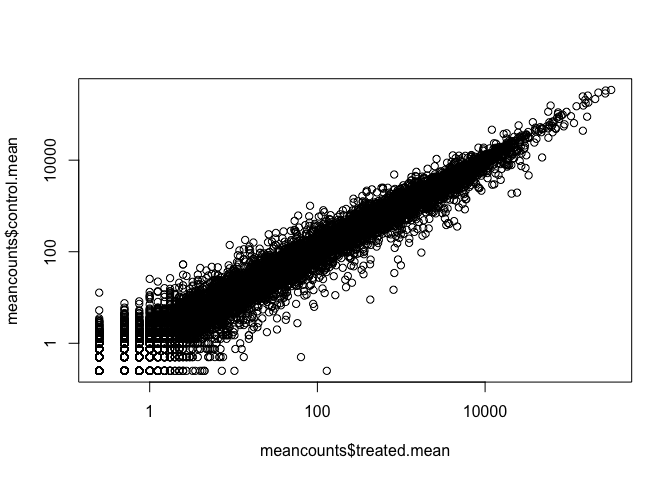

Class 15: Transcriptomics and the analysis of RNA-Seq data
================

\#\#Import countData and colData (make factors false (true is default) because dont want that as headings)

``` r
counts <- read.csv("data/airway_scaledcounts.csv", stringsAsFactors = FALSE)
metadata <-  read.csv("data/airway_metadata.csv", stringsAsFactors = FALSE)
```

dim is to find out no. of rows and columns and nrow and rcol is to separately count
-----------------------------------------------------------------------------------

``` r
dim(counts)
```

    ## [1] 38694     9

``` r
head(counts)
```

    ##           ensgene SRR1039508 SRR1039509 SRR1039512 SRR1039513 SRR1039516
    ## 1 ENSG00000000003        723        486        904        445       1170
    ## 2 ENSG00000000005          0          0          0          0          0
    ## 3 ENSG00000000419        467        523        616        371        582
    ## 4 ENSG00000000457        347        258        364        237        318
    ## 5 ENSG00000000460         96         81         73         66        118
    ## 6 ENSG00000000938          0          0          1          0          2
    ##   SRR1039517 SRR1039520 SRR1039521
    ## 1       1097        806        604
    ## 2          0          0          0
    ## 3        781        417        509
    ## 4        447        330        324
    ## 5         94        102         74
    ## 6          0          0          0

``` r
head(metadata)
```

    ##           id     dex celltype     geo_id
    ## 1 SRR1039508 control   N61311 GSM1275862
    ## 2 SRR1039509 treated   N61311 GSM1275863
    ## 3 SRR1039512 control  N052611 GSM1275866
    ## 4 SRR1039513 treated  N052611 GSM1275867
    ## 5 SRR1039516 control  N080611 GSM1275870
    ## 6 SRR1039517 treated  N080611 GSM1275871

have to check if ^ and bottom table columns (first?) and rows of bottom table matches
=====================================================================================

``` r
colnames(counts)
```

    ## [1] "ensgene"    "SRR1039508" "SRR1039509" "SRR1039512" "SRR1039513"
    ## [6] "SRR1039516" "SRR1039517" "SRR1039520" "SRR1039521"

``` r
metadata$id
```

    ## [1] "SRR1039508" "SRR1039509" "SRR1039512" "SRR1039513" "SRR1039516"
    ## [6] "SRR1039517" "SRR1039520" "SRR1039521"

Check for correspondence of metadata and countdata (check for *all*)
====================================================================

``` r
all(colnames(counts)[-1] == metadata$id)
```

    ## [1] TRUE

First task: find which columns in **counts** correspond to the control conditions (i.e. no drug!). Then we can calculate the mean count value for each gene.
------------------------------------------------------------------------------------------------------------------------------------------------------------

``` r
control.inds <- metadata$dex == "control"
control.ids <- metadata$id[control.inds]

head(counts[,control.ids])
```

    ##   SRR1039508 SRR1039512 SRR1039516 SRR1039520
    ## 1        723        904       1170        806
    ## 2          0          0          0          0
    ## 3        467        616        582        417
    ## 4        347        364        318        330
    ## 5         96         73        118        102
    ## 6          0          1          2          0

\#\# Calc. the mean counts value for all genes

``` r
control.mean <- rowSums(counts[,control.ids]) / ncol(counts[,control.ids])
names(control.mean) <- counts$ensgene
head(control.mean)
```

    ## ENSG00000000003 ENSG00000000005 ENSG00000000419 ENSG00000000457 
    ##          900.75            0.00          520.50          339.75 
    ## ENSG00000000460 ENSG00000000938 
    ##           97.25            0.75

Follow the same procedure for the treated samples (i.e. calculate the mean per gene across drug treated samples and assign to a labeled vector called treated.mean)
-------------------------------------------------------------------------------------------------------------------------------------------------------------------

``` r
treated.inds <- metadata$dex == "treated"
treated.ids <- metadata$id[treated.inds]

head(counts[,treated.ids])
```

    ##   SRR1039509 SRR1039513 SRR1039517 SRR1039521
    ## 1        486        445       1097        604
    ## 2          0          0          0          0
    ## 3        523        371        781        509
    ## 4        258        237        447        324
    ## 5         81         66         94         74
    ## 6          0          0          0          0

``` r
treated.mean <- rowSums(counts[,treated.ids]) / ncol(counts[,treated.ids])
treated.mean
```

    ##     [1]    658.00      0.00    546.00    316.50     78.75      0.00
    ##     [7]   6687.50   1785.75    578.00    348.25    185.50   2701.25
    ##    [13]    519.50    106.75    543.50      8.00   1679.75    895.75
    ##    [19]    826.00    173.50      3.25    678.50   1256.75   8456.50
    ##    [25]      2.25      1.75      4.75    126.00    348.00   9618.25
    ##    [31]    270.75    527.50   1769.00    268.25     61.25     10.00
    ##    [37]    101.00    896.00     79.00   4612.50   4372.50    285.75
    ##    [43]   2724.50     36.25     52.25   1867.50    293.50   1527.50
    ##    [49]   3593.00   1215.00      6.25    603.75   1080.00   1129.00
    ##    [55]     60.75   1673.00    461.50  11041.50     80.50    374.25
    ##    [61]   1429.25      1.25     11.00     10.25      0.25    153.75
    ##    [67]    405.00   1552.25      7.00      0.00    401.25    854.50
    ##    [73]      0.00   2410.00    745.50   1230.50    212.25      0.25
    ##    [79]    631.75    546.50      0.00     16.25    248.25    328.00
    ##    [85]     22.00     62.50    476.25    713.75    644.25    899.00
    ##    [91]    344.25    488.25   2516.00    163.50      9.00      0.00
    ##    [97]    307.50    257.75    375.75     18.50   1873.75    821.00
    ##   [103]      3.25    553.00    195.00   2719.25   1616.25      2.00
    ##   [109]    984.50   1447.75    816.25   5032.25      7.50      5.00
    ##   [115]   2705.50    362.75    165.75    114.75   3136.75      0.50
    ##   [121]      0.00    201.75      0.00      0.25    365.00   6700.75
    ##   [127]      1.00    567.25     20.50   1318.75     40.00    610.50
    ##   [133]      0.25      6.00    866.00    187.00    384.50    214.00
    ##   [139]    280.50   1346.25      3.75    882.00      3.75   1102.50
    ##   [145]      0.00    175.25     72.75     49.50   1089.00      1.25
    ##   [151]    194.25    274.75    999.25   2091.75     43.25   1013.00
    ##   [157]     31.50    523.25    165.25     19.75   1148.25     65.50
    ##   [163]      1.75      1.00    793.50      2.00    725.00      0.00
    ##   [169]   3992.00      1.25      2.75   6563.50      0.00    290.75
    ##   [175]    135.50      3.00      0.00      2.00      0.50    309.50
    ##   [181]      0.00     43.75    270.50   1853.00    644.25     26.25
    ##   [187]      9.25    599.00    698.00    638.25   1855.50      0.00
    ##   [193]    964.75    770.00    286.75     13.00      4.00   1484.50
    ##   [199]     20.75    353.50    354.00      4.75    549.75   2093.00
    ##   [205]      0.50      0.00      7.50   5247.00     17.50   2080.50
    ##   [211]    529.50   2724.75    109.00    929.00     13.00    137.75
    ##   [217]    169.25   3946.50    284.75      2.75   9544.25   1313.50
    ##   [223]     24.00     77.00   5727.00     21.00   1145.00    936.00
    ##   [229]    720.25   5338.50  10446.00  15369.25   2218.00  10538.75
    ##   [235]     13.25      0.00     31.75     16.50    192.00      6.25
    ##   [241]    438.50    831.25      7.75   2835.75   2606.00     12.00
    ##   [247]    158.25    838.25    215.00   2784.75   2082.25    754.50
    ##   [253]   4328.75      0.00   1222.00   1109.50     16.25     73.25
    ##   [259]      2.00   2323.75      0.50    246.50      0.50   3068.75
    ##   [265]     20.00    144.00     54.75    129.25      0.25    412.75
    ##   [271]    757.50   1689.75   1309.00     29.50   1393.75    483.50
    ##   [277]    662.00  14996.75    196.00      0.25   3807.50    630.00
    ##   [283]    215.50    138.50   1517.50      0.25    709.00    319.00
    ##   [289]    423.25   1691.25    423.25   4033.75     22.25    107.25
    ##   [295]    418.00   1729.00    389.50    220.25   1495.25   2569.50
    ##   [301] 273445.50    182.50   1205.00    874.25   1815.75      2.75
    ##   [307]      1.50    865.50      2.25    129.25   1118.50      1.25
    ##   [313]    919.25    754.50    134.75      2.00   1325.50      0.25
    ##   [319]   2657.25      0.25    643.50   6851.25    319.75   1979.50
    ##   [325]   2308.25    502.25   3259.25    122.00   1514.75    990.25
    ##   [331]   8505.00   1496.00   1217.25    205.75   2856.75    281.25
    ##   [337]    319.25   1014.25    545.00    204.00   1611.50    543.50
    ##   [343]   1231.50      7.50     99.00    824.25    142.00    444.00
    ##   [349]   3822.50     13.25   1418.75   1418.00    469.75    555.75
    ##   [355]      4.75    249.00   2108.75      5.25      3.00    332.50
    ##   [361]   4394.50      6.00    679.75    132.75      2.25   1544.50
    ##   [367]      0.00     62.25      5.50      0.25      0.00   1529.75
    ##   [373]   2569.25    682.00    320.50   3948.75    858.00     43.25
    ##   [379]     17.00   2931.00    826.50      0.00    258.25    377.50
    ##   [385]    267.75     58.75      9.25   3868.00      0.50      1.75
    ##   [391]    358.75      1.50   3075.75     34.00    832.00   2798.50
    ##   [397]    913.75   8666.00      0.00    284.75    240.75   4303.50
    ##   [403]    103.00    546.50     13.00    717.75      3.00      2.75
    ##   [409]    497.50     55.00   1626.75   1415.50    281.25      0.00
    ##   [415]  11955.25   2121.25      0.00      2.50    161.50   2786.00
    ##   [421]    167.00    694.00     78.50   2436.00   1853.25   2910.00
    ##   [427]   1504.50    885.75     59.25   1841.25    100.00    485.00
    ##   [433]    508.75   2165.25     24.75      5.50    828.00   2747.00
    ##   [439]   1380.50  12507.50     17.50    224.00      9.50    230.75
    ##   [445]   1515.00     54.25    401.00    297.00    321.75    640.75
    ##   [451]   3429.25   2201.00  74238.00    151.25   1122.00    189.75
    ##   [457]  20689.25     21.25    327.75      2.00    486.75    496.00
    ##   [463]    121.50      0.25   1573.50    433.75      0.25    276.50
    ##   [469]    661.75   1141.25     22.00    584.25   3444.25    447.75
    ##   [475]    318.00   3101.25   1333.75     87.50      0.25    115.50
    ##   [481]   1900.75    517.75    908.25    190.75     27.25    270.25
    ##   [487]  10056.75   1383.50    262.50     86.50   2258.50   1269.00
    ##   [493]    612.25    212.75   1558.75    171.25    514.50    390.25
    ##   [499]   1425.50   2449.50      6.75   1315.00    841.50   1424.25
    ##   [505]   1084.75   1025.00   1522.25     36.25   1435.50      7.50
    ##   [511]  12363.75     91.75    849.00    261.75   1519.75    392.25
    ##   [517]    375.50    398.50  21024.00      9.25   1039.00    895.00
    ##   [523]    805.25      0.00  58635.75    991.00   1327.00   1680.50
    ##   [529]      5.50      0.00     39.75    838.75      4.25     20.75
    ##   [535]      0.00    398.00    332.00     11.00    805.75    661.50
    ##   [541]    492.25    364.00     70.25     21.00    524.25    353.75
    ##   [547]   2400.75   1939.75      7.00   1028.00   5733.75   8237.50
    ##   [553]    558.25    120.75      6.75   1237.25    231.75   1043.25
    ##   [559]   1838.75     40.25   6243.25      4.75    314.00      2.25
    ##   [565]    369.25    189.50    673.75    257.75    544.75      0.75
    ##   [571]    742.75     29.75    700.75     34.25   1174.25      7.50
    ##   [577]    592.00    365.50   2529.00    183.50   1599.00    168.50
    ##   [583]    735.50      6.50    180.25    459.75   1350.25    958.75
    ##   [589]   1276.00      3.25      0.00     39.50     23.75      1.50
    ##   [595]    668.75   1683.50      0.00      0.00    219.00      2.00
    ##   [601]      0.00   1024.75   8037.00    465.50    443.25     46.00
    ##   [607]  17619.00     22.00    338.75    559.50   2126.50      0.50
    ##   [613]     25.25    573.75    739.50    302.75    834.00   2354.75
    ##   [619]    685.25     36.25   4503.75     17.75    801.25    240.75
    ##   [625]      1.50     13.75    323.00    470.25   1762.75    447.75
    ##   [631]      7.75  16989.25   1386.75      1.50    592.75    310.50
    ##   [637]    987.25    220.25    739.00   1356.50    401.50      0.50
    ##   [643]   2364.25     87.25    688.75      2.25   1611.25   4023.75
    ##   [649]   7068.00   4333.50    461.00     47.00   3000.50    145.25
    ##   [655]    144.75   6696.25   3434.25     93.00      0.25     24.25
    ##   [661]      7.50  24518.50   5924.25   9276.00    118.75   1653.00
    ##   [667]   1325.00    902.50      4.25     78.75   4431.75    319.25
    ##   [673]      0.25   1002.75  18895.75    320.50    274.50    596.00
    ##   [679]   8270.25    850.75    106.75    100.50    303.25      5.50
    ##   [685]    829.50      1.50   1280.00    445.50   2791.25    881.50
    ##   [691]     55.50     18.75    390.50    759.75    166.75   1364.75
    ##   [697]    194.50   1285.25      0.25    792.50    326.25    612.25
    ##   [703]    286.50   2101.25      7.25      3.25   4456.50      5.75
    ##   [709]    905.00    370.25     34.50    274.75     56.75     29.50
    ##   [715]   1724.50    688.50    534.75      0.00    734.75   2674.50
    ##   [721]    800.50      0.25     67.25   1037.75    470.50    222.00
    ##   [727]     11.75     44.75   1656.75    465.50    596.25   1660.00
    ##   [733]     13.50   3402.25      0.00      0.00     55.50   1566.75
    ##   [739]     21.50    717.75    544.75   4071.50      9.00   1443.75
    ##   [745]    528.00    207.75   1684.00   2496.25   1812.50    845.00
    ##   [751]   1931.25     89.75     34.00   2344.75    646.25     16.50
    ##   [757]      3.25    281.50   3155.50    140.25      0.00      0.00
    ##   [763]    223.75   1495.50     52.00    572.50    308.75   2453.75
    ##   [769]      0.00   1472.75     20.00      2.50      5.50   3248.75
    ##   [775]    261.75    632.50     27.00    471.25    733.25    469.25
    ##   [781]   1837.25     94.75   1278.00   9486.00   1930.75      3.50
    ##   [787]      1.50    652.75    508.75  10693.25   4034.25    338.00
    ##   [793]    522.50    245.25      2.50   1151.25    644.25     16.00
    ##   [799]    236.75   1262.75    309.75    308.50    179.00    697.50
    ##   [805]    318.75   1240.50    135.25    509.75   5441.75      2.50
    ##   [811]   5237.25      0.00   1585.00    966.00      0.00      0.00
    ##   [817]    336.50    422.00    462.00      0.25    508.50   1045.00
    ##   [823]    330.25    725.50   2495.25   3708.25     47.25    801.75
    ##   [829]      0.00    111.00   6203.00    609.50   1483.00    767.50
    ##   [835]    463.00   1227.75      5.25      1.50    994.00     25.50
    ##   [841]    153.75   1760.50      2.00    602.25   1242.25   1183.50
    ##   [847]   3568.00   1720.50    130.25      2.25  12634.25     22.50
    ##   [853]    288.00    292.75   7695.25     89.75    367.00   1908.25
    ##   [859]   2491.25   1274.75    578.50      0.00    675.75    701.25
    ##   [865]   3907.75     99.25    364.25   1138.25    295.00    449.25
    ##   [871]    376.75   1875.50      0.00    198.00      6.50   1321.00
    ##   [877]      0.00     31.50      6.75      2.50    206.00    794.25
    ##   [883]   3246.00   1272.50     96.25    366.00    304.50     38.25
    ##   [889]   8430.25   1482.50    501.00    295.25    123.00  12102.50
    ##   [895]    123.00     25.75    375.25   2155.25    336.25      4.00
    ##   [901]      0.25   1310.00    552.50    547.25   1269.25     41.25
    ##   [907]    267.25    717.25   3813.00    426.75    901.25    115.75
    ##   [913]    366.75   1932.50   3984.75   2842.50    549.25   1391.75
    ##   [919]    310.75  10580.50   4665.00      7.25     11.75    942.25
    ##   [925]     24.50      0.50    172.00   1952.00    232.00    676.50
    ##   [931]    272.50    683.75   1766.25  20522.00    894.25    634.00
    ##   [937]     78.00      0.25   1644.50    412.50      1.25     87.50
    ##   [943]    116.00      1.25    300.50   1359.00   1458.25    521.00
    ##   [949]    907.50   1266.50    673.25   1006.25    745.25   9865.00
    ##   [955]    769.75    769.25      4.25   1090.50      8.75    881.75
    ##   [961]    853.50    913.00    386.75     12.00    118.25      2.50
    ##   [967]     90.25      5.50   1185.75      0.75     16.25     14.75
    ##   [973]     23.00    486.25    619.50   1373.25     11.50    303.75
    ##   [979]    280.75   3085.50    206.75    734.25    607.00      2.25
    ##   [985]   1230.25   1647.50     17.25    215.25    317.75    191.25
    ##   [991]    463.00   1194.75   1019.50   2452.75    378.25   2042.75
    ##   [997]   4253.75   1151.75    933.00  17269.25    617.00   3837.75
    ##  [1003]    171.75    733.25    311.25  19373.00   1177.75    902.25
    ##  [1009]    364.75   1552.75    470.75    279.00   9712.00   1094.00
    ##  [1015]     12.50     14.75    380.00   2913.25     18.75    951.50
    ##  [1021]    752.50    188.75     14.75      1.25   3059.25    644.75
    ##  [1027]     70.25    596.00    580.50    841.00     14.25    427.50
    ##  [1033]    388.00    918.50    398.00   2025.50   1478.50   2017.50
    ##  [1039]    272.50   3405.25   1852.00    324.50    594.25    401.25
    ##  [1045]     84.50      0.25   1003.25   1244.25   7494.25    952.00
    ##  [1051]    675.25    148.00    222.25    557.25    139.50   1610.50
    ##  [1057]   1260.50    545.25   1959.75    486.25     21.25      0.00
    ##  [1063]     77.00      0.00    693.25     11.75     34.00      0.00
    ##  [1069]   1218.25   5260.00   2697.00   1267.00    303.25    216.50
    ##  [1075]   1449.25      3.75    135.00    160.50    524.50    662.50
    ##  [1081]      2.50   3784.00    177.25      2.25      7.25   1763.25
    ##  [1087]   1445.00    285.75    851.25    734.75    752.50    592.75
    ##  [1093]    817.75    794.50      2.75      1.25    481.50    880.75
    ##  [1099]   1350.25   2126.50    104.25      6.50      3.00     78.00
    ##  [1105]   3818.00    420.50   1289.25   1522.00    243.00     17.50
    ##  [1111]   2605.50   2362.00    356.50    871.00    401.50    331.50
    ##  [1117]    101.50      0.50   6111.50      3.25    875.00   8750.00
    ##  [1123]    267.00    319.00      1.50    444.25      0.00  18630.50
    ##  [1129]     83.00    302.75   1270.75   1547.50    265.50     11.25
    ##  [1135]    691.00   3518.75    717.75      0.00      1.25    191.00
    ##  [1141]   1981.00      0.25    564.50  11537.50      7.00  10711.25
    ##  [1147]  12750.25   1123.00      0.00    991.00  15047.50    142.00
    ##  [1153]    324.25   5858.25    695.75   5952.50     49.00   1607.25
    ##  [1159]   1045.00    337.50   1115.50   1276.25      0.00    741.25
    ##  [1165]   1509.25    773.00   1678.75     19.25  32835.25      1.50
    ##  [1171]    667.25     57.75    905.50   1512.75    359.75      8.50
    ##  [1177]  15404.00    850.00    226.25   1299.00    452.25    927.25
    ##  [1183]      0.25   1042.00    263.00    586.00   4899.25   1103.00
    ##  [1189]      1.50   3459.00    585.00    740.00    807.00   1159.00
    ##  [1195]    519.75    394.50     53.25    499.25   1438.75   3496.00
    ##  [1201]      0.50    578.25    313.00   3353.75    790.75   1555.75
    ##  [1207]     58.25    488.00   2751.75    651.50      6.75    183.25
    ##  [1213]   6456.25     65.25   3007.00   1407.00    398.25    272.00
    ##  [1219]      1.50    124.00     57.75     57.00    548.50      1.50
    ##  [1225]    473.75      3.50    653.75    622.00    306.75   2150.75
    ##  [1231]   2653.00      1.75    167.00   1587.25     30.00    674.25
    ##  [1237]   4671.00      0.00      1.00      0.75     41.00   3252.25
    ##  [1243]    282.25     25.25      0.00      0.25   1788.75   4119.00
    ##  [1249]    461.50    313.75   1688.50    551.75   1152.75    978.50
    ##  [1255]     19.50    418.75    220.25      3.50      1.75   1186.00
    ##  [1261]   1024.00     66.25   2287.25   5155.75   5054.50    327.00
    ##  [1267]    581.25   1340.00    495.25   2859.75     21.50   3402.75
    ##  [1273]   1919.75     29.50   1917.00      0.00  16449.00      9.25
    ##  [1279]   1599.00    134.50    207.75    759.50      3.00      0.50
    ##  [1285]      0.00      5.50    258.50     61.75   1622.25   3230.25
    ##  [1291]    393.25    437.50     18.00   2727.75    567.25   1152.50
    ##  [1297]    372.50      5.25      0.25   1938.25    203.50    264.00
    ##  [1303]      1.25      0.00   1078.25    643.00    934.00   1142.25
    ##  [1309]   7015.75   7220.75   3413.00      0.25      0.00   1292.50
    ##  [1315]   1734.75   2336.25 114832.00    217.50    651.00      0.00
    ##  [1321]     21.75   1278.25   8115.25   1048.00    353.00    885.75
    ##  [1327]      8.00      4.00      0.00    439.50    763.50   1083.25
    ##  [1333]    486.75   1779.75    538.50   1597.50   2070.25   1326.75
    ##  [1339]    464.00    283.00    104.00    725.00    304.50    172.00
    ##  [1345]    181.00     67.75   8104.00      3.50    384.00    235.00
    ##  [1351]    304.25    135.25    164.00   2375.50    134.75    597.25
    ##  [1357]    104.75      0.25      9.50    734.50   1299.75     64.50
    ##  [1363]    773.25      0.00    121.50    213.25      0.00    214.25
    ##  [1369]   3139.50   5255.75    613.75     40.00   2179.50   3514.50
    ##  [1375]   2083.50    557.75   3379.75     48.00      1.25      1.75
    ##  [1381]    350.50      0.25     70.25   2861.50    380.50    561.50
    ##  [1387]    346.50    201.50      0.25    359.00     17.00   5404.75
    ##  [1393]    757.75     20.25   2354.75    673.75   1515.75  16124.00
    ##  [1399]      5.00      2.25 158137.25    607.75      0.00   1963.00
    ##  [1405]    602.50    490.25    916.50    630.25     11.25   3294.50
    ##  [1411]     11.50    419.75   1021.75   1252.75    515.00    344.75
    ##  [1417]   1281.25    907.75     43.75   2205.75     55.25      0.00
    ##  [1423]   7437.50      0.00     18.75    634.00    170.00      0.50
    ##  [1429]      1.25      0.00      6.50   3513.50   1121.25   2481.00
    ##  [1435]    383.00    402.75     21.50   1590.25      8.25    946.25
    ##  [1441]   4982.50     41.75      0.00     11.50   1109.75    268.50
    ##  [1447]      8.50    846.25      6.00    300.25    569.50     21.00
    ##  [1453]     60.50   5266.00   1040.75      5.25    545.00   6901.75
    ##  [1459]    442.25   3822.50     55.25     81.25      5.00    417.50
    ##  [1465]      0.50   1725.50     48.75    934.50     51.25    325.00
    ##  [1471]      0.00    174.75      0.00   2040.25   1545.00   1839.50
    ##  [1477]   2353.00   6413.75     51.50   4999.75   1491.25    498.25
    ##  [1483]   1554.00     15.50     18.25      4.75    761.50   1295.75
    ##  [1489]      1.00      0.50    118.50   1346.00   1167.00    225.00
    ##  [1495]   3366.25      0.50    641.50    156.50      0.50    423.25
    ##  [1501]   2329.00    478.25      0.00      0.25      7.75    538.00
    ##  [1507]   2021.25    519.00   1157.25    102.25  13048.25    141.00
    ##  [1513]   1984.50      0.25      0.00    111.75     48.50    490.75
    ##  [1519]    356.75    270.00      1.50      3.25    298.75     53.00
    ##  [1525]   1295.75      4.50      7.50   2595.75    456.00     18.25
    ##  [1531]    110.50      9.25      0.25      0.50    764.00   1919.00
    ##  [1537]   2840.75    263.75      3.00    134.75    230.75    197.50
    ##  [1543]    361.25    979.50      0.25   1493.25     17.50      7.75
    ##  [1549]    360.50    261.25    225.25   1592.00      4.25    851.25
    ##  [1555]    614.75      5.25     31.00   1429.25   6297.75     10.50
    ##  [1561]     18.00    460.50    423.00    690.25    179.50      5.75
    ##  [1567]    447.00    731.75    290.25     37.25      6.00    490.75
    ##  [1573]    224.50    476.75      0.50  12217.00      0.25   1421.00
    ##  [1579]   7277.50   1060.25   2429.75   1127.00     12.75    195.00
    ##  [1585]    417.00    499.25    378.00   1124.75   2010.50   2070.25
    ##  [1591]      0.25   4801.50   6087.50     15.50    275.75   1230.75
    ##  [1597]    343.75    236.50    117.50    806.75   1104.25    469.25
    ##  [1603]      0.25   1009.25    102.50    195.50    147.50     83.50
    ##  [1609]     48.00    192.25    414.25   8043.50   8024.00    561.50
    ##  [1615]    811.75    456.00    514.50   1888.00   4900.50    512.50
    ##  [1621]    930.25      2.00   2935.75   3330.75  26076.50    300.75
    ##  [1627]      4.00   1239.50   2515.00      3.50   2562.00   4415.75
    ##  [1633]    275.75   1131.00    581.75      9.00    632.75   2359.75
    ##  [1639]      5.00   4893.25    225.50   1139.50  11132.00   3233.00
    ##  [1645]    427.50   2714.75     81.25     26.75    357.50   1256.75
    ##  [1651]   1024.50    736.75    293.00    487.75    555.00   1783.25
    ##  [1657]     59.25    965.00    639.25     30.75      0.50     72.00
    ##  [1663]    289.50   2149.75   3135.25    390.25   9583.00      4.75
    ##  [1669]    518.00   1213.00     12.00   2001.50      8.75    125.00
    ##  [1675]    750.50    319.25    968.50   1128.75      5.00   1538.75
    ##  [1681]   3156.75   2536.75   1327.75    984.75      3.25    540.50
    ##  [1687]    495.50      2.50   2210.50      0.00   1085.25      2.25
    ##  [1693]    760.75    553.00      0.25   1073.25      0.25     14.50
    ##  [1699]    482.75   5302.00    140.25    984.25     51.25    547.50
    ##  [1705]      4.50     35.00   8167.50    304.25    706.75      0.50
    ##  [1711]     43.25    320.25    740.25   1511.25    194.25   1505.75
    ##  [1717]      5.50 146158.25   1652.50   1394.00    205.00   1153.50
    ##  [1723]   5437.50      0.25   1175.50    741.50   1827.25    403.00
    ##  [1729]      3.25 123061.50      1.50    747.25      3.50    721.50
    ##  [1735]    297.25    901.50   7715.50    114.25    296.25   1887.25
    ##  [1741]   8742.00    369.25   4388.25   1360.25  14624.25   1218.00
    ##  [1747]     73.00      4.50   1115.50     11.00    171.00    489.25
    ##  [1753]    158.00    322.75    193.75    250.00      3.25    161.75
    ##  [1759]    865.00      0.50    237.00   1041.75   2598.50   1942.50
    ##  [1765]    819.50    618.50     42.25      4.75    180.00    157.00
    ##  [1771]    223.75   1283.50      5.50    481.25   1137.25    122.50
    ##  [1777]     24.75    503.00    474.25      1.75     71.25    368.75
    ##  [1783]    471.75      0.00    120.25   3043.50    183.25      2.50
    ##  [1789]   4256.50    895.75     72.25   1727.50    390.25     75.50
    ##  [1795]     44.25   3467.75    225.75      0.00   2612.25    593.75
    ##  [1801]   2231.50      1.75   2578.00  14909.50      0.00    523.25
    ##  [1807]     74.50    436.00    282.50   2145.75    751.75   1036.50
    ##  [1813]   2440.75     37.25    498.00      3.00      0.00    165.75
    ##  [1819]     13.25   2709.00  39991.25   3670.50     17.25      8.25
    ##  [1825]    521.75    194.25      5.25   3840.50    594.75    548.00
    ##  [1831]   1856.00     19.75   2409.75   1203.25    805.25    528.50
    ##  [1837]    712.75      1.75   2677.75    493.75     23.50      0.75
    ##  [1843]   9404.50    139.50    235.75     47.00      4.75   2321.00
    ##  [1849]     33.00    222.00    291.25    456.50     26.00     54.25
    ##  [1855]    576.75    459.00   1208.75  25929.25    648.75   1027.00
    ##  [1861]   1607.75   3485.75    829.75    810.00      0.25   1092.00
    ##  [1867]    358.50    587.00   1182.25   1199.75    310.00   1319.50
    ##  [1873]    829.00      1.75      0.00    757.25    131.00    575.75
    ##  [1879]   1915.25      0.00    914.50     83.25     14.50    239.00
    ##  [1885]    186.75   1156.00   1256.75    471.50   2420.00   3903.00
    ##  [1891]      1.75    142.25    621.50   1923.50    408.00   1663.00
    ##  [1897]   2312.75   5368.00     23.50   2952.50   1358.00      1.50
    ##  [1903]    324.00    572.00   1387.00    603.50      0.25   4341.50
    ##  [1909]    174.25      9.50    224.00     13.75    161.50  38659.00
    ##  [1915]     11.00      0.00    838.50    565.50   1063.50      1.50
    ##  [1921]     31.50   2681.50    393.25     28.25   4671.50      0.25
    ##  [1927]   1066.25   1362.00     31.25   6003.00     53.00   1600.25
    ##  [1933]      2.75   1213.50     26.50    784.75     74.00    826.25
    ##  [1939]      0.00      3.75    243.25     22.50     66.75      7.50
    ##  [1945]    386.75     42.00 170242.50      1.50   1368.50    399.00
    ##  [1951]    450.50      0.00      0.00      0.25   2114.25    259.00
    ##  [1957]    372.50    620.75   1097.25    326.75   5708.50   5016.75
    ##  [1963]      4.50   2372.00   1521.75     78.25     12.50    695.75
    ##  [1969]      0.25      0.25     52.50   2054.75    395.50     77.50
    ##  [1975]    247.50   1231.25      2.25    624.75      4.75   1524.25
    ##  [1981]  15007.00    861.25      4.00     24.00    444.25     55.50
    ##  [1987]    356.50   3404.00     92.50    261.00   1551.25     12.75
    ##  [1993]   3134.00    512.00     10.50   1887.75   2544.25   1548.00
    ##  [1999]     50.25    482.50      0.00     26.25      0.00     34.50
    ##  [2005]    149.25    543.75    707.75   1705.75   2663.75    732.75
    ##  [2011]    334.25    278.50    501.00    211.25      0.25   4620.50
    ##  [2017]     93.75    164.00    894.75   2102.50    898.25   1677.75
    ##  [2023]      5.00    624.25    320.00     90.75      6.50    266.50
    ##  [2029]    170.50   1687.75    375.25      6.50      8.75      1.50
    ##  [2035]      2.00     67.25      0.00    131.25     66.75      0.00
    ##  [2041]   2534.25    219.75    501.75      0.00      0.00    398.50
    ##  [2047]      0.50      0.00      0.25   4646.00    819.75   1006.00
    ##  [2053]    257.25      0.25    458.50    643.25   3962.75    121.00
    ##  [2059]    105.00      0.00   8923.50      0.50   1073.00   2654.25
    ##  [2065]    120.00    207.00    541.50   1558.75    276.00    817.75
    ##  [2071]     11.00   5703.50    504.00   3455.00     48.00    274.75
    ##  [2077]    350.50    604.75    347.25   1187.75    649.50   1623.25
    ##  [2083]   6121.50     19.25    311.50     94.00      0.25    352.75
    ##  [2089]   5042.25    467.50    365.00    192.50   2716.00   1556.25
    ##  [2095]     24.50   1979.50    310.75     62.50    384.00    567.50
    ##  [2101]    558.00      0.00      0.00   2494.75    621.50     82.00
    ##  [2107]      1.25      0.00    205.25      3.25   2885.00    503.50
    ##  [2113]    619.50    671.00    501.75    609.25    686.25      2.50
    ##  [2119]    890.25   2624.25    581.75     54.25      1.75     52.25
    ##  [2125]     57.00    538.25   1840.00     10.00   1647.50    167.25
    ##  [2131]    449.00    549.25   1202.75    452.50   1904.50      0.50
    ##  [2137]    903.50   1467.00   1667.50    108.25      5.00    399.75
    ##  [2143]     62.25      1.00      9.75   1361.25     33.25    271.50
    ##  [2149]     18.50      0.00   2100.25    412.25     90.25   2000.00
    ##  [2155]    948.25    286.25    277.50      1.50   2705.75    858.50
    ##  [2161]     10.00    118.00    742.75   1209.00   3199.25     64.00
    ##  [2167]     89.00   1011.00    114.75    386.25      0.00      1.25
    ##  [2173]    337.50    207.50      0.00     63.75     35.25   1254.00
    ##  [2179]     90.25      0.25     12.75    684.25    903.50    116.50
    ##  [2185]      0.25  15927.00    541.00   2430.00      0.00    270.50
    ##  [2191]    343.25   4370.25    702.25    149.00      2.75      0.50
    ##  [2197]    254.75   6646.50   1185.50    710.75    470.75      0.50
    ##  [2203]     33.25    205.25     75.50   1431.00      3.50      6.75
    ##  [2209]     10.00      1.00      0.00   1479.00      4.25  11906.25
    ##  [2215]     64.75     96.50    158.25    429.00    751.00      0.75
    ##  [2221]   1129.25   1056.75   1307.00   1622.00    970.25   1573.50
    ##  [2227]    150.50  37119.25   1234.75   3228.75   5516.50  14515.25
    ##  [2233]    236.75      1.50      1.50   1455.75    278.25   1194.25
    ##  [2239]    228.25      1.25   1169.25    622.50   1043.00     34.75
    ##  [2245]    462.00      0.50   1334.00    201.75    809.50    241.00
    ##  [2251]      1.00    932.25   1981.75     14.00    655.00    824.50
    ##  [2257]      0.00      0.00      3.50  30081.25    227.50   4622.25
    ##  [2263]    592.00    558.00    816.50   1498.75   1042.75    155.50
    ##  [2269]     13.50    856.75    124.00  46906.75      1.00    792.00
    ##  [2275]   1078.25    466.75      0.25   3524.00    895.75    764.50
    ##  [2281]    514.75      0.00   1692.50      0.25      0.00    239.75
    ##  [2287]      0.50    514.25    305.25   5517.00      7.25    641.25
    ##  [2293]   2599.50    398.50     16.00   2281.25   4205.50    260.25
    ##  [2299]   1732.50    868.50    367.50    835.50    670.50   1645.50
    ##  [2305]    698.00    308.25     10.00    349.75      2.75   1813.00
    ##  [2311]   1808.00    704.00    468.00      0.00      0.00      0.25
    ##  [2317]    885.00    769.75      6.75     99.75     18.00     71.50
    ##  [2323]   1057.00    254.00   1567.50   1154.25     48.00    763.00
    ##  [2329]    909.50    913.00     60.25   2487.00    204.75    949.00
    ##  [2335]      2.75      5.75    186.00      0.25    869.00   2139.00
    ##  [2341]    238.75    174.50    292.75    422.25     15.00   1138.00
    ##  [2347]    497.75      1.75    898.25    541.00   1246.25    175.75
    ##  [2353]   1151.25      0.00    360.75    846.25   1310.00    498.00
    ##  [2359]    371.75     43.50     64.75    973.25   8774.00    988.75
    ##  [2365]   4822.25      0.25   4139.75      0.00      6.75   1612.25
    ##  [2371]   1153.50   1160.50      1.25   1179.25    358.50   2227.00
    ##  [2377]     92.25    392.25     82.75   1020.00    338.00     75.00
    ##  [2383]    990.25    130.50   1624.50   2270.00   3559.25    503.75
    ##  [2389]   1399.75   1479.00   1846.50    205.75   1868.75    431.50
    ##  [2395]     23.25    938.00      0.00   1634.50    339.00    474.50
    ##  [2401]   1088.00   1047.25    699.00     94.75    557.25    240.25
    ##  [2407]     34.50   1319.25   3844.50   1104.75   1707.00    277.25
    ##  [2413]   3202.50   5905.00    523.25    536.00      0.00      2.00
    ##  [2419]   2254.25   3601.00   1339.25    219.50     35.50    356.50
    ##  [2425]    116.75    666.25    493.25      6.00    731.25      5.75
    ##  [2431]      0.50      3.75    674.25      4.50    717.25      2.25
    ##  [2437]     16.00    326.25    784.25     10.50   1439.75    367.00
    ##  [2443]    217.00    597.50      0.75    443.00   4145.50   2033.75
    ##  [2449]    819.25   2363.50   1980.75      8.75    639.50      0.25
    ##  [2455]    400.00   1769.25      6.00      0.00    409.50    482.50
    ##  [2461]   1481.25    745.25     63.75      0.25      0.25   1547.75
    ##  [2467]      0.25      1.25      0.00     17.75      7.25    321.00
    ##  [2473]    521.50      5.25   1874.50     57.75   3102.25    343.75
    ##  [2479]    128.75      1.25    181.50    973.75   1751.00      4.50
    ##  [2485]      0.50      6.00      0.50   2523.25      0.00   2625.50
    ##  [2491]    254.50      0.25     14.75    484.75     49.50      0.00
    ##  [2497]      0.00      0.00    808.75  19595.50      0.25   1919.00
    ##  [2503]     91.50    758.25   2139.50  24068.25      0.00   2400.25
    ##  [2509]     51.00   1184.50   1096.75    779.75   1941.75    975.00
    ##  [2515]    254.50    450.50      1.25    343.25     39.50    593.25
    ##  [2521]    227.75   2269.25     10.75      0.00      0.00   4402.50
    ##  [2527]      0.25      0.00     84.00      0.00   1342.00      0.25
    ##  [2533]      0.00    285.75      9.25    368.25    292.75    563.25
    ##  [2539]      0.25    226.00     14.25    371.75   2746.00      3.50
    ##  [2545]    958.00      1.50    478.75    227.50   1370.75   2813.75
    ##  [2551]    207.00   1281.00   1709.50    140.25   6984.75     90.25
    ##  [2557]     17.25    665.75   1105.00    278.00     17.25    157.25
    ##  [2563]     26.25   1526.75      0.50    616.00   1661.75    485.50
    ##  [2569]   1596.75    199.25      6.25   2508.00      4.00    516.00
    ##  [2575]    176.25   2627.25    689.75      0.00   3324.75    220.00
    ##  [2581]   2395.00    379.75      0.25    209.50      0.00      3.00
    ##  [2587]      9.75    503.25    550.00      0.00   1130.50    271.00
    ##  [2593]    237.00   1241.50     56.75      0.00   5684.25      3.75
    ##  [2599]    912.50   2146.75   1612.00     11.50      0.00    466.75
    ##  [2605]    230.50      3.00     26.25   1143.25      0.00      0.25
    ##  [2611]   7547.50    652.00     25.25    477.50   2806.75      5.50
    ##  [2617]      5.25     78.50   1965.00      0.00    159.50      0.00
    ##  [2623]    125.50    651.75     54.00     40.25    397.50    413.50
    ##  [2629]      0.25      6.25    958.75    362.50      5.50   9768.75
    ##  [2635]      0.00   2203.25   1141.00    175.75    607.75   3115.50
    ##  [2641]   2560.00      0.00    488.00    167.25   1609.75   1322.25
    ##  [2647]      4.00      0.25   1226.25      0.00      1.00  14156.50
    ##  [2653]      1.50    156.50      2.75    461.00    221.00    199.00
    ##  [2659]      0.00   2695.50   3842.25    102.00    963.25    403.75
    ##  [2665]     14.00     45.75     73.75     10.00    311.25    271.75
    ##  [2671]   2531.00    273.00    213.00    135.25    366.25      7.50
    ##  [2677]    577.50     38.50   2187.25      1.00    198.00    683.50
    ##  [2683]    271.25   1449.00     20.50   2419.75    915.50   1464.25
    ##  [2689]    122.25     17.00   2936.25    728.50    175.75     68.75
    ##  [2695]   1470.50     67.00   1951.25    593.25    568.00    675.50
    ##  [2701]    667.75      0.00     98.00   1851.75   7362.75   1005.50
    ##  [2707]      0.00      1.00   1202.25    952.50    305.75    132.50
    ##  [2713]      5.50   2134.00     78.00     13.00      0.00   1403.50
    ##  [2719]    384.25   1270.50    679.00    699.00     43.75   2191.75
    ##  [2725]   2085.50    809.75      0.50   1408.00    128.75     22.25
    ##  [2731]      6.25     88.00      0.00    632.25    221.50    983.00
    ##  [2737]     25.00     53.50    219.25    708.75    870.50    130.50
    ##  [2743]      0.50    257.00    151.25   1330.00    164.50    668.75
    ##  [2749]    903.25     16.75    221.25   1438.50     47.50    610.75
    ##  [2755]   2370.75   1005.25      3.00      0.00    669.75   1249.25
    ##  [2761]    179.75    545.00    774.50    667.50    374.50   1062.00
    ##  [2767]      2.25    390.50    639.50    379.25    399.00    116.75
    ##  [2773]   2583.25    960.75   4864.75   1994.75    300.00      0.00
    ##  [2779]   1502.00   2072.00     39.00    323.25   1775.75    313.00
    ##  [2785]    245.00   1855.25    100.25    114.50    294.25    351.00
    ##  [2791]   1165.00   1312.50     37.00    176.75   2257.50      0.50
    ##  [2797]      8.50      7.75   1308.50    623.75   3693.75   2500.25
    ##  [2803]    167.00    606.00   1871.00      0.00    330.00   1730.50
    ##  [2809]    942.75      0.50   1038.50    357.75    254.50    323.75
    ##  [2815]      5.25    618.00     68.50      0.00     30.25   2750.00
    ##  [2821]    535.50    958.00    207.50    268.50   1149.75    610.75
    ##  [2827]   4199.75    894.00    442.50    251.50      8.25      6.75
    ##  [2833]      4.50    334.00   1593.50      0.00   1725.50    294.00
    ##  [2839]      0.00    676.00     40.75    593.00    304.75    504.75
    ##  [2845]   2099.50    351.75    229.25    672.25     54.00     25.00
    ##  [2851]    143.75   1955.00    905.00      0.00    425.25   2170.00
    ##  [2857]    312.00 164711.00    562.50     67.75    691.75   1126.50
    ##  [2863]  12479.00    102.75    665.75      1.25   1389.50      2.00
    ##  [2869]      2.25    586.25   1499.75    173.50    579.00      5.25
    ##  [2875]    141.75    629.50   1772.00      1.75   1012.25     11.50
    ##  [2881]    459.75   1915.00    216.00    308.00    316.50    384.75
    ##  [2887]   1549.50    301.00    419.75    251.25      0.50      0.50
    ##  [2893]     17.25    253.00    252.50     67.50    666.75    719.00
    ##  [2899]   1392.00    825.00     19.50   2836.00  16407.00   1177.75
    ##  [2905]    501.25    207.75   1106.50   1031.00    783.75      0.50
    ##  [2911]      0.00    579.50    107.00   3046.50   5041.00    549.50
    ##  [2917]      0.00    354.25   3888.25    368.75     14.50      3.00
    ##  [2923]    558.75    370.25     45.50    624.00     24.50    209.25
    ##  [2929]      0.00   4102.50    321.50    222.50     73.50   2956.50
    ##  [2935]     10.00    385.25    693.25    839.25    424.50   1350.75
    ##  [2941]    432.25    566.75    455.75    269.75   1329.50     74.25
    ##  [2947]    171.00   2213.75    345.00     72.75   1215.25    919.00
    ##  [2953]    259.75    403.50      0.00   2179.00      0.00   3147.25
    ##  [2959]   9720.25   3133.50      3.50     12.00   7359.75      2.50
    ##  [2965]   2277.00      3.25      0.00    768.75   1423.25    239.00
    ##  [2971]      0.25      0.00      1.00     69.25      6.50   4330.00
    ##  [2977]   2111.00    128.25    400.50     27.25    524.00   2839.25
    ##  [2983]    609.50      1.50    880.25    204.50     36.25    445.50
    ##  [2989]    407.75    587.00     21.25     69.75      7.50     17.25
    ##  [2995]    547.25     17.50      2.50      7.75  10652.75    433.25
    ##  [3001]    516.00      0.00      0.00   2513.00      2.00      0.00
    ##  [3007]   1235.50      5.00     13.25    426.50   1791.00   6369.50
    ##  [3013]     14.50   1034.50      5.50      0.00    663.25      0.25
    ##  [3019]    355.25    966.25    434.25    107.00     40.00     14.00
    ##  [3025]     15.00    473.00   1714.00   1684.50    234.75    161.00
    ##  [3031]     37.50      1.75    649.00      1.00    708.50    206.75
    ##  [3037]   1657.75      4.75     20.75     32.75    437.25     40.25
    ##  [3043]   1256.75    757.25    625.00   7969.00    681.50      0.00
    ##  [3049]    483.50    177.00      0.00      3.25   3528.50   2590.50
    ##  [3055]   5619.75    176.50    272.25   2281.50      1.25    182.25
    ##  [3061]      0.00    961.75     54.50    217.25      0.00   2810.00
    ##  [3067]      3.00   6314.00    428.00      3.25     73.00    547.25
    ##  [3073]    370.00   5056.25    735.00    219.25   1679.50    619.75
    ##  [3079]    605.50      0.00   2811.00      2.50    619.25      5.75
    ##  [3085]      4.50      0.00     38.00  15512.50   3574.00      0.25
    ##  [3091]     96.00    641.75      1.00      1.50     12.25   1028.75
    ##  [3097]   1096.00      3.25   2551.00   2200.00   1988.75      2.25
    ##  [3103]   1133.25   4035.25      0.75      0.00   4147.50   3035.00
    ##  [3109]    944.50    446.50     11.50      0.00    835.50      3.25
    ##  [3115]    377.00    103.00      0.00    241.00    115.25      0.50
    ##  [3121]      0.00      0.75    329.50     48.50    456.00    201.25
    ##  [3127]    932.50      3.25     72.50      0.00      0.00    592.50
    ##  [3133]    316.50    958.25   6372.50   2532.50   1086.00     51.50
    ##  [3139]    216.50      2.25      0.00    994.25      8.50      2.25
    ##  [3145]    382.25     41.25     75.00  12095.00      5.50      3.50
    ##  [3151]    380.50   1785.00     32.75     39.50     96.00    435.25
    ##  [3157]    703.50      8.75     17.50   1527.25    459.75     14.00
    ##  [3163]      0.50    343.75    894.75     52.25      0.00      0.00
    ##  [3169]     82.00      4.25   1223.75     20.75   1453.75   5624.75
    ##  [3175]    493.50      6.00     83.00     61.50     11.50    603.50
    ##  [3181]    940.50    990.75    242.25    117.00    281.50     10.75
    ##  [3187]    619.50     41.00    529.00    866.50     39.75    367.25
    ##  [3193]    352.00    466.25   1158.50    959.50    471.25    490.50
    ##  [3199]    456.25   3254.50    328.50      0.25      0.75   1219.50
    ##  [3205]   1552.00   2170.75     63.50    137.50    363.00     29.00
    ##  [3211]    463.75      3.25   4615.75    146.50   4365.00    226.50
    ##  [3217]    860.00      0.25   1546.75    210.50   1068.75      0.25
    ##  [3223]     41.25      3.75   1330.00   1756.00  14183.00   1090.75
    ##  [3229]     36.50    736.25      0.00     59.00     27.75   2353.50
    ##  [3235]     44.50    139.25      5.00    127.75      0.25    424.50
    ##  [3241]    725.75      6.75     11.00     29.25    507.00      0.25
    ##  [3247]   3140.75      0.00   1231.75   3381.00      1.50     10.25
    ##  [3253]    862.25     71.50      1.75   1089.75    570.25    168.50
    ##  [3259]    259.00   2589.75      3.00   1226.00    173.25      0.00
    ##  [3265]    145.50    366.75   2001.00      1.50   9660.75      3.50
    ##  [3271]   1907.00    803.50    163.75     79.00   2683.00   2799.50
    ##  [3277]    854.25    186.00      3.75   1144.25   1565.25      4.50
    ##  [3283]      0.00    236.00      8.75      0.25    282.00      0.00
    ##  [3289]   6811.00     18.50      0.00    599.75    224.00    985.75
    ##  [3295]    142.25    325.50   8622.00    910.25      5.50    561.25
    ##  [3301]   1924.50    106.50    833.75    174.00      0.00    252.00
    ##  [3307]      0.75    542.75    226.75   1534.75     70.75    174.00
    ##  [3313]    714.75    251.50    343.50     13.00    253.75      8.25
    ##  [3319]      1.00     16.25   1900.50      0.50      0.00   1710.50
    ##  [3325]    732.00     11.25    815.00    693.00    901.00    600.00
    ##  [3331]    384.50    483.50    625.00   3150.00     77.50   2819.75
    ##  [3337]   1491.00  11093.50    949.00      0.25     25.75    650.25
    ##  [3343]   2104.00    668.25      0.00   1889.50   6148.25   1093.50
    ##  [3349]     12.75    679.00      0.00   1128.75    138.25     15.50
    ##  [3355]   1664.00    244.25   2384.00   6649.00   1448.00    178.50
    ##  [3361]     12.50   3720.75    849.25    226.75   1612.50   2045.50
    ##  [3367]    762.75    743.75      0.00   1391.75    537.00      6.25
    ##  [3373]    365.50      0.25    418.50   2917.25   1073.25    459.50
    ##  [3379]      0.00      0.00    201.75    929.75   1646.50    352.50
    ##  [3385]     25.00   1744.50      3.50    915.00    757.75      2.75
    ##  [3391]     30.75   1156.00      0.25    925.50   1288.50   1638.00
    ##  [3397]      0.25    319.75   2366.75      1.25    828.50    591.50
    ##  [3403]   2049.25    849.50    352.25   3149.00      0.25   4144.50
    ##  [3409]   1331.25    236.25   1658.50    218.00    228.25   6042.75
    ##  [3415]   1070.25   3457.50    117.25      0.00      2.25     20.75
    ##  [3421]   1947.50    710.00    608.25    879.00    673.50  12050.75
    ##  [3427]   1587.50   9520.25      0.75     21.75     93.50    876.00
    ##  [3433]    491.00   1394.75    543.25    200.25    774.50     26.25
    ##  [3439]    355.00      8.50   4902.00      5.75   1584.75   1600.00
    ##  [3445]   1149.50   1060.75    625.00   7726.25   1274.75      0.50
    ##  [3451]    138.00   3122.00   2084.00    284.75    534.75      0.75
    ##  [3457]    196.00   2094.75      3.25   2392.50   5037.75     40.50
    ##  [3463]    137.25    870.00    612.75    270.50    678.25    205.25
    ##  [3469]   1474.00   1003.25    379.75    501.75    307.75     12.00
    ##  [3475]   9446.50   1725.00    240.25    672.50    519.75    137.50
    ##  [3481]    691.25      0.25   1298.25   1254.00   1472.00   1351.00
    ##  [3487]    384.75   1493.00    824.25   1918.00    273.25   9361.75
    ##  [3493]   3184.75     13.00    632.00    197.00    772.50     14.25
    ##  [3499]    695.50      1.50      0.00      0.25   2622.00   1391.50
    ##  [3505]  17337.50    471.75     26.00   2162.50      0.50   1740.00
    ##  [3511]   1869.75     42.00     28.75     13.75      4.75    340.00
    ##  [3517]    160.25     41.25    979.25    802.25      0.50   1553.25
    ##  [3523]      0.00     47.00   5745.00    648.25    302.00      0.00
    ##  [3529]    777.25    127.25      0.00   1521.00   1190.50    354.75
    ##  [3535]    171.50    210.00    275.75   1032.00   1913.75    101.25
    ##  [3541]     90.75      0.00   7118.25   1359.25    532.75    128.25
    ##  [3547]     12.75    754.25    414.50    650.75      2.75    361.00
    ##  [3553]   8875.50    714.75   1692.00    147.75    578.50   1414.75
    ##  [3559]    707.75      3.25   2932.25     11.75    454.50    143.25
    ##  [3565]    628.75  15373.75    179.00    294.00   1047.50   3524.00
    ##  [3571]      3.50      6.00   1105.25      2.50      0.00    215.50
    ##  [3577]      0.25    284.00    599.25   3453.00   1677.25     26.25
    ##  [3583]    420.50    706.50   1433.00      0.50   1461.00      4.00
    ##  [3589]   1679.50  60447.25      8.00      5.00    322.00   9462.75
    ##  [3595]   2436.25     80.00     50.50   3143.25    589.50   2970.00
    ##  [3601]      0.25    102.25   2827.25   2503.00      0.00   1072.00
    ##  [3607]     79.00    104.50   9988.00     77.25   1441.50   3272.50
    ##  [3613]      0.00   2507.00    266.50    595.25     68.75    387.75
    ##  [3619]   4863.25      1.75      1.00    267.00     45.50    517.50
    ##  [3625]    568.50     16.75   1181.00    450.25    225.25    624.25
    ##  [3631]   6349.25      0.25    387.00    371.75   3992.00   2142.75
    ##  [3637]    784.25      0.00    759.75      0.75      3.00   1042.25
    ##  [3643]   1769.00      0.00      0.00   1301.50    824.00      1.50
    ##  [3649]      0.00      0.00    284.00      0.00     39.25    652.50
    ##  [3655]      0.75    952.75      2.00   1496.00   5626.25    539.50
    ##  [3661]    734.00    380.00      0.00    829.00    633.75    288.25
    ##  [3667]    782.00    342.00      0.00   7289.25   5592.25   2269.75
    ##  [3673]      0.25    376.25    128.75    178.50   1478.50    113.50
    ##  [3679]    485.00   2550.50   4141.50    199.00    924.00    915.00
    ##  [3685]    146.00    355.00     25.75    401.25     14.00    725.00
    ##  [3691]   7261.50    739.00      6.75   1248.00    296.00    444.00
    ##  [3697]   1591.25      4.00    501.25     31.50    301.00   1326.25
    ##  [3703]   1586.25     72.25     64.75   1927.25    155.50      6.25
    ##  [3709]   2036.00      0.50    532.25   5599.75     42.75    808.75
    ##  [3715]    124.50    532.50   1369.25   1286.00     36.00    436.25
    ##  [3721]      1.50    135.25      2.75  18043.25      1.75    810.75
    ##  [3727]    377.25   1693.00    350.75     87.75    842.75    827.25
    ##  [3733]   2232.25   1463.75    408.25    131.50    211.50    586.25
    ##  [3739]    224.50   1478.25      4.00      1.00      0.00    644.25
    ##  [3745]   2788.75  14958.75    382.25   1236.50   2348.75      0.25
    ##  [3751]     23.50    404.00    569.50      6.25    282.75     10.00
    ##  [3757]    812.50   3062.00      0.25      0.00      0.00    812.25
    ##  [3763]   1653.75    454.25  27495.25      0.00     51.50   1375.25
    ##  [3769]   1644.75   3126.00      1.00   1006.75    103.00   3058.00
    ##  [3775]    152.25    672.50    448.75    231.75    371.25    349.75
    ##  [3781]      0.25    411.75      0.00   1304.25    690.00    658.75
    ##  [3787]    426.00    344.50    793.00    160.50  15984.00     60.25
    ##  [3793]      1.25      7.50      0.25     10.75   2729.75    764.00
    ##  [3799]   5528.75    652.25   2612.50    472.50   1150.75    191.00
    ##  [3805]    387.00   1408.50   1501.50     21.50      1.25     18.75
    ##  [3811]    771.25   1316.75   1419.50    270.00      0.00    711.25
    ##  [3817]    186.75    341.25     66.50   8512.75    204.50      0.25
    ##  [3823]    607.50    139.75   3287.25   1125.75   5376.00     69.50
    ##  [3829]    538.75   1249.00      1.00     17.00   6756.50   2703.00
    ##  [3835]      0.00    161.25   1190.25      5.75      0.25      0.00
    ##  [3841]    483.50     83.25    792.25   4227.25     11.75     11.75
    ##  [3847]   1603.25   1368.00   1910.50      5.00   1210.00    126.75
    ##  [3853]    183.00    256.50    146.00     13.75      1.25    213.25
    ##  [3859]   2664.25    301.75    861.25      0.00      0.00     17.75
    ##  [3865]      0.00   1190.00     20.50    349.75      1.00    253.75
    ##  [3871]   2015.75    507.50   3072.25    929.00      2.00    416.50
    ##  [3877]     38.50     11.00   3303.00    199.75   2597.50    154.25
    ##  [3883]     53.75      2.50   3919.00      4.50     38.00    518.75
    ##  [3889]    792.75    280.50   3036.00      0.75      7.25    925.75
    ##  [3895]    923.75      0.00    125.25   1329.50   9975.50   1865.00
    ##  [3901]      9.25   3031.00      0.00      0.00   3993.00    174.50
    ##  [3907]    528.50    964.75    153.25   1255.00    748.50   1055.75
    ##  [3913]  45415.50    446.50   4481.00      5.25    649.50   1831.50
    ##  [3919]    423.75     44.25     40.00   1090.50   1414.75   8420.00
    ##  [3925]   2766.00     98.50   1166.75   5134.25    918.25      1.50
    ##  [3931]   1078.25    351.25      0.00      0.00      7.00    709.50
    ##  [3937]    807.75      1.50   5855.00    542.50    552.50    755.25
    ##  [3943]    106.25      5.25    677.75      7.25   1207.75    701.00
    ##  [3949]   1417.75      2.75      1.00    295.00   1460.50     20.50
    ##  [3955]    556.75      0.25  39750.50    512.25    734.00    253.00
    ##  [3961]   4725.50    857.00      4.00      6.25   1570.00    183.50
    ##  [3967]     63.25    103.75   2824.50    384.50      8.00    263.75
    ##  [3973]    155.25     10.50    341.00   6896.50      5.50  11278.00
    ##  [3979]    632.75    198.00    317.25   1503.75     65.25   3353.25
    ##  [3985]    801.50      2.00     59.25     78.50    617.50   1149.75
    ##  [3991]      5.25    134.50      4.00     13.00   1354.75      0.00
    ##  [3997]   2841.25   1416.00   2231.50  17019.75    599.00      0.00
    ##  [4003]      0.00    529.00    406.00     30.50    908.00    682.75
    ##  [4009]   1418.75     66.25   1439.25      0.50    271.75      0.25
    ##  [4015]    119.75     27.00    319.50      0.50    755.00   1662.25
    ##  [4021]   2057.75      0.25      0.75     89.75      0.00    655.50
    ##  [4027]    661.25      0.00    348.00   1868.50      3.75   1962.00
    ##  [4033]      0.00    510.00      2.25    819.75    734.25     10.75
    ##  [4039]     13.75    399.00     14.00      5.00    409.75    661.25
    ##  [4045]  13494.00   2264.50      5.25    119.25    538.25    195.50
    ##  [4051]      1.25   3571.75      0.50   1043.50   1532.75     91.25
    ##  [4057]    239.75    458.00   6380.75     10.75     21.75    924.25
    ##  [4063]    938.00   2037.50    109.50      0.00      0.00      0.00
    ##  [4069]    476.25      9.75      1.25    360.75      0.00      1.25
    ##  [4075]     40.00   1045.00      3.00   3166.00      0.00     22.50
    ##  [4081]      0.75     62.00      2.25    843.00    174.00    553.00
    ##  [4087]    224.00      5.75    121.50    476.00   1172.50    233.50
    ##  [4093]   7597.50   1761.00    642.00    162.50    826.25    897.75
    ##  [4099]    669.00   6012.75    267.25   1535.25     13.25   1359.00
    ##  [4105]   1685.25     15.75    613.50      3.25    554.00  17842.00
    ##  [4111]    317.00      0.00    610.25     39.25      0.00      2.00
    ##  [4117]      0.00   1322.75   2970.25    151.25    502.25    305.50
    ##  [4123]     13.00   1989.25   4566.75   3740.25    472.00    105.75
    ##  [4129]    270.50   3658.50     34.25   1280.50     35.25   1660.50
    ##  [4135]    459.50   2873.25   1031.50    783.25      8.50      0.00
    ##  [4141]  15832.75      0.00      0.25    341.75    163.00  24768.25
    ##  [4147]   1959.50    374.25   1839.75   1642.00      0.25     31.75
    ##  [4153]     20.25     17.25     45.50     40.50    643.50     19.50
    ##  [4159]      0.00      6.50     13.00   1182.75    201.75   1791.50
    ##  [4165]   1642.75     35.75    589.00      3.50      0.25    686.75
    ##  [4171]    367.50    385.25      1.00   4571.75    134.75   1247.50
    ##  [4177]   1305.50     33.00    866.75   3161.75   2063.50   6422.50
    ##  [4183]   1079.25     18.00   1282.50      0.75   1531.50    569.75
    ##  [4189]   1297.50    660.75      0.00      4.75    280.75      0.75
    ##  [4195]   1898.50      0.25      5.75   1224.25     28.50   4920.50
    ##  [4201]    456.50   1741.75    249.25   1868.00   1534.50    545.00
    ##  [4207]    691.00    440.00    230.75      3.75   1093.75   1292.00
    ##  [4213]    155.50   1298.25    185.25   2163.25    824.50   3786.25
    ##  [4219]   1901.50   5998.00   1055.25   8463.25  22698.75     11.50
    ##  [4225]   3780.25    114.75  22195.50    611.25      0.75   3389.25
    ##  [4231]    276.50      0.75    163.50    506.50    797.25    404.00
    ##  [4237]    567.00    161.00   1135.25    729.00      0.25      7.00
    ##  [4243]   2307.25      1.75      1.50    163.00    784.25      0.00
    ##  [4249]   4792.50    793.75    675.50    357.00   1416.25    337.50
    ##  [4255]   1551.25   1310.75    235.50      0.75     13.75   2169.50
    ##  [4261]      2.00    752.25   1223.50   1625.50    622.50     41.50
    ##  [4267]      0.00    505.50      0.25   4834.75    124.50   2216.75
    ##  [4273]      2.75   1133.50      0.00   1452.75   1878.25    372.25
    ##  [4279]      0.00   6613.50   2128.25    991.25     15.75    366.00
    ##  [4285]    216.00   6260.00    159.00    127.75   2872.00    734.25
    ##  [4291]   2725.00    806.75   2610.50      4.25    233.25   4185.00
    ##  [4297]      0.00    335.75   1442.75    397.50     26.75      5.50
    ##  [4303]    915.75      0.25   2642.50   1856.25   1139.50     25.00
    ##  [4309]      0.50      1.75    404.75   1715.75      0.25     14.25
    ##  [4315]    114.50    825.00   2566.00    437.00     51.75    558.50
    ##  [4321]    104.75   1135.00    577.50   1151.75      6.25    262.25
    ##  [4327]   1246.50      3.25    980.50    523.25     10.25     47.50
    ##  [4333]   1204.50      3.75      0.75    248.00   3138.50   3362.00
    ##  [4339]      3.00   1445.00     57.50   1500.25   8705.00   1199.25
    ##  [4345]    421.25    185.00    376.75   5423.00    577.75    496.00
    ##  [4351]   3101.75   2226.00    423.00    220.25   1306.50      0.00
    ##  [4357]      2.25   1426.75    130.00    344.25   8754.25    855.75
    ##  [4363]   1980.00      0.00   4423.50    408.50    860.50      1.25
    ##  [4369]    666.25    685.50    119.50      2.00    967.00      1.50
    ##  [4375]    850.50      9.50      0.25   1515.50    953.75     13.75
    ##  [4381]   1048.50    774.50    633.75   2141.25      3.50    489.25
    ##  [4387]   2663.25    759.00   1992.00    511.00   1247.75    413.75
    ##  [4393]     70.25     50.00      1.00    138.00    153.50   4568.25
    ##  [4399]    127.00    202.00    867.50    373.25    467.50    164.75
    ##  [4405]     59.75   2019.75      0.25  12347.75   1600.50  16833.75
    ##  [4411]    311.00    560.00    396.00     28.00    270.25      0.25
    ##  [4417]   1311.75     19.25     76.75    487.50   1457.75    591.00
    ##  [4423]  22555.75      0.00    146.75 319066.00   9128.75   5930.00
    ##  [4429]    363.75      9.00     97.25    637.50   3202.75    369.25
    ##  [4435] 156646.00   3595.75     16.75      3.75   1820.00   1058.75
    ##  [4441]      0.00   4325.50     10.75    496.75    503.50      2.50
    ##  [4447]   7355.50    334.75    143.75    126.50    602.00    551.75
    ##  [4453]   1457.25    140.00   2868.25    516.50      4.00      0.75
    ##  [4459]      0.00  12564.50      0.00     22.75     12.25     33.00
    ##  [4465]      0.25      0.25   4910.25     57.75   1116.00    747.25
    ##  [4471]    380.00    490.50      0.00  22591.25    830.75     68.25
    ##  [4477]   1564.00      1.50      0.50   1480.75    331.25    290.75
    ##  [4483]    461.75   3402.75    509.25   1422.25   1934.00    786.25
    ##  [4489]    780.75   1838.25    402.25    450.75   2633.00    500.50
    ##  [4495]    218.75      1.50      0.25   1661.25    802.00    291.50
    ##  [4501]    419.75    146.00   3209.00     96.75   1528.25    299.50
    ##  [4507]   1414.25    273.75    478.75      1.25  12778.75    917.50
    ##  [4513]    734.50   1189.50   6713.00    157.75   1093.50   9427.75
    ##  [4519]      0.00  17958.75    481.25   1494.00      0.00     47.75
    ##  [4525]     16.50     17.75   6548.50   1129.00    456.00    346.25
    ##  [4531]    390.50   2656.25    441.25    383.75    365.75   4036.25
    ##  [4537]   6369.00    668.25     65.25      9.75     69.00    209.25
    ##  [4543]    629.25   2691.75      0.00     69.25   2103.50    358.00
    ##  [4549]    634.50   1900.00    466.00   4325.25    611.50    332.00
    ##  [4555]      0.00    873.25   2565.25   7817.00     14.75 205521.50
    ##  [4561]    861.50    660.00   5372.25   2274.75     27.00     14.25
    ##  [4567]    925.25   1574.75    230.25    157.50   1803.00    578.50
    ##  [4573]   1781.00   1000.75   1411.00   3259.50    607.75    151.50
    ##  [4579]    567.00    210.25   2350.00      1.75   3440.00    258.50
    ##  [4585]   1046.00   1466.50    387.75   1796.75   2813.50   1511.25
    ##  [4591]     47.50    117.75   3286.00    155.25    363.25     78.75
    ##  [4597]    988.25    571.25   1252.50   2556.25     43.25    230.00
    ##  [4603]    999.75      3.25      0.25    790.50     31.50   1484.50
    ##  [4609]      2.25      1.00   3748.00   1232.25    215.00      0.00
    ##  [4615]    914.00      0.00    320.00    331.75   4582.00     61.00
    ##  [4621]     15.75   3891.00      7.00      3.75   3877.00    424.50
    ##  [4627]    607.50    381.25     69.75     13.75      0.25    235.25
    ##  [4633]      2.25      2.25    764.25    382.25   3225.75    307.25
    ##  [4639]      0.00     90.50    638.25    438.00    934.50    839.00
    ##  [4645]    319.00   1485.00    194.25  13298.25   1443.50      0.00
    ##  [4651]      0.25   1952.00     15.25      3.50     26.25      0.00
    ##  [4657]    634.75      8.50     61.75      6.00     62.25   1347.25
    ##  [4663]    548.50    475.75     11.50      0.00      0.00   1792.00
    ##  [4669]      4.50    763.75    512.00    373.00   1935.50   1888.00
    ##  [4675]      2.00    659.25     66.00    797.50      0.25    500.25
    ##  [4681]    743.50      1.75    454.25    470.25   1172.00     44.00
    ##  [4687]    347.75     62.75   1363.50     22.75   7761.25    639.25
    ##  [4693]     87.00     61.75      6.25   5044.50    551.25   2167.00
    ##  [4699]   1225.75   3201.25    636.50     29.50      0.50      6.25
    ##  [4705]    801.75    714.25    995.25    741.50     34.75    756.25
    ##  [4711]   3847.75    105.75      2.50    532.25      6.75    336.00
    ##  [4717]     30.50    303.75   2496.50      0.75   1105.75      3.50
    ##  [4723]   7182.00   4862.25    622.75   1006.25   1212.75    327.50
    ##  [4729]      0.00    234.75     41.75   4050.00    309.25   1139.25
    ##  [4735]     65.00    673.50      1.00     17.50      2.50    409.00
    ##  [4741]   1143.50   1550.00    542.25    704.25   1161.50   1192.00
    ##  [4747]    774.00     11.25      6.75    715.25    715.50    332.75
    ##  [4753]      9.75   1532.75    107.25    493.50    748.75   2118.00
    ##  [4759]    343.75     17.50   1657.25   1158.75   5736.00     96.75
    ##  [4765]   1807.00   1809.00      4.25      0.00   8828.50      1.75
    ##  [4771]   1889.50      4.50   1030.50   2473.25      6.50    372.50
    ##  [4777]      1.75      0.50      4.00      3.75    167.50   3896.50
    ##  [4783]     18.75     12.00    257.50   1626.75   1367.00      0.00
    ##  [4789]     85.50      0.00    469.00   2536.50    644.75    608.50
    ##  [4795]      0.00     45.00    176.25     12.25     11.50      1.25
    ##  [4801]     15.00   1276.00    376.00     97.00    144.75    388.75
    ##  [4807]    478.00     35.50      0.75      0.00    850.50    887.50
    ##  [4813]   1717.25      0.25     17.25   1331.50    917.50    409.25
    ##  [4819]    125.00    598.75      0.75      7.00   3266.50   1007.50
    ##  [4825]      0.75  18378.25   8956.50      7.50    950.00   1546.00
    ##  [4831]   1375.00    276.75    114.00     15.50    154.00   6556.25
    ##  [4837]   7415.75     81.00      0.00   5329.00    194.00      1.00
    ##  [4843]      0.00   4749.50     30.25      2.25    408.00   4946.75
    ##  [4849]   2452.75   2098.50   1267.50    130.00   4432.25   1354.25
    ##  [4855]      0.00    768.50    295.25      0.00   1104.75    298.00
    ##  [4861]    496.50   2402.50     13.25      0.50   6806.75      1.00
    ##  [4867]     66.50    667.75    415.00    632.25    311.00   1409.00
    ##  [4873]     11.50      6.50   2581.00   8409.00      2.25   1877.75
    ##  [4879]    664.25    195.25    674.25    241.25   3346.75      6.00
    ##  [4885]   1521.00    703.75  10359.75   1264.50   1691.00    284.50
    ##  [4891]    311.50   4028.50   1629.00    708.50   1768.50    236.00
    ##  [4897]    738.75   1960.25    621.00   2154.75      1.25   1061.00
    ##  [4903]    409.75    105.00      0.00    501.50      1.00   1738.75
    ##  [4909]   2998.50    359.50    326.75    249.00    394.00    895.50
    ##  [4915]     25.00   2979.75   1550.50      0.75    462.25    292.50
    ##  [4921]   2207.00    168.75     15.00      0.00    844.00    408.00
    ##  [4927]    287.00    167.25   3805.50     95.75    321.25   3766.75
    ##  [4933]      0.00    307.25   1331.00    541.00  27351.00   1098.50
    ##  [4939]    332.00    558.25     93.00    558.00   4811.75     51.25
    ##  [4945]    258.25     20.00    281.00   2604.00    852.00     13.25
    ##  [4951]      2.75    430.25    358.00    209.75    631.25   5534.00
    ##  [4957]     13.50    796.50   1167.75    372.25   2231.50    252.75
    ##  [4963]     71.75    413.25   2284.50   1152.00   1433.00    492.25
    ##  [4969]     54.50    608.75      2.75    283.00      1.50   1719.25
    ##  [4975]   1070.25    834.75    905.50      0.25     37.25    742.00
    ##  [4981]      0.00    271.50    390.50    162.75   3111.50    188.75
    ##  [4987]     74.50   1647.25    639.00    152.00     77.25      0.50
    ##  [4993]   1776.00   1692.00    705.50   2170.25    610.75     21.50
    ##  [4999]     21.25    348.75      0.00      0.25   1142.50      5.75
    ##  [5005]     80.75     83.75      0.00   1044.50      0.00   5737.25
    ##  [5011]   1156.75    102.50    189.00     98.50    212.75      0.00
    ##  [5017]     87.75      5.50      0.50     15.50     86.00      0.00
    ##  [5023]      0.25      2.25    436.25   1222.25    944.00    136.50
    ##  [5029]   1098.25    413.00      2.25      1.50      0.00    541.00
    ##  [5035]    597.75    241.25     28.00     69.50    102.25     14.25
    ##  [5041]      0.25      0.50    411.25     92.00      1.50    146.75
    ##  [5047]    271.25      0.00    199.50   2772.25      0.00   3425.00
    ##  [5053]      8.25    179.00      0.00      0.75      7.00    529.50
    ##  [5059]    115.00    301.50    694.00    223.50     39.75      1.50
    ##  [5065]      0.00   1359.25    443.25     13.25    134.75    436.00
    ##  [5071]    255.50      0.00    146.75     17.50    743.50    504.25
    ##  [5077]   1930.75    443.00   1774.50    438.75   1184.50    131.00
    ##  [5083]    522.00    230.00   3101.75  10439.25   1209.25   1014.00
    ##  [5089]   1246.00      3.25   1978.00    542.25   1840.75      5.50
    ##  [5095]    223.25    464.50    994.75    420.00   1994.50    800.00
    ##  [5101]    379.00     88.75   2215.00    793.50    575.75      5.00
    ##  [5107]  13200.25   2226.75   3944.25    516.25      0.50      5.50
    ##  [5113]    392.25   2852.50     34.75    616.75      0.00    348.75
    ##  [5119]   2368.75      1.25      1.25    670.25    487.25      9.75
    ##  [5125]    856.25   7650.00      1.75    391.75    270.00   1609.00
    ##  [5131]   2522.75    881.25   3491.75    522.25    620.75      1.50
    ##  [5137]      9.00    142.00     13.00     18.75    340.00      4.00
    ##  [5143]    146.25      6.50    346.25    237.25    592.00    790.75
    ##  [5149]    794.75      0.00     34.25      1.00      1.25    331.75
    ##  [5155]      1.25    258.25      0.00      1.00      0.00      0.00
    ##  [5161]    649.50    136.00    188.50    728.50    157.25   2500.75
    ##  [5167]      3.25     66.00    317.50    449.75    294.25     48.75
    ##  [5173]     13.25     14.75    561.75   2630.00      0.50     19.25
    ##  [5179]      0.00   1567.50    213.25    490.50    285.75     68.75
    ##  [5185]   2528.00    365.75   1560.25      0.00     65.75    985.00
    ##  [5191]    392.75      0.50    489.00     63.50   1800.75    231.00
    ##  [5197]      0.00      0.00    579.50      0.00    149.25    401.75
    ##  [5203]      0.75   1345.50   2592.75      2.25    107.00   2481.00
    ##  [5209]    329.50    138.00   1085.75      2.00    250.00      0.75
    ##  [5215]    975.00    656.50    445.50      0.00     94.00    219.75
    ##  [5221]    676.75      1.50      0.00   8277.75    399.75    727.00
    ##  [5227]   1356.75   1052.50   1223.75    406.50    371.75      0.00
    ##  [5233]   1286.50      1.75      0.00    470.75      0.00  13789.00
    ##  [5239]      0.75      6.25     14.00   2643.00   6927.75      0.00
    ##  [5245]      7.25      2.00   1217.25   1692.50      0.00    860.75
    ##  [5251]   8411.50     15.25      0.00    462.50    108.25    163.50
    ##  [5257]    562.50  12348.25    520.00   1370.00     12.75    240.50
    ##  [5263]     21.25    187.75    651.00    109.00    863.50    828.50
    ##  [5269]    462.00    244.75   1028.75      1.00   9080.75    199.75
    ##  [5275]    719.75    873.75   2032.75   8374.00      4.25      0.00
    ##  [5281]      0.00   4182.00      3.25   1294.25   6438.00    243.75
    ##  [5287]    187.50   1097.75    416.00      1.50    306.00    398.25
    ##  [5293]   1192.25   1083.25    279.50   2143.25  10179.50      0.25
    ##  [5299]      0.00      1.25   3140.50      4.75      0.50   1030.50
    ##  [5305]      0.25    245.25    245.00    686.00  29541.50      2.75
    ##  [5311]     10.25      0.00      0.00    633.50    220.50   1284.50
    ##  [5317]   3821.75      0.25    214.25      3.75    440.50   2419.50
    ##  [5323]    299.50     71.75   1377.50    704.25    142.25    667.50
    ##  [5329]    654.50     89.00      0.25    815.00   3432.75    451.50
    ##  [5335]   2376.00   1650.50     96.75    782.25    302.25    418.75
    ##  [5341]     90.50    831.00    997.75   1508.25    377.00   2757.25
    ##  [5347]   1566.25    738.50    165.50   1300.50      0.00      0.00
    ##  [5353]    229.00    414.25    100.25   2953.25      0.25    667.75
    ##  [5359]     43.00   4728.00   8328.50    393.50    295.25      0.00
    ##  [5365]      1.75     14.25    702.00   3876.50    509.50    245.75
    ##  [5371]    379.00      3.50      0.50    395.00  81109.75      0.00
    ##  [5377]    649.50      3.75      0.00    188.00    249.00   6203.00
    ##  [5383]    169.00    388.50      0.00     29.50      1.75    761.25
    ##  [5389]    118.75     39.25    192.25     29.25    578.75    153.75
    ##  [5395]    265.00      6.25      0.00   6615.00      0.00     48.75
    ##  [5401]    138.00    697.00      0.00      0.00      0.00    561.25
    ##  [5407]    494.25    468.25    194.25    104.00     11.00    624.50
    ##  [5413]   1065.50   1089.25     66.75     12.00    810.75    578.25
    ##  [5419]    615.75    520.50     46.00    360.50    321.75      4.50
    ##  [5425]     44.25     40.25     32.75      5.75   1926.50   3142.50
    ##  [5431]     12.25    251.50      5.50   2251.50   3311.25   1673.75
    ##  [5437]     21.75      0.25   1819.75      3.00   1906.75    258.50
    ##  [5443]      0.00      4.25     10.00      0.25   2684.75      0.25
    ##  [5449]      1.75    766.75     12.00     12.50    941.50    145.25
    ##  [5455]      8.75     10.00      0.00   4682.25   2258.25   4708.50
    ##  [5461]      0.00      1.25    672.25   1331.00     28.00   2404.75
    ##  [5467]   1413.25   1528.75    198.00   2550.00      0.50      0.00
    ##  [5473]   1805.00   3063.50      0.00      0.50   1188.50    264.50
    ##  [5479]   1208.25   6890.00   2740.25     10.25     53.50    188.75
    ##  [5485]   1638.75    198.75    116.25   1245.00      0.00    948.25
    ##  [5491]      0.25      0.00      0.00    324.50    111.25     13.00
    ##  [5497]      3.50      9.25     56.75      4.75    648.25    102.75
    ##  [5503]   1550.75      0.25    349.50    927.00      1.50   1169.00
    ##  [5509]    594.50   1092.50    127.25     41.00    529.00    463.50
    ##  [5515]      0.25      0.00     21.75   4371.75      0.50    324.25
    ##  [5521]    155.25      0.75    231.75     10.75      5.00      2.00
    ##  [5527]      0.00   6067.75      0.00      0.00      3.75    354.75
    ##  [5533]      3.00    201.00    211.00    329.75    795.00    478.50
    ##  [5539]    135.00      1.25    694.75      0.25      0.00   1490.50
    ##  [5545]    581.50    520.00      1.00    682.00    327.50    115.25
    ##  [5551]    348.25      3.75    289.50      0.00    107.50   8435.75
    ##  [5557]    627.25     37.25    356.00      0.50    509.25      0.25
    ##  [5563]      1.75    289.00      1.00   1229.25      5.50      0.50
    ##  [5569]      1.75    737.75      2.50     77.25   5408.75    447.50
    ##  [5575]   1619.00     25.75      0.00    605.00   2754.75    313.75
    ##  [5581]      8.50    674.75     57.50   1249.25   1130.25   2966.00
    ##  [5587]    156.25      0.00    151.25      0.25      0.00   2408.00
    ##  [5593]     12.50     34.50     14.00      0.25     26.25      0.00
    ##  [5599]      0.00 105721.25   1317.50     12.00      0.00      7.25
    ##  [5605]   3785.25     38.75    861.50     28.75   5970.25    324.00
    ##  [5611]    784.25    468.00      0.00      0.00     38.00    235.75
    ##  [5617]    767.00      0.25   1557.25   1283.00      0.25   3062.25
    ##  [5623]     24.00      1.50    388.00    300.00    174.50    230.00
    ##  [5629]      5.25    733.75      0.00    546.00   2727.25    311.25
    ##  [5635]      0.00    684.00    125.00    308.50      6.25      1.00
    ##  [5641]    428.25     90.00    427.25    647.75    176.75    459.25
    ##  [5647]     98.00    179.00    313.75    299.75      6.00    256.50
    ##  [5653]    935.25    199.25      0.50      0.00   3154.00    839.75
    ##  [5659]      2.00     46.50    808.00      0.00     10.00      0.00
    ##  [5665]   2031.25      0.50     30.25      0.00    154.00     34.25
    ##  [5671]    482.75    284.25      1.25   1499.75     75.50   1524.25
    ##  [5677]     66.50   1380.50    264.25    489.50      6.50    328.50
    ##  [5683]   2206.50   1357.50  11349.00      0.00    221.25      1.50
    ##  [5689]   7603.25     42.00   1670.00   1133.25      8.00     22.00
    ##  [5695]    536.25   1723.25    451.75    615.50   1072.25   1288.00
    ##  [5701]    289.25     45.50    634.75      0.00      0.75      0.00
    ##  [5707]      0.00      2.75    300.75      0.50    227.75      0.00
    ##  [5713]      0.00   1922.50   1762.25      0.00    523.75      1.25
    ##  [5719]   1380.50   1932.50      0.00    451.25    941.25   1098.00
    ##  [5725]    275.25  12491.00     79.75    262.25     60.25      0.00
    ##  [5731]   1464.00      0.00    544.00     54.25  20054.50      0.75
    ##  [5737]    601.25    288.00      4.75   1715.75    446.50      0.00
    ##  [5743]      0.00    164.75      0.00      2.00     77.50      0.00
    ##  [5749]    254.25      0.00      0.00   1284.75      1.50    870.75
    ##  [5755]    301.75   1118.25     60.75    172.75    281.75     75.00
    ##  [5761]    191.75     63.25   1755.25   1463.25      0.00   2099.50
    ##  [5767]   3468.50    392.50      0.00      4.25      2.75    775.50
    ##  [5773]    386.00   1047.50      2.50   1868.00    120.75   1478.00
    ##  [5779]   1152.75    530.50   1061.50    203.00    155.75   1100.00
    ##  [5785]   2709.25    161.25    445.50      2.75    346.50    936.25
    ##  [5791]      2.75      0.00    334.50     53.50   6877.25     48.25
    ##  [5797]      0.00    989.50      0.00   1758.25     10.25     11.25
    ##  [5803]      0.00   1440.75      1.25   1722.50     24.25    322.00
    ##  [5809]    703.00   2299.25    120.50    481.50   1152.25   2342.00
    ##  [5815]      7.50   1356.50    666.50      6.50      4.50    535.00
    ##  [5821]   2620.75      0.00      0.00     11.50    958.75     30.25
    ##  [5827]   1540.00      2.50    577.00    269.75    712.75   1615.00
    ##  [5833]    479.00    554.75      1.50    853.00    351.75      0.50
    ##  [5839]    723.75      6.75    745.00    203.50   1338.00    821.00
    ##  [5845]   7871.00    443.50    367.00     17.25    535.00    895.50
    ##  [5851]    796.50    424.50    624.00    268.00      2.25      9.50
    ##  [5857]    511.00     25.75    138.50    468.50     25.75     13.75
    ##  [5863]   1134.00      0.00      0.00    802.75   2913.75   1960.50
    ##  [5869]   1026.75    349.25      0.00     79.75    153.25  14845.25
    ##  [5875]   1094.75      1.50    150.00     71.50    432.50      0.00
    ##  [5881]     24.25    506.25      0.00      0.00   2106.50    128.25
    ##  [5887]    304.25   7263.25      5.00      1.50    115.50   3741.50
    ##  [5893]      0.00     42.00      5.25     80.75     16.00    722.75
    ##  [5899]    112.25      2.75      9.00      4.50     12.00      8.25
    ##  [5905]      0.00    527.50    607.25    341.25      8.25    696.75
    ##  [5911]    449.00   1372.75     12.75   7650.25   4550.50     13.50
    ##  [5917]   1173.50      0.00   1289.00    505.75     73.50      0.00
    ##  [5923]      0.00     11.50   1062.75    299.75     62.75     11.00
    ##  [5929]      5.00    282.00     23.50     66.50      0.50      2.75
    ##  [5935]  13705.00   1618.75   1438.75    282.75     86.75      1.00
    ##  [5941]    251.25      0.25    567.00    120.50      0.75   1502.25
    ##  [5947]    394.00   1617.50    767.25    993.25      8.75   1494.50
    ##  [5953]   1036.50    753.00      3.75   1646.50   1777.00    957.25
    ##  [5959]    151.25    345.25    826.75    646.50     60.25    441.50
    ##  [5965]    174.50   1787.00    216.00    324.75    133.25     12.25
    ##  [5971]   1717.25    209.50      0.00    219.50   1016.00      6.00
    ##  [5977]    185.25   1209.00     15.25    615.50    651.50     43.00
    ##  [5983]      0.25    180.00      7.00   1304.00      1.00      0.00
    ##  [5989]    274.00     14.50     14.25      8.50   5256.50   1446.75
    ##  [5995]      0.00   1615.75    468.75      0.25    349.25     26.25
    ##  [6001]    771.75      0.00    444.25      0.25      0.00   1075.50
    ##  [6007]     56.75     55.00    182.75      1.00     73.50      6.00
    ##  [6013]      1.00      5.25    923.50     58.25    106.00     53.00
    ##  [6019]   1173.50    345.50      0.00   1241.00    304.00     68.50
    ##  [6025]    462.50      4.25      9.25    483.25     58.50    356.75
    ##  [6031]   1838.00    589.75  11124.00      8.50  25626.50    372.50
    ##  [6037]    178.25      3.00    387.75    796.50    911.50      0.75
    ##  [6043]     74.00    136.50   2367.50      0.00      0.25    392.50
    ##  [6049]     12.25   1761.00      2.25      0.75     87.50   2327.50
    ##  [6055]    439.25      0.00      0.00      0.00      0.00   1931.25
    ##  [6061]   1226.00    820.75  10531.50    284.25     56.00   2433.00
    ##  [6067]      6.00     73.75    867.50    627.25     22.50    270.50
    ##  [6073]   1224.75    714.00    163.50      4.50   1935.50   1366.50
    ##  [6079]    141.75    839.25     86.25    190.75   2223.25   2622.50
    ##  [6085]     23.25   3491.50     61.50   3483.50    811.75    876.50
    ##  [6091]    575.75   4544.25   1501.25   2667.25  29096.75   4715.00
    ##  [6097]      2.25      0.00    158.25      0.50      8.75      0.00
    ##  [6103]      2.75   1946.25     20.50     13.00    441.75    133.50
    ##  [6109]     21.50    710.50      1.25   1490.00    400.00      4.25
    ##  [6115]    832.25   8718.25    614.50   1417.50     44.00    701.00
    ##  [6121]    498.00    489.75   2902.75   4632.75      0.50     86.25
    ##  [6127]    538.00      1.25      0.25      1.75      0.00    250.00
    ##  [6133]     29.00     68.00    367.50   1921.50    525.25    236.25
    ##  [6139]    164.75   1565.00      6.50   2506.00    646.25     43.50
    ##  [6145]    466.75     11.50      0.00   1737.75   1615.00   1101.25
    ##  [6151]     96.25    105.75   3198.75   2045.25     54.00      0.25
    ##  [6157]   1330.75     60.50      1.50    783.75    879.50    175.00
    ##  [6163]    678.50    164.00      0.00     10.00    262.00      6.00
    ##  [6169]   2981.25      0.00      0.00      0.00      7.00    166.75
    ##  [6175]   2079.50    169.00   1228.00    264.50     27.25      4.75
    ##  [6181]   1093.75     18.75     14.25      0.50      0.75    318.75
    ##  [6187]    337.75    191.50   1468.25     20.75      3.75     11.50
    ##  [6193]     56.00     31.75    176.75      0.00      2.75   5627.00
    ##  [6199]    193.25   3300.50    960.25    674.00    333.00   1091.00
    ##  [6205]    543.50      0.25      2.25   5262.25   1269.00   1500.75
    ##  [6211]      0.25     87.50      7.75   1337.25   2395.25    433.25
    ##  [6217]     42.25      6.00    461.25      2.00   1466.25      0.00
    ##  [6223]    165.75   1145.00   4624.00     80.00      5.25      0.75
    ##  [6229]      2.00    130.00      0.00     70.25    561.00    187.75
    ##  [6235]      6.75   1855.25    725.75    463.25    867.25    288.25
    ##  [6241]    504.25   3840.00     50.50    256.25    188.50    321.25
    ##  [6247]      6.50      4.00   2013.00      0.25      0.00    648.75
    ##  [6253]   9511.75     88.25    669.50      0.25   2059.00      3.00
    ##  [6259]    613.75     17.50      3.75    757.75      1.75    223.50
    ##  [6265]  13507.75    581.25    201.25    916.50     67.50    618.25
    ##  [6271]   1208.25      2.50    606.50      0.00     28.00    128.00
    ##  [6277]      2.25    208.25    509.00    471.50      8.00    142.75
    ##  [6283]    660.00     38.00     19.25      0.25      0.00      0.75
    ##  [6289]   7530.00   2150.50   1252.25      1.75     24.00    158.75
    ##  [6295]      0.00    384.25      0.00    457.50     69.00    109.25
    ##  [6301]      0.00      0.50   1110.50    614.00   1438.25   1145.50
    ##  [6307]      0.25    175.25    673.25    607.00    244.00   5718.75
    ##  [6313]   1293.75    675.00   2866.25    434.25    617.75    119.00
    ##  [6319]   2131.50     40.50    679.75      9.00      3.50    188.75
    ##  [6325]      0.25    703.00    578.00      0.75    642.75    253.50
    ##  [6331]     77.50   5640.25     12.00    264.00    577.00    322.50
    ##  [6337]   2172.25      7.00    657.25   1763.00    468.75   1058.00
    ##  [6343]     10.50    480.25   1616.00      0.00    283.25    277.75
    ##  [6349]    290.50      0.50    811.50    295.00    454.75   2270.00
    ##  [6355]     21.25     21.00      6.00      0.00   1532.50      0.75
    ##  [6361]    537.50   1014.25   6232.50    117.00     49.75    696.25
    ##  [6367]    667.50     12.75  25092.75   3360.00     28.75    738.00
    ##  [6373]     13.50      0.00    739.25      3.00      0.75   4330.00
    ##  [6379]      0.25      0.00     83.25    602.00      0.00    734.50
    ##  [6385]    786.00    497.75     28.50      9.50      2.00      0.75
    ##  [6391]   2410.50    239.25    456.25      0.50    115.25      0.00
    ##  [6397]   3537.75    464.25    788.25     12.25     18.25   1502.00
    ##  [6403]   2843.00    793.00      0.00      7.00     32.50    136.75
    ##  [6409]      0.25      6.25   8433.25    741.25     15.75   1251.25
    ##  [6415]      0.00    256.75    507.25     52.50      0.00    519.25
    ##  [6421]    964.00    215.25   3032.75    754.50   1654.75      3.25
    ##  [6427]    842.00  20554.00    303.00      3.50      8.50      0.50
    ##  [6433]   1746.25     14.50    258.25    296.75   6900.25   1367.50
    ##  [6439]    447.75   1933.75   7560.25     73.50    318.50   3835.25
    ##  [6445]    533.50      8.75     27.00      0.75    539.00   1293.25
    ##  [6451]   1917.25   3222.75   1210.25   2236.75    861.25    131.75
    ##  [6457]   1505.75   1536.25    469.50      1.00    208.25   2916.50
    ##  [6463]      1.00    405.25      9.25    206.00   5472.75      0.25
    ##  [6469]   1696.25    589.50     13.00    525.25      0.00      0.00
    ##  [6475]      3.25    218.50    715.50    734.75     17.25    173.75
    ##  [6481]    642.25    552.25    100.75    781.75    969.25     73.25
    ##  [6487]      0.00    772.75   1308.00    607.25    275.25     52.50
    ##  [6493]    167.25      1.25    968.50    771.50    247.50      0.00
    ##  [6499]   1052.75      0.50      6.25    174.75    120.00    719.75
    ##  [6505]     90.00      1.25   1244.75     27.75    125.50   4016.50
    ##  [6511]      0.00    381.00   1298.00    190.50     77.00    162.75
    ##  [6517]     30.00     10.00    187.50    548.00      2.25     64.75
    ##  [6523]    395.00    272.75   1885.75     55.00   1154.50   3534.50
    ##  [6529]      1.00    720.25      5.25      1.25    105.75    322.25
    ##  [6535]    496.50    314.50    643.25    438.00      2.00   2874.00
    ##  [6541]    232.50    462.75   2925.25     29.25    917.25   1198.75
    ##  [6547]    474.50     15.00    354.75     66.00    164.75    190.50
    ##  [6553]    109.75   3076.25   2958.75    746.75     48.25   1044.50
    ##  [6559]    843.00    869.00   1262.25   9057.75    860.50    167.00
    ##  [6565]   1116.50    408.75     45.50   3155.75    154.50    505.00
    ##  [6571]    286.00    138.50      0.00      0.00   1815.75     19.75
    ##  [6577]     37.50   2686.00    643.75     11.25   1568.25   3179.50
    ##  [6583]    380.25     78.50   1949.50   3906.50    549.25      0.00
    ##  [6589]      3.50      8.00    707.50    370.75    415.25    316.50
    ##  [6595]   2668.25     56.25   2838.25    405.50     71.25    791.00
    ##  [6601]   2372.25    541.00    608.75    344.25    449.00   1347.25
    ##  [6607]   4429.25     20.50    109.00      0.00    580.00    160.25
    ##  [6613]   1604.25    683.00     56.50    163.00   1272.75   2517.75
    ##  [6619]      0.00   1168.75      3.50    693.00      6.50    519.75
    ##  [6625]      2.25      1.00   1304.00      0.00      0.75      0.00
    ##  [6631]     17.50   2986.25   2231.50    432.25      0.00      0.25
    ##  [6637]      6.75    122.00    186.75     89.25    810.50    116.25
    ##  [6643]    536.25    251.50     82.75    157.75     24.75    934.50
    ##  [6649]   7688.75    172.00    129.75    424.25   1928.25    261.50
    ##  [6655]    247.00      1.50      2.00      0.00     20.00    395.25
    ##  [6661]     77.25    187.00      0.00   1416.25     10.75      1.75
    ##  [6667]      0.50    241.00    296.25    711.25      0.50   1117.50
    ##  [6673]    276.50     19.75    192.00   1730.00      0.00      0.75
    ##  [6679]      0.50      0.50  17704.50    273.25    769.50   4886.75
    ##  [6685]    266.00      4.00    153.75   1359.00      6.25   1273.75
    ##  [6691]      3.00     91.25    422.25      2.50    480.25   2548.50
    ##  [6697]      0.00    253.75     19.25   2061.75     53.00  65655.50
    ##  [6703]    392.75      0.00      4.75     69.00   1288.00      0.25
    ##  [6709]    984.75      1.25     27.75      0.00    725.75   4378.50
    ##  [6715]      8.25    604.75    251.50    187.00   1409.50   2234.25
    ##  [6721]      8.00     78.50    132.25     24.00    389.00   1082.75
    ##  [6727]    147.00   1000.75    148.50    308.75      0.50   3566.75
    ##  [6733]    317.25      0.75    116.25    470.00    493.50    117.25
    ##  [6739]    916.75    765.50    276.25      2.00     84.50    249.50
    ##  [6745]      0.00     10.50      9.50      3.00      0.75      0.00
    ##  [6751]    335.00   2100.50   1170.00    186.75    257.50     86.50
    ##  [6757]      0.00   1626.50      5.50    358.50   4691.75      6.50
    ##  [6763]      6.00    269.50   6972.00    774.75   1372.00   1860.50
    ##  [6769]      0.50    326.25    179.00     84.50      2.00    263.00
    ##  [6775]   4344.50    309.75      8.25    948.50      8.25   5008.75
    ##  [6781]   2953.50   3468.00   2597.75   2531.25      3.75   2717.50
    ##  [6787]     94.50      2.50    995.00    688.00    327.25      2.00
    ##  [6793]    362.75      6.75   1753.75      4.50      2.50    421.50
    ##  [6799]      4.00    334.00   1178.75      0.50   2617.00    577.50
    ##  [6805]     19.00      3.00   1165.50     14.75   1662.00    621.25
    ##  [6811]    342.25    116.00     36.25      2.50     34.50    351.00
    ##  [6817]    744.00    591.75    279.75   2475.00   1382.25      1.25
    ##  [6823]    173.75    524.00     84.75    362.50   1035.00      2.75
    ##  [6829]      1.00      2.00   1151.00      0.00     15.25      0.00
    ##  [6835]    307.50    832.75      0.00      1.75      0.25     91.25
    ##  [6841]      0.00      8.50   9028.50    375.50    920.25    980.25
    ##  [6847]      0.00  10534.75     57.00    863.75      6.50      0.00
    ##  [6853]     24.00    190.00    525.50    808.00    947.00    358.75
    ##  [6859]   3298.00    512.75  27146.00     34.75   6761.50   3257.25
    ##  [6865]     45.50   5556.00      2.25      0.00   5094.25      2.50
    ##  [6871]    716.00  18799.50      3.25     69.00  47309.75   1478.75
    ##  [6877]      0.25   4327.00   1026.25    691.50      7.75      0.00
    ##  [6883]      6.00   7874.00      0.00   2747.75      0.00    712.25
    ##  [6889]   1848.25   1243.50      3.75    112.25     62.00    533.50
    ##  [6895]    391.50      4.75    148.00    204.25   1574.75    137.00
    ##  [6901]   7607.25    160.25     14.50      0.00     67.25      1.00
    ##  [6907]     16.50      0.50     50.75      0.00    958.75    601.25
    ##  [6913]      2.25   4422.25      8.25      1.25    271.75     66.50
    ##  [6919]      0.00    108.25      0.00   2304.75    709.50    951.25
    ##  [6925]   4190.25     28.25   1144.00    742.00      5.75     17.50
    ##  [6931]    720.25    781.50    466.50      5.75      0.50    109.75
    ##  [6937]   1912.00      0.00    498.75      0.00    230.50   3053.50
    ##  [6943]   2111.25    109.00    998.25    181.25      0.00    207.75
    ##  [6949]      0.00   2062.25    755.00      0.00     20.75   2214.50
    ##  [6955]    862.25  26651.75     89.75   6038.50      1.00   1352.00
    ##  [6961]   1322.75   2112.50    767.25   1234.00   1885.25    227.75
    ##  [6967]    992.00    358.75   3518.50   6872.75      1.25   1105.00
    ##  [6973]     21.25      4.50   2769.50   1326.50    679.00    800.25
    ##  [6979]    362.50    708.25   2393.75    373.75     70.50  10403.75
    ##  [6985]   5341.75   1236.50    243.00   1724.50      1.50    391.00
    ##  [6991]    843.25    844.50     21.50      5.00   1466.00    276.75
    ##  [6997]      2.25      1.75      2.75    931.25   1459.75      6.25
    ##  [7003]      5.75     16.75    389.75      4.50      0.25   1027.50
    ##  [7009]   1318.00      0.00    348.00    110.50    287.00     58.25
    ##  [7015]      0.00      0.00      0.00   1103.25    232.50      5.00
    ##  [7021]    420.00    824.75      5.50   1186.00   1390.50    350.75
    ##  [7027]      1.00    101.25     10.25     77.75    285.50   2897.75
    ##  [7033]   1461.25   2998.75      2.75      0.25    745.50    667.00
    ##  [7039]    220.25   1474.25      3.75      0.00    156.25      2.75
    ##  [7045]   1345.75    839.00      0.25      0.75     32.50   5433.00
    ##  [7051]   1688.50    889.00  21329.00      5.50     94.75      0.00
    ##  [7057]      0.00    586.50      4.50   1719.75      5.00     10.50
    ##  [7063]    191.00    241.00    655.75      0.00   1392.00      1.00
    ##  [7069]     11.50    528.50     22.00    510.25    138.75     86.00
    ##  [7075]    493.75     60.75      1.00    350.50    207.00  11931.00
    ##  [7081]     58.50    837.00   7699.25      0.25      3.50    401.25
    ##  [7087]     43.25   6634.00     70.50    764.25    379.50      1.00
    ##  [7093]      2.75      0.00      1.75     82.00   1505.00    391.00
    ##  [7099]     33.00     20.50    147.50    270.75   2543.25      0.00
    ##  [7105]   1859.50    437.00      5.00    120.75      0.00     12.00
    ##  [7111]    743.75   8959.50   1318.75   2489.75   1749.75      0.75
    ##  [7117]    289.75      3.50   1226.75   4366.00    131.00    323.50
    ##  [7123]    253.75     93.50    557.25     21.75    489.25     78.00
    ##  [7129]    175.50   1711.25      2.25    439.00    349.25    573.25
    ##  [7135]    374.00  33031.50   1148.75      0.25    344.25   3428.25
    ##  [7141]    486.50   2628.00     68.50   1454.75    354.50  40939.25
    ##  [7147]    738.25      0.00    569.75    348.75      0.00      0.75
    ##  [7153]    525.75    256.50    204.00     16.25   3716.00     70.25
    ##  [7159]   6840.50   1657.75      0.00   5996.25   1051.25   1299.50
    ##  [7165]   1245.75   1742.75   1083.25    399.00     43.25    180.75
    ##  [7171]   2626.25      0.00    730.50   1356.75    271.50      1.00
    ##  [7177]    542.25    217.25    561.75     23.25   2500.00   1905.50
    ##  [7183]     19.25    255.00   1104.75   3886.75   4652.50   2235.50
    ##  [7189]    927.75   5333.75   2273.75    242.25    140.00   2428.75
    ##  [7195]    233.75      0.00    848.50    293.50    345.75      0.00
    ##  [7201]    795.25    116.50     68.00    405.50    652.75    796.50
    ##  [7207]    682.00    495.75     18.00    588.75   4315.00      0.00
    ##  [7213]  16977.50    300.50    211.50    852.50    317.25      4.50
    ##  [7219]    434.25   5646.00     53.75   8529.75      6.25    639.25
    ##  [7225]    401.00  22232.50    214.75   5186.75   4796.00    249.75
    ##  [7231]    130.25    744.75      0.75    330.00     11.25    661.25
    ##  [7237]    805.25    226.75    320.25   1995.50    662.50      1.50
    ##  [7243]   1767.50      0.00     17.25    238.00      0.25      0.00
    ##  [7249]     44.75    120.00   2094.50    617.25   1160.25     88.25
    ##  [7255]     41.75     51.25   3980.75    382.75   2995.50     48.25
    ##  [7261]   2418.00   1730.75     19.00    230.50   5355.25   1931.75
    ##  [7267]      0.00      0.25     62.00     95.75    678.25     41.50
    ##  [7273]    456.50    807.75    336.75   1311.75    171.00      3.00
    ##  [7279]   1624.25      0.50   2525.75   6788.25   1360.75      3.25
    ##  [7285]      0.00    814.50   2316.25    424.50    673.75      0.50
    ##  [7291]   1398.50    632.75    338.50      0.00      0.00      0.00
    ##  [7297]      0.00      0.00      0.00      0.00   1157.00   1165.25
    ##  [7303]    607.50    566.50    576.75    577.75   1738.75   2595.50
    ##  [7309]   1131.25    847.25      0.00   1167.50   3334.75    520.00
    ##  [7315]    322.75   1328.75    855.00   2706.75    597.00   3023.50
    ##  [7321]    787.50    967.25    502.75    899.75   1026.00     89.75
    ##  [7327]  22258.00      0.25      0.00    432.50    125.25   1521.25
    ##  [7333]   1347.50    143.25   4338.75   1501.75     57.75    181.25
    ##  [7339]   1226.50    345.00    296.75      2.75    393.25    496.00
    ##  [7345]   1258.75    493.00      0.50      1.00   1011.75    615.50
    ##  [7351]     46.75    272.00    405.25      0.00    436.50    167.00
    ##  [7357]      1.75   1629.50      0.00    146.75    353.50    682.25
    ##  [7363]    183.75    803.75   2427.00      0.00    407.25   4751.75
    ##  [7369]      7.75      2.00    363.25    303.75     75.50   1715.50
    ##  [7375]    968.00    117.75    747.00    345.00    433.00    380.50
    ##  [7381]    575.50    423.75    755.50    385.00    927.25  23939.50
    ##  [7387]      0.25      1.25      0.00      0.00    312.00     20.75
    ##  [7393]    704.75     50.75    548.75   1250.75    901.00    134.50
    ##  [7399]     32.00      1.00   1467.75  23081.00    545.00    391.00
    ##  [7405]    285.00    332.50   4631.00    109.75    529.25      0.00
    ##  [7411]    213.25   1248.50     41.00      0.00   2296.00    625.25
    ##  [7417]    805.50     74.50    646.00      1.00      0.00      0.00
    ##  [7423]      5.25    288.50    120.75    439.75    140.00      2.00
    ##  [7429]   1686.25    150.25    991.25     34.75    333.25   2509.50
    ##  [7435]     11.25    487.50    151.25      0.00      0.00      1.00
    ##  [7441]     25.25    162.00     18.00      0.00    297.00      0.00
    ##  [7447]      0.00    248.75      0.00      0.00      5.25     14.25
    ##  [7453]   3956.50     52.00    400.00   1720.75      5.00      0.00
    ##  [7459]      0.00    249.50     17.25     25.50    295.00      0.25
    ##  [7465]      8.50    872.00    224.00      2.00    843.25    307.75
    ##  [7471]     72.50   7003.00    913.75    802.50    670.25   1222.25
    ##  [7477]   3112.00   3144.50    174.75    314.25    409.25      1.00
    ##  [7483]      7.50    272.50     10.25  15595.50    347.75   5450.75
    ##  [7489]    686.25    433.25      0.50     14.00     13.75    160.50
    ##  [7495]   1019.00     10.25      0.50      1.00     73.00    330.50
    ##  [7501]   5771.00      4.75    147.00      1.75      5.25   1910.00
    ##  [7507]    770.75    231.25    136.75      2.25    922.75      0.50
    ##  [7513]      0.75      5.00    219.50      0.25    193.50    539.50
    ##  [7519]     18.75   3222.50    472.00   1308.75 146582.00    762.00
    ##  [7525]    105.25    233.50    139.25    512.75     39.25    438.00
    ##  [7531]   1457.75    741.50  19427.50    256.00    203.50    476.75
    ##  [7537]    623.25     10.25   2367.00    330.50      1.50    183.25
    ##  [7543]      1.25   3578.50     40.75     11.00      6.00     77.25
    ##  [7549]    657.00    171.75      0.50   1167.50     22.00      1.00
    ##  [7555]    120.00    627.75    464.25    636.00    550.75    324.75
    ##  [7561]      0.50    513.00    152.75     21.00   6122.75    125.25
    ##  [7567]      3.75      4.25    424.50      0.50    700.75    560.75
    ##  [7573]    527.00    300.25    325.50   2570.75     43.00   1951.50
    ##  [7579]    961.25    407.75    417.75     26.50    131.25   1784.75
    ##  [7585]      0.00   3608.25   5565.75   2315.75    624.75      2.50
    ##  [7591]   1279.50      5.25  13357.50   1310.50      1.00   1720.25
    ##  [7597]    170.75   1979.00      0.50     88.25   3199.25      1.00
    ##  [7603]     77.25      1.25  18124.00    826.00    267.25     20.75
    ##  [7609]      0.00    550.00      0.50    141.50     18.50    154.75
    ##  [7615]    597.75   1179.00    533.75     44.50    133.00    733.75
    ##  [7621]    362.25    428.25      9.00    252.00   4072.75      0.75
    ##  [7627]   2055.00    653.75    434.50      0.00    143.00      0.75
    ##  [7633]    269.00  10467.50     76.50     58.25     10.00   6495.75
    ##  [7639]   1147.75    569.00     97.25     11.50    235.50    174.50
    ##  [7645]   1069.75    432.50   3257.50    513.75    100.50   1243.75
    ##  [7651]    169.00     18.75     40.75   1466.50    881.00    705.50
    ##  [7657]   3204.50      2.00    137.50    411.75   1134.00   5837.50
    ##  [7663]   7432.00    975.75    376.75    235.25      0.00     10.50
    ##  [7669]    140.50    687.75     50.75   1588.50   1962.00   1592.25
    ##  [7675]   1733.75   1940.00     97.75    709.50    512.00   1134.00
    ##  [7681]    177.25     82.75      0.25    364.75    773.75    497.25
    ##  [7687]    997.00   1226.00    134.75     55.50    125.75      0.25
    ##  [7693]     50.00    263.00    596.00   1618.25    168.50     12.75
    ##  [7699]   8369.25   1606.50    155.00      0.25   1498.75    754.00
    ##  [7705]   4075.50     50.00   1125.25    273.75      0.50   4455.75
    ##  [7711]    315.50     17.25    256.50    623.00      0.50   1528.75
    ##  [7717]   2960.00  25339.00     26.75   9087.25   1311.75    450.25
    ##  [7723]   2817.75      6.50   1427.75     63.75    439.75    168.00
    ##  [7729]    153.50    290.50     39.75    133.25    157.75    521.50
    ##  [7735]      2.00   1078.75   1409.75      2.25   1270.25    318.00
    ##  [7741]      8.25  30340.00   1271.00    862.25   1746.00      0.00
    ##  [7747]   1444.00    168.00      0.25      0.00      0.00     29.00
    ##  [7753]    595.25   7254.25     72.00    167.00    211.25   1859.00
    ##  [7759]     57.00      1.00     69.75      0.00    658.50      1.00
    ##  [7765]     89.25    618.75    667.25    131.50    671.25   1987.75
    ##  [7771]    535.75    487.25     10.00    546.50    221.00     83.50
    ##  [7777]     76.25    738.75    524.75    255.00    254.75   2372.00
    ##  [7783]      0.50     54.75      0.00    744.00      2.00   1717.50
    ##  [7789]    186.25      6.50   2703.75     36.50   1862.75    907.75
    ##  [7795]      9.00    157.50    204.25    270.75   1064.50   9624.75
    ##  [7801]      0.00    220.00     27.25    456.25      8.50      0.25
    ##  [7807]     82.75     79.00    574.50    310.00    194.50     45.25
    ##  [7813]    100.00   1150.50   3026.50    450.50      4.00      0.00
    ##  [7819]    742.75    793.50    205.25    553.00      0.00    126.50
    ##  [7825]    295.50     25.00      3.00    356.50     16.00      0.00
    ##  [7831]   1060.50      0.00      0.50    364.00    197.25      0.50
    ##  [7837]   2328.50     63.00    321.75    802.00   1463.25      6.00
    ##  [7843]    145.75    324.50    637.75    509.75   3269.75  11951.50
    ##  [7849]   1697.00      0.00    798.25      3.25    218.50     77.75
    ##  [7855]    212.00   1987.00   1250.00   1247.00     62.50   1037.75
    ##  [7861]    474.50    488.00    158.75   1116.75    205.00      1.00
    ##  [7867]    825.00      2.50      3.50   1861.00      0.00      0.00
    ##  [7873]    390.25    112.25     68.75   2266.50      3.25    237.50
    ##  [7879]    119.00      6.00    250.50     27.75    258.75      0.75
    ##  [7885]      4.50   1241.75   5703.00    292.00     54.25    140.00
    ##  [7891]     22.00    410.25    582.75     11.50      3.00   1102.00
    ##  [7897]    251.00     88.50      8.50      8.25    151.00     83.00
    ##  [7903]      6.50    181.75   1151.25     13.25      0.00      8.75
    ##  [7909]  10463.50      5.50    169.50   1508.00      0.00    334.75
    ##  [7915]    905.75   1079.25      2.25    776.00   2767.25    238.25
    ##  [7921]   6493.50    489.50      1.00      1.50     62.25      2.25
    ##  [7927]   8134.75      0.00      8.75   1888.50    501.50   3742.00
    ##  [7933]    623.75     53.75    293.75    380.75    614.25    762.50
    ##  [7939]   1227.50     15.50   1378.75     14.50    884.25    316.00
    ##  [7945]   4834.75    535.00   1329.75    235.25   1699.00     96.25
    ##  [7951]    273.75   5743.00   5329.75    934.25    149.75    349.25
    ##  [7957]     39.50    684.75   1579.00      5.00     12.00    117.25
    ##  [7963]    349.75      0.00     73.00      0.00     50.25   1463.75
    ##  [7969]      9.25      0.75    199.50      1.25   1030.00      0.00
    ##  [7975]    253.75   2102.00      4.75     50.50     20.25    128.00
    ##  [7981]  13179.00    348.75   1875.25      0.00    158.50   2933.50
    ##  [7987]   7532.00   1362.75    362.50      3.75   2280.25      1.25
    ##  [7993]   1815.75    615.25     11.75      4.75   2261.00   1623.00
    ##  [7999]    216.25    449.75   1169.00   1748.25    970.50      7.50
    ##  [8005]   1207.75     52.50      0.50    276.75   1340.25    161.00
    ##  [8011]      7.25      0.00   1347.75      1.75    432.25    451.50
    ##  [8017]    334.00    784.00      0.00     67.00    174.25    677.50
    ##  [8023]      0.50   8875.75    246.00   3408.25   3632.75    851.25
    ##  [8029]   1220.50    509.25      1.25    183.50      0.00   1041.50
    ##  [8035]     13.25    237.50  20527.50    918.50   1426.25     74.75
    ##  [8041]   1082.25   2360.00    670.00    264.00    245.00   2933.75
    ##  [8047]      2.00    573.50    553.75    139.00    131.00    450.25
    ##  [8053]    423.75    530.00      1.25      0.00    262.00    646.50
    ##  [8059]    143.25      0.25    216.75      0.00    271.25      0.00
    ##  [8065]    434.00    936.25   1014.50      8.00   1454.75   4687.75
    ##  [8071]      0.25     18.75    315.25   2786.00      6.00      1.00
    ##  [8077]    742.00   4093.50    732.25  11488.25      0.50    743.50
    ##  [8083]    218.25   1644.00     79.75    852.75     90.50    987.25
    ##  [8089]     59.75   2373.75    732.25    173.00   1568.00     18.00
    ##  [8095]      0.00      1.25      0.50    169.50    311.25   1574.00
    ##  [8101]    119.75      4.00    442.50    774.00   1258.25     15.50
    ##  [8107]    127.50      5.00     11.00     94.75   1707.25    628.25
    ##  [8113]     11.00      0.25    685.25    103.25   5418.25      6.00
    ##  [8119]   3195.50    101.25     48.50    240.25   1125.00   3122.25
    ##  [8125]    724.50   1509.50    452.50    631.25    778.75    933.00
    ##  [8131]    339.75    175.25    464.50    285.75    183.00      0.50
    ##  [8137]   1992.75    354.75      1.75    964.50      0.00    114.25
    ##  [8143]   1058.25   1559.75      9.75    324.00     36.75      0.00
    ##  [8149]     86.25    444.25    586.00   1138.50   2007.25      3.25
    ##  [8155]    546.75      1.50      2.00      4.00  75958.00   5987.25
    ##  [8161]    535.00    273.75     28.25    319.75   1771.75    331.25
    ##  [8167]   4481.75    179.00     48.00      2.00    181.00   3412.50
    ##  [8173]    428.25      3.00    412.25      0.00      0.00   2215.50
    ##  [8179]    223.50   1852.25      0.50    536.50    233.00    117.50
    ##  [8185]    312.00   9368.25    707.50     29.50  72210.00      0.00
    ##  [8191]   2119.00   3184.75  84065.25     11.75      0.00      0.25
    ##  [8197]   2038.50    461.00  24675.00    335.50    912.75   3004.50
    ##  [8203]      2.75   1828.50   1621.75      5.25     10.75    150.75
    ##  [8209]      0.00    843.00    341.00      1.00   1180.25    243.25
    ##  [8215]     22.75    611.75      7.50    115.25    253.00    153.50
    ##  [8221]      0.00   1155.25    482.50      0.00     28.50    876.50
    ##  [8227]      0.00      7.25      0.25      0.00    151.50      3.75
    ##  [8233]  14931.50      0.00      0.00  31374.25     42.25    482.00
    ##  [8239]      0.50   1669.50    176.75    150.00   3102.75      0.00
    ##  [8245]     13.50     44.75      0.00      0.00      1.25      0.50
    ##  [8251]     55.50    125.50    648.00    311.75   2800.00     12.25
    ##  [8257]   2449.00      4.75  11507.00     18.50    142.75    620.25
    ##  [8263]   1938.50    983.50      4.00     14.50     19.50    828.25
    ##  [8269]      1.75    673.75     11.75   1708.75      0.00   1137.25
    ##  [8275]  16252.75    171.75   5912.50    418.00   8306.50    823.00
    ##  [8281]   1289.25    186.75     55.25  16014.50     23.00   2134.50
    ##  [8287]      5.50    384.00      1.25      6.00      0.00   1253.75
    ##  [8293]    131.00      0.00    134.50    117.75      3.25    168.25
    ##  [8299]   1861.50    961.25      0.00   1173.50      0.25      7.75
    ##  [8305]      0.25      3.50     64.50    424.75   1374.00   2550.00
    ##  [8311]    324.50    891.75    235.75    877.75    570.75   3267.00
    ##  [8317]   3010.25      0.00      0.25     74.25    927.00   1390.50
    ##  [8323]      0.25      0.25    355.75      0.25      2.00   1936.50
    ##  [8329]   1394.25      5.00    496.25      3.50    963.75    164.75
    ##  [8335]     25.50     11.50    113.00   2195.50    305.75      9.00
    ##  [8341]    306.25      0.00    659.50     26.25    308.75    461.25
    ##  [8347]    274.00      5.75    389.00    691.50   3112.50   1424.00
    ##  [8353]    976.25     20.75   3755.00      2.00   1467.00    707.25
    ##  [8359]    266.25      0.25    260.50      1.25    188.00   1015.25
    ##  [8365]   4225.25    514.25    295.50      5.25    843.00    607.50
    ##  [8371]   4412.50   6899.00  31044.75    579.75   1653.25   1455.50
    ##  [8377]    524.75    403.25     57.25   1026.75   3807.75   1363.00
    ##  [8383]    623.25    207.25    430.75   1891.00   1172.50     94.50
    ##  [8389]     18.00      0.50    529.75    401.25    162.25      2.00
    ##  [8395]     14.25    233.75   1239.75    257.00     15.00     73.00
    ##  [8401]    376.50      0.00    188.25      6.50   1123.00   8546.25
    ##  [8407]      3.25      0.00   1414.50   1335.25   4895.75      0.00
    ##  [8413]   4591.50      0.50    471.75    260.75      1.75   4136.50
    ##  [8419]   2452.00    793.25    122.50     22.75      0.00      3.00
    ##  [8425]   2643.00    326.25   1374.00    319.00   1133.50      0.25
    ##  [8431]     36.75    118.25      1.25    119.00   6210.50    242.75
    ##  [8437]    862.75    922.00      3.00   1234.75    977.75    435.25
    ##  [8443]   2148.25    217.00    222.00   2783.00    950.75   6381.50
    ##  [8449]      0.25   1116.75    824.50   2162.00   2440.50     56.50
    ##  [8455]    162.75    659.75   1628.25    287.75    807.00    543.25
    ##  [8461]    116.50   2243.00      1.50    210.00    291.00    435.00
    ##  [8467]    535.50     11.75      4.25    543.25    888.25    529.75
    ##  [8473]   5056.75   4464.75     20.50    621.50    315.00     85.75
    ##  [8479]      0.00    919.25   6390.25     18.50   7685.00    207.25
    ##  [8485]    616.75      0.00   1510.75    472.00    438.75     22.75
    ##  [8491]   1712.75      2.25      2.00   1127.50    246.25   4066.75
    ##  [8497]    679.00     72.25    125.25      0.25   1320.50    207.25
    ##  [8503]   3462.25      0.50    391.25      3.50    144.00     54.50
    ##  [8509]    500.25   1148.00      0.00     46.00      0.00    296.25
    ##  [8515]    568.50     53.25      0.00     86.25     56.75      1.00
    ##  [8521]     24.75    127.25      8.50     17.50   2979.00      0.00
    ##  [8527]    540.75      0.50     20.00    387.00    753.50      7.75
    ##  [8533]   1430.25    177.00      2.25    431.75   1842.75      0.50
    ##  [8539]     15.25     36.75      3.00   1239.75    154.00   1030.25
    ##  [8545]    718.00   2275.25     38.25    304.00     97.00      3.75
    ##  [8551]      4.00    616.50    447.50    207.50      2.25   1626.00
    ##  [8557]      1.75    625.25   1263.00      9.75     30.00     30.75
    ##  [8563]    133.25    455.50    268.25      0.25     72.25     81.75
    ##  [8569]    894.50   1169.00   2364.50   1806.25    539.75    241.75
    ##  [8575]    282.25    711.75      1.25    338.00      3.25    606.25
    ##  [8581]   1442.75     26.00    143.00    596.00     44.75    175.25
    ##  [8587]    117.50    486.25     25.50      0.50   3014.00   1023.00
    ##  [8593]    231.00   1075.50    246.50  11442.25   4511.25    548.75
    ##  [8599]    303.75    143.50   1245.25   6563.75   1611.75   1492.75
    ##  [8605]      1.75    127.25    800.50     33.75    456.75   4539.75
    ##  [8611]    799.75      0.00      5.75   1523.75    250.75      0.50
    ##  [8617]     21.25    411.00     98.25      1.50    653.25      1.25
    ##  [8623]   1830.00    657.25      4.75    150.00     28.00   1207.75
    ##  [8629]     12.25    321.25    459.75    326.00      0.00      7.00
    ##  [8635]   6317.25    243.00    451.50    175.25    603.50    353.00
    ##  [8641]     19.00    714.25    838.75    406.50      0.25      1.75
    ##  [8647]      0.50      3.25      0.00   1358.50    630.50      0.00
    ##  [8653]     32.50      1.50    498.00    794.00     68.00    150.50
    ##  [8659]    292.75     16.00    275.00    956.00    145.50      0.50
    ##  [8665]      3.50    549.25      5.75    385.00      0.00      0.00
    ##  [8671]     61.50    361.25     62.25    385.50   1403.75   4326.25
    ##  [8677]    380.00     23.75   1264.25     99.50    107.00      3.75
    ##  [8683]    272.75    509.25  12845.25   4260.00    149.50     43.25
    ##  [8689]     26.25  16402.50     11.25    756.75    293.25      2.25
    ##  [8695]    600.00      1.50    440.00   2469.25    112.75     10.25
    ##  [8701]      1.50    503.75   9038.75     41.75  11856.50    816.00
    ##  [8707]   7628.50      0.00    348.75      0.00      0.00   4662.25
    ##  [8713]   1055.00   1208.75    579.00      6.25      6.00     65.75
    ##  [8719]      0.25   1364.25      0.50     77.00   1059.00  12104.75
    ##  [8725]    135.25    120.75   1311.00   5355.75    534.75     30.50
    ##  [8731]     39.50   1466.50    560.25    213.75   1417.75      5.25
    ##  [8737]      2.25   1838.00    472.75      5.25      5.00      0.50
    ##  [8743]   1298.75      0.00      0.00      0.00   1226.25     58.75
    ##  [8749]      0.00      0.25    903.75      0.00    159.25      1.25
    ##  [8755]   3154.25   3072.50     99.75     34.75    561.25    417.75
    ##  [8761]   1004.00      0.00     19.25     14.50    134.00     59.25
    ##  [8767]      1.00    129.75    150.75    179.75    175.25     13.00
    ##  [8773]      2.50      9.00   1193.25      0.00     71.00      3.00
    ##  [8779]      0.00      0.00      0.25     38.25   1045.75    647.75
    ##  [8785]    837.00      0.75   1663.00    377.00    989.25      0.00
    ##  [8791]     73.25    251.00    837.75   3807.25    347.50      6.00
    ##  [8797]      2.75      4.25      7.00    191.25     21.50      0.25
    ##  [8803]      1.00      8.75   2375.50     82.50    146.75    765.50
    ##  [8809]    117.50   1339.00     79.75    180.25      5.75      0.00
    ##  [8815]   2469.75    491.75   1000.25      1.25    168.50      2.25
    ##  [8821]      0.00   1030.75    101.00    494.00      0.00      0.00
    ##  [8827]      0.00    205.75      0.00    122.75     16.00    713.00
    ##  [8833]    510.50    531.75    732.75    274.50   1720.25      1.00
    ##  [8839]   1458.00   1714.75      0.25    652.50     11.00      0.50
    ##  [8845]   3284.50    299.00    777.00    379.75    426.00    285.50
    ##  [8851]    401.00    271.00      0.00   4474.00     35.50   4081.00
    ##  [8857]   1008.50      1.25      0.50      5.75   1941.75     91.00
    ##  [8863]      5.00    640.00   1853.75    180.75      0.25     84.00
    ##  [8869]    225.00    658.75      1.00    231.00    598.75   1708.00
    ##  [8875]    822.50    916.25      0.00    299.00     30.75      0.00
    ##  [8881]    160.00   1102.50    835.75     25.50    418.75      0.00
    ##  [8887]    268.25      0.00    259.25    109.75      0.00   1178.75
    ##  [8893]   3088.00      6.00   1569.50  16605.50      9.75      5.75
    ##  [8899]    801.75    387.75     32.50  10589.25      0.00      3.50
    ##  [8905]    264.75   1090.25      4.00      3.25    144.25    695.25
    ##  [8911]    218.00    627.75    220.00      6.50    818.75   1216.50
    ##  [8917]      0.00   4271.75     83.00     43.75     92.75      0.00
    ##  [8923]   5599.25   1406.50      1.75      2.25     29.75     12.50
    ##  [8929]      0.00   1612.50      0.25      1.00    487.75     31.50
    ##  [8935]     17.75      0.50   2249.00      2.50      0.00   1164.50
    ##  [8941]      0.00   2329.00    262.75    540.00    447.00      0.00
    ##  [8947]      0.00    253.50    151.25    680.00  21709.50    898.00
    ##  [8953]   2238.25    887.75    275.75      0.00      0.00    107.75
    ##  [8959]    486.00      0.25    770.50    714.50   1449.75      8.25
    ##  [8965]    580.50   1470.25      0.25      2.25      0.25     65.75
    ##  [8971]  10483.50    883.75    475.25     98.25   1715.25      2.00
    ##  [8977]      0.00      1.50    361.00    157.75      0.75    406.50
    ##  [8983]      2.75    574.50  16078.25     11.50      0.00      6.50
    ##  [8989]    304.75      4.00   3833.00    546.50    186.50     72.75
    ##  [8995]    500.75      0.50   3239.25    449.50    817.50    270.25
    ##  [9001]      4.00      2.00      4.25    302.25     77.75    110.75
    ##  [9007]    208.50   1503.25   2484.25   1081.25    925.25      0.00
    ##  [9013]   3256.00      0.00    698.50    265.25      0.00    747.25
    ##  [9019]     79.75      0.00    351.75    387.75   1227.75    285.00
    ##  [9025]    298.00     65.25     56.50   4224.50    194.50   1676.00
    ##  [9031]    918.50      0.00      0.00    293.75    350.75   2176.00
    ##  [9037]      0.00    659.00  19374.75  16200.00    387.25      8.50
    ##  [9043]      0.00      0.25   1644.00    182.75    150.50    495.75
    ##  [9049]   2855.00     54.00    203.50     66.50    315.25    353.25
    ##  [9055]    262.75   9789.50    654.75    562.75    471.75    337.25
    ##  [9061]   2600.75    419.50   1108.00    648.25    313.00      0.00
    ##  [9067]    284.75      4.25   3512.75    171.75      0.00    365.75
    ##  [9073]      0.25   2864.75    253.25    198.75      2.00   1410.25
    ##  [9079]    138.00    308.50    383.00    375.50     40.00    414.75
    ##  [9085]    568.25      0.75     12.75   2770.25      4.50    876.25
    ##  [9091]      0.00  12349.75    119.75    588.25      3.00      0.25
    ##  [9097]      0.00      4.00    570.75   1490.00     49.75    735.25
    ##  [9103]    253.75   3141.75     12.50     15.25    327.50    385.00
    ##  [9109]   5066.00      0.25      0.25   1194.75   3855.50     12.75
    ##  [9115]      4.25    751.50     59.50      7.00     10.00    116.25
    ##  [9121]    179.75    313.00      0.50     73.50   1405.00     88.75
    ##  [9127]    579.50    669.00    381.75    999.50    605.50    307.25
    ##  [9133]    430.50  20962.00      5.75      5.75    415.75      6.00
    ##  [9139]     72.50      0.00    227.75    262.25      0.00      1.50
    ##  [9145]     68.50     72.25   1363.00    255.00   5486.25    939.75
    ##  [9151]   2014.00   8606.00      2.50  21945.25      0.00   1907.75
    ##  [9157]    594.00    475.00    372.25   1141.25   1329.75    402.75
    ##  [9163]      9.25   2282.75   3265.25    612.75     23.00    406.50
    ##  [9169]   5359.75   1218.25    430.50    978.00  12895.25    479.00
    ##  [9175]    192.00      5.25      0.25     15.25      3.00    410.00
    ##  [9181]   2060.50    628.50      6.00     74.50   1409.25    285.75
    ##  [9187]     16.50      1.25   1186.75      1.50   6064.50      0.00
    ##  [9193]    306.75    338.25   1149.25    406.25   1172.75     91.50
    ##  [9199]    161.25   1175.00    207.25      2.25      0.00      0.50
    ##  [9205]      3.50    119.25   1202.50      2.00    498.75   1923.75
    ##  [9211]     16.00    341.00   1344.50      4.75    356.25      0.50
    ##  [9217]     90.75   1600.75    186.75  18346.25     46.00      1.25
    ##  [9223]    649.00      9.25    116.00     19.50      0.00    159.75
    ##  [9229]   1360.50      3.25      0.50      0.00    753.00    773.75
    ##  [9235]    190.75    413.50      0.25      1.50    297.00    439.75
    ##  [9241]     20.00    789.75    597.25    783.00   3591.50    121.75
    ##  [9247]   1458.00     12.25   1158.50  17822.00      3.50      5.00
    ##  [9253]    196.75   1471.75   1011.75    661.00     51.50     12.00
    ##  [9259]      0.00      2.50      3.50     36.50     29.50     12.25
    ##  [9265]  56642.00      0.25      0.00      0.50      0.00      0.00
    ##  [9271]      2.25      0.00    264.25    686.25      3.75  10360.00
    ##  [9277]      0.00     11.75    245.75   4008.00    217.25    136.75
    ##  [9283]    104.00   2533.50   2084.50      1.75    359.25    428.25
    ##  [9289]      7.00    295.25   1334.50      1.00      2.00   2008.25
    ##  [9295]     13.25     13.00     77.75      2.25   1079.75     45.00
    ##  [9301]      9.00      6.50     11.00     61.50      3.50      2.50
    ##  [9307]   5002.25    902.75     18.00      0.00      0.00   2299.50
    ##  [9313]    151.25   3054.25   1194.00    533.00     28.50    519.00
    ##  [9319]    235.00      4.25      1.25    351.25    769.00      4.75
    ##  [9325]      2.00   1062.50  15319.75   2480.50     53.75    888.25
    ##  [9331]    452.25  33908.50   2880.00      0.00     68.00    603.75
    ##  [9337]     41.75      2.75      1.50      0.00     28.25    328.00
    ##  [9343]   1643.75      0.00    477.75    392.75    102.75    759.75
    ##  [9349]     91.25     44.75   1984.50     30.25   1655.25     18.50
    ##  [9355]    417.00     17.75   5137.75   1986.50      0.00    461.50
    ##  [9361]    690.25   2812.00    988.00    720.50    405.75    149.00
    ##  [9367]    813.00    151.25    177.00      8.00    782.75    269.00
    ##  [9373]    299.50   2352.25    427.50      0.00     33.50      2.25
    ##  [9379]   1602.75    316.00      0.00    869.25    243.25   2798.50
    ##  [9385]      0.00    901.25    437.75    909.50   1094.50   1012.00
    ##  [9391]    163.50    121.25     67.75    407.75      0.00     58.50
    ##  [9397]   2082.00    411.25    362.75   1071.75    328.25    668.00
    ##  [9403]    391.00   1359.75     48.25     70.00    220.00      0.00
    ##  [9409]    219.00    476.00      0.00    134.00     45.00      0.25
    ##  [9415]   1531.00    110.75      7.25     18.00      3.50    217.25
    ##  [9421]    392.00     63.00    303.75   1298.25     18.00   1169.00
    ##  [9427]   1610.75     39.50      1.25      4.50   1171.25     40.50
    ##  [9433]   2127.50    415.50     48.25    279.50   1226.50    188.00
    ##  [9439]    128.25   1390.50     98.25      9.25    506.25      4.00
    ##  [9445]      1.00   2477.25      0.00      0.50    168.75    142.75
    ##  [9451]    154.50     88.25    327.75   1131.75   1333.75  13644.75
    ##  [9457]    236.50   1130.50   1352.50      0.25      0.00      0.00
    ##  [9463]      0.50     34.25      1.00    348.00     29.75    626.50
    ##  [9469]    124.00     60.75    913.00      0.50      0.75      0.00
    ##  [9475]   3264.25   3333.00    240.00   3432.25      0.50    281.25
    ##  [9481]    565.00    128.00    102.75      0.25    322.25      4.00
    ##  [9487]      0.00      2.25      0.00   1264.75    524.00   3710.00
    ##  [9493]    157.00   5162.25    257.75    430.50      8.50      0.00
    ##  [9499]    640.50      0.00    374.75    396.25   8275.75     12.25
    ##  [9505]      0.00   3584.25    119.00     75.75   8824.75     35.75
    ##  [9511]    113.25     38.50    243.50    913.50    130.50    118.25
    ##  [9517]      1.50     56.25    163.25    282.25     61.50    109.75
    ##  [9523]    250.75     16.75    146.25    718.25      1.50     27.25
    ##  [9529]    957.75   2952.25     50.50      7.50   9798.25    623.25
    ##  [9535]    999.50   1216.25   5225.25      1.25   3987.50    159.75
    ##  [9541]   1737.50      0.25      0.00      0.00   7603.75      1.25
    ##  [9547]    263.50    281.25   2316.00      2.50      0.50      0.00
    ##  [9553]    709.00    492.25     25.50   1104.25      2.75    303.50
    ##  [9559]      0.50     88.50      0.75   2894.00    522.25     89.75
    ##  [9565]     87.25    893.75     11.50   3055.25    286.25   4667.25
    ##  [9571]      5.50   1180.25    524.00      0.25    333.25      0.50
    ##  [9577]      2.25     15.00    187.25    413.50   2309.25     81.50
    ##  [9583]     24.25      0.00      0.00    482.00      0.00    570.00
    ##  [9589]      1.75    440.00   1332.25    418.50     40.00    438.75
    ##  [9595]   1825.25      1.75     47.00    862.75  12112.25      9.50
    ##  [9601]     13.25    406.75   1037.50   9359.50    967.50    123.50
    ##  [9607]    214.50   2721.00      5.00    175.50      3.75   1431.50
    ##  [9613]   7152.00   3421.50   2422.25     43.75   1343.50      0.00
    ##  [9619]      1.25     58.00     42.25   1186.00   4264.75    308.00
    ##  [9625]      0.00      8.00    515.25      7.50      0.50      1.75
    ##  [9631]    221.50   4083.75   1231.00      0.00     89.75    428.25
    ##  [9637]      4.50    176.25    409.50      9.75     41.00    209.75
    ##  [9643]     18.75      0.75     37.50    159.25    231.25   1409.50
    ##  [9649]    481.25      0.25    181.50      0.00    477.50    635.50
    ##  [9655]    321.75    233.50    931.75      0.00   4310.50      4.50
    ##  [9661]    109.25      0.00    898.25    383.50      0.00      3.00
    ##  [9667]   1667.00   5465.00     93.50    294.25    107.25     98.50
    ##  [9673]     86.50     24.50   4420.50   1557.50    617.75      0.00
    ##  [9679]      7.25    153.75   2602.50    668.75   1197.00    133.25
    ##  [9685]    183.50     17.00   1273.75    592.00   1098.00      0.00
    ##  [9691]      2.25      1.50    883.25    126.00    713.50    393.25
    ##  [9697]     97.00      2.50  11160.50      6.50     46.75    675.75
    ##  [9703]      2.00    684.75    446.75    584.50      4.50    146.50
    ##  [9709]      0.00   1222.25     16.75     21.25      0.50      0.00
    ##  [9715]   1437.75   6847.75   3641.50      0.25    259.50    819.25
    ##  [9721]      0.25   4004.25   1520.50    312.25      0.00   1965.00
    ##  [9727]   3015.75     80.00    399.75      6.25      4.25   4252.50
    ##  [9733]   2184.50    348.00    487.25      0.00    122.25    182.25
    ##  [9739]   2242.00      0.00    243.25    212.50    333.50   5613.00
    ##  [9745]      0.00    117.00      1.25    597.00      9.25   1408.00
    ##  [9751]      0.75     39.50      1.75      1.75   1671.25   1386.25
    ##  [9757]    166.75    399.75      8.75    164.50     71.50    756.25
    ##  [9763]     92.00     15.25      0.00      3.00     12.25    475.50
    ##  [9769]    224.00      2.75      0.00    891.75      6.00    868.00
    ##  [9775]   1410.75    199.50    703.25    899.25    788.50  47855.25
    ##  [9781]   5703.25    186.00     42.50      0.75   1461.75    382.25
    ##  [9787]     21.75   1280.75    954.00    112.75    296.75    718.25
    ##  [9793]     10.75   1563.75   2337.75     73.25    346.50    777.25
    ##  [9799]      7.75     10.00     44.50     10.75     10.75    974.75
    ##  [9805]   1311.00    173.25      0.00   2197.75     18.00    723.25
    ##  [9811]      6.25   1381.50      3.75    321.25      2.50     20.75
    ##  [9817]      1.00    124.75      0.50    540.50     17.00   2065.75
    ##  [9823]   1773.00    332.25    217.25    762.25    398.00    326.00
    ##  [9829]    310.00   1172.00      0.00   1048.00   2514.25    386.50
    ##  [9835]      0.00     10.75    189.75    459.75    745.50      0.50
    ##  [9841]   1457.50    977.50    175.25    110.25    794.00   4332.75
    ##  [9847]     17.00    803.25    351.00    272.50      5.50    439.25
    ##  [9853]   1772.25    152.50      0.00   4647.00    872.75   3667.25
    ##  [9859]      3.00     50.50    443.50    762.25    203.50    221.00
    ##  [9865]      1.00     52.50    208.25    105.75    452.00      0.00
    ##  [9871]   3544.50     53.00      1.25      1.00    452.75    324.50
    ##  [9877]     30.75     18.50    804.25   1504.25      1.00     24.75
    ##  [9883]    449.25   1125.25      1.50     18.00     38.50    732.75
    ##  [9889]    143.75    166.50      2.75   2052.75      7.50      0.00
    ##  [9895]    324.50      4.00    837.00    486.50      0.50      3.75
    ##  [9901]    930.25    536.00      5.50    239.25      2.25    245.75
    ##  [9907]      9.25   1113.75     35.75      0.00      0.00   1650.00
    ##  [9913]    350.00    974.50    795.00    127.50     74.25    148.00
    ##  [9919]   1870.50      0.25      0.50      2.25     30.00    392.00
    ##  [9925]    671.75      0.50    207.25    269.50     81.75   1382.25
    ##  [9931]    126.00   1249.25     51.00     34.50      0.50     89.50
    ##  [9937]      6.25      0.25    382.75      0.00    250.50    389.75
    ##  [9943]   1117.00   2614.75    618.75      2.00   1551.75      0.00
    ##  [9949]      0.00      2.00      4.25    953.25    146.25    123.50
    ##  [9955]    189.00    216.75     78.00      0.00     73.50    669.25
    ##  [9961]      0.25     20.50     46.25      8.25     12.50      3.75
    ##  [9967]   2176.25    223.50   1900.75     10.50   8242.75    198.00
    ##  [9973]     57.75    295.75    447.00 224447.00      5.00      2.75
    ##  [9979]   2716.00    315.75    558.50   4096.00      0.00      3.50
    ##  [9985]      0.00   1274.25   2723.75    200.50   2088.75   2684.00
    ##  [9991]    892.75   1772.00   2448.50      0.00     47.00    364.75
    ##  [9997]    398.25    364.75    579.00      0.00      0.00    136.75
    ## [10003]     98.50    387.75   4804.50    274.75    188.75    423.25
    ## [10009]   1129.25    120.25    274.50   1055.75     41.25      0.00
    ## [10015]      3.75      0.00      0.50    348.50    711.00    280.75
    ## [10021]      2.25      8.75     81.00     19.00    266.00   5737.50
    ## [10027]    370.25    274.75      2.00    903.50      5.75   1440.00
    ## [10033]      0.50    277.75    505.50      0.25     30.25    829.25
    ## [10039]      0.75      0.00      0.00   3331.50    989.50   4222.75
    ## [10045]     44.25      0.25      0.00    355.00     70.00     51.75
    ## [10051]    474.50    234.00   1303.50    100.25      0.50    310.50
    ## [10057]   4537.25   1790.25      0.00    751.50  25918.75   2040.75
    ## [10063]   1055.50      1.50      9.00      3.75    481.50      4.50
    ## [10069]      1.75     20.25    489.25    469.25    225.75     20.75
    ## [10075]    315.75      6.50     67.25    393.75     31.25    258.50
    ## [10081]     66.00     79.75    950.75     45.75      6.75   2964.50
    ## [10087]   1239.75      8.25    751.50   3615.75   1787.25    975.25
    ## [10093]     42.00     16.75      5.00   1054.25     37.25     13.25
    ## [10099]   1890.25    262.25    209.25   1853.75   1293.25    585.00
    ## [10105]   2795.00      9.50    309.75    559.25   1121.25    198.75
    ## [10111]      0.00     46.00    548.00    702.00      3.00    421.50
    ## [10117]    154.00     12.50   1831.25    894.50    956.25   1889.25
    ## [10123]    199.00   1015.25      2.50      1.50    275.75    213.25
    ## [10129]    241.25     12.25      0.25      3.75    307.75    275.50
    ## [10135]   2628.25     54.25   2111.50   2225.50      0.00    528.25
    ## [10141]   1103.50      4.75      7.00    186.50     35.00     15.00
    ## [10147]    738.75      5.50     93.50    452.75      3.25      0.25
    ## [10153]    146.50      2.25    400.75     28.75    534.75     60.25
    ## [10159]      7.25   1832.75     29.00   1049.25     33.75    182.25
    ## [10165]    240.25    555.00    175.25      5.00    249.25   1102.25
    ## [10171]   4571.75    101.75      4.25    139.50    116.75    114.25
    ## [10177]   4086.00     94.25   2419.25    433.75    110.25    247.75
    ## [10183]     29.50    586.50     47.25     97.75      5.75     52.75
    ## [10189]    309.75   3272.00      7.25     55.50      7.25    686.50
    ## [10195]    100.25      5.25      1.50    385.25   1551.50      7.00
    ## [10201]      0.00    264.25      0.00      3.50     79.75      0.00
    ## [10207]      4.50      0.00      0.00      0.00      3.75      0.50
    ## [10213]    675.00     39.25    859.25    298.50      0.00    728.25
    ## [10219]      9.25      1.00      0.00   1212.75    602.00    618.50
    ## [10225]    389.00      0.00   1612.25      5.00    145.00   8871.75
    ## [10231]    937.00     16.50      8.00    232.50    142.25      0.00
    ## [10237]  14510.50      0.00      0.00     81.25    466.25      0.00
    ## [10243]    116.25    354.75    659.50    318.50     21.00    117.00
    ## [10249]      6.75     13.25     19.75   3850.50    303.50     39.25
    ## [10255]     88.25   1506.75   1299.25      1.25      2.00      1.50
    ## [10261]    185.25     16.50      1.50   1624.50      0.50    296.50
    ## [10267]    447.50    815.00    262.50     59.50    401.50   2216.50
    ## [10273]    295.50    379.25    613.25    433.50    638.25    137.75
    ## [10279]   1139.00   6282.50    201.00    454.50      3.00   1830.00
    ## [10285]      2.00   4615.25      0.25      1.50      0.00      0.00
    ## [10291]      2.00    372.75   3829.25   3051.75     71.50    849.25
    ## [10297]    932.50     76.75   3945.75    169.00      1.25   1194.75
    ## [10303]    234.25     77.50      0.00      0.00      4.25    639.75
    ## [10309]     92.00      0.75     28.50    831.50      2.75    153.75
    ## [10315]     26.75   1199.50   4365.50      2.75      0.25   1771.75
    ## [10321]    762.75   1586.75    377.00      3.50   2609.25      1.50
    ## [10327]    749.50      0.00   1148.75  48594.50      1.00    604.75
    ## [10333]    671.00    194.75      4.00      0.25    876.00   2490.50
    ## [10339]    526.50      0.00     87.50      0.00      0.00     52.50
    ## [10345]    736.00      5.00   1203.50    772.50    357.75      0.50
    ## [10351]      1.25    155.00      3.75      0.00   3707.25   5807.50
    ## [10357]     89.75   1904.75      3.00      0.25      6.75    394.25
    ## [10363]   1264.25      0.25    217.00      5.50     71.50      1.50
    ## [10369]    173.50    398.75   1222.00  11516.25     38.75     30.00
    ## [10375]     20.50    483.50     92.50    752.25     54.25   1639.75
    ## [10381]      2.50     49.25     38.25     68.50    512.50      6.50
    ## [10387]      0.00   2693.75    143.50   5325.50    873.25     60.00
    ## [10393]     57.25    198.25   1604.50    256.50    319.00   1848.75
    ## [10399]    619.00    599.00     10.25     40.25    387.25     24.25
    ## [10405]    121.00    789.00     31.75      6.50     51.50    242.00
    ## [10411]      0.00      0.25      0.00      1.00      0.00      3.25
    ## [10417]     66.00      5.50     97.75    607.50    342.00    237.00
    ## [10423]    383.25      0.00     16.00    621.00   2172.50   3237.75
    ## [10429]   1822.75    286.00   2183.25    905.00     83.25    238.75
    ## [10435]     12.00      3.25    599.75      9.00     66.25      4.75
    ## [10441]    224.25    528.50     16.25     94.75   3609.25    554.50
    ## [10447]   1889.75     51.00    886.50    770.50     11.00   2011.50
    ## [10453]      6.00     21.25     87.75     97.25     45.75    252.25
    ## [10459]      0.00     48.50      0.25     51.50   1640.75    134.50
    ## [10465]      7.00     31.75    127.50   4347.25    998.00     68.50
    ## [10471]   1985.75    363.00     78.25    106.50    123.75      3.75
    ## [10477]      5.25      0.00    191.00   4264.00    279.75    214.25
    ## [10483]   1261.00      3.00      0.00    108.50     45.00   3132.75
    ## [10489]   1902.75      8.75     58.50    719.50     13.25    383.00
    ## [10495]    308.50   6146.25    510.50    428.50   4578.50    853.25
    ## [10501]   1287.00      2.75    638.50   1482.25    801.25    635.25
    ## [10507]    118.00    583.75     30.50    296.25    522.25  14732.00
    ## [10513]      0.50    222.75    250.00     62.75    560.75     13.50
    ## [10519]    130.75    394.75      2.25      2.00      1.00    237.75
    ## [10525]      2.50    179.50   1174.25      0.00      0.75     16.00
    ## [10531]    460.50    205.25    312.75   1578.75   1309.25    183.50
    ## [10537]      4.25    849.00    113.25    592.25    347.75      0.25
    ## [10543]    416.25      2.25    711.25    169.00      0.00     14.50
    ## [10549]    690.50  13490.75   6986.75  14781.50    955.25      0.00
    ## [10555]    236.50      8.75    146.25      0.25   1184.75      3.25
    ## [10561]   1048.50     55.75      2.50      2.75     24.25    113.00
    ## [10567]      3.00   2709.75   8638.75    741.00   2220.50     83.50
    ## [10573]   1404.75    121.50     66.75      1.25    195.75    352.25
    ## [10579]     74.75     11.25    357.25    393.25     26.25      6.25
    ## [10585]    405.75    666.50    792.75    507.00   1194.75   1984.25
    ## [10591]    183.75    121.75      4.50      2.75      0.25    274.75
    ## [10597]      1.00   4517.50      3.50    350.25      0.50    243.00
    ## [10603]      0.75      4.50     42.25    818.25     70.00   1434.75
    ## [10609]    539.75     99.00    198.50    102.25   2252.75    497.75
    ## [10615]      0.75    401.75      0.00   1302.25    137.00    640.50
    ## [10621]      0.00      0.00      9.75     78.25     52.00    903.25
    ## [10627]      0.50      0.00     36.50     46.25    153.00    115.00
    ## [10633]     19.25      3.25      2.00      0.00    122.75    797.25
    ## [10639]    359.00   7386.75  12582.25      1.00     91.00    233.25
    ## [10645]      0.00    355.50   1064.00     46.50      0.00      0.00
    ## [10651]    638.75      4.50      0.00      8.00     74.00    267.75
    ## [10657]    407.50      7.75      2.00     94.00    356.75      0.50
    ## [10663]    264.50   2011.25    219.75    115.50    128.75   1435.75
    ## [10669]     37.50     14.25      3.25   1572.00     77.00    358.75
    ## [10675]    191.00   1756.75    818.75    112.75  11225.75     16.75
    ## [10681]   1163.00    445.00    891.00    861.00    506.25      0.00
    ## [10687]      0.75      2.75      1.00   2933.25      3.50      0.00
    ## [10693]    373.75   1199.75    237.25    725.00    237.25    190.75
    ## [10699]      4.00     85.25      0.25      4.00   2160.50  16644.25
    ## [10705]    357.25    273.25   2522.25     95.00    223.75    248.25
    ## [10711]   4606.75   1868.75   8909.00    228.00      3.75    298.50
    ## [10717]      1.75      0.00   1953.00      0.00     39.50      6.75
    ## [10723]      6.25   1505.00      1.00   4524.25      8.50      5.00
    ## [10729]   2614.00    872.25   1267.75   1920.50    710.00     31.50
    ## [10735]    319.50      3.75   7307.00   1344.25      1.00      0.75
    ## [10741]     96.50  10598.75    721.00    640.50      0.00      0.75
    ## [10747]     46.00      7.75    609.00    279.50   1034.75    951.50
    ## [10753]    517.75   1462.25   8562.75   2118.00    177.25     12.00
    ## [10759]      0.00    537.25      0.25    658.25     74.25     12.25
    ## [10765]    597.25     31.75     16.00    285.25     45.25   1121.75
    ## [10771]    115.75     63.00    748.75      2.25      0.00      2.50
    ## [10777]      0.00    188.50   1006.75     81.75    762.75    901.75
    ## [10783]      0.00    673.75   3384.50      2.25      3.50    685.25
    ## [10789]     52.00      0.75      0.00      0.25    375.75  20307.75
    ## [10795]   9342.75   1754.00   4398.25      3.00      3.25    114.50
    ## [10801]      8.00      0.00      0.75     13.50     36.75      0.00
    ## [10807]      0.00     77.00      0.50    541.00    173.25    122.25
    ## [10813]      6.75      0.50    793.00   3077.50    324.00     29.25
    ## [10819]   1149.00   1004.00    583.25    187.50      0.00      0.75
    ## [10825]    156.75    187.00    720.50    627.75      0.00      3.00
    ## [10831]   2182.50      3.75     33.75    139.25   2730.50      0.25
    ## [10837]     12.00     43.50      8.00      0.00  12381.00    235.25
    ## [10843]      8.50   3807.50    291.75    104.50    364.75    177.25
    ## [10849]     28.00    174.75     96.25      1.00      0.00    486.00
    ## [10855]    433.25    163.00    173.50      2.00    691.25    594.00
    ## [10861]     15.25      2.50      0.25     68.50     14.25    127.25
    ## [10867]     69.50    608.50     86.25     19.50      3.75    180.50
    ## [10873]      0.25   2163.25    221.50    768.50      1.50    102.50
    ## [10879]   2552.25      3.50    424.00     58.25     11.75      1.50
    ## [10885]   3541.75    662.50     11.25     12.50      0.00      4.50
    ## [10891]    915.00      2.50    235.25      0.00    755.00      0.25
    ## [10897]   1949.00      0.00      1.25      0.00    925.00     34.25
    ## [10903]     56.75     56.25    174.75      5.75    218.00      0.75
    ## [10909]    116.00    277.00      3.25    442.25    880.75    774.25
    ## [10915]    966.50    126.25   2083.25   3954.50      0.00      0.00
    ## [10921]      0.25      0.00    525.25      0.00      0.00      0.00
    ## [10927]     19.50      0.00      0.00      0.00      0.50    530.50
    ## [10933]     83.50      0.00    615.00      0.25      0.00    635.50
    ## [10939]      1.25      0.00      0.00      0.00    343.75     28.25
    ## [10945]      0.00   6155.75    190.50    278.50   2367.25    407.00
    ## [10951]    178.25      2.00    293.25   2684.75      0.50    609.25
    ## [10957]   1512.25      0.75     11.75      4.75  73844.50      2.25
    ## [10963]    903.50      9.50      0.75   2500.00      7.00    507.50
    ## [10969]    271.25    123.50    385.00      0.25   7220.25     10.00
    ## [10975]    284.00      0.00      0.00   1018.75  86590.75   9017.75
    ## [10981]      3.25      0.00   1033.25      9.75   2951.00    127.00
    ## [10987]    751.75      0.00   4769.00      3.00   3045.00    188.00
    ## [10993]   2728.75    295.00    630.50     23.75     55.25      8.50
    ## [10999]      0.25      0.25      0.75    107.50      0.25    462.75
    ## [11005]   1928.75  18901.25      0.00    671.75    316.25      0.00
    ## [11011]      0.00  17906.25    189.00   4226.50     99.75      0.00
    ## [11017]   3344.00      3.75    158.75     42.00    709.75    706.00
    ## [11023]    117.00      2.75   1439.25      0.00      4.00   3522.25
    ## [11029]      1.00     38.50    551.75      0.00    321.75      0.00
    ## [11035]     69.50    137.00      0.25      0.00     67.00   1044.50
    ## [11041]      2.00    310.25    966.00    168.75      1.25    159.50
    ## [11047]     10.50    962.75     14.75   2442.25    244.50   2024.75
    ## [11053]      1.00      1.75      2.50    107.25    652.50    638.50
    ## [11059]    969.75    997.75     38.00    688.75      2.75      0.25
    ## [11065]   1017.00    460.25   2004.00  15357.25     20.25      0.25
    ## [11071]   1350.75   1994.25   2479.00    294.50    107.00      3.00
    ## [11077]     42.25     20.50   3052.25     44.25    689.75    618.00
    ## [11083]    183.75      0.50    687.00   1644.75    703.25   1353.25
    ## [11089]      5.00     13.50      0.00      2.25     58.00     61.00
    ## [11095]    213.50      1.25     43.00      0.00   1125.50    637.25
    ## [11101]      0.75    803.75   1598.50    524.25      7.50      0.00
    ## [11107]     11.50    284.00    564.75    150.75     13.25    535.75
    ## [11113]     18.00      0.75    626.25   1085.00    142.75    486.00
    ## [11119]     21.75    384.75   3452.75      4.50      0.00    147.00
    ## [11125]    247.25      3.00   1101.75   1301.25     12.50    465.00
    ## [11131]    379.75    703.25   1675.50      0.50    160.50   1240.75
    ## [11137]    455.00    264.00    392.50    991.00      1.25      5.50
    ## [11143]     10.00    314.75   3831.25    786.50      1.75    597.25
    ## [11149]      0.00    102.00    114.75   1491.00   3823.00    409.25
    ## [11155]    324.50     98.00   1069.50   1562.75    242.25   1795.50
    ## [11161]    346.25    761.00   1994.50      0.00     60.75   1587.75
    ## [11167]    426.50    194.50    241.50      0.00      0.00     12.00
    ## [11173]     92.00      0.25     95.50    686.00    115.75    791.50
    ## [11179]   1957.00    718.75   1246.50    767.75      3.75     23.25
    ## [11185]    424.75   1048.00   2863.75     22.50      0.50    144.75
    ## [11191]     16.25   4202.50    314.50    113.00   3595.75    841.00
    ## [11197]     18.00   1264.75    637.00    877.50    360.25    237.25
    ## [11203]    152.00      0.25    205.75      9.50    669.75    899.50
    ## [11209]      1.75    322.25     38.50    608.00      0.00   2335.75
    ## [11215]      8.00   2147.75   6259.50      4.50   1427.25    715.75
    ## [11221]     45.50     24.25     68.25  26218.00    621.00      0.00
    ## [11227]    632.75    211.00    390.50    254.25      0.00     36.25
    ## [11233]      0.00    162.25   9485.50      0.25      0.00    992.50
    ## [11239]    145.50     17.50    669.25   1288.75     41.00    114.00
    ## [11245]   1171.25   1616.50    168.00   1376.50    202.00    570.25
    ## [11251]    794.75      0.50   2746.75    330.75      1.75    277.25
    ## [11257]     20.50    457.00      5.25   1644.50     30.00     10.75
    ## [11263]   1634.00    279.75    348.50   2132.25    151.25   2788.00
    ## [11269]    403.25     87.25   1412.75     41.50    812.00    519.00
    ## [11275]      0.50    596.00     10.50      0.25      0.50     16.00
    ## [11281]    189.00      5.00    604.50  21330.75   2879.50    175.00
    ## [11287]      0.00    585.25     11.25      0.00    643.75    207.00
    ## [11293]   1229.75    826.75    442.00      9.25   1315.50      0.00
    ## [11299]      0.00   1108.25    973.75   1123.50    369.75    792.75
    ## [11305]      0.25    206.00    135.50      3.75   1505.25    443.75
    ## [11311]      0.00      0.00   1262.75     70.25      0.50     23.75
    ## [11317]      0.00      1.00   1768.75    245.50      7.25    888.25
    ## [11323]     16.25      1.75    491.50     35.00     67.25      5.50
    ## [11329]      0.00    150.75  10695.25      0.25      0.00   1615.50
    ## [11335]    552.50    743.75     12.50    485.75      0.00      0.00
    ## [11341]    329.00      0.00   1871.50      0.00     26.25      3.75
    ## [11347]      7.25     48.75      0.00    405.50     33.25    877.00
    ## [11353]    666.00      0.75   3486.00   1697.75   8594.25      4.75
    ## [11359]      9.75    910.00      0.00    467.75     31.50   1258.75
    ## [11365]    103.25     84.75   1070.75      0.25    325.00     41.25
    ## [11371]      0.25     23.25    687.25     74.25      0.00   2720.00
    ## [11377]    433.25      0.25    301.75     89.50    248.25     16.25
    ## [11383]     63.00     41.50      1.50    229.50     33.00      0.00
    ## [11389]      0.75 167827.25    266.25      0.75     66.50      1.00
    ## [11395]   2170.75    376.75      0.00  30231.00      0.00      0.00
    ## [11401]   3828.50    111.75     43.00      1.00      0.25      1.50
    ## [11407]    755.75   3262.75      0.75    121.75   4120.50     27.50
    ## [11413]     24.00      0.25     27.75      4.25   1101.25    244.25
    ## [11419]      0.25    532.00      0.00      0.00    378.75      0.25
    ## [11425]   3219.75    768.25      1.00     30.50     49.00     69.25
    ## [11431]      0.00     23.75     10.00      0.00    776.25      0.25
    ## [11437]   2259.50    191.00   2219.00      0.75   1109.25    361.75
    ## [11443]     70.75      0.75    957.75   1043.50    934.00   1221.25
    ## [11449]   3352.25  10222.75     72.75   1895.75   3730.25    652.75
    ## [11455]    665.75      0.00   1721.00    568.50   1607.50     14.25
    ## [11461]   2237.50    840.25    198.00   1964.00    158.00    388.25
    ## [11467]      3.75    856.50     61.00    293.25    514.75   1378.75
    ## [11473]     66.25   1148.75      5.75      1.00     17.75   8213.00
    ## [11479]   1929.50     88.25    423.25      0.00     83.25      5.25
    ## [11485]      0.00     11.50   1160.00      0.00     28.25    105.75
    ## [11491]      6.25    383.50    575.50   2908.00    103.25     25.75
    ## [11497]    131.00    354.25   9397.50      0.00     18.25  69746.50
    ## [11503]     39.25      0.00    763.25      0.50    448.00   1022.25
    ## [11509]      0.00      0.00   1295.50     87.50    913.00      0.25
    ## [11515]      3.25      0.50     79.00      6.75      0.75      1.75
    ## [11521]      5.00    232.00    122.00      3.75      0.00    116.00
    ## [11527]      0.00   1029.00    302.50      1.00    531.00     55.25
    ## [11533]    424.50     83.00    402.75      7.75    656.25     32.00
    ## [11539]    184.75   5698.75    305.50   1035.50    448.00      6.50
    ## [11545]    167.25      1.00    190.50   1502.25     12.00      0.00
    ## [11551]    557.50      5.75    378.50    160.75      0.00      2.50
    ## [11557]      6.75     41.50   1679.00    360.75   1022.50      1.50
    ## [11563]   2055.75    848.25    949.50   6115.50    297.50      4.00
    ## [11569]      4.25      0.00   2539.25      0.00      0.00      0.25
    ## [11575]    331.00   2141.50      2.50     14.00    685.50     17.75
    ## [11581]   1073.50      5.50      0.00    115.25   1643.50    195.75
    ## [11587]  25873.50      2.50    449.50   1446.00    137.75   1148.75
    ## [11593]    476.00   1910.75    563.25      0.00      0.00     11.00
    ## [11599]      0.25      3.00     21.00    289.50      0.75      0.00
    ## [11605]      0.00      2.50      0.00   1129.25    526.50      0.25
    ## [11611]      0.00    174.50   1397.00    259.00    290.00   2701.00
    ## [11617]   2476.75      0.00     92.75      3.50   1096.25   1113.75
    ## [11623]    460.75    349.50    552.75   1267.50   2004.00    418.25
    ## [11629]   2473.75      0.25    262.75      8.25    791.00    528.00
    ## [11635]      0.25     20.75    145.50   1627.00      0.00    277.25
    ## [11641]    156.75     23.50    203.00      5.25     10.50   1540.25
    ## [11647]    930.00    122.50   4242.25      0.00    892.75    548.75
    ## [11653]    423.00      0.25     67.50      0.25   1465.25   2064.75
    ## [11659]    716.50     59.25    421.50     14.75      7.25    436.25
    ## [11665]      2.25    802.00    288.25      7.25    342.25      3.25
    ## [11671]      0.00   1093.75      2.50    302.50     21.50     60.25
    ## [11677]    379.50     14.00     20.00     69.50    272.00     40.00
    ## [11683]      0.25    442.50    443.25   3750.50   1520.25      1.25
    ## [11689]     34.75     20.25   1470.50      2.75    189.00     83.50
    ## [11695]     21.75      0.00     35.00      1.00      0.00      3.75
    ## [11701]      0.75    185.50     10.75    835.75    382.75    368.50
    ## [11707]     35.75    349.25      0.00      0.75   1208.00      0.25
    ## [11713]    252.00    412.50   2229.00   2785.50     24.00    711.25
    ## [11719]    267.25      0.00   1292.50      0.00   4375.25   2275.50
    ## [11725]      0.00      2.00      0.00     19.00   1606.25      4.25
    ## [11731]      0.00    269.25      0.75   2483.25   1292.75    112.00
    ## [11737]   1753.00    882.25    335.75      0.25      3.25  63354.75
    ## [11743]     10.25      0.00     11.50      0.00      0.00   1030.75
    ## [11749]    565.25    391.25    471.50    448.25    725.00    183.00
    ## [11755]    947.00   1911.25      0.25    249.75    439.50     73.75
    ## [11761]   1141.50    243.00   1673.75     58.75      0.00      0.00
    ## [11767]    776.00   1074.25   1688.25    431.00   1935.00     16.75
    ## [11773]   5873.25     10.75   1095.75    144.00     37.25    636.00
    ## [11779]      0.75    896.75      0.00   3079.50    397.00    207.75
    ## [11785]    641.00     48.50    980.00   3201.25   1556.25     18.25
    ## [11791]     48.25      8.00   2954.00      0.00   3801.25    874.25
    ## [11797]   5340.50   1567.50     48.75     43.50   1170.00    245.75
    ## [11803]     33.75      0.00    214.50      6.00      0.00      0.00
    ## [11809]    665.25    544.50      0.00    243.50      4.50    961.25
    ## [11815]    474.25    604.50      6.00      0.25      0.00    525.00
    ## [11821]     10.50      0.50      3.25     65.00    242.50    214.50
    ## [11827]    728.50  11509.75   2550.00    145.75    189.75     66.50
    ## [11833]     99.75    502.25   1437.25     15.25    433.75     98.25
    ## [11839]    401.50    272.25   1855.50  18059.50   3495.00   1293.00
    ## [11845]      8.75      2.00   1150.25    516.50    612.75      4.00
    ## [11851]    177.25      3.75    341.50      0.00    181.25      0.00
    ## [11857]    653.75      5.75      7.50   1332.50   1467.25      0.00
    ## [11863]     74.00      0.75     14.25    337.00     28.25   1571.75
    ## [11869]     84.50      0.00     51.50    721.00      5.50  17657.25
    ## [11875]      0.00   1355.75      0.25     10.75     17.25      1.75
    ## [11881]      8.00   3334.50      1.25    651.00      5.50      0.00
    ## [11887]    189.75     29.25  18859.00    918.50   3212.50      0.00
    ## [11893]  12172.75      0.00   2267.00      0.00   4606.75     18.50
    ## [11899]      2.00   1482.75    896.00      0.00     94.75     88.50
    ## [11905]   7402.25     12.50    388.00      8.25    799.00     35.75
    ## [11911]    310.25     11.75      5.25    153.50    181.75      5.00
    ## [11917]   5464.25      1.75     24.25   2828.25    464.25      8.00
    ## [11923]     83.75   2087.25   1145.25     42.25    937.25      0.25
    ## [11929]    170.25      0.75      7.00      1.50     14.25    542.50
    ## [11935]      0.00   1122.25   2854.50   6730.75   1085.75     49.00
    ## [11941]      8.25    278.25    451.25    375.25    811.25   5570.00
    ## [11947]      7.50    253.25  19690.25     19.25    739.50      0.00
    ## [11953]      3.50      0.00      0.50    581.25   1113.75      1.75
    ## [11959]      0.00   3929.25      0.00      3.75      0.25   5085.25
    ## [11965]    181.25    444.75    506.50    180.00      0.25   1453.00
    ## [11971]    603.50    418.75   9869.75   1783.25      0.50      1.25
    ## [11977]     31.75      2.75    140.00    318.50      6.75    130.25
    ## [11983]   1861.75      0.50   1292.50    370.50     11.00      0.00
    ## [11989]     76.75     13.00      0.00     11.75    629.50    384.75
    ## [11995]   2072.75    404.25    358.25    453.25    878.00   3951.75
    ## [12001]    124.25     21.25    150.00      0.00    495.50      0.00
    ## [12007]    310.00      4.25    349.00      0.75    249.00   4257.25
    ## [12013]   2434.25      0.00      0.25    597.00   7373.75      2.00
    ## [12019]      1.00      0.25    154.75    389.75    272.25   9069.00
    ## [12025]    306.50   1131.00      3.25    122.25    213.50    314.00
    ## [12031]      6.50   1538.50      0.00   3400.00    400.75     22.00
    ## [12037]     15.00   1254.25   1584.50    766.25      5.00    301.50
    ## [12043]      0.00      0.25      0.00     86.50    227.75    413.75
    ## [12049]    439.50    255.25    108.25      0.00     78.00    329.50
    ## [12055]    609.00   2138.25      0.50      3.00      0.00    435.00
    ## [12061]  63873.00   1016.50   5091.25    891.25      4.25     46.50
    ## [12067]    142.75   1113.75      0.00    339.00     21.25    621.00
    ## [12073]   4463.25     73.75     50.25     38.25  17829.75    259.25
    ## [12079]      0.00   1266.00     79.75    617.00   2237.75   3086.25
    ## [12085]     22.50   4882.25   1825.25     81.00    625.50    132.00
    ## [12091]    271.75    674.00    278.25      0.00      3.75    185.00
    ## [12097]     54.75   4824.75     39.75      1.25      2.00      1.75
    ## [12103]      3.25   2454.50     45.25      0.00      4.25    266.25
    ## [12109]    459.75      0.00      0.00   1017.75    104.00    431.25
    ## [12115]    166.75      1.00    864.50      3.25     12.75     11.00
    ## [12121]      0.00   1478.75  58438.75      0.75    143.25   2777.00
    ## [12127]   1256.50     47.50     21.25    392.00   1703.50    469.50
    ## [12133]    586.25    125.50     26.25    456.25     89.75     92.75
    ## [12139]      9.00    980.00    287.75   1402.75     47.75    177.00
    ## [12145]    534.75      2.50    218.00      0.25      7.00      1.75
    ## [12151]      0.00      0.00      3.50      0.00    784.25     16.75
    ## [12157]      0.00      1.25   1051.50     25.25   1106.25     10.25
    ## [12163]    263.50    769.75   4340.00      3.50    422.75      0.00
    ## [12169]   1360.00    412.50      0.00     19.00      0.25     16.50
    ## [12175]   1059.00      0.00      0.00     80.00    235.25      0.00
    ## [12181]      0.00      0.25     17.00    216.75   1694.25      3.50
    ## [12187]      5.25   1242.50      4.25      0.25     60.75    198.25
    ## [12193]      0.25      2.00      0.00    155.50    428.00   2359.50
    ## [12199]      0.50      1.75    836.25     10.75    557.75    410.00
    ## [12205]      8.00    447.25      5.25    130.75    338.25  11897.50
    ## [12211]     71.00     28.75    256.25   8276.00    325.00    141.75
    ## [12217]    917.50    260.75 148345.00    214.00    586.50   1367.75
    ## [12223]     36.25    384.00    194.75    540.00   1723.25     92.00
    ## [12229]  13450.75     70.00   5260.00     93.50    368.75   5382.00
    ## [12235]    149.75     69.50     24.00      2.50   2776.00    264.75
    ## [12241]      0.25     33.00   1662.75     22.00    518.25      0.00
    ## [12247]   1275.00   1774.25    311.25    265.50    176.75    828.25
    ## [12253]      0.00      0.75      0.25      0.00      0.00      0.50
    ## [12259]   1987.00   1724.50      0.00      2.25     63.25      1.00
    ## [12265]   1650.50   1611.50   1390.25   2233.00   4308.00    967.25
    ## [12271]    175.75      0.50    744.25     43.75      2.25    670.50
    ## [12277]    776.25    625.50   1131.50      1.00   1320.25      0.00
    ## [12283]   1192.25      0.25     72.75    147.00      4.25    964.00
    ## [12289]   1244.75    458.00   1474.75    948.75   1485.50      0.25
    ## [12295]   1534.75    142.25    426.50    366.50    258.50    727.50
    ## [12301]      9.75      0.75      0.00      0.50      0.00      8.75
    ## [12307]      6.00   5539.00      0.25      4.75  13954.75   1658.50
    ## [12313]     12.00    207.00     96.75    357.25    868.25   2638.00
    ## [12319]     86.75    150.75    365.50      0.50      4.75     11.50
    ## [12325]     23.25    313.75    586.50   1657.00      0.00     65.25
    ## [12331]    737.25      2.00   4794.50    119.50    228.00   2846.25
    ## [12337]     33.00      0.25   2493.00   1628.75     40.00      7.50
    ## [12343]    590.75    126.75    858.50   1894.50      0.25      0.25
    ## [12349]      0.00     90.25   1319.50   1902.50      0.00   1419.50
    ## [12355]      0.00  56577.25      0.00    484.75    404.25    313.75
    ## [12361]    171.75   1346.25      0.00      6.75    933.00      2.50
    ## [12367]   9262.00    216.00  16798.25      0.00    364.75      0.00
    ## [12373]      0.00      0.25    635.50   1268.75      5.00     40.25
    ## [12379]      0.25      8.00      3.25      9.25    239.50     85.75
    ## [12385]    314.50      6.50      0.75   2905.00   1581.00   1678.50
    ## [12391]     27.50      0.00      0.25      3.75      0.00    867.00
    ## [12397]    420.75    296.00    316.00      0.00    309.50    206.75
    ## [12403]    194.50   3195.75      0.00    510.75    211.00   1705.00
    ## [12409]    170.25    146.00   2391.25     17.25    436.25    481.50
    ## [12415]     22.75     56.25    705.50      0.75      0.00     31.75
    ## [12421]      4.25    942.25    667.25      0.00    225.75     10.50
    ## [12427]   1077.00    787.50    327.00    630.00    710.25   1037.25
    ## [12433]      0.00    248.00   4678.50      2.25      2.50    524.75
    ## [12439]    311.00      8.75    713.25      0.00      3.25      1.75
    ## [12445]   1433.75    953.25     62.00    468.50    166.25     86.50
    ## [12451]   1999.25      1.50      8.75      1.25    139.00      3.25
    ## [12457]      3.25   2158.00      0.00      0.00    247.50   1381.75
    ## [12463]    370.00    730.00    790.25     78.75     65.50   1550.50
    ## [12469]      1.00      0.00   4126.25   4681.75   1839.50      0.00
    ## [12475]   1051.00      0.00      0.25   1440.00      0.50   1473.25
    ## [12481]    473.00     69.50    127.75    877.00   6820.50    920.50
    ## [12487]     18.00    576.75    398.75      4.50      5.25    187.00
    ## [12493]    744.00    783.25      0.00    327.00      0.00    583.25
    ## [12499]      2.25   2614.25      2.00   1990.75    240.25    624.75
    ## [12505]    131.75      0.50    242.25      0.00   4374.25      0.00
    ## [12511]   1022.75    825.25     64.00    935.00   2211.50      7.00
    ## [12517]    438.00    979.75   1166.50    390.25    273.00     12.00
    ## [12523]      0.25    399.25     38.75      0.00    163.50    795.75
    ## [12529]      9.75      0.25    189.00     67.00     10.75    156.75
    ## [12535]     38.75    181.50      7.00      2.50    329.25     19.25
    ## [12541]      1.25      2.00     12.75      0.00      0.00     39.75
    ## [12547]      1.25      0.00      1.25    989.75    490.00    147.50
    ## [12553]   1152.25    232.75      0.00      0.00      0.00   2016.25
    ## [12559]      4.25      6.50   1225.25      0.00     95.00      0.50
    ## [12565]     12.25   2455.75      5.25      1.50   1689.50      0.25
    ## [12571]    830.50      0.00      0.00      0.00      0.00   1017.75
    ## [12577]     22.50   1157.00  21248.25     44.25      0.25      0.00
    ## [12583]    247.50    276.25      0.00      0.25      0.75   2995.50
    ## [12589]      0.00   3288.25   1628.25    110.00      0.00     43.50
    ## [12595]    676.00    212.75     80.25    373.50  15331.50      0.00
    ## [12601]     16.25    463.50    317.25      0.00    126.25    143.00
    ## [12607]    137.00    109.00   1518.50    189.50      0.00     25.25
    ## [12613]      0.00     43.75    868.50    193.75      8.75      0.25
    ## [12619]    228.00    739.75    279.50      0.00   1739.25   3769.75
    ## [12625]    866.50      0.00    599.50   1504.75    823.00    901.50
    ## [12631]    363.50    409.25    102.25      3.25   1552.25     34.50
    ## [12637]     68.00    278.25      0.00   4052.50      1.00      0.25
    ## [12643]      0.00      0.00      0.00      0.25   3048.25    300.75
    ## [12649]   1492.50      1.00      0.00      0.00    320.25   1057.25
    ## [12655]      0.75    326.50    186.50      0.00   2972.00      0.25
    ## [12661]      0.00      0.25     17.00    159.50      0.00   1233.75
    ## [12667]      0.00      0.00   1540.00      0.00   1712.25      0.25
    ## [12673]   1241.25    158.75     17.00    809.00    926.00    654.75
    ## [12679]     62.25    405.25     89.75      2.25    177.00    425.25
    ## [12685]      8.00    197.00   1221.00    187.75    885.00     60.75
    ## [12691]      2.00    154.50   1848.75     19.75   8046.00     75.00
    ## [12697]      9.75   8269.00   3236.00   1251.25    469.25   1473.00
    ## [12703]      0.75     26.50      0.00      3.00      2.75    288.25
    ## [12709]    592.75     36.25      0.25      8.25      0.00    157.25
    ## [12715]    362.50      3.25      0.00   1387.00   4206.25   3577.00
    ## [12721]      0.00    296.75    471.75      0.00      0.25      0.50
    ## [12727]    110.50      0.00      1.75    542.00    208.50    170.25
    ## [12733]      1.50    354.75    160.75      0.75    272.00      3.25
    ## [12739]   3443.00   4933.00      0.00    183.25      6.50     90.25
    ## [12745]    560.75   2046.00     37.25   2088.50   7853.25    159.50
    ## [12751]      0.00      0.75      0.50    398.25     13.00   4374.50
    ## [12757]      0.00    493.75     46.50   7404.00    542.00     19.25
    ## [12763]      6.75    199.00    243.50     66.50   5875.25     88.50
    ## [12769]    556.25    284.50      0.00      0.00      3.50      1.50
    ## [12775]      0.25    259.00    185.75      3.75   1470.00    245.00
    ## [12781]    121.50      0.00     18.25    154.75      0.50     68.25
    ## [12787]      0.00     84.75      0.25    290.00      9.50      4.00
    ## [12793]   1021.75    213.00      0.00    391.25     29.00    446.50
    ## [12799]      0.00    188.75     23.75   1918.00    233.75      3.00
    ## [12805]      3.50      8.75      0.00    523.00      0.00      2.25
    ## [12811]      3.25    601.00     11.50   1564.00      0.00    265.50
    ## [12817]      0.00   3049.25     20.50   1579.00    237.00    189.50
    ## [12823]      0.00    285.50     51.75    302.50      3.25     14.50
    ## [12829]   7757.75    664.50    269.00      0.00   3282.75      0.50
    ## [12835]      0.00      1.75    282.25   1234.75      1.00     80.00
    ## [12841]    129.75    384.25    456.25    155.75    443.00     18.00
    ## [12847]   1201.00    145.75    553.25     51.25      0.00      7.25
    ## [12853]      0.00      0.25     12.00    668.75      1.75    110.75
    ## [12859]      0.00   5294.25    288.75   3378.75      0.00     87.00
    ## [12865]      0.00      0.00      0.75      0.00    473.00    937.25
    ## [12871]    396.25      0.25      0.50      0.00      0.25      6.00
    ## [12877]   1550.25     20.00    318.75      0.50      4.25    623.50
    ## [12883]    403.25    297.25      0.00    373.25   1271.50   2438.25
    ## [12889]   4121.75    746.50    518.50      1.25     61.25    113.75
    ## [12895]      0.00    310.50    500.00     42.00     28.75    176.50
    ## [12901]     94.50      0.00   2967.50      0.00      0.00      1.75
    ## [12907]      0.00      0.00    221.00      0.00    791.25      0.00
    ## [12913]      0.00    147.00    981.25      0.00      7.75    423.75
    ## [12919]   2784.00      1.00      0.00    139.00      0.25      0.00
    ## [12925]    397.50     86.75    144.00     14.50    174.50      3.00
    ## [12931]      6.00      0.00      0.00   1289.50      5.00      0.50
    ## [12937]    988.50     21.50      1.75     54.00    210.75      0.75
    ## [12943]      0.00    161.25    748.75    973.25      0.25     16.25
    ## [12949]      9.50     44.75      2.25      0.25    274.00    250.25
    ## [12955]      0.25    511.00      0.00   1931.75   1087.00    623.00
    ## [12961]    484.50    132.75    244.50    220.00    160.25     27.25
    ## [12967]      0.00    109.75      0.00      0.00      0.00    202.00
    ## [12973]    424.00   2563.00     58.75      0.00      4.00     21.50
    ## [12979]    416.75    857.75      9.25      6.75      1.00      4.00
    ## [12985]     46.50      1.50     14.25    592.75    109.25    154.00
    ## [12991]   2938.00   1390.50     12.50    856.00    115.50    271.25
    ## [12997]   6633.25     29.00     12.50     22.50      1.25     42.00
    ## [13003]      0.00    368.00      7.25    192.75    126.00      0.00
    ## [13009]      0.00      0.00      0.00      1.75    899.00    274.75
    ## [13015]    286.25     83.00      0.00      0.00      2.75    104.25
    ## [13021]   1178.75      0.00    191.50      0.50   2151.50    239.75
    ## [13027]   2201.75      0.00     20.50    419.25    635.75    498.25
    ## [13033]   1044.75     11.75      0.00      0.25      0.00      0.00
    ## [13039]      0.75    264.50      0.25   2150.00    401.00      0.25
    ## [13045]      2.75    532.50      0.25     52.50    810.50      0.00
    ## [13051]     15.75     10.00    389.75    961.25      1.50     47.50
    ## [13057]      0.00      0.00   2037.50      0.00      0.00      0.00
    ## [13063]      0.00   1184.75     38.00    245.00      0.00      0.00
    ## [13069]     13.75   7562.25    557.25    279.75    495.75      0.00
    ## [13075]     76.00    518.75    706.00      8.25   1978.75      0.00
    ## [13081]    116.00      5.25     57.25      0.50    117.25    920.25
    ## [13087]      0.25    123.75    547.50      0.00      3.50    882.75
    ## [13093]      0.50    179.50      9.25    171.00    283.00      3.00
    ## [13099]     59.75      0.00    127.50      1.50      2.50      1.25
    ## [13105]      3.75      1.25     23.00    166.50    263.00    994.25
    ## [13111]      0.25     30.00      1.50     62.25     10.25    530.00
    ## [13117]    108.25     18.75     26.50    427.25    124.75   1769.00
    ## [13123]    186.00     33.25    502.75     10.75     61.25    615.25
    ## [13129]      0.00   2492.25      0.50    156.50    274.00   7731.25
    ## [13135]      2.75    505.50   8085.25      5.50     24.00     59.25
    ## [13141]      0.00      5.00   1125.25      0.50    650.75      5.00
    ## [13147]      0.00    768.50      0.00    704.50      0.00     90.00
    ## [13153]    154.25      0.00      0.25    178.75     72.00     41.75
    ## [13159]     18.75      0.00   1457.50      1.75   4274.75      0.00
    ## [13165]     17.25      0.50    103.75    195.00    433.75      1.25
    ## [13171]      0.00      5.75      0.00      9.00  11558.50   1281.00
    ## [13177]   3350.00   1550.50     15.75    346.50     71.75     53.50
    ## [13183]    531.75      0.00   1080.50    936.50    227.00    802.50
    ## [13189]      0.00    494.25      9.75      0.75      0.00      0.00
    ## [13195]      0.00      0.00      0.00    601.50     39.00    830.25
    ## [13201]     40.50    134.25    327.75   1206.25      0.50     57.00
    ## [13207]      0.00      0.00     34.00      0.00     57.50      0.00
    ## [13213]      0.00      4.75   1186.50      1.50      0.00      0.00
    ## [13219]   1430.75     10.25     31.25      3.25   2048.75    491.25
    ## [13225]     53.25    600.00   7453.75    255.00      0.00      0.00
    ## [13231]      0.00    821.75      0.00    146.75      5.00    637.75
    ## [13237]    427.50     66.00      0.00      0.00      0.00    520.75
    ## [13243]    202.75    155.75   1310.75      0.00    437.50    606.75
    ## [13249]    220.00   1167.75      6.75      0.00   2943.75     14.50
    ## [13255]      1.25      0.75    117.50      0.75    177.75      0.00
    ## [13261]   1958.00   8551.50      0.00     47.25     26.75  14443.75
    ## [13267]      2.50    215.00      0.25      1.00      3.50     18.50
    ## [13273]    387.75    790.50    170.00      0.00    128.75      0.00
    ## [13279]      6.75      2.00      0.00    574.50   1086.00      1.50
    ## [13285]    491.75     78.00      0.25      2.25      0.00      0.00
    ## [13291]   1121.75     10.00    915.25     11.75      0.00      0.00
    ## [13297]    169.50   1342.25   1638.75      0.00      2.25      2.75
    ## [13303]      0.00      0.25      0.00    159.25      7.50     13.50
    ## [13309]    252.25    341.75   2350.50     13.75    142.00   5782.00
    ## [13315]      1.00     79.00   2890.25    254.75   3588.25     94.50
    ## [13321]      1.00      0.00     71.00      2.25   1053.25      1.25
    ## [13327]      0.00   2280.50    284.25    186.25    545.25     37.75
    ## [13333]     25.50      0.00      0.25    106.75      2.50  11145.75
    ## [13339]    508.25    279.00      0.00     23.50      0.00      0.00
    ## [13345]    965.75    209.75     10.25    338.75      1.75      7.50
    ## [13351]    501.25      0.25     46.75   3728.00     21.25      0.25
    ## [13357]   1125.75     94.75     21.00    895.50   1050.25    436.50
    ## [13363]   1588.75     28.25      0.00   1266.75    138.50    915.50
    ## [13369]     81.25   1516.00    209.50      4.75     14.00      0.00
    ## [13375]    291.25    455.75      3.75    361.25   3654.25    784.75
    ## [13381]      1.00   1405.00      0.50    639.50   1084.25     58.75
    ## [13387]      0.25      2.50      1.50      3.75    529.25   1060.00
    ## [13393]    346.00      2.50    481.25      1.75    434.50     30.75
    ## [13399]    756.75   1490.50    497.75     78.00   1203.50    398.00
    ## [13405]   1907.00     10.25      0.00     78.00    173.75     13.25
    ## [13411]      0.00      3.75   1047.75     39.50   2264.25      2.25
    ## [13417]    110.50    288.25    372.00    325.50    278.25      0.00
    ## [13423]    370.25   1655.75   1205.50     44.00   1290.75     83.50
    ## [13429]     60.50    173.00      0.50   1589.25   1948.25     10.50
    ## [13435]      0.25    100.50    723.50   2435.50    210.50      7.50
    ## [13441]   4566.75      0.00      0.00      0.25      0.00      0.75
    ## [13447]     22.00      0.50      7.25    607.00     14.75     32.25
    ## [13453]    387.50   1806.00    331.75    346.75    921.00      0.00
    ## [13459]     74.25      0.00     59.25    596.75    154.50      0.00
    ## [13465]      1.75      0.00      0.00      5.25      0.00      0.00
    ## [13471]     66.75      0.75     66.25      6.75   3059.00      0.00
    ## [13477]     20.50    224.75    720.50     36.25      0.00      4.25
    ## [13483]    722.50   1393.50    130.25      0.50   1070.00    571.25
    ## [13489]      0.00    330.00      0.00   1383.25    169.50   3387.75
    ## [13495]    596.75      0.00   1759.00  10771.00   1569.00    302.25
    ## [13501]    103.00    367.75    847.50    586.75    802.50   3244.00
    ## [13507]      0.00   2993.25     17.00      0.00   2810.75      6.75
    ## [13513]    231.75      0.00    174.25    123.00   3457.75    718.75
    ## [13519]      1.00    506.75      0.00    311.25    345.50     23.25
    ## [13525]      0.00    114.50    661.00    130.50   1297.75      4.75
    ## [13531]      0.00   1872.75      4.75      0.00    336.50   2523.50
    ## [13537]     18.00      0.25      0.50    116.25  14790.25      5.00
    ## [13543]     82.50   2886.25      0.75   2067.00   1788.75     11.75
    ## [13549]      0.00   2573.00    250.25      5.50      5.75      0.00
    ## [13555]   6397.50    374.00   6492.00      1.75      1.75    122.25
    ## [13561]    178.75    412.75   1379.75      0.75    549.75      0.00
    ## [13567]   1724.00     30.00     39.25     18.75   2303.75      0.00
    ## [13573]    247.25    711.25    240.50   1436.75     60.00     24.25
    ## [13579]      5.25   1316.00     45.75    420.00      0.00    698.50
    ## [13585]      0.00      0.75      2.25      6.50    492.25      7.75
    ## [13591]     96.25    235.50    164.25      0.00      0.00   1261.25
    ## [13597]    224.50    293.75      3.00     93.75   2088.25   3789.25
    ## [13603]    580.00     73.00      4.00     69.00     33.25    176.00
    ## [13609]   1714.75     31.50      0.00    476.25      0.00    407.00
    ## [13615]    234.00      0.00    171.50    761.25     80.25      2.00
    ## [13621]      0.50   1078.75   4011.75   2002.75      3.00   1860.50
    ## [13627]   1559.25      4.00     87.25      0.00   3881.50     96.75
    ## [13633]   4602.50   1902.25     14.00     18.25     23.25    140.00
    ## [13639]      0.00      0.00   8856.75    244.00      0.00     49.25
    ## [13645]     18.75    649.50     42.50    347.75      0.00      0.50
    ## [13651]      0.00    769.00      1.50  15738.00    251.75  29087.50
    ## [13657]    227.25      3.75      0.25      2.50    304.50      0.00
    ## [13663]      2.50      0.50      1.00   1100.00   1182.75      0.00
    ## [13669]      1.00      2.25    107.25      0.00     12.25    260.75
    ## [13675]      1.25     10.75     17.75    451.50      0.00     39.50
    ## [13681]      0.00      0.25   1005.50      5.00    336.00    155.50
    ## [13687]     64.25      1.50    544.25     17.00      1.25    204.50
    ## [13693]      1.75    534.25      0.00     17.25      4.00      0.00
    ## [13699]      0.00    799.00   2351.00    230.75   4607.50      0.25
    ## [13705]    383.75    931.00      8.75    839.50    108.25    550.25
    ## [13711]  18113.25    419.00    204.25      0.00   1942.50      0.50
    ## [13717]    191.25      5.75    248.50    183.25   2042.75   9513.75
    ## [13723]     56.75     18.50      1.00    339.50    502.00    123.75
    ## [13729]      7.00    765.25      3.50      0.50      0.50   1476.75
    ## [13735]    378.75      0.00    339.75   2784.75      5.50      0.00
    ## [13741]    325.25    484.50     51.25      0.00      0.00    617.00
    ## [13747]     84.00      0.00    148.75     32.00      7.75      0.00
    ## [13753]      0.00      0.00     14.50   1021.00      0.00      0.00
    ## [13759]      0.00      0.50      0.00    558.75     23.25      2.00
    ## [13765]    559.50      5.75      0.00   1665.25    299.50    178.75
    ## [13771]    536.00     14.00      0.00   1100.00    768.00      0.00
    ## [13777]    130.50     57.25      0.00      0.25    285.50    489.25
    ## [13783]     83.25    453.50   2130.00      0.00    394.50    684.25
    ## [13789]      0.00    608.25      3.00      5.50   4033.75      5.75
    ## [13795]      2.00    317.25    426.50      2.50    481.00    422.75
    ## [13801]    301.00      0.00   2993.25      2.75    167.00   7474.50
    ## [13807]   2754.25   5021.75    795.75   2075.00      0.75      1.75
    ## [13813]      0.00   1170.25      7.00   4670.75    140.00    446.00
    ## [13819]    458.50      2.00      0.00     19.25    572.25      2.25
    ## [13825]      2.00      2.75      0.00    101.75    566.25      0.00
    ## [13831]      0.00    939.25      1.00      2.50   1432.50    158.00
    ## [13837]    291.75     98.50    302.00   1556.75   2236.50      0.00
    ## [13843]    393.25      0.00    606.00    991.50     17.50     21.50
    ## [13849]     28.25   1615.50     23.75   1051.00    508.25    246.75
    ## [13855]    863.75      0.00      4.00      1.75    124.25      0.00
    ## [13861]      5.25      0.00     10.75      0.00      0.00      9.50
    ## [13867]     87.00      2.50    210.75   1176.25      3.75     12.25
    ## [13873]     44.50   1033.50    308.25    165.00   2776.75      1.25
    ## [13879]    263.25    392.25    300.75    645.50    335.25      0.00
    ## [13885]    471.50     70.25      0.00      0.25   1409.25      3.50
    ## [13891]      0.00     41.00      8.75    136.75      0.25     45.00
    ## [13897]      0.00   1189.50      1.75      0.00   3262.25      0.50
    ## [13903]    710.25     93.00      0.00    570.50      0.00    591.25
    ## [13909]      0.25     50.25    626.50      2.50      0.25    203.75
    ## [13915]      0.00      1.50   1641.25     44.75      0.25    274.50
    ## [13921]      0.25    226.75      1.25      6.75      0.00      4.50
    ## [13927]      1.00    428.75      7.00    180.75  22116.50    187.50
    ## [13933]      1.50      4.25    578.50   1171.75     57.75   2252.75
    ## [13939]     90.50      7.50      0.00      0.75   4040.25    539.50
    ## [13945]      0.75    434.00     64.25      2.75      0.25      0.00
    ## [13951]   2518.25      2.75      6.50    106.75    166.25      3.25
    ## [13957]      0.50   1010.75      0.00   1432.00    510.25    432.50
    ## [13963]   1120.50    283.00      0.00     58.00     17.00      1.50
    ## [13969]      0.00    878.00    550.50      4.50    476.75      0.25
    ## [13975]     12.75    303.25   3541.00      0.00    120.00      0.25
    ## [13981]      0.00      0.00      0.00      6.25     39.75    364.00
    ## [13987]      0.00     90.25    135.25      0.00      0.00      0.00
    ## [13993]      0.00      0.00     14.50      0.00    575.00      0.00
    ## [13999]      0.00    230.75      1.50      0.00    187.25      0.00
    ## [14005]      4.50      0.00     99.25      0.00      0.00      0.00
    ## [14011]      0.00      0.00    983.75      0.00      2.50     86.75
    ## [14017]      0.50      0.00      8.75    340.25      7.25    305.25
    ## [14023]   1326.25    189.75     10.50     48.25      0.25      7.75
    ## [14029]    899.25    211.25    159.50     60.25     25.25   2010.25
    ## [14035]    316.00    365.50   1129.50     48.25    153.50     93.00
    ## [14041]    442.00    228.50      0.00      0.00    143.50      2.75
    ## [14047]     76.00      0.00    758.00      0.00      0.00     19.75
    ## [14053]      0.00      0.00      0.00      0.75     19.75    274.75
    ## [14059]      0.00      0.00   1233.25   1333.25    856.25      0.50
    ## [14065]    178.50      0.25   8895.00    585.75      0.00      9.50
    ## [14071]     52.25      0.00    526.50    205.25     50.50    433.25
    ## [14077]      1.75    616.50     33.50    370.75      8.75      0.00
    ## [14083]      0.00      0.00     12.50      0.00      5.25      0.25
    ## [14089]     38.25      0.00      0.00    997.50      0.00   5377.25
    ## [14095]      0.00      0.00    169.75      0.00     46.50    629.50
    ## [14101]      0.75    585.75   1280.50      0.00      0.25   1469.75
    ## [14107]      0.00      0.00      0.75      6.00    274.75      0.00
    ## [14113]    146.75      0.00     63.00      0.00    901.25      0.00
    ## [14119]      7.25     32.50   1547.25      6.50      8.50      0.00
    ## [14125]      0.00      0.00     42.00    751.00     18.00      0.00
    ## [14131]      4.00    834.00      0.00    868.75      0.00      0.00
    ## [14137]   3230.00    455.75    209.50   2084.50      0.00   1982.25
    ## [14143]      0.00   1046.50      0.25   1300.75      0.00     13.50
    ## [14149]    727.00    541.50    622.25    447.00      1.25    164.50
    ## [14155]    229.00    358.50     25.50    395.00    397.00    528.50
    ## [14161]    208.50      0.00    639.00    937.50      0.25   3784.00
    ## [14167]    435.00      2.75      0.00    155.00    246.75      0.00
    ## [14173]   2216.00   1267.25      1.25      0.00      4.00      7.25
    ## [14179]      0.00   1546.25    101.75    178.75      0.00   1908.75
    ## [14185]      0.00      0.00      0.00   1209.75      0.00     35.25
    ## [14191]   1971.50      0.00      0.00      0.00     22.00      0.00
    ## [14197]    252.00      4.25      1.50      0.00      1.75    346.50
    ## [14203]    372.00      5.75   3776.50      2.50      1.25    294.50
    ## [14209]      9.50      1.25   3108.50    114.00    785.25     26.25
    ## [14215]    394.00      0.00      0.00    647.75      0.00      1.00
    ## [14221]    656.50   1363.75    146.00    107.25      0.00      0.00
    ## [14227]     48.25      3.25     16.75      0.00   1356.75     26.00
    ## [14233]     12.25      0.00  23212.00      0.00   1526.00     13.50
    ## [14239]    479.00      0.00      2.50      0.00      0.75      0.00
    ## [14245]      0.75      0.00    270.50    380.25      1.00    631.00
    ## [14251]      0.00   2204.75     40.75     20.75    367.25      0.00
    ## [14257]      0.00    401.50     26.50   6758.25     15.50   2038.75
    ## [14263]    782.75     48.25      0.25   2261.00    533.25   1147.25
    ## [14269]   3571.00      0.75      0.00    999.00     19.25     42.75
    ## [14275]    335.50      0.00     13.75      0.25      1.25     10.50
    ## [14281]      0.00    284.75  10393.75   2375.75   2728.00   1152.50
    ## [14287]      3.25     22.50   1197.50   4079.00    504.50   2357.75
    ## [14293]      0.00      0.25      0.00      0.00      2.00      2.50
    ## [14299]      0.00      2.50   1618.00     48.00     23.50    347.50
    ## [14305]    128.25      0.00    271.25    120.00     30.50   2301.25
    ## [14311]   1986.50    555.75   1008.50      0.00    345.50    286.25
    ## [14317]      0.00     67.25    234.00      0.75   1167.50  12035.50
    ## [14323]   1960.75    530.50    473.25      8.50     54.00     99.75
    ## [14329]      0.00      0.50     36.75      0.00    136.50    367.50
    ## [14335]    913.00    856.25   2870.25     24.50    110.50      0.25
    ## [14341]    734.75    441.50     40.75     30.50      3.50      0.00
    ## [14347]      0.00     42.25    107.75   6442.75    300.00      8.75
    ## [14353]      2.00    877.75      0.00    396.50      5.50      8.75
    ## [14359]    408.00      1.00      0.00      5.50    196.00     43.50
    ## [14365]     11.00    927.00     12.50     16.00   2093.75  25598.50
    ## [14371]      0.00     52.00      6.75     59.50      1.50   1271.00
    ## [14377]      5.50   2435.00      0.00      0.00      0.00    193.50
    ## [14383]     20.50     58.75    442.50    172.25     22.75     20.00
    ## [14389]      0.00      0.00      0.00    173.75    153.75     75.50
    ## [14395]      0.00      0.00    240.75     33.75      0.00      6.75
    ## [14401]     60.00    388.75      2.50      0.00    350.75      1.00
    ## [14407]    125.50      0.25      3.25    504.75      0.00    337.00
    ## [14413]     62.00      0.00      0.00     51.25    315.75      0.25
    ## [14419]      0.00      2.75    591.50      4.00   1100.75    261.00
    ## [14425]      0.00      0.00      0.00      0.00      0.00    596.75
    ## [14431]    349.25     16.50      2.00     19.00      1.25      0.25
    ## [14437]      0.00     22.00     31.00    418.50      9.50    719.75
    ## [14443]    103.75    824.00    352.50      2.25     42.00   3567.50
    ## [14449]      0.25     24.50      0.75      6.75    595.50      1.00
    ## [14455]    147.00   1122.75      0.00    634.75     10.25     76.50
    ## [14461]      0.25      0.00     11.00      1.00    559.00      0.00
    ## [14467]     72.00    196.75      2.50      2.75      0.00      0.00
    ## [14473]     66.50    664.50     55.25      0.00    121.50   1000.00
    ## [14479]   1764.25     18.25    112.25    290.75    170.25    948.75
    ## [14485]      0.75      0.25     55.25      6.00   1465.25   1297.50
    ## [14491]   2092.50      4.50    123.50    287.75    336.25    809.75
    ## [14497]    699.75    862.75   4034.50      4.00     10.50      0.00
    ## [14503]      3.00   3905.75    386.50      0.25    158.25      0.25
    ## [14509]      0.75    187.25      8.75      3.75    618.25      0.00
    ## [14515]     10.00      8.50      7.00     23.75      0.00      1.00
    ## [14521]    157.75      0.00    749.25   1249.50      1.00      0.00
    ## [14527]    301.75      1.00    599.00    656.50      0.00      3.25
    ## [14533]   2748.00      0.00      0.00      2.00    488.75    501.75
    ## [14539]      0.00     85.50      0.00     28.50      0.00      0.00
    ## [14545]      0.25   1890.75      0.00  20795.25   3670.25     39.25
    ## [14551]    336.75     77.50      8.25   1374.00      0.25    663.50
    ## [14557]    175.50      2.50      1.50   8845.75      0.75    115.00
    ## [14563]     63.75     20.00      0.00    798.00      0.75      0.00
    ## [14569]    187.50     73.00      8.50      3.00   1622.75      0.00
    ## [14575]    813.00     23.25     40.75      0.75    113.75      0.00
    ## [14581]    522.50      0.00      0.00    182.00      0.00    337.25
    ## [14587]      9.25    161.75      0.00      0.25    152.25      0.00
    ## [14593]      0.75    761.50     40.00    236.25      5.25      2.00
    ## [14599]    562.50      0.50      0.00      0.50     34.50     91.50
    ## [14605]    129.50     37.50      0.00      0.25   1156.25      0.00
    ## [14611]      0.00      0.00     66.50    654.50   2340.50      0.00
    ## [14617]      0.00      0.25      0.00      0.00     14.00      0.75
    ## [14623]     23.75     17.75      0.00     20.00      0.50      0.00
    ## [14629]      0.25      0.25      0.00      0.00      0.50      0.00
    ## [14635]   7818.75      2.75    789.25    812.25     18.50      3.50
    ## [14641]      9.00     81.50     45.75      1.25     93.00    715.25
    ## [14647]    122.75      0.50    183.00   1377.50      0.00      0.00
    ## [14653]      2.50    613.50      0.00      5.50     66.00      0.00
    ## [14659]   1204.75      0.00      7.75    705.00    158.00    340.75
    ## [14665]   1089.75    149.25    123.00      1.00      5.25    187.75
    ## [14671]    455.00     60.50      0.00      0.00    631.75    612.75
    ## [14677]     12.50      0.00      0.00    113.00      0.00      0.00
    ## [14683]      2.25      0.50      0.25      0.00      5.25      1.75
    ## [14689]     33.00      0.25     39.75    325.75   1086.75      0.00
    ## [14695]     56.25      4.75      0.50      0.00      3.25    873.00
    ## [14701]      0.00      0.00      4.25    983.00    392.25      1.25
    ## [14707]    111.00    613.25      0.00      1.25      0.00      0.25
    ## [14713]      0.25      0.25    609.00    263.50      0.00    128.75
    ## [14719]      0.25     15.50    102.75      0.00    220.50      9.25
    ## [14725]      0.00      0.00     56.75   1788.75      0.00      5.50
    ## [14731]      0.00    275.50      1.00     31.00   1228.50    170.00
    ## [14737]      1.25      2.50   1638.00   1237.75   1847.50    269.25
    ## [14743]      0.00     22.00      0.00      0.00   6170.75      0.00
    ## [14749]     59.75      0.00     48.75      6.50      0.00      0.00
    ## [14755]      6.50      0.25   1689.00    287.50      1.25     88.75
    ## [14761]     18.00      0.00    596.50     20.00     53.50   1138.00
    ## [14767]      1.00      0.50    140.00    528.00      0.00    649.00
    ## [14773]      0.25     50.50     29.25     33.00      1.00    133.50
    ## [14779]      1.75     30.25    134.00   1054.25      3.25      0.25
    ## [14785]      0.00     73.50      0.00      0.00    263.75      0.00
    ## [14791]    956.50      0.25      0.00      0.00      0.75      0.00
    ## [14797]      3.75      2.25      0.25    177.50    123.75     11.50
    ## [14803]      0.00      0.00      0.00    489.75   1420.50      5.75
    ## [14809]      0.00    109.25   1671.00      0.00      9.25      3.00
    ## [14815]   1294.25      0.00    154.75      0.25     20.00     31.25
    ## [14821]     37.75      1.25      0.00    290.75      2.00   1540.25
    ## [14827]    106.25     40.00   1314.50    500.50   1032.50    419.25
    ## [14833]      0.00      0.00    785.25    294.75      0.25    102.25
    ## [14839]      0.00      0.75      0.00     27.25     51.25   1237.50
    ## [14845]    946.50      0.00    465.00      0.50    286.00     41.00
    ## [14851]      0.25      0.00    179.25    128.75      0.00      2.75
    ## [14857]     15.75      0.00   2401.00      0.25    684.00    623.25
    ## [14863]    430.00      9.25    215.25      2.50    225.75    278.75
    ## [14869]   3358.75   2275.75      1.25      1.50    835.50      5.00
    ## [14875]      0.00   8247.75      0.25      2.25    106.00      0.25
    ## [14881]   9473.00    389.75    705.25    218.75      0.00      0.00
    ## [14887]      0.00     69.25    469.00   6740.75      8.75      0.00
    ## [14893]      2.25      0.25    387.00      0.00     66.25      0.00
    ## [14899]     36.75      0.25      0.00    602.75     12.00      0.00
    ## [14905]      0.00      2.75   3697.75      0.50      0.00      1.00
    ## [14911]      0.00     29.00      0.75    831.75     10.00      0.00
    ## [14917]    541.25    205.75      0.00      3.00      1.75      0.00
    ## [14923]      8.50      0.25    114.25   1407.50    354.00    440.00
    ## [14929]    436.50      0.00      0.00    236.50      0.00      0.00
    ## [14935]   1237.50      1.00      2.25     25.00      0.00   1592.25
    ## [14941]      0.00      0.00      1.25    328.25      0.00    485.00
    ## [14947]      0.50      0.00    112.50     84.25      2.50      0.00
    ## [14953]     11.00    296.75     49.25      6.75      0.25    375.75
    ## [14959]      0.00    448.25      0.00      0.00   1032.00      0.00
    ## [14965]      0.00     75.25      0.00      0.25    778.00    204.75
    ## [14971]      0.00    261.75      0.00      0.00      1.75     23.75
    ## [14977]      0.00      0.50      0.00      0.00    400.75   4127.50
    ## [14983]      0.50      0.00   1037.00    307.75      0.00    201.75
    ## [14989]    653.00    945.25      0.00      0.75   1537.75     10.00
    ## [14995]      0.00    175.75     40.00    222.25    104.00      0.00
    ## [15001]   1581.25    378.25    373.75      0.00   1317.00      0.00
    ## [15007]     40.00      0.00      0.00      0.00      0.00      0.00
    ## [15013]      0.00      0.00      0.00    438.25      0.25    465.00
    ## [15019]      0.00      0.00    457.75     55.25    194.50   1115.75
    ## [15025]      0.00      1.00      0.00     15.75      0.75   1077.50
    ## [15031]      0.00      0.00      0.00   2641.50    771.25   4452.75
    ## [15037]      2.50    262.25    549.50      4.50    783.00    130.75
    ## [15043]      0.00     33.00     93.50   2089.25    598.50    471.50
    ## [15049]      0.25   3678.00     16.75     13.25      0.00    102.50
    ## [15055]    597.50      5.50    670.50    783.25     10.00     50.00
    ## [15061]      0.00    607.25   1528.25   3842.00   1032.50    408.50
    ## [15067]    298.75   4520.25      0.00    397.75     16.50   1039.75
    ## [15073]    680.75    127.00      0.50      1.75     23.25      9.25
    ## [15079]    139.50      4.50      0.00     33.25    745.75   1006.75
    ## [15085]      2.50      0.00     91.00     27.00    237.25  47841.75
    ## [15091]      7.75     20.50      1.50      0.00      0.00      0.00
    ## [15097]      2.25      0.00      0.00    118.00    209.00      0.00
    ## [15103]    206.00    158.00     12.25      0.25     37.75      0.00
    ## [15109]     42.75    555.50     82.50      0.00   2110.00      0.00
    ## [15115]      2.25      0.50     42.00      9.50   3153.50      0.50
    ## [15121]   1095.50    625.00      0.00      1.00   7619.75    192.25
    ## [15127]      1.75    223.00    409.75    113.25      2.50      0.00
    ## [15133]      0.25   8030.25    530.50    675.50     21.75   1788.25
    ## [15139]   1406.75      0.25      0.00      0.00    692.25      0.25
    ## [15145]    374.25      4.25    245.50      0.25     18.00      1.75
    ## [15151]      0.00     10.25      0.00   1366.00     83.50      0.00
    ## [15157]    223.75      0.00    357.00      0.00      1.00      0.00
    ## [15163]   1361.50      0.50      0.00    126.00   5374.50      2.00
    ## [15169]      1.50     39.25      0.50      0.00    399.75   1382.25
    ## [15175]      0.00    107.25  29850.00      0.25      2.25    320.25
    ## [15181]      0.25    587.75  11024.25      1.25   1856.75     18.25
    ## [15187]   5722.00      0.75      0.00      4.50      0.00      1.00
    ## [15193]   1020.50      0.00    992.50    109.50      0.00      0.00
    ## [15199]   1471.00   1611.75     55.75    153.25      8.50      0.00
    ## [15205]    503.75      1.75      0.50   3963.75    682.50      0.00
    ## [15211]      0.00     14.75      0.75      0.00   5232.25     45.75
    ## [15217]     11.25    297.75    325.00    438.50      0.00    583.75
    ## [15223]      1.50   3083.50      0.00   4074.50      3.50    941.75
    ## [15229]    626.25    346.00      0.00      0.00    292.75      0.00
    ## [15235]   1210.25     90.00     62.75    255.00     37.00    291.75
    ## [15241]    388.50      4.75      0.00    722.75      0.00    803.50
    ## [15247]      0.00     20.50      0.00      0.00      0.00    694.25
    ## [15253]     79.50    244.50    594.00      0.75    128.25     10.50
    ## [15259]      9.75      0.00    295.75  18190.25      0.50     19.25
    ## [15265]      1.75   3899.00    153.25      0.25     15.00      0.00
    ## [15271]      0.50      0.00     30.25    179.25      2.00      1.75
    ## [15277]      0.75      2.25     58.25    180.25   1783.75    126.75
    ## [15283]      2.75      9.50      7.75     51.75      0.00      0.50
    ## [15289]      9.00      1.50     16.75    784.00     55.25     35.00
    ## [15295]      0.00      0.25      3.50      0.50      0.00      0.00
    ## [15301]   7902.25   1065.00     47.75      0.00      1.00     58.25
    ## [15307]   3441.25   7580.25   3464.50      5.25      1.50      0.00
    ## [15313]      0.50      0.00      8.25    255.75      0.00    581.75
    ## [15319]      0.00      2.50      0.50    157.25      0.00    115.25
    ## [15325]    550.25    327.50     29.75      2.75    699.00      8.50
    ## [15331]      1.00    456.75      0.00      0.25      0.75     68.75
    ## [15337]    165.25      0.00      1.75   1508.00   1244.00      0.00
    ## [15343]      0.00     29.25     38.00      4.75    898.00      0.00
    ## [15349]     95.25    386.50      1.75     19.50      7.75     91.75
    ## [15355]   1299.25     89.25    347.25     28.75    357.00      0.00
    ## [15361]    468.75    282.00    689.25      0.00      0.75      0.00
    ## [15367]      0.25      0.00     78.50    227.75      1.50     49.50
    ## [15373]    967.25    608.50    166.00    739.00      0.00    461.00
    ## [15379]      3.25    121.75     86.25      0.00     38.50    206.50
    ## [15385]    589.75    362.50      2.75     46.00      1.00      0.00
    ## [15391]      0.75     39.00      0.00     25.50     51.75    426.75
    ## [15397]      0.25    168.75      2.25      0.00    115.50    136.75
    ## [15403]     18.50    362.75      6.25    401.75   1457.50     34.25
    ## [15409]     10.75      0.00     79.50      0.00      0.00      0.00
    ## [15415]      0.50    327.00   3635.00    664.00   3075.75      0.25
    ## [15421]      0.00      0.00    668.00   3567.75     30.00     19.00
    ## [15427]    521.00      0.00      6.00   1973.25     20.25    208.50
    ## [15433]      0.75     16.25     63.00      2.25   1406.00      1.00
    ## [15439]      0.00     10.00     15.00      0.75     30.25      0.00
    ## [15445]      4.00    863.50     10.00    484.00      8.25     34.75
    ## [15451]    530.00     72.50     18.50     12.25      7.25     19.25
    ## [15457]      1.50      4.00   6407.00     31.75      0.00   2500.75
    ## [15463]    191.25    100.25    184.25      7.75   1229.25     79.50
    ## [15469]      1.50      0.00      0.25     17.50      2.25      0.50
    ## [15475]      5.00    187.50      0.00    256.25    916.50      5.75
    ## [15481]   1157.75      2.25      4.25    433.00      1.00      0.00
    ## [15487]     24.25   4147.75  69204.00      1.75   3624.00      0.00
    ## [15493]      0.00      0.00      0.00    570.25      0.00    250.75
    ## [15499]      7.00     18.50    642.25    505.00      0.75      0.75
    ## [15505]      2.50      0.00   7091.75      0.25      0.25    701.25
    ## [15511]     24.25      0.00      0.00      0.00    155.50      0.00
    ## [15517]     31.00      6.00     92.00     11.50    730.00      0.00
    ## [15523]    259.00    617.50     54.50      0.50    107.25    697.50
    ## [15529]    565.50    211.50    169.25    768.75    202.50      0.00
    ## [15535]   2794.50    174.25      0.00     76.25     87.50   1078.75
    ## [15541]    840.00     55.50      2.50      0.50      0.25    259.25
    ## [15547]      1.25    563.50    335.50     27.25      0.00      0.00
    ## [15553]      0.25    926.75      3.75    147.25     11.00    677.50
    ## [15559]      0.00      0.00     51.25      0.00      0.00  14510.50
    ## [15565]    248.75      0.25      0.00      0.00      0.50      5.25
    ## [15571]      4.25   3385.25     12.50     81.25    322.75   1108.25
    ## [15577]      0.00      0.00      0.00    201.75     27.00      0.75
    ## [15583]      0.00    255.00   4316.25      5.25    243.75    225.00
    ## [15589]     33.25      7.75      0.00    327.00    364.00      0.00
    ## [15595]      0.00    606.50      0.50     14.00      2.75    132.00
    ## [15601]     82.25   1232.00      0.00      0.00    113.00      0.25
    ## [15607]    160.25      0.50     52.75     10.00      0.00      3.75
    ## [15613]   1132.00      0.25     11.25      0.25      0.00   2746.00
    ## [15619]   1444.50    287.00      0.25      0.00    727.00      1.00
    ## [15625]      0.75      0.50      3.75      0.75     51.75      0.00
    ## [15631]   1207.25     41.50   7274.50      0.75      0.25      1.50
    ## [15637]     33.50      0.00      1.25    153.00    827.25    168.50
    ## [15643]      0.00      3.50      0.00    336.50    580.25      0.00
    ## [15649]      4.50    164.25      0.00      1.25      1.25      0.50
    ## [15655]      0.00   4254.50    302.25      0.00      2.25    340.75
    ## [15661]     24.50   1561.25      0.00      0.00     13.75      0.00
    ## [15667]      0.00      0.00      0.00     65.50    282.75   3094.25
    ## [15673]      0.00      0.75    101.50     11.50   1197.50   1282.25
    ## [15679]      0.00    758.25      1.50    688.25    559.50   1668.75
    ## [15685]    106.50      4.50     10.00      0.00     18.75    424.25
    ## [15691]     58.75    238.50      1.25      0.00      0.00    660.25
    ## [15697]      0.00     58.50      0.00      0.00      2.00    174.25
    ## [15703]     96.25    122.00      7.50    107.50     33.00     51.25
    ## [15709]    583.25    134.00     11.50      0.00    324.75      0.00
    ## [15715]     43.25   1258.25    223.00     17.50     23.50    221.50
    ## [15721]    905.25    433.50      0.00      0.75    573.50      0.00
    ## [15727]      0.25     10.50      0.00    736.50     17.25    376.50
    ## [15733]     58.75      0.00      7.75      0.00      0.25    898.25
    ## [15739]      0.25      0.25    516.50     16.00   3247.75     47.25
    ## [15745]    121.25      3.00    768.75      3.25    773.00    179.25
    ## [15751]   1337.25   1421.25   1364.25      0.00      3.25      0.00
    ## [15757]      4.00      0.00    197.00    268.00   2644.25      0.00
    ## [15763]      0.00      0.50    184.50   1678.25      0.00   2579.25
    ## [15769]    709.25    306.00     66.00      0.00   3401.00      0.50
    ## [15775]   1815.75    220.25     16.00    556.25      0.25     48.00
    ## [15781]    104.00     93.75    458.50      0.00     36.00      1.25
    ## [15787]      4.00      0.00     26.75      0.00    411.50      1.75
    ## [15793]     46.50      0.00      0.00    473.50      0.25    120.75
    ## [15799]    649.50      2.00      1.25      0.00    526.25     10.25
    ## [15805]    137.25    263.25    373.50    490.00     82.25     28.25
    ## [15811]      6.75   2107.25    134.50      0.00    357.25      1.25
    ## [15817]    326.75      0.00    364.25    347.25    157.00    246.00
    ## [15823]   5875.25      2.00     61.75     94.00      0.00    304.25
    ## [15829]      0.00    586.50      4.00      0.00    131.00      9.00
    ## [15835]   1272.50    275.75     85.75    483.75    486.75     40.75
    ## [15841]    103.50    450.75      2.75      4.75      8.25      2.00
    ## [15847]      4.50   1233.75   3945.00      3.00    738.25   3481.00
    ## [15853]   3170.25    912.75   1977.00      0.00    290.00      0.75
    ## [15859]    469.75      0.00     52.50      1.50   1029.75    306.50
    ## [15865]  17530.75   1151.50   3479.75      0.00    217.75    108.00
    ## [15871]      0.00      0.00      2.50   3059.75   1741.25    246.00
    ## [15877]   1425.50      0.00     18.50      2.25      0.25      4.75
    ## [15883]     73.00      1.75      1.25    273.00      0.00     11.50
    ## [15889]     54.00      0.00     36.75    571.00    682.00   2208.00
    ## [15895]   2141.25     91.25      1.75      0.00      2.75      8.00
    ## [15901]    124.75    239.25      0.00     28.75    417.75     15.50
    ## [15907]      0.00   7743.50      0.25     99.75    832.25    679.50
    ## [15913]    204.25      0.00    699.75      2.25      0.00      5.75
    ## [15919]   2129.25    170.75      2.75     83.00      0.00     67.75
    ## [15925]      7.50     19.25      0.75    192.25    109.75      1.00
    ## [15931]     51.50    169.50   1688.50    592.50      0.00      0.00
    ## [15937]  10775.50      0.00      0.00     44.25      0.00      3.00
    ## [15943]    471.50      0.75    249.25   1106.25      1.25      0.00
    ## [15949]      5.00      0.00      0.00    450.25    128.50   3570.50
    ## [15955]      5.50      5.50      6.25      0.00   1073.00      0.00
    ## [15961]      7.50    206.75      0.00      0.00      2.75     67.00
    ## [15967]      3.25    603.25   1279.00      0.00      0.50      0.00
    ## [15973]   1303.75    147.00    225.75    109.75      0.00      0.25
    ## [15979]      0.00      0.25   4246.25    259.75      0.00      3.75
    ## [15985]      8.75      0.00      0.25      0.75    190.75      0.00
    ## [15991]      0.00      2.25      1.00    135.25      4.00    110.25
    ## [15997]   2365.00      0.00      1.00      0.00      0.50      0.00
    ## [16003]      0.00    243.75     78.75      0.00    647.75      0.00
    ## [16009]      0.00      2.25      0.00    179.00      0.00    170.25
    ## [16015]      0.00     75.75   3301.00    892.00     16.75    621.25
    ## [16021]      5.50      0.00      0.25      6.25      0.25     20.50
    ## [16027]      0.25     75.75      0.00      2.75    170.00      0.00
    ## [16033]      0.00     47.25      0.50      0.00      2.00      0.00
    ## [16039]    560.25      0.50      0.00     95.50     14.25    111.00
    ## [16045]    636.00      2.25      2.00   1992.25    147.25     40.00
    ## [16051]      0.00     51.75    119.00     52.75   3578.00      1.25
    ## [16057]      0.00     70.00      4.25      7.25  11348.75   1877.75
    ## [16063]    128.00     31.50     37.75      2.50    386.50     18.25
    ## [16069]      0.00    215.25     75.50      0.00      1.50     78.50
    ## [16075]    157.75    765.50      0.00   1763.00      0.00      0.00
    ## [16081]      0.00     36.00    217.50      0.25      2.50      3.25
    ## [16087]      0.00     78.25      0.00  11163.25    245.00    443.25
    ## [16093]      0.75      0.50      0.00      1.50    178.75      3.75
    ## [16099]      3.75    121.00     77.75    677.50      0.00      0.25
    ## [16105]      7.00      0.00      5.00   2588.75    115.50      6.25
    ## [16111]     10.50    233.75      0.00      0.00     17.75   1438.00
    ## [16117]    404.25      0.00   3185.75    314.75      0.00      0.00
    ## [16123]   6326.25      0.00      5.00    378.75     42.75   2491.50
    ## [16129]     22.50      2.50      3.50      4.75      0.00    327.25
    ## [16135]   2288.25    189.75    126.00      0.00      6.25      0.00
    ## [16141]      8.00    378.50     25.75      0.50     11.50     26.75
    ## [16147]    863.50      0.00      0.00      0.25     27.00      0.00
    ## [16153]     63.50      2.00    101.25      0.00      0.50     52.25
    ## [16159]      0.00      0.00     23.50      0.00    531.25    452.75
    ## [16165]   2095.25      0.00      0.75      0.25      0.00   1198.25
    ## [16171]      0.00      0.00      0.00    105.25      0.00     37.25
    ## [16177]   1657.75      0.00     15.00      5.50      0.00      0.00
    ## [16183]     73.00      1.50      0.00      1.50     44.75    794.75
    ## [16189]      0.00      1.00   3877.75      8.00      0.00      0.00
    ## [16195]      0.00      0.00      0.00    933.25     39.25      0.00
    ## [16201]      0.00      0.00      0.00      1.50     61.50      0.00
    ## [16207]      0.00     11.50      2.25      0.00      0.00     16.25
    ## [16213]      0.25      0.75    103.00      0.00      0.25      2.00
    ## [16219]      2.25      2.50    153.50    711.00      0.25     34.25
    ## [16225]     13.25  10735.25      0.00      0.00    690.00     34.25
    ## [16231]    426.75   1407.25      0.25      8.25  12970.75      0.00
    ## [16237]    201.75      4.25      6.50  16017.75      0.00      0.00
    ## [16243]      2.75   1141.50     29.50    165.50      0.50      0.00
    ## [16249]      1.25      2.50      0.00      0.25     44.00     52.50
    ## [16255]    405.25      0.00    336.75   2025.25      0.00   1192.00
    ## [16261]      0.00   2257.00   1884.00      0.00    587.75    481.00
    ## [16267]    387.00      0.00     10.75    121.25      3.25      0.00
    ## [16273]     33.00      8.00    395.75     73.75    486.50      2.00
    ## [16279]      0.25   2653.25      0.00      0.00      0.00     69.75
    ## [16285]      0.00      0.00      0.50     16.00   3488.00      0.00
    ## [16291]      0.25      0.50   8443.00      0.00    417.25      0.25
    ## [16297]    221.00      1.25      0.00    803.50      0.00      0.00
    ## [16303]      0.00      1.00      0.00      3.25      5.50   1773.75
    ## [16309]      4.75      0.00     21.75      0.25      0.00     12.25
    ## [16315]      0.00      4.00      0.00    347.25    218.25    260.25
    ## [16321]    182.75    186.50      0.00      0.00     60.00    108.00
    ## [16327]     91.25    264.00     40.25      3.25     80.00      2.50
    ## [16333]      0.00      0.00     12.00      1.50    286.75    140.75
    ## [16339]      0.25      3.00    391.25      0.00      0.00      1.25
    ## [16345]     61.75      0.00    522.50      0.00      3.00   2321.00
    ## [16351]      0.00      9.25      0.00      0.00   2076.75    212.25
    ## [16357]     57.25    595.00      0.25      0.50      0.50    331.25
    ## [16363]      0.50      0.00    184.00      0.00      0.00      0.25
    ## [16369]     49.50    782.50      0.50    120.00      0.75    125.25
    ## [16375]     30.50    139.50     16.00      0.00     13.75      0.00
    ## [16381]     66.25      0.00      0.00    151.50      0.00    223.75
    ## [16387]   1205.75    257.00      0.00      0.75      0.00      0.00
    ## [16393]     40.00      0.00    338.50      4.50      0.00      0.50
    ## [16399]      9.75      1.00      0.00      1.00     10.25      0.75
    ## [16405]      3.00      0.00      0.25     24.75      0.50     19.25
    ## [16411]    135.50      1.25    186.00   1040.25   4286.25     14.25
    ## [16417]      0.00    201.75      0.00      6.50      6.50     38.75
    ## [16423]      0.00     28.50      2.25      0.25     13.75     11.75
    ## [16429]    130.25     32.50    188.50      0.00     18.00     65.25
    ## [16435]   1095.50    463.50      0.00      1.00     71.00      0.00
    ## [16441]      1.50      5.00    909.00      0.50      7.50      0.00
    ## [16447]     56.25      1.00      0.00    872.00      0.00      0.00
    ## [16453]      0.00      1.75    210.00      5.00      0.00      0.00
    ## [16459]     29.00    395.50      0.00      0.50    519.50      0.00
    ## [16465]      7.50    300.75      0.00   1952.50    464.00      0.00
    ## [16471]      1.25     20.50    151.75      0.25     11.75    382.75
    ## [16477]    682.00    379.75     55.00     83.50    695.50      0.00
    ## [16483]     77.50     69.50   2054.00    130.00   1115.75    107.75
    ## [16489]      0.25     64.75      1.00     42.50      0.00    208.25
    ## [16495]     16.25      0.00     66.75      2.50      0.25     57.75
    ## [16501]    992.50      0.00    206.75     18.75    186.25      8.50
    ## [16507]      0.00      0.00      1.75      0.00    261.75   1065.50
    ## [16513]    718.25     10.50     60.00      0.00      1.00      0.00
    ## [16519]      0.00      8.00      0.00      8.00      0.00      0.00
    ## [16525]      0.75      4.00      0.00      0.00      6.50      0.00
    ## [16531]    669.25      0.00    198.50      0.00      0.00      0.00
    ## [16537]    642.50      0.50      0.25      0.50    458.75    228.25
    ## [16543]      4.75      8.50    217.75      5.50      7.75      0.75
    ## [16549]      0.00     11.75    266.50      0.50   1559.00      0.50
    ## [16555]     52.50   1154.75   5595.25      0.00    272.50    263.25
    ## [16561]      5.75      9.25      0.25      0.50    106.75    189.25
    ## [16567]    610.25     20.25     72.00   2429.50     65.00      0.00
    ## [16573]      0.25     10.50     31.25    940.50   2516.25   1095.25
    ## [16579]      0.00   1696.00      4.25      0.00      0.00     19.25
    ## [16585]      0.25      0.00      8.25      2.75      5.00    519.00
    ## [16591]    164.75     38.00    824.00      0.00      0.00   1922.00
    ## [16597]      3.25      7.00      0.00      0.00    849.75      3.00
    ## [16603]      0.25     56.75    482.50    146.50    463.75     22.25
    ## [16609]      0.25    132.00     10.50      7.50      0.75     77.50
    ## [16615]      1.25      0.00      2.00      8.25      0.00  13440.25
    ## [16621]      0.00    211.50    690.50      0.00      0.00      0.00
    ## [16627]    124.00    741.25      0.00      1.50     37.00      4.25
    ## [16633]      4.25    222.50      0.50      0.00      0.25   9091.25
    ## [16639]      0.25      0.25      0.75      8.25     35.00     18.50
    ## [16645]      1.00      0.00    137.00      0.00      0.00   2303.75
    ## [16651]     20.75   1140.25      0.00      0.25     80.75    173.50
    ## [16657]    882.00      2.75    677.25      0.00    610.25     48.25
    ## [16663]      2.50   1133.00      6.00      0.25      2.25   1334.50
    ## [16669]      0.00      1.00     37.00   1093.00      0.25    519.25
    ## [16675]    250.75      0.00    107.75      0.00      9.00      0.00
    ## [16681]      0.00      0.00    115.50   1753.25     13.25    128.00
    ## [16687]    176.50      1.75      0.00     90.25     19.00    589.50
    ## [16693]   2076.25      0.00   4729.00      0.00    484.75    569.00
    ## [16699]      0.75      0.25   2472.25      0.00      0.25    201.75
    ## [16705]      2.00      0.00    488.00      0.00     19.75    123.00
    ## [16711]      0.00     25.50     45.00      0.00      3.25     32.00
    ## [16717]    504.25     99.50      0.50      0.00      0.00   1868.00
    ## [16723]    531.00      0.00      0.00   4453.75      0.00    103.00
    ## [16729]     31.25     31.00   4267.00    174.00     10.75   1628.50
    ## [16735]      0.00      1.25   2086.25      2.50      0.50     25.25
    ## [16741]      7.00    119.25      0.00    659.25    324.75    314.00
    ## [16747]   1624.75      0.00      0.00    102.50      2.00    703.25
    ## [16753]   2483.50     44.50      0.75     67.25      0.00    175.50
    ## [16759]      3.25    333.00    298.00      0.00      0.00    278.75
    ## [16765]      0.00      0.00     57.25      1.75   3628.50     95.50
    ## [16771]     77.25     49.50      6.25      0.50      0.00      0.00
    ## [16777]      1.00    415.00     31.50      7.50    164.75      0.00
    ## [16783]      0.00      0.75      1.50      0.00      0.00      0.00
    ## [16789]      0.75      1.00     61.50      0.25      0.25    385.50
    ## [16795]     27.00      0.00    221.25      0.00      6.50      0.25
    ## [16801]   1240.75    502.25   4183.25      0.00    122.75    101.75
    ## [16807]     96.50   3215.25    143.75      0.00   3495.50      3.25
    ## [16813]      3.75      0.00     30.25    673.50    548.00      1.00
    ## [16819]      0.00    712.75      0.50     29.75     40.75   1152.25
    ## [16825]    250.25    174.00     13.50      2.25    212.00      2.00
    ## [16831]     91.50      0.25    300.00      0.00   1099.75      0.00
    ## [16837]    359.50   2503.25    346.75      0.00    165.75     79.75
    ## [16843]      0.00      0.75   9581.50    326.00      0.00    105.50
    ## [16849]    145.75    451.25      2.00    105.50      0.00    246.75
    ## [16855]     11.75      0.00      3.50   2273.50     51.50   1155.50
    ## [16861]   2275.00      0.00      9.50      2.75     32.75      0.00
    ## [16867]     21.25     45.00      0.00   1309.25      1.25     56.25
    ## [16873]     67.00      0.25    650.00      0.00   1128.50   2054.25
    ## [16879]    197.00    822.75    298.50    353.75      1.00     66.25
    ## [16885]     19.25      0.00    204.00     80.50      0.00     27.25
    ## [16891]      0.00    839.25      0.25    696.75      0.00     12.00
    ## [16897]      1.25    816.00      0.50    185.75     40.25   4539.50
    ## [16903]      3.25    211.75      0.75    755.25      0.00      2.25
    ## [16909]     17.75     96.25    248.75     97.75    317.00    785.00
    ## [16915]     95.50    414.00    184.25    136.00    764.50     48.50
    ## [16921]      0.25    352.00      0.00      0.00     70.75      5.25
    ## [16927]    505.50   4185.25     54.50      2.00   2008.00    211.25
    ## [16933]   1379.50    637.00     36.25     80.50   1738.75   7405.50
    ## [16939]      0.00   1720.75      0.00      0.00    110.00   1083.00
    ## [16945]   9630.00     24.50     47.00   1934.25      2.00      6.75
    ## [16951]  27033.75      0.00   9804.75      0.00      2.25     40.00
    ## [16957]   1530.50   1188.25   1116.75     18.00     60.75      4.25
    ## [16963]      0.50    123.75      0.00    467.25  56864.50      2.25
    ## [16969]   1667.50     36.25     90.25    516.00   1233.50    165.00
    ## [16975]    375.00     49.50    258.75   1594.25     74.00      0.50
    ## [16981]      0.00   1460.50      1.25      3.75    391.50    230.00
    ## [16987]   2212.00      5.50    142.00    289.25    816.00    936.00
    ## [16993]    217.50     16.50   2381.25   1233.75     52.50   2168.25
    ## [16999]      0.00     14.50    354.00   1608.25      3.00      0.25
    ## [17005]     14.50    132.25      0.00      0.00   1975.50      0.00
    ## [17011]   1328.75    231.50     33.00    738.75     52.50      2.50
    ## [17017]      0.00      0.00      0.00     24.50    195.75   2047.25
    ## [17023]     22.25      0.00      6.50     99.00    569.75      4.50
    ## [17029]    690.00      0.00      1.00      0.00    561.00      0.00
    ## [17035]    247.75      0.00    169.75    689.00    204.75      8.50
    ## [17041]      0.00    193.75    112.25   6670.25     19.00    337.00
    ## [17047]   4517.25  88492.50     30.25      0.25   1641.25      0.00
    ## [17053]   1443.75    894.25      0.00      3.25    513.50    846.25
    ## [17059]   4164.00    289.25    796.75      0.00     22.50   6613.25
    ## [17065]    150.50    142.25      0.00     10.25   1201.50   1608.75
    ## [17071]     51.50    110.75    355.75    226.75     27.00    268.00
    ## [17077]      0.00    291.00    219.50      0.00  18244.75    165.25
    ## [17083]   2178.50      7.75    140.00     48.50    199.00      0.00
    ## [17089]      0.25    289.75    860.50      0.00    331.00     17.50
    ## [17095]      0.00  11399.50     32.50      0.00      0.00    388.75
    ## [17101]  17277.25      7.25      0.00   8304.50    300.75    345.00
    ## [17107]    322.25   1281.25      0.00     32.00      0.00    121.50
    ## [17113]      7.75   1240.75    100.00     97.75     30.25      2.25
    ## [17119]    539.50      0.00   5008.25      0.00    185.25      8.50
    ## [17125]     23.00    741.50      0.00      0.00      0.00      7.00
    ## [17131]    169.25      0.00     16.75     13.25      0.25      0.00
    ## [17137]   1904.50    282.75   5204.50      0.75     12.25      0.00
    ## [17143]      2.50      0.00      1.00      0.00  17742.75      7.00
    ## [17149]      3.25      0.00    602.75      0.00      0.00     53.50
    ## [17155]      8.00    460.75    335.75      9.00    269.75      0.00
    ## [17161]    738.75      0.00   6840.25    832.50  13912.50     81.00
    ## [17167]   1331.75    312.00      0.00    597.75      7.25      0.00
    ## [17173]     22.25     70.50    214.50      0.00     68.50     96.50
    ## [17179]      1.00    263.00   3388.25      6.00   1771.50      0.00
    ## [17185]     19.25     42.25      2.00      1.50      6.50    771.75
    ## [17191]      0.00    260.25      0.00      0.00    247.50      0.00
    ## [17197]      0.00   1889.00      1.75      4.50   2066.50   1212.25
    ## [17203]      0.00    319.00     90.75     44.50    145.25      0.00
    ## [17209]     14.25      8.75      0.75      0.00     22.25     75.50
    ## [17215]      0.00   2468.00     67.00    435.75      9.00      0.00
    ## [17221]    799.00      0.00   1905.75    164.75      0.75    559.75
    ## [17227]      0.25      2.25   1875.75    165.75     21.00     27.25
    ## [17233]    206.00    835.25      8.25     80.25    154.50      0.00
    ## [17239]     68.25    575.50     20.50      1.75      0.50   1110.75
    ## [17245]      2.50      0.50      0.00    834.00     11.75   1249.75
    ## [17251]    794.50    221.00   1196.25      0.25      0.25    174.50
    ## [17257]    212.00   1036.75      0.00      1.50     10.25   1685.50
    ## [17263]      0.00    391.00     58.75      0.00     17.75      0.00
    ## [17269]      0.00      0.00      0.50  11893.25     76.00   6635.75
    ## [17275]      0.00      0.00   3945.00    704.75     18.75      0.00
    ## [17281]    913.25    870.75      2.75      0.50      0.00  39307.00
    ## [17287]   2317.00      3.75     22.25   9827.75     29.00    184.25
    ## [17293]    240.75      7.00    200.75   1243.00    219.00     72.25
    ## [17299]    159.75    419.75    194.75    430.50      0.00      0.00
    ## [17305]      0.00    332.50     85.75    144.25    554.00     31.25
    ## [17311]     19.25     23.00      0.00    243.00     47.25      0.00
    ## [17317]    207.75    125.25   1678.25      2.50    677.50     94.50
    ## [17323]      0.00      0.75    212.75   9792.00      2.75      4.75
    ## [17329]    222.75      0.00      0.00      6.25      0.00    863.75
    ## [17335]      0.25   8746.75      0.00    351.50    152.25   1144.75
    ## [17341]     32.50      0.75      0.00     53.25    246.50   3423.25
    ## [17347]     54.75      3.00    291.75      0.00     79.75    726.00
    ## [17353]    210.25      0.50  20323.75  12941.75     38.25    225.50
    ## [17359]   5857.75   2425.50    603.25    864.75      4.75     48.00
    ## [17365]      9.75    683.75      0.00      0.00      0.00      0.25
    ## [17371]      3.75    778.00    501.25      7.25      0.00    524.50
    ## [17377]    207.25      2.50      0.25      0.00    402.50     16.75
    ## [17383]      0.00  14327.75     44.50    486.50    395.25    170.75
    ## [17389]      0.00   2624.00      0.00    328.25     32.75    698.00
    ## [17395]      2.25     11.75      9.25      2.75      6.75    219.00
    ## [17401]      0.00    594.00      0.00    208.75      0.00      0.25
    ## [17407]    111.75     24.75      0.00    222.75     63.00    755.00
    ## [17413]   8269.25      0.00      0.00      0.00    350.25    288.00
    ## [17419]     31.75      0.00    213.75   1238.25      0.75     11.50
    ## [17425]      6.75    109.75   1145.25   2181.50     95.50    242.75
    ## [17431]    671.25      0.00   1934.75      1.25    148.00      0.00
    ## [17437]     92.25   1867.50   1263.25      7.50     84.00     27.00
    ## [17443]      0.00      0.00      0.00   1470.25      7.25      1.00
    ## [17449]   2900.00     21.50   6487.75    122.00      0.00    601.50
    ## [17455]   1259.25      0.00   1192.00    130.75      0.00    435.00
    ## [17461]      0.00      0.25      0.00      0.50     24.75    163.00
    ## [17467]    840.00      0.00   1376.25    386.25      3.00     89.25
    ## [17473]      2.25     21.50    118.50     10.75      0.25    240.50
    ## [17479]   1227.00  12558.00      0.00   1064.25    568.00   1851.00
    ## [17485]    396.00      0.00      0.00    249.50      0.00   1163.00
    ## [17491]      0.75    424.50   3343.00      0.00     24.00      5.25
    ## [17497]   3094.25     80.25  31016.50      1.00    103.75      0.00
    ## [17503]      0.00      0.00    164.25    281.50      0.00    331.25
    ## [17509]    381.75  24102.50      0.50    156.00    106.75    182.50
    ## [17515]      2.50   1374.75     57.75    185.75      0.00    158.75
    ## [17521]      3.00   1040.00     51.25    120.75    549.25     15.00
    ## [17527]      0.00      3.00    186.50   5891.75    236.75    148.25
    ## [17533]      6.75    133.50      5.25    112.25   4970.50    166.00
    ## [17539]     11.25      3.50      0.25      0.00      1.75      7.00
    ## [17545]   1552.00   1687.25   1341.25     18.25    186.25      0.00
    ## [17551]    426.50      0.25   1286.25    166.25   3314.75    380.25
    ## [17557]      2.00      0.50   1316.75      0.00   1175.00    626.75
    ## [17563]      1.00      0.00      1.50   4464.50   4522.00      0.50
    ## [17569]     23.00      0.00   2844.00      0.00    174.50      0.00
    ## [17575]   4133.75    710.50    197.75     60.00    246.25  25432.50
    ## [17581]   2017.50      0.00      0.00    571.50  58763.50   2122.75
    ## [17587]    593.50     87.50    276.50    856.75   1021.75      1.50
    ## [17593]  62811.00   1694.00      7.75   2612.50    124.50      0.50
    ## [17599]    395.75      0.00      0.00    286.25    905.50    708.75
    ## [17605]      8.25    204.00   3804.50    126.50     11.75   9704.25
    ## [17611]    274.50      0.00   1225.00  29761.75      4.25     75.50
    ## [17617]      9.75     48.25      3.00    207.75      4.25  65308.50
    ## [17623]      0.00   1050.75   2027.75   2541.50     42.75    679.50
    ## [17629]    801.00      0.25      0.00    433.75 271121.75    133.25
    ## [17635]      1.75      2.25    571.00    830.75   1282.50    499.75
    ## [17641]      0.75      0.25    755.75    530.25    356.00      0.50
    ## [17647]   1462.25   2242.25   1584.00     49.50   1377.00    550.75
    ## [17653]     24.00    406.75   5925.50    178.75      0.25   1200.50
    ## [17659]      1.75    165.50   2330.00      0.00   1118.25      0.00
    ## [17665]    201.25   1710.75      1.25    696.75    342.50   1040.00
    ## [17671]    314.50    265.25      0.00     10.25   3540.25    362.50
    ## [17677]    580.25      0.00     54.50      2.00      0.00     57.75
    ## [17683]  76384.75    880.75  32655.25      0.00    169.25    734.25
    ## [17689]    322.25   2648.00  43558.75   1490.00    167.00    142.00
    ## [17695]   1668.25      6.00   1669.50    355.50      0.00     27.00
    ## [17701]    488.00   7699.25    644.50    455.50      0.00    119.00
    ## [17707]   2241.25      8.00      0.00    808.75    141.75    519.75
    ## [17713]     64.50     70.25  53901.75     24.50      7.00    260.25
    ## [17719]   1494.00     42.25    861.50   2762.00    771.25  11506.75
    ## [17725]    467.75   3366.00     41.00   1026.00      0.00      0.00
    ## [17731]      4.25    112.00      0.00      1.50      0.25      0.25
    ## [17737]      0.00      1.00      1.00      0.00      2.25      0.75
    ## [17743]      0.00   2946.50      2.75      0.00      0.00      3.00
    ## [17749]     28.25      0.00      0.75      0.00      1.00     31.75
    ## [17755]     79.00      0.00      0.25      0.00      0.00      0.00
    ## [17761]    155.50    774.50    342.75     17.25      0.00      0.50
    ## [17767]    228.00      1.50     54.75     20.75    227.50      0.25
    ## [17773]      0.00      3.25      0.00      0.00      0.00      0.00
    ## [17779]      0.00      0.00     78.00     52.00     87.25    243.25
    ## [17785]     61.00      0.00      0.00      0.00      0.00      0.00
    ## [17791]      1.25    244.00      0.00     20.75      7.75      7.00
    ## [17797]      6.00    118.00    124.00     11.75     21.50      0.00
    ## [17803]      0.00      6.00      0.00      0.50      0.00      0.50
    ## [17809]      4.50      0.25     18.25      0.00      0.00   2228.75
    ## [17815]    661.25      0.00     95.25      0.50      0.00      0.00
    ## [17821]      1.25      0.25      0.00      0.25      0.00      0.00
    ## [17827]      8.75    724.00      1.00      1.00    118.25      0.00
    ## [17833]      0.00      4.00      0.00     15.75      0.00      0.00
    ## [17839]      0.00      0.00      0.50      0.00      0.00      0.00
    ## [17845]      0.50      0.00      0.00      8.50      0.00      1.00
    ## [17851]      0.25    661.75      0.50      0.00    421.75      1.50
    ## [17857]      0.75     64.50    462.75      0.00    388.25      2.50
    ## [17863]   2123.00      0.00      4.00    532.25    352.50      4.75
    ## [17869]    493.00      0.00     68.25    276.00    185.75    536.50
    ## [17875]      0.25      0.00    148.00      6.75      4.25      0.00
    ## [17881]    103.25    168.50    428.00     73.00      3.25    426.50
    ## [17887]      2.75      0.00      0.00      0.50     12.25     20.50
    ## [17893]     45.50   3319.75    161.25     49.25    165.00    167.75
    ## [17899]      9.75    228.00    236.00      0.00      7.75      0.75
    ## [17905]      0.50   1306.00     33.50  17675.50     40.75     55.50
    ## [17911]     92.25    364.00      0.00      0.00      0.00      0.00
    ## [17917]    985.25      0.00      0.00      0.00      2.00    255.25
    ## [17923]      4.75     49.50    574.25     51.50     10.50     27.00
    ## [17929]    350.25      5.25     11.25      1.25      1.50     64.00
    ## [17935]      1.50      0.00     64.75    100.00      0.00    288.00
    ## [17941]     55.75      1.00      0.00     95.50     21.50      0.00
    ## [17947]   1460.75     40.25      0.00   2116.00      0.00      0.25
    ## [17953]    132.00    728.00    287.25    443.50      1.75     27.25
    ## [17959]    105.00      3.50     74.75      0.00      5.50    499.25
    ## [17965]     29.00      0.00      2.25      0.00      2.50      0.00
    ## [17971]     54.75     11.25      0.00      0.25    223.25      0.25
    ## [17977]     49.25     10.00    155.75      9.50      0.75      0.25
    ## [17983]      0.75      0.00    287.75     73.25      0.00      0.00
    ## [17989]      0.00      0.50      0.00      0.00      0.25      2.50
    ## [17995]      0.00      0.00      0.25      0.00      0.00      0.00
    ## [18001]      0.00    174.50     31.00      8.00    107.25     62.75
    ## [18007]     47.00    674.75      0.00      2.75      0.25     47.25
    ## [18013]      0.25      0.00     20.00      0.00      0.50      0.00
    ## [18019]      0.00      0.00      6.00    143.25     31.25     77.50
    ## [18025]    130.00      9.25      1.00    376.25     14.25      2.50
    ## [18031]    145.50      0.00    267.25   1839.50      0.00     21.25
    ## [18037]    181.75      0.00    241.50      0.00      0.00      0.00
    ## [18043]      0.00      1.25     88.75      6.00      1.75  19155.75
    ## [18049]      0.25    231.25      0.00      0.00      4.50      0.00
    ## [18055]      0.00      0.25      5.25      0.00      0.00      0.00
    ## [18061]      2.25      0.00      0.00      0.00      0.00      0.00
    ## [18067]   1363.50      5.75    513.50     35.75      0.00      0.00
    ## [18073]      0.00      0.00      0.00      0.00      0.25      0.00
    ## [18079]      0.00      0.00      0.00      0.00      0.00      0.00
    ## [18085]      0.00      0.00      0.50      0.25    273.25      0.00
    ## [18091]      0.00      4.25     87.50     23.25     34.75      0.00
    ## [18097]      2.50      2.75      0.00      0.00     21.50      2.50
    ## [18103]      0.00      0.00     27.00      0.00      0.00    280.25
    ## [18109]      1.25     51.50   1478.25   7995.75      0.00    111.25
    ## [18115]    746.00    157.75    202.25      2.75     12.25      0.00
    ## [18121]      0.00      0.00      0.50      0.00      0.00      0.25
    ## [18127]      0.00    157.50     13.50      0.00      0.00      0.00
    ## [18133]      0.00    107.50    148.25     55.50      0.00      2.25
    ## [18139]      0.00     13.25    933.75    314.50    106.75      0.00
    ## [18145]      0.25     91.00     85.25    181.75      0.75      4.00
    ## [18151]      3.25      4.75      3.25     42.25      1.00      1.25
    ## [18157]    555.25      0.00      0.00      0.00      0.00      0.00
    ## [18163]     86.50      0.25      7.00      0.00      0.00      0.00
    ## [18169]      0.00      0.00      0.25      0.00     21.50      0.25
    ## [18175]    623.75      0.00      6.25    204.00     73.75     12.50
    ## [18181]     14.00     64.50      0.50      0.00      0.00      2.00
    ## [18187]      8.25      0.25      0.00     11.00    619.50    118.25
    ## [18193]      3.75    409.75     10.00      1.25      0.00      0.00
    ## [18199]    457.25    330.50     10.25      2.00    245.50      0.50
    ## [18205]    376.50    209.00    123.25     20.50      1.00   1055.00
    ## [18211]      0.75      0.00    220.25    132.25      0.00     24.50
    ## [18217]      0.00      0.00   1411.00     19.50     21.00      0.00
    ## [18223]      0.00    631.50      0.00      0.00      0.00      0.00
    ## [18229]      0.00      0.25     48.50   3848.50   2014.75    831.00
    ## [18235]      1.50      0.00      0.00      0.50      4.00     26.00
    ## [18241]     69.25     48.25      0.00      0.00    458.00      0.00
    ## [18247]    322.50      2.25      0.00      6.75      0.25      0.00
    ## [18253]      0.00      0.00      9.50      0.50     86.75    196.25
    ## [18259]      1.75     23.50      0.00      0.00      0.00      0.00
    ## [18265]      0.00    112.25    979.00     50.25  32629.00    251.25
    ## [18271]      2.00     69.50    126.75     61.75     16.50      0.00
    ## [18277]   1554.75     91.25      0.25    128.25      0.00    460.50
    ## [18283]      7.25    350.50     11.00      0.00    108.75      0.50
    ## [18289]      3.25    174.50      0.00      0.00     78.00      0.00
    ## [18295]      8.00     77.25      3.50      0.00      2.25      0.00
    ## [18301]    216.75     11.75      0.00      0.00   1682.75   2631.75
    ## [18307]      1.00   1072.00      0.00      1.50    307.50     90.50
    ## [18313]   1274.75      0.00     16.25      2.25      1.00      1.75
    ## [18319]     82.00    175.50      0.25      0.00     15.00      1.00
    ## [18325]     10.75     14.25      0.00      0.00      4.00      1.50
    ## [18331]      0.25      0.00    162.00      0.00      0.00      0.00
    ## [18337]      0.75     10.50      0.00      0.00      0.00      0.00
    ## [18343]      7.25      0.50    465.00      0.00    116.25      6.25
    ## [18349]     57.50      0.00      4.25      0.00   1560.00      9.50
    ## [18355]      0.00      0.00      0.50      0.25    981.50    372.25
    ## [18361]      0.50      0.00      0.00      0.00      0.50      0.00
    ## [18367]      0.00      0.00    124.00    588.50      0.25      0.00
    ## [18373]      0.50      0.00      0.75      1.50      0.00      0.00
    ## [18379]      0.00      0.00      0.00      0.00      1.00      1.00
    ## [18385]     18.00      0.00      1.75      0.25    289.75      0.00
    ## [18391]     12.00      1.00      2.50      0.00      0.00      0.75
    ## [18397]    445.50      0.50      3.00      2.50    120.75    417.00
    ## [18403]      1.00     15.00      0.00      0.25      0.00      9.00
    ## [18409]    484.25      0.00      9.00    115.00     17.25     23.00
    ## [18415]    440.75    295.25     55.50     46.50     44.50     78.50
    ## [18421]      2.50    476.25     36.00      0.75      3.75      0.25
    ## [18427]     94.00     40.75     77.00      0.00      0.00      0.00
    ## [18433]      0.25      0.00      0.00      2.00     16.50     24.00
    ## [18439]      4.75    105.75     41.75     16.75      0.00     54.00
    ## [18445]     10.00     18.00     12.75     46.00    264.75     12.00
    ## [18451]      0.75    115.00      4.50     49.50    555.50      0.25
    ## [18457]    487.50    745.00     27.50    895.00    515.75    191.75
    ## [18463]      0.25      0.00      0.00      0.25     41.50      2.00
    ## [18469]    131.75     33.25      6.25    248.00    844.50      0.00
    ## [18475]    203.75      0.00      0.00      0.75      0.00     60.00
    ## [18481]      0.00      0.00     46.50      0.00      9.75      0.00
    ## [18487]      0.00      4.50    148.25    482.50      0.00     13.25
    ## [18493]     25.75      0.25      0.75      0.00      0.00      0.25
    ## [18499]      0.00     30.00      0.00      0.00      0.00      0.00
    ## [18505]      0.25      0.00     89.75      9.75    487.50      3.75
    ## [18511]      0.75     14.25     25.50      4.25     15.00     16.75
    ## [18517]    121.25    247.75     30.75     37.00   1371.50      0.25
    ## [18523]      0.00     19.00      0.00   2379.75     41.25      0.00
    ## [18529]      0.00      5.75      0.00     19.50      0.00      0.00
    ## [18535]      0.00      0.00      0.25      0.00      0.00      0.00
    ## [18541]      0.00      0.00      0.00    739.75    182.75      0.75
    ## [18547]     63.50      0.00  17219.25      0.25      1.00     20.75
    ## [18553]   6095.50     24.75    238.00      6.25  20692.25    933.00
    ## [18559]    594.75     38.50      1.50     12.25    598.75    926.00
    ## [18565]   1034.75    558.00      0.00      0.00      0.00      0.00
    ## [18571]      0.00      0.00      0.00      0.00      0.00      0.00
    ## [18577]      0.00      0.00      0.00      0.00      0.00      0.00
    ## [18583]      0.00      0.00      0.00      0.00     22.25      3.25
    ## [18589]      0.25      0.00      0.00      0.00      0.00      0.00
    ## [18595]      0.00      0.00      0.00      0.00      0.00      0.00
    ## [18601]      0.00      0.00      0.25      0.00      0.00      0.00
    ## [18607]      0.00      0.00      0.00      0.00      0.00      0.00
    ## [18613]      0.00      0.00      0.00      0.00      0.00      0.00
    ## [18619]      0.00      0.00      0.00      0.00      0.00      0.00
    ## [18625]      0.00      0.00      0.00      0.00      0.00      0.00
    ## [18631]      0.00      0.00      0.00      0.00      0.00      0.25
    ## [18637]      0.00      0.00      0.00      0.00      0.00      0.00
    ## [18643]      0.00      0.00      0.25      0.00      0.00      0.00
    ## [18649]      0.00      0.00      0.25      0.00      0.00      0.00
    ## [18655]      0.00      0.00      0.00      0.00      0.00      0.25
    ## [18661]      0.00      0.00      0.50      0.00      0.00      0.00
    ## [18667]      0.25      0.00      1.25      0.25      0.00      0.00
    ## [18673]      0.00      0.00      0.00      0.00      0.00      0.00
    ## [18679]      0.00      0.00      0.00      0.00      0.00      0.00
    ## [18685]      0.00      0.00      0.00      0.00      0.00      0.00
    ## [18691]      0.00      0.00      0.00      0.00      0.00      0.00
    ## [18697]      0.00      0.00      0.00      0.00      0.00      0.00
    ## [18703]      0.00      0.00      0.00      0.00      0.00      0.00
    ## [18709]      0.00      0.00      0.00      0.00      0.00      0.00
    ## [18715]      0.00      0.00      0.00      0.00      0.00      0.00
    ## [18721]      0.00      0.00      0.00      0.50      0.00      0.00
    ## [18727]      0.00      0.00      0.00      0.00      0.00      0.00
    ## [18733]      0.00      0.00      0.00      0.00      0.00      0.00
    ## [18739]      0.00      0.00      0.00      0.00      0.00      0.00
    ## [18745]      0.00      0.00      0.00      0.00      0.00      0.00
    ## [18751]      0.00      0.00      0.00      0.00      0.00      0.00
    ## [18757]      0.00      0.00      0.00      0.00      0.00      0.00
    ## [18763]      0.00      0.00      0.00      0.00      0.00      0.00
    ## [18769]      0.00      0.00      0.00      0.00      0.00      0.00
    ## [18775]      0.00      0.00      0.00      0.00      0.00      0.00
    ## [18781]      0.00      0.00      0.00      0.00      0.00      0.00
    ## [18787]      0.00      0.00      0.00      0.00      0.00      0.00
    ## [18793]      0.00      0.00      0.00      0.00      0.00      0.00
    ## [18799]      0.00      0.00      0.00      0.00      0.00      0.00
    ## [18805]      0.00      0.00      0.00      0.00      0.00      0.00
    ## [18811]      0.00      0.00      0.00      0.00      0.00      0.00
    ## [18817]      0.00      0.00      0.00      0.00      0.00      0.00
    ## [18823]      0.00      0.00      0.00      0.00      0.00      0.00
    ## [18829]      0.25      0.00      0.00      0.00      0.00      0.00
    ## [18835]      0.00      0.00      0.00      0.00      0.00      0.00
    ## [18841]      0.00      0.00      1.00     13.00      0.75      1.25
    ## [18847]      0.25      4.00      0.25      2.25      0.25      0.00
    ## [18853]      0.25      0.50      0.00      0.00      0.00      0.00
    ## [18859]    456.50      0.00      0.00      0.25      0.25    619.25
    ## [18865]      0.25      0.50      9.25      0.00      0.50     42.75
    ## [18871]    659.00      0.00      0.00      0.00   7170.50     35.50
    ## [18877]      7.50      0.00      0.00      0.00      4.25      1.50
    ## [18883]      0.50      0.00      3.00      0.00      0.00      0.00
    ## [18889]      1.25      0.25    389.00      0.00      1.50    165.00
    ## [18895]      0.00      4.50    727.00      0.00      0.00      0.25
    ## [18901]      0.00      0.00      0.00      0.75      0.75      0.00
    ## [18907]      0.25      0.50      0.00    139.25      0.25      0.00
    ## [18913]      0.00      0.00      0.25      3.00      0.25      0.50
    ## [18919]      0.25   2230.25      0.00    255.25      0.00      0.00
    ## [18925]      0.00      0.25      6.75     65.75      0.00      0.00
    ## [18931]     26.00      0.00   1086.00      0.00      0.00      0.00
    ## [18937]      0.00     19.50      0.25      1.00      2.75      3.25
    ## [18943]      0.00    184.00      0.00      0.25      0.00      0.00
    ## [18949]      0.50      0.00      0.00      0.00      0.00      0.00
    ## [18955]      0.00      0.00      0.25     78.50      0.00      0.00
    ## [18961]      0.25      2.50      0.00      0.00     38.75      0.00
    ## [18967]      6.75     11.00      0.00      0.00      4.25      0.00
    ## [18973]      1.00      0.25      0.00      0.00      0.00      0.00
    ## [18979]    352.00      0.75      0.00      0.00      0.00      0.25
    ## [18985]      0.00      0.00    117.50      0.25      0.00      0.00
    ## [18991]      0.00      0.00      0.00     32.75    312.50      0.00
    ## [18997]      1.25     67.50    137.25      0.00      0.50     49.50
    ## [19003]      0.00      4.75     22.75      0.25      0.00      0.00
    ## [19009]      0.00      2.00     45.00     84.75      0.00      0.25
    ## [19015]      0.00     84.00     28.75     14.00      0.00      4.25
    ## [19021]      0.00      0.00      0.00      0.75      0.75      1.00
    ## [19027]      0.00      0.00      0.00     56.25      2.25    926.75
    ## [19033]      0.00      0.00      0.00      0.00      0.00      0.50
    ## [19039]      0.00      0.00      0.00      0.50      0.00      0.50
    ## [19045]      0.50      3.75      0.25    837.75      2.75      0.00
    ## [19051]      0.50      0.00      0.00      0.00      0.00     56.75
    ## [19057]     27.50      0.00      0.00      0.75      1.50      0.00
    ## [19063]      0.00      0.25      0.00      0.00      0.00      3.00
    ## [19069]      0.00      1.25      0.25      0.00      0.00      0.00
    ## [19075]      0.00    105.50      1.00    512.75    595.00      0.00
    ## [19081]      0.00     52.50      0.50      0.00      3.25      0.00
    ## [19087]      5.50      0.00      0.00   1148.25      0.25      0.00
    ## [19093]      0.00      0.25    559.75      0.00      0.00      0.75
    ## [19099]      0.25    217.75      0.00      0.00      0.75    401.50
    ## [19105]    204.75      1.25      0.25      0.00      4.50      0.00
    ## [19111]      1.25      0.00      4.50      4.00     17.25      0.00
    ## [19117]      0.00      0.00     11.75      0.00      0.00      0.00
    ## [19123]      0.00      0.00      0.00      5.25      0.50      9.25
    ## [19129]      0.00      0.00      0.00      9.25     16.50    682.00
    ## [19135]      0.00      0.00      0.00      0.00      0.00     11.75
    ## [19141]      0.00      0.00    177.75    724.00   1316.50      0.25
    ## [19147]      0.00      4.00      0.00      0.00      0.00      0.00
    ## [19153]      0.00      0.00      0.00      0.00      0.50      0.50
    ## [19159]      0.00      0.00      0.00      0.00      0.50      0.75
    ## [19165]      1.00    305.50      0.50      0.00    484.25      0.00
    ## [19171]      0.25      0.00      0.25      0.00    645.75      0.00
    ## [19177]      0.25      0.25      0.00      6.75      0.00      0.00
    ## [19183]      0.00      0.00    294.25     11.75      0.00      1.00
    ## [19189]      0.00      0.00      0.00      0.00    361.75      0.25
    ## [19195]      0.00      0.00      0.25      0.00   2891.50      0.25
    ## [19201]      3.75     20.00      0.00   1004.00      0.00      0.50
    ## [19207]      0.25      0.00      3.00      0.00      0.00      1.00
    ## [19213]      1.50      0.25      0.75   3806.50    524.75      0.00
    ## [19219]     37.75   5030.75  17809.00      0.00     31.00   5973.75
    ## [19225]      0.50      0.00      0.25      0.00      0.00      0.00
    ## [19231]     50.75      0.00      0.00      0.00     16.50      0.00
    ## [19237]      0.00    150.25      0.25      0.00      0.00      0.00
    ## [19243]      0.00      0.00      1.25    463.50      0.00    374.75
    ## [19249]      0.25      0.25    112.00      0.00     14.25   3103.50
    ## [19255]      1.00      0.00      0.00   1125.50      6.50      0.00
    ## [19261]      0.50      0.25      0.00      0.25      0.00      0.00
    ## [19267]    146.50      1.50      0.00      0.00    513.75      0.00
    ## [19273]    309.00      0.00      0.00      0.00      0.00      0.00
    ## [19279]      0.00      0.00      0.00      0.25      0.50   3158.75
    ## [19285]      0.50      0.00      0.25      0.00    691.25      1.50
    ## [19291]      0.00      2.50      0.50      5.75      0.00    361.25
    ## [19297]      1.25      0.25      0.00      0.25      0.00      2.50
    ## [19303]      0.00      0.25     27.25      0.00    677.50      0.00
    ## [19309]      0.00      0.00      0.00      0.00      0.25      0.00
    ## [19315]    156.50     33.25      5.00      1.75      0.50      0.00
    ## [19321]      0.25     78.75      0.50    106.25      0.00      0.75
    ## [19327]   1591.75      0.00      0.00      2.00    810.25      1.25
    ## [19333]      0.75      0.00     71.25      1.00      0.00      0.75
    ## [19339]      1.00      0.25      0.00      0.00      0.00      0.00
    ## [19345]      0.25      0.00      5.50      0.00     30.00      0.25
    ## [19351]      0.00      0.00      0.00     38.50     55.00     26.25
    ## [19357]      0.00      0.00      0.00      0.25    517.50    101.75
    ## [19363]      0.00   2518.00      0.00      0.25      0.00      4.25
    ## [19369]    846.75    234.50      0.75      0.25      0.00      0.25
    ## [19375]      0.50      0.75      0.25      0.00      0.50      0.00
    ## [19381]   1431.75      0.50      0.00      0.25      0.00      0.00
    ## [19387]      0.00      0.00    160.75     13.00      0.00      0.00
    ## [19393]      5.25      3.75   2723.50      0.25    539.25      0.00
    ## [19399]      0.00     23.50    853.00     75.75      0.50     14.25
    ## [19405]      0.00      0.00      0.00    543.75      0.00      1.75
    ## [19411]      3.50      0.00      0.00   1453.50    917.75      0.00
    ## [19417]      0.00    436.00      0.00    117.50      5.00      0.00
    ## [19423]      0.00      0.00      0.00    752.50      0.00      1.25
    ## [19429]      0.00      1.25   1953.50      0.00      0.00      0.00
    ## [19435]      0.00      0.00      0.00      0.00      0.00   1729.25
    ## [19441]      0.00    389.50      0.00      0.25      0.75      2.00
    ## [19447]      3.25      0.00      0.50     44.75      0.00    400.25
    ## [19453]    171.25      2.50      0.00      0.25      8.75      0.00
    ## [19459]    243.75     42.75      0.25      0.00      0.00      0.00
    ## [19465]    456.00      0.00    191.00    623.75      0.00      4.25
    ## [19471]      0.50    145.00      0.25      0.00    238.50      0.00
    ## [19477]     19.75     16.00      0.00      0.25      0.00      0.00
    ## [19483]      0.25      0.00      7.50      0.00      0.00      0.00
    ## [19489]      5.00     35.50      0.50      0.50      0.50      0.00
    ## [19495]      0.25      0.00   1080.25      0.00      0.25      0.00
    ## [19501]      0.00      2.25      0.00     19.25      0.00      0.00
    ## [19507]      0.50      0.75    232.00      0.00     52.25      1.25
    ## [19513]      0.00      3.50      0.00      0.00      0.00      0.00
    ## [19519]      1.75      7.50      0.00      0.25      0.25     75.00
    ## [19525]      0.00     22.25      0.00      0.00      0.00      0.00
    ## [19531]      0.00      0.00      0.00      0.00     86.50      0.00
    ## [19537]      2.00     72.50      0.00      0.00      0.00      0.50
    ## [19543]    113.75      0.25      1.00      0.00      0.00    208.50
    ## [19549]      1.25      0.00     17.25      0.00      3.00      1.00
    ## [19555]     87.00      0.00    256.75      0.00      0.00      0.00
    ## [19561]      0.00    362.75      0.00      0.00      1.25      0.00
    ## [19567]     55.25      5.75     18.00    145.75     14.75      0.00
    ## [19573]      0.75      0.50      0.00      8.00      0.00     19.50
    ## [19579]      1.50      0.00      1.25      2.50    927.75      0.00
    ## [19585]      2.50      0.00     80.75      0.00      5.50      1.25
    ## [19591]      0.00      6.50      0.25      0.00      2.00      0.25
    ## [19597]      0.00      0.00    155.00      0.00    347.75      0.00
    ## [19603]      0.00      0.00      0.00     25.00      0.00      0.00
    ## [19609]      0.00      0.50      6.00      0.00      0.00      0.00
    ## [19615]      0.00      0.00      0.00      0.25      0.00      0.50
    ## [19621]      0.00     23.50   2286.50      0.00      4.00      0.00
    ## [19627]      0.00      0.00      0.00      0.25      0.00      0.00
    ## [19633]      0.00     24.50     18.00      2.00      0.25      0.00
    ## [19639]    319.50      7.25    735.25      0.25      0.50      0.00
    ## [19645]    777.75      0.00      0.25      0.00   2109.25      0.25
    ## [19651]     63.75      0.00      0.00      0.00    172.75     50.50
    ## [19657]      0.00      1.00     10.00      0.00      0.00      2.00
    ## [19663]      0.00      0.00      0.00     53.50      0.00      0.25
    ## [19669]      1.50      0.50      0.00      0.00      0.00      6.25
    ## [19675]     80.50      3.50      0.00     44.25      0.00      0.00
    ## [19681]      7.25      0.00      4.25      0.00      0.00      0.00
    ## [19687]      0.25      0.50      0.00      3.25      0.00      0.00
    ## [19693]      0.00      0.00      0.25      0.00     11.75      0.00
    ## [19699]      0.00      0.00      0.00      0.25      0.00      0.00
    ## [19705]      0.50      7.00      0.25      0.00      0.00      0.00
    ## [19711]    141.50    146.50      0.00    835.50      0.75     16.25
    ## [19717]     39.00      0.00     69.00      0.00      1.00      0.00
    ## [19723]      0.00      0.00      0.25      0.50      0.00      0.00
    ## [19729]      0.00      0.00      0.00      0.00      0.00      0.25
    ## [19735]      0.50    541.25      0.00     13.75   2478.50      0.00
    ## [19741]    370.50      5.25      0.00      0.00      0.00    399.75
    ## [19747]      0.00      0.75      1.25      0.25      0.00      0.50
    ## [19753]      0.00      0.25      0.00    790.25      0.00      0.00
    ## [19759]      0.00      0.00      2.00      0.25      0.25      2.75
    ## [19765]      0.00    163.75      0.00      0.25    426.00      0.25
    ## [19771]      0.00      5.50     63.00      0.00      0.00     33.75
    ## [19777]      0.00      0.00      0.00     80.50      1.00    244.00
    ## [19783]      0.00      0.00      0.00      0.25      0.00      0.00
    ## [19789]      0.00      0.00      0.25      0.00      1.25   1071.25
    ## [19795]      0.00      0.00      0.50      0.00      0.00      0.25
    ## [19801]      0.25      0.75      0.00      2.50      0.00      0.00
    ## [19807]      0.00      3.75    253.75   1338.50      9.00      0.00
    ## [19813]      0.00      0.00      0.00      0.00      6.75    212.00
    ## [19819]      0.00      3.50      0.00      1.75      0.25      0.00
    ## [19825]      3.25      0.75      0.00   6971.00     37.75    765.75
    ## [19831]      0.00      0.00      0.00      0.00      0.00      1.75
    ## [19837]      0.50    387.25      0.00      0.00      0.00      2.50
    ## [19843]      0.00      0.00      0.00     12.50      0.00      0.00
    ## [19849]      0.00      0.25      0.00      0.50      0.00      0.00
    ## [19855]      0.00    309.50      0.00      0.00      0.00      1.50
    ## [19861]      0.00      0.00      5.00      0.00      0.25      0.00
    ## [19867]    413.75    289.00    740.50      0.00      0.00      0.00
    ## [19873]      0.25      1.00      0.00      0.00      0.00      0.00
    ## [19879]      0.50      0.00    475.00      0.00      2.75      0.25
    ## [19885]      0.00      0.00      7.25      0.25      0.00      0.75
    ## [19891]     17.25      0.00      0.00      2.00      0.00      0.00
    ## [19897]    189.75      0.50      0.00      0.00      0.00      0.00
    ## [19903]      0.00      0.00     21.75      0.00      1.50      0.00
    ## [19909]      0.00      0.00      1.25      0.00      2.75      0.25
    ## [19915]      0.00      0.00      0.75      0.00      0.00      0.50
    ## [19921]      0.25      0.00     15.75    279.00      0.25     50.25
    ## [19927]      0.50    366.00   1206.75      0.25      0.00      0.00
    ## [19933]      0.00      7.25      0.00     32.50    154.00      2.00
    ## [19939]      0.25      0.00      0.00      0.00      0.00      1.50
    ## [19945]      0.00      0.50      0.00      0.00      1.75      0.00
    ## [19951]     16.75      1.50      0.25     30.00      0.00      0.00
    ## [19957]    236.75      0.25      0.25      0.50      0.00      0.00
    ## [19963]      0.00      0.00      1.50    226.75      0.00      0.00
    ## [19969]      1.25      0.25      0.00      0.00      0.00    197.50
    ## [19975]      0.00     22.25      2.00    128.25     12.50      0.00
    ## [19981]      1.75      0.00      0.00      1.50      0.00      0.75
    ## [19987]      0.00      0.00      0.00      1.25      0.00      0.25
    ## [19993]      0.00      0.00      0.25      0.00      0.00      0.00
    ## [19999]      0.00      0.25      0.75      0.00     36.00      0.00
    ## [20005]      0.00      0.00      0.00      0.25      2.25      0.00
    ## [20011]      0.00      0.50      0.50      0.00      0.00      2.00
    ## [20017]      0.00      0.00      0.50      0.00      0.00      0.00
    ## [20023]      0.00      0.00      0.00      0.00      0.00      0.25
    ## [20029]      0.50      0.25      0.00      0.25      0.00    183.00
    ## [20035]      0.00      0.00      0.00     12.25      0.00      0.00
    ## [20041]      0.50      1.75      0.00      0.00      0.00      0.00
    ## [20047]      0.00      0.50      0.00      3.75      0.25      0.25
    ## [20053]      0.00      0.00      4.25      0.00      0.00      0.00
    ## [20059]     16.00      0.00      0.00      0.25      0.25      0.00
    ## [20065]      0.00      0.50      6.50      0.00      0.00      0.00
    ## [20071]      0.00      0.00      0.00      0.00      0.00      0.00
    ## [20077]      0.00      6.50   1527.75      0.25      0.00      0.00
    ## [20083]      0.00      0.00     57.00      0.00      0.00      0.00
    ## [20089]      0.00      0.00      0.25      0.00      0.00      0.00
    ## [20095]      0.25      0.00      0.00      0.00      0.00      0.50
    ## [20101]      0.00      0.00      0.00      0.00      7.00      0.00
    ## [20107]      0.00      0.00      0.00      0.00      0.00      0.00
    ## [20113]      0.00      0.00      0.00      0.00     37.75      0.75
    ## [20119]      0.00      0.00      0.00      0.00      0.50      0.00
    ## [20125]      0.00      0.00      0.00      0.25    145.00      0.25
    ## [20131]      0.25      0.00      0.00      0.25      0.00      0.00
    ## [20137]      0.50      0.00     11.00      0.25      0.00      0.50
    ## [20143]      0.00      0.00      1.25      0.00      0.00      0.00
    ## [20149]      0.25      0.25      0.00      0.00      1.25      0.00
    ## [20155]      0.00     19.25      0.00      0.00      0.00      0.00
    ## [20161]      0.25      0.50      0.00      0.00      0.50      0.00
    ## [20167]      0.25      0.75     55.75      0.00      0.00      0.00
    ## [20173]      0.00      3.00      0.00      0.00      0.00     18.00
    ## [20179]      0.00      0.50      0.00      0.00      0.00      0.00
    ## [20185]      1.25      0.00      0.50      0.00      0.00      0.00
    ## [20191]      0.50      0.00      0.00      0.25      0.00     32.25
    ## [20197]      1.25      0.25      0.00      0.25      0.00      0.50
    ## [20203]      1.75      0.00      0.00      0.00      0.25    154.75
    ## [20209]      0.00      0.00      0.00      0.00      2.75      0.00
    ## [20215]      0.00      0.25      1.75      0.00      0.00      0.00
    ## [20221]      0.00      0.00      0.00      0.25      0.00      0.00
    ## [20227]      0.00      0.00      0.25      0.00      0.25      0.00
    ## [20233]      0.00      0.00      0.00      0.00      0.00      0.00
    ## [20239]      0.75      0.25      0.25      0.00      3.75      0.00
    ## [20245]      0.00      0.25      0.50      0.00      0.25      0.00
    ## [20251]      0.50      0.00      0.00      0.00      0.00      0.00
    ## [20257]    751.00      0.00      0.00      0.00      0.25      0.00
    ## [20263]      0.00      0.00      0.25      0.00      0.50      0.00
    ## [20269]      0.00      0.25      0.25      0.00      0.00      0.25
    ## [20275]      0.00      0.00      0.00      0.00    142.25      0.00
    ## [20281]      1.25      0.00      0.00      0.00     81.50      0.00
    ## [20287]      0.00      2.00      0.00      0.00      0.25      0.00
    ## [20293]      3.50      0.00      1.00      0.00      3.25      0.00
    ## [20299]      3.00      0.25      0.00      0.00      0.25      0.25
    ## [20305]      0.00      0.00      0.50      0.25      0.00   1422.75
    ## [20311]      2.00      0.00      0.00      0.00      0.00      0.00
    ## [20317]      0.00     23.50      0.00      0.00      0.00      0.00
    ## [20323]      0.00      0.00      0.00      0.00      0.00      0.50
    ## [20329]      0.50      0.00      0.00      0.00      0.00      0.00
    ## [20335]      1.75      3.00      0.25      0.00      0.25      0.25
    ## [20341]      1.75      3.00      0.50      0.00      0.00      3.75
    ## [20347]    746.50      0.00      0.00      0.00      0.00     16.25
    ## [20353]      2.25      0.00      0.00      0.00      0.00      0.00
    ## [20359]      8.75      0.00      0.00      0.00      1.00     70.25
    ## [20365]      0.00      0.00      0.00    186.00      0.00      3.25
    ## [20371]      0.00      0.00      0.00      0.00      0.25      1.00
    ## [20377]      0.00      0.00      0.00      0.00      0.00      0.00
    ## [20383]      0.00      0.00      3.25     16.25      0.00      0.00
    ## [20389]      0.00      0.00      0.75      0.00      0.25      0.00
    ## [20395]      0.00      0.00      1.75      0.00      0.25      0.00
    ## [20401]      0.25     31.75      0.25      0.25      0.00      0.75
    ## [20407]      0.00      0.00      0.50      0.00      7.00      0.00
    ## [20413]      0.00      0.00      0.00      0.00      0.25      0.00
    ## [20419]      0.00      0.00      0.00      0.25      0.00      0.00
    ## [20425]      0.00      0.00      0.00      0.00      0.00     26.50
    ## [20431]      0.00    979.75      0.00      0.25      0.00      0.00
    ## [20437]      0.50      0.00      5.00      0.00      7.25      0.00
    ## [20443]      0.00      1.50      0.00      0.00      0.00      0.00
    ## [20449]      0.75      0.00      0.50      0.75      0.00      0.00
    ## [20455]      0.00      0.00      0.25      0.00      1.25      0.00
    ## [20461]      1.00      0.00      0.00      0.00      0.75      0.00
    ## [20467]      0.00      0.00      0.50      0.00      0.00      0.00
    ## [20473]      0.00      3.75      0.00      3.00      0.00      0.00
    ## [20479]      0.00      0.00      1.00      0.00      0.00      0.00
    ## [20485]      0.00      0.50      0.50      0.50      0.00      0.00
    ## [20491]      0.00      0.00      0.00      0.00      1.00      0.00
    ## [20497]      0.00      2.75      0.00      0.00      0.00    254.50
    ## [20503]      4.50     42.75      0.00   1964.00     47.75      1.00
    ## [20509]      0.00      0.00      0.75      0.25      0.00      0.00
    ## [20515]      5.25      0.00      0.00      0.00      0.00      0.00
    ## [20521]      0.00     12.00     50.75   1001.25      6.50    116.75
    ## [20527]      0.00      0.00    322.50      0.00     31.25      0.00
    ## [20533]      0.00      4.00      0.00      0.00      0.00      0.00
    ## [20539]   1791.25      0.00   2944.75      0.00      1.25     11.00
    ## [20545]      0.00      0.00      1.25     20.25     77.00      8.50
    ## [20551]      0.00    116.25      0.00      0.00    154.75      0.00
    ## [20557]    725.75      3.25    141.25    216.00      0.00      0.00
    ## [20563]      0.25      0.25      0.00      0.00    141.25      0.75
    ## [20569]     14.50      0.00    127.75      0.00      0.00      0.00
    ## [20575]    890.25   2513.75      4.75      0.00      0.25     27.25
    ## [20581]      0.00   4491.50   6485.75      1.50     10.25      0.25
    ## [20587]     17.00     54.00      0.00    238.50     63.25      0.25
    ## [20593]      8.50     20.75      0.50      0.50      0.00      0.00
    ## [20599]      0.00      9.00      6.25      7.50      0.00      0.00
    ## [20605]      0.50      0.00      2.25      0.00     19.50      0.00
    ## [20611]   3999.00      0.00      0.00      0.50      0.00      0.00
    ## [20617]      0.00      0.25      0.00      0.00      0.00      0.00
    ## [20623]      0.00      0.00      0.00      0.00      0.00      0.50
    ## [20629]      2.50      0.00      0.00      0.00      0.00      0.00
    ## [20635]      0.00      0.00      1.00      0.00      0.00      0.50
    ## [20641]      0.00      2.75      0.00      0.00      0.00      0.50
    ## [20647]      0.00      0.00      0.00    229.75      0.25      8.75
    ## [20653]      0.75      0.00      0.75     62.75      0.00      0.00
    ## [20659]      0.00      0.00     18.25     19.75      0.50    279.50
    ## [20665]      0.00      0.00      0.00    103.75      0.25      1.25
    ## [20671]      0.00     36.50    208.75      4.00      0.00      0.00
    ## [20677]      2.75     33.50      1.50      0.25    263.00     70.50
    ## [20683]      0.75      0.00      0.00      0.00      0.00      0.00
    ## [20689]    262.25      1.00      0.00      3.25      0.00      0.00
    ## [20695]      0.00      0.25      0.00      0.00      0.00      0.25
    ## [20701]      0.00      0.00      0.00      0.00      0.00      0.00
    ## [20707]      0.50      0.25      0.00      0.00      0.00      0.00
    ## [20713]      0.25      0.00      0.00      0.00      0.00      0.00
    ## [20719]      0.00      0.00      0.00      0.50      3.75      0.00
    ## [20725]      0.00      0.00      0.00     45.25      0.00      0.00
    ## [20731]      0.00      0.00      0.50      0.00      0.00      0.00
    ## [20737]      0.00      0.00      7.00    513.75      0.00      0.00
    ## [20743]      0.75      0.00     17.75      0.00      0.00      0.50
    ## [20749]      9.75      0.75      9.00      0.25      0.00      0.00
    ## [20755]      0.00      0.00      0.00      3.50      0.00      0.00
    ## [20761]      1.25      0.00      0.00      0.00      1.00      0.00
    ## [20767]      0.00      0.75      0.00      0.00    724.00      0.00
    ## [20773]      0.00      0.00      0.00      0.00      0.00      0.00
    ## [20779]      0.00     18.75      1.00      0.00      0.00      0.00
    ## [20785]      0.00      0.00      0.00      0.00      0.00      0.00
    ## [20791]      0.50      0.00      0.00      0.00      8.25      0.00
    ## [20797]    355.00      3.50      0.50     22.25     49.50      0.00
    ## [20803]      0.00      0.00     68.00     79.00      0.00      7.25
    ## [20809]      0.00      0.25      0.00      0.00      0.00      1.50
    ## [20815]     15.50      0.25    113.25      0.00      0.00      0.00
    ## [20821]      0.75      7.00      0.25      0.00      0.75      0.00
    ## [20827]      0.00      0.75      0.00      0.00      0.00      0.00
    ## [20833]      0.00      0.50      0.00      0.00      0.00      0.00
    ## [20839]      0.00      0.00      0.75      0.00      9.75      0.00
    ## [20845]      0.00      0.00      0.00     11.00      0.00      0.00
    ## [20851]      8.00      0.25      4.50     30.75      0.00      0.25
    ## [20857]      0.50      0.00      0.00      0.00      0.00      0.25
    ## [20863]      0.75      0.00      0.00      0.00      0.00      0.75
    ## [20869]      0.00      0.00      1.75      0.00      0.00      0.00
    ## [20875]      0.00      1.00      0.25      0.00      0.00     49.25
    ## [20881]      0.00      0.00      0.00      0.50      0.00      0.00
    ## [20887]      0.00    560.25      0.00    132.00      0.00    157.50
    ## [20893]      0.00      0.00      0.00      0.00      0.25      0.00
    ## [20899]      0.00      3.75      0.00      0.00      0.00      0.00
    ## [20905]      0.00    168.00      0.00      0.00      0.00      0.00
    ## [20911]      0.00      0.00      0.00      0.00      0.00      0.00
    ## [20917]      0.00      5.00      0.00      0.00      0.00      1.00
    ## [20923]      0.00      0.50      0.25      0.00      0.00      0.75
    ## [20929]      0.00      0.00      0.00      0.00      0.00    301.25
    ## [20935]      0.00      0.00      0.00      0.00      5.75      0.00
    ## [20941]      0.25      0.00      0.00      0.00      0.00      0.75
    ## [20947]      0.00      0.00      0.00      1.00     13.00     46.25
    ## [20953]      0.00      0.75      0.00      0.00      0.00      1.00
    ## [20959]      2.00      0.00      9.75      0.00      0.00      0.75
    ## [20965]      0.00      0.00      0.25      8.50      0.00      0.25
    ## [20971]     16.00      0.25      0.00      9.50      0.00      0.00
    ## [20977]      0.00      0.00      0.50     42.00      0.00      0.00
    ## [20983]      0.00      0.00      0.00   1099.75      0.00      0.00
    ## [20989]      0.00      0.00      0.00      0.50      0.00      0.25
    ## [20995]      0.00      0.25     70.50      2.50      0.25      0.00
    ## [21001]      0.00      0.00      7.25      0.25      0.00      0.25
    ## [21007]      0.00      0.00     91.50      0.00      0.00      0.00
    ## [21013]      0.00      0.50      0.00      1.25      0.00      0.00
    ## [21019]      0.00      0.00      0.00      0.00      0.00      0.00
    ## [21025]      0.00      0.00      0.00      1.50      0.00      0.00
    ## [21031]      0.00      3.50      0.00     58.25      0.00      0.00
    ## [21037]      0.00      0.00      0.00      0.25     47.00      0.00
    ## [21043]      0.00      6.25      0.00      0.00      4.25      0.00
    ## [21049]      0.00      0.50      0.00      0.25      0.00      2.00
    ## [21055]      0.00     33.50      0.00      0.00      0.75      0.00
    ## [21061]    426.50      0.25      0.00      0.00      1.00      0.25
    ## [21067]      0.00      0.25      0.00      0.00      0.00      0.00
    ## [21073]      0.00      0.00      0.00      0.00      0.00      0.00
    ## [21079]      0.00      0.00      0.00      0.00      0.00      0.00
    ## [21085]      0.00      0.00      1.25      0.00      2.50      0.00
    ## [21091]      0.00      0.00      0.50      6.50    107.25      0.00
    ## [21097]      0.25      0.00      0.00    120.25    476.25      1.25
    ## [21103]      0.00      0.00      0.00      0.00      0.75      0.00
    ## [21109]      5.75      0.00      0.00      0.00      3.00      0.00
    ## [21115]      0.00      0.00      0.25      0.50     26.00      0.00
    ## [21121]      0.00      0.00      0.00      0.00      0.00      0.00
    ## [21127]      0.00      0.00      1.00      0.00      1.00    135.00
    ## [21133]      0.00      0.00      0.00      0.00      0.00      0.00
    ## [21139]      0.25   1256.25      0.00     24.75      0.75      0.00
    ## [21145]      0.00      5.25      0.00      0.25      0.00      0.00
    ## [21151]      0.00      0.00      0.00      0.00      0.00      0.75
    ## [21157]      0.00    192.25      0.00      0.00      0.00      0.00
    ## [21163]      0.00      0.00      2.75      0.00      0.00    338.00
    ## [21169]      0.00      0.00      0.00      0.00      0.00      4.00
    ## [21175]      0.50      0.00      1.75      0.00      0.00      0.50
    ## [21181]      0.00    130.75      0.25      0.00      0.00      0.00
    ## [21187]      0.00      0.00      0.25      1.00      0.00      0.00
    ## [21193]      0.00      0.00      0.00     67.75      0.00      0.00
    ## [21199]      0.00      0.00    146.50      0.00      0.00      0.00
    ## [21205]     17.50      0.00      0.00      0.25      0.00      0.00
    ## [21211]      0.00      0.00   1842.50      0.00      0.00      0.25
    ## [21217]      0.00      0.00      0.50      0.00      0.00      1.50
    ## [21223]      0.00      1.50      0.00      0.00      0.00      0.00
    ## [21229]      0.00      0.00      0.50      1.50      0.00      0.00
    ## [21235]      0.00      0.00      0.00      0.00      0.00      0.00
    ## [21241]      2.25      0.00      0.00      0.50      1.50      0.00
    ## [21247]      0.25      0.00      1.25      0.00      0.00      0.00
    ## [21253]      0.00      0.00      0.00      1.75      5.00      0.00
    ## [21259]      0.00      0.00      0.00      0.00      0.00      0.00
    ## [21265]      0.00      0.00      7.50      0.00      0.25      0.00
    ## [21271]      0.00      0.75      4.50      0.00      0.00      8.00
    ## [21277]    934.75      0.50      1.25      0.50      0.00      0.25
    ## [21283]      0.00      0.00      0.00      6.50      0.00      0.00
    ## [21289]    146.00      0.25      0.00      0.00      0.00      0.00
    ## [21295]     51.25      0.00      0.00      0.00      0.50      0.00
    ## [21301]      0.00      0.00      0.00      0.00      2.25      0.00
    ## [21307]      0.00      0.00      0.25      0.25      0.00      0.50
    ## [21313]      0.00      0.25      0.75      0.75      0.00      0.00
    ## [21319]     38.00      0.00      0.00     60.25      0.00    153.50
    ## [21325]      0.00      0.50      3.00      0.00      0.00      3.25
    ## [21331]      0.75      0.00      0.00      0.00      0.00    235.75
    ## [21337]      0.00     18.75      0.00      0.00      0.00      0.00
    ## [21343]     23.50      0.00      0.00      0.00      0.00      0.00
    ## [21349]      0.00      0.00      0.00      0.00      0.00      0.00
    ## [21355]      0.00      0.00      0.00      0.00      0.00      0.00
    ## [21361]      0.00      3.75     24.75      0.00      0.00      0.00
    ## [21367]      0.00      0.00     88.75      0.00      0.00      0.00
    ## [21373]      0.00      0.00      0.00      0.00      0.25      0.00
    ## [21379]      0.75      0.00     28.25      0.00      4.00      3.75
    ## [21385]      0.25      0.00      0.00      0.00      1.25     21.00
    ## [21391]      0.00      0.00      3.75      0.25      0.00      0.00
    ## [21397]      0.00      0.25      0.00      0.00      0.00      0.25
    ## [21403]      0.00      0.25      0.00      0.00     29.75      0.00
    ## [21409]      0.50      0.25      0.00      0.00      0.00      2.25
    ## [21415]      0.00      0.00    531.50      0.50      1.75      0.00
    ## [21421]      0.75      0.00    466.25      0.00      0.00      9.50
    ## [21427]      0.00      0.50      1.00      2.00      1.25      0.00
    ## [21433]      3.25      0.00      0.00     11.75      0.75      0.00
    ## [21439]      0.00      0.00      0.00      0.00      1.75      0.00
    ## [21445]      0.00      0.00      0.00      4.50      0.00      0.00
    ## [21451]      0.25      0.00      0.00      0.75     12.25      0.00
    ## [21457]      0.00      0.00      0.00    328.75      0.00      0.00
    ## [21463]      0.00      1.00    204.75      0.25      0.00      0.50
    ## [21469]      0.00      1.25      0.00      0.00      5.25      0.00
    ## [21475]      0.25      0.00      0.00    505.00      0.00      0.50
    ## [21481]      0.50      0.00      0.25      0.75   1839.50    171.75
    ## [21487]      0.00      0.00      0.00      0.50      0.00      0.00
    ## [21493]      0.50      0.00      0.00      0.00      0.00      0.00
    ## [21499]      0.00      0.00      0.00      0.00      0.25      0.00
    ## [21505]      0.00      0.00      0.25      0.00      0.00      4.00
    ## [21511]      8.50      0.00      0.25      0.00      0.00      0.00
    ## [21517]      0.00      0.00      0.75      0.00      0.00      0.00
    ## [21523]      0.00      0.00      0.00      0.00      0.00      0.00
    ## [21529]      0.00      0.00      0.00      9.75      0.00      0.00
    ## [21535]      0.00      0.00      0.00      0.00      0.00      0.25
    ## [21541]      0.00      0.00     16.50      0.00      0.00      0.75
    ## [21547]      3.00      0.00      0.00      0.00      0.00      0.00
    ## [21553]      0.00      0.00      2.75      0.00      4.50      0.00
    ## [21559]      0.00      0.00      0.00      0.00      0.00      0.25
    ## [21565]      0.00      0.00      0.00     14.25      5.75      0.25
    ## [21571]      0.00      0.00      0.00      0.00      0.00      0.00
    ## [21577]      0.50      0.00      0.00      1.25     12.50      0.00
    ## [21583]      0.00      0.25      0.00      0.00      0.00      0.00
    ## [21589]      1.25      0.00      0.00      0.00     49.50      0.00
    ## [21595]      0.00      0.00      0.00      0.00      0.00      0.00
    ## [21601]      0.00      0.00      0.00      0.00      0.00      0.00
    ## [21607]      0.00      0.00      0.00      0.00      0.00      0.00
    ## [21613]      0.00     11.75      0.00      0.00      0.00      0.25
    ## [21619]      0.00     13.00      0.00      0.00      0.00      0.75
    ## [21625]      0.00      0.00      0.00      4.50      0.25      0.00
    ## [21631]      0.25      0.00      0.00      0.00      0.00      0.00
    ## [21637]      0.00      0.00      0.00   1141.75      3.00      0.00
    ## [21643]      0.25      0.00      0.00      0.00      0.00      0.00
    ## [21649]      1.25      0.00      0.25      1.00      0.00      0.00
    ## [21655]      7.25    103.75      0.25      0.00      0.00      0.00
    ## [21661]      0.00    880.50      0.00      0.00      0.00      0.00
    ## [21667]      0.00   1096.00    171.00      0.00      0.00      0.25
    ## [21673]      0.00      0.00    393.00      0.00      0.00      0.00
    ## [21679]      0.00      0.00      0.00      0.00   1296.25      0.00
    ## [21685]      0.00      0.00      0.00      0.00      0.00      0.00
    ## [21691]      0.00      0.00     33.50      0.00      0.00   1495.50
    ## [21697]      2.75      0.50      0.00    496.50      0.00      0.00
    ## [21703]      1.50      0.00      0.00      0.00      0.00      0.00
    ## [21709]      0.00      0.25      0.00      0.00      0.00      0.00
    ## [21715]      0.00      0.25      0.75      0.00      0.00      0.00
    ## [21721]      0.00     30.00      0.00      0.00      0.00    153.00
    ## [21727]      0.00      0.00      0.00      5.75      0.00      0.00
    ## [21733]      0.00      0.00      0.50      0.00      0.00      0.00
    ## [21739]      0.00      0.00      0.00      0.00      0.00      1.00
    ## [21745]      4.25      0.00      1.25      0.00      0.00      0.25
    ## [21751]      2.00      0.00      0.00     80.75    268.75      0.00
    ## [21757]      0.00      0.00   4443.00      0.00      0.50      0.00
    ## [21763]      0.00      0.50      0.00      0.00      0.00      0.00
    ## [21769]    900.75      0.00      0.00      5.50      0.75      0.00
    ## [21775]      0.00      4.50     12.50      0.00      0.00      0.00
    ## [21781]      0.00      1.25      0.00      0.00      0.00      0.00
    ## [21787]      0.50      0.00      0.00      0.00     11.50    609.75
    ## [21793]      0.00      0.00      0.00      0.00      0.00      0.25
    ## [21799]     15.50      0.25      0.00      0.00      0.00      0.50
    ## [21805]      0.00      0.00      0.00      0.00      1.75      0.00
    ## [21811]      0.00      0.00      0.00      0.25     62.75      6.00
    ## [21817]      0.00     45.00     70.50      0.00      0.00      0.00
    ## [21823]     28.50    234.50      0.00      0.75      0.00      0.00
    ## [21829]      0.00     28.25      0.00      0.00      2.00      0.00
    ## [21835]      0.00      0.25      0.00      0.00      0.00     17.00
    ## [21841]      0.00      0.00      0.00      0.50      0.00      0.00
    ## [21847]      0.00      0.00     46.25      0.00      0.00      0.75
    ## [21853]      0.00      0.00      0.00      0.00      0.00      0.00
    ## [21859]      0.00      0.00      8.50      4.50      0.00      0.00
    ## [21865]      0.00      2.25    117.25      0.00      0.00     16.50
    ## [21871]      0.00      0.00      0.00      0.00      0.00      0.00
    ## [21877]      0.50      0.00      0.25      2.50     16.75      0.75
    ## [21883]      0.00      0.00      0.00      0.00      0.00      0.25
    ## [21889]     31.75      0.75      0.00      0.00      0.00     79.00
    ## [21895]      0.00      0.00      0.00      0.00      0.00      0.00
    ## [21901]     12.75     18.75      0.00      0.00      0.00      0.25
    ## [21907]      0.50      0.25      0.00      0.00      0.00      0.00
    ## [21913]      1.50      0.25      0.00      0.50      0.00      0.00
    ## [21919]      0.25      0.00      0.00      0.00      0.25      0.00
    ## [21925]      0.00    143.25     94.00     16.50      0.00      0.00
    ## [21931]      0.00      0.00      0.00      0.00      1.50      0.00
    ## [21937]      0.00      0.00      0.00     40.75      0.00      0.00
    ## [21943]    132.25      0.00      0.25      0.00      6.25      0.00
    ## [21949]      0.00      0.00      1.00      0.00      0.00   3999.00
    ## [21955]      0.00      0.00      0.25      0.00    103.25      0.00
    ## [21961]      0.00      0.00      0.00      0.75      0.00      0.00
    ## [21967]    513.75      0.25      0.00      0.00     46.25    131.25
    ## [21973]      0.00      0.25      0.00      0.75      1.00      2.75
    ## [21979]      0.00      0.00      0.00      0.00      5.25      1.25
    ## [21985]      0.00      1.00      0.00      0.00      0.00      0.00
    ## [21991]      0.00      0.00      0.00      0.00      0.00      2.00
    ## [21997]      0.00      0.25      0.00     21.00     12.25      4.50
    ## [22003]      0.00      0.00     21.00      0.00      0.00      0.00
    ## [22009]      0.00      0.00      0.00      0.25      0.00      0.00
    ## [22015]      0.00      0.00      0.00      0.00      0.50      1.75
    ## [22021]      0.00      0.75      2.75      0.25      0.00      0.00
    ## [22027]      0.00      0.00      0.25     64.25      0.00      0.00
    ## [22033]      0.00      3.50      0.00      0.00      1.25      0.00
    ## [22039]      0.00      0.00      3.50      0.00      0.25      0.00
    ## [22045]      0.25      0.00      1.75      0.00      2.00    513.75
    ## [22051]      0.00      0.00      0.00      0.00      0.00      1.25
    ## [22057]      0.00      0.00      0.00    181.75      0.25      0.50
    ## [22063]      0.00      0.00      0.00      0.00      0.00      0.75
    ## [22069]      0.00      0.00      0.00      0.00    105.75      0.00
    ## [22075]      5.50      0.00      0.00      0.00      0.00      0.00
    ## [22081]    496.25      0.00      0.00      0.00      0.00      0.00
    ## [22087]      1.25     70.25      0.50      0.00      0.50      0.50
    ## [22093]      0.00      0.00      0.00      0.00      0.00      0.00
    ## [22099]      0.00      0.00      1.75      0.00      0.00      1.50
    ## [22105]      0.00     31.75      0.25      0.00      0.75      0.00
    ## [22111]      0.00      0.00      0.00      0.25      0.00      0.00
    ## [22117]      0.25      0.00      0.00      0.00      0.00      0.50
    ## [22123]      0.00      0.00      0.00      0.00      0.00     49.50
    ## [22129]      0.00     14.75      0.00      0.00      0.00      0.00
    ## [22135]      0.00      0.00      0.00      0.00      0.50    104.50
    ## [22141]      0.00      0.00      0.00      0.00      0.00      0.00
    ## [22147]      0.25     10.25      0.00      0.00    476.25      0.00
    ## [22153]      0.00   1208.75      0.00      0.25      0.00      0.00
    ## [22159]      1.25      0.25      0.00    174.00      0.50      0.00
    ## [22165]      0.25      0.00      0.00    513.75      2.50      0.00
    ## [22171]      0.00      0.25      0.00      0.00      0.00      0.00
    ## [22177]      0.25      0.00      0.00      0.00      1.00      0.00
    ## [22183]      0.00      0.00      0.00      0.00      0.00      0.00
    ## [22189]      0.00      7.00      0.00    745.00      0.00      0.00
    ## [22195]      0.00      1.00      0.00      0.00      0.00      0.00
    ## [22201]      0.00      0.00      0.00      0.00    136.00      0.25
    ## [22207]      0.00      0.00      0.00      0.00      0.00     12.25
    ## [22213]      0.00      0.00      0.00      0.00      0.00      0.00
    ## [22219]      0.00      0.00      0.25      1.00    289.75      5.50
    ## [22225]      0.75      0.00      0.00      0.00      0.25      0.00
    ## [22231]      0.50      0.00      0.00      0.00      0.00      0.00
    ## [22237]      7.50      9.75      0.00      0.00      0.00      0.00
    ## [22243]      0.00      0.00      0.00      0.00      0.00      0.00
    ## [22249]      0.00      0.00      0.75      0.00      9.75      0.50
    ## [22255]      0.00      0.00      0.00      0.75      0.00      0.00
    ## [22261]      0.00      1.25      0.00      0.00      0.00      0.00
    ## [22267]    754.00      0.00      0.00      0.00     29.50      0.00
    ## [22273]      0.00      0.00      0.00      0.00      0.00      0.00
    ## [22279]      0.00      0.00      0.00      0.00    165.00      0.00
    ## [22285]      0.00      0.25      0.00      0.00      0.00      0.00
    ## [22291]      0.00      0.50     39.75      9.50      0.00      0.00
    ## [22297]      1.00      0.00      0.50      0.00      0.00      0.25
    ## [22303]      0.00      0.00      0.00      0.00      0.00      0.00
    ## [22309]     21.75      0.25      0.00      0.50      0.50      0.00
    ## [22315]      0.50      0.50      0.50      0.00      0.00      0.00
    ## [22321]      0.25      0.25      0.00      0.00      0.00      0.00
    ## [22327]      0.00      0.00      0.25     29.75      0.00      0.00
    ## [22333]      1.25      0.00      0.00      0.00      0.25      0.50
    ## [22339]      0.00      1.50      0.00      0.00      0.00      0.00
    ## [22345]      0.00     14.25      0.00      0.00    120.75      0.00
    ## [22351]      0.00      0.00      0.50     21.00      0.00      0.00
    ## [22357]      0.00      0.00      0.00      1.50      0.00      0.00
    ## [22363]      0.00      1.25      0.00     10.50      3.75      0.00
    ## [22369]      0.00   1091.75      0.00      0.00      0.00      0.00
    ## [22375]      0.00      0.00      0.00      0.50      0.00      1.00
    ## [22381]     12.25      0.50    125.75    129.00      0.00      0.00
    ## [22387]      0.00      0.00      0.00      5.00      1.25      0.00
    ## [22393]      0.00      0.00      0.00      0.00      0.50      0.00
    ## [22399]      0.00      5.00      0.25      0.00      0.00      0.00
    ## [22405]      0.25      0.00      0.00      0.50      0.00      0.00
    ## [22411]      2.50      0.00      0.00      0.00      0.25      0.00
    ## [22417]      0.00      0.00      0.00      0.00      0.00     16.75
    ## [22423]      5.00      0.00      0.00      0.00     28.25     77.25
    ## [22429]      0.50      0.25      0.00      0.00      0.00     13.50
    ## [22435]      0.00      0.50      0.00      0.00      0.00      0.00
    ## [22441]      0.00      0.00      0.00      0.00      0.00      0.00
    ## [22447]      0.00      0.00     12.00      0.00      0.00      0.00
    ## [22453]     49.50      0.00      0.00      0.00      0.00      0.75
    ## [22459]      0.00      1.00      5.00      0.00      0.00      0.00
    ## [22465]      1.50      0.00      0.25      0.00      8.50      2.25
    ## [22471]    171.00      0.25    302.25      0.00      3.75      0.00
    ## [22477]     32.50      0.00      0.00      0.00      0.25      0.00
    ## [22483]      0.00    493.75      0.00      0.00      0.00      0.00
    ## [22489]      0.00      0.00      0.00      0.25      0.25      0.50
    ## [22495]      0.00      0.00      2.50      0.00     12.50      0.25
    ## [22501]      0.50      0.00      0.00      0.00      0.00      0.00
    ## [22507]      0.00      0.25      0.00      0.00      0.25    476.25
    ## [22513]      0.00      0.00      0.00      0.00      0.00      0.00
    ## [22519]      2.00      0.00      0.00     79.00      0.00      0.00
    ## [22525]      0.00      0.00      0.00      0.00      0.00      0.00
    ## [22531]      0.00      0.00      0.50      0.00      0.00      0.00
    ## [22537]      0.00      0.00      0.25     61.00      0.00      1.50
    ## [22543]      0.00    164.75      0.00      0.00      0.50     47.50
    ## [22549]      0.00     29.00      0.50      0.00      0.00      0.00
    ## [22555]      1.00      0.00      0.00   1265.50      0.00      0.50
    ## [22561]      0.00      0.00      0.00      0.00      0.00      0.00
    ## [22567]      0.00      0.75      0.00      0.00      0.00      0.00
    ## [22573]      1.75      0.00      0.00      0.00      0.00      0.00
    ## [22579]      0.00      0.00      0.00      0.00      0.00      0.00
    ## [22585]     46.50      6.25      0.25      0.25      0.00      0.00
    ## [22591]      0.00      0.00      0.50      0.75      0.00      0.00
    ## [22597]      0.25      8.25      0.00      0.00      0.00      0.00
    ## [22603]     60.50      0.00      0.00      0.00      0.00      0.00
    ## [22609]      0.00      0.00      0.00      0.00      0.00      0.00
    ## [22615]      0.00      3.00      6.00      0.00      0.25      2.00
    ## [22621]      0.00    309.25      1.00      0.00      0.50      0.00
    ## [22627]      0.00      0.00      0.00     15.75      0.00      0.00
    ## [22633]      0.00      2.25      0.00      0.00     15.25    285.75
    ## [22639]      0.25      0.00      0.00      1.75     11.00      0.00
    ## [22645]      0.75      0.50      0.25      2.75     10.75      0.00
    ## [22651]      0.00      0.00      0.00      0.00      0.00   4803.00
    ## [22657]      0.00    126.50      0.00      0.00      0.00      0.00
    ## [22663]      0.00      0.00      0.00      0.00      0.00      0.00
    ## [22669]    644.50      0.00      0.00    197.75      0.00      0.50
    ## [22675]      0.00      0.00      0.00      1.50      0.00      0.00
    ## [22681]    286.25      0.25      0.50      0.25      0.25     21.75
    ## [22687]    173.50      0.00      0.00      0.00     67.00      0.00
    ## [22693]      0.00      0.50      0.25      0.00      0.50      7.75
    ## [22699]      0.00      6.75      0.00      0.25      0.00    130.75
    ## [22705]      0.00      0.00      0.00      0.25      1.00     91.00
    ## [22711]      0.00      3.00      0.00     58.50      0.00      0.00
    ## [22717]      0.00      1.50      0.00      0.00      0.00      0.00
    ## [22723]      0.00      0.00      0.00      0.00      0.00      0.00
    ## [22729]      0.25      0.00     29.00      0.00      0.00      0.00
    ## [22735]      1.25      0.00      0.00      0.00      0.25      0.00
    ## [22741]      0.00      0.00      0.00      1.00      0.00      0.00
    ## [22747]      0.00      0.00      0.00      0.00      0.00      0.00
    ## [22753]      0.00      0.25      0.00      0.00      0.00      0.00
    ## [22759]      0.00      0.25      0.75      0.00      0.00      0.00
    ## [22765]      0.00      0.00      0.25      0.00      0.00      0.00
    ## [22771]      0.75      0.00      0.25      0.00      0.00      0.00
    ## [22777]      0.00      0.00      0.00      0.00      1.50      0.00
    ## [22783]      0.00      0.00      4.25      0.00      0.00     32.50
    ## [22789]      0.00      0.00      0.00      1.75      0.25      0.00
    ## [22795]      0.25      0.00      0.00      0.00      0.00      1.00
    ## [22801]      0.25      0.25      0.00      0.50      0.00      0.00
    ## [22807]      0.00      0.25      0.00      0.00      0.00      0.00
    ## [22813]      0.00      0.00     16.00      1.50      0.00      1.00
    ## [22819]      0.00      0.25      0.25      0.25      1.00      0.00
    ## [22825]      0.00      0.25      0.00      0.00      0.00      0.00
    ## [22831]      0.00      0.00      0.25      0.00      0.00      0.00
    ## [22837]      0.00      0.00      0.50      0.25      0.25      0.00
    ## [22843]      6.00      0.00      0.00      0.00      1.00      0.00
    ## [22849]    171.00      0.00      0.00      0.00      0.00      0.00
    ## [22855]      5.50      6.25      0.00      0.25      9.75      0.00
    ## [22861]      3.50      0.00      0.50      0.00      0.00      0.00
    ## [22867]      0.00      2.00    101.50      0.00      0.00      0.00
    ## [22873]      0.00     30.75      0.00      0.00      0.00      0.00
    ## [22879]      0.00      0.00      0.00      0.00      0.00      0.00
    ## [22885]      1.50      2.25      0.25      0.00      0.00      0.00
    ## [22891]      0.00      1.00      0.00      0.25      0.00      0.50
    ## [22897]      2.00      0.00      0.75      1.00      0.25      0.00
    ## [22903]      1.75      0.00      0.00      0.00      0.00      0.75
    ## [22909]   6977.25      0.00      0.00      0.25      0.00      0.25
    ## [22915]      0.25     16.25      0.00      0.00    121.75      0.00
    ## [22921]      0.00      0.25      0.00      0.25      0.25   1101.00
    ## [22927]    278.00      0.00      0.00      0.00      0.25      1.75
    ## [22933]      0.00      0.00      0.00      1.00      0.00      0.00
    ## [22939]    424.75      0.50     12.50      0.00    227.75      1.25
    ## [22945]      0.00      0.00      0.25      0.00      0.00      0.00
    ## [22951]      0.00      0.00      0.00      9.75      1.25      0.00
    ## [22957]      0.00      0.00      0.00      0.00      0.00      0.00
    ## [22963]      0.25      0.00      0.25      0.75      0.00      0.00
    ## [22969]     52.75      1.25     39.00      0.00      0.00      0.50
    ## [22975]      0.00    103.75      0.50      0.25      0.00      0.00
    ## [22981]     96.00      0.00      0.00      0.00      3.75      0.00
    ## [22987]     78.75      0.00      1.50      0.00      0.00      0.00
    ## [22993]      0.00      0.00      0.00      0.00      0.00      0.00
    ## [22999]   2454.00      0.00      0.50      0.00      0.00      0.00
    ## [23005]      0.00      4.75    115.50      0.00      0.00      0.50
    ## [23011]      9.00      0.50      3.50      0.25      0.00      0.00
    ## [23017]      0.00      0.25    167.75      0.00      0.00      0.50
    ## [23023]      0.00      0.00      0.00      1.50      0.25      0.00
    ## [23029]      0.00      0.00      0.00      0.00      2.75      0.00
    ## [23035]      0.00    145.25      0.00      0.00    267.25     49.75
    ## [23041]      0.00     23.25      0.00    127.00      0.00      0.00
    ## [23047]      0.25      0.50      2.50     33.25      0.00      0.00
    ## [23053]      0.00      1.50      0.25      0.75    283.75      0.00
    ## [23059]     51.50      0.00      0.00      0.00      2.00      0.00
    ## [23065]      0.25      0.00      0.00      2.50      0.00      0.25
    ## [23071]      0.00      0.25      0.00      0.00     58.00      0.75
    ## [23077]      4.25      0.00      0.00      0.00      0.00    129.00
    ## [23083]      0.00      6.00      6.00      0.00      0.00      1.00
    ## [23089]      0.25      0.00      9.75      0.00    251.50      0.00
    ## [23095]      0.00      1.25      3.00      0.75      0.00    153.50
    ## [23101]      0.00      0.00      0.50      0.00      0.00      0.00
    ## [23107]      0.00    297.00      0.25      0.25      0.00      0.00
    ## [23113]      0.00      0.00      0.00      0.00      0.00      0.00
    ## [23119]     35.50      0.00      0.00      0.00      0.00      0.00
    ## [23125]      0.00      0.25      1.25      2.50      0.00      0.00
    ## [23131]      0.00      1.50      1.00      0.00      0.25      0.00
    ## [23137]      0.00      0.00      0.50      0.25      0.00      0.50
    ## [23143]      0.00      0.00      0.00      0.25      0.00      0.00
    ## [23149]      0.00      0.00      0.00      0.00      0.00     14.25
    ## [23155]      0.00      0.00      0.00      0.00      0.00     14.25
    ## [23161]      0.75      4.75      0.00      0.00    222.25      0.00
    ## [23167]    117.25      0.00      3.50      0.00      0.50      0.00
    ## [23173]    170.75    264.75      3.75      0.00      1.50      0.00
    ## [23179]      0.00     23.75      0.00     49.50      0.00      0.00
    ## [23185]      6.75      1.75      0.25      0.00      0.00      0.00
    ## [23191]      0.00      0.00      0.00      0.00      0.00      0.00
    ## [23197]      0.50      0.00      0.00      0.00      0.00      0.00
    ## [23203]      0.00      0.00      0.75      0.25      0.00    140.75
    ## [23209]      0.00    543.00      0.00      0.00      0.00      0.00
    ## [23215]      0.00      0.00      0.00      0.25      1.75      0.00
    ## [23221]      0.00      0.00      0.00      0.75      0.00      0.00
    ## [23227]      0.00      0.00      0.00      0.00      0.75      0.00
    ## [23233]      0.50      0.00      1.00      2.25      0.25      0.00
    ## [23239]      0.00      0.00      0.00      9.75      0.75      0.75
    ## [23245]      0.25      0.00      0.00      2.00      0.00      1.50
    ## [23251]      0.25      0.00      0.00     55.50      0.00      0.00
    ## [23257]      0.00      0.00      0.50      0.00      7.25      0.25
    ## [23263]      0.00      4.75      0.00     16.75      0.00      0.00
    ## [23269]      0.00      0.00      0.00     18.00      0.00      0.25
    ## [23275]      0.25      0.00      0.00      0.00      0.00      0.00
    ## [23281]      1.50      3.25      0.00      2.50      0.00      0.00
    ## [23287]      0.00     16.75      0.00      0.00      0.00      0.00
    ## [23293]      0.00      0.00      0.00      0.00      0.00      0.00
    ## [23299]  19317.75      2.00      0.00      0.00      0.25      2.25
    ## [23305]      0.00      0.00      0.00      0.00      0.00      0.50
    ## [23311]      0.00      0.00      0.00      0.00      0.00      0.00
    ## [23317]      0.00      0.00      0.00      0.75      0.00     10.25
    ## [23323]      0.25      1.00      0.00      0.25      4.75      0.00
    ## [23329]      0.00      0.00      0.00      0.00      1.00      0.00
    ## [23335]     30.75      0.00      0.25      0.00      0.00      0.00
    ## [23341]      3.50      0.00    426.50      0.00      0.00      0.00
    ## [23347]      0.25      1.00      0.00      0.00      0.00      0.00
    ## [23353]      0.00      0.00      0.00      0.00      0.00      0.25
    ## [23359]      0.00      0.00      0.00      0.50   1371.50     67.00
    ## [23365]      0.00      0.00      0.50      0.50      0.00      0.00
    ## [23371]     12.50      0.00      0.00      0.00      0.00      0.00
    ## [23377]      0.00      2.25      0.00      2.25      1.25    706.00
    ## [23383]      0.00      0.00      0.00      0.00      0.00      0.00
    ## [23389]     44.00      0.00      0.00      0.00      0.00      2.50
    ## [23395]      0.00      0.00      0.00     26.50      0.00      0.00
    ## [23401]      7.00      0.00      0.00      4.00      0.00    281.25
    ## [23407]      0.25     31.75      0.00      0.00      0.00    115.00
    ## [23413]      0.00      0.00      0.00      0.00      0.00      1.75
    ## [23419]      0.00      0.00      0.00      0.00      0.50      0.00
    ## [23425]      0.00      0.75      0.00      0.00      0.00      0.00
    ## [23431]      0.00      0.00     18.25      0.25      0.00      1.25
    ## [23437]      7.00      0.00      0.75      0.00      1.25      0.25
    ## [23443]      0.00      0.00      0.00      0.00      0.00      0.00
    ## [23449]      0.00      0.00      3.50      0.00      0.00      0.25
    ## [23455]      0.00      0.00      0.25      0.00      0.00      0.00
    ## [23461]     63.50      0.50     13.25      0.00      0.00      0.00
    ## [23467]      0.00     13.75      0.00      0.00    274.25      0.25
    ## [23473]      0.00      0.00      0.50      0.00      0.00      0.00
    ## [23479]      0.00      0.00      0.00      0.25    360.50      0.00
    ## [23485]      0.75      0.00      0.00      0.00      0.00      0.00
    ## [23491]      0.00      0.00      0.00      0.00      0.00      0.00
    ## [23497]      0.00      0.00      0.00      1.00      0.00      0.00
    ## [23503]      0.00      0.00      0.25      0.00      0.00      0.00
    ## [23509]      0.00      0.50      0.00      0.00      0.00      0.00
    ## [23515]      0.00      0.00      0.00      2.00      0.25      0.25
    ## [23521]      0.25      0.00      0.00      0.00      0.00      0.00
    ## [23527]      0.00      0.00      0.00      1.25      0.00      0.00
    ## [23533]      8.25      0.00    144.25      0.00      0.00      0.00
    ## [23539]     27.00      0.00      4.75      0.00      0.00      0.00
    ## [23545]      0.00      0.00      0.00      0.25      0.25      5.50
    ## [23551]      0.00      0.00      0.00   1099.75      6.00      0.00
    ## [23557]    121.75      0.00      0.00      0.50      0.00      3.00
    ## [23563]      0.00      0.00      0.00      0.00      0.00      0.00
    ## [23569]      0.00      0.00      0.00      0.00      7.75      0.00
    ## [23575]      0.00      0.00      0.00      0.00      0.00      0.25
    ## [23581]      0.00      0.00      0.00      0.00      0.00      0.00
    ## [23587]      0.00      0.00      0.00      0.00      0.00      0.00
    ## [23593]      0.00      0.00      0.25      0.50      0.00      0.00
    ## [23599]      0.00      0.00      3.75      0.00      0.00      0.25
    ## [23605]      0.25      0.25      0.75      0.00      1.00    476.25
    ## [23611]      1.25      0.50    141.00      0.00      0.00      3.75
    ## [23617]      0.50      0.00      0.00      0.00      0.00      0.50
    ## [23623]      0.00      0.00      0.00      0.00    291.25      0.00
    ## [23629]      0.25      0.00      0.00      0.00      0.00      0.50
    ## [23635]      0.00      0.00      0.00      6.25     79.00      0.00
    ## [23641]      0.00      0.00      0.75      0.50      0.00      0.00
    ## [23647]      0.00      0.00      0.00      0.50      0.25      0.00
    ## [23653]      0.25      0.00      0.00      0.25      0.00      0.00
    ## [23659]      0.00      0.00      0.00      0.00      0.00      0.00
    ## [23665]      0.50      0.00      0.00      3.50      2.25      0.00
    ## [23671]      4.75     21.25      0.00      0.00      0.00      0.00
    ## [23677]      0.00      0.00      0.00     17.25      0.00      0.25
    ## [23683]      0.00      0.00      0.00      0.00      0.00      1.00
    ## [23689]      0.75      0.00      0.25      0.00      0.00      0.00
    ## [23695]      0.25      0.25      0.00      0.50      0.75      0.00
    ## [23701]    531.50      0.00     13.50      0.00      0.00      0.00
    ## [23707]      0.00     58.75      0.00      0.25      0.00      1.75
    ## [23713]      0.00      0.00     50.50      0.25      0.00      3.00
    ## [23719]      1.00      0.00      0.00      0.00      3.50      0.00
    ## [23725]      0.00      0.00      0.25      0.00      0.25      0.75
    ## [23731]      0.00      3.50      3.50      0.00      0.00      4.50
    ## [23737]      0.00      0.00      1.00      0.00      0.00      0.00
    ## [23743]      0.00      0.00     14.00      0.00      0.25      0.00
    ## [23749]      0.25      0.00      0.00      0.00      0.00      0.00
    ## [23755]      0.00      0.00      0.00      0.00    680.75      0.00
    ## [23761]     28.25      0.00      0.00      0.00      0.00      0.75
    ## [23767]    504.75      0.00      0.00      0.00      0.00      0.00
    ## [23773]      0.25      0.00      0.25      0.00      0.00      0.00
    ## [23779]      0.00      0.50      0.00      0.25      0.25      0.00
    ## [23785]      0.00      0.00      3.50      0.00      1.50     23.50
    ## [23791]      0.00      0.00      0.00      0.00      0.00      0.25
    ## [23797]      0.00      0.00      0.75      0.00      6.75      1.00
    ## [23803]      0.00      0.00      0.00      0.00      0.00      1.25
    ## [23809]      1.25      0.25      5.25      0.00      0.00      0.00
    ## [23815]      0.00      0.00      0.00      0.75      0.25      0.00
    ## [23821]      0.00      0.00      1.50      1.00      0.00      0.00
    ## [23827]      0.00      0.00   1371.50      0.00      0.00      0.00
    ## [23833]     20.00      0.50      0.00      0.00      0.00      0.00
    ## [23839]      0.00      0.00      7.25      0.00      0.00      0.00
    ## [23845]      1.25      0.50      8.50      0.75      0.00      0.00
    ## [23851]      0.25      0.00      0.25      1.25      0.00     21.25
    ## [23857]      0.00      1.00      0.00      0.00      0.00      0.00
    ## [23863]      0.00      0.00      0.00      0.00      1.25      0.00
    ## [23869]      0.00      0.00      0.00      4.50      0.00      0.00
    ## [23875]      0.00      0.00      0.00      0.00      0.00      0.00
    ## [23881]      0.00      0.75      8.25      0.00      0.00      0.00
    ## [23887]      0.50      0.00      1.25    295.75      0.00      0.00
    ## [23893]      0.00      2.25      0.00      0.00      0.00      2.50
    ## [23899]      3.00      0.00      0.25      0.00      0.00      0.00
    ## [23905]      4.75      0.00      0.00      0.00      0.00      0.00
    ## [23911]      0.00      0.00      0.50      0.00      0.00      0.00
    ## [23917]      0.00     29.00      0.25      0.00      0.00      0.00
    ## [23923]      7.00    232.75      1.00      0.00      0.00      0.00
    ## [23929]      2.00      1.25      0.00      0.00      2.25     39.75
    ## [23935]      0.00      0.00      0.25      0.00      0.00      0.25
    ## [23941]      0.00      0.00      0.00      1.00      0.00      0.00
    ## [23947]      0.00      0.00      0.00      0.00      0.00      0.25
    ## [23953]      0.00     21.75      0.00      2.00      0.25      0.00
    ## [23959]      0.75      2.00      2.25      1.25      0.00      0.00
    ## [23965]      0.00      0.25      0.00      0.00      0.00      0.00
    ## [23971]      1.25      0.00      0.00      0.00      0.00      0.00
    ## [23977]      0.25      0.00      0.00      0.75      0.00      0.00
    ## [23983]      3.75      0.00      0.25      3.75      0.00      0.00
    ## [23989]      0.00      0.75      2.50      0.00      0.25     48.75
    ## [23995]      0.00      0.00      0.25      0.00      0.00      0.00
    ## [24001]      1.25      0.00      0.00      0.00      0.00      0.00
    ## [24007]      0.00    293.75      0.75      3.00      0.00      0.00
    ## [24013]      0.00      0.25      0.25      0.00      0.00      0.00
    ## [24019]      3.50      0.00      0.00      0.00      0.00      0.00
    ## [24025]      0.00      0.75      8.75      0.00     40.75      0.00
    ## [24031]      0.50      0.00     62.25      0.00      0.00      0.75
    ## [24037]    200.50      0.00      0.00    236.00      1.75      0.50
    ## [24043]     91.00      0.00      0.50      7.75      0.00     11.75
    ## [24049]     48.50      0.00      0.00      0.50      0.50      0.00
    ## [24055]      0.00      0.25      0.00      0.00      0.00      0.00
    ## [24061]      0.00      0.00      0.00      2.50      0.00      0.00
    ## [24067]      1.25      0.00      1.00      2.50      0.00      0.00
    ## [24073]      0.00      0.25      0.00      0.25      0.00      0.00
    ## [24079]      0.00      0.00      1.00      8.50      0.00     47.75
    ## [24085]      1.50      0.00      0.75      0.75      0.00      0.00
    ## [24091]      0.00      0.00      0.00      0.00      0.00      0.25
    ## [24097]      0.25      0.00      0.00      0.00      0.00      0.00
    ## [24103]      0.25      0.00      0.25      0.00      3.25      0.00
    ## [24109]      0.00      0.25      0.00      0.25      0.00      0.00
    ## [24115]      0.00      0.00      1.75     11.00      3.50      0.25
    ## [24121]      2.75      2.00      0.00      0.00      0.00      4.75
    ## [24127]      0.00      0.00      0.00      0.00      0.00      0.75
    ## [24133]      9.75      0.00      0.00     27.00      0.25      0.00
    ## [24139]      0.00      0.75      0.00      0.00      1.75      7.75
    ## [24145]      0.00      0.00      0.00      0.00      0.00      0.00
    ## [24151]      0.00      0.25      0.00      0.00      0.00      6.50
    ## [24157]      0.00      0.00      0.00      2.75      0.00      0.25
    ## [24163]      0.00      0.00      3.00      0.00     25.50     82.75
    ## [24169]      0.00     11.00      0.00   1531.75      0.00      0.50
    ## [24175]      0.00    130.75      0.00      0.25      0.00      0.00
    ## [24181]      0.00      0.25      0.00      0.75     16.25      0.00
    ## [24187]      0.00      0.00      0.00      0.00      0.00      0.00
    ## [24193]      0.00      0.00      0.00      0.00      0.00      0.00
    ## [24199]      0.25      0.00      0.25    115.00      0.00      0.25
    ## [24205]      0.00      0.00      0.00      0.00      0.00      0.75
    ## [24211]      1.50      0.00      0.00      0.25      0.00      0.00
    ## [24217]      0.25      9.50      1.00      0.00      0.00     10.00
    ## [24223]      0.00      0.00      0.00      0.00      0.00      0.00
    ## [24229]      0.00    167.75     58.25      0.00      0.00      0.00
    ## [24235]      0.50      0.00     74.50      0.25      7.25      0.00
    ## [24241]      0.00      0.00      0.00      0.00      0.00      0.00
    ## [24247]      0.00      0.00      0.00      0.25      0.00      0.00
    ## [24253]      0.00      0.00      0.25      0.00     31.00      1.50
    ## [24259]      0.00      0.00      0.00      0.25      0.00      0.00
    ## [24265]      0.00      0.00      0.00     53.25      0.25      0.00
    ## [24271]      0.00      0.00      0.00      0.00     84.75      0.00
    ## [24277]      0.50      2.50      0.00      0.00      0.00      0.00
    ## [24283]      0.00     21.50     20.25      0.00      0.00      7.00
    ## [24289]     18.00      5.75    136.75      0.00      0.00      2.00
    ## [24295]      0.00      0.00      0.75      0.00      0.00      0.00
    ## [24301]      0.00      0.00      0.00      0.25      0.00      0.00
    ## [24307]      0.00      0.75      0.00      0.00      0.00      1.25
    ## [24313]      0.25      0.00      0.00      0.00      0.00      0.00
    ## [24319]      0.00      0.00      0.00     69.75      0.00      3.50
    ## [24325]      0.00      0.00      0.25      7.75      0.00      0.25
    ## [24331]     28.25      0.00      0.50      0.50      0.00      0.00
    ## [24337]      0.00      0.00      0.00      0.00      0.00      0.00
    ## [24343]      2.50    984.50      0.00    104.75      0.00      0.00
    ## [24349]    151.00      0.00      0.00      0.00      0.00      0.25
    ## [24355]      0.00      0.00      6.00      0.00      0.00      1.00
    ## [24361]      0.00      0.25      0.00      0.00      0.00      0.00
    ## [24367]      0.00      1.00      0.00      0.50      0.00      0.00
    ## [24373]      0.00      0.00      0.00      0.00      1.00      0.00
    ## [24379]      0.00      4.50      5.25      1.00      0.00      0.00
    ## [24385]      0.00      1.25      3.00      0.50      0.00      0.00
    ## [24391]      0.00      0.00      0.25      0.00      0.00     57.00
    ## [24397]      0.00      0.00      0.00      0.75   3999.00      0.00
    ## [24403]     28.25      0.00      0.00      0.25      0.25      0.00
    ## [24409]      0.00      0.00      0.00      0.00      0.00      0.00
    ## [24415]      0.00      0.00     50.25      0.75      0.00      0.00
    ## [24421]      0.00      0.00      1.25      0.00      0.00    417.75
    ## [24427]      0.00      0.75      0.00      0.50      0.00      0.00
    ## [24433]      0.00      0.00      0.00      0.25      0.00      0.00
    ## [24439]      0.00      0.00      0.00      0.00     42.75      0.00
    ## [24445]     24.00      0.00      0.00      0.00      0.00      0.00
    ## [24451]      0.00      0.00    336.00      0.00      0.25    619.00
    ## [24457]     41.25      0.00      0.00      0.00      0.00      0.00
    ## [24463]     72.75      0.00      0.00     82.50      0.00      0.00
    ## [24469]      0.00      0.00      0.25      0.00      0.00      0.00
    ## [24475]      2.25      0.00      0.00      0.00     14.25      0.00
    ## [24481]      0.00      0.00      0.25      0.00      0.00      0.00
    ## [24487]      0.00      0.00      0.00      0.00      0.00      0.00
    ## [24493]      0.25      0.00      0.00      0.00      0.00      0.00
    ## [24499]      0.00      0.00      0.00      0.00      0.00    130.00
    ## [24505]      7.75      0.75      0.00      0.00      0.00      0.00
    ## [24511]      0.00      0.75      0.00      1.50      0.00      2.00
    ## [24517]      0.00      0.00      0.00      1.00      0.00      0.00
    ## [24523]      0.00      8.25      0.00      0.50      0.25      7.00
    ## [24529]      0.50      0.50      0.00      0.25      0.00      0.00
    ## [24535]      1.25      0.25      1.50      0.00      0.25    203.75
    ## [24541]      0.50      0.25     52.50      0.00      0.00      0.25
    ## [24547]      1.00      0.00      0.00      1.00      0.00      0.00
    ## [24553]      2.75      0.25      0.00      0.00      0.00      0.25
    ## [24559]      0.00      0.00      0.00      2.00      0.00      0.00
    ## [24565]      0.00      0.00      0.00      0.00      0.00      0.00
    ## [24571]      0.25      0.75      0.00      0.00      0.00      0.25
    ## [24577]      0.00      0.00      0.00      0.00     77.50    333.00
    ## [24583]      0.00      0.00      0.00      0.00      0.00      0.00
    ## [24589]      0.25      2.50      0.25    543.25      0.00      1.25
    ## [24595]      0.00      0.00      0.25      0.00      0.00      0.75
    ## [24601]      0.00      0.00      6.25      0.00      0.00      0.00
    ## [24607]      2.00      0.00      0.00      0.00      5.00     12.00
    ## [24613]      0.00      0.00      2.25      0.00      0.25    579.25
    ## [24619]      0.00      0.00      0.00      0.00      0.00      2.00
    ## [24625]     45.50      1.25      0.00      0.00      0.50      0.25
    ## [24631]      0.25      0.00     10.00      0.00      0.00     95.00
    ## [24637]      0.25      0.00      0.00      0.00      1.25      0.00
    ## [24643]      0.00      0.00      0.00      0.00     17.50      0.25
    ## [24649]      0.25      0.00      0.00      0.00      2.00      0.00
    ## [24655]      0.00      0.00      0.00      0.00      0.25      0.00
    ## [24661]      0.00      0.00      0.75   1382.50      0.00      0.00
    ## [24667]    323.25      0.00      0.00    562.25      0.00      0.00
    ## [24673]      8.25      0.25      0.00      0.75      0.00      0.00
    ## [24679]      0.00    267.25      0.25      0.00      0.00      0.00
    ## [24685]      7.25      0.50      0.00      0.00      0.00      0.00
    ## [24691]      0.00      0.00      1.00      0.00      0.00      0.00
    ## [24697]      0.00    247.75      0.25      0.00      0.00      0.25
    ## [24703]      0.00      0.50      0.00      0.00      0.25      0.00
    ## [24709]      2.75     25.00      0.00      0.25   1304.50      0.00
    ## [24715]      0.00      1.50      0.00      0.00      0.00      0.00
    ## [24721]      0.00      0.00      0.00      1.00      0.00      0.00
    ## [24727]      0.00      0.50      0.00      0.00      1.50      0.00
    ## [24733]      0.00      0.00      0.25      0.00      0.00      0.00
    ## [24739]      0.00      0.00      0.00      0.00      0.25      0.00
    ## [24745]      0.00      0.00      0.00      0.25      1.25      0.00
    ## [24751]      0.00    480.50      0.00      0.00      0.00      0.25
    ## [24757]      0.00      0.00      0.00      0.00      6.00      0.00
    ## [24763]      0.00     45.75      0.00      0.00     29.50      0.50
    ## [24769]      0.00      0.00      0.50      2.00      0.00      3.25
    ## [24775]      0.25      5.75      0.00      0.50      0.00      0.00
    ## [24781]      0.00      9.75      0.00      0.25      0.00     96.75
    ## [24787]      2.25      0.00      0.00      0.00      0.00      0.00
    ## [24793]      0.00      0.50      0.00      0.00      0.00      0.00
    ## [24799]      0.50      0.25      0.00    274.00      0.00      0.00
    ## [24805]      0.00      0.00      0.00      0.00      0.75      0.00
    ## [24811]      0.00      0.00      0.75      0.00      0.50      0.00
    ## [24817]      0.00   1099.75      0.00      0.00      0.00      0.25
    ## [24823]      0.00      0.00      0.00     77.75      0.00      0.00
    ## [24829]      5.25      0.00      0.00      0.00     11.25      0.25
    ## [24835]      0.25      0.50      0.00     24.75      0.00      0.00
    ## [24841]      0.00      0.00      0.75      0.75      0.00      0.00
    ## [24847]      0.50      0.00      0.00      0.00      0.00      1.50
    ## [24853]      0.25      0.25      0.00      0.25      0.00      0.00
    ## [24859]      0.00      0.00      0.00      0.00      0.25     10.50
    ## [24865]      0.00      0.00      0.00      5.75      0.00      0.00
    ## [24871]      0.25      3.50      0.00      1.25      0.25      0.00
    ## [24877]      0.00      0.00      0.00     57.50      0.00      0.00
    ## [24883]      0.75     64.50      0.00      2.00   1099.75      0.00
    ## [24889]      0.00      0.00      0.00      0.00      0.00      1.50
    ## [24895]      0.00      0.00      0.00      0.00      0.00      0.00
    ## [24901]      1.00      0.00      0.25      0.00      1.50    264.75
    ## [24907]      0.00      0.00      0.00      0.00      0.00      1.00
    ## [24913]      0.00      0.25     17.00      0.00     31.50      0.00
    ## [24919]      0.00      0.50      0.00      0.00      0.00      0.00
    ## [24925]    422.50      0.00      0.00      0.00      1.00      0.00
    ## [24931]      0.00      0.00      0.00      0.00      0.00      0.25
    ## [24937]      0.00      0.50      0.00      0.00      0.00      0.00
    ## [24943]      0.50      0.00      2.25      0.00     16.75      0.50
    ## [24949]      2.75      0.00      0.00      0.25      0.00      0.00
    ## [24955]      0.00      0.50      0.00      0.00      0.00      0.00
    ## [24961]      0.00      0.00      0.00      2.25      0.00      0.00
    ## [24967]      0.00      0.00      0.00      0.75      0.25      0.00
    ## [24973]      0.00      0.00      0.25      0.00      0.00      0.00
    ## [24979]      0.00     11.25      0.00      0.00      0.50      0.00
    ## [24985]      0.00      0.00      0.00      0.00      0.00      0.00
    ## [24991]      0.00      0.00      0.00      0.00      0.50      0.00
    ## [24997]      0.00      0.50      0.00    759.25      0.00      0.00
    ## [25003]      0.00      0.00      7.00      0.75      8.75      0.00
    ## [25009]      0.00      0.00      0.00      0.00     97.75     21.25
    ## [25015]      0.00      0.00      0.50      0.00      0.00      0.50
    ## [25021]      0.00      1.25      0.00      0.00      0.25    165.50
    ## [25027]      0.25      0.00      0.00      0.00      6.00      0.25
    ## [25033]      0.00      0.00      0.25      0.00      0.00      0.00
    ## [25039]      0.25      0.00      3.50      0.00      0.25      0.00
    ## [25045]      0.00      0.75      0.00      0.00      0.00      0.00
    ## [25051]      0.00      0.00      0.00      0.00      0.00      0.00
    ## [25057]      0.00      0.00      8.50      0.00      0.00     62.25
    ## [25063]      0.00      0.00      0.00      0.00      0.00      0.00
    ## [25069]      0.25      0.00      0.25      0.75      0.00    227.00
    ## [25075]      0.00      0.00      0.00      0.00      0.00      0.00
    ## [25081]      0.00      0.00      0.00      0.00      0.00      0.00
    ## [25087]      0.00      0.00      0.00      0.00      0.00      0.00
    ## [25093]      0.00      0.00      0.00      0.50      0.25      0.00
    ## [25099]      0.00      0.00      0.00      0.00      0.00      0.00
    ## [25105]      0.50    729.25      1.75      0.00      0.00      0.00
    ## [25111]      0.00      0.25      0.00      0.00      0.00      0.50
    ## [25117]      0.00    151.00      0.00     84.75      0.00      0.00
    ## [25123]      0.00      2.50      0.00      0.00      0.00    171.00
    ## [25129]      0.00      1.75      0.00      1.00      0.00      0.00
    ## [25135]      0.00      0.00      0.00      0.00      0.25      0.00
    ## [25141]      0.00     17.50      0.00      0.00      0.25      9.75
    ## [25147]      0.00      0.00      0.00      0.00      0.50      0.25
    ## [25153]      0.00      0.00      0.00      2.50      0.00      0.00
    ## [25159]      0.00     27.25      0.00      1.50      0.00      0.25
    ## [25165]      0.00      0.00      0.00      0.00      0.00      0.00
    ## [25171]     14.75      0.75      0.00      4.75      0.00      0.25
    ## [25177]      0.00      0.00      0.00      0.00      0.00      0.00
    ## [25183]      0.00      0.75      0.00      8.50      0.00      0.25
    ## [25189]      0.00      0.00     51.00      0.00      0.00      0.00
    ## [25195]      0.25      0.00      0.00      7.25      2.25      0.00
    ## [25201]      0.00      0.25      0.00      0.00      0.00      0.00
    ## [25207]      0.00      0.00      0.00      0.00      0.00      0.00
    ## [25213]      0.25      0.00      3.00      0.00      0.00      0.00
    ## [25219]      0.00      0.00   4556.00      0.25      0.00      0.25
    ## [25225]      0.25      0.00      0.00      2.75     10.75      2.00
    ## [25231]      0.00      0.00      0.00      0.00      0.00      0.00
    ## [25237]      0.00     38.25      0.00    126.50      0.00      0.00
    ## [25243]      0.00    475.50      0.50     10.00    100.75      0.25
    ## [25249]      0.00      0.00      0.00      9.00      0.00     10.00
    ## [25255]      0.25    302.00      0.00      0.00      0.00      0.00
    ## [25261]      0.00   6456.25      0.50      0.75      0.00      0.50
    ## [25267]      0.25     16.75      0.25      0.00      1.75      0.00
    ## [25273]      0.00      1.25      0.00      6.50    143.00      0.00
    ## [25279]      0.00    165.50      0.25      0.25      0.00      1.75
    ## [25285]      2.00      2.25      0.00      1.75      2.50      0.00
    ## [25291]      0.00      0.00      0.25      0.00      0.00      0.00
    ## [25297]      4.75      0.00      1.75      0.00      0.00      0.00
    ## [25303]      0.25      0.00      0.00      0.00      0.00      0.00
    ## [25309]      0.00      0.25      0.00     49.75      0.00      0.00
    ## [25315]      0.00      0.00      0.50      0.00      9.75      1.75
    ## [25321]      3.00      0.25      0.00      0.00      0.50      0.00
    ## [25327]      0.00      0.00      0.00      0.00      0.25      2.50
    ## [25333]      0.75      0.00      0.00      0.00      0.00      0.00
    ## [25339]      0.00      0.00      0.00      0.00      0.00      0.00
    ## [25345]      0.00      0.00      0.50      0.00      1.75      1.25
    ## [25351]    143.00      0.00      0.00     22.25      0.00      0.00
    ## [25357]      0.00      0.00      0.00      0.75      0.25      0.25
    ## [25363]      0.00      0.00     15.75      1.00      0.00      0.00
    ## [25369]      0.00      2.50      0.00      0.00      0.00      0.00
    ## [25375]      0.00   5747.25      1.25      3.75      0.25      0.00
    ## [25381]      0.00      0.00     22.75      0.00      0.25      0.00
    ## [25387]      0.25      0.00      0.00     16.00      0.25      0.00
    ## [25393]      0.00      0.00      0.00      1.25      0.00      0.00
    ## [25399]      0.00      0.00      0.00      0.25      0.25      3.00
    ## [25405]      0.25      0.00      0.00      0.00      0.00      0.00
    ## [25411]      0.00      0.50      0.00      0.00      0.00      4.50
    ## [25417]      0.00      0.00      0.00      1.75      0.00      0.00
    ## [25423]      0.25      0.00      0.00      0.00      0.00      0.00
    ## [25429]      0.25      0.00      0.00      0.00      0.00      0.00
    ## [25435]      0.00      0.00      0.00     15.00      0.00      0.00
    ## [25441]      0.00      2.25     66.50      0.00      0.00     11.25
    ## [25447]      1.50      0.00      1.25      0.00      0.75      0.00
    ## [25453]      0.00      0.00      1.25      0.75      0.00      0.00
    ## [25459]     15.75    115.00      0.00      0.00      0.00      0.00
    ## [25465]      0.00     79.00      0.00      0.75      0.25      1.50
    ## [25471]     23.25      0.00      0.00      1.25      5.50      0.00
    ## [25477]      0.00      3.75      0.50      0.50      0.00      1.75
    ## [25483]      0.00      0.00      0.00      0.75      0.00      0.00
    ## [25489]      0.00      0.00      0.00      0.00      0.25      0.00
    ## [25495]      0.00      0.00      0.00      0.00      0.00     24.00
    ## [25501]      0.00      0.00      1.00   1371.50      0.00      0.00
    ## [25507]      0.00      0.00      0.00    148.75      0.00      0.00
    ## [25513]      0.00      0.00      0.00      0.50   3192.75      0.75
    ## [25519]      0.00      0.75      0.00      0.00      0.00      0.00
    ## [25525]      0.00      0.00      0.00      0.00      0.00     53.50
    ## [25531]      0.00      0.75     11.00      0.00      0.00      0.00
    ## [25537]      0.00      0.00      0.00      3.25      0.00      0.00
    ## [25543]      2.25      0.00      0.00      0.00      0.00      2.75
    ## [25549]      0.00      0.25      0.75      0.00      0.25      0.50
    ## [25555]      0.00      4.50      0.00      0.25      0.25      0.00
    ## [25561]      1.00      0.00      7.25      0.00      0.75      0.00
    ## [25567]      0.00      0.00      0.75     81.50      0.00      2.75
    ## [25573]      0.00      0.75      0.00     20.00      1.50      0.00
    ## [25579]     32.25      0.00    126.50      0.00      0.00      0.25
    ## [25585]     23.50      0.00      0.25      0.00      0.25      0.00
    ## [25591]      0.00      0.00      0.00      0.50      0.00    189.75
    ## [25597]      0.00      0.00      0.00      0.00      0.00      0.00
    ## [25603]      0.00      0.00      0.00      0.00      0.00      0.00
    ## [25609]      0.00      1.50      0.00      0.00      0.00      0.00
    ## [25615]      0.00     11.75      0.00      0.25      0.00      0.50
    ## [25621]      0.00      0.00      0.00      0.00      0.00    309.75
    ## [25627]      8.75      0.00      0.00      0.50      0.00      0.00
    ## [25633]      0.25      0.50      0.00      0.25      0.00      0.00
    ## [25639]      0.00      0.00      0.00      0.00      9.50      0.00
    ## [25645]      0.00      0.00      0.00      0.25      0.00      0.00
    ## [25651]     16.25      0.00      0.00      0.00      0.00      0.25
    ## [25657]      0.00      0.00      1.75      1.50      0.00      0.00
    ## [25663]      1.25      0.00    176.75      0.00      0.00      0.00
    ## [25669]      0.00     16.50      0.00      0.00      0.00      0.00
    ## [25675]      0.00      0.00      1.75      0.00      0.00      0.00
    ## [25681]      0.00      0.75      0.00      0.00      0.75      0.75
    ## [25687]      0.00      0.00      0.00      0.00      0.25     60.00
    ## [25693]      0.00      2.00      0.00     31.25      0.00      0.00
    ## [25699]      0.00      0.00      0.00      0.00      1.25      0.50
    ## [25705]      0.25      0.00      0.50      6.00      0.00      0.00
    ## [25711]      0.75      0.25      9.25      2.00    132.00      2.00
    ## [25717]      0.25      0.00      0.00     31.00      0.50      0.25
    ## [25723]      0.00      0.25      0.00      0.00      0.00      0.00
    ## [25729]      3.75      0.00     28.75      0.75      0.00      0.50
    ## [25735]      0.00      0.00      0.25      1.50      5.50      0.00
    ## [25741]      3.50      0.00      0.00      0.00      0.00      0.00
    ## [25747]      0.00      0.00      0.25     11.75      0.00      0.00
    ## [25753]      0.25      0.00      0.00    680.25      0.00      0.00
    ## [25759]      0.25      0.00      3.50      0.00      0.00      0.00
    ## [25765]      0.00      0.00      0.00    164.00      0.00      0.75
    ## [25771]      0.00      0.25      0.00      0.00     74.75      0.50
    ## [25777]      0.00      0.00      0.00      2.00     56.75      0.00
    ## [25783]      0.00      0.00      5.75      0.00      0.00      0.00
    ## [25789]      0.25    265.25      0.00      3.50      5.50      0.00
    ## [25795]     52.25     16.50      0.00      0.00      0.25      3.00
    ## [25801]      0.00      7.50      0.00      0.00      0.25      0.00
    ## [25807]      0.00      0.00     46.50      0.00      9.25      0.00
    ## [25813]    364.00      0.00      0.00    410.00     16.75      0.00
    ## [25819]      0.00      0.00      0.00      0.00      0.00      0.00
    ## [25825]      0.00      0.00      0.00      0.00      0.00      0.00
    ## [25831]      0.25      0.00      0.00     78.50      0.00      0.00
    ## [25837]      0.00      2.25      0.00      0.00      0.00      0.25
    ## [25843]      2.00      0.50      0.00      0.00      0.00    495.50
    ## [25849]      6.25      0.00      0.00      0.00      0.00      0.00
    ## [25855]      0.00      0.25      0.00      0.00      0.00      0.00
    ## [25861]      0.25    169.75   1028.75      0.00      0.00      0.00
    ## [25867]      7.50      0.25      9.75      0.00      0.00      0.00
    ## [25873]     13.25      0.25      0.00      0.00      0.00      0.00
    ## [25879]      0.00      0.00      0.00    785.50      0.00      5.00
    ## [25885]      0.25      0.00      0.00     70.50      0.00      0.00
    ## [25891]      0.25      0.00    745.00      3.50      0.00      0.00
    ## [25897]      0.00      0.25      2.00      0.00      0.00    337.50
    ## [25903]      0.00      0.00      0.00      1.75      0.25      0.00
    ## [25909]      0.00      0.00     25.50      0.00      4.50      0.00
    ## [25915]      0.75      0.00      0.25      0.00      0.00      0.00
    ## [25921]      0.00      0.00      1.25      7.25     33.50      0.00
    ## [25927]      0.00      0.25      0.00      0.00      0.00      0.00
    ## [25933]     14.25      0.25      0.00      0.00     63.75      0.00
    ## [25939]      0.00      0.00      0.75      0.00      0.50      0.00
    ## [25945]      0.00      0.75      0.00      0.00      0.00      0.00
    ## [25951]      0.25      1.00      0.25      4.25      0.00      0.00
    ## [25957]   2719.50     21.50      0.00      0.00   1986.25      0.00
    ## [25963]      0.00      0.50      0.00      2.00      0.00      0.00
    ## [25969]     14.75      0.00      0.00      2.00      0.00      0.00
    ## [25975]      0.00      0.00      0.00      0.00      0.00      0.00
    ## [25981]      4.00      0.00      0.00      3.00     11.25      0.00
    ## [25987]      0.75      1.75      0.00      0.00      0.00      0.00
    ## [25993]      0.00      0.00      0.00      0.00     28.75      0.00
    ## [25999]      1.25      0.00      0.00      7.50      0.00      0.00
    ## [26005]      9.00      0.00     10.50      0.00      0.50      0.50
    ## [26011]      0.50      0.00      0.00      0.00      0.00      0.25
    ## [26017]      5.50      0.00      0.25      0.00      0.00      0.00
    ## [26023]      0.00      0.00      0.00      0.00     49.50      0.00
    ## [26029]      6.25      0.00      0.00     28.25      1.25      1.25
    ## [26035]      0.00      0.00      1.00      0.50      0.25      0.00
    ## [26041]      0.00      0.00      0.00      0.00      6.00   1099.75
    ## [26047]      0.00      0.00      0.00      0.00      0.25      0.00
    ## [26053]      0.00      0.50      0.00      0.25      0.00      0.25
    ## [26059]      0.25      0.00      0.00     32.00      0.00      0.00
    ## [26065]     19.25      2.50      0.25     32.00      0.00      0.75
    ## [26071]      0.00      0.25      0.00      0.00     29.00      2.50
    ## [26077]      0.25      0.00      0.00      0.25      0.00      0.00
    ## [26083]      0.00      0.00      0.00      0.25      0.00      0.00
    ## [26089]     39.75      0.00   1916.25      0.00      0.00     12.00
    ## [26095]      0.00      0.00    249.75      0.00      0.00     18.25
    ## [26101]      3.00      0.00      0.00      0.00      0.00      0.00
    ## [26107]      0.00      3.75    126.75      0.00      0.00      0.25
    ## [26113]      0.00      0.00      0.25      0.00      0.00      0.00
    ## [26119]      1.00    106.25      0.00      0.00      5.75      1.75
    ## [26125]      0.00      0.00      0.75      0.00      0.00      0.00
    ## [26131]      0.00    158.75      0.00      0.00      0.00      0.00
    ## [26137]     51.25      0.00      0.00      0.00      0.25      0.00
    ## [26143]      0.00      0.25      0.00      0.00      0.00      0.25
    ## [26149]      0.00     50.50      0.00      0.00      0.00      0.00
    ## [26155]      1.25      0.00      0.00    130.00      0.00      0.25
    ## [26161]      0.50      0.00      0.00      0.00      0.00     51.00
    ## [26167]      1.50      2.00      0.00      0.00      0.00     31.25
    ## [26173]      0.25      0.00      0.00      0.00      0.00      1.50
    ## [26179]      0.00      0.75      0.00      0.00      0.00      0.25
    ## [26185]      0.00      0.25      0.00      0.00      0.00      0.25
    ## [26191]      0.25      0.50      0.00      1.50     74.25      0.25
    ## [26197]      0.00      0.75     39.00      0.00      0.00     59.25
    ## [26203]      0.25      0.75      0.50      0.00      0.00      0.00
    ## [26209]      0.00      1.00      0.00      3.25      0.25      0.00
    ## [26215]      0.00      1.25      0.00      0.00      0.25      0.00
    ## [26221]      0.00      0.00      0.00      0.00      0.00      0.00
    ## [26227]      0.00      6.50      1.25    184.75      0.00      0.00
    ## [26233]     18.25      0.25      0.00      0.50      0.00      0.00
    ## [26239]      0.75      1.50      0.50      0.00      0.00      0.00
    ## [26245]      0.00      0.25      0.00      1.50      0.25      0.00
    ## [26251]      5.75      0.00      0.00      1.00     24.75      0.00
    ## [26257]      3.00      0.00      0.00      0.00      0.00      0.00
    ## [26263]      0.00      0.00      0.00      0.00      0.00      0.00
    ## [26269]      0.00      0.00      0.00      0.75      0.00      0.00
    ## [26275]     98.50      0.00      0.00      0.00      0.00      0.00
    ## [26281]      6.50     14.50      0.00      0.00      0.00      0.00
    ## [26287]      1.25      0.00      0.00      0.00      0.75      0.00
    ## [26293]      3.00      0.00      0.00      0.00      0.00      0.00
    ## [26299]      0.00      1.50      0.00      0.00      0.00      0.25
    ## [26305]      0.00      0.00     26.25      0.00      0.00      0.00
    ## [26311]      0.00      0.00      1.25      0.00      0.00      0.00
    ## [26317]      0.00      0.00      0.00      0.00      0.00      0.00
    ## [26323]     28.75   3999.00      0.75      0.00    325.00      0.00
    ## [26329]    117.75     18.00      0.00      0.00      0.00      0.00
    ## [26335]      0.00      2.50     57.00      4.50      0.00      0.00
    ## [26341]      0.25      3.75     18.50      0.00      0.00      0.00
    ## [26347]      0.00      0.00      0.00     49.25      0.25     60.25
    ## [26353]      0.00      0.25      1.50      0.50      0.00      0.00
    ## [26359]      0.25      0.00      6.00      0.00      0.00    104.75
    ## [26365]      0.00      0.50      0.00      0.00      0.25      0.00
    ## [26371]      0.00      0.00      0.00      0.00      0.00      0.00
    ## [26377]      0.75      0.00      0.00    125.00      3.75      0.00
    ## [26383]      0.00    105.75      0.00      0.00      0.25      0.00
    ## [26389]      0.00      0.00     14.25      0.00      1.75      0.00
    ## [26395]      0.00      0.00      0.00      0.00      0.00      0.00
    ## [26401]      0.00      0.00      0.50      0.00      0.00      0.00
    ## [26407]      0.50      0.00      0.00      0.00      2.00      0.00
    ## [26413]      0.00      0.00      0.00      0.00      0.75      0.00
    ## [26419]      1.75      4.75      1.25      0.00      0.00     24.50
    ## [26425]      0.00     43.75      0.25      0.00      0.25      0.00
    ## [26431]      0.00      0.00      0.00      0.00      7.25      0.00
    ## [26437]      0.00      0.00      0.50      0.25      0.25      0.00
    ## [26443]      0.25      0.25      0.00      0.00      0.00      0.00
    ## [26449]      0.00      0.00      0.00      0.25      0.50      0.00
    ## [26455]   1068.50      0.00     31.00      0.00      6.00      0.00
    ## [26461]    238.25      0.25     15.50      0.00      1.00      0.00
    ## [26467]     46.50      0.00      0.00      0.00      0.00      0.00
    ## [26473]      0.00      0.00      0.25      0.00      0.00      0.00
    ## [26479]      0.00     36.25      0.00      0.00      0.00      0.00
    ## [26485]      0.00      0.00      0.00      0.00      0.00      0.00
    ## [26491]     27.00      0.00    140.00      9.75      0.25      0.00
    ## [26497]      0.00      0.00      0.00      2.00      0.25      0.00
    ## [26503]      0.00      0.00      0.00      0.50      0.25      0.00
    ## [26509]      2.25      1.25      0.00     57.00      0.00      0.00
    ## [26515]      0.00      0.25      0.00      0.00      0.00     17.50
    ## [26521]      0.25      0.50      0.75      0.00      0.00      0.00
    ## [26527]      0.00      0.00     59.00      0.00      0.00      0.00
    ## [26533]      0.00      0.00      3.50      0.00      0.00      0.00
    ## [26539]      0.75      0.00      0.00      0.00      0.00      0.00
    ## [26545]      4.00      8.25      0.00      0.00    247.75      0.00
    ## [26551]      4.00      0.75      0.00      0.00      0.00      0.00
    ## [26557]      0.00      0.00      0.00      0.00      1.50      8.00
    ## [26563]      4.75      0.00      0.25      0.50      0.00      3.25
    ## [26569]      0.00      0.00      0.00      0.00      0.00      0.00
    ## [26575]     46.50      0.00      0.00      0.00      0.00      0.00
    ## [26581]      0.00      0.50    238.75      0.00     33.00      0.00
    ## [26587]      0.00      0.00    622.25      0.00      0.25      0.00
    ## [26593]      0.00      0.00      0.00     46.25     27.50      1.75
    ## [26599]      0.00      0.25      0.00      0.00      0.50      0.00
    ## [26605]      0.75      0.00    123.00      0.00      0.00      0.00
    ## [26611]      0.00      0.00      0.25      0.00      0.00      1.00
    ## [26617]    817.25      0.00     17.00      2.25      0.00      0.00
    ## [26623]      0.00      0.00      0.00      0.00      0.00      0.50
    ## [26629]      0.25      0.25      0.00      0.00      0.00      0.25
    ## [26635]      6.50      0.00     74.50      0.00     46.50      0.00
    ## [26641]      0.25     15.25      0.00      0.00      0.50      0.00
    ## [26647]      0.00      0.00      0.00      0.00      0.00      0.00
    ## [26653]      0.00      0.00      0.00      0.00      0.00      0.00
    ## [26659]     44.25      0.00      0.00      0.00      0.00      0.00
    ## [26665]      0.00      0.75      3.50      0.00      0.00      0.25
    ## [26671]    119.25      0.00      0.00      0.00      0.00     31.50
    ## [26677]      0.00      0.50      8.00      0.00      0.00     91.25
    ## [26683]      3.50      0.00      0.00      0.00     40.75      0.00
    ## [26689]      0.00      0.00      0.00      0.00      0.00      0.50
    ## [26695]      0.00      0.00      0.00      0.00      0.00      0.75
    ## [26701]      0.75      0.25      0.25      0.00      0.00      0.75
    ## [26707]    365.00      0.00      4.00      1.75      0.00      0.00
    ## [26713]      0.00      0.00      0.25      1.25    111.50      1.25
    ## [26719]      0.00      4.25      0.00      1.75      0.25      0.50
    ## [26725]      0.00      0.00     62.25      0.00      0.00      0.00
    ## [26731]      0.00      0.00     21.25      0.25      0.00     94.50
    ## [26737]      0.00      0.25      6.25      0.25      0.25      0.00
    ## [26743]      0.00      0.00      0.00      0.75      1.00      0.00
    ## [26749]      0.75      0.00      0.00      0.00      0.00      0.00
    ## [26755]      0.00      0.00      0.00      0.00      0.00      0.00
    ## [26761]      0.00      0.00    146.25      0.00      0.00      0.00
    ## [26767]      0.00      0.50      1.50      0.00      0.00     13.00
    ## [26773]      0.00      0.00   1839.50      0.00      0.00      0.00
    ## [26779]      0.00      0.00      0.00     46.75      0.00      0.00
    ## [26785]      0.00      0.00      4.50      0.00      0.00      7.25
    ## [26791]      1.00      0.50      0.00      1.75      0.00      0.00
    ## [26797]      0.00      0.00      0.00      0.00      1.25      0.25
    ## [26803]     16.50     45.25      2.75      0.00      0.00      0.00
    ## [26809]      4.00      0.00      0.25      0.00      0.75      0.00
    ## [26815]      0.00      0.75      0.50      0.00      0.00      0.00
    ## [26821]      0.25      0.00      0.25      0.00      0.00     29.75
    ## [26827]      0.00      0.25      0.00      0.00     34.00      0.25
    ## [26833]      0.00      0.00      0.25      0.00      1.00      0.00
    ## [26839]      0.00      7.25      0.00      0.00      0.00      0.00
    ## [26845]      0.00      0.00      0.00      1.25      0.75      6.25
    ## [26851]     39.75      0.00      0.00      0.00      0.00     18.25
    ## [26857]      1.50      0.25      0.00      0.00      0.00      0.00
    ## [26863]      0.00     28.50     13.25      0.00      0.00     14.25
    ## [26869]      0.25      2.50      0.25      0.00      0.00      0.25
    ## [26875]      0.25      0.00      0.00      0.00      0.50      0.00
    ## [26881]      0.00    170.75      0.75      1.00      0.25      0.25
    ## [26887]      0.00      0.00      0.00      0.00      0.00      0.25
    ## [26893]      0.00     22.75      0.00      0.25      0.25      0.25
    ## [26899]      0.00      0.00      0.00      0.00      0.00      0.00
    ## [26905]      0.00      0.00      0.00      0.00      0.00      0.00
    ## [26911]      0.00      0.00      0.50      0.00      0.25      0.25
    ## [26917]      0.00      0.00     18.25      0.00      0.00      0.00
    ## [26923]      0.00      0.00      0.00      6.25      0.00      0.00
    ## [26929]      0.00      0.50      0.25      0.00      0.00      0.00
    ## [26935]      0.00      0.00      0.00      1.50      0.75      0.50
    ## [26941]      0.00      0.50      0.00      0.00      2.00      0.00
    ## [26947]      0.25      0.00     16.00      0.00      0.00      0.00
    ## [26953]   2244.00      0.25      0.00      0.25      0.00      0.00
    ## [26959]      0.00      0.00      0.00      0.25      0.00      0.00
    ## [26965]      0.00      0.00      0.00      0.00      8.75     16.50
    ## [26971]      0.00      0.00     43.50      0.00      0.00      0.00
    ## [26977]      2.50      0.00      0.00      0.50      0.25      0.00
    ## [26983]      0.00      0.00      0.00    146.50      0.00      0.00
    ## [26989]     16.00      0.00      0.00      0.25      0.00      0.00
    ## [26995]      0.00     30.00      0.75      0.50     11.25      0.00
    ## [27001]      0.00      0.00      0.00      0.00      0.00      0.00
    ## [27007]      0.00      0.00      6.25      0.00      0.00      0.00
    ## [27013]      0.00      0.00      0.00      0.00      0.75     28.25
    ## [27019]      0.00      0.00      0.00      0.25      0.25      0.00
    ## [27025]      0.00      0.00      0.50      0.00      0.00    734.75
    ## [27031]      0.00      0.00      0.25      0.25      0.00      0.00
    ## [27037]      0.00      0.00      0.00    248.00      0.00      0.00
    ## [27043]      0.00      0.00      0.00      0.00      0.00      0.25
    ## [27049]      0.00      0.00      0.00      0.25      0.50      0.00
    ## [27055]      0.00      0.00      0.00      2.75      0.00      0.00
    ## [27061]      0.00      0.00      0.00      0.00     23.00      0.00
    ## [27067]      1.50      0.00      0.00      0.00      0.00      0.00
    ## [27073]      0.00      0.25      0.50      0.00      9.50      0.00
    ## [27079]      0.00      0.00      1.00      0.00      0.00     15.75
    ## [27085]      0.00      0.00      0.00      0.00      0.25      0.00
    ## [27091]      0.00    161.75      0.00      0.00      0.00      0.00
    ## [27097]      0.00      0.25      0.50      0.00      0.00      0.00
    ## [27103]      0.00      0.00      0.00      0.50      0.00      0.00
    ## [27109]      0.00      0.50      8.75      0.00     51.25     50.25
    ## [27115]      0.00      0.00      0.00      0.00      0.25      4.25
    ## [27121]      0.00      0.00      0.00      0.00      0.00      0.00
    ## [27127]      0.00      0.00      0.00      0.00      0.00      0.00
    ## [27133]      0.00    126.50      4.75      0.00      0.00      0.00
    ## [27139]      0.00      0.00      0.25      1.25      0.00      0.25
    ## [27145]      1.25      0.00      0.00      0.00      0.00      0.00
    ## [27151]      1.75      0.00     67.25    141.25      0.25      0.00
    ## [27157]      0.00      0.00      0.00      2.50      0.00      0.00
    ## [27163]      0.00      0.00      0.00      0.00      0.25     16.00
    ## [27169]      0.00      0.00      0.00      0.25      0.00      0.00
    ## [27175]      0.00      0.00      0.00      0.00      0.00      0.00
    ## [27181]      0.50      3.50      0.00      0.00      2.75      5.75
    ## [27187]      2.00      0.00     74.00      0.00      7.25      0.00
    ## [27193]      0.00      0.00      0.50      0.00      0.00      0.00
    ## [27199]      0.00      0.00      0.00      0.00   2858.25      0.25
    ## [27205]      0.00      0.00      0.00      0.00      0.00      0.00
    ## [27211]      0.00      0.00      0.00      0.00      3.00     13.50
    ## [27217]      0.00      0.00      0.25      1.00      0.00      0.00
    ## [27223]      0.00      0.00    109.50      0.00      0.00      0.00
    ## [27229]      0.00      0.00      0.00      0.00      0.00      0.00
    ## [27235]      0.00      0.00      0.00      0.00     33.75      0.00
    ## [27241]      0.00      0.00      0.25      0.75      0.00      0.00
    ## [27247]      0.00      0.00      7.50      0.00      0.00      1.75
    ## [27253]      0.00    184.75      0.00      3.00      0.00      0.00
    ## [27259]      0.00      0.00      0.00      0.00      0.00      2.75
    ## [27265]      0.00      0.00      0.00      0.50      0.00      0.00
    ## [27271]      1.50      3.25      0.00      0.00      0.00      0.00
    ## [27277]      0.00      0.00      0.00      0.00      1.50      9.75
    ## [27283]      0.50      0.00      2.25      0.00      0.00    956.50
    ## [27289]      0.00      0.00      0.75      0.00      0.25      8.75
    ## [27295]      1.25      0.00      0.00      0.25      0.00      0.00
    ## [27301]      0.25      0.50      0.00      1.00      1.25      0.00
    ## [27307]      0.50    347.00      0.50      0.00      0.00      0.00
    ## [27313]      0.00      0.00      0.00      0.00      0.00      0.00
    ## [27319]      0.00      0.00      0.00      0.00      0.00      0.00
    ## [27325]      0.00      0.00      0.00      0.00      0.75      0.25
    ## [27331]      0.00      0.00    153.50      0.00      0.00    251.00
    ## [27337]      0.00      0.00      0.00      0.00     16.75      0.00
    ## [27343]      0.00     46.00      0.00      0.00      0.00      0.00
    ## [27349]     51.50      0.00      0.00      0.25      0.00      0.00
    ## [27355]      0.00      0.25      0.00      0.00      0.00      0.00
    ## [27361]      0.00      0.00      0.00      0.00      1.00    757.00
    ## [27367]      0.00      0.00     21.50      0.00      0.00      0.00
    ## [27373]      0.00      0.00      0.00      3.00      0.00      3.00
    ## [27379]      0.25      1.25      0.00      0.25      0.00      0.00
    ## [27385]      0.00      0.25      0.00      0.00      0.00      0.00
    ## [27391]      0.00      0.00      0.25      0.00      0.00      0.00
    ## [27397]      0.00      0.75      0.50      0.00      0.00      0.00
    ## [27403]      0.00      0.00      0.75     60.50      0.00      0.50
    ## [27409]      0.50      0.00      0.50      0.00      0.25      0.00
    ## [27415]      0.00      0.00      0.00      0.00      0.75      0.25
    ## [27421]      0.00      0.00      0.25      0.00      0.00      0.00
    ## [27427]      0.00      0.00      0.00      0.00      0.00      0.00
    ## [27433]      0.00      0.00      0.00      1.00      0.00      0.00
    ## [27439]      0.25     15.50      1.75      2.50      0.00      0.00
    ## [27445]      0.00      0.00      0.00     16.25      0.00      0.00
    ## [27451]      0.00      0.00      0.00      0.00      0.00      2.25
    ## [27457]    441.50      1.00      0.75      0.50      0.00      0.25
    ## [27463]      0.25      0.00      0.00      7.00      0.00      3.00
    ## [27469]    130.75     42.75      0.00      0.50      0.50      0.25
    ## [27475]      0.00      0.00      0.00      0.00      0.00      0.00
    ## [27481]      0.00     95.00      0.25      0.00      0.00      0.00
    ## [27487]      0.00      0.00      0.00      0.00      1.25      0.00
    ## [27493]      0.00      0.00      1.00      0.00      0.00      0.00
    ## [27499]      0.00      0.00      0.00      0.25      0.25      0.00
    ## [27505]      0.00      0.00      0.00      0.00      4.25      0.00
    ## [27511]      0.00      3.50      0.25      0.00      0.00      0.00
    ## [27517]      0.00      0.00      0.00      0.00    665.50     10.00
    ## [27523]      0.50      0.00      0.25      0.00      0.00      5.50
    ## [27529]      0.00      0.00      0.00      0.00      0.00      0.00
    ## [27535]      0.00      0.00      0.00      0.00      0.25      0.00
    ## [27541]      0.00      0.00     59.75      0.00      5.50      0.00
    ## [27547]      0.00      1.25      0.00     26.50      0.00      0.00
    ## [27553]      0.00      0.00      0.00      0.50      0.00      0.00
    ## [27559]     15.25      0.00      0.00      0.00      0.00      0.75
    ## [27565]      0.00      1.75      0.00      0.00      3.00      0.00
    ## [27571]      0.00   6204.00      1.00      1.00      2.00      0.25
    ## [27577]    107.25     11.75      0.00      1.00      0.00      0.00
    ## [27583]   1016.25    417.50      0.00      0.00      0.00      0.00
    ## [27589]      0.00      1.00      0.00      0.00      0.00      0.25
    ## [27595]      0.00      0.25      0.50    154.75      0.00     14.50
    ## [27601]      0.25      0.00      0.00      0.00      1.75      4.25
    ## [27607]      0.00      0.00      0.25      0.00      0.00      0.00
    ## [27613]      0.00      0.00      0.00      0.00      0.00      0.00
    ## [27619]      0.25     33.00      0.25      1.75      0.25     28.00
    ## [27625]      0.00      1.50      2.00      0.25     11.75      0.00
    ## [27631]      0.25      0.00     13.00      0.00      0.00    476.00
    ## [27637]      0.50      0.00      0.00      0.25      0.00      0.50
    ## [27643]      0.00      0.25     21.00      1.75      0.00      0.00
    ## [27649]      0.00      0.00      0.00      0.00      1.00      0.25
    ## [27655]      0.25      7.75      0.00      0.00      8.00     43.00
    ## [27661]      0.00      0.00     10.75      0.00      0.25      0.00
    ## [27667]      0.00      0.00     17.75      0.00      2.00      0.75
    ## [27673]    280.00      0.00      0.00      0.00      0.00      0.00
    ## [27679]      3.50    770.25      0.00      0.25     15.75      0.00
    ## [27685]    114.50      0.75      0.50      4.25      0.00      0.00
    ## [27691]    225.25      8.00    755.25      0.00      0.25      3.00
    ## [27697]    178.00      0.00      0.00      0.25      0.00      0.00
    ## [27703]      0.00      0.00      0.00      3.75      0.00      3.00
    ## [27709]      0.00      0.00     21.75      0.00      0.00      0.00
    ## [27715]    406.50      0.00      0.00    116.50      0.00      0.00
    ## [27721]      0.00      0.00      0.00      3.00     50.00      0.00
    ## [27727]     18.25      0.50    723.75      1.00      0.00      0.00
    ## [27733]      0.00      0.75     16.75      0.00      0.00      0.00
    ## [27739]      1.50      0.00      0.00     15.50      9.50      0.00
    ## [27745]      0.00      0.00      0.25      0.00      0.00      0.00
    ## [27751]      0.00      0.00      0.25      0.25      2.25      0.00
    ## [27757]      0.50      0.00     17.25      0.00     15.75      0.00
    ## [27763]      0.00      0.00      0.25    145.00      0.00      0.00
    ## [27769]      0.00      0.00      0.25      0.00      0.00    103.00
    ## [27775]      1.50     21.00      0.00      5.25      0.00      0.00
    ## [27781]      0.00      2.25      5.50      0.00      0.00      0.00
    ## [27787]      0.75      0.50      1.25     20.25      0.00      0.00
    ## [27793]      0.00      0.00      0.00      1.75      0.00      0.25
    ## [27799]      0.00      0.00      1.25      0.00      0.00      0.00
    ## [27805]      4.00   6527.75      0.00      0.00      0.00      3.00
    ## [27811]      0.00      0.00      0.25      0.00    298.50    169.50
    ## [27817]      0.25      0.25      0.00      0.25      0.00      0.00
    ## [27823]      0.00      1.50      0.00      0.00      0.00      0.00
    ## [27829]      0.00      4.00      0.00      0.00      0.00      0.00
    ## [27835]    838.75      0.00      0.00      0.25      0.00      0.00
    ## [27841]      2.50   2438.50    366.25    268.50      0.00      0.00
    ## [27847]      0.00      0.00     54.25      0.00      0.00      2.75
    ## [27853]      0.00      0.25      0.00      0.00      9.50      0.00
    ## [27859]      0.25      1.00      3.00      0.00      0.25      0.50
    ## [27865]      0.00      0.00      0.00      0.25      0.00      0.00
    ## [27871]      0.00      0.00     33.50      0.00      8.00      0.00
    ## [27877]      0.00      0.00      0.50      0.50     44.50      0.00
    ## [27883]      0.00      0.00      0.00      2.25      0.00      0.00
    ## [27889]      0.00      0.00      0.00      0.00      0.25      0.50
    ## [27895]      1.50     11.25      0.75      0.00      0.00      0.00
    ## [27901]      0.00      1.50      3.25      0.00      0.25      0.00
    ## [27907]      0.75      0.00      0.25      1.75      0.00      0.00
    ## [27913]      0.00      0.00      0.00     71.50      0.50      4.75
    ## [27919]      0.00      0.25      0.00      1.75      0.00      0.00
    ## [27925]      0.25      0.00      0.00      0.25      3.25      0.00
    ## [27931]      0.00     12.00     15.75      0.00      0.25      0.25
    ## [27937]      0.00      0.00      0.25      0.00      0.00      0.00
    ## [27943]    512.75    848.50      0.50      0.00      0.00      5.75
    ## [27949]      0.00      0.00      0.00      0.50      0.00     26.25
    ## [27955]      0.00      0.00      6.00      0.00      0.00      0.25
    ## [27961]     31.25   1481.00      0.00      0.75      0.75      0.25
    ## [27967]      0.00      0.00      1.25      0.00      0.00      0.00
    ## [27973]      0.75     37.75      0.25      0.25      0.00      0.00
    ## [27979]      0.00      3.00      0.00    804.75      1.25    314.00
    ## [27985]      0.25      0.00      0.25      0.00      0.00      0.00
    ## [27991]      0.00      0.25      0.00      4.75      1.75      0.00
    ## [27997]      0.00      0.25      0.00      0.25     16.75      0.00
    ## [28003]      1.50      0.50      0.00      0.25      0.00      0.00
    ## [28009]      0.00      4.00   1390.50      0.00      5.00      5.75
    ## [28015]      0.00      0.25      0.50      0.00      0.25      0.00
    ## [28021]      0.25      0.00      0.00     91.75      0.00      7.00
    ## [28027]      0.00      0.00      0.75      0.00     20.25      0.25
    ## [28033]      0.00     24.75     91.00      0.25      0.25      0.00
    ## [28039]      2.25      0.00      0.00      0.00      0.00      0.00
    ## [28045]      8.00      0.00      0.25      0.25      0.50      0.00
    ## [28051]      2.25      0.00    126.50      0.00      0.25      0.00
    ## [28057]     13.00      0.00      0.25      0.00      0.50      0.00
    ## [28063]      0.25      0.75     14.75      0.00      0.25      1.00
    ## [28069]      4.75      0.25      0.00      0.00      0.00      0.00
    ## [28075]      0.00      2.25      0.00      0.00      0.25      1.50
    ## [28081]      0.00      0.00      0.00      0.00      3.50      0.00
    ## [28087]      0.00    640.75      0.00      4.00      0.00      0.00
    ## [28093]      2.25      0.00      0.00      0.75      0.00      0.25
    ## [28099]      0.50      0.00      5.00      0.00   2082.75      0.00
    ## [28105]      0.00      0.00      0.00      0.50      0.00      0.00
    ## [28111]      0.00      0.25    118.00      0.00      2.25      0.00
    ## [28117]     23.50      0.00      0.50     19.75   5642.50      0.00
    ## [28123]      8.75      0.25      0.25      0.00      0.00      0.00
    ## [28129]      0.25      0.25      0.25      0.00      0.00      0.75
    ## [28135]      0.00      0.00    927.25      0.25      0.00      0.00
    ## [28141]     13.75    280.50      0.25      0.00      0.00    464.00
    ## [28147]      0.00      0.00      0.00      1.00    224.25      0.00
    ## [28153]      0.00      0.75      0.00      4.25     22.50   2330.50
    ## [28159]      2.25      0.00      2.50      0.00      0.00      0.00
    ## [28165]      0.00      0.00      0.00      0.00      0.75      0.00
    ## [28171]      0.50      1.00      0.50      1.00      4.00      4.25
    ## [28177]      8.50      0.00      0.00   1178.50      0.00      0.00
    ## [28183]      0.00      0.25      0.00      0.00      0.00      0.00
    ## [28189]      0.75      0.00      0.25   1830.75      0.00      0.00
    ## [28195]    122.50      7.25      2.00      0.00      0.00      0.00
    ## [28201]      0.25      0.00      1.75      0.00      2.75      0.00
    ## [28207]      0.00     41.75      0.00      0.00      0.00      0.00
    ## [28213]      0.00      0.00      0.25      0.00      0.00     51.00
    ## [28219]      0.25      0.00      0.00      0.00      0.00      0.00
    ## [28225]      0.00      0.75      0.00      0.75   1485.25      0.25
    ## [28231]   5959.00      0.00    373.75      0.00      1.00      0.00
    ## [28237]     23.50      0.00      0.00      0.00    614.75      0.00
    ## [28243]      3.00      0.00      1.00      0.25      0.00      0.00
    ## [28249]      0.00      0.75      0.00      0.00      0.00      0.00
    ## [28255]      0.50      0.00      0.00      0.00     40.25      0.00
    ## [28261]      0.00    105.25      0.00      0.00      0.00      0.00
    ## [28267]      8.25      0.00   2219.25      9.25  10678.00      0.00
    ## [28273]      1.00      0.00      0.00      0.00      0.00      0.00
    ## [28279]      0.00    110.50      0.00      0.00     23.25      3.00
    ## [28285]      0.00      0.00      0.00      0.50      0.00      0.00
    ## [28291]      0.00      8.25      0.25      3.25      1.75      0.00
    ## [28297]      0.00      0.75      1.25      0.00      0.75      0.75
    ## [28303]      1.25      0.25      0.00      0.25    219.50      0.00
    ## [28309]     24.50      0.00      0.00      0.00      0.00      0.00
    ## [28315]      0.00      0.00      7.75      0.00      0.00      0.00
    ## [28321]      0.25      0.00      0.00      0.00      0.00      1.00
    ## [28327]      0.00      0.00      0.00      0.00    334.75      0.00
    ## [28333]      0.00      7.00      0.00      0.00      0.00      0.00
    ## [28339]      0.00      5.00     20.75      0.00      0.75      0.00
    ## [28345]      0.00      0.00    960.50      0.00      1.75      0.50
    ## [28351]    412.75     14.00      1.50    387.25      4.25      0.25
    ## [28357]      0.00      0.00      0.00      0.00      0.00      0.25
    ## [28363]      0.00      0.00    131.50      0.25      0.50     14.25
    ## [28369]      0.25      0.00      0.00      0.00      0.00      0.00
    ## [28375]      0.00      1.00      0.00      0.00      0.00    222.25
    ## [28381]      5.00     31.50      7.50      0.00      1.75     36.50
    ## [28387]      0.00      0.00      0.00      0.00      0.00   1109.50
    ## [28393]      0.50      0.00      0.00      0.50      0.00      0.00
    ## [28399]      0.25      0.00      1.50      0.00     12.25      0.00
    ## [28405]      0.25      2.25      1.00      6.00      0.00      1.50
    ## [28411]      0.00      0.50      0.00      0.00      0.00      0.50
    ## [28417]      2.00    591.00      1.25    812.75      0.00      0.00
    ## [28423]      0.00      0.00      0.25      0.00      0.00      0.00
    ## [28429]      0.00      1.00      0.00      0.00      1.25      0.50
    ## [28435]      0.00      0.00      0.75      0.50      0.00      0.50
    ## [28441]      0.00      0.00      0.25      0.25      0.00      0.00
    ## [28447]      0.00     97.75      0.50      2.00      0.00      0.00
    ## [28453]      0.00    108.00      0.50     15.00   1011.25      0.00
    ## [28459]      0.00      0.00      0.00      0.00      0.00      0.00
    ## [28465]      0.25      0.00      0.00      0.00     33.00      9.00
    ## [28471]      0.25      0.00      0.00      0.00      0.00      0.00
    ## [28477]     11.75     60.50      0.75      0.00      0.00      0.00
    ## [28483]      0.25    715.00      0.00      0.00      0.50      0.25
    ## [28489]      2.75      0.00      0.00      0.00      0.00      0.00
    ## [28495]      0.00     93.50      0.00   1035.50      0.00      1.00
    ## [28501]      0.25      0.00      0.00      0.25      0.00      0.00
    ## [28507]      0.25      0.25     23.50      0.25      0.00      1.25
    ## [28513]      5.75      0.00      0.00      1.00      0.00      0.00
    ## [28519]      0.00      0.00      0.00      0.00      0.00      0.00
    ## [28525]      0.25      0.25      0.00      5.00     74.00      0.00
    ## [28531]      0.25      0.00      0.25      9.00      0.00      0.50
    ## [28537]      0.25      0.00      0.00      0.00      0.50      0.25
    ## [28543]      0.00      2.75      1.00      0.00      0.00      0.25
    ## [28549]      0.00      0.25      0.00      0.00      0.00      0.00
    ## [28555]      4.25      0.75      0.00      1.50      0.25      0.00
    ## [28561]      0.00      0.00      0.50    151.50      0.00      0.00
    ## [28567]      1.50     21.00      1.25      0.00      0.00      0.00
    ## [28573]      1.50      0.00      0.00      0.00      0.25      0.50
    ## [28579]      0.00      0.50      1.75      0.00    114.25      0.25
    ## [28585]    417.25      0.00    578.00      0.00      0.00      0.00
    ## [28591]      0.00      0.00      6.50      0.50      0.00     33.00
    ## [28597]      0.00    190.50     56.00     33.00      0.00     12.25
    ## [28603]      0.50      0.00      0.00   2495.75      0.00      2.75
    ## [28609]      0.25      0.00      0.00      0.50    580.75      0.25
    ## [28615]      7.75      0.00      2.75      0.00      0.25    145.75
    ## [28621]      0.00      2.25      0.50      0.25      0.25      0.25
    ## [28627]    791.75      5.00      0.00    529.50      0.00      0.25
    ## [28633]      0.00     53.75      0.00      0.00      0.75      0.25
    ## [28639]      0.25      0.75      0.25     89.25    160.50      0.00
    ## [28645]     11.25      0.50      0.50      4.75      0.00      1.50
    ## [28651]      0.00     29.75      0.25     69.25      0.00      0.00
    ## [28657]      0.00      1.50      0.00    121.75      1.50      0.25
    ## [28663]      0.00      0.00     10.00      0.00      0.00      0.00
    ## [28669]      0.25      0.00      1.25      0.00      0.25      0.00
    ## [28675]      0.00      5.50      0.00      0.00      2.00      0.00
    ## [28681]      0.00      0.00      0.00      0.00      0.00      0.00
    ## [28687]      0.50     18.00      0.75      7.00    222.25      0.00
    ## [28693]      0.00      7.00      0.25     21.75      0.00      0.00
    ## [28699]      0.00      0.00      0.25      0.00      0.25      0.00
    ## [28705]      0.00      0.00    931.75      1.00     51.50      0.00
    ## [28711]      0.50     68.25      0.00      1.00      0.00    283.50
    ## [28717]      0.00      0.00      0.00      0.00   4183.75     80.25
    ## [28723]      0.25      1.25      0.00      0.00     23.50      4.25
    ## [28729]      0.00     22.50      0.75     15.25      1.00    771.50
    ## [28735]     33.00      0.00      0.25    316.50      0.00      0.50
    ## [28741]     11.00      0.00      2.25    596.50     57.25      0.00
    ## [28747]      0.25      0.00      0.00      0.00      4.25      0.00
    ## [28753]      0.00      0.00      1.00     53.75      0.00      0.00
    ## [28759]      0.00      0.00      0.00     51.75      0.25      0.00
    ## [28765]      0.25      0.00      0.75      0.25      0.00      0.00
    ## [28771]      0.50      0.00      0.00      0.25      0.00      0.00
    ## [28777]      0.00      0.25      0.00      0.00     19.25     28.25
    ## [28783]      0.00      0.25      0.00      0.00      0.00      0.00
    ## [28789]      0.00      0.00    497.00      0.00      0.75      0.00
    ## [28795]    472.50      0.00      0.00     11.25      0.75      0.00
    ## [28801]     26.25      0.50      0.25     29.75      0.00      1.50
    ## [28807]      0.50      0.00    285.75      0.50      0.00      0.00
    ## [28813]      0.25    340.25      0.25      0.25      0.25      0.00
    ## [28819]      0.00      0.00      0.00     96.50      0.00   4829.50
    ## [28825]      0.00      0.00    281.50      0.00     43.50      0.00
    ## [28831]      1.00      0.00      0.00      1.00      0.00      0.00
    ## [28837]      0.00      0.00      1.00      0.00      0.00      0.00
    ## [28843]      0.00      0.00      0.00      0.00      0.25      0.00
    ## [28849]      0.25      0.50    276.75      0.00      1.25      0.50
    ## [28855]      0.00      0.00      0.75      0.00      0.00      0.25
    ## [28861]      0.00      0.00      0.00      0.25    131.50      4.25
    ## [28867]      0.00      0.25      1.00    212.50      0.25      0.25
    ## [28873]      0.25      0.00    291.75      0.00      0.25      0.00
    ## [28879]      0.00      0.00      0.00      0.00      0.00      0.00
    ## [28885]     99.25      0.00      0.00      0.00      0.00      0.00
    ## [28891]      0.00     15.75    983.25      0.00      0.00      1.00
    ## [28897]     89.25      0.00    416.75      1.00      0.00      0.00
    ## [28903]      0.00      0.00      0.00     14.00    276.75      0.50
    ## [28909]      0.00      0.25      0.75      0.00      0.25      0.00
    ## [28915]      3.75      9.50      4.25      0.00      0.00      0.00
    ## [28921]   3072.25      0.00    624.25      0.75      0.00      6.75
    ## [28927]      0.00      0.00      0.00      0.00      0.00      0.00
    ## [28933]      0.00      1.00      0.25      0.00      0.50   1388.25
    ## [28939]      0.00      0.00      0.25     26.50      1.25      0.00
    ## [28945]   1267.75      0.75      0.25   1366.50      0.00      4.25
    ## [28951]      0.25      1.25      0.00      0.00      0.75      0.00
    ## [28957]      0.00      1.00      0.00    233.50      0.00     11.50
    ## [28963]      0.00      0.00      0.50      0.00      1.50      0.00
    ## [28969]      1.75      0.25      0.00     36.25      0.00     21.00
    ## [28975]      0.00      1.25      0.00     81.25      0.00      0.00
    ## [28981]      0.00      0.25      0.00      0.00      0.00      0.00
    ## [28987]      0.00      1.25      0.00     11.25      0.00      4.50
    ## [28993]      0.25   2330.25      0.00     38.75    121.25      0.00
    ## [28999]      0.00      1.25      0.00      0.00      5.25      0.00
    ## [29005]      0.00      6.75      0.25      4.25      0.00     61.50
    ## [29011]      0.25      0.00      0.00      0.00      0.25   1523.00
    ## [29017]      0.50      1.00      7.25      3.75    356.00      4.25
    ## [29023]    122.75      9.00      0.00     17.75     11.00     35.75
    ## [29029]    852.75     41.75    271.25    272.50      0.00      9.25
    ## [29035]    854.00     48.50     24.75     15.25      0.00     41.25
    ## [29041]      0.50      0.00      0.00    122.75      1.25      0.00
    ## [29047]      0.00      0.00      0.00      0.25      0.00      0.00
    ## [29053]     22.25      0.00    139.75      1.00      0.00      0.00
    ## [29059]      0.00      0.00      0.00     69.75      0.00      0.00
    ## [29065]      1.00      0.00      2.00      0.00      0.00      1.50
    ## [29071]      0.00      0.00      0.50      0.00      0.50      0.25
    ## [29077]      0.00      0.00      0.00      6.75      0.00      0.00
    ## [29083]      2.50      0.00      0.00      4.25      0.00      0.00
    ## [29089]      0.00      0.50      0.00      0.00      4.25      0.00
    ## [29095]      0.00      0.00      0.00      0.25      0.00      1.00
    ## [29101]      0.00      0.00      0.00      0.00      0.00      0.00
    ## [29107]      0.00      1.75      0.25      0.00      4.25   1307.25
    ## [29113]     24.50      0.00      0.00      0.00      0.75      0.00
    ## [29119]      0.00      0.00      1.25      0.00      0.00      0.00
    ## [29125]      0.00      0.00      7.00      0.25      0.00      1.00
    ## [29131]      0.50      0.00      0.25      0.00      0.00      0.25
    ## [29137]      0.00      0.00      1.75      0.00      0.00      0.00
    ## [29143]      0.00      0.00      0.00      0.00      0.25      0.00
    ## [29149]      0.00      0.00      0.00      0.00      0.00      0.00
    ## [29155]      4.75      0.00      0.00      0.00      0.00      0.00
    ## [29161]      6.25      3.50      0.00      9.50      1.00    230.75
    ## [29167]      0.00      0.00      1.00      0.00     16.75      0.00
    ## [29173]      0.00      0.00      0.00   4943.75      0.00      0.00
    ## [29179]      0.00      0.25      0.00      0.00      0.00      0.00
    ## [29185]      0.00      0.25      2.50      0.00      0.00      0.25
    ## [29191]      0.00      0.00      0.00      0.00      0.00      0.00
    ## [29197]      0.00      3.50      0.00      0.25      0.00      0.00
    ## [29203]     39.25     43.50      0.00      2.00      0.00      0.00
    ## [29209]      0.00      0.25      0.00      0.00      2.00     39.50
    ## [29215]      0.00      0.00      0.00      0.00      0.00      2.00
    ## [29221]      0.00     47.25      0.00      0.00      0.00      0.00
    ## [29227]      0.00      0.00      0.00      0.00      0.00     22.50
    ## [29233]      0.00      0.00      0.00      0.00      0.00      0.00
    ## [29239]      0.00      0.00      0.25      6.75      0.25     22.00
    ## [29245]      0.00      0.00      0.00      0.00      0.00      0.00
    ## [29251]      0.00      0.00      0.00      0.00      2.00      0.00
    ## [29257]      0.00     20.00      0.00      0.00      0.00      0.00
    ## [29263]      0.00      1.75      0.00      0.00      0.00      0.00
    ## [29269]      0.00      0.25      0.25      0.00      0.00      0.00
    ## [29275]      1.75      0.00      0.00      0.00      0.00      0.00
    ## [29281]      0.00      0.00      0.00      0.00      0.00      0.00
    ## [29287]      1.25      0.00      0.00      0.00      1.75      0.25
    ## [29293]      0.00      0.00      0.00      0.00      0.00      1.00
    ## [29299]      0.00      0.50      0.00     10.75      0.00      0.00
    ## [29305]      0.00      0.00      0.00      0.00      0.00      0.00
    ## [29311]      0.00      0.00    480.50      0.00      0.25      0.00
    ## [29317]      0.00      0.00      2.75    134.25      0.00      0.00
    ## [29323]     10.00      0.00      0.00      0.00      0.00      0.00
    ## [29329]      0.00      0.00      0.00      1.00      0.00      0.00
    ## [29335]      0.00      0.00      0.00      0.00      0.00      6.50
    ## [29341]      0.00      0.00      0.00      0.00      0.00      2.25
    ## [29347]      0.00      0.00      0.00      0.00      0.50      0.00
    ## [29353]      1.50      0.00      0.00      0.25      0.25      0.00
    ## [29359]      0.00      0.00      0.25      0.00      0.25      0.00
    ## [29365]      0.00      0.50      0.00      0.00      0.00      0.00
    ## [29371]      0.00      0.00      0.00      0.25      0.00   1868.25
    ## [29377]      0.00      1.00      0.25      0.00      0.00      0.25
    ## [29383]      0.00      0.00      0.00      0.00      0.00    134.00
    ## [29389]      1.00      1.00      0.00      0.50      0.00      0.25
    ## [29395]      0.00      0.50      0.00      0.00      0.50      0.00
    ## [29401]      3.50      0.00      3.25      0.00      0.00      0.00
    ## [29407]      0.00      0.00      0.75      0.00      0.00      0.00
    ## [29413]      0.25      0.00      0.00      0.00      5.00      0.25
    ## [29419]      0.25      0.00      0.00      1.25      1.25      0.00
    ## [29425]      5.25      0.00      0.00      0.25      0.00    101.75
    ## [29431]     44.50      4.50      0.25      0.00      0.00      0.00
    ## [29437]      0.00      0.00      0.00      0.00      0.00      0.75
    ## [29443]     15.75      0.00      0.00      0.00      0.00      0.50
    ## [29449]      0.00      0.00      0.00      0.00      0.00      0.00
    ## [29455]      3.25      0.00      0.25      0.00      0.00      0.25
    ## [29461]      0.00      0.00      0.00      8.25     24.50      0.00
    ## [29467]      0.00      0.00      0.00      0.50      0.00      0.00
    ## [29473]      0.25      0.00      3.50      2.00      0.00      1.00
    ## [29479]      0.00      0.00      0.00      0.00      0.25      0.00
    ## [29485]      0.50      0.00     10.00      0.00      0.00      0.00
    ## [29491]      0.00      0.00      0.00      0.00      0.25     21.50
    ## [29497]      0.00      0.75      0.00      0.00      0.00      0.00
    ## [29503]      0.00      0.00      0.00     50.50      0.00      3.75
    ## [29509]      0.00     56.00      0.00      0.00      0.25      0.00
    ## [29515]      0.50      0.00      0.00      1.50      0.00      0.00
    ## [29521]      0.00      0.00      0.00      0.00      0.50      0.00
    ## [29527]      0.00      0.00      0.00      0.00      0.00      0.00
    ## [29533]      0.00      0.00      0.25      0.00      0.00      0.00
    ## [29539]      0.00      0.00      0.00      0.00      0.00      0.50
    ## [29545]      0.00      0.00      0.25      0.00      0.00      0.00
    ## [29551]     20.75      0.00      0.00      0.00      3.00      0.25
    ## [29557]      0.00      0.25      2.50      6.50      0.00      2.50
    ## [29563]      0.00      4.25      0.00      0.00      1.75      0.00
    ## [29569]      0.25      0.00      0.00      0.00      0.00      0.00
    ## [29575]      0.00      0.00      8.75      0.00    117.75     18.50
    ## [29581]      0.25      0.00      0.00      0.00      0.00     17.75
    ## [29587]      0.00      0.00      0.00      0.00      1.00      0.00
    ## [29593]      0.00      0.00      0.00      1.25      1.00      0.00
    ## [29599]      0.00      0.00      0.00      0.00      0.00      0.00
    ## [29605]      0.00      0.25      0.50      0.00      0.25      0.00
    ## [29611]      0.25      0.25      0.00      0.50      0.25     13.00
    ## [29617]      0.00      0.00      0.25      0.00      0.75      0.00
    ## [29623]      1.00     19.25      0.25      0.75      0.00      3.50
    ## [29629]      0.00      0.00      0.00      0.00     12.50      0.00
    ## [29635]      0.00      0.50      0.00      0.00      0.00      0.00
    ## [29641]      0.00      0.00      0.00      0.00   1278.25      0.00
    ## [29647]      0.00      0.00      0.00      0.25      0.00     10.25
    ## [29653]      0.25      7.00      0.00      0.00      2.00      3.50
    ## [29659]      0.00      0.00      0.25      0.00      5.00      3.00
    ## [29665]      0.00      0.50     13.25      0.00      0.00      0.00
    ## [29671]      0.00      0.00      1.25      0.00      1.00      0.00
    ## [29677]      0.00    546.00      0.00      0.00      0.00      2.50
    ## [29683]      0.00      0.25     29.00      0.00    422.75      7.00
    ## [29689]      0.00      1.50      0.00      0.00      0.00      0.00
    ## [29695]      0.25      0.50      0.00     73.50      0.00      0.00
    ## [29701]      0.00      0.00      0.00      0.00      0.00      0.00
    ## [29707]      0.00      0.25     72.50      0.00      0.00      2.50
    ## [29713]      0.00      0.00      0.00     13.50      0.75      8.50
    ## [29719]      0.50      2.25      0.00      0.25      0.00    202.50
    ## [29725]      2.50      0.00      0.00      0.00     27.75      0.00
    ## [29731]      0.00      3.25      0.00    157.50      1.25      0.00
    ## [29737]      0.00      0.00      0.00      0.00      0.00      0.00
    ## [29743]      0.00      0.00      0.00      0.00      1.25      0.00
    ## [29749]      0.00      0.00      0.00      0.00    243.25      0.00
    ## [29755]      0.00      0.00      0.00      8.75      0.00      0.00
    ## [29761]      0.00      0.00      0.00      0.25      0.00      0.00
    ## [29767]      0.00      0.00     55.50      0.00      0.00    384.75
    ## [29773]      0.00      0.00      0.00    102.75      0.00      0.00
    ## [29779]    385.75     20.75      0.00      0.00      0.00      0.00
    ## [29785]      0.00      8.50      0.25      0.50      0.00      0.00
    ## [29791]      0.25      0.25      0.25      0.00      0.00      0.00
    ## [29797]      0.00      0.00      0.00      0.25      0.00      0.00
    ## [29803]      0.00      0.00      0.00      0.00      0.00      1.75
    ## [29809]      0.00      0.00      0.00      0.00      0.00      0.00
    ## [29815]      4.25      0.00      1.00      2.00      1.75      1.25
    ## [29821]      0.00      0.25      0.00      0.50      0.00      0.00
    ## [29827]      0.50      0.00      0.00      0.00    493.00      0.00
    ## [29833]      1.00      0.00      0.25      8.75      0.00      0.00
    ## [29839]     32.75      0.00      1.75      6.25      0.00      0.00
    ## [29845]      6.50      0.00      0.00      0.00      0.00      0.00
    ## [29851]      0.00     66.25      0.00    119.75      0.00      0.00
    ## [29857]     20.50      0.00      0.00      0.00      0.00      1.75
    ## [29863]      0.25      0.00      0.00      0.00      0.00      0.00
    ## [29869]      0.00      0.00      0.00     55.50      0.00      0.00
    ## [29875]      6.25    278.00      0.00      0.00     21.00      0.00
    ## [29881]      0.00    151.00      0.00      0.00      0.00      0.00
    ## [29887]      0.00      0.00      0.00      0.00      0.00      0.00
    ## [29893]      0.00      0.00      0.00      0.00      0.00      0.00
    ## [29899]      0.00      0.00     59.75      0.75      0.00      1.25
    ## [29905]      1.00      0.00      1.00      0.00      0.00      1.25
    ## [29911]      0.00      0.50      0.00      0.00      6.50      0.00
    ## [29917]      0.00      0.00      0.00      2.50      0.00      0.50
    ## [29923]      0.00      0.00      0.00      0.00  18221.50      0.00
    ## [29929]      0.00      0.00      0.00      0.00      2.50      0.00
    ## [29935]      0.50      0.00      1.25      0.00      0.00      0.00
    ## [29941]      0.00      0.25      0.00      0.00      0.00      0.00
    ## [29947]      0.00      1.00     14.75      0.00      0.75      0.25
    ## [29953]      0.00      0.75      1.50      0.00      1.75      0.00
    ## [29959]      0.00      0.25      0.00      0.00      0.00      0.25
    ## [29965]      0.00      0.00      0.75      0.00      0.00      0.00
    ## [29971]      0.00      0.00      0.00      0.00      0.00      1.75
    ## [29977]      0.00      0.00      0.00      0.50      0.00      0.00
    ## [29983]      0.00      7.50      3.25      0.00      0.00      0.00
    ## [29989]      2.50      0.00      0.00      0.25      0.50      0.00
    ## [29995]      0.00      0.00      0.00      0.00      0.00      0.00
    ## [30001]      0.50      0.00      0.00      1.25      0.00      0.00
    ## [30007]      0.50     30.00      0.00      0.00      0.00      0.00
    ## [30013]      1.50      0.00      7.25      0.00      0.00      0.00
    ## [30019]      3.50      0.00      1.00      0.00      0.00      1.00
    ## [30025]      0.00      1.00      0.00      0.00      0.00      0.50
    ## [30031]      0.00      0.00      0.75      0.00     14.75      1.50
    ## [30037]      0.00      2.75      0.25      0.00      2.00      0.00
    ## [30043]      0.00     52.50      0.00      0.00      0.00      0.00
    ## [30049]      0.25      0.00      0.00      0.00      0.00      0.00
    ## [30055]      0.00      0.00      0.00      0.00      0.00      2.75
    ## [30061]      0.00      0.00      0.00      0.50      0.25      0.00
    ## [30067]      1.00      0.00      0.00      0.00      0.00      0.00
    ## [30073]      0.00      2.25      0.00      0.00      1.25    101.75
    ## [30079]      0.00      0.00      5.25      1.25    154.00      0.75
    ## [30085]      0.00      1.00      0.00      0.00      0.00      0.00
    ## [30091]      0.00      7.75      0.00      0.00      0.00      0.25
    ## [30097]      0.00      4.50     82.75      0.00      0.00      0.25
    ## [30103]      2.25      0.00      0.75      0.00      0.00      0.00
    ## [30109]      0.00      0.00      7.00      1.25      0.00      0.00
    ## [30115]      0.00      0.00      0.00      0.00      0.00      0.00
    ## [30121]      0.00      0.25      0.50     62.75      0.25      0.00
    ## [30127]      0.00      0.00      0.00      0.00      0.00      0.00
    ## [30133]     73.00    268.50      0.00      0.00      0.00      0.00
    ## [30139]      4.75      0.00      0.00      0.00    148.00      0.00
    ## [30145]      0.75      5.25      0.00      0.00      0.00      0.00
    ## [30151]      0.00      0.00      0.00      2.00      0.00      3.00
    ## [30157]      0.00      0.00      0.00      0.00     14.75      0.00
    ## [30163]      0.00      0.00      0.25      0.00      0.00      0.00
    ## [30169]      0.00      0.00      0.00      0.00      1.75      0.00
    ## [30175]      0.00      0.25      0.00      0.00      0.75      0.00
    ## [30181]      0.00    198.75      0.00      0.00      0.00      0.00
    ## [30187]      0.00      0.00      9.25      0.00      0.00      0.00
    ## [30193]    316.75      0.25      0.00      0.00     11.00      0.00
    ## [30199]      0.00      0.00      1.25      0.25      0.00      0.00
    ## [30205]      0.25      3.75      0.00      0.00      0.00      0.00
    ## [30211]      0.00      0.00      0.00      0.00      0.00      0.00
    ## [30217]      0.50      3.75      0.00      0.00     23.75      0.00
    ## [30223]      0.00      0.00      0.00      3.25      0.00      0.00
    ## [30229]      0.25      0.00      0.00      0.00      0.75     36.75
    ## [30235]      1.00      0.00      0.00      0.00      0.75      0.00
    ## [30241]      0.50      0.00      0.00      0.00      0.50      0.00
    ## [30247]      4.25      0.00      0.50      0.00      0.00      0.00
    ## [30253]      0.00      0.00      0.00      0.00      1.00      0.75
    ## [30259]      0.00     35.25      0.25      0.00      0.00      0.25
    ## [30265]      0.00      0.25      0.00      0.00      0.00      0.00
    ## [30271]      0.00      0.00      0.00      0.00      0.00      0.00
    ## [30277]      0.00      0.00      0.00      0.00      0.00      6.00
    ## [30283]      0.00      0.25      0.00      0.00      0.00      0.00
    ## [30289]      0.00      0.00   1375.00      0.00      1.50      0.00
    ## [30295]      0.25      0.00      0.00      0.00      0.00      3.50
    ## [30301]      1.50      0.00      0.00      0.00      0.00      0.00
    ## [30307]      0.00      0.00      0.00      0.00      0.00      0.25
    ## [30313]      0.00      0.25      0.25      0.50      0.25      0.00
    ## [30319]      0.00      0.00      0.00      0.00      0.00      0.00
    ## [30325]      0.00      0.00      0.00      0.00      0.00      0.00
    ## [30331]      0.75      0.00     91.50     20.50      0.00      0.00
    ## [30337]      0.00      0.00      0.00      0.75      0.00   1373.00
    ## [30343]      0.00      0.00      0.00      0.00      0.00      2.75
    ## [30349]      0.00      0.00      0.00    677.25    208.00      2.75
    ## [30355]      0.00      0.00      1.00      0.00      0.00      0.00
    ## [30361]      3.25      0.75      0.00      2.75      0.00      0.25
    ## [30367]      0.50      0.00      0.00      0.25      0.00      0.00
    ## [30373]      0.00      0.00      0.00      0.00      0.00      0.00
    ## [30379]   1614.25      0.00      0.00      0.00      4.00      0.00
    ## [30385]      0.00      0.00      0.00      0.00      0.00      0.00
    ## [30391]      0.00      0.00      0.00      0.00      0.00      0.00
    ## [30397]      0.00      0.00      0.00      0.00      0.00      0.25
    ## [30403]      0.00      0.00      0.00      0.00      0.00      0.25
    ## [30409]      0.00      0.00      0.00      0.00      0.00      0.00
    ## [30415]      0.00      0.00      0.00      0.00      0.00      0.00
    ## [30421]      1.75    167.00      0.00      1.00      0.00      0.00
    ## [30427]      0.00      0.00      0.00      0.00      0.00      0.00
    ## [30433]      0.00      0.00      0.00      0.00      0.00      4.75
    ## [30439]      0.00      1.50      0.00      0.00    375.25     14.75
    ## [30445]     11.75      0.75      0.25      0.00      0.00      0.00
    ## [30451]      0.00      0.00      0.25      0.00      0.00      2.25
    ## [30457]      0.00      0.00      0.00      0.00      0.25      0.00
    ## [30463]      0.00      0.00      0.00      0.00      0.00      0.00
    ## [30469]      0.00      0.00      2.75      0.00      0.00      0.25
    ## [30475]      0.00      0.25      0.00      0.00      0.00      0.25
    ## [30481]      0.50      3.25      0.00     22.75      0.50      0.00
    ## [30487]      0.00      0.00      0.00      0.00      0.00      0.00
    ## [30493]      0.00      0.00      0.00      0.00      0.00      3.00
    ## [30499]      0.00      0.00      0.00      0.75      0.00      0.00
    ## [30505]      0.00      0.00      0.00      0.00      0.00      0.00
    ## [30511]      0.00      0.00      0.00    317.00      0.00   1545.50
    ## [30517]      0.00      0.00      0.00   5652.25    237.00      0.00
    ## [30523]      0.00      0.00      0.00      0.00      0.00      0.00
    ## [30529]      0.00      0.00      0.00      0.00      0.00      0.00
    ## [30535]     45.00      0.00     15.75      1.25      0.00      0.00
    ## [30541]      0.00      0.00      0.00      0.00      0.00      0.00
    ## [30547]      0.00      0.00      0.25    757.25      0.00      0.00
    ## [30553]      0.00      0.00      0.00      0.00      0.00     28.50
    ## [30559]      0.00      0.00      0.00      0.00      0.00      0.00
    ## [30565]      0.00      0.25      0.00      0.00      0.00      0.00
    ## [30571]      0.00    892.50      0.00     13.50      0.00      0.00
    ## [30577]      0.00      0.00    717.25      0.00      0.00    130.00
    ## [30583]      0.00      0.00      0.00      0.00      0.00      0.00
    ## [30589]      0.00      0.00      0.00      0.00      0.00      1.50
    ## [30595]    337.00      0.00      0.00      0.00      0.00      1.25
    ## [30601]      0.00      3.50      0.25      0.00      0.00      0.00
    ## [30607]      0.00      0.00      0.00      0.50      0.00      0.00
    ## [30613]      0.00      0.25    449.50      0.25      0.00    394.25
    ## [30619]      0.00      0.00      0.25      0.00      0.75      0.00
    ## [30625]      0.00      8.00      0.00      0.00      0.00      0.00
    ## [30631]      0.00      0.00      0.00      0.00    376.75      0.00
    ## [30637]      0.25      0.50      0.00      0.00      0.75      1.50
    ## [30643]      0.00      0.00      0.00      0.00      0.00      0.00
    ## [30649]      0.00      0.00      0.00      0.00      0.00      0.00
    ## [30655]      0.00      0.00      0.00      0.00      0.00      0.00
    ## [30661]      0.00      0.00      0.75      0.00      0.00    173.75
    ## [30667]      0.00      0.00      0.00     85.00      0.00      0.00
    ## [30673]      0.00      0.00      0.00      0.00      0.00      0.00
    ## [30679]   1965.25      0.00      0.00      0.00      0.25      0.50
    ## [30685]      0.00      0.00      0.00      0.00      0.00      0.25
    ## [30691]      0.00      0.00      0.00      0.00      0.00      0.25
    ## [30697]      0.00      0.00      0.00      0.00      0.00      0.00
    ## [30703]      0.75      0.00      0.00      0.00      0.00     13.75
    ## [30709]      0.00      0.00     27.50      0.00      0.25      0.00
    ## [30715]      0.00      0.00    176.25      0.00      0.00      5.50
    ## [30721]      0.00      0.00      0.00    132.50      0.00      0.00
    ## [30727]      0.00      0.00      0.00      0.00      0.00      0.00
    ## [30733]      0.00      0.00      0.25      0.00      0.00      0.00
    ## [30739]      1.75      0.00      0.00      1.25      0.00      0.00
    ## [30745]      0.00      0.00      0.00      0.00      0.00      0.00
    ## [30751]      0.00      0.00      0.00      0.00      0.00      3.25
    ## [30757]      0.00      0.25      0.00      0.00      0.00      0.50
    ## [30763]      0.00      5.25      0.00      0.00      0.00      0.00
    ## [30769]      0.00      0.25      0.00      0.25      0.00      0.00
    ## [30775]      0.00      0.00     12.75      0.00      2.50      0.00
    ## [30781]      0.00      0.00      0.00      0.00     27.00      0.25
    ## [30787]      0.00      0.00      0.00      0.00      0.00      0.00
    ## [30793]      0.50      0.25      0.00    219.75      0.00      0.00
    ## [30799]      0.00      0.00      0.00      0.75      1.50      0.00
    ## [30805]      0.00      0.00     14.00    442.75      0.00      0.25
    ## [30811]      0.00      0.00      0.25      0.00      0.00      0.25
    ## [30817]      0.00      0.00      0.00      0.00      0.00      0.00
    ## [30823]      0.25      0.00      4.50    304.25     15.50      2.00
    ## [30829]      4.25      0.00      0.00      0.00      0.00      0.00
    ## [30835]      0.00      1.50      0.00      0.00     18.25      0.00
    ## [30841]      2.75      0.00      0.00      0.00      0.00      0.00
    ## [30847]      0.50      2.00      0.00      0.00      0.00      0.25
    ## [30853]      0.00      0.00      0.00      0.00      0.75      0.00
    ## [30859]      0.25      0.00     24.75      0.25      0.00      0.00
    ## [30865]      0.50     11.75      0.25      0.00      1.50      0.00
    ## [30871]      0.00      0.00      0.00      0.00      0.00      0.00
    ## [30877]      0.00      2.50      0.00      0.00      0.00      0.00
    ## [30883]     20.00      6.25      0.25      0.00      0.25      0.00
    ## [30889]      0.00      0.00      0.00      0.00      2.00      0.00
    ## [30895]      0.00      0.00      1.75      0.00      0.00     30.00
    ## [30901]      0.00      0.00      0.25    646.00      0.00      0.25
    ## [30907]    295.25    407.25      0.00      0.00      0.00      1.50
    ## [30913]      0.00      0.00      1.25      0.00      0.00      0.00
    ## [30919]      0.00      0.00      4.50      1.50      0.00      0.00
    ## [30925]      0.00      0.00      0.00      0.00     24.50      0.00
    ## [30931]      0.00      0.00      3.25      0.00      0.00      0.00
    ## [30937]      0.00      1.50      0.00      0.00      0.00      0.00
    ## [30943]      0.00      0.00      0.00      0.00      3.25      0.00
    ## [30949]      0.00      0.00      0.00      0.00      0.25  30683.25
    ## [30955]      0.00      2.50      0.00      0.00      0.00      5.50
    ## [30961]      0.00      0.00      0.00     21.00      3.75      0.50
    ## [30967]      0.00      0.00      0.00      0.00      0.00      0.00
    ## [30973]      0.00      0.00      0.00     16.50      0.00      1.75
    ## [30979]      0.00      0.00      2.75      0.00      0.00     11.50
    ## [30985]      0.00      0.00      0.00      0.00     17.00      1.50
    ## [30991]      0.00      2.25      0.00      0.00      8.50      8.00
    ## [30997]      0.00      0.00      0.00    145.25      6.00      0.00
    ## [31003]      1.75      0.00      0.50      0.00      0.25      0.50
    ## [31009]      0.00      0.00      0.00      0.00      0.00      0.00
    ## [31015]      4.50      0.25      0.00      0.25    194.25      0.00
    ## [31021]      2.50      3.50      0.00      0.00      0.00      0.00
    ## [31027]      0.00      0.25      0.00      0.00      0.00      0.75
    ## [31033]      0.00      0.00      0.00      0.00     11.00      6.50
    ## [31039]      0.00      0.00      0.00      0.00      0.00      0.25
    ## [31045]     27.50      0.00      4.50      0.25      0.25      0.00
    ## [31051]      2.25      6.50      0.75    853.50      0.00      0.00
    ## [31057]     15.25    783.25      1.00   2299.75      0.50      0.25
    ## [31063]      0.00      0.00      0.00      0.25      0.00      0.00
    ## [31069]      0.00      0.00      0.00      0.00      0.00      0.00
    ## [31075]      0.00      0.00      0.25      0.00      0.50      0.00
    ## [31081]      0.00      0.00      0.50      0.00      1.75      0.00
    ## [31087]      0.25      0.00      0.00      0.00      0.00      0.00
    ## [31093]      0.00      5.00      7.25      0.75      0.00      0.00
    ## [31099]      0.00      0.00      0.50      0.00      0.00      0.00
    ## [31105]      0.00      0.00      0.00      0.00      0.00      0.00
    ## [31111]      0.00     10.75   1169.75      0.00      0.75      0.00
    ## [31117]      1.50      0.00      0.00      0.00      0.00      0.00
    ## [31123]      0.00      0.00      0.00      0.00      0.00      0.00
    ## [31129]     34.75      0.00      1.00     70.75      0.25      0.00
    ## [31135]      0.25      0.00      0.00      0.00      0.00      0.00
    ## [31141]      0.00      0.00      0.00     77.00      0.00      0.00
    ## [31147]      0.00      0.00      0.75      0.00      1.00     19.00
    ## [31153]      0.50      0.00      0.00      0.00      0.00      0.25
    ## [31159]      0.00      0.00      0.00      0.00      0.00      0.00
    ## [31165]      0.00      0.00      0.00      0.00      0.00      0.00
    ## [31171]      0.00      0.00      0.00      0.25      0.00      0.25
    ## [31177]      0.00      0.00      0.00      0.00      0.00      0.00
    ## [31183]      0.00      0.25      0.00      0.00      0.50      4.50
    ## [31189]      0.00      0.00      3.25      0.75      0.00      0.00
    ## [31195]      0.00      0.00      0.25      5.50      0.00      0.00
    ## [31201]      0.00      0.00      0.00      0.00   3927.25      0.25
    ## [31207]      0.00      2.25      0.00      0.00      0.00      0.00
    ## [31213]      0.00      3.00      0.25    100.75      0.00      0.00
    ## [31219]      0.00      0.00     36.50      0.00      1.00     41.75
    ## [31225]      0.00      0.00      0.50      0.00      0.00      0.00
    ## [31231]      0.00      0.25      0.00      0.00      0.00      0.00
    ## [31237]      0.00      0.00      0.00      0.00      0.00      0.25
    ## [31243]      0.00      0.00      0.00      0.00      0.00      0.00
    ## [31249]      0.00      0.00      0.75      0.00      0.00      0.00
    ## [31255]     12.50      0.00      0.00      0.00      0.00      4.25
    ## [31261]     12.50      0.00      0.00      0.00      0.00      0.75
    ## [31267]      0.00     53.00      0.00      0.00      2.25      0.25
    ## [31273]      0.00      0.00      0.00      2.50      0.00      0.00
    ## [31279]      0.00      0.50      0.00      0.00      0.00      0.00
    ## [31285]      0.00      0.00      0.00      0.00      0.00      0.00
    ## [31291]      0.00      0.00      0.00      0.00      0.00      0.00
    ## [31297]    145.00      0.00      0.00      1.75      0.00      0.00
    ## [31303]      0.00      1.75      1.25      9.00      0.00   1406.25
    ## [31309]      0.50      0.00      0.00      0.00      0.00      0.00
    ## [31315]      0.00      0.50      0.00      0.00      0.00      0.00
    ## [31321]      0.00      0.00      0.00      0.00      0.00      0.00
    ## [31327]      0.00      0.00     33.25      0.50      0.50      1.00
    ## [31333]      0.00      0.00      0.00      0.00      0.25      8.75
    ## [31339]      1.25      0.50      1.50      0.00      0.00     35.75
    ## [31345]      0.00     48.00      0.00      1.25      0.00      7.50
    ## [31351]      0.00      0.00      0.00      1.25      0.00      0.00
    ## [31357]      0.00    210.75      0.00      0.00      0.00     29.50
    ## [31363]      0.00     20.25     24.75      0.00      0.00      0.00
    ## [31369]      0.00      0.00      0.00      0.00   9890.75      0.00
    ## [31375]      0.00      2.25      3.75      1.75      0.00      0.00
    ## [31381]      0.00      0.00      0.00      0.25      1.25      0.00
    ## [31387]      0.00      0.00      0.00      0.00      0.00      0.00
    ## [31393]      0.00      0.00      0.00      0.00      0.00      0.00
    ## [31399]      0.00      3.00      0.00      0.00      7.25      0.00
    ## [31405]      0.00      0.00      7.00      0.00      0.00      0.00
    ## [31411]      0.00      0.00      0.00      0.00      0.00      0.25
    ## [31417]      2.00      1.50      0.00      0.25      0.00   1024.25
    ## [31423]      0.00    843.00    327.75      0.50     83.75     30.75
    ## [31429]      5.00      0.00      0.00      0.00      0.00    210.00
    ## [31435]      0.25      0.00      0.00      0.00      0.00      0.00
    ## [31441]      0.00      0.50      0.00      0.00      1.00      0.00
    ## [31447]      0.00      1.75      0.50      0.00      0.00      0.00
    ## [31453]      1.00      0.00      0.00      2.50      0.00      0.25
    ## [31459]      0.00      0.50    130.50    118.75   1581.25      1.50
    ## [31465]      0.00      0.00      0.00     86.50      1.50      0.25
    ## [31471]      4.75      0.00      0.00      0.00    174.75      3.75
    ## [31477]      0.00      0.00      5.50      8.75      0.00      0.25
    ## [31483]      9.75      0.25      0.50      0.00      0.00      0.00
    ## [31489]      0.00      0.50      0.00      0.00      0.00      0.00
    ## [31495]     20.00      0.00      0.00      0.00      0.25      0.00
    ## [31501]      0.25      0.00      0.75      0.00      0.00      0.50
    ## [31507]      0.00      2.50      0.00      0.00      0.00      0.00
    ## [31513]    297.00      0.00    240.50      0.00    118.25      1.50
    ## [31519]    491.50      1.50      0.00      0.25      0.00      3.75
    ## [31525]      0.00      0.00      0.75      0.00    264.75     89.00
    ## [31531]     11.00      0.00      6.00   6626.75      1.00      0.00
    ## [31537]      0.00      0.00      0.75      0.00    421.00      0.50
    ## [31543]      0.00      0.00      1.75     73.50     40.75     42.25
    ## [31549]      0.00      0.00      0.00      0.00      0.00    160.50
    ## [31555]      0.00      0.00      0.25      4.00      0.25      0.00
    ## [31561]      0.25      0.00      0.00      0.00      0.00      0.00
    ## [31567]      0.00     68.00      0.00      0.00      0.25      0.00
    ## [31573]      0.00      0.25      0.75      0.00      0.00      0.00
    ## [31579]      0.75      0.00      0.00      0.00      0.00      0.00
    ## [31585]      0.00      0.00     42.75      0.00      0.00      0.75
    ## [31591]      0.00      1.00      1.50      0.00      0.00      0.00
    ## [31597]      0.00      0.50      0.25      0.00      8.25      0.00
    ## [31603]      0.00     32.75      1.00      0.00      0.00      2.00
    ## [31609]      0.00      0.00      0.00      0.00      6.75      0.00
    ## [31615]      0.00      0.50      1.25      0.00      0.00      0.00
    ## [31621]      0.00      0.00      0.25      0.00      0.00      0.25
    ## [31627]    193.75      0.00      0.75     29.50     26.75      0.00
    ## [31633]      0.00      0.00      0.25      0.00     79.25      0.00
    ## [31639]      2.25      0.00      0.00      0.00      0.00      0.25
    ## [31645]     10.25      0.00      0.00      0.00      0.00      0.00
    ## [31651]      0.00      0.00      0.00      0.00      0.00      0.50
    ## [31657]      0.00     27.00      1.00      0.00    578.25      0.00
    ## [31663]      0.00      0.00      0.00      0.00      0.25      2.00
    ## [31669]      0.00    661.50      0.00      0.00      0.25      0.00
    ## [31675]      0.00      0.00      0.00      0.00      2.25      0.00
    ## [31681]    713.00      0.25      0.00      0.00      0.25      1.75
    ## [31687]      0.00      0.25      0.00      0.00      0.25      0.00
    ## [31693]      0.00      0.00    335.50      0.00      0.50      0.25
    ## [31699]      0.00     36.00      0.00      0.00      0.75      0.00
    ## [31705]      0.00      0.00     11.00      0.00      0.00      0.00
    ## [31711]      0.00      0.25      2.50      0.00      0.00      0.00
    ## [31717]      0.00      6.00      0.00      3.00      0.00      0.00
    ## [31723]      9.50      6.75      0.25      0.00     26.75      0.50
    ## [31729]      0.75    224.75      0.00      0.00      0.00      0.00
    ## [31735]      0.00      1.00      0.25      0.00     20.75    370.75
    ## [31741]      0.00      0.00      0.00      0.00      0.25      0.00
    ## [31747]      0.00      0.00      0.00      0.00      1.00      0.00
    ## [31753]      0.00      0.00      0.00      0.50      0.25      0.00
    ## [31759]      0.00      0.00      0.00      0.00      0.00      0.00
    ## [31765]    133.00      0.00      0.00      0.00    543.75      0.00
    ## [31771]      0.00      0.00      0.00      0.00      3.00      0.00
    ## [31777]      0.00      0.75    198.25      0.00      1.50      0.00
    ## [31783]      0.00      0.00      0.25      2.00      0.00      9.00
    ## [31789]      0.25      0.50      0.00      0.00      0.25      0.00
    ## [31795]      0.00      0.00      0.25      0.00      0.00      0.00
    ## [31801]      0.00      0.50      0.00      0.00      0.00      0.00
    ## [31807]      0.00      0.00      0.00      1.25      0.25      0.00
    ## [31813]      7.00      0.00      0.00      1.00      0.25      5.75
    ## [31819]   3540.50      0.25      1.75    183.00     39.50      0.25
    ## [31825]      0.25      0.50      0.25     14.00      0.00      0.00
    ## [31831]      0.00      0.00      0.00      0.00      0.00      0.25
    ## [31837]      0.00      0.00      0.00      0.00      0.00      0.25
    ## [31843]      0.00      0.00      0.00     18.25      0.00      0.00
    ## [31849]      0.00      0.00      0.00      0.00      0.75      0.00
    ## [31855]      0.25      0.00     78.00      0.00      0.00      0.00
    ## [31861]      0.00      0.00      0.00      1.50     35.50      0.50
    ## [31867]      0.00      1.25      0.00      9.25      0.25      0.00
    ## [31873]      0.00      0.00      0.00      0.00      0.25      0.00
    ## [31879]      0.00      0.00      0.00      0.00      0.00      0.00
    ## [31885]      0.00      0.00      0.00      2.00      1.75      0.00
    ## [31891]      0.00      0.00      0.00      0.00      0.00      0.00
    ## [31897]      0.00      0.00      0.00      0.25      0.00   1819.00
    ## [31903]      0.00      1.50      0.00    167.25    778.00      0.00
    ## [31909]      0.00      0.00      0.00      0.00      0.00      0.25
    ## [31915]      0.00      1.75      0.00    211.00      8.00      0.00
    ## [31921]      0.00      0.00      1.75      0.00      0.25      0.00
    ## [31927]     13.00      0.00      0.00      0.00     33.25      0.00
    ## [31933]      0.25      0.00      0.00      0.75      0.00      0.00
    ## [31939]      0.00      0.00     33.75      0.00      0.00      0.00
    ## [31945]      1.25      0.00      0.00      0.00      0.00      0.00
    ## [31951]      0.00      0.00      0.00      0.00     83.00      2.25
    ## [31957]      0.00      0.00      0.25     44.00      0.25      0.00
    ## [31963]    112.00      0.00      0.00      0.00      0.00      0.00
    ## [31969]      6.25      0.50      0.00      0.00      0.00      0.00
    ## [31975]      0.00      0.25      0.00      0.50      0.25      2.50
    ## [31981]      0.00      0.00      5.75      0.00      0.00      0.25
    ## [31987]      0.50      0.00      0.00      0.00      0.00      0.00
    ## [31993]     23.75      0.00      0.00      0.25      0.00      0.25
    ## [31999]      0.00      0.00     14.50      0.00      0.50      0.00
    ## [32005]      0.00      0.25      0.00      0.00      0.00      0.50
    ## [32011]      2.75      1.25      0.00      0.00      0.00      0.00
    ## [32017]      0.00      1.00      0.50      0.00      0.00      0.00
    ## [32023]      0.00      0.00      0.00      0.00      0.00      0.50
    ## [32029]      0.00      0.00      0.00      0.00      0.00      0.50
    ## [32035]      0.00    231.00     75.50      0.00      1.75      0.00
    ## [32041]      0.00     13.50      1.75    206.50      0.00      0.00
    ## [32047]      0.00     45.50     23.00      6.00      0.00      0.00
    ## [32053]     10.75      0.00     23.25      0.00      0.00      0.00
    ## [32059]      0.00      0.00      0.75      0.00      0.00      0.00
    ## [32065]      0.00      0.00      0.00      0.25      0.00      0.00
    ## [32071]      3.50      0.00      0.25      0.00      0.00      0.00
    ## [32077]      0.25      0.00      1.50      0.00      0.00      2.00
    ## [32083]      0.25      0.00      0.00      0.00      0.00      1.25
    ## [32089]     44.75      0.00      0.00      0.00      0.00      0.25
    ## [32095]      0.00      0.00      0.00      0.00      0.00    902.50
    ## [32101]      0.00      0.00      0.00     23.25      0.00      0.00
    ## [32107]      0.00     81.25    163.50      1.25      0.25      0.00
    ## [32113]      0.00      0.00      0.00      0.00      0.00      0.50
    ## [32119]      0.25      1.00      0.00      0.00      0.00     19.00
    ## [32125]      0.25      0.00      0.00    356.00      0.25      0.00
    ## [32131]      0.00      2.00      0.00      3.25      0.00      0.00
    ## [32137]      0.00      0.00      0.00      0.00      0.50      0.00
    ## [32143]      0.25      0.25      2.25      0.00      0.00    284.50
    ## [32149]      0.00      0.50      0.00      0.50      0.00      0.00
    ## [32155]      0.00      0.00      6.00      0.00      0.00      0.00
    ## [32161]      1.50      0.25      0.00      0.00     17.50      0.75
    ## [32167]      0.25     38.25      0.00      0.00      0.00      0.50
    ## [32173]      0.00      0.00      0.00      0.00      0.00      0.00
    ## [32179]      0.00      0.00      0.75      0.00      0.00      0.00
    ## [32185]      0.00      0.00    100.25      0.00      0.00     81.50
    ## [32191]      0.00    167.75      0.00      1.25      0.00      0.00
    ## [32197]      0.00      0.25      0.00      0.00      0.00      0.00
    ## [32203]      0.00      1.75      0.00      0.00     17.00      0.00
    ## [32209]      0.00      0.00      0.00      0.00      0.00      0.00
    ## [32215]      0.25     13.00      0.00      0.25      0.00      0.00
    ## [32221]      0.00      0.00      0.00      0.00      0.25      0.00
    ## [32227]      0.50     46.25      0.00      0.00      0.00      0.00
    ## [32233]      0.00      0.25      0.00      0.50      0.50      0.00
    ## [32239]      0.00      0.00      0.00      0.00      1.00      0.00
    ## [32245]      0.00   1036.25      0.25      0.00      0.00      0.00
    ## [32251]      0.25      2.00      0.25      7.25    229.25      0.00
    ## [32257]      0.00      0.00      0.00      1.75      0.00      0.25
    ## [32263]      0.00      0.00      0.25     10.25      0.00      0.00
    ## [32269]      0.00      0.50      0.25      0.25      0.00      0.00
    ## [32275]      0.00      0.00      0.75      0.00      0.00      0.00
    ## [32281]    280.25      0.00      0.00      0.00      0.00      0.00
    ## [32287]      0.00     20.50      0.50      5.25      3.00      0.00
    ## [32293]      9.25      0.00     61.00      0.00      0.25      0.00
    ## [32299]      0.00      0.00      0.00      0.00      0.00      0.00
    ## [32305]      0.00      0.75      0.00      0.50      0.00      4.00
    ## [32311]      0.00      0.50      0.00      1.50      0.00      0.00
    ## [32317]      1.25     37.00      0.00      0.50      0.00      0.00
    ## [32323]      1.50      0.25      0.00      0.50      0.00      0.00
    ## [32329]      7.25    281.50      0.25      0.00      0.00      0.00
    ## [32335]      0.00      0.00      0.00      0.00      0.00      0.00
    ## [32341]      0.00      0.25      0.00      0.00     59.00      0.00
    ## [32347]      0.00      0.00    251.50      0.00      0.00      0.50
    ## [32353]      0.00      0.25      0.00     12.25      0.00      0.00
    ## [32359]      1.00     28.25      0.00     23.75      0.75      0.00
    ## [32365]      0.00      1.50      0.00      0.50      0.00      1.50
    ## [32371]      0.25      0.00     13.50      0.00      0.00      0.75
    ## [32377]      1.25      0.00      0.25      0.00      0.00      0.25
    ## [32383]      0.00      0.00      0.00      0.00      0.00      2.75
    ## [32389]      2.00      1.00      0.00      0.00      0.00      0.00
    ## [32395]      0.00      0.00      0.00      1.00      0.00      0.50
    ## [32401]      0.75    280.75      0.00      0.00      0.00      0.50
    ## [32407]      0.00     18.50      0.00      0.00      0.00      0.00
    ## [32413]      0.00      0.00      1.50      1.25      0.00      0.00
    ## [32419]      0.00     94.50     69.00      0.50      0.00      0.00
    ## [32425]      1.00      0.00      0.00      0.75      0.00      6.50
    ## [32431]      0.00      0.00    422.25      0.75      0.25      0.00
    ## [32437]      1.50      0.00      2.00      0.00      0.00      0.00
    ## [32443]      0.00      0.00      2.00    157.00      0.00     18.75
    ## [32449]      0.00      0.00      0.00      0.00      0.00      0.00
    ## [32455]      0.00      0.00      0.00      0.50      1.50      0.00
    ## [32461]      0.00      2.75      0.00      0.25      0.50      0.00
    ## [32467]      0.00      0.00     29.25      0.00   1596.25      0.00
    ## [32473]      0.00      0.00      0.00      0.00      1.75      0.00
    ## [32479]      2.50      0.25      0.00      0.00      0.00      0.00
    ## [32485]     14.25      0.00      0.25      0.50      0.00      0.00
    ## [32491]     74.50      0.00      0.00      0.00      0.00      0.00
    ## [32497]      0.00      0.00      8.25      0.00      0.00      3.25
    ## [32503]      9.75      1.25      0.00      0.00      0.00      0.00
    ## [32509]      8.50     57.00      0.00      1.00      0.25      2.50
    ## [32515]      0.00      2.50      0.00      0.00      0.25      1.25
    ## [32521]      0.00      0.00      0.00      0.00      0.00      0.00
    ## [32527]      0.00      0.25     10.00      0.00      0.00      0.00
    ## [32533]      0.00      0.25      0.00      0.00      0.25      0.00
    ## [32539]      0.00      0.00     38.50      0.00     46.25      0.00
    ## [32545]      0.00      0.00      0.00      0.25     25.00      9.25
    ## [32551]      0.00      0.00      0.00      0.00      0.00      0.25
    ## [32557]      0.00      0.25     18.25      0.00      0.00      2.75
    ## [32563]      0.50      4.75      0.25      0.00      0.00      0.00
    ## [32569]      0.00     13.25      0.00      0.00      2.75      4.50
    ## [32575]      0.00      0.00      0.25      0.00      0.25      0.00
    ## [32581]      0.00    188.50      0.00      0.25      2.50      0.00
    ## [32587]      0.00      9.50      0.00      0.00      0.00      0.00
    ## [32593]      0.00      0.00      0.25     59.25      0.00      0.00
    ## [32599]      0.00      0.00      0.00      0.00      1.75      0.25
    ## [32605]      0.00      0.00      0.00      1.50      0.75      0.00
    ## [32611]      0.50      0.00    129.25      0.00      0.00      0.00
    ## [32617]     99.75      0.25      0.25      0.00      0.00      0.00
    ## [32623]      0.00      1.75      0.00      0.25      0.75      2.00
    ## [32629]      1.75     25.75      0.00      0.00      0.00     19.25
    ## [32635]      0.00      0.00      0.00      0.00      0.00      0.00
    ## [32641]      0.00      0.25      0.00      1.75      0.00      0.75
    ## [32647]      0.00      3.75      0.25      0.00      0.00      0.50
    ## [32653]     51.50      0.00      0.00      0.00      0.00      0.00
    ## [32659]      0.00      0.50      2.00      0.00      0.00      0.25
    ## [32665]      0.00      0.00      0.00      0.00      0.00      0.00
    ## [32671]      0.00      0.00      0.75      0.00      0.00      1.25
    ## [32677]      0.00      0.50      0.00      5.75      0.00      0.00
    ## [32683]      0.00      0.00      1.00      0.00      1.00      2.25
    ## [32689]      0.00      0.00      0.00      0.00      0.00     25.25
    ## [32695]      0.25    658.50   3209.00      0.25      0.00      0.00
    ## [32701]      0.00      0.00      0.00      0.00      0.00      0.00
    ## [32707]      0.00     14.25      0.00      0.00      0.00      0.00
    ## [32713]      0.00    218.75      0.00      8.00      0.00      0.00
    ## [32719]      0.00      0.00      0.75      0.00      0.00      0.00
    ## [32725]     32.00      1.25      0.50      0.00     11.25      0.00
    ## [32731]      0.00      6.50      3.00      0.00      0.00      0.00
    ## [32737]      0.00      0.00      0.25      0.00      0.00      0.25
    ## [32743]      0.00      1.25      0.00      0.00      0.00      0.00
    ## [32749]    243.75      0.00      0.00      0.00    375.00      6.75
    ## [32755]      0.00     10.00      0.50      0.00      0.00      0.00
    ## [32761]      0.00      0.00     14.25      0.00      0.00      0.00
    ## [32767]      0.25      0.00      0.00      1.00      1.00      0.25
    ## [32773]      0.00      0.00      0.00      1.25      0.00      0.00
    ## [32779]      0.00     11.50      2.50     11.75      0.00      0.00
    ## [32785]      1.50      1.25     65.50      0.00      0.25      0.00
    ## [32791]      0.75      0.00      0.00      0.00      0.25      0.25
    ## [32797]      0.00     16.25      0.75      0.00      0.00      0.00
    ## [32803]      0.50      0.00      0.00      0.00      0.00      0.00
    ## [32809]      0.50      0.50      0.00      0.00      0.00      0.00
    ## [32815]     36.25      3.00      0.00      0.00      0.00      0.50
    ## [32821]      0.00      0.25     15.75      1.50      0.25      0.00
    ## [32827]      0.00      1.00     20.00      0.00      0.00      0.00
    ## [32833]    214.25     25.75      0.00      0.00      0.00      0.00
    ## [32839]      0.00      0.00      0.00      2.75     14.25      0.00
    ## [32845]      0.00      0.50      0.00      0.00      0.00      0.75
    ## [32851]      0.00      0.00      0.75      0.00      0.00      0.00
    ## [32857]      0.00      0.00      0.00     30.75     12.75    210.75
    ## [32863]      0.25      0.00      0.00      0.00      0.00      0.00
    ## [32869]      1.25      0.00      1.75      3.00      0.25      0.00
    ## [32875]      9.25    627.00      0.00      0.25      0.00      0.00
    ## [32881]      6.50      0.00      9.00      0.00      0.00      0.75
    ## [32887]      0.00      0.00      0.25      0.00      0.75      4.00
    ## [32893]      0.00      0.00      0.00     56.75    316.00      0.00
    ## [32899]      0.00     41.75      0.00      4.75    161.25      0.25
    ## [32905]      0.00      0.00      0.00      0.25      0.00      0.00
    ## [32911]      1.00      0.00      4.00      0.00      0.00    305.00
    ## [32917]      0.00      0.00     97.00      0.00      0.25      0.00
    ## [32923]      0.00      0.00      0.00      0.00      0.00      0.00
    ## [32929]      0.00      0.00      0.00      0.00      7.00   2151.50
    ## [32935]      0.00      0.00      1.00      0.25      2.75      0.00
    ## [32941]      0.00      0.00     10.25      2.25      0.00     49.00
    ## [32947]      0.00      0.00      0.00      0.00      0.00      0.00
    ## [32953]      3.75      0.00      0.00      0.00    285.50      0.00
    ## [32959]      0.00      0.00      0.00      0.00      0.00    626.75
    ## [32965]    144.50      1.00      0.00      0.00      0.00      0.00
    ## [32971]      0.00      0.00      0.50      2.00     14.00      0.00
    ## [32977]      0.25      0.00     87.00      6.00     10.50      0.00
    ## [32983]      0.00      0.00      0.00      0.00      0.00      0.00
    ## [32989]      1.00      0.00      9.25    132.25    103.50      2.00
    ## [32995]      0.00      0.00     37.50      0.00     10.00      0.50
    ## [33001]      0.00      0.00      0.00      0.25      0.00      0.00
    ## [33007]      0.00      0.00      0.25      0.00      0.00      0.00
    ## [33013]      0.00      9.75      0.00      0.00      0.00      0.00
    ## [33019]      0.25      2.75      0.00      0.00      0.00    665.25
    ## [33025]      2.75      8.00      0.00      0.00    193.75      1.00
    ## [33031]      0.00      0.00      0.00      0.00     52.75      0.00
    ## [33037]      0.00      0.50     10.75      9.25      0.25      0.00
    ## [33043]      0.00      0.00   2307.00      0.00    286.75    515.00
    ## [33049]      2.00      0.25      0.00      0.00      0.00      0.00
    ## [33055]      0.00      2.00      0.00      0.00      0.00    179.25
    ## [33061]      0.00      0.25    182.75    797.50      0.00      0.00
    ## [33067]      0.25    391.75      0.00      0.00   1133.50      1.25
    ## [33073]      0.00      0.00      0.00   1919.00      0.25      0.00
    ## [33079]      0.25      0.00      0.00      0.00     56.00      0.00
    ## [33085]     10.50    216.75      4.25     10.50      0.00      0.25
    ## [33091]      0.25      0.00      0.75      0.00      0.00      5.75
    ## [33097]      0.00      0.00      0.00   4578.50    221.25      7.75
    ## [33103]      0.00      0.00      0.00      5.25      0.00      0.75
    ## [33109]      0.00      7.25      3.25      0.25      0.00      0.00
    ## [33115]      1.50      0.00      0.00      1.50      0.00      0.00
    ## [33121]      0.00      0.00      0.00      0.00      1.00     13.75
    ## [33127]      0.00    323.00      0.00      0.25      0.00    460.50
    ## [33133]    108.25      1.50      0.25      2.25      0.25      2.75
    ## [33139]      0.00      0.00      0.00      0.00      0.75      0.00
    ## [33145]      0.00      0.50      0.00   1024.25      0.00      0.00
    ## [33151]      0.00      9.50      0.00      0.25      2.00      2.25
    ## [33157]    567.00      0.00      0.00      0.00      0.25     36.75
    ## [33163]      6.00      0.00      0.00      0.00      0.00      2.75
    ## [33169]      0.25      0.25      0.00      0.00      0.00      0.00
    ## [33175]      0.00      0.00      0.00    658.50      0.00      0.00
    ## [33181]      0.00      0.00     10.75    174.00     40.25      3.00
    ## [33187]      0.00      0.25     13.25      0.00     75.25      0.50
    ## [33193]      0.00      0.00      0.00      0.00      0.00      0.00
    ## [33199]      0.00      0.00      0.00      0.25      0.00      0.00
    ## [33205]      7.50      5.75      0.00      0.00      0.00      0.00
    ## [33211]      0.00      0.00      0.00      0.00    332.00     25.00
    ## [33217]      0.00      0.00      0.00      1.50      0.00      0.00
    ## [33223]      6.00     32.75      0.00      0.00      1.50      0.00
    ## [33229]      0.00      0.00      0.00      0.00      1.50      0.00
    ## [33235]      0.00      0.00      0.00      6.50      0.00      0.00
    ## [33241]     13.50      0.00      0.00      1.00      0.00      0.00
    ## [33247]     76.75      0.00      0.00      0.00      0.00      0.00
    ## [33253]      0.00      0.00      0.00      0.50      0.00      0.50
    ## [33259]      0.25      0.00     14.25   1036.00      0.00      0.00
    ## [33265]   1706.50      0.00      0.00      0.00      0.00      0.00
    ## [33271]      0.50      0.00      0.00    826.50      0.00    159.75
    ## [33277]      3.00      0.00      0.00      4.25      0.00      4.25
    ## [33283]      0.00      0.75      0.00      0.00     17.25      0.00
    ## [33289]      0.00      0.00      0.00      0.00      1.25      0.00
    ## [33295]      0.75      0.00      1.00      0.00      0.00      0.00
    ## [33301]      0.00      0.25      0.00      0.00      2.00      0.25
    ## [33307]      0.00      0.00      1.00      0.25      6.75      0.00
    ## [33313]      0.00      0.00      0.00      0.50      0.00      0.00
    ## [33319]      0.00      4.50      0.50      2.50      0.00     63.25
    ## [33325]      5.75      0.25      0.00      0.00   1055.75      0.00
    ## [33331]      0.00      0.00      1.00      0.00      0.00      2.50
    ## [33337]      0.50    104.25      1.75      0.00    731.00      4.75
    ## [33343]      0.00      0.50      0.00      0.00      0.00      0.75
    ## [33349]      0.00      0.00      0.25   1879.25      0.25      0.00
    ## [33355]      0.00      0.00      0.25      0.00     60.75      0.00
    ## [33361]      0.00      0.00      0.50      0.00      0.00      0.00
    ## [33367]  12774.75      1.25     24.25      0.00      0.00      0.00
    ## [33373]      1.25      0.00      3.25      0.00      0.00      2.75
    ## [33379]   5029.25     12.50      1.75      0.00      0.00      0.00
    ## [33385]      3.00      0.00      0.00      0.00      1.50      0.00
    ## [33391]      0.50      4.50      0.00  13275.50      0.00      2.75
    ## [33397]      0.00      0.00      1.00   1333.75      0.00      0.00
    ## [33403]     30.25      5.00    572.25      2.75     43.50    226.75
    ## [33409]      0.00      0.00      0.00      0.25      0.00      0.00
    ## [33415]      0.00    420.25      4.25      0.00      0.00      0.25
    ## [33421]      0.00      0.00      0.25      0.25      0.00      0.75
    ## [33427]      0.00      1.00      0.00      0.00      0.00    101.50
    ## [33433]      0.00   1285.50      0.00      0.00      0.00      0.50
    ## [33439]      0.00     26.50   3661.25      0.00     11.25      1.00
    ## [33445]      0.00      0.00    820.50      0.00      4.25      0.00
    ## [33451]      1.25      0.00      1.25      0.00      0.25   2867.25
    ## [33457]      0.00      0.00      0.00      0.00      0.00      0.00
    ## [33463]      0.00      0.25      0.25      0.00      0.50      0.25
    ## [33469]      0.00      0.00      0.75      0.00    134.75      0.00
    ## [33475]      9.50      0.00      0.00      0.00     30.00      0.00
    ## [33481]      0.00      0.00      0.00    144.75      0.00      0.25
    ## [33487]      0.00     30.50      1.00      0.75      0.75      0.00
    ## [33493]      0.00      2.00      0.25      1.50      0.00      0.00
    ## [33499]      0.50      0.75      0.00      0.00      0.00      0.00
    ## [33505]      0.75      0.00      0.00    294.50    271.50      0.00
    ## [33511]      0.00      0.50     13.00      0.25      0.50      0.00
    ## [33517]      0.00      0.00     32.00    389.25      0.25      0.00
    ## [33523]     49.00      0.25      0.00    167.50     23.00      0.00
    ## [33529]      0.50      0.00      0.00      0.00      0.00      0.25
    ## [33535]      0.00    109.00      0.00      0.00      0.00      1.00
    ## [33541]      3.75     16.75      0.00      0.00      0.00      0.25
    ## [33547]      0.00      0.25      0.00      0.00      0.00      0.25
    ## [33553]      1.25      0.00      0.25      0.25      0.00      0.50
    ## [33559]      0.00      3.25      0.00      0.00      0.00      0.75
    ## [33565]      0.00      0.00      0.00      2.25      0.00      0.00
    ## [33571]     20.25      0.00      0.25      0.00     93.00      0.00
    ## [33577]      0.00      0.00      0.00      0.00      0.50      0.25
    ## [33583]     14.25      1.00      0.25     46.75      0.00      0.75
    ## [33589]      0.75      0.25     12.25      1.75      0.00      0.00
    ## [33595]      0.50      0.00      0.75      0.50     13.50      0.00
    ## [33601]      0.00      0.00      0.25      2.50      4.25      9.00
    ## [33607]      0.00     35.00      3.25      2.50     24.00    107.00
    ## [33613]      0.00     16.50      0.00      0.00      0.00      0.00
    ## [33619]      1.75      0.00      0.00      0.00      0.00      0.75
    ## [33625]      0.00      0.25      0.00     12.75      3.75     43.75
    ## [33631]      0.00      0.75      0.00      0.00      0.00      1.75
    ## [33637]      0.00     17.50      0.00      1.25      0.00      2.50
    ## [33643]      0.00      0.25      0.25      0.75      0.00      0.00
    ## [33649]      0.00      8.25      1.50      0.50     95.25      0.00
    ## [33655]      0.00      0.00      0.00      0.00      0.25      0.25
    ## [33661]   1643.75      0.50      0.00      0.75      0.00      0.50
    ## [33667]      0.00    190.25      2.25      0.00      0.00      2.75
    ## [33673]      0.00      0.50      0.00      0.50      0.00      2.50
    ## [33679]      0.00      0.00      0.00      4.50      0.00      0.00
    ## [33685]      0.00      0.00      0.00      0.00      0.00      0.00
    ## [33691]      0.25    363.00      0.00     84.25      0.00      0.00
    ## [33697]      0.25      0.00      0.25     98.50    210.50      1.00
    ## [33703]      0.00      0.25    520.50      5.00      0.00      0.00
    ## [33709]      0.00      0.25      0.75      0.25      2.75      7.25
    ## [33715]      0.00      0.75      0.25      0.00      0.00      0.25
    ## [33721]      0.00      0.00      2.25      0.00     14.50      0.00
    ## [33727]      0.00      0.00      0.25      0.00      0.00      0.00
    ## [33733]      0.00      0.00      0.00      0.00      2.50      0.00
    ## [33739]      4.50      0.00      2.00    108.00      0.00      0.00
    ## [33745]      0.75     61.00    248.50      0.00      0.00      0.00
    ## [33751]      1.25      0.00      0.25     13.00      2.00      0.00
    ## [33757]      0.00      0.00      0.00      0.00      0.00      0.50
    ## [33763]      2.50    511.25      0.25      0.25      0.00      0.00
    ## [33769]      0.50      0.00      0.00      0.25      0.50      0.00
    ## [33775]      0.00      0.00      0.00      1.00      0.00      0.25
    ## [33781]      0.00      0.00      0.50      0.00      0.00      0.00
    ## [33787]      0.75      2.25      8.50      0.50      3.25      0.25
    ## [33793]      3.00      0.00      0.00      2.50      0.25     12.75
    ## [33799]      0.00      0.00      0.00      0.00      0.00      0.00
    ## [33805]      0.00     26.00      0.25      0.00      0.00      0.00
    ## [33811]      0.00      0.00      0.00      0.00    566.50      1.25
    ## [33817]      0.25      0.00      0.00      3.50      0.00      0.00
    ## [33823]      0.00      1.25      0.00    115.75      2.00      0.00
    ## [33829]      0.00      0.00      1.00      0.25      0.00      0.00
    ## [33835]      0.25      0.00      0.00      5.00      0.25      7.00
    ## [33841]      0.00      0.00      0.50      0.00      0.00      0.00
    ## [33847]      0.00      0.50      0.00      1.50      0.00      0.00
    ## [33853]      0.00      1.75      0.00      0.00      0.75      0.00
    ## [33859]      0.00      0.00      0.00      0.00      0.75      0.50
    ## [33865]      0.00      0.50      0.50      0.00      0.50      0.25
    ## [33871]      2.00      4.50      0.00      4.00      0.25      9.50
    ## [33877]      0.25      0.00      0.25      0.00     75.50      0.00
    ## [33883]      0.00      0.50      0.00      0.00      0.00      0.00
    ## [33889]      0.00      0.00      1.00      1.50      0.25      0.00
    ## [33895]      0.25      0.00     12.25      0.00      0.00      0.00
    ## [33901]      1.25      0.00      0.00      0.00      0.00      0.00
    ## [33907]      9.25      0.25      0.00      0.00      0.00      0.00
    ## [33913]      0.00      0.00      0.00      0.00      1.75      0.00
    ## [33919]     14.25      0.00      0.00      0.00      0.00      0.00
    ## [33925]      2.75  41025.75      1.25      0.00      0.00      0.00
    ## [33931]      0.50      0.50      8.75      0.00      0.00      0.00
    ## [33937]      0.00     38.75      0.25      0.00      0.00      0.00
    ## [33943]      0.00      0.00      0.00      0.00      0.00      0.00
    ## [33949]      0.00    341.75     44.00      7.50      0.00      0.25
    ## [33955]      0.00      5.00      0.00      0.00      0.00      0.25
    ## [33961]      0.00      0.00      0.00     18.00      0.00      0.00
    ## [33967]      1.00    677.50     94.00      0.00      0.00      0.00
    ## [33973]     59.00    176.00      0.00      0.00      8.25      4.00
    ## [33979]      8.00      0.00      0.00      0.50      0.00      0.25
    ## [33985]      0.00      0.00      2.50      0.00      0.00      0.00
    ## [33991]      0.25      0.00      0.00      0.00      0.00      0.00
    ## [33997]      0.00      7.50      0.25      0.00     10.75      0.00
    ## [34003]    571.00      0.00      0.00      0.00      0.00      0.00
    ## [34009]      0.00      0.00      0.00      0.00      0.00      0.00
    ## [34015]      0.00      0.00      0.00      0.00      0.00      0.00
    ## [34021]     66.00      4.75      0.00      0.00   2268.50      0.50
    ## [34027]      0.00      0.00      0.00     53.50      4.25      0.00
    ## [34033]      0.00      0.00      0.00      2.50      0.00      0.00
    ## [34039]      0.00      2.00      0.25      0.25     15.25      0.00
    ## [34045]     46.50      0.00      1.50      0.00      0.00   1567.25
    ## [34051]     44.25      0.00      0.00     23.75    187.00      2.75
    ## [34057]      0.75      2.00    444.50      0.00      0.00     41.00
    ## [34063]     19.00      0.75      0.00      0.00      0.00      0.25
    ## [34069]      3.00     52.00      9.75      0.00      0.25    125.75
    ## [34075]    387.75      0.00      0.00   1681.25      0.00      0.00
    ## [34081]      0.00      0.00      0.00      0.00      0.00      0.00
    ## [34087]      0.00      0.00      0.00      0.00     59.00      0.75
    ## [34093]   1010.50      0.00      0.00      0.50      0.00      0.00
    ## [34099]      0.00      0.00      0.50      1.50      0.00      0.00
    ## [34105]      0.00      1.00      0.25      0.00      1.00      0.00
    ## [34111]      0.00      0.00      0.00      0.00     73.75      0.00
    ## [34117]      0.00      0.00      0.00      0.00      0.00      0.50
    ## [34123]      0.00      0.00      0.00      4.00      1.75      0.00
    ## [34129]      1.75      0.00      0.25      0.00      0.00      0.00
    ## [34135]      0.00      0.00      0.00      0.00      0.00      0.00
    ## [34141]      0.00      0.00      0.00      0.00      0.00      0.00
    ## [34147]      0.00      0.00      0.00      1.00      0.00      0.00
    ## [34153]      0.00      0.00      0.00      0.00      1.00      0.00
    ## [34159]      0.00      0.00      0.00      0.00      0.00      0.00
    ## [34165]      0.00      0.25      0.00      0.00    198.75      0.00
    ## [34171]      2.50      0.00      0.00      0.00      0.00      0.50
    ## [34177]      0.00      3.00      0.00      0.00      0.00      0.00
    ## [34183]      0.00      0.00      0.00      0.00      0.00      1.00
    ## [34189]      0.50      0.00      0.25      0.00      6.75      0.00
    ## [34195]      0.00      0.00      0.00     13.75      0.00      0.25
    ## [34201]      0.00      0.25      0.00      0.00      0.00      0.00
    ## [34207]      0.00      0.00      0.00      0.00      0.00      0.00
    ## [34213]      0.00      0.00      0.00      0.00      0.25      0.00
    ## [34219]      1.50      0.25      0.25      0.00      4.00      0.00
    ## [34225]      1.50      0.00      0.00      0.00      0.00      3.50
    ## [34231]      0.75      0.00      0.00      0.00      0.00      0.00
    ## [34237]      0.00      3.00      0.00      0.00      0.00      1.00
    ## [34243]      0.25      0.00      0.00      0.25      0.00      0.25
    ## [34249]     29.25      0.00      0.00      0.00      0.00      0.25
    ## [34255]      0.00      0.00      0.75      0.00      0.00      5.25
    ## [34261]      0.00      0.00      0.00      0.00      0.00      0.25
    ## [34267]      2.75      0.00      0.00      2.25      2.50      0.00
    ## [34273]      0.00      0.00      0.00      0.00      0.25      0.00
    ## [34279]      0.00      0.00      1.75      0.00      0.00      0.00
    ## [34285]      0.00      0.00      0.00      0.00      0.00      0.00
    ## [34291]   4060.25      0.00      0.00      0.00      0.00      0.00
    ## [34297]   1412.75      0.00      0.00      0.00      0.00      0.00
    ## [34303]      0.00      0.25      0.00     30.75    819.00      0.00
    ## [34309]      0.00      0.50      0.00      0.00      0.00      0.00
    ## [34315]      0.00      7.50      0.75      0.00      0.00      0.00
    ## [34321]      0.00      0.00      0.00      0.50      0.00      0.00
    ## [34327]      0.00      0.00      0.00      0.00      0.00      0.00
    ## [34333]      0.00      0.00      0.00      0.00      0.25      0.00
    ## [34339]     17.25      0.00      0.00      0.25      0.00      0.50
    ## [34345]      0.00      0.00      0.00      0.00      0.00      0.00
    ## [34351]      0.00    108.25      0.00      0.00      0.00      0.00
    ## [34357]      2.00      0.00      0.00      0.00      0.00      1.50
    ## [34363]      0.50      0.00      0.00      0.00      0.00      0.00
    ## [34369]      0.00      0.00      0.00      0.00      0.25      0.00
    ## [34375]      0.00      2.75      0.00      0.00    261.00      1.25
    ## [34381]     26.00      0.00      0.00      1.75      0.25      0.00
    ## [34387]      0.00      0.25      0.00      0.00      0.00      1.50
    ## [34393]      0.00      0.00      0.00      0.00      0.00      0.00
    ## [34399]      0.25      0.00      0.00      0.00      0.00      0.00
    ## [34405]      0.00      0.00      0.00      0.00      0.00      0.00
    ## [34411]      0.00      0.00      0.75      0.00      0.00      0.00
    ## [34417]      0.00     98.50      0.25      0.75      0.25     55.75
    ## [34423]    217.00      0.00      7.00      0.00      0.00      0.00
    ## [34429]      0.75      0.00      1.00      0.00      0.00      3.25
    ## [34435]      0.00      0.25      0.50      0.25      0.00      0.00
    ## [34441]      0.00      0.00      0.75      0.00      0.00      2.25
    ## [34447]      0.00      0.00      0.00      0.00      0.50      0.00
    ## [34453]      0.00      0.00      1.25      0.00      0.00      0.00
    ## [34459]      0.50      0.00      0.00      0.00      0.00      0.00
    ## [34465]      3.25      0.00      0.25      0.00      0.00      0.00
    ## [34471]      0.00      0.00      0.00      0.00      0.00      0.00
    ## [34477]      2.50      0.50      0.25      0.00      0.00      0.00
    ## [34483]      0.50      0.00      0.00      0.00      0.00      1.00
    ## [34489]      0.00      0.00      1.25      1.25      0.00      0.00
    ## [34495]      0.25      2.00      0.00      0.00      0.00      0.00
    ## [34501]      0.00      0.00      0.00      0.00      0.00      0.00
    ## [34507]      0.00      0.00      0.75      0.00      0.00      0.00
    ## [34513]      0.00      0.75      0.00      0.25      0.00      0.25
    ## [34519]      0.25      4.00      0.00      2.00      0.50      0.00
    ## [34525]      6.25      0.00      0.00      4.50      0.00      0.00
    ## [34531]     28.25      0.00      0.00      3.00      0.00      0.00
    ## [34537]      0.00      2.25      0.00      0.00      2.00      0.00
    ## [34543]      0.00      0.00      0.00      0.00      0.00      0.00
    ## [34549]    155.00      0.00      0.00      0.00      0.00      0.00
    ## [34555]      1.25      0.50      0.00      0.00      0.00      0.00
    ## [34561]      0.00      0.00      0.00      0.25      0.50      0.00
    ## [34567]      0.00      0.00      0.00      6.75      0.00      0.00
    ## [34573]      0.00      0.00      0.00      0.00      0.00      0.00
    ## [34579]      0.00      0.00      0.25      0.00      0.00      0.00
    ## [34585]      0.00      0.00      0.00      0.00      0.00      0.50
    ## [34591]      0.00      0.00      1.75      0.00      0.00      0.00
    ## [34597]      0.00      0.00      0.00      0.00      0.00      0.00
    ## [34603]      0.00      0.00      0.00      0.00      0.50      0.00
    ## [34609]      0.00      0.00      0.00      0.00      0.00      0.00
    ## [34615]      0.00      0.00      0.00      0.00    618.50      0.00
    ## [34621]      0.00      0.00      0.50      0.00      0.00      0.00
    ## [34627]      0.00      0.00      0.00      1.00      0.50      0.00
    ## [34633]      0.25      0.00      0.00      0.00      0.00      0.00
    ## [34639]      0.00      0.00      0.00    913.25      1.00      0.00
    ## [34645]      0.00      0.00      0.00      0.00      0.00      1.00
    ## [34651]      1.50      0.00      0.00      0.00      0.00      0.00
    ## [34657]      0.00      0.00      0.75      0.00      0.00      0.00
    ## [34663]      0.00      0.00      0.00      0.00      0.00      0.00
    ## [34669]      0.00      0.00      0.00      0.00      6.50      0.00
    ## [34675]      0.00      0.00      0.00      0.00      0.00      0.00
    ## [34681]      0.00      0.00      0.00      0.00      0.00   1926.50
    ## [34687]      0.00      0.00      0.00      2.50      0.00      0.00
    ## [34693]      0.00      0.00      0.75      0.00      0.00      0.00
    ## [34699]      0.00      0.00      0.25      0.00      0.00      0.00
    ## [34705]      0.00      0.00   1871.00      0.00      1.00      0.00
    ## [34711]      0.00      0.00      0.00      0.00      0.00      0.00
    ## [34717]      2.00      0.00      0.00      0.00      0.00      0.00
    ## [34723]      0.00      0.00      0.00      0.00      0.00      0.00
    ## [34729]      0.00      0.00      0.00      0.00      0.00      0.00
    ## [34735]      0.00      0.00      0.00      0.00      0.00      0.00
    ## [34741]      0.00      0.00      0.00      0.00      0.00      0.25
    ## [34747]      0.00      3.25      0.00      0.00      0.00      0.75
    ## [34753]     20.75      0.00      2.00      0.00      0.00      0.00
    ## [34759]      0.00      0.00      0.00      0.75      0.00      0.00
    ## [34765]      0.25      7.00      1.50      0.00      0.00      0.00
    ## [34771]      0.00      0.00      0.00      0.00      0.00      0.00
    ## [34777]      0.00      0.00      2.50      1.25      0.00      0.00
    ## [34783]      0.00      0.00      0.00      0.00      0.00      0.00
    ## [34789]      0.50      0.00      0.00      0.00    963.25      0.00
    ## [34795]     42.00      0.00      0.50      0.00      0.00      0.00
    ## [34801]      0.00      0.00      0.00      0.00      0.00      0.00
    ## [34807]      0.25      0.00      0.25      0.00      0.00      0.00
    ## [34813]      0.00      0.75      0.00      0.75      0.25      0.00
    ## [34819]      1.50      0.00      0.00      0.00      0.00      0.00
    ## [34825]      0.50      0.00      0.00      0.00      2.00      0.00
    ## [34831]      0.00      0.00     28.75      0.00      0.00      0.00
    ## [34837]      0.25      0.00      0.00      0.00      0.00      0.00
    ## [34843]      0.00      0.00      0.00      3.00     15.25      0.00
    ## [34849]      0.00      0.00      0.00      0.00      0.00      0.00
    ## [34855]      0.00      3.75     80.00      0.75      0.25     13.50
    ## [34861]     10.50      0.25      0.00      0.00      0.00      0.00
    ## [34867]      0.00      1.50      0.25      0.00      0.00      0.25
    ## [34873]     63.00    773.75    121.25      7.50      8.25      1.00
    ## [34879]      0.00    101.25      0.00      0.00    144.00      1.25
    ## [34885]     11.25      1.25      0.00      6.25      0.00      0.25
    ## [34891]   2250.25    914.00      0.00      0.00      0.00    986.00
    ## [34897]      0.00      2.75      7.50      2.25     66.00    278.00
    ## [34903]      0.00      4.00      0.00      0.00      0.00      4.00
    ## [34909]      0.00      0.00    106.75      0.00      0.00      4.50
    ## [34915]    248.00      0.00     12.50     96.00      0.00      0.00
    ## [34921]     77.75      0.00      2.00    152.00     43.75     52.00
    ## [34927]      0.00      2.00     97.75      0.00      0.00      0.00
    ## [34933]      0.00      0.50      0.00      0.00      4.25      2.00
    ## [34939]    205.50      0.50      0.00      1.00      0.00      9.25
    ## [34945]     51.75      0.00     27.50      0.00      0.00    607.75
    ## [34951]     28.25      7.00      0.00      0.00     52.50     56.50
    ## [34957]     86.25      0.00      0.25      3.50      0.00      7.50
    ## [34963]      5.25      4.50      1.00      7.25      2.00      0.25
    ## [34969]      0.00      1.25      0.00      0.00      0.00      5.00
    ## [34975]      1.75      0.00      0.00    635.75      1.25     92.25
    ## [34981]      2.50      3.00      0.00    105.25      0.00      0.00
    ## [34987]      0.00      0.00      1.00      0.00      0.00   3441.25
    ## [34993]      0.00     19.50      0.00     17.50      9.50      0.00
    ## [34999]      0.00      1.50      0.00      0.50      0.25      0.00
    ## [35005]      0.00    116.00      2.25      0.00      1.25      0.25
    ## [35011]      0.00      0.00      0.25      1.75    297.50      0.00
    ## [35017]      1.50      0.00      0.00      0.00      0.00      0.00
    ## [35023]      0.00      0.50      0.00      0.25      0.00      0.00
    ## [35029]      0.00      0.00      0.00      1.50      0.00      0.00
    ## [35035]      0.00      0.00      0.00      0.00      0.00      0.50
    ## [35041]      2.00      0.00      0.00      0.00    200.25    451.50
    ## [35047]      6.25      0.00      0.00      3.00     47.75      0.00
    ## [35053]      0.00      3.75      0.00      0.00      0.00      0.00
    ## [35059]    200.50    127.50   1705.00      0.25      0.25      6.50
    ## [35065]      0.00      0.00     25.25      0.00     32.75      1.25
    ## [35071]      0.00    153.50     91.25      1.50    101.25      0.00
    ## [35077]      0.00      0.00      0.00     37.50      0.00      0.00
    ## [35083]     19.75      3.00      0.00      0.00    148.50      0.00
    ## [35089]      0.00      0.25      0.00   7976.00      0.50      0.00
    ## [35095]      0.00      0.25      1.50   5886.50      0.00      0.00
    ## [35101]      0.50      0.00      0.00      0.00      0.00      0.25
    ## [35107]    278.00      1.50      0.00      1.25      0.00      0.00
    ## [35113]      0.00      0.25      3.75      0.75      0.00      0.00
    ## [35119]      0.00      2.00      0.00      0.00      0.00      5.00
    ## [35125]      0.00      0.00     68.00   2882.00      0.00      0.00
    ## [35131]      0.00   3040.00      0.00      1.25    185.75      0.00
    ## [35137]      0.00      0.00    599.00      2.25      0.00     10.25
    ## [35143]      0.00      2.00      0.00      9.50      0.00      0.00
    ## [35149]    259.50      1.00      0.25     21.25      0.25     60.25
    ## [35155]      0.00      6.75      0.00     17.25     10.25    278.00
    ## [35161]      0.00      0.00      0.00     88.75      0.25      0.00
    ## [35167]      1.75      0.00      0.00      0.00      0.00      0.00
    ## [35173]      0.00    128.75      0.00      0.25      0.00      0.00
    ## [35179]      0.00      0.00      0.00    102.25      0.00      0.75
    ## [35185]      6.50    181.75      0.00      0.00      0.00      0.25
    ## [35191]      0.00      0.00      0.00      0.00      0.25      0.00
    ## [35197]    240.00      5.50      4.00      0.00      0.00      0.00
    ## [35203]      0.00      0.00      0.75      0.00      0.00      0.00
    ## [35209]      0.75      0.00      0.00      0.75      2.50   1180.25
    ## [35215]      0.00      0.75      0.00      0.25    996.25      0.00
    ## [35221]      0.25      0.00      0.00      5.00      8.00      0.00
    ## [35227]      0.00      0.00      5.25    394.25    187.50      0.00
    ## [35233]      0.00      0.00      0.25      0.00      1.75      0.00
    ## [35239]      0.75    188.00     10.25      0.75    796.75      0.00
    ## [35245]      0.00      0.00      0.25      0.00      0.00      0.00
    ## [35251]      0.00      0.00      0.75      0.00      0.00      2.50
    ## [35257]     51.75      0.50      7.25      0.00      0.00      0.00
    ## [35263]    238.75      0.00      0.00      0.00     14.50      0.00
    ## [35269]      0.00      3.00     92.75      0.00      1.75      0.00
    ## [35275]      0.00      0.00      0.00      0.00      3.75      0.00
    ## [35281]      2.00      0.50      0.00      0.00      0.25      5.50
    ## [35287]      0.00   1409.75      0.00      1.50      0.00      0.00
    ## [35293]      0.00      0.00      0.00      0.00      0.00      1.50
    ## [35299]      1.00    269.25      0.00      0.25      0.00      0.00
    ## [35305]      4.50     55.00      0.00      0.00      3.25      0.00
    ## [35311]      0.00      0.50      0.00      0.00      0.00      0.00
    ## [35317]      0.00      0.00      0.00      0.00      0.00      0.00
    ## [35323]    851.00      0.00      0.00      0.00      1.00    500.50
    ## [35329]     10.75      0.00    108.00      0.25    372.25      0.00
    ## [35335]      0.00      1.00      0.00      0.00    110.25      3.25
    ## [35341]      0.00      0.00      0.25      0.75     18.25   1724.50
    ## [35347]     52.00      3.75      0.00      0.00      0.00      0.25
    ## [35353]      0.00      0.00     80.00      0.25    106.00      0.00
    ## [35359]      0.00      0.75     37.50      0.00      0.00      0.00
    ## [35365]      0.00      0.25      0.50      0.00      0.00      4.75
    ## [35371]      1.50     16.50      0.00      0.00      0.00      0.00
    ## [35377]      2.00      0.00      0.00      0.00      0.00      4.00
    ## [35383]     49.25      5.25   1986.50      1.00      0.00      0.00
    ## [35389]   4012.25      1.25      0.00      0.00      0.00      0.00
    ## [35395]      0.25      0.00      0.00     23.75      1.25   3422.25
    ## [35401]      0.00      0.00      0.00      0.00     91.50      0.00
    ## [35407]      0.00      0.00      2.25      0.00      0.00      0.00
    ## [35413]      0.00      0.00      4.00      0.00      0.00    247.50
    ## [35419]      0.00      0.00      0.00    889.75      0.00      0.00
    ## [35425]      0.25      0.00      0.00     49.25      0.25      0.00
    ## [35431]      0.00      0.00      0.00      0.00      0.00      0.00
    ## [35437]      0.00      0.00      0.00      0.00      0.00      0.00
    ## [35443]     16.00      0.00      0.00      0.00      0.00      0.00
    ## [35449]      0.00      1.50      0.25      0.00      1.00      0.00
    ## [35455]      0.00      0.00      2.00      0.00    160.50      0.00
    ## [35461]      0.00     45.50      0.00      0.25     60.25      7.00
    ## [35467]      0.00    240.75    996.25      0.00    719.50      0.00
    ## [35473]      0.00      0.00      0.75     37.75    160.00      0.00
    ## [35479]      0.00      3.00      0.00      0.00      0.00      0.00
    ## [35485]      0.00      7.50      0.75    207.00      0.00     94.75
    ## [35491]      0.00      0.50    176.25      0.25      0.00      0.00
    ## [35497]      0.00      0.00      0.00      0.00      0.25      0.00
    ## [35503]      0.00      0.00      0.00      0.00    917.00      0.00
    ## [35509]      0.00      0.00      0.00      6.75      0.00      0.00
    ## [35515]      2.00      0.00     33.25      0.00      0.00     52.00
    ## [35521]      0.25      3.50      0.00      0.00    172.25      0.25
    ## [35527]   2107.50    541.25      0.00      0.00      0.00      0.00
    ## [35533]      0.00      0.00      0.75      0.00      0.00    699.50
    ## [35539]      0.00     28.75    162.50    340.75      0.00      0.00
    ## [35545]      0.00      0.00      0.00      0.00    449.75      0.00
    ## [35551]      0.00      0.00      0.00      0.00      0.00     10.25
    ## [35557]      0.00      0.00    110.75      0.00     43.75      0.00
    ## [35563]      0.00      0.25      0.00      0.00      0.25      0.00
    ## [35569]      0.00      1.25      0.00      0.00      0.00      0.00
    ## [35575]      0.00      0.00     74.50      1.25      3.00     18.50
    ## [35581]      0.00      0.00      0.00      0.00      3.00      0.00
    ## [35587]      2.00      0.00      0.00      0.00      0.00      0.00
    ## [35593]      0.00      0.00      0.00      0.00      1.75      0.00
    ## [35599]     39.50      5.50      0.00     57.75      0.00      0.00
    ## [35605]      0.00   1569.50      0.00      0.00      0.00      0.00
    ## [35611]    360.75      0.00      0.00      0.00      0.75      0.00
    ## [35617]      0.00      0.00      0.50      0.25      0.00    261.50
    ## [35623]      0.25      0.00    278.25      5.00      0.00      0.00
    ## [35629]      0.00      0.00      0.00      0.25      3.75     46.75
    ## [35635]      2.00   1179.00      0.75      0.00   1195.50      0.00
    ## [35641]    967.25      0.00      0.00     82.75      0.00      0.00
    ## [35647]      0.00      2.50      5.00      2.25   1608.25      0.00
    ## [35653]      0.00      0.00      0.00      0.00      0.00    413.25
    ## [35659]    206.00      0.25      0.00    958.25      0.00      0.00
    ## [35665]      0.00     10.25      0.00      1.75    712.75      0.00
    ## [35671]      0.00    117.75      0.00      0.00      0.00      0.75
    ## [35677]      3.00    332.75     35.50      0.00      0.00    213.25
    ## [35683]      0.00      0.00      0.00   1153.25      0.00      0.00
    ## [35689]     12.25      0.00    178.50      0.00      0.00      2.50
    ## [35695]     11.50      0.50      0.00      0.00     18.00      0.25
    ## [35701]      0.00      0.75      0.00      0.00    331.25      0.50
    ## [35707]     28.75      0.00      0.00      0.00      0.00    168.50
    ## [35713]      0.00      0.00      3.00     17.25      0.25      2.00
    ## [35719]      0.00      0.00      0.00      0.00      0.00    738.25
    ## [35725]      0.00      0.00      0.00      0.00      0.00      0.00
    ## [35731]      0.00      0.00    561.50      0.00      0.00      0.25
    ## [35737]      0.00      0.00      0.25      0.00      0.00      7.25
    ## [35743]      0.00      0.00      0.00      0.25      0.00      0.00
    ## [35749]      0.00      0.00      0.00      5.00      0.00      0.00
    ## [35755]    996.25      2.25     16.75      0.50      0.00     49.75
    ## [35761]    553.00      0.00   1159.75      1.00      1.50    166.50
    ## [35767]      0.00      0.00      0.00     16.75      0.00      0.00
    ## [35773]      0.00      0.00      0.00      0.00      0.00    108.25
    ## [35779]     24.50      0.25      0.25      0.50      0.00      0.00
    ## [35785]      0.00      0.00      4.75      0.25     22.25      0.00
    ## [35791]     49.00      0.00      0.00      0.00      0.25      0.00
    ## [35797]      0.00      0.00      0.00      0.00      0.75      7.00
    ## [35803]      0.00      0.00      0.00      0.00      0.00      0.00
    ## [35809]      0.00      0.00      0.00      0.00      0.00      0.00
    ## [35815]    223.25      0.75      4.00      0.00      0.00   1942.25
    ## [35821]      0.00      0.00      0.00      0.25      0.00      0.00
    ## [35827]     45.50      0.00    524.50      0.00      0.00      2.25
    ## [35833]      0.00      0.50      0.00      0.00      0.00      0.00
    ## [35839]      0.00      0.00      0.00      0.25      0.25      0.75
    ## [35845]      1.00      0.00     59.00      0.00      0.00      0.00
    ## [35851]      0.00      0.25      0.00     87.50      0.00      0.50
    ## [35857]      0.25      0.00     10.25     18.00      0.75     13.75
    ## [35863]      0.00      0.00     69.75      0.00      0.00     10.75
    ## [35869]      0.00      0.00     28.75      0.00      0.50      0.00
    ## [35875]      0.00     51.00     37.50      0.00      0.00      0.00
    ## [35881]      0.25      0.00      0.00      0.00    618.00     37.25
    ## [35887]     14.75      0.00      1.00      0.00      0.00      0.00
    ## [35893]      0.00      0.00      0.00      0.25      0.00      1.25
    ## [35899]      0.00      0.00      0.00      0.00      0.25      0.00
    ## [35905]      0.50      0.00      0.00      0.00      9.75      0.00
    ## [35911]    392.50      4.00      0.00      0.00      0.00      0.75
    ## [35917]      0.00    149.00     37.50      0.00      0.00      0.00
    ## [35923]      0.00      0.00      0.00      6.75      0.00    129.00
    ## [35929]      0.00     81.50   1889.25      0.00     13.75      0.00
    ## [35935]      0.00      0.00      2.00     33.25      0.00      0.00
    ## [35941]      0.00      0.00      0.00      0.00      0.00      4.50
    ## [35947]    505.50      0.00      0.00      0.00      1.75     13.00
    ## [35953]      0.00      0.00      0.00      0.00      0.00      0.00
    ## [35959]      0.00      0.00      0.00      0.00      0.25      0.00
    ## [35965]      0.00      0.00      0.00      0.00   2275.25      0.25
    ## [35971]      0.00    342.75    392.50      0.00      0.25      0.00
    ## [35977]      0.00      0.00   1179.00      0.00      0.00      9.25
    ## [35983]      0.00      0.75      0.00     90.25      0.00      6.00
    ## [35989]      0.00    151.25    382.25      0.00    605.50      0.00
    ## [35995]    430.50      0.25      0.00    183.25      0.00     11.25
    ## [36001]      0.00      0.00      0.25      0.00      0.00      0.00
    ## [36007]      0.00    753.50      8.00      0.25      0.00      0.25
    ## [36013]      0.25      0.00     41.00    250.00      0.00      0.00
    ## [36019]      0.00      1.25      0.00      0.00      0.00      0.00
    ## [36025]      0.00      0.00      3.50      5.50      0.00      0.00
    ## [36031]      0.00      0.00      0.00     63.25      0.00      0.00
    ## [36037]      0.00      0.50      0.00      0.00      0.00   1855.00
    ## [36043]      0.75     78.00     10.25     36.50      0.00      3.00
    ## [36049]     11.75      0.00      0.00      1.00      0.00      0.25
    ## [36055]     81.75      0.00    207.50      0.00      0.00      0.00
    ## [36061]      0.25      0.50      0.00     39.25      0.00      0.00
    ## [36067]      0.00      0.00     61.75      0.00    392.50      0.00
    ## [36073]      5.50      0.00      0.00      0.00      7.00      0.00
    ## [36079]      0.00      0.00    181.25      0.00      0.00      0.00
    ## [36085]      0.00      0.75      0.75    154.00      0.00      0.00
    ## [36091]    184.75      0.25      0.00      0.00      0.00      0.00
    ## [36097]      8.75      0.00      0.00      0.00      0.75      0.00
    ## [36103]      0.25      0.00      0.00      0.00      0.00    110.00
    ## [36109]      7.25    191.50      0.00      0.00      0.75      0.00
    ## [36115]     13.00      3.00      0.00      0.00      0.00      0.00
    ## [36121]      0.00      0.00      0.00      1.25      0.00      0.50
    ## [36127]     37.50      4.25   2465.00      0.00    238.75      0.00
    ## [36133]      0.00      0.00      0.00      0.00      0.00    178.50
    ## [36139]      0.00      0.00      0.00    461.50     10.25     61.75
    ## [36145]      0.00      0.00      0.00     10.00      0.25    278.75
    ## [36151]   1112.75      0.00     10.25      0.00      0.25      1.50
    ## [36157]      0.00      0.00      0.00      0.00      0.00     10.25
    ## [36163]      0.00      0.00      0.00      0.00      0.00      0.00
    ## [36169]     21.50    389.50      4.00      0.75      0.00      0.00
    ## [36175]      1.50      0.00      0.00    505.00      0.00      0.00
    ## [36181]      0.50      0.00     69.75      0.00      0.50      0.00
    ## [36187]      0.00      0.00      0.00     11.25      0.00      0.00
    ## [36193]      0.75      0.00      0.00      0.00      0.00      1.25
    ## [36199]      0.00      0.25      0.25      0.00      6.75      0.75
    ## [36205]      0.00      3.00      0.00      0.00      0.00      0.00
    ## [36211]      0.00      1.00      0.00      0.00      1.00      0.00
    ## [36217]      9.75      0.00      0.00      0.00      3.75      0.00
    ## [36223]      0.00    106.75      0.00      0.00     97.00    307.25
    ## [36229]     91.00      0.00      0.00      0.00      0.00      1.75
    ## [36235]      0.00      0.00      0.00    116.25    275.75      0.25
    ## [36241]      0.00      0.00      1.00      0.00     77.00    132.50
    ## [36247]      0.00      0.00      0.00     41.25      0.00      0.00
    ## [36253]      0.00      0.00      0.00      0.00      0.00      0.00
    ## [36259]      0.00    204.25      0.75      0.00      0.00      0.00
    ## [36265]      9.50      2.50    980.75      0.00   1879.00      0.00
    ## [36271]      0.00      0.00      0.00     90.00      0.00      2.00
    ## [36277]      0.00      2.25      0.00      0.25     37.00      0.00
    ## [36283]      0.00      2.25      0.00      0.00      0.00      1.75
    ## [36289]      0.00      0.00    139.00      0.00      0.00      4.75
    ## [36295]      0.00      3.75      0.25    155.25      0.00      0.00
    ## [36301]      0.00      8.00      0.00      0.00      0.00      0.00
    ## [36307]      1.00      0.00      0.00     73.50      0.25      0.00
    ## [36313]      0.00      0.00    999.50     64.25      0.00      0.00
    ## [36319]      0.00      0.00   1390.50      0.00      0.00    141.25
    ## [36325]     44.25      0.25      0.00      1.75      0.25    756.50
    ## [36331]    323.75      0.00      1.50      0.00      0.00      0.00
    ## [36337]      0.00      2.50      0.00      0.00    200.25      0.25
    ## [36343]     37.50      8.00      0.00     17.75      0.25      0.00
    ## [36349]      9.25      0.00      0.00    232.25      0.00      7.25
    ## [36355]      0.00      0.00      0.50    798.50      0.00    107.50
    ## [36361]      0.00      0.00      0.00      0.00      0.00      0.00
    ## [36367]      0.00      8.75      2.50      4.00      0.00      0.00
    ## [36373]      0.00   1408.25     35.50      2.25     12.25      0.00
    ## [36379]      0.00      5.25     23.25     37.25      0.00      0.75
    ## [36385]      2.25      0.00      0.00      0.25    287.00     83.50
    ## [36391]      0.00      0.00  93540.25     13.50      0.00      0.00
    ## [36397]      0.50      0.00      0.25      0.00      0.00     26.75
    ## [36403]      2.75    353.50      0.00      0.00      0.25    126.25
    ## [36409]      0.00    112.75      0.00      0.00      0.00      0.00
    ## [36415]    151.25      0.00      0.00      2.50      0.00      1.25
    ## [36421]      0.00      3.75      0.25      0.00      0.00      0.00
    ## [36427]      0.00      6.25      0.00     10.00      0.00    130.75
    ## [36433]      0.00      0.00      0.00      0.25      0.00      0.00
    ## [36439]      0.00      0.00      0.00      1.00      0.00      0.00
    ## [36445]      0.00      0.00     26.25      0.00      0.00      0.00
    ## [36451]      0.00      0.00      0.00      0.50      0.00      0.00
    ## [36457]     24.50      0.00      0.00      0.00      0.00      9.75
    ## [36463]   2984.75      0.00      0.00      0.25      0.00      0.00
    ## [36469]      0.00      0.00    118.00      2.00      0.00      0.25
    ## [36475]      0.00    996.25      0.00      0.00     34.50      0.25
    ## [36481]      0.75      0.00      0.00      0.00      0.00     13.75
    ## [36487]      0.00      6.25      0.00      0.00      0.00    161.75
    ## [36493]      0.00      0.00     20.00      2.75      1.25      0.00
    ## [36499]      0.00      0.00      0.00    882.50      0.00      0.00
    ## [36505]     17.00    126.00      3.00      1.25      0.50     51.00
    ## [36511]      0.00      0.00      0.00      0.00      0.00      0.00
    ## [36517]      0.00      0.00      0.75      0.00      0.00      0.00
    ## [36523]      0.00      0.00      0.00     63.75    342.25      0.00
    ## [36529]      0.00      0.00      0.00      0.00     82.50    630.00
    ## [36535]      0.50      0.00      0.00      1.00      0.00      7.00
    ## [36541]      0.00      0.00      0.25      0.25    358.25      0.00
    ## [36547]      0.00      0.00      0.00    478.50      0.00      2.25
    ## [36553]      9.50      3.50      1.75      0.00      0.00      5.75
    ## [36559]      0.00      2.00      0.00   1112.75      1.25     25.25
    ## [36565]     31.75      0.00      0.00      0.00      0.00      0.00
    ## [36571]      0.00      0.75      0.00      0.00      0.00      0.00
    ## [36577]      0.00      0.00      0.25     22.00      0.00      0.00
    ## [36583]      0.00      0.00    996.25      0.00      0.00      1.25
    ## [36589]      0.25    116.00      0.00      0.00      0.00      0.00
    ## [36595]      0.00      0.00      0.00      0.25      0.00      1.75
    ## [36601]      0.00     13.25    277.25   1972.50      0.00      0.00
    ## [36607]      0.75      0.00      0.00      0.75      5.00      0.00
    ## [36613]    254.50      0.00     65.00      1.25      0.00      0.25
    ## [36619]      0.50      0.00   3518.25     10.00      0.25      4.00
    ## [36625]      0.00      8.00      0.00     52.00      0.00      4.25
    ## [36631]      0.00      0.00      0.00      1.00      0.00      0.00
    ## [36637]      0.00      1.75      0.00      0.00      0.25      0.00
    ## [36643]      0.00      0.00      2.50      0.00      0.00      0.00
    ## [36649]      0.00      0.00      1.50      0.00      0.00      0.00
    ## [36655]      0.00      0.00      0.00      0.00      0.00      0.00
    ## [36661]      0.00      0.25      0.00      0.00      2.50      0.00
    ## [36667]    137.00      0.00     27.25      0.00      0.00      0.00
    ## [36673]      0.25     27.75     54.00      0.00      0.00     44.75
    ## [36679]      0.00     22.25      0.00      0.00      0.00     17.75
    ## [36685]      5.50      0.00      0.00      0.00      0.00     33.25
    ## [36691]      0.00      0.00      0.00      0.00      0.00      6.50
    ## [36697]      0.00      0.00    114.00      0.00      0.00    430.75
    ## [36703]      0.00      0.00      0.00      1.00      0.00      0.00
    ## [36709]      0.00      0.00      0.00     30.25      0.00      0.50
    ## [36715]      3.00      0.00      0.00      0.00      0.00      0.00
    ## [36721]     37.50      0.00     38.50      0.00      0.00      0.00
    ## [36727]      1.00      0.25      3.25      0.00      0.00      1.25
    ## [36733]      0.00      0.00      0.00      0.00      0.25     22.25
    ## [36739]      0.00     70.50      0.00      0.00      0.00      0.00
    ## [36745]      0.00    348.25      0.00      0.00     51.50      0.00
    ## [36751]      0.00      7.50    430.50      1.50      0.00      0.00
    ## [36757]      0.00      0.00      0.50      0.00      0.75      1.75
    ## [36763]      2.00      0.00      0.00      0.00      0.00      0.75
    ## [36769]      0.00      0.25      0.00      0.00      0.25      0.00
    ## [36775]      3.75      0.00      1.00     62.75      0.00      0.00
    ## [36781]     36.25      0.00      0.00      0.00      0.00      0.00
    ## [36787]      0.00      1.25      0.00      0.00      0.00      0.00
    ## [36793]      4.00      0.00      0.00      0.00      0.00      0.00
    ## [36799]      0.75      0.00    507.75      0.00      0.00      0.00
    ## [36805]      0.00      3.00     12.75      8.50      0.00      0.00
    ## [36811]      0.00      0.00    172.25      0.00      7.50      0.00
    ## [36817]      0.00      1.00      0.00      0.00      0.00     28.75
    ## [36823]      1.50      0.00      0.00      0.00      2.50      0.00
    ## [36829]      0.00      0.00     93.00      0.00      2.25      1.00
    ## [36835]      0.00      5.25      0.00   1578.75      0.00      0.00
    ## [36841]      0.00    497.75      0.00      0.00      0.00    254.75
    ## [36847]      0.00      0.00      0.00      0.00      0.25      0.50
    ## [36853]      0.00     10.50    996.25      0.00      0.00      0.00
    ## [36859]      0.00    940.50      4.00     22.00      0.00      0.00
    ## [36865]      0.00      0.25      2.25      0.00     75.50      0.00
    ## [36871]      0.00      0.00    235.75      0.00     11.75      2.25
    ## [36877]      0.00      0.00      0.00      0.00      0.25      4.00
    ## [36883]      0.00      0.75      0.00      0.00     10.25      3.75
    ## [36889]      0.00      0.00      0.50      0.00    106.50      0.00
    ## [36895]      0.00      0.00      0.00   2238.00      0.00      5.00
    ## [36901]    433.00      0.00      0.00      1.25      0.00      0.00
    ## [36907]      1.50      0.00      0.25      0.00      0.00    308.00
    ## [36913]      5.25      1.25      0.00      0.00    226.75      7.25
    ## [36919]   5719.00      0.00    223.00      0.50      0.00      0.00
    ## [36925]      0.00      0.00      8.00    182.00      0.00    189.00
    ## [36931]    518.50      0.00      0.00      0.00      4.50      0.00
    ## [36937]      6.50      0.00      4.00      0.00      0.00      0.00
    ## [36943]      0.00     81.25      0.00      9.50      0.00      0.00
    ## [36949]      0.00      0.00      0.75      6.25      1.00    732.50
    ## [36955]      1.50      0.75      0.00      0.00    296.75      0.00
    ## [36961]      0.00      0.00     52.50      0.00      0.00      0.00
    ## [36967]      0.00      0.00      0.00      0.00      0.00      0.00
    ## [36973]      0.00      0.00      0.00      0.50      0.00      0.00
    ## [36979]     37.50      0.00      0.00    182.00      0.50      0.00
    ## [36985]      0.25      0.00      0.00      0.00     55.00      0.00
    ## [36991]      0.00      0.00      0.00      0.00      0.00      0.00
    ## [36997]      0.00      0.50      6.25      0.00      8.00      0.00
    ## [37003]      0.00      0.50      0.00      0.00      0.00      6.50
    ## [37009]      0.00      0.00      0.00     45.25      0.00      0.00
    ## [37015]      0.50    733.50      0.00      0.00      0.00      2.50
    ## [37021]      0.00      0.00      0.00      0.00      0.00      0.00
    ## [37027]      0.00      0.00      0.00      0.00    246.50      0.00
    ## [37033]      0.00    390.25      0.00      0.00      1.75      0.00
    ## [37039]    114.00      0.00      0.50      0.25      0.00      0.00
    ## [37045]      0.00     16.00      0.00      0.00      0.00      6.50
    ## [37051]      0.00      0.25     22.75      0.00    804.25      0.00
    ## [37057]      0.50    125.00      0.00    148.25      0.00      0.50
    ## [37063]     19.25      0.00      0.50      0.00      0.00      0.00
    ## [37069]      0.00      2.75      2.75      0.00    153.50      0.00
    ## [37075]      0.00      0.00      0.00      0.25      0.00      0.00
    ## [37081]      0.00      1.25      0.25      0.00      1.50    105.25
    ## [37087]      0.00     26.50     91.50      0.00    306.75     87.50
    ## [37093]     24.75      0.00    240.75      1.50      0.25     11.50
    ## [37099]      0.00      0.25      0.00      0.00      0.00    358.25
    ## [37105]      0.00      0.00      0.00      1.25      0.50      0.00
    ## [37111]      0.00      0.00      7.00      0.00      0.00     45.50
    ## [37117]      0.00      0.00      0.00      0.75      1.00      0.00
    ## [37123]      0.00      0.00      0.00      0.00      0.25      0.00
    ## [37129]      0.00      0.00      0.00      0.00     43.50      0.00
    ## [37135]      1.25      0.00      0.00     13.75      0.00      0.00
    ## [37141]      0.00      0.75      0.00    321.50      0.00      0.00
    ## [37147]      0.00      0.00      2.00      0.00      0.00      0.00
    ## [37153]      0.00      0.00      0.00   1528.75     72.50      0.25
    ## [37159]      0.00      0.00      0.00      0.00      0.00    205.50
    ## [37165]      5.25      0.00      1.25      9.75      0.00      6.25
    ## [37171]      0.00      0.00    296.75    753.25      0.00      0.00
    ## [37177]      0.00      0.00      0.00      0.00      0.00      0.00
    ## [37183]      0.00      0.00      0.00     25.00      0.00      0.00
    ## [37189]     85.25      0.00      0.00     12.75      0.00      0.00
    ## [37195]      0.00     66.00      0.50      7.00    127.25      0.00
    ## [37201]      0.25      0.00      0.00      0.00      0.00      1.50
    ## [37207]      0.00      0.25     54.50      2.75      0.50      0.75
    ## [37213]      4.00      2.00      0.00      2.50      0.00      0.25
    ## [37219]      0.00      0.00     71.50      0.00      5.00      0.25
    ## [37225]      0.00      0.00      0.00      0.00      0.25      2.25
    ## [37231]      0.50      0.00      1.50      0.50      0.00      0.00
    ## [37237]      1.50      0.25      0.00     26.25      0.00     27.00
    ## [37243]      0.00      0.00      6.75      0.00      1.25      0.25
    ## [37249]      4.75      1.50      0.00     15.00      0.00      0.75
    ## [37255]      0.25      0.25      0.00      0.00    267.00      0.25
    ## [37261]      0.75      2.25    176.75     14.50      0.00      1.75
    ## [37267]      0.00      0.00      0.25      0.00      2.25      0.00
    ## [37273]      0.00      0.25      0.00      0.25      2.25      5.75
    ## [37279]      0.00      0.00      2.00      0.00      1.75      0.25
    ## [37285]      0.50      2.50      0.75      0.25      0.00      0.00
    ## [37291]     28.50      0.50      0.00      0.00      0.00    282.00
    ## [37297]      0.75      0.50      1.75      0.00     13.75      0.00
    ## [37303]     77.75      0.25    173.75      0.00      0.00      0.00
    ## [37309]      0.75     10.50      8.75      0.50      0.00      0.00
    ## [37315]      0.00      0.00     35.75     38.75   2087.00      0.00
    ## [37321]      0.00      0.25      0.00     11.50      0.00      0.00
    ## [37327]     29.75      4.75      2.50      0.00     27.00      0.00
    ## [37333]      0.00      0.00      0.00      0.00      4.00      1.75
    ## [37339]      0.00      0.75      0.00      0.25      0.25      3.25
    ## [37345]      0.00    291.25     15.25      4.25     23.50      0.00
    ## [37351]      0.00      0.00      0.00      0.00      0.00      0.25
    ## [37357]      3.50      0.00      0.00     11.25      0.00      0.00
    ## [37363]      0.00      0.00      0.00      7.50      4.00      0.00
    ## [37369]      0.00     26.50      0.00      0.00      1.75      2.00
    ## [37375]      0.00      0.25      4.25      0.00      0.00      0.00
    ## [37381]      5.75      0.00      0.50      0.00      3.75      0.00
    ## [37387]      0.00      0.00      0.00     41.25      0.00      0.00
    ## [37393]      0.00      0.00      0.00      0.00      0.00      0.00
    ## [37399]    784.75      0.00      0.25      0.00      0.00      0.00
    ## [37405]      0.00      0.00      0.00      0.00      0.75      0.00
    ## [37411]      0.00     13.75      0.00      1.50     25.00      0.25
    ## [37417]      1.25      0.00      0.00      3.25      2.00     32.50
    ## [37423]      0.00      0.00      0.00      0.00      0.00      0.25
    ## [37429]      1.00      5.00      0.00      2.50      1.75      0.25
    ## [37435]      9.75      0.00      0.00      0.00      0.00      0.00
    ## [37441]      1.50      0.00      0.50      0.00      6.50      0.00
    ## [37447]     15.00      0.00      4.75      0.00      0.00      0.00
    ## [37453]      0.00      1.25      4.00      0.00      0.00      0.00
    ## [37459]      0.00    126.50      1.25     40.50      0.00      0.00
    ## [37465]      0.00      0.00     96.50      0.00      0.00      0.00
    ## [37471]      0.25      0.00    603.25     97.25      0.00    258.75
    ## [37477]      0.00      0.00      0.00      0.00      0.00      0.00
    ## [37483]      0.00    197.00     30.50     16.75      0.00     84.00
    ## [37489]      0.00     34.25      0.25      0.00    483.50      0.00
    ## [37495]      3.75      0.00      0.00      0.25    194.75      0.00
    ## [37501]      5.25      0.00      0.00      0.00      0.00      0.00
    ## [37507]      0.00      0.00      0.00      0.25   2236.50     18.00
    ## [37513]    510.50      0.00    319.50      0.00    203.50      0.00
    ## [37519]     10.25     15.25     44.75      0.00      0.75     33.75
    ## [37525]    238.00     27.75      0.00   1085.00      0.00      0.00
    ## [37531]     44.75      0.00   1186.75      0.00      0.25    156.75
    ## [37537]      0.00    262.75      0.00      0.00      0.00      0.00
    ## [37543]      0.00      0.00      0.00      0.75      0.25     82.25
    ## [37549]      0.00    298.50      0.00      0.00      1.25      0.00
    ## [37555]      0.00      0.00     58.25    261.75      0.00      1.50
    ## [37561]      0.00      0.00      1.75      0.00     14.50      0.00
    ## [37567]      0.00      0.00      0.00      0.00      0.00     78.75
    ## [37573]     42.25   3896.50      0.00      0.00      0.25      0.00
    ## [37579]     14.00   9789.50      0.00      0.00      0.00    121.50
    ## [37585]      0.00      0.00      0.25      0.00      0.00      0.25
    ## [37591]     16.75     16.75      4.25      0.75      0.25      0.00
    ## [37597]      0.00      0.00      0.00      0.00      0.25      0.00
    ## [37603]      0.00      0.00      0.00      0.00   2855.00      0.25
    ## [37609]    253.75      0.00      0.00     75.75      0.00      0.00
    ## [37615]   1892.50      0.00      0.00      0.00      0.00    125.25
    ## [37621]      0.00    353.25     66.50     24.75      0.00      0.00
    ## [37627]     29.50      0.00      0.00      0.00      0.25      0.00
    ## [37633]      0.00      0.00      0.00      0.25      0.00      0.25
    ## [37639]      0.00      0.00      0.00      0.00      3.00      0.00
    ## [37645]      0.00      0.00      0.00    319.25      0.00      0.00
    ## [37651]      0.00      0.00      0.00      7.25      0.00      0.00
    ## [37657]      1.00      0.00      0.00      0.00      0.00      0.00
    ## [37663]      0.00      0.00      0.00      0.00      0.00     45.75
    ## [37669]      9.25      0.00      0.00      0.00      0.00   1189.50
    ## [37675]      0.00      0.00      0.00      0.00      0.25      0.00
    ## [37681]      0.00      0.00    258.00    502.25      0.00      0.00
    ## [37687]      0.00      6.00      8.75     16.75     87.75     10.25
    ## [37693]      0.00      0.00      0.00      1.00      0.25      0.75
    ## [37699]      0.00      0.00      0.00      0.00      0.00      1.50
    ## [37705]      4.75    242.75      0.00      0.25     60.75      0.00
    ## [37711]    315.25      0.00      0.00      0.00    177.00    794.50
    ## [37717]      1.00      0.00      0.75     16.75      0.75      0.00
    ## [37723]      0.00     10.00      0.00      2.25      0.00      0.00
    ## [37729]      0.00      0.00      1.00      0.00      0.00      5.00
    ## [37735]      5.25    463.50      0.25      0.00      0.00      0.50
    ## [37741]      0.25     16.75      0.50      0.00      0.00      0.00
    ## [37747]      0.00      0.00      0.00    669.50      0.00      0.00
    ## [37753]      0.00     49.50      1.00      0.50      0.00      0.00
    ## [37759]      0.00      0.00      0.00     12.50      0.00      6.75
    ## [37765]      0.00    231.75      0.00      0.00     53.25      0.00
    ## [37771]      0.00      0.00      0.00      0.00      0.00      3.50
    ## [37777]      1.00      0.00      0.00     52.50      2.50      0.00
    ## [37783]      0.00      0.00    618.25      0.00      0.00      0.00
    ## [37789]      0.00      0.00      0.00      0.00      0.00     47.50
    ## [37795]      0.00      0.00      0.00      0.00      6.00      0.75
    ## [37801]    133.25      0.00      0.00      0.00      1.50      8.75
    ## [37807]      0.00      1.00      6.00      0.00      0.00     18.25
    ## [37813]      0.00      3.50      0.00      1.00      0.00      0.00
    ## [37819]      0.00      0.00     36.00    535.75      0.00      0.00
    ## [37825]      0.00      0.00      0.00     16.75      0.00      6.00
    ## [37831]      2.50      0.25     86.50      4.75      0.00    217.50
    ## [37837]      0.75      0.00      0.00      0.00      0.75      0.00
    ## [37843]      0.00     19.00      7.25      0.00      0.75      0.00
    ## [37849]      0.00      0.00      0.00      0.00    126.75      0.00
    ## [37855]   1176.00      0.00     12.25      0.00      0.00      1.00
    ## [37861]      0.00      1.25      0.00      0.00      0.25      0.00
    ## [37867]    892.75      0.75    349.75      0.00      0.00      0.00
    ## [37873]      0.50      1.00      9.25      0.00      0.00      0.00
    ## [37879]      1.75     28.75      0.00      8.00      0.00      0.00
    ## [37885]      0.00      0.00      6.75      0.00      0.00      4.75
    ## [37891]      0.75      0.00      0.50      0.00     45.00      8.50
    ## [37897]     96.50      0.75      0.75      0.00      0.75      4.00
    ## [37903]    351.00      0.00      6.75      0.00      0.00      0.00
    ## [37909]      0.00      0.50      0.25      8.25      0.00      0.00
    ## [37915]     12.75      0.00      0.00      0.00      0.00      4.25
    ## [37921]      0.00      0.00      0.00      0.00     26.75      0.00
    ## [37927]      0.75      0.00      0.00      0.00      0.00      0.00
    ## [37933]      0.00      0.00    330.00      0.00      0.00      0.00
    ## [37939]      0.00      0.00      0.00      0.00     10.25      0.00
    ## [37945]      0.00      0.25      0.00      0.00      0.00      0.00
    ## [37951]      0.00      0.00      0.00     17.25      0.00    371.75
    ## [37957]      0.00      0.00      0.25     39.50      0.00      0.00
    ## [37963]      0.00      0.00      0.00      0.00      0.00      0.25
    ## [37969]      0.00    448.25      0.00     61.50      0.00      0.00
    ## [37975]      0.00    163.50      0.50    505.75      1.00      0.00
    ## [37981]      0.00      0.00      0.75      0.00      0.00      0.00
    ## [37987]  19690.25      0.00      0.00      0.00      2.75      4.00
    ## [37993]     15.00      0.00      0.00      0.50      0.00      0.00
    ## [37999]      0.00      0.25      0.25      0.00      0.00      6.00
    ## [38005]      1.25      0.00      0.50      0.25      0.00      0.50
    ## [38011]      0.00     17.75      0.00    981.00     13.50      0.00
    ## [38017]      0.00      0.25     97.25      0.00      0.00      0.00
    ## [38023]      0.00      0.00      0.50      0.00      0.00     15.50
    ## [38029]      0.00      0.00      3.75      0.00      0.00      0.00
    ## [38035]      0.00      0.00      0.00      0.00      0.00      0.00
    ## [38041]      0.00      0.00    179.25      0.00      0.00      0.00
    ## [38047]      0.00      0.00      0.00      0.00      0.00      1.00
    ## [38053]      0.00     12.25      0.00      0.00      0.00      0.00
    ## [38059]      0.00      0.00      0.00      0.00      0.00      0.00
    ## [38065]      0.00      0.00    145.00      0.00      0.00    189.50
    ## [38071]      0.00      0.00      0.50      0.00      0.00      0.00
    ## [38077]      0.00      0.25      0.00     24.75      0.00      0.00
    ## [38083]      0.00      0.00      0.00      0.00      0.00      2.25
    ## [38089]      0.00      0.00      0.25      0.00      0.25      0.00
    ## [38095]      1.50      0.25      0.00      0.00      0.00      0.00
    ## [38101]      0.00      0.00      0.00      0.00      0.00      1.75
    ## [38107]      0.00      0.00      0.00      0.00     66.75      0.00
    ## [38113]      0.00      0.00      0.00      0.25      0.00      0.00
    ## [38119]      0.00   1492.75      0.00     47.75      0.25      0.00
    ## [38125]      0.00      0.50      0.00      0.00      0.00     25.50
    ## [38131]      0.50      0.00      0.00      0.25      0.00      0.00
    ## [38137]     19.50      0.00      0.00      0.25      0.00      0.00
    ## [38143]      0.50      0.50    337.50      0.00      0.00      0.00
    ## [38149]      0.00      0.00      0.00      0.00      0.00      0.00
    ## [38155]      0.00      0.00      0.00      0.00      0.00      0.00
    ## [38161]      1.75      0.00     33.25      1.00      0.00      0.00
    ## [38167]      4.00      3.50      0.50      0.00      0.00      0.00
    ## [38173]      0.00      0.00      0.00      0.00      0.00      0.00
    ## [38179]      0.00      0.00      0.25      0.00      0.00      0.00
    ## [38185]      0.00      0.00      0.00      0.00      1.25      0.25
    ## [38191]      0.00      0.00      0.00      0.00      0.00      0.00
    ## [38197]      0.00      0.00      0.00      4.00      0.00      0.00
    ## [38203]      0.00      0.00      0.00      0.50      0.00    321.75
    ## [38209]      0.75      1.25      0.00      0.00      0.00      0.00
    ## [38215]     21.00      0.00     11.00      0.25      0.00      0.00
    ## [38221]      0.00      2.00      0.00      0.00      0.00      0.00
    ## [38227]      0.00      0.00      0.00      0.00      0.00      0.00
    ## [38233]      0.00      0.00      0.00      1.25      0.00      1.50
    ## [38239]      0.50      3.25      0.00      0.00      0.00    427.00
    ## [38245]      0.00      0.00      0.00      0.00      0.00      0.00
    ## [38251]      0.00      0.00      0.00      0.25      0.00      0.00
    ## [38257]      0.00      0.00      0.00      0.00      0.00      0.00
    ## [38263]      0.00      0.00      0.00      0.00     49.75   1221.00
    ## [38269]      0.00      0.00      0.00      0.00      0.25      0.00
    ## [38275]      0.00      0.00      0.00      0.00      0.50      0.00
    ## [38281]      0.00      0.00      0.00      1.25      0.00      0.00
    ## [38287]      0.00      0.00      0.00      0.00      0.00      0.00
    ## [38293]      0.00      0.00      0.50      0.00      0.00      0.00
    ## [38299]      0.00      3.50      1.50      0.00    480.50      6.00
    ## [38305]      0.00      0.00      0.00    447.50      0.00      0.00
    ## [38311]      0.00      0.00      0.00      0.00      0.00      0.00
    ## [38317]      0.75      0.00      0.25    131.75      0.00      0.00
    ## [38323]      0.00      0.00      0.00      0.00      0.00      0.00
    ## [38329]      0.00      0.00      0.00      0.00      0.00      0.00
    ## [38335]      0.25      1.50      0.00      0.00      0.00      0.00
    ## [38341]      0.00      0.00      0.00      0.00      1.50      0.00
    ## [38347]      0.00      0.00      0.00      0.00      0.00      0.00
    ## [38353]      0.00      0.00      0.00      0.00      0.00      0.00
    ## [38359]      0.00      0.00      1.25      0.25      0.00      0.00
    ## [38365]      0.00      1.75      1.50      0.00      0.00      0.00
    ## [38371]      0.50      0.00      0.00      0.00      0.00      0.00
    ## [38377]      0.00      0.00      0.00      0.25      0.00      0.00
    ## [38383]      0.00      0.00      0.00    108.25      0.00      0.00
    ## [38389]      0.00      0.00      0.00      0.00      0.00      0.00
    ## [38395]      0.00      0.00      0.00      0.00      0.00      0.00
    ## [38401]      0.00      0.00      0.00      0.00      0.00      0.00
    ## [38407]      0.00      0.00      0.00      2.50      0.25      0.00
    ## [38413]      0.00      0.00      7.25      0.00      9.75      0.00
    ## [38419]      0.00      2.50      0.00      0.00      0.00      0.00
    ## [38425]      0.00      0.75      0.00      0.00      0.00      0.00
    ## [38431]      0.00      0.00      3.50      0.00      0.00      0.00
    ## [38437]      0.00     51.00      0.00      0.00      0.00      0.00
    ## [38443]      0.00      0.00      0.00    144.50      0.00      0.00
    ## [38449]      0.00      0.00     83.25      8.50      0.00      0.25
    ## [38455]    143.50      0.25      0.00      0.00      0.00      0.50
    ## [38461]      0.00     44.75      0.00      0.00      0.00      0.00
    ## [38467]      0.00      0.00      0.00      0.00      0.00      0.00
    ## [38473]      0.00      0.00      3.75      0.75      0.25      0.00
    ## [38479]      0.00      0.00      0.00      0.00      0.00      0.50
    ## [38485]      0.00      1.75      0.00      0.50      0.00      0.00
    ## [38491]      0.00      0.00      0.00      0.00      0.00      0.00
    ## [38497]      0.00      0.00      0.00      0.00    254.00      1.00
    ## [38503]      1.25      0.00      0.00      0.00      0.00      0.00
    ## [38509]      0.00      0.00   1165.50    181.25     60.00      9.75
    ## [38515]      0.00      0.50     30.50      0.50     10.75      0.00
    ## [38521]      1.00      0.25      0.00      0.00   9511.75      0.00
    ## [38527]    552.00      7.50      0.00      0.00    768.75    819.50
    ## [38533]      0.75      1.75      0.00      1.75      0.75      7.00
    ## [38539]      1.25     18.25     31.50      0.00    161.25      0.00
    ## [38545]      0.00      0.00    139.25      0.00    630.75      0.00
    ## [38551]      2.00    139.75     10.25      0.00     96.50      4.50
    ## [38557]      0.00     28.50      0.00      4.00      0.00      0.25
    ## [38563]    239.00     12.00      0.00      5.25      0.25      1.50
    ## [38569]      0.25      0.25      0.00      0.50      0.00      3.25
    ## [38575]      0.00      0.00      0.00      3.25    477.50      0.25
    ## [38581]      0.00      0.00     36.50      0.00      0.00    161.25
    ## [38587]      0.50    221.00      0.00   1423.25      0.50      0.00
    ## [38593]    341.75    197.00    405.75     41.75    870.75     11.75
    ## [38599]      5.50      0.00      3.25      0.00      0.25      2.25
    ## [38605]      0.00      2.00      0.25      2.75      0.00      0.00
    ## [38611]    194.25      0.00    699.75      9.75      0.00     37.75
    ## [38617]      3.00      0.00      6.25      0.00    178.25      0.75
    ## [38623]      0.25      1.00    301.75    137.00      0.00      2.00
    ## [38629]   1060.25    136.50      0.00      0.75     83.50     31.25
    ## [38635]     13.50    550.00     96.50      2.25     10.00      0.00
    ## [38641]      0.00    306.00      6.25     25.00      0.00      0.00
    ## [38647]    555.75     31.25      0.00     11.50      0.50    236.50
    ## [38653]     83.50     81.00      0.50      0.00     10.00     61.75
    ## [38659]      0.00      0.00      0.00      0.00      0.00    553.00
    ## [38665]      0.00      3.50      0.00      0.50      0.00      0.00
    ## [38671]      0.00    765.50      4.50    249.50     30.25      0.00
    ## [38677]     55.75      0.00   1586.00      0.50    545.25      8.25
    ## [38683]     69.25      0.00      0.00      0.00      0.25      0.00
    ## [38689]      0.00      0.00      0.00      0.00      0.75      0.00

``` r
names(treated.mean) <- counts$ensgene
head(treated.mean)
```

    ## ENSG00000000003 ENSG00000000005 ENSG00000000419 ENSG00000000457 
    ##          658.00            0.00          546.00          316.50 
    ## ENSG00000000460 ENSG00000000938 
    ##           78.75            0.00

combine our meancount data into a new data frame called meancounts!
-------------------------------------------------------------------

``` r
meancounts <- data.frame(control.mean, treated.mean)
meancounts
```

    ##                 control.mean treated.mean
    ## ENSG00000000003       900.75       658.00
    ## ENSG00000000005         0.00         0.00
    ## ENSG00000000419       520.50       546.00
    ## ENSG00000000457       339.75       316.50
    ## ENSG00000000460        97.25        78.75
    ## ENSG00000000938         0.75         0.00
    ## ENSG00000000971      5219.00      6687.50
    ## ENSG00000001036      2327.00      1785.75
    ## ENSG00000001084       755.75       578.00
    ## ENSG00000001167       527.75       348.25
    ## ENSG00000001460       226.75       185.50
    ## ENSG00000001461      3169.50      2701.25
    ## ENSG00000001497       589.50       519.50
    ## ENSG00000001561       110.50       106.75
    ## ENSG00000001617       695.25       543.50
    ## ENSG00000001626        11.25         8.00
    ## ENSG00000001629      2146.00      1679.75
    ## ENSG00000001630      1117.50       895.75
    ## ENSG00000001631       936.00       826.00
    ## ENSG00000002016       251.25       173.50
    ## ENSG00000002079         2.25         3.25
    ## ENSG00000002330       735.00       678.50
    ## ENSG00000002549      1249.25      1256.75
    ## ENSG00000002586      8802.75      8456.50
    ## ENSG00000002587         1.75         2.25
    ## ENSG00000002726         1.25         1.75
    ## ENSG00000002745         9.75         4.75
    ## ENSG00000002746       125.00       126.00
    ## ENSG00000002822       385.25       348.00
    ## ENSG00000002834      7889.00      9618.25
    ## ENSG00000002919       237.50       270.75
    ## ENSG00000002933       498.75       527.50
    ## ENSG00000003056      1962.25      1769.00
    ## ENSG00000003096       581.25       268.25
    ## ENSG00000003137       149.25        61.25
    ## ENSG00000003147         9.00        10.00
    ## ENSG00000003249       146.50       101.00
    ## ENSG00000003393       900.00       896.00
    ## ENSG00000003400       107.00        79.00
    ## ENSG00000003402      2244.25      4612.50
    ## ENSG00000003436      6153.75      4372.50
    ## ENSG00000003509       338.25       285.75
    ## ENSG00000003756      3384.25      2724.50
    ## ENSG00000003987        24.25        36.25
    ## ENSG00000003989        33.75        52.25
    ## ENSG00000004059      1562.75      1867.50
    ## ENSG00000004139       341.00       293.50
    ## ENSG00000004142      1498.50      1527.50
    ## ENSG00000004399      4037.50      3593.00
    ## ENSG00000004455      1376.50      1215.00
    ## ENSG00000004468         5.50         6.25
    ## ENSG00000004478       664.00       603.75
    ## ENSG00000004487      1510.25      1080.00
    ## ENSG00000004534      1563.50      1129.00
    ## ENSG00000004660       100.00        60.75
    ## ENSG00000004700      1390.00      1673.00
    ## ENSG00000004766       550.50       461.50
    ## ENSG00000004776     13843.75     11041.50
    ## ENSG00000004777       126.25        80.50
    ## ENSG00000004779       380.75       374.25
    ## ENSG00000004799       270.50      1429.25
    ## ENSG00000004809         1.50         1.25
    ## ENSG00000004838        23.00        11.00
    ## ENSG00000004846        35.75        10.25
    ## ENSG00000004848         0.00         0.25
    ## ENSG00000004864       158.75       153.75
    ## ENSG00000004866       686.75       405.00
    ## ENSG00000004897      1894.75      1552.25
    ## ENSG00000004939        11.50         7.00
    ## ENSG00000004948         0.00         0.00
    ## ENSG00000004961       499.25       401.25
    ## ENSG00000004975      1199.75       854.50
    ## ENSG00000005001         0.00         0.00
    ## ENSG00000005007      2255.50      2410.00
    ## ENSG00000005020       779.50       745.50
    ## ENSG00000005022      1430.75      1230.50
    ## ENSG00000005059       211.25       212.25
    ## ENSG00000005073         0.75         0.25
    ## ENSG00000005075       640.25       631.75
    ## ENSG00000005100       481.50       546.50
    ## ENSG00000005102         1.00         0.00
    ## ENSG00000005108         9.00        16.25
    ## ENSG00000005156       347.25       248.25
    ## ENSG00000005175       399.50       328.00
    ## ENSG00000005187        31.50        22.00
    ## ENSG00000005189        96.25        62.50
    ## ENSG00000005194       476.00       476.25
    ## ENSG00000005206       711.25       713.75
    ## ENSG00000005238       815.00       644.25
    ## ENSG00000005243      1093.75       899.00
    ## ENSG00000005249       250.50       344.25
    ## ENSG00000005302       472.25       488.25
    ## ENSG00000005339      2897.25      2516.00
    ## ENSG00000005379       160.00       163.50
    ## ENSG00000005381         4.50         9.00
    ## ENSG00000005421         0.25         0.00
    ## ENSG00000005436       305.25       307.50
    ## ENSG00000005448       228.00       257.75
    ## ENSG00000005469       490.25       375.75
    ## ENSG00000005471        48.75        18.50
    ## ENSG00000005483      1994.75      1873.75
    ## ENSG00000005486       968.75       821.00
    ## ENSG00000005513         5.50         3.25
    ## ENSG00000005700       641.00       553.00
    ## ENSG00000005801       258.75       195.00
    ## ENSG00000005810      3123.00      2719.25
    ## ENSG00000005812      1365.50      1616.25
    ## ENSG00000005844         4.50         2.00
    ## ENSG00000005882      1192.00       984.50
    ## ENSG00000005884      1232.00      1447.75
    ## ENSG00000005889       839.25       816.25
    ## ENSG00000005893      5427.25      5032.25
    ## ENSG00000005961        13.50         7.50
    ## ENSG00000005981         8.00         5.00
    ## ENSG00000006007      2644.00      2705.50
    ## ENSG00000006015       412.50       362.75
    ## ENSG00000006016       151.50       165.75
    ## ENSG00000006025       209.00       114.75
    ## ENSG00000006042      3365.00      3136.75
    ## ENSG00000006047         0.75         0.50
    ## ENSG00000006059         0.00         0.00
    ## ENSG00000006062       333.75       201.75
    ## ENSG00000006071         0.00         0.00
    ## ENSG00000006116         0.75         0.25
    ## ENSG00000006118       592.25       365.00
    ## ENSG00000006125      7030.25      6700.75
    ## ENSG00000006128         0.25         1.00
    ## ENSG00000006194       570.25       567.25
    ## ENSG00000006210        11.25        20.50
    ## ENSG00000006282      1533.25      1318.75
    ## ENSG00000006283        90.25        40.00
    ## ENSG00000006327       660.75       610.50
    ## ENSG00000006377         0.00         0.25
    ## ENSG00000006432         8.25         6.00
    ## ENSG00000006451      1410.00       866.00
    ## ENSG00000006453       248.25       187.00
    ## ENSG00000006459       436.25       384.50
    ## ENSG00000006468       211.25       214.00
    ## ENSG00000006530       298.75       280.50
    ## ENSG00000006534      1073.25      1346.25
    ## ENSG00000006555         6.00         3.75
    ## ENSG00000006576      1311.00       882.00
    ## ENSG00000006606         5.25         3.75
    ## ENSG00000006607       815.50      1102.50
    ## ENSG00000006611         0.00         0.00
    ## ENSG00000006625       198.75       175.25
    ## ENSG00000006634       112.00        72.75
    ## ENSG00000006638        79.50        49.50
    ## ENSG00000006652      1185.25      1089.00
    ## ENSG00000006659         1.75         1.25
    ## ENSG00000006695       183.00       194.25
    ## ENSG00000006704       315.75       274.75
    ## ENSG00000006712      1302.75       999.25
    ## ENSG00000006715      2495.25      2091.75
    ## ENSG00000006740        46.00        43.25
    ## ENSG00000006744       931.50      1013.00
    ## ENSG00000006747        27.25        31.50
    ## ENSG00000006756       585.25       523.25
    ## ENSG00000006757       182.00       165.25
    ## ENSG00000006788         2.75        19.75
    ## ENSG00000006831      1075.00      1148.25
    ## ENSG00000006837        84.50        65.50
    ## ENSG00000007001         2.50         1.75
    ## ENSG00000007038         0.75         1.00
    ## ENSG00000007047       891.75       793.50
    ## ENSG00000007062         3.25         2.00
    ## ENSG00000007080       655.75       725.00
    ## ENSG00000007129         0.00         0.00
    ## ENSG00000007168      4213.00      3992.00
    ## ENSG00000007171         1.75         1.25
    ## ENSG00000007174         2.50         2.75
    ## ENSG00000007202      6982.00      6563.50
    ## ENSG00000007216         0.00         0.00
    ## ENSG00000007237       549.25       290.75
    ## ENSG00000007255       125.75       135.50
    ## ENSG00000007264         3.00         3.00
    ## ENSG00000007306         0.00         0.00
    ## ENSG00000007312         1.75         2.00
    ## ENSG00000007314         1.00         0.50
    ## ENSG00000007341       278.50       309.50
    ## ENSG00000007350         0.00         0.00
    ## ENSG00000007372        38.75        43.75
    ## ENSG00000007376       265.50       270.50
    ## ENSG00000007384      1887.00      1853.00
    ## ENSG00000007392       761.75       644.25
    ## ENSG00000007402        18.75        26.25
    ## ENSG00000007516        12.75         9.25
    ## ENSG00000007520       604.50       599.00
    ## ENSG00000007541       645.75       698.00
    ## ENSG00000007545       632.50       638.25
    ## ENSG00000007866      1410.50      1855.50
    ## ENSG00000007908         0.00         0.00
    ## ENSG00000007923      1066.75       964.75
    ## ENSG00000007933       871.75       770.00
    ## ENSG00000007944       437.50       286.75
    ## ENSG00000007952         8.00        13.00
    ## ENSG00000007968         4.00         4.00
    ## ENSG00000008018      1596.75      1484.50
    ## ENSG00000008056        14.75        20.75
    ## ENSG00000008083       272.25       353.50
    ## ENSG00000008086       426.50       354.00
    ## ENSG00000008118         9.75         4.75
    ## ENSG00000008128       563.00       549.75
    ## ENSG00000008130      1319.25      2093.00
    ## ENSG00000008196         1.75         0.50
    ## ENSG00000008197         0.00         0.00
    ## ENSG00000008226         8.75         7.50
    ## ENSG00000008256      2458.00      5247.00
    ## ENSG00000008277        20.25        17.50
    ## ENSG00000008282      1898.25      2080.50
    ## ENSG00000008283       557.00       529.50
    ## ENSG00000008294      3317.25      2724.75
    ## ENSG00000008300        86.25       109.00
    ## ENSG00000008311       475.25       929.00
    ## ENSG00000008323        10.25        13.00
    ## ENSG00000008324       103.75       137.75
    ## ENSG00000008382       163.50       169.25
    ## ENSG00000008394      4053.00      3946.50
    ## ENSG00000008405       292.75       284.75
    ## ENSG00000008438         0.50         2.75
    ## ENSG00000008441     12969.25      9544.25
    ## ENSG00000008513      2022.50      1313.50
    ## ENSG00000008516        27.00        24.00
    ## ENSG00000008517       162.50        77.00
    ## ENSG00000008710      4750.75      5727.00
    ## ENSG00000008735        18.25        21.00
    ## ENSG00000008838      1248.25      1145.00
    ## ENSG00000008853       793.25       936.00
    ## ENSG00000008869       739.50       720.25
    ## ENSG00000008952      5380.50      5338.50
    ## ENSG00000008988     11842.25     10446.00
    ## ENSG00000009307     17268.25     15369.25
    ## ENSG00000009335      2132.00      2218.00
    ## ENSG00000009413      6053.50     10538.75
    ## ENSG00000009694         6.25        13.25
    ## ENSG00000009709         0.00         0.00
    ## ENSG00000009724        48.00        31.75
    ## ENSG00000009765         5.50        16.50
    ## ENSG00000009780       160.50       192.00
    ## ENSG00000009790         5.50         6.25
    ## ENSG00000009830       441.50       438.50
    ## ENSG00000009844       970.50       831.25
    ## ENSG00000009950         5.75         7.75
    ## ENSG00000009954      3183.25      2835.75
    ## ENSG00000010017      1781.75      2606.00
    ## ENSG00000010030        21.75        12.00
    ## ENSG00000010072       199.00       158.25
    ## ENSG00000010165      1015.25       838.25
    ## ENSG00000010219       278.75       215.00
    ## ENSG00000010244      2863.25      2784.75
    ## ENSG00000010256      1628.25      2082.25
    ## ENSG00000010270       834.50       754.50
    ## ENSG00000010278      3249.75      4328.75
    ## ENSG00000010282         0.00         0.00
    ## ENSG00000010292      1319.50      1222.00
    ## ENSG00000010295      1310.25      1109.50
    ## ENSG00000010310        25.75        16.25
    ## ENSG00000010318        74.50        73.25
    ## ENSG00000010319         0.50         2.00
    ## ENSG00000010322      3015.50      2323.75
    ## ENSG00000010327         1.50         0.50
    ## ENSG00000010361       249.50       246.50
    ## ENSG00000010379         1.75         0.50
    ## ENSG00000010404      2923.75      3068.75
    ## ENSG00000010438        18.25        20.00
    ## ENSG00000010539       152.50       144.00
    ## ENSG00000010610        71.75        54.75
    ## ENSG00000010626       174.75       129.25
    ## ENSG00000010671         0.75         0.25
    ## ENSG00000010704       543.00       412.75
    ## ENSG00000010803       815.00       757.50
    ## ENSG00000010810      1827.25      1689.75
    ## ENSG00000010818      1820.00      1309.00
    ## ENSG00000010932        25.50        29.50
    ## ENSG00000011007      1371.75      1393.75
    ## ENSG00000011009       486.75       483.50
    ## ENSG00000011021       727.75       662.00
    ## ENSG00000011028     19624.75     14996.75
    ## ENSG00000011052       287.25       196.00
    ## ENSG00000011083         0.50         0.25
    ## ENSG00000011105      3505.50      3807.50
    ## ENSG00000011114       635.25       630.00
    ## ENSG00000011132       233.75       215.50
    ## ENSG00000011143       188.25       138.50
    ## ENSG00000011198       801.50      1517.50
    ## ENSG00000011201         0.75         0.25
    ## ENSG00000011243       885.75       709.00
    ## ENSG00000011258       436.50       319.00
    ## ENSG00000011260       405.75       423.25
    ## ENSG00000011275      1849.25      1691.25
    ## ENSG00000011295       430.75       423.25
    ## ENSG00000011304      3398.25      4033.75
    ## ENSG00000011332        14.75        22.25
    ## ENSG00000011347       204.25       107.25
    ## ENSG00000011376       455.00       418.00
    ## ENSG00000011405      1492.00      1729.00
    ## ENSG00000011422       403.75       389.50
    ## ENSG00000011426       281.50       220.25
    ## ENSG00000011451      1529.50      1495.25
    ## ENSG00000011454      2157.25      2569.50
    ## ENSG00000011465    331697.00    273445.50
    ## ENSG00000011478       119.50       182.50
    ## ENSG00000011485       901.00      1205.00
    ## ENSG00000011523       858.00       874.25
    ## ENSG00000011566      1116.25      1815.75
    ## ENSG00000011590         4.00         2.75
    ## ENSG00000011600         1.75         1.50
    ## ENSG00000011638       864.00       865.50
    ## ENSG00000011677         0.50         2.25
    ## ENSG00000012048       378.50       129.25
    ## ENSG00000012061      1245.25      1118.50
    ## ENSG00000012124         3.75         1.25
    ## ENSG00000012171      1683.50       919.25
    ## ENSG00000012174       765.25       754.50
    ## ENSG00000012211       125.25       134.75
    ## ENSG00000012223         0.75         2.00
    ## ENSG00000012232      1327.00      1325.50
    ## ENSG00000012504         0.00         0.25
    ## ENSG00000012660      2189.50      2657.25
    ## ENSG00000012779         0.00         0.25
    ## ENSG00000012817       778.75       643.50
    ## ENSG00000012822      5672.75      6851.25
    ## ENSG00000012963       366.75       319.75
    ## ENSG00000012983      2301.00      1979.50
    ## ENSG00000013016      1701.50      2308.25
    ## ENSG00000013275       473.00       502.25
    ## ENSG00000013288      3350.25      3259.25
    ## ENSG00000013293       376.75       122.00
    ## ENSG00000013297      5568.00      1514.75
    ## ENSG00000013306      1060.50       990.25
    ## ENSG00000013364      8592.50      8505.00
    ## ENSG00000013374      1569.25      1496.00
    ## ENSG00000013375      1648.25      1217.25
    ## ENSG00000013392       269.25       205.75
    ## ENSG00000013441      2537.50      2856.75
    ## ENSG00000013503       333.00       281.25
    ## ENSG00000013523       455.25       319.25
    ## ENSG00000013561       918.50      1014.25
    ## ENSG00000013563       596.75       545.00
    ## ENSG00000013573       269.00       204.00
    ## ENSG00000013583      1369.50      1611.50
    ## ENSG00000013588       701.50       543.50
    ## ENSG00000013619      1047.00      1231.50
    ## ENSG00000013725         8.50         7.50
    ## ENSG00000013810        91.25        99.00
    ## ENSG00000014123       975.75       824.25
    ## ENSG00000014138       204.25       142.00
    ## ENSG00000014164       471.25       444.00
    ## ENSG00000014216      3381.50      3822.50
    ## ENSG00000014257        23.25        13.25
    ## ENSG00000014641      1640.00      1418.75
    ## ENSG00000014824      1330.25      1418.00
    ## ENSG00000014914       666.25       469.75
    ## ENSG00000014919       699.00       555.75
    ## ENSG00000015133         2.75         4.75
    ## ENSG00000015153       255.50       249.00
    ## ENSG00000015171      2409.00      2108.75
    ## ENSG00000015285         7.00         5.25
    ## ENSG00000015413         0.50         3.00
    ## ENSG00000015475       368.50       332.50
    ## ENSG00000015479      6074.75      4394.50
    ## ENSG00000015520        32.00         6.00
    ## ENSG00000015532       713.25       679.75
    ## ENSG00000015568       182.50       132.75
    ## ENSG00000015592         0.50         2.25
    ## ENSG00000015676      1735.00      1544.50
    ## ENSG00000016082         0.25         0.00
    ## ENSG00000016391       155.00        62.25
    ## ENSG00000016402        15.25         5.50
    ## ENSG00000016490         0.50         0.25
    ## ENSG00000016602         0.25         0.00
    ## ENSG00000016864      1654.00      1529.75
    ## ENSG00000017260      3271.00      2569.25
    ## ENSG00000017427       920.75       682.00
    ## ENSG00000017483       611.00       320.50
    ## ENSG00000017797      2937.75      3948.75
    ## ENSG00000018189      1129.00       858.00
    ## ENSG00000018236        60.25        43.25
    ## ENSG00000018280        17.00        17.00
    ## ENSG00000018408      2914.25      2931.00
    ## ENSG00000018510       840.00       826.50
    ## ENSG00000018607         0.25         0.00
    ## ENSG00000018610       318.00       258.25
    ## ENSG00000018625      1092.50       377.50
    ## ENSG00000018699       281.75       267.75
    ## ENSG00000018869        63.75        58.75
    ## ENSG00000019102         5.75         9.25
    ## ENSG00000019144      3287.25      3868.00
    ## ENSG00000019169         0.00         0.50
    ## ENSG00000019186        26.50         1.75
    ## ENSG00000019485       280.00       358.75
    ## ENSG00000019505         1.25         1.50
    ## ENSG00000019549      3054.50      3075.75
    ## ENSG00000019582        55.75        34.00
    ## ENSG00000019991      1773.50       832.00
    ## ENSG00000019995      1556.25      2798.50
    ## ENSG00000020129      1324.00       913.75
    ## ENSG00000020181     11392.75      8666.00
    ## ENSG00000020219         0.50         0.00
    ## ENSG00000020256       379.50       284.75
    ## ENSG00000020426       253.25       240.75
    ## ENSG00000020577      2014.00      4303.50
    ## ENSG00000020633        86.25       103.00
    ## ENSG00000020922       537.50       546.50
    ## ENSG00000021300        20.00        13.00
    ## ENSG00000021355       562.25       717.75
    ## ENSG00000021461         3.25         3.00
    ## ENSG00000021488         4.25         2.75
    ## ENSG00000021574       533.00       497.50
    ## ENSG00000021645        21.75        55.00
    ## ENSG00000021762      1231.50      1626.75
    ## ENSG00000021776      1362.25      1415.50
    ## ENSG00000021826       379.50       281.25
    ## ENSG00000021852         0.00         0.00
    ## ENSG00000022267      9314.50     11955.25
    ## ENSG00000022277      2153.50      2121.25
    ## ENSG00000022355         0.00         0.00
    ## ENSG00000022556         4.25         2.50
    ## ENSG00000022567       158.75       161.50
    ## ENSG00000022840      2759.00      2786.00
    ## ENSG00000022976       194.25       167.00
    ## ENSG00000023041       677.00       694.00
    ## ENSG00000023171       129.25        78.50
    ## ENSG00000023191      2482.00      2436.00
    ## ENSG00000023228      1803.00      1853.25
    ## ENSG00000023287      2860.50      2910.00
    ## ENSG00000023318      1390.75      1504.50
    ## ENSG00000023330      1139.75       885.75
    ## ENSG00000023445        61.25        59.25
    ## ENSG00000023516      2043.00      1841.25
    ## ENSG00000023572        93.25       100.00
    ## ENSG00000023608       335.00       485.00
    ## ENSG00000023697       478.00       508.75
    ## ENSG00000023734      1957.25      2165.25
    ## ENSG00000023839        16.00        24.75
    ## ENSG00000023892         6.25         5.50
    ## ENSG00000023902       658.00       828.00
    ## ENSG00000023909      1221.25      2747.00
    ## ENSG00000024048      1364.50      1380.50
    ## ENSG00000024422     11539.50     12507.50
    ## ENSG00000024526        23.50        17.50
    ## ENSG00000024862       229.00       224.00
    ## ENSG00000025039         9.00         9.50
    ## ENSG00000025156       293.25       230.75
    ## ENSG00000025293      1615.25      1515.00
    ## ENSG00000025423       295.00        54.25
    ## ENSG00000025434       402.50       401.00
    ## ENSG00000025708       114.00       297.00
    ## ENSG00000025770       383.75       321.75
    ## ENSG00000025772       982.00       640.75
    ## ENSG00000025796      3879.00      3429.25
    ## ENSG00000025800      2180.00      2201.00
    ## ENSG00000026025    110608.00     74238.00
    ## ENSG00000026036       250.25       151.25
    ## ENSG00000026103      1210.00      1122.00
    ## ENSG00000026297       266.75       189.75
    ## ENSG00000026508     26231.50     20689.25
    ## ENSG00000026559        32.25        21.25
    ## ENSG00000026652       429.50       327.75
    ## ENSG00000026751         0.75         2.00
    ## ENSG00000026950       955.75       486.75
    ## ENSG00000027001       699.75       496.00
    ## ENSG00000027075        80.25       121.50
    ## ENSG00000027644         1.00         0.25
    ## ENSG00000027697      1331.25      1573.50
    ## ENSG00000027847       472.25       433.75
    ## ENSG00000027869         0.50         0.25
    ## ENSG00000028116       278.25       276.50
    ## ENSG00000028137       405.25       661.75
    ## ENSG00000028203      1301.75      1141.25
    ## ENSG00000028277        88.25        22.00
    ## ENSG00000028310       619.50       584.25
    ## ENSG00000028528      3785.25      3444.25
    ## ENSG00000028839       540.00       447.75
    ## ENSG00000029153       372.50       318.00
    ## ENSG00000029363      3714.50      3101.25
    ## ENSG00000029364      1564.25      1333.75
    ## ENSG00000029534       105.50        87.50
    ## ENSG00000029559         1.25         0.25
    ## ENSG00000029639       119.00       115.50
    ## ENSG00000029725      2063.25      1900.75
    ## ENSG00000029993       740.75       517.75
    ## ENSG00000030066       992.25       908.25
    ## ENSG00000030110       184.75       190.75
    ## ENSG00000030304        32.50        27.25
    ## ENSG00000030419       213.75       270.25
    ## ENSG00000030582     12420.25     10056.75
    ## ENSG00000031003      1498.00      1383.50
    ## ENSG00000031081       456.75       262.50
    ## ENSG00000031691        86.50        86.50
    ## ENSG00000031698      3590.75      2258.50
    ## ENSG00000031823      2004.50      1269.00
    ## ENSG00000032219       730.50       612.25
    ## ENSG00000032389       226.25       212.75
    ## ENSG00000032444      1522.00      1558.75
    ## ENSG00000032742       304.50       171.25
    ## ENSG00000033011       567.00       514.50
    ## ENSG00000033030       414.50       390.25
    ## ENSG00000033050      1224.75      1425.50
    ## ENSG00000033100      2486.50      2449.50
    ## ENSG00000033122        10.25         6.75
    ## ENSG00000033170      1814.50      1315.00
    ## ENSG00000033178      1161.25       841.50
    ## ENSG00000033327      1205.50      1424.25
    ## ENSG00000033627       871.25      1084.75
    ## ENSG00000033800      1071.25      1025.00
    ## ENSG00000033867      3367.75      1522.25
    ## ENSG00000034053        33.25        36.25
    ## ENSG00000034152       901.00      1435.50
    ## ENSG00000034239        11.00         7.50
    ## ENSG00000034510     14673.75     12363.75
    ## ENSG00000034533       161.50        91.75
    ## ENSG00000034677       865.75       849.00
    ## ENSG00000034693       418.50       261.75
    ## ENSG00000034713      1303.50      1519.75
    ## ENSG00000034971       474.25       392.25
    ## ENSG00000035115       591.50       375.50
    ## ENSG00000035141       369.75       398.50
    ## ENSG00000035403     12770.25     21024.00
    ## ENSG00000035499        17.75         9.25
    ## ENSG00000035664       395.00      1039.00
    ## ENSG00000035681      1248.50       895.00
    ## ENSG00000035687      1004.25       805.25
    ## ENSG00000035720         0.00         0.00
    ## ENSG00000035862     58821.00     58635.75
    ## ENSG00000035928      1124.25       991.00
    ## ENSG00000036054      1236.25      1327.00
    ## ENSG00000036257      1889.75      1680.50
    ## ENSG00000036448         4.75         5.50
    ## ENSG00000036473         0.25         0.00
    ## ENSG00000036530        49.00        39.75
    ## ENSG00000036549       916.75       838.75
    ## ENSG00000036565         3.00         4.25
    ## ENSG00000036672        15.00        20.75
    ## ENSG00000036828         0.00         0.00
    ## ENSG00000037042       480.25       398.00
    ## ENSG00000037241       286.75       332.00
    ## ENSG00000037280        11.25        11.00
    ## ENSG00000037474       803.25       805.75
    ## ENSG00000037637       608.75       661.50
    ## ENSG00000037749       460.25       492.25
    ## ENSG00000037757       364.25       364.00
    ## ENSG00000037897       109.25        70.25
    ## ENSG00000037965        23.25        21.00
    ## ENSG00000038002       712.75       524.25
    ## ENSG00000038210       368.25       353.75
    ## ENSG00000038219      2522.25      2400.75
    ## ENSG00000038274      1492.75      1939.75
    ## ENSG00000038295        13.25         7.00
    ## ENSG00000038358      1090.25      1028.00
    ## ENSG00000038382      6787.25      5733.75
    ## ENSG00000038427     11054.25      8237.50
    ## ENSG00000038532       776.25       558.25
    ## ENSG00000038945       202.25       120.75
    ## ENSG00000039068        10.00         6.75
    ## ENSG00000039123      1544.75      1237.25
    ## ENSG00000039139       247.00       231.75
    ## ENSG00000039319      1249.25      1043.25
    ## ENSG00000039523      1797.25      1838.75
    ## ENSG00000039537        10.50        40.25
    ## ENSG00000039560      4653.25      6243.25
    ## ENSG00000039600         3.50         4.75
    ## ENSG00000039650       373.50       314.00
    ## ENSG00000039987         2.75         2.25
    ## ENSG00000040199       319.75       369.25
    ## ENSG00000040275       270.50       189.50
    ## ENSG00000040341       814.75       673.75
    ## ENSG00000040487       230.25       257.75
    ## ENSG00000040531       563.50       544.75
    ## ENSG00000040608         2.50         0.75
    ## ENSG00000040633       941.50       742.75
    ## ENSG00000040731       116.50        29.75
    ## ENSG00000040933       765.50       700.75
    ## ENSG00000041353       115.75        34.25
    ## ENSG00000041357      1358.50      1174.25
    ## ENSG00000041515         2.50         7.50
    ## ENSG00000041802       586.25       592.00
    ## ENSG00000041880       391.25       365.50
    ## ENSG00000041982      4931.00      2529.00
    ## ENSG00000041988       209.50       183.50
    ## ENSG00000042062      1476.50      1599.00
    ## ENSG00000042088       253.00       168.50
    ## ENSG00000042286       489.00       735.50
    ## ENSG00000042304         3.25         6.50
    ## ENSG00000042317       242.50       180.25
    ## ENSG00000042429       417.25       459.75
    ## ENSG00000042445      1503.00      1350.25
    ## ENSG00000042493      1048.00       958.75
    ## ENSG00000042753      1165.25      1276.00
    ## ENSG00000042781         4.75         3.25
    ## ENSG00000042813         0.00         0.00
    ## ENSG00000042832        37.25        39.50
    ## ENSG00000042980        11.75        23.75
    ## ENSG00000043039         1.25         1.50
    ## ENSG00000043093       728.50       668.75
    ## ENSG00000043143      1492.75      1683.50
    ## ENSG00000043355         0.00         0.00
    ## ENSG00000043462         0.00         0.00
    ## ENSG00000043514       265.00       219.00
    ## ENSG00000043591         1.00         2.00
    ## ENSG00000044012         0.00         0.00
    ## ENSG00000044090      1511.75      1024.75
    ## ENSG00000044115      8465.00      8037.00
    ## ENSG00000044446       419.75       465.50
    ## ENSG00000044459       594.00       443.25
    ## ENSG00000044524        51.25        46.00
    ## ENSG00000044574     16004.75     17619.00
    ## ENSG00000046604        41.25        22.00
    ## ENSG00000046647       346.75       338.75
    ## ENSG00000046651       585.00       559.50
    ## ENSG00000046653       323.00      2126.50
    ## ENSG00000046774         0.75         0.50
    ## ENSG00000046889        61.50        25.25
    ## ENSG00000047056       516.25       573.75
    ## ENSG00000047188       715.00       739.50
    ## ENSG00000047230       341.50       302.75
    ## ENSG00000047249       890.00       834.00
    ## ENSG00000047315      2555.50      2354.75
    ## ENSG00000047346       806.25       685.25
    ## ENSG00000047365        65.25        36.25
    ## ENSG00000047410      5134.50      4503.75
    ## ENSG00000047457        17.00        17.75
    ## ENSG00000047578       926.25       801.25
    ## ENSG00000047579       244.00       240.75
    ## ENSG00000047597         0.75         1.50
    ## ENSG00000047617         8.75        13.75
    ## ENSG00000047621       514.50       323.00
    ## ENSG00000047634       439.50       470.25
    ## ENSG00000047644      1476.50      1762.75
    ## ENSG00000047648       484.50       447.75
    ## ENSG00000047662         6.25         7.75
    ## ENSG00000047849     16617.50     16989.25
    ## ENSG00000047932      1732.25      1386.75
    ## ENSG00000047936         1.75         1.50
    ## ENSG00000048028       537.50       592.75
    ## ENSG00000048052       482.25       310.50
    ## ENSG00000048140       895.00       987.25
    ## ENSG00000048162       171.25       220.25
    ## ENSG00000048342       992.25       739.00
    ## ENSG00000048392      1547.50      1356.50
    ## ENSG00000048405       343.00       401.50
    ## ENSG00000048462         0.50         0.50
    ## ENSG00000048471      1920.75      2364.25
    ## ENSG00000048540        43.00        87.25
    ## ENSG00000048544       782.75       688.75
    ## ENSG00000048545         8.25         2.25
    ## ENSG00000048649      1744.00      1611.25
    ## ENSG00000048707      2546.00      4023.75
    ## ENSG00000048740      4300.75      7068.00
    ## ENSG00000048828      4403.00      4333.50
    ## ENSG00000048991       631.00       461.00
    ## ENSG00000049089        98.50        47.00
    ## ENSG00000049130      3269.25      3000.50
    ## ENSG00000049167       191.50       145.25
    ## ENSG00000049192       188.75       144.75
    ## ENSG00000049239      5652.00      6696.25
    ## ENSG00000049245      3417.25      3434.25
    ## ENSG00000049246       405.00        93.00
    ## ENSG00000049247         1.25         0.25
    ## ENSG00000049249        26.00        24.25
    ## ENSG00000049283        16.75         7.50
    ## ENSG00000049323     16639.50     24518.50
    ## ENSG00000049449      6573.50      5924.25
    ## ENSG00000049540      5546.00      9276.00
    ## ENSG00000049541       166.25       118.75
    ## ENSG00000049618      1949.75      1653.00
    ## ENSG00000049656      1134.00      1325.00
    ## ENSG00000049759      1990.50       902.50
    ## ENSG00000049768         2.25         4.25
    ## ENSG00000049769       104.50        78.75
    ## ENSG00000049860      4768.25      4431.75
    ## ENSG00000049883       402.75       319.25
    ## ENSG00000050030         0.00         0.25
    ## ENSG00000050130      1071.25      1002.75
    ## ENSG00000050165     17283.25     18895.75
    ## ENSG00000050327       370.75       320.50
    ## ENSG00000050344       229.25       274.50
    ## ENSG00000050393       549.25       596.00
    ## ENSG00000050405      9929.50      8270.25
    ## ENSG00000050426      1020.50       850.75
    ## ENSG00000050438       124.25       106.75
    ## ENSG00000050555        91.00       100.50
    ## ENSG00000050628       386.25       303.25
    ## ENSG00000050730         9.75         5.50
    ## ENSG00000050748       992.25       829.50
    ## ENSG00000050767         0.00         1.50
    ## ENSG00000050820      1196.50      1280.00
    ## ENSG00000051009       445.50       445.50
    ## ENSG00000051108      1906.75      2791.25
    ## ENSG00000051128      1108.50       881.50
    ## ENSG00000051180        31.25        55.50
    ## ENSG00000051341        31.25        18.75
    ## ENSG00000051382       348.25       390.50
    ## ENSG00000051523       642.75       759.75
    ## ENSG00000051596       173.75       166.75
    ## ENSG00000051620      1067.75      1364.75
    ## ENSG00000051825       281.50       194.50
    ## ENSG00000052126      1741.00      1285.25
    ## ENSG00000052344         2.25         0.25
    ## ENSG00000052723       685.00       792.50
    ## ENSG00000052749       395.50       326.25
    ## ENSG00000052795       581.00       612.25
    ## ENSG00000052802       345.00       286.50
    ## ENSG00000052841      2704.00      2101.25
    ## ENSG00000052850        19.50         7.25
    ## ENSG00000053108         4.00         3.25
    ## ENSG00000053254      3584.25      4456.50
    ## ENSG00000053328        14.00         5.75
    ## ENSG00000053371       946.00       905.00
    ## ENSG00000053372       352.00       370.25
    ## ENSG00000053438        45.50        34.50
    ## ENSG00000053501       332.50       274.75
    ## ENSG00000053524        43.75        56.75
    ## ENSG00000053702        45.50        29.50
    ## ENSG00000053747       806.00      1724.50
    ## ENSG00000053770       722.75       688.50
    ## ENSG00000053900       573.00       534.75
    ## ENSG00000053918         0.50         0.00
    ## ENSG00000054116       751.50       734.75
    ## ENSG00000054118      3102.50      2674.50
    ## ENSG00000054148       986.25       800.50
    ## ENSG00000054179         3.00         0.25
    ## ENSG00000054219        32.75        67.25
    ## ENSG00000054267      1274.75      1037.75
    ## ENSG00000054277       321.25       470.50
    ## ENSG00000054282       249.75       222.00
    ## ENSG00000054356        26.75        11.75
    ## ENSG00000054392        55.75        44.75
    ## ENSG00000054523      1640.50      1656.75
    ## ENSG00000054598       536.75       465.50
    ## ENSG00000054611       647.50       596.25
    ## ENSG00000054654      1806.25      1660.00
    ## ENSG00000054690        25.25        13.50
    ## ENSG00000054793      3191.50      3402.25
    ## ENSG00000054796         0.25         0.00
    ## ENSG00000054803         0.00         0.00
    ## ENSG00000054938       136.50        55.50
    ## ENSG00000054965      2176.50      1566.75
    ## ENSG00000054967        17.25        21.50
    ## ENSG00000054983       694.25       717.75
    ## ENSG00000055044       519.50       544.75
    ## ENSG00000055070      3674.75      4071.50
    ## ENSG00000055118        21.50         9.00
    ## ENSG00000055130      1268.00      1443.75
    ## ENSG00000055147       553.25       528.00
    ## ENSG00000055163       385.50       207.75
    ## ENSG00000055208      1736.25      1684.00
    ## ENSG00000055211      2295.25      2496.25
    ## ENSG00000055332      2280.00      1812.50
    ## ENSG00000055483       855.00       845.00
    ## ENSG00000055609      2308.75      1931.25
    ## ENSG00000055732       123.25        89.75
    ## ENSG00000055813        97.00        34.00
    ## ENSG00000055917      2324.75      2344.75
    ## ENSG00000055950       754.00       646.25
    ## ENSG00000055955        19.00        16.50
    ## ENSG00000055957         0.00         3.25
    ## ENSG00000056050       348.25       281.50
    ## ENSG00000056097      3085.00      3155.50
    ## ENSG00000056277       191.00       140.25
    ## ENSG00000056291         0.50         0.00
    ## ENSG00000056487         0.00         0.00
    ## ENSG00000056558       208.25       223.75
    ## ENSG00000056586      1354.75      1495.50
    ## ENSG00000056736       107.00        52.00
    ## ENSG00000056972       502.50       572.50
    ## ENSG00000056998       257.25       308.75
    ## ENSG00000057019      2905.00      2453.75
    ## ENSG00000057149         0.00         0.00
    ## ENSG00000057252      1032.00      1472.75
    ## ENSG00000057294        12.75        20.00
    ## ENSG00000057468         4.50         2.50
    ## ENSG00000057593         6.50         5.50
    ## ENSG00000057608      3588.25      3248.75
    ## ENSG00000057657       160.50       261.75
    ## ENSG00000057663       531.25       632.50
    ## ENSG00000057704        20.25        27.00
    ## ENSG00000057757       543.25       471.25
    ## ENSG00000057935       999.00       733.25
    ## ENSG00000058056       457.00       469.25
    ## ENSG00000058063      1667.00      1837.25
    ## ENSG00000058085        55.75        94.75
    ## ENSG00000058091      1491.50      1278.00
    ## ENSG00000058262     12534.75      9486.00
    ## ENSG00000058272      1756.50      1930.75
    ## ENSG00000058335         3.50         3.50
    ## ENSG00000058404         4.25         1.50
    ## ENSG00000058453       640.25       652.75
    ## ENSG00000058600       520.25       508.75
    ## ENSG00000058668     12119.50     10693.25
    ## ENSG00000058673      4413.25      4034.25
    ## ENSG00000058729       457.25       338.00
    ## ENSG00000058799       423.50       522.50
    ## ENSG00000058804       276.50       245.25
    ## ENSG00000058866         6.75         2.50
    ## ENSG00000059122      1334.00      1151.25
    ## ENSG00000059145       573.50       644.25
    ## ENSG00000059377        16.50        16.00
    ## ENSG00000059378       260.75       236.75
    ## ENSG00000059573      1739.75      1262.75
    ## ENSG00000059588       414.25       309.75
    ## ENSG00000059691       389.50       308.50
    ## ENSG00000059728       208.25       179.00
    ## ENSG00000059758      1034.25       697.50
    ## ENSG00000059769       306.00       318.75
    ## ENSG00000059804      1262.00      1240.50
    ## ENSG00000059915       179.25       135.25
    ## ENSG00000060069       465.25       509.75
    ## ENSG00000060138      4401.25      5441.75
    ## ENSG00000060140         2.50         2.50
    ## ENSG00000060237      6097.00      5237.25
    ## ENSG00000060303         0.00         0.00
    ## ENSG00000060339      1724.50      1585.00
    ## ENSG00000060491       971.75       966.00
    ## ENSG00000060558         0.50         0.00
    ## ENSG00000060566         0.25         0.00
    ## ENSG00000060642       289.50       336.50
    ## ENSG00000060656       420.50       422.00
    ## ENSG00000060688       498.25       462.00
    ## ENSG00000060709         0.50         0.25
    ## ENSG00000060718       129.25       508.50
    ## ENSG00000060749      1121.50      1045.00
    ## ENSG00000060762       272.25       330.25
    ## ENSG00000060971       790.50       725.50
    ## ENSG00000060982      2791.50      2495.25
    ## ENSG00000061273      2677.75      3708.25
    ## ENSG00000061337        98.75        47.25
    ## ENSG00000061455      1147.25       801.75
    ## ENSG00000061492         0.00         0.00
    ## ENSG00000061656        81.25       111.00
    ## ENSG00000061676      5454.75      6203.00
    ## ENSG00000061794       556.50       609.50
    ## ENSG00000061918      1745.75      1483.00
    ## ENSG00000061936       880.75       767.50
    ## ENSG00000061938       592.50       463.00
    ## ENSG00000061987      1536.25      1227.75
    ## ENSG00000062038         8.25         5.25
    ## ENSG00000062096         1.50         1.50
    ## ENSG00000062194      1213.25       994.00
    ## ENSG00000062282        35.00        25.50
    ## ENSG00000062370       174.75       153.75
    ## ENSG00000062485      2036.50      1760.50
    ## ENSG00000062524         2.00         2.00
    ## ENSG00000062582       691.50       602.25
    ## ENSG00000062598      1217.50      1242.25
    ## ENSG00000062650      1139.25      1183.50
    ## ENSG00000062716      2824.00      3568.00
    ## ENSG00000062725      1934.50      1720.50
    ## ENSG00000062822       163.75       130.25
    ## ENSG00000063015         2.50         2.25
    ## ENSG00000063046     14520.25     12634.25
    ## ENSG00000063127        33.50        22.50
    ## ENSG00000063169       264.75       288.00
    ## ENSG00000063176       314.50       292.75
    ## ENSG00000063177      8800.75      7695.25
    ## ENSG00000063180       149.25        89.75
    ## ENSG00000063241       402.00       367.00
    ## ENSG00000063244      2241.25      1908.25
    ## ENSG00000063245      2392.25      2491.25
    ## ENSG00000063322      1521.00      1274.75
    ## ENSG00000063438       814.00       578.50
    ## ENSG00000063515         0.00         0.00
    ## ENSG00000063587       568.50       675.75
    ## ENSG00000063601       781.75       701.25
    ## ENSG00000063660      5604.50      3907.75
    ## ENSG00000063761       120.75        99.25
    ## ENSG00000063854       378.25       364.25
    ## ENSG00000063978      1246.75      1138.25
    ## ENSG00000064012       395.50       295.00
    ## ENSG00000064042       429.50       449.25
    ## ENSG00000064102       415.50       376.75
    ## ENSG00000064115      1074.75      1875.50
    ## ENSG00000064195         0.00         0.00
    ## ENSG00000064199       204.75       198.00
    ## ENSG00000064201        30.00         6.50
    ## ENSG00000064205      2733.00      1321.00
    ## ENSG00000064218         0.00         0.00
    ## ENSG00000064225        46.00        31.50
    ## ENSG00000064270         7.25         6.75
    ## ENSG00000064300         1.50         2.50
    ## ENSG00000064309       618.25       206.00
    ## ENSG00000064313       829.00       794.25
    ## ENSG00000064393      2242.50      3246.00
    ## ENSG00000064419      1457.25      1272.50
    ## ENSG00000064489       110.50        96.25
    ## ENSG00000064490       384.75       366.00
    ## ENSG00000064545       327.50       304.50
    ## ENSG00000064547        43.50        38.25
    ## ENSG00000064601     11122.00      8430.25
    ## ENSG00000064607      1749.75      1482.50
    ## ENSG00000064651       540.75       501.00
    ## ENSG00000064652       265.50       295.25
    ## ENSG00000064655       104.25       123.00
    ## ENSG00000064666      7533.50     12102.50
    ## ENSG00000064687       199.75       123.00
    ## ENSG00000064692        94.75        25.75
    ## ENSG00000064703       317.00       375.25
    ## ENSG00000064726      2141.25      2155.25
    ## ENSG00000064763       274.25       336.25
    ## ENSG00000064787        11.75         4.00
    ## ENSG00000064835         0.00         0.25
    ## ENSG00000064886      1433.00      1310.00
    ## ENSG00000064932       579.25       552.50
    ## ENSG00000064933       406.50       547.25
    ## ENSG00000064961      1155.25      1269.25
    ## ENSG00000064989        44.25        41.25
    ## ENSG00000064995       278.00       267.25
    ## ENSG00000064999       709.50       717.25
    ## ENSG00000065000      4389.25      3813.00
    ## ENSG00000065029       487.00       426.75
    ## ENSG00000065054       964.00       901.25
    ## ENSG00000065057       128.50       115.75
    ## ENSG00000065060       431.25       366.75
    ## ENSG00000065135      1973.50      1932.50
    ## ENSG00000065150      4815.75      3984.75
    ## ENSG00000065154      3001.50      2842.50
    ## ENSG00000065183       548.75       549.25
    ## ENSG00000065243      1491.75      1391.75
    ## ENSG00000065268       269.00       310.75
    ## ENSG00000065308      9972.50     10580.50
    ## ENSG00000065320      3726.50      4665.00
    ## ENSG00000065325         4.75         7.25
    ## ENSG00000065328        10.75        11.75
    ## ENSG00000065357      1041.50       942.25
    ## ENSG00000065361        28.25        24.50
    ## ENSG00000065371         0.25         0.50
    ## ENSG00000065413       307.50       172.00
    ## ENSG00000065427      1992.50      1952.00
    ## ENSG00000065457       285.00       232.00
    ## ENSG00000065485       850.50       676.50
    ## ENSG00000065491       388.00       272.50
    ## ENSG00000065518       863.00       683.75
    ## ENSG00000065526      1205.00      1766.25
    ## ENSG00000065534     19881.75     20522.00
    ## ENSG00000065548      1020.00       894.25
    ## ENSG00000065559       633.50       634.00
    ## ENSG00000065600       110.75        78.00
    ## ENSG00000065609         0.75         0.25
    ## ENSG00000065613      1881.00      1644.50
    ## ENSG00000065615       372.75       412.50
    ## ENSG00000065618         4.75         1.25
    ## ENSG00000065621        99.00        87.50
    ## ENSG00000065665       178.25       116.00
    ## ENSG00000065675         0.50         1.25
    ## ENSG00000065717       195.00       300.50
    ## ENSG00000065802      1170.75      1359.00
    ## ENSG00000065809      3443.50      1458.25
    ## ENSG00000065833       902.50       521.00
    ## ENSG00000065882       758.25       907.50
    ## ENSG00000065883      1176.50      1266.50
    ## ENSG00000065911       693.75       673.25
    ## ENSG00000065923      1309.00      1006.25
    ## ENSG00000065970       802.25       745.25
    ## ENSG00000065978     11348.75      9865.00
    ## ENSG00000065989       713.25       769.75
    ## ENSG00000066027       720.50       769.25
    ## ENSG00000066032         2.25         4.25
    ## ENSG00000066044      1138.75      1090.50
    ## ENSG00000066056         6.00         8.75
    ## ENSG00000066084      1124.50       881.75
    ## ENSG00000066117       856.25       853.50
    ## ENSG00000066135      1238.00       913.00
    ## ENSG00000066136       500.25       386.75
    ## ENSG00000066185        22.25        12.00
    ## ENSG00000066230       153.50       118.25
    ## ENSG00000066248         3.00         2.50
    ## ENSG00000066279       166.25        90.25
    ## ENSG00000066294         8.50         5.50
    ## ENSG00000066322       924.00      1185.75
    ## ENSG00000066336         1.25         0.75
    ## ENSG00000066379        20.50        16.25
    ## ENSG00000066382        24.25        14.75
    ## ENSG00000066405        30.50        23.00
    ## ENSG00000066422       633.00       486.25
    ## ENSG00000066427       742.00       619.50
    ## ENSG00000066455      1472.25      1373.25
    ## ENSG00000066468        52.50        11.50
    ## ENSG00000066557       334.25       303.75
    ## ENSG00000066583       314.75       280.75
    ## ENSG00000066629      2947.50      3085.50
    ## ENSG00000066651       247.75       206.75
    ## ENSG00000066654       819.00       734.25
    ## ENSG00000066697      1082.00       607.00
    ## ENSG00000066735         4.00         2.25
    ## ENSG00000066739      1630.75      1230.25
    ## ENSG00000066777      1649.25      1647.50
    ## ENSG00000066813        16.50        17.25
    ## ENSG00000066827       256.75       215.25
    ## ENSG00000066855       318.50       317.75
    ## ENSG00000066923       205.00       191.25
    ## ENSG00000066926       565.50       463.00
    ## ENSG00000066933      1139.25      1194.75
    ## ENSG00000067048      1043.00      1019.50
    ## ENSG00000067057      2305.25      2452.75
    ## ENSG00000067064       432.50       378.25
    ## ENSG00000067066      2290.00      2042.75
    ## ENSG00000067082      2327.25      4253.75
    ## ENSG00000067113      2424.00      1151.75
    ## ENSG00000067141      1286.50       933.00
    ## ENSG00000067167     12205.75     17269.25
    ## ENSG00000067177       379.25       617.00
    ## ENSG00000067182      4177.50      3837.75
    ## ENSG00000067191       158.25       171.75
    ## ENSG00000067208       753.50       733.25
    ## ENSG00000067221       416.75       311.25
    ## ENSG00000067225     26249.75     19373.00
    ## ENSG00000067248      1317.25      1177.75
    ## ENSG00000067334       902.25       902.25
    ## ENSG00000067365       377.25       364.75
    ## ENSG00000067369      2805.25      1552.75
    ## ENSG00000067445       910.75       470.75
    ## ENSG00000067533       285.25       279.00
    ## ENSG00000067560      9739.00      9712.00
    ## ENSG00000067596      1132.50      1094.00
    ## ENSG00000067601        14.50        12.50
    ## ENSG00000067606        17.75        14.75
    ## ENSG00000067646       286.50       380.00
    ## ENSG00000067704      2873.75      2913.25
    ## ENSG00000067715        14.00        18.75
    ## ENSG00000067798       381.50       951.50
    ## ENSG00000067829       867.50       752.50
    ## ENSG00000067836       209.75       188.75
    ## ENSG00000067840        17.25        14.75
    ## ENSG00000067842         5.00         1.25
    ## ENSG00000067900      2369.00      3059.25
    ## ENSG00000067955       561.50       644.75
    ## ENSG00000067992        59.00        70.25
    ## ENSG00000068001       753.25       596.00
    ## ENSG00000068024       596.50       580.50
    ## ENSG00000068028       674.00       841.00
    ## ENSG00000068078         8.00        14.25
    ## ENSG00000068079       368.00       427.50
    ## ENSG00000068097       421.00       388.00
    ## ENSG00000068120       850.75       918.50
    ## ENSG00000068137       414.00       398.00
    ## ENSG00000068305      1546.50      2025.50
    ## ENSG00000068308      1448.75      1478.50
    ## ENSG00000068323      2401.75      2017.50
    ## ENSG00000068354       325.50       272.50
    ## ENSG00000068366      4613.75      3405.25
    ## ENSG00000068383       860.00      1852.00
    ## ENSG00000068394       352.00       324.50
    ## ENSG00000068400       670.75       594.25
    ## ENSG00000068438       419.75       401.25
    ## ENSG00000068489       115.50        84.50
    ## ENSG00000068615         0.25         0.25
    ## ENSG00000068650      1068.50      1003.25
    ## ENSG00000068654      1191.50      1244.25
    ## ENSG00000068697      9795.75      7494.25
    ## ENSG00000068724      1150.00       952.00
    ## ENSG00000068745       953.25       675.25
    ## ENSG00000068781        90.25       148.00
    ## ENSG00000068784       356.50       222.25
    ## ENSG00000068796       654.75       557.25
    ## ENSG00000068831        46.00       139.50
    ## ENSG00000068878      1502.00      1610.50
    ## ENSG00000068885      1990.50      1260.50
    ## ENSG00000068903       632.50       545.25
    ## ENSG00000068912      1951.50      1959.75
    ## ENSG00000068971       499.25       486.25
    ## ENSG00000068976        36.00        21.25
    ## ENSG00000068985         0.00         0.00
    ## ENSG00000069011       112.25        77.00
    ## ENSG00000069018         0.00         0.00
    ## ENSG00000069020      1040.75       693.25
    ## ENSG00000069122         5.75        11.75
    ## ENSG00000069188        18.00        34.00
    ## ENSG00000069206         0.00         0.00
    ## ENSG00000069248      1110.00      1218.25
    ## ENSG00000069275      6981.75      5260.00
    ## ENSG00000069329      3480.00      2697.00
    ## ENSG00000069345      1344.00      1267.00
    ## ENSG00000069399       463.75       303.25
    ## ENSG00000069424       187.75       216.50
    ## ENSG00000069431       824.75      1449.25
    ## ENSG00000069482         7.50         3.75
    ## ENSG00000069493       126.00       135.00
    ## ENSG00000069509       159.25       160.50
    ## ENSG00000069535       255.25       524.50
    ## ENSG00000069667       529.75       662.50
    ## ENSG00000069696         3.75         2.50
    ## ENSG00000069702      4146.75      3784.00
    ## ENSG00000069712       177.25       177.25
    ## ENSG00000069764         2.25         2.25
    ## ENSG00000069812         8.50         7.25
    ## ENSG00000069849      1831.00      1763.25
    ## ENSG00000069869      1486.75      1445.00
    ## ENSG00000069943       320.50       285.75
    ## ENSG00000069956      1019.75       851.25
    ## ENSG00000069966       844.75       734.75
    ## ENSG00000069974       683.50       752.50
    ## ENSG00000069998       363.50       592.75
    ## ENSG00000070010       807.25       817.75
    ## ENSG00000070018      1118.75       794.50
    ## ENSG00000070019         3.75         2.75
    ## ENSG00000070031         1.00         1.25
    ## ENSG00000070047       303.00       481.50
    ## ENSG00000070061      1101.75       880.75
    ## ENSG00000070081      2070.25      1350.25
    ## ENSG00000070087      2986.00      2126.50
    ## ENSG00000070159        87.00       104.25
    ## ENSG00000070182         3.00         6.50
    ## ENSG00000070190         0.50         3.00
    ## ENSG00000070193       203.00        78.00
    ## ENSG00000070214      3540.00      3818.00
    ## ENSG00000070269       552.25       420.50
    ## ENSG00000070366      1781.00      1289.25
    ## ENSG00000070367      1672.50      1522.00
    ## ENSG00000070371       204.00       243.00
    ## ENSG00000070388         3.50        17.50
    ## ENSG00000070404       887.25      2605.50
    ## ENSG00000070413      2506.50      2362.00
    ## ENSG00000070423       299.25       356.50
    ## ENSG00000070444       854.00       871.00
    ## ENSG00000070476       352.50       401.50
    ## ENSG00000070495       275.25       331.50
    ## ENSG00000070501       139.25       101.50
    ## ENSG00000070526         0.75         0.50
    ## ENSG00000070540      3587.00      6111.50
    ## ENSG00000070601         2.50         3.25
    ## ENSG00000070610       769.25       875.00
    ## ENSG00000070614      7882.25      8750.00
    ## ENSG00000070669       610.25       267.00
    ## ENSG00000070718       497.50       319.00
    ## ENSG00000070729         3.50         1.50
    ## ENSG00000070731       457.50       444.25
    ## ENSG00000070748         0.00         0.00
    ## ENSG00000070756     20813.75     18630.50
    ## ENSG00000070759       122.00        83.00
    ## ENSG00000070761       367.25       302.75
    ## ENSG00000070770      1505.25      1270.75
    ## ENSG00000070778      1607.75      1547.50
    ## ENSG00000070785       315.25       265.50
    ## ENSG00000070808        41.75        11.25
    ## ENSG00000070814       856.75       691.00
    ## ENSG00000070831      3727.50      3518.75
    ## ENSG00000070882      1708.25       717.75
    ## ENSG00000070886         0.00         0.00
    ## ENSG00000070915         1.25         1.25
    ## ENSG00000070950       203.50       191.00
    ## ENSG00000070961      1462.75      1981.00
    ## ENSG00000070985         0.25         0.25
    ## ENSG00000071051       568.25       564.50
    ## ENSG00000071054     13802.25     11537.50
    ## ENSG00000071073        14.75         7.00
    ## ENSG00000071082     11587.50     10711.25
    ## ENSG00000071127      8003.50     12750.25
    ## ENSG00000071189      1410.25      1123.00
    ## ENSG00000071203         0.00         0.00
    ## ENSG00000071205       797.00       991.00
    ## ENSG00000071242      8504.25     15047.50
    ## ENSG00000071243       155.25       142.00
    ## ENSG00000071246       389.50       324.25
    ## ENSG00000071282      2178.25      5858.25
    ## ENSG00000071462       814.25       695.75
    ## ENSG00000071537      5622.00      5952.50
    ## ENSG00000071539        64.25        49.00
    ## ENSG00000071553      1767.50      1607.25
    ## ENSG00000071564      1540.00      1045.00
    ## ENSG00000071575       446.50       337.50
    ## ENSG00000071626      1011.25      1115.50
    ## ENSG00000071655      1486.50      1276.25
    ## ENSG00000071677         0.00         0.00
    ## ENSG00000071794      1021.75       741.25
    ## ENSG00000071859      1387.50      1509.25
    ## ENSG00000071889       724.25       773.00
    ## ENSG00000071894      1688.50      1678.75
    ## ENSG00000071909        24.75        19.25
    ## ENSG00000071967     30753.00     32835.25
    ## ENSG00000071991         2.25         1.50
    ## ENSG00000071994       666.00       667.25
    ## ENSG00000072041        59.75        57.75
    ## ENSG00000072042       931.75       905.50
    ## ENSG00000072062      1795.00      1512.75
    ## ENSG00000072071       502.00       359.75
    ## ENSG00000072080        12.25         8.50
    ## ENSG00000072110     11617.25     15404.00
    ## ENSG00000072121      1338.50       850.00
    ## ENSG00000072133       327.50       226.25
    ## ENSG00000072134      1083.75      1299.00
    ## ENSG00000072135       371.50       452.25
    ## ENSG00000072163       422.00       927.25
    ## ENSG00000072182         2.00         0.25
    ## ENSG00000072195      1442.50      1042.00
    ## ENSG00000072201       228.50       263.00
    ## ENSG00000072210      1395.50       586.00
    ## ENSG00000072274      4318.00      4899.25
    ## ENSG00000072310      2174.00      1103.00
    ## ENSG00000072315         4.75         1.50
    ## ENSG00000072364      3816.75      3459.00
    ## ENSG00000072401       579.50       585.00
    ## ENSG00000072415       945.50       740.00
    ## ENSG00000072422       785.50       807.00
    ## ENSG00000072501      1434.25      1159.00
    ## ENSG00000072506       473.25       519.75
    ## ENSG00000072518       449.75       394.50
    ## ENSG00000072571        24.75        53.25
    ## ENSG00000072609       562.25       499.25
    ## ENSG00000072657      1631.00      1438.75
    ## ENSG00000072682      4744.50      3496.00
    ## ENSG00000072694         2.25         0.50
    ## ENSG00000072736       592.50       578.25
    ## ENSG00000072756       326.75       313.00
    ## ENSG00000072778      3532.75      3353.75
    ## ENSG00000072786       714.75       790.75
    ## ENSG00000072803      1813.50      1555.75
    ## ENSG00000072818        65.25        58.25
    ## ENSG00000072832       610.25       488.00
    ## ENSG00000072840      3312.50      2751.75
    ## ENSG00000072849       704.75       651.50
    ## ENSG00000072858         7.50         6.75
    ## ENSG00000072864       162.75       183.25
    ## ENSG00000072952      5114.75      6456.25
    ## ENSG00000072954        79.50        65.25
    ## ENSG00000072958      1530.50      3007.00
    ## ENSG00000073008      2040.50      1407.00
    ## ENSG00000073050       499.75       398.25
    ## ENSG00000073060       397.50       272.00
    ## ENSG00000073067         1.50         1.50
    ## ENSG00000073111       218.00       124.00
    ## ENSG00000073146       122.00        57.75
    ## ENSG00000073150        79.00        57.00
    ## ENSG00000073169       421.25       548.50
    ## ENSG00000073282         2.50         1.50
    ## ENSG00000073331       715.75       473.75
    ## ENSG00000073350         4.50         3.50
    ## ENSG00000073417       716.50       653.75
    ## ENSG00000073464       542.75       622.00
    ## ENSG00000073536       414.50       306.75
    ## ENSG00000073578      2338.00      2150.75
    ## ENSG00000073584      3532.00      2653.00
    ## ENSG00000073598         2.25         1.75
    ## ENSG00000073605       221.50       167.00
    ## ENSG00000073614      1761.25      1587.25
    ## ENSG00000073670        43.25        30.00
    ## ENSG00000073711       904.50       674.25
    ## ENSG00000073712      3284.75      4671.00
    ## ENSG00000073734         0.00         0.00
    ## ENSG00000073737         0.00         1.00
    ## ENSG00000073754         0.25         0.75
    ## ENSG00000073756       111.00        41.00
    ## ENSG00000073792      1899.25      3252.25
    ## ENSG00000073803       293.25       282.25
    ## ENSG00000073849        31.25        25.25
    ## ENSG00000073861         0.00         0.00
    ## ENSG00000073905         0.00         0.25
    ## ENSG00000073910      1245.75      1788.75
    ## ENSG00000073921      3891.00      4119.00
    ## ENSG00000073969       530.00       461.50
    ## ENSG00000074047       458.25       313.75
    ## ENSG00000074054      1672.25      1688.50
    ## ENSG00000074071       573.00       551.75
    ## ENSG00000074181       743.25      1152.75
    ## ENSG00000074201      1260.75       978.50
    ## ENSG00000074211         8.50        19.50
    ## ENSG00000074219       778.75       418.75
    ## ENSG00000074266       250.50       220.25
    ## ENSG00000074276         7.75         3.50
    ## ENSG00000074317         0.25         1.75
    ## ENSG00000074319      1060.25      1186.00
    ## ENSG00000074356      1125.25      1024.00
    ## ENSG00000074370        73.25        66.25
    ## ENSG00000074410      4070.25      2287.25
    ## ENSG00000074416      3932.75      5155.75
    ## ENSG00000074527      3030.25      5054.50
    ## ENSG00000074582       347.25       327.00
    ## ENSG00000074590       273.75       581.25
    ## ENSG00000074603      1367.00      1340.00
    ## ENSG00000074621       507.00       495.25
    ## ENSG00000074657      3294.25      2859.75
    ## ENSG00000074660        10.50        21.50
    ## ENSG00000074695      4382.25      3402.75
    ## ENSG00000074696      2349.25      1919.75
    ## ENSG00000074706        33.75        29.50
    ## ENSG00000074755      1952.25      1917.00
    ## ENSG00000074771         0.00         0.00
    ## ENSG00000074800     13533.75     16449.00
    ## ENSG00000074803        19.50         9.25
    ## ENSG00000074842      1519.50      1599.00
    ## ENSG00000074855       193.75       134.50
    ## ENSG00000074935       360.75       207.75
    ## ENSG00000074964       779.25       759.50
    ## ENSG00000074966         4.75         3.00
    ## ENSG00000075035         0.50         0.50
    ## ENSG00000075043         0.00         0.00
    ## ENSG00000075073         9.25         5.50
    ## ENSG00000075089       303.50       258.50
    ## ENSG00000075131       107.75        61.75
    ## ENSG00000075142      1355.50      1622.25
    ## ENSG00000075151      3906.25      3230.25
    ## ENSG00000075188       511.50       393.25
    ## ENSG00000075213      1105.75       437.50
    ## ENSG00000075218        16.75        18.00
    ## ENSG00000075223      3681.50      2727.75
    ## ENSG00000075234       484.50       567.25
    ## ENSG00000075239      1158.00      1152.50
    ## ENSG00000075240       799.50       372.50
    ## ENSG00000075275        13.75         5.25
    ## ENSG00000075290         2.00         0.25
    ## ENSG00000075292      2069.50      1938.25
    ## ENSG00000075303       275.00       203.50
    ## ENSG00000075336       324.25       264.00
    ## ENSG00000075340         8.00         1.25
    ## ENSG00000075388         0.00         0.00
    ## ENSG00000075391       882.00      1078.25
    ## ENSG00000075399       660.75       643.00
    ## ENSG00000075407      1050.50       934.00
    ## ENSG00000075413      1314.25      1142.25
    ## ENSG00000075415      6573.75      7015.75
    ## ENSG00000075420      4951.25      7220.75
    ## ENSG00000075426      3075.50      3413.00
    ## ENSG00000075429         0.00         0.25
    ## ENSG00000075461         0.00         0.00
    ## ENSG00000075539      1055.75      1292.50
    ## ENSG00000075568      2157.00      1734.75
    ## ENSG00000075618      3220.75      2336.25
    ## ENSG00000075624     64531.00    114832.00
    ## ENSG00000075643       237.75       217.50
    ## ENSG00000075651      1025.75       651.00
    ## ENSG00000075673         0.25         0.00
    ## ENSG00000075702        27.25        21.75
    ## ENSG00000075711      1358.50      1278.25
    ## ENSG00000075785      9073.25      8115.25
    ## ENSG00000075790       966.75      1048.00
    ## ENSG00000075826       378.50       353.00
    ## ENSG00000075856      1003.50       885.75
    ## ENSG00000075884         8.75         8.00
    ## ENSG00000075886         6.75         4.00
    ## ENSG00000075891         0.00         0.00
    ## ENSG00000075914       440.25       439.50
    ## ENSG00000075945      1047.00       763.50
    ## ENSG00000075975       844.25      1083.25
    ## ENSG00000076003       572.50       486.75
    ## ENSG00000076043      1954.00      1779.75
    ## ENSG00000076053       633.75       538.50
    ## ENSG00000076067      1890.75      1597.50
    ## ENSG00000076108      2172.75      2070.25
    ## ENSG00000076201      1438.00      1326.75
    ## ENSG00000076242       660.00       464.00
    ## ENSG00000076248       368.75       283.00
    ## ENSG00000076258       130.00       104.00
    ## ENSG00000076321       917.25       725.00
    ## ENSG00000076344       276.50       304.50
    ## ENSG00000076351       157.25       172.00
    ## ENSG00000076356       320.50       181.00
    ## ENSG00000076382        72.75        67.75
    ## ENSG00000076513      5641.50      8104.00
    ## ENSG00000076554         2.25         3.50
    ## ENSG00000076555       405.50       384.00
    ## ENSG00000076604       408.75       235.00
    ## ENSG00000076641       343.25       304.25
    ## ENSG00000076650       193.50       135.25
    ## ENSG00000076662       128.00       164.00
    ## ENSG00000076685      1860.25      2375.50
    ## ENSG00000076706        52.25       134.75
    ## ENSG00000076716       330.25       597.25
    ## ENSG00000076770       165.75       104.75
    ## ENSG00000076826         0.00         0.25
    ## ENSG00000076864         9.75         9.50
    ## ENSG00000076924       805.25       734.50
    ## ENSG00000076928      1181.75      1299.75
    ## ENSG00000076944        73.50        64.50
    ## ENSG00000076984       807.50       773.25
    ## ENSG00000077009         0.25         0.00
    ## ENSG00000077044       122.50       121.50
    ## ENSG00000077063       500.00       213.25
    ## ENSG00000077080         0.00         0.00
    ## ENSG00000077092       342.75       214.25
    ## ENSG00000077097      3681.00      3139.50
    ## ENSG00000077147      5160.75      5255.75
    ## ENSG00000077150       572.75       613.75
    ## ENSG00000077152        55.25        40.00
    ## ENSG00000077157      1481.25      2179.50
    ## ENSG00000077232      3908.00      3514.50
    ## ENSG00000077235      2863.25      2083.50
    ## ENSG00000077238       464.00       557.75
    ## ENSG00000077254      2159.25      3379.75
    ## ENSG00000077264       127.25        48.00
    ## ENSG00000077274         1.75         1.25
    ## ENSG00000077279         2.75         1.75
    ## ENSG00000077312       507.00       350.50
    ## ENSG00000077327         0.00         0.25
    ## ENSG00000077348        65.75        70.25
    ## ENSG00000077380      3335.00      2861.50
    ## ENSG00000077420       485.00       380.50
    ## ENSG00000077454       657.00       561.50
    ## ENSG00000077458       370.75       346.50
    ## ENSG00000077463       215.00       201.50
    ## ENSG00000077498         1.25         0.25
    ## ENSG00000077514       452.75       359.00
    ## ENSG00000077522         4.25        17.00
    ## ENSG00000077549      4858.00      5404.75
    ## ENSG00000077585       617.00       757.75
    ## ENSG00000077616        52.50        20.25
    ## ENSG00000077684      1148.75      2354.75
    ## ENSG00000077713       528.25       673.75
    ## ENSG00000077721      1560.75      1515.75
    ## ENSG00000077782     16950.00     16124.00
    ## ENSG00000077800         4.75         5.00
    ## ENSG00000077935         4.00         2.25
    ## ENSG00000077942    175177.75    158137.25
    ## ENSG00000077943       322.75       607.75
    ## ENSG00000077984         0.25         0.00
    ## ENSG00000078018      1360.25      1963.00
    ## ENSG00000078043       703.75       602.50
    ## ENSG00000078053       248.00       490.25
    ## ENSG00000078061       923.00       916.50
    ## ENSG00000078070       496.00       630.25
    ## ENSG00000078081        17.75        11.25
    ## ENSG00000078098      3382.75      3294.50
    ## ENSG00000078114        16.00        11.50
    ## ENSG00000078124       252.50       419.75
    ## ENSG00000078140      1024.25      1021.75
    ## ENSG00000078142      1051.25      1252.75
    ## ENSG00000078177       414.75       515.00
    ## ENSG00000078237       408.75       344.75
    ## ENSG00000078246      1414.00      1281.25
    ## ENSG00000078269      1403.00       907.75
    ## ENSG00000078295        36.75        43.75
    ## ENSG00000078304      2511.25      2205.75
    ## ENSG00000078319        56.75        55.25
    ## ENSG00000078328         0.00         0.00
    ## ENSG00000078369      7482.75      7437.50
    ## ENSG00000078399         0.00         0.00
    ## ENSG00000078401        18.00        18.75
    ## ENSG00000078403       718.75       634.00
    ## ENSG00000078487       188.75       170.00
    ## ENSG00000078549         2.25         0.50
    ## ENSG00000078579         1.00         1.25
    ## ENSG00000078589         0.00         0.00
    ## ENSG00000078596         5.00         6.50
    ## ENSG00000078618      3502.25      3513.50
    ## ENSG00000078668      1223.75      1121.25
    ## ENSG00000078674      3507.75      2481.00
    ## ENSG00000078687       543.75       383.00
    ## ENSG00000078699       657.25       402.75
    ## ENSG00000078725        43.50        21.50
    ## ENSG00000078747      1555.25      1590.25
    ## ENSG00000078795         5.00         8.25
    ## ENSG00000078804       716.50       946.25
    ## ENSG00000078808      5023.00      4982.50
    ## ENSG00000078814        35.00        41.75
    ## ENSG00000078898         0.00         0.00
    ## ENSG00000078900        13.00        11.50
    ## ENSG00000078902      1194.00      1109.75
    ## ENSG00000078967       377.00       268.50
    ## ENSG00000079101        24.75         8.50
    ## ENSG00000079102      1149.00       846.25
    ## ENSG00000079112        12.00         6.00
    ## ENSG00000079134       423.50       300.25
    ## ENSG00000079150       806.50       569.50
    ## ENSG00000079156        36.50        21.00
    ## ENSG00000079215        77.50        60.50
    ## ENSG00000079246      5157.75      5266.00
    ## ENSG00000079257      2477.00      1040.75
    ## ENSG00000079263         7.75         5.25
    ## ENSG00000079277       593.50       545.00
    ## ENSG00000079308      8891.75      6901.75
    ## ENSG00000079313       384.00       442.25
    ## ENSG00000079332      3279.25      3822.50
    ## ENSG00000079335        80.50        55.25
    ## ENSG00000079337       128.75        81.25
    ## ENSG00000079385         8.00         5.00
    ## ENSG00000079387       447.00       417.50
    ## ENSG00000079393         0.25         0.50
    ## ENSG00000079432      2585.25      1725.50
    ## ENSG00000079435        37.75        48.75
    ## ENSG00000079459      1029.50       934.50
    ## ENSG00000079462       122.75        51.25
    ## ENSG00000079482       366.75       325.00
    ## ENSG00000079557         0.00         0.00
    ## ENSG00000079616       200.50       174.75
    ## ENSG00000079689         0.00         0.00
    ## ENSG00000079691      1000.50      2040.25
    ## ENSG00000079739      1455.50      1545.00
    ## ENSG00000079785      1935.25      1839.50
    ## ENSG00000079805      2432.25      2353.00
    ## ENSG00000079819      9034.00      6413.75
    ## ENSG00000079841        33.25        51.50
    ## ENSG00000079931      6763.00      4999.75
    ## ENSG00000079950      1335.75      1491.25
    ## ENSG00000079974       544.75       498.25
    ## ENSG00000079999      1652.00      1554.00
    ## ENSG00000080007        35.00        15.50
    ## ENSG00000080031        41.75        18.25
    ## ENSG00000080166         7.00         4.75
    ## ENSG00000080189       790.00       761.50
    ## ENSG00000080200      2213.50      1295.75
    ## ENSG00000080224         0.00         1.00
    ## ENSG00000080293         0.25         0.50
    ## ENSG00000080298       151.50       118.50
    ## ENSG00000080345      1337.75      1346.00
    ## ENSG00000080371      1136.75      1167.00
    ## ENSG00000080493       411.00       225.00
    ## ENSG00000080503      3746.25      3366.25
    ## ENSG00000080511         1.50         0.50
    ## ENSG00000080546       870.00       641.50
    ## ENSG00000080561       163.75       156.50
    ## ENSG00000080572         1.25         0.50
    ## ENSG00000080573       247.00       423.25
    ## ENSG00000080603      2632.00      2329.00
    ## ENSG00000080608       469.50       478.25
    ## ENSG00000080618         0.50         0.00
    ## ENSG00000080644         0.50         0.25
    ## ENSG00000080709         7.00         7.75
    ## ENSG00000080802       632.25       538.00
    ## ENSG00000080815      1598.00      2021.25
    ## ENSG00000080819       538.75       519.00
    ## ENSG00000080822       926.25      1157.25
    ## ENSG00000080823       168.50       102.25
    ## ENSG00000080824     18538.00     13048.25
    ## ENSG00000080839       156.00       141.00
    ## ENSG00000080845      2539.50      1984.50
    ## ENSG00000080854         0.75         0.25
    ## ENSG00000080910         0.00         0.00
    ## ENSG00000080947       189.75       111.75
    ## ENSG00000080986        43.75        48.50
    ## ENSG00000081014       552.75       490.75
    ## ENSG00000081019       379.50       356.75
    ## ENSG00000081026       359.25       270.00
    ## ENSG00000081041         3.25         1.50
    ## ENSG00000081051         5.75         3.25
    ## ENSG00000081052        90.00       298.75
    ## ENSG00000081059        71.50        53.00
    ## ENSG00000081087      1072.00      1295.75
    ## ENSG00000081138         5.75         4.50
    ## ENSG00000081148        11.50         7.50
    ## ENSG00000081154      3086.75      2595.75
    ## ENSG00000081177       459.50       456.00
    ## ENSG00000081181        14.50        18.25
    ## ENSG00000081189       170.25       110.50
    ## ENSG00000081237        10.25         9.25
    ## ENSG00000081248         0.00         0.25
    ## ENSG00000081277         0.25         0.50
    ## ENSG00000081307      1011.50       764.00
    ## ENSG00000081320      1054.00      1919.00
    ## ENSG00000081377      1811.75      2840.75
    ## ENSG00000081386       345.00       263.75
    ## ENSG00000081479         8.25         3.00
    ## ENSG00000081665       214.50       134.75
    ## ENSG00000081692       327.50       230.75
    ## ENSG00000081721       260.00       197.50
    ## ENSG00000081760       427.50       361.25
    ## ENSG00000081791      1144.00       979.50
    ## ENSG00000081800         0.25         0.25
    ## ENSG00000081803       656.00      1493.25
    ## ENSG00000081818        18.75        17.50
    ## ENSG00000081842         6.25         7.75
    ## ENSG00000081853       406.00       360.50
    ## ENSG00000081870       230.00       261.25
    ## ENSG00000081913       264.75       225.25
    ## ENSG00000081923      1556.00      1592.00
    ## ENSG00000081985         2.00         4.25
    ## ENSG00000082014       873.25       851.25
    ## ENSG00000082068       632.75       614.75
    ## ENSG00000082074         7.00         5.25
    ## ENSG00000082126        15.75        31.00
    ## ENSG00000082146       833.50      1429.25
    ## ENSG00000082153      5678.00      6297.75
    ## ENSG00000082175         8.50        10.50
    ## ENSG00000082196        28.00        18.00
    ## ENSG00000082212       546.00       460.50
    ## ENSG00000082213       452.00       423.00
    ## ENSG00000082258       714.75       690.25
    ## ENSG00000082269       266.75       179.50
    ## ENSG00000082293         6.50         5.75
    ## ENSG00000082397       578.25       447.00
    ## ENSG00000082438       956.75       731.75
    ## ENSG00000082458       546.25       290.25
    ## ENSG00000082482        58.25        37.25
    ## ENSG00000082497         7.50         6.00
    ## ENSG00000082512       433.50       490.75
    ## ENSG00000082515       244.25       224.50
    ## ENSG00000082516       456.75       476.75
    ## ENSG00000082556         1.00         0.50
    ## ENSG00000082641     11807.75     12217.00
    ## ENSG00000082684         0.50         0.25
    ## ENSG00000082701      1626.50      1421.00
    ## ENSG00000082781      7664.25      7277.50
    ## ENSG00000082805      1082.75      1060.25
    ## ENSG00000082898      3099.25      2429.75
    ## ENSG00000082996      1035.75      1127.00
    ## ENSG00000083067        20.75        12.75
    ## ENSG00000083093       242.75       195.00
    ## ENSG00000083097       668.25       417.00
    ## ENSG00000083099       662.75       499.25
    ## ENSG00000083123       308.50       378.00
    ## ENSG00000083168      1565.25      1124.75
    ## ENSG00000083223      1003.25      2010.50
    ## ENSG00000083290       999.75      2070.25
    ## ENSG00000083307         1.00         0.25
    ## ENSG00000083312      5132.25      4801.50
    ## ENSG00000083444      6993.75      6087.50
    ## ENSG00000083454        10.00        15.50
    ## ENSG00000083457       241.75       275.75
    ## ENSG00000083520      1076.50      1230.75
    ## ENSG00000083535       344.50       343.75
    ## ENSG00000083544       307.50       236.50
    ## ENSG00000083635       139.75       117.50
    ## ENSG00000083642      1011.50       806.75
    ## ENSG00000083720       778.25      1104.25
    ## ENSG00000083750       499.50       469.25
    ## ENSG00000083782         1.50         0.25
    ## ENSG00000083799      1324.50      1009.25
    ## ENSG00000083807       100.25       102.50
    ## ENSG00000083812       249.00       195.50
    ## ENSG00000083814       178.75       147.50
    ## ENSG00000083817       121.00        83.50
    ## ENSG00000083828        63.00        48.00
    ## ENSG00000083838       227.25       192.25
    ## ENSG00000083844       379.50       414.25
    ## ENSG00000083845      8997.50      8043.50
    ## ENSG00000083857      9343.00      8024.00
    ## ENSG00000083896       650.25       561.50
    ## ENSG00000083937       848.75       811.75
    ## ENSG00000084070       540.50       456.00
    ## ENSG00000084072       577.25       514.50
    ## ENSG00000084073      1877.50      1888.00
    ## ENSG00000084090      2387.00      4900.50
    ## ENSG00000084092       621.75       512.50
    ## ENSG00000084093       959.25       930.25
    ## ENSG00000084110         5.50         2.00
    ## ENSG00000084112      2770.00      2935.75
    ## ENSG00000084207      3805.50      3330.75
    ## ENSG00000084234     27189.75     26076.50
    ## ENSG00000084444       230.75       300.75
    ## ENSG00000084453         5.50         4.00
    ## ENSG00000084463      1286.25      1239.50
    ## ENSG00000084623      2822.25      2515.00
    ## ENSG00000084628         3.75         3.50
    ## ENSG00000084636      3935.25      2562.00
    ## ENSG00000084652      3550.00      4415.75
    ## ENSG00000084674       127.25       275.75
    ## ENSG00000084676      1283.00      1131.00
    ## ENSG00000084693       700.00       581.75
    ## ENSG00000084710        43.50         9.00
    ## ENSG00000084731       714.25       632.75
    ## ENSG00000084733      2863.25      2359.75
    ## ENSG00000084734         5.50         5.00
    ## ENSG00000084754      4624.50      4893.25
    ## ENSG00000084764       419.00       225.50
    ## ENSG00000084774      1078.50      1139.50
    ## ENSG00000085063     11377.75     11132.00
    ## ENSG00000085117      1467.00      3233.00
    ## ENSG00000085185       466.50       427.50
    ## ENSG00000085224      3863.25      2714.75
    ## ENSG00000085231        91.00        81.25
    ## ENSG00000085265        14.25        26.75
    ## ENSG00000085274       447.75       357.50
    ## ENSG00000085276      1525.50      1256.75
    ## ENSG00000085365      1187.00      1024.50
    ## ENSG00000085377       558.25       736.75
    ## ENSG00000085382       371.00       293.00
    ## ENSG00000085415       316.50       487.75
    ## ENSG00000085433       577.50       555.00
    ## ENSG00000085449      1886.25      1783.25
    ## ENSG00000085465        38.50        59.25
    ## ENSG00000085491       899.75       965.00
    ## ENSG00000085511       978.00       639.25
    ## ENSG00000085514        31.25        30.75
    ## ENSG00000085552         5.50         0.50
    ## ENSG00000085563       137.25        72.00
    ## ENSG00000085644       376.00       289.50
    ## ENSG00000085662      3168.00      2149.75
    ## ENSG00000085719      2493.75      3135.25
    ## ENSG00000085721       368.00       390.25
    ## ENSG00000085733      9952.00      9583.00
    ## ENSG00000085741         7.75         4.75
    ## ENSG00000085760       535.00       518.00
    ## ENSG00000085788      1103.50      1213.00
    ## ENSG00000085831        10.50        12.00
    ## ENSG00000085832      2140.75      2001.50
    ## ENSG00000085840        10.75         8.75
    ## ENSG00000085871       141.00       125.00
    ## ENSG00000085872       838.75       750.50
    ## ENSG00000085978       272.75       319.25
    ## ENSG00000085982      1263.50       968.50
    ## ENSG00000085998      1125.25      1128.75
    ## ENSG00000085999        12.50         5.00
    ## ENSG00000086015      2150.00      1538.75
    ## ENSG00000086061      4288.00      3156.75
    ## ENSG00000086062      4200.50      2536.75
    ## ENSG00000086065      1440.50      1327.75
    ## ENSG00000086102      1348.50       984.75
    ## ENSG00000086159         1.75         3.25
    ## ENSG00000086189       465.50       540.50
    ## ENSG00000086200       604.00       495.50
    ## ENSG00000086205         4.00         2.50
    ## ENSG00000086232      2178.25      2210.50
    ## ENSG00000086288         0.00         0.00
    ## ENSG00000086289      1172.25      1085.25
    ## ENSG00000086300         3.00         2.25
    ## ENSG00000086475       900.50       760.75
    ## ENSG00000086504       661.75       553.00
    ## ENSG00000086506         1.00         0.25
    ## ENSG00000086544       831.00      1073.25
    ## ENSG00000086548         0.00         0.25
    ## ENSG00000086570        17.50        14.50
    ## ENSG00000086589       561.50       482.75
    ## ENSG00000086598      5540.25      5302.00
    ## ENSG00000086619       129.00       140.25
    ## ENSG00000086666      1141.25       984.25
    ## ENSG00000086696        62.00        51.25
    ## ENSG00000086712       599.00       547.50
    ## ENSG00000086717         1.00         4.50
    ## ENSG00000086730        39.25        35.00
    ## ENSG00000086758      9022.25      8167.50
    ## ENSG00000086827       350.50       304.25
    ## ENSG00000086848       563.50       706.75
    ## ENSG00000086967         4.25         0.50
    ## ENSG00000086991        42.75        43.25
    ## ENSG00000087008       389.50       320.25
    ## ENSG00000087053       764.50       740.25
    ## ENSG00000087074      1652.00      1511.25
    ## ENSG00000087076       322.75       194.25
    ## ENSG00000087077      2017.25      1505.75
    ## ENSG00000087085         6.75         5.50
    ## ENSG00000087086    246681.00    146158.25
    ## ENSG00000087087      1699.50      1652.50
    ## ENSG00000087088      1598.75      1394.00
    ## ENSG00000087095       218.75       205.00
    ## ENSG00000087111      1139.25      1153.50
    ## ENSG00000087116      3716.75      5437.50
    ## ENSG00000087128         0.00         0.25
    ## ENSG00000087152      1084.75      1175.50
    ## ENSG00000087157       734.50       741.50
    ## ENSG00000087191      1465.00      1827.25
    ## ENSG00000087206       495.75       403.00
    ## ENSG00000087237         6.25         3.25
    ## ENSG00000087245    150634.50    123061.50
    ## ENSG00000087250         1.25         1.50
    ## ENSG00000087253       982.00       747.25
    ## ENSG00000087258         8.25         3.50
    ## ENSG00000087263       715.50       721.50
    ## ENSG00000087266       610.00       297.25
    ## ENSG00000087269       840.50       901.50
    ## ENSG00000087274      7533.50      7715.50
    ## ENSG00000087299       146.75       114.25
    ## ENSG00000087301       258.00       296.25
    ## ENSG00000087302      2039.25      1887.25
    ## ENSG00000087303      6736.75      8742.00
    ## ENSG00000087338       285.75       369.25
    ## ENSG00000087365      4525.25      4388.25
    ## ENSG00000087448       727.25      1360.25
    ## ENSG00000087460     16997.50     14624.25
    ## ENSG00000087470      1130.75      1218.00
    ## ENSG00000087494        49.75        73.00
    ## ENSG00000087495         4.00         4.50
    ## ENSG00000087502      1233.25      1115.50
    ## ENSG00000087510         6.75        11.00
    ## ENSG00000087586       201.50       171.00
    ## ENSG00000087589       377.75       489.25
    ## ENSG00000087842       269.75       158.00
    ## ENSG00000087884       278.50       322.75
    ## ENSG00000087903       300.50       193.75
    ## ENSG00000087995       269.50       250.00
    ## ENSG00000088002         7.75         3.25
    ## ENSG00000088035       189.00       161.75
    ## ENSG00000088038       776.75       865.00
    ## ENSG00000088053         0.25         0.50
    ## ENSG00000088179       388.50       237.00
    ## ENSG00000088205      1102.75      1041.75
    ## ENSG00000088247      2847.25      2598.50
    ## ENSG00000088256      1807.00      1942.50
    ## ENSG00000088280       977.00       819.50
    ## ENSG00000088298       685.00       618.50
    ## ENSG00000088305        69.25        42.25
    ## ENSG00000088320         1.00         4.75
    ## ENSG00000088325       354.25       180.00
    ## ENSG00000088340       137.25       157.00
    ## ENSG00000088356       230.75       223.75
    ## ENSG00000088367      1583.00      1283.50
    ## ENSG00000088386         5.25         5.50
    ## ENSG00000088387       413.50       481.25
    ## ENSG00000088448      1727.00      1137.25
    ## ENSG00000088451       115.50       122.50
    ## ENSG00000088538        40.50        24.75
    ## ENSG00000088543       540.25       503.00
    ## ENSG00000088682       581.50       474.25
    ## ENSG00000088726         3.75         1.75
    ## ENSG00000088727        64.50        71.25
    ## ENSG00000088756      1169.75       368.75
    ## ENSG00000088766       334.75       471.75
    ## ENSG00000088782         0.00         0.00
    ## ENSG00000088808       171.00       120.25
    ## ENSG00000088812      3183.50      3043.50
    ## ENSG00000088826       353.00       183.25
    ## ENSG00000088827         2.75         2.50
    ## ENSG00000088832      4218.00      4256.50
    ## ENSG00000088833      1161.00       895.75
    ## ENSG00000088836        64.25        72.25
    ## ENSG00000088854      1485.75      1727.50
    ## ENSG00000088876       329.25       390.25
    ## ENSG00000088881        88.25        75.50
    ## ENSG00000088882        80.00        44.25
    ## ENSG00000088888      2477.00      3467.75
    ## ENSG00000088899       250.25       225.75
    ## ENSG00000088926         0.00         0.00
    ## ENSG00000088930      2992.00      2612.25
    ## ENSG00000088970       735.75       593.75
    ## ENSG00000088986      2409.00      2231.50
    ## ENSG00000088992         1.75         1.75
    ## ENSG00000089006      2199.75      2578.00
    ## ENSG00000089009     17167.75     14909.50
    ## ENSG00000089012         0.00         0.00
    ## ENSG00000089022       515.00       523.25
    ## ENSG00000089041       247.50        74.50
    ## ENSG00000089048       413.50       436.00
    ## ENSG00000089050       431.25       282.50
    ## ENSG00000089053      2347.00      2145.75
    ## ENSG00000089057      1027.50       751.75
    ## ENSG00000089060       818.25      1036.50
    ## ENSG00000089063      2675.50      2440.75
    ## ENSG00000089091        47.50        37.25
    ## ENSG00000089094       576.75       498.00
    ## ENSG00000089101         2.75         3.00
    ## ENSG00000089116         0.00         0.00
    ## ENSG00000089123       108.50       165.75
    ## ENSG00000089127        29.50        13.25
    ## ENSG00000089154      2775.75      2709.00
    ## ENSG00000089157     42593.75     39991.25
    ## ENSG00000089159      4713.25      3670.50
    ## ENSG00000089163        28.00        17.25
    ## ENSG00000089169         8.00         8.25
    ## ENSG00000089177       571.75       521.75
    ## ENSG00000089195       183.00       194.25
    ## ENSG00000089199         5.00         5.25
    ## ENSG00000089220      3877.75      3840.50
    ## ENSG00000089225       823.50       594.75
    ## ENSG00000089234       583.25       548.00
    ## ENSG00000089248      2309.25      1856.00
    ## ENSG00000089250        17.75        19.75
    ## ENSG00000089280      2320.25      2409.75
    ## ENSG00000089289      1235.75      1203.25
    ## ENSG00000089327      1059.50       805.25
    ## ENSG00000089335       710.00       528.50
    ## ENSG00000089351       885.50       712.75
    ## ENSG00000089356         1.00         1.75
    ## ENSG00000089472      3409.25      2677.75
    ## ENSG00000089486       501.50       493.75
    ## ENSG00000089505        33.75        23.50
    ## ENSG00000089558         0.50         0.75
    ## ENSG00000089597      9532.25      9404.50
    ## ENSG00000089639       168.00       139.50
    ## ENSG00000089682       289.00       235.75
    ## ENSG00000089685        46.25        47.00
    ## ENSG00000089692         5.00         4.75
    ## ENSG00000089693      2673.25      2321.00
    ## ENSG00000089723        59.50        33.00
    ## ENSG00000089737       250.75       222.00
    ## ENSG00000089775       311.00       291.25
    ## ENSG00000089818       519.75       456.50
    ## ENSG00000089820        34.75        26.00
    ## ENSG00000089847        61.00        54.25
    ## ENSG00000089876       641.00       576.75
    ## ENSG00000089902       548.75       459.00
    ## ENSG00000089916      1235.75      1208.75
    ## ENSG00000090006     32594.25     25929.25
    ## ENSG00000090013       845.00       648.75
    ## ENSG00000090020      1305.50      1027.00
    ## ENSG00000090054      1803.25      1607.75
    ## ENSG00000090060      3542.00      3485.75
    ## ENSG00000090061       800.75       829.75
    ## ENSG00000090097      1100.00       810.00
    ## ENSG00000090104         0.00         0.25
    ## ENSG00000090238       908.25      1092.00
    ## ENSG00000090263       437.25       358.50
    ## ENSG00000090266       598.50       587.00
    ## ENSG00000090273      1095.75      1182.25
    ## ENSG00000090316      1345.50      1199.75
    ## ENSG00000090339       289.25       310.00
    ## ENSG00000090372      1322.75      1319.50
    ## ENSG00000090376       500.75       829.00
    ## ENSG00000090382         0.25         1.75
    ## ENSG00000090402         0.00         0.00
    ## ENSG00000090432       721.00       757.25
    ## ENSG00000090447       165.75       131.00
    ## ENSG00000090470       575.50       575.75
    ## ENSG00000090487      1989.00      1915.25
    ## ENSG00000090512         0.25         0.00
    ## ENSG00000090520       911.75       914.50
    ## ENSG00000090530       116.00        83.25
    ## ENSG00000090534        25.25        14.50
    ## ENSG00000090539       267.50       239.00
    ## ENSG00000090554       260.00       186.75
    ## ENSG00000090565       896.50      1156.00
    ## ENSG00000090581      1521.50      1256.75
    ## ENSG00000090612       568.25       471.50
    ## ENSG00000090615      2422.25      2420.00
    ## ENSG00000090621      4566.50      3903.00
    ## ENSG00000090659         1.75         1.75
    ## ENSG00000090661       209.00       142.25
    ## ENSG00000090674       569.25       621.50
    ## ENSG00000090686      1822.75      1923.50
    ## ENSG00000090776       700.00       408.00
    ## ENSG00000090857      1794.50      1663.00
    ## ENSG00000090861      3731.75      2312.75
    ## ENSG00000090863      6529.00      5368.00
    ## ENSG00000090889        35.50        23.50
    ## ENSG00000090905      3083.50      2952.50
    ## ENSG00000090924      1223.00      1358.00
    ## ENSG00000090932         3.25         1.50
    ## ENSG00000090971       311.00       324.00
    ## ENSG00000090975       536.75       572.00
    ## ENSG00000090989      1561.25      1387.00
    ## ENSG00000091009       592.50       603.50
    ## ENSG00000091010         0.25         0.25
    ## ENSG00000091039      5654.75      4341.50
    ## ENSG00000091073       191.25       174.25
    ## ENSG00000091106         9.50         9.50
    ## ENSG00000091127       151.50       224.00
    ## ENSG00000091128         5.75        13.75
    ## ENSG00000091129       213.50       161.50
    ## ENSG00000091136     24228.75     38659.00
    ## ENSG00000091137        10.50        11.00
    ## ENSG00000091138         0.00         0.00
    ## ENSG00000091140       908.25       838.50
    ## ENSG00000091157       548.75       565.50
    ## ENSG00000091164      1471.50      1063.50
    ## ENSG00000091181         2.00         1.50
    ## ENSG00000091262        79.75        31.50
    ## ENSG00000091317      1904.25      2681.50
    ## ENSG00000091409       292.00       393.25
    ## ENSG00000091428        57.25        28.25
    ## ENSG00000091436      5318.50      4671.50
    ## ENSG00000091482         0.00         0.25
    ## ENSG00000091483       887.00      1066.25
    ## ENSG00000091490      2073.00      1362.00
    ## ENSG00000091513        37.75        31.25
    ## ENSG00000091527      3975.75      6003.00
    ## ENSG00000091536        58.75        53.00
    ## ENSG00000091542      1749.75      1600.25
    ## ENSG00000091583         1.25         2.75
    ## ENSG00000091592      1950.75      1213.50
    ## ENSG00000091622        40.25        26.50
    ## ENSG00000091640       808.25       784.75
    ## ENSG00000091651        93.00        74.00
    ## ENSG00000091656       995.00       826.25
    ## ENSG00000091664         0.00         0.00
    ## ENSG00000091704         6.25         3.75
    ## ENSG00000091732       276.75       243.25
    ## ENSG00000091831        52.00        22.50
    ## ENSG00000091844       113.25        66.75
    ## ENSG00000091879         9.50         7.50
    ## ENSG00000091947       464.00       386.75
    ## ENSG00000091972        71.50        42.00
    ## ENSG00000091986    181002.50    170242.50
    ## ENSG00000092009         2.25         1.50
    ## ENSG00000092010      1637.00      1368.50
    ## ENSG00000092020       421.50       399.00
    ## ENSG00000092036       453.75       450.50
    ## ENSG00000092051         1.75         0.00
    ## ENSG00000092054         0.00         0.00
    ## ENSG00000092067         0.00         0.25
    ## ENSG00000092068      1466.75      2114.25
    ## ENSG00000092094       367.75       259.00
    ## ENSG00000092096       453.50       372.50
    ## ENSG00000092098       732.50       620.75
    ## ENSG00000092108      1142.75      1097.25
    ## ENSG00000092140       337.50       326.75
    ## ENSG00000092148      6875.00      5708.50
    ## ENSG00000092199      5420.75      5016.75
    ## ENSG00000092200         6.75         4.50
    ## ENSG00000092201      2658.00      2372.00
    ## ENSG00000092203      1709.25      1521.75
    ## ENSG00000092208        88.50        78.25
    ## ENSG00000092295        18.25        12.50
    ## ENSG00000092330       850.50       695.75
    ## ENSG00000092345         1.00         0.25
    ## ENSG00000092377         0.00         0.25
    ## ENSG00000092421        55.25        52.50
    ## ENSG00000092439      2018.25      2054.75
    ## ENSG00000092445       577.50       395.50
    ## ENSG00000092470       112.00        77.50
    ## ENSG00000092529       180.25       247.50
    ## ENSG00000092531      1294.50      1231.25
    ## ENSG00000092607         3.25         2.25
    ## ENSG00000092621      1918.00       624.75
    ## ENSG00000092758         4.75         4.75
    ## ENSG00000092820      1692.25      1524.25
    ## ENSG00000092841     10660.75     15007.00
    ## ENSG00000092847      1235.00       861.25
    ## ENSG00000092850         2.50         4.00
    ## ENSG00000092853        65.25        24.00
    ## ENSG00000092871       447.00       444.25
    ## ENSG00000092929        39.75        55.50
    ## ENSG00000092931       475.25       356.50
    ## ENSG00000092964      4422.25      3404.00
    ## ENSG00000092969       372.25        92.50
    ## ENSG00000092978       298.75       261.00
    ## ENSG00000093000      1366.75      1551.25
    ## ENSG00000093009        11.00        12.75
    ## ENSG00000093010      2802.50      3134.00
    ## ENSG00000093072       767.00       512.00
    ## ENSG00000093134        17.75        10.50
    ## ENSG00000093144      1217.50      1887.75
    ## ENSG00000093167      1758.75      2544.25
    ## ENSG00000093183      1270.25      1548.00
    ## ENSG00000093217       113.50        50.25
    ## ENSG00000094631       580.75       482.50
    ## ENSG00000094661         0.00         0.00
    ## ENSG00000094755        28.25        26.25
    ## ENSG00000094796         0.00         0.00
    ## ENSG00000094804        36.75        34.50
    ## ENSG00000094841       157.00       149.25
    ## ENSG00000094880       652.75       543.75
    ## ENSG00000094914       797.50       707.75
    ## ENSG00000094916      2945.75      1705.75
    ## ENSG00000094963      2080.00      2663.75
    ## ENSG00000094975       855.75       732.75
    ## ENSG00000095002       487.00       334.25
    ## ENSG00000095015       386.50       278.50
    ## ENSG00000095059       496.25       501.00
    ## ENSG00000095066       257.25       211.25
    ## ENSG00000095110         1.50         0.25
    ## ENSG00000095139      4295.00      4620.50
    ## ENSG00000095203       111.50        93.75
    ## ENSG00000095209       255.75       164.00
    ## ENSG00000095261      1126.00       894.75
    ## ENSG00000095303      1232.75      2102.50
    ## ENSG00000095319      1216.75       898.25
    ## ENSG00000095321      1618.75      1677.75
    ## ENSG00000095370         5.25         5.00
    ## ENSG00000095380       510.25       624.25
    ## ENSG00000095383       247.25       320.00
    ## ENSG00000095397       154.25        90.75
    ## ENSG00000095464         3.25         6.50
    ## ENSG00000095485       241.25       266.50
    ## ENSG00000095539       183.75       170.50
    ## ENSG00000095564      1600.50      1687.75
    ## ENSG00000095574       395.00       375.25
    ## ENSG00000095585        45.75         6.50
    ## ENSG00000095587         7.50         8.75
    ## ENSG00000095596         0.00         1.50
    ## ENSG00000095627         1.50         2.00
    ## ENSG00000095637        27.00        67.25
    ## ENSG00000095713         0.00         0.00
    ## ENSG00000095739       105.75       131.25
    ## ENSG00000095752        56.00        66.75
    ## ENSG00000095777         0.25         0.00
    ## ENSG00000095787      2560.25      2534.25
    ## ENSG00000095794       272.00       219.75
    ## ENSG00000095906       523.25       501.75
    ## ENSG00000095917         0.00         0.00
    ## ENSG00000095932         0.75         0.00
    ## ENSG00000095951       607.00       398.50
    ## ENSG00000095970         2.00         0.50
    ## ENSG00000095981         0.00         0.00
    ## ENSG00000096006         0.00         0.25
    ## ENSG00000096060       354.75      4646.00
    ## ENSG00000096063       775.50       819.75
    ## ENSG00000096070      1081.50      1006.00
    ## ENSG00000096080       291.75       257.25
    ## ENSG00000096088         0.00         0.25
    ## ENSG00000096092       379.75       458.50
    ## ENSG00000096093       723.75       643.25
    ## ENSG00000096150      4414.00      3962.75
    ## ENSG00000096155       200.75       121.00
    ## ENSG00000096171        94.50       105.00
    ## ENSG00000096264         0.00         0.00
    ## ENSG00000096384     12558.75      8923.50
    ## ENSG00000096395         0.75         0.50
    ## ENSG00000096401      1047.50      1073.00
    ## ENSG00000096433      2568.00      2654.25
    ## ENSG00000096654       205.25       120.00
    ## ENSG00000096696       107.00       207.00
    ## ENSG00000096717       517.75       541.50
    ## ENSG00000096746      1816.50      1558.75
    ## ENSG00000096872       315.00       276.00
    ## ENSG00000096968       581.50       817.75
    ## ENSG00000096996        12.25        11.00
    ## ENSG00000097007      6630.00      5703.50
    ## ENSG00000097021       565.25       504.00
    ## ENSG00000097033      3135.25      3455.00
    ## ENSG00000097046        60.75        48.00
    ## ENSG00000097096       130.00       274.75
    ## ENSG00000099139       506.25       350.50
    ## ENSG00000099194      2503.50       604.75
    ## ENSG00000099203       424.00       347.25
    ## ENSG00000099204       500.00      1187.75
    ## ENSG00000099219       563.50       649.50
    ## ENSG00000099246      1727.25      1623.25
    ## ENSG00000099250      7516.00      6121.50
    ## ENSG00000099251        23.75        19.25
    ## ENSG00000099256       466.50       311.50
    ## ENSG00000099260       162.75        94.00
    ## ENSG00000099282         1.50         0.25
    ## ENSG00000099284       465.75       352.75
    ## ENSG00000099290      5121.00      5042.25
    ## ENSG00000099308       409.00       467.50
    ## ENSG00000099326       493.50       365.00
    ## ENSG00000099330       164.25       192.50
    ## ENSG00000099331      2932.00      2716.00
    ## ENSG00000099337       315.50      1556.25
    ## ENSG00000099338        17.50        24.50
    ## ENSG00000099341      1756.00      1979.50
    ## ENSG00000099364       334.50       310.75
    ## ENSG00000099365       127.50        62.50
    ## ENSG00000099377       368.50       384.00
    ## ENSG00000099381       594.75       567.50
    ## ENSG00000099385       577.50       558.00
    ## ENSG00000099399         0.00         0.00
    ## ENSG00000099617         0.25         0.00
    ## ENSG00000099622      3364.50      2494.75
    ## ENSG00000099624       589.00       621.50
    ## ENSG00000099625        76.50        82.00
    ## ENSG00000099715         4.75         1.25
    ## ENSG00000099721         0.00         0.00
    ## ENSG00000099725       379.00       205.25
    ## ENSG00000099769         2.75         3.25
    ## ENSG00000099783      2786.00      2885.00
    ## ENSG00000099785       389.50       503.50
    ## ENSG00000099795       666.25       619.50
    ## ENSG00000099797       751.75       671.00
    ## ENSG00000099800       480.50       501.75
    ## ENSG00000099804       673.75       609.25
    ## ENSG00000099810       665.50       686.25
    ## ENSG00000099812         3.00         2.50
    ## ENSG00000099814       960.75       890.25
    ## ENSG00000099817      3019.00      2624.25
    ## ENSG00000099821       478.50       581.75
    ## ENSG00000099822        40.75        54.25
    ## ENSG00000099834         3.00         1.75
    ## ENSG00000099840        25.75        52.25
    ## ENSG00000099849        25.00        57.00
    ## ENSG00000099860       220.25       538.25
    ## ENSG00000099864      2086.75      1840.00
    ## ENSG00000099866         9.75        10.00
    ## ENSG00000099875      1504.50      1647.50
    ## ENSG00000099889       245.25       167.25
    ## ENSG00000099899       567.75       449.00
    ## ENSG00000099901       607.00       549.25
    ## ENSG00000099904      1051.75      1202.75
    ## ENSG00000099910       539.25       452.50
    ## ENSG00000099917      1958.00      1904.50
    ## ENSG00000099937         0.50         0.50
    ## ENSG00000099940      1165.25       903.50
    ## ENSG00000099942      1520.00      1467.00
    ## ENSG00000099949      1556.50      1667.50
    ## ENSG00000099953       175.00       108.25
    ## ENSG00000099954         5.25         5.00
    ## ENSG00000099956       543.25       399.75
    ## ENSG00000099957        82.00        62.25
    ## ENSG00000099958         1.75         1.00
    ## ENSG00000099960        14.25         9.75
    ## ENSG00000099968      1512.25      1361.25
    ## ENSG00000099974        25.25        33.25
    ## ENSG00000099977       234.50       271.50
    ## ENSG00000099984        11.75        18.50
    ## ENSG00000099985         0.25         0.00
    ## ENSG00000099991      1394.50      2100.25
    ## ENSG00000099992       357.75       412.25
    ## ENSG00000099994        61.25        90.25
    ## ENSG00000099995      2071.50      2000.00
    ## ENSG00000099998       199.50       948.25
    ## ENSG00000099999       339.75       286.25
    ## ENSG00000100003       202.50       277.50
    ## ENSG00000100012         2.00         1.50
    ## ENSG00000100014      2330.75      2705.75
    ## ENSG00000100023      1010.75       858.50
    ## ENSG00000100024         9.50        10.00
    ## ENSG00000100027        97.50       118.00
    ## ENSG00000100028       883.75       742.75
    ## ENSG00000100029      1211.75      1209.00
    ## ENSG00000100030      3400.75      3199.25
    ## ENSG00000100031        54.75        64.00
    ## ENSG00000100033         7.25        89.00
    ## ENSG00000100034      1343.75      1011.00
    ## ENSG00000100036        92.25       114.75
    ## ENSG00000100038       368.75       386.25
    ## ENSG00000100053         0.00         0.00
    ## ENSG00000100055         4.75         1.25
    ## ENSG00000100056       352.75       337.50
    ## ENSG00000100058       217.50       207.50
    ## ENSG00000100060         0.00         0.00
    ## ENSG00000100065        90.50        63.75
    ## ENSG00000100068        34.75        35.25
    ## ENSG00000100075      1123.50      1254.00
    ## ENSG00000100077       118.25        90.25
    ## ENSG00000100078         1.00         0.25
    ## ENSG00000100079        12.75        12.75
    ## ENSG00000100083       811.25       684.25
    ## ENSG00000100084       915.25       903.50
    ## ENSG00000100092       197.75       116.50
    ## ENSG00000100095         0.00         0.25
    ## ENSG00000100097     19466.00     15927.00
    ## ENSG00000100099       805.25       541.00
    ## ENSG00000100100      2694.25      2430.00
    ## ENSG00000100101         0.00         0.00
    ## ENSG00000100104       290.75       270.50
    ## ENSG00000100105       444.75       343.25
    ## ENSG00000100106      6498.75      4370.25
    ## ENSG00000100109       733.75       702.25
    ## ENSG00000100116       102.50       149.00
    ## ENSG00000100121         1.50         2.75
    ## ENSG00000100122         1.25         0.50
    ## ENSG00000100124       235.00       254.75
    ## ENSG00000100129      7558.50      6646.50
    ## ENSG00000100138      1218.50      1185.50
    ## ENSG00000100139       782.75       710.75
    ## ENSG00000100142       429.50       470.75
    ## ENSG00000100146         1.00         0.50
    ## ENSG00000100147        47.75        33.25
    ## ENSG00000100150       269.75       205.25
    ## ENSG00000100151        85.25        75.50
    ## ENSG00000100154      2764.75      1431.00
    ## ENSG00000100156         2.75         3.50
    ## ENSG00000100162        13.25         6.75
    ## ENSG00000100167        28.25        10.00
    ## ENSG00000100170         2.25         1.00
    ## ENSG00000100191         0.00         0.00
    ## ENSG00000100196      1445.00      1479.00
    ## ENSG00000100197        10.00         4.25
    ## ENSG00000100201     12735.75     11906.25
    ## ENSG00000100206        24.00        64.75
    ## ENSG00000100207       125.75        96.50
    ## ENSG00000100209       227.50       158.25
    ## ENSG00000100211       536.00       429.00
    ## ENSG00000100216       818.25       751.00
    ## ENSG00000100218         1.00         0.75
    ## ENSG00000100219      1264.50      1129.25
    ## ENSG00000100220      1224.75      1056.75
    ## ENSG00000100221      1152.50      1307.00
    ## ENSG00000100225      1793.00      1622.00
    ## ENSG00000100226       980.50       970.25
    ## ENSG00000100227      1823.75      1573.50
    ## ENSG00000100228       170.75       150.50
    ## ENSG00000100234     67704.50     37119.25
    ## ENSG00000100239      1255.50      1234.75
    ## ENSG00000100241      3152.50      3228.75
    ## ENSG00000100242      1958.25      5516.50
    ## ENSG00000100243     13495.00     14515.25
    ## ENSG00000100246       284.25       236.75
    ## ENSG00000100249         3.75         1.50
    ## ENSG00000100253         1.00         1.50
    ## ENSG00000100258      1564.75      1455.75
    ## ENSG00000100263       325.75       278.25
    ## ENSG00000100266       883.50      1194.25
    ## ENSG00000100271       295.50       228.25
    ## ENSG00000100276         0.25         1.25
    ## ENSG00000100280      1402.00      1169.25
    ## ENSG00000100281       685.25       622.50
    ## ENSG00000100284      1020.50      1043.00
    ## ENSG00000100285        31.75        34.75
    ## ENSG00000100288       598.00       462.00
    ## ENSG00000100290         0.00         0.50
    ## ENSG00000100292      3652.00      1334.00
    ## ENSG00000100294       182.50       201.75
    ## ENSG00000100296       792.25       809.50
    ## ENSG00000100297       230.00       241.00
    ## ENSG00000100298         1.75         1.00
    ## ENSG00000100299       992.25       932.25
    ## ENSG00000100300      1848.25      1981.75
    ## ENSG00000100302        60.75        14.00
    ## ENSG00000100304       500.25       655.00
    ## ENSG00000100307       805.75       824.50
    ## ENSG00000100311         0.50         0.00
    ## ENSG00000100312         0.25         0.00
    ## ENSG00000100314         4.25         3.50
    ## ENSG00000100316     34135.50     30081.25
    ## ENSG00000100319       279.50       227.50
    ## ENSG00000100320      6639.50      4622.25
    ## ENSG00000100321       762.25       592.00
    ## ENSG00000100324       676.50       558.00
    ## ENSG00000100325      1031.75       816.50
    ## ENSG00000100330      1824.00      1498.75
    ## ENSG00000100335      1025.00      1042.75
    ## ENSG00000100336       189.25       155.50
    ## ENSG00000100341        20.50        13.50
    ## ENSG00000100342      1128.00       856.75
    ## ENSG00000100344       106.25       124.00
    ## ENSG00000100345     40827.25     46906.75
    ## ENSG00000100346         2.00         1.00
    ## ENSG00000100347       836.50       792.00
    ## ENSG00000100348      1256.75      1078.25
    ## ENSG00000100350       733.75       466.75
    ## ENSG00000100351         0.00         0.25
    ## ENSG00000100353      3824.50      3524.00
    ## ENSG00000100354      1145.25       895.75
    ## ENSG00000100359       707.75       764.50
    ## ENSG00000100360       682.00       514.75
    ## ENSG00000100362         0.00         0.00
    ## ENSG00000100364      2380.50      1692.50
    ## ENSG00000100365         0.00         0.25
    ## ENSG00000100368         0.00         0.00
    ## ENSG00000100372       242.25       239.75
    ## ENSG00000100373         0.00         0.50
    ## ENSG00000100376       954.75       514.25
    ## ENSG00000100379       308.75       305.25
    ## ENSG00000100380      7520.25      5517.00
    ## ENSG00000100385         5.75         7.25
    ## ENSG00000100387       613.50       641.25
    ## ENSG00000100393      2501.75      2599.50
    ## ENSG00000100395       587.25       398.50
    ## ENSG00000100399        36.00        16.00
    ## ENSG00000100401      1874.50      2281.25
    ## ENSG00000100403      4261.75      4205.50
    ## ENSG00000100410       270.50       260.25
    ## ENSG00000100412      1797.00      1732.50
    ## ENSG00000100413       986.00       868.50
    ## ENSG00000100416       341.50       367.50
    ## ENSG00000100417       774.25       835.50
    ## ENSG00000100418       582.50       670.50
    ## ENSG00000100422      1658.50      1645.50
    ## ENSG00000100425       771.00       698.00
    ## ENSG00000100426       302.50       308.25
    ## ENSG00000100427        18.00        10.00
    ## ENSG00000100429       341.75       349.75
    ## ENSG00000100433         3.50         2.75
    ## ENSG00000100439      2425.50      1813.00
    ## ENSG00000100441      1765.00      1808.00
    ## ENSG00000100442       711.50       704.00
    ## ENSG00000100445       484.25       468.00
    ## ENSG00000100448         0.00         0.00
    ## ENSG00000100450         0.00         0.00
    ## ENSG00000100453         0.00         0.25
    ## ENSG00000100461      1137.25       885.00
    ## ENSG00000100462       847.00       769.75
    ## ENSG00000100473         4.25         6.75
    ## ENSG00000100478        99.25        99.75
    ## ENSG00000100479        26.75        18.00
    ## ENSG00000100483        75.50        71.50
    ## ENSG00000100485       821.75      1057.00
    ## ENSG00000100490       231.50       254.00
    ## ENSG00000100503      1790.25      1567.50
    ## ENSG00000100504      1151.25      1154.25
    ## ENSG00000100505        66.25        48.00
    ## ENSG00000100519       909.00       763.00
    ## ENSG00000100522       805.25       909.50
    ## ENSG00000100523      1242.75       913.00
    ## ENSG00000100526        54.25        60.25
    ## ENSG00000100528      2127.00      2487.00
    ## ENSG00000100532       193.25       204.75
    ## ENSG00000100554       902.25       949.00
    ## ENSG00000100557         4.75         2.75
    ## ENSG00000100558         6.25         5.75
    ## ENSG00000100564       191.50       186.00
    ## ENSG00000100565         0.00         0.25
    ## ENSG00000100567       911.50       869.00
    ## ENSG00000100568      2411.75      2139.00
    ## ENSG00000100575       314.25       238.75
    ## ENSG00000100577       244.00       174.50
    ## ENSG00000100578       391.00       292.75
    ## ENSG00000100580       378.00       422.25
    ## ENSG00000100583        19.25        15.00
    ## ENSG00000100591      1171.25      1138.00
    ## ENSG00000100592      1118.25       497.75
    ## ENSG00000100593         3.25         1.75
    ## ENSG00000100596       911.50       898.25
    ## ENSG00000100599       746.25       541.00
    ## ENSG00000100600      1017.00      1246.25
    ## ENSG00000100601       144.25       175.75
    ## ENSG00000100603      1188.25      1151.25
    ## ENSG00000100604         0.50         0.00
    ## ENSG00000100605       285.25       360.75
    ## ENSG00000100612       820.75       846.25
    ## ENSG00000100614      1271.00      1310.00
    ## ENSG00000100625       701.25       498.00
    ## ENSG00000100626       758.75       371.75
    ## ENSG00000100628        18.75        43.50
    ## ENSG00000100629        65.75        64.75
    ## ENSG00000100632      1182.00       973.25
    ## ENSG00000100644      6572.25      8774.00
    ## ENSG00000100647       705.25       988.75
    ## ENSG00000100650      5459.75      4822.25
    ## ENSG00000100652         0.00         0.25
    ## ENSG00000100664      4975.75      4139.75
    ## ENSG00000100665         0.00         0.00
    ## ENSG00000100678         3.00         6.75
    ## ENSG00000100697      1620.50      1612.25
    ## ENSG00000100711      1412.00      1153.50
    ## ENSG00000100714       993.75      1160.50
    ## ENSG00000100721         2.00         1.25
    ## ENSG00000100722      1335.75      1179.25
    ## ENSG00000100726       357.50       358.50
    ## ENSG00000100731      2777.50      2227.00
    ## ENSG00000100739       346.50        92.25
    ## ENSG00000100744       446.75       392.25
    ## ENSG00000100749        84.75        82.75
    ## ENSG00000100764      1138.75      1020.00
    ## ENSG00000100767       196.50       338.00
    ## ENSG00000100784       300.75        75.00
    ## ENSG00000100796      1225.50       990.25
    ## ENSG00000100802       201.75       130.50
    ## ENSG00000100804      1792.75      1624.50
    ## ENSG00000100811      2605.25      2270.00
    ## ENSG00000100813      5451.75      3559.25
    ## ENSG00000100814       557.00       503.75
    ## ENSG00000100815      1610.00      1399.75
    ## ENSG00000100823      1980.00      1479.00
    ## ENSG00000100836      2177.50      1846.50
    ## ENSG00000100842       339.75       205.75
    ## ENSG00000100852      1929.50      1868.75
    ## ENSG00000100865       494.75       431.50
    ## ENSG00000100867        11.50        23.25
    ## ENSG00000100883       955.50       938.00
    ## ENSG00000100884         0.00         0.00
    ## ENSG00000100888      1873.50      1634.50
    ## ENSG00000100889       422.25       339.00
    ## ENSG00000100890       429.00       474.50
    ## ENSG00000100897      1067.75      1088.00
    ## ENSG00000100902      1058.25      1047.25
    ## ENSG00000100906       436.00       699.00
    ## ENSG00000100908        96.50        94.75
    ## ENSG00000100911       804.50       557.25
    ## ENSG00000100916       192.00       240.25
    ## ENSG00000100918        40.75        34.50
    ## ENSG00000100926      1312.50      1319.25
    ## ENSG00000100934      4173.00      3844.50
    ## ENSG00000100938      1126.75      1104.75
    ## ENSG00000100941      1871.25      1707.00
    ## ENSG00000100949       327.00       277.25
    ## ENSG00000100968      4627.25      3202.50
    ## ENSG00000100979      7960.50      5905.00
    ## ENSG00000100982       570.75       523.25
    ## ENSG00000100983       724.50       536.00
    ## ENSG00000100985         0.00         0.00
    ## ENSG00000100987         3.00         2.00
    ## ENSG00000100991      2455.50      2254.25
    ## ENSG00000100994      2588.50      3601.00
    ## ENSG00000100997      1200.25      1339.25
    ## ENSG00000101000       307.50       219.50
    ## ENSG00000101003        40.25        35.50
    ## ENSG00000101004       560.50       356.50
    ## ENSG00000101017        77.50       116.75
    ## ENSG00000101019       804.25       666.25
    ## ENSG00000101040       637.50       493.25
    ## ENSG00000101049        20.25         6.00
    ## ENSG00000101052       861.50       731.25
    ## ENSG00000101057         7.75         5.75
    ## ENSG00000101074         0.75         0.50
    ## ENSG00000101076         4.00         3.75
    ## ENSG00000101079      1086.75       674.25
    ## ENSG00000101082         2.75         4.50
    ## ENSG00000101084       562.25       717.25
    ## ENSG00000101096         5.50         2.25
    ## ENSG00000101098        23.50        16.00
    ## ENSG00000101104       404.25       326.25
    ## ENSG00000101109       926.50       784.25
    ## ENSG00000101115        26.00        10.50
    ## ENSG00000101126      1977.25      1439.75
    ## ENSG00000101132       425.75       367.00
    ## ENSG00000101134       443.50       217.00
    ## ENSG00000101138       665.75       597.50
    ## ENSG00000101144         0.50         0.75
    ## ENSG00000101146       498.25       443.00
    ## ENSG00000101150      3632.75      4145.50
    ## ENSG00000101152      1942.25      2033.75
    ## ENSG00000101158       906.75       819.25
    ## ENSG00000101160      2285.00      2363.50
    ## ENSG00000101161      2027.75      1980.75
    ## ENSG00000101162         7.00         8.75
    ## ENSG00000101166       706.00       639.50
    ## ENSG00000101180         0.00         0.25
    ## ENSG00000101181       432.00       400.00
    ## ENSG00000101182      1553.00      1769.25
    ## ENSG00000101187        15.50         6.00
    ## ENSG00000101188         1.00         0.00
    ## ENSG00000101189       378.00       409.50
    ## ENSG00000101190       474.25       482.50
    ## ENSG00000101191      1677.00      1481.25
    ## ENSG00000101193       788.00       745.25
    ## ENSG00000101194        77.50        63.75
    ## ENSG00000101197         0.75         0.25
    ## ENSG00000101198         0.25         0.25
    ## ENSG00000101199      1703.50      1547.75
    ## ENSG00000101200         0.00         0.25
    ## ENSG00000101203         0.75         1.25
    ## ENSG00000101204         0.00         0.00
    ## ENSG00000101210        24.25        17.75
    ## ENSG00000101213         8.75         7.25
    ## ENSG00000101216       355.50       321.00
    ## ENSG00000101220       515.75       521.50
    ## ENSG00000101222         5.50         5.25
    ## ENSG00000101224      3374.25      1874.50
    ## ENSG00000101230        37.75        57.75
    ## ENSG00000101236      2335.75      3102.25
    ## ENSG00000101246       482.50       343.75
    ## ENSG00000101247       138.75       128.75
    ## ENSG00000101251         1.25         1.25
    ## ENSG00000101255       406.50       181.50
    ## ENSG00000101265      2355.50       973.75
    ## ENSG00000101266      2086.75      1751.00
    ## ENSG00000101276         2.50         4.50
    ## ENSG00000101278         3.25         0.50
    ## ENSG00000101280         5.25         6.00
    ## ENSG00000101282         1.50         0.50
    ## ENSG00000101290      1786.50      2523.25
    ## ENSG00000101292         0.00         0.00
    ## ENSG00000101294      2735.25      2625.50
    ## ENSG00000101298       328.75       254.50
    ## ENSG00000101306         0.00         0.25
    ## ENSG00000101307        28.25        14.75
    ## ENSG00000101310       549.50       484.75
    ## ENSG00000101311        64.50        49.50
    ## ENSG00000101323         0.00         0.00
    ## ENSG00000101327         0.00         0.00
    ## ENSG00000101331         0.00         0.00
    ## ENSG00000101333       524.50       808.75
    ## ENSG00000101335     14931.25     19595.50
    ## ENSG00000101336         0.75         0.25
    ## ENSG00000101337      2156.25      1919.00
    ## ENSG00000101342         6.25        91.50
    ## ENSG00000101343       692.75       758.25
    ## ENSG00000101346      2443.00      2139.50
    ## ENSG00000101347      1951.25     24068.25
    ## ENSG00000101349         0.00         0.00
    ## ENSG00000101350      2367.50      2400.25
    ## ENSG00000101353        75.25        51.00
    ## ENSG00000101361      1090.00      1184.50
    ## ENSG00000101363      1020.50      1096.75
    ## ENSG00000101365       805.75       779.75
    ## ENSG00000101367      1735.50      1941.75
    ## ENSG00000101384      1595.25       975.00
    ## ENSG00000101391       251.75       254.50
    ## ENSG00000101400       409.75       450.50
    ## ENSG00000101405         0.00         1.25
    ## ENSG00000101407       409.75       343.25
    ## ENSG00000101412        37.50        39.50
    ## ENSG00000101413       638.25       593.25
    ## ENSG00000101417       374.25       227.75
    ## ENSG00000101421      2318.25      2269.25
    ## ENSG00000101425        15.25        10.75
    ## ENSG00000101435         0.00         0.00
    ## ENSG00000101438         0.00         0.00
    ## ENSG00000101439      3784.50      4402.50
    ## ENSG00000101440         1.75         0.25
    ## ENSG00000101441         0.00         0.00
    ## ENSG00000101442        92.25        84.00
    ## ENSG00000101443         0.00         0.00
    ## ENSG00000101444      1385.25      1342.00
    ## ENSG00000101445         0.50         0.25
    ## ENSG00000101446         0.00         0.00
    ## ENSG00000101447       108.50       285.75
    ## ENSG00000101448        14.00         9.25
    ## ENSG00000101452       325.25       368.25
    ## ENSG00000101457       399.00       292.75
    ## ENSG00000101460       404.50       563.25
    ## ENSG00000101463         0.25         0.25
    ## ENSG00000101464       272.00       226.00
    ## ENSG00000101470        29.50        14.25
    ## ENSG00000101473       448.75       371.75
    ## ENSG00000101474      2491.00      2746.00
    ## ENSG00000101489         7.50         3.50
    ## ENSG00000101493      1063.50       958.00
    ## ENSG00000101542         3.25         1.50
    ## ENSG00000101544       546.00       478.75
    ## ENSG00000101546       259.50       227.50
    ## ENSG00000101557      1351.50      1370.75
    ## ENSG00000101558      2381.50      2813.75
    ## ENSG00000101574       170.75       207.00
    ## ENSG00000101577      1501.50      1281.00
    ## ENSG00000101596      1997.25      1709.50
    ## ENSG00000101605        98.25       140.25
    ## ENSG00000101608      4081.25      6984.75
    ## ENSG00000101624       119.25        90.25
    ## ENSG00000101638        10.25        17.25
    ## ENSG00000101639       727.00       665.75
    ## ENSG00000101654      1263.00      1105.00
    ## ENSG00000101665       244.25       278.00
    ## ENSG00000101670        25.25        17.25
    ## ENSG00000101680       171.25       157.25
    ## ENSG00000101695        21.50        26.25
    ## ENSG00000101745      1487.75      1526.75
    ## ENSG00000101746         0.50         0.50
    ## ENSG00000101751       632.25       616.00
    ## ENSG00000101752      1687.50      1661.75
    ## ENSG00000101773       470.50       485.50
    ## ENSG00000101782      1275.75      1596.75
    ## ENSG00000101811       206.50       199.25
    ## ENSG00000101812        12.25         6.25
    ## ENSG00000101825      7398.00      2508.00
    ## ENSG00000101842         7.50         4.00
    ## ENSG00000101843       759.75       516.00
    ## ENSG00000101844       233.50       176.25
    ## ENSG00000101846      2192.25      2627.25
    ## ENSG00000101849       775.50       689.75
    ## ENSG00000101850         0.00         0.00
    ## ENSG00000101856      4108.25      3324.75
    ## ENSG00000101868       255.25       220.00
    ## ENSG00000101871      3452.50      2395.00
    ## ENSG00000101882       429.25       379.75
    ## ENSG00000101883         0.50         0.25
    ## ENSG00000101888       250.00       209.50
    ## ENSG00000101890         0.00         0.00
    ## ENSG00000101892         4.75         3.00
    ## ENSG00000101898        15.25         9.75
    ## ENSG00000101901       430.75       503.25
    ## ENSG00000101911       493.00       550.00
    ## ENSG00000101916         0.75         0.00
    ## ENSG00000101928       915.00      1130.50
    ## ENSG00000101935       297.50       271.00
    ## ENSG00000101938       134.75       237.00
    ## ENSG00000101940      1182.75      1241.50
    ## ENSG00000101945        64.50        56.75
    ## ENSG00000101951         0.00         0.00
    ## ENSG00000101955      3177.25      5684.25
    ## ENSG00000101958         7.00         3.75
    ## ENSG00000101966       987.75       912.50
    ## ENSG00000101972      2203.00      2146.75
    ## ENSG00000101974      1222.25      1612.00
    ## ENSG00000101977         2.75        11.50
    ## ENSG00000101981         0.00         0.00
    ## ENSG00000101986       481.75       466.75
    ## ENSG00000101997       251.00       230.50
    ## ENSG00000102001         2.25         3.00
    ## ENSG00000102003        27.00        26.25
    ## ENSG00000102007       899.50      1143.25
    ## ENSG00000102010         0.25         0.00
    ## ENSG00000102021         0.50         0.25
    ## ENSG00000102024      7168.00      7547.50
    ## ENSG00000102030       668.50       652.00
    ## ENSG00000102032        21.25        25.25
    ## ENSG00000102034       593.00       477.50
    ## ENSG00000102038      3230.50      2806.75
    ## ENSG00000102043         9.75         5.50
    ## ENSG00000102048         6.25         5.25
    ## ENSG00000102053       104.00        78.50
    ## ENSG00000102054      1980.50      1965.00
    ## ENSG00000102055         0.00         0.00
    ## ENSG00000102057       189.25       159.50
    ## ENSG00000102076         0.00         0.00
    ## ENSG00000102078       127.50       125.50
    ## ENSG00000102081       788.00       651.75
    ## ENSG00000102096        51.75        54.00
    ## ENSG00000102098        62.75        40.25
    ## ENSG00000102100       335.75       397.50
    ## ENSG00000102103       504.50       413.50
    ## ENSG00000102104         0.00         0.25
    ## ENSG00000102109         7.75         6.25
    ## ENSG00000102119       887.50       958.75
    ## ENSG00000102125       319.00       362.50
    ## ENSG00000102128         2.75         5.50
    ## ENSG00000102144      7188.75      9768.75
    ## ENSG00000102145         0.00         0.00
    ## ENSG00000102158      2602.00      2203.25
    ## ENSG00000102172      1330.25      1141.00
    ## ENSG00000102174       282.75       175.75
    ## ENSG00000102178       588.75       607.75
    ## ENSG00000102181      3419.75      3115.50
    ## ENSG00000102189      3310.50      2560.00
    ## ENSG00000102195         0.00         0.00
    ## ENSG00000102218       376.25       488.00
    ## ENSG00000102221       312.75       167.25
    ## ENSG00000102225      1711.75      1609.75
    ## ENSG00000102226      1687.75      1322.25
    ## ENSG00000102230         4.00         4.00
    ## ENSG00000102239         0.00         0.25
    ## ENSG00000102241      1579.50      1226.25
    ## ENSG00000102243         0.00         0.00
    ## ENSG00000102245         1.00         1.00
    ## ENSG00000102265     18873.50     14156.50
    ## ENSG00000102271         2.50         1.50
    ## ENSG00000102287       222.75       156.50
    ## ENSG00000102290         3.25         2.75
    ## ENSG00000102302       625.25       461.00
    ## ENSG00000102309       266.50       221.00
    ## ENSG00000102312       205.00       199.00
    ## ENSG00000102313         0.00         0.00
    ## ENSG00000102316      3787.25      2695.50
    ## ENSG00000102317      3272.25      3842.25
    ## ENSG00000102349       105.50       102.00
    ## ENSG00000102359       985.50       963.25
    ## ENSG00000102362       331.00       403.75
    ## ENSG00000102383        27.00        14.00
    ## ENSG00000102384        55.75        45.75
    ## ENSG00000102385       158.75        73.75
    ## ENSG00000102387        13.75        10.00
    ## ENSG00000102390       412.50       311.25
    ## ENSG00000102393       309.50       271.75
    ## ENSG00000102401      3485.75      2531.00
    ## ENSG00000102409       345.50       273.00
    ## ENSG00000102445       413.25       213.00
    ## ENSG00000102452        98.50       135.25
    ## ENSG00000102466       269.75       366.25
    ## ENSG00000102468        22.75         7.50
    ## ENSG00000102471       639.25       577.50
    ## ENSG00000102524        90.00        38.50
    ## ENSG00000102531      2619.25      2187.25
    ## ENSG00000102539         0.50         1.00
    ## ENSG00000102543       194.50       198.00
    ## ENSG00000102547       535.00       683.50
    ## ENSG00000102554        48.00       271.25
    ## ENSG00000102572      1367.00      1449.00
    ## ENSG00000102575        63.25        20.50
    ## ENSG00000102580      1960.25      2419.75
    ## ENSG00000102595       940.25       915.50
    ## ENSG00000102606      1470.25      1464.25
    ## ENSG00000102678       202.00       122.25
    ## ENSG00000102683        17.75        17.00
    ## ENSG00000102699      2994.00      2936.25
    ## ENSG00000102710       908.25       728.50
    ## ENSG00000102738       208.50       175.75
    ## ENSG00000102743        91.00        68.75
    ## ENSG00000102753      1302.50      1470.50
    ## ENSG00000102755        38.75        67.00
    ## ENSG00000102760       247.25      1951.25
    ## ENSG00000102763       705.00       593.25
    ## ENSG00000102780       392.25       568.00
    ## ENSG00000102781       596.00       675.50
    ## ENSG00000102786       726.25       667.75
    ## ENSG00000102794         0.00         0.00
    ## ENSG00000102796       114.25        98.00
    ## ENSG00000102802      1339.50      1851.75
    ## ENSG00000102804      3605.75      7362.75
    ## ENSG00000102805      1163.75      1005.50
    ## ENSG00000102837         0.75         0.00
    ## ENSG00000102854         1.75         1.00
    ## ENSG00000102858      1315.75      1202.25
    ## ENSG00000102870       970.25       952.50
    ## ENSG00000102871       320.50       305.75
    ## ENSG00000102878       217.00       132.50
    ## ENSG00000102879        16.25         5.50
    ## ENSG00000102882      2870.00      2134.00
    ## ENSG00000102886        73.50        78.00
    ## ENSG00000102890        19.25        13.00
    ## ENSG00000102891         0.00         0.00
    ## ENSG00000102893      1616.75      1403.50
    ## ENSG00000102897       378.25       384.25
    ## ENSG00000102898      1376.00      1270.50
    ## ENSG00000102900       564.75       679.00
    ## ENSG00000102901       714.75       699.00
    ## ENSG00000102904        53.50        43.75
    ## ENSG00000102908      2607.50      2191.75
    ## ENSG00000102910      2427.75      2085.50
    ## ENSG00000102921       972.00       809.75
    ## ENSG00000102924         0.00         0.50
    ## ENSG00000102931      1545.75      1408.00
    ## ENSG00000102934       101.25       128.75
    ## ENSG00000102935        58.00        22.25
    ## ENSG00000102962         7.25         6.25
    ## ENSG00000102967       107.50        88.00
    ## ENSG00000102970         0.00         0.00
    ## ENSG00000102974       820.25       632.25
    ## ENSG00000102977       236.50       221.50
    ## ENSG00000102978       940.00       983.00
    ## ENSG00000102981        30.50        25.00
    ## ENSG00000102984       140.50        53.50
    ## ENSG00000102996       104.00       219.25
    ## ENSG00000103005       604.75       708.75
    ## ENSG00000103018      1156.00       870.50
    ## ENSG00000103021       189.00       130.50
    ## ENSG00000103023         0.00         0.50
    ## ENSG00000103024       255.75       257.00
    ## ENSG00000103034       225.75       151.25
    ## ENSG00000103035      1222.25      1330.00
    ## ENSG00000103037       186.75       164.50
    ## ENSG00000103042       764.00       668.75
    ## ENSG00000103043      1049.75       903.25
    ## ENSG00000103044        16.00        16.75
    ## ENSG00000103047       237.25       221.25
    ## ENSG00000103051      1595.00      1438.50
    ## ENSG00000103056        48.25        47.50
    ## ENSG00000103061       595.50       610.75
    ## ENSG00000103064      1035.75      2370.75
    ## ENSG00000103066       918.75      1005.25
    ## ENSG00000103067         3.50         3.00
    ## ENSG00000103089         0.00         0.00
    ## ENSG00000103091       702.75       669.75
    ## ENSG00000103111       998.25      1249.25
    ## ENSG00000103121       187.00       179.75
    ## ENSG00000103126       505.75       545.00
    ## ENSG00000103145      1107.00       774.50
    ## ENSG00000103148       778.25       667.50
    ## ENSG00000103150       254.00       374.50
    ## ENSG00000103152      1022.75      1062.00
    ## ENSG00000103154         1.50         2.25
    ## ENSG00000103160       485.00       390.50
    ## ENSG00000103168       622.00       639.50
    ## ENSG00000103174       462.50       379.25
    ## ENSG00000103175       143.75       399.00
    ## ENSG00000103184       109.50       116.75
    ## ENSG00000103187      2118.75      2583.25
    ## ENSG00000103194       901.75       960.75
    ## ENSG00000103196       930.50      4864.75
    ## ENSG00000103197      2395.00      1994.75
    ## ENSG00000103199       331.25       300.00
    ## ENSG00000103200         0.00         0.00
    ## ENSG00000103202      1799.50      1502.00
    ## ENSG00000103222      2984.50      2072.00
    ## ENSG00000103226        44.00        39.00
    ## ENSG00000103227       301.50       323.25
    ## ENSG00000103241      1718.50      1775.75
    ## ENSG00000103245       320.25       313.00
    ## ENSG00000103248       371.75       245.00
    ## ENSG00000103249      2114.50      1855.25
    ## ENSG00000103253        77.00       100.25
    ## ENSG00000103254       103.00       114.50
    ## ENSG00000103257       667.25       294.25
    ## ENSG00000103260       302.50       351.00
    ## ENSG00000103264      1305.25      1165.00
    ## ENSG00000103266      1302.75      1312.50
    ## ENSG00000103269        40.00        37.00
    ## ENSG00000103274       237.75       176.75
    ## ENSG00000103275      2435.75      2257.50
    ## ENSG00000103310         0.25         0.50
    ## ENSG00000103313        10.25         8.50
    ## ENSG00000103316        20.25         7.75
    ## ENSG00000103319      1213.50      1308.50
    ## ENSG00000103326       559.00       623.75
    ## ENSG00000103335      3869.25      3693.75
    ## ENSG00000103342      2509.25      2500.25
    ## ENSG00000103343       199.50       167.00
    ## ENSG00000103351       797.25       606.00
    ## ENSG00000103353      2438.75      1871.00
    ## ENSG00000103355         0.00         0.00
    ## ENSG00000103356       396.75       330.00
    ## ENSG00000103363      1803.75      1730.50
    ## ENSG00000103365      1584.75       942.75
    ## ENSG00000103375         0.25         0.50
    ## ENSG00000103381       575.50      1038.50
    ## ENSG00000103404       249.50       357.75
    ## ENSG00000103415       247.25       254.50
    ## ENSG00000103423       382.75       323.75
    ## ENSG00000103426         2.25         5.25
    ## ENSG00000103429       651.25       618.00
    ## ENSG00000103449        33.75        68.50
    ## ENSG00000103460         0.00         0.00
    ## ENSG00000103472        38.00        30.25
    ## ENSG00000103479      2474.75      2750.00
    ## ENSG00000103485      1285.25       535.50
    ## ENSG00000103489      1056.25       958.00
    ## ENSG00000103490       196.75       207.50
    ## ENSG00000103494       314.50       268.50
    ## ENSG00000103495      1472.75      1149.75
    ## ENSG00000103496       710.00       610.75
    ## ENSG00000103502      2571.25      4199.75
    ## ENSG00000103507       950.25       894.00
    ## ENSG00000103510       481.50       442.50
    ## ENSG00000103512       353.75       251.50
    ## ENSG00000103522        14.00         8.25
    ## ENSG00000103528        12.50         6.75
    ## ENSG00000103534         5.00         4.50
    ## ENSG00000103540       417.25       334.00
    ## ENSG00000103544      1708.75      1593.50
    ## ENSG00000103546         0.25         0.00
    ## ENSG00000103549      1892.25      1725.50
    ## ENSG00000103550       319.50       294.00
    ## ENSG00000103569         0.00         0.00
    ## ENSG00000103591       828.00       676.00
    ## ENSG00000103599        49.75        40.75
    ## ENSG00000103642       513.75       593.00
    ## ENSG00000103647       821.75       304.75
    ## ENSG00000103653       571.75       504.75
    ## ENSG00000103657      2089.50      2099.50
    ## ENSG00000103671       365.75       351.75
    ## ENSG00000103707       228.50       229.25
    ## ENSG00000103710      1526.75       672.25
    ## ENSG00000103723        57.00        54.00
    ## ENSG00000103740        30.25        25.00
    ## ENSG00000103742       629.25       143.75
    ## ENSG00000103769      2089.25      1955.00
    ## ENSG00000103811       907.50       905.00
    ## ENSG00000103832         0.50         0.00
    ## ENSG00000103852       527.00       425.25
    ## ENSG00000103855      2998.25      2170.00
    ## ENSG00000103876       484.75       312.00
    ## ENSG00000103888     88985.50    164711.00
    ## ENSG00000103932       503.00       562.50
    ## ENSG00000103942        75.00        67.75
    ## ENSG00000103966       653.25       691.75
    ## ENSG00000103978       891.25      1126.50
    ## ENSG00000103994     10177.75     12479.00
    ## ENSG00000103995       180.00       102.75
    ## ENSG00000104043       965.75       665.75
    ## ENSG00000104044         0.00         1.25
    ## ENSG00000104047      2066.75      1389.50
    ## ENSG00000104055         4.75         2.00
    ## ENSG00000104059         0.50         2.25
    ## ENSG00000104064       643.50       586.25
    ## ENSG00000104067      1243.25      1499.75
    ## ENSG00000104081       293.50       173.50
    ## ENSG00000104093       909.50       579.00
    ## ENSG00000104112         8.00         5.25
    ## ENSG00000104129       159.25       141.75
    ## ENSG00000104131       581.75       629.50
    ## ENSG00000104133      1945.75      1772.00
    ## ENSG00000104140         0.50         1.75
    ## ENSG00000104142       814.75      1012.25
    ## ENSG00000104147        13.00        11.50
    ## ENSG00000104154       449.25       459.75
    ## ENSG00000104164      2225.25      1915.00
    ## ENSG00000104177       284.75       216.00
    ## ENSG00000104205       266.25       308.00
    ## ENSG00000104213       328.75       316.50
    ## ENSG00000104218       479.25       384.75
    ## ENSG00000104219      1435.75      1549.50
    ## ENSG00000104221       341.50       301.00
    ## ENSG00000104228       399.50       419.75
    ## ENSG00000104231       327.50       251.25
    ## ENSG00000104237         0.25         0.50
    ## ENSG00000104267         0.00         0.50
    ## ENSG00000104290        12.75        17.25
    ## ENSG00000104299       262.00       253.00
    ## ENSG00000104312       326.00       252.50
    ## ENSG00000104313       145.25        67.50
    ## ENSG00000104320       901.50       666.75
    ## ENSG00000104321      1092.75       719.00
    ## ENSG00000104324      1644.00      1392.00
    ## ENSG00000104325       982.50       825.00
    ## ENSG00000104327        17.25        19.50
    ## ENSG00000104331      2495.75      2836.00
    ## ENSG00000104332     11854.25     16407.00
    ## ENSG00000104341      1371.75      1177.75
    ## ENSG00000104343       444.00       501.25
    ## ENSG00000104356       208.25       207.75
    ## ENSG00000104361      1570.75      1106.50
    ## ENSG00000104365      1064.00      1031.00
    ## ENSG00000104368       896.50       783.75
    ## ENSG00000104369         0.00         0.50
    ## ENSG00000104371         0.00         0.00
    ## ENSG00000104375       841.50       579.50
    ## ENSG00000104381       152.00       107.00
    ## ENSG00000104388      2767.75      3046.50
    ## ENSG00000104408      5978.00      5041.00
    ## ENSG00000104412       607.50       549.50
    ## ENSG00000104413         0.25         0.00
    ## ENSG00000104415       623.50       354.25
    ## ENSG00000104419      3433.75      3888.25
    ## ENSG00000104427       398.00       368.75
    ## ENSG00000104432        17.00        14.50
    ## ENSG00000104435         1.75         3.00
    ## ENSG00000104442       640.75       558.75
    ## ENSG00000104447       548.00       370.25
    ## ENSG00000104450        46.50        45.50
    ## ENSG00000104472       578.50       624.00
    ## ENSG00000104490        50.25        24.50
    ## ENSG00000104497       230.25       209.25
    ## ENSG00000104499         0.00         0.00
    ## ENSG00000104517      4251.75      4102.50
    ## ENSG00000104518       320.50       321.50
    ## ENSG00000104522       259.00       222.50
    ## ENSG00000104524        61.00        73.50
    ## ENSG00000104529      3242.50      2956.50
    ## ENSG00000104537         7.50        10.00
    ## ENSG00000104549       390.75       385.25
    ## ENSG00000104611      1117.75       693.25
    ## ENSG00000104613       879.00       839.25
    ## ENSG00000104626       474.00       424.50
    ## ENSG00000104635      1320.00      1350.75
    ## ENSG00000104643       454.00       432.25
    ## ENSG00000104660       659.50       566.75
    ## ENSG00000104671       434.25       455.75
    ## ENSG00000104679       328.00       269.75
    ## ENSG00000104687       866.25      1329.50
    ## ENSG00000104689        55.75        74.25
    ## ENSG00000104691       188.25       171.00
    ## ENSG00000104695      1668.50      2213.75
    ## ENSG00000104714       305.75       345.00
    ## ENSG00000104722        55.00        72.75
    ## ENSG00000104723      1562.00      1215.25
    ## ENSG00000104728       994.00       919.00
    ## ENSG00000104731       289.75       259.75
    ## ENSG00000104738       680.00       403.50
    ## ENSG00000104755         0.00         0.00
    ## ENSG00000104756      1420.00      2179.00
    ## ENSG00000104760         0.00         0.00
    ## ENSG00000104763      3283.50      3147.25
    ## ENSG00000104765      8472.75      9720.25
    ## ENSG00000104774      3275.75      3133.50
    ## ENSG00000104783         5.00         3.50
    ## ENSG00000104804        15.50        12.00
    ## ENSG00000104805      7514.50      7359.75
    ## ENSG00000104808         1.75         2.50
    ## ENSG00000104812      1463.50      2277.00
    ## ENSG00000104814         7.50         3.25
    ## ENSG00000104818         0.00         0.00
    ## ENSG00000104823       677.25       768.75
    ## ENSG00000104824      1698.25      1423.25
    ## ENSG00000104825       198.25       239.00
    ## ENSG00000104826         0.50         0.25
    ## ENSG00000104827         0.25         0.00
    ## ENSG00000104833         1.25         1.00
    ## ENSG00000104835        91.50        69.25
    ## ENSG00000104848         9.75         6.50
    ## ENSG00000104852      4138.50      4330.00
    ## ENSG00000104853      2080.00      2111.00
    ## ENSG00000104856       152.00       128.25
    ## ENSG00000104859       439.25       400.50
    ## ENSG00000104863        45.25        27.25
    ## ENSG00000104866       664.25       524.00
    ## ENSG00000104870      2932.00      2839.25
    ## ENSG00000104872       596.25       609.50
    ## ENSG00000104879         1.75         1.50
    ## ENSG00000104880       838.75       880.25
    ## ENSG00000104881       146.50       204.50
    ## ENSG00000104883        40.50        36.25
    ## ENSG00000104884       454.00       445.50
    ## ENSG00000104885       369.25       407.75
    ## ENSG00000104886       462.00       587.00
    ## ENSG00000104888        23.75        21.25
    ## ENSG00000104889        89.50        69.75
    ## ENSG00000104892         8.75         7.50
    ## ENSG00000104894        37.75        17.25
    ## ENSG00000104897       619.75       547.25
    ## ENSG00000104899        11.25        17.50
    ## ENSG00000104901         5.50         2.50
    ## ENSG00000104903         5.00         7.75
    ## ENSG00000104904     10383.25     10652.75
    ## ENSG00000104907       413.75       433.25
    ## ENSG00000104915       643.75       516.00
    ## ENSG00000104918         0.00         0.00
    ## ENSG00000104921         0.00         0.00
    ## ENSG00000104936      1513.25      2513.00
    ## ENSG00000104938         1.00         2.00
    ## ENSG00000104941         0.25         0.00
    ## ENSG00000104946      1272.75      1235.50
    ## ENSG00000104951        12.25         5.00
    ## ENSG00000104953        10.50        13.25
    ## ENSG00000104957       390.50       426.50
    ## ENSG00000104960      1917.25      1791.00
    ## ENSG00000104964      5147.75      6369.50
    ## ENSG00000104967         5.50        14.50
    ## ENSG00000104969      1060.50      1034.50
    ## ENSG00000104970         2.00         5.50
    ## ENSG00000104972         0.00         0.00
    ## ENSG00000104973       709.50       663.25
    ## ENSG00000104974         0.00         0.25
    ## ENSG00000104976       286.00       355.25
    ## ENSG00000104979      1048.00       966.25
    ## ENSG00000104980       427.00       434.25
    ## ENSG00000104983       113.75       107.00
    ## ENSG00000104998        54.25        40.00
    ## ENSG00000105011        13.50        14.00
    ## ENSG00000105048        21.75        15.00
    ## ENSG00000105053       501.75       473.00
    ## ENSG00000105058      1607.00      1714.00
    ## ENSG00000105063      1680.25      1684.50
    ## ENSG00000105072       261.75       234.75
    ## ENSG00000105085       179.25       161.00
    ## ENSG00000105088        83.50        37.50
    ## ENSG00000105122         1.50         1.75
    ## ENSG00000105127       589.75       649.00
    ## ENSG00000105131         1.25         1.00
    ## ENSG00000105135       820.50       708.50
    ## ENSG00000105136       269.50       206.75
    ## ENSG00000105137      1265.25      1657.75
    ## ENSG00000105141         5.25         4.75
    ## ENSG00000105143        21.50        20.75
    ## ENSG00000105146        40.75        32.75
    ## ENSG00000105171       483.50       437.25
    ## ENSG00000105173        72.00        40.25
    ## ENSG00000105176      1494.25      1256.75
    ## ENSG00000105185       681.50       757.25
    ## ENSG00000105186       493.25       625.00
    ## ENSG00000105193      8797.50      7969.00
    ## ENSG00000105197       675.25       681.50
    ## ENSG00000105198         0.00         0.00
    ## ENSG00000105202       484.50       483.50
    ## ENSG00000105204       263.50       177.00
    ## ENSG00000105205         0.00         0.00
    ## ENSG00000105219         5.50         3.25
    ## ENSG00000105220      3843.00      3528.50
    ## ENSG00000105221      3237.00      2590.50
    ## ENSG00000105223      6716.00      5619.75
    ## ENSG00000105227       254.75       176.50
    ## ENSG00000105229       262.50       272.25
    ## ENSG00000105245      2915.50      2281.50
    ## ENSG00000105246         1.25         1.25
    ## ENSG00000105248       187.00       182.25
    ## ENSG00000105251         0.00         0.00
    ## ENSG00000105254       885.00       961.75
    ## ENSG00000105255        65.75        54.50
    ## ENSG00000105258       240.50       217.25
    ## ENSG00000105261         0.00         0.00
    ## ENSG00000105270      2960.00      2810.00
    ## ENSG00000105278         6.00         3.00
    ## ENSG00000105281      5187.50      6314.00
    ## ENSG00000105287       503.25       428.00
    ## ENSG00000105289         5.75         3.25
    ## ENSG00000105290       115.75        73.00
    ## ENSG00000105298       542.25       547.25
    ## ENSG00000105321       379.00       370.00
    ## ENSG00000105323      5734.75      5056.25
    ## ENSG00000105325       867.25       735.00
    ## ENSG00000105327       406.50       219.25
    ## ENSG00000105329      2220.50      1679.50
    ## ENSG00000105339       505.25       619.75
    ## ENSG00000105341       600.00       605.50
    ## ENSG00000105352         0.00         0.00
    ## ENSG00000105355      2907.00      2811.00
    ## ENSG00000105357         3.50         2.50
    ## ENSG00000105364       540.00       619.25
    ## ENSG00000105366         6.75         5.75
    ## ENSG00000105369         5.75         4.50
    ## ENSG00000105370         0.00         0.00
    ## ENSG00000105371        35.25        38.00
    ## ENSG00000105372     16445.00     15512.50
    ## ENSG00000105373      4027.75      3574.00
    ## ENSG00000105374         0.00         0.25
    ## ENSG00000105376        67.50        96.00
    ## ENSG00000105379       738.75       641.75
    ## ENSG00000105383         1.25         1.00
    ## ENSG00000105388         2.25         1.50
    ## ENSG00000105392        18.75        12.25
    ## ENSG00000105393      1074.75      1028.75
    ## ENSG00000105397      1114.50      1096.00
    ## ENSG00000105398         5.00         3.25
    ## ENSG00000105401      2599.50      2551.00
    ## ENSG00000105402      1864.50      2200.00
    ## ENSG00000105404      1689.75      1988.75
    ## ENSG00000105409         7.25         2.25
    ## ENSG00000105419       786.75      1133.25
    ## ENSG00000105426      3272.25      4035.25
    ## ENSG00000105427         1.25         0.75
    ## ENSG00000105428         0.00         0.00
    ## ENSG00000105429      4330.25      4147.50
    ## ENSG00000105438      3278.25      3035.00
    ## ENSG00000105443      1081.50       944.50
    ## ENSG00000105447       403.75       446.50
    ## ENSG00000105464        13.50        11.50
    ## ENSG00000105467         0.00         0.00
    ## ENSG00000105472       855.75       835.50
    ## ENSG00000105479        10.25         3.25
    ## ENSG00000105483       496.00       377.00
    ## ENSG00000105486       244.25       103.00
    ## ENSG00000105492         0.00         0.00
    ## ENSG00000105497       295.50       241.00
    ## ENSG00000105499       222.50       115.25
    ## ENSG00000105501         0.00         0.50
    ## ENSG00000105507         0.25         0.00
    ## ENSG00000105509         2.75         0.75
    ## ENSG00000105514       266.75       329.50
    ## ENSG00000105516       167.50        48.50
    ## ENSG00000105518       451.00       456.00
    ## ENSG00000105519       210.75       201.25
    ## ENSG00000105520      1046.50       932.50
    ## ENSG00000105523         1.00         3.25
    ## ENSG00000105538        58.00        72.50
    ## ENSG00000105549         0.00         0.00
    ## ENSG00000105550         0.00         0.00
    ## ENSG00000105552       401.50       592.50
    ## ENSG00000105556       349.00       316.50
    ## ENSG00000105559      1515.50       958.25
    ## ENSG00000105568      6227.75      6372.50
    ## ENSG00000105576      2660.25      2532.50
    ## ENSG00000105583      1211.50      1086.00
    ## ENSG00000105605        53.25        51.50
    ## ENSG00000105607       173.50       216.50
    ## ENSG00000105609         2.75         2.25
    ## ENSG00000105610         0.00         0.00
    ## ENSG00000105612      1037.75       994.25
    ## ENSG00000105613         9.00         8.50
    ## ENSG00000105617         2.50         2.25
    ## ENSG00000105618       418.50       382.25
    ## ENSG00000105619        42.50        41.25
    ## ENSG00000105639        79.25        75.00
    ## ENSG00000105640     13016.75     12095.00
    ## ENSG00000105641         4.50         5.50
    ## ENSG00000105642         4.25         3.50
    ## ENSG00000105643       256.75       380.50
    ## ENSG00000105647      2583.25      1785.00
    ## ENSG00000105649        45.25        32.75
    ## ENSG00000105650        92.25        39.50
    ## ENSG00000105655       157.25        96.00
    ## ENSG00000105656       364.00       435.25
    ## ENSG00000105662       805.75       703.50
    ## ENSG00000105664         6.25         8.75
    ## ENSG00000105668        22.00        17.50
    ## ENSG00000105669      1627.75      1527.25
    ## ENSG00000105671       472.00       459.75
    ## ENSG00000105672        12.50        14.00
    ## ENSG00000105675         0.00         0.50
    ## ENSG00000105676       392.00       343.75
    ## ENSG00000105677       918.50       894.75
    ## ENSG00000105679        38.00        52.25
    ## ENSG00000105694         0.00         0.00
    ## ENSG00000105695         0.00         0.00
    ## ENSG00000105696        75.50        82.00
    ## ENSG00000105697         6.00         4.25
    ## ENSG00000105698      1273.75      1223.75
    ## ENSG00000105699        23.25        20.75
    ## ENSG00000105700      1458.25      1453.75
    ## ENSG00000105701      5767.00      5624.75
    ## ENSG00000105705       545.25       493.50
    ## ENSG00000105707         4.25         6.00
    ## ENSG00000105708       107.00        83.00
    ## ENSG00000105711       175.25        61.50
    ## ENSG00000105717        14.50        11.50
    ## ENSG00000105722       615.25       603.50
    ## ENSG00000105723       944.75       940.50
    ## ENSG00000105726       851.50       990.75
    ## ENSG00000105732       304.00       242.25
    ## ENSG00000105737       181.25       117.00
    ## ENSG00000105738       336.00       281.50
    ## ENSG00000105750        32.25        10.75
    ## ENSG00000105755       950.50       619.50
    ## ENSG00000105767        52.50        41.00
    ## ENSG00000105771       740.25       529.00
    ## ENSG00000105778       849.50       866.50
    ## ENSG00000105784        78.25        39.75
    ## ENSG00000105792       234.25       367.25
    ## ENSG00000105793       399.75       352.00
    ## ENSG00000105808       534.75       466.25
    ## ENSG00000105810      1929.00      1158.50
    ## ENSG00000105819       994.50       959.50
    ## ENSG00000105821       452.00       471.25
    ## ENSG00000105825       492.50       490.50
    ## ENSG00000105829       483.00       456.25
    ## ENSG00000105835      1862.25      3254.50
    ## ENSG00000105849       324.75       328.50
    ## ENSG00000105851         0.50         0.25
    ## ENSG00000105852         0.00         0.75
    ## ENSG00000105854      1298.50      1219.50
    ## ENSG00000105855      2360.50      1552.00
    ## ENSG00000105856      2462.50      2170.75
    ## ENSG00000105865        80.50        63.50
    ## ENSG00000105866       153.00       137.50
    ## ENSG00000105875       374.50       363.00
    ## ENSG00000105877        30.00        29.00
    ## ENSG00000105879       476.50       463.75
    ## ENSG00000105880         4.25         3.25
    ## ENSG00000105887      4715.25      4615.75
    ## ENSG00000105889       103.00       146.50
    ## ENSG00000105894      7303.50      4365.00
    ## ENSG00000105926       313.75       226.50
    ## ENSG00000105928       879.75       860.00
    ## ENSG00000105929         0.25         0.25
    ## ENSG00000105939      1547.00      1546.75
    ## ENSG00000105948       190.50       210.50
    ## ENSG00000105953      1229.50      1068.75
    ## ENSG00000105954         0.75         0.25
    ## ENSG00000105963        12.00        41.25
    ## ENSG00000105967         5.00         3.75
    ## ENSG00000105968      1515.75      1330.00
    ## ENSG00000105971      1286.25      1756.00
    ## ENSG00000105974     10504.50     14183.00
    ## ENSG00000105976       788.25      1090.75
    ## ENSG00000105982        45.75        36.50
    ## ENSG00000105983       868.25       736.25
    ## ENSG00000105988         0.00         0.00
    ## ENSG00000105989       617.00        59.00
    ## ENSG00000105991        26.00        27.75
    ## ENSG00000105993      2104.25      2353.50
    ## ENSG00000105996        82.00        44.50
    ## ENSG00000105997       237.75       139.25
    ## ENSG00000106003        30.25         5.00
    ## ENSG00000106004       155.50       127.75
    ## ENSG00000106006         0.75         0.25
    ## ENSG00000106009       498.50       424.50
    ## ENSG00000106012       903.50       725.75
    ## ENSG00000106013         8.50         6.75
    ## ENSG00000106018         4.75        11.00
    ## ENSG00000106025        30.25        29.25
    ## ENSG00000106028       552.00       507.00
    ## ENSG00000106031         0.25         0.25
    ## ENSG00000106034      1658.50      3140.75
    ## ENSG00000106038         0.00         0.00
    ## ENSG00000106049      1597.50      1231.75
    ## ENSG00000106052      3712.25      3381.00
    ## ENSG00000106066         2.75         1.50
    ## ENSG00000106069        15.50        10.25
    ## ENSG00000106070       680.25       862.25
    ## ENSG00000106077       103.00        71.50
    ## ENSG00000106078         1.75         1.75
    ## ENSG00000106080      1300.25      1089.75
    ## ENSG00000106086       387.00       570.25
    ## ENSG00000106089       186.50       168.50
    ## ENSG00000106100       265.25       259.00
    ## ENSG00000106105      3417.00      2589.75
    ## ENSG00000106113         1.25         3.00
    ## ENSG00000106123       517.00      1226.00
    ## ENSG00000106125       168.25       173.25
    ## ENSG00000106128         0.25         0.00
    ## ENSG00000106133       186.50       145.50
    ## ENSG00000106144       427.25       366.75
    ## ENSG00000106153      2090.50      2001.00
    ## ENSG00000106178         1.00         1.50
    ## ENSG00000106211      7600.50      9660.75
    ## ENSG00000106236         1.25         3.50
    ## ENSG00000106244      2125.00      1907.00
    ## ENSG00000106245       857.25       803.50
    ## ENSG00000106246       194.00       163.75
    ## ENSG00000106258        90.25        79.00
    ## ENSG00000106261      3614.50      2683.00
    ## ENSG00000106263      2701.25      2799.50
    ## ENSG00000106266       971.75       854.25
    ## ENSG00000106268       177.00       186.00
    ## ENSG00000106278         3.00         3.75
    ## ENSG00000106290      1244.00      1144.25
    ## ENSG00000106299      1346.75      1565.25
    ## ENSG00000106302         2.00         4.50
    ## ENSG00000106304         0.00         0.00
    ## ENSG00000106305       217.75       236.00
    ## ENSG00000106327         9.75         8.75
    ## ENSG00000106328         0.00         0.25
    ## ENSG00000106330       349.50       282.00
    ## ENSG00000106331         0.00         0.00
    ## ENSG00000106333     11649.00      6811.00
    ## ENSG00000106336        30.00        18.50
    ## ENSG00000106341         0.00         0.00
    ## ENSG00000106344       526.50       599.75
    ## ENSG00000106346       273.75       224.00
    ## ENSG00000106348       778.50       985.75
    ## ENSG00000106351       162.75       142.25
    ## ENSG00000106355       303.75       325.50
    ## ENSG00000106366      5240.00      8622.00
    ## ENSG00000106367       980.00       910.25
    ## ENSG00000106384        10.75         5.50
    ## ENSG00000106392       666.00       561.25
    ## ENSG00000106397      1699.25      1924.50
    ## ENSG00000106399       122.50       106.50
    ## ENSG00000106400       842.00       833.75
    ## ENSG00000106404       176.25       174.00
    ## ENSG00000106410         0.00         0.00
    ## ENSG00000106415       215.50       252.00
    ## ENSG00000106436         1.00         0.75
    ## ENSG00000106443       723.50       542.75
    ## ENSG00000106459       276.50       226.75
    ## ENSG00000106460      1768.50      1534.75
    ## ENSG00000106462       140.00        70.75
    ## ENSG00000106477       256.00       174.00
    ## ENSG00000106479       807.75       714.75
    ## ENSG00000106483       687.50       251.50
    ## ENSG00000106484      1657.75       343.50
    ## ENSG00000106511         6.50        13.00
    ## ENSG00000106524       459.75       253.75
    ## ENSG00000106526         9.25         8.25
    ## ENSG00000106536         1.00         1.00
    ## ENSG00000106537        22.75        16.25
    ## ENSG00000106538      2866.75      1900.50
    ## ENSG00000106540         0.75         0.50
    ## ENSG00000106541         0.00         0.00
    ## ENSG00000106546      2165.00      1710.50
    ## ENSG00000106554       782.00       732.00
    ## ENSG00000106560        10.00        11.25
    ## ENSG00000106565       811.50       815.00
    ## ENSG00000106571       992.25       693.00
    ## ENSG00000106588       954.50       901.00
    ## ENSG00000106591       565.25       600.00
    ## ENSG00000106603       488.50       384.50
    ## ENSG00000106605       495.75       483.50
    ## ENSG00000106608       677.00       625.00
    ## ENSG00000106609      3078.50      3150.00
    ## ENSG00000106610       104.50        77.50
    ## ENSG00000106615      1592.25      2819.75
    ## ENSG00000106617       570.00      1491.00
    ## ENSG00000106624     13329.50     11093.50
    ## ENSG00000106628      1108.25       949.00
    ## ENSG00000106631         0.75         0.25
    ## ENSG00000106633        34.75        25.75
    ## ENSG00000106635       652.25       650.25
    ## ENSG00000106636      2235.75      2104.00
    ## ENSG00000106638       722.50       668.25
    ## ENSG00000106648         0.00         0.00
    ## ENSG00000106665      2236.00      1889.50
    ## ENSG00000106682      6477.50      6148.25
    ## ENSG00000106683      1412.50      1093.50
    ## ENSG00000106686        16.75        12.75
    ## ENSG00000106688       547.50       679.00
    ## ENSG00000106689         0.00         0.00
    ## ENSG00000106692      1327.00      1128.75
    ## ENSG00000106701       129.25       138.25
    ## ENSG00000106714        21.25        15.50
    ## ENSG00000106723      2280.75      1664.00
    ## ENSG00000106733       250.25       244.25
    ## ENSG00000106771      2276.75      2384.00
    ## ENSG00000106772      4509.75      6649.00
    ## ENSG00000106780      1301.50      1448.00
    ## ENSG00000106785       270.50       178.50
    ## ENSG00000106789        16.75        12.50
    ## ENSG00000106799      3949.25      3720.75
    ## ENSG00000106803       846.50       849.25
    ## ENSG00000106804       254.75       226.75
    ## ENSG00000106809      3463.50      1612.50
    ## ENSG00000106819      1961.25      2045.50
    ## ENSG00000106823      1088.00       762.75
    ## ENSG00000106829       975.50       743.75
    ## ENSG00000106852         0.00         0.00
    ## ENSG00000106853      1583.00      1391.75
    ## ENSG00000106868       508.00       537.00
    ## ENSG00000106927         6.25         6.25
    ## ENSG00000106948       760.25       365.50
    ## ENSG00000106952         0.25         0.25
    ## ENSG00000106976      1637.50       418.50
    ## ENSG00000106991      4084.00      2917.25
    ## ENSG00000106992      1464.25      1073.25
    ## ENSG00000106993       356.50       459.50
    ## ENSG00000107014         0.00         0.00
    ## ENSG00000107018         0.00         0.00
    ## ENSG00000107020       210.75       201.75
    ## ENSG00000107021      1083.75       929.75
    ## ENSG00000107036      1755.50      1646.50
    ## ENSG00000107077       447.25       352.50
    ## ENSG00000107099        23.75        25.00
    ## ENSG00000107104       837.75      1744.50
    ## ENSG00000107105         5.75         3.50
    ## ENSG00000107130      1367.75       915.00
    ## ENSG00000107140       707.00       757.75
    ## ENSG00000107147         1.75         2.75
    ## ENSG00000107159        33.75        30.75
    ## ENSG00000107164      1278.00      1156.00
    ## ENSG00000107165         0.00         0.25
    ## ENSG00000107175      1030.00       925.50
    ## ENSG00000107185      1415.25      1288.50
    ## ENSG00000107186      1958.00      1638.00
    ## ENSG00000107187         0.00         0.25
    ## ENSG00000107201       382.75       319.75
    ## ENSG00000107223      2628.75      2366.75
    ## ENSG00000107242         0.50         1.25
    ## ENSG00000107249       706.25       828.50
    ## ENSG00000107262       627.50       591.50
    ## ENSG00000107263      1778.00      2049.25
    ## ENSG00000107281       823.75       849.50
    ## ENSG00000107282       413.25       352.25
    ## ENSG00000107290      3217.25      3149.00
    ## ENSG00000107295         1.00         0.25
    ## ENSG00000107317      5356.00      4144.50
    ## ENSG00000107331      1493.25      1331.25
    ## ENSG00000107338       484.75       236.25
    ## ENSG00000107341      1776.25      1658.50
    ## ENSG00000107362       169.75       218.00
    ## ENSG00000107371       222.75       228.25
    ## ENSG00000107372      4250.25      6042.75
    ## ENSG00000107404      1072.25      1070.25
    ## ENSG00000107438      2355.50      3457.50
    ## ENSG00000107443       133.25       117.25
    ## ENSG00000107447         0.00         0.00
    ## ENSG00000107485         0.50         2.25
    ## ENSG00000107518        21.00        20.75
    ## ENSG00000107521      2042.75      1947.50
    ## ENSG00000107537       767.50       710.00
    ## ENSG00000107551       727.25       608.25
    ## ENSG00000107554      1050.75       879.00
    ## ENSG00000107560       777.25       673.50
    ## ENSG00000107562     46189.75     12050.75
    ## ENSG00000107566      1846.25      1587.50
    ## ENSG00000107581      9010.00      9520.25
    ## ENSG00000107593         0.25         0.75
    ## ENSG00000107611        77.50        21.75
    ## ENSG00000107614       140.50        93.50
    ## ENSG00000107625       982.00       876.00
    ## ENSG00000107643       546.00       491.00
    ## ENSG00000107651      1327.75      1394.75
    ## ENSG00000107669       676.50       543.25
    ## ENSG00000107672       177.00       200.25
    ## ENSG00000107679       648.00       774.50
    ## ENSG00000107719        21.00        26.25
    ## ENSG00000107731       792.75       355.00
    ## ENSG00000107736        10.25         8.50
    ## ENSG00000107738      4513.75      4902.00
    ## ENSG00000107742         9.50         5.75
    ## ENSG00000107745      1805.00      1584.75
    ## ENSG00000107758      1637.00      1600.00
    ## ENSG00000107771      1385.50      1149.50
    ## ENSG00000107779      1068.50      1060.75
    ## ENSG00000107789       597.00       625.00
    ## ENSG00000107796      4016.50      7726.25
    ## ENSG00000107798      1305.00      1274.75
    ## ENSG00000107807         0.00         0.50
    ## ENSG00000107815       129.75       138.00
    ## ENSG00000107816      2959.50      3122.00
    ## ENSG00000107819      1984.00      2084.00
    ## ENSG00000107821       679.75       284.75
    ## ENSG00000107829       501.25       534.75
    ## ENSG00000107831         0.75         0.75
    ## ENSG00000107833       258.75       196.00
    ## ENSG00000107854      2701.75      2094.75
    ## ENSG00000107859         2.00         3.25
    ## ENSG00000107862      2796.50      2392.50
    ## ENSG00000107863      5453.50      5037.75
    ## ENSG00000107864        45.25        40.50
    ## ENSG00000107872       131.50       137.25
    ## ENSG00000107874       919.25       870.00
    ## ENSG00000107882       937.00       612.75
    ## ENSG00000107890       368.75       270.50
    ## ENSG00000107897       780.00       678.25
    ## ENSG00000107902       275.00       205.25
    ## ENSG00000107929      1093.75      1474.00
    ## ENSG00000107937       744.75      1003.25
    ## ENSG00000107938       376.50       379.75
    ## ENSG00000107949       486.75       501.75
    ## ENSG00000107951       274.50       307.75
    ## ENSG00000107954        10.25        12.00
    ## ENSG00000107957      8710.75      9446.50
    ## ENSG00000107959      1703.25      1725.00
    ## ENSG00000107960       290.00       240.25
    ## ENSG00000107968       363.50       672.50
    ## ENSG00000107984       463.25       519.75
    ## ENSG00000108001       243.75       137.50
    ## ENSG00000108010       706.25       691.25
    ## ENSG00000108018         0.00         0.25
    ## ENSG00000108021      1472.25      1298.25
    ## ENSG00000108039      1245.25      1254.00
    ## ENSG00000108055      1578.25      1472.00
    ## ENSG00000108061      1249.75      1351.00
    ## ENSG00000108064       444.00       384.75
    ## ENSG00000108091      1539.50      1493.00
    ## ENSG00000108094       890.25       824.25
    ## ENSG00000108100      2032.00      1918.00
    ## ENSG00000108106       269.75       273.25
    ## ENSG00000108107     11220.50      9361.75
    ## ENSG00000108175      4336.75      3184.75
    ## ENSG00000108176        24.50        13.00
    ## ENSG00000108179       575.75       632.00
    ## ENSG00000108187       203.50       197.00
    ## ENSG00000108219       935.25       772.50
    ## ENSG00000108231        46.75        14.25
    ## ENSG00000108239       733.50       695.50
    ## ENSG00000108242         0.25         1.50
    ## ENSG00000108244         0.25         0.00
    ## ENSG00000108255         1.00         0.25
    ## ENSG00000108256      2648.25      2622.00
    ## ENSG00000108262      1046.50      1391.50
    ## ENSG00000108298     19813.00     17337.50
    ## ENSG00000108306       634.25       471.75
    ## ENSG00000108309        18.25        26.00
    ## ENSG00000108312      2643.00      2162.50
    ## ENSG00000108342         0.50         0.50
    ## ENSG00000108344      1906.50      1740.00
    ## ENSG00000108349      2164.00      1869.75
    ## ENSG00000108352        77.50        42.00
    ## ENSG00000108370        39.75        28.75
    ## ENSG00000108375        24.50        13.75
    ## ENSG00000108379        39.00         4.75
    ## ENSG00000108381       333.50       340.00
    ## ENSG00000108384       189.25       160.25
    ## ENSG00000108387        15.50        41.25
    ## ENSG00000108389       946.75       979.25
    ## ENSG00000108395       992.50       802.25
    ## ENSG00000108405         0.50         0.50
    ## ENSG00000108406      1662.25      1553.25
    ## ENSG00000108417         0.00         0.00
    ## ENSG00000108423        66.75        47.00
    ## ENSG00000108424      5452.25      5745.00
    ## ENSG00000108433       729.25       648.25
    ## ENSG00000108439       329.50       302.00
    ## ENSG00000108442         0.00         0.00
    ## ENSG00000108443       856.50       777.25
    ## ENSG00000108448       197.50       127.25
    ## ENSG00000108452         0.75         0.00
    ## ENSG00000108465      1516.25      1521.00
    ## ENSG00000108468      1824.25      1190.50
    ## ENSG00000108469       414.50       354.75
    ## ENSG00000108474       191.25       171.50
    ## ENSG00000108479       192.50       210.00
    ## ENSG00000108506       262.00       275.75
    ## ENSG00000108509      1290.75      1032.00
    ## ENSG00000108510      1656.00      1913.75
    ## ENSG00000108511       100.00       101.25
    ## ENSG00000108515        78.00        90.75
    ## ENSG00000108516         0.00         0.00
    ## ENSG00000108518      6067.75      7118.25
    ## ENSG00000108523      1294.00      1359.25
    ## ENSG00000108528       616.75       532.75
    ## ENSG00000108551        36.00       128.25
    ## ENSG00000108556        13.00        12.75
    ## ENSG00000108557       911.25       754.25
    ## ENSG00000108559       433.00       414.50
    ## ENSG00000108561       638.75       650.75
    ## ENSG00000108576         4.75         2.75
    ## ENSG00000108578       444.50       361.00
    ## ENSG00000108582      7075.75      8875.50
    ## ENSG00000108587       920.25       714.75
    ## ENSG00000108588      1579.25      1692.00
    ## ENSG00000108590       154.25       147.75
    ## ENSG00000108591       554.00       578.50
    ## ENSG00000108592      1265.75      1414.75
    ## ENSG00000108599       757.25       707.75
    ## ENSG00000108602        18.25         3.25
    ## ENSG00000108604      1357.75      2932.25
    ## ENSG00000108622        19.25        11.75
    ## ENSG00000108639       305.25       454.50
    ## ENSG00000108641       223.75       143.25
    ## ENSG00000108651       602.50       628.75
    ## ENSG00000108654     15216.25     15373.75
    ## ENSG00000108666       201.75       179.00
    ## ENSG00000108669       396.50       294.00
    ## ENSG00000108671      1083.50      1047.50
    ## ENSG00000108679      4112.25      3524.00
    ## ENSG00000108684        14.00         3.50
    ## ENSG00000108688        24.25         6.00
    ## ENSG00000108691      1147.25      1105.25
    ## ENSG00000108700        31.50         2.50
    ## ENSG00000108702         0.25         0.00
    ## ENSG00000108733       289.25       215.50
    ## ENSG00000108759         0.50         0.25
    ## ENSG00000108771       290.50       284.00
    ## ENSG00000108773       634.00       599.25
    ## ENSG00000108774      3409.00      3453.00
    ## ENSG00000108784      1606.75      1677.25
    ## ENSG00000108785        31.00        26.25
    ## ENSG00000108786       450.25       420.50
    ## ENSG00000108788       638.00       706.50
    ## ENSG00000108797      2446.25      1433.00
    ## ENSG00000108798         1.00         0.50
    ## ENSG00000108799      1235.25      1461.00
    ## ENSG00000108813         2.25         4.00
    ## ENSG00000108819      2094.25      1679.50
    ## ENSG00000108821    155987.25     60447.25
    ## ENSG00000108823         9.25         8.00
    ## ENSG00000108825         5.25         5.00
    ## ENSG00000108826       400.00       322.00
    ## ENSG00000108828     16029.50      9462.75
    ## ENSG00000108829      1825.00      2436.25
    ## ENSG00000108830       366.00        80.00
    ## ENSG00000108839        72.50        50.50
    ## ENSG00000108840      2475.50      3143.25
    ## ENSG00000108846       304.75       589.50
    ## ENSG00000108848      3319.00      2970.00
    ## ENSG00000108849         0.00         0.25
    ## ENSG00000108852       173.00       102.25
    ## ENSG00000108854      3905.75      2827.25
    ## ENSG00000108861      1901.75      2503.00
    ## ENSG00000108878         0.00         0.00
    ## ENSG00000108883      1151.00      1072.00
    ## ENSG00000108924        30.75        79.00
    ## ENSG00000108932        38.50       104.50
    ## ENSG00000108946      9736.50      9988.00
    ## ENSG00000108947       105.75        77.25
    ## ENSG00000108950       768.75      1441.50
    ## ENSG00000108953      3338.00      3272.50
    ## ENSG00000108958         0.00         0.00
    ## ENSG00000108960       912.25      2507.00
    ## ENSG00000108961       260.50       266.50
    ## ENSG00000108963       620.75       595.25
    ## ENSG00000108984       105.25        68.75
    ## ENSG00000109016       297.25       387.75
    ## ENSG00000109046      3958.75      4863.25
    ## ENSG00000109047         3.50         1.75
    ## ENSG00000109061         0.00         1.00
    ## ENSG00000109062       247.25       267.00
    ## ENSG00000109063        33.50        45.50
    ## ENSG00000109065       540.25       517.50
    ## ENSG00000109066       518.75       568.50
    ## ENSG00000109072        26.25        16.75
    ## ENSG00000109079      1096.50      1181.00
    ## ENSG00000109083       506.25       450.25
    ## ENSG00000109084       168.00       225.25
    ## ENSG00000109089       609.00       624.25
    ## ENSG00000109099      8183.25      6349.25
    ## ENSG00000109101         0.00         0.25
    ## ENSG00000109103       497.75       387.00
    ## ENSG00000109107       493.50       371.75
    ## ENSG00000109111      4281.00      3992.00
    ## ENSG00000109113      2403.25      2142.75
    ## ENSG00000109118       915.50       784.25
    ## ENSG00000109132         0.00         0.00
    ## ENSG00000109133       770.50       759.75
    ## ENSG00000109158         0.50         0.75
    ## ENSG00000109163         6.25         3.00
    ## ENSG00000109171      1038.00      1042.25
    ## ENSG00000109180      1951.00      1769.00
    ## ENSG00000109181         0.00         0.00
    ## ENSG00000109182         0.00         0.00
    ## ENSG00000109184      1145.75      1301.50
    ## ENSG00000109189       552.25       824.00
    ## ENSG00000109193         1.50         1.50
    ## ENSG00000109205         0.00         0.00
    ## ENSG00000109208         0.00         0.00
    ## ENSG00000109220       238.75       284.00
    ## ENSG00000109255         0.00         0.00
    ## ENSG00000109265       127.25        39.25
    ## ENSG00000109270       644.50       652.50
    ## ENSG00000109272         1.75         0.75
    ## ENSG00000109320      1248.75       952.75
    ## ENSG00000109321         4.00         2.00
    ## ENSG00000109323      2025.75      1496.00
    ## ENSG00000109332      5718.75      5626.25
    ## ENSG00000109339      1024.00       539.50
    ## ENSG00000109381       837.50       734.00
    ## ENSG00000109390       417.50       380.00
    ## ENSG00000109424         0.25         0.00
    ## ENSG00000109436       950.50       829.00
    ## ENSG00000109445       634.00       633.75
    ## ENSG00000109452       262.75       288.25
    ## ENSG00000109458      1075.25       782.00
    ## ENSG00000109466       411.75       342.00
    ## ENSG00000109471         0.00         0.00
    ## ENSG00000109472     10186.25      7289.25
    ## ENSG00000109475      5870.75      5592.25
    ## ENSG00000109501      1736.75      2269.75
    ## ENSG00000109511         2.00         0.25
    ## ENSG00000109519       315.50       376.25
    ## ENSG00000109534       142.25       128.75
    ## ENSG00000109536       206.50       178.50
    ## ENSG00000109572      2164.25      1478.50
    ## ENSG00000109576       163.00       113.50
    ## ENSG00000109586       454.75       485.00
    ## ENSG00000109606      2532.50      2550.50
    ## ENSG00000109610      4927.00      4141.50
    ## ENSG00000109618       282.00       199.00
    ## ENSG00000109625      1619.00       924.00
    ## ENSG00000109654      1819.50       915.00
    ## ENSG00000109667       128.50       146.00
    ## ENSG00000109670       466.75       355.00
    ## ENSG00000109674        76.50        25.75
    ## ENSG00000109680       855.00       401.25
    ## ENSG00000109684         8.50        14.00
    ## ENSG00000109685      1027.00       725.00
    ## ENSG00000109686      4855.75      7261.50
    ## ENSG00000109689      1653.25       739.00
    ## ENSG00000109705         9.00         6.75
    ## ENSG00000109736       924.50      1248.00
    ## ENSG00000109738       432.00       296.00
    ## ENSG00000109743       406.25       444.00
    ## ENSG00000109756      1601.00      1591.25
    ## ENSG00000109758         3.75         4.00
    ## ENSG00000109762       412.25       501.25
    ## ENSG00000109771        48.25        31.50
    ## ENSG00000109775       464.75       301.00
    ## ENSG00000109787      1657.25      1326.25
    ## ENSG00000109790      1732.25      1586.25
    ## ENSG00000109794       155.75        72.25
    ## ENSG00000109805        97.75        64.75
    ## ENSG00000109814      1769.50      1927.25
    ## ENSG00000109819       177.25       155.50
    ## ENSG00000109832         7.25         6.25
    ## ENSG00000109846      1575.25      2036.00
    ## ENSG00000109851         0.00         0.50
    ## ENSG00000109854       526.00       532.25
    ## ENSG00000109861      2969.50      5599.75
    ## ENSG00000109881       100.25        42.75
    ## ENSG00000109906        14.75       808.75
    ## ENSG00000109911       164.00       124.50
    ## ENSG00000109917       467.00       532.50
    ## ENSG00000109919      1185.00      1369.25
    ## ENSG00000109920      1352.25      1286.00
    ## ENSG00000109927        40.50        36.00
    ## ENSG00000109929       473.75       436.25
    ## ENSG00000109943         2.00         1.50
    ## ENSG00000109944       157.50       135.25
    ## ENSG00000109956         3.00         2.75
    ## ENSG00000109971     23940.75     18043.25
    ## ENSG00000109991         1.25         1.75
    ## ENSG00000110002      1191.25       810.75
    ## ENSG00000110011       485.25       377.25
    ## ENSG00000110013      1835.00      1693.00
    ## ENSG00000110025       327.25       350.75
    ## ENSG00000110031       136.50        87.75
    ## ENSG00000110042       731.75       842.75
    ## ENSG00000110046       783.00       827.25
    ## ENSG00000110047      1950.50      2232.25
    ## ENSG00000110048      1782.50      1463.75
    ## ENSG00000110057       286.00       408.25
    ## ENSG00000110060       186.25       131.50
    ## ENSG00000110063       276.00       211.50
    ## ENSG00000110066       618.25       586.25
    ## ENSG00000110074       278.25       224.50
    ## ENSG00000110075      1470.25      1478.25
    ## ENSG00000110076         5.75         4.00
    ## ENSG00000110077         3.25         1.00
    ## ENSG00000110079         0.00         0.00
    ## ENSG00000110080       720.50       644.25
    ## ENSG00000110090      1844.00      2788.75
    ## ENSG00000110092     15923.00     14958.75
    ## ENSG00000110104       311.00       382.25
    ## ENSG00000110107      1484.00      1236.50
    ## ENSG00000110108      1999.50      2348.75
    ## ENSG00000110148         0.50         0.25
    ## ENSG00000110169        25.00        23.50
    ## ENSG00000110171       398.00       404.00
    ## ENSG00000110172       567.75       569.50
    ## ENSG00000110195         9.00         6.25
    ## ENSG00000110200       293.00       282.75
    ## ENSG00000110203        30.00        10.00
    ## ENSG00000110218       678.75       812.50
    ## ENSG00000110237      2602.50      3062.00
    ## ENSG00000110243         1.00         0.25
    ## ENSG00000110244         0.00         0.00
    ## ENSG00000110245         0.00         0.00
    ## ENSG00000110274       911.00       812.25
    ## ENSG00000110315      1428.00      1653.75
    ## ENSG00000110318       520.75       454.25
    ## ENSG00000110321     31162.00     27495.25
    ## ENSG00000110324         1.00         0.00
    ## ENSG00000110328        73.50        51.50
    ## ENSG00000110330      1483.50      1375.25
    ## ENSG00000110344      1756.75      1644.75
    ## ENSG00000110367      3294.50      3126.00
    ## ENSG00000110375         3.75         1.00
    ## ENSG00000110395       851.25      1006.75
    ## ENSG00000110400       218.50       103.00
    ## ENSG00000110422      2248.00      3058.00
    ## ENSG00000110427       190.00       152.25
    ## ENSG00000110429       742.00       672.50
    ## ENSG00000110435       560.75       448.75
    ## ENSG00000110436       313.50       231.75
    ## ENSG00000110442       553.25       371.25
    ## ENSG00000110446       325.25       349.75
    ## ENSG00000110448         0.00         0.25
    ## ENSG00000110455       476.75       411.75
    ## ENSG00000110484         0.00         0.00
    ## ENSG00000110492      1950.25      1304.25
    ## ENSG00000110497       695.75       690.00
    ## ENSG00000110514       782.25       658.75
    ## ENSG00000110536       434.50       426.00
    ## ENSG00000110583       501.25       344.50
    ## ENSG00000110619       839.00       793.00
    ## ENSG00000110628       115.50       160.50
    ## ENSG00000110651     17755.75     15984.00
    ## ENSG00000110660        49.00        60.25
    ## ENSG00000110665         1.00         1.25
    ## ENSG00000110675         3.00         7.50
    ## ENSG00000110680         0.50         0.25
    ## ENSG00000110693        12.75        10.75
    ## ENSG00000110696      2916.25      2729.75
    ## ENSG00000110697       671.00       764.00
    ## ENSG00000110700      6094.75      5528.75
    ## ENSG00000110711       680.00       652.25
    ## ENSG00000110713      2308.00      2612.50
    ## ENSG00000110717       533.50       472.50
    ## ENSG00000110719       912.75      1150.75
    ## ENSG00000110721       157.50       191.00
    ## ENSG00000110723       379.25       387.00
    ## ENSG00000110756       560.00      1408.50
    ## ENSG00000110768      1269.50      1501.50
    ## ENSG00000110777        21.50        21.50
    ## ENSG00000110786         0.25         1.25
    ## ENSG00000110799        27.75        18.75
    ## ENSG00000110801       740.25       771.25
    ## ENSG00000110811      1772.50      1316.75
    ## ENSG00000110841      1982.25      1419.50
    ## ENSG00000110844       353.00       270.00
    ## ENSG00000110848         0.00         0.00
    ## ENSG00000110851       728.75       711.25
    ## ENSG00000110852       190.75       186.75
    ## ENSG00000110871       425.25       341.25
    ## ENSG00000110876       105.25        66.50
    ## ENSG00000110880      7673.00      8512.75
    ## ENSG00000110881       344.00       204.50
    ## ENSG00000110887         0.00         0.25
    ## ENSG00000110888       755.50       607.50
    ## ENSG00000110900       421.25       139.75
    ## ENSG00000110906      2663.75      3287.25
    ## ENSG00000110911       979.75      1125.75
    ## ENSG00000110917      5391.75      5376.00
    ## ENSG00000110921       118.00        69.50
    ## ENSG00000110925       599.75       538.75
    ## ENSG00000110931      1149.75      1249.00
    ## ENSG00000110934         1.00         1.00
    ## ENSG00000110944        13.75        17.00
    ## ENSG00000110955      6613.00      6756.50
    ## ENSG00000110958      2952.00      2703.00
    ## ENSG00000110975         1.25         0.00
    ## ENSG00000110987       125.25       161.25
    ## ENSG00000111011      1350.75      1190.25
    ## ENSG00000111012         4.25         5.75
    ## ENSG00000111046         0.50         0.25
    ## ENSG00000111049         0.00         0.00
    ## ENSG00000111052       474.75       483.50
    ## ENSG00000111057        40.25        83.25
    ## ENSG00000111058       796.75       792.25
    ## ENSG00000111077      3731.75      4227.25
    ## ENSG00000111087        26.50        11.75
    ## ENSG00000111110        31.00        11.75
    ## ENSG00000111142      1960.75      1603.25
    ## ENSG00000111144      1715.75      1368.00
    ## ENSG00000111145      1922.50      1910.50
    ## ENSG00000111181         6.25         5.00
    ## ENSG00000111186      1315.25      1210.00
    ## ENSG00000111196       160.00       126.75
    ## ENSG00000111199       136.00       183.00
    ## ENSG00000111203       364.75       256.50
    ## ENSG00000111206       255.75       146.00
    ## ENSG00000111215        14.75        13.75
    ## ENSG00000111218         2.50         1.25
    ## ENSG00000111224       305.25       213.25
    ## ENSG00000111229      2348.25      2664.25
    ## ENSG00000111231       202.50       301.75
    ## ENSG00000111237       853.75       861.25
    ## ENSG00000111241         0.00         0.00
    ## ENSG00000111245         0.00         0.00
    ## ENSG00000111247        33.00        17.75
    ## ENSG00000111249         0.00         0.00
    ## ENSG00000111252      1107.50      1190.00
    ## ENSG00000111254        26.25        20.50
    ## ENSG00000111261       442.00       349.75
    ## ENSG00000111262         1.75         1.00
    ## ENSG00000111266       325.50       253.75
    ## ENSG00000111269      1929.75      2015.75
    ## ENSG00000111271       599.00       507.50
    ## ENSG00000111275      2634.50      3072.25
    ## ENSG00000111276      1070.25       929.00
    ## ENSG00000111291         1.50         2.00
    ## ENSG00000111300       469.50       416.50
    ## ENSG00000111305        37.75        38.50
    ## ENSG00000111319        11.25        11.00
    ## ENSG00000111321      3132.75      3303.00
    ## ENSG00000111325       262.25       199.75
    ## ENSG00000111328      2897.75      2597.50
    ## ENSG00000111331       268.25       154.25
    ## ENSG00000111335       119.50        53.75
    ## ENSG00000111339         1.00         2.50
    ## ENSG00000111341      2774.25      3919.00
    ## ENSG00000111344         1.75         4.50
    ## ENSG00000111348        18.00        38.00
    ## ENSG00000111358       498.00       518.75
    ## ENSG00000111361       837.75       792.75
    ## ENSG00000111364       314.75       280.50
    ## ENSG00000111371      2002.00      3036.00
    ## ENSG00000111404         0.50         0.75
    ## ENSG00000111405         7.50         7.25
    ## ENSG00000111412       834.00       925.75
    ## ENSG00000111424      1099.25       923.75
    ## ENSG00000111432         0.25         0.00
    ## ENSG00000111445       156.50       125.25
    ## ENSG00000111450       964.25      1329.50
    ## ENSG00000111452      7153.50      9975.50
    ## ENSG00000111481      2403.50      1865.00
    ## ENSG00000111490        26.00         9.25
    ## ENSG00000111530      3275.25      3031.00
    ## ENSG00000111536         0.50         0.00
    ## ENSG00000111537         0.00         0.00
    ## ENSG00000111540      3802.00      3993.00
    ## ENSG00000111554       226.75       174.50
    ## ENSG00000111581       596.25       528.50
    ## ENSG00000111596      1152.50       964.75
    ## ENSG00000111602       228.25       153.25
    ## ENSG00000111605      1327.00      1255.00
    ## ENSG00000111615      1023.25       748.50
    ## ENSG00000111639      1091.25      1055.75
    ## ENSG00000111640     52546.00     45415.50
    ## ENSG00000111641       369.75       446.50
    ## ENSG00000111642      6420.25      4481.00
    ## ENSG00000111644         7.25         5.25
    ## ENSG00000111647       802.25       649.50
    ## ENSG00000111652      1927.75      1831.50
    ## ENSG00000111653       604.75       423.75
    ## ENSG00000111664        58.50        44.25
    ## ENSG00000111665        57.00        40.00
    ## ENSG00000111666      1068.25      1090.50
    ## ENSG00000111667      1960.75      1414.75
    ## ENSG00000111669      7643.25      8420.00
    ## ENSG00000111670      3811.25      2766.00
    ## ENSG00000111671       147.25        98.50
    ## ENSG00000111674      1395.25      1166.75
    ## ENSG00000111676      5100.00      5134.25
    ## ENSG00000111678       930.25       918.25
    ## ENSG00000111679         2.75         1.50
    ## ENSG00000111684       864.25      1078.25
    ## ENSG00000111696       241.50       351.25
    ## ENSG00000111700         0.00         0.00
    ## ENSG00000111701         0.00         0.00
    ## ENSG00000111704        16.75         7.00
    ## ENSG00000111707       826.25       709.50
    ## ENSG00000111711       851.75       807.75
    ## ENSG00000111713         0.75         1.50
    ## ENSG00000111716      6026.25      5855.00
    ## ENSG00000111725       529.50       542.50
    ## ENSG00000111726       509.75       552.50
    ## ENSG00000111727       899.25       755.25
    ## ENSG00000111728       314.50       106.25
    ## ENSG00000111729        10.25         5.25
    ## ENSG00000111731       818.50       677.75
    ## ENSG00000111732         5.75         7.25
    ## ENSG00000111737      1073.25      1207.75
    ## ENSG00000111752      1086.75       701.00
    ## ENSG00000111775      1483.25      1417.75
    ## ENSG00000111780         5.50         2.75
    ## ENSG00000111783         1.00         1.00
    ## ENSG00000111785       299.00       295.00
    ## ENSG00000111786      1366.50      1460.50
    ## ENSG00000111788        27.50        20.50
    ## ENSG00000111790       653.25       556.75
    ## ENSG00000111796         0.50         0.25
    ## ENSG00000111799     51185.75     39750.50
    ## ENSG00000111801       982.50       512.25
    ## ENSG00000111802       754.00       734.00
    ## ENSG00000111816       350.25       253.00
    ## ENSG00000111817      4577.75      4725.50
    ## ENSG00000111832       913.75       857.00
    ## ENSG00000111834         9.50         4.00
    ## ENSG00000111837         8.25         6.25
    ## ENSG00000111843      1518.50      1570.00
    ## ENSG00000111845       218.50       183.50
    ## ENSG00000111846        33.75        63.25
    ## ENSG00000111850       137.25       103.75
    ## ENSG00000111859       999.50      2824.50
    ## ENSG00000111860       446.25       384.50
    ## ENSG00000111863         9.75         8.00
    ## ENSG00000111875       316.75       263.75
    ## ENSG00000111877       195.75       155.25
    ## ENSG00000111879        11.00        10.50
    ## ENSG00000111880       318.00       341.00
    ## ENSG00000111885      4447.75      6896.50
    ## ENSG00000111886         3.50         5.50
    ## ENSG00000111897     10415.75     11278.00
    ## ENSG00000111906       701.00       632.75
    ## ENSG00000111907       304.50       198.00
    ## ENSG00000111911       483.50       317.25
    ## ENSG00000111912      1244.75      1503.75
    ## ENSG00000111913       108.25        65.25
    ## ENSG00000111961      3337.50      3353.25
    ## ENSG00000111962       738.00       801.50
    ## ENSG00000111971         3.25         2.00
    ## ENSG00000111981        85.00        59.25
    ## ENSG00000112029       107.75        78.50
    ## ENSG00000112031       565.25       617.50
    ## ENSG00000112033      1054.25      1149.75
    ## ENSG00000112038         4.25         5.25
    ## ENSG00000112039       119.25       134.50
    ## ENSG00000112041         3.75         4.00
    ## ENSG00000112053         7.25        13.00
    ## ENSG00000112062      1267.75      1354.75
    ## ENSG00000112077         0.00         0.00
    ## ENSG00000112078      2098.25      2841.25
    ## ENSG00000112079      1407.50      1416.00
    ## ENSG00000112081      2008.75      2231.50
    ## ENSG00000112096     13908.50     17019.75
    ## ENSG00000112110       634.50       599.00
    ## ENSG00000112115         0.00         0.00
    ## ENSG00000112116         0.00         0.00
    ## ENSG00000112118       598.75       529.00
    ## ENSG00000112130       376.25       406.00
    ## ENSG00000112137        53.50        30.50
    ## ENSG00000112139      1333.25       908.00
    ## ENSG00000112144       714.50       682.75
    ## ENSG00000112146      1368.75      1418.75
    ## ENSG00000112149       120.00        66.25
    ## ENSG00000112159      1389.25      1439.25
    ## ENSG00000112164         0.00         0.50
    ## ENSG00000112167       281.50       271.75
    ## ENSG00000112175         0.25         0.25
    ## ENSG00000112182       117.25       119.75
    ## ENSG00000112183        51.25        27.00
    ## ENSG00000112186       412.75       319.50
    ## ENSG00000112195         0.25         0.50
    ## ENSG00000112200       936.25       755.00
    ## ENSG00000112208      2149.00      1662.25
    ## ENSG00000112210      2324.50      2057.75
    ## ENSG00000112212         0.75         0.25
    ## ENSG00000112214         0.00         0.75
    ## ENSG00000112218        37.25        89.75
    ## ENSG00000112232         0.25         0.00
    ## ENSG00000112234       627.50       655.50
    ## ENSG00000112237       623.75       661.25
    ## ENSG00000112238         0.00         0.00
    ## ENSG00000112242       353.25       348.00
    ## ENSG00000112245      1783.75      1868.50
    ## ENSG00000112246         1.50         3.75
    ## ENSG00000112249      2353.75      1962.00
    ## ENSG00000112273         0.00         0.00
    ## ENSG00000112276       381.75       510.00
    ## ENSG00000112280         1.00         2.25
    ## ENSG00000112282       904.50       819.75
    ## ENSG00000112290       550.25       734.25
    ## ENSG00000112293        14.25        10.75
    ## ENSG00000112294        16.25        13.75
    ## ENSG00000112297       290.50       399.00
    ## ENSG00000112299        21.00        14.00
    ## ENSG00000112303         5.50         5.00
    ## ENSG00000112304       580.50       409.75
    ## ENSG00000112305       808.75       661.25
    ## ENSG00000112306     14939.50     13494.00
    ## ENSG00000112308      2804.50      2264.50
    ## ENSG00000112309         5.50         5.25
    ## ENSG00000112312       128.25       119.25
    ## ENSG00000112319       789.75       538.25
    ## ENSG00000112320       449.50       195.50
    ## ENSG00000112333         2.25         1.25
    ## ENSG00000112335      3807.00      3571.75
    ## ENSG00000112337         0.00         0.50
    ## ENSG00000112339      1254.00      1043.50
    ## ENSG00000112343      1380.75      1532.75
    ## ENSG00000112357       111.25        91.25
    ## ENSG00000112365       233.75       239.75
    ## ENSG00000112367       561.25       458.00
    ## ENSG00000112378      7091.25      6380.75
    ## ENSG00000112379        10.25        10.75
    ## ENSG00000112394        19.75        21.75
    ## ENSG00000112406       895.75       924.25
    ## ENSG00000112414       627.00       938.00
    ## ENSG00000112419      1677.00      2037.50
    ## ENSG00000112425       124.25       109.50
    ## ENSG00000112459         0.00         0.00
    ## ENSG00000112461         0.00         0.00
    ## ENSG00000112462         0.00         0.00
    ## ENSG00000112473       606.25       476.25
    ## ENSG00000112474        12.75         9.75
    ## ENSG00000112486         1.00         1.25
    ## ENSG00000112493       398.75       360.75
    ## ENSG00000112494         0.00         0.00
    ## ENSG00000112499         0.25         1.25
    ## ENSG00000112511        37.75        40.00
    ## ENSG00000112514      1328.00      1045.00
    ## ENSG00000112530         4.00         3.00
    ## ENSG00000112531      3163.00      3166.00
    ## ENSG00000112539         0.00         0.00
    ## ENSG00000112541        19.25        22.50
    ## ENSG00000112559         5.00         0.75
    ## ENSG00000112561       121.50        62.00
    ## ENSG00000112562         5.50         2.25
    ## ENSG00000112576       444.25       843.00
    ## ENSG00000112578       187.00       174.00
    ## ENSG00000112584       590.25       553.00
    ## ENSG00000112592       226.50       224.00
    ## ENSG00000112599         8.50         5.75
    ## ENSG00000112619       182.50       121.50
    ## ENSG00000112624       567.50       476.00
    ## ENSG00000112640      1269.25      1172.50
    ## ENSG00000112651       252.25       233.50
    ## ENSG00000112655      8586.50      7597.50
    ## ENSG00000112658       961.75      1761.00
    ## ENSG00000112659       797.00       642.00
    ## ENSG00000112667       181.00       162.50
    ## ENSG00000112679       678.50       826.25
    ## ENSG00000112685       952.00       897.75
    ## ENSG00000112695       662.25       669.00
    ## ENSG00000112697      6826.00      6012.75
    ## ENSG00000112699       427.50       267.25
    ## ENSG00000112701      1811.00      1535.25
    ## ENSG00000112706        11.00        13.25
    ## ENSG00000112715      2873.00      1359.00
    ## ENSG00000112739      1731.25      1685.25
    ## ENSG00000112742        22.75        15.75
    ## ENSG00000112759       766.25       613.50
    ## ENSG00000112761         5.50         3.25
    ## ENSG00000112763       566.25       554.00
    ## ENSG00000112769     21356.75     17842.00
    ## ENSG00000112773       792.50       317.00
    ## ENSG00000112782         0.00         0.00
    ## ENSG00000112787       420.75       610.25
    ## ENSG00000112796        66.25        39.25
    ## ENSG00000112799         0.00         0.00
    ## ENSG00000112812         2.50         2.00
    ## ENSG00000112818         0.00         0.00
    ## ENSG00000112837      4301.00      1322.75
    ## ENSG00000112851      2590.75      2970.25
    ## ENSG00000112852       170.75       151.25
    ## ENSG00000112855       542.25       502.25
    ## ENSG00000112874       334.75       305.50
    ## ENSG00000112877        27.75        13.00
    ## ENSG00000112893      2112.75      1989.25
    ## ENSG00000112902      5385.75      4566.75
    ## ENSG00000112936       404.50      3740.25
    ## ENSG00000112941       539.25       472.00
    ## ENSG00000112964       122.00       105.75
    ## ENSG00000112972       386.75       270.50
    ## ENSG00000112977      4406.00      3658.50
    ## ENSG00000112981        42.75        34.25
    ## ENSG00000112983      1507.75      1280.50
    ## ENSG00000112984        50.00        35.25
    ## ENSG00000112992      1965.00      1660.50
    ## ENSG00000112996       544.50       459.50
    ## ENSG00000113013      3548.50      2873.25
    ## ENSG00000113048      1206.50      1031.50
    ## ENSG00000113068       862.00       783.25
    ## ENSG00000113070        15.00         8.50
    ## ENSG00000113073         1.25         0.00
    ## ENSG00000113083     13018.00     15832.75
    ## ENSG00000113088         0.00         0.00
    ## ENSG00000113100         1.00         0.25
    ## ENSG00000113108       365.50       341.75
    ## ENSG00000113119       130.25       163.00
    ## ENSG00000113140     40058.25     24768.25
    ## ENSG00000113141      2088.75      1959.50
    ## ENSG00000113161       419.00       374.25
    ## ENSG00000113163      1627.25      1839.75
    ## ENSG00000113194      1724.00      1642.00
    ## ENSG00000113196         0.00         0.25
    ## ENSG00000113205        24.75        31.75
    ## ENSG00000113209        39.50        20.25
    ## ENSG00000113211        16.00        17.25
    ## ENSG00000113212        75.25        45.50
    ## ENSG00000113231        46.25        40.50
    ## ENSG00000113240       653.25       643.50
    ## ENSG00000113248        28.00        19.50
    ## ENSG00000113249         2.00         0.00
    ## ENSG00000113262        10.00         6.50
    ## ENSG00000113263        22.50        13.00
    ## ENSG00000113269      1348.00      1182.75
    ## ENSG00000113272       279.50       201.75
    ## ENSG00000113273      1770.75      1791.50
    ## ENSG00000113282      1698.75      1642.75
    ## ENSG00000113296        48.25        35.75
    ## ENSG00000113300       685.50       589.00
    ## ENSG00000113302         3.25         3.50
    ## ENSG00000113303         0.75         0.25
    ## ENSG00000113312       723.50       686.75
    ## ENSG00000113318       444.50       367.50
    ## ENSG00000113319       611.25       385.25
    ## ENSG00000113327         0.00         1.00
    ## ENSG00000113328      5819.75      4571.75
    ## ENSG00000113356       185.00       134.75
    ## ENSG00000113360      1242.00      1247.50
    ## ENSG00000113361      3564.00      1305.50
    ## ENSG00000113368        74.00        33.00
    ## ENSG00000113369      1239.25       866.75
    ## ENSG00000113384      2883.50      3161.75
    ## ENSG00000113387      2600.75      2063.50
    ## ENSG00000113389      3312.75      6422.50
    ## ENSG00000113391      1063.00      1079.25
    ## ENSG00000113396         6.25        18.00
    ## ENSG00000113407      1714.25      1282.50
    ## ENSG00000113430         0.00         0.75
    ## ENSG00000113441      1147.75      1531.50
    ## ENSG00000113448       333.75       569.75
    ## ENSG00000113456       818.50      1297.50
    ## ENSG00000113460       375.25       660.75
    ## ENSG00000113492         0.00         0.00
    ## ENSG00000113494         6.00         4.75
    ## ENSG00000113504       296.25       280.75
    ## ENSG00000113520         0.50         0.75
    ## ENSG00000113522      2009.50      1898.50
    ## ENSG00000113525         2.75         0.25
    ## ENSG00000113532         4.50         5.75
    ## ENSG00000113552      2063.25      1224.25
    ## ENSG00000113555        42.00        28.50
    ## ENSG00000113558      5470.25      4920.50
    ## ENSG00000113569       494.25       456.50
    ## ENSG00000113575      1891.25      1741.75
    ## ENSG00000113578       137.50       249.25
    ## ENSG00000113580      3951.50      1868.00
    ## ENSG00000113583      1684.75      1534.50
    ## ENSG00000113593       673.25       545.00
    ## ENSG00000113594       699.50       691.00
    ## ENSG00000113595       454.25       440.00
    ## ENSG00000113597       355.50       230.75
    ## ENSG00000113600         3.50         3.75
    ## ENSG00000113615      1063.75      1093.75
    ## ENSG00000113621      1270.25      1292.00
    ## ENSG00000113638       217.75       155.50
    ## ENSG00000113643      1538.25      1298.25
    ## ENSG00000113645       103.00       185.25
    ## ENSG00000113648      2146.25      2163.25
    ## ENSG00000113649       940.00       824.50
    ## ENSG00000113657      6127.25      3786.25
    ## ENSG00000113658      2233.25      1901.50
    ## ENSG00000113712      6390.50      5998.00
    ## ENSG00000113716      1159.00      1055.25
    ## ENSG00000113719      5455.00      8463.25
    ## ENSG00000113721     18974.25     22698.75
    ## ENSG00000113722        16.75        11.50
    ## ENSG00000113732      3301.50      3780.25
    ## ENSG00000113734       148.25       114.75
    ## ENSG00000113739     11021.25     22195.50
    ## ENSG00000113742       631.00       611.25
    ## ENSG00000113749         2.50         0.75
    ## ENSG00000113758      4068.25      3389.25
    ## ENSG00000113761       282.50       276.50
    ## ENSG00000113763         0.00         0.75
    ## ENSG00000113790       158.00       163.50
    ## ENSG00000113805       572.00       506.50
    ## ENSG00000113810      1259.50       797.25
    ## ENSG00000113811       364.00       404.00
    ## ENSG00000113812       735.25       567.00
    ## ENSG00000113838       171.50       161.00
    ## ENSG00000113845      1135.75      1135.25
    ## ENSG00000113851       740.25       729.00
    ## ENSG00000113889         0.50         0.25
    ## ENSG00000113905         7.50         7.00
    ## ENSG00000113916      1442.25      2307.25
    ## ENSG00000113924         2.00         1.75
    ## ENSG00000113946         0.50         1.50
    ## ENSG00000113966       207.00       163.00
    ## ENSG00000113971       867.00       784.25
    ## ENSG00000114013         0.00         0.00
    ## ENSG00000114019      2827.75      4792.50
    ## ENSG00000114021       634.25       793.75
    ## ENSG00000114023       852.75       675.50
    ## ENSG00000114026       422.50       357.00
    ## ENSG00000114030      1509.75      1416.25
    ## ENSG00000114054       453.50       337.50
    ## ENSG00000114062      1568.50      1551.25
    ## ENSG00000114098       686.75      1310.75
    ## ENSG00000114107       242.25       235.50
    ## ENSG00000114113         1.00         0.75
    ## ENSG00000114115        31.25        13.75
    ## ENSG00000114120      2144.00      2169.50
    ## ENSG00000114124         2.00         2.00
    ## ENSG00000114125       717.00       752.25
    ## ENSG00000114126      1679.75      1223.50
    ## ENSG00000114127      1745.00      1625.50
    ## ENSG00000114166       728.25       622.50
    ## ENSG00000114200        73.75        41.50
    ## ENSG00000114204         0.00         0.00
    ## ENSG00000114209       455.00       505.50
    ## ENSG00000114248         0.25         0.25
    ## ENSG00000114251      5663.25      4834.75
    ## ENSG00000114268       150.50       124.50
    ## ENSG00000114270       999.75      2216.75
    ## ENSG00000114279         3.50         2.75
    ## ENSG00000114302      1313.00      1133.50
    ## ENSG00000114315         1.25         0.00
    ## ENSG00000114316      1409.75      1452.75
    ## ENSG00000114331      2472.50      1878.25
    ## ENSG00000114346       426.75       372.25
    ## ENSG00000114349         0.00         0.00
    ## ENSG00000114353      7379.50      6613.50
    ## ENSG00000114354      2178.75      2128.25
    ## ENSG00000114374      1142.75       991.25
    ## ENSG00000114378        19.75        15.75
    ## ENSG00000114383       324.25       366.00
    ## ENSG00000114388       299.00       216.00
    ## ENSG00000114391      7001.25      6260.00
    ## ENSG00000114395       173.75       159.00
    ## ENSG00000114405       115.50       127.75
    ## ENSG00000114416      3259.25      2872.00
    ## ENSG00000114423       624.25       734.25
    ## ENSG00000114439      2422.25      2725.00
    ## ENSG00000114446       907.00       806.75
    ## ENSG00000114450      1486.50      2610.50
    ## ENSG00000114455         4.00         4.25
    ## ENSG00000114473       275.50       233.25
    ## ENSG00000114480      3343.25      4185.00
    ## ENSG00000114487         0.00         0.00
    ## ENSG00000114491       371.00       335.75
    ## ENSG00000114503      1606.50      1442.75
    ## ENSG00000114520       371.50       397.50
    ## ENSG00000114529        27.00        26.75
    ## ENSG00000114541        15.00         5.50
    ## ENSG00000114544       960.75       915.75
    ## ENSG00000114547         1.25         0.25
    ## ENSG00000114554      3034.25      2642.50
    ## ENSG00000114573      2613.25      1856.25
    ## ENSG00000114626       889.00      1139.50
    ## ENSG00000114631        38.75        25.00
    ## ENSG00000114638         0.75         0.50
    ## ENSG00000114646         3.25         1.75
    ## ENSG00000114648       408.25       404.75
    ## ENSG00000114650      1507.50      1715.75
    ## ENSG00000114654         0.75         0.25
    ## ENSG00000114656        16.25        14.25
    ## ENSG00000114670       264.50       114.50
    ## ENSG00000114686       915.25       825.00
    ## ENSG00000114698      2044.25      2566.00
    ## ENSG00000114735       608.00       437.00
    ## ENSG00000114737        53.75        51.75
    ## ENSG00000114738       678.25       558.50
    ## ENSG00000114739       103.50       104.75
    ## ENSG00000114742      1344.25      1135.00
    ## ENSG00000114744       536.25       577.50
    ## ENSG00000114745       869.00      1151.75
    ## ENSG00000114757        22.75         6.25
    ## ENSG00000114767       149.50       262.25
    ## ENSG00000114770      1068.75      1246.50
    ## ENSG00000114771         3.00         3.25
    ## ENSG00000114779       966.00       980.50
    ## ENSG00000114784       593.00       523.25
    ## ENSG00000114786        12.75        10.25
    ## ENSG00000114790        32.75        47.50
    ## ENSG00000114796      1348.00      1204.50
    ## ENSG00000114805         2.25         3.75
    ## ENSG00000114812         0.00         0.75
    ## ENSG00000114841       303.50       248.00
    ## ENSG00000114850      2666.25      3138.50
    ## ENSG00000114853      2221.75      3362.00
    ## ENSG00000114854         2.75         3.00
    ## ENSG00000114857      1806.75      1445.00
    ## ENSG00000114859        79.75        57.50
    ## ENSG00000114861      2127.25      1500.25
    ## ENSG00000114867      7649.25      8705.00
    ## ENSG00000114902      1228.25      1199.25
    ## ENSG00000114904       518.75       421.25
    ## ENSG00000114923       201.25       185.00
    ## ENSG00000114933       406.75       376.75
    ## ENSG00000114942      6158.75      5423.00
    ## ENSG00000114948       537.75       577.75
    ## ENSG00000114956       516.00       496.00
    ## ENSG00000114978      2830.00      3101.75
    ## ENSG00000114982      2057.75      2226.00
    ## ENSG00000114988       459.50       423.00
    ## ENSG00000114993       286.00       220.25
    ## ENSG00000114999      1388.75      1306.50
    ## ENSG00000115008         0.75         0.00
    ## ENSG00000115009         0.50         2.25
    ## ENSG00000115020      1340.50      1426.75
    ## ENSG00000115041       138.50       130.00
    ## ENSG00000115042       411.25       344.25
    ## ENSG00000115053      9579.75      8754.25
    ## ENSG00000115073       879.50       855.75
    ## ENSG00000115084      1450.75      1980.00
    ## ENSG00000115085         1.50         0.00
    ## ENSG00000115091      3224.75      4423.50
    ## ENSG00000115107       396.75       408.50
    ## ENSG00000115109       761.50       860.50
    ## ENSG00000115112         1.00         1.25
    ## ENSG00000115128       733.00       666.25
    ## ENSG00000115129       947.50       685.50
    ## ENSG00000115137       185.25       119.50
    ## ENSG00000115138         2.50         2.00
    ## ENSG00000115145      1042.00       967.00
    ## ENSG00000115155         0.50         1.50
    ## ENSG00000115159       714.25       850.50
    ## ENSG00000115163         9.00         9.50
    ## ENSG00000115165         0.50         0.25
    ## ENSG00000115170      1736.25      1515.50
    ## ENSG00000115183      1428.75       953.75
    ## ENSG00000115194        10.25        13.75
    ## ENSG00000115204      1234.25      1048.50
    ## ENSG00000115207       897.75       774.50
    ## ENSG00000115211       631.00       633.75
    ## ENSG00000115216      2315.75      2141.25
    ## ENSG00000115221         5.25         3.50
    ## ENSG00000115226       514.75       489.25
    ## ENSG00000115232      2105.75      2663.25
    ## ENSG00000115233       752.50       759.00
    ## ENSG00000115234      2153.25      1992.00
    ## ENSG00000115239       539.00       511.00
    ## ENSG00000115241      1326.50      1247.75
    ## ENSG00000115252       361.75       413.75
    ## ENSG00000115255        50.50        70.25
    ## ENSG00000115257        62.50        50.00
    ## ENSG00000115263         0.00         1.00
    ## ENSG00000115266       116.25       138.00
    ## ENSG00000115267       227.50       153.50
    ## ENSG00000115268      5087.50      4568.25
    ## ENSG00000115271       108.50       127.00
    ## ENSG00000115274       230.00       202.00
    ## ENSG00000115275       830.25       867.50
    ## ENSG00000115282       433.50       373.25
    ## ENSG00000115286       565.75       467.50
    ## ENSG00000115289       225.75       164.75
    ## ENSG00000115290        37.25        59.75
    ## ENSG00000115295      1699.25      2019.75
    ## ENSG00000115297         0.00         0.25
    ## ENSG00000115306     12267.00     12347.75
    ## ENSG00000115307      1290.75      1600.50
    ## ENSG00000115310     16649.75     16833.75
    ## ENSG00000115317       337.00       311.00
    ## ENSG00000115318       614.50       560.00
    ## ENSG00000115325       386.50       396.00
    ## ENSG00000115339        22.50        28.00
    ## ENSG00000115350       259.50       270.25
    ## ENSG00000115353         1.25         0.25
    ## ENSG00000115355      1505.00      1311.75
    ## ENSG00000115361        13.50        19.25
    ## ENSG00000115363        92.25        76.75
    ## ENSG00000115364       572.50       487.50
    ## ENSG00000115365      1642.75      1457.75
    ## ENSG00000115368       676.25       591.00
    ## ENSG00000115380     23964.00     22555.75
    ## ENSG00000115386         0.00         0.00
    ## ENSG00000115392       184.25       146.75
    ## ENSG00000115414    341732.50    319066.00
    ## ENSG00000115415      7064.25      9128.75
    ## ENSG00000115419      3004.25      5930.00
    ## ENSG00000115421       387.50       363.75
    ## ENSG00000115423         8.50         9.00
    ## ENSG00000115425       138.25        97.25
    ## ENSG00000115446       634.75       637.50
    ## ENSG00000115457       833.00      3202.75
    ## ENSG00000115459       421.25       369.25
    ## ENSG00000115461    208702.25    156646.00
    ## ENSG00000115464      3726.00      3595.75
    ## ENSG00000115468         3.75        16.75
    ## ENSG00000115474         0.50         3.75
    ## ENSG00000115484      2036.50      1820.00
    ## ENSG00000115486      1216.75      1058.75
    ## ENSG00000115488         0.00         0.00
    ## ENSG00000115504      5952.50      4325.50
    ## ENSG00000115507        24.25        10.75
    ## ENSG00000115514       437.75       496.75
    ## ENSG00000115520       535.75       503.50
    ## ENSG00000115523         2.00         2.50
    ## ENSG00000115524      8490.75      7355.50
    ## ENSG00000115525       414.00       334.75
    ## ENSG00000115526       195.00       143.75
    ## ENSG00000115539       109.00       126.50
    ## ENSG00000115540       522.00       602.00
    ## ENSG00000115541       717.50       551.75
    ## ENSG00000115548      1244.50      1457.25
    ## ENSG00000115556       190.50       140.00
    ## ENSG00000115561      3457.25      2868.25
    ## ENSG00000115568       498.00       516.50
    ## ENSG00000115590         2.00         4.00
    ## ENSG00000115592         2.50         0.75
    ## ENSG00000115593         0.00         0.00
    ## ENSG00000115594     11881.00     12564.50
    ## ENSG00000115596         0.00         0.00
    ## ENSG00000115598        34.00        22.75
    ## ENSG00000115602         7.75        12.25
    ## ENSG00000115604        36.00        33.00
    ## ENSG00000115607         0.00         0.25
    ## ENSG00000115616         0.25         0.25
    ## ENSG00000115641      4417.50      4910.25
    ## ENSG00000115648        92.75        57.75
    ## ENSG00000115649       987.50      1116.00
    ## ENSG00000115652       655.75       747.25
    ## ENSG00000115657       432.25       380.00
    ## ENSG00000115661       516.25       490.50
    ## ENSG00000115665         0.50         0.00
    ## ENSG00000115677     26417.00     22591.25
    ## ENSG00000115685       987.00       830.75
    ## ENSG00000115687        61.50        68.25
    ## ENSG00000115694      1620.00      1564.00
    ## ENSG00000115705         1.75         1.50
    ## ENSG00000115718         0.50         0.50
    ## ENSG00000115738      1422.50      1480.75
    ## ENSG00000115750       382.00       331.25
    ## ENSG00000115756       303.75       290.75
    ## ENSG00000115758       456.50       461.75
    ## ENSG00000115760      3074.75      3402.75
    ## ENSG00000115761       523.00       509.25
    ## ENSG00000115762      1462.75      1422.25
    ## ENSG00000115806      2345.50      1934.00
    ## ENSG00000115808       893.00       786.25
    ## ENSG00000115816       816.00       780.75
    ## ENSG00000115825      2060.25      1838.25
    ## ENSG00000115827       455.25       402.25
    ## ENSG00000115828       235.00       450.75
    ## ENSG00000115839      2962.50      2633.00
    ## ENSG00000115840       442.00       500.50
    ## ENSG00000115841       145.75       218.75
    ## ENSG00000115844         0.75         1.50
    ## ENSG00000115850         0.00         0.25
    ## ENSG00000115866      1752.00      1661.25
    ## ENSG00000115875       889.00       802.00
    ## ENSG00000115884       624.75       291.50
    ## ENSG00000115896       376.50       419.75
    ## ENSG00000115902       188.25       146.00
    ## ENSG00000115904      3386.50      3209.00
    ## ENSG00000115919       115.00        96.75
    ## ENSG00000115935      1590.25      1528.25
    ## ENSG00000115942       348.50       299.50
    ## ENSG00000115944      1607.75      1414.25
    ## ENSG00000115946       198.50       273.75
    ## ENSG00000115947       578.75       478.75
    ## ENSG00000115956         2.25         1.25
    ## ENSG00000115963     23442.00     12778.75
    ## ENSG00000115966      1047.25       917.50
    ## ENSG00000115970       754.50       734.50
    ## ENSG00000115977      1314.50      1189.50
    ## ENSG00000115993      4016.25      6713.00
    ## ENSG00000115998       231.75       157.75
    ## ENSG00000116001      1850.00      1093.50
    ## ENSG00000116005      7729.75      9427.75
    ## ENSG00000116014         0.25         0.00
    ## ENSG00000116016     29837.75     17958.75
    ## ENSG00000116017       451.25       481.25
    ## ENSG00000116030      1709.75      1494.00
    ## ENSG00000116031         0.00         0.00
    ## ENSG00000116032        67.00        47.75
    ## ENSG00000116035        12.25        16.50
    ## ENSG00000116039        16.25        17.75
    ## ENSG00000116044      7001.50      6548.50
    ## ENSG00000116062      1072.50      1129.00
    ## ENSG00000116095       404.50       456.00
    ## ENSG00000116096       320.75       346.25
    ## ENSG00000116106       173.00       390.50
    ## ENSG00000116117      1968.50      2656.25
    ## ENSG00000116120       456.50       441.25
    ## ENSG00000116127       409.25       383.75
    ## ENSG00000116128       635.75       365.75
    ## ENSG00000116132      7546.50      4036.25
    ## ENSG00000116133      4001.50      6369.00
    ## ENSG00000116138       630.00       668.25
    ## ENSG00000116141        43.00        65.25
    ## ENSG00000116147         9.75         9.75
    ## ENSG00000116151        88.00        69.00
    ## ENSG00000116157       256.25       209.25
    ## ENSG00000116161       896.00       629.25
    ## ENSG00000116171      3560.00      2691.75
    ## ENSG00000116176         0.25         0.00
    ## ENSG00000116183        65.75        69.25
    ## ENSG00000116191      3114.25      2103.50
    ## ENSG00000116194        98.25       358.00
    ## ENSG00000116198       595.00       634.50
    ## ENSG00000116199      1768.00      1900.00
    ## ENSG00000116205       483.75       466.00
    ## ENSG00000116209      4484.50      4325.25
    ## ENSG00000116212       551.25       611.50
    ## ENSG00000116213       320.50       332.00
    ## ENSG00000116218         0.00         0.00
    ## ENSG00000116221       941.00       873.25
    ## ENSG00000116237      2726.75      2565.25
    ## ENSG00000116251      9446.75      7817.00
    ## ENSG00000116254         8.75        14.75
    ## ENSG00000116260    216533.00    205521.50
    ## ENSG00000116266       898.00       861.50
    ## ENSG00000116273       637.00       660.00
    ## ENSG00000116285      1107.50      5372.25
    ## ENSG00000116288      2406.00      2274.75
    ## ENSG00000116299        68.00        27.00
    ## ENSG00000116329        20.00        14.25
    ## ENSG00000116337      1225.00       925.25
    ## ENSG00000116350      1601.25      1574.75
    ## ENSG00000116353       249.00       230.25
    ## ENSG00000116396       162.75       157.50
    ## ENSG00000116406      1613.00      1803.00
    ## ENSG00000116455       448.00       578.50
    ## ENSG00000116459      1943.75      1781.00
    ## ENSG00000116473      1069.50      1000.75
    ## ENSG00000116478      1495.50      1411.00
    ## ENSG00000116489      3215.50      3259.50
    ## ENSG00000116497       644.00       607.75
    ## ENSG00000116514       219.75       151.50
    ## ENSG00000116521       550.00       567.00
    ## ENSG00000116525       197.50       210.25
    ## ENSG00000116539      2976.75      2350.00
    ## ENSG00000116544         4.75         1.75
    ## ENSG00000116560      3528.50      3440.00
    ## ENSG00000116574       315.75       258.50
    ## ENSG00000116580      1164.75      1046.00
    ## ENSG00000116584      3288.75      1466.50
    ## ENSG00000116586       442.75       387.75
    ## ENSG00000116604      1602.00      1796.75
    ## ENSG00000116641      3070.50      2813.50
    ## ENSG00000116649       992.00      1511.25
    ## ENSG00000116661        42.75        47.50
    ## ENSG00000116663       127.75       117.75
    ## ENSG00000116667      2113.75      3286.00
    ## ENSG00000116668       202.50       155.25
    ## ENSG00000116670       333.50       363.25
    ## ENSG00000116675        29.25        78.75
    ## ENSG00000116678       817.75       988.25
    ## ENSG00000116679       980.25       571.25
    ## ENSG00000116685      1194.25      1252.50
    ## ENSG00000116688      3077.00      2556.25
    ## ENSG00000116690        13.00        43.25
    ## ENSG00000116691       190.75       230.00
    ## ENSG00000116698      1142.50       999.75
    ## ENSG00000116701         4.75         3.25
    ## ENSG00000116703         1.50         0.25
    ## ENSG00000116704       483.00       790.50
    ## ENSG00000116711       194.50        31.50
    ## ENSG00000116717      1552.75      1484.50
    ## ENSG00000116721         0.00         2.25
    ## ENSG00000116726         0.25         1.00
    ## ENSG00000116729      4504.25      3748.00
    ## ENSG00000116731      1186.50      1232.25
    ## ENSG00000116741       208.50       215.00
    ## ENSG00000116745         0.00         0.00
    ## ENSG00000116747       839.25       914.00
    ## ENSG00000116748         0.00         0.00
    ## ENSG00000116750       353.25       320.00
    ## ENSG00000116752       421.75       331.75
    ## ENSG00000116754      4762.00      4582.00
    ## ENSG00000116761        43.25        61.00
    ## ENSG00000116771        15.25        15.75
    ## ENSG00000116774      3872.75      3891.00
    ## ENSG00000116783        12.00         7.00
    ## ENSG00000116785         5.00         3.75
    ## ENSG00000116786      3784.25      3877.00
    ## ENSG00000116791       546.50       424.50
    ## ENSG00000116793       550.75       607.50
    ## ENSG00000116809       445.25       381.25
    ## ENSG00000116815        71.75        69.75
    ## ENSG00000116819        21.00        13.75
    ## ENSG00000116824         0.50         0.25
    ## ENSG00000116830       393.00       235.25
    ## ENSG00000116833         3.00         2.25
    ## ENSG00000116852         1.50         2.25
    ## ENSG00000116857       980.00       764.25
    ## ENSG00000116863       392.50       382.25
    ## ENSG00000116871      3341.00      3225.75
    ## ENSG00000116874       400.00       307.25
    ## ENSG00000116882         0.75         0.00
    ## ENSG00000116885       130.75        90.50
    ## ENSG00000116898       674.25       638.25
    ## ENSG00000116903       399.00       438.00
    ## ENSG00000116906       858.50       934.50
    ## ENSG00000116918       877.25       839.00
    ## ENSG00000116922       332.75       319.00
    ## ENSG00000116954      1412.50      1485.00
    ## ENSG00000116957       238.75       194.25
    ## ENSG00000116962      5151.00     13298.25
    ## ENSG00000116977      1382.00      1443.50
    ## ENSG00000116981         0.00         0.00
    ## ENSG00000116983         0.25         0.25
    ## ENSG00000116984      1992.25      1952.00
    ## ENSG00000116985        12.75        15.25
    ## ENSG00000116990         5.00         3.50
    ## ENSG00000116991       240.25        26.25
    ## ENSG00000116996         0.00         0.00
    ## ENSG00000117000       625.75       634.75
    ## ENSG00000117009        11.00         8.50
    ## ENSG00000117010        64.75        61.75
    ## ENSG00000117013         2.75         6.00
    ## ENSG00000117016        71.25        62.25
    ## ENSG00000117020      1189.25      1347.25
    ## ENSG00000117036       543.75       548.50
    ## ENSG00000117054       448.75       475.75
    ## ENSG00000117069        15.50        11.50
    ## ENSG00000117090         0.00         0.00
    ## ENSG00000117091         0.00         0.00
    ## ENSG00000117114      2422.25      1792.00
    ## ENSG00000117115         6.25         4.50
    ## ENSG00000117118       823.00       763.75
    ## ENSG00000117122       938.25       512.00
    ## ENSG00000117133       380.25       373.00
    ## ENSG00000117139      2262.00      1935.50
    ## ENSG00000117143      1350.25      1888.00
    ## ENSG00000117148        11.50         2.00
    ## ENSG00000117151       700.25       659.25
    ## ENSG00000117152       173.75        66.00
    ## ENSG00000117153       907.50       797.50
    ## ENSG00000117154         0.00         0.25
    ## ENSG00000117155       760.75       500.25
    ## ENSG00000117174       725.50       743.50
    ## ENSG00000117215         1.75         1.75
    ## ENSG00000117222       591.00       454.25
    ## ENSG00000117226       613.50       470.25
    ## ENSG00000117228      1114.25      1172.00
    ## ENSG00000117245        33.50        44.00
    ## ENSG00000117262       404.75       347.75
    ## ENSG00000117266       108.25        62.75
    ## ENSG00000117280      1044.00      1363.50
    ## ENSG00000117281        22.50        22.75
    ## ENSG00000117298      7322.25      7761.25
    ## ENSG00000117305       723.50       639.25
    ## ENSG00000117308        93.25        87.00
    ## ENSG00000117318        60.25        61.75
    ## ENSG00000117322         7.75         6.25
    ## ENSG00000117335      5536.50      5044.50
    ## ENSG00000117360       603.00       551.25
    ## ENSG00000117362      2195.25      2167.00
    ## ENSG00000117385      1704.75      1225.75
    ## ENSG00000117394      2365.25      3201.25
    ## ENSG00000117395       570.75       636.50
    ## ENSG00000117399        36.50        29.50
    ## ENSG00000117400         0.50         0.50
    ## ENSG00000117407         6.75         6.25
    ## ENSG00000117408       775.00       801.75
    ## ENSG00000117410       596.00       714.25
    ## ENSG00000117411      1273.50       995.25
    ## ENSG00000117419       713.75       741.50
    ## ENSG00000117425        48.50        34.75
    ## ENSG00000117448       919.00       756.25
    ## ENSG00000117450      4355.00      3847.75
    ## ENSG00000117461       359.75       105.75
    ## ENSG00000117472         5.25         2.50
    ## ENSG00000117475       513.25       532.25
    ## ENSG00000117477         9.00         6.75
    ## ENSG00000117479       179.50       336.00
    ## ENSG00000117480        28.00        30.50
    ## ENSG00000117481       326.50       303.75
    ## ENSG00000117500      2099.50      2496.50
    ## ENSG00000117501         0.00         0.75
    ## ENSG00000117505      1145.00      1105.75
    ## ENSG00000117507         6.50         3.50
    ## ENSG00000117519      6133.25      7182.00
    ## ENSG00000117523      6576.50      4862.25
    ## ENSG00000117525       478.50       622.75
    ## ENSG00000117528      1110.75      1006.25
    ## ENSG00000117533      1395.75      1212.75
    ## ENSG00000117543       428.75       327.50
    ## ENSG00000117560         1.25         0.00
    ## ENSG00000117569       353.25       234.75
    ## ENSG00000117586        40.00        41.75
    ## ENSG00000117592      3345.00      4050.00
    ## ENSG00000117593       339.00       309.25
    ## ENSG00000117594       539.25      1139.25
    ## ENSG00000117595        59.75        65.00
    ## ENSG00000117597       631.00       673.50
    ## ENSG00000117598         2.25         1.00
    ## ENSG00000117600        69.25        17.50
    ## ENSG00000117601         2.00         2.50
    ## ENSG00000117602       273.25       409.00
    ## ENSG00000117614      1208.25      1143.50
    ## ENSG00000117616      1479.50      1550.00
    ## ENSG00000117620       457.00       542.25
    ## ENSG00000117625       881.75       704.25
    ## ENSG00000117632      1380.50      1161.50
    ## ENSG00000117640      1390.50      1192.00
    ## ENSG00000117643      1200.50       774.00
    ## ENSG00000117650        15.75        11.25
    ## ENSG00000117676         6.50         6.75
    ## ENSG00000117682       694.75       715.25
    ## ENSG00000117691       805.25       715.50
    ## ENSG00000117697       431.25       332.75
    ## ENSG00000117707        16.50         9.75
    ## ENSG00000117713      1722.00      1532.75
    ## ENSG00000117724       163.25       107.25
    ## ENSG00000117748       643.25       493.50
    ## ENSG00000117751       775.75       748.75
    ## ENSG00000117758      1346.25      2118.00
    ## ENSG00000117791       300.00       343.75
    ## ENSG00000117834        19.25        17.50
    ## ENSG00000117859      1497.50      1657.25
    ## ENSG00000117862      1093.00      1158.75
    ## ENSG00000117868      4440.75      5736.00
    ## ENSG00000117877        70.00        96.75
    ## ENSG00000117899      1628.25      1807.00
    ## ENSG00000117906      1649.25      1809.00
    ## ENSG00000117971         6.00         4.25
    ## ENSG00000117983         6.50         0.00
    ## ENSG00000117984      9938.50      8828.50
    ## ENSG00000118004         5.25         1.75
    ## ENSG00000118007      2021.75      1889.50
    ## ENSG00000118017         7.50         4.50
    ## ENSG00000118046      1197.75      1030.50
    ## ENSG00000118058      3230.25      2473.25
    ## ENSG00000118094         2.25         6.50
    ## ENSG00000118096       466.50       372.50
    ## ENSG00000118113         2.75         1.75
    ## ENSG00000118137         0.75         0.50
    ## ENSG00000118156         6.75         4.00
    ## ENSG00000118160         1.00         3.75
    ## ENSG00000118162       175.50       167.50
    ## ENSG00000118181      4379.25      3896.50
    ## ENSG00000118193        21.75        18.75
    ## ENSG00000118194         2.50        12.00
    ## ENSG00000118197       224.50       257.50
    ## ENSG00000118200      1777.50      1626.75
    ## ENSG00000118217      1400.75      1367.00
    ## ENSG00000118231         0.00         0.00
    ## ENSG00000118242        98.00        85.50
    ## ENSG00000118245         0.00         0.00
    ## ENSG00000118246       490.50       469.00
    ## ENSG00000118257      1473.00      2536.50
    ## ENSG00000118260      1005.00       644.75
    ## ENSG00000118263       543.00       608.50
    ## ENSG00000118271         0.00         0.00
    ## ENSG00000118276        59.00        45.00
    ## ENSG00000118292       224.50       176.25
    ## ENSG00000118298        10.75        12.25
    ## ENSG00000118307        10.50        11.50
    ## ENSG00000118308         2.50         1.25
    ## ENSG00000118322        13.50        15.00
    ## ENSG00000118363      1211.50      1276.00
    ## ENSG00000118369       501.75       376.00
    ## ENSG00000118402       119.50        97.00
    ## ENSG00000118407       243.75       144.75
    ## ENSG00000118412       444.25       388.75
    ## ENSG00000118418       678.50       478.00
    ## ENSG00000118420        61.50        35.50
    ## ENSG00000118432         0.00         0.75
    ## ENSG00000118434         0.00         0.00
    ## ENSG00000118454       783.25       850.50
    ## ENSG00000118473       894.50       887.50
    ## ENSG00000118482      2057.50      1717.25
    ## ENSG00000118491         0.25         0.25
    ## ENSG00000118492        14.50        17.25
    ## ENSG00000118495      1605.25      1331.50
    ## ENSG00000118496       908.75       917.50
    ## ENSG00000118503       319.75       409.25
    ## ENSG00000118507        82.50       125.00
    ## ENSG00000118508       839.50       598.75
    ## ENSG00000118513         1.25         0.75
    ## ENSG00000118514        11.25         7.00
    ## ENSG00000118515      2430.25      3266.50
    ## ENSG00000118518      1147.00      1007.50
    ## ENSG00000118520         0.00         0.75
    ## ENSG00000118523      7214.00     18378.25
    ## ENSG00000118526      6638.00      8956.50
    ## ENSG00000118557         7.00         7.50
    ## ENSG00000118564       987.75       950.00
    ## ENSG00000118579      1287.75      1546.00
    ## ENSG00000118596      1244.00      1375.00
    ## ENSG00000118600       287.50       276.75
    ## ENSG00000118620       114.50       114.00
    ## ENSG00000118640        28.50        15.50
    ## ENSG00000118655       133.25       154.00
    ## ENSG00000118680      5155.50      6556.25
    ## ENSG00000118689      3342.75      7415.75
    ## ENSG00000118690        58.00        81.00
    ## ENSG00000118702         0.00         0.00
    ## ENSG00000118705      5609.25      5329.00
    ## ENSG00000118707       318.00       194.00
    ## ENSG00000118729        25.50         1.00
    ## ENSG00000118733         0.00         0.00
    ## ENSG00000118762      3020.50      4749.50
    ## ENSG00000118777        33.75        30.25
    ## ENSG00000118785         0.75         2.25
    ## ENSG00000118804       307.00       408.00
    ## ENSG00000118816      5176.00      4946.75
    ## ENSG00000118849      2906.50      2452.75
    ## ENSG00000118855      2627.50      2098.50
    ## ENSG00000118873      1485.00      1267.50
    ## ENSG00000118894       148.25       130.00
    ## ENSG00000118898      5180.50      4432.25
    ## ENSG00000118900      1382.75      1354.25
    ## ENSG00000118903         0.00         0.00
    ## ENSG00000118922       926.75       768.50
    ## ENSG00000118939       385.75       295.25
    ## ENSG00000118946         1.00         0.00
    ## ENSG00000118960       977.25      1104.75
    ## ENSG00000118961       385.50       298.00
    ## ENSG00000118965       506.75       496.50
    ## ENSG00000118971      3976.75      2402.50
    ## ENSG00000118972        14.75        13.25
    ## ENSG00000118976         0.25         0.50
    ## ENSG00000118985      6271.00      6806.75
    ## ENSG00000118990         0.00         1.00
    ## ENSG00000118997       129.50        66.50
    ## ENSG00000119004       728.25       667.75
    ## ENSG00000119013       423.25       415.00
    ## ENSG00000119041       770.00       632.25
    ## ENSG00000119042       346.25       311.00
    ## ENSG00000119048      1291.25      1409.00
    ## ENSG00000119121        13.00        11.50
    ## ENSG00000119125        12.00         6.50
    ## ENSG00000119138       688.50      2581.00
    ## ENSG00000119139      2444.75      8409.00
    ## ENSG00000119147         1.00         2.25
    ## ENSG00000119185      1764.00      1877.75
    ## ENSG00000119203       670.00       664.25
    ## ENSG00000119227       159.25       195.25
    ## ENSG00000119231       741.50       674.25
    ## ENSG00000119242       293.25       241.25
    ## ENSG00000119280      2513.75      3346.75
    ## ENSG00000119283         6.50         6.00
    ## ENSG00000119285      1440.25      1521.00
    ## ENSG00000119314       732.75       703.75
    ## ENSG00000119318      8251.50     10359.75
    ## ENSG00000119321      1342.75      1264.50
    ## ENSG00000119326      1619.50      1691.00
    ## ENSG00000119328       315.25       284.50
    ## ENSG00000119333       394.00       311.50
    ## ENSG00000119335      4509.50      4028.50
    ## ENSG00000119383      2103.75      1629.00
    ## ENSG00000119392       622.25       708.50
    ## ENSG00000119396      1951.75      1768.50
    ## ENSG00000119397       285.50       236.00
    ## ENSG00000119401       760.50       738.75
    ## ENSG00000119402      2171.50      1960.25
    ## ENSG00000119403       740.75       621.00
    ## ENSG00000119408      3170.00      2154.75
    ## ENSG00000119411         2.25         1.25
    ## ENSG00000119414      1102.50      1061.00
    ## ENSG00000119421       409.25       409.75
    ## ENSG00000119431       132.75       105.00
    ## ENSG00000119440         0.00         0.00
    ## ENSG00000119446       484.00       501.50
    ## ENSG00000119457         1.75         1.00
    ## ENSG00000119471      1726.50      1738.75
    ## ENSG00000119487      2985.50      2998.50
    ## ENSG00000119508        88.25       359.50
    ## ENSG00000119509       367.50       326.75
    ## ENSG00000119514       632.75       249.00
    ## ENSG00000119522       502.75       394.00
    ## ENSG00000119523       745.75       895.50
    ## ENSG00000119535        10.25        25.00
    ## ENSG00000119537      2311.25      2979.75
    ## ENSG00000119541      1321.50      1550.50
    ## ENSG00000119547         2.25         0.75
    ## ENSG00000119559       474.50       462.25
    ## ENSG00000119574       301.25       292.50
    ## ENSG00000119596      2448.75      2207.00
    ## ENSG00000119599       227.50       168.75
    ## ENSG00000119608        16.75        15.00
    ## ENSG00000119614         0.00         0.00
    ## ENSG00000119616       985.75       844.00
    ## ENSG00000119630      1112.00       408.00
    ## ENSG00000119632       356.50       287.00
    ## ENSG00000119636       192.00       167.25
    ## ENSG00000119638      4024.00      3805.50
    ## ENSG00000119640       174.75        95.75
    ## ENSG00000119650       302.75       321.25
    ## ENSG00000119655      4605.25      3766.75
    ## ENSG00000119660         0.00         0.00
    ## ENSG00000119661       296.75       307.25
    ## ENSG00000119669      1523.25      1331.00
    ## ENSG00000119673       324.00       541.00
    ## ENSG00000119681     34904.00     27351.00
    ## ENSG00000119682      1222.25      1098.50
    ## ENSG00000119684       394.50       332.00
    ## ENSG00000119685       497.00       558.25
    ## ENSG00000119686        60.50        93.00
    ## ENSG00000119688       677.75       558.00
    ## ENSG00000119689      4603.00      4811.75
    ## ENSG00000119698        50.00        51.25
    ## ENSG00000119699       248.50       258.25
    ## ENSG00000119703        39.50        20.00
    ## ENSG00000119705       296.25       281.00
    ## ENSG00000119707      2982.00      2604.00
    ## ENSG00000119711       454.75       852.00
    ## ENSG00000119714       113.25        13.25
    ## ENSG00000119715         1.75         2.75
    ## ENSG00000119718       655.75       430.25
    ## ENSG00000119720       412.25       358.00
    ## ENSG00000119723       253.75       209.75
    ## ENSG00000119725       706.75       631.25
    ## ENSG00000119729      5405.00      5534.00
    ## ENSG00000119737        16.00        13.50
    ## ENSG00000119760       938.50       796.50
    ## ENSG00000119771       896.25      1167.75
    ## ENSG00000119772       505.00       372.25
    ## ENSG00000119777      2147.25      2231.50
    ## ENSG00000119778       282.00       252.75
    ## ENSG00000119782        52.25        71.75
    ## ENSG00000119787       386.00       413.25
    ## ENSG00000119801      2289.75      2284.50
    ## ENSG00000119812      1046.00      1152.00
    ## ENSG00000119820      1247.75      1433.00
    ## ENSG00000119844       564.00       492.25
    ## ENSG00000119862        42.25        54.50
    ## ENSG00000119865       641.00       608.75
    ## ENSG00000119866         4.00         2.75
    ## ENSG00000119878       310.25       283.00
    ## ENSG00000119888         0.50         1.50
    ## ENSG00000119899      1315.25      1719.25
    ## ENSG00000119900       792.75      1070.25
    ## ENSG00000119906      1056.25       834.75
    ## ENSG00000119912      1101.75       905.50
    ## ENSG00000119913         0.00         0.25
    ## ENSG00000119915        30.00        37.25
    ## ENSG00000119917       876.50       742.00
    ## ENSG00000119919         0.00         0.00
    ## ENSG00000119922       492.00       271.50
    ## ENSG00000119927       396.75       390.50
    ## ENSG00000119929       171.25       162.75
    ## ENSG00000119938      4464.50      3111.50
    ## ENSG00000119943       273.50       188.75
    ## ENSG00000119946        56.25        74.50
    ## ENSG00000119950      1628.75      1647.25
    ## ENSG00000119953       622.25       639.00
    ## ENSG00000119965       221.50       152.00
    ## ENSG00000119969       106.75        77.25
    ## ENSG00000119973         1.25         0.50
    ## ENSG00000119977      2635.00      1776.00
    ## ENSG00000119979      1480.00      1692.00
    ## ENSG00000119986       717.00       705.50
    ## ENSG00000120008      2071.50      2170.25
    ## ENSG00000120029       637.75       610.75
    ## ENSG00000120049        40.25        21.50
    ## ENSG00000120051        15.50        21.25
    ## ENSG00000120053       377.50       348.75
    ## ENSG00000120054         0.00         0.00
    ## ENSG00000120057         0.00         0.25
    ## ENSG00000120063      1206.00      1142.50
    ## ENSG00000120068         8.50         5.75
    ## ENSG00000120071       107.75        80.75
    ## ENSG00000120075       108.25        83.75
    ## ENSG00000120088         0.00         0.00
    ## ENSG00000120093      1254.75      1044.50
    ## ENSG00000120094         0.00         0.00
    ## ENSG00000120129       843.50      5737.25
    ## ENSG00000120137      1446.50      1156.75
    ## ENSG00000120149       213.75       102.50
    ## ENSG00000120156       260.50       189.00
    ## ENSG00000120158       111.50        98.50
    ## ENSG00000120159       296.00       212.75
    ## ENSG00000120160         0.00         0.00
    ## ENSG00000120162        24.00        87.75
    ## ENSG00000120210         3.00         5.50
    ## ENSG00000120211         1.50         0.50
    ## ENSG00000120215         9.50        15.50
    ## ENSG00000120217       148.50        86.00
    ## ENSG00000120235         0.00         0.00
    ## ENSG00000120242         0.25         0.25
    ## ENSG00000120251         1.25         2.25
    ## ENSG00000120253       502.50       436.25
    ## ENSG00000120254      1824.50      1222.25
    ## ENSG00000120256      1251.00       944.00
    ## ENSG00000120262       106.75       136.50
    ## ENSG00000120265       995.00      1098.25
    ## ENSG00000120278       583.50       413.00
    ## ENSG00000120279         4.50         2.25
    ## ENSG00000120280         1.25         1.50
    ## ENSG00000120289         0.00         0.00
    ## ENSG00000120306       497.50       541.00
    ## ENSG00000120314       622.75       597.75
    ## ENSG00000120318       384.00       241.25
    ## ENSG00000120322        43.25        28.00
    ## ENSG00000120324        90.50        69.50
    ## ENSG00000120327       133.75       102.25
    ## ENSG00000120328        20.00        14.25
    ## ENSG00000120329         0.00         0.25
    ## ENSG00000120332         0.75         0.50
    ## ENSG00000120333       438.25       411.25
    ## ENSG00000120334       115.75        92.00
    ## ENSG00000120337         1.75         1.50
    ## ENSG00000120341       327.50       146.75
    ## ENSG00000120370       430.00       271.25
    ## ENSG00000120436         0.00         0.00
    ## ENSG00000120437       199.00       199.50
    ## ENSG00000120438      2855.00      2772.25
    ## ENSG00000120440         0.75         0.00
    ## ENSG00000120451      3471.75      3425.00
    ## ENSG00000120457        13.50         8.25
    ## ENSG00000120458       221.00       179.00
    ## ENSG00000120471         0.00         0.00
    ## ENSG00000120498         0.75         0.75
    ## ENSG00000120500        10.00         7.00
    ## ENSG00000120509       625.50       529.50
    ## ENSG00000120519       139.25       115.00
    ## ENSG00000120526       204.75       301.50
    ## ENSG00000120533       714.75       694.00
    ## ENSG00000120539       238.75       223.50
    ## ENSG00000120549        68.00        39.75
    ## ENSG00000120555         1.50         1.50
    ## ENSG00000120563         0.00         0.00
    ## ENSG00000120594       774.00      1359.25
    ## ENSG00000120616       560.75       443.25
    ## ENSG00000120645        15.25        13.25
    ## ENSG00000120647       160.25       134.75
    ## ENSG00000120656       532.75       436.00
    ## ENSG00000120658       260.00       255.50
    ## ENSG00000120659         0.25         0.00
    ## ENSG00000120662       138.25       146.75
    ## ENSG00000120669        29.75        17.50
    ## ENSG00000120675       628.50       743.50
    ## ENSG00000120685       539.75       504.25
    ## ENSG00000120686      2002.25      1930.75
    ## ENSG00000120688       372.00       443.00
    ## ENSG00000120690      1089.50      1774.50
    ## ENSG00000120693       508.75       438.75
    ## ENSG00000120694      1435.25      1184.50
    ## ENSG00000120696       198.00       131.00
    ## ENSG00000120697       455.50       522.00
    ## ENSG00000120699       246.75       230.00
    ## ENSG00000120705      2954.00      3101.75
    ## ENSG00000120708     13818.25     10439.25
    ## ENSG00000120709      1391.25      1209.25
    ## ENSG00000120725      1193.75      1014.00
    ## ENSG00000120727      1183.00      1246.00
    ## ENSG00000120729         3.00         3.25
    ## ENSG00000120733      2005.25      1978.00
    ## ENSG00000120738       912.50       542.25
    ## ENSG00000120742      2094.50      1840.75
    ## ENSG00000120756        16.50         5.50
    ## ENSG00000120784       215.00       223.25
    ## ENSG00000120798       529.50       464.50
    ## ENSG00000120800       724.00       994.75
    ## ENSG00000120802       680.25       420.00
    ## ENSG00000120805      2668.50      1994.50
    ## ENSG00000120820      1184.25       800.00
    ## ENSG00000120832       269.75       379.00
    ## ENSG00000120833       114.25        88.75
    ## ENSG00000120837      1364.75      2215.00
    ## ENSG00000120860       936.25       793.50
    ## ENSG00000120868       575.00       575.75
    ## ENSG00000120875         6.00         5.00
    ## ENSG00000120885     16895.25     13200.25
    ## ENSG00000120889      2982.75      2226.75
    ## ENSG00000120896      3213.00      3944.25
    ## ENSG00000120899       274.00       516.25
    ## ENSG00000120903         0.75         0.50
    ## ENSG00000120907         3.75         5.50
    ## ENSG00000120910       355.75       392.25
    ## ENSG00000120913      2819.00      2852.50
    ## ENSG00000120915        59.75        34.75
    ## ENSG00000120925       649.00       616.75
    ## ENSG00000120937         0.00         0.00
    ## ENSG00000120942       240.00       348.75
    ## ENSG00000120948      3038.75      2368.75
    ## ENSG00000120949         1.25         1.25
    ## ENSG00000120952         0.00         1.25
    ## ENSG00000120963       822.50       670.25
    ## ENSG00000120992       467.75       487.25
    ## ENSG00000121005        10.25         9.75
    ## ENSG00000121022       982.25       856.25
    ## ENSG00000121039      8863.75      7650.00
    ## ENSG00000121053         2.00         1.75
    ## ENSG00000121057       429.75       391.75
    ## ENSG00000121058       282.25       270.00
    ## ENSG00000121060      1927.25      1609.00
    ## ENSG00000121064      2939.50      2522.75
    ## ENSG00000121067       987.50       881.25
    ## ENSG00000121068      3047.25      3491.75
    ## ENSG00000121073       505.25       522.25
    ## ENSG00000121075       703.75       620.75
    ## ENSG00000121089         4.25         1.50
    ## ENSG00000121101         5.50         9.00
    ## ENSG00000121104       212.00       142.00
    ## ENSG00000121152        11.50        13.00
    ## ENSG00000121207        29.00        18.75
    ## ENSG00000121210       587.75       340.00
    ## ENSG00000121211         5.00         4.00
    ## ENSG00000121236       210.50       146.25
    ## ENSG00000121270         8.00         6.50
    ## ENSG00000121274       334.25       346.25
    ## ENSG00000121281       243.75       237.25
    ## ENSG00000121289       614.25       592.00
    ## ENSG00000121297      1022.50       790.75
    ## ENSG00000121310      1052.00       794.75
    ## ENSG00000121314         0.00         0.00
    ## ENSG00000121316        48.25        34.25
    ## ENSG00000121318         1.75         1.00
    ## ENSG00000121335         1.50         1.25
    ## ENSG00000121350       331.75       331.75
    ## ENSG00000121351         1.75         1.25
    ## ENSG00000121361       177.00       258.25
    ## ENSG00000121377         0.00         0.00
    ## ENSG00000121380         1.75         1.00
    ## ENSG00000121381         0.00         0.00
    ## ENSG00000121388         0.00         0.00
    ## ENSG00000121390       669.75       649.50
    ## ENSG00000121406       186.00       136.00
    ## ENSG00000121410       171.25       188.50
    ## ENSG00000121413       790.25       728.50
    ## ENSG00000121417       247.75       157.25
    ## ENSG00000121440      2946.00      2500.75
    ## ENSG00000121446         3.00         3.25
    ## ENSG00000121454       108.50        66.00
    ## ENSG00000121481       404.25       317.50
    ## ENSG00000121486       628.50       449.75
    ## ENSG00000121542       355.00       294.25
    ## ENSG00000121552        83.00        48.75
    ## ENSG00000121570        17.75        13.25
    ## ENSG00000121577        20.25        14.75
    ## ENSG00000121578       514.50       561.75
    ## ENSG00000121579      2723.75      2630.00
    ## ENSG00000121594         1.25         0.50
    ## ENSG00000121621        51.00        19.25
    ## ENSG00000121634         0.00         0.00
    ## ENSG00000121644      1419.00      1567.50
    ## ENSG00000121653       321.75       213.25
    ## ENSG00000121671       663.00       490.50
    ## ENSG00000121680       257.25       285.75
    ## ENSG00000121690       117.75        68.75
    ## ENSG00000121691      1653.25      2528.00
    ## ENSG00000121716       330.25       365.75
    ## ENSG00000121741      1686.00      1560.25
    ## ENSG00000121742         0.00         0.00
    ## ENSG00000121743       152.50        65.75
    ## ENSG00000121749      1109.00       985.00
    ## ENSG00000121753       672.75       392.75
    ## ENSG00000121764         0.00         0.50
    ## ENSG00000121766       604.75       489.00
    ## ENSG00000121769       108.50        63.50
    ## ENSG00000121774      2230.50      1800.75
    ## ENSG00000121775       281.25       231.00
    ## ENSG00000121797         0.00         0.00
    ## ENSG00000121807         0.00         0.00
    ## ENSG00000121851       548.75       579.50
    ## ENSG00000121853         0.00         0.00
    ## ENSG00000121858       344.25       149.25
    ## ENSG00000121864       448.50       401.75
    ## ENSG00000121871         0.00         0.75
    ## ENSG00000121879       997.25      1345.50
    ## ENSG00000121892      2501.75      2592.75
    ## ENSG00000121895         6.75         2.25
    ## ENSG00000121897       139.25       107.00
    ## ENSG00000121898      2941.50      2481.00
    ## ENSG00000121900       439.00       329.50
    ## ENSG00000121903       146.00       138.00
    ## ENSG00000121904       808.00      1085.75
    ## ENSG00000121905         3.75         2.00
    ## ENSG00000121931       256.50       250.00
    ## ENSG00000121933         1.25         0.75
    ## ENSG00000121940       979.75       975.00
    ## ENSG00000121957       519.25       656.50
    ## ENSG00000121964       400.25       445.50
    ## ENSG00000121966         0.00         0.00
    ## ENSG00000121988       139.00        94.00
    ## ENSG00000121989       264.25       219.75
    ## ENSG00000122008       692.25       676.75
    ## ENSG00000122012         4.25         1.50
    ## ENSG00000122025         0.25         0.00
    ## ENSG00000122026      9642.75      8277.75
    ## ENSG00000122033       501.75       399.75
    ## ENSG00000122034       753.25       727.00
    ## ENSG00000122035       340.75      1356.75
    ## ENSG00000122042      1185.75      1052.50
    ## ENSG00000122068      1455.75      1223.75
    ## ENSG00000122085       610.50       406.50
    ## ENSG00000122121       363.25       371.75
    ## ENSG00000122122         0.25         0.00
    ## ENSG00000122126      1336.50      1286.50
    ## ENSG00000122133         0.75         1.75
    ## ENSG00000122136         0.00         0.00
    ## ENSG00000122140       521.00       470.75
    ## ENSG00000122145         0.00         0.00
    ## ENSG00000122176     16590.25     13789.00
    ## ENSG00000122180         0.00         0.75
    ## ENSG00000122188         5.00         6.25
    ## ENSG00000122194        17.75        14.00
    ## ENSG00000122203      2610.00      2643.00
    ## ENSG00000122218      7728.00      6927.75
    ## ENSG00000122223         0.00         0.00
    ## ENSG00000122224         7.50         7.25
    ## ENSG00000122254         1.25         2.00
    ## ENSG00000122257      1310.25      1217.25
    ## ENSG00000122299      1317.00      1692.50
    ## ENSG00000122304         0.00         0.00
    ## ENSG00000122335      1159.25       860.75
    ## ENSG00000122359      7458.50      8411.50
    ## ENSG00000122367        10.75        15.25
    ## ENSG00000122375         0.00         0.00
    ## ENSG00000122376       373.50       462.50
    ## ENSG00000122378       105.25       108.25
    ## ENSG00000122386       209.50       163.50
    ## ENSG00000122390       745.50       562.50
    ## ENSG00000122406     13504.25     12348.25
    ## ENSG00000122417       659.25       520.00
    ## ENSG00000122420      2376.25      1370.00
    ## ENSG00000122432        12.50        12.75
    ## ENSG00000122435       302.00       240.50
    ## ENSG00000122477        20.25        21.25
    ## ENSG00000122481       182.25       187.75
    ## ENSG00000122482       691.25       651.00
    ## ENSG00000122483       107.75       109.00
    ## ENSG00000122484       920.00       863.50
    ## ENSG00000122490       679.00       828.50
    ## ENSG00000122507       667.75       462.00
    ## ENSG00000122512       300.75       244.75
    ## ENSG00000122515      1135.75      1028.75
    ## ENSG00000122543         2.00         1.00
    ## ENSG00000122545      8629.50      9080.75
    ## ENSG00000122547       236.50       199.75
    ## ENSG00000122550       827.50       719.75
    ## ENSG00000122557       831.50       873.75
    ## ENSG00000122565      2191.25      2032.75
    ## ENSG00000122566      7910.50      8374.00
    ## ENSG00000122574         4.50         4.25
    ## ENSG00000122584         0.00         0.00
    ## ENSG00000122585         0.00         0.00
    ## ENSG00000122591      3827.75      4182.00
    ## ENSG00000122592         0.75         3.25
    ## ENSG00000122641       642.50      1294.25
    ## ENSG00000122642      7250.75      6438.00
    ## ENSG00000122643       254.00       243.75
    ## ENSG00000122644       221.50       187.50
    ## ENSG00000122674      1056.25      1097.75
    ## ENSG00000122678       385.50       416.00
    ## ENSG00000122679        16.00         1.50
    ## ENSG00000122687       361.00       306.00
    ## ENSG00000122691       504.00       398.25
    ## ENSG00000122692      1326.25      1192.25
    ## ENSG00000122694      1399.00      1083.25
    ## ENSG00000122696       281.00       279.50
    ## ENSG00000122705      2523.50      2143.25
    ## ENSG00000122707     13311.00     10179.50
    ## ENSG00000122711         0.25         0.25
    ## ENSG00000122718         0.00         0.00
    ## ENSG00000122728         1.00         1.25
    ## ENSG00000122729      3281.00      3140.50
    ## ENSG00000122733        17.75         4.75
    ## ENSG00000122735         2.00         0.50
    ## ENSG00000122741      1081.75      1030.50
    ## ENSG00000122756         0.75         0.25
    ## ENSG00000122778       328.00       245.25
    ## ENSG00000122779       329.50       245.00
    ## ENSG00000122783       665.25       686.00
    ## ENSG00000122786     18673.00     29541.50
    ## ENSG00000122787         2.75         2.75
    ## ENSG00000122824         7.75        10.25
    ## ENSG00000122852         0.00         0.00
    ## ENSG00000122859         0.00         0.00
    ## ENSG00000122861      1078.25       633.50
    ## ENSG00000122862       219.75       220.50
    ## ENSG00000122863       796.25      1284.50
    ## ENSG00000122870      4299.50      3821.75
    ## ENSG00000122872         0.25         0.25
    ## ENSG00000122873       268.25       214.25
    ## ENSG00000122877        31.50         3.75
    ## ENSG00000122882       507.00       440.50
    ## ENSG00000122884      3202.75      2419.50
    ## ENSG00000122912       363.25       299.50
    ## ENSG00000122952        79.25        71.75
    ## ENSG00000122958      1399.00      1377.50
    ## ENSG00000122965       669.75       704.25
    ## ENSG00000122966       499.00       142.25
    ## ENSG00000122970       500.00       667.50
    ## ENSG00000122971       376.00       654.50
    ## ENSG00000122986        98.00        89.00
    ## ENSG00000123009         0.00         0.25
    ## ENSG00000123064       853.50       815.00
    ## ENSG00000123066      3305.50      3432.75
    ## ENSG00000123080       533.50       451.50
    ## ENSG00000123091      2672.00      2376.00
    ## ENSG00000123094      1052.25      1650.50
    ## ENSG00000123095       110.50        96.75
    ## ENSG00000123096       734.50       782.25
    ## ENSG00000123104       170.50       302.25
    ## ENSG00000123106       457.25       418.75
    ## ENSG00000123119        82.25        90.50
    ## ENSG00000123124       946.25       831.00
    ## ENSG00000123130       849.75       997.75
    ## ENSG00000123131      1625.25      1508.25
    ## ENSG00000123136       352.50       377.00
    ## ENSG00000123143      2812.75      2757.25
    ## ENSG00000123144      1521.50      1566.25
    ## ENSG00000123146       635.00       738.50
    ## ENSG00000123154       129.50       165.50
    ## ENSG00000123159      1186.50      1300.50
    ## ENSG00000123165         0.00         0.00
    ## ENSG00000123171         0.00         0.00
    ## ENSG00000123178       163.25       229.00
    ## ENSG00000123179       311.00       414.25
    ## ENSG00000123191       107.50       100.25
    ## ENSG00000123200      3194.75      2953.25
    ## ENSG00000123201         0.00         0.25
    ## ENSG00000123213       429.25       667.75
    ## ENSG00000123219        52.25        43.00
    ## ENSG00000123240      5663.00      4728.00
    ## ENSG00000123243     18747.75      8328.50
    ## ENSG00000123268       495.50       393.50
    ## ENSG00000123297       289.75       295.25
    ## ENSG00000123307         0.00         0.00
    ## ENSG00000123329         1.75         1.75
    ## ENSG00000123338        29.00        14.25
    ## ENSG00000123342       593.00       702.00
    ## ENSG00000123349      4458.25      3876.50
    ## ENSG00000123352       823.00       509.50
    ## ENSG00000123353       204.75       245.75
    ## ENSG00000123358       148.00       379.00
    ## ENSG00000123360         5.75         3.50
    ## ENSG00000123364         0.00         0.50
    ## ENSG00000123374       328.75       395.00
    ## ENSG00000123384     95099.00     81109.75
    ## ENSG00000123388         0.00         0.00
    ## ENSG00000123395       580.75       649.50
    ## ENSG00000123405        23.25         3.75
    ## ENSG00000123407         0.00         0.00
    ## ENSG00000123411       310.50       188.00
    ## ENSG00000123415       288.00       249.00
    ## ENSG00000123416     11147.50      6203.00
    ## ENSG00000123427       171.75       169.00
    ## ENSG00000123444       459.25       388.50
    ## ENSG00000123447         0.00         0.00
    ## ENSG00000123453        40.75        29.50
    ## ENSG00000123454         2.25         1.75
    ## ENSG00000123472       860.50       761.25
    ## ENSG00000123473       120.25       118.75
    ## ENSG00000123485        22.00        39.25
    ## ENSG00000123496       260.50       192.25
    ## ENSG00000123500        33.50        29.25
    ## ENSG00000123505       554.00       578.75
    ## ENSG00000123545       141.00       153.75
    ## ENSG00000123552       268.25       265.00
    ## ENSG00000123560        12.25         6.25
    ## ENSG00000123561         0.00         0.00
    ## ENSG00000123562      3572.00      6615.00
    ## ENSG00000123569         0.00         0.00
    ## ENSG00000123570        72.00        48.75
    ## ENSG00000123572        63.50       138.00
    ## ENSG00000123575       666.75       697.00
    ## ENSG00000123576         0.00         0.00
    ## ENSG00000123584         0.00         0.00
    ## ENSG00000123594         0.00         0.00
    ## ENSG00000123595       580.00       561.25
    ## ENSG00000123600       621.25       494.25
    ## ENSG00000123607       433.00       468.25
    ## ENSG00000123609       280.50       194.25
    ## ENSG00000123610       585.25       104.00
    ## ENSG00000123612        35.25        11.00
    ## ENSG00000123636       878.00       624.50
    ## ENSG00000123643       604.25      1065.50
    ## ENSG00000123684      1060.25      1089.25
    ## ENSG00000123685        18.75        66.75
    ## ENSG00000123689        80.25        12.00
    ## ENSG00000123700       980.75       810.75
    ## ENSG00000123728       637.00       578.25
    ## ENSG00000123737       408.00       615.75
    ## ENSG00000123739       744.50       520.50
    ## ENSG00000123810        59.00        46.00
    ## ENSG00000123815       445.25       360.50
    ## ENSG00000123836       360.50       321.75
    ## ENSG00000123838         4.75         4.50
    ## ENSG00000123843        32.50        44.25
    ## ENSG00000123870        40.50        40.25
    ## ENSG00000123892        37.75        32.75
    ## ENSG00000123901         7.50         5.75
    ## ENSG00000123908      1539.00      1926.50
    ## ENSG00000123933      4091.00      3142.50
    ## ENSG00000123965        12.50        12.25
    ## ENSG00000123975       263.50       251.50
    ## ENSG00000123977         4.00         5.50
    ## ENSG00000123983      3275.50      2251.50
    ## ENSG00000123989      2946.00      3311.25
    ## ENSG00000123992      1884.50      1673.75
    ## ENSG00000123999        14.50        21.75
    ## ENSG00000124003         0.50         0.25
    ## ENSG00000124006      1493.75      1819.75
    ## ENSG00000124019         2.75         3.00
    ## ENSG00000124067      1916.25      1906.75
    ## ENSG00000124074       269.00       258.50
    ## ENSG00000124089         0.00         0.00
    ## ENSG00000124091         7.00         4.25
    ## ENSG00000124092        12.00        10.00
    ## ENSG00000124097         1.00         0.25
    ## ENSG00000124098      2966.00      2684.75
    ## ENSG00000124102         0.25         0.25
    ## ENSG00000124103         3.75         1.75
    ## ENSG00000124104      1462.00       766.75
    ## ENSG00000124107        14.50        12.00
    ## ENSG00000124116        16.75        12.50
    ## ENSG00000124120       897.50       941.50
    ## ENSG00000124126       276.00       145.25
    ## ENSG00000124134        50.50         8.75
    ## ENSG00000124140         8.75        10.00
    ## ENSG00000124143         0.00         0.00
    ## ENSG00000124145      6709.25      4682.25
    ## ENSG00000124151       979.50      2258.25
    ## ENSG00000124155      5377.25      4708.50
    ## ENSG00000124157         0.00         0.00
    ## ENSG00000124159         3.50         1.25
    ## ENSG00000124160       725.00       672.25
    ## ENSG00000124164      1228.50      1331.00
    ## ENSG00000124171        20.75        28.00
    ## ENSG00000124172      2504.25      2404.75
    ## ENSG00000124177      1767.00      1413.25
    ## ENSG00000124181      1712.00      1528.75
    ## ENSG00000124191       257.25       198.00
    ## ENSG00000124193      3151.25      2550.00
    ## ENSG00000124194         2.50         0.50
    ## ENSG00000124196         0.00         0.00
    ## ENSG00000124198      1551.50      1805.00
    ## ENSG00000124201      3308.50      3063.50
    ## ENSG00000124203         0.00         0.00
    ## ENSG00000124205         0.00         0.50
    ## ENSG00000124207      1396.00      1188.50
    ## ENSG00000124208       220.50       264.50
    ## ENSG00000124209      1285.25      1208.25
    ## ENSG00000124212     12940.75      6890.00
    ## ENSG00000124214      3248.00      2740.25
    ## ENSG00000124215         4.50        10.25
    ## ENSG00000124216        84.50        53.50
    ## ENSG00000124217       210.75       188.75
    ## ENSG00000124222      2007.00      1638.75
    ## ENSG00000124224       286.00       198.75
    ## ENSG00000124225       211.50       116.25
    ## ENSG00000124226      2011.50      1245.00
    ## ENSG00000124227         0.00         0.00
    ## ENSG00000124228       918.00       948.25
    ## ENSG00000124232         0.00         0.25
    ## ENSG00000124233         0.00         0.00
    ## ENSG00000124237         0.00         0.00
    ## ENSG00000124243       425.50       324.50
    ## ENSG00000124249       334.25       111.25
    ## ENSG00000124251        12.75        13.00
    ## ENSG00000124253         1.50         3.50
    ## ENSG00000124256         7.50         9.25
    ## ENSG00000124257        79.75        56.75
    ## ENSG00000124260         4.75         4.75
    ## ENSG00000124275       585.50       648.25
    ## ENSG00000124279       122.50       102.75
    ## ENSG00000124299      1808.75      1550.75
    ## ENSG00000124302         0.00         0.25
    ## ENSG00000124313       320.25       349.50
    ## ENSG00000124333      1006.25       927.00
    ## ENSG00000124334         1.00         1.50
    ## ENSG00000124343      1186.75      1169.00
    ## ENSG00000124356       683.50       594.50
    ## ENSG00000124357      1482.75      1092.50
    ## ENSG00000124370       187.25       127.25
    ## ENSG00000124374        22.25        41.00
    ## ENSG00000124380       553.75       529.00
    ## ENSG00000124383       573.50       463.50
    ## ENSG00000124391         0.25         0.25
    ## ENSG00000124399         0.00         0.00
    ## ENSG00000124406        40.75        21.75
    ## ENSG00000124422      6252.00      4371.75
    ## ENSG00000124429         0.50         0.50
    ## ENSG00000124440        94.00       324.25
    ## ENSG00000124444       193.25       155.25
    ## ENSG00000124449         0.25         0.75
    ## ENSG00000124459       311.00       231.75
    ## ENSG00000124466        31.75        10.75
    ## ENSG00000124467         8.25         5.00
    ## ENSG00000124469         5.75         2.00
    ## ENSG00000124479         4.50         0.00
    ## ENSG00000124486      5096.75      6067.75
    ## ENSG00000124490         0.00         0.00
    ## ENSG00000124491         0.00         0.00
    ## ENSG00000124493         7.25         3.75
    ## ENSG00000124496       657.50       354.75
    ## ENSG00000124507         3.00         3.00
    ## ENSG00000124508       285.75       201.00
    ## ENSG00000124523       221.50       211.00
    ## ENSG00000124532       354.25       329.75
    ## ENSG00000124535       777.75       795.00
    ## ENSG00000124541       512.75       478.50
    ## ENSG00000124549       163.50       135.00
    ## ENSG00000124557         0.25         1.25
    ## ENSG00000124562       728.50       694.75
    ## ENSG00000124564         0.00         0.25
    ## ENSG00000124568         0.00         0.00
    ## ENSG00000124570      1862.25      1490.50
    ## ENSG00000124571       637.25       581.50
    ## ENSG00000124574       569.25       520.00
    ## ENSG00000124575         1.00         1.00
    ## ENSG00000124587       673.75       682.00
    ## ENSG00000124588       408.25       327.50
    ## ENSG00000124593       109.75       115.25
    ## ENSG00000124596       361.75       348.25
    ## ENSG00000124602         5.25         3.75
    ## ENSG00000124608       512.25       289.50
    ## ENSG00000124610         0.00         0.00
    ## ENSG00000124613       149.25       107.50
    ## ENSG00000124614      9240.00      8435.75
    ## ENSG00000124615       472.25       627.25
    ## ENSG00000124635        35.75        37.25
    ## ENSG00000124641       386.00       356.00
    ## ENSG00000124657         0.25         0.50
    ## ENSG00000124659       474.00       509.25
    ## ENSG00000124664         0.00         0.25
    ## ENSG00000124678         2.50         1.75
    ## ENSG00000124688       280.25       289.00
    ## ENSG00000124701         0.75         1.00
    ## ENSG00000124702       874.25      1229.25
    ## ENSG00000124713         5.75         5.50
    ## ENSG00000124721         0.75         0.50
    ## ENSG00000124731         0.50         1.75
    ## ENSG00000124733       890.25       737.75
    ## ENSG00000124743         2.75         2.50
    ## ENSG00000124749       135.75        77.25
    ## ENSG00000124762     11485.50      5408.75
    ## ENSG00000124766      2307.25       447.50
    ## ENSG00000124767      1615.25      1619.00
    ## ENSG00000124772         9.50        25.75
    ## ENSG00000124780         0.75         0.00
    ## ENSG00000124782       665.50       605.00
    ## ENSG00000124783      3202.25      2754.75
    ## ENSG00000124784       337.50       313.75
    ## ENSG00000124785        13.75         8.50
    ## ENSG00000124786       665.25       674.75
    ## ENSG00000124787        70.50        57.50
    ## ENSG00000124788      1619.25      1249.25
    ## ENSG00000124789      1189.75      1130.25
    ## ENSG00000124795      2851.50      2966.00
    ## ENSG00000124802       143.00       156.25
    ## ENSG00000124812         0.00         0.00
    ## ENSG00000124813       156.75       151.25
    ## ENSG00000124818         0.00         0.25
    ## ENSG00000124827         0.75         0.00
    ## ENSG00000124831      1880.25      2408.00
    ## ENSG00000124839         5.50        12.50
    ## ENSG00000124875        26.00        34.50
    ## ENSG00000124882        14.25        14.00
    ## ENSG00000124900         0.00         0.25
    ## ENSG00000124920        17.50        26.25
    ## ENSG00000124935         0.00         0.00
    ## ENSG00000124939         0.00         0.00
    ## ENSG00000124942     91535.25    105721.25
    ## ENSG00000125037      1204.25      1317.50
    ## ENSG00000125046        22.75        12.00
    ## ENSG00000125084         0.00         0.00
    ## ENSG00000125089         8.25         7.25
    ## ENSG00000125107      4152.75      3785.25
    ## ENSG00000125122        47.50        38.75
    ## ENSG00000125124      1289.50       861.50
    ## ENSG00000125144         6.25        28.75
    ## ENSG00000125148      1405.25      5970.25
    ## ENSG00000125149       367.00       324.00
    ## ENSG00000125166       882.00       784.25
    ## ENSG00000125170       459.00       468.00
    ## ENSG00000125207         0.00         0.00
    ## ENSG00000125245         0.25         0.00
    ## ENSG00000125246        30.25        38.00
    ## ENSG00000125247       358.00       235.75
    ## ENSG00000125249       802.00       767.00
    ## ENSG00000125255         0.25         0.25
    ## ENSG00000125257      1177.75      1557.25
    ## ENSG00000125266      1115.25      1283.00
    ## ENSG00000125285         0.00         0.25
    ## ENSG00000125304      3064.75      3062.25
    ## ENSG00000125319        28.50        24.00
    ## ENSG00000125337         1.25         1.50
    ## ENSG00000125347       638.25       388.00
    ## ENSG00000125351       300.25       300.00
    ## ENSG00000125352       171.75       174.50
    ## ENSG00000125354       271.00       230.00
    ## ENSG00000125355         7.75         5.25
    ## ENSG00000125356       686.25       733.75
    ## ENSG00000125363         0.00         0.00
    ## ENSG00000125375       474.50       546.00
    ## ENSG00000125378      2777.00      2727.25
    ## ENSG00000125384       273.25       311.25
    ## ENSG00000125385         0.00         0.00
    ## ENSG00000125386       737.50       684.00
    ## ENSG00000125388       155.00       125.00
    ## ENSG00000125398       846.50       308.50
    ## ENSG00000125409        12.50         6.25
    ## ENSG00000125414         0.25         1.00
    ## ENSG00000125430       244.00       428.25
    ## ENSG00000125434       106.50        90.00
    ## ENSG00000125445       450.50       427.25
    ## ENSG00000125447       602.75       647.75
    ## ENSG00000125449       176.00       176.75
    ## ENSG00000125450       422.25       459.25
    ## ENSG00000125454        74.50        98.00
    ## ENSG00000125457       160.50       179.00
    ## ENSG00000125458       305.50       313.75
    ## ENSG00000125459       371.00       299.75
    ## ENSG00000125462         6.50         6.00
    ## ENSG00000125482       325.50       256.50
    ## ENSG00000125484      1072.75       935.25
    ## ENSG00000125485       193.75       199.25
    ## ENSG00000125492         0.25         0.50
    ## ENSG00000125498         0.00         0.00
    ## ENSG00000125503      2181.00      3154.00
    ## ENSG00000125505       887.50       839.75
    ## ENSG00000125508         1.50         2.00
    ## ENSG00000125510        66.75        46.50
    ## ENSG00000125520      1254.25       808.00
    ## ENSG00000125522         0.00         0.00
    ## ENSG00000125531        17.00        10.00
    ## ENSG00000125533         0.00         0.00
    ## ENSG00000125534      2364.75      2031.25
    ## ENSG00000125538         1.50         0.50
    ## ENSG00000125551        24.00        30.25
    ## ENSG00000125571         0.00         0.00
    ## ENSG00000125611       185.00       154.00
    ## ENSG00000125618        44.50        34.25
    ## ENSG00000125629       410.00       482.75
    ## ENSG00000125630       301.50       284.25
    ## ENSG00000125631         1.25         1.25
    ## ENSG00000125633      1947.00      1499.75
    ## ENSG00000125637       119.25        75.50
    ## ENSG00000125648      1714.00      1524.25
    ## ENSG00000125650        53.25        66.50
    ## ENSG00000125651      1631.75      1380.50
    ## ENSG00000125652       256.75       264.25
    ## ENSG00000125656       490.25       489.50
    ## ENSG00000125657        22.25         6.50
    ## ENSG00000125675       548.50       328.50
    ## ENSG00000125676      1653.00      2206.50
    ## ENSG00000125686      1426.75      1357.50
    ## ENSG00000125691     12505.25     11349.00
    ## ENSG00000125695         2.00         0.00
    ## ENSG00000125703       260.75       221.25
    ## ENSG00000125726         0.00         1.50
    ## ENSG00000125730      9058.75      7603.25
    ## ENSG00000125731        45.25        42.00
    ## ENSG00000125733      1606.75      1670.00
    ## ENSG00000125734      1306.25      1133.25
    ## ENSG00000125735        14.00         8.00
    ## ENSG00000125740        22.00        22.00
    ## ENSG00000125741       558.00       536.25
    ## ENSG00000125743      1927.25      1723.25
    ## ENSG00000125744       386.75       451.75
    ## ENSG00000125746       523.50       615.50
    ## ENSG00000125753       867.25      1072.25
    ## ENSG00000125755      1322.50      1288.00
    ## ENSG00000125772       407.75       289.25
    ## ENSG00000125775        39.25        45.50
    ## ENSG00000125779       682.00       634.75
    ## ENSG00000125780         0.25         0.00
    ## ENSG00000125787         1.50         0.75
    ## ENSG00000125788         0.00         0.00
    ## ENSG00000125798         0.00         0.00
    ## ENSG00000125810         3.75         2.75
    ## ENSG00000125812       325.00       300.75
    ## ENSG00000125813         0.00         0.50
    ## ENSG00000125814       220.25       227.75
    ## ENSG00000125815         0.00         0.00
    ## ENSG00000125816         0.00         0.00
    ## ENSG00000125817      1928.75      1922.50
    ## ENSG00000125818      1816.25      1762.25
    ## ENSG00000125820         0.00         0.00
    ## ENSG00000125821       534.50       523.75
    ## ENSG00000125823         1.25         1.25
    ## ENSG00000125826      1520.25      1380.50
    ## ENSG00000125827      2006.25      1932.50
    ## ENSG00000125831         0.00         0.00
    ## ENSG00000125834       556.50       451.25
    ## ENSG00000125835       757.00       941.25
    ## ENSG00000125841      1337.75      1098.00
    ## ENSG00000125843       338.25       275.25
    ## ENSG00000125844     12704.25     12491.00
    ## ENSG00000125845       123.25        79.75
    ## ENSG00000125846       292.75       262.25
    ## ENSG00000125848       337.50        60.25
    ## ENSG00000125850         0.00         0.00
    ## ENSG00000125851      1395.00      1464.00
    ## ENSG00000125861         0.00         0.00
    ## ENSG00000125863       588.00       544.00
    ## ENSG00000125864        57.75        54.25
    ## ENSG00000125868     12060.75     20054.50
    ## ENSG00000125869         0.75         0.75
    ## ENSG00000125870       606.50       601.25
    ## ENSG00000125871       293.50       288.00
    ## ENSG00000125872         0.75         4.75
    ## ENSG00000125875      1827.25      1715.75
    ## ENSG00000125877       383.25       446.50
    ## ENSG00000125878         0.00         0.00
    ## ENSG00000125879         0.00         0.00
    ## ENSG00000125885       169.25       164.75
    ## ENSG00000125888         0.00         0.00
    ## ENSG00000125895         2.00         2.00
    ## ENSG00000125898        74.75        77.50
    ## ENSG00000125900         0.00         0.00
    ## ENSG00000125901       253.75       254.25
    ## ENSG00000125903         0.00         0.00
    ## ENSG00000125910         0.50         0.00
    ## ENSG00000125912      1233.25      1284.75
    ## ENSG00000125931         0.75         1.50
    ## ENSG00000125944      1002.75       870.75
    ## ENSG00000125945       474.25       301.75
    ## ENSG00000125952      1171.00      1118.25
    ## ENSG00000125954        61.75        60.75
    ## ENSG00000125962       236.50       172.75
    ## ENSG00000125965       691.50       281.75
    ## ENSG00000125966        62.25        75.00
    ## ENSG00000125967       253.00       191.75
    ## ENSG00000125968        42.25        63.25
    ## ENSG00000125970      2561.25      1755.25
    ## ENSG00000125971      1478.25      1463.25
    ## ENSG00000125975         0.00         0.00
    ## ENSG00000125977      2215.75      2099.50
    ## ENSG00000125991      4100.00      3468.50
    ## ENSG00000125995       385.50       392.50
    ## ENSG00000125997         0.25         0.00
    ## ENSG00000125998         5.00         4.25
    ## ENSG00000125999         3.75         2.75
    ## ENSG00000126001      1023.25       775.50
    ## ENSG00000126003       357.00       386.00
    ## ENSG00000126005      1055.00      1047.50
    ## ENSG00000126010         6.75         2.50
    ## ENSG00000126012      1916.25      1868.00
    ## ENSG00000126016       731.50       120.75
    ## ENSG00000126062      1253.75      1478.00
    ## ENSG00000126067      1360.25      1152.75
    ## ENSG00000126070       583.50       530.50
    ## ENSG00000126088      1393.75      1061.50
    ## ENSG00000126091       251.25       203.00
    ## ENSG00000126106       108.75       155.75
    ## ENSG00000126107      1282.75      1100.00
    ## ENSG00000126214      2448.75      2709.25
    ## ENSG00000126215       154.50       161.25
    ## ENSG00000126216       531.00       445.50
    ## ENSG00000126217         6.75         2.75
    ## ENSG00000126218       239.75       346.50
    ## ENSG00000126226       942.00       936.25
    ## ENSG00000126231         2.50         2.75
    ## ENSG00000126233         0.50         0.00
    ## ENSG00000126243       299.25       334.50
    ## ENSG00000126246        28.25        53.50
    ## ENSG00000126247      6794.00      6877.25
    ## ENSG00000126249        55.25        48.25
    ## ENSG00000126251         0.00         0.00
    ## ENSG00000126254       905.25       989.50
    ## ENSG00000126259         0.00         0.00
    ## ENSG00000126261      1633.75      1758.25
    ## ENSG00000126262         3.25        10.25
    ## ENSG00000126264         9.50        11.25
    ## ENSG00000126266         2.25         0.00
    ## ENSG00000126267      1589.50      1440.75
    ## ENSG00000126337         0.50         1.25
    ## ENSG00000126351      1666.25      1722.50
    ## ENSG00000126353        24.75        24.25
    ## ENSG00000126368       488.00       322.00
    ## ENSG00000126391       547.75       703.00
    ## ENSG00000126432      2505.25      2299.25
    ## ENSG00000126453       120.50       120.50
    ## ENSG00000126456       592.00       481.50
    ## ENSG00000126457      1322.75      1152.25
    ## ENSG00000126458      1745.00      2342.00
    ## ENSG00000126460         7.25         7.50
    ## ENSG00000126461      1300.25      1356.50
    ## ENSG00000126464       723.75       666.50
    ## ENSG00000126467         8.25         6.50
    ## ENSG00000126500         7.50         4.50
    ## ENSG00000126522       403.50       535.00
    ## ENSG00000126524      2316.00      2620.75
    ## ENSG00000126545         0.25         0.00
    ## ENSG00000126549         0.00         0.00
    ## ENSG00000126550        14.25        11.50
    ## ENSG00000126561       662.50       958.75
    ## ENSG00000126562        35.00        30.25
    ## ENSG00000126581      1478.50      1540.00
    ## ENSG00000126583         1.50         2.50
    ## ENSG00000126602       743.75       577.00
    ## ENSG00000126603       332.00       269.75
    ## ENSG00000126653       784.75       712.75
    ## ENSG00000126698      1989.00      1615.00
    ## ENSG00000126705       750.75       479.00
    ## ENSG00000126709       578.00       554.75
    ## ENSG00000126733         1.25         1.50
    ## ENSG00000126746      1002.25       853.00
    ## ENSG00000126749       308.25       351.75
    ## ENSG00000126752         0.00         0.50
    ## ENSG00000126756       708.00       723.75
    ## ENSG00000126759         7.75         6.75
    ## ENSG00000126767       598.00       745.00
    ## ENSG00000126768       217.50       203.50
    ## ENSG00000126773      1812.25      1338.00
    ## ENSG00000126775       956.50       821.00
    ## ENSG00000126777      6828.50      7871.00
    ## ENSG00000126778       562.25       443.50
    ## ENSG00000126785      1078.00       367.00
    ## ENSG00000126787        20.50        17.25
    ## ENSG00000126790       495.75       535.00
    ## ENSG00000126803       152.75       895.50
    ## ENSG00000126804       748.00       796.50
    ## ENSG00000126814       520.75       424.50
    ## ENSG00000126821       561.75       624.00
    ## ENSG00000126822       269.50       268.00
    ## ENSG00000126838         3.50         2.25
    ## ENSG00000126856        12.75         9.50
    ## ENSG00000126858       568.50       511.00
    ## ENSG00000126860        76.50        25.75
    ## ENSG00000126861       520.00       138.50
    ## ENSG00000126870       592.75       468.50
    ## ENSG00000126878       161.25        25.75
    ## ENSG00000126882        27.25        13.75
    ## ENSG00000126883      1252.25      1134.00
    ## ENSG00000126890         0.00         0.00
    ## ENSG00000126895         0.25         0.00
    ## ENSG00000126903       783.75       802.75
    ## ENSG00000126934      2737.50      2913.75
    ## ENSG00000126945      2181.00      1960.50
    ## ENSG00000126947      1366.50      1026.75
    ## ENSG00000126950      1248.75       349.25
    ## ENSG00000126952         0.00         0.00
    ## ENSG00000126953        86.00        79.75
    ## ENSG00000126970       233.00       153.25
    ## ENSG00000127022     15369.75     14845.25
    ## ENSG00000127054      1132.75      1094.75
    ## ENSG00000127074         3.50         1.50
    ## ENSG00000127080       186.75       150.00
    ## ENSG00000127081        88.75        71.50
    ## ENSG00000127083       140.50       432.50
    ## ENSG00000127084         0.50         0.00
    ## ENSG00000127124        19.75        24.25
    ## ENSG00000127125       541.25       506.25
    ## ENSG00000127129         0.25         0.00
    ## ENSG00000127152         0.25         0.00
    ## ENSG00000127184      2306.75      2106.50
    ## ENSG00000127191       174.25       128.25
    ## ENSG00000127220       345.50       304.25
    ## ENSG00000127241      9238.00      7263.25
    ## ENSG00000127249         8.50         5.00
    ## ENSG00000127252         0.75         1.50
    ## ENSG00000127311       130.25       115.50
    ## ENSG00000127314      3379.00      3741.50
    ## ENSG00000127318         0.00         0.00
    ## ENSG00000127324         3.25        42.00
    ## ENSG00000127325         3.75         5.25
    ## ENSG00000127328        57.50        80.75
    ## ENSG00000127329        27.75        16.00
    ## ENSG00000127334       804.00       722.75
    ## ENSG00000127337       137.00       112.25
    ## ENSG00000127362         1.50         2.75
    ## ENSG00000127364        15.50         9.00
    ## ENSG00000127366         8.50         4.50
    ## ENSG00000127377        10.75        12.00
    ## ENSG00000127399         9.75         8.25
    ## ENSG00000127412         0.00         0.00
    ## ENSG00000127415       550.25       527.50
    ## ENSG00000127418       677.75       607.25
    ## ENSG00000127419       465.50       341.25
    ## ENSG00000127423        10.50         8.25
    ## ENSG00000127445       654.25       696.75
    ## ENSG00000127452       481.50       449.00
    ## ENSG00000127463      1629.00      1372.75
    ## ENSG00000127472        16.25        12.75
    ## ENSG00000127481      9065.50      7650.25
    ## ENSG00000127483      5383.50      4550.50
    ## ENSG00000127507        12.00        13.50
    ## ENSG00000127511      1410.75      1173.50
    ## ENSG00000127515         0.00         0.00
    ## ENSG00000127526      1342.00      1289.00
    ## ENSG00000127527       651.25       505.75
    ## ENSG00000127528       130.75        73.50
    ## ENSG00000127529         0.00         0.00
    ## ENSG00000127530         0.00         0.00
    ## ENSG00000127533        17.75        11.50
    ## ENSG00000127540      1004.25      1062.75
    ## ENSG00000127554       347.50       299.75
    ## ENSG00000127561        24.25        62.75
    ## ENSG00000127564        10.75        11.00
    ## ENSG00000127578         3.00         5.00
    ## ENSG00000127580       333.75       282.00
    ## ENSG00000127585         9.25        23.50
    ## ENSG00000127586       108.50        66.50
    ## ENSG00000127588         0.00         0.50
    ## ENSG00000127589         3.75         2.75
    ## ENSG00000127603     12054.50     13705.00
    ## ENSG00000127616      1731.00      1618.75
    ## ENSG00000127663      1377.25      1438.75
    ## ENSG00000127666       245.75       282.75
    ## ENSG00000127720       104.00        86.75
    ## ENSG00000127743         0.75         1.00
    ## ENSG00000127774       219.75       251.25
    ## ENSG00000127780         0.00         0.25
    ## ENSG00000127804       767.00       567.00
    ## ENSG00000127824       408.50       120.50
    ## ENSG00000127831         0.25         0.75
    ## ENSG00000127837      1426.00      1502.25
    ## ENSG00000127838       413.00       394.00
    ## ENSG00000127863      2622.50      1617.50
    ## ENSG00000127870       792.75       767.25
    ## ENSG00000127884      1202.00       993.25
    ## ENSG00000127903        10.75         8.75
    ## ENSG00000127914      1518.75      1494.50
    ## ENSG00000127920       820.75      1036.50
    ## ENSG00000127922       773.25       753.00
    ## ENSG00000127928         3.50         3.75
    ## ENSG00000127946      1266.75      1646.50
    ## ENSG00000127947      1577.00      1777.00
    ## ENSG00000127948       837.25       957.25
    ## ENSG00000127951       294.50       151.25
    ## ENSG00000127952       428.00       345.25
    ## ENSG00000127954        34.25       826.75
    ## ENSG00000127955       478.00       646.50
    ## ENSG00000127957        68.75        60.25
    ## ENSG00000127980       481.25       441.50
    ## ENSG00000127989       163.00       174.50
    ## ENSG00000127990      1948.00      1787.00
    ## ENSG00000127993       234.75       216.00
    ## ENSG00000127995       354.25       324.75
    ## ENSG00000128000       144.25       133.25
    ## ENSG00000128011        17.00        12.25
    ## ENSG00000128016      1546.75      1717.25
    ## ENSG00000128039       169.00       209.50
    ## ENSG00000128040         0.00         0.00
    ## ENSG00000128045        16.75       219.50
    ## ENSG00000128050      1224.25      1016.00
    ## ENSG00000128052         1.25         6.00
    ## ENSG00000128059       207.25       185.25
    ## ENSG00000128159      1106.50      1209.00
    ## ENSG00000128165       113.00        15.25
    ## ENSG00000128185       693.50       615.50
    ## ENSG00000128191       738.50       651.50
    ## ENSG00000128203        49.00        43.00
    ## ENSG00000128218         0.75         0.25
    ## ENSG00000128228       113.00       180.00
    ## ENSG00000128242         4.75         7.00
    ## ENSG00000128245      1458.25      1304.00
    ## ENSG00000128250         1.75         1.00
    ## ENSG00000128253         0.00         0.00
    ## ENSG00000128262        91.25       274.00
    ## ENSG00000128266        11.50        14.50
    ## ENSG00000128268        13.75        14.25
    ## ENSG00000128271         4.25         8.50
    ## ENSG00000128272      6728.50      5256.50
    ## ENSG00000128274      1097.75      1446.75
    ## ENSG00000128276         0.00         0.00
    ## ENSG00000128283      1694.00      1615.75
    ## ENSG00000128284       421.50       468.75
    ## ENSG00000128285        12.75         0.25
    ## ENSG00000128294       363.75       349.25
    ## ENSG00000128298        23.00        26.25
    ## ENSG00000128309       437.25       771.75
    ## ENSG00000128310         0.00         0.00
    ## ENSG00000128311       194.75       444.25
    ## ENSG00000128313         0.00         0.25
    ## ENSG00000128322         0.50         0.00
    ## ENSG00000128335      1047.50      1075.50
    ## ENSG00000128340        80.75        56.75
    ## ENSG00000128342       273.25        55.00
    ## ENSG00000128346       188.75       182.75
    ## ENSG00000128383         2.50         1.00
    ## ENSG00000128394       109.00        73.50
    ## ENSG00000128408         7.50         6.00
    ## ENSG00000128422         3.25         1.00
    ## ENSG00000128438         6.50         5.25
    ## ENSG00000128463      1045.00       923.50
    ## ENSG00000128482        27.75        58.25
    ## ENSG00000128487       188.50       106.00
    ## ENSG00000128510       300.50        53.00
    ## ENSG00000128512      1068.50      1173.50
    ## ENSG00000128513       379.75       345.50
    ## ENSG00000128519         0.00         0.00
    ## ENSG00000128524      1290.50      1241.00
    ## ENSG00000128534       363.25       304.00
    ## ENSG00000128536        92.75        68.50
    ## ENSG00000128563       593.25       462.50
    ## ENSG00000128564         1.25         4.25
    ## ENSG00000128567        13.25         9.25
    ## ENSG00000128573       513.25       483.25
    ## ENSG00000128578        93.25        58.50
    ## ENSG00000128581       472.25       356.75
    ## ENSG00000128585      2070.00      1838.00
    ## ENSG00000128590       573.25       589.75
    ## ENSG00000128591     14021.25     11124.00
    ## ENSG00000128594        36.50         8.50
    ## ENSG00000128595     26822.50     25626.50
    ## ENSG00000128596       314.25       372.50
    ## ENSG00000128602       401.75       178.25
    ## ENSG00000128604         1.75         3.00
    ## ENSG00000128606      2151.50       387.75
    ## ENSG00000128607       932.25       796.50
    ## ENSG00000128609       924.00       911.50
    ## ENSG00000128610         0.00         0.75
    ## ENSG00000128617        60.75        74.00
    ## ENSG00000128626       119.75       136.50
    ## ENSG00000128641      2760.25      2367.50
    ## ENSG00000128645         0.00         0.00
    ## ENSG00000128652         0.75         0.25
    ## ENSG00000128654       454.50       392.50
    ## ENSG00000128655         8.25        12.25
    ## ENSG00000128656      2667.00      1761.00
    ## ENSG00000128683         2.50         2.25
    ## ENSG00000128692         0.00         0.75
    ## ENSG00000128694       132.25        87.50
    ## ENSG00000128699      1279.75      2327.50
    ## ENSG00000128708       530.25       439.25
    ## ENSG00000128709         0.00         0.00
    ## ENSG00000128710         0.00         0.00
    ## ENSG00000128713         0.00         0.00
    ## ENSG00000128714         0.00         0.00
    ## ENSG00000128731      1788.75      1931.25
    ## ENSG00000128739      1457.25      1226.00
    ## ENSG00000128789       753.25       820.75
    ## ENSG00000128791     10983.25     10531.50
    ## ENSG00000128805       475.25       284.25
    ## ENSG00000128815        28.50        56.00
    ## ENSG00000128829      2750.25      2433.00
    ## ENSG00000128833         7.25         6.00
    ## ENSG00000128849        70.25        73.75
    ## ENSG00000128872       798.50       867.50
    ## ENSG00000128881       759.00       627.25
    ## ENSG00000128886        36.00        22.50
    ## ENSG00000128891       308.50       270.50
    ## ENSG00000128908      1119.50      1224.75
    ## ENSG00000128915       775.00       714.00
    ## ENSG00000128917        11.25       163.50
    ## ENSG00000128918         6.75         4.50
    ## ENSG00000128923      1031.25      1935.50
    ## ENSG00000128928      1174.75      1366.50
    ## ENSG00000128944       107.25       141.75
    ## ENSG00000128951       797.00       839.25
    ## ENSG00000128965       116.50        86.25
    ## ENSG00000128973       208.00       190.75
    ## ENSG00000128989      2202.50      2223.25
    ## ENSG00000129003      2764.75      2622.50
    ## ENSG00000129007        21.50        23.25
    ## ENSG00000129009      4507.25      3491.50
    ## ENSG00000129028        87.00        61.50
    ## ENSG00000129038      5384.00      3483.50
    ## ENSG00000129048      2213.75       811.75
    ## ENSG00000129055      1099.50       876.50
    ## ENSG00000129071       601.50       575.75
    ## ENSG00000129083      4373.50      4544.25
    ## ENSG00000129084      1607.25      1501.25
    ## ENSG00000129103      2818.00      2667.25
    ## ENSG00000129116     17481.50     29096.75
    ## ENSG00000129128      2858.75      4715.00
    ## ENSG00000129151         4.25         2.25
    ## ENSG00000129152         0.00         0.00
    ## ENSG00000129158       189.25       158.25
    ## ENSG00000129159         4.25         0.50
    ## ENSG00000129167        10.25         8.75
    ## ENSG00000129170         0.25         0.00
    ## ENSG00000129173         4.25         2.75
    ## ENSG00000129187      2155.50      1946.25
    ## ENSG00000129194        22.25        20.50
    ## ENSG00000129195        14.25        13.00
    ## ENSG00000129197       473.50       441.75
    ## ENSG00000129204       123.00       133.50
    ## ENSG00000129214        34.75        21.50
    ## ENSG00000129219       734.50       710.50
    ## ENSG00000129221         0.50         1.25
    ## ENSG00000129226      1828.75      1490.00
    ## ENSG00000129235       337.75       400.00
    ## ENSG00000129244         6.75         4.25
    ## ENSG00000129245       762.75       832.25
    ## ENSG00000129250      7321.75      8718.25
    ## ENSG00000129255       747.75       614.50
    ## ENSG00000129292      1569.50      1417.50
    ## ENSG00000129295        57.25        44.00
    ## ENSG00000129315       721.25       701.00
    ## ENSG00000129317       617.25       498.00
    ## ENSG00000129347       514.00       489.75
    ## ENSG00000129351      3075.00      2902.75
    ## ENSG00000129353      3539.50      4632.75
    ## ENSG00000129354         1.00         0.50
    ## ENSG00000129355        67.25        86.25
    ## ENSG00000129422       548.25       538.00
    ## ENSG00000129437         1.50         1.25
    ## ENSG00000129450         0.00         0.25
    ## ENSG00000129451         4.50         1.75
    ## ENSG00000129455         0.00         0.00
    ## ENSG00000129460       262.75       250.00
    ## ENSG00000129465        29.25        29.00
    ## ENSG00000129467       175.50        68.00
    ## ENSG00000129472       384.75       367.50
    ## ENSG00000129473      1635.75      1921.50
    ## ENSG00000129474       678.25       525.25
    ## ENSG00000129480       225.50       236.25
    ## ENSG00000129484       311.00       164.75
    ## ENSG00000129493      1589.50      1565.00
    ## ENSG00000129514        12.25         6.50
    ## ENSG00000129515      2772.25      2506.00
    ## ENSG00000129518       712.75       646.25
    ## ENSG00000129521       104.00        43.50
    ## ENSG00000129534       468.25       466.75
    ## ENSG00000129535        11.25        11.50
    ## ENSG00000129538         0.00         0.00
    ## ENSG00000129559      1692.00      1737.75
    ## ENSG00000129562      1607.25      1615.00
    ## ENSG00000129566       940.75      1101.25
    ## ENSG00000129595       101.25        96.25
    ## ENSG00000129596        63.25       105.75
    ## ENSG00000129625      3153.25      3198.75
    ## ENSG00000129636      2077.00      2045.25
    ## ENSG00000129646        70.00        54.00
    ## ENSG00000129654         0.00         0.25
    ## ENSG00000129657      1420.25      1330.75
    ## ENSG00000129667        74.50        60.50
    ## ENSG00000129673         1.50         1.50
    ## ENSG00000129675       857.50       783.75
    ## ENSG00000129680       844.25       879.50
    ## ENSG00000129682       577.00       175.00
    ## ENSG00000129691       771.50       678.50
    ## ENSG00000129696       172.75       164.00
    ## ENSG00000129744         0.00         0.00
    ## ENSG00000129749         7.00        10.00
    ## ENSG00000129757       229.50       262.00
    ## ENSG00000129810         5.75         6.00
    ## ENSG00000129824      3632.00      2981.25
    ## ENSG00000129862         0.00         0.00
    ## ENSG00000129864         0.00         0.00
    ## ENSG00000129873         0.00         0.00
    ## ENSG00000129910         9.50         7.00
    ## ENSG00000129911       210.25       166.75
    ## ENSG00000129925      1825.25      2079.50
    ## ENSG00000129932       152.25       169.00
    ## ENSG00000129933      1168.25      1228.00
    ## ENSG00000129946       358.75       264.50
    ## ENSG00000129951        26.50        27.25
    ## ENSG00000129965         2.00         4.75
    ## ENSG00000129968      1097.25      1093.75
    ## ENSG00000129988        10.25        18.75
    ## ENSG00000129990        21.25        14.25
    ## ENSG00000129991         0.50         0.50
    ## ENSG00000129993         5.25         0.75
    ## ENSG00000130005       450.25       318.75
    ## ENSG00000130021       324.25       337.75
    ## ENSG00000130023       219.75       191.50
    ## ENSG00000130024      1386.50      1468.25
    ## ENSG00000130032        93.50        20.75
    ## ENSG00000130035         3.00         3.75
    ## ENSG00000130037        24.25        11.50
    ## ENSG00000130038        56.25        56.00
    ## ENSG00000130045        35.50        31.75
    ## ENSG00000130052       204.00       176.75
    ## ENSG00000130054         0.00         0.00
    ## ENSG00000130055         3.00         2.75
    ## ENSG00000130066      2538.50      5627.00
    ## ENSG00000130119       188.25       193.25
    ## ENSG00000130147      3453.75      3300.50
    ## ENSG00000130150       748.25       960.25
    ## ENSG00000130158       746.50       674.00
    ## ENSG00000130159       349.50       333.00
    ## ENSG00000130164       896.25      1091.00
    ## ENSG00000130165       587.50       543.50
    ## ENSG00000130167         0.50         0.25
    ## ENSG00000130173         2.75         2.25
    ## ENSG00000130175      5628.75      5262.25
    ## ENSG00000130176       927.25      1269.00
    ## ENSG00000130177      1516.50      1500.75
    ## ENSG00000130182         0.00         0.25
    ## ENSG00000130193       120.75        87.50
    ## ENSG00000130201         7.50         7.75
    ## ENSG00000130202      1173.75      1337.25
    ## ENSG00000130203      2819.25      2395.25
    ## ENSG00000130204       385.75       433.25
    ## ENSG00000130208        58.25        42.25
    ## ENSG00000130222        19.75         6.00
    ## ENSG00000130224       298.50       461.25
    ## ENSG00000130226         1.00         2.00
    ## ENSG00000130227      2094.00      1466.25
    ## ENSG00000130234         0.00         0.00
    ## ENSG00000130244       203.25       165.75
    ## ENSG00000130254      1182.00      1145.00
    ## ENSG00000130255      4934.00      4624.00
    ## ENSG00000130270        79.00        80.00
    ## ENSG00000130283         8.00         5.25
    ## ENSG00000130287         3.25         0.75
    ## ENSG00000130294         0.25         2.00
    ## ENSG00000130299       135.75       130.00
    ## ENSG00000130300         0.25         0.00
    ## ENSG00000130303        89.50        70.25
    ## ENSG00000130304       625.25       561.00
    ## ENSG00000130305       206.00       187.75
    ## ENSG00000130307         8.00         6.75
    ## ENSG00000130309      1742.25      1855.25
    ## ENSG00000130311       602.00       725.75
    ## ENSG00000130312       433.50       463.25
    ## ENSG00000130313      1070.50       867.25
    ## ENSG00000130332       354.25       288.25
    ## ENSG00000130338       661.00       504.25
    ## ENSG00000130340      5724.50      3840.00
    ## ENSG00000130347        70.25        50.50
    ## ENSG00000130348       320.75       256.25
    ## ENSG00000130349       207.25       188.50
    ## ENSG00000130363       381.50       321.25
    ## ENSG00000130368         7.50         6.50
    ## ENSG00000130377         7.25         4.00
    ## ENSG00000130382      1657.75      2013.00
    ## ENSG00000130383         0.00         0.25
    ## ENSG00000130385         0.00         0.00
    ## ENSG00000130396       719.25       648.75
    ## ENSG00000130402      5613.00      9511.75
    ## ENSG00000130413       103.00        88.25
    ## ENSG00000130414       718.25       669.50
    ## ENSG00000130427         1.50         0.25
    ## ENSG00000130429      2172.50      2059.00
    ## ENSG00000130433         1.25         3.00
    ## ENSG00000130449       705.25       613.75
    ## ENSG00000130475        22.75        17.50
    ## ENSG00000130477         4.50         3.75
    ## ENSG00000130479       585.00       757.75
    ## ENSG00000130487        13.75         1.75
    ## ENSG00000130489       200.75       223.50
    ## ENSG00000130508     11814.75     13507.75
    ## ENSG00000130511       796.00       581.25
    ## ENSG00000130513       802.25       201.25
    ## ENSG00000130517      1434.25       916.50
    ## ENSG00000130518       125.50        67.50
    ## ENSG00000130520       631.75       618.25
    ## ENSG00000130522      1631.75      1208.25
    ## ENSG00000130528         0.75         2.50
    ## ENSG00000130529       505.50       606.50
    ## ENSG00000130538         0.00         0.00
    ## ENSG00000130540        34.75        28.00
    ## ENSG00000130544       161.75       128.00
    ## ENSG00000130545         2.00         2.25
    ## ENSG00000130558       208.25       208.25
    ## ENSG00000130559       639.75       509.00
    ## ENSG00000130560       523.25       471.50
    ## ENSG00000130561        12.00         8.00
    ## ENSG00000130584       290.50       142.75
    ## ENSG00000130589       823.00       660.00
    ## ENSG00000130590        55.50        38.00
    ## ENSG00000130592        25.25        19.25
    ## ENSG00000130595         1.00         0.25
    ## ENSG00000130598         0.00         0.00
    ## ENSG00000130612         3.25         0.75
    ## ENSG00000130635     11883.25      7530.00
    ## ENSG00000130638      2230.25      2150.50
    ## ENSG00000130640      1357.75      1252.25
    ## ENSG00000130643         3.75         1.75
    ## ENSG00000130649        34.50        24.00
    ## ENSG00000130653       140.00       158.75
    ## ENSG00000130656         0.00         0.00
    ## ENSG00000130669       465.00       384.25
    ## ENSG00000130675         0.00         0.00
    ## ENSG00000130684       525.25       457.50
    ## ENSG00000130695        94.75        69.00
    ## ENSG00000130699       121.25       109.25
    ## ENSG00000130700         0.00         0.00
    ## ENSG00000130701         0.00         0.50
    ## ENSG00000130702      1332.00      1110.50
    ## ENSG00000130703       767.25       614.00
    ## ENSG00000130706      1388.00      1438.25
    ## ENSG00000130707      1430.50      1145.50
    ## ENSG00000130711         0.00         0.25
    ## ENSG00000130713       223.75       175.25
    ## ENSG00000130714       701.00       673.25
    ## ENSG00000130717       628.50       607.00
    ## ENSG00000130720       293.25       244.00
    ## ENSG00000130723      5493.00      5718.75
    ## ENSG00000130724      1382.25      1293.75
    ## ENSG00000130725       717.75       675.00
    ## ENSG00000130726      3246.75      2866.25
    ## ENSG00000130731       464.00       434.25
    ## ENSG00000130733       819.00       617.75
    ## ENSG00000130734       111.00       119.00
    ## ENSG00000130741      2605.00      2131.50
    ## ENSG00000130748        36.50        40.50
    ## ENSG00000130749       695.75       679.75
    ## ENSG00000130751        14.00         9.00
    ## ENSG00000130755         5.75         3.50
    ## ENSG00000130758       201.25       188.75
    ## ENSG00000130762         2.25         0.25
    ## ENSG00000130764       772.00       703.00
    ## ENSG00000130766      1178.75       578.00
    ## ENSG00000130768         1.75         0.75
    ## ENSG00000130770       769.25       642.75
    ## ENSG00000130772       235.75       253.50
    ## ENSG00000130775       108.25        77.50
    ## ENSG00000130779      5342.75      5640.25
    ## ENSG00000130783        10.25        12.00
    ## ENSG00000130787       372.00       264.00
    ## ENSG00000130803       588.75       577.00
    ## ENSG00000130810       216.50       322.50
    ## ENSG00000130811      2056.25      2172.25
    ## ENSG00000130812         8.25         7.00
    ## ENSG00000130813       720.00       657.25
    ## ENSG00000130816      1921.75      1763.00
    ## ENSG00000130818       616.75       468.75
    ## ENSG00000130821      1029.50      1058.00
    ## ENSG00000130822        13.50        10.50
    ## ENSG00000130826       532.00       480.25
    ## ENSG00000130827      1642.75      1616.00
    ## ENSG00000130829         0.50         0.00
    ## ENSG00000130830       322.75       283.25
    ## ENSG00000130844       307.25       277.75
    ## ENSG00000130856       383.00       290.50
    ## ENSG00000130876         0.00         0.50
    ## ENSG00000130881      1134.75       811.50
    ## ENSG00000130921       426.50       295.00
    ## ENSG00000130935       518.25       454.75
    ## ENSG00000130939      2449.25      2270.00
    ## ENSG00000130940        11.50        21.25
    ## ENSG00000130943        33.00        21.00
    ## ENSG00000130948         3.00         6.00
    ## ENSG00000130950         0.25         0.00
    ## ENSG00000130956      1132.75      1532.50
    ## ENSG00000130957         0.50         0.75
    ## ENSG00000130958       468.00       537.50
    ## ENSG00000130962       834.75      1014.25
    ## ENSG00000130985      6516.50      6232.50
    ## ENSG00000130988       136.25       117.00
    ## ENSG00000130997        66.00        49.75
    ## ENSG00000131002       807.00       696.25
    ## ENSG00000131013       751.75       667.50
    ## ENSG00000131015        18.00        12.75
    ## ENSG00000131016     57531.50     25092.75
    ## ENSG00000131018      3377.50      3360.00
    ## ENSG00000131019        45.75        28.75
    ## ENSG00000131023       780.00       738.00
    ## ENSG00000131037         8.50        13.50
    ## ENSG00000131042         0.00         0.00
    ## ENSG00000131043       685.50       739.25
    ## ENSG00000131044         5.50         3.00
    ## ENSG00000131050         1.25         0.75
    ## ENSG00000131051      5015.75      4330.00
    ## ENSG00000131055         0.00         0.25
    ## ENSG00000131059         0.00         0.00
    ## ENSG00000131061        86.50        83.25
    ## ENSG00000131067       677.00       602.00
    ## ENSG00000131068         0.00         0.00
    ## ENSG00000131069       664.50       734.50
    ## ENSG00000131080      1586.00       786.00
    ## ENSG00000131089       696.25       497.75
    ## ENSG00000131094        37.25        28.50
    ## ENSG00000131095         7.25         9.50
    ## ENSG00000131096         3.25         2.00
    ## ENSG00000131097         1.00         0.75
    ## ENSG00000131100      2148.25      2410.50
    ## ENSG00000131115       324.75       239.25
    ## ENSG00000131116       541.00       456.25
    ## ENSG00000131126         2.25         0.50
    ## ENSG00000131127       151.75       115.25
    ## ENSG00000131142         0.50         0.00
    ## ENSG00000131143      3960.50      3537.75
    ## ENSG00000131148       352.00       464.25
    ## ENSG00000131149      1069.25       788.25
    ## ENSG00000131152        10.50        12.25
    ## ENSG00000131153        28.50        18.25
    ## ENSG00000131165      1506.25      1502.00
    ## ENSG00000131171      3161.75      2843.00
    ## ENSG00000131174      1010.75       793.00
    ## ENSG00000131183         0.00         0.00
    ## ENSG00000131187        10.25         7.00
    ## ENSG00000131188        35.25        32.50
    ## ENSG00000131196       145.00       136.75
    ## ENSG00000131203         0.50         0.25
    ## ENSG00000131233         8.00         6.25
    ## ENSG00000131236      6271.50      8433.25
    ## ENSG00000131238       755.75       741.25
    ## ENSG00000131242        92.25        15.75
    ## ENSG00000131263      1183.50      1251.25
    ## ENSG00000131264         0.00         0.00
    ## ENSG00000131269       327.75       256.75
    ## ENSG00000131323       750.75       507.25
    ## ENSG00000131351        43.25        52.50
    ## ENSG00000131355         0.00         0.00
    ## ENSG00000131368       552.25       519.25
    ## ENSG00000131370      1962.00       964.00
    ## ENSG00000131373       230.25       215.25
    ## ENSG00000131374      3832.00      3032.75
    ## ENSG00000131375       774.25       754.50
    ## ENSG00000131378      1630.75      1654.75
    ## ENSG00000131379         4.75         3.25
    ## ENSG00000131381      1034.50       842.00
    ## ENSG00000131386      7814.50     20554.00
    ## ENSG00000131389      1267.50       303.00
    ## ENSG00000131398         1.25         3.50
    ## ENSG00000131400        10.25         8.50
    ## ENSG00000131401         0.00         0.50
    ## ENSG00000131408      1497.25      1746.25
    ## ENSG00000131409        20.00        14.50
    ## ENSG00000131435       409.00       258.25
    ## ENSG00000131437       513.25       296.75
    ## ENSG00000131446      4225.25      6900.25
    ## ENSG00000131459       622.25      1367.50
    ## ENSG00000131462       565.75       447.75
    ## ENSG00000131467      1607.00      1933.75
    ## ENSG00000131469      8460.00      7560.25
    ## ENSG00000131470        71.00        73.50
    ## ENSG00000131471       292.25       318.50
    ## ENSG00000131473      3760.25      3835.25
    ## ENSG00000131475       541.75       533.50
    ## ENSG00000131477         8.00         8.75
    ## ENSG00000131480        20.25        27.00
    ## ENSG00000131482         1.25         0.75
    ## ENSG00000131495       525.25       539.00
    ## ENSG00000131503      1370.50      1293.25
    ## ENSG00000131504      1645.00      1917.25
    ## ENSG00000131507      2715.75      3222.75
    ## ENSG00000131508      1148.00      1210.25
    ## ENSG00000131558      2561.25      2236.75
    ## ENSG00000131584      1380.25       861.25
    ## ENSG00000131591       138.00       131.75
    ## ENSG00000131620      1237.50      1505.75
    ## ENSG00000131626      1450.25      1536.25
    ## ENSG00000131634       307.00       469.50
    ## ENSG00000131650         2.25         1.00
    ## ENSG00000131652       238.25       208.25
    ## ENSG00000131653      2995.00      2916.50
    ## ENSG00000131668         0.25         1.00
    ## ENSG00000131669       626.75       405.25
    ## ENSG00000131686        11.00         9.25
    ## ENSG00000131697       240.50       206.00
    ## ENSG00000131711      8000.25      5472.75
    ## ENSG00000131721         0.00         0.25
    ## ENSG00000131724      1870.50      1696.25
    ## ENSG00000131725       544.50       589.50
    ## ENSG00000131730        22.00        13.00
    ## ENSG00000131732       736.00       525.25
    ## ENSG00000131737         0.00         0.00
    ## ENSG00000131738         0.00         0.00
    ## ENSG00000131746         6.00         3.25
    ## ENSG00000131747       351.50       218.50
    ## ENSG00000131748       843.75       715.50
    ## ENSG00000131759       963.00       734.75
    ## ENSG00000131771       159.00        17.25
    ## ENSG00000131773       185.25       173.75
    ## ENSG00000131778       835.50       642.25
    ## ENSG00000131779       529.75       552.25
    ## ENSG00000131781       102.25       100.75
    ## ENSG00000131788       885.75       781.75
    ## ENSG00000131791      1015.75       969.25
    ## ENSG00000131797       121.25        73.25
    ## ENSG00000131808         0.00         0.00
    ## ENSG00000131828       762.00       772.75
    ## ENSG00000131831       564.50      1308.00
    ## ENSG00000131844       524.25       607.25
    ## ENSG00000131845       331.75       275.25
    ## ENSG00000131848        67.25        52.50
    ## ENSG00000131849       188.00       167.25
    ## ENSG00000131864         0.25         1.25
    ## ENSG00000131871       670.00       968.50
    ## ENSG00000131873       805.75       771.50
    ## ENSG00000131876       290.50       247.50
    ## ENSG00000131885         0.00         0.00
    ## ENSG00000131899      1530.50      1052.75
    ## ENSG00000131910         0.50         0.50
    ## ENSG00000131914         6.50         6.25
    ## ENSG00000131931       176.75       174.75
    ## ENSG00000131941       108.25       120.00
    ## ENSG00000131943       651.75       719.75
    ## ENSG00000131944        89.75        90.00
    ## ENSG00000131951         1.25         1.25
    ## ENSG00000131966      1401.00      1244.75
    ## ENSG00000131969        23.75        27.75
    ## ENSG00000131979        45.50       125.50
    ## ENSG00000131981      5714.25      4016.50
    ## ENSG00000131982         0.00         0.00
    ## ENSG00000132000       339.50       381.00
    ## ENSG00000132002      1903.75      1298.00
    ## ENSG00000132003       126.75       190.50
    ## ENSG00000132004        93.00        77.00
    ## ENSG00000132005       183.75       162.75
    ## ENSG00000132010        37.75        30.00
    ## ENSG00000132016        17.00        10.00
    ## ENSG00000132017       216.00       187.50
    ## ENSG00000132024       601.75       548.00
    ## ENSG00000132026         2.25         2.25
    ## ENSG00000132031        46.50        64.75
    ## ENSG00000132109       497.25       395.00
    ## ENSG00000132122       292.25       272.75
    ## ENSG00000132128      2047.00      1885.75
    ## ENSG00000132141        30.50        55.00
    ## ENSG00000132153      1177.00      1154.50
    ## ENSG00000132155      2228.25      3534.50
    ## ENSG00000132164         1.25         1.00
    ## ENSG00000132170       365.50       720.25
    ## ENSG00000132182        10.50         5.25
    ## ENSG00000132185         2.25         1.25
    ## ENSG00000132196       107.75       105.75
    ## ENSG00000132199       495.50       322.25
    ## ENSG00000132205       620.00       496.50
    ## ENSG00000132207       318.00       314.50
    ## ENSG00000132254       797.50       643.25
    ## ENSG00000132256       701.25       438.00
    ## ENSG00000132259         3.25         2.00
    ## ENSG00000132274      3517.00      2874.00
    ## ENSG00000132275       277.50       232.50
    ## ENSG00000132286       475.50       462.75
    ## ENSG00000132294      3133.00      2925.25
    ## ENSG00000132297        33.25        29.25
    ## ENSG00000132300      1071.75       917.25
    ## ENSG00000132305      1217.75      1198.75
    ## ENSG00000132313       496.75       474.50
    ## ENSG00000132321        47.25        15.00
    ## ENSG00000132323       389.00       354.75
    ## ENSG00000132326       141.00        66.00
    ## ENSG00000132329       174.75       164.75
    ## ENSG00000132330       135.50       190.50
    ## ENSG00000132334        47.50       109.75
    ## ENSG00000132341      2955.50      3076.25
    ## ENSG00000132356      1900.75      2958.75
    ## ENSG00000132357       650.25       746.75
    ## ENSG00000132359        43.25        48.25
    ## ENSG00000132361       825.00      1044.50
    ## ENSG00000132376       666.25       843.00
    ## ENSG00000132382       800.00       869.00
    ## ENSG00000132383      1451.00      1262.25
    ## ENSG00000132386     10841.75      9057.75
    ## ENSG00000132388      1050.50       860.50
    ## ENSG00000132394       197.75       167.00
    ## ENSG00000132405      1404.00      1116.50
    ## ENSG00000132406       344.25       408.75
    ## ENSG00000132423        44.00        45.50
    ## ENSG00000132424      3963.00      3155.75
    ## ENSG00000132429       127.75       154.50
    ## ENSG00000132432       484.25       505.00
    ## ENSG00000132434       375.00       286.00
    ## ENSG00000132436       211.50       138.50
    ## ENSG00000132437         0.00         0.00
    ## ENSG00000132446         0.00         0.00
    ## ENSG00000132463      1639.75      1815.75
    ## ENSG00000132464        25.25        19.75
    ## ENSG00000132465        52.25        37.50
    ## ENSG00000132466      2797.25      2686.00
    ## ENSG00000132467       568.50       643.75
    ## ENSG00000132470        15.25        11.25
    ## ENSG00000132471      1631.00      1568.25
    ## ENSG00000132475      4050.75      3179.50
    ## ENSG00000132478       456.50       380.25
    ## ENSG00000132481        94.25        78.50
    ## ENSG00000132485      2196.75      1949.50
    ## ENSG00000132507      3449.25      3906.50
    ## ENSG00000132510       891.25       549.25
    ## ENSG00000132514         0.00         0.00
    ## ENSG00000132517         7.00         3.50
    ## ENSG00000132518         1.50         8.00
    ## ENSG00000132522       719.25       707.50
    ## ENSG00000132530       784.25       370.75
    ## ENSG00000132535       587.75       415.25
    ## ENSG00000132541       562.50       316.50
    ## ENSG00000132549      3488.75      2668.25
    ## ENSG00000132554        69.75        56.25
    ## ENSG00000132561      3691.00      2838.25
    ## ENSG00000132563       397.00       405.50
    ## ENSG00000132570        96.25        71.25
    ## ENSG00000132581       792.75       791.00
    ## ENSG00000132589      1778.00      2372.25
    ## ENSG00000132591       537.75       541.00
    ## ENSG00000132600       550.25       608.75
    ## ENSG00000132603       257.25       344.25
    ## ENSG00000132604       521.50       449.00
    ## ENSG00000132612      1180.25      1347.25
    ## ENSG00000132613      2728.25      4429.25
    ## ENSG00000132622       116.75        20.50
    ## ENSG00000132623       112.75       109.00
    ## ENSG00000132631         0.00         0.00
    ## ENSG00000132635       669.75       580.00
    ## ENSG00000132639       192.50       160.25
    ## ENSG00000132640      1638.75      1604.25
    ## ENSG00000132646      1170.00       683.00
    ## ENSG00000132661        77.25        56.50
    ## ENSG00000132664       163.50       163.00
    ## ENSG00000132669      1133.75      1272.75
    ## ENSG00000132670      2468.00      2517.75
    ## ENSG00000132671         0.00         0.00
    ## ENSG00000132676      1323.00      1168.75
    ## ENSG00000132677         3.50         3.50
    ## ENSG00000132680       724.50       693.00
    ## ENSG00000132681         4.25         6.50
    ## ENSG00000132688       975.00       519.75
    ## ENSG00000132692         5.25         2.25
    ## ENSG00000132693         0.25         1.00
    ## ENSG00000132694      1365.75      1304.00
    ## ENSG00000132698         0.25         0.00
    ## ENSG00000132702         0.75         0.75
    ## ENSG00000132703         0.00         0.00
    ## ENSG00000132704        13.50        17.50
    ## ENSG00000132716      3088.50      2986.25
    ## ENSG00000132718      2355.25      2231.50
    ## ENSG00000132740       219.50       432.25
    ## ENSG00000132744         0.00         0.00
    ## ENSG00000132746         0.25         0.25
    ## ENSG00000132749        12.00         6.75
    ## ENSG00000132763       135.00       122.00
    ## ENSG00000132768       159.50       186.75
    ## ENSG00000132773       113.25        89.25
    ## ENSG00000132780      1079.25       810.50
    ## ENSG00000132781       132.50       116.25
    ## ENSG00000132792       536.50       536.25
    ## ENSG00000132793       169.25       251.50
    ## ENSG00000132801       136.75        82.75
    ## ENSG00000132819       175.25       157.75
    ## ENSG00000132821        24.00        24.75
    ## ENSG00000132823       805.50       934.50
    ## ENSG00000132824      6450.00      7688.75
    ## ENSG00000132825       141.50       172.00
    ## ENSG00000132837       149.75       129.75
    ## ENSG00000132840       555.25       424.25
    ## ENSG00000132842      1887.50      1928.25
    ## ENSG00000132846       436.75       261.50
    ## ENSG00000132849       244.00       247.00
    ## ENSG00000132854        10.25         1.50
    ## ENSG00000132855         0.50         2.00
    ## ENSG00000132872         0.00         0.00
    ## ENSG00000132874        15.75        20.00
    ## ENSG00000132879       443.75       395.25
    ## ENSG00000132881        56.25        77.25
    ## ENSG00000132906       181.00       187.00
    ## ENSG00000132911         0.25         0.00
    ## ENSG00000132912      1640.75      1416.25
    ## ENSG00000132915        12.50        10.75
    ## ENSG00000132932         3.50         1.75
    ## ENSG00000132938         1.25         0.50
    ## ENSG00000132950       322.25       241.00
    ## ENSG00000132952       329.75       296.25
    ## ENSG00000132953       696.50       711.25
    ## ENSG00000132958         1.75         0.50
    ## ENSG00000132963       949.00      1117.50
    ## ENSG00000132964       298.25       276.50
    ## ENSG00000132965         6.25        19.75
    ## ENSG00000132967       239.75       192.00
    ## ENSG00000132970       912.75      1730.00
    ## ENSG00000132972         0.50         0.00
    ## ENSG00000132975         1.75         0.75
    ## ENSG00000133019         1.25         0.50
    ## ENSG00000133020         0.00         0.50
    ## ENSG00000133026     12986.00     17704.50
    ## ENSG00000133027       217.75       273.25
    ## ENSG00000133028       806.50       769.50
    ## ENSG00000133030      5270.25      4886.75
    ## ENSG00000133048       334.50       266.00
    ## ENSG00000133055         3.25         4.00
    ## ENSG00000133056       260.50       153.75
    ## ENSG00000133059      1988.75      1359.00
    ## ENSG00000133063         5.75         6.25
    ## ENSG00000133065      1291.75      1273.75
    ## ENSG00000133067         3.00         3.00
    ## ENSG00000133069       210.75        91.25
    ## ENSG00000133083       601.25       422.25
    ## ENSG00000133101         2.25         2.50
    ## ENSG00000133103       800.00       480.25
    ## ENSG00000133104      2265.00      2548.50
    ## ENSG00000133105         0.25         0.00
    ## ENSG00000133106       179.50       253.75
    ## ENSG00000133107        23.25        19.25
    ## ENSG00000133110      6494.25      2061.75
    ## ENSG00000133111        83.25        53.00
    ## ENSG00000133112     70754.00     65655.50
    ## ENSG00000133114       490.25       392.75
    ## ENSG00000133115         0.00         0.00
    ## ENSG00000133116         8.00         4.75
    ## ENSG00000133119        81.75        69.00
    ## ENSG00000133121       855.00      1288.00
    ## ENSG00000133124         0.00         0.25
    ## ENSG00000133131      1267.25       984.75
    ## ENSG00000133134         2.50         1.25
    ## ENSG00000133135        36.75        27.75
    ## ENSG00000133136         0.00         0.00
    ## ENSG00000133138       880.25       725.75
    ## ENSG00000133142      1765.50      4378.50
    ## ENSG00000133169         2.00         8.25
    ## ENSG00000133193       646.00       604.75
    ## ENSG00000133195       304.00       251.50
    ## ENSG00000133216       657.75       187.00
    ## ENSG00000133226      1702.75      1409.50
    ## ENSG00000133243      2263.00      2234.25
    ## ENSG00000133246         9.25         8.00
    ## ENSG00000133247       104.75        78.50
    ## ENSG00000133250       148.25       132.25
    ## ENSG00000133256        33.00        24.00
    ## ENSG00000133265       399.75       389.00
    ## ENSG00000133275      1118.50      1082.75
    ## ENSG00000133302       137.75       147.00
    ## ENSG00000133313      1004.25      1000.75
    ## ENSG00000133315       152.00       148.50
    ## ENSG00000133316       284.75       308.75
    ## ENSG00000133317         1.00         0.50
    ## ENSG00000133318      3538.25      3566.75
    ## ENSG00000133321       534.00       317.25
    ## ENSG00000133328         0.50         0.75
    ## ENSG00000133392        84.75       116.25
    ## ENSG00000133393       496.00       470.00
    ## ENSG00000133398       461.00       493.50
    ## ENSG00000133401        71.75       117.25
    ## ENSG00000133422       847.25       916.75
    ## ENSG00000133424      1052.50       765.50
    ## ENSG00000133433       209.00       276.25
    ## ENSG00000133454         1.00         2.00
    ## ENSG00000133460       128.50        84.50
    ## ENSG00000133466       396.50       249.50
    ## ENSG00000133475         0.00         0.00
    ## ENSG00000133477        14.00        10.50
    ## ENSG00000133488         6.75         9.50
    ## ENSG00000133519         4.75         3.00
    ## ENSG00000133561         0.25         0.75
    ## ENSG00000133574         0.00         0.00
    ## ENSG00000133597       264.75       335.00
    ## ENSG00000133606      2130.00      2100.50
    ## ENSG00000133612      1143.25      1170.00
    ## ENSG00000133619       261.25       186.75
    ## ENSG00000133624       291.50       257.50
    ## ENSG00000133627        89.50        86.50
    ## ENSG00000133636         0.00         0.00
    ## ENSG00000133639      1281.75      1626.50
    ## ENSG00000133640         8.25         5.50
    ## ENSG00000133641       280.75       358.50
    ## ENSG00000133657      4592.25      4691.75
    ## ENSG00000133661         7.75         6.50
    ## ENSG00000133665         4.75         6.00
    ## ENSG00000133678       325.75       269.50
    ## ENSG00000133687      5249.50      6972.00
    ## ENSG00000133703       835.75       774.75
    ## ENSG00000133704      1531.25      1372.00
    ## ENSG00000133706      2029.25      1860.50
    ## ENSG00000133710         0.25         0.50
    ## ENSG00000133731       286.75       326.25
    ## ENSG00000133739       186.25       179.00
    ## ENSG00000133740        99.75        84.50
    ## ENSG00000133742         2.00         2.00
    ## ENSG00000133773       293.25       263.00
    ## ENSG00000133789      3142.00      4344.50
    ## ENSG00000133794       249.00       309.75
    ## ENSG00000133800         5.75         8.25
    ## ENSG00000133805       669.25       948.50
    ## ENSG00000133808         2.50         8.25
    ## ENSG00000133812      3072.00      5008.75
    ## ENSG00000133816      1423.25      2953.50
    ## ENSG00000133818      2595.75      3468.00
    ## ENSG00000133835      2629.00      2597.75
    ## ENSG00000133858      2131.50      2531.25
    ## ENSG00000133863         4.50         3.75
    ## ENSG00000133872      3279.25      2717.50
    ## ENSG00000133874       147.75        94.50
    ## ENSG00000133878         2.75         2.50
    ## ENSG00000133884      1234.75       995.00
    ## ENSG00000133895       689.00       688.00
    ## ENSG00000133935       419.50       327.25
    ## ENSG00000133937         3.00         2.00
    ## ENSG00000133943       752.75       362.75
    ## ENSG00000133958         9.25         6.75
    ## ENSG00000133961      1693.50      1753.75
    ## ENSG00000133962         4.50         4.50
    ## ENSG00000133980         0.50         2.50
    ## ENSG00000133983       402.00       421.50
    ## ENSG00000133985         4.50         4.00
    ## ENSG00000133997       350.00       334.00
    ## ENSG00000134001      1030.00      1178.75
    ## ENSG00000134007         0.25         0.50
    ## ENSG00000134013      4233.25      2617.00
    ## ENSG00000134014       605.50       577.50
    ## ENSG00000134020        11.00        19.00
    ## ENSG00000134028         5.00         3.00
    ## ENSG00000134030      1038.25      1165.50
    ## ENSG00000134042         8.75        14.75
    ## ENSG00000134046      1228.50      1662.00
    ## ENSG00000134049       563.00       621.25
    ## ENSG00000134056       244.50       342.25
    ## ENSG00000134057       110.75       116.00
    ## ENSG00000134058        52.50        36.25
    ## ENSG00000134061         2.75         2.50
    ## ENSG00000134070        69.75        34.50
    ## ENSG00000134072       377.00       351.00
    ## ENSG00000134077       746.00       744.00
    ## ENSG00000134086       682.50       591.75
    ## ENSG00000134107       454.50       279.75
    ## ENSG00000134108      2344.50      2475.00
    ## ENSG00000134109      1192.25      1382.25
    ## ENSG00000134115         1.00         1.25
    ## ENSG00000134121        84.50       173.75
    ## ENSG00000134138       987.75       524.00
    ## ENSG00000134146        94.25        84.75
    ## ENSG00000134152       357.00       362.50
    ## ENSG00000134153      1011.25      1035.00
    ## ENSG00000134160         0.50         2.75
    ## ENSG00000134183         2.00         1.00
    ## ENSG00000134184         2.75         2.00
    ## ENSG00000134186      1166.75      1151.00
    ## ENSG00000134193         0.00         0.00
    ## ENSG00000134198        20.00        15.25
    ## ENSG00000134200         0.00         0.00
    ## ENSG00000134201       515.25       307.50
    ## ENSG00000134202      1218.50       832.75
    ## ENSG00000134207         0.25         0.00
    ## ENSG00000134215         2.50         1.75
    ## ENSG00000134216         0.75         0.25
    ## ENSG00000134222        81.25        91.25
    ## ENSG00000134240         0.00         0.00
    ## ENSG00000134242         4.50         8.50
    ## ENSG00000134243      2153.50      9028.50
    ## ENSG00000134245       317.50       375.50
    ## ENSG00000134247      1730.25       920.25
    ## ENSG00000134248       881.75       980.25
    ## ENSG00000134249         0.00         0.00
    ## ENSG00000134250     10447.75     10534.75
    ## ENSG00000134253       245.00        57.00
    ## ENSG00000134255      1193.25       863.75
    ## ENSG00000134256         6.75         6.50
    ## ENSG00000134258         3.75         0.00
    ## ENSG00000134259        70.00        24.00
    ## ENSG00000134262       220.50       190.00
    ## ENSG00000134265       445.50       525.50
    ## ENSG00000134278       952.00       808.00
    ## ENSG00000134283       907.75       947.00
    ## ENSG00000134285       317.50       358.75
    ## ENSG00000134287      3160.75      3298.00
    ## ENSG00000134291       636.50       512.75
    ## ENSG00000134294     14037.25     27146.00
    ## ENSG00000134297        35.50        34.75
    ## ENSG00000134308      7285.25      6761.50
    ## ENSG00000134313      3755.75      3257.25
    ## ENSG00000134317        73.25        45.50
    ## ENSG00000134318      3565.75      5556.00
    ## ENSG00000134321        16.50         2.25
    ## ENSG00000134323         0.00         0.00
    ## ENSG00000134324      4025.25      5094.25
    ## ENSG00000134326         4.50         2.50
    ## ENSG00000134330       700.50       716.00
    ## ENSG00000134333     10508.75     18799.50
    ## ENSG00000134339         2.50         3.25
    ## ENSG00000134343        55.75        69.00
    ## ENSG00000134352     48051.25     47309.75
    ## ENSG00000134363      4513.50      1478.75
    ## ENSG00000134365         0.25         0.25
    ## ENSG00000134369      4695.50      4327.00
    ## ENSG00000134371       914.50      1026.25
    ## ENSG00000134375       704.75       691.50
    ## ENSG00000134376        21.50         7.75
    ## ENSG00000134389         0.00         0.00
    ## ENSG00000134398         8.00         6.00
    ## ENSG00000134419      9146.25      7874.00
    ## ENSG00000134438         0.00         0.00
    ## ENSG00000134440      2960.25      2747.75
    ## ENSG00000134443         0.00         0.00
    ## ENSG00000134444       605.50       712.25
    ## ENSG00000134452      1928.50      1848.25
    ## ENSG00000134453      1401.75      1243.50
    ## ENSG00000134460         4.00         3.75
    ## ENSG00000134461       134.25       112.25
    ## ENSG00000134463        49.50        62.00
    ## ENSG00000134470       511.00       533.50
    ## ENSG00000134480       385.75       391.50
    ## ENSG00000134489         5.75         4.75
    ## ENSG00000134490       121.50       148.00
    ## ENSG00000134504       198.25       204.25
    ## ENSG00000134508      1089.00      1574.75
    ## ENSG00000134516       193.00       137.00
    ## ENSG00000134531      4360.50      7607.25
    ## ENSG00000134532       137.00       160.25
    ## ENSG00000134533         7.75        14.50
    ## ENSG00000134538         0.00         0.00
    ## ENSG00000134539       130.00        67.25
    ## ENSG00000134545         1.75         1.00
    ## ENSG00000134548        20.50        16.50
    ## ENSG00000134551         0.25         0.50
    ## ENSG00000134569       110.25        50.75
    ## ENSG00000134571         0.75         0.00
    ## ENSG00000134574      1377.25       958.75
    ## ENSG00000134575       524.25       601.25
    ## ENSG00000134588         4.00         2.25
    ## ENSG00000134590      4237.75      4422.25
    ## ENSG00000134594        16.50         8.25
    ## ENSG00000134595         3.50         1.25
    ## ENSG00000134597       327.75       271.75
    ## ENSG00000134602        63.50        66.50
    ## ENSG00000134612         0.00         0.00
    ## ENSG00000134627       105.00       108.25
    ## ENSG00000134640         0.00         0.00
    ## ENSG00000134644      2496.50      2304.75
    ## ENSG00000134668       655.75       709.50
    ## ENSG00000134684      1690.00       951.25
    ## ENSG00000134686      1702.50      4190.25
    ## ENSG00000134690        27.50        28.25
    ## ENSG00000134697       901.00      1144.00
    ## ENSG00000134698       630.00       742.00
    ## ENSG00000134709         0.75         5.75
    ## ENSG00000134716        28.00        17.50
    ## ENSG00000134717       749.75       720.25
    ## ENSG00000134744       978.75       781.50
    ## ENSG00000134748       522.25       466.50
    ## ENSG00000134755        11.50         5.75
    ## ENSG00000134757         3.25         0.50
    ## ENSG00000134758       170.50       109.75
    ## ENSG00000134759      2242.00      1912.00
    ## ENSG00000134760         0.25         0.00
    ## ENSG00000134762       171.00       498.75
    ## ENSG00000134765         0.00         0.00
    ## ENSG00000134769       445.25       230.50
    ## ENSG00000134775      3054.50      3053.50
    ## ENSG00000134779      2878.75      2111.25
    ## ENSG00000134780       189.00       109.00
    ## ENSG00000134802      1564.25       998.25
    ## ENSG00000134809       186.50       181.25
    ## ENSG00000134812         0.00         0.00
    ## ENSG00000134815       237.75       207.75
    ## ENSG00000134817         0.00         0.00
    ## ENSG00000134824      1958.25      2062.25
    ## ENSG00000134825       861.75       755.00
    ## ENSG00000134827         0.00         0.00
    ## ENSG00000134830        26.00        20.75
    ## ENSG00000134851      1647.00      2214.50
    ## ENSG00000134852      1002.25       862.25
    ## ENSG00000134853     19982.75     26651.75
    ## ENSG00000134864        88.00        89.75
    ## ENSG00000134871      3373.00      6038.50
    ## ENSG00000134873         0.50         1.00
    ## ENSG00000134874      1997.75      1352.00
    ## ENSG00000134882      1334.25      1322.75
    ## ENSG00000134884      2375.50      2112.50
    ## ENSG00000134897       815.25       767.25
    ## ENSG00000134899      1350.25      1234.00
    ## ENSG00000134900      1753.25      1885.25
    ## ENSG00000134901       294.50       227.75
    ## ENSG00000134905       811.25       992.00
    ## ENSG00000134909       537.25       358.75
    ## ENSG00000134910      3533.75      3518.50
    ## ENSG00000134917      5993.00      6872.75
    ## ENSG00000134940         1.25         1.25
    ## ENSG00000134954      1047.75      1105.00
    ## ENSG00000134955        35.25        21.25
    ## ENSG00000134962         7.00         4.50
    ## ENSG00000134970      2520.50      2769.50
    ## ENSG00000134982      1252.50      1326.50
    ## ENSG00000134986      1059.25       679.00
    ## ENSG00000134987      1448.50       800.25
    ## ENSG00000134996       383.50       362.50
    ## ENSG00000135002       686.25       708.25
    ## ENSG00000135018      2300.75      2393.75
    ## ENSG00000135040       448.25       373.75
    ## ENSG00000135045        89.50        70.50
    ## ENSG00000135046      8685.75     10403.75
    ## ENSG00000135047      5408.25      5341.75
    ## ENSG00000135048       730.50      1236.50
    ## ENSG00000135049       250.50       243.00
    ## ENSG00000135052      2415.50      1724.50
    ## ENSG00000135063         0.00         1.50
    ## ENSG00000135069      1073.75       391.00
    ## ENSG00000135070       648.00       843.25
    ## ENSG00000135074       661.50       844.50
    ## ENSG00000135077        23.25        21.50
    ## ENSG00000135083         9.75         5.00
    ## ENSG00000135090      1323.75      1466.00
    ## ENSG00000135093       444.75       276.75
    ## ENSG00000135094         2.75         2.25
    ## ENSG00000135097         1.25         1.75
    ## ENSG00000135100         2.25         2.75
    ## ENSG00000135108      1191.75       931.25
    ## ENSG00000135111      2246.75      1459.75
    ## ENSG00000135114         7.25         6.25
    ## ENSG00000135116        10.50         5.75
    ## ENSG00000135119        23.75        16.75
    ## ENSG00000135124       439.00       389.75
    ## ENSG00000135127         4.00         4.50
    ## ENSG00000135144         0.00         0.25
    ## ENSG00000135148      1071.00      1027.50
    ## ENSG00000135164      1165.75      1318.00
    ## ENSG00000135175         0.00         0.00
    ## ENSG00000135185       301.25       348.00
    ## ENSG00000135205        99.25       110.50
    ## ENSG00000135211       266.50       287.00
    ## ENSG00000135218        44.75        58.25
    ## ENSG00000135220         0.00         0.00
    ## ENSG00000135222         0.00         0.00
    ## ENSG00000135226         0.00         0.00
    ## ENSG00000135241       836.25      1103.25
    ## ENSG00000135245       217.00       232.50
    ## ENSG00000135248         2.50         5.00
    ## ENSG00000135249       445.00       420.00
    ## ENSG00000135250      1070.50       824.75
    ## ENSG00000135253        12.50         5.50
    ## ENSG00000135269      1459.25      1186.00
    ## ENSG00000135272      1373.50      1390.50
    ## ENSG00000135297       488.00       350.75
    ## ENSG00000135298         1.50         1.00
    ## ENSG00000135299       144.00       101.25
    ## ENSG00000135312         1.50        10.25
    ## ENSG00000135314       111.00        77.75
    ## ENSG00000135315       395.75       285.50
    ## ENSG00000135316      3103.50      2897.75
    ## ENSG00000135317      1483.00      1461.25
    ## ENSG00000135318      5721.00      2998.75
    ## ENSG00000135324         2.50         2.75
    ## ENSG00000135333         0.50         0.25
    ## ENSG00000135334       851.75       745.50
    ## ENSG00000135336       712.00       667.00
    ## ENSG00000135338       256.75       220.25
    ## ENSG00000135341      1608.25      1474.25
    ## ENSG00000135346         2.25         3.75
    ## ENSG00000135355         0.00         0.00
    ## ENSG00000135362        72.00       156.25
    ## ENSG00000135363         3.75         2.75
    ## ENSG00000135365      1467.25      1345.75
    ## ENSG00000135372       779.50       839.00
    ## ENSG00000135373         0.75         0.25
    ## ENSG00000135374         1.75         0.75
    ## ENSG00000135378        21.00        32.50
    ## ENSG00000135387      6786.25      5433.00
    ## ENSG00000135390      2024.00      1688.50
    ## ENSG00000135392      1038.25       889.00
    ## ENSG00000135404     25871.00     21329.00
    ## ENSG00000135406         7.75         5.50
    ## ENSG00000135407        92.75        94.75
    ## ENSG00000135409         0.00         0.00
    ## ENSG00000135413         0.00         0.00
    ## ENSG00000135414       833.50       586.50
    ## ENSG00000135423         4.75         4.50
    ## ENSG00000135424      2770.00      1719.75
    ## ENSG00000135426         5.25         5.00
    ## ENSG00000135436        13.25        10.50
    ## ENSG00000135437       340.50       191.00
    ## ENSG00000135439       234.25       241.00
    ## ENSG00000135441       696.00       655.75
    ## ENSG00000135443         0.00         0.00
    ## ENSG00000135446      2543.50      1392.00
    ## ENSG00000135447         0.50         1.00
    ## ENSG00000135451         8.50        11.50
    ## ENSG00000135452       518.75       528.50
    ## ENSG00000135454        14.50        22.00
    ## ENSG00000135457       602.75       510.25
    ## ENSG00000135469       149.50       138.75
    ## ENSG00000135472       280.00        86.00
    ## ENSG00000135473       471.50       493.75
    ## ENSG00000135476        49.00        60.75
    ## ENSG00000135477         1.50         1.00
    ## ENSG00000135480       174.75       350.50
    ## ENSG00000135482       264.75       207.00
    ## ENSG00000135486     11840.25     11931.00
    ## ENSG00000135502        33.00        58.50
    ## ENSG00000135503       697.25       837.00
    ## ENSG00000135506      8788.75      7699.25
    ## ENSG00000135517         1.75         0.25
    ## ENSG00000135519         5.50         3.50
    ## ENSG00000135521       370.00       401.25
    ## ENSG00000135525        49.00        43.25
    ## ENSG00000135535      7582.00      6634.00
    ## ENSG00000135537        85.75        70.50
    ## ENSG00000135540       569.75       764.25
    ## ENSG00000135541       576.75       379.50
    ## ENSG00000135547         0.75         1.00
    ## ENSG00000135549         7.50         2.75
    ## ENSG00000135569         0.00         0.00
    ## ENSG00000135577         4.50         1.75
    ## ENSG00000135587       114.50        82.00
    ## ENSG00000135596      1223.00      1505.00
    ## ENSG00000135597       441.25       391.00
    ## ENSG00000135604         7.00        33.00
    ## ENSG00000135605        29.00        20.50
    ## ENSG00000135617       193.25       147.50
    ## ENSG00000135622       332.00       270.75
    ## ENSG00000135624      2572.50      2543.25
    ## ENSG00000135625         0.00         0.00
    ## ENSG00000135631      2018.75      1859.50
    ## ENSG00000135632       491.25       437.00
    ## ENSG00000135636         5.75         5.00
    ## ENSG00000135637       141.75       120.75
    ## ENSG00000135638         0.50         0.00
    ## ENSG00000135643        18.25        12.00
    ## ENSG00000135655       816.50       743.75
    ## ENSG00000135677     10994.00      8959.50
    ## ENSG00000135678       488.25      1318.75
    ## ENSG00000135679      4326.00      2489.75
    ## ENSG00000135686      1624.75      1749.75
    ## ENSG00000135697         4.50         0.75
    ## ENSG00000135698       291.50       289.75
    ## ENSG00000135702         6.50         3.50
    ## ENSG00000135709      1632.50      1226.75
    ## ENSG00000135720      4716.50      4366.00
    ## ENSG00000135722       150.25       131.00
    ## ENSG00000135723       515.00       323.50
    ## ENSG00000135736       308.25       253.75
    ## ENSG00000135740       130.00        93.50
    ## ENSG00000135744      1106.00       557.25
    ## ENSG00000135747        38.75        21.75
    ## ENSG00000135749       713.00       489.25
    ## ENSG00000135750        56.25        78.00
    ## ENSG00000135763       156.25       175.50
    ## ENSG00000135766      1560.25      1711.25
    ## ENSG00000135773         4.50         2.25
    ## ENSG00000135775       509.25       439.00
    ## ENSG00000135776       272.00       349.25
    ## ENSG00000135778       827.75       573.25
    ## ENSG00000135801       296.25       374.00
    ## ENSG00000135821      4656.00     33031.50
    ## ENSG00000135823       899.00      1148.75
    ## ENSG00000135824         0.25         0.25
    ## ENSG00000135828       388.50       344.25
    ## ENSG00000135829      3708.25      3428.25
    ## ENSG00000135835       542.50       486.50
    ## ENSG00000135837      2717.25      2628.00
    ## ENSG00000135838        51.50        68.50
    ## ENSG00000135842      2720.75      1454.75
    ## ENSG00000135845       315.50       354.50
    ## ENSG00000135862     29218.25     40939.25
    ## ENSG00000135870       671.00       738.25
    ## ENSG00000135898         0.00         0.00
    ## ENSG00000135899       485.25       569.75
    ## ENSG00000135900       364.25       348.75
    ## ENSG00000135902         0.00         0.00
    ## ENSG00000135903         0.00         0.75
    ## ENSG00000135905       548.75       525.75
    ## ENSG00000135912       218.50       256.50
    ## ENSG00000135913       206.25       204.00
    ## ENSG00000135914        24.75        16.25
    ## ENSG00000135916      4083.00      3716.00
    ## ENSG00000135917        36.50        70.25
    ## ENSG00000135919     12671.50      6840.50
    ## ENSG00000135924      2203.00      1657.75
    ## ENSG00000135925         0.75         0.00
    ## ENSG00000135926      4632.25      5996.25
    ## ENSG00000135929      1183.25      1051.25
    ## ENSG00000135930      1327.25      1299.50
    ## ENSG00000135931       941.50      1245.75
    ## ENSG00000135932      1697.50      1742.75
    ## ENSG00000135940      1097.50      1083.25
    ## ENSG00000135945       451.50       399.00
    ## ENSG00000135951        40.25        43.25
    ## ENSG00000135953       214.50       180.75
    ## ENSG00000135956      2307.75      2626.25
    ## ENSG00000135960         0.00         0.00
    ## ENSG00000135966       708.00       730.50
    ## ENSG00000135968      1596.25      1356.75
    ## ENSG00000135972       344.25       271.50
    ## ENSG00000135973         0.50         1.00
    ## ENSG00000135974       569.50       542.25
    ## ENSG00000135976       345.25       217.25
    ## ENSG00000135999       688.50       561.75
    ## ENSG00000136002        40.00        23.25
    ## ENSG00000136003      2930.25      2500.00
    ## ENSG00000136010      2537.50      1905.50
    ## ENSG00000136011         8.75        19.25
    ## ENSG00000136014       210.00       255.00
    ## ENSG00000136021      1306.50      1104.75
    ## ENSG00000136026      4890.75      3886.75
    ## ENSG00000136040      5092.50      4652.50
    ## ENSG00000136044      2705.50      2235.50
    ## ENSG00000136045       937.75       927.75
    ## ENSG00000136048      6966.00      5333.75
    ## ENSG00000136051      2047.75      2273.75
    ## ENSG00000136052       467.75       242.25
    ## ENSG00000136059       171.00       140.00
    ## ENSG00000136068      1861.25      2428.75
    ## ENSG00000136098       234.75       233.75
    ## ENSG00000136099         0.00         0.00
    ## ENSG00000136100       787.00       848.50
    ## ENSG00000136104       363.50       293.50
    ## ENSG00000136108       446.00       345.75
    ## ENSG00000136110         0.00         0.00
    ## ENSG00000136111       636.50       795.25
    ## ENSG00000136114       113.25       116.50
    ## ENSG00000136122        61.75        68.00
    ## ENSG00000136141       662.50       405.50
    ## ENSG00000136143       752.00       652.75
    ## ENSG00000136144      1046.75       796.50
    ## ENSG00000136146       677.25       682.00
    ## ENSG00000136147       492.75       495.75
    ## ENSG00000136149        14.25        18.00
    ## ENSG00000136152       622.00       588.75
    ## ENSG00000136153      3625.75      4315.00
    ## ENSG00000136155         0.00         0.00
    ## ENSG00000136156     13537.75     16977.50
    ## ENSG00000136158       205.50       300.50
    ## ENSG00000136159       239.50       211.50
    ## ENSG00000136160       542.75       852.50
    ## ENSG00000136161       305.75       317.25
    ## ENSG00000136167         7.25         4.50
    ## ENSG00000136169       482.75       434.25
    ## ENSG00000136193      4485.00      5646.00
    ## ENSG00000136197        60.25        53.75
    ## ENSG00000136205      9568.75      8529.75
    ## ENSG00000136206        11.75         6.25
    ## ENSG00000136213       531.00       639.25
    ## ENSG00000136231       349.00       401.00
    ## ENSG00000136235     32392.75     22232.50
    ## ENSG00000136237        24.50       214.75
    ## ENSG00000136238      4865.00      5186.75
    ## ENSG00000136240      5218.00      4796.00
    ## ENSG00000136243       273.00       249.75
    ## ENSG00000136244       215.25       130.25
    ## ENSG00000136247       738.25       744.75
    ## ENSG00000136250         0.00         0.75
    ## ENSG00000136261       513.75       330.00
    ## ENSG00000136267        32.50        11.25
    ## ENSG00000136270       504.50       661.25
    ## ENSG00000136271       735.00       805.25
    ## ENSG00000136273       240.50       226.75
    ## ENSG00000136274       423.50       320.25
    ## ENSG00000136279      2159.75      1995.50
    ## ENSG00000136280       674.00       662.50
    ## ENSG00000136286         1.25         1.50
    ## ENSG00000136295      2988.25      1767.50
    ## ENSG00000136297         0.00         0.00
    ## ENSG00000136305        20.25        17.25
    ## ENSG00000136319       312.75       238.00
    ## ENSG00000136327         0.00         0.25
    ## ENSG00000136352         0.00         0.00
    ## ENSG00000136367        66.00        44.75
    ## ENSG00000136371       106.75       120.00
    ## ENSG00000136378      1306.00      2094.50
    ## ENSG00000136379       449.25       617.25
    ## ENSG00000136381      1164.75      1160.25
    ## ENSG00000136383        27.00        88.25
    ## ENSG00000136404        24.75        41.75
    ## ENSG00000136425        72.50        51.25
    ## ENSG00000136436      2176.00      3980.75
    ## ENSG00000136444       509.50       382.75
    ## ENSG00000136448      3352.00      2995.50
    ## ENSG00000136449        43.25        48.25
    ## ENSG00000136450      2561.00      2418.00
    ## ENSG00000136451      1703.25      1730.75
    ## ENSG00000136457        19.00        19.00
    ## ENSG00000136463       266.75       230.50
    ## ENSG00000136478      2074.25      5355.25
    ## ENSG00000136485      1774.75      1931.75
    ## ENSG00000136487         0.00         0.00
    ## ENSG00000136488         0.25         0.25
    ## ENSG00000136490        73.75        62.00
    ## ENSG00000136492        92.75        95.75
    ## ENSG00000136504       850.25       678.25
    ## ENSG00000136514        67.00        41.50
    ## ENSG00000136518       518.00       456.50
    ## ENSG00000136521       936.00       807.75
    ## ENSG00000136522       333.00       336.75
    ## ENSG00000136527      1432.25      1311.75
    ## ENSG00000136531       374.25       171.00
    ## ENSG00000136535         0.75         3.00
    ## ENSG00000136536      2109.00      1624.25
    ## ENSG00000136541         3.25         0.50
    ## ENSG00000136542      3000.50      2525.75
    ## ENSG00000136546      2887.50      6788.25
    ## ENSG00000136560      1033.00      1360.75
    ## ENSG00000136573         2.50         3.25
    ## ENSG00000136574         0.00         0.00
    ## ENSG00000136603       957.25       814.50
    ## ENSG00000136628      3209.25      2316.25
    ## ENSG00000136630       375.00       424.50
    ## ENSG00000136631       793.00       673.75
    ## ENSG00000136634         1.75         0.50
    ## ENSG00000136636      1872.50      1398.50
    ## ENSG00000136643       835.25       632.75
    ## ENSG00000136682       350.50       338.50
    ## ENSG00000136688         0.00         0.00
    ## ENSG00000136689         2.75         0.00
    ## ENSG00000136694         0.00         0.00
    ## ENSG00000136695         0.00         0.00
    ## ENSG00000136696         0.00         0.00
    ## ENSG00000136697         0.00         0.00
    ## ENSG00000136698         0.00         0.00
    ## ENSG00000136699      1276.00      1157.00
    ## ENSG00000136709      1202.75      1165.25
    ## ENSG00000136710       712.00       607.50
    ## ENSG00000136715       746.25       566.50
    ## ENSG00000136717       886.00       576.75
    ## ENSG00000136718       502.00       577.75
    ## ENSG00000136720      1304.75      1738.75
    ## ENSG00000136731      2928.75      2595.50
    ## ENSG00000136732      1508.25      1131.25
    ## ENSG00000136738      1041.25       847.25
    ## ENSG00000136750         0.25         0.00
    ## ENSG00000136754      1143.25      1167.50
    ## ENSG00000136758      3530.00      3334.75
    ## ENSG00000136770       605.25       520.00
    ## ENSG00000136783       250.50       322.75
    ## ENSG00000136802      1480.50      1328.75
    ## ENSG00000136807       851.75       855.00
    ## ENSG00000136810      3014.25      2706.75
    ## ENSG00000136811       620.25       597.00
    ## ENSG00000136813      2752.75      3023.50
    ## ENSG00000136816       811.00       787.50
    ## ENSG00000136819      1016.75       967.25
    ## ENSG00000136824       605.50       502.75
    ## ENSG00000136826      1696.25       899.75
    ## ENSG00000136827       951.50      1026.00
    ## ENSG00000136828       149.75        89.75
    ## ENSG00000136830     15081.25     22258.00
    ## ENSG00000136834         0.00         0.25
    ## ENSG00000136839         0.00         0.00
    ## ENSG00000136840       367.75       432.50
    ## ENSG00000136842       177.00       125.25
    ## ENSG00000136848      1803.25      1521.25
    ## ENSG00000136854      1550.25      1347.50
    ## ENSG00000136856       152.00       143.25
    ## ENSG00000136859      9104.50      4338.75
    ## ENSG00000136861      2002.00      1501.75
    ## ENSG00000136866        73.50        57.75
    ## ENSG00000136867       139.00       181.25
    ## ENSG00000136868       970.00      1226.50
    ## ENSG00000136869       232.50       345.00
    ## ENSG00000136870       390.50       296.75
    ## ENSG00000136872         3.00         2.75
    ## ENSG00000136874       393.00       393.25
    ## ENSG00000136875       535.75       496.00
    ## ENSG00000136877       869.25      1258.75
    ## ENSG00000136878       616.75       493.00
    ## ENSG00000136881         0.50         0.50
    ## ENSG00000136883         1.00         1.00
    ## ENSG00000136888      1214.75      1011.75
    ## ENSG00000136891       670.50       615.50
    ## ENSG00000136895        62.50        46.75
    ## ENSG00000136897       265.00       272.00
    ## ENSG00000136908       393.75       405.25
    ## ENSG00000136918         1.25         0.00
    ## ENSG00000136925       561.75       436.50
    ## ENSG00000136928       121.75       167.00
    ## ENSG00000136929         3.00         1.75
    ## ENSG00000136930      1928.25      1629.50
    ## ENSG00000136931         0.00         0.00
    ## ENSG00000136932       172.50       146.75
    ## ENSG00000136933       383.50       353.50
    ## ENSG00000136935       791.00       682.25
    ## ENSG00000136936       232.75       183.75
    ## ENSG00000136937       924.50       803.75
    ## ENSG00000136938      2484.00      2427.00
    ## ENSG00000136939         0.00         0.00
    ## ENSG00000136940       520.00       407.25
    ## ENSG00000136942      5324.25      4751.75
    ## ENSG00000136943         4.25         7.75
    ## ENSG00000136944         3.00         2.00
    ## ENSG00000136950       385.25       363.25
    ## ENSG00000136960       663.00       303.75
    ## ENSG00000136982        84.75        75.50
    ## ENSG00000136986      1511.00      1715.50
    ## ENSG00000136997       572.50       968.00
    ## ENSG00000136999       806.25       117.75
    ## ENSG00000137033       978.50       747.00
    ## ENSG00000137038       355.50       345.00
    ## ENSG00000137040       529.75       433.00
    ## ENSG00000137054       476.25       380.50
    ## ENSG00000137055       705.75       575.50
    ## ENSG00000137070       527.25       423.75
    ## ENSG00000137073       808.00       755.50
    ## ENSG00000137074       466.50       385.00
    ## ENSG00000137075       915.50       927.25
    ## ENSG00000137076     16866.75     23939.50
    ## ENSG00000137077         0.00         0.25
    ## ENSG00000137078         2.00         1.25
    ## ENSG00000137080         0.00         0.00
    ## ENSG00000137090         0.75         0.00
    ## ENSG00000137094       398.00       312.00
    ## ENSG00000137098        41.75        20.75
    ## ENSG00000137100       862.50       704.75
    ## ENSG00000137101        62.25        50.75
    ## ENSG00000137103       569.75       548.75
    ## ENSG00000137106      1206.25      1250.75
    ## ENSG00000137124       487.00       901.00
    ## ENSG00000137133       160.75       134.50
    ## ENSG00000137135        37.75        32.00
    ## ENSG00000137142         0.25         1.00
    ## ENSG00000137145      1501.00      1467.75
    ## ENSG00000137154     26478.00     23081.00
    ## ENSG00000137161       588.75       545.00
    ## ENSG00000137166       370.00       391.00
    ## ENSG00000137168       297.50       285.00
    ## ENSG00000137171       444.50       332.50
    ## ENSG00000137177      4506.00      4631.00
    ## ENSG00000137185       138.50       109.75
    ## ENSG00000137193      1060.75       529.25
    ## ENSG00000137197         0.00         0.00
    ## ENSG00000137198       200.50       213.25
    ## ENSG00000137200      1300.00      1248.50
    ## ENSG00000137203       116.50        41.00
    ## ENSG00000137204         0.25         0.00
    ## ENSG00000137207      2349.00      2296.00
    ## ENSG00000137210       664.50       625.25
    ## ENSG00000137216      1003.00       805.50
    ## ENSG00000137218        79.50        74.50
    ## ENSG00000137221       654.50       646.00
    ## ENSG00000137225         1.50         1.00
    ## ENSG00000137251         0.00         0.00
    ## ENSG00000137252         0.00         0.00
    ## ENSG00000137261        12.25         5.25
    ## ENSG00000137265       149.00       288.50
    ## ENSG00000137266       328.25       120.75
    ## ENSG00000137267       402.00       439.75
    ## ENSG00000137269       110.50       140.00
    ## ENSG00000137270         3.25         2.00
    ## ENSG00000137273      3025.75      1686.25
    ## ENSG00000137274       219.75       150.25
    ## ENSG00000137275      1036.00       991.25
    ## ENSG00000137285        48.50        34.75
    ## ENSG00000137288       467.50       333.25
    ## ENSG00000137309      3874.50      2509.50
    ## ENSG00000137310        17.00        11.25
    ## ENSG00000137312       437.25       487.50
    ## ENSG00000137313       155.00       151.25
    ## ENSG00000137321         0.00         0.00
    ## ENSG00000137331         0.00         0.00
    ## ENSG00000137332         0.25         1.00
    ## ENSG00000137337        17.75        25.25
    ## ENSG00000137338       172.00       162.00
    ## ENSG00000137343        32.00        18.00
    ## ENSG00000137345         0.00         0.00
    ## ENSG00000137364       415.25       297.00
    ## ENSG00000137384         0.00         0.00
    ## ENSG00000137392         0.00         0.00
    ## ENSG00000137393        71.25       248.75
    ## ENSG00000137394         0.00         0.00
    ## ENSG00000137397         0.00         0.00
    ## ENSG00000137403         9.50         5.25
    ## ENSG00000137404        23.00        14.25
    ## ENSG00000137409      4555.50      3956.50
    ## ENSG00000137411        75.50        52.00
    ## ENSG00000137413       455.00       400.00
    ## ENSG00000137414      1785.50      1720.75
    ## ENSG00000137434         7.25         5.00
    ## ENSG00000137440         0.00         0.00
    ## ENSG00000137441         0.00         0.00
    ## ENSG00000137449       252.50       249.50
    ## ENSG00000137460        22.75        17.25
    ## ENSG00000137462        34.75        25.50
    ## ENSG00000137463       230.75       295.00
    ## ENSG00000137473         1.00         0.25
    ## ENSG00000137474         2.75         8.50
    ## ENSG00000137478       758.25       872.00
    ## ENSG00000137486       307.50       224.00
    ## ENSG00000137491         2.75         2.00
    ## ENSG00000137492       910.50       843.25
    ## ENSG00000137494       360.25       307.75
    ## ENSG00000137496       100.75        72.50
    ## ENSG00000137497      9328.50      7003.00
    ## ENSG00000137500      1118.50       913.75
    ## ENSG00000137501      1192.00       802.50
    ## ENSG00000137502       942.00       670.25
    ## ENSG00000137504      1294.25      1222.25
    ## ENSG00000137507      3594.50      3112.00
    ## ENSG00000137509      3177.00      3144.50
    ## ENSG00000137513       213.50       174.75
    ## ENSG00000137522       381.75       314.25
    ## ENSG00000137547       330.75       409.25
    ## ENSG00000137558         0.00         1.00
    ## ENSG00000137561         3.50         7.50
    ## ENSG00000137563       238.50       272.50
    ## ENSG00000137571         6.00        10.25
    ## ENSG00000137573     16921.75     15595.50
    ## ENSG00000137574       380.75       347.75
    ## ENSG00000137575      7285.25      5450.75
    ## ENSG00000137601       839.00       686.25
    ## ENSG00000137628       505.00       433.25
    ## ENSG00000137634         0.50         0.50
    ## ENSG00000137642        22.75        14.00
    ## ENSG00000137648        10.75        13.75
    ## ENSG00000137656       211.50       160.50
    ## ENSG00000137672       309.00      1019.00
    ## ENSG00000137673         0.25        10.25
    ## ENSG00000137674         0.00         0.50
    ## ENSG00000137675         3.25         1.00
    ## ENSG00000137691        80.25        73.00
    ## ENSG00000137692       313.75       330.50
    ## ENSG00000137693      5075.25      5771.00
    ## ENSG00000137699         3.75         4.75
    ## ENSG00000137700       174.75       147.00
    ## ENSG00000137707         0.50         1.75
    ## ENSG00000137709         5.75         5.25
    ## ENSG00000137710      2323.25      1910.00
    ## ENSG00000137713       995.25       770.75
    ## ENSG00000137714       243.25       231.25
    ## ENSG00000137720       166.00       136.75
    ## ENSG00000137726         5.25         2.25
    ## ENSG00000137727      1396.75       922.75
    ## ENSG00000137731         0.50         0.50
    ## ENSG00000137745         1.25         0.75
    ## ENSG00000137747         8.00         5.00
    ## ENSG00000137752       322.50       219.50
    ## ENSG00000137757         0.00         0.25
    ## ENSG00000137760       196.00       193.50
    ## ENSG00000137764       546.75       539.50
    ## ENSG00000137766        21.00        18.75
    ## ENSG00000137767      1695.75      3222.50
    ## ENSG00000137770       573.50       472.00
    ## ENSG00000137776      1399.00      1308.75
    ## ENSG00000137801     43944.75    146582.00
    ## ENSG00000137802       711.50       762.00
    ## ENSG00000137804       128.75       105.25
    ## ENSG00000137806       205.25       233.50
    ## ENSG00000137807       116.25       139.25
    ## ENSG00000137809      1972.50       512.75
    ## ENSG00000137812        49.25        39.25
    ## ENSG00000137814       495.75       438.00
    ## ENSG00000137815      1782.00      1457.75
    ## ENSG00000137817       816.50       741.50
    ## ENSG00000137818     20240.25     19427.50
    ## ENSG00000137819       254.00       256.00
    ## ENSG00000137821       350.00       203.50
    ## ENSG00000137822       552.50       476.75
    ## ENSG00000137824       610.50       623.25
    ## ENSG00000137825        15.25        10.25
    ## ENSG00000137831      3424.00      2367.00
    ## ENSG00000137834       378.75       330.50
    ## ENSG00000137841         5.50         1.50
    ## ENSG00000137842       172.50       183.25
    ## ENSG00000137843         2.00         1.25
    ## ENSG00000137845      3948.50      3578.50
    ## ENSG00000137857        33.50        40.75
    ## ENSG00000137860        16.25        11.00
    ## ENSG00000137868         7.00         6.00
    ## ENSG00000137869        51.00        77.25
    ## ENSG00000137871       785.50       657.00
    ## ENSG00000137872       410.75       171.75
    ## ENSG00000137875         0.75         0.50
    ## ENSG00000137876      1217.75      1167.50
    ## ENSG00000137877        13.75        22.00
    ## ENSG00000137878         0.00         1.00
    ## ENSG00000137880        38.50       120.00
    ## ENSG00000137936       672.50       627.75
    ## ENSG00000137941       539.00       464.25
    ## ENSG00000137942       528.50       636.00
    ## ENSG00000137944       613.00       550.75
    ## ENSG00000137947       340.75       324.75
    ## ENSG00000137948         1.50         0.50
    ## ENSG00000137955       499.25       513.00
    ## ENSG00000137959        59.25       152.75
    ## ENSG00000137960        16.00        21.00
    ## ENSG00000137962      2934.25      6122.75
    ## ENSG00000137965       288.75       125.25
    ## ENSG00000137968         7.25         3.75
    ## ENSG00000137970         3.50         4.25
    ## ENSG00000137975       718.25       424.50
    ## ENSG00000137976         0.25         0.50
    ## ENSG00000137992       729.25       700.75
    ## ENSG00000137996       543.25       560.75
    ## ENSG00000138002       659.75       527.00
    ## ENSG00000138018       334.00       300.25
    ## ENSG00000138028       242.00       325.50
    ## ENSG00000138029      2454.75      2570.75
    ## ENSG00000138030        30.00        43.00
    ## ENSG00000138031      1523.25      1951.50
    ## ENSG00000138032       696.25       961.25
    ## ENSG00000138035       404.75       407.75
    ## ENSG00000138036       382.25       417.75
    ## ENSG00000138039        11.00        26.50
    ## ENSG00000138050       163.50       131.25
    ## ENSG00000138061      1921.00      1784.75
    ## ENSG00000138068         0.25         0.00
    ## ENSG00000138069      3386.25      3608.25
    ## ENSG00000138071      5120.50      5565.75
    ## ENSG00000138073      1173.25      2315.75
    ## ENSG00000138074       302.25       624.75
    ## ENSG00000138075         0.25         2.50
    ## ENSG00000138078      2285.50      1279.50
    ## ENSG00000138079         9.25         5.25
    ## ENSG00000138080     12307.50     13357.50
    ## ENSG00000138081      1454.75      1310.50
    ## ENSG00000138083         0.75         1.00
    ## ENSG00000138085      1861.00      1720.25
    ## ENSG00000138092       253.75       170.75
    ## ENSG00000138095      2289.50      1979.00
    ## ENSG00000138100         1.50         0.50
    ## ENSG00000138101       119.50        88.25
    ## ENSG00000138107      3226.75      3199.25
    ## ENSG00000138109         1.75         1.00
    ## ENSG00000138111        89.50        77.25
    ## ENSG00000138115         1.50         1.25
    ## ENSG00000138119     15490.50     18124.00
    ## ENSG00000138131       967.75       826.00
    ## ENSG00000138134       291.25       267.25
    ## ENSG00000138135        63.00        20.75
    ## ENSG00000138136         0.00         0.00
    ## ENSG00000138138       534.25       550.00
    ## ENSG00000138152         0.25         0.50
    ## ENSG00000138160       216.25       141.50
    ## ENSG00000138161        26.25        18.50
    ## ENSG00000138162       179.50       154.75
    ## ENSG00000138166       247.25       597.75
    ## ENSG00000138172      1214.75      1179.00
    ## ENSG00000138175       564.50       533.75
    ## ENSG00000138180        48.50        44.50
    ## ENSG00000138182       223.50       133.00
    ## ENSG00000138185      1092.00       733.75
    ## ENSG00000138190       353.75       362.25
    ## ENSG00000138193       297.50       428.25
    ## ENSG00000138207         6.75         9.00
    ## ENSG00000138231       272.00       252.00
    ## ENSG00000138246      4464.75      4072.75
    ## ENSG00000138271         0.75         0.75
    ## ENSG00000138279      2517.50      2055.00
    ## ENSG00000138286       815.75       653.75
    ## ENSG00000138303       499.50       434.50
    ## ENSG00000138308         0.50         0.00
    ## ENSG00000138311       240.25       143.00
    ## ENSG00000138315         0.25         0.75
    ## ENSG00000138316      1439.00       269.00
    ## ENSG00000138326     12023.75     10467.50
    ## ENSG00000138336        92.25        76.50
    ## ENSG00000138346        74.00        58.25
    ## ENSG00000138347        21.25        10.00
    ## ENSG00000138356      2601.75      6495.75
    ## ENSG00000138363      1177.50      1147.75
    ## ENSG00000138375       720.75       569.00
    ## ENSG00000138376       112.00        97.25
    ## ENSG00000138378        17.00        11.50
    ## ENSG00000138379        77.50       235.50
    ## ENSG00000138380       334.75       174.50
    ## ENSG00000138381      1070.00      1069.75
    ## ENSG00000138382       354.25       432.50
    ## ENSG00000138385      1869.50      3257.50
    ## ENSG00000138386       758.25       513.75
    ## ENSG00000138395       134.25       100.50
    ## ENSG00000138398      1447.00      1243.75
    ## ENSG00000138399       193.50       169.00
    ## ENSG00000138400        36.75        18.75
    ## ENSG00000138411        58.50        40.75
    ## ENSG00000138413      1684.25      1466.50
    ## ENSG00000138430      1096.25       881.00
    ## ENSG00000138433       900.00       705.50
    ## ENSG00000138434      3841.25      3204.50
    ## ENSG00000138435         3.75         2.00
    ## ENSG00000138439       176.25       137.50
    ## ENSG00000138442       435.75       411.75
    ## ENSG00000138443      1466.75      1134.00
    ## ENSG00000138448      6068.25      5837.50
    ## ENSG00000138449      6689.50      7432.00
    ## ENSG00000138459       867.75       975.75
    ## ENSG00000138463       348.75       376.75
    ## ENSG00000138468       451.00       235.25
    ## ENSG00000138472         0.00         0.00
    ## ENSG00000138483         0.75        10.50
    ## ENSG00000138495       146.75       140.50
    ## ENSG00000138496      1097.75       687.75
    ## ENSG00000138587        89.25        50.75
    ## ENSG00000138592      1618.00      1588.50
    ## ENSG00000138593      2303.00      1962.00
    ## ENSG00000138594      1891.25      1592.25
    ## ENSG00000138600      1778.00      1733.75
    ## ENSG00000138604      1118.00      1940.00
    ## ENSG00000138606       139.00        97.75
    ## ENSG00000138613       725.00       709.50
    ## ENSG00000138614       553.75       512.00
    ## ENSG00000138615       505.00      1134.00
    ## ENSG00000138617       227.50       177.25
    ## ENSG00000138621        87.00        82.75
    ## ENSG00000138622         0.25         0.25
    ## ENSG00000138623       273.75       364.75
    ## ENSG00000138629       753.75       773.75
    ## ENSG00000138639       557.75       497.25
    ## ENSG00000138640      1071.50       997.00
    ## ENSG00000138641      1100.25      1226.00
    ## ENSG00000138642       261.25       134.75
    ## ENSG00000138646       106.00        55.50
    ## ENSG00000138650       202.75       125.75
    ## ENSG00000138653         0.50         0.25
    ## ENSG00000138658        88.75        50.00
    ## ENSG00000138660       252.75       263.00
    ## ENSG00000138663       723.75       596.00
    ## ENSG00000138668      1815.00      1618.25
    ## ENSG00000138669       438.25       168.50
    ## ENSG00000138670        11.50        12.75
    ## ENSG00000138674     10367.75      8369.25
    ## ENSG00000138675      1783.25      1606.50
    ## ENSG00000138678        84.25       155.00
    ## ENSG00000138684         0.50         0.25
    ## ENSG00000138685      1866.75      1498.75
    ## ENSG00000138686       590.25       754.00
    ## ENSG00000138688      4472.00      4075.50
    ## ENSG00000138696        43.75        50.00
    ## ENSG00000138698      1188.50      1125.25
    ## ENSG00000138709       219.75       273.75
    ## ENSG00000138722         0.75         0.50
    ## ENSG00000138735     11092.00      4455.75
    ## ENSG00000138738       326.25       315.50
    ## ENSG00000138741        16.75        17.25
    ## ENSG00000138744       173.25       256.50
    ## ENSG00000138750       666.50       623.00
    ## ENSG00000138755         0.25         0.50
    ## ENSG00000138756      2318.75      1528.75
    ## ENSG00000138757      3148.00      2960.00
    ## ENSG00000138758     24664.25     25339.00
    ## ENSG00000138759        17.75        26.75
    ## ENSG00000138760     10491.00      9087.25
    ## ENSG00000138764      1514.75      1311.75
    ## ENSG00000138767       525.00       450.25
    ## ENSG00000138768      2616.00      2817.75
    ## ENSG00000138769        11.25         6.50
    ## ENSG00000138771       999.50      1427.75
    ## ENSG00000138772        77.75        63.75
    ## ENSG00000138777       493.00       439.75
    ## ENSG00000138778       197.75       168.00
    ## ENSG00000138780       194.75       153.50
    ## ENSG00000138785       309.00       290.50
    ## ENSG00000138792        23.25        39.75
    ## ENSG00000138794       191.25       133.25
    ## ENSG00000138795       128.50       157.75
    ## ENSG00000138796       571.75       521.50
    ## ENSG00000138798         5.75         2.00
    ## ENSG00000138801      1256.00      1078.75
    ## ENSG00000138802      1115.00      1409.75
    ## ENSG00000138813         6.50         2.25
    ## ENSG00000138814      1401.50      1270.25
    ## ENSG00000138821       371.50       318.00
    ## ENSG00000138823         1.50         8.25
    ## ENSG00000138829      6770.25     30340.00
    ## ENSG00000138834      1566.25      1271.00
    ## ENSG00000138835       998.50       862.25
    ## ENSG00000138867      1866.00      1746.00
    ## ENSG00000138892         0.00         0.00
    ## ENSG00000138942      1299.00      1444.00
    ## ENSG00000138944       379.50       168.00
    ## ENSG00000138964         0.25         0.25
    ## ENSG00000139044         1.25         0.00
    ## ENSG00000139053         0.00         0.00
    ## ENSG00000139055         6.50        29.00
    ## ENSG00000139083       550.00       595.25
    ## ENSG00000139112      6039.25      7254.25
    ## ENSG00000139116        90.75        72.00
    ## ENSG00000139117       221.25       167.00
    ## ENSG00000139131       223.25       211.25
    ## ENSG00000139132       487.25      1859.00
    ## ENSG00000139133        57.00        57.00
    ## ENSG00000139144         1.00         1.00
    ## ENSG00000139146        55.50        69.75
    ## ENSG00000139151         0.00         0.00
    ## ENSG00000139154       838.75       658.50
    ## ENSG00000139155         1.00         1.00
    ## ENSG00000139160       133.50        89.25
    ## ENSG00000139163       704.00       618.75
    ## ENSG00000139168       814.75       667.25
    ## ENSG00000139173       227.00       131.50
    ## ENSG00000139174       703.50       671.25
    ## ENSG00000139178      1909.00      1987.75
    ## ENSG00000139180       599.00       535.75
    ## ENSG00000139182       639.50       487.25
    ## ENSG00000139187        17.25        10.00
    ## ENSG00000139190       512.50       546.50
    ## ENSG00000139192       292.50       221.00
    ## ENSG00000139193        82.50        83.50
    ## ENSG00000139194        88.25        76.25
    ## ENSG00000139197       846.75       738.75
    ## ENSG00000139200       446.00       524.75
    ## ENSG00000139209       219.50       255.00
    ## ENSG00000139211       207.00       254.75
    ## ENSG00000139218      2355.00      2372.00
    ## ENSG00000139219         0.00         0.50
    ## ENSG00000139220        31.25        54.75
    ## ENSG00000139223         0.00         0.00
    ## ENSG00000139233       667.50       744.00
    ## ENSG00000139239         4.50         2.00
    ## ENSG00000139263      2401.00      1717.50
    ## ENSG00000139266       183.50       186.25
    ## ENSG00000139269        31.25         6.50
    ## ENSG00000139278      2983.00      2703.75
    ## ENSG00000139287        35.00        36.50
    ## ENSG00000139289      4194.75      1862.75
    ## ENSG00000139291       591.00       907.75
    ## ENSG00000139292         2.25         9.00
    ## ENSG00000139304       211.50       157.50
    ## ENSG00000139318       183.25       204.25
    ## ENSG00000139323       286.75       270.75
    ## ENSG00000139324      1139.25      1064.50
    ## ENSG00000139329     18741.00      9624.75
    ## ENSG00000139330         1.00         0.00
    ## ENSG00000139343       264.25       220.00
    ## ENSG00000139344        41.75        27.25
    ## ENSG00000139350       509.00       456.25
    ## ENSG00000139351         9.00         8.50
    ## ENSG00000139352         0.00         0.25
    ## ENSG00000139354       186.50        82.75
    ## ENSG00000139364        83.50        79.00
    ## ENSG00000139370       545.25       574.50
    ## ENSG00000139372       364.00       310.00
    ## ENSG00000139405       208.75       194.50
    ## ENSG00000139410        91.75        45.25
    ## ENSG00000139428       147.75       100.00
    ## ENSG00000139433      1037.75      1150.50
    ## ENSG00000139436      2319.00      3026.50
    ## ENSG00000139437       395.50       450.50
    ## ENSG00000139438         6.75         4.00
    ## ENSG00000139445         0.00         0.00
    ## ENSG00000139496       682.25       742.75
    ## ENSG00000139505       859.00       793.50
    ## ENSG00000139508       249.25       205.25
    ## ENSG00000139514       637.75       553.00
    ## ENSG00000139515         0.00         0.00
    ## ENSG00000139517       147.50       126.50
    ## ENSG00000139531       402.50       295.50
    ## ENSG00000139537        23.50        25.00
    ## ENSG00000139540         0.50         3.00
    ## ENSG00000139546       331.25       356.50
    ## ENSG00000139547        19.00        16.00
    ## ENSG00000139549         0.00         0.00
    ## ENSG00000139567       693.25      1060.50
    ## ENSG00000139572         0.00         0.00
    ## ENSG00000139574         0.00         0.50
    ## ENSG00000139579       386.25       364.00
    ## ENSG00000139597       201.00       197.25
    ## ENSG00000139610         2.50         0.50
    ## ENSG00000139613      2778.25      2328.50
    ## ENSG00000139618       103.25        63.00
    ## ENSG00000139620       369.25       321.75
    ## ENSG00000139624       647.75       802.00
    ## ENSG00000139625      1931.50      1463.25
    ## ENSG00000139626         7.00         6.00
    ## ENSG00000139629       220.50       145.75
    ## ENSG00000139631       418.00       324.50
    ## ENSG00000139636       653.50       637.75
    ## ENSG00000139637       547.50       509.75
    ## ENSG00000139641      3483.25      3269.75
    ## ENSG00000139644     11124.25     11951.50
    ## ENSG00000139645      1613.00      1697.00
    ## ENSG00000139648         0.00         0.00
    ## ENSG00000139651       905.50       798.25
    ## ENSG00000139656         1.50         3.25
    ## ENSG00000139668       309.50       218.50
    ## ENSG00000139675       111.75        77.75
    ## ENSG00000139679       188.25       212.00
    ## ENSG00000139684      2045.75      1987.00
    ## ENSG00000139687      1185.00      1250.00
    ## ENSG00000139697      1383.25      1247.00
    ## ENSG00000139714        71.25        62.50
    ## ENSG00000139718       968.50      1037.75
    ## ENSG00000139719       562.25       474.50
    ## ENSG00000139722       577.50       488.00
    ## ENSG00000139725       159.75       158.75
    ## ENSG00000139726      1241.00      1116.75
    ## ENSG00000139734       159.00       205.00
    ## ENSG00000139737         2.50         1.00
    ## ENSG00000139746      1001.50       825.00
    ## ENSG00000139767         3.75         2.50
    ## ENSG00000139780         2.25         3.50
    ## ENSG00000139793      1561.50      1861.00
    ## ENSG00000139797         0.00         0.00
    ## ENSG00000139800         0.25         0.00
    ## ENSG00000139826       336.50       390.25
    ## ENSG00000139832        84.00       112.25
    ## ENSG00000139835        64.75        68.75
    ## ENSG00000139842      2182.00      2266.50
    ## ENSG00000139865         7.00         3.25
    ## ENSG00000139874       270.75       237.50
    ## ENSG00000139880       212.50       119.00
    ## ENSG00000139890         6.50         6.00
    ## ENSG00000139899       315.75       250.50
    ## ENSG00000139908        41.75        27.75
    ## ENSG00000139910       398.00       258.75
    ## ENSG00000139914         1.50         0.75
    ## ENSG00000139915         2.75         4.50
    ## ENSG00000139921      1126.00      1241.75
    ## ENSG00000139926      6796.50      5703.00
    ## ENSG00000139946       522.00       292.00
    ## ENSG00000139970        69.25        54.25
    ## ENSG00000139971       173.25       140.00
    ## ENSG00000139973        22.50        22.00
    ## ENSG00000139974       516.00       410.25
    ## ENSG00000139977       604.25       582.75
    ## ENSG00000139985        16.25        11.50
    ## ENSG00000139988         5.00         3.00
    ## ENSG00000139990      1431.00      1102.00
    ## ENSG00000139998       287.25       251.00
    ## ENSG00000140006        98.50        88.50
    ## ENSG00000140009         8.75         8.50
    ## ENSG00000140015        22.25         8.25
    ## ENSG00000140022       398.00       151.00
    ## ENSG00000140025       140.00        83.00
    ## ENSG00000140030         2.25         6.50
    ## ENSG00000140043       219.75       181.75
    ## ENSG00000140044      1601.00      1151.25
    ## ENSG00000140057        13.50        13.25
    ## ENSG00000140067         0.00         0.00
    ## ENSG00000140090        14.00         8.75
    ## ENSG00000140092      9027.75     10463.50
    ## ENSG00000140093         7.50         5.50
    ## ENSG00000140104       213.50       169.50
    ## ENSG00000140105      4344.00      1508.00
    ## ENSG00000140107         0.00         0.00
    ## ENSG00000140153       355.75       334.75
    ## ENSG00000140157       858.75       905.75
    ## ENSG00000140199      1285.00      1079.25
    ## ENSG00000140254         0.75         2.25
    ## ENSG00000140259       934.50       776.00
    ## ENSG00000140262      3358.00      2767.25
    ## ENSG00000140263       297.25       238.25
    ## ENSG00000140264      6893.00      6493.50
    ## ENSG00000140265       626.25       489.50
    ## ENSG00000140274         0.00         1.00
    ## ENSG00000140279         1.50         1.50
    ## ENSG00000140280        62.50        62.25
    ## ENSG00000140284         2.00         2.25
    ## ENSG00000140285     10854.75      8134.75
    ## ENSG00000140287         0.50         0.00
    ## ENSG00000140297        17.75         8.75
    ## ENSG00000140299      1832.25      1888.50
    ## ENSG00000140307       556.50       501.50
    ## ENSG00000140319      4289.25      3742.00
    ## ENSG00000140320       628.00       623.75
    ## ENSG00000140323       129.25        53.75
    ## ENSG00000140326       392.00       293.75
    ## ENSG00000140332       575.50       380.75
    ## ENSG00000140350       897.75       614.25
    ## ENSG00000140365       756.75       762.50
    ## ENSG00000140367      1179.75      1227.50
    ## ENSG00000140368        16.25        15.50
    ## ENSG00000140374      1231.00      1378.75
    ## ENSG00000140379        24.50        14.50
    ## ENSG00000140382       802.00       884.25
    ## ENSG00000140386       315.50       316.00
    ## ENSG00000140391      4979.25      4834.75
    ## ENSG00000140395       573.75       535.00
    ## ENSG00000140396      1694.00      1329.75
    ## ENSG00000140398       175.25       235.25
    ## ENSG00000140400      1820.25      1699.00
    ## ENSG00000140403        84.50        96.25
    ## ENSG00000140406       214.00       273.75
    ## ENSG00000140416      4224.25      5743.00
    ## ENSG00000140443      4014.00      5329.75
    ## ENSG00000140450      1692.00       934.25
    ## ENSG00000140451       141.50       149.75
    ## ENSG00000140455       542.75       349.25
    ## ENSG00000140459        32.50        39.50
    ## ENSG00000140463       725.75       684.75
    ## ENSG00000140464      1429.25      1579.00
    ## ENSG00000140465         0.50         5.00
    ## ENSG00000140470         4.50        12.00
    ## ENSG00000140471       138.75       117.25
    ## ENSG00000140474       328.75       349.75
    ## ENSG00000140478         1.50         0.00
    ## ENSG00000140479       112.50        73.00
    ## ENSG00000140481         0.00         0.00
    ## ENSG00000140488        38.25        50.25
    ## ENSG00000140497      1270.00      1463.75
    ## ENSG00000140505        12.00         9.25
    ## ENSG00000140506         0.25         0.75
    ## ENSG00000140511        95.75       199.50
    ## ENSG00000140519         0.50         1.25
    ## ENSG00000140521       908.00      1030.00
    ## ENSG00000140522         0.25         0.00
    ## ENSG00000140525       273.50       253.75
    ## ENSG00000140526      1727.75      2102.00
    ## ENSG00000140527         6.75         4.75
    ## ENSG00000140534        51.00        50.50
    ## ENSG00000140538        23.00        20.25
    ## ENSG00000140543       185.50       128.00
    ## ENSG00000140545      6346.50     13179.00
    ## ENSG00000140548       393.50       348.75
    ## ENSG00000140553      1864.75      1875.25
    ## ENSG00000140557         0.00         0.00
    ## ENSG00000140563       185.00       158.50
    ## ENSG00000140564      2234.25      2933.50
    ## ENSG00000140575      7416.75      7532.00
    ## ENSG00000140577      1452.00      1362.75
    ## ENSG00000140598       542.25       362.50
    ## ENSG00000140600        19.75         3.75
    ## ENSG00000140612      2434.00      2280.25
    ## ENSG00000140623         0.00         1.25
    ## ENSG00000140632      1958.75      1815.75
    ## ENSG00000140650       512.75       615.25
    ## ENSG00000140675         6.50        11.75
    ## ENSG00000140678         5.00         4.75
    ## ENSG00000140682      1550.50      2261.00
    ## ENSG00000140688      1664.25      1623.00
    ## ENSG00000140691       242.00       216.25
    ## ENSG00000140694       469.75       449.75
    ## ENSG00000140718      1333.00      1169.00
    ## ENSG00000140740      1998.75      1748.25
    ## ENSG00000140743       736.00       970.50
    ## ENSG00000140749        16.75         7.50
    ## ENSG00000140750      1328.25      1207.75
    ## ENSG00000140795        56.75        52.50
    ## ENSG00000140798         0.00         0.50
    ## ENSG00000140807        61.00       276.75
    ## ENSG00000140829      1277.50      1340.25
    ## ENSG00000140830       179.75       161.00
    ## ENSG00000140832        11.75         7.25
    ## ENSG00000140835         0.25         0.00
    ## ENSG00000140836      1429.00      1347.75
    ## ENSG00000140839         0.50         1.75
    ## ENSG00000140848       418.00       432.25
    ## ENSG00000140853       417.25       451.50
    ## ENSG00000140854       363.00       334.00
    ## ENSG00000140859       701.25       784.00
    ## ENSG00000140873         0.25         0.00
    ## ENSG00000140876        81.25        67.00
    ## ENSG00000140905       233.75       174.25
    ## ENSG00000140931       682.75       677.50
    ## ENSG00000140932         1.00         0.50
    ## ENSG00000140937     10958.75      8875.75
    ## ENSG00000140939       299.25       246.00
    ## ENSG00000140941      3648.50      3408.25
    ## ENSG00000140943      4301.50      3632.75
    ## ENSG00000140945       664.00       851.25
    ## ENSG00000140948      1572.50      1220.50
    ## ENSG00000140950       453.75       509.25
    ## ENSG00000140955         0.25         1.25
    ## ENSG00000140961       199.50       183.50
    ## ENSG00000140968         0.25         0.00
    ## ENSG00000140983       976.25      1041.50
    ## ENSG00000140986        11.50        13.25
    ## ENSG00000140987       282.50       237.50
    ## ENSG00000140988     22912.00     20527.50
    ## ENSG00000140990       992.00       918.50
    ## ENSG00000140992      1460.00      1426.25
    ## ENSG00000140993        64.00        74.75
    ## ENSG00000140995       981.50      1082.25
    ## ENSG00000141002      2781.00      2360.00
    ## ENSG00000141012       651.50       670.00
    ## ENSG00000141013       286.25       264.00
    ## ENSG00000141026       309.25       245.00
    ## ENSG00000141027      2950.25      2933.75
    ## ENSG00000141028         1.25         2.00
    ## ENSG00000141030       739.25       573.50
    ## ENSG00000141034       511.50       553.75
    ## ENSG00000141040       177.75       139.00
    ## ENSG00000141052       120.50       131.00
    ## ENSG00000141068       664.25       450.25
    ## ENSG00000141076       471.75       423.75
    ## ENSG00000141084       587.50       530.00
    ## ENSG00000141086         0.50         1.25
    ## ENSG00000141096         0.50         0.00
    ## ENSG00000141098       344.75       262.00
    ## ENSG00000141101       769.25       646.50
    ## ENSG00000141127       226.25       143.25
    ## ENSG00000141161         1.25         0.25
    ## ENSG00000141179       214.00       216.75
    ## ENSG00000141194         0.00         0.00
    ## ENSG00000141198       178.00       271.25
    ## ENSG00000141200         0.00         0.00
    ## ENSG00000141219       551.50       434.00
    ## ENSG00000141232       941.25       936.25
    ## ENSG00000141252      1106.25      1014.50
    ## ENSG00000141255         4.00         8.00
    ## ENSG00000141258      1905.00      1454.75
    ## ENSG00000141279      5218.25      4687.75
    ## ENSG00000141293         0.50         0.25
    ## ENSG00000141294        16.25        18.75
    ## ENSG00000141295       414.75       315.25
    ## ENSG00000141298      1403.75      2786.00
    ## ENSG00000141314         7.75         6.00
    ## ENSG00000141316         1.75         1.00
    ## ENSG00000141337       554.75       742.00
    ## ENSG00000141338      4561.00      4093.50
    ## ENSG00000141349       691.75       732.25
    ## ENSG00000141367     12240.00     11488.25
    ## ENSG00000141371         1.50         0.50
    ## ENSG00000141376       690.25       743.50
    ## ENSG00000141378       200.50       218.25
    ## ENSG00000141380      1636.25      1644.00
    ## ENSG00000141384        60.00        79.75
    ## ENSG00000141385       809.75       852.75
    ## ENSG00000141391       124.50        90.50
    ## ENSG00000141401       239.00       987.25
    ## ENSG00000141404        92.00        59.75
    ## ENSG00000141424      2937.75      2373.75
    ## ENSG00000141425       651.00       732.25
    ## ENSG00000141428       203.25       173.00
    ## ENSG00000141429      1978.75      1568.00
    ## ENSG00000141431        66.25        18.00
    ## ENSG00000141433         0.25         0.00
    ## ENSG00000141434         2.00         1.25
    ## ENSG00000141437         0.00         0.50
    ## ENSG00000141441       154.25       169.50
    ## ENSG00000141446       324.00       311.25
    ## ENSG00000141447      2222.50      1574.00
    ## ENSG00000141448       205.50       119.75
    ## ENSG00000141449         2.75         4.00
    ## ENSG00000141452       331.50       442.50
    ## ENSG00000141456       917.00       774.00
    ## ENSG00000141458       817.25      1258.25
    ## ENSG00000141469       130.25        15.50
    ## ENSG00000141480       170.00       127.50
    ## ENSG00000141485         8.25         5.00
    ## ENSG00000141497        11.00        11.00
    ## ENSG00000141499       103.50        94.75
    ## ENSG00000141503      1962.75      1707.25
    ## ENSG00000141504       776.50       628.25
    ## ENSG00000141505        16.75        11.00
    ## ENSG00000141506         0.25         0.25
    ## ENSG00000141510      1068.00       685.25
    ## ENSG00000141519       120.25       103.25
    ## ENSG00000141522      4116.25      5418.25
    ## ENSG00000141524         4.00         6.00
    ## ENSG00000141526      1627.00      3195.50
    ## ENSG00000141527        86.50       101.25
    ## ENSG00000141540        82.25        48.50
    ## ENSG00000141542       333.00       240.25
    ## ENSG00000141543      1031.00      1125.00
    ## ENSG00000141551      3558.25      3122.25
    ## ENSG00000141552       661.50       724.50
    ## ENSG00000141556      1713.25      1509.50
    ## ENSG00000141560       521.25       452.50
    ## ENSG00000141562       812.25       631.25
    ## ENSG00000141564       698.00       778.75
    ## ENSG00000141568       966.50       933.00
    ## ENSG00000141569       357.50       339.75
    ## ENSG00000141570       153.50       175.25
    ## ENSG00000141574       865.25       464.50
    ## ENSG00000141576       158.25       285.75
    ## ENSG00000141577       217.50       183.00
    ## ENSG00000141579         1.75         0.50
    ## ENSG00000141580      2083.75      1992.75
    ## ENSG00000141582       359.25       354.75
    ## ENSG00000141622         2.75         1.75
    ## ENSG00000141627      1231.00       964.50
    ## ENSG00000141639         0.25         0.00
    ## ENSG00000141642       159.50       114.25
    ## ENSG00000141644      1205.25      1058.25
    ## ENSG00000141646      1633.50      1559.75
    ## ENSG00000141655        16.25         9.75
    ## ENSG00000141664       345.25       324.00
    ## ENSG00000141665        51.75        36.75
    ## ENSG00000141668         0.00         0.00
    ## ENSG00000141682       100.50        86.25
    ## ENSG00000141696       540.50       444.25
    ## ENSG00000141698       696.00       586.00
    ## ENSG00000141699      1039.50      1138.50
    ## ENSG00000141736      1923.25      2007.25
    ## ENSG00000141738         3.75         3.25
    ## ENSG00000141741       486.75       546.75
    ## ENSG00000141744         0.00         1.50
    ## ENSG00000141748         3.75         2.00
    ## ENSG00000141750         4.50         4.00
    ## ENSG00000141753     89728.50     75958.00
    ## ENSG00000141756      6998.50      5987.25
    ## ENSG00000141759       497.50       535.00
    ## ENSG00000141837       296.00       273.75
    ## ENSG00000141854        28.50        28.25
    ## ENSG00000141858       345.25       319.75
    ## ENSG00000141867      1428.00      1771.75
    ## ENSG00000141873       342.50       331.25
    ## ENSG00000141905      4467.50      4481.75
    ## ENSG00000141933       174.25       179.00
    ## ENSG00000141934       103.50        48.00
    ## ENSG00000141946         4.25         2.00
    ## ENSG00000141956       249.50       181.00
    ## ENSG00000141959      3404.75      3412.50
    ## ENSG00000141965       445.50       428.25
    ## ENSG00000141968         2.25         3.00
    ## ENSG00000141971       392.00       412.25
    ## ENSG00000141977         0.00         0.00
    ## ENSG00000141979         0.00         0.00
    ## ENSG00000141985      2020.75      2215.50
    ## ENSG00000141994       238.25       223.50
    ## ENSG00000142002      1395.50      1852.25
    ## ENSG00000142025         0.75         0.50
    ## ENSG00000142039       656.25       536.50
    ## ENSG00000142046       193.00       233.00
    ## ENSG00000142065       191.75       117.50
    ## ENSG00000142082       363.75       312.00
    ## ENSG00000142089      9416.75      9368.25
    ## ENSG00000142102       552.25       707.50
    ## ENSG00000142149        73.00        29.50
    ## ENSG00000142156     84496.75     72210.00
    ## ENSG00000142163         0.00         0.00
    ## ENSG00000142166      2400.50      2119.00
    ## ENSG00000142168      3311.00      3184.75
    ## ENSG00000142173     98618.25     84065.25
    ## ENSG00000142178        15.75        11.75
    ## ENSG00000142182         0.00         0.00
    ## ENSG00000142185         1.25         0.25
    ## ENSG00000142186      2068.50      2038.50
    ## ENSG00000142188       390.50       461.00
    ## ENSG00000142192     30434.00     24675.00
    ## ENSG00000142197       350.00       335.50
    ## ENSG00000142207       886.50       912.75
    ## ENSG00000142208      2737.75      3004.50
    ## ENSG00000142224         1.00         2.75
    ## ENSG00000142227      2919.25      1828.50
    ## ENSG00000142230      1757.50      1621.75
    ## ENSG00000142233        11.50         5.25
    ## ENSG00000142235        11.50        10.75
    ## ENSG00000142252       154.00       150.75
    ## ENSG00000142273         0.00         0.00
    ## ENSG00000142279       529.75       843.00
    ## ENSG00000142303       450.75       341.00
    ## ENSG00000142319         0.25         1.00
    ## ENSG00000142327       898.25      1180.25
    ## ENSG00000142330       251.00       243.25
    ## ENSG00000142347        29.25        22.75
    ## ENSG00000142396       658.00       611.75
    ## ENSG00000142405         8.75         7.50
    ## ENSG00000142408       106.75       115.25
    ## ENSG00000142409       292.75       253.00
    ## ENSG00000142444       185.25       153.50
    ## ENSG00000142449         0.00         0.00
    ## ENSG00000142453      1367.50      1155.25
    ## ENSG00000142459       725.75       482.50
    ## ENSG00000142484         0.00         0.00
    ## ENSG00000142494        39.50        28.50
    ## ENSG00000142507      1070.75       876.50
    ## ENSG00000142511         0.25         0.00
    ## ENSG00000142512         6.50         7.25
    ## ENSG00000142513         1.00         0.25
    ## ENSG00000142515         0.00         0.00
    ## ENSG00000142528       167.25       151.50
    ## ENSG00000142530         5.50         3.75
    ## ENSG00000142534     16823.25     14931.50
    ## ENSG00000142538         0.00         0.00
    ## ENSG00000142539         0.00         0.00
    ## ENSG00000142541     36040.00     31374.25
    ## ENSG00000142544        31.00        42.25
    ## ENSG00000142546       482.75       482.00
    ## ENSG00000142549         1.25         0.50
    ## ENSG00000142552      1951.50      1669.50
    ## ENSG00000142556       225.75       176.75
    ## ENSG00000142583       157.25       150.00
    ## ENSG00000142599      3095.00      3102.75
    ## ENSG00000142606         0.75         0.00
    ## ENSG00000142609        16.75        13.50
    ## ENSG00000142611        64.50        44.75
    ## ENSG00000142615         2.00         0.00
    ## ENSG00000142619         0.00         0.00
    ## ENSG00000142621         2.50         1.25
    ## ENSG00000142623         0.25         0.50
    ## ENSG00000142627        82.50        55.50
    ## ENSG00000142632        70.25       125.50
    ## ENSG00000142634       523.75       648.00
    ## ENSG00000142655       348.00       311.75
    ## ENSG00000142657      3236.25      2800.00
    ## ENSG00000142661        23.75        12.25
    ## ENSG00000142669      2818.00      2449.00
    ## ENSG00000142675         3.25         4.75
    ## ENSG00000142676     13480.50     11507.00
    ## ENSG00000142677         9.00        18.50
    ## ENSG00000142684       131.25       142.75
    ## ENSG00000142686       703.00       620.25
    ## ENSG00000142687      2039.00      1938.50
    ## ENSG00000142694      1053.50       983.50
    ## ENSG00000142698         3.75         4.00
    ## ENSG00000142700        16.50        14.50
    ## ENSG00000142731        35.75        19.50
    ## ENSG00000142733       789.75       828.25
    ## ENSG00000142748         1.25         1.75
    ## ENSG00000142751       649.75       673.75
    ## ENSG00000142765         5.25        11.75
    ## ENSG00000142784      1615.50      1708.75
    ## ENSG00000142789         0.00         0.00
    ## ENSG00000142794       951.50      1137.25
    ## ENSG00000142798     16706.50     16252.75
    ## ENSG00000142856       206.00       171.75
    ## ENSG00000142864      5062.25      5912.50
    ## ENSG00000142867       464.00       418.00
    ## ENSG00000142871      2565.25      8306.50
    ## ENSG00000142875      1329.50       823.00
    ## ENSG00000142892      1362.50      1289.25
    ## ENSG00000142910       107.75       186.75
    ## ENSG00000142920        57.00        55.25
    ## ENSG00000142937     18268.75     16014.50
    ## ENSG00000142945        34.50        23.00
    ## ENSG00000142949      2493.75      2134.50
    ## ENSG00000142959         8.00         5.50
    ## ENSG00000142961       401.25       384.00
    ## ENSG00000142973         1.75         1.25
    ## ENSG00000143001         1.50         6.00
    ## ENSG00000143006         0.00         0.00
    ## ENSG00000143013      1869.50      1253.75
    ## ENSG00000143028        60.50       131.00
    ## ENSG00000143032         0.00         0.00
    ## ENSG00000143033       192.75       134.50
    ## ENSG00000143036        95.50       117.75
    ## ENSG00000143061        13.50         3.25
    ## ENSG00000143067       295.50       168.25
    ## ENSG00000143079      1488.50      1861.50
    ## ENSG00000143093      1102.00       961.25
    ## ENSG00000143105         0.00         0.00
    ## ENSG00000143106       957.25      1173.50
    ## ENSG00000143107         0.25         0.25
    ## ENSG00000143110         7.00         7.75
    ## ENSG00000143119         0.00         0.25
    ## ENSG00000143125         0.00         3.50
    ## ENSG00000143126        69.50        64.50
    ## ENSG00000143127        53.25       424.75
    ## ENSG00000143147      1284.00      1374.00
    ## ENSG00000143149      2740.25      2550.00
    ## ENSG00000143153       244.00       324.50
    ## ENSG00000143155       933.50       891.75
    ## ENSG00000143156       330.25       235.75
    ## ENSG00000143157       812.75       877.75
    ## ENSG00000143158       752.00       570.75
    ## ENSG00000143162      3462.25      3267.00
    ## ENSG00000143164      2688.50      3010.25
    ## ENSG00000143167         0.25         0.00
    ## ENSG00000143171         1.25         0.25
    ## ENSG00000143178        81.50        74.25
    ## ENSG00000143179       780.75       927.00
    ## ENSG00000143183      1451.75      1390.50
    ## ENSG00000143184         0.25         0.25
    ## ENSG00000143185         0.00         0.25
    ## ENSG00000143190       403.75       355.75
    ## ENSG00000143194         0.50         0.25
    ## ENSG00000143195         3.75         2.00
    ## ENSG00000143196      1264.50      1936.50
    ## ENSG00000143198      1528.25      1394.25
    ## ENSG00000143199         2.75         5.00
    ## ENSG00000143207       573.75       496.25
    ## ENSG00000143217         5.50         3.50
    ## ENSG00000143222      1088.75       963.75
    ## ENSG00000143224       161.25       164.75
    ## ENSG00000143226        47.25        25.50
    ## ENSG00000143228        13.50        11.50
    ## ENSG00000143248       150.50       113.00
    ## ENSG00000143252      2226.50      2195.50
    ## ENSG00000143256       308.75       305.75
    ## ENSG00000143257         6.25         9.00
    ## ENSG00000143258       428.00       306.25
    ## ENSG00000143278         0.00         0.00
    ## ENSG00000143294       806.50       659.50
    ## ENSG00000143297        25.75        26.25
    ## ENSG00000143303       292.75       308.75
    ## ENSG00000143314       457.75       461.25
    ## ENSG00000143315       308.75       274.00
    ## ENSG00000143318         4.00         5.75
    ## ENSG00000143319       449.50       389.00
    ## ENSG00000143320      2496.50       691.50
    ## ENSG00000143321      3741.50      3112.50
    ## ENSG00000143322       979.00      1424.00
    ## ENSG00000143324      1183.50       976.25
    ## ENSG00000143333        13.50        20.75
    ## ENSG00000143337      4064.50      3755.00
    ## ENSG00000143340         2.25         2.00
    ## ENSG00000143341      2175.75      1467.00
    ## ENSG00000143344      1580.00       707.25
    ## ENSG00000143353       222.00       266.25
    ## ENSG00000143355         0.00         0.25
    ## ENSG00000143363       318.75       260.50
    ## ENSG00000143365         0.75         1.25
    ## ENSG00000143367       267.25       188.00
    ## ENSG00000143368       959.25      1015.25
    ## ENSG00000143369      5011.75      4225.25
    ## ENSG00000143373       650.75       514.25
    ## ENSG00000143374       329.25       295.50
    ## ENSG00000143375         3.00         5.25
    ## ENSG00000143376       838.75       843.00
    ## ENSG00000143379       673.00       607.50
    ## ENSG00000143382      2701.50      4412.50
    ## ENSG00000143384      5096.50      6899.00
    ## ENSG00000143387     36391.50     31044.75
    ## ENSG00000143390       821.50       579.75
    ## ENSG00000143393      2169.75      1653.25
    ## ENSG00000143398      1177.00      1455.50
    ## ENSG00000143401       665.00       524.75
    ## ENSG00000143409       576.50       403.25
    ## ENSG00000143412        72.50        57.25
    ## ENSG00000143416      1769.75      1026.75
    ## ENSG00000143418      3694.00      3807.75
    ## ENSG00000143420      1607.25      1363.00
    ## ENSG00000143429       832.25       623.25
    ## ENSG00000143434       166.00       207.25
    ## ENSG00000143436       503.25       430.75
    ## ENSG00000143437      2141.50      1891.00
    ## ENSG00000143442      1460.00      1172.50
    ## ENSG00000143443       159.25        94.50
    ## ENSG00000143450        20.25        18.00
    ## ENSG00000143452         0.75         0.50
    ## ENSG00000143457       628.25       529.75
    ## ENSG00000143458       386.50       401.25
    ## ENSG00000143469       281.25       162.25
    ## ENSG00000143473         4.75         2.00
    ## ENSG00000143476        22.75        14.25
    ## ENSG00000143479       255.25       233.75
    ## ENSG00000143486      1486.25      1239.75
    ## ENSG00000143493       401.25       257.00
    ## ENSG00000143494        28.50        15.00
    ## ENSG00000143498       122.00        73.00
    ## ENSG00000143499       324.50       376.50
    ## ENSG00000143502         0.00         0.00
    ## ENSG00000143507       492.00       188.25
    ## ENSG00000143512        15.00         6.50
    ## ENSG00000143514      1099.75      1123.00
    ## ENSG00000143515      8964.75      8546.25
    ## ENSG00000143520         5.50         3.25
    ## ENSG00000143536         0.00         0.00
    ## ENSG00000143537      1540.75      1414.50
    ## ENSG00000143543      1359.00      1335.25
    ## ENSG00000143545      4969.75      4895.75
    ## ENSG00000143546         0.00         0.00
    ## ENSG00000143549      3973.50      4591.50
    ## ENSG00000143552         2.00         0.50
    ## ENSG00000143553       556.25       471.75
    ## ENSG00000143554       250.75       260.75
    ## ENSG00000143556         0.75         1.75
    ## ENSG00000143569      4131.25      4136.50
    ## ENSG00000143570      2129.25      2452.00
    ## ENSG00000143575       915.75       793.25
    ## ENSG00000143578       133.50       122.50
    ## ENSG00000143590        28.00        22.75
    ## ENSG00000143595         0.25         0.00
    ## ENSG00000143603         4.75         3.00
    ## ENSG00000143612      2721.00      2643.00
    ## ENSG00000143614       294.00       326.25
    ## ENSG00000143621      1671.00      1374.00
    ## ENSG00000143622       423.50       319.00
    ## ENSG00000143624      1352.25      1133.50
    ## ENSG00000143627         0.00         0.25
    ## ENSG00000143630        57.00        36.75
    ## ENSG00000143631       235.25       118.25
    ## ENSG00000143632         0.75         1.25
    ## ENSG00000143633       132.50       119.00
    ## ENSG00000143641      5634.25      6210.50
    ## ENSG00000143643       191.75       242.75
    ## ENSG00000143653       997.50       862.75
    ## ENSG00000143669      1010.00       922.00
    ## ENSG00000143674         4.00         3.00
    ## ENSG00000143702      1914.75      1234.75
    ## ENSG00000143727      1008.50       977.75
    ## ENSG00000143740       649.75       435.25
    ## ENSG00000143742      2508.75      2148.25
    ## ENSG00000143748       361.25       217.00
    ## ENSG00000143751       266.50       222.00
    ## ENSG00000143753      2311.25      2783.00
    ## ENSG00000143756       941.50       950.75
    ## ENSG00000143761      5504.75      6381.50
    ## ENSG00000143768         0.50         0.25
    ## ENSG00000143771       871.50      1116.75
    ## ENSG00000143772      1708.50       824.50
    ## ENSG00000143774      2214.50      2162.00
    ## ENSG00000143776      2626.00      2440.50
    ## ENSG00000143786       114.25        56.50
    ## ENSG00000143793       147.50       162.75
    ## ENSG00000143797       959.25       659.75
    ## ENSG00000143799      1740.00      1628.25
    ## ENSG00000143801       246.00       287.75
    ## ENSG00000143811       652.25       807.00
    ## ENSG00000143815       584.25       543.25
    ## ENSG00000143816       134.00       116.50
    ## ENSG00000143819      2782.25      2243.00
    ## ENSG00000143839         3.00         1.50
    ## ENSG00000143842       197.25       210.00
    ## ENSG00000143845       282.25       291.00
    ## ENSG00000143847       596.25       435.00
    ## ENSG00000143850       903.00       535.50
    ## ENSG00000143851         9.00        11.75
    ## ENSG00000143858         6.00         4.25
    ## ENSG00000143862       511.00       543.25
    ## ENSG00000143867       923.50       888.25
    ## ENSG00000143869       154.75       529.75
    ## ENSG00000143870      5576.00      5056.75
    ## ENSG00000143878      2206.50      4464.75
    ## ENSG00000143882        18.50        20.50
    ## ENSG00000143889       818.25       621.50
    ## ENSG00000143891       762.25       315.00
    ## ENSG00000143919       103.75        85.75
    ## ENSG00000143921         0.25         0.00
    ## ENSG00000143924      1127.75       919.25
    ## ENSG00000143933      6658.50      6390.25
    ## ENSG00000143942        10.00        18.50
    ## ENSG00000143947      8172.00      7685.00
    ## ENSG00000143951       250.75       207.25
    ## ENSG00000143952       663.50       616.75
    ## ENSG00000143954         0.00         0.00
    ## ENSG00000143970      1717.50      1510.75
    ## ENSG00000143971       440.50       472.00
    ## ENSG00000143977       428.25       438.75
    ## ENSG00000143994        22.00        22.75
    ## ENSG00000143995      2141.25      1712.75
    ## ENSG00000144010         0.25         2.25
    ## ENSG00000144015         0.00         2.00
    ## ENSG00000144021      1326.50      1127.50
    ## ENSG00000144026       336.50       246.25
    ## ENSG00000144028      5089.50      4066.75
    ## ENSG00000144029       660.75       679.00
    ## ENSG00000144031        61.50        72.25
    ## ENSG00000144034       166.00       125.25
    ## ENSG00000144035         0.50         0.25
    ## ENSG00000144036      1763.75      1320.50
    ## ENSG00000144040       315.00       207.25
    ## ENSG00000144043      3584.00      3462.25
    ## ENSG00000144045         0.25         0.50
    ## ENSG00000144048       420.75       391.25
    ## ENSG00000144057         7.50         3.50
    ## ENSG00000144061       198.75       144.00
    ## ENSG00000144063       139.75        54.50
    ## ENSG00000144115       501.25       500.25
    ## ENSG00000144118      1106.25      1148.00
    ## ENSG00000144119         0.00         0.00
    ## ENSG00000144120        82.25        46.00
    ## ENSG00000144130         0.00         0.00
    ## ENSG00000144134       347.75       296.25
    ## ENSG00000144136       873.25       568.50
    ## ENSG00000144152        47.75        53.25
    ## ENSG00000144158         0.00         0.00
    ## ENSG00000144161       176.75        86.25
    ## ENSG00000144182        71.50        56.75
    ## ENSG00000144188         0.25         1.00
    ## ENSG00000144191        46.00        24.75
    ## ENSG00000144199       158.00       127.25
    ## ENSG00000144214         8.75         8.50
    ## ENSG00000144218        21.75        17.50
    ## ENSG00000144224      3312.75      2979.00
    ## ENSG00000144227         0.00         0.00
    ## ENSG00000144228       440.25       540.75
    ## ENSG00000144229         0.00         0.50
    ## ENSG00000144230         9.25        20.00
    ## ENSG00000144231       404.00       387.00
    ## ENSG00000144233       665.75       753.50
    ## ENSG00000144278         4.50         7.75
    ## ENSG00000144283      1468.25      1430.25
    ## ENSG00000144285        94.00       177.00
    ## ENSG00000144290         1.75         2.25
    ## ENSG00000144306       578.50       431.75
    ## ENSG00000144320      2032.25      1842.75
    ## ENSG00000144331         1.50         0.50
    ## ENSG00000144339        31.75        15.25
    ## ENSG00000144354        40.25        36.75
    ## ENSG00000144355         3.75         3.00
    ## ENSG00000144357      1184.25      1239.75
    ## ENSG00000144362        58.00       154.00
    ## ENSG00000144366      1312.50      1030.25
    ## ENSG00000144369      1950.00       718.00
    ## ENSG00000144381      2647.25      2275.25
    ## ENSG00000144395        35.75        38.25
    ## ENSG00000144401       364.25       304.00
    ## ENSG00000144406       108.75        97.00
    ## ENSG00000144407         4.50         3.75
    ## ENSG00000144410         6.00         4.00
    ## ENSG00000144426       656.75       616.50
    ## ENSG00000144445       419.25       447.50
    ## ENSG00000144451       244.25       207.50
    ## ENSG00000144452         6.25         2.25
    ## ENSG00000144455      1829.50      1626.00
    ## ENSG00000144460         2.50         1.75
    ## ENSG00000144468       760.00       625.25
    ## ENSG00000144476      1633.00      1263.00
    ## ENSG00000144481         7.50         9.75
    ## ENSG00000144485        23.50        30.00
    ## ENSG00000144488        72.50        30.75
    ## ENSG00000144504       160.25       133.25
    ## ENSG00000144524       627.75       455.50
    ## ENSG00000144535       256.25       268.25
    ## ENSG00000144550         2.50         0.25
    ## ENSG00000144554        60.50        72.25
    ## ENSG00000144559       103.50        81.75
    ## ENSG00000144560       993.50       894.50
    ## ENSG00000144566      1182.00      1169.00
    ## ENSG00000144567      2749.00      2364.50
    ## ENSG00000144579      1967.00      1806.25
    ## ENSG00000144580       569.00       539.75
    ## ENSG00000144583       166.00       241.75
    ## ENSG00000144589       322.50       282.25
    ## ENSG00000144591       749.75       711.75
    ## ENSG00000144596         6.00         1.25
    ## ENSG00000144597       328.00       338.00
    ## ENSG00000144619         1.50         3.25
    ## ENSG00000144635       668.00       606.25
    ## ENSG00000144642      1469.00      1442.75
    ## ENSG00000144644        56.25        26.00
    ## ENSG00000144645       173.50       143.00
    ## ENSG00000144647       622.75       596.00
    ## ENSG00000144648        19.25        44.75
    ## ENSG00000144649       109.75       175.25
    ## ENSG00000144655       103.75       117.50
    ## ENSG00000144659       477.50       486.25
    ## ENSG00000144668        30.00        25.50
    ## ENSG00000144671         0.25         0.50
    ## ENSG00000144674      3481.25      3014.00
    ## ENSG00000144677       959.50      1023.00
    ## ENSG00000144681       232.50       231.00
    ## ENSG00000144711      1363.25      1075.50
    ## ENSG00000144712       285.00       246.50
    ## ENSG00000144713     13551.00     11442.25
    ## ENSG00000144724      2573.00      4511.25
    ## ENSG00000144730      1086.25       548.75
    ## ENSG00000144736       478.00       303.75
    ## ENSG00000144741       140.75       143.50
    ## ENSG00000144744      1198.75      1245.25
    ## ENSG00000144746      5118.75      6563.75
    ## ENSG00000144747      1410.25      1611.75
    ## ENSG00000144749      1520.50      1492.75
    ## ENSG00000144771         1.50         1.75
    ## ENSG00000144785       111.25       127.25
    ## ENSG00000144791       768.25       800.50
    ## ENSG00000144792        31.50        33.75
    ## ENSG00000144802       348.00       456.75
    ## ENSG00000144810      2852.50      4539.75
    ## ENSG00000144815      1021.00       799.75
    ## ENSG00000144820         0.25         0.00
    ## ENSG00000144821         7.75         5.75
    ## ENSG00000144824      2222.75      1523.75
    ## ENSG00000144827       446.50       250.75
    ## ENSG00000144834         0.75         0.50
    ## ENSG00000144837        41.25        21.25
    ## ENSG00000144840       420.00       411.00
    ## ENSG00000144843        90.50        98.25
    ## ENSG00000144847         1.25         1.50
    ## ENSG00000144848       783.75       653.25
    ## ENSG00000144852         0.25         1.25
    ## ENSG00000144857      1310.75      1830.00
    ## ENSG00000144867       637.75       657.25
    ## ENSG00000144868         5.25         4.75
    ## ENSG00000144891        74.75       150.00
    ## ENSG00000144893        30.75        28.00
    ## ENSG00000144895      1398.25      1207.75
    ## ENSG00000144908         5.75        12.25
    ## ENSG00000144909       346.00       321.25
    ## ENSG00000144935       525.50       459.75
    ## ENSG00000144959       239.75       326.00
    ## ENSG00000144962         0.00         0.00
    ## ENSG00000145002         8.25         7.00
    ## ENSG00000145012      4595.75      6317.25
    ## ENSG00000145014       350.75       243.00
    ## ENSG00000145016       407.75       451.50
    ## ENSG00000145020       243.00       175.25
    ## ENSG00000145022       545.00       603.50
    ## ENSG00000145029       433.00       353.00
    ## ENSG00000145040        11.00        19.00
    ## ENSG00000145041       588.50       714.25
    ## ENSG00000145050       670.50       838.75
    ## ENSG00000145075       373.75       406.50
    ## ENSG00000145087         0.00         0.25
    ## ENSG00000145088         5.50         1.75
    ## ENSG00000145103         2.25         0.50
    ## ENSG00000145107         5.00         3.25
    ## ENSG00000145113         0.25         0.00
    ## ENSG00000145147      1209.75      1358.50
    ## ENSG00000145191       587.25       630.50
    ## ENSG00000145192         0.25         0.00
    ## ENSG00000145194        18.00        32.50
    ## ENSG00000145198         0.50         1.50
    ## ENSG00000145214       444.50       498.00
    ## ENSG00000145216       963.75       794.00
    ## ENSG00000145217       112.25        68.00
    ## ENSG00000145220       143.50       150.50
    ## ENSG00000145241       373.25       292.75
    ## ENSG00000145242        48.00        16.00
    ## ENSG00000145244        89.00       275.00
    ## ENSG00000145246      1055.00       956.00
    ## ENSG00000145247       160.00       145.50
    ## ENSG00000145248         0.75         0.50
    ## ENSG00000145283         8.50         3.50
    ## ENSG00000145284       580.00       549.25
    ## ENSG00000145287         7.50         5.75
    ## ENSG00000145293       449.25       385.00
    ## ENSG00000145309         0.00         0.00
    ## ENSG00000145321         0.00         0.00
    ## ENSG00000145331        80.25        61.50
    ## ENSG00000145332       309.00       361.25
    ## ENSG00000145335        52.75        62.25
    ## ENSG00000145337       324.50       385.50
    ## ENSG00000145348      1517.00      1403.75
    ## ENSG00000145349      4085.50      4326.25
    ## ENSG00000145354       354.50       380.00
    ## ENSG00000145358        55.00        23.75
    ## ENSG00000145362      2895.75      1264.25
    ## ENSG00000145365       136.75        99.50
    ## ENSG00000145375        94.25       107.00
    ## ENSG00000145384         2.75         3.75
    ## ENSG00000145386       139.25       272.75
    ## ENSG00000145388       568.00       509.25
    ## ENSG00000145390      2964.75     12845.25
    ## ENSG00000145391      4345.50      4260.00
    ## ENSG00000145414       164.50       149.50
    ## ENSG00000145416        54.00        43.25
    ## ENSG00000145423        77.50        26.25
    ## ENSG00000145425     18418.25     16402.50
    ## ENSG00000145428        20.25        11.25
    ## ENSG00000145431      1409.75       756.75
    ## ENSG00000145439       266.75       293.25
    ## ENSG00000145451         4.00         2.25
    ## ENSG00000145476       659.50       600.00
    ## ENSG00000145491         5.50         1.50
    ## ENSG00000145494       517.75       440.00
    ## ENSG00000145495      2750.00      2469.25
    ## ENSG00000145506        44.75       112.75
    ## ENSG00000145526        16.25        10.25
    ## ENSG00000145536         5.00         1.50
    ## ENSG00000145545       503.75       503.75
    ## ENSG00000145555      7915.75      9038.75
    ## ENSG00000145569         8.00        41.75
    ## ENSG00000145592     13245.50     11856.50
    ## ENSG00000145604       477.00       816.00
    ## ENSG00000145623      5781.25      7628.50
    ## ENSG00000145626         0.50         0.00
    ## ENSG00000145632       734.00       348.75
    ## ENSG00000145642         0.25         0.00
    ## ENSG00000145649         0.00         0.00
    ## ENSG00000145675      1950.75      4662.25
    ## ENSG00000145681       949.50      1055.00
    ## ENSG00000145685      2986.50      1208.75
    ## ENSG00000145687       975.50       579.00
    ## ENSG00000145692         6.50         6.25
    ## ENSG00000145700        10.00         6.00
    ## ENSG00000145703       105.00        65.75
    ## ENSG00000145708         0.75         0.25
    ## ENSG00000145715      1632.75      1364.25
    ## ENSG00000145721         2.75         0.50
    ## ENSG00000145723        92.50        77.00
    ## ENSG00000145725      1295.00      1059.00
    ## ENSG00000145730     12370.75     12104.75
    ## ENSG00000145734        64.75       135.25
    ## ENSG00000145736       106.50       120.75
    ## ENSG00000145740      1207.00      1311.00
    ## ENSG00000145741      5715.25      5355.75
    ## ENSG00000145743       557.25       534.75
    ## ENSG00000145757        18.75        30.50
    ## ENSG00000145777       277.75        39.50
    ## ENSG00000145779      1286.00      1466.50
    ## ENSG00000145780       659.50       560.25
    ## ENSG00000145781       232.75       213.75
    ## ENSG00000145782      1482.75      1417.75
    ## ENSG00000145794         5.50         5.25
    ## ENSG00000145808         7.75         2.25
    ## ENSG00000145817      2370.00      1838.00
    ## ENSG00000145819       534.00       472.75
    ## ENSG00000145824         4.75         5.25
    ## ENSG00000145826         6.75         5.00
    ## ENSG00000145832         1.75         0.50
    ## ENSG00000145833      1218.75      1298.75
    ## ENSG00000145835         0.00         0.00
    ## ENSG00000145839         0.00         0.00
    ## ENSG00000145850         0.00         0.00
    ## ENSG00000145860      1059.75      1226.25
    ## ENSG00000145861       133.00        58.75
    ## ENSG00000145863         0.00         0.00
    ## ENSG00000145864         0.00         0.25
    ## ENSG00000145868       913.75       903.75
    ## ENSG00000145879         1.25         0.00
    ## ENSG00000145882       170.00       159.25
    ## ENSG00000145888         1.00         1.25
    ## ENSG00000145901      2185.25      3154.25
    ## ENSG00000145907      2950.25      3072.50
    ## ENSG00000145908       162.50        99.75
    ## ENSG00000145911        99.75        34.75
    ## ENSG00000145912       601.75       561.25
    ## ENSG00000145916       559.75       417.75
    ## ENSG00000145919      1242.75      1004.00
    ## ENSG00000145920         0.50         0.00
    ## ENSG00000145934        11.50        19.25
    ## ENSG00000145936        11.50        14.50
    ## ENSG00000145945       120.75       134.00
    ## ENSG00000145949        45.25        59.25
    ## ENSG00000145975         1.00         1.00
    ## ENSG00000145979       142.75       129.75
    ## ENSG00000145982       155.25       150.75
    ## ENSG00000145990       158.00       179.75
    ## ENSG00000145996       236.50       175.25
    ## ENSG00000146001        15.50        13.00
    ## ENSG00000146005         2.25         2.50
    ## ENSG00000146006       140.25         9.00
    ## ENSG00000146007      1366.75      1193.25
    ## ENSG00000146013         0.00         0.00
    ## ENSG00000146021        92.50        71.00
    ## ENSG00000146038        12.50         3.00
    ## ENSG00000146039         0.50         0.00
    ## ENSG00000146047         0.00         0.00
    ## ENSG00000146049         0.00         0.25
    ## ENSG00000146054        29.00        38.25
    ## ENSG00000146063       923.75      1045.75
    ## ENSG00000146066       733.25       647.75
    ## ENSG00000146067      1095.25       837.00
    ## ENSG00000146070         1.25         0.75
    ## ENSG00000146072      1981.00      1663.00
    ## ENSG00000146083       428.00       377.00
    ## ENSG00000146085       923.00       989.25
    ## ENSG00000146090         0.75         0.00
    ## ENSG00000146094        43.75        73.25
    ## ENSG00000146109       256.00       251.00
    ## ENSG00000146112       978.00       837.75
    ## ENSG00000146122      1372.75      3807.25
    ## ENSG00000146143       501.25       347.50
    ## ENSG00000146147         1.50         6.00
    ## ENSG00000146151         2.50         2.75
    ## ENSG00000146166         4.50         4.25
    ## ENSG00000146192         8.00         7.00
    ## ENSG00000146197       163.50       191.25
    ## ENSG00000146205        24.00        21.50
    ## ENSG00000146215         0.50         0.25
    ## ENSG00000146216         0.25         1.00
    ## ENSG00000146221        11.25         8.75
    ## ENSG00000146223      2450.75      2375.50
    ## ENSG00000146232       106.50        82.50
    ## ENSG00000146233       101.25       146.75
    ## ENSG00000146242      1090.00       765.50
    ## ENSG00000146243       162.75       117.50
    ## ENSG00000146247      1989.25      1339.00
    ## ENSG00000146250       595.25        79.75
    ## ENSG00000146263       286.75       180.25
    ## ENSG00000146267         7.00         5.75
    ## ENSG00000146276         0.25         0.00
    ## ENSG00000146278      2017.50      2469.75
    ## ENSG00000146281       356.50       491.75
    ## ENSG00000146282      1027.50      1000.25
    ## ENSG00000146285         3.00         1.25
    ## ENSG00000146350       182.00       168.50
    ## ENSG00000146352         1.75         2.25
    ## ENSG00000146360         0.00         0.00
    ## ENSG00000146373       746.50      1030.75
    ## ENSG00000146374        99.75       101.00
    ## ENSG00000146376       427.75       494.00
    ## ENSG00000146378         0.00         0.00
    ## ENSG00000146383         0.00         0.00
    ## ENSG00000146385         0.00         0.00
    ## ENSG00000146386       143.00       205.75
    ## ENSG00000146399         0.00         0.00
    ## ENSG00000146409       222.75       122.75
    ## ENSG00000146410        13.25        16.00
    ## ENSG00000146411      1460.25       713.00
    ## ENSG00000146414       683.25       510.50
    ## ENSG00000146416       741.00       531.75
    ## ENSG00000146425       848.75       732.75
    ## ENSG00000146426       265.50       274.50
    ## ENSG00000146433      1542.25      1720.25
    ## ENSG00000146453         1.00         1.00
    ## ENSG00000146457      1609.75      1458.00
    ## ENSG00000146463      1715.50      1714.75
    ## ENSG00000146469         0.00         0.25
    ## ENSG00000146476       609.00       652.50
    ## ENSG00000146477         4.75        11.00
    ## ENSG00000146530         0.00         0.50
    ## ENSG00000146535      2747.00      3284.50
    ## ENSG00000146540       349.75       299.00
    ## ENSG00000146555      1103.50       777.00
    ## ENSG00000146556       490.50       379.75
    ## ENSG00000146574       404.75       426.00
    ## ENSG00000146576       323.25       285.50
    ## ENSG00000146587       397.50       401.00
    ## ENSG00000146592      1197.50       271.00
    ## ENSG00000146618         0.00         0.00
    ## ENSG00000146648      5698.25      4474.00
    ## ENSG00000146670        43.25        35.50
    ## ENSG00000146674      3549.50      4081.00
    ## ENSG00000146676      1022.75      1008.50
    ## ENSG00000146677         1.25         1.25
    ## ENSG00000146678         0.00         0.50
    ## ENSG00000146700         8.75         5.75
    ## ENSG00000146701      1884.00      1941.75
    ## ENSG00000146707       117.00        91.00
    ## ENSG00000146722         5.00         5.00
    ## ENSG00000146729       719.25       640.00
    ## ENSG00000146731      1829.75      1853.75
    ## ENSG00000146733       228.25       180.75
    ## ENSG00000146755         0.00         0.25
    ## ENSG00000146757       102.75        84.00
    ## ENSG00000146776       301.00       225.00
    ## ENSG00000146802       780.00       658.75
    ## ENSG00000146809         0.25         1.00
    ## ENSG00000146826       236.25       231.00
    ## ENSG00000146828       501.25       598.75
    ## ENSG00000146830      1617.50      1708.00
    ## ENSG00000146833      1022.75       822.50
    ## ENSG00000146834      1045.00       916.25
    ## ENSG00000146839         0.00         0.00
    ## ENSG00000146842       352.50       299.00
    ## ENSG00000146856        40.50        30.75
    ## ENSG00000146857         0.00         0.00
    ## ENSG00000146858       124.50       160.00
    ## ENSG00000146859      1169.00      1102.50
    ## ENSG00000146872       868.50       835.75
    ## ENSG00000146904        23.00        25.50
    ## ENSG00000146909       391.00       418.75
    ## ENSG00000146910         0.00         0.00
    ## ENSG00000146918       300.50       268.25
    ## ENSG00000146926         0.00         0.00
    ## ENSG00000146938       127.50       259.25
    ## ENSG00000146950        44.00       109.75
    ## ENSG00000146955         0.00         0.00
    ## ENSG00000146963      1381.75      1178.75
    ## ENSG00000146966      2416.00      3088.00
    ## ENSG00000147003         7.75         6.00
    ## ENSG00000147010      1712.50      1569.50
    ## ENSG00000147027      8525.25     16605.50
    ## ENSG00000147036        10.00         9.75
    ## ENSG00000147041        19.25         5.75
    ## ENSG00000147044      1167.75       801.75
    ## ENSG00000147050       493.50       387.75
    ## ENSG00000147059        50.50        32.50
    ## ENSG00000147065     11073.00     10589.25
    ## ENSG00000147081         0.00         0.00
    ## ENSG00000147082         8.25         3.50
    ## ENSG00000147099       269.50       264.75
    ## ENSG00000147100      1619.25      1090.25
    ## ENSG00000147113         5.00         4.00
    ## ENSG00000147117         5.50         3.25
    ## ENSG00000147118       169.75       144.25
    ## ENSG00000147119       249.00       695.25
    ## ENSG00000147121       249.75       218.00
    ## ENSG00000147123       737.50       627.75
    ## ENSG00000147124       256.25       220.00
    ## ENSG00000147127         5.75         6.50
    ## ENSG00000147130      1291.00       818.75
    ## ENSG00000147133      1244.50      1216.50
    ## ENSG00000147138         0.00         0.00
    ## ENSG00000147140      6347.50      4271.75
    ## ENSG00000147144       118.75        83.00
    ## ENSG00000147145        40.50        43.75
    ## ENSG00000147155       118.25        92.75
    ## ENSG00000147160         0.25         0.00
    ## ENSG00000147162      6050.75      5599.25
    ## ENSG00000147164      1660.50      1406.50
    ## ENSG00000147166         3.50         1.75
    ## ENSG00000147168         3.75         2.25
    ## ENSG00000147174        31.75        29.75
    ## ENSG00000147180        24.75        12.50
    ## ENSG00000147183         0.00         0.00
    ## ENSG00000147202      1078.50      1612.50
    ## ENSG00000147206         1.00         0.25
    ## ENSG00000147223         1.25         1.00
    ## ENSG00000147224       746.00       487.75
    ## ENSG00000147231        53.75        31.50
    ## ENSG00000147234        41.75        17.75
    ## ENSG00000147246         0.00         0.50
    ## ENSG00000147251      1917.25      2249.00
    ## ENSG00000147255         4.50         2.50
    ## ENSG00000147256         0.00         0.00
    ## ENSG00000147257      1201.25      1164.50
    ## ENSG00000147262         0.00         0.00
    ## ENSG00000147274      3692.00      2329.00
    ## ENSG00000147316       329.25       262.75
    ## ENSG00000147324       410.00       540.00
    ## ENSG00000147364       586.75       447.00
    ## ENSG00000147378         0.25         0.00
    ## ENSG00000147381         0.00         0.00
    ## ENSG00000147383       257.00       253.50
    ## ENSG00000147394       147.50       151.25
    ## ENSG00000147400       870.00       680.00
    ## ENSG00000147403     22615.50     21709.50
    ## ENSG00000147408       637.50       898.00
    ## ENSG00000147416      2219.00      2238.25
    ## ENSG00000147419      1022.50       887.75
    ## ENSG00000147421       340.50       275.75
    ## ENSG00000147432         0.00         0.00
    ## ENSG00000147434         0.00         0.00
    ## ENSG00000147437        88.75       107.75
    ## ENSG00000147439       468.00       486.00
    ## ENSG00000147443         0.75         0.25
    ## ENSG00000147454      1026.25       770.50
    ## ENSG00000147457       706.00       714.50
    ## ENSG00000147459       958.00      1449.75
    ## ENSG00000147465        12.50         8.25
    ## ENSG00000147471       539.75       580.50
    ## ENSG00000147475      2120.50      1470.25
    ## ENSG00000147481         1.25         0.25
    ## ENSG00000147485         0.75         2.25
    ## ENSG00000147488         2.50         0.25
    ## ENSG00000147509       110.00        65.75
    ## ENSG00000147526      6508.75     10483.50
    ## ENSG00000147533      1143.25       883.75
    ## ENSG00000147535       587.75       475.25
    ## ENSG00000147536       150.00        98.25
    ## ENSG00000147548      2062.75      1715.25
    ## ENSG00000147570         3.75         2.00
    ## ENSG00000147571         0.00         0.00
    ## ENSG00000147573         4.50         1.50
    ## ENSG00000147576       182.25       361.00
    ## ENSG00000147586       171.25       157.75
    ## ENSG00000147588         1.00         0.75
    ## ENSG00000147592       326.25       406.50
    ## ENSG00000147596         3.50         2.75
    ## ENSG00000147601       751.75       574.50
    ## ENSG00000147604     18938.50     16078.25
    ## ENSG00000147606         8.25        11.50
    ## ENSG00000147613         0.00         0.00
    ## ENSG00000147614         5.75         6.50
    ## ENSG00000147642       429.75       304.75
    ## ENSG00000147647         5.75         4.00
    ## ENSG00000147649      3405.50      3833.00
    ## ENSG00000147650       655.00       546.50
    ## ENSG00000147654       230.25       186.50
    ## ENSG00000147655       247.50        72.75
    ## ENSG00000147669       511.50       500.75
    ## ENSG00000147676         2.50         0.50
    ## ENSG00000147677      3657.75      3239.25
    ## ENSG00000147679       420.00       449.50
    ## ENSG00000147684       848.75       817.50
    ## ENSG00000147687       301.50       270.25
    ## ENSG00000147689         6.00         4.00
    ## ENSG00000147697         2.25         2.00
    ## ENSG00000147724         2.00         4.25
    ## ENSG00000147789       358.00       302.25
    ## ENSG00000147799        97.00        77.75
    ## ENSG00000147804       101.75       110.75
    ## ENSG00000147813       171.50       208.50
    ## ENSG00000147852      2026.75      1503.25
    ## ENSG00000147853      2604.75      2484.25
    ## ENSG00000147854      1313.75      1081.25
    ## ENSG00000147862      1150.50       925.25
    ## ENSG00000147869         0.00         0.00
    ## ENSG00000147872      3200.25      3256.00
    ## ENSG00000147873         0.00         0.00
    ## ENSG00000147874       589.25       698.50
    ## ENSG00000147883       804.25       265.25
    ## ENSG00000147885         0.00         0.00
    ## ENSG00000147889      1055.00       747.25
    ## ENSG00000147894        67.25        79.75
    ## ENSG00000147896         0.00         0.00
    ## ENSG00000147905       496.00       351.75
    ## ENSG00000147912       336.50       387.75
    ## ENSG00000147955      1243.50      1227.75
    ## ENSG00000147996       280.75       285.00
    ## ENSG00000148019       361.25       298.00
    ## ENSG00000148053        48.50        65.25
    ## ENSG00000148057        80.00        56.50
    ## ENSG00000148082      2828.00      4224.50
    ## ENSG00000148090       276.00       194.50
    ## ENSG00000148110      1386.25      1676.00
    ## ENSG00000148120       435.75       918.50
    ## ENSG00000148123         0.00         0.00
    ## ENSG00000148136         0.25         0.00
    ## ENSG00000148143       312.50       293.75
    ## ENSG00000148153       500.75       350.75
    ## ENSG00000148154      1473.25      2176.00
    ## ENSG00000148156         0.25         0.00
    ## ENSG00000148158       996.75       659.00
    ## ENSG00000148175      7852.25     19374.75
    ## ENSG00000148180     12394.75     16200.00
    ## ENSG00000148187       444.75       387.25
    ## ENSG00000148200        11.50         8.50
    ## ENSG00000148204         0.25         0.00
    ## ENSG00000148215         0.00         0.25
    ## ENSG00000148218      1831.00      1644.00
    ## ENSG00000148219       298.50       182.75
    ## ENSG00000148225       213.25       150.50
    ## ENSG00000148229       494.50       495.75
    ## ENSG00000148248      2732.75      2855.00
    ## ENSG00000148288        53.25        54.00
    ## ENSG00000148290       229.25       203.50
    ## ENSG00000148291        68.50        66.50
    ## ENSG00000148296       318.25       315.25
    ## ENSG00000148297       417.75       353.25
    ## ENSG00000148300       295.25       262.75
    ## ENSG00000148303     11538.00      9789.50
    ## ENSG00000148308       718.00       654.75
    ## ENSG00000148331       528.50       562.75
    ## ENSG00000148334       488.75       471.75
    ## ENSG00000148335       365.50       337.25
    ## ENSG00000148337      2980.50      2600.75
    ## ENSG00000148339       320.75       419.50
    ## ENSG00000148341      1417.50      1108.00
    ## ENSG00000148343       540.75       648.25
    ## ENSG00000148344       606.75       313.00
    ## ENSG00000148346         0.00         0.00
    ## ENSG00000148356       419.25       284.75
    ## ENSG00000148357         4.75         4.25
    ## ENSG00000148358      3273.75      3512.75
    ## ENSG00000148362       204.75       171.75
    ## ENSG00000148377         0.00         0.00
    ## ENSG00000148384       346.50       365.75
    ## ENSG00000148386         0.00         0.25
    ## ENSG00000148396      2595.50      2864.75
    ## ENSG00000148399       339.25       253.25
    ## ENSG00000148400       332.50       198.75
    ## ENSG00000148408         7.25         2.00
    ## ENSG00000148411      1175.50      1410.25
    ## ENSG00000148426        93.50       138.00
    ## ENSG00000148429       417.25       308.50
    ## ENSG00000148444       457.00       383.00
    ## ENSG00000148450       400.00       375.50
    ## ENSG00000148459        38.50        40.00
    ## ENSG00000148468       721.75       414.75
    ## ENSG00000148481       583.50       568.25
    ## ENSG00000148482         0.00         0.75
    ## ENSG00000148483        14.00        12.75
    ## ENSG00000148484      2568.50      2770.25
    ## ENSG00000148488         5.50         4.50
    ## ENSG00000148498      1013.50       876.25
    ## ENSG00000148513         0.50         0.00
    ## ENSG00000148516     10168.75     12349.75
    ## ENSG00000148541       227.25       119.75
    ## ENSG00000148572       708.75       588.25
    ## ENSG00000148584         1.25         3.00
    ## ENSG00000148600         0.00         0.25
    ## ENSG00000148602         0.00         0.00
    ## ENSG00000148604         2.50         4.00
    ## ENSG00000148606       654.25       570.75
    ## ENSG00000148634      1611.50      1490.00
    ## ENSG00000148655        52.00        49.75
    ## ENSG00000148660       928.75       735.25
    ## ENSG00000148671       305.00       253.75
    ## ENSG00000148672      2844.00      3141.75
    ## ENSG00000148677         0.75        12.50
    ## ENSG00000148680         5.50        15.25
    ## ENSG00000148688       353.00       327.50
    ## ENSG00000148690       407.50       385.00
    ## ENSG00000148700      5946.50      5066.00
    ## ENSG00000148702         0.25         0.25
    ## ENSG00000148704         0.00         0.25
    ## ENSG00000148719      1041.25      1194.75
    ## ENSG00000148730      2686.50      3855.50
    ## ENSG00000148734        14.50        12.75
    ## ENSG00000148735         6.50         4.25
    ## ENSG00000148737       802.00       751.50
    ## ENSG00000148773       116.00        59.50
    ## ENSG00000148795        15.75         7.00
    ## ENSG00000148798         8.50        10.00
    ## ENSG00000148803       131.25       116.25
    ## ENSG00000148814       272.50       179.75
    ## ENSG00000148824       297.00       313.00
    ## ENSG00000148826         0.00         0.50
    ## ENSG00000148832        79.00        73.50
    ## ENSG00000148834      1121.25      1405.00
    ## ENSG00000148835        95.75        88.75
    ## ENSG00000148840       691.25       579.50
    ## ENSG00000148841       522.00       669.00
    ## ENSG00000148842       471.25       381.75
    ## ENSG00000148843       873.25       999.50
    ## ENSG00000148848      2377.00       605.50
    ## ENSG00000148908       526.00       307.25
    ## ENSG00000148925       627.25       430.50
    ## ENSG00000148926     14462.00     20962.00
    ## ENSG00000148935         7.50         5.75
    ## ENSG00000148942         5.75         5.75
    ## ENSG00000148943       429.50       415.75
    ## ENSG00000148948         5.25         6.00
    ## ENSG00000148950        67.50        72.50
    ## ENSG00000148965         0.00         0.00
    ## ENSG00000148985       332.50       227.75
    ## ENSG00000149016       301.00       262.25
    ## ENSG00000149021         0.00         0.00
    ## ENSG00000149043         0.25         1.50
    ## ENSG00000149050        83.75        68.50
    ## ENSG00000149054        61.50        72.25
    ## ENSG00000149084      1378.50      1363.00
    ## ENSG00000149089       261.00       255.00
    ## ENSG00000149090      7836.25      5486.25
    ## ENSG00000149091      1265.00       939.75
    ## ENSG00000149100      2131.50      2014.00
    ## ENSG00000149115      7999.25      8606.00
    ## ENSG00000149124         2.50         2.50
    ## ENSG00000149131     18483.00     21945.25
    ## ENSG00000149133         0.00         0.00
    ## ENSG00000149136      2001.25      1907.75
    ## ENSG00000149150       554.00       594.00
    ## ENSG00000149177       383.00       475.00
    ## ENSG00000149179       453.75       372.25
    ## ENSG00000149182      1224.25      1141.25
    ## ENSG00000149187      1589.50      1329.75
    ## ENSG00000149196       408.75       402.75
    ## ENSG00000149201        10.75         9.25
    ## ENSG00000149212      3575.50      2282.75
    ## ENSG00000149218       892.25      3265.25
    ## ENSG00000149231       585.25       612.75
    ## ENSG00000149243        19.75        23.00
    ## ENSG00000149256      1039.25       406.50
    ## ENSG00000149257      8870.50      5359.75
    ## ENSG00000149260      1710.00      1218.25
    ## ENSG00000149262       573.00       430.50
    ## ENSG00000149269      1268.50       978.00
    ## ENSG00000149273     14331.25     12895.25
    ## ENSG00000149289       346.50       479.00
    ## ENSG00000149292       240.25       192.00
    ## ENSG00000149294         0.50         5.25
    ## ENSG00000149295         0.25         0.25
    ## ENSG00000149300        17.75        15.25
    ## ENSG00000149305         3.25         3.00
    ## ENSG00000149308       490.75       410.00
    ## ENSG00000149311      2428.00      2060.50
    ## ENSG00000149313       733.00       628.50
    ## ENSG00000149328         3.50         6.00
    ## ENSG00000149346       125.25        74.50
    ## ENSG00000149357      1552.75      1409.25
    ## ENSG00000149380       257.50       285.75
    ## ENSG00000149403        82.00        16.50
    ## ENSG00000149418         1.50         1.25
    ## ENSG00000149428       988.75      1186.75
    ## ENSG00000149435         0.00         1.50
    ## ENSG00000149451      7375.75      6064.50
    ## ENSG00000149452         0.00         0.00
    ## ENSG00000149474       355.75       306.75
    ## ENSG00000149476       399.75       338.25
    ## ENSG00000149480      1317.25      1149.25
    ## ENSG00000149483       522.00       406.25
    ## ENSG00000149485      1319.00      1172.75
    ## ENSG00000149488        62.25        91.50
    ## ENSG00000149489       154.75       161.25
    ## ENSG00000149499      1121.75      1175.00
    ## ENSG00000149503       271.25       207.25
    ## ENSG00000149506         4.25         2.25
    ## ENSG00000149507         0.00         0.00
    ## ENSG00000149516         0.25         0.50
    ## ENSG00000149527         4.25         3.50
    ## ENSG00000149531       126.50       119.25
    ## ENSG00000149532      1362.00      1202.50
    ## ENSG00000149534         5.50         2.00
    ## ENSG00000149541       419.75       498.75
    ## ENSG00000149547      2058.00      1923.75
    ## ENSG00000149548        26.75        16.00
    ## ENSG00000149554       351.25       341.00
    ## ENSG00000149557      1760.25      1344.50
    ## ENSG00000149564         6.75         4.75
    ## ENSG00000149571       446.00       356.25
    ## ENSG00000149573         1.75         0.50
    ## ENSG00000149575       175.50        90.75
    ## ENSG00000149577      1101.75      1600.75
    ## ENSG00000149582       226.00       186.75
    ## ENSG00000149591      8031.50     18346.25
    ## ENSG00000149596        27.75        46.00
    ## ENSG00000149599         0.75         1.25
    ## ENSG00000149600       724.75       649.00
    ## ENSG00000149609         9.75         9.25
    ## ENSG00000149633       401.25       116.00
    ## ENSG00000149634        25.75        19.50
    ## ENSG00000149635         0.00         0.00
    ## ENSG00000149636       225.25       159.75
    ## ENSG00000149639      1611.75      1360.50
    ## ENSG00000149646         8.75         3.25
    ## ENSG00000149651         0.00         0.50
    ## ENSG00000149654         0.75         0.00
    ## ENSG00000149657       927.75       753.00
    ## ENSG00000149658       848.50       773.75
    ## ENSG00000149679       193.00       190.75
    ## ENSG00000149716       441.25       413.50
    ## ENSG00000149735         0.00         0.25
    ## ENSG00000149742         0.75         1.50
    ## ENSG00000149743       293.00       297.00
    ## ENSG00000149761       362.75       439.75
    ## ENSG00000149781        16.75        20.00
    ## ENSG00000149782       719.75       789.75
    ## ENSG00000149792       952.00       597.25
    ## ENSG00000149798       876.00       783.00
    ## ENSG00000149806      3707.00      3591.50
    ## ENSG00000149809        86.25       121.75
    ## ENSG00000149823      1473.75      1458.00
    ## ENSG00000149922        19.50        12.25
    ## ENSG00000149923      1076.25      1158.50
    ## ENSG00000149925     19692.00     17822.00
    ## ENSG00000149926         6.25         3.50
    ## ENSG00000149927        12.00         5.00
    ## ENSG00000149929       203.50       196.75
    ## ENSG00000149930      1686.25      1471.75
    ## ENSG00000149932      1120.00      1011.75
    ## ENSG00000149948       601.75       661.00
    ## ENSG00000149968        73.25        51.50
    ## ENSG00000149970         7.00        12.00
    ## ENSG00000149972         0.25         0.00
    ## ENSG00000150045         1.75         2.50
    ## ENSG00000150048         1.50         3.50
    ## ENSG00000150051        34.25        36.50
    ## ENSG00000150054        24.25        29.50
    ## ENSG00000150076        18.00        12.25
    ## ENSG00000150093     49484.00     56642.00
    ## ENSG00000150175         1.00         0.25
    ## ENSG00000150201         0.00         0.00
    ## ENSG00000150244         0.00         0.50
    ## ENSG00000150261         0.00         0.00
    ## ENSG00000150269         0.00         0.00
    ## ENSG00000150275         3.00         2.25
    ## ENSG00000150276         0.00         0.00
    ## ENSG00000150281       298.25       264.25
    ## ENSG00000150316       785.75       686.25
    ## ENSG00000150337        10.00         3.75
    ## ENSG00000150347     10491.25     10360.00
    ## ENSG00000150361         0.00         0.00
    ## ENSG00000150394        16.25        11.75
    ## ENSG00000150401       275.00       245.75
    ## ENSG00000150403      3575.00      4008.00
    ## ENSG00000150433       261.50       217.25
    ## ENSG00000150455       171.75       136.75
    ## ENSG00000150456       135.50       104.00
    ## ENSG00000150457      2441.25      2533.50
    ## ENSG00000150459      2146.50      2084.50
    ## ENSG00000150471        10.00         1.75
    ## ENSG00000150477       434.75       359.25
    ## ENSG00000150510       296.00       428.25
    ## ENSG00000150526         4.00         7.00
    ## ENSG00000150527       304.25       295.25
    ## ENSG00000150540       874.50      1334.50
    ## ENSG00000150551         1.00         1.00
    ## ENSG00000150556         1.50         2.00
    ## ENSG00000150593      3598.25      2008.25
    ## ENSG00000150594        69.50        13.25
    ## ENSG00000150625        14.50        13.00
    ## ENSG00000150627        72.00        77.75
    ## ENSG00000150628         4.25         2.25
    ## ENSG00000150630      1598.50      1079.75
    ## ENSG00000150636       115.25        45.00
    ## ENSG00000150637        17.00         9.00
    ## ENSG00000150656         7.00         6.50
    ## ENSG00000150667        22.00        11.00
    ## ENSG00000150672        47.00        61.50
    ## ENSG00000150676         2.75         3.50
    ## ENSG00000150681         1.00         2.50
    ## ENSG00000150687     10289.25      5002.25
    ## ENSG00000150712       709.25       902.75
    ## ENSG00000150722        18.75        18.00
    ## ENSG00000150732         0.00         0.00
    ## ENSG00000150750         0.00         0.00
    ## ENSG00000150753      1925.50      2299.50
    ## ENSG00000150756       207.75       151.25
    ## ENSG00000150760      3309.00      3054.25
    ## ENSG00000150764      1167.75      1194.00
    ## ENSG00000150768       431.00       533.00
    ## ENSG00000150773        31.00        28.50
    ## ENSG00000150776       681.50       519.00
    ## ENSG00000150779       281.25       235.00
    ## ENSG00000150782         3.50         4.25
    ## ENSG00000150783         1.00         1.25
    ## ENSG00000150787       366.50       351.25
    ## ENSG00000150867       721.00       769.00
    ## ENSG00000150873         5.25         4.75
    ## ENSG00000150893         2.50         2.00
    ## ENSG00000150907       244.75      1062.50
    ## ENSG00000150938      8198.50     15319.75
    ## ENSG00000150961      2925.50      2480.50
    ## ENSG00000150967       105.25        53.75
    ## ENSG00000150977       713.50       888.25
    ## ENSG00000150990       314.75       452.25
    ## ENSG00000150991     31004.75     33908.50
    ## ENSG00000150995      2356.75      2880.00
    ## ENSG00000151005         0.00         0.00
    ## ENSG00000151006        57.75        68.00
    ## ENSG00000151012      1315.75       603.75
    ## ENSG00000151014        48.00        41.75
    ## ENSG00000151023         4.25         2.75
    ## ENSG00000151025         2.50         1.50
    ## ENSG00000151033         0.00         0.00
    ## ENSG00000151062        33.50        28.25
    ## ENSG00000151065       488.50       328.00
    ## ENSG00000151067      2581.00      1643.75
    ## ENSG00000151079         0.00         0.00
    ## ENSG00000151090       416.00       477.75
    ## ENSG00000151092       436.25       392.75
    ## ENSG00000151093       111.25       102.75
    ## ENSG00000151116       703.00       759.75
    ## ENSG00000151117       100.25        91.25
    ## ENSG00000151131        58.75        44.75
    ## ENSG00000151135      2507.25      1984.50
    ## ENSG00000151136        19.50        30.25
    ## ENSG00000151148      1705.25      1655.25
    ## ENSG00000151150        19.00        18.50
    ## ENSG00000151151       286.00       417.00
    ## ENSG00000151164        35.25        17.75
    ## ENSG00000151176      5375.25      5137.75
    ## ENSG00000151208      1707.00      1986.50
    ## ENSG00000151224         0.25         0.00
    ## ENSG00000151229       380.00       461.50
    ## ENSG00000151233       700.25       690.25
    ## ENSG00000151239      3291.25      2812.00
    ## ENSG00000151240      1209.25       988.00
    ## ENSG00000151247       878.00       720.50
    ## ENSG00000151276       265.75       405.75
    ## ENSG00000151287       119.00       149.00
    ## ENSG00000151292       880.00       813.00
    ## ENSG00000151304       152.75       151.25
    ## ENSG00000151320        88.50       177.00
    ## ENSG00000151322         4.25         8.00
    ## ENSG00000151327       682.25       782.75
    ## ENSG00000151332       421.00       269.00
    ## ENSG00000151338       359.25       299.50
    ## ENSG00000151348      2724.25      2352.25
    ## ENSG00000151353       505.00       427.50
    ## ENSG00000151360         0.00         0.00
    ## ENSG00000151364        34.75        33.50
    ## ENSG00000151365         2.75         2.25
    ## ENSG00000151366      1580.50      1602.75
    ## ENSG00000151376       470.25       316.00
    ## ENSG00000151379         0.00         0.00
    ## ENSG00000151388       992.00       869.25
    ## ENSG00000151413       249.75       243.25
    ## ENSG00000151414      2793.25      2798.50
    ## ENSG00000151418         0.00         0.00
    ## ENSG00000151422       933.50       901.25
    ## ENSG00000151445       526.00       437.75
    ## ENSG00000151458      1077.25       909.50
    ## ENSG00000151461      1262.75      1094.50
    ## ENSG00000151465      1027.00      1012.00
    ## ENSG00000151466       185.25       163.50
    ## ENSG00000151468        87.25       121.25
    ## ENSG00000151470       112.25        67.75
    ## ENSG00000151474       511.50       407.75
    ## ENSG00000151475         0.00         0.00
    ## ENSG00000151490        81.25        58.50
    ## ENSG00000151491      1547.50      2082.00
    ## ENSG00000151498       428.25       411.25
    ## ENSG00000151500       497.00       362.75
    ## ENSG00000151502      1452.50      1071.75
    ## ENSG00000151503       346.75       328.25
    ## ENSG00000151532       592.25       668.00
    ## ENSG00000151552       440.75       391.00
    ## ENSG00000151553      1332.25      1359.75
    ## ENSG00000151572        46.00        48.25
    ## ENSG00000151575       122.75        70.00
    ## ENSG00000151576       221.75       220.00
    ## ENSG00000151577         0.00         0.00
    ## ENSG00000151611       234.75       219.00
    ## ENSG00000151612       724.50       476.00
    ## ENSG00000151615         0.00         0.00
    ## ENSG00000151617       206.00       134.00
    ## ENSG00000151623       115.00        45.00
    ## ENSG00000151631         0.25         0.25
    ## ENSG00000151632      2113.00      1531.00
    ## ENSG00000151640       158.50       110.75
    ## ENSG00000151650         6.00         7.25
    ## ENSG00000151651        28.75        18.00
    ## ENSG00000151655         4.00         3.50
    ## ENSG00000151657       228.75       217.25
    ## ENSG00000151665       387.50       392.00
    ## ENSG00000151687        81.00        63.00
    ## ENSG00000151689       405.50       303.75
    ## ENSG00000151690       668.00      1298.25
    ## ENSG00000151692        13.75        18.00
    ## ENSG00000151693      1241.00      1169.00
    ## ENSG00000151694      1250.75      1610.75
    ## ENSG00000151702        41.75        39.50
    ## ENSG00000151704         3.25         1.25
    ## ENSG00000151715         2.25         4.50
    ## ENSG00000151718      1086.00      1171.25
    ## ENSG00000151725        29.50        40.50
    ## ENSG00000151726       786.50      2127.50
    ## ENSG00000151729       291.50       415.50
    ## ENSG00000151743        83.50        48.25
    ## ENSG00000151746       346.00       279.50
    ## ENSG00000151748      1463.50      1226.50
    ## ENSG00000151773       198.50       188.00
    ## ENSG00000151778       138.25       128.25
    ## ENSG00000151779      1695.75      1390.50
    ## ENSG00000151789       210.75        98.25
    ## ENSG00000151790        19.00         9.25
    ## ENSG00000151806       499.75       506.25
    ## ENSG00000151812         6.25         4.00
    ## ENSG00000151834         1.75         1.00
    ## ENSG00000151835      4321.25      2477.25
    ## ENSG00000151838         0.25         0.00
    ## ENSG00000151846         0.75         0.50
    ## ENSG00000151849       142.75       168.75
    ## ENSG00000151876       145.50       142.75
    ## ENSG00000151881       227.75       154.50
    ## ENSG00000151882       111.25        88.25
    ## ENSG00000151883       393.25       327.75
    ## ENSG00000151892      2052.25      1131.75
    ## ENSG00000151893       927.50      1333.75
    ## ENSG00000151914     18534.50     13644.75
    ## ENSG00000151917       395.00       236.50
    ## ENSG00000151923      1310.75      1130.50
    ## ENSG00000151929      1104.00      1352.50
    ## ENSG00000151948         2.25         0.25
    ## ENSG00000151952         0.00         0.00
    ## ENSG00000151962         0.50         0.00
    ## ENSG00000151963         0.00         0.50
    ## ENSG00000151967        62.75        34.25
    ## ENSG00000152034         2.00         1.00
    ## ENSG00000152049       330.50       348.00
    ## ENSG00000152056        34.00        29.75
    ## ENSG00000152061       642.50       626.50
    ## ENSG00000152076       144.75       124.00
    ## ENSG00000152078        73.50        60.75
    ## ENSG00000152082       844.00       913.00
    ## ENSG00000152086         0.00         0.50
    ## ENSG00000152092         1.00         0.75
    ## ENSG00000152093         0.00         0.00
    ## ENSG00000152102      3563.25      3264.25
    ## ENSG00000152104      3191.50      3333.00
    ## ENSG00000152117       288.50       240.00
    ## ENSG00000152127      3675.25      3432.25
    ## ENSG00000152128         2.25         0.50
    ## ENSG00000152133       350.75       281.25
    ## ENSG00000152137       785.50       565.00
    ## ENSG00000152147       163.50       128.00
    ## ENSG00000152154       102.00       102.75
    ## ENSG00000152192         0.00         0.25
    ## ENSG00000152193       334.00       322.25
    ## ENSG00000152207         5.75         4.00
    ## ENSG00000152208         0.50         0.00
    ## ENSG00000152213         4.00         2.25
    ## ENSG00000152214         0.00         0.00
    ## ENSG00000152217      1571.50      1264.75
    ## ENSG00000152219       599.75       524.00
    ## ENSG00000152223      3044.75      3710.00
    ## ENSG00000152229       169.25       157.00
    ## ENSG00000152234      5517.00      5162.25
    ## ENSG00000152240       295.75       257.75
    ## ENSG00000152242       401.50       430.50
    ## ENSG00000152253         6.75         8.50
    ## ENSG00000152254         0.25         0.00
    ## ENSG00000152256       926.25       640.50
    ## ENSG00000152266         0.00         0.00
    ## ENSG00000152270       511.25       374.75
    ## ENSG00000152284       517.25       396.25
    ## ENSG00000152291      8502.75      8275.75
    ## ENSG00000152292         9.00        12.25
    ## ENSG00000152315         0.25         0.00
    ## ENSG00000152332      2495.50      3584.25
    ## ENSG00000152348       120.00       119.00
    ## ENSG00000152359       101.75        75.75
    ## ENSG00000152377      5415.75      8824.75
    ## ENSG00000152380        40.50        35.75
    ## ENSG00000152382       120.00       113.25
    ## ENSG00000152402       110.50        38.50
    ## ENSG00000152404       281.25       243.50
    ## ENSG00000152409      1012.50       913.50
    ## ENSG00000152413       143.25       130.50
    ## ENSG00000152422       116.25       118.25
    ## ENSG00000152430         1.25         1.50
    ## ENSG00000152433        88.75        56.25
    ## ENSG00000152439       222.00       163.25
    ## ENSG00000152443       417.75       282.25
    ## ENSG00000152454        72.50        61.50
    ## ENSG00000152455       134.75       109.75
    ## ENSG00000152457       277.25       250.75
    ## ENSG00000152463         2.00        16.75
    ## ENSG00000152464       161.00       146.25
    ## ENSG00000152465       756.50       718.25
    ## ENSG00000152467         2.50         1.50
    ## ENSG00000152475        40.25        27.25
    ## ENSG00000152484       735.25       957.75
    ## ENSG00000152492      3175.25      2952.25
    ## ENSG00000152495       121.00        50.50
    ## ENSG00000152503         1.50         7.50
    ## ENSG00000152518      6793.00      9798.25
    ## ENSG00000152520       694.00       623.25
    ## ENSG00000152527       803.50       999.50
    ## ENSG00000152556      1606.75      1216.25
    ## ENSG00000152558      4883.25      5225.25
    ## ENSG00000152578         3.25         1.25
    ## ENSG00000152580      9191.50      3987.50
    ## ENSG00000152582       162.00       159.75
    ## ENSG00000152583        95.75      1737.50
    ## ENSG00000152591         0.00         0.25
    ## ENSG00000152592         0.25         0.00
    ## ENSG00000152595         0.00         0.00
    ## ENSG00000152601      4939.00      7603.75
    ## ENSG00000152611         0.50         1.25
    ## ENSG00000152620       365.75       263.50
    ## ENSG00000152642       203.75       281.25
    ## ENSG00000152661      2855.00      2316.00
    ## ENSG00000152669         0.25         2.50
    ## ENSG00000152670         0.00         0.50
    ## ENSG00000152672         0.00         0.00
    ## ENSG00000152683       763.25       709.00
    ## ENSG00000152684       546.25       492.25
    ## ENSG00000152689        26.75        25.50
    ## ENSG00000152700      1084.25      1104.25
    ## ENSG00000152705         2.50         2.75
    ## ENSG00000152749       286.75       303.50
    ## ENSG00000152760         1.00         0.50
    ## ENSG00000152763       123.25        88.50
    ## ENSG00000152766         0.25         0.75
    ## ENSG00000152767      2835.50      2894.00
    ## ENSG00000152778       526.25       522.25
    ## ENSG00000152779        14.50        89.75
    ## ENSG00000152782       118.25        87.25
    ## ENSG00000152784       993.75       893.75
    ## ENSG00000152785        10.75        11.50
    ## ENSG00000152795      3183.50      3055.25
    ## ENSG00000152804       300.75       286.25
    ## ENSG00000152818      3955.25      4667.25
    ## ENSG00000152822         2.50         5.50
    ## ENSG00000152894      1541.00      1180.25
    ## ENSG00000152904       558.50       524.00
    ## ENSG00000152910         0.00         0.25
    ## ENSG00000152926       544.25       333.25
    ## ENSG00000152932         1.00         0.50
    ## ENSG00000152936         3.25         2.25
    ## ENSG00000152939        16.00        15.00
    ## ENSG00000152942       270.75       187.25
    ## ENSG00000152944       449.00       413.50
    ## ENSG00000152952      2758.25      2309.25
    ## ENSG00000152953        68.00        81.50
    ## ENSG00000152954        29.75        24.25
    ## ENSG00000152969         0.75         0.00
    ## ENSG00000152977         1.50         0.00
    ## ENSG00000152990       886.25       482.00
    ## ENSG00000153002         3.75         0.00
    ## ENSG00000153006       510.75       570.00
    ## ENSG00000153012        13.50         1.75
    ## ENSG00000153015       512.00       440.00
    ## ENSG00000153029      1698.50      1332.25
    ## ENSG00000153037       406.75       418.50
    ## ENSG00000153044        61.75        40.00
    ## ENSG00000153046       606.00       438.75
    ## ENSG00000153048      1823.75      1825.25
    ## ENSG00000153060         1.50         1.75
    ## ENSG00000153064        43.25        47.00
    ## ENSG00000153066       625.00       862.75
    ## ENSG00000153071     12613.50     12112.25
    ## ENSG00000153086        10.00         9.50
    ## ENSG00000153093        16.50        13.25
    ## ENSG00000153094       611.00       406.75
    ## ENSG00000153107       961.75      1037.50
    ## ENSG00000153113      8044.75      9359.50
    ## ENSG00000153130       874.50       967.50
    ## ENSG00000153132       206.25       123.50
    ## ENSG00000153140       282.50       214.50
    ## ENSG00000153147      3058.25      2721.00
    ## ENSG00000153157         5.50         5.00
    ## ENSG00000153162        96.50       175.50
    ## ENSG00000153165         7.00         3.75
    ## ENSG00000153179      1149.50      1431.50
    ## ENSG00000153187      7229.00      7152.00
    ## ENSG00000153201      3442.25      3421.50
    ## ENSG00000153207      1162.50      2422.25
    ## ENSG00000153208       120.25        43.75
    ## ENSG00000153214       971.00      1343.50
    ## ENSG00000153230         0.00         0.00
    ## ENSG00000153233         3.50         1.25
    ## ENSG00000153234        57.50        58.00
    ## ENSG00000153237        44.50        42.25
    ## ENSG00000153246      1202.00      1186.00
    ## ENSG00000153250      3809.25      4264.75
    ## ENSG00000153253       416.25       308.00
    ## ENSG00000153266         0.00         0.00
    ## ENSG00000153283         5.75         8.00
    ## ENSG00000153291       472.00       515.25
    ## ENSG00000153292        14.75         7.50
    ## ENSG00000153294         0.00         0.50
    ## ENSG00000153303         2.50         1.75
    ## ENSG00000153310       231.75       221.50
    ## ENSG00000153317      3869.00      4083.75
    ## ENSG00000153339      1212.00      1231.00
    ## ENSG00000153347         0.00         0.00
    ## ENSG00000153391       142.50        89.75
    ## ENSG00000153395       394.75       428.25
    ## ENSG00000153404         5.50         4.50
    ## ENSG00000153406       192.75       176.25
    ## ENSG00000153443       279.75       409.50
    ## ENSG00000153446        19.25         9.75
    ## ENSG00000153485        44.75        41.00
    ## ENSG00000153487       215.00       209.75
    ## ENSG00000153495        18.75        18.75
    ## ENSG00000153498         1.00         0.75
    ## ENSG00000153531        62.00        37.50
    ## ENSG00000153551       153.75       159.25
    ## ENSG00000153558       266.50       231.25
    ## ENSG00000153560      1337.50      1409.50
    ## ENSG00000153561       491.00       481.25
    ## ENSG00000153563         0.25         0.25
    ## ENSG00000153574       165.00       181.50
    ## ENSG00000153684         0.00         0.00
    ## ENSG00000153707       638.00       477.50
    ## ENSG00000153714       880.75       635.50
    ## ENSG00000153721       649.25       321.75
    ## ENSG00000153767       222.00       233.50
    ## ENSG00000153774      1027.25       931.75
    ## ENSG00000153779         0.00         0.00
    ## ENSG00000153786      4373.25      4310.50
    ## ENSG00000153789         5.25         4.50
    ## ENSG00000153790       102.50       109.25
    ## ENSG00000153802         0.50         0.00
    ## ENSG00000153814      1092.50       898.25
    ## ENSG00000153815       509.00       383.50
    ## ENSG00000153820         0.25         0.00
    ## ENSG00000153822         3.75         3.00
    ## ENSG00000153823      1183.25      1667.00
    ## ENSG00000153827      5434.50      5465.00
    ## ENSG00000153832       113.75        93.50
    ## ENSG00000153879       496.25       294.25
    ## ENSG00000153885       164.75       107.25
    ## ENSG00000153896       134.25        98.50
    ## ENSG00000153898        67.25        86.50
    ## ENSG00000153902        38.75        24.50
    ## ENSG00000153904      1884.75      4420.50
    ## ENSG00000153914      1859.25      1557.50
    ## ENSG00000153922       698.25       617.75
    ## ENSG00000153923         0.00         0.00
    ## ENSG00000153930         6.50         7.25
    ## ENSG00000153933       127.75       153.75
    ## ENSG00000153936      1495.00      2602.50
    ## ENSG00000153944       744.75       668.75
    ## ENSG00000153956      1588.75      1197.00
    ## ENSG00000153975       129.50       133.25
    ## ENSG00000153976       139.75       183.50
    ## ENSG00000153982        20.25        17.00
    ## ENSG00000153989      1066.25      1273.75
    ## ENSG00000153993       930.25       592.00
    ## ENSG00000154001      1090.50      1098.00
    ## ENSG00000154007         0.00         0.00
    ## ENSG00000154016         1.50         2.25
    ## ENSG00000154025         1.50         1.50
    ## ENSG00000154027       613.00       883.25
    ## ENSG00000154040       130.75       126.00
    ## ENSG00000154059       919.75       713.50
    ## ENSG00000154065       499.75       393.25
    ## ENSG00000154079       119.00        97.00
    ## ENSG00000154080         3.00         2.50
    ## ENSG00000154096     13680.00     11160.50
    ## ENSG00000154099        10.75         6.50
    ## ENSG00000154102       102.00        46.75
    ## ENSG00000154114       645.00       675.75
    ## ENSG00000154118         1.00         2.00
    ## ENSG00000154122       797.50       684.75
    ## ENSG00000154124       406.00       446.75
    ## ENSG00000154127       299.25       584.50
    ## ENSG00000154133         9.50         4.50
    ## ENSG00000154134       232.50       146.50
    ## ENSG00000154143         0.00         0.00
    ## ENSG00000154144      1226.00      1222.25
    ## ENSG00000154146        24.25        16.75
    ## ENSG00000154153        24.00        21.25
    ## ENSG00000154162         2.25         0.50
    ## ENSG00000154165         0.00         0.00
    ## ENSG00000154174      1588.75      1437.75
    ## ENSG00000154175      7097.00      6847.75
    ## ENSG00000154188      2476.75      3641.50
    ## ENSG00000154198         0.00         0.25
    ## ENSG00000154217       144.50       259.50
    ## ENSG00000154222       760.50       819.25
    ## ENSG00000154227         0.50         0.25
    ## ENSG00000154229      3663.50      4004.25
    ## ENSG00000154237      1584.50      1520.50
    ## ENSG00000154240       258.00       312.25
    ## ENSG00000154252         0.00         0.00
    ## ENSG00000154258      1991.75      1965.00
    ## ENSG00000154262      1694.75      3015.75
    ## ENSG00000154263       237.75        80.00
    ## ENSG00000154265       469.50       399.75
    ## ENSG00000154269         4.25         6.25
    ## ENSG00000154274         4.25         4.25
    ## ENSG00000154277      5241.50      4252.50
    ## ENSG00000154305      2632.00      2184.50
    ## ENSG00000154309       522.75       348.00
    ## ENSG00000154310      1121.50       487.25
    ## ENSG00000154316         0.75         0.00
    ## ENSG00000154319        65.25       122.25
    ## ENSG00000154328       214.75       182.25
    ## ENSG00000154330      2831.00      2242.00
    ## ENSG00000154342         0.00         0.00
    ## ENSG00000154358       397.00       243.25
    ## ENSG00000154359       327.25       212.50
    ## ENSG00000154370       350.50       333.50
    ## ENSG00000154380      5042.50      5613.00
    ## ENSG00000154415         0.00         0.00
    ## ENSG00000154429       169.75       117.00
    ## ENSG00000154438         4.00         1.25
    ## ENSG00000154447       597.25       597.00
    ## ENSG00000154451        21.50         9.25
    ## ENSG00000154473      1485.75      1408.00
    ## ENSG00000154478         2.50         0.75
    ## ENSG00000154479        18.50        39.50
    ## ENSG00000154485         1.00         1.75
    ## ENSG00000154493         2.50         1.75
    ## ENSG00000154511      1873.25      1671.25
    ## ENSG00000154518      1431.75      1386.25
    ## ENSG00000154529       105.25       166.75
    ## ENSG00000154545       540.75       399.75
    ## ENSG00000154548         9.75         8.75
    ## ENSG00000154553       184.50       164.50
    ## ENSG00000154556        29.50        71.50
    ## ENSG00000154582       691.00       756.25
    ## ENSG00000154589       160.25        92.00
    ## ENSG00000154608        25.25        15.25
    ## ENSG00000154611         0.00         0.00
    ## ENSG00000154620         3.00         3.00
    ## ENSG00000154639        15.75        12.25
    ## ENSG00000154640       511.75       475.50
    ## ENSG00000154642       279.50       224.00
    ## ENSG00000154645         2.50         2.75
    ## ENSG00000154646         0.00         0.00
    ## ENSG00000154654      1898.00       891.75
    ## ENSG00000154655         7.25         6.00
    ## ENSG00000154678       990.50       868.00
    ## ENSG00000154710      1182.25      1410.75
    ## ENSG00000154719       209.00       199.50
    ## ENSG00000154721       586.50       703.25
    ## ENSG00000154723       924.25       899.25
    ## ENSG00000154727       956.50       788.50
    ## ENSG00000154734     11456.75     47855.25
    ## ENSG00000154736      1572.50      5703.25
    ## ENSG00000154743       151.25       186.00
    ## ENSG00000154760        38.75        42.50
    ## ENSG00000154764         0.75         0.75
    ## ENSG00000154767      2397.75      1461.75
    ## ENSG00000154781       466.75       382.25
    ## ENSG00000154783        38.50        21.75
    ## ENSG00000154803      1736.75      1280.75
    ## ENSG00000154813       788.75       954.00
    ## ENSG00000154814       107.25       112.75
    ## ENSG00000154822       330.25       296.75
    ## ENSG00000154832       805.25       718.25
    ## ENSG00000154839        20.00        10.75
    ## ENSG00000154845      1601.75      1563.75
    ## ENSG00000154856       735.50      2337.75
    ## ENSG00000154864       222.50        73.25
    ## ENSG00000154874       333.25       346.50
    ## ENSG00000154889       678.75       777.25
    ## ENSG00000154898        10.00         7.75
    ## ENSG00000154914         5.50        10.00
    ## ENSG00000154917        60.25        44.50
    ## ENSG00000154920        21.25        10.75
    ## ENSG00000154928        12.75        10.75
    ## ENSG00000154930       303.00       974.75
    ## ENSG00000154945      1133.00      1311.00
    ## ENSG00000154957       193.75       173.25
    ## ENSG00000154975         0.00         0.00
    ## ENSG00000154978      1841.25      2197.75
    ## ENSG00000154997        21.00        18.00
    ## ENSG00000155008       497.00       723.25
    ## ENSG00000155011        20.25         6.25
    ## ENSG00000155016      1289.50      1381.50
    ## ENSG00000155026         6.50         3.75
    ## ENSG00000155034       275.75       321.25
    ## ENSG00000155052         2.50         2.50
    ## ENSG00000155066        20.75        20.75
    ## ENSG00000155070         0.50         1.00
    ## ENSG00000155085       178.50       124.75
    ## ENSG00000155087         0.25         0.50
    ## ENSG00000155090       885.50       540.50
    ## ENSG00000155093        18.00        17.00
    ## ENSG00000155096      2549.50      2065.75
    ## ENSG00000155097      1681.25      1773.00
    ## ENSG00000155099       416.25       332.25
    ## ENSG00000155100       198.00       217.25
    ## ENSG00000155111       938.00       762.25
    ## ENSG00000155115       423.25       398.00
    ## ENSG00000155158       412.50       326.00
    ## ENSG00000155189       214.75       310.00
    ## ENSG00000155229      1226.25      1172.00
    ## ENSG00000155249         0.00         0.00
    ## ENSG00000155252      1379.75      1048.00
    ## ENSG00000155254      2537.75      2514.25
    ## ENSG00000155256       460.50       386.50
    ## ENSG00000155265         0.25         0.00
    ## ENSG00000155269        37.25        10.75
    ## ENSG00000155275       195.50       189.75
    ## ENSG00000155287       550.00       459.75
    ## ENSG00000155304       786.25       745.50
    ## ENSG00000155307         0.75         0.50
    ## ENSG00000155313      1932.00      1457.50
    ## ENSG00000155324       456.75       977.50
    ## ENSG00000155329       173.00       175.25
    ## ENSG00000155330       120.75       110.25
    ## ENSG00000155363       996.50       794.00
    ## ENSG00000155366      4325.25      4332.75
    ## ENSG00000155367        14.00        17.00
    ## ENSG00000155368       753.50       803.25
    ## ENSG00000155380       443.50       351.00
    ## ENSG00000155393       206.75       272.50
    ## ENSG00000155428         6.75         5.50
    ## ENSG00000155438       422.00       439.25
    ## ENSG00000155463      2142.50      1772.25
    ## ENSG00000155465       148.75       152.50
    ## ENSG00000155495         0.50         0.00
    ## ENSG00000155506      4172.75      4647.00
    ## ENSG00000155508       701.50       872.75
    ## ENSG00000155511      2162.00      3667.25
    ## ENSG00000155530         3.00         3.00
    ## ENSG00000155542        67.75        50.50
    ## ENSG00000155545       489.75       443.50
    ## ENSG00000155561      1010.00       762.25
    ## ENSG00000155592       248.75       203.50
    ## ENSG00000155621       261.25       221.00
    ## ENSG00000155622         0.00         1.00
    ## ENSG00000155629        66.25        52.50
    ## ENSG00000155636       214.25       208.25
    ## ENSG00000155640       135.25       105.75
    ## ENSG00000155657       496.00       452.00
    ## ENSG00000155659         0.00         0.00
    ## ENSG00000155660      4588.50      3544.50
    ## ENSG00000155666        79.00        53.00
    ## ENSG00000155714         1.00         1.25
    ## ENSG00000155719         1.25         1.00
    ## ENSG00000155729       494.75       452.75
    ## ENSG00000155744       373.00       324.50
    ## ENSG00000155749        13.00        30.75
    ## ENSG00000155754        33.00        18.50
    ## ENSG00000155755      1070.00       804.25
    ## ENSG00000155760      2136.50      1504.25
    ## ENSG00000155761         0.75         1.00
    ## ENSG00000155792        42.50        24.75
    ## ENSG00000155816       337.25       449.25
    ## ENSG00000155827      1567.50      1125.25
    ## ENSG00000155833         1.50         1.50
    ## ENSG00000155846        18.75        18.00
    ## ENSG00000155849        19.50        38.50
    ## ENSG00000155850       647.00       732.75
    ## ENSG00000155858       130.25       143.75
    ## ENSG00000155868       182.50       166.50
    ## ENSG00000155875         4.25         2.75
    ## ENSG00000155876      2023.00      2052.75
    ## ENSG00000155886         7.50         7.50
    ## ENSG00000155890         0.00         0.00
    ## ENSG00000155893       607.00       324.50
    ## ENSG00000155897        44.25         4.00
    ## ENSG00000155903       828.50       837.00
    ## ENSG00000155906       465.50       486.50
    ## ENSG00000155918         1.25         0.50
    ## ENSG00000155926         2.00         3.75
    ## ENSG00000155957       862.50       930.25
    ## ENSG00000155959       556.75       536.00
    ## ENSG00000155961        13.25         5.50
    ## ENSG00000155962       584.75       239.25
    ## ENSG00000155966         5.25         2.25
    ## ENSG00000155970       288.75       245.75
    ## ENSG00000155974         3.75         9.25
    ## ENSG00000155975       855.50      1113.75
    ## ENSG00000155980        54.50        35.75
    ## ENSG00000156006         0.25         0.00
    ## ENSG00000156009         0.75         0.00
    ## ENSG00000156011      2615.25      1650.00
    ## ENSG00000156017       455.25       350.00
    ## ENSG00000156026       905.00       974.50
    ## ENSG00000156030       901.00       795.00
    ## ENSG00000156042       148.00       127.50
    ## ENSG00000156049        93.00        74.25
    ## ENSG00000156050       267.25       148.00
    ## ENSG00000156052      1609.25      1870.50
    ## ENSG00000156076         0.50         0.25
    ## ENSG00000156096         0.25         0.50
    ## ENSG00000156097         3.75         2.25
    ## ENSG00000156103        36.50        30.00
    ## ENSG00000156110       455.75       392.00
    ## ENSG00000156113      1111.00       671.75
    ## ENSG00000156127         1.25         0.50
    ## ENSG00000156136       218.75       207.25
    ## ENSG00000156140       207.50       269.50
    ## ENSG00000156150       105.50        81.75
    ## ENSG00000156162      1250.25      1382.25
    ## ENSG00000156170       163.75       126.00
    ## ENSG00000156171      1486.25      1249.25
    ## ENSG00000156172        57.25        51.00
    ## ENSG00000156194        73.75        34.50
    ## ENSG00000156206         0.75         0.50
    ## ENSG00000156218        99.25        89.50
    ## ENSG00000156219         7.25         6.25
    ## ENSG00000156222         0.00         0.25
    ## ENSG00000156232       281.25       382.75
    ## ENSG00000156234         0.00         0.00
    ## ENSG00000156239       379.50       250.50
    ## ENSG00000156253       420.25       389.75
    ## ENSG00000156256      1057.50      1117.00
    ## ENSG00000156261      2312.75      2614.75
    ## ENSG00000156265       513.75       618.75
    ## ENSG00000156269         1.25         2.00
    ## ENSG00000156273      1511.25      1551.75
    ## ENSG00000156282         0.00         0.00
    ## ENSG00000156284         0.00         0.00
    ## ENSG00000156298         0.75         2.00
    ## ENSG00000156299         5.75         4.25
    ## ENSG00000156304      1034.50       953.25
    ## ENSG00000156313       113.50       146.25
    ## ENSG00000156345       193.50       123.50
    ## ENSG00000156374       178.00       189.00
    ## ENSG00000156381       230.25       216.75
    ## ENSG00000156384        83.00        78.00
    ## ENSG00000156395         0.00         0.00
    ## ENSG00000156398        67.00        73.50
    ## ENSG00000156411       751.50       669.25
    ## ENSG00000156413         0.25         0.25
    ## ENSG00000156414        13.00        20.50
    ## ENSG00000156427        38.50        46.25
    ## ENSG00000156453        21.50         8.25
    ## ENSG00000156463        10.00        12.50
    ## ENSG00000156466        12.25         3.75
    ## ENSG00000156467      2827.00      2176.25
    ## ENSG00000156469       241.75       223.50
    ## ENSG00000156471      2839.75      1900.75
    ## ENSG00000156475        13.50        10.50
    ## ENSG00000156482      9700.50      8242.75
    ## ENSG00000156486       215.75       198.00
    ## ENSG00000156500        79.50        57.75
    ## ENSG00000156502       372.50       295.75
    ## ENSG00000156504       452.25       447.00
    ## ENSG00000156508    299463.50    224447.00
    ## ENSG00000156509         5.25         5.00
    ## ENSG00000156510         1.75         2.75
    ## ENSG00000156515      2456.00      2716.00
    ## ENSG00000156521       262.00       315.75
    ## ENSG00000156531       655.00       558.50
    ## ENSG00000156535      4012.25      4096.00
    ## ENSG00000156564         0.00         0.00
    ## ENSG00000156574         2.25         3.50
    ## ENSG00000156575         0.00         0.00
    ## ENSG00000156587      1479.00      1274.25
    ## ENSG00000156599      2483.00      2723.75
    ## ENSG00000156603       231.25       200.50
    ## ENSG00000156639      2290.75      2088.75
    ## ENSG00000156642      2637.75      2684.00
    ## ENSG00000156650      1028.75       892.75
    ## ENSG00000156671      1353.75      1772.00
    ## ENSG00000156675       967.50      2448.50
    ## ENSG00000156687         0.00         0.00
    ## ENSG00000156689        42.00        47.00
    ## ENSG00000156697       374.00       364.75
    ## ENSG00000156709       472.75       398.25
    ## ENSG00000156711       301.25       364.75
    ## ENSG00000156735       543.00       579.00
    ## ENSG00000156738         0.00         0.00
    ## ENSG00000156755         0.00         0.00
    ## ENSG00000156787       147.75       136.75
    ## ENSG00000156795        80.75        98.50
    ## ENSG00000156802       486.50       387.75
    ## ENSG00000156804      2503.50      4804.50
    ## ENSG00000156831       285.50       274.75
    ## ENSG00000156853       217.00       188.75
    ## ENSG00000156858       445.00       423.25
    ## ENSG00000156860      1087.25      1129.25
    ## ENSG00000156869       288.25       120.25
    ## ENSG00000156873       296.50       274.50
    ## ENSG00000156875      1046.25      1055.75
    ## ENSG00000156876        76.75        41.25
    ## ENSG00000156885         0.00         0.00
    ## ENSG00000156886         5.75         3.75
    ## ENSG00000156920         0.25         0.00
    ## ENSG00000156925         1.25         0.50
    ## ENSG00000156928       294.75       348.50
    ## ENSG00000156931      1004.75       711.00
    ## ENSG00000156958       294.50       280.75
    ## ENSG00000156959         1.50         2.25
    ## ENSG00000156966        10.50         8.75
    ## ENSG00000156968        68.50        81.00
    ## ENSG00000156970        28.25        19.00
    ## ENSG00000156973       319.50       266.00
    ## ENSG00000156976      7145.75      5737.50
    ## ENSG00000156983       410.50       370.25
    ## ENSG00000156990       297.75       274.75
    ## ENSG00000157005         7.75         2.00
    ## ENSG00000157014       826.75       903.50
    ## ENSG00000157017         6.75         5.75
    ## ENSG00000157020      1726.25      1440.00
    ## ENSG00000157021         0.00         0.50
    ## ENSG00000157036       242.50       277.75
    ## ENSG00000157045       511.25       505.50
    ## ENSG00000157060         0.00         0.25
    ## ENSG00000157064        10.25        30.25
    ## ENSG00000157077       951.25       829.25
    ## ENSG00000157087         0.25         0.75
    ## ENSG00000157093         0.00         0.00
    ## ENSG00000157103         0.00         0.00
    ## ENSG00000157106      3449.75      3331.50
    ## ENSG00000157107       782.50       989.50
    ## ENSG00000157110      2677.50      4222.75
    ## ENSG00000157111        38.50        44.25
    ## ENSG00000157119         0.00         0.25
    ## ENSG00000157131         0.00         0.00
    ## ENSG00000157150        49.50       355.00
    ## ENSG00000157152        11.00        70.00
    ## ENSG00000157168       124.75        51.75
    ## ENSG00000157181       505.00       474.50
    ## ENSG00000157184       293.50       234.00
    ## ENSG00000157191      1313.75      1303.50
    ## ENSG00000157193        99.00       100.25
    ## ENSG00000157211         0.00         0.50
    ## ENSG00000157212       384.25       310.50
    ## ENSG00000157214      1297.50      4537.25
    ## ENSG00000157216      1277.25      1790.25
    ## ENSG00000157219         0.00         0.00
    ## ENSG00000157224       694.00       751.50
    ## ENSG00000157227     32367.25     25918.75
    ## ENSG00000157240      1992.75      2040.75
    ## ENSG00000157259      1147.50      1055.50
    ## ENSG00000157303         8.00         1.50
    ## ENSG00000157315        11.00         9.00
    ## ENSG00000157322         6.25         3.75
    ## ENSG00000157326       466.50       481.50
    ## ENSG00000157330         9.50         4.50
    ## ENSG00000157335         0.50         1.75
    ## ENSG00000157343        12.75        20.25
    ## ENSG00000157349       472.75       489.25
    ## ENSG00000157350       609.00       469.25
    ## ENSG00000157353       236.50       225.75
    ## ENSG00000157368        95.00        20.75
    ## ENSG00000157379       346.25       315.75
    ## ENSG00000157388        11.25         6.50
    ## ENSG00000157399        80.50        67.25
    ## ENSG00000157404       601.50       393.75
    ## ENSG00000157423        34.00        31.25
    ## ENSG00000157426       301.25       258.50
    ## ENSG00000157429        95.00        66.00
    ## ENSG00000157445       152.00        79.75
    ## ENSG00000157450       850.25       950.75
    ## ENSG00000157456        40.75        45.75
    ## ENSG00000157470         7.75         6.75
    ## ENSG00000157483      1779.00      2964.50
    ## ENSG00000157500      1323.25      1239.75
    ## ENSG00000157502         1.25         8.25
    ## ENSG00000157510       239.50       751.50
    ## ENSG00000157514       424.00      3615.75
    ## ENSG00000157538      1636.25      1787.25
    ## ENSG00000157540      1034.00       975.25
    ## ENSG00000157542        34.50        42.00
    ## ENSG00000157551        13.75        16.75
    ## ENSG00000157554         5.25         5.00
    ## ENSG00000157557      1206.50      1054.25
    ## ENSG00000157570        53.50        37.25
    ## ENSG00000157578        32.00        13.25
    ## ENSG00000157593      1859.75      1890.25
    ## ENSG00000157600       264.00       262.25
    ## ENSG00000157601       322.50       209.25
    ## ENSG00000157613      3987.75      1853.75
    ## ENSG00000157617       660.50      1293.25
    ## ENSG00000157625       710.50       585.00
    ## ENSG00000157637      2588.25      2795.00
    ## ENSG00000157653        11.75         9.50
    ## ENSG00000157654       165.75       309.75
    ## ENSG00000157657       854.50       559.25
    ## ENSG00000157680       632.50      1121.25
    ## ENSG00000157693       297.25       198.75
    ## ENSG00000157703         0.25         0.00
    ## ENSG00000157734        45.00        46.00
    ## ENSG00000157741       700.75       548.00
    ## ENSG00000157764       733.75       702.00
    ## ENSG00000157765         5.00         3.00
    ## ENSG00000157766       182.50       421.50
    ## ENSG00000157778       150.00       154.00
    ## ENSG00000157782        12.00        12.50
    ## ENSG00000157796      1597.50      1831.25
    ## ENSG00000157800      1003.75       894.50
    ## ENSG00000157823       992.50       956.25
    ## ENSG00000157827      1423.25      1889.25
    ## ENSG00000157833       209.75       199.00
    ## ENSG00000157837      1203.50      1015.25
    ## ENSG00000157851         4.00         2.50
    ## ENSG00000157856         0.50         1.50
    ## ENSG00000157869       289.00       275.75
    ## ENSG00000157870       193.25       213.25
    ## ENSG00000157873       323.00       241.25
    ## ENSG00000157881        10.25        12.25
    ## ENSG00000157884         0.00         0.25
    ## ENSG00000157890         4.00         3.75
    ## ENSG00000157895       339.00       307.75
    ## ENSG00000157911       360.50       275.50
    ## ENSG00000157916      2491.50      2628.25
    ## ENSG00000157927        56.50        54.25
    ## ENSG00000157933      2334.00      2111.50
    ## ENSG00000157954      2025.25      2225.50
    ## ENSG00000157965         0.00         0.00
    ## ENSG00000157978       560.00       528.25
    ## ENSG00000157985      1169.75      1103.50
    ## ENSG00000157992         8.50         4.75
    ## ENSG00000157999        11.00         7.00
    ## ENSG00000158006       271.75       186.50
    ## ENSG00000158008        50.00        35.00
    ## ENSG00000158014        13.75        15.00
    ## ENSG00000158019       831.00       738.75
    ## ENSG00000158022         0.75         5.50
    ## ENSG00000158023       114.00        93.50
    ## ENSG00000158042       637.50       452.75
    ## ENSG00000158050         1.50         3.25
    ## ENSG00000158055         3.00         0.25
    ## ENSG00000158062       220.50       146.50
    ## ENSG00000158077         3.25         2.25
    ## ENSG00000158079       225.50       400.75
    ## ENSG00000158089        37.25        28.75
    ## ENSG00000158092       704.25       534.75
    ## ENSG00000158104        45.75        60.25
    ## ENSG00000158106         8.75         7.25
    ## ENSG00000158109      1920.50      1832.75
    ## ENSG00000158113        34.50        29.00
    ## ENSG00000158122       649.25      1049.25
    ## ENSG00000158125        20.75        33.75
    ## ENSG00000158156       159.75       182.25
    ## ENSG00000158158       221.25       240.25
    ## ENSG00000158161       649.50       555.00
    ## ENSG00000158163       158.25       175.25
    ## ENSG00000158164         8.50         5.00
    ## ENSG00000158169       266.25       249.25
    ## ENSG00000158186      1269.50      1102.25
    ## ENSG00000158195      4364.00      4571.75
    ## ENSG00000158201        74.75       101.75
    ## ENSG00000158220         5.75         4.25
    ## ENSG00000158234       119.75       139.50
    ## ENSG00000158246        25.25       116.75
    ## ENSG00000158258        51.50       114.25
    ## ENSG00000158270      4845.75      4086.00
    ## ENSG00000158286       111.25        94.25
    ## ENSG00000158290      2685.00      2419.25
    ## ENSG00000158292       869.25       433.75
    ## ENSG00000158296        86.00       110.25
    ## ENSG00000158301       514.75       247.75
    ## ENSG00000158315        38.75        29.50
    ## ENSG00000158321       513.25       586.50
    ## ENSG00000158352        63.00        47.25
    ## ENSG00000158373       150.50        97.75
    ## ENSG00000158402         6.00         5.75
    ## ENSG00000158406        76.00        52.75
    ## ENSG00000158411       362.00       309.75
    ## ENSG00000158417      3594.00      3272.00
    ## ENSG00000158423        18.00         7.25
    ## ENSG00000158427        64.50        55.50
    ## ENSG00000158428         4.75         7.25
    ## ENSG00000158435       682.25       686.50
    ## ENSG00000158445       117.50       100.25
    ## ENSG00000158457         3.75         5.25
    ## ENSG00000158458         2.50         1.50
    ## ENSG00000158467       734.50       385.25
    ## ENSG00000158470      1415.25      1551.50
    ## ENSG00000158473         4.25         7.00
    ## ENSG00000158477         0.00         0.00
    ## ENSG00000158480       313.50       264.25
    ## ENSG00000158481         0.00         0.00
    ## ENSG00000158482         2.25         3.50
    ## ENSG00000158483       131.75        79.75
    ## ENSG00000158485         0.00         0.00
    ## ENSG00000158486         4.50         4.50
    ## ENSG00000158488         0.00         0.00
    ## ENSG00000158497         0.00         0.00
    ## ENSG00000158516         0.50         0.00
    ## ENSG00000158517         5.50         3.75
    ## ENSG00000158525         2.00         0.50
    ## ENSG00000158526       759.50       675.00
    ## ENSG00000158528        71.75        39.25
    ## ENSG00000158545       918.75       859.25
    ## ENSG00000158552       442.50       298.50
    ## ENSG00000158553         0.00         0.00
    ## ENSG00000158555       488.25       728.25
    ## ENSG00000158560         9.75         9.25
    ## ENSG00000158571         1.25         1.00
    ## ENSG00000158578         0.25         0.00
    ## ENSG00000158604      1305.25      1212.75
    ## ENSG00000158615       660.00       602.00
    ## ENSG00000158623       827.00       618.50
    ## ENSG00000158636       515.75       389.00
    ## ENSG00000158639         0.00         0.00
    ## ENSG00000158669      1957.50      1612.25
    ## ENSG00000158683         4.25         5.00
    ## ENSG00000158691       182.25       145.00
    ## ENSG00000158710     10804.25      8871.75
    ## ENSG00000158711      1012.75       937.00
    ## ENSG00000158714        12.50        16.50
    ## ENSG00000158715        14.50         8.00
    ## ENSG00000158716        98.00       232.50
    ## ENSG00000158717       187.25       142.25
    ## ENSG00000158731         0.00         0.00
    ## ENSG00000158747      9951.50     14510.50
    ## ENSG00000158748         0.25         0.00
    ## ENSG00000158764         0.00         0.00
    ## ENSG00000158769        60.25        81.25
    ## ENSG00000158773       575.25       466.25
    ## ENSG00000158786         0.00         0.00
    ## ENSG00000158792        98.25       116.25
    ## ENSG00000158793       421.25       354.75
    ## ENSG00000158796       684.50       659.50
    ## ENSG00000158805       324.25       318.50
    ## ENSG00000158806        50.00        21.00
    ## ENSG00000158813        46.00       117.00
    ## ENSG00000158815         9.00         6.75
    ## ENSG00000158816         6.50        13.25
    ## ENSG00000158825        22.00        19.75
    ## ENSG00000158828      3261.00      3850.50
    ## ENSG00000158850       296.00       303.50
    ## ENSG00000158856        48.00        39.25
    ## ENSG00000158859        82.50        88.25
    ## ENSG00000158863      1450.25      1506.75
    ## ENSG00000158864      1432.75      1299.25
    ## ENSG00000158865         1.25         1.25
    ## ENSG00000158869         3.25         2.00
    ## ENSG00000158874         2.50         1.50
    ## ENSG00000158882       230.50       185.25
    ## ENSG00000158887        18.50        16.50
    ## ENSG00000158901         1.00         1.50
    ## ENSG00000158941      1701.50      1624.50
    ## ENSG00000158955         2.00         0.50
    ## ENSG00000158966       372.50       296.50
    ## ENSG00000158985       339.50       447.50
    ## ENSG00000158987      1244.00       815.00
    ## ENSG00000159023       528.25       262.50
    ## ENSG00000159055        87.50        59.50
    ## ENSG00000159063       423.50       401.50
    ## ENSG00000159069      2053.50      2216.50
    ## ENSG00000159079       301.50       295.50
    ## ENSG00000159082       577.00       379.25
    ## ENSG00000159086       766.25       613.25
    ## ENSG00000159110       392.75       433.50
    ## ENSG00000159111       753.50       638.25
    ## ENSG00000159128       158.75       137.75
    ## ENSG00000159131      1072.50      1139.00
    ## ENSG00000159140      6924.50      6282.50
    ## ENSG00000159147       212.50       201.00
    ## ENSG00000159164       531.00       454.50
    ## ENSG00000159166         0.00         3.00
    ## ENSG00000159167       330.50      1830.00
    ## ENSG00000159173         3.00         2.00
    ## ENSG00000159176      3186.75      4615.25
    ## ENSG00000159182         0.00         0.25
    ## ENSG00000159184         1.50         1.50
    ## ENSG00000159186         0.00         0.00
    ## ENSG00000159189         0.00         0.00
    ## ENSG00000159197         2.00         2.00
    ## ENSG00000159199       355.25       372.75
    ## ENSG00000159200      1942.00      3829.25
    ## ENSG00000159202      3155.00      3051.75
    ## ENSG00000159208        89.50        71.50
    ## ENSG00000159210       867.50       849.25
    ## ENSG00000159212       517.75       932.50
    ## ENSG00000159214        75.50        76.75
    ## ENSG00000159216      3213.50      3945.75
    ## ENSG00000159217       147.75       169.00
    ## ENSG00000159224         2.00         1.25
    ## ENSG00000159228      1388.75      1194.75
    ## ENSG00000159231       279.75       234.25
    ## ENSG00000159239       123.25        77.50
    ## ENSG00000159247         0.00         0.00
    ## ENSG00000159248         0.25         0.00
    ## ENSG00000159251         4.75         4.25
    ## ENSG00000159256       787.25       639.75
    ## ENSG00000159259       107.75        92.00
    ## ENSG00000159261         1.25         0.75
    ## ENSG00000159263        23.50        28.50
    ## ENSG00000159267       784.50       831.50
    ## ENSG00000159289         1.25         2.75
    ## ENSG00000159307       150.00       153.75
    ## ENSG00000159314        42.00        26.75
    ## ENSG00000159322      1209.25      1199.50
    ## ENSG00000159335      4100.25      4365.50
    ## ENSG00000159337         2.25         2.75
    ## ENSG00000159339         0.50         0.25
    ## ENSG00000159346      1579.50      1771.75
    ## ENSG00000159348       863.50       762.75
    ## ENSG00000159352      1729.75      1586.75
    ## ENSG00000159363       363.50       377.00
    ## ENSG00000159374         2.50         3.50
    ## ENSG00000159377      2713.75      2609.25
    ## ENSG00000159387         1.25         1.50
    ## ENSG00000159388      1116.75       749.50
    ## ENSG00000159398         0.00         0.00
    ## ENSG00000159399       824.00      1148.75
    ## ENSG00000159403     47225.75     48594.50
    ## ENSG00000159409         0.00         1.00
    ## ENSG00000159423       363.50       604.75
    ## ENSG00000159433       839.75       671.00
    ## ENSG00000159445       303.75       194.75
    ## ENSG00000159450         1.00         4.00
    ## ENSG00000159455         0.75         0.25
    ## ENSG00000159459       978.00       876.00
    ## ENSG00000159461      2425.75      2490.50
    ## ENSG00000159479       527.00       526.50
    ## ENSG00000159495         0.25         0.00
    ## ENSG00000159496       124.00        87.50
    ## ENSG00000159516         0.00         0.00
    ## ENSG00000159527         0.00         0.00
    ## ENSG00000159556        32.25        52.50
    ## ENSG00000159579      1024.50       736.00
    ## ENSG00000159588         6.50         5.00
    ## ENSG00000159592      1313.50      1203.50
    ## ENSG00000159593       699.25       772.50
    ## ENSG00000159596       489.25       357.75
    ## ENSG00000159618         0.25         0.50
    ## ENSG00000159625         1.50         1.25
    ## ENSG00000159640       178.75       155.00
    ## ENSG00000159648         4.00         3.75
    ## ENSG00000159650         0.00         0.00
    ## ENSG00000159658      3262.00      3707.25
    ## ENSG00000159674     12444.25      5807.50
    ## ENSG00000159685       130.75        89.75
    ## ENSG00000159692      2453.50      1904.75
    ## ENSG00000159708        11.50         3.00
    ## ENSG00000159712         1.25         0.25
    ## ENSG00000159713        22.75         6.75
    ## ENSG00000159714       433.75       394.25
    ## ENSG00000159720      1815.00      1264.25
    ## ENSG00000159723         0.50         0.25
    ## ENSG00000159733       214.75       217.00
    ## ENSG00000159753         3.00         5.50
    ## ENSG00000159761        70.50        71.50
    ## ENSG00000159763         1.00         1.50
    ## ENSG00000159784       267.25       173.50
    ## ENSG00000159788       507.50       398.75
    ## ENSG00000159792      1072.00      1222.00
    ## ENSG00000159840      7673.50     11516.25
    ## ENSG00000159842        50.50        38.75
    ## ENSG00000159860        10.75        30.00
    ## ENSG00000159871        29.00        20.50
    ## ENSG00000159873       612.50       483.50
    ## ENSG00000159882       104.75        92.50
    ## ENSG00000159884       386.75       752.25
    ## ENSG00000159885        79.50        54.25
    ## ENSG00000159899      1589.50      1639.75
    ## ENSG00000159904         5.00         2.50
    ## ENSG00000159905        71.50        49.25
    ## ENSG00000159915        62.25        38.25
    ## ENSG00000159917        75.50        68.50
    ## ENSG00000159921       490.50       512.50
    ## ENSG00000159958        13.25         6.50
    ## ENSG00000159961         0.25         0.00
    ## ENSG00000160007      3268.75      2693.75
    ## ENSG00000160013       102.75       143.50
    ## ENSG00000160014      6821.50      5325.50
    ## ENSG00000160049      1091.75       873.25
    ## ENSG00000160050        95.75        60.00
    ## ENSG00000160051        72.00        57.25
    ## ENSG00000160055       250.25       198.25
    ## ENSG00000160058      1999.75      1604.50
    ## ENSG00000160062       242.75       256.50
    ## ENSG00000160072       246.75       319.00
    ## ENSG00000160075      1835.75      1848.75
    ## ENSG00000160087       642.75       619.00
    ## ENSG00000160094       762.25       599.00
    ## ENSG00000160097        20.75        10.25
    ## ENSG00000160111        52.50        40.25
    ## ENSG00000160113       394.50       387.25
    ## ENSG00000160117        22.50        24.25
    ## ENSG00000160124       127.75       121.00
    ## ENSG00000160131       770.75       789.00
    ## ENSG00000160145        62.75        31.75
    ## ENSG00000160161         5.25         6.50
    ## ENSG00000160172        93.00        51.50
    ## ENSG00000160179       170.75       242.00
    ## ENSG00000160180         0.00         0.00
    ## ENSG00000160181         0.25         0.25
    ## ENSG00000160182         0.00         0.00
    ## ENSG00000160183         0.25         1.00
    ## ENSG00000160185         0.00         0.00
    ## ENSG00000160188         2.75         3.25
    ## ENSG00000160190        48.75        66.00
    ## ENSG00000160191        10.50         5.50
    ## ENSG00000160193        88.50        97.75
    ## ENSG00000160194       684.75       607.50
    ## ENSG00000160199       433.75       342.00
    ## ENSG00000160200       138.25       237.00
    ## ENSG00000160201       468.25       383.25
    ## ENSG00000160202         0.00         0.00
    ## ENSG00000160207        19.75        16.00
    ## ENSG00000160208       695.00       621.00
    ## ENSG00000160209      2116.25      2172.50
    ## ENSG00000160211      4294.25      3237.75
    ## ENSG00000160213      1729.50      1822.75
    ## ENSG00000160214       321.25       286.00
    ## ENSG00000160216      2151.75      2183.25
    ## ENSG00000160218       775.00       905.00
    ## ENSG00000160219        50.25        83.25
    ## ENSG00000160221       281.75       238.75
    ## ENSG00000160223        25.50        12.00
    ## ENSG00000160224         1.25         3.25
    ## ENSG00000160226       667.75       599.75
    ## ENSG00000160229         8.00         9.00
    ## ENSG00000160233        59.50        66.25
    ## ENSG00000160255         6.50         4.75
    ## ENSG00000160256       110.50       224.25
    ## ENSG00000160271       764.75       528.50
    ## ENSG00000160282        16.25        16.25
    ## ENSG00000160284       126.50        94.75
    ## ENSG00000160285      4169.00      3609.25
    ## ENSG00000160293       645.50       554.50
    ## ENSG00000160294      2033.00      1889.75
    ## ENSG00000160298        73.25        51.00
    ## ENSG00000160299      1155.75       886.50
    ## ENSG00000160305      1002.00       770.50
    ## ENSG00000160307        17.00        11.00
    ## ENSG00000160310      2528.25      2011.50
    ## ENSG00000160318         4.75         6.00
    ## ENSG00000160321         8.25        21.25
    ## ENSG00000160323        95.75        87.75
    ## ENSG00000160325       124.50        97.25
    ## ENSG00000160326        46.50        45.75
    ## ENSG00000160336       300.50       252.25
    ## ENSG00000160339         0.00         0.00
    ## ENSG00000160345        58.25        48.50
    ## ENSG00000160349         0.00         0.25
    ## ENSG00000160352        78.25        51.50
    ## ENSG00000160360      2368.75      1640.75
    ## ENSG00000160392       153.50       134.50
    ## ENSG00000160396         9.75         7.00
    ## ENSG00000160401        25.75        31.75
    ## ENSG00000160404       114.00       127.50
    ## ENSG00000160408      3464.25      4347.25
    ## ENSG00000160410      1092.75       998.00
    ## ENSG00000160439        62.00        68.50
    ## ENSG00000160445      2170.75      1985.75
    ## ENSG00000160446       216.50       363.00
    ## ENSG00000160447        54.25        78.25
    ## ENSG00000160460       300.50       106.50
    ## ENSG00000160469       198.00       123.75
    ## ENSG00000160471         5.50         3.75
    ## ENSG00000160472         2.50         5.25
    ## ENSG00000160505         0.00         0.00
    ## ENSG00000160539       187.50       191.00
    ## ENSG00000160551      4084.75      4264.00
    ## ENSG00000160563       299.25       279.75
    ## ENSG00000160570       285.00       214.25
    ## ENSG00000160584      1270.50      1261.00
    ## ENSG00000160588         5.75         3.00
    ## ENSG00000160593         0.25         0.00
    ## ENSG00000160602       120.00       108.50
    ## ENSG00000160606        53.25        45.00
    ## ENSG00000160613      1717.00      3132.75
    ## ENSG00000160633      1975.75      1902.75
    ## ENSG00000160654        29.25         8.75
    ## ENSG00000160678        45.75        58.50
    ## ENSG00000160679       780.25       719.50
    ## ENSG00000160683         0.00        13.25
    ## ENSG00000160685       496.00       383.00
    ## ENSG00000160688       297.50       308.50
    ## ENSG00000160691      6948.25      6146.25
    ## ENSG00000160695       649.00       510.50
    ## ENSG00000160703       455.50       428.50
    ## ENSG00000160710      5509.25      4578.50
    ## ENSG00000160712       680.00       853.25
    ## ENSG00000160714      1381.25      1287.00
    ## ENSG00000160716         2.00         2.75
    ## ENSG00000160741       571.50       638.50
    ## ENSG00000160746      1314.00      1482.25
    ## ENSG00000160752       864.00       801.25
    ## ENSG00000160753       590.25       635.25
    ## ENSG00000160766       193.25       118.00
    ## ENSG00000160767       556.75       583.75
    ## ENSG00000160781        16.50        30.50
    ## ENSG00000160783       384.50       296.25
    ## ENSG00000160785       512.00       522.25
    ## ENSG00000160789     14937.00     14732.00
    ## ENSG00000160791         3.00         0.50
    ## ENSG00000160796       142.00       222.75
    ## ENSG00000160799       251.00       250.00
    ## ENSG00000160801        61.75        62.75
    ## ENSG00000160803       706.75       560.75
    ## ENSG00000160808        11.00        13.50
    ## ENSG00000160813       124.25       130.75
    ## ENSG00000160818       302.25       394.75
    ## ENSG00000160838         0.50         2.25
    ## ENSG00000160856         2.75         2.00
    ## ENSG00000160862         0.25         1.00
    ## ENSG00000160867       408.75       237.75
    ## ENSG00000160868         6.50         2.50
    ## ENSG00000160870       279.00       179.50
    ## ENSG00000160877      1150.50      1174.25
    ## ENSG00000160882         0.00         0.00
    ## ENSG00000160883         0.25         0.75
    ## ENSG00000160886        24.00        16.00
    ## ENSG00000160888       624.25       460.50
    ## ENSG00000160908       221.50       205.25
    ## ENSG00000160917       420.25       312.75
    ## ENSG00000160932      1943.50      1578.75
    ## ENSG00000160948      1371.00      1309.25
    ## ENSG00000160949       210.25       183.50
    ## ENSG00000160951        12.00         4.25
    ## ENSG00000160953      1000.00       849.00
    ## ENSG00000160957        90.25       113.25
    ## ENSG00000160959       604.50       592.25
    ## ENSG00000160961       396.75       347.75
    ## ENSG00000160963         1.25         0.25
    ## ENSG00000160972       419.25       416.25
    ## ENSG00000160973         6.00         2.25
    ## ENSG00000160991      1046.75       711.25
    ## ENSG00000160993       198.00       169.00
    ## ENSG00000160994         0.00         0.00
    ## ENSG00000160999        19.50        14.50
    ## ENSG00000161010       875.00       690.50
    ## ENSG00000161011     22951.00     13490.75
    ## ENSG00000161013      6544.50      6986.75
    ## ENSG00000161016     16068.50     14781.50
    ## ENSG00000161021       965.00       955.25
    ## ENSG00000161031         0.00         0.00
    ## ENSG00000161036       233.50       236.50
    ## ENSG00000161040        15.75         8.75
    ## ENSG00000161048       202.75       146.25
    ## ENSG00000161055         0.00         0.25
    ## ENSG00000161057      1374.75      1184.75
    ## ENSG00000161082         5.00         3.25
    ## ENSG00000161091       788.75      1048.50
    ## ENSG00000161103        18.00        55.75
    ## ENSG00000161132         3.50         2.50
    ## ENSG00000161133         8.00         2.75
    ## ENSG00000161149        31.25        24.25
    ## ENSG00000161179        95.25       113.00
    ## ENSG00000161180         5.00         3.00
    ## ENSG00000161202      2957.75      2709.75
    ## ENSG00000161203      8677.50      8638.75
    ## ENSG00000161204       840.50       741.00
    ## ENSG00000161217      2369.00      2220.50
    ## ENSG00000161243        97.50        83.50
    ## ENSG00000161249      1893.25      1404.75
    ## ENSG00000161265       133.00       121.50
    ## ENSG00000161267        23.50        66.75
    ## ENSG00000161270         0.50         1.25
    ## ENSG00000161277       203.50       195.75
    ## ENSG00000161281       314.25       352.25
    ## ENSG00000161298       124.50        74.75
    ## ENSG00000161328        11.00        11.25
    ## ENSG00000161381       973.50       357.25
    ## ENSG00000161395       444.50       393.25
    ## ENSG00000161405        30.25        26.25
    ## ENSG00000161509         3.75         6.25
    ## ENSG00000161513       836.00       405.75
    ## ENSG00000161526       714.00       666.50
    ## ENSG00000161533       969.75       792.75
    ## ENSG00000161542       595.50       507.00
    ## ENSG00000161544      1692.75      1194.75
    ## ENSG00000161547      2024.25      1984.25
    ## ENSG00000161551       186.75       183.75
    ## ENSG00000161558       159.00       121.75
    ## ENSG00000161594         6.75         4.50
    ## ENSG00000161609         5.25         2.75
    ## ENSG00000161610         0.00         0.25
    ## ENSG00000161618       287.75       274.75
    ## ENSG00000161634         0.75         1.00
    ## ENSG00000161638      5060.25      4517.50
    ## ENSG00000161640         4.00         3.50
    ## ENSG00000161642       673.25       350.25
    ## ENSG00000161643         0.75         0.50
    ## ENSG00000161647        79.50       243.00
    ## ENSG00000161649         1.25         0.75
    ## ENSG00000161652         4.00         4.50
    ## ENSG00000161653        56.25        42.25
    ## ENSG00000161654       803.00       818.25
    ## ENSG00000161664        99.00        70.00
    ## ENSG00000161671      1554.25      1434.75
    ## ENSG00000161677       416.75       539.75
    ## ENSG00000161681       143.25        99.00
    ## ENSG00000161682       423.25       198.50
    ## ENSG00000161692       112.75       102.25
    ## ENSG00000161714      2440.50      2252.75
    ## ENSG00000161791       723.75       497.75
    ## ENSG00000161798         0.50         0.75
    ## ENSG00000161800       385.75       401.75
    ## ENSG00000161807         0.00         0.00
    ## ENSG00000161813       810.00      1302.25
    ## ENSG00000161835       226.25       137.00
    ## ENSG00000161847       602.25       640.50
    ## ENSG00000161849         0.00         0.00
    ## ENSG00000161850         0.00         0.00
    ## ENSG00000161860         5.00         9.75
    ## ENSG00000161888        79.75        78.25
    ## ENSG00000161896        35.75        52.00
    ## ENSG00000161904       948.50       903.25
    ## ENSG00000161905         1.00         0.50
    ## ENSG00000161911         0.00         0.00
    ## ENSG00000161912        45.75        36.50
    ## ENSG00000161914        60.00        46.25
    ## ENSG00000161920       185.75       153.00
    ## ENSG00000161921       244.50       115.00
    ## ENSG00000161929        32.25        19.25
    ## ENSG00000161939        11.00         3.25
    ## ENSG00000161940         3.25         2.00
    ## ENSG00000161944         0.25         0.00
    ## ENSG00000161955       115.50       122.75
    ## ENSG00000161956       770.00       797.25
    ## ENSG00000161958       372.75       359.00
    ## ENSG00000161960      7116.25      7386.75
    ## ENSG00000161970     15101.50     12582.25
    ## ENSG00000161973         1.75         1.00
    ## ENSG00000161980        76.25        91.00
    ## ENSG00000161981       274.25       233.25
    ## ENSG00000161992         0.00         0.00
    ## ENSG00000161996       334.00       355.50
    ## ENSG00000161999      1196.50      1064.00
    ## ENSG00000162004        34.50        46.50
    ## ENSG00000162006         0.00         0.00
    ## ENSG00000162009         0.00         0.00
    ## ENSG00000162032       517.50       638.75
    ## ENSG00000162039         1.50         4.50
    ## ENSG00000162040         0.00         0.00
    ## ENSG00000162062        14.50         8.00
    ## ENSG00000162063        82.25        74.00
    ## ENSG00000162065       342.00       267.75
    ## ENSG00000162066       648.00       407.50
    ## ENSG00000162068        14.00         7.75
    ## ENSG00000162069         2.25         2.00
    ## ENSG00000162073        67.00        94.00
    ## ENSG00000162076       348.25       356.75
    ## ENSG00000162078         0.75         0.50
    ## ENSG00000162086       305.25       264.50
    ## ENSG00000162104      1924.25      2011.25
    ## ENSG00000162105       212.25       219.75
    ## ENSG00000162129       146.25       115.50
    ## ENSG00000162139       252.75       128.75
    ## ENSG00000162144      1785.25      1435.75
    ## ENSG00000162148        53.25        37.50
    ## ENSG00000162174        14.25        14.25
    ## ENSG00000162188         3.25         3.25
    ## ENSG00000162191      1699.00      1572.00
    ## ENSG00000162194        90.50        77.00
    ## ENSG00000162222       367.50       358.75
    ## ENSG00000162227       221.75       191.00
    ## ENSG00000162231      1689.75      1756.75
    ## ENSG00000162236       864.25       818.75
    ## ENSG00000162241       125.50       112.75
    ## ENSG00000162244     12368.75     11225.75
    ## ENSG00000162267         2.75        16.75
    ## ENSG00000162298       974.50      1163.00
    ## ENSG00000162300       529.25       445.00
    ## ENSG00000162302       858.25       891.00
    ## ENSG00000162337       687.50       861.00
    ## ENSG00000162341       362.50       506.25
    ## ENSG00000162344         0.00         0.00
    ## ENSG00000162365         0.75         0.75
    ## ENSG00000162366         1.75         2.75
    ## ENSG00000162367         2.75         1.00
    ## ENSG00000162368      2674.50      2933.25
    ## ENSG00000162373         8.50         3.50
    ## ENSG00000162374         0.25         0.00
    ## ENSG00000162377       363.00       373.75
    ## ENSG00000162378      1280.25      1199.75
    ## ENSG00000162383       412.00       237.25
    ## ENSG00000162384       880.75       725.00
    ## ENSG00000162385       239.00       237.25
    ## ENSG00000162390       256.00       190.75
    ## ENSG00000162391         3.00         4.00
    ## ENSG00000162396        96.50        85.25
    ## ENSG00000162398         0.25         0.25
    ## ENSG00000162399         3.00         4.00
    ## ENSG00000162402      2976.25      2160.50
    ## ENSG00000162407     37300.75     16644.25
    ## ENSG00000162408       351.00       357.25
    ## ENSG00000162409       271.25       273.25
    ## ENSG00000162413      2076.25      2522.25
    ## ENSG00000162415       140.50        95.00
    ## ENSG00000162419       284.00       223.75
    ## ENSG00000162426       100.00       248.25
    ## ENSG00000162430      4455.25      4606.75
    ## ENSG00000162433      1740.25      1868.75
    ## ENSG00000162434      8241.00      8909.00
    ## ENSG00000162437       296.25       228.00
    ## ENSG00000162438         6.50         3.75
    ## ENSG00000162441       431.00       298.50
    ## ENSG00000162444         3.75         1.75
    ## ENSG00000162456         0.00         0.00
    ## ENSG00000162458      1624.00      1953.00
    ## ENSG00000162460         0.00         0.00
    ## ENSG00000162461        32.25        39.50
    ## ENSG00000162482         9.00         6.75
    ## ENSG00000162490        11.75         6.25
    ## ENSG00000162493       512.00      1505.00
    ## ENSG00000162494         0.00         1.00
    ## ENSG00000162496      2508.50      4524.25
    ## ENSG00000162510        17.75         8.50
    ## ENSG00000162511         2.50         5.00
    ## ENSG00000162512      3842.75      2614.00
    ## ENSG00000162517       992.00       872.25
    ## ENSG00000162520      1737.00      1267.75
    ## ENSG00000162521      2380.75      1920.50
    ## ENSG00000162522       885.25       710.00
    ## ENSG00000162526        44.75        31.50
    ## ENSG00000162542       362.25       319.50
    ## ENSG00000162543         9.25         3.75
    ## ENSG00000162545      4856.75      7307.00
    ## ENSG00000162551      1111.25      1344.25
    ## ENSG00000162552         4.50         1.00
    ## ENSG00000162571         0.50         0.75
    ## ENSG00000162572       166.25        96.50
    ## ENSG00000162576     10948.75     10598.75
    ## ENSG00000162585       748.25       721.00
    ## ENSG00000162591       688.00       640.50
    ## ENSG00000162592         1.50         0.00
    ## ENSG00000162594         0.50         0.75
    ## ENSG00000162595        96.50        46.00
    ## ENSG00000162598         2.50         7.75
    ## ENSG00000162599       569.25       609.00
    ## ENSG00000162600       303.25       279.50
    ## ENSG00000162601      1102.00      1034.75
    ## ENSG00000162604       707.50       951.50
    ## ENSG00000162607       601.25       517.75
    ## ENSG00000162613      1522.50      1462.25
    ## ENSG00000162614      2452.00      8562.75
    ## ENSG00000162616       895.00      2118.00
    ## ENSG00000162618       265.00       177.25
    ## ENSG00000162620         7.50        12.00
    ## ENSG00000162621         0.00         0.00
    ## ENSG00000162623       577.50       537.25
    ## ENSG00000162624         0.00         0.25
    ## ENSG00000162627       794.50       658.25
    ## ENSG00000162630        11.50        74.25
    ## ENSG00000162631        25.25        12.25
    ## ENSG00000162636       870.50       597.25
    ## ENSG00000162639        41.75        31.75
    ## ENSG00000162641        10.50        16.00
    ## ENSG00000162642       323.75       285.25
    ## ENSG00000162643       149.25        45.25
    ## ENSG00000162645      1550.50      1121.75
    ## ENSG00000162650       105.00       115.75
    ## ENSG00000162654        94.75        63.00
    ## ENSG00000162664      1161.00       748.75
    ## ENSG00000162669         8.00         2.25
    ## ENSG00000162670         0.25         0.00
    ## ENSG00000162676         2.50         2.50
    ## ENSG00000162685         0.00         0.00
    ## ENSG00000162687       109.50       188.50
    ## ENSG00000162688       840.25      1006.75
    ## ENSG00000162692      1007.75        81.75
    ## ENSG00000162694      1134.25       762.75
    ## ENSG00000162695       855.25       901.75
    ## ENSG00000162699         0.00         0.00
    ## ENSG00000162702       755.75       673.75
    ## ENSG00000162704      1966.25      3384.50
    ## ENSG00000162706         3.75         2.25
    ## ENSG00000162711         6.25         3.50
    ## ENSG00000162714       849.75       685.25
    ## ENSG00000162722        63.50        52.00
    ## ENSG00000162723         0.50         0.75
    ## ENSG00000162727         0.00         0.00
    ## ENSG00000162728         1.75         0.25
    ## ENSG00000162729       367.25       375.75
    ## ENSG00000162733     20191.50     20307.75
    ## ENSG00000162734     11005.25      9342.75
    ## ENSG00000162735      1810.00      1754.00
    ## ENSG00000162736      4732.75      4398.25
    ## ENSG00000162738        15.50         3.00
    ## ENSG00000162739         4.25         3.25
    ## ENSG00000162745       214.25       114.50
    ## ENSG00000162746        13.00         8.00
    ## ENSG00000162747         0.00         0.00
    ## ENSG00000162753         0.00         0.75
    ## ENSG00000162755        13.00        13.50
    ## ENSG00000162757        51.75        36.75
    ## ENSG00000162761         0.00         0.00
    ## ENSG00000162763         0.00         0.00
    ## ENSG00000162769        95.00        77.00
    ## ENSG00000162771         0.00         0.50
    ## ENSG00000162772       181.00       541.00
    ## ENSG00000162775       162.75       173.25
    ## ENSG00000162777       213.00       122.25
    ## ENSG00000162779         2.50         6.75
    ## ENSG00000162782         0.00         0.50
    ## ENSG00000162783       826.50       793.00
    ## ENSG00000162804      3796.00      3077.50
    ## ENSG00000162813       389.00       324.00
    ## ENSG00000162814        44.50        29.25
    ## ENSG00000162817       482.75      1149.00
    ## ENSG00000162819      1112.00      1004.00
    ## ENSG00000162825       585.75       583.25
    ## ENSG00000162836       214.75       187.50
    ## ENSG00000162840         0.00         0.00
    ## ENSG00000162843         1.25         0.75
    ## ENSG00000162849       181.00       156.75
    ## ENSG00000162851       169.25       187.00
    ## ENSG00000162852       728.75       720.50
    ## ENSG00000162869       516.25       627.75
    ## ENSG00000162873         0.25         0.00
    ## ENSG00000162877         2.00         3.00
    ## ENSG00000162878       891.50      2182.50
    ## ENSG00000162881        10.75         3.75
    ## ENSG00000162882        59.75        33.75
    ## ENSG00000162885       194.75       139.25
    ## ENSG00000162889      2450.75      2730.50
    ## ENSG00000162891         0.00         0.25
    ## ENSG00000162892         3.25        12.00
    ## ENSG00000162894        13.00        43.50
    ## ENSG00000162896         5.50         8.00
    ## ENSG00000162897         0.00         0.00
    ## ENSG00000162909     13047.25     12381.00
    ## ENSG00000162910       279.25       235.25
    ## ENSG00000162913        11.75         8.50
    ## ENSG00000162923      3979.00      3807.50
    ## ENSG00000162924       389.50       291.75
    ## ENSG00000162927       148.75       104.50
    ## ENSG00000162928       337.00       364.75
    ## ENSG00000162929       283.75       177.25
    ## ENSG00000162931        45.00        28.00
    ## ENSG00000162944       357.50       174.75
    ## ENSG00000162946       126.00        96.25
    ## ENSG00000162949         0.25         1.00
    ## ENSG00000162951         0.00         0.00
    ## ENSG00000162959       539.00       486.00
    ## ENSG00000162961       361.50       433.25
    ## ENSG00000162971       221.75       163.00
    ## ENSG00000162972       175.75       173.50
    ## ENSG00000162975         7.75         2.00
    ## ENSG00000162976       565.75       691.25
    ## ENSG00000162980       632.75       594.00
    ## ENSG00000162981         7.75        15.25
    ## ENSG00000162989         5.00         2.50
    ## ENSG00000162992         0.75         0.25
    ## ENSG00000162994        78.25        68.50
    ## ENSG00000162997        14.50        14.25
    ## ENSG00000162998        44.00       127.25
    ## ENSG00000162999        81.25        69.50
    ## ENSG00000163001       774.00       608.50
    ## ENSG00000163002        85.75        86.25
    ## ENSG00000163006        27.25        19.50
    ## ENSG00000163012         4.25         3.75
    ## ENSG00000163013       207.25       180.50
    ## ENSG00000163016         1.00         0.25
    ## ENSG00000163017       520.75      2163.25
    ## ENSG00000163026       232.00       221.50
    ## ENSG00000163029       779.50       768.50
    ## ENSG00000163032         1.50         1.50
    ## ENSG00000163040       163.50       102.50
    ## ENSG00000163041      3182.25      2552.25
    ## ENSG00000163046         1.75         3.50
    ## ENSG00000163050       586.25       424.00
    ## ENSG00000163053        67.25        58.25
    ## ENSG00000163060        14.00        11.75
    ## ENSG00000163064         1.25         1.50
    ## ENSG00000163069      2822.25      3541.75
    ## ENSG00000163071      1009.25       662.50
    ## ENSG00000163072        11.50        11.25
    ## ENSG00000163075        18.75        12.50
    ## ENSG00000163081         0.00         0.00
    ## ENSG00000163082         4.75         4.50
    ## ENSG00000163083        67.75       915.00
    ## ENSG00000163092         2.50         2.50
    ## ENSG00000163093       343.00       235.25
    ## ENSG00000163098         0.00         0.00
    ## ENSG00000163104       843.75       755.00
    ## ENSG00000163106         0.25         0.25
    ## ENSG00000163110       731.00      1949.00
    ## ENSG00000163114         0.00         0.00
    ## ENSG00000163116         3.25         1.25
    ## ENSG00000163121         0.25         0.00
    ## ENSG00000163125      1209.00       925.00
    ## ENSG00000163126        34.00        34.25
    ## ENSG00000163131       140.75        56.75
    ## ENSG00000163132        71.50        56.25
    ## ENSG00000163138       182.75       174.75
    ## ENSG00000163141         6.25         5.75
    ## ENSG00000163145       192.50       218.00
    ## ENSG00000163154         1.75         0.75
    ## ENSG00000163155       116.50       116.00
    ## ENSG00000163156       289.25       277.00
    ## ENSG00000163157         4.25         3.25
    ## ENSG00000163159       521.75       442.25
    ## ENSG00000163161      1062.75       880.75
    ## ENSG00000163162       747.00       774.25
    ## ENSG00000163166      1112.50       966.50
    ## ENSG00000163170       131.50       126.25
    ## ENSG00000163171       944.75      2083.25
    ## ENSG00000163191      4077.75      3954.50
    ## ENSG00000163202         0.00         0.00
    ## ENSG00000163206         1.00         0.00
    ## ENSG00000163207         0.00         0.25
    ## ENSG00000163209         0.00         0.00
    ## ENSG00000163214       603.00       525.25
    ## ENSG00000163216         0.00         0.00
    ## ENSG00000163217         0.00         0.00
    ## ENSG00000163218         0.00         0.00
    ## ENSG00000163219        22.25        19.50
    ## ENSG00000163220         0.00         0.00
    ## ENSG00000163221         0.00         0.00
    ## ENSG00000163235         0.25         0.00
    ## ENSG00000163239         0.00         0.50
    ## ENSG00000163249       475.25       530.50
    ## ENSG00000163251        18.75        83.50
    ## ENSG00000163254         0.00         0.00
    ## ENSG00000163257       623.75       615.00
    ## ENSG00000163263         0.00         0.25
    ## ENSG00000163273         0.75         0.00
    ## ENSG00000163281       568.50       635.50
    ## ENSG00000163283         0.25         1.25
    ## ENSG00000163285         0.00         0.00
    ## ENSG00000163286         0.00         0.00
    ## ENSG00000163288         0.25         0.00
    ## ENSG00000163291       334.00       343.75
    ## ENSG00000163293        11.75        28.25
    ## ENSG00000163295         0.00         0.00
    ## ENSG00000163297      5283.25      6155.75
    ## ENSG00000163312       264.75       190.50
    ## ENSG00000163319       320.25       278.50
    ## ENSG00000163320      2110.25      2367.25
    ## ENSG00000163322       488.00       407.00
    ## ENSG00000163328       325.25       178.25
    ## ENSG00000163331         2.00         2.00
    ## ENSG00000163344       342.50       293.25
    ## ENSG00000163346      3127.00      2684.75
    ## ENSG00000163347         5.25         0.50
    ## ENSG00000163348       707.25       609.25
    ## ENSG00000163349      1437.50      1512.25
    ## ENSG00000163352         1.00         0.75
    ## ENSG00000163354        19.00        11.75
    ## ENSG00000163357         2.25         4.75
    ## ENSG00000163359    101609.25     73844.50
    ## ENSG00000163362         5.00         2.25
    ## ENSG00000163374      1090.25       903.50
    ## ENSG00000163376        20.25         9.50
    ## ENSG00000163377         0.00         0.75
    ## ENSG00000163378      1106.00      2500.00
    ## ENSG00000163380         6.50         7.00
    ## ENSG00000163382       494.50       507.50
    ## ENSG00000163389       267.50       271.25
    ## ENSG00000163393       144.25       123.50
    ## ENSG00000163394      1999.25       385.00
    ## ENSG00000163395         1.00         0.25
    ## ENSG00000163399      6079.50      7220.25
    ## ENSG00000163406        22.50        10.00
    ## ENSG00000163412       316.25       284.00
    ## ENSG00000163421         0.00         0.00
    ## ENSG00000163424         0.00         0.00
    ## ENSG00000163428      1006.50      1018.75
    ## ENSG00000163430     54668.50     86590.75
    ## ENSG00000163431      4576.75      9017.75
    ## ENSG00000163435         5.00         3.25
    ## ENSG00000163440         0.00         0.00
    ## ENSG00000163444      1076.00      1033.25
    ## ENSG00000163449        16.25         9.75
    ## ENSG00000163453      2791.75      2951.00
    ## ENSG00000163462       146.50       127.00
    ## ENSG00000163463       766.00       751.75
    ## ENSG00000163464         0.00         0.00
    ## ENSG00000163466      4727.25      4769.00
    ## ENSG00000163467         5.75         3.00
    ## ENSG00000163468      3056.50      3045.00
    ## ENSG00000163472       207.50       188.00
    ## ENSG00000163479      3318.75      2728.75
    ## ENSG00000163481       323.50       295.00
    ## ENSG00000163482       862.50       630.50
    ## ENSG00000163485        72.50        23.75
    ## ENSG00000163491       265.00        55.25
    ## ENSG00000163492        10.75         8.50
    ## ENSG00000163497         0.00         0.25
    ## ENSG00000163499         0.00         0.25
    ## ENSG00000163501         0.00         0.75
    ## ENSG00000163507       133.25       107.50
    ## ENSG00000163508         1.00         0.25
    ## ENSG00000163510       585.00       462.75
    ## ENSG00000163512      2107.75      1928.75
    ## ENSG00000163513      7634.25     18901.25
    ## ENSG00000163515         0.00         0.00
    ## ENSG00000163516       586.25       671.75
    ## ENSG00000163517       381.50       316.25
    ## ENSG00000163518         0.00         0.00
    ## ENSG00000163519         0.00         0.00
    ## ENSG00000163520     22009.75     17906.25
    ## ENSG00000163521       275.00       189.00
    ## ENSG00000163527      3849.50      4226.50
    ## ENSG00000163528       132.25        99.75
    ## ENSG00000163530         0.25         0.00
    ## ENSG00000163531      3023.75      3344.00
    ## ENSG00000163534         3.25         3.75
    ## ENSG00000163535       206.25       158.75
    ## ENSG00000163536        59.25        42.00
    ## ENSG00000163539       797.00       709.75
    ## ENSG00000163541       851.75       706.00
    ## ENSG00000163545        59.75       117.00
    ## ENSG00000163554        29.50         2.75
    ## ENSG00000163558      1486.75      1439.25
    ## ENSG00000163563         0.00         0.00
    ## ENSG00000163564         2.50         4.00
    ## ENSG00000163565      5185.25      3522.25
    ## ENSG00000163568         1.25         1.00
    ## ENSG00000163576        73.50        38.50
    ## ENSG00000163577       475.00       551.75
    ## ENSG00000163581         0.25         0.00
    ## ENSG00000163584       322.00       321.75
    ## ENSG00000163586         0.25         0.00
    ## ENSG00000163590        93.75        69.50
    ## ENSG00000163596       164.75       137.00
    ## ENSG00000163599         0.00         0.25
    ## ENSG00000163600         0.00         0.00
    ## ENSG00000163602        63.25        67.00
    ## ENSG00000163605      1178.00      1044.50
    ## ENSG00000163606         3.75         2.00
    ## ENSG00000163607       383.75       310.25
    ## ENSG00000163608      1053.75       966.00
    ## ENSG00000163611       268.75       168.75
    ## ENSG00000163612         0.75         1.25
    ## ENSG00000163617       204.00       159.50
    ## ENSG00000163618        10.50        10.50
    ## ENSG00000163623       802.75       962.75
    ## ENSG00000163624        10.50        14.75
    ## ENSG00000163625      2366.75      2442.25
    ## ENSG00000163626       278.75       244.50
    ## ENSG00000163629      2979.25      2024.75
    ## ENSG00000163630         2.00         1.00
    ## ENSG00000163631         2.50         1.75
    ## ENSG00000163632         4.25         2.50
    ## ENSG00000163633       157.00       107.25
    ## ENSG00000163634       625.50       652.50
    ## ENSG00000163635       575.00       638.50
    ## ENSG00000163636      1033.25       969.75
    ## ENSG00000163637       610.75       997.75
    ## ENSG00000163638        38.50        38.00
    ## ENSG00000163644       736.75       688.75
    ## ENSG00000163645         2.75         2.75
    ## ENSG00000163646         1.00         0.25
    ## ENSG00000163655      1244.50      1017.00
    ## ENSG00000163659       352.00       460.25
    ## ENSG00000163660      1599.25      2004.00
    ## ENSG00000163661      3710.00     15357.25
    ## ENSG00000163666        17.00        20.25
    ## ENSG00000163673         0.25         0.25
    ## ENSG00000163681      1118.00      1350.75
    ## ENSG00000163682      1796.50      1994.25
    ## ENSG00000163683      2031.50      2479.00
    ## ENSG00000163684       396.75       294.50
    ## ENSG00000163686        95.50       107.00
    ## ENSG00000163687         3.00         3.00
    ## ENSG00000163689        61.25        42.25
    ## ENSG00000163694        34.75        20.50
    ## ENSG00000163697      1796.25      3052.25
    ## ENSG00000163701        31.50        44.25
    ## ENSG00000163702       653.25       689.75
    ## ENSG00000163703       666.25       618.00
    ## ENSG00000163704       226.75       183.75
    ## ENSG00000163705         0.75         0.50
    ## ENSG00000163710      1034.25       687.00
    ## ENSG00000163714      1813.75      1644.75
    ## ENSG00000163719       525.50       703.25
    ## ENSG00000163728      1253.25      1353.25
    ## ENSG00000163734         3.75         5.00
    ## ENSG00000163735         9.00        13.50
    ## ENSG00000163736         0.00         0.00
    ## ENSG00000163737         0.00         2.25
    ## ENSG00000163738        52.75        58.00
    ## ENSG00000163739        22.25        61.00
    ## ENSG00000163743       297.00       213.50
    ## ENSG00000163746         1.50         1.25
    ## ENSG00000163749        56.50        43.00
    ## ENSG00000163751         0.25         0.00
    ## ENSG00000163754      1087.50      1125.50
    ## ENSG00000163755       901.50       637.25
    ## ENSG00000163762         0.25         0.75
    ## ENSG00000163781       768.50       803.75
    ## ENSG00000163785      1785.50      1598.50
    ## ENSG00000163788       430.75       524.25
    ## ENSG00000163792         7.25         7.50
    ## ENSG00000163793         0.00         0.00
    ## ENSG00000163794        12.50        11.50
    ## ENSG00000163795       290.25       284.00
    ## ENSG00000163798       606.50       564.75
    ## ENSG00000163803        53.25       150.75
    ## ENSG00000163806        16.00        13.25
    ## ENSG00000163807       613.50       535.75
    ## ENSG00000163808        21.50        18.00
    ## ENSG00000163810         0.25         0.75
    ## ENSG00000163811       850.25       626.25
    ## ENSG00000163812       953.25      1085.00
    ## ENSG00000163814       145.25       142.75
    ## ENSG00000163815       705.75       486.00
    ## ENSG00000163817        16.25        21.75
    ## ENSG00000163818       607.00       384.75
    ## ENSG00000163820      4800.00      3452.75
    ## ENSG00000163823        17.50         4.50
    ## ENSG00000163825         0.50         0.00
    ## ENSG00000163827       155.50       147.00
    ## ENSG00000163832       308.75       247.25
    ## ENSG00000163833         3.25         3.00
    ## ENSG00000163840      1285.75      1101.75
    ## ENSG00000163848      1447.00      1301.25
    ## ENSG00000163864        23.50        12.50
    ## ENSG00000163866       393.75       465.00
    ## ENSG00000163867       419.50       379.75
    ## ENSG00000163870       625.50       703.25
    ## ENSG00000163872      1653.25      1675.50
    ## ENSG00000163873         0.25         0.50
    ## ENSG00000163874       148.00       160.50
    ## ENSG00000163875      1217.50      1240.75
    ## ENSG00000163877       400.00       455.00
    ## ENSG00000163879       382.50       264.00
    ## ENSG00000163882       396.50       392.50
    ## ENSG00000163884        50.50       991.00
    ## ENSG00000163885         1.25         1.25
    ## ENSG00000163888         8.75         5.50
    ## ENSG00000163898         7.00        10.00
    ## ENSG00000163900       279.00       314.75
    ## ENSG00000163902      3508.25      3831.25
    ## ENSG00000163904       979.75       786.50
    ## ENSG00000163909         1.25         1.75
    ## ENSG00000163913       660.00       597.25
    ## ENSG00000163914         0.00         0.00
    ## ENSG00000163918       127.50       102.00
    ## ENSG00000163923       117.25       114.75
    ## ENSG00000163930      1478.50      1491.00
    ## ENSG00000163931      6479.75      3823.00
    ## ENSG00000163932       402.75       409.25
    ## ENSG00000163933       319.75       324.50
    ## ENSG00000163935       117.25        98.00
    ## ENSG00000163938      1223.75      1069.50
    ## ENSG00000163939      1927.50      1562.75
    ## ENSG00000163945       294.00       242.25
    ## ENSG00000163946      1789.50      1795.50
    ## ENSG00000163947       796.75       346.25
    ## ENSG00000163950       722.25       761.00
    ## ENSG00000163956      2311.25      1994.50
    ## ENSG00000163958         0.50         0.00
    ## ENSG00000163959        68.50        60.75
    ## ENSG00000163960      1817.25      1587.75
    ## ENSG00000163961       399.50       426.50
    ## ENSG00000163964       178.75       194.50
    ## ENSG00000163975       287.50       241.50
    ## ENSG00000163982         0.25         0.00
    ## ENSG00000163993         0.75         0.00
    ## ENSG00000163995         1.00        12.00
    ## ENSG00000164002        94.00        92.00
    ## ENSG00000164007         1.25         0.25
    ## ENSG00000164008       136.00        95.50
    ## ENSG00000164010       998.75       686.00
    ## ENSG00000164011       154.75       115.75
    ## ENSG00000164022       892.25       791.50
    ## ENSG00000164023      1565.25      1957.00
    ## ENSG00000164024       773.00       718.75
    ## ENSG00000164031      1111.25      1246.50
    ## ENSG00000164032       785.75       767.75
    ## ENSG00000164035         6.00         3.75
    ## ENSG00000164037        23.75        23.25
    ## ENSG00000164038       389.75       424.75
    ## ENSG00000164039      1498.00      1048.00
    ## ENSG00000164040      3407.50      2863.75
    ## ENSG00000164045        18.50        22.50
    ## ENSG00000164047         0.00         0.50
    ## ENSG00000164048       254.00       144.75
    ## ENSG00000164049        13.50        16.25
    ## ENSG00000164050      2841.50      4202.50
    ## ENSG00000164051       259.00       314.50
    ## ENSG00000164053       117.00       113.00
    ## ENSG00000164054      3530.00      3595.75
    ## ENSG00000164056       711.25       841.00
    ## ENSG00000164061        24.00        18.00
    ## ENSG00000164062      1282.75      1264.75
    ## ENSG00000164066       673.50       637.00
    ## ENSG00000164068       782.75       877.50
    ## ENSG00000164070       983.00       360.25
    ## ENSG00000164073       283.75       237.25
    ## ENSG00000164074       158.75       152.00
    ## ENSG00000164076         0.00         0.25
    ## ENSG00000164077       214.50       205.75
    ## ENSG00000164078        14.75         9.50
    ## ENSG00000164080       692.00       669.75
    ## ENSG00000164081       847.00       899.50
    ## ENSG00000164082         1.75         1.75
    ## ENSG00000164086       345.00       322.25
    ## ENSG00000164087        48.25        38.50
    ## ENSG00000164088       703.50       608.00
    ## ENSG00000164089         0.25         0.00
    ## ENSG00000164091      2598.50      2335.75
    ## ENSG00000164093         9.25         8.00
    ## ENSG00000164096      2906.25      2147.75
    ## ENSG00000164099      7480.00      6259.50
    ## ENSG00000164100         4.50         4.50
    ## ENSG00000164104       688.25      1427.25
    ## ENSG00000164105       347.25       715.75
    ## ENSG00000164106        20.25        45.50
    ## ENSG00000164107         8.75        24.25
    ## ENSG00000164109        75.50        68.25
    ## ENSG00000164111     24765.75     26218.00
    ## ENSG00000164112       319.75       621.00
    ## ENSG00000164113         0.00         0.00
    ## ENSG00000164114       712.00       632.75
    ## ENSG00000164116       336.50       211.00
    ## ENSG00000164117       386.25       390.50
    ## ENSG00000164118       289.50       254.25
    ## ENSG00000164120         0.25         0.00
    ## ENSG00000164122         7.50        36.25
    ## ENSG00000164123         1.00         0.00
    ## ENSG00000164124       158.50       162.25
    ## ENSG00000164125      5154.25      9485.50
    ## ENSG00000164128         0.00         0.25
    ## ENSG00000164129         0.00         0.00
    ## ENSG00000164134       831.75       992.50
    ## ENSG00000164136       157.25       145.50
    ## ENSG00000164142         2.25        17.50
    ## ENSG00000164144       824.75       669.25
    ## ENSG00000164151      1264.00      1288.75
    ## ENSG00000164161        15.00        41.00
    ## ENSG00000164162       114.00       114.00
    ## ENSG00000164163      1196.50      1171.25
    ## ENSG00000164164      1474.50      1616.50
    ## ENSG00000164167       146.00       168.00
    ## ENSG00000164168      1214.00      1376.50
    ## ENSG00000164169       231.75       202.00
    ## ENSG00000164171      1188.75       570.25
    ## ENSG00000164172      1198.50       794.75
    ## ENSG00000164175         0.25         0.50
    ## ENSG00000164176      2788.00      2746.75
    ## ENSG00000164180       319.75       330.75
    ## ENSG00000164181         5.25         1.75
    ## ENSG00000164182       300.75       277.25
    ## ENSG00000164185         9.75        20.50
    ## ENSG00000164187       550.25       457.00
    ## ENSG00000164188         4.25         5.25
    ## ENSG00000164190      1839.50      1644.50
    ## ENSG00000164197        25.00        30.00
    ## ENSG00000164199        12.00        10.75
    ## ENSG00000164209      1664.00      1634.00
    ## ENSG00000164211       356.25       279.75
    ## ENSG00000164219       479.50       348.50
    ## ENSG00000164220      2907.50      2132.25
    ## ENSG00000164221       181.25       151.25
    ## ENSG00000164236      3014.75      2788.00
    ## ENSG00000164237       798.50       403.25
    ## ENSG00000164241        73.00        87.25
    ## ENSG00000164244      1866.00      1412.75
    ## ENSG00000164251        55.25        41.50
    ## ENSG00000164252       882.25       812.00
    ## ENSG00000164253       636.00       519.00
    ## ENSG00000164256         0.50         0.50
    ## ENSG00000164258       716.25       596.00
    ## ENSG00000164265         8.75        10.50
    ## ENSG00000164266         1.50         0.25
    ## ENSG00000164270         0.25         0.50
    ## ENSG00000164283        31.50        16.00
    ## ENSG00000164284       244.00       189.00
    ## ENSG00000164287         5.50         5.00
    ## ENSG00000164291       389.50       604.50
    ## ENSG00000164292     10805.75     21330.75
    ## ENSG00000164294      4396.50      2879.50
    ## ENSG00000164296       180.25       175.00
    ## ENSG00000164299         0.00         0.00
    ## ENSG00000164300       697.50       585.25
    ## ENSG00000164303        15.50        11.25
    ## ENSG00000164304         1.25         0.00
    ## ENSG00000164305       413.50       643.75
    ## ENSG00000164306       262.50       207.00
    ## ENSG00000164307      1685.50      1229.75
    ## ENSG00000164308       940.25       826.75
    ## ENSG00000164309       559.00       442.00
    ## ENSG00000164318        14.25         9.25
    ## ENSG00000164323      1216.75      1315.50
    ## ENSG00000164325         0.00         0.00
    ## ENSG00000164326         0.00         0.00
    ## ENSG00000164327      1025.00      1108.25
    ## ENSG00000164329       981.00       973.75
    ## ENSG00000164330       654.75      1123.50
    ## ENSG00000164331       478.00       369.75
    ## ENSG00000164332       715.25       792.75
    ## ENSG00000164334         0.00         0.25
    ## ENSG00000164338       183.25       206.00
    ## ENSG00000164342       248.50       135.50
    ## ENSG00000164344         7.25         3.75
    ## ENSG00000164346      1824.75      1505.25
    ## ENSG00000164347       476.25       443.75
    ## ENSG00000164362         0.00         0.00
    ## ENSG00000164363         0.00         0.00
    ## ENSG00000164366      1110.00      1262.75
    ## ENSG00000164379       120.75        70.25
    ## ENSG00000164393         0.75         0.50
    ## ENSG00000164398        19.50        23.75
    ## ENSG00000164399         0.00         0.00
    ## ENSG00000164400         1.00         1.00
    ## ENSG00000164402      2414.25      1768.75
    ## ENSG00000164403       283.00       245.50
    ## ENSG00000164404         4.25         7.25
    ## ENSG00000164405       956.50       888.25
    ## ENSG00000164406        13.50        16.25
    ## ENSG00000164411         1.25         1.75
    ## ENSG00000164414       502.75       491.50
    ## ENSG00000164418        34.00        35.00
    ## ENSG00000164430        65.25        67.25
    ## ENSG00000164434        13.75         5.50
    ## ENSG00000164438         0.00         0.00
    ## ENSG00000164440       293.00       150.75
    ## ENSG00000164442      4047.50     10695.25
    ## ENSG00000164451         0.00         0.25
    ## ENSG00000164458         0.00         0.00
    ## ENSG00000164463      1456.00      1615.50
    ## ENSG00000164465       844.00       552.50
    ## ENSG00000164466       808.25       743.75
    ## ENSG00000164483        24.75        12.50
    ## ENSG00000164484      1199.25       485.75
    ## ENSG00000164485         0.00         0.00
    ## ENSG00000164488         0.00         0.00
    ## ENSG00000164494       387.50       329.00
    ## ENSG00000164500         0.00         0.00
    ## ENSG00000164506      1691.50      1871.50
    ## ENSG00000164508         0.00         0.00
    ## ENSG00000164509        72.25        26.25
    ## ENSG00000164512        11.75         3.75
    ## ENSG00000164520        19.00         7.25
    ## ENSG00000164530       179.25        48.75
    ## ENSG00000164532         0.00         0.00
    ## ENSG00000164535       348.00       405.50
    ## ENSG00000164542        60.50        33.25
    ## ENSG00000164543      1360.50       877.00
    ## ENSG00000164548       940.00       666.00
    ## ENSG00000164556         0.00         0.75
    ## ENSG00000164574      3112.50      3486.00
    ## ENSG00000164576      1699.75      1697.75
    ## ENSG00000164587      9071.50      8594.25
    ## ENSG00000164588         4.50         4.75
    ## ENSG00000164591        24.00         9.75
    ## ENSG00000164597      1168.25       910.00
    ## ENSG00000164600         0.00         0.00
    ## ENSG00000164603       433.25       467.75
    ## ENSG00000164604        48.75        31.50
    ## ENSG00000164609      1396.75      1258.75
    ## ENSG00000164610       160.00       103.25
    ## ENSG00000164611        98.75        84.75
    ## ENSG00000164615      1073.25      1070.75
    ## ENSG00000164616         0.50         0.25
    ## ENSG00000164619       865.75       325.00
    ## ENSG00000164620        46.25        41.25
    ## ENSG00000164626         0.00         0.25
    ## ENSG00000164627        38.25        23.25
    ## ENSG00000164631       787.25       687.25
    ## ENSG00000164638       120.00        74.25
    ## ENSG00000164645         0.00         0.00
    ## ENSG00000164647      1018.75      2720.00
    ## ENSG00000164649       572.50       433.25
    ## ENSG00000164651         0.00         0.25
    ## ENSG00000164654       260.25       301.75
    ## ENSG00000164659       113.25        89.50
    ## ENSG00000164663       339.50       248.25
    ## ENSG00000164669        23.25        16.25
    ## ENSG00000164674        89.25        63.00
    ## ENSG00000164675        44.25        41.50
    ## ENSG00000164683         1.75         1.50
    ## ENSG00000164684       196.25       229.50
    ## ENSG00000164687        29.50        33.00
    ## ENSG00000164690         1.25         0.00
    ## ENSG00000164691         4.00         0.75
    ## ENSG00000164692    257293.00    167827.25
    ## ENSG00000164694       475.75       266.25
    ## ENSG00000164695         1.25         0.75
    ## ENSG00000164707        69.50        66.50
    ## ENSG00000164708         0.50         1.00
    ## ENSG00000164713      1964.75      2170.75
    ## ENSG00000164715       367.25       376.75
    ## ENSG00000164729         0.00         0.00
    ## ENSG00000164733     28356.75     30231.00
    ## ENSG00000164736         0.00         0.00
    ## ENSG00000164740         0.00         0.00
    ## ENSG00000164741      4103.75      3828.50
    ## ENSG00000164742       618.00       111.75
    ## ENSG00000164743        58.75        43.00
    ## ENSG00000164744         1.25         1.00
    ## ENSG00000164746         0.75         0.25
    ## ENSG00000164749         2.00         1.50
    ## ENSG00000164751       850.00       755.75
    ## ENSG00000164754      2660.50      3262.75
    ## ENSG00000164756         1.00         0.75
    ## ENSG00000164758        99.75       121.75
    ## ENSG00000164761     12726.25      4120.50
    ## ENSG00000164764        20.75        27.50
    ## ENSG00000164776        39.50        24.00
    ## ENSG00000164778         0.25         0.25
    ## ENSG00000164794        19.25        27.75
    ## ENSG00000164796         6.00         4.25
    ## ENSG00000164808      1274.50      1101.25
    ## ENSG00000164815       263.25       244.25
    ## ENSG00000164816         0.00         0.25
    ## ENSG00000164818       617.50       532.00
    ## ENSG00000164821         0.00         0.00
    ## ENSG00000164822         0.00         0.00
    ## ENSG00000164823       409.50       378.75
    ## ENSG00000164825         0.00         0.25
    ## ENSG00000164828      3043.25      3219.75
    ## ENSG00000164830       996.50       768.25
    ## ENSG00000164841         1.50         1.00
    ## ENSG00000164845        51.25        30.50
    ## ENSG00000164849        27.25        49.00
    ## ENSG00000164850       135.25        69.25
    ## ENSG00000164853         0.00         0.00
    ## ENSG00000164855        10.75        23.75
    ## ENSG00000164867        12.75        10.00
    ## ENSG00000164871         0.00         0.00
    ## ENSG00000164877      1012.50       776.25
    ## ENSG00000164879         0.25         0.25
    ## ENSG00000164880      2459.75      2259.50
    ## ENSG00000164885       209.50       191.00
    ## ENSG00000164889      2001.50      2219.00
    ## ENSG00000164893         0.00         0.75
    ## ENSG00000164896      1199.25      1109.25
    ## ENSG00000164897       380.75       361.75
    ## ENSG00000164898        48.50        70.75
    ## ENSG00000164900         0.00         0.75
    ## ENSG00000164902      1055.50       957.75
    ## ENSG00000164904      1142.75      1043.50
    ## ENSG00000164916       895.75       934.00
    ## ENSG00000164919      1335.00      1221.25
    ## ENSG00000164920      6194.00      3352.25
    ## ENSG00000164924     10800.75     10222.75
    ## ENSG00000164929       139.75        72.75
    ## ENSG00000164930      1016.75      1895.75
    ## ENSG00000164932      1692.75      3730.25
    ## ENSG00000164933       412.00       652.75
    ## ENSG00000164934       540.75       665.75
    ## ENSG00000164935         0.00         0.00
    ## ENSG00000164938      2322.00      1721.00
    ## ENSG00000164941       703.75       568.50
    ## ENSG00000164944      1770.50      1607.50
    ## ENSG00000164946         7.00        14.25
    ## ENSG00000164949      1760.75      2237.50
    ## ENSG00000164951      1101.50       840.25
    ## ENSG00000164953       279.25       198.00
    ## ENSG00000164961      2387.00      1964.00
    ## ENSG00000164967       185.25       158.00
    ## ENSG00000164970       434.00       388.25
    ## ENSG00000164972         4.00         3.75
    ## ENSG00000164975       921.25       856.50
    ## ENSG00000164976        78.75        61.00
    ## ENSG00000164978       310.50       293.25
    ## ENSG00000164983       615.00       514.75
    ## ENSG00000164985      2020.50      1378.75
    ## ENSG00000164989       103.75        66.25
    ## ENSG00000165006      1232.00      1148.75
    ## ENSG00000165023        18.75         5.75
    ## ENSG00000165025         2.00         1.00
    ## ENSG00000165028        25.75        17.75
    ## ENSG00000165029      8423.00      8213.00
    ## ENSG00000165030       958.50      1929.50
    ## ENSG00000165046        82.50        88.25
    ## ENSG00000165055       468.75       423.25
    ## ENSG00000165059         0.00         0.00
    ## ENSG00000165060        98.25        83.25
    ## ENSG00000165061         2.75         5.25
    ## ENSG00000165066         0.00         0.00
    ## ENSG00000165071         9.75        11.50
    ## ENSG00000165072       300.25      1160.00
    ## ENSG00000165076         0.75         0.00
    ## ENSG00000165078        50.75        28.25
    ## ENSG00000165084       126.50       105.75
    ## ENSG00000165091         4.50         6.25
    ## ENSG00000165092       664.75       383.50
    ## ENSG00000165097       688.25       575.50
    ## ENSG00000165102      3207.75      2908.00
    ## ENSG00000165105       146.00       103.25
    ## ENSG00000165113        38.25        25.75
    ## ENSG00000165115       150.75       131.00
    ## ENSG00000165118       353.50       354.25
    ## ENSG00000165119      9554.25      9397.50
    ## ENSG00000165120         0.50         0.00
    ## ENSG00000165121        24.75        18.25
    ## ENSG00000165124     48219.00     69746.50
    ## ENSG00000165125        12.00        39.25
    ## ENSG00000165131         0.25         0.00
    ## ENSG00000165138       780.25       763.25
    ## ENSG00000165140         0.50         0.50
    ## ENSG00000165152       353.25       448.00
    ## ENSG00000165156      1403.75      1022.25
    ## ENSG00000165164         0.00         0.00
    ## ENSG00000165168         0.50         0.00
    ## ENSG00000165169      1325.00      1295.50
    ## ENSG00000165171        84.00        87.50
    ## ENSG00000165175      1102.50       913.00
    ## ENSG00000165178         0.00         0.25
    ## ENSG00000165181         2.25         3.25
    ## ENSG00000165182         0.25         0.50
    ## ENSG00000165185        87.75        79.00
    ## ENSG00000165186         7.00         6.75
    ## ENSG00000165188         1.25         0.75
    ## ENSG00000165192         1.00         1.75
    ## ENSG00000165194         7.75         5.00
    ## ENSG00000165195       126.00       232.00
    ## ENSG00000165197       274.50       122.00
    ## ENSG00000165202         7.25         3.75
    ## ENSG00000165204         0.75         0.00
    ## ENSG00000165209       128.00       116.00
    ## ENSG00000165215         0.00         0.00
    ## ENSG00000165219      1051.25      1029.00
    ## ENSG00000165233       309.25       302.50
    ## ENSG00000165238         0.00         1.00
    ## ENSG00000165240       746.75       531.00
    ## ENSG00000165244        26.75        55.25
    ## ENSG00000165246       587.75       424.50
    ## ENSG00000165259        92.75        83.00
    ## ENSG00000165264       384.25       402.75
    ## ENSG00000165269        16.50         7.75
    ## ENSG00000165271       754.00       656.25
    ## ENSG00000165272       257.25        32.00
    ## ENSG00000165275       198.00       184.75
    ## ENSG00000165280      6252.75      5698.75
    ## ENSG00000165282       361.75       305.50
    ## ENSG00000165283      1014.00      1035.50
    ## ENSG00000165288       529.00       448.00
    ## ENSG00000165300         9.00         6.50
    ## ENSG00000165304       153.75       167.25
    ## ENSG00000165309         5.75         1.00
    ## ENSG00000165312       173.75       190.50
    ## ENSG00000165322      1488.75      1502.25
    ## ENSG00000165323        16.50        12.00
    ## ENSG00000165325         0.00         0.00
    ## ENSG00000165338       693.25       557.50
    ## ENSG00000165349         3.75         5.75
    ## ENSG00000165355       351.00       378.50
    ## ENSG00000165359       205.25       160.75
    ## ENSG00000165370         0.00         0.00
    ## ENSG00000165376         2.00         2.50
    ## ENSG00000165379        10.00         6.75
    ## ENSG00000165383        26.50        41.50
    ## ENSG00000165389      1989.00      1679.00
    ## ENSG00000165392       368.25       360.75
    ## ENSG00000165406      1252.25      1022.50
    ## ENSG00000165409         0.50         1.50
    ## ENSG00000165410      2341.25      2055.75
    ## ENSG00000165416       993.25       848.25
    ## ENSG00000165417      1177.25       949.50
    ## ENSG00000165424      6562.50      6115.50
    ## ENSG00000165434       399.25       297.50
    ## ENSG00000165443         0.25         4.00
    ## ENSG00000165449         4.50         4.25
    ## ENSG00000165457         0.00         0.00
    ## ENSG00000165458      2485.25      2539.25
    ## ENSG00000165462         0.00         0.00
    ## ENSG00000165471         0.00         0.00
    ## ENSG00000165474         0.25         0.25
    ## ENSG00000165475       426.00       331.00
    ## ENSG00000165476      1970.00      2141.50
    ## ENSG00000165478         2.25         2.50
    ## ENSG00000165480        11.00        14.00
    ## ENSG00000165487       768.75       685.50
    ## ENSG00000165490        18.00        17.75
    ## ENSG00000165494      1035.50      1073.50
    ## ENSG00000165495        32.75         5.50
    ## ENSG00000165496         0.00         0.00
    ## ENSG00000165501       105.25       115.25
    ## ENSG00000165502      1897.25      1643.50
    ## ENSG00000165506       193.25       195.75
    ## ENSG00000165507      9624.75     25873.50
    ## ENSG00000165509         3.00         2.50
    ## ENSG00000165512       373.75       449.50
    ## ENSG00000165516      1273.50      1446.00
    ## ENSG00000165521       170.50       137.75
    ## ENSG00000165525      1250.50      1148.75
    ## ENSG00000165526       469.75       476.00
    ## ENSG00000165527      1596.50      1910.75
    ## ENSG00000165533       946.50       563.25
    ## ENSG00000165548         0.00         0.00
    ## ENSG00000165553         0.00         0.00
    ## ENSG00000165555        14.25        11.00
    ## ENSG00000165556         0.00         0.25
    ## ENSG00000165566         3.00         3.00
    ## ENSG00000165568        26.50        21.00
    ## ENSG00000165572       332.25       289.50
    ## ENSG00000165583         1.00         0.75
    ## ENSG00000165584         0.50         0.00
    ## ENSG00000165588         0.00         0.00
    ## ENSG00000165591         7.00         2.50
    ## ENSG00000165606         0.25         0.00
    ## ENSG00000165609      1377.00      1129.25
    ## ENSG00000165617       526.25       526.50
    ## ENSG00000165621         0.50         0.25
    ## ENSG00000165623         0.00         0.00
    ## ENSG00000165626       214.75       174.50
    ## ENSG00000165629      1256.50      1397.00
    ## ENSG00000165630       260.25       259.00
    ## ENSG00000165632       356.25       290.00
    ## ENSG00000165633      1962.75      2701.00
    ## ENSG00000165637      1930.50      2476.75
    ## ENSG00000165643         0.00         0.00
    ## ENSG00000165644        50.75        92.75
    ## ENSG00000165646         5.75         3.50
    ## ENSG00000165650      1179.00      1096.25
    ## ENSG00000165655      1284.75      1113.75
    ## ENSG00000165660       445.50       460.75
    ## ENSG00000165661       339.50       349.50
    ## ENSG00000165669       706.50       552.75
    ## ENSG00000165671      1674.50      1267.50
    ## ENSG00000165672      1867.50      2004.00
    ## ENSG00000165675       303.25       418.25
    ## ENSG00000165678      2616.00      2473.75
    ## ENSG00000165682         0.00         0.25
    ## ENSG00000165684       330.00       262.75
    ## ENSG00000165685        14.00         8.25
    ## ENSG00000165688       734.75       791.00
    ## ENSG00000165689       496.50       528.00
    ## ENSG00000165694         1.50         0.25
    ## ENSG00000165695        22.00        20.75
    ## ENSG00000165698       173.75       145.50
    ## ENSG00000165699      1677.00      1627.00
    ## ENSG00000165702         2.25         0.00
    ## ENSG00000165704       277.00       277.25
    ## ENSG00000165714       179.50       156.75
    ## ENSG00000165716        23.75        23.50
    ## ENSG00000165724       219.25       203.00
    ## ENSG00000165730         0.75         5.25
    ## ENSG00000165731        13.75        10.50
    ## ENSG00000165732      1141.00      1540.25
    ## ENSG00000165733       999.00       930.00
    ## ENSG00000165752       123.50       122.50
    ## ENSG00000165757      4090.50      4242.25
    ## ENSG00000165762         0.00         0.00
    ## ENSG00000165775       790.50       892.75
    ## ENSG00000165782       523.25       548.75
    ## ENSG00000165792       538.25       423.00
    ## ENSG00000165794         1.25         0.25
    ## ENSG00000165795        52.50        67.50
    ## ENSG00000165799         1.00         0.25
    ## ENSG00000165801      2836.25      1465.25
    ## ENSG00000165802      1157.75      2064.75
    ## ENSG00000165804       846.25       716.50
    ## ENSG00000165805        56.25        59.25
    ## ENSG00000165806       493.75       421.50
    ## ENSG00000165807        14.25        14.75
    ## ENSG00000165810        10.25         7.25
    ## ENSG00000165813       575.50       436.25
    ## ENSG00000165816         7.50         2.25
    ## ENSG00000165819       737.75       802.00
    ## ENSG00000165821       513.00       288.25
    ## ENSG00000165828        18.00         7.25
    ## ENSG00000165832       408.75       342.25
    ## ENSG00000165837         1.75         3.25
    ## ENSG00000165841         0.00         0.00
    ## ENSG00000165861      1106.25      1093.75
    ## ENSG00000165863         3.75         2.50
    ## ENSG00000165868       503.00       302.50
    ## ENSG00000165874        18.75        21.50
    ## ENSG00000165879        72.00        60.25
    ## ENSG00000165886       421.50       379.50
    ## ENSG00000165887        10.75        14.00
    ## ENSG00000165891        67.00        20.00
    ## ENSG00000165895       167.50        69.50
    ## ENSG00000165898       249.50       272.00
    ## ENSG00000165899        13.25        40.00
    ## ENSG00000165905         0.00         0.25
    ## ENSG00000165912       568.00       442.50
    ## ENSG00000165914       583.00       443.25
    ## ENSG00000165915      2549.00      3750.50
    ## ENSG00000165916      1439.75      1520.25
    ## ENSG00000165917         2.25         1.25
    ## ENSG00000165923        41.25        34.75
    ## ENSG00000165929        12.50        20.25
    ## ENSG00000165934      1641.75      1470.50
    ## ENSG00000165935         1.50         2.75
    ## ENSG00000165943       160.50       189.00
    ## ENSG00000165948        87.50        83.50
    ## ENSG00000165949        37.50        21.75
    ## ENSG00000165953         0.00         0.00
    ## ENSG00000165959        22.00        35.00
    ## ENSG00000165966         3.50         1.00
    ## ENSG00000165970         0.00         0.00
    ## ENSG00000165972         8.50         3.75
    ## ENSG00000165973         0.00         0.75
    ## ENSG00000165983       181.75       185.50
    ## ENSG00000165985        12.50        10.75
    ## ENSG00000165995       121.00       835.75
    ## ENSG00000165996       202.75       382.75
    ## ENSG00000165997       460.50       368.50
    ## ENSG00000166002        43.50        35.75
    ## ENSG00000166004       370.25       349.25
    ## ENSG00000166006         0.25         0.00
    ## ENSG00000166007         0.00         0.75
    ## ENSG00000166012      1198.25      1208.00
    ## ENSG00000166013         0.00         0.25
    ## ENSG00000166016       242.75       252.00
    ## ENSG00000166024       373.00       412.50
    ## ENSG00000166025      2254.50      2229.00
    ## ENSG00000166033      3200.50      2785.50
    ## ENSG00000166035        47.25        24.00
    ## ENSG00000166037      1003.50       711.25
    ## ENSG00000166046       334.50       267.25
    ## ENSG00000166049         0.00         0.00
    ## ENSG00000166068      1103.00      1292.50
    ## ENSG00000166069         0.00         0.00
    ## ENSG00000166073      5213.25      4375.25
    ## ENSG00000166086      2171.75      2275.50
    ## ENSG00000166090         0.00         0.00
    ## ENSG00000166091         2.25         2.00
    ## ENSG00000166104         0.00         0.00
    ## ENSG00000166105        15.00        19.00
    ## ENSG00000166106      1288.75      1606.25
    ## ENSG00000166111         4.00         4.25
    ## ENSG00000166118         0.00         0.00
    ## ENSG00000166123       400.75       269.25
    ## ENSG00000166126         3.00         0.75
    ## ENSG00000166128      2788.50      2483.25
    ## ENSG00000166130      1276.00      1292.75
    ## ENSG00000166133       136.00       112.00
    ## ENSG00000166135      1972.25      1753.00
    ## ENSG00000166136       988.75       882.25
    ## ENSG00000166140       395.75       335.75
    ## ENSG00000166143         0.00         0.25
    ## ENSG00000166145         1.50         3.25
    ## ENSG00000166147     69090.00     63354.75
    ## ENSG00000166148         5.75        10.25
    ## ENSG00000166152         0.00         0.00
    ## ENSG00000166153        15.75        11.50
    ## ENSG00000166159         0.25         0.00
    ## ENSG00000166160         0.00         0.00
    ## ENSG00000166164      1130.75      1030.75
    ## ENSG00000166165       377.75       565.25
    ## ENSG00000166166       329.50       391.25
    ## ENSG00000166167       603.25       471.50
    ## ENSG00000166169       512.00       448.25
    ## ENSG00000166170       680.25       725.00
    ## ENSG00000166171       269.75       183.00
    ## ENSG00000166173      1409.00       947.00
    ## ENSG00000166181      2130.25      1911.25
    ## ENSG00000166183         0.25         0.25
    ## ENSG00000166188       288.25       249.75
    ## ENSG00000166189       336.75       439.50
    ## ENSG00000166192        87.00        73.75
    ## ENSG00000166197      1129.00      1141.50
    ## ENSG00000166199       238.25       243.00
    ## ENSG00000166200      1998.75      1673.75
    ## ENSG00000166206        74.75        58.75
    ## ENSG00000166211         0.00         0.00
    ## ENSG00000166220         0.25         0.00
    ## ENSG00000166224       885.50       776.00
    ## ENSG00000166225      1275.75      1074.25
    ## ENSG00000166226      1620.50      1688.25
    ## ENSG00000166228       500.75       431.00
    ## ENSG00000166233      2038.75      1935.00
    ## ENSG00000166246        18.75        16.75
    ## ENSG00000166250      8215.00      5873.25
    ## ENSG00000166257        15.50        10.75
    ## ENSG00000166260       682.75      1095.75
    ## ENSG00000166261       163.50       144.00
    ## ENSG00000166262        62.00        37.25
    ## ENSG00000166263       393.50       636.00
    ## ENSG00000166265         2.50         0.75
    ## ENSG00000166266       908.25       896.75
    ## ENSG00000166268         0.00         0.00
    ## ENSG00000166272      2110.50      3079.50
    ## ENSG00000166275       418.50       397.00
    ## ENSG00000166278       307.25       207.75
    ## ENSG00000166289       475.75       641.00
    ## ENSG00000166292        22.75        48.50
    ## ENSG00000166295       920.50       980.00
    ## ENSG00000166311      3894.75      3201.25
    ## ENSG00000166313      1469.75      1556.25
    ## ENSG00000166317        16.75        18.25
    ## ENSG00000166321        73.75        48.25
    ## ENSG00000166323        17.25         8.00
    ## ENSG00000166326      3088.75      2954.00
    ## ENSG00000166329         0.00         0.00
    ## ENSG00000166333      3399.75      3801.25
    ## ENSG00000166337      1057.00       874.25
    ## ENSG00000166340      6985.75      5340.50
    ## ENSG00000166341      2753.75      1567.50
    ## ENSG00000166342        56.50        48.75
    ## ENSG00000166343        41.50        43.50
    ## ENSG00000166347       873.00      1170.00
    ## ENSG00000166348       367.00       245.75
    ## ENSG00000166349        34.25        33.75
    ## ENSG00000166351         0.00         0.00
    ## ENSG00000166352       270.75       214.50
    ## ENSG00000166359        11.75         6.00
    ## ENSG00000166363         0.00         0.00
    ## ENSG00000166368         0.00         0.00
    ## ENSG00000166377       684.25       665.25
    ## ENSG00000166387       461.00       544.50
    ## ENSG00000166391         0.00         0.00
    ## ENSG00000166394       204.75       243.50
    ## ENSG00000166396         5.50         4.50
    ## ENSG00000166398       763.00       961.25
    ## ENSG00000166401       350.75       474.25
    ## ENSG00000166402       867.00       604.50
    ## ENSG00000166405         6.25         6.00
    ## ENSG00000166407         0.50         0.25
    ## ENSG00000166408         0.00         0.00
    ## ENSG00000166411       494.75       525.00
    ## ENSG00000166415        12.75        10.50
    ## ENSG00000166426         0.00         0.50
    ## ENSG00000166428         8.25         3.25
    ## ENSG00000166432        91.25        65.00
    ## ENSG00000166435       340.75       242.50
    ## ENSG00000166436       307.75       214.50
    ## ENSG00000166439       963.75       728.50
    ## ENSG00000166441     13742.25     11509.75
    ## ENSG00000166444      2520.75      2550.00
    ## ENSG00000166446       110.25       145.75
    ## ENSG00000166448       288.75       189.75
    ## ENSG00000166450        72.50        66.50
    ## ENSG00000166451        87.75        99.75
    ## ENSG00000166452       527.25       502.25
    ## ENSG00000166454      1870.75      1437.25
    ## ENSG00000166455        27.50        15.25
    ## ENSG00000166471       464.75       433.75
    ## ENSG00000166473       251.50        98.25
    ## ENSG00000166477       466.00       401.50
    ## ENSG00000166478       272.75       272.25
    ## ENSG00000166479      2521.00      1855.50
    ## ENSG00000166482     38663.00     18059.50
    ## ENSG00000166483      2480.00      3495.00
    ## ENSG00000166484       843.00      1293.00
    ## ENSG00000166492        12.25         8.75
    ## ENSG00000166501         2.75         2.00
    ## ENSG00000166503      1481.00      1150.25
    ## ENSG00000166507       605.25       516.50
    ## ENSG00000166508       905.25       612.75
    ## ENSG00000166509         3.00         4.00
    ## ENSG00000166510        85.50       177.25
    ## ENSG00000166523         2.75         3.75
    ## ENSG00000166526       533.25       341.50
    ## ENSG00000166527         0.25         0.00
    ## ENSG00000166529       204.00       181.25
    ## ENSG00000166530         0.00         0.00
    ## ENSG00000166532       903.50       653.75
    ## ENSG00000166535         7.25         5.75
    ## ENSG00000166546         6.25         7.50
    ## ENSG00000166548      1319.25      1332.50
    ## ENSG00000166557      1730.50      1467.25
    ## ENSG00000166558         0.00         0.00
    ## ENSG00000166562        97.75        74.00
    ## ENSG00000166569         3.00         0.75
    ## ENSG00000166573        12.50        14.25
    ## ENSG00000166575       401.50       337.00
    ## ENSG00000166578        30.25        28.25
    ## ENSG00000166579      1306.00      1571.75
    ## ENSG00000166582       104.25        84.50
    ## ENSG00000166589         0.00         0.00
    ## ENSG00000166592       166.50        51.50
    ## ENSG00000166595       684.25       721.00
    ## ENSG00000166596         6.75         5.50
    ## ENSG00000166598     19986.75     17657.25
    ## ENSG00000166603         0.00         0.00
    ## ENSG00000166619      1390.25      1355.75
    ## ENSG00000166634         0.00         0.25
    ## ENSG00000166664        12.50        10.75
    ## ENSG00000166669        14.75        17.25
    ## ENSG00000166670        15.50         1.75
    ## ENSG00000166676         9.50         8.00
    ## ENSG00000166681      2755.75      3334.50
    ## ENSG00000166682         5.00         1.25
    ## ENSG00000166685       742.25       651.00
    ## ENSG00000166689        12.00         5.50
    ## ENSG00000166693         0.00         0.00
    ## ENSG00000166704       209.75       189.75
    ## ENSG00000166707        23.00        29.25
    ## ENSG00000166710     22471.50     18859.00
    ## ENSG00000166716       928.75       918.50
    ## ENSG00000166734      3526.50      3212.50
    ## ENSG00000166736         0.00         0.00
    ## ENSG00000166741      2907.75     12172.75
    ## ENSG00000166743         0.00         0.00
    ## ENSG00000166747      2132.25      2267.00
    ## ENSG00000166748         0.00         0.00
    ## ENSG00000166750      5383.75      4606.75
    ## ENSG00000166762        34.00        18.50
    ## ENSG00000166763         1.25         2.00
    ## ENSG00000166780      1167.25      1482.75
    ## ENSG00000166783      1061.75       896.00
    ## ENSG00000166787         0.00         0.00
    ## ENSG00000166788       131.50        94.75
    ## ENSG00000166793       273.00        88.50
    ## ENSG00000166794      7848.75      7402.25
    ## ENSG00000166796        11.75        12.50
    ## ENSG00000166797       367.50       388.00
    ## ENSG00000166800         6.50         8.25
    ## ENSG00000166801       873.25       799.00
    ## ENSG00000166803        40.50        35.75
    ## ENSG00000166813       323.00       310.25
    ## ENSG00000166816         6.00        11.75
    ## ENSG00000166819         4.50         5.25
    ## ENSG00000166821       159.25       153.50
    ## ENSG00000166822       172.75       181.75
    ## ENSG00000166823         4.00         5.00
    ## ENSG00000166825      2878.00      5464.25
    ## ENSG00000166828         3.25         1.75
    ## ENSG00000166831        37.25        24.25
    ## ENSG00000166833      3627.25      2828.25
    ## ENSG00000166839       556.75       464.25
    ## ENSG00000166840         7.50         8.00
    ## ENSG00000166845       112.75        83.75
    ## ENSG00000166847      2198.50      2087.25
    ## ENSG00000166848      1422.75      1145.25
    ## ENSG00000166851        46.00        42.25
    ## ENSG00000166855       929.25       937.25
    ## ENSG00000166856         0.50         0.25
    ## ENSG00000166860       215.75       170.25
    ## ENSG00000166862         1.25         0.75
    ## ENSG00000166863        10.75         7.00
    ## ENSG00000166866         0.00         1.50
    ## ENSG00000166869        21.00        14.25
    ## ENSG00000166881       616.25       542.50
    ## ENSG00000166884         0.00         0.00
    ## ENSG00000166886      1178.75      1122.25
    ## ENSG00000166887      3002.50      2854.50
    ## ENSG00000166888      6318.00      6730.75
    ## ENSG00000166889      1189.00      1085.75
    ## ENSG00000166896        65.75        49.00
    ## ENSG00000166897        11.50         8.25
    ## ENSG00000166900       309.50       278.25
    ## ENSG00000166902       459.50       451.25
    ## ENSG00000166908       440.50       375.25
    ## ENSG00000166912       525.75       811.25
    ## ENSG00000166913      5447.75      5570.00
    ## ENSG00000166920        12.25         7.50
    ## ENSG00000166922       327.25       253.25
    ## ENSG00000166923     23274.00     19690.25
    ## ENSG00000166924        26.25        19.25
    ## ENSG00000166925       775.75       739.50
    ## ENSG00000166926         0.00         0.00
    ## ENSG00000166927         2.25         3.50
    ## ENSG00000166928         0.00         0.00
    ## ENSG00000166930         0.25         0.50
    ## ENSG00000166938       663.00       581.25
    ## ENSG00000166946       920.50      1113.75
    ## ENSG00000166947         2.50         1.75
    ## ENSG00000166948         0.00         0.00
    ## ENSG00000166949      6238.00      3929.25
    ## ENSG00000166959         0.00         0.00
    ## ENSG00000166960        10.50         3.75
    ## ENSG00000166961         0.00         0.25
    ## ENSG00000166963      9591.75      5085.25
    ## ENSG00000166965       195.50       181.25
    ## ENSG00000166971       469.25       444.75
    ## ENSG00000166974       901.50       506.50
    ## ENSG00000166979        78.50       180.00
    ## ENSG00000166984         0.00         0.25
    ## ENSG00000166986      2063.50      1453.00
    ## ENSG00000166987       691.25       603.50
    ## ENSG00000166997       652.00       418.75
    ## ENSG00000167004     11410.00      9869.75
    ## ENSG00000167005      2056.00      1783.25
    ## ENSG00000167011         0.50         0.50
    ## ENSG00000167014         2.75         1.25
    ## ENSG00000167034        26.50        31.75
    ## ENSG00000167037         2.50         2.75
    ## ENSG00000167065       140.50       140.00
    ## ENSG00000167074       525.00       318.50
    ## ENSG00000167077         9.50         6.75
    ## ENSG00000167080       165.50       130.25
    ## ENSG00000167081      2409.00      1861.75
    ## ENSG00000167083         0.50         0.50
    ## ENSG00000167085      1249.00      1292.50
    ## ENSG00000167088       353.75       370.50
    ## ENSG00000167094         8.75        11.00
    ## ENSG00000167098         0.00         0.00
    ## ENSG00000167100        97.00        76.75
    ## ENSG00000167103        26.00        13.00
    ## ENSG00000167104         0.00         0.00
    ## ENSG00000167105        22.25        11.75
    ## ENSG00000167106      1334.75       629.50
    ## ENSG00000167107       417.75       384.75
    ## ENSG00000167110      2467.50      2072.75
    ## ENSG00000167112       450.75       404.25
    ## ENSG00000167113       453.00       358.25
    ## ENSG00000167114       357.25       453.25
    ## ENSG00000167118       926.50       878.00
    ## ENSG00000167123      4391.00      3951.75
    ## ENSG00000167130       166.00       124.25
    ## ENSG00000167131        27.00        21.25
    ## ENSG00000167136       118.50       150.00
    ## ENSG00000167139         0.75         0.00
    ## ENSG00000167157       592.75       495.50
    ## ENSG00000167165         0.00         0.00
    ## ENSG00000167173       330.50       310.00
    ## ENSG00000167178         7.50         4.25
    ## ENSG00000167182       380.00       349.00
    ## ENSG00000167183         1.75         0.75
    ## ENSG00000167186       340.75       249.00
    ## ENSG00000167191      1344.25      4257.25
    ## ENSG00000167193      2259.50      2434.25
    ## ENSG00000167194         0.00         0.00
    ## ENSG00000167195         0.00         0.25
    ## ENSG00000167196       892.50       597.00
    ## ENSG00000167202      8543.00      7373.75
    ## ENSG00000167207         0.75         2.00
    ## ENSG00000167208         1.00         1.00
    ## ENSG00000167210         0.00         0.25
    ## ENSG00000167216       200.75       154.75
    ## ENSG00000167220       416.75       389.75
    ## ENSG00000167232       376.75       272.25
    ## ENSG00000167244      7042.75      9069.00
    ## ENSG00000167257       428.25       306.50
    ## ENSG00000167258      1361.50      1131.00
    ## ENSG00000167261         1.50         3.25
    ## ENSG00000167264       134.75       122.25
    ## ENSG00000167272       255.00       213.50
    ## ENSG00000167280       451.25       314.00
    ## ENSG00000167281         7.50         6.50
    ## ENSG00000167283      1662.50      1538.50
    ## ENSG00000167286         0.00         0.00
    ## ENSG00000167291      2571.75      3400.00
    ## ENSG00000167302       354.00       400.75
    ## ENSG00000167306        13.25        22.00
    ## ENSG00000167311        39.00        15.00
    ## ENSG00000167315      1194.00      1254.25
    ## ENSG00000167323      1350.50      1584.50
    ## ENSG00000167325      1035.25       766.25
    ## ENSG00000167332         4.00         5.00
    ## ENSG00000167333       418.50       301.50
    ## ENSG00000167346         0.00         0.00
    ## ENSG00000167359         0.00         0.25
    ## ENSG00000167360         0.00         0.00
    ## ENSG00000167363       105.50        86.50
    ## ENSG00000167371       394.00       227.75
    ## ENSG00000167377       436.25       413.75
    ## ENSG00000167378       510.25       439.50
    ## ENSG00000167380       430.25       255.25
    ## ENSG00000167384       154.00       108.25
    ## ENSG00000167390         0.00         0.00
    ## ENSG00000167393       104.50        78.00
    ## ENSG00000167394       281.00       329.50
    ## ENSG00000167395       596.75       609.00
    ## ENSG00000167397      2302.25      2138.25
    ## ENSG00000167414         1.00         0.50
    ## ENSG00000167419         7.50         3.00
    ## ENSG00000167434         0.25         0.00
    ## ENSG00000167447       440.25       435.00
    ## ENSG00000167460     40652.25     63873.00
    ## ENSG00000167461       980.00      1016.50
    ## ENSG00000167468      7116.75      5091.25
    ## ENSG00000167470      1117.75       891.25
    ## ENSG00000167476         7.00         4.25
    ## ENSG00000167483        43.00        46.50
    ## ENSG00000167487       146.00       142.75
    ## ENSG00000167491      1118.50      1113.75
    ## ENSG00000167494         0.00         0.00
    ## ENSG00000167508       352.00       339.00
    ## ENSG00000167513        27.25        21.25
    ## ENSG00000167515       821.50       621.00
    ## ENSG00000167522      4776.75      4463.25
    ## ENSG00000167523        80.00        73.75
    ## ENSG00000167524        51.75        50.25
    ## ENSG00000167525        46.00        38.25
    ## ENSG00000167526     19488.50     17829.75
    ## ENSG00000167528       291.75       259.25
    ## ENSG00000167531         0.00         0.00
    ## ENSG00000167535      1376.00      1266.00
    ## ENSG00000167536        67.75        79.75
    ## ENSG00000167543       436.25       617.00
    ## ENSG00000167548      2142.25      2237.75
    ## ENSG00000167549       695.00      3086.25
    ## ENSG00000167550        10.50        22.50
    ## ENSG00000167552     12535.00      4882.25
    ## ENSG00000167553      2633.00      1825.25
    ## ENSG00000167554       123.75        81.00
    ## ENSG00000167555       827.25       625.50
    ## ENSG00000167562       156.00       132.00
    ## ENSG00000167565       331.00       271.75
    ## ENSG00000167566       809.50       674.00
    ## ENSG00000167578       227.25       278.25
    ## ENSG00000167580         0.25         0.00
    ## ENSG00000167588         4.00         3.75
    ## ENSG00000167595       182.50       185.00
    ## ENSG00000167600        62.50        54.75
    ## ENSG00000167601      4905.25      4824.75
    ## ENSG00000167604        45.75        39.75
    ## ENSG00000167608         1.00         1.25
    ## ENSG00000167612         2.75         2.00
    ## ENSG00000167613         3.25         1.75
    ## ENSG00000167614         1.25         3.25
    ## ENSG00000167615      2295.00      2454.50
    ## ENSG00000167617        38.75        45.25
    ## ENSG00000167618         0.00         0.00
    ## ENSG00000167619        11.75         4.25
    ## ENSG00000167625       264.75       266.25
    ## ENSG00000167632       507.25       459.75
    ## ENSG00000167633         0.00         0.00
    ## ENSG00000167634         0.00         0.00
    ## ENSG00000167635      1230.75      1017.75
    ## ENSG00000167637       156.75       104.00
    ## ENSG00000167641        67.25       431.25
    ## ENSG00000167642        50.50       166.75
    ## ENSG00000167644         0.00         1.00
    ## ENSG00000167645       426.50       864.50
    ## ENSG00000167646         6.25         3.25
    ## ENSG00000167653        35.00        12.75
    ## ENSG00000167654         6.50        11.00
    ## ENSG00000167656         0.00         0.00
    ## ENSG00000167657      1229.75      1478.75
    ## ENSG00000167658     67166.50     58438.75
    ## ENSG00000167664         1.25         0.75
    ## ENSG00000167670       155.25       143.25
    ## ENSG00000167671      2914.25      2777.00
    ## ENSG00000167674      1433.50      1256.50
    ## ENSG00000167676        71.50        47.50
    ## ENSG00000167680        50.75        21.25
    ## ENSG00000167685       475.50       392.00
    ## ENSG00000167693      1869.50      1703.50
    ## ENSG00000167695       465.25       469.50
    ## ENSG00000167699       732.25       586.25
    ## ENSG00000167700       130.50       125.50
    ## ENSG00000167701        29.25        26.25
    ## ENSG00000167702       299.50       456.25
    ## ENSG00000167703       127.75        89.75
    ## ENSG00000167705        68.25        92.75
    ## ENSG00000167711         4.50         9.00
    ## ENSG00000167716       870.25       980.00
    ## ENSG00000167720       349.25       287.75
    ## ENSG00000167721      1249.25      1402.75
    ## ENSG00000167723        44.00        47.75
    ## ENSG00000167733       195.50       177.00
    ## ENSG00000167740       633.00       534.75
    ## ENSG00000167741         2.50         2.50
    ## ENSG00000167747       321.25       218.00
    ## ENSG00000167748         0.25         0.25
    ## ENSG00000167749         2.00         7.00
    ## ENSG00000167751         1.75         1.75
    ## ENSG00000167754         0.00         0.00
    ## ENSG00000167755         0.00         0.00
    ## ENSG00000167757         5.50         3.50
    ## ENSG00000167759         0.25         0.00
    ## ENSG00000167766       941.00       784.25
    ## ENSG00000167767        10.00        16.75
    ## ENSG00000167768         0.00         0.00
    ## ENSG00000167769         0.25         1.25
    ## ENSG00000167770      1014.00      1051.50
    ## ENSG00000167771        71.50        25.25
    ## ENSG00000167772       732.00      1106.25
    ## ENSG00000167774        21.00        10.25
    ## ENSG00000167775       331.25       263.50
    ## ENSG00000167778       729.75       769.75
    ## ENSG00000167779      3818.75      4340.00
    ## ENSG00000167780         1.50         3.50
    ## ENSG00000167785       491.00       422.75
    ## ENSG00000167791         0.00         0.00
    ## ENSG00000167792      1410.50      1360.00
    ## ENSG00000167797       238.50       412.50
    ## ENSG00000167798         0.00         0.00
    ## ENSG00000167799        18.75        19.00
    ## ENSG00000167800         0.25         0.25
    ## ENSG00000167807        13.50        16.50
    ## ENSG00000167815      1362.50      1059.00
    ## ENSG00000167822         0.00         0.00
    ## ENSG00000167825         0.00         0.00
    ## ENSG00000167840        84.50        80.00
    ## ENSG00000167842       278.00       235.25
    ## ENSG00000167850         0.00         0.00
    ## ENSG00000167851         0.00         0.00
    ## ENSG00000167858         0.25         0.25
    ## ENSG00000167861         9.25        17.00
    ## ENSG00000167862       227.00       216.75
    ## ENSG00000167863      1531.50      1694.25
    ## ENSG00000167874         5.50         3.50
    ## ENSG00000167880         2.25         5.25
    ## ENSG00000167881      1459.25      1242.50
    ## ENSG00000167889         6.25         4.25
    ## ENSG00000167895         1.00         0.25
    ## ENSG00000167900        83.50        60.75
    ## ENSG00000167904       304.50       198.25
    ## ENSG00000167910         0.75         0.25
    ## ENSG00000167914         5.50         2.00
    ## ENSG00000167916         0.00         0.00
    ## ENSG00000167920       146.25       155.50
    ## ENSG00000167925       368.50       428.00
    ## ENSG00000167930      2438.75      2359.50
    ## ENSG00000167941         0.00         0.50
    ## ENSG00000167945         2.25         1.75
    ## ENSG00000167962       732.50       836.25
    ## ENSG00000167964        14.00        10.75
    ## ENSG00000167965       678.50       557.75
    ## ENSG00000167967       402.25       410.00
    ## ENSG00000167968        11.25         8.00
    ## ENSG00000167969       346.75       447.25
    ## ENSG00000167971         3.25         5.25
    ## ENSG00000167972       138.50       130.75
    ## ENSG00000167977       367.00       338.25
    ## ENSG00000167978     11565.50     11897.50
    ## ENSG00000167981        87.25        71.00
    ## ENSG00000167984        38.25        28.75
    ## ENSG00000167985       181.25       256.25
    ## ENSG00000167986      9225.00      8276.00
    ## ENSG00000167987       370.00       325.00
    ## ENSG00000167992       385.75       141.75
    ## ENSG00000167994      1007.75       917.50
    ## ENSG00000167995       488.50       260.75
    ## ENSG00000167996    156061.50    148345.00
    ## ENSG00000168000       263.00       214.00
    ## ENSG00000168002       637.00       586.50
    ## ENSG00000168003      1815.25      1367.75
    ## ENSG00000168004        28.50        36.25
    ## ENSG00000168005       398.75       384.00
    ## ENSG00000168010       289.75       194.75
    ## ENSG00000168014       578.25       540.00
    ## ENSG00000168016      1744.50      1723.25
    ## ENSG00000168026       100.25        92.00
    ## ENSG00000168028     14795.50     13450.75
    ## ENSG00000168032        68.50        70.00
    ## ENSG00000168036      5382.50      5260.00
    ## ENSG00000168038        89.50        93.50
    ## ENSG00000168040       398.75       368.75
    ## ENSG00000168056      5844.00      5382.00
    ## ENSG00000168060       168.25       149.75
    ## ENSG00000168061       100.75        69.50
    ## ENSG00000168062        40.25        24.00
    ## ENSG00000168065         1.75         2.50
    ## ENSG00000168066      2892.50      2776.00
    ## ENSG00000168067       246.75       264.75
    ## ENSG00000168070         0.00         0.25
    ## ENSG00000168071        41.25        33.00
    ## ENSG00000168077      2764.75      1662.75
    ## ENSG00000168078        30.75        22.00
    ## ENSG00000168079       204.50       518.25
    ## ENSG00000168081         0.25         0.00
    ## ENSG00000168090      1532.75      1275.00
    ## ENSG00000168092      1479.50      1774.25
    ## ENSG00000168096       342.00       311.25
    ## ENSG00000168101       223.00       265.50
    ## ENSG00000168116       217.25       176.75
    ## ENSG00000168118       749.25       828.25
    ## ENSG00000168122         0.00         0.00
    ## ENSG00000168124         0.75         0.75
    ## ENSG00000168126         0.00         0.25
    ## ENSG00000168129         0.00         0.00
    ## ENSG00000168131         0.00         0.00
    ## ENSG00000168135         1.00         0.50
    ## ENSG00000168137      2669.50      1987.00
    ## ENSG00000168140      2287.50      1724.50
    ## ENSG00000168143         0.75         0.00
    ## ENSG00000168148         1.00         2.25
    ## ENSG00000168152        94.50        63.25
    ## ENSG00000168158         3.50         1.00
    ## ENSG00000168159      1991.75      1650.50
    ## ENSG00000168172      1456.75      1611.50
    ## ENSG00000168175      1332.75      1390.25
    ## ENSG00000168209      1545.00      2233.00
    ## ENSG00000168214      8079.00      4308.00
    ## ENSG00000168216      1031.25       967.25
    ## ENSG00000168228       203.00       175.75
    ## ENSG00000168229         0.50         0.50
    ## ENSG00000168234       455.50       744.25
    ## ENSG00000168237        47.25        43.75
    ## ENSG00000168243         3.00         2.25
    ## ENSG00000168246       815.25       670.50
    ## ENSG00000168255       897.25       776.25
    ## ENSG00000168256       621.75       625.50
    ## ENSG00000168259      1285.25      1131.50
    ## ENSG00000168263         0.50         1.00
    ## ENSG00000168264      1787.25      1320.25
    ## ENSG00000168267         0.00         0.00
    ## ENSG00000168268      1140.25      1192.25
    ## ENSG00000168269         0.00         0.25
    ## ENSG00000168273        88.25        72.75
    ## ENSG00000168275       147.50       147.00
    ## ENSG00000168280         3.50         4.25
    ## ENSG00000168282      1130.75       964.00
    ## ENSG00000168283      1225.25      1244.75
    ## ENSG00000168286       467.00       458.00
    ## ENSG00000168288      1600.25      1474.75
    ## ENSG00000168291       847.25       948.75
    ## ENSG00000168297      1949.00      1485.50
    ## ENSG00000168298         1.75         0.25
    ## ENSG00000168300      2251.25      1534.75
    ## ENSG00000168301       134.00       142.25
    ## ENSG00000168303       290.50       426.50
    ## ENSG00000168306       515.25       366.50
    ## ENSG00000168309        21.00       258.50
    ## ENSG00000168310       665.50       727.50
    ## ENSG00000168314        10.50         9.75
    ## ENSG00000168329         1.25         0.75
    ## ENSG00000168333         0.00         0.00
    ## ENSG00000168334         2.50         0.50
    ## ENSG00000168348         0.00         0.00
    ## ENSG00000168350        13.00         8.75
    ## ENSG00000168356         6.50         6.00
    ## ENSG00000168374      5064.00      5539.00
    ## ENSG00000168379         0.00         0.25
    ## ENSG00000168384         5.50         4.75
    ## ENSG00000168385     15318.75     13954.75
    ## ENSG00000168386      2845.25      1658.50
    ## ENSG00000168389         7.50        12.00
    ## ENSG00000168393       243.50       207.00
    ## ENSG00000168394       117.75        96.75
    ## ENSG00000168395       340.00       357.25
    ## ENSG00000168397       885.25       868.25
    ## ENSG00000168398     10650.50      2638.00
    ## ENSG00000168404        70.75        86.75
    ## ENSG00000168405       114.00       150.75
    ## ENSG00000168411       388.75       365.50
    ## ENSG00000168412         0.25         0.50
    ## ENSG00000168418         6.25         4.75
    ## ENSG00000168421        11.50        11.50
    ## ENSG00000168427        12.25        23.25
    ## ENSG00000168434       416.25       313.75
    ## ENSG00000168438       637.50       586.50
    ## ENSG00000168439      1740.25      1657.00
    ## ENSG00000168447         0.25         0.00
    ## ENSG00000168452        67.50        65.25
    ## ENSG00000168453      1066.00       737.25
    ## ENSG00000168454         1.50         2.00
    ## ENSG00000168461      2925.50      4794.50
    ## ENSG00000168468       119.25       119.50
    ## ENSG00000168476       203.00       228.00
    ## ENSG00000168477      4840.00      2846.25
    ## ENSG00000168481         2.00        33.00
    ## ENSG00000168484         0.00         0.25
    ## ENSG00000168487      2582.50      2493.00
    ## ENSG00000168488      1943.00      1628.75
    ## ENSG00000168490        59.50        40.00
    ## ENSG00000168491        15.75         7.50
    ## ENSG00000168495       607.25       590.75
    ## ENSG00000168496       135.75       126.75
    ## ENSG00000168497       968.00       858.50
    ## ENSG00000168502      2721.25      1894.50
    ## ENSG00000168505         0.25         0.25
    ## ENSG00000168509         0.00         0.25
    ## ENSG00000168515         0.00         0.00
    ## ENSG00000168517       123.00        90.25
    ## ENSG00000168522      1284.50      1319.50
    ## ENSG00000168528      1672.00      1902.50
    ## ENSG00000168530         0.00         0.00
    ## ENSG00000168538      1150.50      1419.50
    ## ENSG00000168539         0.25         0.00
    ## ENSG00000168542    114294.75     56577.25
    ## ENSG00000168546         2.25         0.00
    ## ENSG00000168556       248.75       484.75
    ## ENSG00000168564       375.25       404.25
    ## ENSG00000168566       307.25       313.75
    ## ENSG00000168569       181.50       171.75
    ## ENSG00000168575      1112.25      1346.25
    ## ENSG00000168582         0.00         0.00
    ## ENSG00000168589         7.00         6.75
    ## ENSG00000168591       945.50       933.00
    ## ENSG00000168594         5.25         2.50
    ## ENSG00000168610      6743.00      9262.00
    ## ENSG00000168612       255.00       216.00
    ## ENSG00000168615     17578.75     16798.25
    ## ENSG00000168619         0.00         0.00
    ## ENSG00000168621       105.25       364.75
    ## ENSG00000168630         0.00         0.00
    ## ENSG00000168631         0.00         0.00
    ## ENSG00000168634         1.75         0.25
    ## ENSG00000168646       304.50       635.50
    ## ENSG00000168653      1337.50      1268.75
    ## ENSG00000168658         3.75         5.00
    ## ENSG00000168661        61.25        40.25
    ## ENSG00000168671         0.00         0.25
    ## ENSG00000168672        25.25         8.00
    ## ENSG00000168675         5.00         3.25
    ## ENSG00000168676        19.75         9.25
    ## ENSG00000168679       494.75       239.50
    ## ENSG00000168685        75.75        85.75
    ## ENSG00000168701       269.00       314.50
    ## ENSG00000168702         1.25         6.50
    ## ENSG00000168703         2.00         0.75
    ## ENSG00000168710      2923.50      2905.00
    ## ENSG00000168724      1329.50      1581.00
    ## ENSG00000168734      1931.75      1678.50
    ## ENSG00000168743        42.00        27.50
    ## ENSG00000168746         0.00         0.00
    ## ENSG00000168748         0.75         0.25
    ## ENSG00000168754         2.50         3.75
    ## ENSG00000168757         0.00         0.00
    ## ENSG00000168758       719.75       867.00
    ## ENSG00000168763       435.00       420.75
    ## ENSG00000168765       346.75       296.00
    ## ENSG00000168769       462.50       316.00
    ## ENSG00000168772         0.00         0.00
    ## ENSG00000168778       336.50       309.50
    ## ENSG00000168779       234.00       206.75
    ## ENSG00000168781       486.25       194.50
    ## ENSG00000168785      3464.25      3195.75
    ## ENSG00000168787         0.00         0.00
    ## ENSG00000168792       361.75       510.75
    ## ENSG00000168795       249.50       211.00
    ## ENSG00000168802      1888.00      1705.00
    ## ENSG00000168803       241.25       170.25
    ## ENSG00000168806       170.00       146.00
    ## ENSG00000168807      2392.50      2391.25
    ## ENSG00000168811        70.00        17.25
    ## ENSG00000168813       561.75       436.25
    ## ENSG00000168818       496.25       481.50
    ## ENSG00000168824        22.25        22.75
    ## ENSG00000168826        90.75        56.25
    ## ENSG00000168827       781.50       705.50
    ## ENSG00000168828         0.00         0.75
    ## ENSG00000168830         0.00         0.00
    ## ENSG00000168843       141.75        31.75
    ## ENSG00000168852         5.00         4.25
    ## ENSG00000168872      1015.75       942.25
    ## ENSG00000168874       440.50       667.25
    ## ENSG00000168875         0.00         0.00
    ## ENSG00000168876       216.00       225.75
    ## ENSG00000168878        16.00        10.50
    ## ENSG00000168883       945.75      1077.00
    ## ENSG00000168884       573.50       787.50
    ## ENSG00000168887       429.75       327.00
    ## ENSG00000168890       372.25       630.00
    ## ENSG00000168894       831.25       710.25
    ## ENSG00000168899       979.00      1037.25
    ## ENSG00000168903         0.00         0.00
    ## ENSG00000168904       293.25       248.00
    ## ENSG00000168906      4367.75      4678.50
    ## ENSG00000168907         2.50         2.25
    ## ENSG00000168913         2.25         2.50
    ## ENSG00000168916       579.25       524.75
    ## ENSG00000168917       195.50       311.00
    ## ENSG00000168918        14.00         8.75
    ## ENSG00000168924       610.50       713.25
    ## ENSG00000168925         0.50         0.00
    ## ENSG00000168928         1.25         3.25
    ## ENSG00000168930         0.00         1.75
    ## ENSG00000168936      1400.00      1433.75
    ## ENSG00000168938      1335.75       953.25
    ## ENSG00000168939        54.75        62.00
    ## ENSG00000168944       552.50       468.50
    ## ENSG00000168952       111.00       166.25
    ## ENSG00000168955        38.75        86.50
    ## ENSG00000168958      1967.00      1999.25
    ## ENSG00000168959         2.50         1.50
    ## ENSG00000168961        33.00         8.75
    ## ENSG00000168967         2.00         1.25
    ## ENSG00000168970       200.50       139.00
    ## ENSG00000168992         5.50         3.25
    ## ENSG00000168993         2.75         3.25
    ## ENSG00000168994       931.00      2158.00
    ## ENSG00000168995         0.00         0.00
    ## ENSG00000169006         0.00         0.00
    ## ENSG00000169016       240.00       247.50
    ## ENSG00000169018      1473.75      1381.75
    ## ENSG00000169019       340.00       370.00
    ## ENSG00000169020       726.25       730.00
    ## ENSG00000169021       778.75       790.25
    ## ENSG00000169026        66.50        78.75
    ## ENSG00000169031        26.75        65.50
    ## ENSG00000169032      1216.75      1550.50
    ## ENSG00000169035         1.25         1.00
    ## ENSG00000169040         0.25         0.00
    ## ENSG00000169045      3834.50      4126.25
    ## ENSG00000169047      2969.25      4681.75
    ## ENSG00000169057      1760.25      1839.50
    ## ENSG00000169059         0.00         0.00
    ## ENSG00000169062      1212.00      1051.00
    ## ENSG00000169064         0.00         0.00
    ## ENSG00000169067         0.00         0.25
    ## ENSG00000169071      1550.25      1440.00
    ## ENSG00000169075         1.75         0.50
    ## ENSG00000169083      1411.75      1473.25
    ## ENSG00000169084       496.75       473.00
    ## ENSG00000169085        28.50        69.50
    ## ENSG00000169087       134.25       127.75
    ## ENSG00000169093       681.00       877.00
    ## ENSG00000169100      7969.50      6820.50
    ## ENSG00000169105       868.50       920.50
    ## ENSG00000169116        18.00        18.00
    ## ENSG00000169118       588.25       576.75
    ## ENSG00000169122       500.50       398.75
    ## ENSG00000169126         4.50         4.50
    ## ENSG00000169129        16.25         5.25
    ## ENSG00000169131       232.25       187.00
    ## ENSG00000169136      1863.50       744.00
    ## ENSG00000169139       789.75       783.25
    ## ENSG00000169154         0.00         0.00
    ## ENSG00000169155       371.75       327.00
    ## ENSG00000169164         0.00         0.00
    ## ENSG00000169169       664.75       583.25
    ## ENSG00000169174         5.25         2.25
    ## ENSG00000169180      2494.75      2614.25
    ## ENSG00000169181         5.25         2.00
    ## ENSG00000169184      2100.25      1990.75
    ## ENSG00000169188       275.75       240.25
    ## ENSG00000169189       642.75       624.75
    ## ENSG00000169193       112.50       131.75
    ## ENSG00000169194         0.75         0.50
    ## ENSG00000169203       277.25       242.25
    ## ENSG00000169208         0.00         0.00
    ## ENSG00000169213      2807.00      4374.25
    ## ENSG00000169214         0.00         0.00
    ## ENSG00000169217      1177.75      1022.75
    ## ENSG00000169218       356.75       825.25
    ## ENSG00000169220        91.25        64.00
    ## ENSG00000169221      1035.75       935.00
    ## ENSG00000169223      2308.25      2211.50
    ## ENSG00000169224         5.75         7.00
    ## ENSG00000169228       543.00       438.00
    ## ENSG00000169230       891.50       979.75
    ## ENSG00000169231      1557.50      1166.50
    ## ENSG00000169239       386.00       390.25
    ## ENSG00000169241       335.50       273.00
    ## ENSG00000169242        12.50        12.00
    ## ENSG00000169245         2.75         0.25
    ## ENSG00000169246       411.50       399.25
    ## ENSG00000169247        21.50        38.75
    ## ENSG00000169248         0.50         0.00
    ## ENSG00000169249       238.25       163.50
    ## ENSG00000169251      1006.00       795.75
    ## ENSG00000169252        16.25         9.75
    ## ENSG00000169253         0.00         0.25
    ## ENSG00000169255       244.00       189.00
    ## ENSG00000169258       101.50        67.00
    ## ENSG00000169260         7.25        10.75
    ## ENSG00000169271        29.25       156.75
    ## ENSG00000169282        44.75        38.75
    ## ENSG00000169288       225.50       181.50
    ## ENSG00000169291        11.25         7.00
    ## ENSG00000169297        15.75         2.50
    ## ENSG00000169299       286.75       329.25
    ## ENSG00000169302        50.75        19.25
    ## ENSG00000169306         2.50         1.25
    ## ENSG00000169313         5.25         2.00
    ## ENSG00000169314        20.25        12.75
    ## ENSG00000169325         0.00         0.00
    ## ENSG00000169327         0.00         0.00
    ## ENSG00000169330        50.75        39.75
    ## ENSG00000169340         0.50         1.25
    ## ENSG00000169344         0.00         0.00
    ## ENSG00000169347         2.50         1.25
    ## ENSG00000169359       821.75       989.75
    ## ENSG00000169371       530.00       490.00
    ## ENSG00000169372       170.00       147.50
    ## ENSG00000169375      1383.00      1152.25
    ## ENSG00000169379       187.00       232.75
    ## ENSG00000169385         0.00         0.00
    ## ENSG00000169393         0.00         0.00
    ## ENSG00000169397         0.00         0.00
    ## ENSG00000169398      1969.25      2016.25
    ## ENSG00000169402         5.75         4.25
    ## ENSG00000169403         5.75         6.50
    ## ENSG00000169410      1055.75      1225.25
    ## ENSG00000169413         0.00         0.00
    ## ENSG00000169418        70.75        95.00
    ## ENSG00000169427         0.00         0.50
    ## ENSG00000169429        15.75        12.25
    ## ENSG00000169432      2854.25      2455.75
    ## ENSG00000169435         7.50         5.25
    ## ENSG00000169436         1.00         1.50
    ## ENSG00000169439      1436.75      1689.50
    ## ENSG00000169442         0.50         0.25
    ## ENSG00000169446       674.00       830.50
    ## ENSG00000169469         0.00         0.00
    ## ENSG00000169474         0.00         0.00
    ## ENSG00000169484         0.00         0.00
    ## ENSG00000169488         0.00         0.00
    ## ENSG00000169490      1119.25      1017.75
    ## ENSG00000169495        20.50        22.50
    ## ENSG00000169499      1060.50      1157.00
    ## ENSG00000169504     13682.75     21248.25
    ## ENSG00000169507        50.25        44.25
    ## ENSG00000169508         0.00         0.25
    ## ENSG00000169509         0.00         0.00
    ## ENSG00000169515       402.25       247.50
    ## ENSG00000169519       375.75       276.25
    ## ENSG00000169548         0.00         0.00
    ## ENSG00000169550         0.75         0.25
    ## ENSG00000169551         1.00         0.75
    ## ENSG00000169554      4384.00      2995.50
    ## ENSG00000169562         0.00         0.00
    ## ENSG00000169564      3482.00      3288.25
    ## ENSG00000169567      1562.75      1628.25
    ## ENSG00000169570       110.25       110.00
    ## ENSG00000169575         0.00         0.00
    ## ENSG00000169583        37.25        43.50
    ## ENSG00000169592       709.50       676.00
    ## ENSG00000169594       216.75       212.75
    ## ENSG00000169598        99.50        80.25
    ## ENSG00000169599       432.25       373.50
    ## ENSG00000169604     15647.75     15331.50
    ## ENSG00000169605         0.00         0.00
    ## ENSG00000169607        22.50        16.25
    ## ENSG00000169609       571.50       463.50
    ## ENSG00000169612       274.25       317.25
    ## ENSG00000169618         0.50         0.00
    ## ENSG00000169621       143.25       126.25
    ## ENSG00000169627       127.25       143.00
    ## ENSG00000169629       197.50       137.00
    ## ENSG00000169635        99.25       109.00
    ## ENSG00000169641      1661.75      1518.50
    ## ENSG00000169660       227.25       189.50
    ## ENSG00000169662         0.25         0.00
    ## ENSG00000169668        13.00        25.25
    ## ENSG00000169676         0.25         0.00
    ## ENSG00000169679        50.25        43.75
    ## ENSG00000169682      1065.50       868.50
    ## ENSG00000169683       183.25       193.75
    ## ENSG00000169684         9.50         8.75
    ## ENSG00000169688         0.00         0.25
    ## ENSG00000169689       175.25       228.00
    ## ENSG00000169692       507.00       739.75
    ## ENSG00000169696       303.50       279.50
    ## ENSG00000169704         0.00         0.00
    ## ENSG00000169710      1498.00      1739.25
    ## ENSG00000169714      3536.00      3769.75
    ## ENSG00000169715       219.75       866.50
    ## ENSG00000169717         0.00         0.00
    ## ENSG00000169718       583.75       599.50
    ## ENSG00000169727      1496.00      1504.75
    ## ENSG00000169733       816.00       823.00
    ## ENSG00000169738       263.50       901.50
    ## ENSG00000169740       443.25       363.50
    ## ENSG00000169744      1100.75       409.25
    ## ENSG00000169750        43.50       102.25
    ## ENSG00000169752        17.50         3.25
    ## ENSG00000169756      1974.00      1552.25
    ## ENSG00000169758        28.50        34.50
    ## ENSG00000169760        59.25        68.00
    ## ENSG00000169762       332.25       278.25
    ## ENSG00000169763         0.00         0.00
    ## ENSG00000169764      2400.25      4052.50
    ## ENSG00000169777         1.25         1.00
    ## ENSG00000169783         1.50         0.25
    ## ENSG00000169789         0.00         0.00
    ## ENSG00000169800         0.00         0.00
    ## ENSG00000169807         0.00         0.00
    ## ENSG00000169811         0.00         0.25
    ## ENSG00000169813      2777.25      3048.25
    ## ENSG00000169814       364.50       300.75
    ## ENSG00000169826      1344.25      1492.50
    ## ENSG00000169836         1.50         1.00
    ## ENSG00000169840         0.00         0.00
    ## ENSG00000169849         0.00         0.00
    ## ENSG00000169851       247.00       320.25
    ## ENSG00000169855      2827.75      1057.25
    ## ENSG00000169856         0.50         0.75
    ## ENSG00000169857       231.25       326.50
    ## ENSG00000169860       261.25       186.50
    ## ENSG00000169862         0.50         0.00
    ## ENSG00000169871      2745.25      2972.00
    ## ENSG00000169876         0.75         0.25
    ## ENSG00000169877         0.00         0.00
    ## ENSG00000169884         3.00         0.25
    ## ENSG00000169885        16.75        17.00
    ## ENSG00000169891       154.75       159.50
    ## ENSG00000169894         0.25         0.00
    ## ENSG00000169895      1213.75      1233.75
    ## ENSG00000169896         0.00         0.00
    ## ENSG00000169900         0.00         0.00
    ## ENSG00000169902      2474.50      1540.00
    ## ENSG00000169903         1.00         0.00
    ## ENSG00000169905      1585.25      1712.25
    ## ENSG00000169906         0.00         0.25
    ## ENSG00000169908       639.00      1241.25
    ## ENSG00000169914       205.75       158.75
    ## ENSG00000169918        21.00        17.00
    ## ENSG00000169919       807.00       809.00
    ## ENSG00000169925       983.00       926.00
    ## ENSG00000169926       406.50       654.75
    ## ENSG00000169933        42.75        62.25
    ## ENSG00000169946       654.25       405.25
    ## ENSG00000169951       105.75        89.75
    ## ENSG00000169953         4.00         2.25
    ## ENSG00000169955       204.00       177.00
    ## ENSG00000169957       493.50       425.25
    ## ENSG00000169962         9.75         8.00
    ## ENSG00000169964       197.75       197.00
    ## ENSG00000169967      1300.50      1221.00
    ## ENSG00000169972       214.50       187.75
    ## ENSG00000169976      1011.00       885.00
    ## ENSG00000169981        55.25        60.75
    ## ENSG00000169989         3.25         2.00
    ## ENSG00000169991       222.75       154.50
    ## ENSG00000169992      2273.50      1848.75
    ## ENSG00000169994        18.25        19.75
    ## ENSG00000170004      9879.75      8046.00
    ## ENSG00000170006        72.75        75.00
    ## ENSG00000170011         5.00         9.75
    ## ENSG00000170017      4779.75      8269.00
    ## ENSG00000170027      3089.75      3236.00
    ## ENSG00000170035      1886.00      1251.25
    ## ENSG00000170037       620.00       469.25
    ## ENSG00000170043      1403.00      1473.00
    ## ENSG00000170044         1.25         0.75
    ## ENSG00000170049        32.75        26.50
    ## ENSG00000170054         0.00         0.00
    ## ENSG00000170074         1.75         3.00
    ## ENSG00000170075         4.50         2.75
    ## ENSG00000170085       219.50       288.25
    ## ENSG00000170088       561.00       592.75
    ## ENSG00000170089        48.25        36.25
    ## ENSG00000170091         0.25         0.25
    ## ENSG00000170092        14.50         8.25
    ## ENSG00000170099         0.00         0.00
    ## ENSG00000170100       173.25       157.25
    ## ENSG00000170113       341.75       362.50
    ## ENSG00000170122         5.50         3.25
    ## ENSG00000170128         0.00         0.00
    ## ENSG00000170142      1775.25      1387.00
    ## ENSG00000170144      4029.25      4206.25
    ## ENSG00000170145      3250.50      3577.00
    ## ENSG00000170152         0.00         0.00
    ## ENSG00000170153       340.50       296.75
    ## ENSG00000170160       475.25       471.75
    ## ENSG00000170162         0.25         0.00
    ## ENSG00000170165         0.50         0.25
    ## ENSG00000170166         1.00         0.50
    ## ENSG00000170175       107.00       110.50
    ## ENSG00000170178         0.00         0.00
    ## ENSG00000170180         1.50         1.75
    ## ENSG00000170185       547.50       542.00
    ## ENSG00000170190       202.75       208.50
    ## ENSG00000170191       223.50       170.25
    ## ENSG00000170209         1.75         1.50
    ## ENSG00000170214        32.25       354.75
    ## ENSG00000170222       154.50       160.75
    ## ENSG00000170231         0.00         0.75
    ## ENSG00000170234       330.00       272.00
    ## ENSG00000170236         2.50         3.25
    ## ENSG00000170242      2556.50      3443.00
    ## ENSG00000170248      5076.75      4933.00
    ## ENSG00000170255         0.00         0.00
    ## ENSG00000170260       192.75       183.25
    ## ENSG00000170262         6.00         6.50
    ## ENSG00000170264        93.25        90.25
    ## ENSG00000170265       545.25       560.75
    ## ENSG00000170266      2321.00      2046.00
    ## ENSG00000170270        38.75        37.25
    ## ENSG00000170271      2066.50      2088.50
    ## ENSG00000170275      8950.00      7853.25
    ## ENSG00000170276       123.50       159.50
    ## ENSG00000170279         0.00         0.00
    ## ENSG00000170289         0.25         0.75
    ## ENSG00000170290         0.00         0.50
    ## ENSG00000170291       399.75       398.25
    ## ENSG00000170293        13.25        13.00
    ## ENSG00000170296      5564.00      4374.50
    ## ENSG00000170298         0.00         0.00
    ## ENSG00000170310       512.25       493.75
    ## ENSG00000170312        69.00        46.50
    ## ENSG00000170315     10854.50      7404.00
    ## ENSG00000170322       591.25       542.00
    ## ENSG00000170323         2.25        19.25
    ## ENSG00000170324         4.25         6.75
    ## ENSG00000170325       267.50       199.00
    ## ENSG00000170340       229.00       243.50
    ## ENSG00000170345        55.25        66.50
    ## ENSG00000170348      6300.00      5875.25
    ## ENSG00000170356        99.00        88.50
    ## ENSG00000170364       462.75       556.25
    ## ENSG00000170365       630.75       284.50
    ## ENSG00000170367         0.00         0.00
    ## ENSG00000170369         0.00         0.00
    ## ENSG00000170370         3.25         3.50
    ## ENSG00000170373         1.00         1.50
    ## ENSG00000170374         0.00         0.25
    ## ENSG00000170379       179.00       259.00
    ## ENSG00000170381       168.00       185.75
    ## ENSG00000170382         4.75         3.75
    ## ENSG00000170385      1390.00      1470.00
    ## ENSG00000170390       175.50       245.00
    ## ENSG00000170396       130.50       121.50
    ## ENSG00000170409         0.50         0.00
    ## ENSG00000170412        34.50        18.25
    ## ENSG00000170417       202.25       154.75
    ## ENSG00000170419         0.50         0.50
    ## ENSG00000170421        63.00        68.25
    ## ENSG00000170423         0.00         0.00
    ## ENSG00000170425       115.50        84.75
    ## ENSG00000170426         1.00         0.25
    ## ENSG00000170430       318.75       290.00
    ## ENSG00000170439        26.00         9.50
    ## ENSG00000170442         2.00         4.00
    ## ENSG00000170445      1071.25      1021.75
    ## ENSG00000170448       221.25       213.00
    ## ENSG00000170454         0.00         0.00
    ## ENSG00000170456       561.00       391.25
    ## ENSG00000170458        17.75        29.00
    ## ENSG00000170464       540.25       446.50
    ## ENSG00000170465         0.00         0.00
    ## ENSG00000170468       193.00       188.75
    ## ENSG00000170469        27.75        23.75
    ## ENSG00000170471      2128.00      1918.00
    ## ENSG00000170473       253.75       233.75
    ## ENSG00000170476         3.00         3.00
    ## ENSG00000170477         1.50         3.50
    ## ENSG00000170482         9.75         8.75
    ## ENSG00000170484         0.00         0.00
    ## ENSG00000170485       268.00       523.00
    ## ENSG00000170486         0.25         0.00
    ## ENSG00000170498         2.25         2.25
    ## ENSG00000170500         4.25         3.25
    ## ENSG00000170502       579.75       601.00
    ## ENSG00000170509        13.75        11.50
    ## ENSG00000170515      1549.75      1564.00
    ## ENSG00000170516         0.00         0.00
    ## ENSG00000170522       187.00       265.50
    ## ENSG00000170523         0.00         0.00
    ## ENSG00000170525      2515.50      3049.25
    ## ENSG00000170537        33.50        20.50
    ## ENSG00000170540      1470.25      1579.00
    ## ENSG00000170542       158.50       237.00
    ## ENSG00000170545       217.50       189.50
    ## ENSG00000170549         0.00         0.00
    ## ENSG00000170558       380.00       285.50
    ## ENSG00000170561        52.25        51.75
    ## ENSG00000170571       250.50       302.50
    ## ENSG00000170577         4.50         3.25
    ## ENSG00000170579        18.00        14.50
    ## ENSG00000170581      7494.50      7757.75
    ## ENSG00000170584       355.00       664.50
    ## ENSG00000170604       362.75       269.00
    ## ENSG00000170605         0.00         0.00
    ## ENSG00000170606      3380.00      3282.75
    ## ENSG00000170608         0.50         0.50
    ## ENSG00000170613         0.00         0.00
    ## ENSG00000170615         2.25         1.75
    ## ENSG00000170619       264.75       282.25
    ## ENSG00000170624      3181.50      1234.75
    ## ENSG00000170627         0.75         1.00
    ## ENSG00000170629       118.00        80.00
    ## ENSG00000170631       169.00       129.75
    ## ENSG00000170632       481.50       384.25
    ## ENSG00000170633       436.50       456.25
    ## ENSG00000170634       155.50       155.75
    ## ENSG00000170638       399.00       443.00
    ## ENSG00000170647        42.75        18.00
    ## ENSG00000170653      1425.50      1201.00
    ## ENSG00000170667       218.25       145.75
    ## ENSG00000170677       548.75       553.25
    ## ENSG00000170681        47.25        51.25
    ## ENSG00000170683         0.00         0.00
    ## ENSG00000170684         4.00         7.25
    ## ENSG00000170688         0.00         0.00
    ## ENSG00000170689         0.50         0.25
    ## ENSG00000170703         8.00        12.00
    ## ENSG00000170734       954.75       668.75
    ## ENSG00000170743         1.75         1.75
    ## ENSG00000170745        58.75       110.75
    ## ENSG00000170748         0.50         0.00
    ## ENSG00000170759      3916.75      5294.25
    ## ENSG00000170775       115.00       288.75
    ## ENSG00000170776      2513.50      3378.75
    ## ENSG00000170777         0.00         0.00
    ## ENSG00000170779       104.50        87.00
    ## ENSG00000170782         0.00         0.00
    ## ENSG00000170786         0.00         0.00
    ## ENSG00000170788         1.25         0.75
    ## ENSG00000170790         0.00         0.00
    ## ENSG00000170791       322.00       473.00
    ## ENSG00000170801      1226.75       937.25
    ## ENSG00000170802       212.75       396.25
    ## ENSG00000170803         0.00         0.25
    ## ENSG00000170807         0.00         0.50
    ## ENSG00000170819         0.00         0.00
    ## ENSG00000170820         0.00         0.25
    ## ENSG00000170827         5.25         6.00
    ## ENSG00000170832      1504.75      1550.25
    ## ENSG00000170835        25.00        20.00
    ## ENSG00000170836       545.75       318.75
    ## ENSG00000170837         0.50         0.50
    ## ENSG00000170848        16.00         4.25
    ## ENSG00000170852       619.25       623.50
    ## ENSG00000170854       617.00       403.25
    ## ENSG00000170855       383.00       297.25
    ## ENSG00000170858         0.00         0.00
    ## ENSG00000170860       475.00       373.25
    ## ENSG00000170871      1418.25      1271.50
    ## ENSG00000170873       736.00      2438.25
    ## ENSG00000170876      3546.75      4121.75
    ## ENSG00000170881       822.25       746.50
    ## ENSG00000170889       564.50       518.50
    ## ENSG00000170890         1.50         1.25
    ## ENSG00000170891        39.00        61.25
    ## ENSG00000170892       116.50       113.75
    ## ENSG00000170893         0.50         0.00
    ## ENSG00000170899       569.75       310.50
    ## ENSG00000170903       510.25       500.00
    ## ENSG00000170906        56.50        42.00
    ## ENSG00000170909        15.25        28.75
    ## ENSG00000170915       215.25       176.50
    ## ENSG00000170917       147.00        94.50
    ## ENSG00000170920         0.00         0.00
    ## ENSG00000170921      1656.00      2967.50
    ## ENSG00000170923         0.00         0.00
    ## ENSG00000170925         0.00         0.00
    ## ENSG00000170927         1.25         1.75
    ## ENSG00000170929         0.00         0.00
    ## ENSG00000170935         0.00         0.00
    ## ENSG00000170946       220.25       221.00
    ## ENSG00000170948         0.00         0.00
    ## ENSG00000170949       810.25       791.25
    ## ENSG00000170950         0.00         0.00
    ## ENSG00000170953         0.00         0.00
    ## ENSG00000170954       190.00       147.00
    ## ENSG00000170955       969.00       981.25
    ## ENSG00000170956         0.00         0.00
    ## ENSG00000170959         9.00         7.75
    ## ENSG00000170961       450.50       423.75
    ## ENSG00000170962      2222.25      2784.00
    ## ENSG00000170965        10.50         1.00
    ## ENSG00000170967         0.25         0.00
    ## ENSG00000170989       394.50       139.00
    ## ENSG00000171004         0.00         0.25
    ## ENSG00000171014         0.00         0.00
    ## ENSG00000171016       526.25       397.50
    ## ENSG00000171017        81.50        86.75
    ## ENSG00000171033       398.00       144.00
    ## ENSG00000171044        15.25        14.50
    ## ENSG00000171045       186.75       174.50
    ## ENSG00000171049         1.75         3.00
    ## ENSG00000171051         0.75         6.00
    ## ENSG00000171053         0.00         0.00
    ## ENSG00000171054         0.00         0.00
    ## ENSG00000171055      1360.25      1289.50
    ## ENSG00000171056         7.00         5.00
    ## ENSG00000171060         0.25         0.50
    ## ENSG00000171067       987.50       988.50
    ## ENSG00000171084        37.75        21.50
    ## ENSG00000171094         3.50         1.75
    ## ENSG00000171097        87.00        54.00
    ## ENSG00000171100       232.00       210.75
    ## ENSG00000171101         0.25         0.75
    ## ENSG00000171102         0.00         0.00
    ## ENSG00000171103       159.75       161.25
    ## ENSG00000171105       596.25       748.75
    ## ENSG00000171109       937.00       973.25
    ## ENSG00000171115         0.25         0.25
    ## ENSG00000171116        19.00        16.25
    ## ENSG00000171119         6.75         9.50
    ## ENSG00000171121        51.00        44.75
    ## ENSG00000171124         1.75         2.25
    ## ENSG00000171126         0.25         0.25
    ## ENSG00000171130       352.00       274.00
    ## ENSG00000171132       596.00       250.25
    ## ENSG00000171133         0.00         0.25
    ## ENSG00000171135       437.75       511.00
    ## ENSG00000171136         0.00         0.00
    ## ENSG00000171148      1793.00      1931.75
    ## ENSG00000171150      1648.00      1087.00
    ## ENSG00000171155       480.25       623.00
    ## ENSG00000171159       518.75       484.50
    ## ENSG00000171160       188.50       132.75
    ## ENSG00000171161       306.25       244.50
    ## ENSG00000171163       323.75       220.00
    ## ENSG00000171169       181.00       160.25
    ## ENSG00000171174        44.00        27.25
    ## ENSG00000171180         0.25         0.00
    ## ENSG00000171189        30.25       109.75
    ## ENSG00000171195         0.00         0.00
    ## ENSG00000171199         0.00         0.00
    ## ENSG00000171201         0.00         0.00
    ## ENSG00000171202       193.50       202.00
    ## ENSG00000171204       575.75       424.00
    ## ENSG00000171206      2832.50      2563.00
    ## ENSG00000171208        77.50        58.75
    ## ENSG00000171209         0.00         0.00
    ## ENSG00000171217         5.50         4.00
    ## ENSG00000171219         9.50        21.50
    ## ENSG00000171222       419.75       416.75
    ## ENSG00000171223       925.25       857.75
    ## ENSG00000171224        13.75         9.25
    ## ENSG00000171227        21.50         6.75
    ## ENSG00000171234         1.75         1.00
    ## ENSG00000171236         5.25         4.00
    ## ENSG00000171241        69.00        46.50
    ## ENSG00000171243         4.00         1.50
    ## ENSG00000171246        25.75        14.25
    ## ENSG00000171262       547.50       592.75
    ## ENSG00000171291        97.25       109.25
    ## ENSG00000171295       187.50       154.00
    ## ENSG00000171298      3254.75      2938.00
    ## ENSG00000171302      1527.00      1390.50
    ## ENSG00000171303         5.50        12.50
    ## ENSG00000171307       808.25       856.00
    ## ENSG00000171310       116.75       115.50
    ## ENSG00000171311       356.00       271.25
    ## ENSG00000171314      6687.50      6633.25
    ## ENSG00000171316         8.75        29.00
    ## ENSG00000171320        14.75        12.50
    ## ENSG00000171345        21.75        22.50
    ## ENSG00000171346         5.25         1.25
    ## ENSG00000171357        61.50        42.00
    ## ENSG00000171360         0.00         0.00
    ## ENSG00000171365       315.25       368.00
    ## ENSG00000171368         2.50         7.25
    ## ENSG00000171385        72.50       192.75
    ## ENSG00000171388       220.25       126.00
    ## ENSG00000171396         0.00         0.00
    ## ENSG00000171401         0.00         0.00
    ## ENSG00000171402         0.00         0.00
    ## ENSG00000171403         0.00         0.00
    ## ENSG00000171405         1.00         1.75
    ## ENSG00000171408      1140.75       899.00
    ## ENSG00000171421       260.00       274.75
    ## ENSG00000171425       364.50       286.25
    ## ENSG00000171428        87.25        83.00
    ## ENSG00000171431         0.00         0.00
    ## ENSG00000171433         0.00         0.00
    ## ENSG00000171435         1.50         2.75
    ## ENSG00000171443       140.75       104.25
    ## ENSG00000171444      1264.25      1178.75
    ## ENSG00000171446         0.00         0.00
    ## ENSG00000171448       237.50       191.50
    ## ENSG00000171450         1.00         0.50
    ## ENSG00000171451      2563.00      2151.50
    ## ENSG00000171453       229.00       239.75
    ## ENSG00000171456      2088.25      2201.75
    ## ENSG00000171459         0.00         0.00
    ## ENSG00000171462        16.75        20.50
    ## ENSG00000171466       497.25       419.25
    ## ENSG00000171467       927.25       635.75
    ## ENSG00000171469       813.50       498.25
    ## ENSG00000171475      1087.00      1044.75
    ## ENSG00000171476        17.00        11.75
    ## ENSG00000171478         0.00         0.00
    ## ENSG00000171481         0.00         0.25
    ## ENSG00000171483         0.25         0.00
    ## ENSG00000171484         0.00         0.00
    ## ENSG00000171487         0.00         0.75
    ## ENSG00000171488       304.75       264.50
    ## ENSG00000171489         0.50         0.25
    ## ENSG00000171490      2359.25      2150.00
    ## ENSG00000171492       704.75       401.00
    ## ENSG00000171495         0.00         0.25
    ## ENSG00000171496         3.25         2.75
    ## ENSG00000171497       726.75       532.50
    ## ENSG00000171501         0.00         0.25
    ## ENSG00000171502       115.25        52.50
    ## ENSG00000171503      1153.50       810.50
    ## ENSG00000171505         0.25         0.00
    ## ENSG00000171509        59.75        15.75
    ## ENSG00000171517        12.75        10.00
    ## ENSG00000171522       385.25       389.75
    ## ENSG00000171530      1007.00       961.25
    ## ENSG00000171532         0.75         1.50
    ## ENSG00000171533        43.75        47.50
    ## ENSG00000171540         0.00         0.00
    ## ENSG00000171551         0.00         0.00
    ## ENSG00000171552      1974.25      2037.50
    ## ENSG00000171557         0.00         0.00
    ## ENSG00000171560         0.00         0.00
    ## ENSG00000171561         0.00         0.00
    ## ENSG00000171564         0.00         0.00
    ## ENSG00000171566      1258.00      1184.75
    ## ENSG00000171570        52.25        38.00
    ## ENSG00000171574       197.75       245.00
    ## ENSG00000171587         0.00         0.00
    ## ENSG00000171595         0.00         0.00
    ## ENSG00000171596         7.75        13.75
    ## ENSG00000171603      6522.00      7562.25
    ## ENSG00000171604       885.75       557.25
    ## ENSG00000171606       385.00       279.75
    ## ENSG00000171608       331.50       495.75
    ## ENSG00000171611         0.00         0.00
    ## ENSG00000171612        64.25        76.00
    ## ENSG00000171617      1128.75       518.75
    ## ENSG00000171621       831.25       706.00
    ## ENSG00000171631         5.25         8.25
    ## ENSG00000171634      2134.25      1978.75
    ## ENSG00000171643         0.00         0.00
    ## ENSG00000171649       151.00       116.00
    ## ENSG00000171657         7.50         5.25
    ## ENSG00000171658        83.00        57.25
    ## ENSG00000171659         0.25         0.50
    ## ENSG00000171680       196.75       117.25
    ## ENSG00000171681      1306.50       920.25
    ## ENSG00000171695         1.25         0.25
    ## ENSG00000171700       117.00       123.75
    ## ENSG00000171703       625.50       547.50
    ## ENSG00000171711         0.00         0.00
    ## ENSG00000171714         1.75         3.50
    ## ENSG00000171720       995.25       882.75
    ## ENSG00000171722         0.00         0.50
    ## ENSG00000171723       236.25       179.50
    ## ENSG00000171724        23.00         9.25
    ## ENSG00000171729       208.50       171.00
    ## ENSG00000171735       299.00       283.00
    ## ENSG00000171747         2.75         3.00
    ## ENSG00000171757        57.75        59.75
    ## ENSG00000171759         0.00         0.00
    ## ENSG00000171763       116.25       127.50
    ## ENSG00000171766         1.25         1.50
    ## ENSG00000171772         2.00         2.50
    ## ENSG00000171773         2.50         1.25
    ## ENSG00000171777         3.25         3.75
    ## ENSG00000171786         1.25         1.25
    ## ENSG00000171790        11.50        23.00
    ## ENSG00000171791       215.25       166.50
    ## ENSG00000171792       473.00       263.00
    ## ENSG00000171793       364.75       994.25
    ## ENSG00000171794         0.00         0.25
    ## ENSG00000171798        68.75        30.00
    ## ENSG00000171804         1.50         1.50
    ## ENSG00000171806        87.50        62.25
    ## ENSG00000171811        15.00        10.25
    ## ENSG00000171812       580.00       530.00
    ## ENSG00000171813       139.75       108.25
    ## ENSG00000171815        16.25        18.75
    ## ENSG00000171817        66.75        26.50
    ## ENSG00000171819         9.00       427.25
    ## ENSG00000171823       129.50       124.75
    ## ENSG00000171824      1309.75      1769.00
    ## ENSG00000171827       228.25       186.00
    ## ENSG00000171840        36.00        33.25
    ## ENSG00000171843       529.50       502.75
    ## ENSG00000171847        18.25        10.75
    ## ENSG00000171848        72.50        61.25
    ## ENSG00000171853       705.25       615.25
    ## ENSG00000171855         0.00         0.00
    ## ENSG00000171858      2562.25      2492.25
    ## ENSG00000171860         1.00         0.50
    ## ENSG00000171861       146.75       156.50
    ## ENSG00000171862       475.00       274.00
    ## ENSG00000171863      8019.25      7731.25
    ## ENSG00000171864         5.75         2.75
    ## ENSG00000171865       465.25       505.50
    ## ENSG00000171867     10198.25      8085.25
    ## ENSG00000171872         3.00         5.50
    ## ENSG00000171873        23.25        24.00
    ## ENSG00000171877       126.00        59.25
    ## ENSG00000171885         0.00         0.00
    ## ENSG00000171903         3.00         5.00
    ## ENSG00000171914      1515.75      1125.25
    ## ENSG00000171916         0.25         0.50
    ## ENSG00000171928       591.75       650.75
    ## ENSG00000171931         4.00         5.00
    ## ENSG00000171936         0.00         0.00
    ## ENSG00000171940       697.25       768.50
    ## ENSG00000171942         0.00         0.00
    ## ENSG00000171943      1104.50       704.50
    ## ENSG00000171944         0.00         0.00
    ## ENSG00000171951        63.00        90.00
    ## ENSG00000171953       180.75       154.25
    ## ENSG00000171954         0.50         0.00
    ## ENSG00000171956         0.00         0.25
    ## ENSG00000171960       201.25       178.75
    ## ENSG00000171962        89.25        72.00
    ## ENSG00000171970        61.00        41.75
    ## ENSG00000171984        23.00        18.75
    ## ENSG00000171987         0.00         0.00
    ## ENSG00000171988      1707.50      1457.50
    ## ENSG00000171989         1.25         1.75
    ## ENSG00000171992      5625.00      4274.75
    ## ENSG00000171999         0.00         0.00
    ## ENSG00000172000        17.00        17.25
    ## ENSG00000172005         1.50         0.50
    ## ENSG00000172006       112.25       103.75
    ## ENSG00000172007       244.75       195.00
    ## ENSG00000172009       439.50       433.75
    ## ENSG00000172014         3.50         1.25
    ## ENSG00000172016         0.00         0.00
    ## ENSG00000172020         9.75         5.75
    ## ENSG00000172023         0.00         0.00
    ## ENSG00000172031        13.50         9.00
    ## ENSG00000172037     13899.00     11558.50
    ## ENSG00000172046      1454.25      1281.00
    ## ENSG00000172053      3736.75      3350.00
    ## ENSG00000172057      1704.25      1550.50
    ## ENSG00000172058        13.50        15.75
    ## ENSG00000172059       478.00       346.50
    ## ENSG00000172061       381.50        71.75
    ## ENSG00000172062        49.25        53.50
    ## ENSG00000172071       557.00       531.75
    ## ENSG00000172073         0.25         0.00
    ## ENSG00000172081       836.25      1080.50
    ## ENSG00000172086       891.75       936.50
    ## ENSG00000172113       283.50       227.00
    ## ENSG00000172115       686.50       802.50
    ## ENSG00000172116         0.00         0.00
    ## ENSG00000172123       330.75       494.25
    ## ENSG00000172137        19.00         9.75
    ## ENSG00000172139         2.50         0.75
    ## ENSG00000172146         0.00         0.00
    ## ENSG00000172148         0.00         0.00
    ## ENSG00000172150         0.00         0.00
    ## ENSG00000172154         0.00         0.00
    ## ENSG00000172155         0.00         0.00
    ## ENSG00000172156       668.00       601.50
    ## ENSG00000172159        47.00        39.00
    ## ENSG00000172164       624.00       830.25
    ## ENSG00000172167        58.00        40.50
    ## ENSG00000172171       131.75       134.25
    ## ENSG00000172172       323.50       327.75
    ## ENSG00000172175       910.50      1206.25
    ## ENSG00000172179         0.50         0.50
    ## ENSG00000172183        52.25        57.00
    ## ENSG00000172186         0.00         0.00
    ## ENSG00000172188         0.00         0.00
    ## ENSG00000172197        45.75        34.00
    ## ENSG00000172199         0.00         0.00
    ## ENSG00000172201        59.00        57.50
    ## ENSG00000172208         0.00         0.00
    ## ENSG00000172209         0.25         0.00
    ## ENSG00000172215         6.75         4.75
    ## ENSG00000172216       955.50      1186.50
    ## ENSG00000172232         2.00         1.50
    ## ENSG00000172236         0.00         0.00
    ## ENSG00000172238         0.00         0.00
    ## ENSG00000172239      1633.25      1430.75
    ## ENSG00000172243        14.00        10.25
    ## ENSG00000172244        43.25        31.25
    ## ENSG00000172247         2.75         3.25
    ## ENSG00000172260       863.75      2048.75
    ## ENSG00000172262       500.50       491.25
    ## ENSG00000172264        65.00        53.25
    ## ENSG00000172269       534.25       600.00
    ## ENSG00000172270      7799.00      7453.75
    ## ENSG00000172273       322.25       255.00
    ## ENSG00000172283         0.00         0.00
    ## ENSG00000172288         0.00         0.00
    ## ENSG00000172289         0.00         0.00
    ## ENSG00000172292       632.25       821.75
    ## ENSG00000172294         0.00         0.00
    ## ENSG00000172296       267.50       146.75
    ## ENSG00000172297         4.50         5.00
    ## ENSG00000172301      1037.00       637.75
    ## ENSG00000172315       413.00       427.50
    ## ENSG00000172318        31.50        66.00
    ## ENSG00000172320         0.00         0.00
    ## ENSG00000172322         0.25         0.00
    ## ENSG00000172324         0.00         0.00
    ## ENSG00000172331       778.25       520.75
    ## ENSG00000172336       213.25       202.75
    ## ENSG00000172339       169.00       155.75
    ## ENSG00000172340      1473.25      1310.75
    ## ENSG00000172342         0.00         0.00
    ## ENSG00000172345       788.25       437.50
    ## ENSG00000172346       880.25       606.75
    ## ENSG00000172348       860.75       220.00
    ## ENSG00000172349       632.00      1167.75
    ## ENSG00000172350        13.75         6.75
    ## ENSG00000172352         0.00         0.00
    ## ENSG00000172354      2366.25      2943.75
    ## ENSG00000172361        21.50        14.50
    ## ENSG00000172362         0.25         1.25
    ## ENSG00000172365         1.00         0.75
    ## ENSG00000172366       120.00       117.50
    ## ENSG00000172367         0.00         0.75
    ## ENSG00000172375       168.50       177.75
    ## ENSG00000172377         0.00         0.00
    ## ENSG00000172379      1441.75      1958.00
    ## ENSG00000172380      8950.25      8551.50
    ## ENSG00000172381         0.00         0.00
    ## ENSG00000172382        39.25        47.25
    ## ENSG00000172399         6.75        26.75
    ## ENSG00000172403      4747.50     14443.75
    ## ENSG00000172404         3.00         2.50
    ## ENSG00000172409       206.75       215.00
    ## ENSG00000172410         0.50         0.25
    ## ENSG00000172421         1.25         1.00
    ## ENSG00000172425         3.50         3.50
    ## ENSG00000172426        23.75        18.50
    ## ENSG00000172428       361.00       387.75
    ## ENSG00000172432       981.00       790.50
    ## ENSG00000172456       260.50       170.00
    ## ENSG00000172457         0.00         0.00
    ## ENSG00000172458       159.75       128.75
    ## ENSG00000172459         0.00         0.00
    ## ENSG00000172460         4.00         6.75
    ## ENSG00000172461         1.75         2.00
    ## ENSG00000172464         0.00         0.00
    ## ENSG00000172465       319.00       574.50
    ## ENSG00000172466      1111.00      1086.00
    ## ENSG00000172468         0.50         1.50
    ## ENSG00000172469       504.50       491.75
    ## ENSG00000172476        46.25        78.00
    ## ENSG00000172478         1.00         0.25
    ## ENSG00000172482         2.00         2.25
    ## ENSG00000172487         0.00         0.00
    ## ENSG00000172489         0.00         0.00
    ## ENSG00000172493      1411.50      1121.75
    ## ENSG00000172497        38.50        10.00
    ## ENSG00000172500       933.00       915.25
    ## ENSG00000172508        25.25        11.75
    ## ENSG00000172519         0.00         0.00
    ## ENSG00000172524         0.00         0.00
    ## ENSG00000172530       250.00       169.50
    ## ENSG00000172531      1124.00      1342.25
    ## ENSG00000172534      1715.75      1638.75
    ## ENSG00000172538         0.00         0.00
    ## ENSG00000172543         5.75         2.25
    ## ENSG00000172548         3.00         2.75
    ## ENSG00000172551         1.00         0.00
    ## ENSG00000172554         1.00         0.25
    ## ENSG00000172568         0.00         0.00
    ## ENSG00000172572       202.75       159.25
    ## ENSG00000172575         4.50         7.50
    ## ENSG00000172578        21.50        13.50
    ## ENSG00000172586       228.50       252.25
    ## ENSG00000172590       389.50       341.75
    ## ENSG00000172594      2098.50      2350.50
    ## ENSG00000172602         7.25        13.75
    ## ENSG00000172613       149.50       142.00
    ## ENSG00000172638      6531.50      5782.00
    ## ENSG00000172640         0.75         1.00
    ## ENSG00000172650       110.25        79.00
    ## ENSG00000172661      3029.25      2890.25
    ## ENSG00000172663       282.75       254.75
    ## ENSG00000172667      5319.50      3588.25
    ## ENSG00000172671       106.50        94.50
    ## ENSG00000172673         0.50         1.00
    ## ENSG00000172680         0.00         0.00
    ## ENSG00000172687        69.50        71.00
    ## ENSG00000172689         1.25         2.25
    ## ENSG00000172716      1204.00      1053.25
    ## ENSG00000172717         1.25         1.25
    ## ENSG00000172724         0.75         0.00
    ## ENSG00000172725      1901.25      2280.50
    ## ENSG00000172728       299.75       284.25
    ## ENSG00000172731       252.75       186.25
    ## ENSG00000172732       457.25       545.25
    ## ENSG00000172733        44.00        37.75
    ## ENSG00000172738        84.75        25.50
    ## ENSG00000172742         0.00         0.00
    ## ENSG00000172746         0.25         0.25
    ## ENSG00000172748       144.00       106.75
    ## ENSG00000172752         6.50         2.50
    ## ENSG00000172757      9282.25     11145.75
    ## ENSG00000172765       550.50       508.25
    ## ENSG00000172766       309.50       279.00
    ## ENSG00000172769         0.00         0.00
    ## ENSG00000172771        24.00        23.50
    ## ENSG00000172772         0.00         0.00
    ## ENSG00000172774         0.00         0.00
    ## ENSG00000172775      1063.00       965.75
    ## ENSG00000172780       157.25       209.75
    ## ENSG00000172782         8.75        10.25
    ## ENSG00000172785       326.50       338.75
    ## ENSG00000172789         3.50         1.75
    ## ENSG00000172794         8.00         7.50
    ## ENSG00000172795       425.50       501.25
    ## ENSG00000172799         0.75         0.25
    ## ENSG00000172803        64.25        46.75
    ## ENSG00000172809      4115.00      3728.00
    ## ENSG00000172817        13.50        21.25
    ## ENSG00000172818         0.50         0.25
    ## ENSG00000172819      1565.00      1125.75
    ## ENSG00000172824        83.50        94.75
    ## ENSG00000172828        28.00        21.00
    ## ENSG00000172830       849.50       895.50
    ## ENSG00000172831      1694.75      1050.25
    ## ENSG00000172840       343.00       436.50
    ## ENSG00000172845      2062.00      1588.75
    ## ENSG00000172850        39.00        28.25
    ## ENSG00000172867         0.00         0.00
    ## ENSG00000172869      1310.00      1266.75
    ## ENSG00000172878       174.50       138.50
    ## ENSG00000172888      1047.00       915.50
    ## ENSG00000172889        92.50        81.25
    ## ENSG00000172890      1501.00      1516.00
    ## ENSG00000172893       300.00       209.50
    ## ENSG00000172900         6.50         4.75
    ## ENSG00000172901        30.50        14.00
    ## ENSG00000172912         0.00         0.00
    ## ENSG00000172915       355.75       291.25
    ## ENSG00000172922       496.25       455.75
    ## ENSG00000172927         7.00         3.75
    ## ENSG00000172932       356.50       361.25
    ## ENSG00000172935      2729.00      3654.25
    ## ENSG00000172936       880.50       784.75
    ## ENSG00000172938         0.50         1.00
    ## ENSG00000172939      1106.25      1405.00
    ## ENSG00000172940         0.25         0.50
    ## ENSG00000172943       615.25       639.50
    ## ENSG00000172954       705.25      1084.25
    ## ENSG00000172955        33.25        58.75
    ## ENSG00000172967         0.75         0.25
    ## ENSG00000172969         0.75         2.50
    ## ENSG00000172971         2.75         1.50
    ## ENSG00000172974         2.25         3.75
    ## ENSG00000172977       537.00       529.25
    ## ENSG00000172985       611.25      1060.00
    ## ENSG00000172986      1247.50       346.00
    ## ENSG00000172987         1.00         2.50
    ## ENSG00000172992       619.25       481.25
    ## ENSG00000172995         0.00         1.75
    ## ENSG00000173011       511.00       434.50
    ## ENSG00000173013        35.50        30.75
    ## ENSG00000173020       701.50       756.75
    ## ENSG00000173039      1389.25      1490.50
    ## ENSG00000173040       441.00       497.75
    ## ENSG00000173041        89.00        78.00
    ## ENSG00000173064      1552.50      1203.50
    ## ENSG00000173065       327.75       398.00
    ## ENSG00000173068      4002.50      1907.00
    ## ENSG00000173077        13.25        10.25
    ## ENSG00000173080         0.25         0.00
    ## ENSG00000173083        34.75        78.00
    ## ENSG00000173085       130.00       173.75
    ## ENSG00000173088        25.75        13.25
    ## ENSG00000173093         0.00         0.00
    ## ENSG00000173110        24.25         3.75
    ## ENSG00000173113      1051.75      1047.75
    ## ENSG00000173114        93.75        39.50
    ## ENSG00000173120      2759.00      2264.25
    ## ENSG00000173124         1.50         2.25
    ## ENSG00000173137       119.25       110.50
    ## ENSG00000173141       352.50       288.25
    ## ENSG00000173145       368.75       372.00
    ## ENSG00000173153       322.00       325.50
    ## ENSG00000173156       269.50       278.25
    ## ENSG00000173157         0.00         0.00
    ## ENSG00000173163       462.50       370.25
    ## ENSG00000173166      1767.75      1655.75
    ## ENSG00000173171      1339.50      1205.50
    ## ENSG00000173175        47.50        44.00
    ## ENSG00000173193      1661.50      1290.75
    ## ENSG00000173198        79.50        83.50
    ## ENSG00000173200        78.00        60.50
    ## ENSG00000173207       238.25       173.00
    ## ENSG00000173208         1.00         0.50
    ## ENSG00000173209      1669.00      1589.25
    ## ENSG00000173210      2654.25      1948.25
    ## ENSG00000173212        10.75        10.50
    ## ENSG00000173213         0.00         0.25
    ## ENSG00000173214        98.00       100.50
    ## ENSG00000173218       757.75       723.50
    ## ENSG00000173221      1314.75      2435.50
    ## ENSG00000173226       249.25       210.50
    ## ENSG00000173227        14.50         7.50
    ## ENSG00000173230      5240.50      4566.75
    ## ENSG00000173231         0.00         0.00
    ## ENSG00000173237         0.00         0.00
    ## ENSG00000173239         0.00         0.25
    ## ENSG00000173250         0.00         0.00
    ## ENSG00000173253         0.50         0.75
    ## ENSG00000173258        38.00        22.00
    ## ENSG00000173261         2.00         0.50
    ## ENSG00000173262         5.25         7.25
    ## ENSG00000173264       594.50       607.00
    ## ENSG00000173267        22.75        14.75
    ## ENSG00000173269        60.75        32.25
    ## ENSG00000173272       402.50       387.50
    ## ENSG00000173273      2152.50      1806.00
    ## ENSG00000173275       383.25       331.75
    ## ENSG00000173276       271.25       346.75
    ## ENSG00000173281       759.75       921.00
    ## ENSG00000173285         0.00         0.00
    ## ENSG00000173295        86.75        74.25
    ## ENSG00000173302         0.00         0.00
    ## ENSG00000173320       111.50        59.25
    ## ENSG00000173327       539.75       596.75
    ## ENSG00000173334       189.00       154.50
    ## ENSG00000173335         0.00         0.00
    ## ENSG00000173338         3.25         1.75
    ## ENSG00000173349         0.00         0.00
    ## ENSG00000173357         0.00         0.00
    ## ENSG00000173366         2.50         5.25
    ## ENSG00000173369         0.00         0.00
    ## ENSG00000173372         0.00         0.00
    ## ENSG00000173376       102.50        66.75
    ## ENSG00000173389         0.50         0.75
    ## ENSG00000173391        63.00        66.25
    ## ENSG00000173401         8.25         6.75
    ## ENSG00000173402      2737.50      3059.00
    ## ENSG00000173404         0.00         0.00
    ## ENSG00000173406        49.50        20.50
    ## ENSG00000173409       244.50       224.75
    ## ENSG00000173418       562.75       720.50
    ## ENSG00000173421        53.50        36.25
    ## ENSG00000173431         0.00         0.00
    ## ENSG00000173432         0.25         4.25
    ## ENSG00000173436       617.00       722.50
    ## ENSG00000173442      1366.00      1393.50
    ## ENSG00000173451       154.00       130.25
    ## ENSG00000173452         0.75         0.50
    ## ENSG00000173456       969.50      1070.00
    ## ENSG00000173457       701.00       571.25
    ## ENSG00000173464         0.25         0.00
    ## ENSG00000173465       389.00       330.00
    ## ENSG00000173467         0.00         0.00
    ## ENSG00000173473      1753.50      1383.25
    ## ENSG00000173480       223.50       169.50
    ## ENSG00000173482      3031.00      3387.75
    ## ENSG00000173486       587.00       596.75
    ## ENSG00000173503         0.00         0.00
    ## ENSG00000173511      1818.25      1759.00
    ## ENSG00000173517      5773.50     10771.00
    ## ENSG00000173530      1706.00      1569.00
    ## ENSG00000173531       343.25       302.25
    ## ENSG00000173535       149.25       103.00
    ## ENSG00000173540       426.50       367.75
    ## ENSG00000173542       893.25       847.50
    ## ENSG00000173545       497.00       586.75
    ## ENSG00000173546      1310.25       802.50
    ## ENSG00000173548      2791.75      3244.00
    ## ENSG00000173557         0.00         0.00
    ## ENSG00000173559      3076.00      2993.25
    ## ENSG00000173567        22.25        17.00
    ## ENSG00000173572         0.00         0.00
    ## ENSG00000173575      2963.25      2810.75
    ## ENSG00000173578         3.00         6.75
    ## ENSG00000173581       269.00       231.75
    ## ENSG00000173585         0.00         0.00
    ## ENSG00000173588       232.50       174.25
    ## ENSG00000173597       153.50       123.00
    ## ENSG00000173598      2303.25      3457.75
    ## ENSG00000173599       558.50       718.75
    ## ENSG00000173610         2.00         1.00
    ## ENSG00000173611       828.50       506.75
    ## ENSG00000173612         0.00         0.00
    ## ENSG00000173614       392.50       311.25
    ## ENSG00000173621       253.00       345.50
    ## ENSG00000173626        25.50        23.25
    ## ENSG00000173627         0.00         0.00
    ## ENSG00000173638       102.25       114.50
    ## ENSG00000173641       529.50       661.00
    ## ENSG00000173653       138.50       130.50
    ## ENSG00000173660      1424.50      1297.75
    ## ENSG00000173662         4.75         4.75
    ## ENSG00000173673         0.00         0.00
    ## ENSG00000173674      1619.75      1872.75
    ## ENSG00000173678         5.00         4.75
    ## ENSG00000173679         0.00         0.00
    ## ENSG00000173681       369.25       336.50
    ## ENSG00000173692      2589.75      2523.50
    ## ENSG00000173698        18.75        18.00
    ## ENSG00000173699         0.25         0.25
    ## ENSG00000173702         1.50         0.50
    ## ENSG00000173705        71.50       116.25
    ## ENSG00000173706     10221.25     14790.25
    ## ENSG00000173714         5.75         5.00
    ## ENSG00000173715        77.75        82.50
    ## ENSG00000173726      3076.00      2886.25
    ## ENSG00000173728         0.50         0.75
    ## ENSG00000173744      1727.25      2067.00
    ## ENSG00000173757      1393.25      1788.75
    ## ENSG00000173762         8.25        11.75
    ## ENSG00000173769         0.00         0.00
    ## ENSG00000173786      2503.75      2573.00
    ## ENSG00000173801       244.25       250.25
    ## ENSG00000173805         8.50         5.50
    ## ENSG00000173809         8.00         5.75
    ## ENSG00000173810         0.00         0.00
    ## ENSG00000173812      6561.25      6397.50
    ## ENSG00000173818       440.50       374.00
    ## ENSG00000173821      6339.25      6492.00
    ## ENSG00000173825         2.00         1.75
    ## ENSG00000173826         4.50         1.75
    ## ENSG00000173838        12.50       122.25
    ## ENSG00000173846       234.00       178.75
    ## ENSG00000173848       503.00       412.75
    ## ENSG00000173852      1656.50      1379.75
    ## ENSG00000173868         0.25         0.75
    ## ENSG00000173875       524.00       549.75
    ## ENSG00000173876         0.00         0.00
    ## ENSG00000173889      1791.50      1724.00
    ## ENSG00000173890        26.75        30.00
    ## ENSG00000173894        39.50        39.25
    ## ENSG00000173898        24.00        18.75
    ## ENSG00000173905      3119.00      2303.75
    ## ENSG00000173908         0.00         0.00
    ## ENSG00000173914       415.75       247.25
    ## ENSG00000173915       609.50       711.25
    ## ENSG00000173917       225.50       240.50
    ## ENSG00000173918       643.25      1436.75
    ## ENSG00000173926        63.50        60.00
    ## ENSG00000173928        28.00        24.25
    ## ENSG00000173930         9.75         5.25
    ## ENSG00000173933      1473.00      1316.00
    ## ENSG00000173947       118.50        45.75
    ## ENSG00000173950       471.00       420.00
    ## ENSG00000173954         0.00         0.00
    ## ENSG00000173960       635.50       698.50
    ## ENSG00000173966         0.00         0.00
    ## ENSG00000173976         0.75         0.75
    ## ENSG00000173988         2.25         2.25
    ## ENSG00000173991         8.25         6.50
    ## ENSG00000173992       627.75       492.25
    ## ENSG00000174004         9.25         7.75
    ## ENSG00000174007       100.25        96.25
    ## ENSG00000174010       262.25       235.50
    ## ENSG00000174013       179.25       164.25
    ## ENSG00000174015         0.00         0.00
    ## ENSG00000174016         0.00         0.00
    ## ENSG00000174021      1094.00      1261.25
    ## ENSG00000174028       208.25       224.50
    ## ENSG00000174032       349.25       293.75
    ## ENSG00000174038         4.75         3.00
    ## ENSG00000174059       108.25        93.75
    ## ENSG00000174080      2178.75      2088.25
    ## ENSG00000174099      2501.25      3789.25
    ## ENSG00000174106       594.00       580.00
    ## ENSG00000174109        70.00        73.00
    ## ENSG00000174123         3.75         4.00
    ## ENSG00000174125        80.75        69.00
    ## ENSG00000174130        49.00        33.25
    ## ENSG00000174132       142.25       176.00
    ## ENSG00000174136      3667.00      1714.75
    ## ENSG00000174137        31.00        31.50
    ## ENSG00000174145         0.00         0.00
    ## ENSG00000174151       450.75       476.25
    ## ENSG00000174156         0.00         0.00
    ## ENSG00000174165       431.25       407.00
    ## ENSG00000174173       232.25       234.00
    ## ENSG00000174175         0.00         0.00
    ## ENSG00000174177       192.75       171.50
    ## ENSG00000174197       892.25       761.25
    ## ENSG00000174206        97.75        80.25
    ## ENSG00000174225         1.25         2.00
    ## ENSG00000174226         0.75         0.50
    ## ENSG00000174227      1077.50      1078.75
    ## ENSG00000174231      4031.25      4011.75
    ## ENSG00000174233      2164.75      2002.75
    ## ENSG00000174236         9.25         3.00
    ## ENSG00000174238      1683.75      1860.50
    ## ENSG00000174243      1609.50      1559.25
    ## ENSG00000174255         3.50         4.00
    ## ENSG00000174276        88.25        87.25
    ## ENSG00000174279         0.00         0.00
    ## ENSG00000174282      4401.50      3881.50
    ## ENSG00000174292        97.50        96.75
    ## ENSG00000174306      2351.75      4602.50
    ## ENSG00000174307      2359.00      1902.25
    ## ENSG00000174325        25.25        14.00
    ## ENSG00000174326         9.75        18.25
    ## ENSG00000174327        40.75        23.25
    ## ENSG00000174332       118.00       140.00
    ## ENSG00000174339         0.00         0.00
    ## ENSG00000174343         0.25         0.00
    ## ENSG00000174348     12822.25      8856.75
    ## ENSG00000174353       295.75       244.00
    ## ENSG00000174358         0.00         0.00
    ## ENSG00000174370        77.00        49.25
    ## ENSG00000174371        15.50        18.75
    ## ENSG00000174373       669.25       649.50
    ## ENSG00000174384        43.75        42.50
    ## ENSG00000174405       348.75       347.75
    ## ENSG00000174408         0.00         0.00
    ## ENSG00000174417         0.25         0.50
    ## ENSG00000174418         0.00         0.00
    ## ENSG00000174428       866.75       769.00
    ## ENSG00000174429         1.25         1.50
    ## ENSG00000174437      6424.50     15738.00
    ## ENSG00000174442       338.75       251.75
    ## ENSG00000174444     33366.75     29087.50
    ## ENSG00000174446       259.50       227.25
    ## ENSG00000174448         5.25         3.75
    ## ENSG00000174450         0.00         0.25
    ## ENSG00000174453         0.50         2.50
    ## ENSG00000174456       272.50       304.50
    ## ENSG00000174460         0.00         0.00
    ## ENSG00000174469         0.75         2.50
    ## ENSG00000174473         3.25         0.50
    ## ENSG00000174482         0.00         1.00
    ## ENSG00000174483      1269.25      1100.00
    ## ENSG00000174485      1177.50      1182.75
    ## ENSG00000174495         0.00         0.00
    ## ENSG00000174498         2.75         1.00
    ## ENSG00000174500         3.50         2.25
    ## ENSG00000174501       177.00       107.25
    ## ENSG00000174502         0.25         0.00
    ## ENSG00000174514        29.50        12.25
    ## ENSG00000174516       277.00       260.75
    ## ENSG00000174521         0.50         1.25
    ## ENSG00000174527         8.00        10.75
    ## ENSG00000174529        22.75        17.75
    ## ENSG00000174547       502.00       451.50
    ## ENSG00000174562         0.00         0.00
    ## ENSG00000174564        68.50        39.50
    ## ENSG00000174567         0.75         0.00
    ## ENSG00000174572         0.00         0.25
    ## ENSG00000174574       911.25      1005.50
    ## ENSG00000174576         1.00         5.00
    ## ENSG00000174579       340.00       336.00
    ## ENSG00000174586       162.00       155.50
    ## ENSG00000174599        87.50        64.25
    ## ENSG00000174600         3.50         1.50
    ## ENSG00000174606       545.75       544.25
    ## ENSG00000174607        18.00        17.00
    ## ENSG00000174611         3.25         1.25
    ## ENSG00000174628       201.50       204.50
    ## ENSG00000174640         0.50         1.75
    ## ENSG00000174652       709.75       534.25
    ## ENSG00000174667         0.00         0.00
    ## ENSG00000174669        27.00        17.25
    ## ENSG00000174672        11.50         4.00
    ## ENSG00000174677         0.00         0.00
    ## ENSG00000174678         0.00         0.00
    ## ENSG00000174684       827.75       799.00
    ## ENSG00000174695      2159.50      2351.00
    ## ENSG00000174697        29.50       230.75
    ## ENSG00000174705      3242.50      4607.50
    ## ENSG00000174715         0.00         0.25
    ## ENSG00000174718       447.50       383.75
    ## ENSG00000174720      1089.75       931.00
    ## ENSG00000174721        19.25         8.75
    ## ENSG00000174738      1465.50       839.50
    ## ENSG00000174740       108.50       108.25
    ## ENSG00000174744       487.50       550.25
    ## ENSG00000174748     21112.50     18113.25
    ## ENSG00000174749       452.75       419.00
    ## ENSG00000174775       169.25       204.25
    ## ENSG00000174776         0.00         0.00
    ## ENSG00000174780      2491.75      1942.50
    ## ENSG00000174788         0.75         0.50
    ## ENSG00000174791       302.75       191.25
    ## ENSG00000174792         3.75         5.75
    ## ENSG00000174796       330.25       248.50
    ## ENSG00000174799       219.75       183.25
    ## ENSG00000174804      1318.00      2042.75
    ## ENSG00000174807     17213.25      9513.75
    ## ENSG00000174808        31.75        56.75
    ## ENSG00000174827        31.25        18.50
    ## ENSG00000174837         5.25         1.00
    ## ENSG00000174839       272.50       339.50
    ## ENSG00000174840       477.50       502.00
    ## ENSG00000174842       137.25       123.75
    ## ENSG00000174844        10.50         7.00
    ## ENSG00000174851       794.25       765.25
    ## ENSG00000174871         4.00         3.50
    ## ENSG00000174876         0.75         0.50
    ## ENSG00000174885         0.50         0.50
    ## ENSG00000174886      1633.75      1476.75
    ## ENSG00000174891       475.00       378.75
    ## ENSG00000174898         0.50         0.00
    ## ENSG00000174899       218.50       339.75
    ## ENSG00000174903      2976.00      2784.75
    ## ENSG00000174912         6.25         5.50
    ## ENSG00000174914         0.00         0.00
    ## ENSG00000174915       398.75       325.25
    ## ENSG00000174917       462.50       484.50
    ## ENSG00000174928        55.00        51.25
    ## ENSG00000174930         0.00         0.00
    ## ENSG00000174937         0.00         0.00
    ## ENSG00000174938       613.50       617.00
    ## ENSG00000174939        68.50        84.00
    ## ENSG00000174942         0.00         0.00
    ## ENSG00000174943       163.25       148.75
    ## ENSG00000174944        11.50        32.00
    ## ENSG00000174945        18.25         7.75
    ## ENSG00000174946         0.00         0.00
    ## ENSG00000174948         0.00         0.00
    ## ENSG00000174950         0.00         0.00
    ## ENSG00000174951        12.00        14.50
    ## ENSG00000174953      1029.50      1021.00
    ## ENSG00000174957         0.00         0.00
    ## ENSG00000174963         0.25         0.00
    ## ENSG00000174970         0.00         0.00
    ## ENSG00000174977         0.50         0.50
    ## ENSG00000174982         0.00         0.00
    ## ENSG00000174989       618.00       558.75
    ## ENSG00000174990        15.00        23.25
    ## ENSG00000174992         1.75         2.00
    ## ENSG00000174996       501.00       559.50
    ## ENSG00000175003         5.75         5.75
    ## ENSG00000175018         0.25         0.00
    ## ENSG00000175029      1704.00      1665.25
    ## ENSG00000175040       347.25       299.50
    ## ENSG00000175048       283.75       178.75
    ## ENSG00000175054       598.25       536.00
    ## ENSG00000175063        12.25        14.00
    ## ENSG00000175065         0.00         0.00
    ## ENSG00000175066       767.75      1100.00
    ## ENSG00000175073       701.75       768.00
    ## ENSG00000175077         0.75         0.00
    ## ENSG00000175084       141.00       130.50
    ## ENSG00000175087        75.25        57.25
    ## ENSG00000175093         0.00         0.00
    ## ENSG00000175097         0.25         0.25
    ## ENSG00000175104       280.75       285.50
    ## ENSG00000175105       481.50       489.25
    ## ENSG00000175106       126.75        83.25
    ## ENSG00000175110       484.50       453.50
    ## ENSG00000175115      2410.75      2130.00
    ## ENSG00000175121         0.00         0.00
    ## ENSG00000175130       919.00       394.50
    ## ENSG00000175137       706.25       684.25
    ## ENSG00000175143         0.00         0.00
    ## ENSG00000175155       599.25       608.25
    ## ENSG00000175161         3.00         3.00
    ## ENSG00000175164         7.75         5.50
    ## ENSG00000175166      4603.25      4033.75
    ## ENSG00000175170         6.25         5.75
    ## ENSG00000175175         4.00         2.00
    ## ENSG00000175182       251.25       317.25
    ## ENSG00000175183       435.75       426.50
    ## ENSG00000175189         1.00         2.50
    ## ENSG00000175193       454.00       481.00
    ## ENSG00000175197       916.75       422.75
    ## ENSG00000175198       324.25       301.00
    ## ENSG00000175202         0.00         0.00
    ## ENSG00000175203      3080.75      2993.25
    ## ENSG00000175206         6.00         2.75
    ## ENSG00000175213       212.75       167.00
    ## ENSG00000175215      8153.00      7474.50
    ## ENSG00000175216      3347.25      2754.25
    ## ENSG00000175220      4547.75      5021.75
    ## ENSG00000175221       832.50       795.75
    ## ENSG00000175224      1922.75      2075.00
    ## ENSG00000175229         0.25         0.75
    ## ENSG00000175262         3.50         1.75
    ## ENSG00000175264         0.75         0.00
    ## ENSG00000175265      1382.00      1170.25
    ## ENSG00000175267        11.00         7.00
    ## ENSG00000175274      4394.75      4670.75
    ## ENSG00000175279       169.25       140.00
    ## ENSG00000175283       433.25       446.00
    ## ENSG00000175287       526.25       458.50
    ## ENSG00000175294         0.25         2.00
    ## ENSG00000175302         0.00         0.00
    ## ENSG00000175305        18.00        19.25
    ## ENSG00000175309       644.75       572.25
    ## ENSG00000175311         5.50         2.25
    ## ENSG00000175315         1.75         2.00
    ## ENSG00000175318         9.00         2.75
    ## ENSG00000175319         0.00         0.00
    ## ENSG00000175322       116.50       101.75
    ## ENSG00000175324       471.00       566.25
    ## ENSG00000175325         0.00         0.00
    ## ENSG00000175329         0.00         0.00
    ## ENSG00000175334      1140.25       939.25
    ## ENSG00000175336         1.75         1.00
    ## ENSG00000175344         9.75         2.50
    ## ENSG00000175348      1214.75      1432.50
    ## ENSG00000175352       162.00       158.00
    ## ENSG00000175354       323.50       291.75
    ## ENSG00000175356        90.75        98.50
    ## ENSG00000175376       314.50       302.00
    ## ENSG00000175387      1739.50      1556.75
    ## ENSG00000175390      2404.75      2236.50
    ## ENSG00000175393         0.00         0.00
    ## ENSG00000175395       424.50       393.25
    ## ENSG00000175398         0.00         0.00
    ## ENSG00000175414       641.00       606.00
    ## ENSG00000175416       870.25       991.50
    ## ENSG00000175426        15.50        17.50
    ## ENSG00000175445        18.00        21.50
    ## ENSG00000175449        28.75        28.25
    ## ENSG00000175455      2187.25      1615.50
    ## ENSG00000175463        23.75        23.75
    ## ENSG00000175467      1130.00      1051.00
    ## ENSG00000175470       552.00       508.25
    ## ENSG00000175471        72.00       246.75
    ## ENSG00000175482       521.75       863.75
    ## ENSG00000175485         0.25         0.00
    ## ENSG00000175489        19.50         4.00
    ## ENSG00000175497         1.25         1.75
    ## ENSG00000175505       141.00       124.25
    ## ENSG00000175509         0.25         0.00
    ## ENSG00000175513        13.75         5.25
    ## ENSG00000175514         0.00         0.00
    ## ENSG00000175518        10.75        10.75
    ## ENSG00000175520         0.00         0.00
    ## ENSG00000175535         0.00         0.00
    ## ENSG00000175536        12.00         9.50
    ## ENSG00000175538       237.75        87.00
    ## ENSG00000175544         7.25         2.50
    ## ENSG00000175548       246.00       210.75
    ## ENSG00000175550      1521.75      1176.25
    ## ENSG00000175556         2.25         3.75
    ## ENSG00000175564        10.50        12.25
    ## ENSG00000175567        50.50        44.50
    ## ENSG00000175573      1204.75      1033.50
    ## ENSG00000175575       378.00       308.25
    ## ENSG00000175581       232.75       165.00
    ## ENSG00000175582      2682.50      2776.75
    ## ENSG00000175591         1.25         1.25
    ## ENSG00000175592       354.50       263.25
    ## ENSG00000175595       456.75       392.25
    ## ENSG00000175600       202.00       300.75
    ## ENSG00000175602       883.75       645.50
    ## ENSG00000175606       314.75       335.25
    ## ENSG00000175619         0.00         0.00
    ## ENSG00000175634       516.00       471.50
    ## ENSG00000175643        97.50        70.25
    ## ENSG00000175646         0.00         0.00
    ## ENSG00000175658         0.00         0.25
    ## ENSG00000175662      1567.50      1409.25
    ## ENSG00000175664         2.50         3.50
    ## ENSG00000175676         0.00         0.00
    ## ENSG00000175691        49.25        41.00
    ## ENSG00000175697         7.25         8.75
    ## ENSG00000175701       147.50       136.75
    ## ENSG00000175707         0.00         0.25
    ## ENSG00000175711        51.75        45.00
    ## ENSG00000175718         0.00         0.00
    ## ENSG00000175727      1129.25      1189.50
    ## ENSG00000175730         0.50         1.75
    ## ENSG00000175741         0.00         0.00
    ## ENSG00000175745      4933.25      3262.25
    ## ENSG00000175749         0.75         0.50
    ## ENSG00000175756       680.00       710.25
    ## ENSG00000175764       145.50        93.00
    ## ENSG00000175766         0.00         0.00
    ## ENSG00000175768       561.25       570.50
    ## ENSG00000175779         0.00         0.00
    ## ENSG00000175782       533.75       591.25
    ## ENSG00000175785         0.25         0.25
    ## ENSG00000175787        46.00        50.25
    ## ENSG00000175792       630.00       626.50
    ## ENSG00000175793         2.50         2.50
    ## ENSG00000175800         0.25         0.25
    ## ENSG00000175806       227.75       203.75
    ## ENSG00000175809         0.00         0.00
    ## ENSG00000175820         3.25         1.50
    ## ENSG00000175826      1904.75      1641.25
    ## ENSG00000175832        54.00        44.75
    ## ENSG00000175841         0.00         0.25
    ## ENSG00000175854       340.25       274.50
    ## ENSG00000175857         0.50         0.25
    ## ENSG00000175866       312.75       226.75
    ## ENSG00000175868         1.25         1.25
    ## ENSG00000175874         6.25         6.75
    ## ENSG00000175877         0.25         0.00
    ## ENSG00000175879         6.00         4.50
    ## ENSG00000175886         1.50         1.00
    ## ENSG00000175893       377.75       428.75
    ## ENSG00000175894         8.50         7.00
    ## ENSG00000175895       166.25       180.75
    ## ENSG00000175899     21929.25     22116.50
    ## ENSG00000175906       213.00       187.50
    ## ENSG00000175920         1.00         1.50
    ## ENSG00000175928        24.00         4.25
    ## ENSG00000175931       485.25       578.50
    ## ENSG00000175938      1063.75      1171.75
    ## ENSG00000175946        31.25        57.75
    ## ENSG00000175970      1950.50      2252.75
    ## ENSG00000175984        97.75        90.50
    ## ENSG00000175985        14.50         7.50
    ## ENSG00000176007         0.00         0.00
    ## ENSG00000176009         1.25         0.75
    ## ENSG00000176014      3402.50      4040.25
    ## ENSG00000176018       597.00       539.50
    ## ENSG00000176020         7.25         0.75
    ## ENSG00000176022       437.75       434.00
    ## ENSG00000176024        88.25        64.25
    ## ENSG00000176029         3.00         2.75
    ## ENSG00000176040         0.50         0.25
    ## ENSG00000176043         0.00         0.00
    ## ENSG00000176046      3446.50      2518.25
    ## ENSG00000176049         2.75         2.75
    ## ENSG00000176054         7.50         6.50
    ## ENSG00000176055       137.00       106.75
    ## ENSG00000176058       190.50       166.25
    ## ENSG00000176076         7.00         3.25
    ## ENSG00000176083         0.50         0.50
    ## ENSG00000176087      1056.00      1010.75
    ## ENSG00000176092         0.25         0.00
    ## ENSG00000176095      1467.75      1432.00
    ## ENSG00000176101       454.75       510.25
    ## ENSG00000176102       478.75       432.50
    ## ENSG00000176105      1403.00      1120.50
    ## ENSG00000176108       371.50       283.00
    ## ENSG00000176115         0.00         0.00
    ## ENSG00000176124        78.00        58.00
    ## ENSG00000176125        11.25        17.00
    ## ENSG00000176134         1.75         1.50
    ## ENSG00000176136         0.50         0.00
    ## ENSG00000176142       917.75       878.00
    ## ENSG00000176148       448.00       550.50
    ## ENSG00000176153         2.75         4.50
    ## ENSG00000176155       502.00       476.75
    ## ENSG00000176160         0.25         0.25
    ## ENSG00000176165         4.50        12.75
    ## ENSG00000176170       145.25       303.25
    ## ENSG00000176171      2471.75      3541.00
    ## ENSG00000176177         0.00         0.00
    ## ENSG00000176182       124.50       120.00
    ## ENSG00000176183         0.00         0.25
    ## ENSG00000176194         0.00         0.00
    ## ENSG00000176198         0.00         0.00
    ## ENSG00000176200         0.00         0.00
    ## ENSG00000176204        10.25         6.25
    ## ENSG00000176208        38.25        39.75
    ## ENSG00000176209       374.50       364.00
    ## ENSG00000176219         0.00         0.00
    ## ENSG00000176222       125.75        90.25
    ## ENSG00000176225       248.75       135.25
    ## ENSG00000176230         0.00         0.00
    ## ENSG00000176231         0.00         0.00
    ## ENSG00000176232         0.00         0.00
    ## ENSG00000176239         0.00         0.00
    ## ENSG00000176243         0.00         0.00
    ## ENSG00000176244        14.50        14.50
    ## ENSG00000176246         0.00         0.00
    ## ENSG00000176248       635.25       575.00
    ## ENSG00000176253         0.00         0.00
    ## ENSG00000176256         0.00         0.00
    ## ENSG00000176261       248.25       230.75
    ## ENSG00000176268         1.25         1.50
    ## ENSG00000176269         0.00         0.00
    ## ENSG00000176273       220.25       187.25
    ## ENSG00000176281         0.00         0.00
    ## ENSG00000176289         7.25         4.50
    ## ENSG00000176290         0.00         0.00
    ## ENSG00000176293       234.50        99.25
    ## ENSG00000176294         0.00         0.00
    ## ENSG00000176299         0.00         0.00
    ## ENSG00000176302         0.25         0.00
    ## ENSG00000176312         0.00         0.00
    ## ENSG00000176318         0.00         0.00
    ## ENSG00000176340      1005.50       983.75
    ## ENSG00000176343         0.25         0.00
    ## ENSG00000176358         8.00         2.50
    ## ENSG00000176371       165.25        86.75
    ## ENSG00000176378         1.50         0.50
    ## ENSG00000176381         0.00         0.00
    ## ENSG00000176383         5.50         8.75
    ## ENSG00000176386       327.50       340.25
    ## ENSG00000176387        28.00         7.25
    ## ENSG00000176390       239.50       305.25
    ## ENSG00000176393      1719.25      1326.25
    ## ENSG00000176396       183.50       189.75
    ## ENSG00000176399        24.25        10.50
    ## ENSG00000176401        44.75        48.25
    ## ENSG00000176402         2.00         0.25
    ## ENSG00000176406         5.25         7.75
    ## ENSG00000176407       929.25       899.25
    ## ENSG00000176410       283.25       211.25
    ## ENSG00000176422       170.50       159.50
    ## ENSG00000176428        96.00        60.25
    ## ENSG00000176435        41.50        25.25
    ## ENSG00000176438      1580.25      2010.25
    ## ENSG00000176444       346.25       316.00
    ## ENSG00000176454       416.25       365.50
    ## ENSG00000176463      1082.75      1129.50
    ## ENSG00000176472        67.50        48.25
    ## ENSG00000176473       175.25       153.50
    ## ENSG00000176476       111.25        93.00
    ## ENSG00000176485       399.25       442.00
    ## ENSG00000176490       306.75       228.50
    ## ENSG00000176495         0.00         0.00
    ## ENSG00000176510         0.50         0.00
    ## ENSG00000176531       246.50       143.50
    ## ENSG00000176532         1.75         2.75
    ## ENSG00000176533        65.75        76.00
    ## ENSG00000176540         0.00         0.00
    ## ENSG00000176542       935.75       758.00
    ## ENSG00000176547         0.00         0.00
    ## ENSG00000176555         0.00         0.00
    ## ENSG00000176563        21.50        19.75
    ## ENSG00000176566         0.00         0.00
    ## ENSG00000176567         0.00         0.00
    ## ENSG00000176571         0.00         0.00
    ## ENSG00000176584         2.00         0.75
    ## ENSG00000176595        11.00        19.75
    ## ENSG00000176597       147.50       274.75
    ## ENSG00000176601         0.00         0.00
    ## ENSG00000176605         0.00         0.00
    ## ENSG00000176619      1139.25      1233.25
    ## ENSG00000176623      1448.00      1333.25
    ## ENSG00000176624       963.25       856.25
    ## ENSG00000176635         1.00         0.50
    ## ENSG00000176641       162.00       178.50
    ## ENSG00000176654         1.25         0.25
    ## ENSG00000176658      9349.75      8895.00
    ## ENSG00000176678       532.25       585.75
    ## ENSG00000176679         0.00         0.00
    ## ENSG00000176681         6.00         9.50
    ## ENSG00000176692        41.25        52.25
    ## ENSG00000176695         0.00         0.00
    ## ENSG00000176697       632.50       526.50
    ## ENSG00000176700       238.25       205.25
    ## ENSG00000176714        73.75        50.50
    ## ENSG00000176715       389.50       433.25
    ## ENSG00000176716         1.25         1.75
    ## ENSG00000176720       745.00       616.50
    ## ENSG00000176723        53.00        33.50
    ## ENSG00000176731       398.00       370.75
    ## ENSG00000176732        16.00         8.75
    ## ENSG00000176742         0.00         0.00
    ## ENSG00000176746         0.00         0.00
    ## ENSG00000176748         0.00         0.00
    ## ENSG00000176749        23.75        12.50
    ## ENSG00000176752         0.00         0.00
    ## ENSG00000176761         6.50         5.25
    ## ENSG00000176769         0.75         0.25
    ## ENSG00000176771       197.25        38.25
    ## ENSG00000176774         0.00         0.00
    ## ENSG00000176782         0.00         0.00
    ## ENSG00000176783      1156.50       997.50
    ## ENSG00000176787         0.00         0.00
    ## ENSG00000176788      5833.25      5377.25
    ## ENSG00000176797         0.00         0.00
    ## ENSG00000176798         0.00         0.00
    ## ENSG00000176809       221.75       169.75
    ## ENSG00000176812         0.00         0.00
    ## ENSG00000176826        86.50        46.50
    ## ENSG00000176834       564.00       629.50
    ## ENSG00000176842         0.25         0.75
    ## ENSG00000176845      1060.75       585.75
    ## ENSG00000176853      1528.50      1280.50
    ## ENSG00000176855         0.00         0.00
    ## ENSG00000176857         0.50         0.25
    ## ENSG00000176871      1352.25      1469.75
    ## ENSG00000176879         0.00         0.00
    ## ENSG00000176882         0.25         0.00
    ## ENSG00000176884         1.25         0.75
    ## ENSG00000176887         8.50         6.00
    ## ENSG00000176890       583.50       274.75
    ## ENSG00000176893         0.00         0.00
    ## ENSG00000176894        87.50       146.75
    ## ENSG00000176895         0.00         0.00
    ## ENSG00000176896        65.75        63.00
    ## ENSG00000176900         0.00         0.00
    ## ENSG00000176903       988.25       901.25
    ## ENSG00000176904         0.00         0.00
    ## ENSG00000176907         3.75         7.25
    ## ENSG00000176909        75.75        32.50
    ## ENSG00000176915      1438.25      1547.25
    ## ENSG00000176919         8.50         6.50
    ## ENSG00000176920        17.50         8.50
    ## ENSG00000176922         0.00         0.00
    ## ENSG00000176923         0.00         0.00
    ## ENSG00000176925         0.00         0.00
    ## ENSG00000176927        29.50        42.00
    ## ENSG00000176928       194.75       751.00
    ## ENSG00000176933        19.25        18.00
    ## ENSG00000176937         0.00         0.00
    ## ENSG00000176945         7.00         4.00
    ## ENSG00000176946       828.00       834.00
    ## ENSG00000176951         0.00         0.00
    ## ENSG00000176953       920.00       868.75
    ## ENSG00000176956         0.00         0.00
    ## ENSG00000176970         0.00         0.00
    ## ENSG00000176971      1546.00      3230.00
    ## ENSG00000176973       461.50       455.75
    ## ENSG00000176974       107.00       209.50
    ## ENSG00000176978      1967.75      2084.50
    ## ENSG00000176979         0.25         0.00
    ## ENSG00000176986      2270.00      1982.25
    ## ENSG00000176988         0.00         0.00
    ## ENSG00000176994      1162.25      1046.50
    ## ENSG00000176998         0.25         0.25
    ## ENSG00000177000      1473.00      1300.75
    ## ENSG00000177023         0.00         0.00
    ## ENSG00000177025         9.50        13.50
    ## ENSG00000177030       928.00       727.00
    ## ENSG00000177034       675.50       541.50
    ## ENSG00000177042       818.50       622.25
    ## ENSG00000177045       538.75       447.00
    ## ENSG00000177047         0.50         1.25
    ## ENSG00000177051       170.25       164.50
    ## ENSG00000177054       182.75       229.00
    ## ENSG00000177058       357.75       358.50
    ## ENSG00000177076        40.00        25.50
    ## ENSG00000177082       483.00       395.00
    ## ENSG00000177084       461.25       397.00
    ## ENSG00000177096       494.50       528.50
    ## ENSG00000177098       321.50       208.50
    ## ENSG00000177103         0.00         0.00
    ## ENSG00000177105       617.75       639.00
    ## ENSG00000177106      1259.25       937.50
    ## ENSG00000177108         1.75         0.25
    ## ENSG00000177119      3431.25      3784.00
    ## ENSG00000177125       386.00       435.00
    ## ENSG00000177138         3.75         2.75
    ## ENSG00000177143         0.00         0.00
    ## ENSG00000177144       107.75       155.00
    ## ENSG00000177150       275.50       246.75
    ## ENSG00000177151         0.00         0.00
    ## ENSG00000177156      2084.25      2216.00
    ## ENSG00000177169      1419.75      1267.25
    ## ENSG00000177173         1.25         1.25
    ## ENSG00000177174         0.00         0.00
    ## ENSG00000177181         4.00         4.00
    ## ENSG00000177182         7.00         7.25
    ## ENSG00000177186         0.00         0.00
    ## ENSG00000177189      1865.75      1546.25
    ## ENSG00000177191        79.00       101.75
    ## ENSG00000177192       125.00       178.75
    ## ENSG00000177197         0.00         0.00
    ## ENSG00000177200      1578.50      1908.75
    ## ENSG00000177201         0.00         0.00
    ## ENSG00000177202         0.00         0.00
    ## ENSG00000177212         0.25         0.00
    ## ENSG00000177225      1379.00      1209.75
    ## ENSG00000177233         0.00         0.00
    ## ENSG00000177238        41.50        35.25
    ## ENSG00000177239      2211.75      1971.50
    ## ENSG00000177243         0.00         0.00
    ## ENSG00000177257         0.00         0.00
    ## ENSG00000177261         0.00         0.00
    ## ENSG00000177272        47.00        22.00
    ## ENSG00000177275         0.00         0.00
    ## ENSG00000177283        49.50       252.00
    ## ENSG00000177291         4.50         4.25
    ## ENSG00000177294         2.75         1.50
    ## ENSG00000177300         0.00         0.00
    ## ENSG00000177301         8.25         1.75
    ## ENSG00000177302       364.25       346.50
    ## ENSG00000177303       350.75       372.00
    ## ENSG00000177306         5.00         5.75
    ## ENSG00000177311      3998.50      3776.50
    ## ENSG00000177324         1.00         2.50
    ## ENSG00000177350         0.75         1.25
    ## ENSG00000177352       362.25       294.50
    ## ENSG00000177354         3.75         9.50
    ## ENSG00000177359         1.75         1.25
    ## ENSG00000177363      3664.25      3108.50
    ## ENSG00000177370       122.50       114.00
    ## ENSG00000177374       936.75       785.25
    ## ENSG00000177380        39.50        26.25
    ## ENSG00000177383       519.50       394.00
    ## ENSG00000177398         0.00         0.00
    ## ENSG00000177400         0.00         0.00
    ## ENSG00000177409      1079.50       647.75
    ## ENSG00000177414         0.00         0.00
    ## ENSG00000177418         0.00         1.00
    ## ENSG00000177425       420.25       656.50
    ## ENSG00000177426       789.00      1363.75
    ## ENSG00000177427       188.25       146.00
    ## ENSG00000177432       173.50       107.25
    ## ENSG00000177447         0.00         0.00
    ## ENSG00000177452         0.00         0.00
    ## ENSG00000177453        86.25        48.25
    ## ENSG00000177455         3.25         3.25
    ## ENSG00000177459        25.00        16.75
    ## ENSG00000177462         0.50         0.00
    ## ENSG00000177463      1595.25      1356.75
    ## ENSG00000177464        36.00        26.00
    ## ENSG00000177465         5.50        12.25
    ## ENSG00000177468         0.00         0.00
    ## ENSG00000177469     16143.50     23212.00
    ## ENSG00000177476         0.00         0.00
    ## ENSG00000177479      1608.75      1526.00
    ## ENSG00000177483        16.50        13.50
    ## ENSG00000177485       497.25       479.00
    ## ENSG00000177489         0.00         0.00
    ## ENSG00000177494         2.50         2.50
    ## ENSG00000177504         0.00         0.00
    ## ENSG00000177508         8.25         0.75
    ## ENSG00000177511         0.00         0.00
    ## ENSG00000177519         0.50         0.75
    ## ENSG00000177535         0.00         0.00
    ## ENSG00000177542       260.25       270.50
    ## ENSG00000177548       463.00       380.25
    ## ENSG00000177551         0.75         1.00
    ## ENSG00000177556       740.50       631.00
    ## ENSG00000177558         0.00         0.00
    ## ENSG00000177565      2833.50      2204.75
    ## ENSG00000177570       165.25        40.75
    ## ENSG00000177575        20.75        20.75
    ## ENSG00000177576       425.00       367.25
    ## ENSG00000177586         0.00         0.00
    ## ENSG00000177590         0.00         0.00
    ## ENSG00000177595       686.75       401.50
    ## ENSG00000177599        40.75        26.50
    ## ENSG00000177600      6632.75      6758.25
    ## ENSG00000177602        13.25        15.50
    ## ENSG00000177606      4637.50      2038.75
    ## ENSG00000177613       784.50       782.75
    ## ENSG00000177614       286.25        48.25
    ## ENSG00000177627         0.50         0.25
    ## ENSG00000177628      3109.00      2261.00
    ## ENSG00000177646       606.50       533.25
    ## ENSG00000177663       797.00      1147.25
    ## ENSG00000177666      1770.25      3571.00
    ## ENSG00000177669         2.00         0.75
    ## ENSG00000177673         0.00         0.00
    ## ENSG00000177674       512.00       999.00
    ## ENSG00000177675         5.00        19.25
    ## ENSG00000177679        51.75        42.75
    ## ENSG00000177683       421.00       335.50
    ## ENSG00000177684         0.00         0.00
    ## ENSG00000177685        21.00        13.75
    ## ENSG00000177688         1.00         0.25
    ## ENSG00000177689         2.50         1.25
    ## ENSG00000177692        15.25        10.50
    ## ENSG00000177693         0.00         0.00
    ## ENSG00000177694       428.75       284.75
    ## ENSG00000177697     10274.00     10393.75
    ## ENSG00000177700      2376.25      2375.75
    ## ENSG00000177706      1339.75      2728.00
    ## ENSG00000177707      1101.00      1152.50
    ## ENSG00000177710         3.50         3.25
    ## ENSG00000177721        26.00        22.50
    ## ENSG00000177728      1293.25      1197.50
    ## ENSG00000177731      3958.00      4079.00
    ## ENSG00000177732       781.75       504.50
    ## ENSG00000177733      2627.25      2357.75
    ## ENSG00000177736         0.50         0.00
    ## ENSG00000177752         0.50         0.25
    ## ENSG00000177770         0.00         0.00
    ## ENSG00000177776         0.25         0.00
    ## ENSG00000177791         1.25         2.00
    ## ENSG00000177800         4.00         2.50
    ## ENSG00000177803         0.00         0.00
    ## ENSG00000177807         2.50         2.50
    ## ENSG00000177830      1865.00      1618.00
    ## ENSG00000177839        90.25        48.00
    ## ENSG00000177842        19.75        23.50
    ## ENSG00000177853       425.25       347.50
    ## ENSG00000177854       112.50       128.25
    ## ENSG00000177855         0.00         0.00
    ## ENSG00000177868       385.00       271.25
    ## ENSG00000177873       126.00       120.00
    ## ENSG00000177875        17.00        30.50
    ## ENSG00000177879      2408.25      2301.25
    ## ENSG00000177885      1997.00      1986.50
    ## ENSG00000177888       595.25       555.75
    ## ENSG00000177889       887.00      1008.50
    ## ENSG00000177910         0.00         0.00
    ## ENSG00000177917       306.75       345.50
    ## ENSG00000177932       336.25       286.25
    ## ENSG00000177938         0.00         0.00
    ## ENSG00000177943        62.25        67.25
    ## ENSG00000177946       306.50       234.00
    ## ENSG00000177947         0.00         0.75
    ## ENSG00000177951      1503.25      1167.50
    ## ENSG00000177954     14388.25     12035.50
    ## ENSG00000177963      2078.50      1960.75
    ## ENSG00000177971       504.25       530.50
    ## ENSG00000177981       646.75       473.25
    ## ENSG00000177984        10.25         8.50
    ## ENSG00000177989        34.50        54.00
    ## ENSG00000177990       106.25        99.75
    ## ENSG00000177992         0.25         0.00
    ## ENSG00000177994         2.25         0.50
    ## ENSG00000178015         6.75        36.75
    ## ENSG00000178021         0.75         0.00
    ## ENSG00000178026       190.25       136.50
    ## ENSG00000178028       525.75       367.50
    ## ENSG00000178031      2030.75       913.00
    ## ENSG00000178033       725.25       856.25
    ## ENSG00000178035      3570.25      2870.25
    ## ENSG00000178038        50.00        24.50
    ## ENSG00000178053       204.50       110.50
    ## ENSG00000178055         0.25         0.25
    ## ENSG00000178057       884.75       734.75
    ## ENSG00000178074       440.75       441.50
    ## ENSG00000178075        28.75        40.75
    ## ENSG00000178078        52.25        30.50
    ## ENSG00000178081         3.50         3.50
    ## ENSG00000178082         0.75         0.00
    ## ENSG00000178084         0.00         0.00
    ## ENSG00000178093        39.25        42.25
    ## ENSG00000178096       142.75       107.75
    ## ENSG00000178104      6946.25      6442.75
    ## ENSG00000178105       273.25       300.00
    ## ENSG00000178115        13.25         8.75
    ## ENSG00000178125         5.25         2.00
    ## ENSG00000178127       825.00       877.75
    ## ENSG00000178146         0.00         0.00
    ## ENSG00000178149       476.50       396.50
    ## ENSG00000178150        10.75         5.50
    ## ENSG00000178162        17.00         8.75
    ## ENSG00000178163       527.75       408.00
    ## ENSG00000178171         1.00         1.00
    ## ENSG00000178172         0.00         0.00
    ## ENSG00000178175         2.00         5.50
    ## ENSG00000178177       235.25       196.00
    ## ENSG00000178184       111.50        43.50
    ## ENSG00000178187        19.25        11.00
    ## ENSG00000178188      1005.50       927.00
    ## ENSG00000178199        17.00        12.50
    ## ENSG00000178201        21.00        16.00
    ## ENSG00000178202      2476.00      2093.75
    ## ENSG00000178209     15498.25     25598.50
    ## ENSG00000178217         0.25         0.00
    ## ENSG00000178222        62.25        52.00
    ## ENSG00000178226         3.50         6.75
    ## ENSG00000178229        68.25        59.50
    ## ENSG00000178233         2.25         1.50
    ## ENSG00000178234      1170.50      1271.00
    ## ENSG00000178235         3.25         5.50
    ## ENSG00000178252      3326.00      2435.00
    ## ENSG00000178257         0.25         0.00
    ## ENSG00000178279         0.00         0.00
    ## ENSG00000178287         0.00         0.00
    ## ENSG00000178295       172.00       193.50
    ## ENSG00000178297        24.50        20.50
    ## ENSG00000178301       116.00        58.75
    ## ENSG00000178307       366.25       442.50
    ## ENSG00000178338       166.75       172.25
    ## ENSG00000178342         9.75        22.75
    ## ENSG00000178343        35.25        20.00
    ## ENSG00000178358         0.00         0.00
    ## ENSG00000178363         0.00         0.00
    ## ENSG00000178372         0.00         0.00
    ## ENSG00000178381       185.50       173.75
    ## ENSG00000178385       147.25       153.75
    ## ENSG00000178386        85.75        75.50
    ## ENSG00000178394         0.00         0.00
    ## ENSG00000178395         0.00         0.00
    ## ENSG00000178397       302.25       240.75
    ## ENSG00000178401        76.75        33.75
    ## ENSG00000178403         0.00         0.00
    ## ENSG00000178404        10.50         6.75
    ## ENSG00000178409        60.75        60.00
    ## ENSG00000178425       705.25       388.75
    ## ENSG00000178429         2.50         2.50
    ## ENSG00000178445         3.25         0.00
    ## ENSG00000178449       300.00       350.75
    ## ENSG00000178458         0.00         1.00
    ## ENSG00000178460       145.50       125.50
    ## ENSG00000178462         0.00         0.25
    ## ENSG00000178464         6.25         3.25
    ## ENSG00000178467       519.25       504.75
    ## ENSG00000178473         0.00         0.00
    ## ENSG00000178498       467.50       337.00
    ## ENSG00000178502        72.25        62.00
    ## ENSG00000178503         0.00         0.00
    ## ENSG00000178522         0.00         0.00
    ## ENSG00000178531        75.75        51.25
    ## ENSG00000178537       382.25       315.75
    ## ENSG00000178538         0.00         0.25
    ## ENSG00000178556         0.00         0.00
    ## ENSG00000178562         3.25         2.75
    ## ENSG00000178567       898.75       591.50
    ## ENSG00000178568         2.25         4.00
    ## ENSG00000178573      1825.00      1100.75
    ## ENSG00000178585       288.75       261.00
    ## ENSG00000178586         0.00         0.00
    ## ENSG00000178591         0.00         0.00
    ## ENSG00000178596         0.00         0.00
    ## ENSG00000178597         0.00         0.00
    ## ENSG00000178602         0.00         0.00
    ## ENSG00000178605       508.75       596.75
    ## ENSG00000178607       436.00       349.25
    ## ENSG00000178623        19.75        16.50
    ## ENSG00000178631         3.50         2.00
    ## ENSG00000178636        15.00        19.00
    ## ENSG00000178645         1.75         1.25
    ## ENSG00000178654         0.50         0.25
    ## ENSG00000178660         0.00         0.00
    ## ENSG00000178662        58.50        22.00
    ## ENSG00000178665        54.50        31.00
    ## ENSG00000178685       535.25       418.50
    ## ENSG00000178690        11.75         9.50
    ## ENSG00000178691       849.50       719.75
    ## ENSG00000178694       137.50       103.75
    ## ENSG00000178695      4860.25       824.00
    ## ENSG00000178700       383.00       352.50
    ## ENSG00000178715         0.50         2.25
    ## ENSG00000178718        31.50        42.00
    ## ENSG00000178719      3691.75      3567.50
    ## ENSG00000178723         0.25         0.25
    ## ENSG00000178726        20.25        24.50
    ## ENSG00000178732         2.50         0.75
    ## ENSG00000178734        24.00         6.75
    ## ENSG00000178741       580.00       595.50
    ## ENSG00000178750         2.00         1.00
    ## ENSG00000178752       133.50       147.00
    ## ENSG00000178761      1126.00      1122.75
    ## ENSG00000178762         0.00         0.00
    ## ENSG00000178764      1099.25       634.75
    ## ENSG00000178772        12.75        10.25
    ## ENSG00000178773        67.25        76.50
    ## ENSG00000178776         0.25         0.25
    ## ENSG00000178789         0.00         0.00
    ## ENSG00000178795         4.75        11.00
    ## ENSG00000178796         1.50         1.00
    ## ENSG00000178802       702.25       559.00
    ## ENSG00000178804         0.00         0.00
    ## ENSG00000178809        65.50        72.00
    ## ENSG00000178814       169.25       196.75
    ## ENSG00000178821         2.75         2.50
    ## ENSG00000178826         4.25         2.75
    ## ENSG00000178828         0.00         0.00
    ## ENSG00000178836         0.00         0.00
    ## ENSG00000178852        57.75        66.50
    ## ENSG00000178860       850.00       664.50
    ## ENSG00000178878        86.00        55.25
    ## ENSG00000178882         2.25         0.00
    ## ENSG00000178896       148.25       121.50
    ## ENSG00000178904       943.50      1000.00
    ## ENSG00000178913      1862.50      1764.25
    ## ENSG00000178917        24.75        18.25
    ## ENSG00000178919        75.25       112.25
    ## ENSG00000178921       268.75       290.75
    ## ENSG00000178922       226.75       170.25
    ## ENSG00000178927      1213.50       948.75
    ## ENSG00000178928         1.25         0.75
    ## ENSG00000178934         0.00         0.25
    ## ENSG00000178935        48.75        55.25
    ## ENSG00000178947        10.00         6.00
    ## ENSG00000178950      1407.50      1465.25
    ## ENSG00000178951      1204.00      1297.50
    ## ENSG00000178952      1992.50      2092.50
    ## ENSG00000178965         1.50         4.50
    ## ENSG00000178966       158.25       123.50
    ## ENSG00000178971       259.00       287.75
    ## ENSG00000178974       402.50       336.25
    ## ENSG00000178980       765.00       809.75
    ## ENSG00000178982       809.00       699.75
    ## ENSG00000178988      1059.75       862.75
    ## ENSG00000178996      4257.50      4034.50
    ## ENSG00000178997         2.00         4.00
    ## ENSG00000178999        13.75        10.50
    ## ENSG00000179002         0.00         0.00
    ## ENSG00000179008         3.00         3.00
    ## ENSG00000179010      4287.00      3905.75
    ## ENSG00000179021       469.50       386.50
    ## ENSG00000179023         0.00         0.25
    ## ENSG00000179029       129.50       158.25
    ## ENSG00000179031         0.75         0.25
    ## ENSG00000179038         1.25         0.75
    ## ENSG00000179041       152.75       187.25
    ## ENSG00000179044        22.50         8.75
    ## ENSG00000179046         1.50         3.75
    ## ENSG00000179051       735.75       618.25
    ## ENSG00000179055         0.00         0.00
    ## ENSG00000179057         7.00        10.00
    ## ENSG00000179058        10.00         8.50
    ## ENSG00000179059         7.75         7.00
    ## ENSG00000179071        35.00        23.75
    ## ENSG00000179073         0.00         0.00
    ## ENSG00000179083         1.00         1.00
    ## ENSG00000179085       125.50       157.75
    ## ENSG00000179088         0.00         0.00
    ## ENSG00000179091       742.50       749.25
    ## ENSG00000179094       193.00      1249.50
    ## ENSG00000179097         2.25         1.00
    ## ENSG00000179101         0.25         0.00
    ## ENSG00000179104       323.00       301.75
    ## ENSG00000179111         2.00         1.00
    ## ENSG00000179115       562.25       599.00
    ## ENSG00000179119       672.75       656.50
    ## ENSG00000179131         0.25         0.00
    ## ENSG00000179133         6.25         3.25
    ## ENSG00000179134      2473.75      2748.00
    ## ENSG00000179142         0.00         0.00
    ## ENSG00000179144         0.00         0.00
    ## ENSG00000179148         0.50         2.00
    ## ENSG00000179151       600.25       488.75
    ## ENSG00000179152       591.50       501.75
    ## ENSG00000179157         0.00         0.00
    ## ENSG00000179163       103.00        85.50
    ## ENSG00000179165         0.25         0.00
    ## ENSG00000179168        37.75        28.50
    ## ENSG00000179170         0.00         0.00
    ## ENSG00000179172         0.00         0.00
    ## ENSG00000179178         0.00         0.25
    ## ENSG00000179195      2297.50      1890.75
    ## ENSG00000179213         0.00         0.00
    ## ENSG00000179218     23359.50     20795.25
    ## ENSG00000179222      6593.25      3670.25
    ## ENSG00000179240        55.00        39.25
    ## ENSG00000179241       252.00       336.75
    ## ENSG00000179242        35.50        77.50
    ## ENSG00000179256        10.75         8.25
    ## ENSG00000179262      1300.00      1374.00
    ## ENSG00000179270         3.25         0.25
    ## ENSG00000179271       635.25       663.50
    ## ENSG00000179277       166.50       175.50
    ## ENSG00000179284         3.00         2.50
    ## ENSG00000179292         2.00         1.50
    ## ENSG00000179295      7001.75      8845.75
    ## ENSG00000179299         2.00         0.75
    ## ENSG00000179300        15.75       115.00
    ## ENSG00000179304       104.75        63.75
    ## ENSG00000179314        16.00        20.00
    ## ENSG00000179331         1.00         0.00
    ## ENSG00000179335       885.00       798.00
    ## ENSG00000179342         0.50         0.75
    ## ENSG00000179344         0.00         0.00
    ## ENSG00000179348       222.50       187.50
    ## ENSG00000179361        71.00        73.00
    ## ENSG00000179362        13.00         8.50
    ## ENSG00000179363         2.25         3.00
    ## ENSG00000179364      1604.50      1622.75
    ## ENSG00000179381         0.00         0.00
    ## ENSG00000179387       829.50       813.00
    ## ENSG00000179388        92.00        23.25
    ## ENSG00000179397        29.75        40.75
    ## ENSG00000179399         0.25         0.75
    ## ENSG00000179403       132.00       113.75
    ## ENSG00000179407         0.00         0.00
    ## ENSG00000179409       545.50       522.50
    ## ENSG00000179412         0.00         0.00
    ## ENSG00000179420         0.00         0.00
    ## ENSG00000179431       137.25       182.00
    ## ENSG00000179443         0.00         0.00
    ## ENSG00000179454       376.50       337.25
    ## ENSG00000179455         8.00         9.25
    ## ENSG00000179456       225.00       161.75
    ## ENSG00000179460         0.00         0.00
    ## ENSG00000179468         0.00         0.25
    ## ENSG00000179476       187.00       152.25
    ## ENSG00000179477         0.50         0.00
    ## ENSG00000179520         0.00         0.75
    ## ENSG00000179526       740.00       761.50
    ## ENSG00000179528        40.25        40.00
    ## ENSG00000179532       259.25       236.25
    ## ENSG00000179542         5.50         5.25
    ## ENSG00000179546         4.25         2.00
    ## ENSG00000179562       636.25       562.50
    ## ENSG00000179564         1.00         0.50
    ## ENSG00000179571         0.25         0.00
    ## ENSG00000179580         0.00         0.50
    ## ENSG00000179583        48.75        34.50
    ## ENSG00000179588       115.00        91.50
    ## ENSG00000179593         0.25       129.50
    ## ENSG00000179598        48.00        37.50
    ## ENSG00000179600         0.00         0.00
    ## ENSG00000179603         0.00         0.25
    ## ENSG00000179604      1483.00      1156.25
    ## ENSG00000179611         0.00         0.00
    ## ENSG00000179615         0.00         0.00
    ## ENSG00000179626         0.00         0.00
    ## ENSG00000179627        64.75        66.50
    ## ENSG00000179630       716.25       654.50
    ## ENSG00000179632      2108.00      2340.50
    ## ENSG00000179636         0.00         0.00
    ## ENSG00000179639         0.00         0.00
    ## ENSG00000179673         0.00         0.25
    ## ENSG00000179674         0.00         0.00
    ## ENSG00000179695         0.00         0.00
    ## ENSG00000179698        13.50        14.00
    ## ENSG00000179709         1.75         0.75
    ## ENSG00000179715        22.00        23.75
    ## ENSG00000179750        21.50        17.75
    ## ENSG00000179751         0.00         0.00
    ## ENSG00000179761        18.75        20.00
    ## ENSG00000179766         1.75         0.50
    ## ENSG00000179772         0.00         0.00
    ## ENSG00000179774         0.00         0.25
    ## ENSG00000179776         0.00         0.25
    ## ENSG00000179796         0.00         0.00
    ## ENSG00000179799         0.00         0.00
    ## ENSG00000179813         7.50         0.50
    ## ENSG00000179817         0.00         0.00
    ## ENSG00000179820      3037.75      7818.75
    ## ENSG00000179826         4.50         2.75
    ## ENSG00000179832       713.00       789.25
    ## ENSG00000179833      1083.50       812.25
    ## ENSG00000179841        17.25        18.50
    ## ENSG00000179846         1.50         3.50
    ## ENSG00000179855         7.25         9.00
    ## ENSG00000179862        32.75        81.50
    ## ENSG00000179869        52.00        45.75
    ## ENSG00000179873         3.25         1.25
    ## ENSG00000179886        94.75        93.00
    ## ENSG00000179889       889.75       715.25
    ## ENSG00000179899       169.50       122.75
    ## ENSG00000179902         1.25         0.50
    ## ENSG00000179909       307.25       183.00
    ## ENSG00000179912      1533.00      1377.50
    ## ENSG00000179913         0.00         0.00
    ## ENSG00000179914         0.00         0.00
    ## ENSG00000179915         0.00         2.50
    ## ENSG00000179918       641.50       613.50
    ## ENSG00000179919         0.00         0.00
    ## ENSG00000179921         4.00         5.50
    ## ENSG00000179922        97.75        66.00
    ## ENSG00000179930         0.00         0.00
    ## ENSG00000179933      1243.00      1204.75
    ## ENSG00000179934         0.00         0.00
    ## ENSG00000179938        10.75         7.75
    ## ENSG00000179941       621.25       705.00
    ## ENSG00000179943       191.75       158.00
    ## ENSG00000179950       378.00       340.75
    ## ENSG00000179954      1564.75      1089.75
    ## ENSG00000179958       146.75       149.25
    ## ENSG00000179965       124.50       123.00
    ## ENSG00000179967         3.00         1.00
    ## ENSG00000179978        21.00         5.25
    ## ENSG00000179979       196.50       187.75
    ## ENSG00000179981       816.25       455.00
    ## ENSG00000179988        67.50        60.50
    ## ENSG00000179994         0.00         0.00
    ## ENSG00000179997         0.00         0.00
    ## ENSG00000180008       671.75       631.75
    ## ENSG00000180011       774.25       612.75
    ## ENSG00000180015        12.50        12.50
    ## ENSG00000180016         0.25         0.00
    ## ENSG00000180019         0.25         0.00
    ## ENSG00000180035       130.50       113.00
    ## ENSG00000180042         0.00         0.00
    ## ENSG00000180043         0.00         0.00
    ## ENSG00000180044         1.00         2.25
    ## ENSG00000180053         0.00         0.50
    ## ENSG00000180061         0.75         0.25
    ## ENSG00000180068         0.00         0.00
    ## ENSG00000180071         3.50         5.25
    ## ENSG00000180083         4.00         1.75
    ## ENSG00000180089        41.50        33.00
    ## ENSG00000180090         0.75         0.25
    ## ENSG00000180096        38.00        39.75
    ## ENSG00000180098       311.50       325.75
    ## ENSG00000180104      1240.50      1086.75
    ## ENSG00000180105         0.00         0.00
    ## ENSG00000180113        54.25        56.25
    ## ENSG00000180116         4.75         4.75
    ## ENSG00000180138         0.50         0.50
    ## ENSG00000180150         0.00         0.00
    ## ENSG00000180152         4.25         3.25
    ## ENSG00000180155      1437.50       873.00
    ## ENSG00000180172         0.25         0.00
    ## ENSG00000180176         0.25         0.00
    ## ENSG00000180178         5.00         4.25
    ## ENSG00000180182       879.50       983.00
    ## ENSG00000180185       433.25       392.25
    ## ENSG00000180189         3.00         1.25
    ## ENSG00000180190       160.75       111.00
    ## ENSG00000180198       508.50       613.25
    ## ENSG00000180205         0.00         0.00
    ## ENSG00000180209         1.00         1.25
    ## ENSG00000180210         0.50         0.00
    ## ENSG00000180211         0.25         0.25
    ## ENSG00000180219         0.00         0.25
    ## ENSG00000180221         0.25         0.25
    ## ENSG00000180228       653.25       609.00
    ## ENSG00000180229       325.25       263.50
    ## ENSG00000180230         0.00         0.00
    ## ENSG00000180233       125.25       128.75
    ## ENSG00000180245         1.75         0.25
    ## ENSG00000180251        29.25        15.50
    ## ENSG00000180257       105.50       102.75
    ## ENSG00000180259         0.00         0.00
    ## ENSG00000180263       294.25       220.50
    ## ENSG00000180264        11.50         9.25
    ## ENSG00000180269         0.00         0.00
    ## ENSG00000180284         0.00         0.00
    ## ENSG00000180287        18.00        56.75
    ## ENSG00000180304      2298.00      1788.75
    ## ENSG00000180305         0.00         0.00
    ## ENSG00000180316         2.00         5.50
    ## ENSG00000180318         0.00         0.00
    ## ENSG00000180329       319.00       275.50
    ## ENSG00000180332         0.75         1.00
    ## ENSG00000180336        28.75        31.00
    ## ENSG00000180340      1228.75      1228.50
    ## ENSG00000180346       160.25       170.00
    ## ENSG00000180347         1.25         1.25
    ## ENSG00000180353         5.50         2.50
    ## ENSG00000180354      1405.75      1638.00
    ## ENSG00000180357      1338.00      1237.75
    ## ENSG00000180370      1854.75      1847.50
    ## ENSG00000180376       299.50       269.25
    ## ENSG00000180383         0.25         0.00
    ## ENSG00000180385        25.00        22.00
    ## ENSG00000180386         0.00         0.00
    ## ENSG00000180389         0.25         0.00
    ## ENSG00000180398      6475.75      6170.75
    ## ENSG00000180409         0.00         0.00
    ## ENSG00000180423        61.50        59.75
    ## ENSG00000180424         0.00         0.00
    ## ENSG00000180425        62.25        48.75
    ## ENSG00000180432         3.25         6.50
    ## ENSG00000180433         0.00         0.00
    ## ENSG00000180437         0.00         0.00
    ## ENSG00000180438         8.25         6.50
    ## ENSG00000180440         0.00         0.25
    ## ENSG00000180447      1557.00      1689.00
    ## ENSG00000180448       327.00       287.50
    ## ENSG00000180475         0.50         1.25
    ## ENSG00000180479       112.75        88.75
    ## ENSG00000180481        23.75        18.00
    ## ENSG00000180483         0.00         0.00
    ## ENSG00000180488       485.25       596.50
    ## ENSG00000180509        19.50        20.00
    ## ENSG00000180525        19.00        53.50
    ## ENSG00000180530      1237.50      1138.00
    ## ENSG00000180532         1.25         1.00
    ## ENSG00000180535         0.00         0.50
    ## ENSG00000180537       135.25       140.00
    ## ENSG00000180543       610.75       528.00
    ## ENSG00000180549         0.00         0.00
    ## ENSG00000180573       876.25       649.00
    ## ENSG00000180574         0.25         0.25
    ## ENSG00000180581        70.50        50.50
    ## ENSG00000180592        40.25        29.25
    ## ENSG00000180596        46.75        33.00
    ## ENSG00000180610         1.50         1.00
    ## ENSG00000180611        98.75       133.50
    ## ENSG00000180613         0.25         1.75
    ## ENSG00000180616        42.50        30.25
    ## ENSG00000180626       182.25       134.00
    ## ENSG00000180628       859.00      1054.25
    ## ENSG00000180638         3.50         3.25
    ## ENSG00000180644         0.50         0.25
    ## ENSG00000180658         0.00         0.00
    ## ENSG00000180660        79.00        73.50
    ## ENSG00000180662         0.00         0.00
    ## ENSG00000180663         0.00         0.00
    ## ENSG00000180667       212.75       263.75
    ## ENSG00000180673         0.00         0.00
    ## ENSG00000180694       718.50       956.50
    ## ENSG00000180697         0.00         0.25
    ## ENSG00000180708         0.00         0.00
    ## ENSG00000180714         0.00         0.00
    ## ENSG00000180720         1.00         0.75
    ## ENSG00000180723         0.00         0.00
    ## ENSG00000180730         1.75         3.75
    ## ENSG00000180739         1.25         2.25
    ## ENSG00000180745         0.75         0.25
    ## ENSG00000180747       155.75       177.50
    ## ENSG00000180758        97.75       123.75
    ## ENSG00000180764         8.25        11.50
    ## ENSG00000180767         0.00         0.00
    ## ENSG00000180770         0.50         0.00
    ## ENSG00000180772         0.00         0.00
    ## ENSG00000180773       451.50       489.75
    ## ENSG00000180776      1817.00      1420.50
    ## ENSG00000180777         9.50         5.75
    ## ENSG00000180785         0.00         0.00
    ## ENSG00000180787       125.25       109.25
    ## ENSG00000180801      1503.25      1671.00
    ## ENSG00000180803         0.00         0.00
    ## ENSG00000180806         7.25         9.25
    ## ENSG00000180815        11.25         3.00
    ## ENSG00000180817      1760.25      1294.25
    ## ENSG00000180818         1.00         0.00
    ## ENSG00000180822       144.00       154.75
    ## ENSG00000180828         0.00         0.25
    ## ENSG00000180834        31.00        20.00
    ## ENSG00000180855        38.00        31.25
    ## ENSG00000180867        39.50        37.75
    ## ENSG00000180871         1.25         1.25
    ## ENSG00000180872         0.00         0.00
    ## ENSG00000180875       484.75       290.75
    ## ENSG00000180878         3.00         2.00
    ## ENSG00000180879      1693.75      1540.25
    ## ENSG00000180881       166.00       106.25
    ## ENSG00000180884        53.00        40.00
    ## ENSG00000180891       920.25      1314.50
    ## ENSG00000180900       562.25       500.50
    ## ENSG00000180901      1055.75      1032.50
    ## ENSG00000180902       440.75       419.25
    ## ENSG00000180909         0.25         0.00
    ## ENSG00000180913         0.00         0.00
    ## ENSG00000180914       262.00       785.25
    ## ENSG00000180917       455.75       294.75
    ## ENSG00000180919         0.25         0.25
    ## ENSG00000180921        92.50       102.25
    ## ENSG00000180926         0.00         0.00
    ## ENSG00000180929         1.00         0.75
    ## ENSG00000180934         0.00         0.00
    ## ENSG00000180938        50.25        27.25
    ## ENSG00000180953        62.75        51.25
    ## ENSG00000180957      1089.75      1237.50
    ## ENSG00000180964      1096.50       946.50
    ## ENSG00000180974         0.00         0.00
    ## ENSG00000180979       475.25       465.00
    ## ENSG00000180988         0.00         0.50
    ## ENSG00000180992       422.25       286.00
    ## ENSG00000180998        59.75        41.00
    ## ENSG00000180999         0.50         0.25
    ## ENSG00000181001         0.00         0.00
    ## ENSG00000181004       143.75       179.25
    ## ENSG00000181007       157.00       128.75
    ## ENSG00000181009         0.00         0.00
    ## ENSG00000181013         1.00         2.75
    ## ENSG00000181016        18.50        15.75
    ## ENSG00000181017         0.50         0.00
    ## ENSG00000181019      4182.25      2401.00
    ## ENSG00000181023         0.00         0.25
    ## ENSG00000181026       783.75       684.00
    ## ENSG00000181027       497.00       623.25
    ## ENSG00000181029       445.50       430.00
    ## ENSG00000181031         6.50         9.25
    ## ENSG00000181035       261.75       215.25
    ## ENSG00000181036         2.50         2.50
    ## ENSG00000181038       260.00       225.75
    ## ENSG00000181045       378.75       278.75
    ## ENSG00000181061      1572.25      3358.75
    ## ENSG00000181072      3895.25      2275.75
    ## ENSG00000181074         2.25         1.25
    ## ENSG00000181085         1.50         1.50
    ## ENSG00000181090      1002.25       835.50
    ## ENSG00000181092         4.75         5.00
    ## ENSG00000181101         0.00         0.00
    ## ENSG00000181104      7129.75      8247.75
    ## ENSG00000181109         1.00         0.25
    ## ENSG00000181126         2.75         2.25
    ## ENSG00000181135       117.75       106.00
    ## ENSG00000181143         0.00         0.25
    ## ENSG00000181163     11305.75      9473.00
    ## ENSG00000181191       486.75       389.75
    ## ENSG00000181192       484.50       705.25
    ## ENSG00000181195       243.25       218.75
    ## ENSG00000181201         0.00         0.00
    ## ENSG00000181214         0.00         0.00
    ## ENSG00000181215         0.00         0.00
    ## ENSG00000181218        97.25        69.25
    ## ENSG00000181220       439.25       469.00
    ## ENSG00000181222      7031.25      6740.75
    ## ENSG00000181227        13.50         8.75
    ## ENSG00000181234         0.00         0.00
    ## ENSG00000181240         3.75         2.25
    ## ENSG00000181260         0.75         0.25
    ## ENSG00000181264       416.00       387.00
    ## ENSG00000181273         0.00         0.00
    ## ENSG00000181274        62.50        66.25
    ## ENSG00000181282         0.00         0.00
    ## ENSG00000181284        33.75        36.75
    ## ENSG00000181291         0.50         0.25
    ## ENSG00000181296         0.00         0.00
    ## ENSG00000181315       725.75       602.75
    ## ENSG00000181322         8.25        12.00
    ## ENSG00000181323         0.00         0.00
    ## ENSG00000181325         0.00         0.00
    ## ENSG00000181333         3.75         2.75
    ## ENSG00000181350      4260.00      3697.75
    ## ENSG00000181355         0.75         0.50
    ## ENSG00000181358         0.00         0.00
    ## ENSG00000181359         3.25         1.00
    ## ENSG00000181371         0.00         0.00
    ## ENSG00000181374        26.25        29.00
    ## ENSG00000181378         0.25         0.75
    ## ENSG00000181381       641.00       831.75
    ## ENSG00000181392         6.75        10.00
    ## ENSG00000181395         0.00         0.00
    ## ENSG00000181396       679.50       541.25
    ## ENSG00000181404       233.00       205.75
    ## ENSG00000181408         0.00         0.00
    ## ENSG00000181409         4.50         3.00
    ## ENSG00000181418         2.25         1.75
    ## ENSG00000181433         0.00         0.00
    ## ENSG00000181444        12.75         8.50
    ## ENSG00000181449         1.00         0.25
    ## ENSG00000181450       131.50       114.25
    ## ENSG00000181458      1484.75      1407.50
    ## ENSG00000181467       928.25       354.00
    ## ENSG00000181472       727.75       440.00
    ## ENSG00000181481       372.50       436.50
    ## ENSG00000181499         0.25         0.00
    ## ENSG00000181511         0.00         0.00
    ## ENSG00000181513       257.50       236.50
    ## ENSG00000181514         0.00         0.00
    ## ENSG00000181518         0.00         0.00
    ## ENSG00000181523      1545.25      1237.50
    ## ENSG00000181524         1.25         1.00
    ## ENSG00000181541         2.00         2.25
    ## ENSG00000181544        21.25        25.00
    ## ENSG00000181552         0.00         0.00
    ## ENSG00000181555      1716.25      1592.25
    ## ENSG00000181562         0.00         0.00
    ## ENSG00000181577         1.25         0.00
    ## ENSG00000181585         4.00         1.25
    ## ENSG00000181588       447.75       328.25
    ## ENSG00000181609         0.00         0.00
    ## ENSG00000181610       430.75       485.00
    ## ENSG00000181616         1.00         0.50
    ## ENSG00000181617         0.00         0.00
    ## ENSG00000181619        94.50       112.50
    ## ENSG00000181625        66.25        84.25
    ## ENSG00000181626         2.50         2.50
    ## ENSG00000181631         0.00         0.00
    ## ENSG00000181634        46.75        11.00
    ## ENSG00000181638       362.50       296.75
    ## ENSG00000181649        35.00        49.25
    ## ENSG00000181652         5.75         6.75
    ## ENSG00000181656         1.75         0.25
    ## ENSG00000181666       474.00       375.75
    ## ENSG00000181689         0.00         0.00
    ## ENSG00000181690       483.00       448.25
    ## ENSG00000181693         0.00         0.00
    ## ENSG00000181698         0.00         0.00
    ## ENSG00000181704       938.50      1032.00
    ## ENSG00000181705         0.00         0.00
    ## ENSG00000181718         0.00         0.00
    ## ENSG00000181722       107.25        75.25
    ## ENSG00000181733         0.00         0.00
    ## ENSG00000181741         0.25         0.25
    ## ENSG00000181744       789.75       778.00
    ## ENSG00000181751       183.50       204.75
    ## ENSG00000181752         0.00         0.00
    ## ENSG00000181754       328.75       261.75
    ## ENSG00000181761         0.00         0.00
    ## ENSG00000181767         0.00         0.00
    ## ENSG00000181773         3.50         1.75
    ## ENSG00000181778        20.75        23.75
    ## ENSG00000181780         0.00         0.00
    ## ENSG00000181781         0.25         0.50
    ## ENSG00000181785         0.00         0.00
    ## ENSG00000181786         0.00         0.00
    ## ENSG00000181788       473.50       400.75
    ## ENSG00000181789      4139.50      4127.50
    ## ENSG00000181790         2.50         0.50
    ## ENSG00000181803         0.00         0.00
    ## ENSG00000181804       835.25      1037.00
    ## ENSG00000181817       368.75       307.75
    ## ENSG00000181819         0.00         0.00
    ## ENSG00000181826       109.00       201.75
    ## ENSG00000181827      1059.25       653.00
    ## ENSG00000181830       592.50       945.25
    ## ENSG00000181837         0.00         0.00
    ## ENSG00000181847         0.75         0.75
    ## ENSG00000181852      1344.75      1537.75
    ## ENSG00000181856         5.25        10.00
    ## ENSG00000181867         0.00         0.00
    ## ENSG00000181873       194.00       175.75
    ## ENSG00000181885        29.00        40.00
    ## ENSG00000181894       300.75       222.25
    ## ENSG00000181896       112.25       104.00
    ## ENSG00000181903         0.00         0.00
    ## ENSG00000181904      1417.25      1581.25
    ## ENSG00000181915       416.50       378.25
    ## ENSG00000181924       375.00       373.75
    ## ENSG00000181927         0.00         0.00
    ## ENSG00000181929      1430.25      1317.00
    ## ENSG00000181935         0.00         0.00
    ## ENSG00000181938        55.25        40.00
    ## ENSG00000181939         0.00         0.00
    ## ENSG00000181943         0.00         0.00
    ## ENSG00000181950         0.00         0.00
    ## ENSG00000181958         0.00         0.00
    ## ENSG00000181961         0.00         0.00
    ## ENSG00000181963         0.00         0.00
    ## ENSG00000181965         0.00         0.00
    ## ENSG00000181977         0.00         0.00
    ## ENSG00000181982       527.00       438.25
    ## ENSG00000181984         2.75         0.25
    ## ENSG00000181991       450.50       465.00
    ## ENSG00000181997         0.00         0.00
    ## ENSG00000182000         0.25         0.00
    ## ENSG00000182004       479.50       457.75
    ## ENSG00000182010       196.75        55.25
    ## ENSG00000182013       235.50       194.50
    ## ENSG00000182022      1043.00      1115.75
    ## ENSG00000182035         0.00         0.00
    ## ENSG00000182040         1.75         1.00
    ## ENSG00000182048         0.25         0.00
    ## ENSG00000182050        21.75        15.75
    ## ENSG00000182053         0.00         0.75
    ## ENSG00000182054       757.00      1077.50
    ## ENSG00000182070         0.00         0.00
    ## ENSG00000182077         0.00         0.00
    ## ENSG00000182083         0.00         0.00
    ## ENSG00000182087      2477.00      2641.50
    ## ENSG00000182093       707.75       771.25
    ## ENSG00000182095      4238.00      4452.75
    ## ENSG00000182103         1.00         2.50
    ## ENSG00000182107       158.50       262.25
    ## ENSG00000182108       593.75       549.50
    ## ENSG00000182111         5.75         4.50
    ## ENSG00000182117       777.25       783.00
    ## ENSG00000182118       108.75       130.75
    ## ENSG00000182132         0.00         0.00
    ## ENSG00000182134        42.50        33.00
    ## ENSG00000182141       105.50        93.50
    ## ENSG00000182149      2338.50      2089.25
    ## ENSG00000182150       646.75       598.50
    ## ENSG00000182154       342.25       471.50
    ## ENSG00000182156         0.00         0.25
    ## ENSG00000182158      2642.00      3678.00
    ## ENSG00000182162        17.75        16.75
    ## ENSG00000182168        22.75        13.25
    ## ENSG00000182170         0.00         0.00
    ## ENSG00000182173        98.00       102.50
    ## ENSG00000182175       491.00       597.50
    ## ENSG00000182177         7.75         5.50
    ## ENSG00000182179       985.00       670.50
    ## ENSG00000182180       903.50       783.25
    ## ENSG00000182183        23.00        10.00
    ## ENSG00000182185        87.00        50.00
    ## ENSG00000182187         0.00         0.00
    ## ENSG00000182195       784.75       607.25
    ## ENSG00000182196      1549.00      1528.25
    ## ENSG00000182197      7203.75      3842.00
    ## ENSG00000182199      1765.00      1032.50
    ## ENSG00000182208       398.50       408.50
    ## ENSG00000182218       349.00       298.75
    ## ENSG00000182220      4931.25      4520.25
    ## ENSG00000182223         0.00         0.00
    ## ENSG00000182224       472.75       397.75
    ## ENSG00000182230         9.00        16.50
    ## ENSG00000182240      1049.25      1039.75
    ## ENSG00000182247       832.50       680.75
    ## ENSG00000182253       152.75       127.00
    ## ENSG00000182255         0.50         0.50
    ## ENSG00000182256         2.50         1.75
    ## ENSG00000182257        27.25        23.25
    ## ENSG00000182261         3.25         9.25
    ## ENSG00000182263       248.00       139.50
    ## ENSG00000182264         4.00         4.50
    ## ENSG00000182271         0.00         0.00
    ## ENSG00000182272        78.50        33.25
    ## ENSG00000182287       587.25       745.75
    ## ENSG00000182307      1002.00      1006.75
    ## ENSG00000182308         3.25         2.50
    ## ENSG00000182315         0.00         0.00
    ## ENSG00000182318       124.00        91.00
    ## ENSG00000182324        23.50        27.00
    ## ENSG00000182325       188.00       237.25
    ## ENSG00000182326     50377.25     47841.75
    ## ENSG00000182327        13.75         7.75
    ## ENSG00000182329        35.50        20.50
    ## ENSG00000182330         0.00         1.50
    ## ENSG00000182333         0.25         0.00
    ## ENSG00000182334         0.00         0.00
    ## ENSG00000182346         0.25         0.00
    ## ENSG00000182347         1.25         2.25
    ## ENSG00000182348         0.00         0.00
    ## ENSG00000182351         0.00         0.00
    ## ENSG00000182359        69.00       118.00
    ## ENSG00000182362       205.25       209.00
    ## ENSG00000182365         0.00         0.00
    ## ENSG00000182372       303.00       206.00
    ## ENSG00000182378       210.75       158.00
    ## ENSG00000182379        30.75        12.25
    ## ENSG00000182383         0.00         0.25
    ## ENSG00000182389        82.50        37.75
    ## ENSG00000182393         0.00         0.00
    ## ENSG00000182397        76.00        42.75
    ## ENSG00000182400       564.25       555.50
    ## ENSG00000182405       102.00        82.50
    ## ENSG00000182415         0.00         0.00
    ## ENSG00000182446      2075.00      2110.00
    ## ENSG00000182447         0.00         0.00
    ## ENSG00000182450         2.25         2.25
    ## ENSG00000182459         0.50         0.50
    ## ENSG00000182463        62.50        42.00
    ## ENSG00000182472         6.00         9.50
    ## ENSG00000182473      4341.75      3153.50
    ## ENSG00000182477         0.00         0.50
    ## ENSG00000182481      1432.25      1095.50
    ## ENSG00000182484       718.75       625.00
    ## ENSG00000182487         0.00         0.00
    ## ENSG00000182489         2.00         1.00
    ## ENSG00000182492     10558.00      7619.75
    ## ENSG00000182504       226.50       192.25
    ## ENSG00000182508         4.25         1.75
    ## ENSG00000182511       293.75       223.00
    ## ENSG00000182512       436.25       409.75
    ## ENSG00000182518       124.25       113.25
    ## ENSG00000182521         4.00         2.50
    ## ENSG00000182531         0.00         0.00
    ## ENSG00000182533         0.00         0.25
    ## ENSG00000182534      7559.00      8030.25
    ## ENSG00000182541       584.50       530.50
    ## ENSG00000182544       672.75       675.50
    ## ENSG00000182545        22.75        21.75
    ## ENSG00000182551      1310.50      1788.25
    ## ENSG00000182552       738.25      1406.75
    ## ENSG00000182557         0.00         0.25
    ## ENSG00000182565         0.00         0.00
    ## ENSG00000182566         0.00         0.00
    ## ENSG00000182568       985.00       692.25
    ## ENSG00000182574         1.25         0.25
    ## ENSG00000182575       176.00       374.25
    ## ENSG00000182578         5.75         4.25
    ## ENSG00000182580       659.75       245.50
    ## ENSG00000182583         0.00         0.25
    ## ENSG00000182584        13.25        18.00
    ## ENSG00000182585         0.50         1.75
    ## ENSG00000182591         0.00         0.00
    ## ENSG00000182600         9.75        10.25
    ## ENSG00000182601         0.00         0.00
    ## ENSG00000182606      1485.25      1366.00
    ## ENSG00000182612        91.00        83.50
    ## ENSG00000182613         0.00         0.00
    ## ENSG00000182621       378.00       223.75
    ## ENSG00000182625         0.00         0.00
    ## ENSG00000182628       520.50       357.00
    ## ENSG00000182631         0.00         0.00
    ## ENSG00000182632         2.75         1.00
    ## ENSG00000182634         0.00         0.00
    ## ENSG00000182636      1643.25      1361.50
    ## ENSG00000182645         0.50         0.50
    ## ENSG00000182652         0.00         0.00
    ## ENSG00000182667       206.00       126.00
    ## ENSG00000182670      9024.75      5374.50
    ## ENSG00000182674        11.75         2.00
    ## ENSG00000182676         0.50         1.50
    ## ENSG00000182685        27.25        39.25
    ## ENSG00000182687         1.00         0.50
    ## ENSG00000182698         0.00         0.00
    ## ENSG00000182700       361.00       399.75
    ## ENSG00000182704       768.75      1382.25
    ## ENSG00000182707         0.00         0.00
    ## ENSG00000182712       111.75       107.25
    ## ENSG00000182718     20996.00     29850.00
    ## ENSG00000182722         0.00         0.25
    ## ENSG00000182732        10.50         2.25
    ## ENSG00000182742       316.25       320.25
    ## ENSG00000182747         0.00         0.25
    ## ENSG00000182749       565.00       587.75
    ## ENSG00000182752      7515.25     11024.25
    ## ENSG00000182759         0.00         1.25
    ## ENSG00000182768      2367.50      1856.75
    ## ENSG00000182771        29.50        18.25
    ## ENSG00000182774      6262.75      5722.00
    ## ENSG00000182782         0.50         0.75
    ## ENSG00000182783         0.00         0.00
    ## ENSG00000182791         6.75         4.50
    ## ENSG00000182793         0.00         0.00
    ## ENSG00000182795         0.75         1.00
    ## ENSG00000182796       864.00      1020.50
    ## ENSG00000182798         1.00         0.00
    ## ENSG00000182809       655.00       992.50
    ## ENSG00000182810       108.50       109.50
    ## ENSG00000182814         0.00         0.00
    ## ENSG00000182816         0.00         0.00
    ## ENSG00000182827      1556.75      1471.00
    ## ENSG00000182831      1647.75      1611.75
    ## ENSG00000182836         7.25        55.75
    ## ENSG00000182841       167.25       153.25
    ## ENSG00000182853         9.00         8.50
    ## ENSG00000182854         0.00         0.00
    ## ENSG00000182858       592.25       503.75
    ## ENSG00000182866         1.75         1.75
    ## ENSG00000182870         1.50         0.50
    ## ENSG00000182871      3111.25      3963.75
    ## ENSG00000182872       749.75       682.50
    ## ENSG00000182885         0.00         0.00
    ## ENSG00000182888         0.00         0.00
    ## ENSG00000182890        13.50        14.75
    ## ENSG00000182896         0.50         0.75
    ## ENSG00000182898         0.00         0.00
    ## ENSG00000182899      5788.50      5232.25
    ## ENSG00000182901        57.25        45.75
    ## ENSG00000182902         8.75        11.25
    ## ENSG00000182903       315.50       297.75
    ## ENSG00000182916       507.00       325.00
    ## ENSG00000182919       479.75       438.50
    ## ENSG00000182921         0.00         0.00
    ## ENSG00000182923       624.00       583.75
    ## ENSG00000182931         4.00         1.50
    ## ENSG00000182934      3235.00      3083.50
    ## ENSG00000182938         0.00         0.00
    ## ENSG00000182944      3917.50      4074.50
    ## ENSG00000182950         9.75         3.50
    ## ENSG00000182952       838.75       941.75
    ## ENSG00000182957      1000.50       626.25
    ## ENSG00000182963       454.25       346.00
    ## ENSG00000182965         0.25         0.00
    ## ENSG00000182968         0.00         0.00
    ## ENSG00000182973       349.25       292.75
    ## ENSG00000182974         0.00         0.00
    ## ENSG00000182979      1251.50      1210.25
    ## ENSG00000182983       135.00        90.00
    ## ENSG00000182985       177.50        62.75
    ## ENSG00000182986       335.75       255.00
    ## ENSG00000182993        36.25        37.00
    ## ENSG00000183010       481.00       291.75
    ## ENSG00000183011       370.75       388.50
    ## ENSG00000183018         9.25         4.75
    ## ENSG00000183019         0.00         0.00
    ## ENSG00000183020       762.50       722.75
    ## ENSG00000183022         0.25         0.00
    ## ENSG00000183023      1467.50       803.50
    ## ENSG00000183024         0.00         0.00
    ## ENSG00000183032        36.75        20.50
    ## ENSG00000183034         0.00         0.00
    ## ENSG00000183035         0.00         0.00
    ## ENSG00000183036         0.00         0.00
    ## ENSG00000183044       379.50       694.25
    ## ENSG00000183048        75.75        79.50
    ## ENSG00000183049       437.25       244.50
    ## ENSG00000183054       832.75       594.00
    ## ENSG00000183055         0.00         0.75
    ## ENSG00000183060       140.00       128.25
    ## ENSG00000183066        12.00        10.50
    ## ENSG00000183067        14.50         9.75
    ## ENSG00000183072         0.00         0.00
    ## ENSG00000183077       255.00       295.75
    ## ENSG00000183087     14082.00     18190.25
    ## ENSG00000183090         4.50         0.50
    ## ENSG00000183091        19.75        19.25
    ## ENSG00000183092        12.50         1.75
    ## ENSG00000183098      4372.00      3899.00
    ## ENSG00000183111       257.25       153.25
    ## ENSG00000183114         0.50         0.25
    ## ENSG00000183117        10.00        15.00
    ## ENSG00000183122         0.00         0.00
    ## ENSG00000183128         0.00         0.50
    ## ENSG00000183130         0.00         0.00
    ## ENSG00000183134        23.75        30.25
    ## ENSG00000183137       271.00       179.25
    ## ENSG00000183145         2.50         2.00
    ## ENSG00000183146         0.50         1.75
    ## ENSG00000183148         1.00         0.75
    ## ENSG00000183150         1.75         2.25
    ## ENSG00000183153        62.75        58.25
    ## ENSG00000183155       173.25       180.25
    ## ENSG00000183160      4378.75      1783.75
    ## ENSG00000183161       151.25       126.75
    ## ENSG00000183166         1.75         2.75
    ## ENSG00000183169         1.50         9.50
    ## ENSG00000183171         6.50         7.75
    ## ENSG00000183172        56.50        51.75
    ## ENSG00000183185         0.50         0.00
    ## ENSG00000183186         0.50         0.50
    ## ENSG00000183196        12.75         9.00
    ## ENSG00000183199         0.50         1.50
    ## ENSG00000183206        20.75        16.75
    ## ENSG00000183207       734.50       784.00
    ## ENSG00000183208        67.25        55.25
    ## ENSG00000183214        38.50        35.00
    ## ENSG00000183230         4.00         0.00
    ## ENSG00000183239         0.00         0.25
    ## ENSG00000183246        10.00         3.50
    ## ENSG00000183248         2.00         0.50
    ## ENSG00000183249         0.00         0.00
    ## ENSG00000183251         0.25         0.00
    ## ENSG00000183255      6855.00      7902.25
    ## ENSG00000183258      1103.50      1065.00
    ## ENSG00000183260        54.50        47.75
    ## ENSG00000183269         0.00         0.00
    ## ENSG00000183273         2.75         1.00
    ## ENSG00000183281        64.50        58.25
    ## ENSG00000183283      3524.25      3441.25
    ## ENSG00000183287      5792.75      7580.25
    ## ENSG00000183291      3060.50      3464.50
    ## ENSG00000183292         4.25         5.25
    ## ENSG00000183298         0.75         1.50
    ## ENSG00000183303         0.00         0.00
    ## ENSG00000183304         1.00         0.50
    ## ENSG00000183305         0.00         0.00
    ## ENSG00000183307         8.75         8.25
    ## ENSG00000183309       205.00       255.75
    ## ENSG00000183310         0.00         0.00
    ## ENSG00000183311      2489.50       581.75
    ## ENSG00000183313         0.00         0.00
    ## ENSG00000183317         3.75         2.50
    ## ENSG00000183318         0.25         0.50
    ## ENSG00000183323       157.75       157.25
    ## ENSG00000183324         0.00         0.00
    ## ENSG00000183336       124.25       115.25
    ## ENSG00000183337       579.00       550.25
    ## ENSG00000183340       393.75       327.50
    ## ENSG00000183346        51.25        29.75
    ## ENSG00000183347         1.75         2.75
    ## ENSG00000183354       836.00       699.00
    ## ENSG00000183378         2.50         8.50
    ## ENSG00000183379         0.75         1.00
    ## ENSG00000183386       420.00       456.75
    ## ENSG00000183389         0.00         0.00
    ## ENSG00000183395         5.25         0.25
    ## ENSG00000183396         0.50         0.75
    ## ENSG00000183397        50.75        68.75
    ## ENSG00000183401       226.25       165.25
    ## ENSG00000183421         0.25         0.00
    ## ENSG00000183423         2.00         1.75
    ## ENSG00000183426      1397.00      1508.00
    ## ENSG00000183431      1325.00      1244.00
    ## ENSG00000183432         0.00         0.00
    ## ENSG00000183434         0.25         0.00
    ## ENSG00000183439        28.75        29.25
    ## ENSG00000183444        55.50        38.00
    ## ENSG00000183454        26.50         4.75
    ## ENSG00000183458       752.25       898.00
    ## ENSG00000183463         0.00         0.00
    ## ENSG00000183474       161.75        95.25
    ## ENSG00000183475       415.75       386.50
    ## ENSG00000183476         6.00         1.75
    ## ENSG00000183479        25.00        19.50
    ## ENSG00000183484        12.00         7.75
    ## ENSG00000183486       126.75        91.75
    ## ENSG00000183495      1505.75      1299.25
    ## ENSG00000183496       306.75        89.25
    ## ENSG00000183506       432.50       347.25
    ## ENSG00000183508       167.00        28.75
    ## ENSG00000183513       392.50       357.00
    ## ENSG00000183514         0.00         0.00
    ## ENSG00000183520       506.50       468.75
    ## ENSG00000183527       324.75       282.00
    ## ENSG00000183530       639.50       689.25
    ## ENSG00000183542         0.00         0.00
    ## ENSG00000183549         1.00         0.75
    ## ENSG00000183559         0.00         0.00
    ## ENSG00000183560         0.25         0.25
    ## ENSG00000183566         0.00         0.00
    ## ENSG00000183569        91.50        78.50
    ## ENSG00000183570        95.50       227.75
    ## ENSG00000183571         0.75         1.50
    ## ENSG00000183574        61.75        49.50
    ## ENSG00000183576       912.50       967.25
    ## ENSG00000183578       513.25       608.50
    ## ENSG00000183579       154.00       166.00
    ## ENSG00000183580       582.25       739.00
    ## ENSG00000183586         0.00         0.00
    ## ENSG00000183597       499.75       461.00
    ## ENSG00000183598         2.50         3.25
    ## ENSG00000183604       119.75       121.75
    ## ENSG00000183605        96.00        86.25
    ## ENSG00000183607         0.00         0.00
    ## ENSG00000183615        50.25        38.50
    ## ENSG00000183617       205.50       206.50
    ## ENSG00000183621       404.25       589.75
    ## ENSG00000183624       343.25       362.50
    ## ENSG00000183625         4.50         2.75
    ## ENSG00000183628        37.50        46.00
    ## ENSG00000183629         1.50         1.00
    ## ENSG00000183631         0.00         0.00
    ## ENSG00000183632         0.00         0.75
    ## ENSG00000183638        35.50        39.00
    ## ENSG00000183640         0.00         0.00
    ## ENSG00000183644        10.50        25.50
    ## ENSG00000183647        52.50        51.75
    ## ENSG00000183648       479.25       426.75
    ## ENSG00000183654         0.00         0.25
    ## ENSG00000183655       119.25       168.75
    ## ENSG00000183662         2.00         2.25
    ## ENSG00000183663         0.00         0.00
    ## ENSG00000183665       130.50       115.50
    ## ENSG00000183666       212.25       136.75
    ## ENSG00000183668        44.00        18.50
    ## ENSG00000183671       340.25       362.75
    ## ENSG00000183682         8.00         6.25
    ## ENSG00000183684       422.75       401.75
    ## ENSG00000183688       909.50      1457.50
    ## ENSG00000183690        24.50        34.25
    ## ENSG00000183691         3.75        10.75
    ## ENSG00000183695         0.00         0.00
    ## ENSG00000183696       158.50        79.50
    ## ENSG00000183704         0.00         0.00
    ## ENSG00000183706         0.00         0.00
    ## ENSG00000183709         0.00         0.00
    ## ENSG00000183715         0.50         0.50
    ## ENSG00000183718       297.50       327.00
    ## ENSG00000183722      2472.50      3635.00
    ## ENSG00000183723       413.50       664.00
    ## ENSG00000183726      2082.25      3075.75
    ## ENSG00000183729         0.00         0.25
    ## ENSG00000183733         0.00         0.00
    ## ENSG00000183734         0.25         0.00
    ## ENSG00000183735       719.50       668.00
    ## ENSG00000183741      3966.75      3567.75
    ## ENSG00000183742        48.25        30.00
    ## ENSG00000183747        24.50        19.00
    ## ENSG00000183751       524.25       521.00
    ## ENSG00000183753         0.00         0.00
    ## ENSG00000183760         7.00         6.00
    ## ENSG00000183762      2779.75      1973.25
    ## ENSG00000183763        37.00        20.25
    ## ENSG00000183765       258.75       208.50
    ## ENSG00000183770         1.25         0.75
    ## ENSG00000183773        10.75        16.25
    ## ENSG00000183775       105.75        63.00
    ## ENSG00000183778         6.25         2.25
    ## ENSG00000183779      1131.00      1406.00
    ## ENSG00000183780         0.25         1.00
    ## ENSG00000183783         0.25         0.00
    ## ENSG00000183784         8.75        10.00
    ## ENSG00000183785        18.75        15.00
    ## ENSG00000183791         0.00         0.75
    ## ENSG00000183793        36.00        30.25
    ## ENSG00000183795         0.00         0.00
    ## ENSG00000183798         5.00         4.00
    ## ENSG00000183801      1930.50       863.50
    ## ENSG00000183807         5.00        10.00
    ## ENSG00000183808       483.25       484.00
    ## ENSG00000183813        12.25         8.25
    ## ENSG00000183814        56.25        34.75
    ## ENSG00000183826       548.75       530.00
    ## ENSG00000183828       105.00        72.50
    ## ENSG00000183831        38.75        18.50
    ## ENSG00000183833        12.25        12.25
    ## ENSG00000183837        15.25         7.25
    ## ENSG00000183840        15.50        19.25
    ## ENSG00000183844         0.50         1.50
    ## ENSG00000183850         6.50         4.00
    ## ENSG00000183853      7673.25      6407.00
    ## ENSG00000183856        44.50        31.75
    ## ENSG00000183862         0.00         0.00
    ## ENSG00000183864      2219.25      2500.75
    ## ENSG00000183873       128.00       191.25
    ## ENSG00000183876       371.50       100.25
    ## ENSG00000183878       265.50       184.25
    ## ENSG00000183888         7.75         7.75
    ## ENSG00000183889      1021.50      1229.25
    ## ENSG00000183891        62.25        79.50
    ## ENSG00000183908         0.50         1.50
    ## ENSG00000183909         0.00         0.00
    ## ENSG00000183911         0.00         0.25
    ## ENSG00000183914        15.75        17.50
    ## ENSG00000183918         0.75         2.25
    ## ENSG00000183921         1.50         0.50
    ## ENSG00000183929         5.00         5.00
    ## ENSG00000183935       264.75       187.50
    ## ENSG00000183938         0.00         0.00
    ## ENSG00000183943       293.75       256.25
    ## ENSG00000183955      1422.25       916.50
    ## ENSG00000183960        11.50         5.75
    ## ENSG00000183963      1989.25      1157.75
    ## ENSG00000183971         4.25         2.25
    ## ENSG00000183977         4.75         4.25
    ## ENSG00000183978       440.50       433.00
    ## ENSG00000183979         3.00         1.00
    ## ENSG00000183981         0.00         0.00
    ## ENSG00000184005        12.75        24.25
    ## ENSG00000184007      3887.50      4147.75
    ## ENSG00000184009     49949.50     69204.00
    ## ENSG00000184012         2.50         1.75
    ## ENSG00000184014      3518.00      3624.00
    ## ENSG00000184022         0.00         0.00
    ## ENSG00000184029         0.00         0.00
    ## ENSG00000184032         0.00         0.00
    ## ENSG00000184033         0.00         0.00
    ## ENSG00000184047       759.00       570.25
    ## ENSG00000184055         0.00         0.00
    ## ENSG00000184056       303.50       250.75
    ## ENSG00000184058         6.00         7.00
    ## ENSG00000184060        31.75        18.50
    ## ENSG00000184076       665.50       642.25
    ## ENSG00000184083       405.00       505.00
    ## ENSG00000184084         0.25         0.75
    ## ENSG00000184100         0.00         0.75
    ## ENSG00000184106         6.00         2.50
    ## ENSG00000184108         0.00         0.00
    ## ENSG00000184110      8302.50      7091.75
    ## ENSG00000184111         0.00         0.25
    ## ENSG00000184113         1.00         0.25
    ## ENSG00000184117       910.50       701.25
    ## ENSG00000184139        31.25        24.25
    ## ENSG00000184140         0.00         0.00
    ## ENSG00000184144         0.75         0.00
    ## ENSG00000184148         0.00         0.00
    ## ENSG00000184154       170.00       155.50
    ## ENSG00000184155         0.00         0.00
    ## ENSG00000184156         5.75        31.00
    ## ENSG00000184160         1.50         6.00
    ## ENSG00000184162        69.50        92.00
    ## ENSG00000184163        13.25        11.50
    ## ENSG00000184164       858.00       730.00
    ## ENSG00000184166         0.00         0.00
    ## ENSG00000184178       325.00       259.00
    ## ENSG00000184182       698.25       617.50
    ## ENSG00000184185        32.25        54.50
    ## ENSG00000184188         0.00         0.50
    ## ENSG00000184194       153.50       107.25
    ## ENSG00000184203       820.00       697.50
    ## ENSG00000184205      1005.25       565.50
    ## ENSG00000184206       222.25       211.50
    ## ENSG00000184207       163.25       169.25
    ## ENSG00000184208      1032.50       768.75
    ## ENSG00000184209       204.00       202.50
    ## ENSG00000184210         0.25         0.00
    ## ENSG00000184216      2462.25      2794.50
    ## ENSG00000184220       158.50       174.25
    ## ENSG00000184221         0.00         0.00
    ## ENSG00000184226        57.25        76.25
    ## ENSG00000184227        54.00        87.50
    ## ENSG00000184232      1357.00      1078.75
    ## ENSG00000184254      2353.00       840.00
    ## ENSG00000184258        58.50        55.50
    ## ENSG00000184260         1.50         2.50
    ## ENSG00000184261         3.00         0.50
    ## ENSG00000184270         0.00         0.25
    ## ENSG00000184271       302.00       259.25
    ## ENSG00000184276         1.25         1.25
    ## ENSG00000184277       594.25       563.50
    ## ENSG00000184281       344.75       335.50
    ## ENSG00000184292        21.75        27.25
    ## ENSG00000184293         0.50         0.00
    ## ENSG00000184302         0.00         0.00
    ## ENSG00000184303         0.00         0.25
    ## ENSG00000184304       640.25       926.75
    ## ENSG00000184305         1.75         3.75
    ## ENSG00000184307        59.00       147.25
    ## ENSG00000184313        21.00        11.00
    ## ENSG00000184319       932.75       677.50
    ## ENSG00000184321         0.00         0.00
    ## ENSG00000184330         0.00         0.00
    ## ENSG00000184343        62.50        51.25
    ## ENSG00000184344         0.00         0.00
    ## ENSG00000184345         0.00         0.00
    ## ENSG00000184347     17976.00     14510.50
    ## ENSG00000184349       249.75       248.75
    ## ENSG00000184350         1.00         0.25
    ## ENSG00000184351         0.00         0.00
    ## ENSG00000184357         0.25         0.00
    ## ENSG00000184361         1.00         0.50
    ## ENSG00000184363         8.25         5.25
    ## ENSG00000184368         4.25         4.25
    ## ENSG00000184371      2883.50      3385.25
    ## ENSG00000184374        25.25        12.50
    ## ENSG00000184378        84.00        81.25
    ## ENSG00000184381       286.25       322.75
    ## ENSG00000184384      1162.75      1108.25
    ## ENSG00000184388         0.00         0.00
    ## ENSG00000184389         0.25         0.00
    ## ENSG00000184394         0.00         0.00
    ## ENSG00000184402       240.50       201.75
    ## ENSG00000184408        99.00        27.00
    ## ENSG00000184414         0.50         0.75
    ## ENSG00000184423         0.00         0.00
    ## ENSG00000184428       275.75       255.00
    ## ENSG00000184432      4843.75      4316.25
    ## ENSG00000184434         6.00         5.25
    ## ENSG00000184436       308.00       243.75
    ## ENSG00000184445       262.75       225.00
    ## ENSG00000184451        60.00        33.25
    ## ENSG00000184454         9.75         7.75
    ## ENSG00000184459         0.75         0.00
    ## ENSG00000184465       442.50       327.00
    ## ENSG00000184470       332.00       364.00
    ## ENSG00000184471         0.00         0.00
    ## ENSG00000184478         0.00         0.00
    ## ENSG00000184481       600.75       606.50
    ## ENSG00000184486         0.50         0.50
    ## ENSG00000184489        22.75        14.00
    ## ENSG00000184492         3.50         2.75
    ## ENSG00000184494       191.50       132.00
    ## ENSG00000184497        70.00        82.25
    ## ENSG00000184500      1205.25      1232.00
    ## ENSG00000184502         0.00         0.00
    ## ENSG00000184507         0.25         0.00
    ## ENSG00000184508       133.25       113.00
    ## ENSG00000184515         0.00         0.25
    ## ENSG00000184517       218.25       160.25
    ## ENSG00000184523         0.25         0.50
    ## ENSG00000184524        47.25        52.75
    ## ENSG00000184530         9.75        10.00
    ## ENSG00000184544         0.00         0.00
    ## ENSG00000184545         7.25         3.75
    ## ENSG00000184557      1310.00      1132.00
    ## ENSG00000184560         0.25         0.25
    ## ENSG00000184564        84.00        11.25
    ## ENSG00000184571         1.00         0.25
    ## ENSG00000184574         0.50         0.00
    ## ENSG00000184575      4325.00      2746.00
    ## ENSG00000184584      1102.50      1444.50
    ## ENSG00000184588       284.50       287.00
    ## ENSG00000184599         2.50         0.25
    ## ENSG00000184601         0.00         0.00
    ## ENSG00000184602       713.50       727.00
    ## ENSG00000184611         1.75         1.00
    ## ENSG00000184612         1.25         0.75
    ## ENSG00000184613         0.75         0.50
    ## ENSG00000184616         4.00         3.75
    ## ENSG00000184617         0.25         0.75
    ## ENSG00000184619        73.50        51.75
    ## ENSG00000184624         0.00         0.00
    ## ENSG00000184634      1606.50      1207.25
    ## ENSG00000184635        53.25        41.50
    ## ENSG00000184640     10540.25      7274.50
    ## ENSG00000184647         0.25         0.75
    ## ENSG00000184650         0.00         0.25
    ## ENSG00000184659         0.00         1.50
    ## ENSG00000184661        47.50        33.50
    ## ENSG00000184669         0.00         0.00
    ## ENSG00000184672         2.75         1.25
    ## ENSG00000184675       169.75       153.00
    ## ENSG00000184677       939.75       827.25
    ## ENSG00000184678       205.75       168.50
    ## ENSG00000184682         2.50         0.00
    ## ENSG00000184697         3.50         3.50
    ## ENSG00000184698         0.00         0.00
    ## ENSG00000184702       475.25       336.50
    ## ENSG00000184708       597.25       580.25
    ## ENSG00000184709         0.00         0.00
    ## ENSG00000184716         4.25         4.50
    ## ENSG00000184719       175.00       164.25
    ## ENSG00000184724         0.00         0.00
    ## ENSG00000184730         2.50         1.25
    ## ENSG00000184731         3.00         1.25
    ## ENSG00000184735         0.75         0.50
    ## ENSG00000184741         0.00         0.00
    ## ENSG00000184743      2907.75      4254.50
    ## ENSG00000184752       336.00       302.25
    ## ENSG00000184761         0.00         0.00
    ## ENSG00000184774         2.50         2.25
    ## ENSG00000184785       239.75       340.75
    ## ENSG00000184786        26.00        24.50
    ## ENSG00000184787      1537.75      1561.25
    ## ENSG00000184788         0.00         0.00
    ## ENSG00000184789         0.00         0.00
    ## ENSG00000184792        25.25        13.75
    ## ENSG00000184795         0.00         0.00
    ## ENSG00000184811         0.00         0.00
    ## ENSG00000184814         0.00         0.00
    ## ENSG00000184828         3.50         0.00
    ## ENSG00000184831        79.50        65.50
    ## ENSG00000184838       261.00       282.75
    ## ENSG00000184840      3268.25      3094.25
    ## ENSG00000184844         0.00         0.00
    ## ENSG00000184845         1.50         0.75
    ## ENSG00000184857       110.25       101.50
    ## ENSG00000184860        18.25        11.50
    ## ENSG00000184863      1068.00      1197.50
    ## ENSG00000184867      1786.75      1282.25
    ## ENSG00000184881         0.00         0.00
    ## ENSG00000184887       712.75       758.25
    ## ENSG00000184895         2.25         1.50
    ## ENSG00000184897       684.25       688.25
    ## ENSG00000184898       995.75       559.50
    ## ENSG00000184900      1665.50      1668.75
    ## ENSG00000184903       115.50       106.50
    ## ENSG00000184905         6.75         4.50
    ## ENSG00000184908         6.00        10.00
    ## ENSG00000184911         0.00         0.00
    ## ENSG00000184916        54.00        18.75
    ## ENSG00000184922       594.25       424.25
    ## ENSG00000184923        79.50        58.75
    ## ENSG00000184924       260.50       238.50
    ## ENSG00000184925         0.50         1.25
    ## ENSG00000184933         0.00         0.00
    ## ENSG00000184937         0.50         0.00
    ## ENSG00000184939       920.00       660.25
    ## ENSG00000184945         0.00         0.00
    ## ENSG00000184949        94.75        58.50
    ## ENSG00000184954         0.00         0.00
    ## ENSG00000184956         0.00         0.00
    ## ENSG00000184961         3.25         2.00
    ## ENSG00000184967       163.25       174.25
    ## ENSG00000184979        82.50        96.25
    ## ENSG00000184983       122.25       122.00
    ## ENSG00000184984         7.75         7.50
    ## ENSG00000184985        37.50       107.50
    ## ENSG00000184986        36.25        33.00
    ## ENSG00000184988        97.00        51.25
    ## ENSG00000184990       588.50       583.25
    ## ENSG00000184992       124.50       134.00
    ## ENSG00000184995        18.00        11.50
    ## ENSG00000184999         0.00         0.00
    ## ENSG00000185000       302.00       324.75
    ## ENSG00000185002         0.00         0.00
    ## ENSG00000185008        88.75        43.25
    ## ENSG00000185009      1286.25      1258.25
    ## ENSG00000185010       255.75       223.00
    ## ENSG00000185013        26.75        17.50
    ## ENSG00000185015        22.25        23.50
    ## ENSG00000185019       256.75       221.50
    ## ENSG00000185022       401.75       905.25
    ## ENSG00000185024       566.50       433.50
    ## ENSG00000185028         0.00         0.00
    ## ENSG00000185031         1.75         0.75
    ## ENSG00000185033       634.50       573.50
    ## ENSG00000185037         0.00         0.00
    ## ENSG00000185038         0.25         0.25
    ## ENSG00000185040        13.75        10.50
    ## ENSG00000185041         0.00         0.00
    ## ENSG00000185043       794.00       736.50
    ## ENSG00000185046        19.00        17.25
    ## ENSG00000185049       429.75       376.50
    ## ENSG00000185052        21.00        58.75
    ## ENSG00000185053         1.25         0.00
    ## ENSG00000185055         9.25         7.75
    ## ENSG00000185056         0.00         0.00
    ## ENSG00000185069         0.00         0.25
    ## ENSG00000185070      1376.50       898.25
    ## ENSG00000185074         0.00         0.25
    ## ENSG00000185078         0.00         0.25
    ## ENSG00000185085       502.00       516.50
    ## ENSG00000185087        13.75        16.00
    ## ENSG00000185088      3206.50      3247.75
    ## ENSG00000185090        49.75        47.25
    ## ENSG00000185100       191.00       121.25
    ## ENSG00000185101         9.50         3.00
    ## ENSG00000185104       760.75       768.75
    ## ENSG00000185105         2.25         3.25
    ## ENSG00000185112       366.25       773.00
    ## ENSG00000185115       212.50       179.25
    ## ENSG00000185122      1071.75      1337.25
    ## ENSG00000185127      1459.25      1421.25
    ## ENSG00000185129      1343.50      1364.25
    ## ENSG00000185130         1.25         0.00
    ## ENSG00000185133         4.75         3.25
    ## ENSG00000185149         0.00         0.00
    ## ENSG00000185155         3.75         4.00
    ## ENSG00000185156         0.00         0.00
    ## ENSG00000185158       246.00       197.00
    ## ENSG00000185163       230.25       268.00
    ## ENSG00000185164      2901.50      2644.25
    ## ENSG00000185176         0.00         0.00
    ## ENSG00000185177         0.00         0.00
    ## ENSG00000185182         0.50         0.50
    ## ENSG00000185187       168.75       184.50
    ## ENSG00000185189      1292.25      1678.25
    ## ENSG00000185198         0.50         0.00
    ## ENSG00000185201      2397.25      2579.25
    ## ENSG00000185215      1177.75       709.25
    ## ENSG00000185219       429.25       306.00
    ## ENSG00000185220        86.00        66.00
    ## ENSG00000185221         0.00         0.00
    ## ENSG00000185222      2313.50      3401.00
    ## ENSG00000185231         1.25         0.50
    ## ENSG00000185236      1809.75      1815.75
    ## ENSG00000185238       233.00       220.25
    ## ENSG00000185245        19.50        16.00
    ## ENSG00000185246       646.00       556.25
    ## ENSG00000185247         0.00         0.25
    ## ENSG00000185250        61.75        48.00
    ## ENSG00000185252       196.75       104.00
    ## ENSG00000185261        84.50        93.75
    ## ENSG00000185262       284.00       458.50
    ## ENSG00000185264         0.00         0.00
    ## ENSG00000185267        63.00        36.00
    ## ENSG00000185269         1.75         1.25
    ## ENSG00000185271         4.50         4.00
    ## ENSG00000185272         0.75         0.00
    ## ENSG00000185274        20.00        26.75
    ## ENSG00000185275         0.00         0.00
    ## ENSG00000185278       517.00       411.50
    ## ENSG00000185290         3.25         1.75
    ## ENSG00000185291        45.00        46.50
    ## ENSG00000185294         0.00         0.00
    ## ENSG00000185296         0.25         0.00
    ## ENSG00000185298       387.50       473.50
    ## ENSG00000185303         0.00         0.25
    ## ENSG00000185304       108.25       120.75
    ## ENSG00000185305       714.25       649.50
    ## ENSG00000185306        12.00         2.00
    ## ENSG00000185313         0.25         1.25
    ## ENSG00000185319         0.00         0.00
    ## ENSG00000185324       562.75       526.25
    ## ENSG00000185332         5.00        10.25
    ## ENSG00000185338       331.00       137.25
    ## ENSG00000185339       366.50       263.25
    ## ENSG00000185340       347.50       373.50
    ## ENSG00000185344       470.50       490.00
    ## ENSG00000185345        68.25        82.25
    ## ENSG00000185347        28.75        28.25
    ## ENSG00000185352         0.50         6.75
    ## ENSG00000185359      1883.50      2107.25
    ## ENSG00000185361       118.50       134.50
    ## ENSG00000185372         0.00         0.00
    ## ENSG00000185379       430.00       357.25
    ## ENSG00000185385         1.25         1.25
    ## ENSG00000185386       258.50       326.75
    ## ENSG00000185390         0.00         0.00
    ## ENSG00000185404       432.50       364.25
    ## ENSG00000185414       413.00       347.25
    ## ENSG00000185418       254.25       157.00
    ## ENSG00000185420       316.00       246.00
    ## ENSG00000185432      1404.50      5875.25
    ## ENSG00000185436         0.25         2.00
    ## ENSG00000185437        83.50        61.75
    ## ENSG00000185442        65.50        94.00
    ## ENSG00000185448         0.00         0.00
    ## ENSG00000185453       338.25       304.25
    ## ENSG00000185467         0.50         0.00
    ## ENSG00000185475       568.25       586.50
    ## ENSG00000185477         5.75         4.00
    ## ENSG00000185479         0.00         0.00
    ## ENSG00000185480       244.50       131.00
    ## ENSG00000185482        19.00         9.00
    ## ENSG00000185483      1178.50      1272.50
    ## ENSG00000185485       322.50       275.75
    ## ENSG00000185495       108.25        85.75
    ## ENSG00000185499       320.75       483.75
    ## ENSG00000185504       612.00       486.75
    ## ENSG00000185507        57.50        40.75
    ## ENSG00000185513       159.75       103.50
    ## ENSG00000185515       424.00       450.75
    ## ENSG00000185518         3.50         2.75
    ## ENSG00000185519         3.00         4.75
    ## ENSG00000185522         1.75         8.25
    ## ENSG00000185523         2.75         2.00
    ## ENSG00000185527         4.25         4.50
    ## ENSG00000185532      1948.50      1233.75
    ## ENSG00000185551      2528.75      3945.00
    ## ENSG00000185559         1.75         3.00
    ## ENSG00000185561       447.00       738.25
    ## ENSG00000185565      3467.00      3481.00
    ## ENSG00000185567      4865.00      3170.25
    ## ENSG00000185585      2234.25       912.75
    ## ENSG00000185591      2223.75      1977.00
    ## ENSG00000185594         0.00         0.00
    ## ENSG00000185596       365.50       290.00
    ## ENSG00000185607         1.00         0.75
    ## ENSG00000185608       460.75       469.75
    ## ENSG00000185610         0.00         0.00
    ## ENSG00000185614        54.25        52.50
    ## ENSG00000185615         1.00         1.50
    ## ENSG00000185619      1109.25      1029.75
    ## ENSG00000185621       430.00       306.50
    ## ENSG00000185624     19387.50     17530.75
    ## ENSG00000185627      1275.50      1151.50
    ## ENSG00000185630      4419.25      3479.75
    ## ENSG00000185631         0.25         0.00
    ## ENSG00000185633       317.50       217.75
    ## ENSG00000185634       128.75       108.00
    ## ENSG00000185638         0.00         0.00
    ## ENSG00000185640         0.00         0.00
    ## ENSG00000185641         2.25         2.50
    ## ENSG00000185650      5300.75      3059.75
    ## ENSG00000185651      1704.00      1741.25
    ## ENSG00000185652       342.25       246.00
    ## ENSG00000185658      1449.00      1425.50
    ## ENSG00000185662         0.00         0.00
    ## ENSG00000185664        21.25        18.50
    ## ENSG00000185666         8.00         2.25
    ## ENSG00000185668         0.50         0.25
    ## ENSG00000185669         9.25         4.75
    ## ENSG00000185670        83.50        73.00
    ## ENSG00000185674         1.00         1.75
    ## ENSG00000185681         1.50         1.25
    ## ENSG00000185684       335.00       273.00
    ## ENSG00000185686         0.00         0.00
    ## ENSG00000185689        16.50        11.50
    ## ENSG00000185697       106.50        54.00
    ## ENSG00000185701         0.00         0.00
    ## ENSG00000185710        62.75        36.75
    ## ENSG00000185716       384.25       571.00
    ## ENSG00000185721       643.00       682.00
    ## ENSG00000185722      2413.50      2208.00
    ## ENSG00000185728      2457.00      2141.25
    ## ENSG00000185730       111.25        91.25
    ## ENSG00000185736         2.75         1.75
    ## ENSG00000185737         0.25         0.00
    ## ENSG00000185739         8.75         2.75
    ## ENSG00000185742         9.25         8.00
    ## ENSG00000185745       451.75       124.75
    ## ENSG00000185753       264.00       239.25
    ## ENSG00000185758         0.25         0.00
    ## ENSG00000185760        45.75        28.75
    ## ENSG00000185761       433.50       417.75
    ## ENSG00000185774        19.75        15.50
    ## ENSG00000185775         0.00         0.00
    ## ENSG00000185787      7992.75      7743.50
    ## ENSG00000185792         0.50         0.25
    ## ENSG00000185798        93.25        99.75
    ## ENSG00000185800       784.75       832.25
    ## ENSG00000185803       531.00       679.50
    ## ENSG00000185808       222.75       204.25
    ## ENSG00000185811         0.00         0.00
    ## ENSG00000185813       375.50       699.75
    ## ENSG00000185818         2.50         2.25
    ## ENSG00000185821         0.00         0.00
    ## ENSG00000185823         5.00         5.75
    ## ENSG00000185825      1983.25      2129.25
    ## ENSG00000185829       159.75       170.75
    ## ENSG00000185834         1.50         2.75
    ## ENSG00000185838        78.75        83.00
    ## ENSG00000185839         1.25         0.00
    ## ENSG00000185842        78.25        67.75
    ## ENSG00000185860         3.25         7.50
    ## ENSG00000185862        33.75        19.25
    ## ENSG00000185863         0.25         0.75
    ## ENSG00000185864       204.00       192.25
    ## ENSG00000185869       124.75       109.75
    ## ENSG00000185873         2.50         1.00
    ## ENSG00000185875        92.50        51.50
    ## ENSG00000185880       213.25       169.50
    ## ENSG00000185883      1592.75      1688.50
    ## ENSG00000185885       730.00       592.50
    ## ENSG00000185888         0.00         0.00
    ## ENSG00000185894         0.00         0.00
    ## ENSG00000185896     11843.50     10775.50
    ## ENSG00000185897         0.00         0.00
    ## ENSG00000185899         0.00         0.00
    ## ENSG00000185900        48.75        44.25
    ## ENSG00000185903         0.00         0.00
    ## ENSG00000185905         2.75         3.00
    ## ENSG00000185909       490.50       471.50
    ## ENSG00000185915         0.25         0.75
    ## ENSG00000185917       344.25       249.25
    ## ENSG00000185920      1154.00      1106.25
    ## ENSG00000185924         1.50         1.25
    ## ENSG00000185926         0.00         0.00
    ## ENSG00000185933         4.00         5.00
    ## ENSG00000185940         0.00         0.00
    ## ENSG00000185942         0.25         0.00
    ## ENSG00000185946       486.50       450.25
    ## ENSG00000185947       139.50       128.50
    ## ENSG00000185950       881.00      3570.50
    ## ENSG00000185955         6.00         5.50
    ## ENSG00000185958         4.25         5.50
    ## ENSG00000185960         6.75         6.25
    ## ENSG00000185962         0.00         0.00
    ## ENSG00000185963      1026.00      1073.00
    ## ENSG00000185966         0.00         0.00
    ## ENSG00000185972        21.25         7.50
    ## ENSG00000185973       300.25       206.75
    ## ENSG00000185974         0.00         0.00
    ## ENSG00000185982         0.00         0.00
    ## ENSG00000185985         3.00         2.75
    ## ENSG00000185986        80.75        67.00
    ## ENSG00000185988         2.25         3.25
    ## ENSG00000185989       566.75       603.25
    ## ENSG00000186001      1623.50      1279.00
    ## ENSG00000186007         0.50         0.00
    ## ENSG00000186008         0.00         0.50
    ## ENSG00000186009         0.25         0.00
    ## ENSG00000186010      1450.75      1303.75
    ## ENSG00000186017       184.00       147.00
    ## ENSG00000186020       289.00       225.75
    ## ENSG00000186026       115.25       109.75
    ## ENSG00000186038         0.00         0.00
    ## ENSG00000186047         0.25         0.25
    ## ENSG00000186049         0.00         0.00
    ## ENSG00000186051         1.00         0.25
    ## ENSG00000186063      3596.50      4246.25
    ## ENSG00000186073       414.00       259.75
    ## ENSG00000186074         0.00         0.00
    ## ENSG00000186075         3.50         3.75
    ## ENSG00000186076         0.00         8.75
    ## ENSG00000186081         0.25         0.00
    ## ENSG00000186082         0.25         0.25
    ## ENSG00000186086         0.00         0.75
    ## ENSG00000186088       139.50       190.75
    ## ENSG00000186090         0.00         0.00
    ## ENSG00000186092         0.00         0.00
    ## ENSG00000186094         3.25         2.25
    ## ENSG00000186103         0.75         1.00
    ## ENSG00000186104       178.50       135.25
    ## ENSG00000186105         2.00         4.00
    ## ENSG00000186106       122.00       110.25
    ## ENSG00000186111      2466.75      2365.00
    ## ENSG00000186113         0.00         0.00
    ## ENSG00000186115         0.00         1.00
    ## ENSG00000186117         0.00         0.00
    ## ENSG00000186118         1.25         0.50
    ## ENSG00000186119         0.00         0.00
    ## ENSG00000186124         0.00         0.00
    ## ENSG00000186130       252.25       243.75
    ## ENSG00000186132        85.75        78.75
    ## ENSG00000186136         0.25         0.00
    ## ENSG00000186141       670.25       647.75
    ## ENSG00000186143         0.00         0.00
    ## ENSG00000186146         0.00         0.00
    ## ENSG00000186150         1.00         2.25
    ## ENSG00000186152         0.00         0.00
    ## ENSG00000186153       225.00       179.00
    ## ENSG00000186160         0.00         0.00
    ## ENSG00000186162       196.50       170.25
    ## ENSG00000186163         0.00         0.00
    ## ENSG00000186166        92.00        75.75
    ## ENSG00000186174      3118.75      3301.00
    ## ENSG00000186184       932.75       892.00
    ## ENSG00000186185        20.50        16.75
    ## ENSG00000186187       696.25       621.25
    ## ENSG00000186188         5.50         5.50
    ## ENSG00000186190         0.00         0.00
    ## ENSG00000186191         0.25         0.25
    ## ENSG00000186193         5.00         6.25
    ## ENSG00000186197         0.50         0.25
    ## ENSG00000186198        67.50        20.50
    ## ENSG00000186204         0.75         0.25
    ## ENSG00000186205       119.25        75.75
    ## ENSG00000186207         0.25         0.00
    ## ENSG00000186212         3.25         2.75
    ## ENSG00000186222       186.00       170.00
    ## ENSG00000186223         0.00         0.00
    ## ENSG00000186226         0.25         0.00
    ## ENSG00000186230        52.50        47.25
    ## ENSG00000186231         0.00         0.50
    ## ENSG00000186232         0.00         0.00
    ## ENSG00000186234         5.00         2.00
    ## ENSG00000186244         0.00         0.00
    ## ENSG00000186260       898.50       560.25
    ## ENSG00000186265         2.50         0.50
    ## ENSG00000186268         0.00         0.00
    ## ENSG00000186272       109.50        95.50
    ## ENSG00000186280        21.25        14.25
    ## ENSG00000186281        90.75       111.00
    ## ENSG00000186283       610.25       636.00
    ## ENSG00000186288         5.00         2.25
    ## ENSG00000186297         0.75         2.00
    ## ENSG00000186298      2076.75      1992.25
    ## ENSG00000186300       155.50       147.25
    ## ENSG00000186301        35.75        40.00
    ## ENSG00000186306         0.00         0.00
    ## ENSG00000186310       116.25        51.75
    ## ENSG00000186312       136.25       119.00
    ## ENSG00000186314        31.25        52.75
    ## ENSG00000186318      4033.25      3578.00
    ## ENSG00000186326         3.75         1.25
    ## ENSG00000186328         0.00         0.00
    ## ENSG00000186329        74.25        70.00
    ## ENSG00000186334         3.25         4.25
    ## ENSG00000186335         9.00         7.25
    ## ENSG00000186340     18117.00     11348.75
    ## ENSG00000186350      1821.50      1877.75
    ## ENSG00000186352       106.00       128.00
    ## ENSG00000186354        40.75        31.50
    ## ENSG00000186364        76.25        37.75
    ## ENSG00000186367         3.25         2.50
    ## ENSG00000186376       428.00       386.50
    ## ENSG00000186377        37.75        18.25
    ## ENSG00000186393         0.75         0.00
    ## ENSG00000186395       188.50       215.25
    ## ENSG00000186399       111.25        75.50
    ## ENSG00000186400         0.00         0.00
    ## ENSG00000186407         2.75         1.50
    ## ENSG00000186409        97.50        78.50
    ## ENSG00000186416       143.50       157.75
    ## ENSG00000186417      1139.00       765.50
    ## ENSG00000186431         0.25         0.00
    ## ENSG00000186432      2192.75      1763.00
    ## ENSG00000186439         0.00         0.00
    ## ENSG00000186440         0.00         0.00
    ## ENSG00000186442         0.00         0.00
    ## ENSG00000186446        44.75        36.00
    ## ENSG00000186448       292.75       217.50
    ## ENSG00000186451         1.00         0.25
    ## ENSG00000186452         1.75         2.50
    ## ENSG00000186453         4.25         3.25
    ## ENSG00000186458         0.00         0.00
    ## ENSG00000186462        42.50        78.25
    ## ENSG00000186466         0.50         0.00
    ## ENSG00000186468     12632.00     11163.25
    ## ENSG00000186469       599.75       245.00
    ## ENSG00000186470       666.50       443.25
    ## ENSG00000186471         0.00         0.75
    ## ENSG00000186472         2.25         0.50
    ## ENSG00000186474         0.00         0.00
    ## ENSG00000186479         2.25         1.50
    ## ENSG00000186480       406.75       178.75
    ## ENSG00000186481         6.25         3.75
    ## ENSG00000186487         4.75         3.75
    ## ENSG00000186493       105.00       121.00
    ## ENSG00000186496        91.75        77.75
    ## ENSG00000186501       698.75       677.50
    ## ENSG00000186508         0.00         0.00
    ## ENSG00000186509         0.00         0.25
    ## ENSG00000186510         5.50         7.00
    ## ENSG00000186513         0.00         0.00
    ## ENSG00000186517         7.00         5.00
    ## ENSG00000186522      2870.00      2588.75
    ## ENSG00000186523       166.00       115.50
    ## ENSG00000186526         5.50         6.25
    ## ENSG00000186529        10.50        10.50
    ## ENSG00000186532       278.75       233.75
    ## ENSG00000186543         0.50         0.00
    ## ENSG00000186562         0.00         0.00
    ## ENSG00000186564        18.25        17.75
    ## ENSG00000186566      1645.25      1438.00
    ## ENSG00000186567       433.50       404.25
    ## ENSG00000186572         0.00         0.00
    ## ENSG00000186575      1904.50      3185.75
    ## ENSG00000186577       346.50       314.75
    ## ENSG00000186579         0.00         0.00
    ## ENSG00000186583         0.00         0.00
    ## ENSG00000186591      6548.50      6326.25
    ## ENSG00000186599         0.00         0.00
    ## ENSG00000186603         4.00         5.00
    ## ENSG00000186625       409.50       378.75
    ## ENSG00000186628        45.25        42.75
    ## ENSG00000186635      3480.25      2491.50
    ## ENSG00000186638        27.50        22.50
    ## ENSG00000186642         4.25         2.50
    ## ENSG00000186645         4.25         3.50
    ## ENSG00000186648         2.50         4.75
    ## ENSG00000186652         2.25         0.00
    ## ENSG00000186654       416.25       327.25
    ## ENSG00000186660      2586.00      2288.25
    ## ENSG00000186665       342.25       189.75
    ## ENSG00000186666       169.00       126.00
    ## ENSG00000186675         0.25         0.00
    ## ENSG00000186676         6.25         6.25
    ## ENSG00000186678         0.00         0.00
    ## ENSG00000186684        13.50         8.00
    ## ENSG00000186687       449.00       378.50
    ## ENSG00000186704        25.00        25.75
    ## ENSG00000186710         0.50         0.50
    ## ENSG00000186714        19.25        11.50
    ## ENSG00000186715        35.00        26.75
    ## ENSG00000186716       866.50       863.50
    ## ENSG00000186723         0.00         0.00
    ## ENSG00000186732         0.00         0.00
    ## ENSG00000186743         0.00         0.25
    ## ENSG00000186765        20.50        27.00
    ## ENSG00000186766         0.00         0.00
    ## ENSG00000186767        80.00        63.50
    ## ENSG00000186777         2.00         2.00
    ## ENSG00000186787        97.00       101.25
    ## ENSG00000186788         0.00         0.00
    ## ENSG00000186790         0.25         0.50
    ## ENSG00000186792        47.50        52.25
    ## ENSG00000186795         0.00         0.00
    ## ENSG00000186803         0.00         0.00
    ## ENSG00000186806        28.00        23.50
    ## ENSG00000186810         0.00         0.00
    ## ENSG00000186812       673.25       531.25
    ## ENSG00000186814       610.50       452.75
    ## ENSG00000186815      1704.50      2095.25
    ## ENSG00000186818         0.00         0.00
    ## ENSG00000186827         2.25         0.75
    ## ENSG00000186831         0.25         0.25
    ## ENSG00000186832         0.00         0.00
    ## ENSG00000186834      1152.75      1198.25
    ## ENSG00000186838         1.75         0.00
    ## ENSG00000186844         0.00         0.00
    ## ENSG00000186847         0.25         0.00
    ## ENSG00000186854       160.75       105.25
    ## ENSG00000186860         0.00         0.00
    ## ENSG00000186862        32.50        37.25
    ## ENSG00000186866      1858.50      1657.75
    ## ENSG00000186867         0.00         0.00
    ## ENSG00000186868        25.00        15.00
    ## ENSG00000186871         7.75         5.50
    ## ENSG00000186881         0.00         0.00
    ## ENSG00000186886         0.00         0.00
    ## ENSG00000186889        97.50        73.00
    ## ENSG00000186891         1.25         1.50
    ## ENSG00000186895         0.00         0.00
    ## ENSG00000186897         1.00         1.50
    ## ENSG00000186907       106.25        44.75
    ## ENSG00000186908      1002.75       794.75
    ## ENSG00000186910         0.00         0.00
    ## ENSG00000186912         0.75         1.00
    ## ENSG00000186918      2434.50      3877.75
    ## ENSG00000186919         1.75         8.00
    ## ENSG00000186924         0.00         0.00
    ## ENSG00000186925         0.00         0.00
    ## ENSG00000186930         0.00         0.00
    ## ENSG00000186940         0.25         0.00
    ## ENSG00000186943         0.00         0.00
    ## ENSG00000186951       895.50       933.25
    ## ENSG00000186952        78.50        39.25
    ## ENSG00000186965         0.00         0.00
    ## ENSG00000186967         0.00         0.00
    ## ENSG00000186970         0.00         0.00
    ## ENSG00000186971         0.00         0.00
    ## ENSG00000186973         1.25         1.50
    ## ENSG00000186976        99.00        61.50
    ## ENSG00000186977         0.00         0.00
    ## ENSG00000186980         0.00         0.00
    ## ENSG00000186994        21.25        11.50
    ## ENSG00000186998         8.00         2.25
    ## ENSG00000187003         0.00         0.00
    ## ENSG00000187005         0.50         0.00
    ## ENSG00000187010        23.00        16.25
    ## ENSG00000187017         1.00         0.25
    ## ENSG00000187021         2.50         0.75
    ## ENSG00000187024       102.25       103.00
    ## ENSG00000187026         0.00         0.00
    ## ENSG00000187033         0.75         0.25
    ## ENSG00000187037         3.00         2.00
    ## ENSG00000187045         2.50         2.25
    ## ENSG00000187048         2.50         2.50
    ## ENSG00000187049       193.00       153.50
    ## ENSG00000187051       627.75       711.00
    ## ENSG00000187054         0.00         0.25
    ## ENSG00000187066        42.50        34.25
    ## ENSG00000187068        14.00        13.25
    ## ENSG00000187079      6809.50     10735.25
    ## ENSG00000187080         0.00         0.00
    ## ENSG00000187082         0.00         0.00
    ## ENSG00000187091       642.25       690.00
    ## ENSG00000187094        15.50        34.25
    ## ENSG00000187097       385.25       426.75
    ## ENSG00000187098      1375.25      1407.25
    ## ENSG00000187103         0.00         0.25
    ## ENSG00000187105        11.75         8.25
    ## ENSG00000187109     10850.25     12970.75
    ## ENSG00000187116         0.25         0.00
    ## ENSG00000187118       167.00       201.75
    ## ENSG00000187122         8.50         4.25
    ## ENSG00000187123         8.75         6.50
    ## ENSG00000187134      9333.75     16017.75
    ## ENSG00000187135         0.00         0.00
    ## ENSG00000187140         0.25         0.00
    ## ENSG00000187144         3.50         2.75
    ## ENSG00000187147      1116.75      1141.50
    ## ENSG00000187151        11.00        29.50
    ## ENSG00000187164       184.00       165.50
    ## ENSG00000187166         0.25         0.50
    ## ENSG00000187170         0.25         0.00
    ## ENSG00000187172         2.75         1.25
    ## ENSG00000187173         3.50         2.50
    ## ENSG00000187175         0.00         0.00
    ## ENSG00000187180         1.00         0.25
    ## ENSG00000187186        57.00        44.00
    ## ENSG00000187187        70.50        52.50
    ## ENSG00000187189       605.75       405.25
    ## ENSG00000187191         0.00         0.00
    ## ENSG00000187193        40.25       336.75
    ## ENSG00000187210      1431.75      2025.25
    ## ENSG00000187223         0.00         0.00
    ## ENSG00000187231      1532.75      1192.00
    ## ENSG00000187238         0.00         0.00
    ## ENSG00000187239      1467.25      2257.00
    ## ENSG00000187240      1971.00      1884.00
    ## ENSG00000187242         0.00         0.00
    ## ENSG00000187243       712.75       587.75
    ## ENSG00000187244       662.25       481.00
    ## ENSG00000187257       437.25       387.00
    ## ENSG00000187258         0.00         0.00
    ## ENSG00000187260        10.25        10.75
    ## ENSG00000187266       159.50       121.25
    ## ENSG00000187268        11.25         3.25
    ## ENSG00000187272         0.00         0.00
    ## ENSG00000187288         3.50        33.00
    ## ENSG00000187323         7.25         8.00
    ## ENSG00000187325       471.75       395.75
    ## ENSG00000187372       103.75        73.75
    ## ENSG00000187391       571.25       486.50
    ## ENSG00000187398         3.75         2.00
    ## ENSG00000187416         0.00         0.25
    ## ENSG00000187446      2225.75      2653.25
    ## ENSG00000187472         0.00         0.00
    ## ENSG00000187474         0.50         0.00
    ## ENSG00000187475         0.25         0.00
    ## ENSG00000187479        38.50        69.75
    ## ENSG00000187481         0.00         0.00
    ## ENSG00000187483         0.00         0.00
    ## ENSG00000187486         1.50         0.50
    ## ENSG00000187492         9.00        16.00
    ## ENSG00000187498      1400.50      3488.00
    ## ENSG00000187504         0.25         0.00
    ## ENSG00000187510         0.25         0.25
    ## ENSG00000187513         0.00         0.50
    ## ENSG00000187514      9277.75      8443.00
    ## ENSG00000187516         0.00         0.00
    ## ENSG00000187522       445.75       417.25
    ## ENSG00000187527         0.00         0.25
    ## ENSG00000187531       216.75       221.00
    ## ENSG00000187533         1.25         1.25
    ## ENSG00000187534         0.25         0.00
    ## ENSG00000187535       878.25       803.50
    ## ENSG00000187536         0.00         0.00
    ## ENSG00000187537         0.00         0.00
    ## ENSG00000187545         0.00         0.00
    ## ENSG00000187546         4.00         1.00
    ## ENSG00000187550         0.25         0.00
    ## ENSG00000187553         3.75         3.25
    ## ENSG00000187554         5.75         5.50
    ## ENSG00000187555      1807.25      1773.75
    ## ENSG00000187556         7.50         4.75
    ## ENSG00000187559         0.25         0.00
    ## ENSG00000187566        27.50        21.75
    ## ENSG00000187569         0.00         0.25
    ## ENSG00000187581         0.00         0.00
    ## ENSG00000187583        13.25        12.25
    ## ENSG00000187589         0.00         0.00
    ## ENSG00000187595         7.75         4.00
    ## ENSG00000187600         0.25         0.00
    ## ENSG00000187601       456.75       347.25
    ## ENSG00000187605       291.50       218.25
    ## ENSG00000187607       310.00       260.25
    ## ENSG00000187608       218.00       182.75
    ## ENSG00000187609       177.75       186.50
    ## ENSG00000187612         0.00         0.00
    ## ENSG00000187616         0.00         0.00
    ## ENSG00000187624        85.25        60.00
    ## ENSG00000187626       148.50       108.00
    ## ENSG00000187627        68.75        91.25
    ## ENSG00000187630       273.75       264.00
    ## ENSG00000187634       137.75        40.25
    ## ENSG00000187642         4.75         3.25
    ## ENSG00000187650        97.25        80.00
    ## ENSG00000187653         2.75         2.50
    ## ENSG00000187657         0.00         0.00
    ## ENSG00000187658         0.00         0.00
    ## ENSG00000187664        13.50        12.00
    ## ENSG00000187672         1.75         1.50
    ## ENSG00000187676       259.75       286.75
    ## ENSG00000187678       112.50       140.75
    ## ENSG00000187682         0.50         0.25
    ## ENSG00000187686         3.00         3.00
    ## ENSG00000187688       419.75       391.25
    ## ENSG00000187689         0.00         0.00
    ## ENSG00000187690         0.00         0.00
    ## ENSG00000187695         1.00         1.25
    ## ENSG00000187699        86.50        61.75
    ## ENSG00000187701         0.00         0.00
    ## ENSG00000187713       556.75       522.50
    ## ENSG00000187714         0.00         0.00
    ## ENSG00000187715         2.50         3.00
    ## ENSG00000187720      4132.50      2321.00
    ## ENSG00000187721         0.00         0.00
    ## ENSG00000187726         6.00         9.25
    ## ENSG00000187730         0.00         0.00
    ## ENSG00000187733         0.00         0.00
    ## ENSG00000187735      2874.50      2076.75
    ## ENSG00000187736       218.00       212.25
    ## ENSG00000187741        93.50        57.25
    ## ENSG00000187742       691.00       595.00
    ## ENSG00000187747         0.25         0.25
    ## ENSG00000187753         2.25         0.50
    ## ENSG00000187754         1.25         0.50
    ## ENSG00000187758       176.75       331.25
    ## ENSG00000187762         0.25         0.50
    ## ENSG00000187763         0.00         0.00
    ## ENSG00000187764       235.75       184.00
    ## ENSG00000187766         0.00         0.00
    ## ENSG00000187772         0.50         0.00
    ## ENSG00000187773         0.00         0.25
    ## ENSG00000187775        58.00        49.50
    ## ENSG00000187778       769.25       782.50
    ## ENSG00000187783         0.00         0.50
    ## ENSG00000187790       173.50       120.00
    ## ENSG00000187791         1.25         0.75
    ## ENSG00000187792       183.50       125.25
    ## ENSG00000187796        27.75        30.50
    ## ENSG00000187800       126.75       139.50
    ## ENSG00000187801        34.25        16.00
    ## ENSG00000187806         0.00         0.00
    ## ENSG00000187808         8.25        13.75
    ## ENSG00000187812         0.00         0.00
    ## ENSG00000187815        67.75        66.25
    ## ENSG00000187821         0.00         0.00
    ## ENSG00000187823         0.00         0.00
    ## ENSG00000187824       168.25       151.50
    ## ENSG00000187833         0.00         0.00
    ## ENSG00000187837       211.75       223.75
    ## ENSG00000187838      1524.00      1205.75
    ## ENSG00000187840       342.00       257.00
    ## ENSG00000187847         0.00         0.00
    ## ENSG00000187848         3.75         0.75
    ## ENSG00000187855         0.00         0.00
    ## ENSG00000187857         0.00         0.00
    ## ENSG00000187860        56.75        40.00
    ## ENSG00000187862         0.00         0.00
    ## ENSG00000187866       470.75       338.50
    ## ENSG00000187867         6.50         4.50
    ## ENSG00000187870         0.25         0.00
    ## ENSG00000187871         0.75         0.50
    ## ENSG00000187889        14.75         9.75
    ## ENSG00000187893         1.00         1.00
    ## ENSG00000187900         0.00         0.00
    ## ENSG00000187902         1.75         1.00
    ## ENSG00000187905        19.00        10.25
    ## ENSG00000187908         0.50         0.75
    ## ENSG00000187912         3.00         3.00
    ## ENSG00000187918         0.00         0.00
    ## ENSG00000187922         0.25         0.25
    ## ENSG00000187942        31.50        24.75
    ## ENSG00000187944         3.75         0.50
    ## ENSG00000187950        10.50        19.25
    ## ENSG00000187951       134.50       135.50
    ## ENSG00000187952         4.00         1.25
    ## ENSG00000187953       196.50       186.00
    ## ENSG00000187954      1046.75      1040.25
    ## ENSG00000187955      8649.50      4286.25
    ## ENSG00000187957         5.00        14.25
    ## ENSG00000187959         0.50         0.00
    ## ENSG00000187961       214.75       201.75
    ## ENSG00000187969         0.00         0.00
    ## ENSG00000187980         5.75         6.50
    ## ENSG00000187984         7.00         6.50
    ## ENSG00000187987        81.25        38.75
    ## ENSG00000187988         0.00         0.00
    ## ENSG00000187994        26.00        28.50
    ## ENSG00000187997         4.50         2.25
    ## ENSG00000187999         0.00         0.25
    ## ENSG00000188000         9.75        13.75
    ## ENSG00000188001         7.50        11.75
    ## ENSG00000188002       153.25       130.25
    ## ENSG00000188004        56.50        32.50
    ## ENSG00000188010       186.50       188.50
    ## ENSG00000188011         0.00         0.00
    ## ENSG00000188013        17.00        18.00
    ## ENSG00000188015       125.50        65.25
    ## ENSG00000188021      1292.75      1095.50
    ## ENSG00000188026       510.25       463.50
    ## ENSG00000188029         0.00         0.00
    ## ENSG00000188032         2.00         1.00
    ## ENSG00000188033        57.00        71.00
    ## ENSG00000188037         0.25         0.00
    ## ENSG00000188038         3.50         1.50
    ## ENSG00000188039         4.25         5.00
    ## ENSG00000188042      1686.25       909.00
    ## ENSG00000188050         0.00         0.50
    ## ENSG00000188051        10.50         7.50
    ## ENSG00000188056         1.00         0.00
    ## ENSG00000188060        76.75        56.25
    ## ENSG00000188064         0.75         1.00
    ## ENSG00000188069         0.00         0.00
    ## ENSG00000188070      1423.50       872.00
    ## ENSG00000188076         0.00         0.00
    ## ENSG00000188078         0.00         0.00
    ## ENSG00000188086         0.00         0.00
    ## ENSG00000188089         1.50         1.75
    ## ENSG00000188092       217.75       210.00
    ## ENSG00000188095         6.50         5.00
    ## ENSG00000188100         0.25         0.00
    ## ENSG00000188101         0.00         0.00
    ## ENSG00000188107        24.50        29.00
    ## ENSG00000188112       286.25       395.50
    ## ENSG00000188120         0.00         0.00
    ## ENSG00000188124         1.00         0.50
    ## ENSG00000188130       481.25       519.50
    ## ENSG00000188133         0.00         0.00
    ## ENSG00000188152         9.50         7.50
    ## ENSG00000188153       597.50       300.75
    ## ENSG00000188155         0.00         0.00
    ## ENSG00000188157      2331.75      1952.50
    ## ENSG00000188158       542.00       464.00
    ## ENSG00000188162         0.75         0.00
    ## ENSG00000188163         2.50         1.25
    ## ENSG00000188167        20.25        20.50
    ## ENSG00000188171       187.25       151.75
    ## ENSG00000188175         0.00         0.25
    ## ENSG00000188176       106.75        11.75
    ## ENSG00000188177       415.75       382.75
    ## ENSG00000188186       664.50       682.00
    ## ENSG00000188191       442.00       379.75
    ## ENSG00000188199        45.00        55.00
    ## ENSG00000188211        95.75        83.50
    ## ENSG00000188215       480.25       695.50
    ## ENSG00000188219         0.00         0.00
    ## ENSG00000188223        89.00        77.50
    ## ENSG00000188227       110.75        69.50
    ## ENSG00000188229      2367.75      2054.00
    ## ENSG00000188234       167.75       130.00
    ## ENSG00000188243      1028.25      1115.75
    ## ENSG00000188257        71.50       107.75
    ## ENSG00000188263         0.25         0.25
    ## ENSG00000188266        73.25        64.75
    ## ENSG00000188269         3.25         1.00
    ## ENSG00000188277        40.50        42.50
    ## ENSG00000188282         0.00         0.00
    ## ENSG00000188283       277.75       208.25
    ## ENSG00000188290         7.50        16.25
    ## ENSG00000188293         0.00         0.00
    ## ENSG00000188295        85.00        66.75
    ## ENSG00000188305         2.50         2.50
    ## ENSG00000188306         0.25         0.25
    ## ENSG00000188312       215.75        57.75
    ## ENSG00000188313      1025.50       992.50
    ## ENSG00000188314         0.00         0.00
    ## ENSG00000188315       181.75       206.75
    ## ENSG00000188316        30.75        18.75
    ## ENSG00000188321       231.50       186.25
    ## ENSG00000188322        20.00         8.50
    ## ENSG00000188324         0.00         0.00
    ## ENSG00000188334         0.00         0.00
    ## ENSG00000188338         3.25         1.75
    ## ENSG00000188340         0.00         0.00
    ## ENSG00000188342       369.75       261.75
    ## ENSG00000188343      1018.75      1065.50
    ## ENSG00000188352       920.00       718.25
    ## ENSG00000188368        20.25        10.50
    ## ENSG00000188372        59.00        60.00
    ## ENSG00000188373         0.00         0.00
    ## ENSG00000188375         0.25         1.00
    ## ENSG00000188379         0.00         0.00
    ## ENSG00000188383         0.00         0.00
    ## ENSG00000188385        21.75         8.00
    ## ENSG00000188386         0.25         0.00
    ## ENSG00000188388        10.00         8.00
    ## ENSG00000188389         0.00         0.00
    ## ENSG00000188393         0.00         0.00
    ## ENSG00000188394         0.25         0.75
    ## ENSG00000188396         5.50         4.00
    ## ENSG00000188399         0.00         0.00
    ## ENSG00000188403         0.00         0.00
    ## ENSG00000188404         4.75         6.50
    ## ENSG00000188408         0.00         0.00
    ## ENSG00000188419       741.00       669.25
    ## ENSG00000188425         0.00         0.00
    ## ENSG00000188428       354.25       198.50
    ## ENSG00000188438         0.00         0.00
    ## ENSG00000188439         0.00         0.00
    ## ENSG00000188451         0.25         0.00
    ## ENSG00000188452       472.25       642.50
    ## ENSG00000188459         0.50         0.50
    ## ENSG00000188460         0.75         0.25
    ## ENSG00000188467         0.25         0.50
    ## ENSG00000188483       787.75       458.75
    ## ENSG00000188486       227.25       228.25
    ## ENSG00000188487         3.50         4.75
    ## ENSG00000188488         5.75         8.50
    ## ENSG00000188493       262.25       217.75
    ## ENSG00000188501        46.75         5.50
    ## ENSG00000188505         9.25         7.75
    ## ENSG00000188508         0.75         0.75
    ## ENSG00000188512         0.00         0.00
    ## ENSG00000188517         7.50        11.75
    ## ENSG00000188522       262.50       266.50
    ## ENSG00000188523         0.50         0.50
    ## ENSG00000188529      1591.00      1559.00
    ## ENSG00000188536         0.00         0.50
    ## ENSG00000188542        65.50        52.50
    ## ENSG00000188549      1109.00      1154.75
    ## ENSG00000188554      5683.50      5595.25
    ## ENSG00000188558         0.00         0.00
    ## ENSG00000188559       322.25       272.50
    ## ENSG00000188566       229.50       263.25
    ## ENSG00000188573        17.00         5.75
    ## ENSG00000188580         4.00         9.25
    ## ENSG00000188581         0.00         0.25
    ## ENSG00000188582         3.00         0.50
    ## ENSG00000188596       127.50       106.75
    ## ENSG00000188599       155.25       189.25
    ## ENSG00000188603       543.50       610.25
    ## ENSG00000188610        37.50        20.25
    ## ENSG00000188611        63.75        72.00
    ## ENSG00000188612      3110.75      2429.50
    ## ENSG00000188613        33.00        65.00
    ## ENSG00000188620         0.00         0.00
    ## ENSG00000188624         0.50         0.25
    ## ENSG00000188626        17.00        10.50
    ## ENSG00000188629        35.25        31.25
    ## ENSG00000188636      1151.25       940.50
    ## ENSG00000188641      2513.25      2516.25
    ## ENSG00000188643      1205.50      1095.25
    ## ENSG00000188646         0.00         0.00
    ## ENSG00000188647      1573.50      1696.00
    ## ENSG00000188649         7.25         4.25
    ## ENSG00000188655         0.00         0.00
    ## ENSG00000188656         0.00         0.00
    ## ENSG00000188659        27.75        19.25
    ## ENSG00000188662         0.50         0.25
    ## ENSG00000188668         0.00         0.00
    ## ENSG00000188672        12.25         8.25
    ## ENSG00000188674         3.00         2.75
    ## ENSG00000188676         4.50         5.00
    ## ENSG00000188677       566.25       519.00
    ## ENSG00000188681       158.75       164.75
    ## ENSG00000188687        36.00        38.00
    ## ENSG00000188690       927.00       824.00
    ## ENSG00000188691         0.00         0.00
    ## ENSG00000188694         0.00         0.00
    ## ENSG00000188706      1277.75      1922.00
    ## ENSG00000188707         7.50         3.25
    ## ENSG00000188710         8.00         7.00
    ## ENSG00000188712         0.00         0.00
    ## ENSG00000188716         0.00         0.00
    ## ENSG00000188725       960.00       849.75
    ## ENSG00000188729         5.75         3.00
    ## ENSG00000188730         2.50         0.25
    ## ENSG00000188732        48.75        56.75
    ## ENSG00000188735       523.75       482.50
    ## ENSG00000188738       202.75       146.50
    ## ENSG00000188739       507.75       463.75
    ## ENSG00000188747        25.75        22.25
    ## ENSG00000188755         0.25         0.25
    ## ENSG00000188760       126.25       132.00
    ## ENSG00000188761         8.25        10.50
    ## ENSG00000188763         8.75         7.50
    ## ENSG00000188765         1.00         0.75
    ## ENSG00000188766        88.25        77.50
    ## ENSG00000188770         2.50         1.25
    ## ENSG00000188771         0.75         0.00
    ## ENSG00000188778         1.50         2.00
    ## ENSG00000188779         4.75         8.25
    ## ENSG00000188782         0.00         0.00
    ## ENSG00000188783     14609.75     13440.25
    ## ENSG00000188784         0.00         0.00
    ## ENSG00000188785       243.25       211.50
    ## ENSG00000188786       530.00       690.50
    ## ENSG00000188800         0.50         0.00
    ## ENSG00000188801         0.00         0.00
    ## ENSG00000188803         0.00         0.00
    ## ENSG00000188807       140.00       124.00
    ## ENSG00000188811       680.50       741.25
    ## ENSG00000188816         0.25         0.00
    ## ENSG00000188817         5.25         1.50
    ## ENSG00000188818        33.75        37.00
    ## ENSG00000188820         8.50         4.25
    ## ENSG00000188822         4.50         4.25
    ## ENSG00000188827       342.50       222.50
    ## ENSG00000188828         0.25         0.50
    ## ENSG00000188831         0.25         0.00
    ## ENSG00000188833         2.00         0.25
    ## ENSG00000188846     10220.00      9091.25
    ## ENSG00000188848         1.00         0.25
    ## ENSG00000188850         0.25         0.25
    ## ENSG00000188856         0.25         0.75
    ## ENSG00000188859         6.50         8.25
    ## ENSG00000188868        59.00        35.00
    ## ENSG00000188869        41.00        18.50
    ## ENSG00000188873         0.25         1.00
    ## ENSG00000188877         0.00         0.00
    ## ENSG00000188878       222.50       137.00
    ## ENSG00000188883         0.25         0.00
    ## ENSG00000188886         0.00         0.00
    ## ENSG00000188895      2503.50      2303.75
    ## ENSG00000188897        20.75        20.75
    ## ENSG00000188906       914.00      1140.25
    ## ENSG00000188909         0.00         0.00
    ## ENSG00000188910         0.00         0.25
    ## ENSG00000188916        18.00        80.75
    ## ENSG00000188917       243.50       173.50
    ## ENSG00000188921       765.75       882.00
    ## ENSG00000188931         0.00         2.75
    ## ENSG00000188933       678.00       677.25
    ## ENSG00000188937         0.00         0.00
    ## ENSG00000188938       694.00       610.25
    ## ENSG00000188958        54.00        48.25
    ## ENSG00000188959         1.50         2.50
    ## ENSG00000188976      1102.50      1133.00
    ## ENSG00000188981         5.50         6.00
    ## ENSG00000188984         0.75         0.25
    ## ENSG00000188985         7.75         2.25
    ## ENSG00000188986      1244.00      1334.50
    ## ENSG00000188991         0.25         0.00
    ## ENSG00000188992         1.50         1.00
    ## ENSG00000188993        30.50        37.00
    ## ENSG00000188994      1324.25      1093.00
    ## ENSG00000188996         0.00         0.25
    ## ENSG00000188997       556.75       519.25
    ## ENSG00000189001       341.00       250.75
    ## ENSG00000189002         0.00         0.00
    ## ENSG00000189007       259.00       107.75
    ## ENSG00000189013         0.00         0.00
    ## ENSG00000189014        10.50         9.00
    ## ENSG00000189023         0.00         0.00
    ## ENSG00000189030         0.00         0.00
    ## ENSG00000189037         0.00         0.00
    ## ENSG00000189042       137.75       115.50
    ## ENSG00000189043      1639.50      1753.25
    ## ENSG00000189045        13.50        13.25
    ## ENSG00000189046       153.50       128.00
    ## ENSG00000189050       202.00       176.50
    ## ENSG00000189051         3.50         1.75
    ## ENSG00000189052         0.00         0.00
    ## ENSG00000189056       121.25        90.25
    ## ENSG00000189057        27.25        19.00
    ## ENSG00000189058       324.00       589.50
    ## ENSG00000189060      2215.75      2076.25
    ## ENSG00000189064         0.00         0.00
    ## ENSG00000189067      6650.75      4729.00
    ## ENSG00000189068         0.00         0.00
    ## ENSG00000189077       406.25       484.75
    ## ENSG00000189079       763.50       569.00
    ## ENSG00000189089         1.00         0.75
    ## ENSG00000189090         0.00         0.25
    ## ENSG00000189091      2969.25      2472.25
    ## ENSG00000189099         0.00         0.00
    ## ENSG00000189108         1.00         0.25
    ## ENSG00000189114       240.00       201.75
    ## ENSG00000189120         3.50         2.00
    ## ENSG00000189127         0.00         0.00
    ## ENSG00000189129       582.00       488.00
    ## ENSG00000189132         0.00         0.00
    ## ENSG00000189134        22.25        19.75
    ## ENSG00000189136       146.00       123.00
    ## ENSG00000189139         0.00         0.00
    ## ENSG00000189143        26.00        25.50
    ## ENSG00000189144        70.75        45.00
    ## ENSG00000189145         0.00         0.00
    ## ENSG00000189152         1.50         3.25
    ## ENSG00000189157        57.25        32.00
    ## ENSG00000189159       486.00       504.25
    ## ENSG00000189164       131.50        99.50
    ## ENSG00000189166         0.25         0.50
    ## ENSG00000189167         0.25         0.00
    ## ENSG00000189169         0.00         0.00
    ## ENSG00000189171      1923.25      1868.00
    ## ENSG00000189180       642.75       531.00
    ## ENSG00000189181         0.00         0.00
    ## ENSG00000189182         0.00         0.00
    ## ENSG00000189184      9042.25      4453.75
    ## ENSG00000189186         0.00         0.00
    ## ENSG00000189190       111.75       103.00
    ## ENSG00000189195        34.00        31.25
    ## ENSG00000189212        45.75        31.00
    ## ENSG00000189221       467.25      4267.00
    ## ENSG00000189227       136.75       174.00
    ## ENSG00000189233        15.75        10.75
    ## ENSG00000189241      2149.25      1628.50
    ## ENSG00000189252         0.00         0.00
    ## ENSG00000189253         0.00         1.25
    ## ENSG00000189266      1566.00      2086.25
    ## ENSG00000189269         5.50         2.50
    ## ENSG00000189280         1.00         0.50
    ## ENSG00000189283        42.00        25.25
    ## ENSG00000189292         2.50         7.00
    ## ENSG00000189298       186.00       119.25
    ## ENSG00000189299         0.00         0.00
    ## ENSG00000189306       740.00       659.25
    ## ENSG00000189308       396.00       324.75
    ## ENSG00000189319       445.00       314.00
    ## ENSG00000189320      1026.00      1624.75
    ## ENSG00000189325         0.00         0.00
    ## ENSG00000189326         0.00         0.00
    ## ENSG00000189332        94.00       102.50
    ## ENSG00000189334         2.75         2.00
    ## ENSG00000189337       842.00       703.25
    ## ENSG00000189339      3799.00      2483.50
    ## ENSG00000189343        48.50        44.50
    ## ENSG00000189348         0.00         0.75
    ## ENSG00000189350        35.00        67.25
    ## ENSG00000189357         0.00         0.00
    ## ENSG00000189362       161.25       175.50
    ## ENSG00000189366         0.50         3.25
    ## ENSG00000189367       161.25       333.00
    ## ENSG00000189369       355.25       298.00
    ## ENSG00000189372         0.00         0.00
    ## ENSG00000189375         0.00         0.00
    ## ENSG00000189376       269.00       278.75
    ## ENSG00000189377         0.00         0.00
    ## ENSG00000189393         0.50         0.00
    ## ENSG00000189398       100.00        57.25
    ## ENSG00000189401         1.00         1.75
    ## ENSG00000189403      4312.50      3628.50
    ## ENSG00000189409       100.25        95.50
    ## ENSG00000189410        53.50        77.25
    ## ENSG00000189420        17.75        49.50
    ## ENSG00000189423         3.50         6.25
    ## ENSG00000189430         0.00         0.50
    ## ENSG00000189431         0.00         0.00
    ## ENSG00000189433         0.00         0.00
    ## ENSG00000196071         2.00         1.00
    ## ENSG00000196072       629.50       415.00
    ## ENSG00000196074        33.75        31.50
    ## ENSG00000196081        15.50         7.50
    ## ENSG00000196083       218.50       164.75
    ## ENSG00000196085         0.00         0.00
    ## ENSG00000196090         0.00         0.00
    ## ENSG00000196091         1.25         0.75
    ## ENSG00000196092         2.25         1.50
    ## ENSG00000196098         0.00         0.00
    ## ENSG00000196099         0.25         0.00
    ## ENSG00000196101         0.00         0.00
    ## ENSG00000196104         3.00         0.75
    ## ENSG00000196109         0.50         1.00
    ## ENSG00000196110        68.75        61.50
    ## ENSG00000196114         0.75         0.25
    ## ENSG00000196115         0.00         0.25
    ## ENSG00000196116       306.25       385.50
    ## ENSG00000196118        47.00        27.00
    ## ENSG00000196119         0.00         0.00
    ## ENSG00000196123       434.75       221.25
    ## ENSG00000196126         0.75         0.00
    ## ENSG00000196131         8.25         6.50
    ## ENSG00000196132         0.00         0.25
    ## ENSG00000196136       155.75      1240.75
    ## ENSG00000196139       942.50       502.25
    ## ENSG00000196141      4567.00      4183.25
    ## ENSG00000196143         0.00         0.00
    ## ENSG00000196150       202.25       122.75
    ## ENSG00000196151       133.75       101.75
    ## ENSG00000196152       182.75        96.50
    ## ENSG00000196154      4364.25      3215.25
    ## ENSG00000196155       359.00       143.75
    ## ENSG00000196156         0.00         0.00
    ## ENSG00000196159      2650.00      3495.50
    ## ENSG00000196166         5.75         3.25
    ## ENSG00000196169         2.50         3.75
    ## ENSG00000196171         0.00         0.00
    ## ENSG00000196172        40.00        30.25
    ## ENSG00000196177       615.50       673.50
    ## ENSG00000196182       763.00       548.00
    ## ENSG00000196183         2.00         1.00
    ## ENSG00000196184         0.00         0.00
    ## ENSG00000196187       803.50       712.75
    ## ENSG00000196188         0.25         0.50
    ## ENSG00000196189        45.00        29.75
    ## ENSG00000196196        17.00        40.75
    ## ENSG00000196199      1430.75      1152.25
    ## ENSG00000196204       268.50       250.25
    ## ENSG00000196205       206.00       174.00
    ## ENSG00000196208        24.50        13.50
    ## ENSG00000196209         2.25         2.25
    ## ENSG00000196214       345.00       212.00
    ## ENSG00000196218        16.00         2.00
    ## ENSG00000196220       160.25        91.50
    ## ENSG00000196224         0.00         0.25
    ## ENSG00000196227       395.25       300.00
    ## ENSG00000196228         0.00         0.00
    ## ENSG00000196230      2498.75      1099.75
    ## ENSG00000196231         0.00         0.00
    ## ENSG00000196233       377.00       359.50
    ## ENSG00000196235      3072.00      2503.25
    ## ENSG00000196236       355.50       346.75
    ## ENSG00000196240         0.00         0.00
    ## ENSG00000196242       169.50       165.75
    ## ENSG00000196247       132.00        79.75
    ## ENSG00000196248         0.00         0.00
    ## ENSG00000196260         1.00         0.75
    ## ENSG00000196262      9442.50      9581.50
    ## ENSG00000196263       436.75       326.00
    ## ENSG00000196266         0.00         0.00
    ## ENSG00000196267       135.25       105.50
    ## ENSG00000196268       192.50       145.75
    ## ENSG00000196275       459.00       451.25
    ## ENSG00000196277         3.50         2.00
    ## ENSG00000196284       103.25       105.50
    ## ENSG00000196289         0.00         0.00
    ## ENSG00000196290       306.50       246.75
    ## ENSG00000196296        17.50        11.75
    ## ENSG00000196301         0.00         0.00
    ## ENSG00000196302         0.00         3.50
    ## ENSG00000196305      3962.00      2273.50
    ## ENSG00000196312        47.25        51.50
    ## ENSG00000196313      1024.75      1155.50
    ## ENSG00000196323      2373.25      2275.00
    ## ENSG00000196329         0.00         0.00
    ## ENSG00000196335         8.25         9.50
    ## ENSG00000196337         3.50         2.75
    ## ENSG00000196338        52.00        32.75
    ## ENSG00000196341         0.00         0.00
    ## ENSG00000196344        17.75        21.25
    ## ENSG00000196345        68.75        45.00
    ## ENSG00000196350         0.00         0.00
    ## ENSG00000196352      1380.25      1309.25
    ## ENSG00000196353         0.75         1.25
    ## ENSG00000196357        62.75        56.25
    ## ENSG00000196358        76.25        67.00
    ## ENSG00000196361         0.25         0.25
    ## ENSG00000196363       601.25       650.00
    ## ENSG00000196364         0.00         0.00
    ## ENSG00000196365      1395.75      1128.50
    ## ENSG00000196367      2347.50      2054.25
    ## ENSG00000196368       234.00       197.00
    ## ENSG00000196369       926.75       822.75
    ## ENSG00000196371       241.50       298.50
    ## ENSG00000196372       215.50       353.75
    ## ENSG00000196376         2.50         1.00
    ## ENSG00000196378        66.50        66.25
    ## ENSG00000196381        19.75        19.25
    ## ENSG00000196383         0.00         0.00
    ## ENSG00000196387       245.75       204.00
    ## ENSG00000196388        85.50        80.50
    ## ENSG00000196390         0.00         0.00
    ## ENSG00000196391        84.00        27.25
    ## ENSG00000196395         0.00         0.00
    ## ENSG00000196396       850.00       839.25
    ## ENSG00000196403         0.50         0.25
    ## ENSG00000196405      1079.00       696.75
    ## ENSG00000196406         0.00         0.00
    ## ENSG00000196407        21.50        12.00
    ## ENSG00000196408         1.75         1.25
    ## ENSG00000196411      1663.25       816.00
    ## ENSG00000196415         0.00         0.50
    ## ENSG00000196417       187.75       185.75
    ## ENSG00000196418        46.75        40.25
    ## ENSG00000196419      5062.50      4539.50
    ## ENSG00000196420         2.00         3.25
    ## ENSG00000196422       255.25       211.75
    ## ENSG00000196427         0.00         0.75
    ## ENSG00000196428      1018.25       755.25
    ## ENSG00000196431         0.00         0.00
    ## ENSG00000196433         0.75         2.25
    ## ENSG00000196436        12.25        17.75
    ## ENSG00000196437       132.00        96.25
    ## ENSG00000196440       331.25       248.75
    ## ENSG00000196449        92.00        97.75
    ## ENSG00000196453       377.00       317.00
    ## ENSG00000196455       716.00       785.00
    ## ENSG00000196456       113.25        95.50
    ## ENSG00000196458       603.75       414.00
    ## ENSG00000196459       302.75       184.25
    ## ENSG00000196460       198.25       136.00
    ## ENSG00000196465      1081.25       764.50
    ## ENSG00000196466        57.00        48.50
    ## ENSG00000196468         0.25         0.25
    ## ENSG00000196470       439.50       352.00
    ## ENSG00000196472         0.00         0.00
    ## ENSG00000196475         0.00         0.00
    ## ENSG00000196476       161.50        70.75
    ## ENSG00000196482         4.75         5.25
    ## ENSG00000196497       592.00       505.50
    ## ENSG00000196498      4586.75      4185.25
    ## ENSG00000196502        78.00        54.50
    ## ENSG00000196503         7.25         2.00
    ## ENSG00000196504      2138.00      2008.00
    ## ENSG00000196505       275.00       211.25
    ## ENSG00000196507       710.25      1379.50
    ## ENSG00000196510       727.75       637.00
    ## ENSG00000196511        86.25        36.25
    ## ENSG00000196517       432.50        80.50
    ## ENSG00000196526      2742.50      1738.75
    ## ENSG00000196531      8806.00      7405.50
    ## ENSG00000196534         0.00         0.00
    ## ENSG00000196535      2479.25      1720.75
    ## ENSG00000196539         0.00         0.00
    ## ENSG00000196542         0.25         0.00
    ## ENSG00000196544       114.25       110.00
    ## ENSG00000196547      1181.25      1083.00
    ## ENSG00000196549     11589.50      9630.00
    ## ENSG00000196550        36.00        24.50
    ## ENSG00000196557        67.00        47.00
    ## ENSG00000196562      3547.00      1934.25
    ## ENSG00000196564         1.25         2.00
    ## ENSG00000196565         6.25         6.75
    ## ENSG00000196569      7417.25     27033.75
    ## ENSG00000196570         0.00         0.00
    ## ENSG00000196576     12738.25      9804.75
    ## ENSG00000196578         0.00         0.00
    ## ENSG00000196581         0.75         2.25
    ## ENSG00000196584        46.00        40.00
    ## ENSG00000196586      1545.50      1530.50
    ## ENSG00000196588       968.75      1188.25
    ## ENSG00000196591      1587.00      1116.75
    ## ENSG00000196593        21.50        18.00
    ## ENSG00000196597        48.75        60.75
    ## ENSG00000196600         5.75         4.25
    ## ENSG00000196604         0.50         0.50
    ## ENSG00000196605       190.75       123.75
    ## ENSG00000196610         0.00         0.00
    ## ENSG00000196611       983.50       467.25
    ## ENSG00000196616     30877.75     56864.50
    ## ENSG00000196620         1.25         2.25
    ## ENSG00000196628      2106.00      1667.50
    ## ENSG00000196632        31.25        36.25
    ## ENSG00000196636        93.25        90.25
    ## ENSG00000196639       893.00       516.00
    ## ENSG00000196642      1205.25      1233.50
    ## ENSG00000196646       162.50       165.00
    ## ENSG00000196652       464.75       375.00
    ## ENSG00000196653        51.25        49.50
    ## ENSG00000196655       243.25       258.75
    ## ENSG00000196656      1980.50      1594.25
    ## ENSG00000196659       117.00        74.00
    ## ENSG00000196660         2.50         0.50
    ## ENSG00000196661         0.00         0.00
    ## ENSG00000196663      1372.75      1460.50
    ## ENSG00000196664         1.50         1.25
    ## ENSG00000196666         7.75         3.75
    ## ENSG00000196670       463.25       391.50
    ## ENSG00000196678       331.25       230.00
    ## ENSG00000196683      2382.25      2212.00
    ## ENSG00000196684         4.50         5.50
    ## ENSG00000196689       129.75       142.00
    ## ENSG00000196693       331.75       289.25
    ## ENSG00000196700      1078.50       816.00
    ## ENSG00000196704      1121.50       936.00
    ## ENSG00000196705       258.00       217.50
    ## ENSG00000196711        17.00        16.50
    ## ENSG00000196712      2788.50      2381.25
    ## ENSG00000196715       850.75      1233.75
    ## ENSG00000196724        87.00        52.50
    ## ENSG00000196730      2031.75      2168.25
    ## ENSG00000196734         0.25         0.00
    ## ENSG00000196735        16.00        14.50
    ## ENSG00000196739       666.25       354.00
    ## ENSG00000196743      1372.75      1608.25
    ## ENSG00000196747         4.25         3.00
    ## ENSG00000196748         0.00         0.25
    ## ENSG00000196754        22.00        14.50
    ## ENSG00000196757       149.00       132.25
    ## ENSG00000196767         0.00         0.00
    ## ENSG00000196772         0.00         0.00
    ## ENSG00000196776      2650.00      1975.50
    ## ENSG00000196778         0.25         0.00
    ## ENSG00000196781       785.00      1328.75
    ## ENSG00000196782       164.25       231.50
    ## ENSG00000196787        42.00        33.00
    ## ENSG00000196792       802.50       738.75
    ## ENSG00000196793        61.50        52.50
    ## ENSG00000196796         2.50         2.50
    ## ENSG00000196800         0.00         0.00
    ## ENSG00000196805         0.00         0.00
    ## ENSG00000196811         1.25         0.00
    ## ENSG00000196812        30.25        24.50
    ## ENSG00000196814       216.00       195.75
    ## ENSG00000196821      2138.50      2047.25
    ## ENSG00000196826         5.50        22.25
    ## ENSG00000196832         0.00         0.00
    ## ENSG00000196834         5.50         6.50
    ## ENSG00000196839       162.50        99.00
    ## ENSG00000196843       385.00       569.75
    ## ENSG00000196844         6.50         4.50
    ## ENSG00000196850       341.00       690.00
    ## ENSG00000196859         0.00         0.00
    ## ENSG00000196860         1.25         1.00
    ## ENSG00000196862         1.75         0.00
    ## ENSG00000196865       622.75       561.00
    ## ENSG00000196866         0.50         0.00
    ## ENSG00000196867       295.50       247.75
    ## ENSG00000196872         0.50         0.00
    ## ENSG00000196873       164.50       169.75
    ## ENSG00000196876       851.25       689.00
    ## ENSG00000196878       319.50       204.75
    ## ENSG00000196890         9.25         8.50
    ## ENSG00000196900         0.00         0.00
    ## ENSG00000196911       251.50       193.75
    ## ENSG00000196912       181.00       112.25
    ## ENSG00000196914      5934.00      6670.25
    ## ENSG00000196917        26.50        19.00
    ## ENSG00000196922       452.25       337.00
    ## ENSG00000196923      3113.25      4517.25
    ## ENSG00000196924     60782.25     88492.50
    ## ENSG00000196932       130.75        30.25
    ## ENSG00000196933         0.50         0.25
    ## ENSG00000196935      1973.00      1641.25
    ## ENSG00000196936         0.00         0.00
    ## ENSG00000196937      1139.25      1443.75
    ## ENSG00000196943       960.00       894.25
    ## ENSG00000196944         0.00         0.00
    ## ENSG00000196946         5.25         3.25
    ## ENSG00000196950      1137.50       513.50
    ## ENSG00000196954       827.75       846.25
    ## ENSG00000196961      4052.75      4164.00
    ## ENSG00000196967       317.25       289.25
    ## ENSG00000196968       701.00       796.75
    ## ENSG00000196970         0.00         0.00
    ## ENSG00000196972        26.75        22.50
    ## ENSG00000196975      3314.75      6613.25
    ## ENSG00000196976       184.00       150.50
    ## ENSG00000196981       176.75       142.25
    ## ENSG00000196990         0.00         0.00
    ## ENSG00000196993        11.25        10.25
    ## ENSG00000196998      1150.00      1201.50
    ## ENSG00000197006      2142.25      1608.75
    ## ENSG00000197008        93.75        51.50
    ## ENSG00000197013       129.75       110.75
    ## ENSG00000197016       313.50       355.75
    ## ENSG00000197019       240.50       226.75
    ## ENSG00000197020        37.00        27.00
    ## ENSG00000197021       275.50       268.00
    ## ENSG00000197023         0.00         0.00
    ## ENSG00000197024       302.75       291.00
    ## ENSG00000197037       235.50       219.50
    ## ENSG00000197038         0.00         0.00
    ## ENSG00000197043     10409.75     18244.75
    ## ENSG00000197044       238.00       165.25
    ## ENSG00000197045      1600.75      2178.50
    ## ENSG00000197046        15.50         7.75
    ## ENSG00000197050       125.00       140.00
    ## ENSG00000197054        59.50        48.50
    ## ENSG00000197056       257.50       199.00
    ## ENSG00000197057         0.00         0.00
    ## ENSG00000197061         0.50         0.25
    ## ENSG00000197062       467.25       289.75
    ## ENSG00000197063       869.50       860.50
    ## ENSG00000197067         0.25         0.00
    ## ENSG00000197070       273.00       331.00
    ## ENSG00000197077        19.50        17.50
    ## ENSG00000197079         0.00         0.00
    ## ENSG00000197081     13667.50     11399.50
    ## ENSG00000197083        40.50        32.50
    ## ENSG00000197084         0.00         0.00
    ## ENSG00000197092         0.00         0.00
    ## ENSG00000197093       541.00       388.75
    ## ENSG00000197102     19125.25     17277.25
    ## ENSG00000197106         6.00         7.25
    ## ENSG00000197110         0.00         0.00
    ## ENSG00000197111      8983.25      8304.50
    ## ENSG00000197114       326.50       300.75
    ## ENSG00000197119       581.50       345.00
    ## ENSG00000197121       439.25       322.25
    ## ENSG00000197122      1255.75      1281.25
    ## ENSG00000197123         0.00         0.00
    ## ENSG00000197124        58.75        32.00
    ## ENSG00000197125         0.00         0.00
    ## ENSG00000197128       156.25       121.50
    ## ENSG00000197134        13.50         7.75
    ## ENSG00000197136      1290.50      1240.75
    ## ENSG00000197140       111.50       100.00
    ## ENSG00000197142       131.50        97.75
    ## ENSG00000197147        30.75        30.25
    ## ENSG00000197149         3.00         2.25
    ## ENSG00000197150       608.25       539.50
    ## ENSG00000197153         0.25         0.00
    ## ENSG00000197157      4925.25      5008.25
    ## ENSG00000197161         0.00         0.00
    ## ENSG00000197162       214.25       185.25
    ## ENSG00000197165        11.25         8.50
    ## ENSG00000197168        20.50        23.00
    ## ENSG00000197170       807.25       741.50
    ## ENSG00000197171         0.00         0.00
    ## ENSG00000197172         0.00         0.00
    ## ENSG00000197177         0.00         0.00
    ## ENSG00000197181         9.50         7.00
    ## ENSG00000197183       216.25       169.25
    ## ENSG00000197185         0.00         0.00
    ## ENSG00000197191        18.75        16.75
    ## ENSG00000197208        34.50        13.25
    ## ENSG00000197213         0.25         0.25
    ## ENSG00000197214         0.00         0.00
    ## ENSG00000197217      1515.25      1904.50
    ## ENSG00000197223       231.75       282.75
    ## ENSG00000197226      5087.50      5204.50
    ## ENSG00000197233         0.25         0.75
    ## ENSG00000197238        15.25        12.25
    ## ENSG00000197241         0.25         0.00
    ## ENSG00000197245         3.75         2.50
    ## ENSG00000197249         0.50         0.00
    ## ENSG00000197253         1.00         1.00
    ## ENSG00000197254         0.00         0.00
    ## ENSG00000197256     17485.25     17742.75
    ## ENSG00000197258         5.00         7.00
    ## ENSG00000197261         4.25         3.25
    ## ENSG00000197263         0.00         0.00
    ## ENSG00000197265       509.50       602.75
    ## ENSG00000197272         0.00         0.00
    ## ENSG00000197273         0.00         0.00
    ## ENSG00000197275        63.50        53.50
    ## ENSG00000197279        14.25         8.00
    ## ENSG00000197283       577.50       460.75
    ## ENSG00000197296       307.25       335.75
    ## ENSG00000197299        12.50         9.00
    ## ENSG00000197302       275.00       269.75
    ## ENSG00000197309         0.00         0.00
    ## ENSG00000197312       445.75       738.75
    ## ENSG00000197320         0.00         0.00
    ## ENSG00000197321     12101.00      6840.25
    ## ENSG00000197323      1013.00       832.50
    ## ENSG00000197324     12762.00     13912.50
    ## ENSG00000197329       106.50        81.00
    ## ENSG00000197343      1362.00      1331.75
    ## ENSG00000197345       316.75       312.00
    ## ENSG00000197353         0.00         0.00
    ## ENSG00000197355       785.50       597.75
    ## ENSG00000197358         3.25         7.25
    ## ENSG00000197360         0.25         0.00
    ## ENSG00000197361        19.50        22.25
    ## ENSG00000197362        93.00        70.50
    ## ENSG00000197363       202.25       214.50
    ## ENSG00000197364         0.00         0.00
    ## ENSG00000197372        97.00        68.50
    ## ENSG00000197375       160.50        96.50
    ## ENSG00000197376         1.50         1.00
    ## ENSG00000197380       398.00       263.00
    ## ENSG00000197381       725.00      3388.25
    ## ENSG00000197385         7.00         6.00
    ## ENSG00000197386      1974.50      1771.50
    ## ENSG00000197403         0.00         0.00
    ## ENSG00000197405        26.50        19.25
    ## ENSG00000197406        32.00        42.25
    ## ENSG00000197408         2.25         2.00
    ## ENSG00000197409         1.50         1.50
    ## ENSG00000197410         7.25         6.50
    ## ENSG00000197415       551.50       771.75
    ## ENSG00000197416         0.00         0.00
    ## ENSG00000197417       237.00       260.25
    ## ENSG00000197421         0.00         0.00
    ## ENSG00000197428         0.00         0.00
    ## ENSG00000197429       291.25       247.50
    ## ENSG00000197430         0.00         0.00
    ## ENSG00000197437         0.00         0.00
    ## ENSG00000197442      1290.50      1889.00
    ## ENSG00000197444         0.75         1.75
    ## ENSG00000197446         4.75         4.50
    ## ENSG00000197448      2099.75      2066.50
    ## ENSG00000197451      1034.50      1212.25
    ## ENSG00000197454         0.00         0.00
    ## ENSG00000197457       567.50       319.00
    ## ENSG00000197461        52.75        90.75
    ## ENSG00000197465        42.00        44.50
    ## ENSG00000197467       140.50       145.25
    ## ENSG00000197468         0.00         0.00
    ## ENSG00000197471        20.75        14.25
    ## ENSG00000197472        10.75         8.75
    ## ENSG00000197475         1.75         0.75
    ## ENSG00000197476         0.00         0.00
    ## ENSG00000197479        26.50        22.25
    ## ENSG00000197483        95.50        75.50
    ## ENSG00000197487         0.00         0.00
    ## ENSG00000197496      1946.50      2468.00
    ## ENSG00000197497       107.50        67.00
    ## ENSG00000197498       450.75       435.75
    ## ENSG00000197506        12.00         9.00
    ## ENSG00000197520         0.75         0.00
    ## ENSG00000197530      1021.00       799.00
    ## ENSG00000197532         0.00         0.00
    ## ENSG00000197535      1906.75      1905.75
    ## ENSG00000197536       241.75       164.75
    ## ENSG00000197540         1.50         0.75
    ## ENSG00000197548       632.00       559.75
    ## ENSG00000197549         0.25         0.25
    ## ENSG00000197550         2.50         2.25
    ## ENSG00000197555      2817.50      1875.75
    ## ENSG00000197557       261.50       165.75
    ## ENSG00000197558        36.50        21.00
    ## ENSG00000197561        21.00        27.25
    ## ENSG00000197562       226.00       206.00
    ## ENSG00000197563       810.50       835.25
    ## ENSG00000197565        16.75         8.25
    ## ENSG00000197566       124.25        80.25
    ## ENSG00000197568       173.25       154.50
    ## ENSG00000197575         0.25         0.00
    ## ENSG00000197576        85.50        68.25
    ## ENSG00000197579       591.25       575.50
    ## ENSG00000197580        43.75        20.50
    ## ENSG00000197582         1.50         1.75
    ## ENSG00000197584         1.00         0.50
    ## ENSG00000197586       911.75      1110.75
    ## ENSG00000197587         1.25         2.50
    ## ENSG00000197588         0.25         0.50
    ## ENSG00000197591         0.00         0.00
    ## ENSG00000197594       441.25       834.00
    ## ENSG00000197599        13.25        11.75
    ## ENSG00000197601      1229.75      1249.75
    ## ENSG00000197603       838.00       794.50
    ## ENSG00000197608       315.75       221.00
    ## ENSG00000197614      1272.75      1196.25
    ## ENSG00000197616         0.00         0.25
    ## ENSG00000197617         0.25         0.25
    ## ENSG00000197619       188.50       174.50
    ## ENSG00000197620       227.50       212.00
    ## ENSG00000197622      1082.75      1036.75
    ## ENSG00000197627         1.00         0.00
    ## ENSG00000197629         1.00         1.50
    ## ENSG00000197632         9.25        10.25
    ## ENSG00000197635      2231.25      1685.50
    ## ENSG00000197641         0.25         0.00
    ## ENSG00000197646       477.50       391.00
    ## ENSG00000197647        73.75        58.75
    ## ENSG00000197651         0.00         0.00
    ## ENSG00000197653        18.50        17.75
    ## ENSG00000197658         0.00         0.00
    ## ENSG00000197674         0.00         0.00
    ## ENSG00000197683         0.00         0.00
    ## ENSG00000197692         0.00         0.50
    ## ENSG00000197694     11158.25     11893.25
    ## ENSG00000197696        90.00        76.00
    ## ENSG00000197702      5226.50      6635.75
    ## ENSG00000197705         0.00         0.00
    ## ENSG00000197706         0.00         0.00
    ## ENSG00000197712      4713.50      3945.00
    ## ENSG00000197713       852.00       704.75
    ## ENSG00000197714        22.75        18.75
    ## ENSG00000197721         0.25         0.00
    ## ENSG00000197724      1015.00       913.25
    ## ENSG00000197728      1035.75       870.75
    ## ENSG00000197734         1.75         2.75
    ## ENSG00000197744         2.25         0.50
    ## ENSG00000197745         0.00         0.00
    ## ENSG00000197746     46016.25     39307.00
    ## ENSG00000197747      2919.50      2317.00
    ## ENSG00000197748         5.75         3.75
    ## ENSG00000197753        30.75        22.25
    ## ENSG00000197756     10515.00      9827.75
    ## ENSG00000197757        37.00        29.00
    ## ENSG00000197763       210.75       184.25
    ## ENSG00000197766       238.75       240.75
    ## ENSG00000197768         6.00         7.00
    ## ENSG00000197769        44.50       200.75
    ## ENSG00000197771       998.75      1243.00
    ## ENSG00000197774       229.50       219.00
    ## ENSG00000197776        94.50        72.25
    ## ENSG00000197779       147.50       159.75
    ## ENSG00000197780       377.75       419.75
    ## ENSG00000197782       225.00       194.75
    ## ENSG00000197785       378.75       430.50
    ## ENSG00000197786         0.00         0.00
    ## ENSG00000197790         0.00         0.00
    ## ENSG00000197794         0.00         0.00
    ## ENSG00000197798       382.00       332.50
    ## ENSG00000197808       107.75        85.75
    ## ENSG00000197816       172.75       144.25
    ## ENSG00000197818       662.25       554.00
    ## ENSG00000197822        34.25        31.25
    ## ENSG00000197826        33.00        19.25
    ## ENSG00000197837        14.50        23.00
    ## ENSG00000197838         0.00         0.00
    ## ENSG00000197841       281.75       243.00
    ## ENSG00000197847        41.50        47.25
    ## ENSG00000197849         0.00         0.00
    ## ENSG00000197852       243.25       207.75
    ## ENSG00000197857       150.50       125.25
    ## ENSG00000197858      1853.25      1678.25
    ## ENSG00000197859         2.00         2.50
    ## ENSG00000197860       452.25       677.50
    ## ENSG00000197863       124.75        94.50
    ## ENSG00000197866         0.00         0.00
    ## ENSG00000197870         0.50         0.75
    ## ENSG00000197872       431.50       212.75
    ## ENSG00000197879      7253.75      9792.00
    ## ENSG00000197880         2.00         2.75
    ## ENSG00000197882         3.25         4.75
    ## ENSG00000197885       293.25       222.75
    ## ENSG00000197887         0.00         0.00
    ## ENSG00000197888         0.00         0.00
    ## ENSG00000197889         7.75         6.25
    ## ENSG00000197891         0.00         0.00
    ## ENSG00000197892       829.00       863.75
    ## ENSG00000197893         0.25         0.25
    ## ENSG00000197894      7914.50      8746.75
    ## ENSG00000197901         0.00         0.00
    ## ENSG00000197903       379.50       351.50
    ## ENSG00000197905        90.00       152.25
    ## ENSG00000197912      1308.75      1144.75
    ## ENSG00000197915        31.50        32.50
    ## ENSG00000197919         1.25         0.75
    ## ENSG00000197921         0.00         0.00
    ## ENSG00000197927        47.75        53.25
    ## ENSG00000197928       310.50       246.50
    ## ENSG00000197930      3026.50      3423.25
    ## ENSG00000197933        52.50        54.75
    ## ENSG00000197935         3.00         3.00
    ## ENSG00000197937       347.00       291.75
    ## ENSG00000197938         0.00         0.00
    ## ENSG00000197943        28.75        79.75
    ## ENSG00000197948       680.00       726.00
    ## ENSG00000197951       248.50       210.25
    ## ENSG00000197953         1.00         0.50
    ## ENSG00000197956     25122.50     20323.75
    ## ENSG00000197958     15692.50     12941.75
    ## ENSG00000197959        89.25        38.25
    ## ENSG00000197961       246.00       225.50
    ## ENSG00000197965      5415.50      5857.75
    ## ENSG00000197969      2594.50      2425.50
    ## ENSG00000197971       658.25       603.25
    ## ENSG00000197976       948.00       864.75
    ## ENSG00000197977         7.75         4.75
    ## ENSG00000197978        84.50        48.00
    ## ENSG00000197980         7.75         9.75
    ## ENSG00000197982       679.50       683.75
    ## ENSG00000197984         0.00         0.00
    ## ENSG00000197990         0.00         0.00
    ## ENSG00000197991         0.00         0.00
    ## ENSG00000197992         0.00         0.25
    ## ENSG00000197993         6.75         3.75
    ## ENSG00000198000       919.75       778.00
    ## ENSG00000198001       577.75       501.25
    ## ENSG00000198003        15.75         7.25
    ## ENSG00000198010         0.00         0.00
    ## ENSG00000198015       612.75       524.50
    ## ENSG00000198018       366.00       207.25
    ## ENSG00000198019         2.50         2.50
    ## ENSG00000198021         0.00         0.25
    ## ENSG00000198022         0.00         0.00
    ## ENSG00000198026       510.75       402.50
    ## ENSG00000198028        17.25        16.75
    ## ENSG00000198033         0.00         0.00
    ## ENSG00000198034     16401.75     14327.75
    ## ENSG00000198039        60.00        44.50
    ## ENSG00000198040       706.50       486.50
    ## ENSG00000198042       330.75       395.25
    ## ENSG00000198046       326.00       170.75
    ## ENSG00000198049         0.00         0.00
    ## ENSG00000198053      2452.25      2624.00
    ## ENSG00000198054         0.25         0.00
    ## ENSG00000198055       263.00       328.25
    ## ENSG00000198056        50.50        32.75
    ## ENSG00000198060       742.75       698.00
    ## ENSG00000198062         1.75         2.25
    ## ENSG00000198064        13.25        11.75
    ## ENSG00000198074        22.25         9.25
    ## ENSG00000198075         8.50         2.75
    ## ENSG00000198077         5.00         6.75
    ## ENSG00000198081       297.00       219.00
    ## ENSG00000198083         0.00         0.00
    ## ENSG00000198087       613.00       594.00
    ## ENSG00000198088         0.50         0.00
    ## ENSG00000198089       224.25       208.75
    ## ENSG00000198090         0.00         0.00
    ## ENSG00000198092         0.00         0.25
    ## ENSG00000198093       132.00       111.75
    ## ENSG00000198099        14.75        24.75
    ## ENSG00000198104         0.00         0.00
    ## ENSG00000198105       378.50       222.75
    ## ENSG00000198108        31.00        63.00
    ## ENSG00000198113       708.25       755.00
    ## ENSG00000198121      6536.75      8269.25
    ## ENSG00000198125         0.50         0.00
    ## ENSG00000198128         0.00         0.00
    ## ENSG00000198129         0.00         0.00
    ## ENSG00000198130       440.75       350.25
    ## ENSG00000198131       335.50       288.00
    ## ENSG00000198133        45.75        31.75
    ## ENSG00000198134         0.25         0.00
    ## ENSG00000198142       250.50       213.75
    ## ENSG00000198146      1211.00      1238.25
    ## ENSG00000198153         0.75         0.75
    ## ENSG00000198155        17.50        11.50
    ## ENSG00000198156        14.50         6.75
    ## ENSG00000198157       118.50       109.75
    ## ENSG00000198160      1257.50      1145.25
    ## ENSG00000198162      2698.25      2181.50
    ## ENSG00000198168       119.75        95.50
    ## ENSG00000198169       412.50       242.75
    ## ENSG00000198171       596.00       671.25
    ## ENSG00000198173         0.00         0.00
    ## ENSG00000198176      1649.00      1934.75
    ## ENSG00000198178         2.25         1.25
    ## ENSG00000198182       173.00       148.00
    ## ENSG00000198183         0.00         0.00
    ## ENSG00000198185       130.50        92.25
    ## ENSG00000198189      1249.75      1867.50
    ## ENSG00000198198      1232.25      1263.25
    ## ENSG00000198203        20.75         7.50
    ## ENSG00000198205       115.25        84.00
    ## ENSG00000198208        17.50        27.00
    ## ENSG00000198211        14.75         0.00
    ## ENSG00000198216         0.75         0.00
    ## ENSG00000198217         0.00         0.00
    ## ENSG00000198218      1634.50      1470.25
    ## ENSG00000198223         8.50         7.25
    ## ENSG00000198225         1.00         1.00
    ## ENSG00000198231      3256.50      2900.00
    ## ENSG00000198237        27.25        21.50
    ## ENSG00000198242      7227.25      6487.75
    ## ENSG00000198246       180.25       122.00
    ## ENSG00000198251         0.50         0.00
    ## ENSG00000198252       565.75       601.50
    ## ENSG00000198258      1158.25      1259.25
    ## ENSG00000198261         0.00         0.00
    ## ENSG00000198265      1236.75      1192.00
    ## ENSG00000198270       195.00       130.75
    ## ENSG00000198271         0.25         0.00
    ## ENSG00000198276       425.75       435.00
    ## ENSG00000198277         0.00         0.00
    ## ENSG00000198283         0.00         0.25
    ## ENSG00000198284         0.00         0.00
    ## ENSG00000198286         0.50         0.50
    ## ENSG00000198298        26.50        24.75
    ## ENSG00000198300       188.50       163.00
    ## ENSG00000198301       898.00       840.00
    ## ENSG00000198312         0.00         0.00
    ## ENSG00000198315      1582.25      1376.25
    ## ENSG00000198324       324.50       386.25
    ## ENSG00000198326         4.00         3.00
    ## ENSG00000198331       110.25        89.25
    ## ENSG00000198336         5.25         2.25
    ## ENSG00000198342        29.25        21.50
    ## ENSG00000198346       131.50       118.50
    ## ENSG00000198353        18.50        10.75
    ## ENSG00000198354         0.25         0.25
    ## ENSG00000198355       245.25       240.50
    ## ENSG00000198356      1292.75      1227.00
    ## ENSG00000198363     17438.75     12558.00
    ## ENSG00000198367         0.00         0.00
    ## ENSG00000198369       758.00      1064.25
    ## ENSG00000198373       573.75       568.00
    ## ENSG00000198380      2172.00      1851.00
    ## ENSG00000198382       446.75       396.00
    ## ENSG00000198384         0.00         0.00
    ## ENSG00000198390         0.00         0.00
    ## ENSG00000198393       218.50       249.50
    ## ENSG00000198398         0.00         0.00
    ## ENSG00000198399      1377.75      1163.00
    ## ENSG00000198400         1.75         0.75
    ## ENSG00000198406       395.75       424.50
    ## ENSG00000198408      3088.75      3343.00
    ## ENSG00000198414         0.00         0.00
    ## ENSG00000198416        56.25        24.00
    ## ENSG00000198417         1.50         5.25
    ## ENSG00000198420      3460.25      3094.25
    ## ENSG00000198429        69.50        80.25
    ## ENSG00000198431     12768.75     31016.50
    ## ENSG00000198435         1.25         1.00
    ## ENSG00000198440       135.50       103.75
    ## ENSG00000198443         0.00         0.00
    ## ENSG00000198445         0.50         0.00
    ## ENSG00000198452         0.00         0.00
    ## ENSG00000198453       214.75       164.25
    ## ENSG00000198455       286.50       281.50
    ## ENSG00000198457         0.25         0.00
    ## ENSG00000198464       347.00       331.25
    ## ENSG00000198466       423.75       381.75
    ## ENSG00000198467     15401.00     24102.50
    ## ENSG00000198471         0.25         0.50
    ## ENSG00000198478       236.25       156.00
    ## ENSG00000198482        94.00       106.75
    ## ENSG00000198483       184.75       182.50
    ## ENSG00000198488         1.00         2.50
    ## ENSG00000198492      1423.25      1374.75
    ## ENSG00000198496        84.75        57.75
    ## ENSG00000198498       226.00       185.75
    ## ENSG00000198502         0.00         0.00
    ## ENSG00000198513       155.50       158.75
    ## ENSG00000198515         2.50         3.00
    ## ENSG00000198517       647.25      1040.00
    ## ENSG00000198520        52.75        51.25
    ## ENSG00000198521       152.50       120.75
    ## ENSG00000198522       602.00       549.25
    ## ENSG00000198523         4.50        15.00
    ## ENSG00000198526         0.00         0.00
    ## ENSG00000198535         5.50         3.00
    ## ENSG00000198538       205.25       186.50
    ## ENSG00000198542      3233.50      5891.75
    ## ENSG00000198546       246.25       236.75
    ## ENSG00000198551       218.00       148.25
    ## ENSG00000198553        14.25         6.75
    ## ENSG00000198554       162.75       133.50
    ## ENSG00000198555         2.75         5.25
    ## ENSG00000198556       122.75       112.25
    ## ENSG00000198561      4196.25      4970.50
    ## ENSG00000198563       175.25       166.00
    ## ENSG00000198569        10.75        11.25
    ## ENSG00000198570         5.25         3.50
    ## ENSG00000198573         0.00         0.25
    ## ENSG00000198574         0.00         0.00
    ## ENSG00000198576         5.50         1.75
    ## ENSG00000198580        15.25         7.00
    ## ENSG00000198585      1085.50      1552.00
    ## ENSG00000198586      1987.00      1687.25
    ## ENSG00000198589      1205.50      1341.25
    ## ENSG00000198597        18.25        18.25
    ## ENSG00000198598       215.00       186.25
    ## ENSG00000198601         0.00         0.00
    ## ENSG00000198604       592.50       426.50
    ## ENSG00000198610         1.00         0.25
    ## ENSG00000198612      1366.75      1286.25
    ## ENSG00000198618       238.50       166.25
    ## ENSG00000198624       536.25      3314.75
    ## ENSG00000198625       507.25       380.25
    ## ENSG00000198626         2.25         2.00
    ## ENSG00000198633         1.00         0.50
    ## ENSG00000198642      1278.75      1316.75
    ## ENSG00000198643         0.00         0.00
    ## ENSG00000198646      1252.25      1175.00
    ## ENSG00000198648       649.50       626.75
    ## ENSG00000198650         1.75         1.00
    ## ENSG00000198657         0.00         0.00
    ## ENSG00000198658         1.50         1.50
    ## ENSG00000198663      5573.00      4464.50
    ## ENSG00000198668      3868.25      4522.00
    ## ENSG00000198670         0.25         0.50
    ## ENSG00000198673        19.50        23.00
    ## ENSG00000198674         0.00         0.00
    ## ENSG00000198677      3110.50      2844.00
    ## ENSG00000198678         0.00         0.00
    ## ENSG00000198680       181.25       174.50
    ## ENSG00000198681         0.00         0.00
    ## ENSG00000198682      4002.50      4133.75
    ## ENSG00000198689       695.00       710.50
    ## ENSG00000198690       254.50       197.75
    ## ENSG00000198691        19.00        60.00
    ## ENSG00000198692       256.00       246.25
    ## ENSG00000198695     24187.75     25432.50
    ## ENSG00000198700      2697.00      2017.50
    ## ENSG00000198703         0.00         0.00
    ## ENSG00000198704         0.00         0.00
    ## ENSG00000198707       633.50       571.50
    ## ENSG00000198712     57142.25     58763.50
    ## ENSG00000198715      2435.00      2122.75
    ## ENSG00000198718       709.25       593.50
    ## ENSG00000198719       129.50        87.50
    ## ENSG00000198720       298.25       276.50
    ## ENSG00000198721      1200.25       856.75
    ## ENSG00000198722      1274.50      1021.75
    ## ENSG00000198723         3.00         1.50
    ## ENSG00000198727     56754.25     62811.00
    ## ENSG00000198728      2645.00      1694.00
    ## ENSG00000198729         9.50         7.75
    ## ENSG00000198730      2642.75      2612.50
    ## ENSG00000198732        41.00       124.50
    ## ENSG00000198734         6.00         0.50
    ## ENSG00000198736       269.00       395.75
    ## ENSG00000198738         0.00         0.00
    ## ENSG00000198739         0.00         0.00
    ## ENSG00000198740       320.00       286.25
    ## ENSG00000198742       890.50       905.50
    ## ENSG00000198743       830.50       708.75
    ## ENSG00000198744         6.75         8.25
    ## ENSG00000198746       230.25       204.00
    ## ENSG00000198752      3945.50      3804.50
    ## ENSG00000198753       160.00       126.50
    ## ENSG00000198754         9.75        11.75
    ## ENSG00000198755     10781.00      9704.25
    ## ENSG00000198756       290.75       274.50
    ## ENSG00000198758         2.50         0.00
    ## ENSG00000198759      1951.00      1225.00
    ## ENSG00000198763     29309.75     29761.75
    ## ENSG00000198765         4.25         4.25
    ## ENSG00000198768       138.50        75.50
    ## ENSG00000198771         7.25         9.75
    ## ENSG00000198774        52.50        48.25
    ## ENSG00000198780         4.50         3.00
    ## ENSG00000198783       233.00       207.75
    ## ENSG00000198785         5.50         4.25
    ## ENSG00000198786     63529.75     65308.50
    ## ENSG00000198787         0.00         0.00
    ## ENSG00000198791      1357.75      1050.75
    ## ENSG00000198792      2002.50      2027.75
    ## ENSG00000198793      1637.00      2541.50
    ## ENSG00000198794        53.00        42.75
    ## ENSG00000198795      1292.50       679.50
    ## ENSG00000198796       603.00       801.00
    ## ENSG00000198797         0.50         0.25
    ## ENSG00000198798         0.25         0.00
    ## ENSG00000198799       511.25       433.75
    ## ENSG00000198804    286521.25    271121.75
    ## ENSG00000198805        92.50       133.25
    ## ENSG00000198807         3.00         1.75
    ## ENSG00000198812         1.25         2.25
    ## ENSG00000198814       312.25       571.00
    ## ENSG00000198815       992.00       830.75
    ## ENSG00000198816      1406.25      1282.50
    ## ENSG00000198818       435.25       499.75
    ## ENSG00000198821         0.50         0.75
    ## ENSG00000198822         0.00         0.25
    ## ENSG00000198824       684.25       755.75
    ## ENSG00000198825       605.00       530.25
    ## ENSG00000198826       477.50       356.00
    ## ENSG00000198829         1.50         0.50
    ## ENSG00000198830      1961.50      1462.25
    ## ENSG00000198832      2045.25      2242.25
    ## ENSG00000198833      1278.00      1584.00
    ## ENSG00000198835        93.25        49.50
    ## ENSG00000198836      1463.25      1377.00
    ## ENSG00000198837       685.75       550.75
    ## ENSG00000198838        18.50        24.00
    ## ENSG00000198839       467.00       406.75
    ## ENSG00000198840      6195.50      5925.50
    ## ENSG00000198841       160.50       178.75
    ## ENSG00000198842         0.00         0.25
    ## ENSG00000198843      1259.75      1200.50
    ## ENSG00000198844         1.25         1.75
    ## ENSG00000198846       258.00       165.50
    ## ENSG00000198848      2840.25      2330.00
    ## ENSG00000198851         0.00         0.00
    ## ENSG00000198853      1223.50      1118.25
    ## ENSG00000198854         0.00         0.00
    ## ENSG00000198855       202.00       201.25
    ## ENSG00000198856      1544.00      1710.75
    ## ENSG00000198857         2.50         1.25
    ## ENSG00000198858       646.75       696.75
    ## ENSG00000198860       422.25       342.50
    ## ENSG00000198862       817.75      1040.00
    ## ENSG00000198863       299.50       314.50
    ## ENSG00000198865       378.25       265.25
    ## ENSG00000198868         1.00         0.00
    ## ENSG00000198870        10.75        10.25
    ## ENSG00000198873      2792.50      3540.25
    ## ENSG00000198874       400.25       362.50
    ## ENSG00000198876       630.25       580.25
    ## ENSG00000198877         0.00         0.00
    ## ENSG00000198879        58.25        54.50
    ## ENSG00000198881         2.25         2.00
    ## ENSG00000198883         0.25         0.00
    ## ENSG00000198885        59.00        57.75
    ## ENSG00000198886     79449.00     76384.75
    ## ENSG00000198887       834.50       880.75
    ## ENSG00000198888     31764.50     32655.25
    ## ENSG00000198889         0.00         0.00
    ## ENSG00000198890       263.25       169.25
    ## ENSG00000198892       661.00       734.25
    ## ENSG00000198894       331.25       322.25
    ## ENSG00000198898      2715.25      2648.00
    ## ENSG00000198899     43477.00     43558.75
    ## ENSG00000198900      1672.50      1490.00
    ## ENSG00000198901       211.75       167.00
    ## ENSG00000198908       218.25       142.00
    ## ENSG00000198909      1366.50      1668.25
    ## ENSG00000198910         7.75         6.00
    ## ENSG00000198911      2385.00      1669.50
    ## ENSG00000198912       352.00       355.50
    ## ENSG00000198914         0.00         0.00
    ## ENSG00000198915        51.25        27.00
    ## ENSG00000198917       456.25       488.00
    ## ENSG00000198918      7992.50      7699.25
    ## ENSG00000198919       855.50       644.50
    ## ENSG00000198920       547.50       455.50
    ## ENSG00000198923         0.00         0.00
    ## ENSG00000198924       162.25       119.00
    ## ENSG00000198925      1921.50      2241.25
    ## ENSG00000198929         7.50         8.00
    ## ENSG00000198930         0.00         0.00
    ## ENSG00000198931       792.75       808.75
    ## ENSG00000198932       272.50       141.75
    ## ENSG00000198933       425.50       519.75
    ## ENSG00000198934        99.50        64.50
    ## ENSG00000198937        89.50        70.25
    ## ENSG00000198938     54253.25     53901.75
    ## ENSG00000198939        37.50        24.50
    ## ENSG00000198944        22.25         7.00
    ## ENSG00000198945       283.50       260.25
    ## ENSG00000198947      1023.75      1494.00
    ## ENSG00000198948        37.00        42.25
    ## ENSG00000198951      1043.00       861.50
    ## ENSG00000198952      2371.75      2762.00
    ## ENSG00000198954       723.50       771.25
    ## ENSG00000198959      9342.25     11506.75
    ## ENSG00000198960       796.25       467.75
    ## ENSG00000198961      3714.75      3366.00
    ## ENSG00000198963        37.50        41.00
    ## ENSG00000198964      1570.00      1026.00
    ## ENSG00000198965         0.00         0.00
    ## ENSG00000198967         0.00         0.00
    ## ENSG00000203262         2.25         4.25
    ## ENSG00000203326       111.75       112.00
    ## ENSG00000203363         0.50         0.00
    ## ENSG00000203387         1.75         1.50
    ## ENSG00000203396         0.50         0.25
    ## ENSG00000203397         0.00         0.25
    ## ENSG00000203408         0.00         0.00
    ## ENSG00000203413         0.25         1.00
    ## ENSG00000203414         3.50         1.00
    ## ENSG00000203416         0.00         0.00
    ## ENSG00000203435         2.50         2.25
    ## ENSG00000203437         2.00         0.75
    ## ENSG00000203462         0.00         0.00
    ## ENSG00000203485      2525.00      2946.50
    ## ENSG00000203489         2.25         2.75
    ## ENSG00000203492         0.00         0.00
    ## ENSG00000203523         0.00         0.00
    ## ENSG00000203531         3.75         3.00
    ## ENSG00000203546        29.75        28.25
    ## ENSG00000203560         0.00         0.00
    ## ENSG00000203581         0.50         0.75
    ## ENSG00000203616         0.00         0.00
    ## ENSG00000203618        11.25         1.00
    ## ENSG00000203623        16.75        31.75
    ## ENSG00000203624        92.00        79.00
    ## ENSG00000203647         0.00         0.00
    ## ENSG00000203648         0.00         0.25
    ## ENSG00000203661         0.00         0.00
    ## ENSG00000203663         0.00         0.00
    ## ENSG00000203664         0.00         0.00
    ## ENSG00000203666       136.50       155.50
    ## ENSG00000203667       845.50       774.50
    ## ENSG00000203668       276.25       342.75
    ## ENSG00000203685        11.75        17.25
    ## ENSG00000203690         0.50         0.00
    ## ENSG00000203697         3.75         0.50
    ## ENSG00000203705       262.00       228.00
    ## ENSG00000203710         2.00         1.50
    ## ENSG00000203722       124.50        54.75
    ## ENSG00000203724        27.75        20.75
    ## ENSG00000203727       447.00       227.50
    ## ENSG00000203730         0.50         0.25
    ## ENSG00000203733         0.00         0.00
    ## ENSG00000203734         5.00         3.25
    ## ENSG00000203737         0.00         0.00
    ## ENSG00000203740         0.25         0.00
    ## ENSG00000203747         0.25         0.00
    ## ENSG00000203756         0.00         0.00
    ## ENSG00000203757         0.00         0.00
    ## ENSG00000203758         0.00         0.00
    ## ENSG00000203760        66.75        78.00
    ## ENSG00000203761        49.50        52.00
    ## ENSG00000203772        76.25        87.25
    ## ENSG00000203778       329.50       243.25
    ## ENSG00000203780        97.50        61.00
    ## ENSG00000203781         0.00         0.00
    ## ENSG00000203782         0.00         0.00
    ## ENSG00000203783         0.00         0.00
    ## ENSG00000203784         0.00         0.00
    ## ENSG00000203785         0.00         0.00
    ## ENSG00000203786         1.75         1.25
    ## ENSG00000203791       233.00       244.00
    ## ENSG00000203795         0.00         0.00
    ## ENSG00000203797        30.00        20.75
    ## ENSG00000203799         5.75         7.75
    ## ENSG00000203805        27.50         7.00
    ## ENSG00000203811         7.25         6.00
    ## ENSG00000203812       138.75       118.00
    ## ENSG00000203814       166.25       124.00
    ## ENSG00000203818        15.00        11.75
    ## ENSG00000203819        23.75        21.50
    ## ENSG00000203825         0.00         0.00
    ## ENSG00000203837         0.75         0.00
    ## ENSG00000203852         7.25         6.00
    ## ENSG00000203855         0.25         0.00
    ## ENSG00000203857         0.25         0.50
    ## ENSG00000203858         0.00         0.00
    ## ENSG00000203859         0.50         0.50
    ## ENSG00000203867         8.50         4.50
    ## ENSG00000203870         0.00         0.25
    ## ENSG00000203872        17.50        18.25
    ## ENSG00000203877         0.00         0.00
    ## ENSG00000203878         0.00         0.00
    ## ENSG00000203879      2192.00      2228.75
    ## ENSG00000203880       728.50       661.25
    ## ENSG00000203883         0.00         0.00
    ## ENSG00000203896        80.00        95.25
    ## ENSG00000203907         0.00         0.50
    ## ENSG00000203908         0.50         0.00
    ## ENSG00000203909         0.00         0.00
    ## ENSG00000203910         0.75         1.25
    ## ENSG00000203914         0.50         0.25
    ## ENSG00000203923         0.00         0.00
    ## ENSG00000203926         0.00         0.25
    ## ENSG00000203933         0.00         0.00
    ## ENSG00000203942         0.25         0.00
    ## ENSG00000203943        29.25         8.75
    ## ENSG00000203950       695.75       724.00
    ## ENSG00000203952         2.00         1.00
    ## ENSG00000203963         1.25         1.00
    ## ENSG00000203965       256.75       118.25
    ## ENSG00000203970         0.00         0.00
    ## ENSG00000203972         0.00         0.00
    ## ENSG00000203985         2.75         4.00
    ## ENSG00000203989         2.00         0.00
    ## ENSG00000203995        22.75        15.75
    ## ENSG00000204001         0.00         0.00
    ## ENSG00000204003         0.00         0.00
    ## ENSG00000204006         0.25         0.00
    ## ENSG00000204007         0.00         0.00
    ## ENSG00000204010         1.00         0.50
    ## ENSG00000204019         0.00         0.00
    ## ENSG00000204020         0.00         0.00
    ## ENSG00000204021         0.00         0.00
    ## ENSG00000204022         0.50         0.50
    ## ENSG00000204031         0.00         0.00
    ## ENSG00000204033         0.00         0.00
    ## ENSG00000204052         8.25         8.50
    ## ENSG00000204053         0.00         0.00
    ## ENSG00000204060         9.25         1.00
    ## ENSG00000204065         0.00         0.25
    ## ENSG00000204070       675.75       661.75
    ## ENSG00000204071         0.25         0.50
    ## ENSG00000204072         0.00         0.00
    ## ENSG00000204084       539.50       421.75
    ## ENSG00000204086         1.75         1.50
    ## ENSG00000204099         0.25         0.75
    ## ENSG00000204103       196.75        64.50
    ## ENSG00000204104       711.50       462.75
    ## ENSG00000204113         0.00         0.00
    ## ENSG00000204116       525.25       388.25
    ## ENSG00000204118         3.00         2.50
    ## ENSG00000204120      2174.50      2123.00
    ## ENSG00000204121         0.00         0.00
    ## ENSG00000204128         4.25         4.00
    ## ENSG00000204130       596.00       532.25
    ## ENSG00000204131       534.25       352.50
    ## ENSG00000204136         3.75         4.75
    ## ENSG00000204138       567.50       493.00
    ## ENSG00000204140         0.00         0.00
    ## ENSG00000204147       127.25        68.25
    ## ENSG00000204149       279.25       276.00
    ## ENSG00000204152       205.00       185.75
    ## ENSG00000204160       453.00       536.50
    ## ENSG00000204161         0.00         0.25
    ## ENSG00000204165         0.00         0.00
    ## ENSG00000204172       187.00       148.00
    ## ENSG00000204173         6.75         6.75
    ## ENSG00000204174         9.50         4.25
    ## ENSG00000204175         0.25         0.00
    ## ENSG00000204176       188.00       103.25
    ## ENSG00000204177       225.00       168.50
    ## ENSG00000204178       539.75       428.00
    ## ENSG00000204179        73.50        73.00
    ## ENSG00000204183         6.75         3.25
    ## ENSG00000204186       494.00       426.50
    ## ENSG00000204188         2.50         2.75
    ## ENSG00000204193         0.50         0.00
    ## ENSG00000204194         0.00         0.00
    ## ENSG00000204195         0.00         0.50
    ## ENSG00000204196        10.75        12.25
    ## ENSG00000204197        24.00        20.50
    ## ENSG00000204209        55.00        45.50
    ## ENSG00000204217      3458.25      3319.75
    ## ENSG00000204219       297.25       161.25
    ## ENSG00000204220        47.25        49.25
    ## ENSG00000204221       166.25       165.00
    ## ENSG00000204227       183.50       167.75
    ## ENSG00000204228        12.75         9.75
    ## ENSG00000204231       239.75       228.00
    ## ENSG00000204237       241.25       236.00
    ## ENSG00000204246         0.25         0.00
    ## ENSG00000204248         8.75         7.75
    ## ENSG00000204252         1.25         0.75
    ## ENSG00000204253         0.75         0.50
    ## ENSG00000204256      1542.50      1306.00
    ## ENSG00000204257        55.25        33.50
    ## ENSG00000204262     14993.50     17675.50
    ## ENSG00000204264        68.50        40.75
    ## ENSG00000204267        49.50        55.50
    ## ENSG00000204271       105.50        92.25
    ## ENSG00000204272       421.00       364.00
    ## ENSG00000204278         0.00         0.00
    ## ENSG00000204279         0.00         0.00
    ## ENSG00000204287         0.00         0.00
    ## ENSG00000204290         0.50         0.00
    ## ENSG00000204291      1861.75       985.25
    ## ENSG00000204293         0.00         0.00
    ## ENSG00000204296         0.00         0.00
    ## ENSG00000204300         0.00         0.00
    ## ENSG00000204301         2.25         2.00
    ## ENSG00000204304       369.00       255.25
    ## ENSG00000204305         9.75         4.75
    ## ENSG00000204308        61.75        49.50
    ## ENSG00000204310       581.50       574.25
    ## ENSG00000204311        58.50        51.50
    ## ENSG00000204314        20.25        10.50
    ## ENSG00000204315        32.25        27.00
    ## ENSG00000204316       380.00       350.25
    ## ENSG00000204323         5.50         5.25
    ## ENSG00000204334        30.75        11.25
    ## ENSG00000204335        13.25         1.25
    ## ENSG00000204338         2.00         1.50
    ## ENSG00000204344        64.25        64.00
    ## ENSG00000204345         1.00         1.50
    ## ENSG00000204347         0.00         0.00
    ## ENSG00000204348        89.50        64.75
    ## ENSG00000204351       111.25       100.00
    ## ENSG00000204352         0.00         0.00
    ## ENSG00000204356       295.25       288.00
    ## ENSG00000204359       112.75        55.75
    ## ENSG00000204361         2.50         1.00
    ## ENSG00000204363         0.00         0.00
    ## ENSG00000204364       145.00        95.50
    ## ENSG00000204366        36.75        21.50
    ## ENSG00000204368         0.25         0.00
    ## ENSG00000204370      1425.25      1460.75
    ## ENSG00000204371        73.75        40.25
    ## ENSG00000204379         0.00         0.00
    ## ENSG00000204381      2473.75      2116.00
    ## ENSG00000204382         0.00         0.00
    ## ENSG00000204385         0.00         0.25
    ## ENSG00000204386       191.50       132.00
    ## ENSG00000204387       818.50       728.00
    ## ENSG00000204388       250.75       287.25
    ## ENSG00000204389       582.50       443.50
    ## ENSG00000204390         7.25         1.75
    ## ENSG00000204392        40.00        27.25
    ## ENSG00000204394        94.50       105.00
    ## ENSG00000204396         5.50         3.50
    ## ENSG00000204397       120.75        74.75
    ## ENSG00000204399         0.00         0.00
    ## ENSG00000204403         3.75         5.50
    ## ENSG00000204406       775.25       499.25
    ## ENSG00000204410        31.50        29.00
    ## ENSG00000204414         0.00         0.00
    ## ENSG00000204420         0.75         2.25
    ## ENSG00000204421         0.00         0.00
    ## ENSG00000204422         2.25         2.50
    ## ENSG00000204424         0.00         0.00
    ## ENSG00000204427        87.75        54.75
    ## ENSG00000204428        10.50        11.25
    ## ENSG00000204429         0.00         0.00
    ## ENSG00000204434         0.00         0.25
    ## ENSG00000204435       222.75       223.25
    ## ENSG00000204437         0.00         0.25
    ## ENSG00000204438        51.00        49.25
    ## ENSG00000204439        42.00        10.00
    ## ENSG00000204442       190.25       155.75
    ## ENSG00000204444        14.50         9.50
    ## ENSG00000204449         0.00         0.75
    ## ENSG00000204450         0.00         0.25
    ## ENSG00000204455         0.00         0.75
    ## ENSG00000204456         0.00         0.00
    ## ENSG00000204463       421.75       287.75
    ## ENSG00000204469        95.25        73.25
    ## ENSG00000204471         0.00         0.00
    ## ENSG00000204472         0.00         0.00
    ## ENSG00000204475         0.00         0.00
    ## ENSG00000204478         0.00         0.50
    ## ENSG00000204479         0.00         0.00
    ## ENSG00000204480         0.00         0.00
    ## ENSG00000204481         0.00         0.25
    ## ENSG00000204482         0.00         2.50
    ## ENSG00000204487         0.00         0.00
    ## ENSG00000204490         0.00         0.00
    ## ENSG00000204498         0.75         0.25
    ## ENSG00000204501         0.25         0.00
    ## ENSG00000204505         0.00         0.00
    ## ENSG00000204510         0.00         0.00
    ## ENSG00000204511         0.00         0.00
    ## ENSG00000204514       209.25       174.50
    ## ENSG00000204516        22.75        31.00
    ## ENSG00000204518         3.75         8.00
    ## ENSG00000204519       110.25       107.25
    ## ENSG00000204520        42.25        62.75
    ## ENSG00000204524        52.50        47.00
    ## ENSG00000204525       813.00       674.75
    ## ENSG00000204529         0.00         0.00
    ## ENSG00000204531         7.50         2.75
    ## ENSG00000204532         0.25         0.25
    ## ENSG00000204536        46.00        47.25
    ## ENSG00000204538         0.00         0.25
    ## ENSG00000204539         1.25         0.00
    ## ENSG00000204540        23.75        20.00
    ## ENSG00000204542         0.00         0.00
    ## ENSG00000204544         0.25         0.50
    ## ENSG00000204547         0.25         0.00
    ## ENSG00000204548         0.00         0.00
    ## ENSG00000204555         0.00         0.00
    ## ENSG00000204556         9.50         6.00
    ## ENSG00000204560       124.50       143.25
    ## ENSG00000204564        32.00        31.25
    ## ENSG00000204568        91.50        77.50
    ## ENSG00000204569       162.75       130.00
    ## ENSG00000204571        12.00         9.25
    ## ENSG00000204572         1.50         1.00
    ## ENSG00000204574       360.25       376.25
    ## ENSG00000204576        17.00        14.25
    ## ENSG00000204577         3.25         2.50
    ## ENSG00000204580       167.75       145.50
    ## ENSG00000204583         0.00         0.00
    ## ENSG00000204590       285.00       267.25
    ## ENSG00000204592      1611.75      1839.50
    ## ENSG00000204595         0.00         0.00
    ## ENSG00000204599        19.50        21.25
    ## ENSG00000204604       168.75       181.75
    ## ENSG00000204610         0.00         0.00
    ## ENSG00000204611       286.75       241.50
    ## ENSG00000204612         0.00         0.00
    ## ENSG00000204613         0.00         0.00
    ## ENSG00000204614         0.00         0.00
    ## ENSG00000204616         0.00         0.00
    ## ENSG00000204618         3.50         1.25
    ## ENSG00000204619       125.50        88.75
    ## ENSG00000204622         6.25         6.00
    ## ENSG00000204624         2.25         1.75
    ## ENSG00000204628     21539.25     19155.75
    ## ENSG00000204632         0.25         0.25
    ## ENSG00000204634       255.00       231.25
    ## ENSG00000204637         0.00         0.00
    ## ENSG00000204640         0.00         0.00
    ## ENSG00000204642         6.25         4.50
    ## ENSG00000204644         0.00         0.00
    ## ENSG00000204648         0.00         0.00
    ## ENSG00000204652         0.25         0.25
    ## ENSG00000204653         6.25         5.25
    ## ENSG00000204655         0.50         0.00
    ## ENSG00000204657         0.00         0.00
    ## ENSG00000204658         0.00         0.00
    ## ENSG00000204659         5.25         2.25
    ## ENSG00000204662         0.00         0.00
    ## ENSG00000204663         0.00         0.00
    ## ENSG00000204669         0.00         0.00
    ## ENSG00000204670         0.00         0.00
    ## ENSG00000204671         0.00         0.00
    ## ENSG00000204673      1526.50      1363.50
    ## ENSG00000204677         4.25         5.75
    ## ENSG00000204681       491.25       513.50
    ## ENSG00000204682        42.00        35.75
    ## ENSG00000204683         0.00         0.00
    ## ENSG00000204687         0.00         0.00
    ## ENSG00000204688         0.00         0.00
    ## ENSG00000204689         0.00         0.00
    ## ENSG00000204690         0.00         0.00
    ## ENSG00000204692         0.00         0.00
    ## ENSG00000204694         0.00         0.25
    ## ENSG00000204695         0.00         0.00
    ## ENSG00000204697         0.00         0.00
    ## ENSG00000204699         0.00         0.00
    ## ENSG00000204700         0.00         0.00
    ## ENSG00000204701         0.00         0.00
    ## ENSG00000204702         0.00         0.00
    ## ENSG00000204703         0.00         0.00
    ## ENSG00000204704         0.00         0.00
    ## ENSG00000204705         0.00         0.00
    ## ENSG00000204710         0.50         0.50
    ## ENSG00000204711         0.25         0.25
    ## ENSG00000204713       302.75       273.25
    ## ENSG00000204717         0.00         0.00
    ## ENSG00000204718         0.00         0.00
    ## ENSG00000204740         8.00         4.25
    ## ENSG00000204745        57.50        87.50
    ## ENSG00000204764        22.50        23.25
    ## ENSG00000204767        69.50        34.75
    ## ENSG00000204776         0.00         0.00
    ## ENSG00000204778         1.00         2.50
    ## ENSG00000204779         5.75         2.75
    ## ENSG00000204780         0.00         0.00
    ## ENSG00000204787         0.00         0.00
    ## ENSG00000204789        41.00        21.50
    ## ENSG00000204790         1.00         2.50
    ## ENSG00000204801         0.00         0.00
    ## ENSG00000204805         0.00         0.00
    ## ENSG00000204815        32.00        27.00
    ## ENSG00000204816         0.00         0.00
    ## ENSG00000204818         0.00         0.00
    ## ENSG00000204822       344.75       280.25
    ## ENSG00000204837         0.75         1.25
    ## ENSG00000204839        42.75        51.50
    ## ENSG00000204842      1247.75      1478.25
    ## ENSG00000204843      8360.75      7995.75
    ## ENSG00000204849         0.00         0.00
    ## ENSG00000204851       134.00       111.25
    ## ENSG00000204852      1015.50       746.00
    ## ENSG00000204856       156.25       157.75
    ## ENSG00000204859       211.00       202.25
    ## ENSG00000204866         1.00         2.75
    ## ENSG00000204869        18.00        12.25
    ## ENSG00000204872         0.00         0.00
    ## ENSG00000204873         0.00         0.00
    ## ENSG00000204880         0.00         0.00
    ## ENSG00000204882         3.50         0.50
    ## ENSG00000204887         0.00         0.00
    ## ENSG00000204889         0.00         0.00
    ## ENSG00000204894         0.00         0.25
    ## ENSG00000204897         0.00         0.00
    ## ENSG00000204899       141.00       157.50
    ## ENSG00000204909        15.75        13.50
    ## ENSG00000204913         0.50         0.00
    ## ENSG00000204915         0.00         0.00
    ## ENSG00000204918         0.00         0.00
    ## ENSG00000204919         0.00         0.00
    ## ENSG00000204920       155.50       107.50
    ## ENSG00000204922       144.50       148.25
    ## ENSG00000204923        74.25        55.50
    ## ENSG00000204928         0.00         0.00
    ## ENSG00000204930         5.00         2.25
    ## ENSG00000204933         1.25         0.00
    ## ENSG00000204936        25.25        13.25
    ## ENSG00000204941      1943.75       933.75
    ## ENSG00000204946       288.50       314.50
    ## ENSG00000204947       165.00       106.75
    ## ENSG00000204950         0.00         0.00
    ## ENSG00000204952         0.25         0.25
    ## ENSG00000204954       101.75        91.00
    ## ENSG00000204956       122.75        85.25
    ## ENSG00000204959       210.50       181.75
    ## ENSG00000204960         0.25         0.75
    ## ENSG00000204961         6.75         4.00
    ## ENSG00000204962         2.25         3.25
    ## ENSG00000204963         6.50         4.75
    ## ENSG00000204965         0.75         3.25
    ## ENSG00000204967        54.50        42.25
    ## ENSG00000204969         1.25         1.00
    ## ENSG00000204970         1.25         1.25
    ## ENSG00000204977       587.00       555.25
    ## ENSG00000204978         0.00         0.00
    ## ENSG00000204979         0.00         0.00
    ## ENSG00000204982         0.00         0.00
    ## ENSG00000204983         0.00         0.00
    ## ENSG00000204989         0.00         0.00
    ## ENSG00000204991       156.25        86.50
    ## ENSG00000204993         0.00         0.25
    ## ENSG00000205002         3.50         7.00
    ## ENSG00000205022         0.00         0.00
    ## ENSG00000205025         0.00         0.00
    ## ENSG00000205029         0.00         0.00
    ## ENSG00000205030         0.00         0.00
    ## ENSG00000205035         0.00         0.00
    ## ENSG00000205038         0.25         0.25
    ## ENSG00000205044         0.00         0.00
    ## ENSG00000205045        18.75        21.50
    ## ENSG00000205057         0.75         0.25
    ## ENSG00000205060       653.00       623.75
    ## ENSG00000205076         0.00         0.00
    ## ENSG00000205078         7.75         6.25
    ## ENSG00000205084       290.50       204.00
    ## ENSG00000205085        85.75        73.75
    ## ENSG00000205086         9.25        12.50
    ## ENSG00000205089         2.75        14.00
    ## ENSG00000205090        65.50        64.50
    ## ENSG00000205097         0.50         0.50
    ## ENSG00000205100         0.00         0.00
    ## ENSG00000205105         0.00         0.00
    ## ENSG00000205108         4.75         2.00
    ## ENSG00000205111         5.25         8.25
    ## ENSG00000205116         1.00         0.25
    ## ENSG00000205126         0.00         0.00
    ## ENSG00000205129        12.50        11.00
    ## ENSG00000205133       697.25       619.50
    ## ENSG00000205138       127.00       118.25
    ## ENSG00000205143         3.25         3.75
    ## ENSG00000205155       411.75       409.75
    ## ENSG00000205176        11.25        10.00
    ## ENSG00000205177         1.00         1.25
    ## ENSG00000205184         0.00         0.00
    ## ENSG00000205186         0.00         0.00
    ## ENSG00000205189       404.00       457.25
    ## ENSG00000205208       918.00       330.50
    ## ENSG00000205209        12.75        10.25
    ## ENSG00000205212         0.50         2.00
    ## ENSG00000205213       586.25       245.50
    ## ENSG00000205215         0.75         0.50
    ## ENSG00000205220       385.00       376.50
    ## ENSG00000205221       186.50       209.00
    ## ENSG00000205236       172.00       123.25
    ## ENSG00000205238        23.75        20.50
    ## ENSG00000205240         0.50         1.00
    ## ENSG00000205250       911.00      1055.00
    ## ENSG00000205266         0.50         0.75
    ## ENSG00000205267         0.25         0.00
    ## ENSG00000205268       283.75       220.25
    ## ENSG00000205269       113.75       132.25
    ## ENSG00000205274         0.25         0.00
    ## ENSG00000205277        20.50        24.50
    ## ENSG00000205279         0.00         0.00
    ## ENSG00000205301         0.00         0.00
    ## ENSG00000205302      1975.50      1411.00
    ## ENSG00000205307        13.25        19.50
    ## ENSG00000205309        35.00        21.00
    ## ENSG00000205312         1.25         0.00
    ## ENSG00000205318         0.25         0.00
    ## ENSG00000205323       744.00       631.50
    ## ENSG00000205327         0.00         0.00
    ## ENSG00000205328         0.00         0.00
    ## ENSG00000205329         0.00         0.00
    ## ENSG00000205330         0.00         0.00
    ## ENSG00000205331         0.00         0.00
    ## ENSG00000205333         0.50         0.25
    ## ENSG00000205336        70.00        48.50
    ## ENSG00000205339      3524.50      3848.50
    ## ENSG00000205352      1682.75      2014.75
    ## ENSG00000205356       758.00       831.00
    ## ENSG00000205358         0.25         1.50
    ## ENSG00000205359         0.00         0.00
    ## ENSG00000205360         0.00         0.00
    ## ENSG00000205361         0.00         0.50
    ## ENSG00000205362         3.25         4.00
    ## ENSG00000205363        78.50        26.00
    ## ENSG00000205364        13.75        69.25
    ## ENSG00000205403        85.25        48.25
    ## ENSG00000205409         0.00         0.00
    ## ENSG00000205412         0.25         0.00
    ## ENSG00000205413       528.75       458.00
    ## ENSG00000205420         0.00         0.00
    ## ENSG00000205423       339.00       322.50
    ## ENSG00000205426         0.75         2.25
    ## ENSG00000205433         0.00         0.00
    ## ENSG00000205436        11.75         6.75
    ## ENSG00000205439         0.00         0.25
    ## ENSG00000205442         0.00         0.00
    ## ENSG00000205445         0.00         0.00
    ## ENSG00000205449         0.00         0.00
    ## ENSG00000205456        15.00         9.50
    ## ENSG00000205457         0.00         0.50
    ## ENSG00000205464       127.75        86.75
    ## ENSG00000205476       341.75       196.25
    ## ENSG00000205482         1.75         1.75
    ## ENSG00000205485        31.25        23.50
    ## ENSG00000205494         0.00         0.00
    ## ENSG00000205495         0.00         0.00
    ## ENSG00000205496         0.00         0.00
    ## ENSG00000205497         0.00         0.00
    ## ENSG00000205502         0.00         0.00
    ## ENSG00000205517        98.00       112.25
    ## ENSG00000205531      1081.75       979.00
    ## ENSG00000205534        74.00        50.25
    ## ENSG00000205542     41232.25     32629.00
    ## ENSG00000205544       284.00       251.25
    ## ENSG00000205549         1.75         2.00
    ## ENSG00000205560        63.75        69.50
    ## ENSG00000205571       127.25       126.75
    ## ENSG00000205572        33.25        61.75
    ## ENSG00000205578        19.75        16.50
    ## ENSG00000205579         0.25         0.00
    ## ENSG00000205581      2561.50      1554.75
    ## ENSG00000205583        94.75        91.25
    ## ENSG00000205584         0.25         0.25
    ## ENSG00000205593       142.25       128.25
    ## ENSG00000205596         0.25         0.00
    ## ENSG00000205609       621.50       460.50
    ## ENSG00000205625         5.75         7.25
    ## ENSG00000205629       401.00       350.50
    ## ENSG00000205639        11.25        11.00
    ## ENSG00000205642         0.00         0.00
    ## ENSG00000205643       142.50       108.75
    ## ENSG00000205644         0.50         0.50
    ## ENSG00000205649         3.50         3.25
    ## ENSG00000205659       142.50       174.50
    ## ENSG00000205667         0.00         0.00
    ## ENSG00000205669         0.25         0.00
    ## ENSG00000205670        75.00        78.00
    ## ENSG00000205677         0.00         0.00
    ## ENSG00000205678        10.00         8.00
    ## ENSG00000205683       171.50        77.25
    ## ENSG00000205693         2.00         3.50
    ## ENSG00000205695         0.00         0.00
    ## ENSG00000205702         4.25         2.25
    ## ENSG00000205704         0.25         0.00
    ## ENSG00000205707       277.25       216.75
    ## ENSG00000205710        20.00        11.75
    ## ENSG00000205716         0.25         0.00
    ## ENSG00000205718         0.00         0.00
    ## ENSG00000205726      1457.00      1682.75
    ## ENSG00000205730      2101.75      2631.75
    ## ENSG00000205744         1.00         1.00
    ## ENSG00000205746       928.25      1072.00
    ## ENSG00000205754         0.50         0.00
    ## ENSG00000205755         1.25         1.50
    ## ENSG00000205758       445.25       307.50
    ## ENSG00000205763       102.00        90.50
    ## ENSG00000205765      1068.50      1274.75
    ## ENSG00000205767         0.00         0.00
    ## ENSG00000205771        34.00        16.25
    ## ENSG00000205777         1.00         2.25
    ## ENSG00000205784         0.50         1.00
    ## ENSG00000205794         2.50         1.75
    ## ENSG00000205795       122.25        82.00
    ## ENSG00000205808       185.25       175.50
    ## ENSG00000205809         0.00         0.25
    ## ENSG00000205810         0.00         0.00
    ## ENSG00000205822        15.50        15.00
    ## ENSG00000205832         1.75         1.00
    ## ENSG00000205835         4.50        10.75
    ## ENSG00000205838        11.00        14.25
    ## ENSG00000205846         0.00         0.00
    ## ENSG00000205847         0.25         0.00
    ## ENSG00000205853         4.00         4.00
    ## ENSG00000205856         1.75         1.50
    ## ENSG00000205857         0.25         0.25
    ## ENSG00000205858         0.00         0.00
    ## ENSG00000205863       244.00       162.00
    ## ENSG00000205864         0.00         0.00
    ## ENSG00000205867         0.00         0.00
    ## ENSG00000205869         0.00         0.00
    ## ENSG00000205871         1.25         0.75
    ## ENSG00000205879        13.50        10.50
    ## ENSG00000205882         0.00         0.00
    ## ENSG00000205883         0.00         0.00
    ## ENSG00000205884         0.00         0.00
    ## ENSG00000205897         0.00         0.00
    ## ENSG00000205898         4.00         7.25
    ## ENSG00000205899         0.00         0.50
    ## ENSG00000205903       544.00       465.00
    ## ENSG00000205916         0.00         0.00
    ## ENSG00000205918       167.25       116.25
    ## ENSG00000205922         7.75         6.25
    ## ENSG00000205923       127.00        57.50
    ## ENSG00000205927         0.25         0.00
    ## ENSG00000205929         3.75         4.25
    ## ENSG00000205936         0.00         0.00
    ## ENSG00000205937      1409.75      1560.00
    ## ENSG00000205940        17.75         9.50
    ## ENSG00000205944         0.00         0.00
    ## ENSG00000205946         0.25         0.00
    ## ENSG00000205955         0.75         0.50
    ## ENSG00000205976         0.00         0.25
    ## ENSG00000205978      2390.50       981.50
    ## ENSG00000205981       380.50       372.25
    ## ENSG00000205989         0.00         0.50
    ## ENSG00000206013         0.00         0.00
    ## ENSG00000206014         0.00         0.00
    ## ENSG00000206026         0.00         0.00
    ## ENSG00000206034         0.00         0.50
    ## ENSG00000206042         0.00         0.00
    ## ENSG00000206043         0.00         0.00
    ## ENSG00000206047         0.00         0.00
    ## ENSG00000206052       310.25       124.00
    ## ENSG00000206053       621.25       588.50
    ## ENSG00000206066         0.00         0.25
    ## ENSG00000206069         0.00         0.00
    ## ENSG00000206072         1.75         0.50
    ## ENSG00000206073         0.00         0.00
    ## ENSG00000206075         0.50         0.75
    ## ENSG00000206077         1.00         1.50
    ## ENSG00000206090         0.00         0.00
    ## ENSG00000206102         0.00         0.00
    ## ENSG00000206104         0.00         0.00
    ## ENSG00000206105         0.00         0.00
    ## ENSG00000206106         0.00         0.00
    ## ENSG00000206107         0.00         0.00
    ## ENSG00000206113         1.25         1.00
    ## ENSG00000206120         2.00         1.00
    ## ENSG00000206127        47.75        18.00
    ## ENSG00000206144         0.00         0.00
    ## ENSG00000206145         3.25         1.75
    ## ENSG00000206147         0.25         0.25
    ## ENSG00000206149       333.75       289.75
    ## ENSG00000206150         0.25         0.00
    ## ENSG00000206159        11.00        12.00
    ## ENSG00000206168         1.25         1.00
    ## ENSG00000206172        18.50         2.50
    ## ENSG00000206177         0.00         0.00
    ## ENSG00000206178         0.00         0.00
    ## ENSG00000206181         1.25         0.75
    ## ENSG00000206190       175.75       445.50
    ## ENSG00000206192         1.25         0.50
    ## ENSG00000206199         3.50         3.00
    ## ENSG00000206203         5.75         2.50
    ## ENSG00000206206       170.00       120.75
    ## ENSG00000206208       388.00       417.00
    ## ENSG00000206228         0.75         1.00
    ## ENSG00000206235         9.00        15.00
    ## ENSG00000206237         0.00         0.00
    ## ENSG00000206240         0.00         0.25
    ## ENSG00000206245         0.00         0.00
    ## ENSG00000206256        33.50         9.00
    ## ENSG00000206258       763.50       484.25
    ## ENSG00000206260         0.00         0.00
    ## ENSG00000206262        10.50         9.00
    ## ENSG00000206268       140.00       115.00
    ## ENSG00000206279        19.50        17.25
    ## ENSG00000206280        30.25        23.00
    ## ENSG00000206281       452.00       440.75
    ## ENSG00000206282       395.50       295.25
    ## ENSG00000206283        57.00        55.50
    ## ENSG00000206284        27.25        46.50
    ## ENSG00000206285        10.75        44.50
    ## ENSG00000206286        62.00        78.50
    ## ENSG00000206287        52.75         2.50
    ## ENSG00000206288       606.25       476.25
    ## ENSG00000206289        32.00        36.00
    ## ENSG00000206290         2.00         0.75
    ## ENSG00000206291         2.25         3.75
    ## ENSG00000206292         0.50         0.25
    ## ENSG00000206297       125.50        94.00
    ## ENSG00000206298        68.50        40.75
    ## ENSG00000206299        74.25        77.00
    ## ENSG00000206301         0.00         0.00
    ## ENSG00000206302         0.00         0.00
    ## ENSG00000206305         0.00         0.00
    ## ENSG00000206306         0.00         0.25
    ## ENSG00000206308         0.00         0.00
    ## ENSG00000206310         0.25         0.00
    ## ENSG00000206312         2.25         2.00
    ## ENSG00000206314        17.50        16.50
    ## ENSG00000206315        25.00        24.00
    ## ENSG00000206320         7.25         4.75
    ## ENSG00000206324        78.75       105.75
    ## ENSG00000206329        38.00        41.75
    ## ENSG00000206331        18.25        16.75
    ## ENSG00000206338         0.25         0.00
    ## ENSG00000206340        82.75        54.00
    ## ENSG00000206341        11.50        10.00
    ## ENSG00000206342        10.00        18.00
    ## ENSG00000206344        18.75        12.75
    ## ENSG00000206346        51.75        46.00
    ## ENSG00000206353       296.50       264.75
    ## ENSG00000206355        17.00        12.00
    ## ENSG00000206356         1.75         0.75
    ## ENSG00000206357       140.00       115.00
    ## ENSG00000206366         5.25         4.50
    ## ENSG00000206372        65.00        49.50
    ## ENSG00000206376       779.00       555.50
    ## ENSG00000206378         0.00         0.25
    ## ENSG00000206379       437.25       487.50
    ## ENSG00000206380       846.75       745.00
    ## ENSG00000206383        26.75        27.50
    ## ENSG00000206384      1888.00       895.00
    ## ENSG00000206394       509.50       515.75
    ## ENSG00000206395       250.75       191.75
    ## ENSG00000206396         0.50         0.25
    ## ENSG00000206398         0.50         0.00
    ## ENSG00000206401         0.00         0.00
    ## ENSG00000206402         0.25         0.25
    ## ENSG00000206403        51.25        41.50
    ## ENSG00000206404         3.25         2.00
    ## ENSG00000206406       168.75       131.75
    ## ENSG00000206408        56.00        33.25
    ## ENSG00000206409         7.50         6.25
    ## ENSG00000206412       250.25       248.00
    ## ENSG00000206418       794.25       844.50
    ## ENSG00000206422         0.00         0.00
    ## ENSG00000206427       251.75       203.75
    ## ENSG00000206428         0.00         0.00
    ## ENSG00000206430         0.00         0.00
    ## ENSG00000206432         2.75         0.75
    ## ENSG00000206433         0.00         0.00
    ## ENSG00000206435        61.25        60.00
    ## ENSG00000206437         0.00         0.00
    ## ENSG00000206439         0.00         0.00
    ## ENSG00000206440        58.75        46.50
    ## ENSG00000206444         2.25         0.00
    ## ENSG00000206445        12.50         9.75
    ## ENSG00000206447         0.00         0.00
    ## ENSG00000206448         0.00         0.00
    ## ENSG00000206449         8.50         4.50
    ## ENSG00000206450       185.75       148.25
    ## ENSG00000206452       832.00       482.50
    ## ENSG00000206454         0.25         0.00
    ## ENSG00000206455        23.50        13.25
    ## ENSG00000206457        41.00        25.75
    ## ENSG00000206458         0.00         0.25
    ## ENSG00000206459         0.50         0.75
    ## ENSG00000206460         0.00         0.00
    ## ENSG00000206461         0.00         0.00
    ## ENSG00000206463         1.25         0.25
    ## ENSG00000206465         0.00         0.00
    ## ENSG00000206466        25.00        30.00
    ## ENSG00000206467         0.00         0.00
    ## ENSG00000206468         0.00         0.00
    ## ENSG00000206470         0.00         0.00
    ## ENSG00000206471         0.00         0.00
    ## ENSG00000206472         0.00         0.25
    ## ENSG00000206474         0.00         0.00
    ## ENSG00000206476        79.25        89.75
    ## ENSG00000206478        27.00         9.75
    ## ENSG00000206480       437.25       487.50
    ## ENSG00000206481         4.00         3.75
    ## ENSG00000206483         1.00         0.75
    ## ENSG00000206484        23.00        14.25
    ## ENSG00000206485        39.75        25.50
    ## ENSG00000206486         3.75         4.25
    ## ENSG00000206487        24.25        15.00
    ## ENSG00000206488        26.50        16.75
    ## ENSG00000206489       181.00       121.25
    ## ENSG00000206490       260.50       247.75
    ## ENSG00000206491        41.25        30.75
    ## ENSG00000206492        44.25        37.00
    ## ENSG00000206493      1232.75      1371.50
    ## ENSG00000206495         0.25         0.25
    ## ENSG00000206500         0.00         0.00
    ## ENSG00000206501        11.25        19.00
    ## ENSG00000206502         0.00         0.00
    ## ENSG00000206503      3963.00      2379.75
    ## ENSG00000206505        40.75        41.25
    ## ENSG00000206506         0.00         0.00
    ## ENSG00000206507         0.00         0.00
    ## ENSG00000206509         8.50         5.75
    ## ENSG00000206510         0.00         0.00
    ## ENSG00000206511        17.00        19.50
    ## ENSG00000206512         0.00         0.00
    ## ENSG00000206513         0.00         0.00
    ## ENSG00000206515         0.00         0.00
    ## ENSG00000206516         0.00         0.00
    ## ENSG00000206517         0.00         0.25
    ## ENSG00000206519         0.00         0.00
    ## ENSG00000206522         0.00         0.00
    ## ENSG00000206523         0.00         0.00
    ## ENSG00000206524         0.00         0.00
    ## ENSG00000206525         0.00         0.00
    ## ENSG00000206526         0.00         0.00
    ## ENSG00000206527       516.75       739.75
    ## ENSG00000206530       299.00       182.75
    ## ENSG00000206531         0.25         0.75
    ## ENSG00000206535        69.75        63.50
    ## ENSG00000206536         0.00         0.00
    ## ENSG00000206538      8171.25     17219.25
    ## ENSG00000206549         1.50         0.25
    ## ENSG00000206557         1.00         1.00
    ## ENSG00000206559        29.50        20.75
    ## ENSG00000206560      4490.50      6095.50
    ## ENSG00000206561        62.25        24.75
    ## ENSG00000206562       271.25       238.00
    ## ENSG00000206579         8.00         6.25
    ## ENSG00000211445      1856.00     20692.25
    ## ENSG00000211448       367.75       933.00
    ## ENSG00000211450       544.25       594.75
    ## ENSG00000211451        48.75        38.50
    ## ENSG00000211452         3.50         1.50
    ## ENSG00000211454        11.25        12.25
    ## ENSG00000211455       468.50       598.75
    ## ENSG00000211456       918.25       926.00
    ## ENSG00000211460      1154.00      1034.75
    ## ENSG00000211584       564.00       558.00
    ## ENSG00000211592         0.00         0.00
    ## ENSG00000211593         0.00         0.00
    ## ENSG00000211594         0.00         0.00
    ## ENSG00000211595         0.00         0.00
    ## ENSG00000211596         0.00         0.00
    ## ENSG00000211597         0.00         0.00
    ## ENSG00000211598         0.00         0.00
    ## ENSG00000211599         0.00         0.00
    ## ENSG00000211611         0.00         0.00
    ## ENSG00000211623         0.00         0.00
    ## ENSG00000211625         0.00         0.00
    ## ENSG00000211626         0.00         0.00
    ## ENSG00000211632         0.00         0.00
    ## ENSG00000211633         0.00         0.00
    ## ENSG00000211637         0.00         0.00
    ## ENSG00000211638         0.00         0.00
    ## ENSG00000211639         0.00         0.00
    ## ENSG00000211640         0.00         0.00
    ## ENSG00000211641         0.00         0.00
    ## ENSG00000211642         0.00         0.00
    ## ENSG00000211643        22.50        22.25
    ## ENSG00000211644         1.75         3.25
    ## ENSG00000211645         0.00         0.25
    ## ENSG00000211647         0.00         0.00
    ## ENSG00000211648         0.00         0.00
    ## ENSG00000211649         0.00         0.00
    ## ENSG00000211650         0.00         0.00
    ## ENSG00000211651         0.00         0.00
    ## ENSG00000211652         0.00         0.00
    ## ENSG00000211653         0.00         0.00
    ## ENSG00000211654         0.00         0.00
    ## ENSG00000211655         0.00         0.00
    ## ENSG00000211656         0.00         0.00
    ## ENSG00000211657         0.00         0.00
    ## ENSG00000211658         0.00         0.00
    ## ENSG00000211659         0.00         0.00
    ## ENSG00000211660         0.00         0.25
    ## ENSG00000211661         0.00         0.00
    ## ENSG00000211662         0.00         0.00
    ## ENSG00000211663         0.00         0.00
    ## ENSG00000211664         0.00         0.00
    ## ENSG00000211665         0.00         0.00
    ## ENSG00000211666         0.00         0.00
    ## ENSG00000211667         0.00         0.00
    ## ENSG00000211668         0.00         0.00
    ## ENSG00000211669         0.00         0.00
    ## ENSG00000211670         0.00         0.00
    ## ENSG00000211672         0.00         0.00
    ## ENSG00000211673         0.00         0.00
    ## ENSG00000211674         0.00         0.00
    ## ENSG00000211675         0.00         0.00
    ## ENSG00000211676         0.00         0.00
    ## ENSG00000211677         0.00         0.00
    ## ENSG00000211678         0.00         0.00
    ## ENSG00000211679         0.00         0.00
    ## ENSG00000211680         0.00         0.00
    ## ENSG00000211681         0.00         0.00
    ## ENSG00000211682         0.00         0.00
    ## ENSG00000211684         0.00         0.00
    ## ENSG00000211685         0.00         0.00
    ## ENSG00000211687         0.00         0.00
    ## ENSG00000211688         0.00         0.00
    ## ENSG00000211689         0.00         0.00
    ## ENSG00000211690         0.00         0.00
    ## ENSG00000211691         0.00         0.00
    ## ENSG00000211692         0.00         0.00
    ## ENSG00000211693         0.00         0.00
    ## ENSG00000211694         0.00         0.00
    ## ENSG00000211695         0.00         0.00
    ## ENSG00000211696         1.00         0.25
    ## ENSG00000211697         2.25         0.00
    ## ENSG00000211698         0.00         0.00
    ## ENSG00000211699         0.00         0.00
    ## ENSG00000211701         0.00         0.00
    ## ENSG00000211706         0.00         0.00
    ## ENSG00000211707         0.00         0.00
    ## ENSG00000211710         0.00         0.00
    ## ENSG00000211713         0.00         0.00
    ## ENSG00000211714         0.00         0.25
    ## ENSG00000211715         0.00         0.00
    ## ENSG00000211716         0.00         0.00
    ## ENSG00000211717         0.00         0.00
    ## ENSG00000211720         0.00         0.00
    ## ENSG00000211721         0.00         0.00
    ## ENSG00000211724         0.00         0.25
    ## ENSG00000211725         0.00         0.00
    ## ENSG00000211727         0.00         0.00
    ## ENSG00000211728         0.00         0.00
    ## ENSG00000211731         0.00         0.00
    ## ENSG00000211734         0.00         0.00
    ## ENSG00000211739         0.00         0.00
    ## ENSG00000211745         0.00         0.00
    ## ENSG00000211746         0.00         0.00
    ## ENSG00000211747         0.00         0.25
    ## ENSG00000211749         0.00         0.00
    ## ENSG00000211750         0.00         0.00
    ## ENSG00000211751         0.25         0.50
    ## ENSG00000211752         0.00         0.00
    ## ENSG00000211753         0.00         0.00
    ## ENSG00000211764         0.00         0.00
    ## ENSG00000211765         0.00         0.25
    ## ENSG00000211766         0.00         0.00
    ## ENSG00000211767         0.75         1.25
    ## ENSG00000211768         0.00         0.25
    ## ENSG00000211769         0.00         0.00
    ## ENSG00000211770         0.00         0.00
    ## ENSG00000211771         0.00         0.00
    ## ENSG00000211772         0.00         0.00
    ## ENSG00000211776         0.00         0.00
    ## ENSG00000211777         0.00         0.00
    ## ENSG00000211778         0.00         0.00
    ## ENSG00000211779         0.00         0.00
    ## ENSG00000211780         0.00         0.00
    ## ENSG00000211781         0.00         0.00
    ## ENSG00000211782         0.00         0.00
    ## ENSG00000211783         0.00         0.00
    ## ENSG00000211784         0.00         0.00
    ## ENSG00000211785         0.00         0.00
    ## ENSG00000211786         0.00         0.00
    ## ENSG00000211787         0.00         0.00
    ## ENSG00000211788         0.00         0.00
    ## ENSG00000211789         0.00         0.00
    ## ENSG00000211790         0.00         0.00
    ## ENSG00000211791         0.00         0.00
    ## ENSG00000211792         0.00         0.00
    ## ENSG00000211793         0.00         0.00
    ## ENSG00000211794         0.00         0.00
    ## ENSG00000211795         0.00         0.00
    ## ENSG00000211796         0.00         0.00
    ## ENSG00000211797         0.00         0.00
    ## ENSG00000211798         0.00         0.00
    ## ENSG00000211799         0.00         0.00
    ## ENSG00000211800         0.00         0.00
    ## ENSG00000211801         0.00         0.00
    ## ENSG00000211802         0.00         0.00
    ## ENSG00000211803         0.00         0.00
    ## ENSG00000211804         0.00         0.00
    ## ENSG00000211805         0.00         0.00
    ## ENSG00000211806         0.00         0.00
    ## ENSG00000211807         0.00         0.00
    ## ENSG00000211808         0.00         0.00
    ## ENSG00000211809         0.00         0.00
    ## ENSG00000211810         0.00         0.00
    ## ENSG00000211812         0.00         0.00
    ## ENSG00000211813         0.00         0.00
    ## ENSG00000211814         0.00         0.00
    ## ENSG00000211815         0.00         0.00
    ## ENSG00000211816         0.00         0.00
    ## ENSG00000211817         0.00         0.00
    ## ENSG00000211818         0.00         0.00
    ## ENSG00000211819         0.00         0.00
    ## ENSG00000211820         0.00         0.00
    ## ENSG00000211821         0.00         0.00
    ## ENSG00000211825         0.00         0.00
    ## ENSG00000211826         0.00         0.00
    ## ENSG00000211827         0.00         0.00
    ## ENSG00000211828         0.00         0.00
    ## ENSG00000211829         0.00         0.50
    ## ENSG00000211831         0.00         0.00
    ## ENSG00000211832         0.00         0.00
    ## ENSG00000211833         0.00         0.00
    ## ENSG00000211834         0.00         0.00
    ## ENSG00000211835         0.00         0.00
    ## ENSG00000211836         0.00         0.00
    ## ENSG00000211837         0.00         0.00
    ## ENSG00000211838         0.00         0.00
    ## ENSG00000211839         0.00         0.00
    ## ENSG00000211840         0.00         0.00
    ## ENSG00000211841         0.00         0.00
    ## ENSG00000211842         0.00         0.00
    ## ENSG00000211843         0.00         0.00
    ## ENSG00000211844         0.00         0.00
    ## ENSG00000211845         0.00         0.00
    ## ENSG00000211846         0.00         0.00
    ## ENSG00000211847         0.00         0.00
    ## ENSG00000211848         0.00         0.00
    ## ENSG00000211849         0.00         0.00
    ## ENSG00000211850         0.00         0.00
    ## ENSG00000211851         0.00         0.00
    ## ENSG00000211854         0.00         0.00
    ## ENSG00000211855         0.00         0.00
    ## ENSG00000211856         0.00         0.00
    ## ENSG00000211857         0.00         0.00
    ## ENSG00000211858         0.00         0.00
    ## ENSG00000211859         0.00         0.00
    ## ENSG00000211860         0.00         0.00
    ## ENSG00000211861         0.00         0.00
    ## ENSG00000211862         0.00         0.00
    ## ENSG00000211863         0.00         0.00
    ## ENSG00000211864         0.00         0.00
    ## ENSG00000211865         0.00         0.00
    ## ENSG00000211866         0.00         0.00
    ## ENSG00000211867         0.00         0.00
    ## ENSG00000211868         0.00         0.00
    ## ENSG00000211869         0.00         0.00
    ## ENSG00000211870         0.00         0.00
    ## ENSG00000211871         0.00         0.00
    ## ENSG00000211872         0.00         0.00
    ## ENSG00000211873         0.00         0.00
    ## ENSG00000211875         0.00         0.00
    ## ENSG00000211876         0.00         0.00
    ## ENSG00000211877         0.00         0.00
    ## ENSG00000211878         0.00         0.00
    ## ENSG00000211879         0.00         0.00
    ## ENSG00000211880         0.00         0.00
    ## ENSG00000211881         0.00         0.00
    ## ENSG00000211882         0.00         0.00
    ## ENSG00000211883         0.00         0.00
    ## ENSG00000211884         0.00         0.00
    ## ENSG00000211885         0.00         0.00
    ## ENSG00000211886         0.00         0.00
    ## ENSG00000211887         0.00         0.00
    ## ENSG00000211888         0.00         0.00
    ## ENSG00000211890         0.00         0.00
    ## ENSG00000211891         0.00         0.00
    ## ENSG00000211892         0.00         0.00
    ## ENSG00000211893         0.00         0.00
    ## ENSG00000211895         0.00         0.00
    ## ENSG00000211896         0.00         0.00
    ## ENSG00000211897         0.00         0.00
    ## ENSG00000211898         0.00         0.00
    ## ENSG00000211899         0.00         0.00
    ## ENSG00000211900         0.00         0.00
    ## ENSG00000211904         0.00         0.00
    ## ENSG00000211905         0.00         0.00
    ## ENSG00000211907         0.00         0.00
    ## ENSG00000211909         0.00         0.00
    ## ENSG00000211911         0.00         0.00
    ## ENSG00000211912         0.00         0.00
    ## ENSG00000211914         0.00         0.00
    ## ENSG00000211915         0.00         0.00
    ## ENSG00000211917         0.00         0.00
    ## ENSG00000211918         0.00         0.00
    ## ENSG00000211920         0.00         0.00
    ## ENSG00000211921         0.00         0.00
    ## ENSG00000211923         0.00         0.00
    ## ENSG00000211924         0.00         0.00
    ## ENSG00000211925         0.00         0.00
    ## ENSG00000211928         0.00         0.00
    ## ENSG00000211930         0.00         0.00
    ## ENSG00000211931         0.00         0.00
    ## ENSG00000211933         0.00         0.00
    ## ENSG00000211934         0.00         0.00
    ## ENSG00000211935         0.00         0.00
    ## ENSG00000211937         0.00         0.00
    ## ENSG00000211938         0.00         0.00
    ## ENSG00000211941         0.00         0.00
    ## ENSG00000211942         0.00         0.00
    ## ENSG00000211943         0.00         0.00
    ## ENSG00000211944         0.00         0.00
    ## ENSG00000211945         0.00         0.00
    ## ENSG00000211946         0.00         0.00
    ## ENSG00000211947         0.00         0.00
    ## ENSG00000211949         0.00         0.00
    ## ENSG00000211950         0.00         0.00
    ## ENSG00000211951         0.00         0.00
    ## ENSG00000211952         0.00         0.00
    ## ENSG00000211955         0.00         0.00
    ## ENSG00000211956         0.00         0.00
    ## ENSG00000211957         0.00         0.00
    ## ENSG00000211958         0.00         0.00
    ## ENSG00000211959         0.00         0.00
    ## ENSG00000211961         0.00         0.25
    ## ENSG00000211962         0.00         0.00
    ## ENSG00000211964         0.00         0.00
    ## ENSG00000211965         0.00         0.00
    ## ENSG00000211966         0.00         0.00
    ## ENSG00000211967         0.00         0.00
    ## ENSG00000211968         0.00         0.00
    ## ENSG00000211970         0.00         0.00
    ## ENSG00000211972         0.00         0.00
    ## ENSG00000211973         0.00         0.00
    ## ENSG00000211974         0.00         0.00
    ## ENSG00000211976         0.00         0.00
    ## ENSG00000211978         0.00         0.00
    ## ENSG00000211979         0.00         0.00
    ## ENSG00000212122         0.25         1.00
    ## ENSG00000212123        11.00        13.00
    ## ENSG00000212124         1.00         0.75
    ## ENSG00000212125         1.25         1.25
    ## ENSG00000212126         0.00         0.25
    ## ENSG00000212127         6.00         4.00
    ## ENSG00000212128         0.25         0.25
    ## ENSG00000212643        10.00         2.25
    ## ENSG00000212657         0.00         0.25
    ## ENSG00000212658         0.00         0.00
    ## ENSG00000212659         0.25         0.25
    ## ENSG00000212664         4.25         0.50
    ## ENSG00000212695         0.25         0.00
    ## ENSG00000212710         0.25         0.00
    ## ENSG00000212712         0.00         0.00
    ## ENSG00000212717         0.00         0.00
    ## ENSG00000212719       575.25       456.50
    ## ENSG00000212721         0.00         0.00
    ## ENSG00000212722         0.00         0.00
    ## ENSG00000212724         0.25         0.25
    ## ENSG00000212725         0.00         0.25
    ## ENSG00000212747       680.25       619.25
    ## ENSG00000212769         0.00         0.25
    ## ENSG00000212789         1.25         0.50
    ## ENSG00000212802         7.50         9.25
    ## ENSG00000212807         1.75         0.00
    ## ENSG00000212829         0.75         0.50
    ## ENSG00000212864        56.00        42.75
    ## ENSG00000212866       670.75       659.00
    ## ENSG00000212899         0.00         0.00
    ## ENSG00000212900         0.00         0.00
    ## ENSG00000212901         0.00         0.00
    ## ENSG00000212907      7174.00      7170.50
    ## ENSG00000212916        37.25        35.50
    ## ENSG00000212932         4.50         7.50
    ## ENSG00000212933         0.00         0.00
    ## ENSG00000212935         0.00         0.00
    ## ENSG00000212938         0.00         0.00
    ## ENSG00000212951         0.00         4.25
    ## ENSG00000212952         5.75         1.50
    ## ENSG00000212961         0.75         0.50
    ## ENSG00000212989         0.00         0.00
    ## ENSG00000212993         4.75         3.00
    ## ENSG00000212994         0.75         0.00
    ## ENSG00000213003         0.00         0.00
    ## ENSG00000213005         0.00         0.00
    ## ENSG00000213013         2.25         1.25
    ## ENSG00000213014         0.25         0.25
    ## ENSG00000213015       377.75       389.00
    ## ENSG00000213016         0.00         0.00
    ## ENSG00000213018         0.25         1.50
    ## ENSG00000213020       199.00       165.00
    ## ENSG00000213022         0.00         0.00
    ## ENSG00000213023         2.00         4.50
    ## ENSG00000213024       892.75       727.00
    ## ENSG00000213025         1.00         0.00
    ## ENSG00000213026         0.00         0.00
    ## ENSG00000213028         0.00         0.25
    ## ENSG00000213029         0.00         0.00
    ## ENSG00000213030         0.00         0.00
    ## ENSG00000213032         0.00         0.00
    ## ENSG00000213033         0.50         0.75
    ## ENSG00000213035         0.50         0.75
    ## ENSG00000213036         0.25         0.00
    ## ENSG00000213041         0.75         0.25
    ## ENSG00000213045         0.25         0.50
    ## ENSG00000213046         0.00         0.00
    ## ENSG00000213047       194.00       139.25
    ## ENSG00000213048         0.00         0.25
    ## ENSG00000213049         0.00         0.00
    ## ENSG00000213050         0.00         0.00
    ## ENSG00000213051         0.00         0.00
    ## ENSG00000213055         0.00         0.25
    ## ENSG00000213058         1.25         3.00
    ## ENSG00000213060         0.25         0.25
    ## ENSG00000213061         0.50         0.50
    ## ENSG00000213063         0.00         0.25
    ## ENSG00000213064      1519.50      2230.25
    ## ENSG00000213065         0.00         0.00
    ## ENSG00000213066       351.00       255.25
    ## ENSG00000213067         0.00         0.00
    ## ENSG00000213068         0.25         0.00
    ## ENSG00000213069         0.00         0.00
    ## ENSG00000213070         0.00         0.25
    ## ENSG00000213071         6.50         6.75
    ## ENSG00000213073       106.75        65.75
    ## ENSG00000213075         0.25         0.00
    ## ENSG00000213076         0.25         0.00
    ## ENSG00000213077        31.00        26.00
    ## ENSG00000213078         0.00         0.00
    ## ENSG00000213079      1248.25      1086.00
    ## ENSG00000213080         0.25         0.00
    ## ENSG00000213081         0.25         0.00
    ## ENSG00000213082         0.00         0.00
    ## ENSG00000213083         0.00         0.00
    ## ENSG00000213085        22.25        19.50
    ## ENSG00000213087         0.50         0.25
    ## ENSG00000213088         0.00         1.00
    ## ENSG00000213089         3.50         2.75
    ## ENSG00000213090         1.50         3.25
    ## ENSG00000213091         0.00         0.00
    ## ENSG00000213096       205.00       184.00
    ## ENSG00000213100         0.00         0.00
    ## ENSG00000213104         0.25         0.25
    ## ENSG00000213107         0.00         0.00
    ## ENSG00000213108         0.00         0.00
    ## ENSG00000213109         0.00         0.50
    ## ENSG00000213110         0.00         0.00
    ## ENSG00000213111         0.50         0.00
    ## ENSG00000213113         0.00         0.00
    ## ENSG00000213115         0.00         0.00
    ## ENSG00000213117         0.00         0.00
    ## ENSG00000213118         0.00         0.00
    ## ENSG00000213120         0.00         0.00
    ## ENSG00000213122         0.00         0.25
    ## ENSG00000213123        71.00        78.50
    ## ENSG00000213126         0.00         0.00
    ## ENSG00000213128         0.00         0.00
    ## ENSG00000213130         0.00         0.25
    ## ENSG00000213131         3.25         2.50
    ## ENSG00000213133         0.00         0.00
    ## ENSG00000213137         0.00         0.00
    ## ENSG00000213139        38.75        38.75
    ## ENSG00000213140         0.00         0.00
    ## ENSG00000213144         4.75         6.75
    ## ENSG00000213145        14.75        11.00
    ## ENSG00000213147         0.00         0.00
    ## ENSG00000213148         0.00         0.00
    ## ENSG00000213149         3.00         4.25
    ## ENSG00000213150         0.00         0.00
    ## ENSG00000213152         0.25         1.00
    ## ENSG00000213153         0.00         0.25
    ## ENSG00000213155         0.00         0.00
    ## ENSG00000213157         0.00         0.00
    ## ENSG00000213158         0.00         0.00
    ## ENSG00000213159         0.00         0.00
    ## ENSG00000213160       114.25       352.00
    ## ENSG00000213169         0.50         0.75
    ## ENSG00000213170         0.00         0.00
    ## ENSG00000213171         0.00         0.00
    ## ENSG00000213172         0.00         0.00
    ## ENSG00000213174         1.25         0.25
    ## ENSG00000213176         0.00         0.00
    ## ENSG00000213177         0.00         0.00
    ## ENSG00000213178        48.25       117.50
    ## ENSG00000213179         0.25         0.25
    ## ENSG00000213180         0.00         0.00
    ## ENSG00000213181         0.00         0.00
    ## ENSG00000213182         0.00         0.00
    ## ENSG00000213183         0.00         0.00
    ## ENSG00000213184         0.25         0.00
    ## ENSG00000213185        46.50        32.75
    ## ENSG00000213186       368.75       312.50
    ## ENSG00000213187         0.00         0.00
    ## ENSG00000213188         0.00         1.25
    ## ENSG00000213189        87.00        67.50
    ## ENSG00000213190       253.50       137.25
    ## ENSG00000213194         0.00         0.00
    ## ENSG00000213197         0.00         0.50
    ## ENSG00000213199        39.25        49.50
    ## ENSG00000213201         0.00         0.00
    ## ENSG00000213203         8.75         4.75
    ## ENSG00000213204        31.50        22.75
    ## ENSG00000213205         0.25         0.25
    ## ENSG00000213209         0.00         0.00
    ## ENSG00000213210         0.00         0.00
    ## ENSG00000213211         0.50         0.00
    ## ENSG00000213212         3.50         2.00
    ## ENSG00000213213        49.50        45.00
    ## ENSG00000213214        96.50        84.75
    ## ENSG00000213215         0.00         0.00
    ## ENSG00000213216         0.25         0.25
    ## ENSG00000213218         0.00         0.00
    ## ENSG00000213221        82.50        84.00
    ## ENSG00000213222        29.00        28.75
    ## ENSG00000213225        13.25        14.00
    ## ENSG00000213226         0.00         0.00
    ## ENSG00000213228         2.50         4.25
    ## ENSG00000213231         0.00         0.00
    ## ENSG00000213232         0.00         0.00
    ## ENSG00000213233         0.00         0.00
    ## ENSG00000213234         0.00         0.75
    ## ENSG00000213235         1.75         0.75
    ## ENSG00000213236         0.00         1.00
    ## ENSG00000213237         0.00         0.00
    ## ENSG00000213238         0.00         0.00
    ## ENSG00000213239         0.75         0.00
    ## ENSG00000213240        71.25        56.25
    ## ENSG00000213244         3.75         2.25
    ## ENSG00000213246       911.75       926.75
    ## ENSG00000213247         0.00         0.00
    ## ENSG00000213250         1.00         0.00
    ## ENSG00000213252         0.00         0.00
    ## ENSG00000213253         0.50         0.00
    ## ENSG00000213260         0.00         0.00
    ## ENSG00000213261         0.75         0.50
    ## ENSG00000213262         0.00         0.00
    ## ENSG00000213264         0.00         0.00
    ## ENSG00000213265         0.75         0.00
    ## ENSG00000213269         0.75         0.50
    ## ENSG00000213270         0.50         0.00
    ## ENSG00000213272         0.25         0.50
    ## ENSG00000213275         0.50         0.50
    ## ENSG00000213277         2.50         3.75
    ## ENSG00000213280         0.75         0.25
    ## ENSG00000213281       742.00       837.75
    ## ENSG00000213285         7.75         2.75
    ## ENSG00000213287         0.00         0.00
    ## ENSG00000213290         1.00         0.50
    ## ENSG00000213291         0.00         0.00
    ## ENSG00000213293         0.00         0.00
    ## ENSG00000213295         0.00         0.00
    ## ENSG00000213296         0.00         0.00
    ## ENSG00000213297        74.50        56.75
    ## ENSG00000213300        23.00        27.50
    ## ENSG00000213301         0.00         0.00
    ## ENSG00000213302         0.00         0.00
    ## ENSG00000213303         1.50         0.75
    ## ENSG00000213304         2.00         1.50
    ## ENSG00000213305         0.25         0.00
    ## ENSG00000213307         0.00         0.00
    ## ENSG00000213309         0.00         0.25
    ## ENSG00000213310         0.00         0.00
    ## ENSG00000213312         0.50         0.00
    ## ENSG00000213315         1.00         0.00
    ## ENSG00000213316         9.25         3.00
    ## ENSG00000213318         0.00         0.00
    ## ENSG00000213326         2.50         1.25
    ## ENSG00000213328         0.25         0.25
    ## ENSG00000213331         0.00         0.00
    ## ENSG00000213332         0.00         0.00
    ## ENSG00000213333         0.00         0.00
    ## ENSG00000213335         0.00         0.00
    ## ENSG00000213337       109.25       105.50
    ## ENSG00000213338         1.00         1.00
    ## ENSG00000213339       488.25       512.75
    ## ENSG00000213341       523.50       595.00
    ## ENSG00000213343         0.75         0.00
    ## ENSG00000213344         0.25         0.00
    ## ENSG00000213347        63.25        52.50
    ## ENSG00000213352         0.50         0.50
    ## ENSG00000213355         0.00         0.00
    ## ENSG00000213358         5.75         3.25
    ## ENSG00000213361         0.00         0.00
    ## ENSG00000213362         6.25         5.50
    ## ENSG00000213363         0.50         0.00
    ## ENSG00000213365         0.00         0.00
    ## ENSG00000213366      1525.00      1148.25
    ## ENSG00000213368         0.00         0.25
    ## ENSG00000213370         0.00         0.00
    ## ENSG00000213371         0.25         0.00
    ## ENSG00000213376         0.25         0.25
    ## ENSG00000213380       655.00       559.75
    ## ENSG00000213383         0.00         0.00
    ## ENSG00000213384         0.25         0.00
    ## ENSG00000213385         1.00         0.75
    ## ENSG00000213386         0.00         0.25
    ## ENSG00000213390       220.25       217.75
    ## ENSG00000213391         0.25         0.00
    ## ENSG00000213393         0.00         0.00
    ## ENSG00000213394         0.50         0.75
    ## ENSG00000213397       438.50       401.50
    ## ENSG00000213398       202.00       204.75
    ## ENSG00000213399         0.75         1.25
    ## ENSG00000213400         0.00         0.25
    ## ENSG00000213401         0.00         0.00
    ## ENSG00000213402         1.50         4.50
    ## ENSG00000213403         0.00         0.00
    ## ENSG00000213406         1.75         1.25
    ## ENSG00000213409         0.00         0.00
    ## ENSG00000213411         4.75         4.50
    ## ENSG00000213412         2.00         4.00
    ## ENSG00000213413        20.25        17.25
    ## ENSG00000213414         0.25         0.00
    ## ENSG00000213416         0.00         0.00
    ## ENSG00000213417         0.00         0.00
    ## ENSG00000213420        29.75        11.75
    ## ENSG00000213421         0.25         0.00
    ## ENSG00000213423         0.00         0.00
    ## ENSG00000213424         0.25         0.00
    ## ENSG00000213430         0.25         0.00
    ## ENSG00000213431         0.00         0.00
    ## ENSG00000213432         0.25         0.00
    ## ENSG00000213433         9.00         5.25
    ## ENSG00000213434         1.00         0.50
    ## ENSG00000213435        13.50         9.25
    ## ENSG00000213438         0.00         0.00
    ## ENSG00000213439         0.00         0.00
    ## ENSG00000213440         0.25         0.00
    ## ENSG00000213442         8.75         9.25
    ## ENSG00000213443        27.50        16.50
    ## ENSG00000213445       528.75       682.00
    ## ENSG00000213448         0.25         0.00
    ## ENSG00000213449         0.00         0.00
    ## ENSG00000213450         0.00         0.00
    ## ENSG00000213451         0.00         0.00
    ## ENSG00000213452         0.00         0.00
    ## ENSG00000213453        11.00        11.75
    ## ENSG00000213455         0.00         0.00
    ## ENSG00000213461         0.00         0.00
    ## ENSG00000213462       285.00       177.75
    ## ENSG00000213463       905.00       724.00
    ## ENSG00000213465      1364.00      1316.50
    ## ENSG00000213467         0.00         0.25
    ## ENSG00000213470         0.00         0.00
    ## ENSG00000213471         4.75         4.00
    ## ENSG00000213478         1.00         0.00
    ## ENSG00000213480         0.25         0.00
    ## ENSG00000213483         0.00         0.00
    ## ENSG00000213484         0.25         0.00
    ## ENSG00000213486         0.00         0.00
    ## ENSG00000213487         0.00         0.00
    ## ENSG00000213488         0.00         0.00
    ## ENSG00000213489         0.00         0.00
    ## ENSG00000213492         0.50         0.50
    ## ENSG00000213493         0.50         0.50
    ## ENSG00000213495         0.00         0.00
    ## ENSG00000213498         0.00         0.00
    ## ENSG00000213500         0.75         0.00
    ## ENSG00000213509         0.00         0.00
    ## ENSG00000213512         0.75         0.50
    ## ENSG00000213513         0.50         0.75
    ## ENSG00000213514         0.50         1.00
    ## ENSG00000213516       232.75       305.50
    ## ENSG00000213519         0.75         0.50
    ## ENSG00000213522         0.00         0.00
    ## ENSG00000213523       522.25       484.25
    ## ENSG00000213525         0.00         0.00
    ## ENSG00000213526         0.00         0.25
    ## ENSG00000213527         0.25         0.00
    ## ENSG00000213529         0.25         0.25
    ## ENSG00000213530         0.00         0.00
    ## ENSG00000213533       709.75       645.75
    ## ENSG00000213536         0.00         0.00
    ## ENSG00000213538         0.50         0.25
    ## ENSG00000213539         0.00         0.25
    ## ENSG00000213540         0.25         0.00
    ## ENSG00000213542         2.50         6.75
    ## ENSG00000213543         0.00         0.00
    ## ENSG00000213547         0.00         0.00
    ## ENSG00000213548         0.00         0.00
    ## ENSG00000213549         0.00         0.00
    ## ENSG00000213551       297.75       294.25
    ## ENSG00000213553         7.75        11.75
    ## ENSG00000213556         0.00         0.00
    ## ENSG00000213557         0.50         1.00
    ## ENSG00000213558         0.00         0.00
    ## ENSG00000213559         0.00         0.00
    ## ENSG00000213560         0.00         0.00
    ## ENSG00000213561         0.25         0.00
    ## ENSG00000213563       294.75       361.75
    ## ENSG00000213568         0.25         0.25
    ## ENSG00000213569         0.50         0.00
    ## ENSG00000213574         0.00         0.00
    ## ENSG00000213578         0.00         0.25
    ## ENSG00000213579         0.00         0.00
    ## ENSG00000213585      2636.00      2891.50
    ## ENSG00000213587         0.00         0.25
    ## ENSG00000213588         5.50         3.75
    ## ENSG00000213590        20.00        20.00
    ## ENSG00000213592         0.50         0.00
    ## ENSG00000213593       961.50      1004.00
    ## ENSG00000213594         0.25         0.00
    ## ENSG00000213598         0.25         0.50
    ## ENSG00000213601         0.50         0.25
    ## ENSG00000213604         0.00         0.00
    ## ENSG00000213605         1.00         3.00
    ## ENSG00000213606         0.00         0.00
    ## ENSG00000213607         0.00         0.00
    ## ENSG00000213608         0.25         1.00
    ## ENSG00000213609         1.00         1.50
    ## ENSG00000213612         0.25         0.25
    ## ENSG00000213613         1.25         0.75
    ## ENSG00000213614      4524.25      3806.50
    ## ENSG00000213619       605.75       524.75
    ## ENSG00000213620         0.25         0.00
    ## ENSG00000213621        43.00        37.75
    ## ENSG00000213625      4158.00      5030.75
    ## ENSG00000213626      7948.00     17809.00
    ## ENSG00000213630         0.00         0.00
    ## ENSG00000213638        24.50        31.00
    ## ENSG00000213639      3561.50      5973.75
    ## ENSG00000213640         0.25         0.50
    ## ENSG00000213641         0.50         0.00
    ## ENSG00000213642         0.00         0.25
    ## ENSG00000213643         0.00         0.00
    ## ENSG00000213644         0.00         0.00
    ## ENSG00000213645         0.00         0.00
    ## ENSG00000213648        84.25        50.75
    ## ENSG00000213650         0.00         0.00
    ## ENSG00000213652         0.00         0.00
    ## ENSG00000213653         0.00         0.00
    ## ENSG00000213654        17.50        16.50
    ## ENSG00000213655         0.00         0.00
    ## ENSG00000213657         0.00         0.00
    ## ENSG00000213658       144.25       150.25
    ## ENSG00000213659         0.00         0.25
    ## ENSG00000213661         0.00         0.00
    ## ENSG00000213663         0.25         0.00
    ## ENSG00000213664         0.00         0.00
    ## ENSG00000213667         0.25         0.00
    ## ENSG00000213669         0.00         0.00
    ## ENSG00000213671         1.25         1.25
    ## ENSG00000213672       472.25       463.50
    ## ENSG00000213673         0.00         0.00
    ## ENSG00000213676       423.25       374.75
    ## ENSG00000213683         0.25         0.25
    ## ENSG00000213684         0.00         0.25
    ## ENSG00000213689       144.25       112.00
    ## ENSG00000213690         0.25         0.00
    ## ENSG00000213693        20.25        14.25
    ## ENSG00000213694      3634.75      3103.50
    ## ENSG00000213695         0.50         1.00
    ## ENSG00000213697         0.25         0.00
    ## ENSG00000213698         0.00         0.00
    ## ENSG00000213699       992.75      1125.50
    ## ENSG00000213700         7.75         6.50
    ## ENSG00000213701         0.00         0.00
    ## ENSG00000213703         0.25         0.50
    ## ENSG00000213704         0.00         0.25
    ## ENSG00000213706         0.75         0.00
    ## ENSG00000213707         0.00         0.25
    ## ENSG00000213708         0.00         0.00
    ## ENSG00000213711         0.00         0.00
    ## ENSG00000213713       123.00       146.50
    ## ENSG00000213714         1.25         1.50
    ## ENSG00000213716         0.00         0.00
    ## ENSG00000213717         0.00         0.00
    ## ENSG00000213719       509.50       513.75
    ## ENSG00000213721         0.00         0.00
    ## ENSG00000213722       431.50       309.00
    ## ENSG00000213724         0.00         0.00
    ## ENSG00000213726         0.00         0.00
    ## ENSG00000213727         0.25         0.00
    ## ENSG00000213729         0.00         0.00
    ## ENSG00000213730         1.00         0.00
    ## ENSG00000213731         0.00         0.00
    ## ENSG00000213735         0.00         0.00
    ## ENSG00000213736         0.00         0.00
    ## ENSG00000213739         0.00         0.25
    ## ENSG00000213740         0.00         0.50
    ## ENSG00000213741      3542.00      3158.75
    ## ENSG00000213744         0.00         0.50
    ## ENSG00000213747         0.00         0.00
    ## ENSG00000213750         0.00         0.25
    ## ENSG00000213752         0.25         0.00
    ## ENSG00000213753       917.00       691.25
    ## ENSG00000213754         0.75         1.50
    ## ENSG00000213755         0.00         0.00
    ## ENSG00000213757         3.25         2.50
    ## ENSG00000213759         0.00         0.50
    ## ENSG00000213760         9.75         5.75
    ## ENSG00000213761         0.00         0.00
    ## ENSG00000213762       460.00       361.25
    ## ENSG00000213763         0.75         1.25
    ## ENSG00000213770         0.25         0.25
    ## ENSG00000213771         0.00         0.00
    ## ENSG00000213772         0.00         0.25
    ## ENSG00000213774         0.00         0.00
    ## ENSG00000213777         4.00         2.50
    ## ENSG00000213778         0.00         0.00
    ## ENSG00000213779         0.00         0.25
    ## ENSG00000213780        41.25        27.25
    ## ENSG00000213781         0.00         0.00
    ## ENSG00000213782       746.75       677.50
    ## ENSG00000213783         0.00         0.00
    ## ENSG00000213785         0.25         0.00
    ## ENSG00000213786         0.00         0.00
    ## ENSG00000213787         0.00         0.00
    ## ENSG00000213790         0.00         0.00
    ## ENSG00000213791         0.00         0.25
    ## ENSG00000213798         0.00         0.00
    ## ENSG00000213799       174.50       156.50
    ## ENSG00000213801        34.25        33.25
    ## ENSG00000213809         6.25         5.00
    ## ENSG00000213816         0.00         1.75
    ## ENSG00000213820         0.00         0.50
    ## ENSG00000213822         0.00         0.00
    ## ENSG00000213830         1.25         0.25
    ## ENSG00000213839        74.00        78.75
    ## ENSG00000213842         0.25         0.50
    ## ENSG00000213846       221.50       106.25
    ## ENSG00000213849         0.25         0.00
    ## ENSG00000213851         0.00         0.75
    ## ENSG00000213853      1180.75      1591.75
    ## ENSG00000213854         0.00         0.00
    ## ENSG00000213856         0.00         0.00
    ## ENSG00000213857         0.50         2.00
    ## ENSG00000213859       768.50       810.25
    ## ENSG00000213860         2.25         1.25
    ## ENSG00000213862         0.75         0.75
    ## ENSG00000213864         0.00         0.00
    ## ENSG00000213865        78.00        71.25
    ## ENSG00000213866         2.50         1.00
    ## ENSG00000213867         0.00         0.00
    ## ENSG00000213871         1.00         0.75
    ## ENSG00000213872         0.75         1.00
    ## ENSG00000213873         0.00         0.25
    ## ENSG00000213875         0.00         0.00
    ## ENSG00000213876         0.00         0.00
    ## ENSG00000213877         0.25         0.00
    ## ENSG00000213880         0.00         0.00
    ## ENSG00000213881         0.25         0.25
    ## ENSG00000213882         0.00         0.00
    ## ENSG00000213885         9.25         5.50
    ## ENSG00000213886         0.00         0.00
    ## ENSG00000213889        17.25        30.00
    ## ENSG00000213891         0.00         0.25
    ## ENSG00000213892         0.00         0.00
    ## ENSG00000213896         0.00         0.00
    ## ENSG00000213900         0.00         0.00
    ## ENSG00000213901        35.25        38.50
    ## ENSG00000213903        69.75        55.00
    ## ENSG00000213906        22.75        26.25
    ## ENSG00000213908         0.00         0.00
    ## ENSG00000213911         0.00         0.00
    ## ENSG00000213916         0.00         0.00
    ## ENSG00000213917         0.25         0.25
    ## ENSG00000213918       823.00       517.50
    ## ENSG00000213920        92.25       101.75
    ## ENSG00000213921         0.00         0.00
    ## ENSG00000213923      2461.50      2518.00
    ## ENSG00000213924         0.00         0.00
    ## ENSG00000213925         0.25         0.25
    ## ENSG00000213926         0.00         0.00
    ## ENSG00000213927         8.25         4.25
    ## ENSG00000213928       925.50       846.75
    ## ENSG00000213930       353.75       234.50
    ## ENSG00000213931         1.00         0.75
    ## ENSG00000213934         0.00         0.25
    ## ENSG00000213935         0.00         0.00
    ## ENSG00000213937         1.00         0.25
    ## ENSG00000213938         0.50         0.50
    ## ENSG00000213939         1.25         0.75
    ## ENSG00000213940         0.00         0.25
    ## ENSG00000213942         0.25         0.00
    ## ENSG00000213943         0.50         0.50
    ## ENSG00000213946         0.00         0.00
    ## ENSG00000213949      1185.25      1431.75
    ## ENSG00000213950         0.50         0.50
    ## ENSG00000213954         0.00         0.00
    ## ENSG00000213956         0.00         0.25
    ## ENSG00000213958         0.00         0.00
    ## ENSG00000213959         0.00         0.00
    ## ENSG00000213962         0.00         0.00
    ## ENSG00000213964         0.00         0.00
    ## ENSG00000213965       138.00       160.75
    ## ENSG00000213967        18.75        13.00
    ## ENSG00000213970         1.00         0.00
    ## ENSG00000213972         0.25         0.00
    ## ENSG00000213973         5.50         5.25
    ## ENSG00000213976         4.00         3.75
    ## ENSG00000213977      3039.75      2723.50
    ## ENSG00000213979         0.75         0.25
    ## ENSG00000213983       598.75       539.25
    ## ENSG00000213985         0.25         0.00
    ## ENSG00000213987         0.00         0.00
    ## ENSG00000213988        32.75        23.50
    ## ENSG00000213995       884.50       853.00
    ## ENSG00000213996        50.50        75.75
    ## ENSG00000213997         1.25         0.50
    ## ENSG00000213999        24.50        14.25
    ## ENSG00000214003         0.00         0.00
    ## ENSG00000214009         0.00         0.00
    ## ENSG00000214012         0.00         0.00
    ## ENSG00000214013       501.50       543.75
    ## ENSG00000214015         0.00         0.00
    ## ENSG00000214016         1.00         1.75
    ## ENSG00000214018         2.25         3.50
    ## ENSG00000214019         0.00         0.00
    ## ENSG00000214020         0.25         0.00
    ## ENSG00000214021      1617.00      1453.50
    ## ENSG00000214022       966.50       917.75
    ## ENSG00000214024         0.00         0.00
    ## ENSG00000214025         0.00         0.00
    ## ENSG00000214026       455.25       436.00
    ## ENSG00000214027         0.00         0.00
    ## ENSG00000214029       158.00       117.50
    ## ENSG00000214031         5.75         5.00
    ## ENSG00000214035         0.00         0.00
    ## ENSG00000214041         0.00         0.00
    ## ENSG00000214042         0.00         0.00
    ## ENSG00000214045         0.00         0.00
    ## ENSG00000214046       788.25       752.50
    ## ENSG00000214047         0.00         0.00
    ## ENSG00000214050         2.00         1.25
    ## ENSG00000214051         0.00         0.00
    ## ENSG00000214062         0.75         1.25
    ## ENSG00000214063      1941.75      1953.50
    ## ENSG00000214064         0.00         0.00
    ## ENSG00000214067         0.00         0.00
    ## ENSG00000214070         0.50         0.00
    ## ENSG00000214071         0.00         0.00
    ## ENSG00000214073         0.25         0.00
    ## ENSG00000214074         0.25         0.00
    ## ENSG00000214076         0.75         0.00
    ## ENSG00000214077         0.00         0.00
    ## ENSG00000214078      2021.50      1729.25
    ## ENSG00000214081         0.75         0.00
    ## ENSG00000214087       421.00       389.50
    ## ENSG00000214089         0.50         0.00
    ## ENSG00000214093         0.00         0.25
    ## ENSG00000214097         0.25         0.75
    ## ENSG00000214100         1.00         2.00
    ## ENSG00000214102         5.00         3.25
    ## ENSG00000214107         0.00         0.00
    ## ENSG00000214108         0.25         0.50
    ## ENSG00000214110        28.50        44.75
    ## ENSG00000214111         0.00         0.00
    ## ENSG00000214113       456.75       400.25
    ## ENSG00000214114       156.00       171.25
    ## ENSG00000214121         3.00         2.50
    ## ENSG00000214124         0.00         0.00
    ## ENSG00000214125         0.00         0.25
    ## ENSG00000214128        15.50         8.75
    ## ENSG00000214132         0.00         0.00
    ## ENSG00000214135       297.75       243.75
    ## ENSG00000214140        65.00        42.75
    ## ENSG00000214141         0.25         0.25
    ## ENSG00000214142         0.50         0.00
    ## ENSG00000214144         0.00         0.00
    ## ENSG00000214147         0.25         0.00
    ## ENSG00000214160       423.25       456.00
    ## ENSG00000214161         0.00         0.00
    ## ENSG00000214174       302.50       191.00
    ## ENSG00000214176       541.75       623.75
    ## ENSG00000214178         0.00         0.00
    ## ENSG00000214182         5.50         4.25
    ## ENSG00000214185         1.00         0.50
    ## ENSG00000214189       196.75       145.00
    ## ENSG00000214190         0.00         0.25
    ## ENSG00000214192         0.25         0.00
    ## ENSG00000214193       228.00       238.50
    ## ENSG00000214195         0.00         0.00
    ## ENSG00000214198        13.00        19.75
    ## ENSG00000214199        21.00        16.00
    ## ENSG00000214200         0.00         0.00
    ## ENSG00000214203         0.75         0.25
    ## ENSG00000214204         0.00         0.00
    ## ENSG00000214207         0.00         0.00
    ## ENSG00000214210         1.50         0.25
    ## ENSG00000214211         0.00         0.00
    ## ENSG00000214212        22.25         7.50
    ## ENSG00000214215         0.00         0.00
    ## ENSG00000214216         0.00         0.00
    ## ENSG00000214222         0.50         0.00
    ## ENSG00000214223         4.50         5.00
    ## ENSG00000214226        34.25        35.50
    ## ENSG00000214237         0.00         0.50
    ## ENSG00000214243         1.00         0.50
    ## ENSG00000214244         0.25         0.50
    ## ENSG00000214245         0.00         0.00
    ## ENSG00000214249         0.50         0.25
    ## ENSG00000214252         0.00         0.00
    ## ENSG00000214253      1208.25      1080.25
    ## ENSG00000214254         0.00         0.00
    ## ENSG00000214255         0.00         0.25
    ## ENSG00000214259         0.00         0.00
    ## ENSG00000214262         0.00         0.00
    ## ENSG00000214263         3.00         2.25
    ## ENSG00000214264         0.25         0.00
    ## ENSG00000214265        27.00        19.25
    ## ENSG00000214266         0.00         0.00
    ## ENSG00000214268         0.00         0.00
    ## ENSG00000214269         1.25         0.50
    ## ENSG00000214273         0.75         0.75
    ## ENSG00000214274       130.75       232.00
    ## ENSG00000214278         0.00         0.00
    ## ENSG00000214279        62.25        52.25
    ## ENSG00000214280         1.75         1.25
    ## ENSG00000214281         0.00         0.00
    ## ENSG00000214282         2.50         3.50
    ## ENSG00000214283         0.00         0.00
    ## ENSG00000214285         0.00         0.00
    ## ENSG00000214286         0.00         0.00
    ## ENSG00000214288         0.00         0.00
    ## ENSG00000214289         0.00         1.75
    ## ENSG00000214290        13.50         7.50
    ## ENSG00000214295         0.00         0.00
    ## ENSG00000214297         0.25         0.25
    ## ENSG00000214298         0.00         0.25
    ## ENSG00000214300        76.25        75.00
    ## ENSG00000214301         0.00         0.00
    ## ENSG00000214309        30.50        22.25
    ## ENSG00000214313         0.00         0.00
    ## ENSG00000214318         0.00         0.00
    ## ENSG00000214319         0.25         0.00
    ## ENSG00000214321         0.25         0.00
    ## ENSG00000214322         0.00         0.00
    ## ENSG00000214326         0.00         0.00
    ## ENSG00000214329         0.00         0.00
    ## ENSG00000214330         0.00         0.00
    ## ENSG00000214331       109.50        86.50
    ## ENSG00000214335         0.00         0.00
    ## ENSG00000214336         1.50         2.00
    ## ENSG00000214338        79.00        72.50
    ## ENSG00000214342         0.00         0.00
    ## ENSG00000214344         0.50         0.00
    ## ENSG00000214351         0.00         0.00
    ## ENSG00000214354         0.00         0.50
    ## ENSG00000214357       193.25       113.75
    ## ENSG00000214359         0.25         0.25
    ## ENSG00000214360         0.25         1.00
    ## ENSG00000214362         0.50         0.00
    ## ENSG00000214366         0.00         0.00
    ## ENSG00000214367       239.75       208.50
    ## ENSG00000214369         0.75         1.25
    ## ENSG00000214374         0.00         0.00
    ## ENSG00000214376        16.50        17.25
    ## ENSG00000214380         0.00         0.00
    ## ENSG00000214389         8.00         3.00
    ## ENSG00000214391         1.75         1.00
    ## ENSG00000214402       181.75        87.00
    ## ENSG00000214405         0.00         0.00
    ## ENSG00000214413       247.25       256.75
    ## ENSG00000214414         0.00         0.00
    ## ENSG00000214415         0.00         0.00
    ## ENSG00000214417         0.50         0.00
    ## ENSG00000214424         0.00         0.00
    ## ENSG00000214425       443.00       362.75
    ## ENSG00000214428         0.00         0.00
    ## ENSG00000214429         0.00         0.00
    ## ENSG00000214433         2.50         1.25
    ## ENSG00000214434         0.00         0.00
    ## ENSG00000214435        80.50        55.25
    ## ENSG00000214439         7.00         5.75
    ## ENSG00000214447        53.50        18.00
    ## ENSG00000214455       184.25       145.75
    ## ENSG00000214456         6.50        14.75
    ## ENSG00000214457         0.00         0.00
    ## ENSG00000214460         0.00         0.75
    ## ENSG00000214465         0.25         0.50
    ## ENSG00000214484         0.00         0.00
    ## ENSG00000214485        10.75         8.00
    ## ENSG00000214487         0.25         0.00
    ## ENSG00000214491        19.50        19.50
    ## ENSG00000214510         3.50         1.50
    ## ENSG00000214511         0.25         0.00
    ## ENSG00000214513         3.00         1.25
    ## ENSG00000214514         4.25         2.50
    ## ENSG00000214517       822.75       927.75
    ## ENSG00000214518         0.00         0.00
    ## ENSG00000214525         3.50         2.50
    ## ENSG00000214526         0.00         0.00
    ## ENSG00000214530       133.00        80.75
    ## ENSG00000214533         0.00         0.00
    ## ENSG00000214534         2.00         5.50
    ## ENSG00000214535         0.75         1.25
    ## ENSG00000214541         0.25         0.00
    ## ENSG00000214544        11.50         6.50
    ## ENSG00000214549         0.00         0.25
    ## ENSG00000214552         0.00         0.00
    ## ENSG00000214553         3.00         2.00
    ## ENSG00000214558         0.25         0.25
    ## ENSG00000214560         0.00         0.00
    ## ENSG00000214561         0.00         0.00
    ## ENSG00000214562       182.25       155.00
    ## ENSG00000214563         0.50         0.00
    ## ENSG00000214575       640.00       347.75
    ## ENSG00000214578         0.25         0.00
    ## ENSG00000214581         0.00         0.00
    ## ENSG00000214584         0.00         0.00
    ## ENSG00000214593         0.25         0.00
    ## ENSG00000214595        25.75        25.00
    ## ENSG00000214602         0.00         0.00
    ## ENSG00000214604         0.00         0.00
    ## ENSG00000214607         0.00         0.00
    ## ENSG00000214612         0.50         0.50
    ## ENSG00000214617         1.50         6.00
    ## ENSG00000214626         0.00         0.00
    ## ENSG00000214628         0.00         0.00
    ## ENSG00000214629         0.50         0.00
    ## ENSG00000214641         0.25         0.00
    ## ENSG00000214642         0.00         0.00
    ## ENSG00000214643         0.00         0.00
    ## ENSG00000214646         0.75         0.25
    ## ENSG00000214651         0.50         0.00
    ## ENSG00000214652         0.50         0.50
    ## ENSG00000214653         0.00         0.00
    ## ENSG00000214654        24.25        23.50
    ## ENSG00000214655      2476.25      2286.50
    ## ENSG00000214657         0.50         0.00
    ## ENSG00000214659         4.75         4.00
    ## ENSG00000214660         0.00         0.00
    ## ENSG00000214668         0.00         0.00
    ## ENSG00000214669         0.00         0.00
    ## ENSG00000214671         0.50         0.00
    ## ENSG00000214676         0.25         0.25
    ## ENSG00000214681         0.00         0.00
    ## ENSG00000214684         0.00         0.00
    ## ENSG00000214686         0.00         0.00
    ## ENSG00000214688        41.00        24.50
    ## ENSG00000214694        27.75        18.00
    ## ENSG00000214695         0.75         2.00
    ## ENSG00000214700         0.25         0.25
    ## ENSG00000214702         0.00         0.00
    ## ENSG00000214706       341.50       319.50
    ## ENSG00000214711        10.50         7.25
    ## ENSG00000214717       652.75       735.25
    ## ENSG00000214720         0.00         0.25
    ## ENSG00000214727         0.25         0.50
    ## ENSG00000214732         0.00         0.00
    ## ENSG00000214736       767.75       777.75
    ## ENSG00000214743         0.00         0.00
    ## ENSG00000214745         0.00         0.25
    ## ENSG00000214748         0.00         0.00
    ## ENSG00000214753      1956.50      2109.25
    ## ENSG00000214754         0.00         0.25
    ## ENSG00000214756        83.75        63.75
    ## ENSG00000214759         0.00         0.00
    ## ENSG00000214760         0.00         0.00
    ## ENSG00000214761         0.00         0.00
    ## ENSG00000214765       221.00       172.75
    ## ENSG00000214776        75.50        50.50
    ## ENSG00000214782         0.00         0.00
    ## ENSG00000214784         1.25         1.00
    ## ENSG00000214787        15.25        10.00
    ## ENSG00000214788         0.00         0.00
    ## ENSG00000214794         0.00         0.00
    ## ENSG00000214796         3.25         2.00
    ## ENSG00000214807         0.25         0.00
    ## ENSG00000214810         0.00         0.00
    ## ENSG00000214812         0.00         0.00
    ## ENSG00000214814       472.75        53.50
    ## ENSG00000214815         0.00         0.00
    ## ENSG00000214819         0.25         0.25
    ## ENSG00000214820         4.00         1.50
    ## ENSG00000214821         0.00         0.50
    ## ENSG00000214822         0.00         0.00
    ## ENSG00000214823         0.00         0.00
    ## ENSG00000214825         0.00         0.00
    ## ENSG00000214826        11.50         6.25
    ## ENSG00000214827        68.50        80.50
    ## ENSG00000214832         4.75         3.50
    ## ENSG00000214835         0.00         0.00
    ## ENSG00000214837        57.75        44.25
    ## ENSG00000214842         0.00         0.00
    ## ENSG00000214843         0.00         0.00
    ## ENSG00000214846         4.75         7.25
    ## ENSG00000214853         0.00         0.00
    ## ENSG00000214855         2.50         4.25
    ## ENSG00000214856         0.00         0.00
    ## ENSG00000214857         0.00         0.00
    ## ENSG00000214860         0.00         0.00
    ## ENSG00000214866         0.00         0.25
    ## ENSG00000214867         1.50         0.50
    ## ENSG00000214869         0.50         0.00
    ## ENSG00000214872         3.75         3.25
    ## ENSG00000214875         0.25         0.00
    ## ENSG00000214878         0.00         0.00
    ## ENSG00000214880         0.00         0.00
    ## ENSG00000214881         0.00         0.00
    ## ENSG00000214883         0.00         0.25
    ## ENSG00000214886         0.00         0.00
    ## ENSG00000214889        14.75        11.75
    ## ENSG00000214890         0.00         0.00
    ## ENSG00000214891         0.00         0.00
    ## ENSG00000214892         0.00         0.00
    ## ENSG00000214896         0.25         0.00
    ## ENSG00000214897         0.00         0.25
    ## ENSG00000214903         0.00         0.00
    ## ENSG00000214904         0.00         0.00
    ## ENSG00000214908         0.25         0.50
    ## ENSG00000214914         6.00         7.00
    ## ENSG00000214917         0.00         0.25
    ## ENSG00000214925         0.50         0.00
    ## ENSG00000214929         0.00         0.00
    ## ENSG00000214930         0.00         0.00
    ## ENSG00000214940       123.00       141.50
    ## ENSG00000214941       210.75       146.50
    ## ENSG00000214943         0.00         0.00
    ## ENSG00000214944       438.00       835.50
    ## ENSG00000214946         0.50         0.75
    ## ENSG00000214954        15.00        16.25
    ## ENSG00000214960        36.50        39.00
    ## ENSG00000214961         0.00         0.00
    ## ENSG00000214967        84.50        69.00
    ## ENSG00000214973         0.00         0.00
    ## ENSG00000214975         1.00         1.00
    ## ENSG00000214976         0.00         0.00
    ## ENSG00000214978         0.00         0.00
    ## ENSG00000214980         0.00         0.00
    ## ENSG00000214988         0.00         0.25
    ## ENSG00000214992         0.00         0.50
    ## ENSG00000214998         0.25         0.00
    ## ENSG00000215000         0.00         0.00
    ## ENSG00000215002         0.00         0.00
    ## ENSG00000215003         0.25         0.00
    ## ENSG00000215004         0.00         0.00
    ## ENSG00000215005         0.25         0.00
    ## ENSG00000215006         0.00         0.00
    ## ENSG00000215007         1.00         0.25
    ## ENSG00000215009         0.50         0.50
    ## ENSG00000215012       342.00       541.25
    ## ENSG00000215016         0.00         0.00
    ## ENSG00000215018        10.00        13.75
    ## ENSG00000215021      2551.25      2478.50
    ## ENSG00000215029         0.00         0.00
    ## ENSG00000215030       303.25       370.50
    ## ENSG00000215032         6.75         5.25
    ## ENSG00000215034         0.00         0.00
    ## ENSG00000215035         0.00         0.00
    ## ENSG00000215037         0.00         0.00
    ## ENSG00000215041       439.25       399.75
    ## ENSG00000215043         0.00         0.00
    ## ENSG00000215045         0.25         0.75
    ## ENSG00000215048         2.00         1.25
    ## ENSG00000215049         0.25         0.25
    ## ENSG00000215054         0.00         0.00
    ## ENSG00000215057         0.00         0.50
    ## ENSG00000215063         0.00         0.00
    ## ENSG00000215065         0.00         0.25
    ## ENSG00000215070         0.00         0.00
    ## ENSG00000215077       910.50       790.25
    ## ENSG00000215085         0.00         0.00
    ## ENSG00000215086         0.50         0.00
    ## ENSG00000215088         0.00         0.00
    ## ENSG00000215089         0.00         0.00
    ## ENSG00000215093         2.50         2.00
    ## ENSG00000215094         0.00         0.25
    ## ENSG00000215096         0.00         0.25
    ## ENSG00000215097         2.50         2.75
    ## ENSG00000215102         0.00         0.00
    ## ENSG00000215105       198.25       163.75
    ## ENSG00000215110         0.00         0.00
    ## ENSG00000215113         0.25         0.25
    ## ENSG00000215114       546.25       426.00
    ## ENSG00000215115         0.25         0.25
    ## ENSG00000215120         0.00         0.00
    ## ENSG00000215124         6.50         5.50
    ## ENSG00000215126       110.75        63.00
    ## ENSG00000215127         0.25         0.00
    ## ENSG00000215131         0.00         0.00
    ## ENSG00000215146        28.00        33.75
    ## ENSG00000215148         0.00         0.00
    ## ENSG00000215149         0.00         0.00
    ## ENSG00000215151         0.00         0.00
    ## ENSG00000215154       117.50        80.50
    ## ENSG00000215156         1.25         1.00
    ## ENSG00000215158       328.00       244.00
    ## ENSG00000215160         0.00         0.00
    ## ENSG00000215165         0.00         0.00
    ## ENSG00000215168         0.00         0.00
    ## ENSG00000215174         0.25         0.25
    ## ENSG00000215177         0.00         0.00
    ## ENSG00000215179         0.00         0.00
    ## ENSG00000215182         0.00         0.00
    ## ENSG00000215183         0.00         0.00
    ## ENSG00000215184         0.00         0.25
    ## ENSG00000215186         2.50         0.00
    ## ENSG00000215187         1.25         1.25
    ## ENSG00000215193      1169.75      1071.25
    ## ENSG00000215197         0.00         0.00
    ## ENSG00000215198         0.00         0.00
    ## ENSG00000215199         0.00         0.50
    ## ENSG00000215203         0.00         0.00
    ## ENSG00000215206         0.00         0.00
    ## ENSG00000215208         0.50         0.25
    ## ENSG00000215210         0.50         0.25
    ## ENSG00000215217         0.50         0.75
    ## ENSG00000215218         0.25         0.00
    ## ENSG00000215221         2.50         2.50
    ## ENSG00000215223         0.00         0.00
    ## ENSG00000215227         0.00         0.00
    ## ENSG00000215236         0.00         0.00
    ## ENSG00000215237         5.25         3.75
    ## ENSG00000215251       185.50       253.75
    ## ENSG00000215252      1607.00      1338.50
    ## ENSG00000215262         9.00         9.00
    ## ENSG00000215263         0.00         0.00
    ## ENSG00000215264         0.00         0.00
    ## ENSG00000215267         0.00         0.00
    ## ENSG00000215268         0.00         0.00
    ## ENSG00000215269         0.00         0.00
    ## ENSG00000215270         8.50         6.75
    ## ENSG00000215271       195.75       212.00
    ## ENSG00000215274         0.00         0.00
    ## ENSG00000215277         3.50         3.50
    ## ENSG00000215278         0.00         0.00
    ## ENSG00000215283         1.25         1.75
    ## ENSG00000215284         0.25         0.25
    ## ENSG00000215286         0.00         0.00
    ## ENSG00000215288         1.00         3.25
    ## ENSG00000215296         0.50         0.75
    ## ENSG00000215297         0.25         0.00
    ## ENSG00000215301      6435.25      6971.00
    ## ENSG00000215302        48.00        37.75
    ## ENSG00000215305       784.25       765.75
    ## ENSG00000215310         0.00         0.00
    ## ENSG00000215311         0.00         0.00
    ## ENSG00000215313         0.25         0.00
    ## ENSG00000215317         0.25         0.00
    ## ENSG00000215319         0.00         0.00
    ## ENSG00000215325         0.00         1.75
    ## ENSG00000215326         0.00         0.50
    ## ENSG00000215328       394.50       387.25
    ## ENSG00000215333         0.00         0.00
    ## ENSG00000215339         0.00         0.00
    ## ENSG00000215343         0.00         0.00
    ## ENSG00000215347         2.50         2.50
    ## ENSG00000215349         0.00         0.00
    ## ENSG00000215351         0.00         0.00
    ## ENSG00000215353         0.00         0.00
    ## ENSG00000215354        11.25        12.50
    ## ENSG00000215356         0.00         0.00
    ## ENSG00000215357         0.00         0.00
    ## ENSG00000215365         0.00         0.00
    ## ENSG00000215367         1.00         0.25
    ## ENSG00000215368         0.00         0.00
    ## ENSG00000215369         0.00         0.50
    ## ENSG00000215371         0.00         0.00
    ## ENSG00000215372         0.00         0.00
    ## ENSG00000215373         0.00         0.00
    ## ENSG00000215375       358.25       309.50
    ## ENSG00000215378         0.00         0.00
    ## ENSG00000215380         0.00         0.00
    ## ENSG00000215381         0.00         0.00
    ## ENSG00000215388         5.25         1.50
    ## ENSG00000215397         0.25         0.00
    ## ENSG00000215398         0.00         0.00
    ## ENSG00000215399         1.50         5.00
    ## ENSG00000215409         0.00         0.00
    ## ENSG00000215414         0.75         0.25
    ## ENSG00000215418         0.00         0.00
    ## ENSG00000215421       455.00       413.75
    ## ENSG00000215425       256.50       289.00
    ## ENSG00000215440       612.50       740.50
    ## ENSG00000215441         0.00         0.00
    ## ENSG00000215444         0.00         0.00
    ## ENSG00000215448         0.25         0.00
    ## ENSG00000215450         0.25         0.25
    ## ENSG00000215452         1.00         1.00
    ## ENSG00000215454         0.00         0.00
    ## ENSG00000215455         0.00         0.00
    ## ENSG00000215456         0.00         0.00
    ## ENSG00000215457         0.00         0.00
    ## ENSG00000215464         0.25         0.50
    ## ENSG00000215467         0.00         0.00
    ## ENSG00000215472       532.75       475.00
    ## ENSG00000215474         0.00         0.00
    ## ENSG00000215475         1.50         2.75
    ## ENSG00000215477         0.25         0.25
    ## ENSG00000215478         0.00         0.00
    ## ENSG00000215480         0.50         0.00
    ## ENSG00000215481         2.75         7.25
    ## ENSG00000215482         0.25         0.25
    ## ENSG00000215486         0.00         0.00
    ## ENSG00000215492         1.25         0.75
    ## ENSG00000215493        34.50        17.25
    ## ENSG00000215506         0.50         0.00
    ## ENSG00000215507         0.00         0.00
    ## ENSG00000215512         3.00         2.00
    ## ENSG00000215515         0.00         0.00
    ## ENSG00000215520         0.00         0.00
    ## ENSG00000215522       173.25       189.75
    ## ENSG00000215529         2.25         0.50
    ## ENSG00000215537         0.00         0.00
    ## ENSG00000215540         0.00         0.00
    ## ENSG00000215544         0.00         0.00
    ## ENSG00000215545         0.00         0.00
    ## ENSG00000215546         0.00         0.00
    ## ENSG00000215547         0.00         0.00
    ## ENSG00000215548        27.25        21.75
    ## ENSG00000215553         0.00         0.00
    ## ENSG00000215559         2.25         1.50
    ## ENSG00000215562         0.00         0.00
    ## ENSG00000215567         0.00         0.00
    ## ENSG00000215568         0.00         0.00
    ## ENSG00000215571         2.25         1.25
    ## ENSG00000215572         0.00         0.00
    ## ENSG00000215580         2.25         2.75
    ## ENSG00000215583         0.00         0.25
    ## ENSG00000215586         0.00         0.00
    ## ENSG00000215589         0.00         0.00
    ## ENSG00000215595         0.50         0.75
    ## ENSG00000215601         0.00         0.00
    ## ENSG00000215603         0.00         0.00
    ## ENSG00000215604         0.50         0.50
    ## ENSG00000215606         0.00         0.25
    ## ENSG00000215612         0.00         0.00
    ## ENSG00000215630        23.00        15.75
    ## ENSG00000215641       306.25       279.00
    ## ENSG00000215644         0.00         0.25
    ## ENSG00000215695        39.75        50.25
    ## ENSG00000215704         0.50         0.50
    ## ENSG00000215712       399.00       366.00
    ## ENSG00000215717      1269.25      1206.75
    ## ENSG00000215720         0.00         0.25
    ## ENSG00000215734         0.00         0.00
    ## ENSG00000215760         0.25         0.00
    ## ENSG00000215771         0.75         0.00
    ## ENSG00000215784        10.25         7.25
    ## ENSG00000215785         0.25         0.00
    ## ENSG00000215788        50.75        32.50
    ## ENSG00000215790       254.75       154.00
    ## ENSG00000215795         3.50         2.00
    ## ENSG00000215796         0.25         0.25
    ## ENSG00000215800         0.00         0.00
    ## ENSG00000215802         0.00         0.00
    ## ENSG00000215805         0.00         0.00
    ## ENSG00000215807         0.00         0.00
    ## ENSG00000215811         1.25         1.50
    ## ENSG00000215812         0.00         0.00
    ## ENSG00000215817         0.00         0.50
    ## ENSG00000215819         0.00         0.00
    ## ENSG00000215833         0.00         0.00
    ## ENSG00000215834         0.75         1.75
    ## ENSG00000215835         0.00         0.00
    ## ENSG00000215837        18.50        16.75
    ## ENSG00000215838         2.50         1.50
    ## ENSG00000215840         1.00         0.25
    ## ENSG00000215845        31.25        30.00
    ## ENSG00000215846         0.00         0.00
    ## ENSG00000215853         0.00         0.00
    ## ENSG00000215861       307.25       236.75
    ## ENSG00000215864         0.00         0.25
    ## ENSG00000215867         0.00         0.25
    ## ENSG00000215869         0.25         0.50
    ## ENSG00000215871         0.00         0.00
    ## ENSG00000215873         0.00         0.00
    ## ENSG00000215874         0.00         0.00
    ## ENSG00000215875         0.25         0.00
    ## ENSG00000215878         2.50         1.50
    ## ENSG00000215883       290.50       226.75
    ## ENSG00000215887         0.00         0.00
    ## ENSG00000215893         0.50         0.00
    ## ENSG00000215895         0.50         1.25
    ## ENSG00000215899         0.25         0.25
    ## ENSG00000215900         0.00         0.00
    ## ENSG00000215905         0.00         0.00
    ## ENSG00000215906         0.00         0.00
    ## ENSG00000215908       213.75       197.50
    ## ENSG00000215909         0.00         0.00
    ## ENSG00000215910        14.75        22.25
    ## ENSG00000215912         8.50         2.00
    ## ENSG00000215914       178.50       128.25
    ## ENSG00000215915        15.75        12.50
    ## ENSG00000216265         0.00         0.00
    ## ENSG00000216285         2.75         1.75
    ## ENSG00000216306         0.00         0.00
    ## ENSG00000216307         0.00         0.00
    ## ENSG00000216316         1.25         1.50
    ## ENSG00000216324         0.00         0.00
    ## ENSG00000216331         0.75         0.75
    ## ENSG00000216347         0.00         0.00
    ## ENSG00000216352         0.00         0.00
    ## ENSG00000216359         0.00         0.00
    ## ENSG00000216360         1.75         1.25
    ## ENSG00000216364         0.00         0.00
    ## ENSG00000216365         0.00         0.25
    ## ENSG00000216368         0.00         0.00
    ## ENSG00000216378         0.00         0.00
    ## ENSG00000216412         0.25         0.25
    ## ENSG00000216425         0.00         0.00
    ## ENSG00000216436         0.00         0.00
    ## ENSG00000216439         0.00         0.00
    ## ENSG00000216444         0.00         0.00
    ## ENSG00000216471         0.00         0.25
    ## ENSG00000216475         0.25         0.75
    ## ENSG00000216480         0.00         0.00
    ## ENSG00000216490        61.50        36.00
    ## ENSG00000216516         0.00         0.00
    ## ENSG00000216518         0.00         0.00
    ## ENSG00000216519         0.00         0.00
    ## ENSG00000216523         0.00         0.00
    ## ENSG00000216548         0.00         0.25
    ## ENSG00000216588         7.50         2.25
    ## ENSG00000216613         0.00         0.00
    ## ENSG00000216616         0.00         0.00
    ## ENSG00000216621         0.50         0.50
    ## ENSG00000216624         0.25         0.50
    ## ENSG00000216629         0.00         0.00
    ## ENSG00000216636         0.25         0.00
    ## ENSG00000216639         1.50         2.00
    ## ENSG00000216642         0.00         0.00
    ## ENSG00000216649         0.00         0.00
    ## ENSG00000216657         0.00         0.50
    ## ENSG00000216663         0.00         0.00
    ## ENSG00000216671         0.00         0.00
    ## ENSG00000216676         0.00         0.00
    ## ENSG00000216687         0.75         0.00
    ## ENSG00000216708         0.00         0.00
    ## ENSG00000216710         0.00         0.00
    ## ENSG00000216713         0.00         0.00
    ## ENSG00000216718         0.25         0.00
    ## ENSG00000216721         0.25         0.25
    ## ENSG00000216723         0.25         0.50
    ## ENSG00000216740         0.25         0.25
    ## ENSG00000216753         0.00         0.00
    ## ENSG00000216754         1.25         0.25
    ## ENSG00000216762         0.00         0.00
    ## ENSG00000216775       348.00       183.00
    ## ENSG00000216777         0.00         0.00
    ## ENSG00000216781         0.00         0.00
    ## ENSG00000216802         0.00         0.00
    ## ENSG00000216809        14.75        12.25
    ## ENSG00000216811         0.00         0.00
    ## ENSG00000216813         0.00         0.00
    ## ENSG00000216817         0.25         0.50
    ## ENSG00000216819         0.50         1.75
    ## ENSG00000216824         0.00         0.00
    ## ENSG00000216829         0.00         0.00
    ## ENSG00000216835         0.00         0.00
    ## ENSG00000216844         0.00         0.00
    ## ENSG00000216853         0.00         0.00
    ## ENSG00000216854         0.00         0.50
    ## ENSG00000216859         0.00         0.00
    ## ENSG00000216866         1.75         3.75
    ## ENSG00000216867         0.00         0.25
    ## ENSG00000216901         1.00         0.25
    ## ENSG00000216902         0.25         0.00
    ## ENSG00000216904         0.00         0.00
    ## ENSG00000216906         7.00         4.25
    ## ENSG00000216913         0.00         0.00
    ## ENSG00000216915         1.00         0.00
    ## ENSG00000216917         0.00         0.00
    ## ENSG00000216937        25.25        16.00
    ## ENSG00000216938         0.00         0.00
    ## ENSG00000216966         0.00         0.00
    ## ENSG00000216977         0.25         0.25
    ## ENSG00000216990         0.50         0.25
    ## ENSG00000216998         0.00         0.00
    ## ENSG00000217004         0.00         0.00
    ## ENSG00000217026         0.50         0.50
    ## ENSG00000217027         5.50         6.50
    ## ENSG00000217030         0.25         0.00
    ## ENSG00000217041         0.00         0.00
    ## ENSG00000217044         0.00         0.00
    ## ENSG00000217060         0.00         0.00
    ## ENSG00000217067         0.00         0.00
    ## ENSG00000217078         0.00         0.00
    ## ENSG00000217083         0.00         0.00
    ## ENSG00000217085         0.00         0.00
    ## ENSG00000217089         0.00         0.00
    ## ENSG00000217094         0.00         0.00
    ## ENSG00000217120         6.25         6.50
    ## ENSG00000217128      1751.25      1527.75
    ## ENSG00000217130         0.50         0.25
    ## ENSG00000217135         0.00         0.00
    ## ENSG00000217139         0.00         0.00
    ## ENSG00000217159         1.00         0.00
    ## ENSG00000217160         0.00         0.00
    ## ENSG00000217165        64.00        57.00
    ## ENSG00000217169         0.00         0.00
    ## ENSG00000217178         0.00         0.00
    ## ENSG00000217179         0.00         0.00
    ## ENSG00000217181         0.00         0.00
    ## ENSG00000217195         0.00         0.00
    ## ENSG00000217227         0.00         0.25
    ## ENSG00000217228         0.00         0.00
    ## ENSG00000217231         0.00         0.00
    ## ENSG00000217236         0.00         0.00
    ## ENSG00000217239         0.00         0.25
    ## ENSG00000217241         0.00         0.00
    ## ENSG00000217261         0.00         0.00
    ## ENSG00000217268         0.00         0.00
    ## ENSG00000217272         0.00         0.00
    ## ENSG00000217275         0.25         0.50
    ## ENSG00000217281         0.00         0.00
    ## ENSG00000217289         0.00         0.00
    ## ENSG00000217314         0.00         0.00
    ## ENSG00000217315         0.00         0.00
    ## ENSG00000217325         6.25         7.00
    ## ENSG00000217327         0.00         0.00
    ## ENSG00000217330         0.00         0.00
    ## ENSG00000217331         0.00         0.00
    ## ENSG00000217334         0.00         0.00
    ## ENSG00000217372         0.00         0.00
    ## ENSG00000217377         0.00         0.00
    ## ENSG00000217379         0.00         0.00
    ## ENSG00000217385         0.00         0.00
    ## ENSG00000217404         0.25         0.00
    ## ENSG00000217408         0.00         0.00
    ## ENSG00000217414         0.00         0.00
    ## ENSG00000217416        29.50        37.75
    ## ENSG00000217442         0.50         0.75
    ## ENSG00000217447         0.00         0.00
    ## ENSG00000217477         0.00         0.00
    ## ENSG00000217482         0.00         0.00
    ## ENSG00000217483         0.00         0.00
    ## ENSG00000217488         0.00         0.50
    ## ENSG00000217495         0.50         0.00
    ## ENSG00000217512         0.50         0.00
    ## ENSG00000217514         0.00         0.00
    ## ENSG00000217527         0.00         0.00
    ## ENSG00000217539         0.00         0.25
    ## ENSG00000217555       172.50       145.00
    ## ENSG00000217557         0.00         0.25
    ## ENSG00000217566         0.00         0.25
    ## ENSG00000217585         0.00         0.00
    ## ENSG00000217612         0.00         0.00
    ## ENSG00000217624         0.75         0.25
    ## ENSG00000217631         0.00         0.00
    ## ENSG00000217643         0.50         0.00
    ## ENSG00000217644         0.50         0.50
    ## ENSG00000217646         0.00         0.00
    ## ENSG00000217648        22.25        11.00
    ## ENSG00000217653         0.00         0.25
    ## ENSG00000217680         0.00         0.00
    ## ENSG00000217684         0.75         0.50
    ## ENSG00000217686         0.00         0.00
    ## ENSG00000217707         0.00         0.00
    ## ENSG00000217716         1.00         1.25
    ## ENSG00000217718         0.00         0.00
    ## ENSG00000217733         1.00         0.00
    ## ENSG00000217746         0.00         0.00
    ## ENSG00000217767         0.00         0.25
    ## ENSG00000217769         0.00         0.25
    ## ENSG00000217770         0.00         0.00
    ## ENSG00000217776         0.00         0.00
    ## ENSG00000217783         0.25         1.25
    ## ENSG00000217786         0.00         0.00
    ## ENSG00000217791         0.00         0.00
    ## ENSG00000217801        20.25        19.25
    ## ENSG00000217805         0.00         0.00
    ## ENSG00000217809         0.00         0.00
    ## ENSG00000217811         0.00         0.00
    ## ENSG00000217824         0.00         0.00
    ## ENSG00000217835         0.00         0.25
    ## ENSG00000217862         0.00         0.50
    ## ENSG00000217874         0.00         0.00
    ## ENSG00000217878         0.00         0.00
    ## ENSG00000217889         0.50         0.50
    ## ENSG00000217896         0.00         0.00
    ## ENSG00000217897         0.00         0.25
    ## ENSG00000217929         1.00         0.75
    ## ENSG00000217930        44.25        55.75
    ## ENSG00000217950         0.00         0.00
    ## ENSG00000218014         0.00         0.00
    ## ENSG00000218016         0.50         0.00
    ## ENSG00000218020         0.00         0.00
    ## ENSG00000218027        10.00         3.00
    ## ENSG00000218029         0.00         0.00
    ## ENSG00000218048         0.00         0.00
    ## ENSG00000218049         0.00         0.00
    ## ENSG00000218052        20.75        18.00
    ## ENSG00000218069         0.00         0.00
    ## ENSG00000218073         1.00         0.50
    ## ENSG00000218089         0.00         0.00
    ## ENSG00000218107         0.00         0.00
    ## ENSG00000218125         0.00         0.00
    ## ENSG00000218143         0.00         0.00
    ## ENSG00000218153         0.00         1.25
    ## ENSG00000218173         0.00         0.00
    ## ENSG00000218175         3.00         0.50
    ## ENSG00000218180         0.00         0.00
    ## ENSG00000218186         0.25         0.00
    ## ENSG00000218187         0.00         0.00
    ## ENSG00000218189         0.50         0.50
    ## ENSG00000218194         0.00         0.00
    ## ENSG00000218198         0.00         0.00
    ## ENSG00000218208         0.25         0.25
    ## ENSG00000218213         0.00         0.00
    ## ENSG00000218226        27.25        32.25
    ## ENSG00000218227         2.00         1.25
    ## ENSG00000218233         0.50         0.25
    ## ENSG00000218261         0.00         0.00
    ## ENSG00000218265         0.00         0.25
    ## ENSG00000218274         0.00         0.00
    ## ENSG00000218281         0.00         0.50
    ## ENSG00000218283         3.00         1.75
    ## ENSG00000218297         0.00         0.00
    ## ENSG00000218300         0.00         0.00
    ## ENSG00000218305         0.00         0.00
    ## ENSG00000218313         0.00         0.25
    ## ENSG00000218336       202.75       154.75
    ## ENSG00000218337         0.00         0.00
    ## ENSG00000218347         0.00         0.00
    ## ENSG00000218350         0.25         0.00
    ## ENSG00000218351         0.00         0.00
    ## ENSG00000218358         4.75         2.75
    ## ENSG00000218359         0.00         0.00
    ## ENSG00000218363         0.00         0.00
    ## ENSG00000218410         0.00         0.25
    ## ENSG00000218418         1.75         1.75
    ## ENSG00000218424         0.00         0.00
    ## ENSG00000218426         7.00         0.00
    ## ENSG00000218428         0.25         0.00
    ## ENSG00000218454         0.00         0.00
    ## ENSG00000218459         0.00         0.00
    ## ENSG00000218472         0.00         0.00
    ## ENSG00000218475         0.00         0.25
    ## ENSG00000218476         0.00         0.00
    ## ENSG00000218483         0.25         0.00
    ## ENSG00000218490         0.00         0.00
    ## ENSG00000218499         0.00         0.00
    ## ENSG00000218502         0.00         0.25
    ## ENSG00000218512         0.00         0.00
    ## ENSG00000218520         0.00         0.25
    ## ENSG00000218521         0.00         0.00
    ## ENSG00000218536         0.00         0.00
    ## ENSG00000218549         0.00         0.00
    ## ENSG00000218561         0.00         0.00
    ## ENSG00000218565         0.75         0.00
    ## ENSG00000218574         0.25         0.00
    ## ENSG00000218577         0.00         0.00
    ## ENSG00000218582         0.25         0.75
    ## ENSG00000218586         0.00         0.25
    ## ENSG00000218596         0.25         0.25
    ## ENSG00000218617         0.00         0.00
    ## ENSG00000218631         4.25         3.75
    ## ENSG00000218632         0.25         0.00
    ## ENSG00000218643         0.00         0.00
    ## ENSG00000218676         0.00         0.25
    ## ENSG00000218682         0.00         0.50
    ## ENSG00000218689         0.00         0.00
    ## ENSG00000218690         0.00         0.25
    ## ENSG00000218698         0.00         0.00
    ## ENSG00000218713         1.00         0.50
    ## ENSG00000218716         0.00         0.00
    ## ENSG00000218725         0.00         0.00
    ## ENSG00000218728         0.00         0.00
    ## ENSG00000218730         0.00         0.00
    ## ENSG00000218732         0.00         0.00
    ## ENSG00000218739       848.75       751.00
    ## ENSG00000218748         0.00         0.00
    ## ENSG00000218749         0.00         0.00
    ## ENSG00000218754         0.00         0.00
    ## ENSG00000218757         0.00         0.25
    ## ENSG00000218766         0.00         0.00
    ## ENSG00000218772         0.00         0.00
    ## ENSG00000218776         0.00         0.00
    ## ENSG00000218792         0.00         0.25
    ## ENSG00000218793         0.00         0.00
    ## ENSG00000218803         0.00         0.50
    ## ENSG00000218806         0.00         0.00
    ## ENSG00000218809         0.00         0.00
    ## ENSG00000218813         0.00         0.25
    ## ENSG00000218819         0.00         0.25
    ## ENSG00000218823         0.00         0.00
    ## ENSG00000218834         0.00         0.00
    ## ENSG00000218857         0.25         0.25
    ## ENSG00000218868         0.00         0.00
    ## ENSG00000218870         0.00         0.00
    ## ENSG00000218872         0.00         0.00
    ## ENSG00000218890         0.00         0.00
    ## ENSG00000218891       201.75       142.25
    ## ENSG00000218893         0.00         0.00
    ## ENSG00000218896         2.00         1.25
    ## ENSG00000218902         0.00         0.00
    ## ENSG00000218965         0.00         0.00
    ## ENSG00000218976         0.25         0.00
    ## ENSG00000218980        55.25        81.50
    ## ENSG00000218986         0.00         0.00
    ## ENSG00000218991         0.00         0.00
    ## ENSG00000218996         1.75         2.00
    ## ENSG00000219023         0.50         0.00
    ## ENSG00000219027         0.25         0.00
    ## ENSG00000219039         0.75         0.25
    ## ENSG00000219061         0.00         0.00
    ## ENSG00000219073         3.75         3.50
    ## ENSG00000219074         0.00         0.00
    ## ENSG00000219085         1.25         1.00
    ## ENSG00000219087         0.00         0.00
    ## ENSG00000219088         0.25         3.25
    ## ENSG00000219095         0.00         0.00
    ## ENSG00000219102         2.50         3.00
    ## ENSG00000219133         1.25         0.25
    ## ENSG00000219135         0.00         0.00
    ## ENSG00000219139         0.00         0.00
    ## ENSG00000219146         0.25         0.25
    ## ENSG00000219149         0.00         0.25
    ## ENSG00000219150         0.00         0.00
    ## ENSG00000219163         0.50         0.00
    ## ENSG00000219186         0.50         0.50
    ## ENSG00000219188         0.50         0.25
    ## ENSG00000219190         0.00         0.00
    ## ENSG00000219200      1641.00      1422.75
    ## ENSG00000219201         0.75         2.00
    ## ENSG00000219222         0.00         0.00
    ## ENSG00000219240         0.00         0.00
    ## ENSG00000219249         0.00         0.00
    ## ENSG00000219253         0.00         0.00
    ## ENSG00000219257         0.00         0.00
    ## ENSG00000219262         0.00         0.00
    ## ENSG00000219273        30.25        23.50
    ## ENSG00000219274         0.00         0.00
    ## ENSG00000219280         0.25         0.00
    ## ENSG00000219284         0.00         0.00
    ## ENSG00000219294         0.25         0.00
    ## ENSG00000219297         0.00         0.00
    ## ENSG00000219298         0.00         0.00
    ## ENSG00000219302         0.00         0.00
    ## ENSG00000219314         0.00         0.00
    ## ENSG00000219329         0.00         0.00
    ## ENSG00000219355         0.50         0.50
    ## ENSG00000219361         0.00         0.50
    ## ENSG00000219368         0.00         0.00
    ## ENSG00000219375         0.00         0.00
    ## ENSG00000219384         0.00         0.00
    ## ENSG00000219387         0.00         0.00
    ## ENSG00000219391         0.00         0.00
    ## ENSG00000219392         1.00         1.75
    ## ENSG00000219395         1.50         3.00
    ## ENSG00000219404         0.25         0.25
    ## ENSG00000219409         0.00         0.00
    ## ENSG00000219430         0.00         0.25
    ## ENSG00000219433         0.25         0.25
    ## ENSG00000219435         3.00         1.75
    ## ENSG00000219438         1.25         3.00
    ## ENSG00000219451         0.00         0.50
    ## ENSG00000219453         0.00         0.00
    ## ENSG00000219463         0.00         0.00
    ## ENSG00000219470         1.75         3.75
    ## ENSG00000219481      1250.75       746.50
    ## ENSG00000219487         0.00         0.00
    ## ENSG00000219491         0.00         0.00
    ## ENSG00000219492         0.00         0.00
    ## ENSG00000219500         0.00         0.00
    ## ENSG00000219507        14.75        16.25
    ## ENSG00000219529         2.25         2.25
    ## ENSG00000219532         0.00         0.00
    ## ENSG00000219547         0.25         0.00
    ## ENSG00000219549         0.00         0.00
    ## ENSG00000219553         0.00         0.00
    ## ENSG00000219559         0.00         0.00
    ## ENSG00000219565         1.50         8.75
    ## ENSG00000219575         0.00         0.00
    ## ENSG00000219582         0.00         0.00
    ## ENSG00000219592         0.00         0.00
    ## ENSG00000219604         1.75         1.00
    ## ENSG00000219607        80.75        70.25
    ## ENSG00000219608         0.50         0.00
    ## ENSG00000219619         0.00         0.00
    ## ENSG00000219622         0.00         0.00
    ## ENSG00000219626       211.25       186.00
    ## ENSG00000219627         0.00         0.00
    ## ENSG00000219642         0.50         3.25
    ## ENSG00000219653         0.00         0.00
    ## ENSG00000219666         0.00         0.00
    ## ENSG00000219669         0.25         0.00
    ## ENSG00000219681         0.00         0.00
    ## ENSG00000219682         0.75         0.25
    ## ENSG00000219693         1.25         1.00
    ## ENSG00000219699         0.00         0.00
    ## ENSG00000219700         0.00         0.00
    ## ENSG00000219702         0.25         0.00
    ## ENSG00000219703         0.25         0.00
    ## ENSG00000219712         0.25         0.00
    ## ENSG00000219722         0.00         0.00
    ## ENSG00000219736         0.00         0.00
    ## ENSG00000219738         0.00         0.00
    ## ENSG00000219747         2.25         3.25
    ## ENSG00000219755        17.00        16.25
    ## ENSG00000219757         0.00         0.00
    ## ENSG00000219758         0.25         0.00
    ## ENSG00000219770         0.00         0.00
    ## ENSG00000219773         0.00         0.00
    ## ENSG00000219776         0.25         0.75
    ## ENSG00000219784         0.00         0.00
    ## ENSG00000219790         0.00         0.25
    ## ENSG00000219797         0.25         0.00
    ## ENSG00000219806         0.00         0.00
    ## ENSG00000219807         0.00         0.00
    ## ENSG00000219814         0.00         1.75
    ## ENSG00000219863         0.00         0.00
    ## ENSG00000219867         0.00         0.25
    ## ENSG00000219870         0.00         0.00
    ## ENSG00000219881         1.25         0.25
    ## ENSG00000219891        46.50        31.75
    ## ENSG00000219902         1.00         0.25
    ## ENSG00000219928         0.50         0.25
    ## ENSG00000219930         0.25         0.00
    ## ENSG00000219932         0.50         0.75
    ## ENSG00000219940         0.00         0.00
    ## ENSG00000219941         0.00         0.00
    ## ENSG00000219951         1.25         0.50
    ## ENSG00000219986         0.00         0.00
    ## ENSG00000219992         5.25         7.00
    ## ENSG00000219993         0.00         0.00
    ## ENSG00000220008         0.00         0.00
    ## ENSG00000220030         0.00         0.00
    ## ENSG00000220069         0.00         0.00
    ## ENSG00000220076         0.00         0.00
    ## ENSG00000220091         0.00         0.25
    ## ENSG00000220105         0.00         0.00
    ## ENSG00000220110         0.00         0.00
    ## ENSG00000220113         0.00         0.00
    ## ENSG00000220125         0.00         0.00
    ## ENSG00000220130         0.25         0.25
    ## ENSG00000220131         0.00         0.00
    ## ENSG00000220132         0.00         0.00
    ## ENSG00000220139         0.00         0.00
    ## ENSG00000220154         0.00         0.00
    ## ENSG00000220157         0.75         0.00
    ## ENSG00000220181         0.00         0.00
    ## ENSG00000220184         0.00         0.00
    ## ENSG00000220201        17.50        26.50
    ## ENSG00000220204         0.00         0.00
    ## ENSG00000220205       813.75       979.75
    ## ENSG00000220212         0.00         0.00
    ## ENSG00000220237         0.00         0.25
    ## ENSG00000220240         0.00         0.00
    ## ENSG00000220248         0.00         0.00
    ## ENSG00000220267         0.50         0.50
    ## ENSG00000220291         0.25         0.00
    ## ENSG00000220305         3.75         5.00
    ## ENSG00000220311         0.00         0.00
    ## ENSG00000220323         5.75         7.25
    ## ENSG00000220326         0.00         0.00
    ## ENSG00000220340         0.00         0.00
    ## ENSG00000220343         1.75         1.50
    ## ENSG00000220347         0.00         0.00
    ## ENSG00000220349         0.00         0.00
    ## ENSG00000220370         0.00         0.00
    ## ENSG00000220377         0.00         0.00
    ## ENSG00000220378         0.25         0.75
    ## ENSG00000220379         0.00         0.00
    ## ENSG00000220391         0.50         0.50
    ## ENSG00000220392         0.50         0.75
    ## ENSG00000220412         0.00         0.00
    ## ENSG00000220418         0.25         0.00
    ## ENSG00000220446         0.00         0.00
    ## ENSG00000220447         0.00         0.00
    ## ENSG00000220472         0.75         0.25
    ## ENSG00000220483         0.00         0.00
    ## ENSG00000220494         1.50         1.25
    ## ENSG00000220505         0.00         0.00
    ## ENSG00000220506         1.25         1.00
    ## ENSG00000220514         0.00         0.00
    ## ENSG00000220515         0.00         0.00
    ## ENSG00000220517         0.00         0.00
    ## ENSG00000220522         0.00         0.75
    ## ENSG00000220537         0.00         0.00
    ## ENSG00000220540         0.00         0.00
    ## ENSG00000220541         0.00         0.00
    ## ENSG00000220548         0.25         0.50
    ## ENSG00000220550         0.00         0.00
    ## ENSG00000220553         0.00         0.00
    ## ENSG00000220556         0.00         0.00
    ## ENSG00000220557         0.00         0.00
    ## ENSG00000220563        12.25         3.75
    ## ENSG00000220581         0.00         0.00
    ## ENSG00000220583         2.50         3.00
    ## ENSG00000220585         0.00         0.00
    ## ENSG00000220586         0.00         0.00
    ## ENSG00000220598         0.00         0.00
    ## ENSG00000220600         0.00         0.00
    ## ENSG00000220614         1.25         1.00
    ## ENSG00000220635         0.00         0.00
    ## ENSG00000220643         0.00         0.00
    ## ENSG00000220660         0.00         0.00
    ## ENSG00000220666         0.00         0.00
    ## ENSG00000220685         3.00         0.50
    ## ENSG00000220694         0.25         0.50
    ## ENSG00000220695         0.25         0.50
    ## ENSG00000220721         0.00         0.00
    ## ENSG00000220725         0.00         0.00
    ## ENSG00000220730         0.00         0.00
    ## ENSG00000220733         0.00         0.00
    ## ENSG00000220734         0.00         0.00
    ## ENSG00000220739         0.00         0.00
    ## ENSG00000220744         2.75         1.00
    ## ENSG00000220745         0.00         0.00
    ## ENSG00000220748         0.00         0.00
    ## ENSG00000220749         4.00         2.75
    ## ENSG00000220758         0.00         0.00
    ## ENSG00000220771         0.00         0.00
    ## ENSG00000220773         3.75         0.00
    ## ENSG00000220785       459.75       254.50
    ## ENSG00000220793         2.75         4.50
    ## ENSG00000220804        54.50        42.75
    ## ENSG00000220831         0.00         0.00
    ## ENSG00000220842      2408.75      1964.00
    ## ENSG00000220848        37.75        47.75
    ## ENSG00000220867         3.25         1.00
    ## ENSG00000220868         0.00         0.00
    ## ENSG00000220871         0.00         0.00
    ## ENSG00000220875         0.25         0.75
    ## ENSG00000220884         0.00         0.25
    ## ENSG00000220913         0.00         0.00
    ## ENSG00000220918         0.00         0.00
    ## ENSG00000220920         3.50         5.25
    ## ENSG00000220924         0.00         0.00
    ## ENSG00000220937         0.25         0.00
    ## ENSG00000220948         0.00         0.00
    ## ENSG00000220949         0.00         0.00
    ## ENSG00000220960         0.00         0.00
    ## ENSG00000221813         0.00         0.00
    ## ENSG00000221818        12.75        12.00
    ## ENSG00000221821        64.25        50.75
    ## ENSG00000221823      1001.50      1001.25
    ## ENSG00000221826        25.00         6.50
    ## ENSG00000221829       212.25       116.75
    ## ENSG00000221836         0.00         0.00
    ## ENSG00000221837         0.00         0.00
    ## ENSG00000221838       453.50       322.50
    ## ENSG00000221840         0.00         0.00
    ## ENSG00000221843        56.00        31.25
    ## ENSG00000221844         0.00         0.00
    ## ENSG00000221849         0.00         0.00
    ## ENSG00000221852         0.75         4.00
    ## ENSG00000221855         0.00         0.00
    ## ENSG00000221858         0.00         0.00
    ## ENSG00000221859         0.00         0.00
    ## ENSG00000221864         0.00         0.00
    ## ENSG00000221866       223.75      1791.25
    ## ENSG00000221867         0.00         0.00
    ## ENSG00000221869      1114.00      2944.75
    ## ENSG00000221870         0.00         0.00
    ## ENSG00000221874         0.00         1.25
    ## ENSG00000221878        20.00        11.00
    ## ENSG00000221879         0.00         0.00
    ## ENSG00000221880         0.00         0.00
    ## ENSG00000221882         0.00         1.25
    ## ENSG00000221883        29.75        20.25
    ## ENSG00000221886        81.75        77.00
    ## ENSG00000221887         1.50         8.50
    ## ENSG00000221888         0.00         0.00
    ## ENSG00000221890       109.50       116.25
    ## ENSG00000221891         0.00         0.00
    ## ENSG00000221900         0.00         0.00
    ## ENSG00000221909       194.50       154.75
    ## ENSG00000221910         0.00         0.00
    ## ENSG00000221914       787.50       725.75
    ## ENSG00000221916         3.25         3.25
    ## ENSG00000221923       192.00       141.25
    ## ENSG00000221926       351.25       216.00
    ## ENSG00000221930         0.00         0.00
    ## ENSG00000221931         0.00         0.00
    ## ENSG00000221932         0.25         0.25
    ## ENSG00000221933         0.00         0.25
    ## ENSG00000221937         0.00         0.00
    ## ENSG00000221938         0.00         0.00
    ## ENSG00000221944       157.00       141.25
    ## ENSG00000221946         2.25         0.75
    ## ENSG00000221947        16.00        14.50
    ## ENSG00000221954         0.00         0.00
    ## ENSG00000221955       115.00       127.75
    ## ENSG00000221957         0.00         0.00
    ## ENSG00000221961         0.00         0.00
    ## ENSG00000221962         0.00         0.00
    ## ENSG00000221963      1215.00       890.25
    ## ENSG00000221968      1428.75      2513.75
    ## ENSG00000221970         9.50         4.75
    ## ENSG00000221971         0.00         0.00
    ## ENSG00000221972         0.00         0.25
    ## ENSG00000221974        41.25        27.25
    ## ENSG00000221977         0.00         0.00
    ## ENSG00000221978      3926.50      4491.50
    ## ENSG00000221983      7476.75      6485.75
    ## ENSG00000221986         0.75         1.50
    ## ENSG00000221988        24.50        10.25
    ## ENSG00000221989         0.25         0.25
    ## ENSG00000221994        42.75        17.00
    ## ENSG00000221995        72.50        54.00
    ## ENSG00000221996         0.00         0.00
    ## ENSG00000222009       392.00       238.50
    ## ENSG00000222011        83.50        63.25
    ## ENSG00000222014         0.25         0.25
    ## ENSG00000222018        27.00         8.50
    ## ENSG00000222019        25.50        20.75
    ## ENSG00000222024         0.25         0.50
    ## ENSG00000222028         0.25         0.50
    ## ENSG00000222036         0.00         0.00
    ## ENSG00000222037         0.00         0.00
    ## ENSG00000222038         0.00         0.00
    ## ENSG00000222046        10.25         9.00
    ## ENSG00000222047        14.00         6.25
    ## ENSG00000223345         9.75         7.50
    ## ENSG00000223349         0.00         0.00
    ## ENSG00000223350         0.00         0.00
    ## ENSG00000223352         0.25         0.50
    ## ENSG00000223353         0.00         0.00
    ## ENSG00000223355         2.00         2.25
    ## ENSG00000223359         0.00         0.00
    ## ENSG00000223361        19.50        19.50
    ## ENSG00000223362         0.00         0.00
    ## ENSG00000223367      4454.25      3999.00
    ## ENSG00000223368         0.00         0.00
    ## ENSG00000223372         0.00         0.00
    ## ENSG00000223375         0.50         0.50
    ## ENSG00000223376         0.00         0.00
    ## ENSG00000223377         0.00         0.00
    ## ENSG00000223383         0.00         0.00
    ## ENSG00000223389         0.00         0.25
    ## ENSG00000223391         0.00         0.00
    ## ENSG00000223394         0.00         0.00
    ## ENSG00000223395         0.00         0.00
    ## ENSG00000223398         0.00         0.00
    ## ENSG00000223402         0.00         0.00
    ## ENSG00000223406         0.00         0.00
    ## ENSG00000223407         0.00         0.00
    ## ENSG00000223409         0.00         0.00
    ## ENSG00000223412         0.00         0.00
    ## ENSG00000223416         0.50         0.50
    ## ENSG00000223417         0.00         2.50
    ## ENSG00000223418         0.00         0.00
    ## ENSG00000223419         0.00         0.00
    ## ENSG00000223421         0.00         0.00
    ## ENSG00000223422         0.00         0.00
    ## ENSG00000223427         0.00         0.00
    ## ENSG00000223428         0.00         0.00
    ## ENSG00000223429         0.25         0.00
    ## ENSG00000223431         0.25         1.00
    ## ENSG00000223433         0.00         0.00
    ## ENSG00000223437         0.00         0.00
    ## ENSG00000223439         1.50         0.50
    ## ENSG00000223441         0.00         0.00
    ## ENSG00000223443         2.50         2.75
    ## ENSG00000223445         0.00         0.00
    ## ENSG00000223447         0.25         0.00
    ## ENSG00000223448         0.00         0.00
    ## ENSG00000223450         1.75         0.50
    ## ENSG00000223452         0.00         0.00
    ## ENSG00000223455         0.00         0.00
    ## ENSG00000223457         0.00         0.00
    ## ENSG00000223459       259.00       229.75
    ## ENSG00000223460         0.75         0.25
    ## ENSG00000223463        25.75         8.75
    ## ENSG00000223465         0.00         0.75
    ## ENSG00000223467         0.00         0.00
    ## ENSG00000223476         0.50         0.75
    ## ENSG00000223481        61.75        62.75
    ## ENSG00000223484         0.25         0.00
    ## ENSG00000223488         0.00         0.00
    ## ENSG00000223489         0.00         0.00
    ## ENSG00000223490         0.00         0.00
    ## ENSG00000223493        20.00        18.25
    ## ENSG00000223494        34.50        19.75
    ## ENSG00000223495         0.25         0.50
    ## ENSG00000223496       366.75       279.50
    ## ENSG00000223497         0.00         0.00
    ## ENSG00000223498         0.00         0.00
    ## ENSG00000223500         0.00         0.00
    ## ENSG00000223501       133.00       103.75
    ## ENSG00000223503         0.25         0.25
    ## ENSG00000223505         1.00         1.25
    ## ENSG00000223506         0.00         0.00
    ## ENSG00000223508        52.50        36.50
    ## ENSG00000223509       242.75       208.75
    ## ENSG00000223510         1.75         4.00
    ## ENSG00000223513         0.00         0.00
    ## ENSG00000223514         0.00         0.00
    ## ENSG00000223518         6.25         2.75
    ## ENSG00000223519        69.00        33.50
    ## ENSG00000223529         3.00         1.50
    ## ENSG00000223531         0.50         0.25
    ## ENSG00000223532       339.00       263.00
    ## ENSG00000223533        87.50        70.50
    ## ENSG00000223535         0.25         0.75
    ## ENSG00000223538         0.00         0.00
    ## ENSG00000223539         0.00         0.00
    ## ENSG00000223540         0.00         0.00
    ## ENSG00000223543         0.00         0.00
    ## ENSG00000223544         0.00         0.00
    ## ENSG00000223547       312.00       262.25
    ## ENSG00000223549         1.00         1.00
    ## ENSG00000223550         0.00         0.00
    ## ENSG00000223551         2.50         3.25
    ## ENSG00000223553         0.25         0.00
    ## ENSG00000223555         0.00         0.00
    ## ENSG00000223558         0.00         0.00
    ## ENSG00000223559         0.00         0.25
    ## ENSG00000223560         0.00         0.00
    ## ENSG00000223564         0.00         0.00
    ## ENSG00000223565         0.00         0.00
    ## ENSG00000223566         0.00         0.25
    ## ENSG00000223568         0.00         0.00
    ## ENSG00000223569         0.00         0.00
    ## ENSG00000223570         0.00         0.00
    ## ENSG00000223572         0.00         0.00
    ## ENSG00000223574         0.00         0.00
    ## ENSG00000223575         0.00         0.00
    ## ENSG00000223583         0.75         0.50
    ## ENSG00000223584         0.00         0.25
    ## ENSG00000223589         0.00         0.00
    ## ENSG00000223590         0.00         0.00
    ## ENSG00000223591         0.00         0.00
    ## ENSG00000223592         0.00         0.00
    ## ENSG00000223593         0.00         0.25
    ## ENSG00000223595         0.00         0.00
    ## ENSG00000223599         0.00         0.00
    ## ENSG00000223600         0.00         0.00
    ## ENSG00000223601         0.25         0.00
    ## ENSG00000223602         0.50         0.00
    ## ENSG00000223603         0.00         0.00
    ## ENSG00000223604         0.00         0.00
    ## ENSG00000223605         0.00         0.00
    ## ENSG00000223606         0.75         0.50
    ## ENSG00000223609         6.00         3.75
    ## ENSG00000223611         0.00         0.00
    ## ENSG00000223612         0.00         0.00
    ## ENSG00000223614         0.00         0.00
    ## ENSG00000223615         0.00         0.00
    ## ENSG00000223618        71.50        45.25
    ## ENSG00000223619         0.00         0.00
    ## ENSG00000223620         0.00         0.00
    ## ENSG00000223621         0.50         0.00
    ## ENSG00000223622         0.00         0.00
    ## ENSG00000223624         0.25         0.50
    ## ENSG00000223625         0.25         0.00
    ## ENSG00000223628         0.00         0.00
    ## ENSG00000223629         0.00         0.00
    ## ENSG00000223636         0.00         0.00
    ## ENSG00000223637         0.00         0.00
    ## ENSG00000223638         0.50         7.00
    ## ENSG00000223639       509.50       513.75
    ## ENSG00000223640         0.00         0.00
    ## ENSG00000223648         0.00         0.00
    ## ENSG00000223650         0.00         0.75
    ## ENSG00000223651         0.00         0.00
    ## ENSG00000223654        13.75        17.75
    ## ENSG00000223655         0.00         0.00
    ## ENSG00000223656         0.25         0.00
    ## ENSG00000223657         0.00         0.50
    ## ENSG00000223658         7.25         9.75
    ## ENSG00000223663         0.75         0.75
    ## ENSG00000223666        12.50         9.00
    ## ENSG00000223668         1.50         0.25
    ## ENSG00000223671         0.00         0.00
    ## ENSG00000223672         0.00         0.00
    ## ENSG00000223676         0.00         0.00
    ## ENSG00000223677         0.00         0.00
    ## ENSG00000223679         0.00         0.00
    ## ENSG00000223680         4.25         3.50
    ## ENSG00000223683         0.00         0.00
    ## ENSG00000223684         0.00         0.00
    ## ENSG00000223687        22.25         1.25
    ## ENSG00000223688         0.00         0.00
    ## ENSG00000223691         0.25         0.00
    ## ENSG00000223693         0.00         0.00
    ## ENSG00000223694         0.00         1.00
    ## ENSG00000223696         0.00         0.00
    ## ENSG00000223698         0.25         0.00
    ## ENSG00000223699         2.00         0.75
    ## ENSG00000223702         0.00         0.00
    ## ENSG00000223703         0.00         0.00
    ## ENSG00000223705       971.00       724.00
    ## ENSG00000223707         0.00         0.00
    ## ENSG00000223708         0.00         0.00
    ## ENSG00000223709         0.00         0.00
    ## ENSG00000223710         0.00         0.00
    ## ENSG00000223717         0.00         0.00
    ## ENSG00000223718         0.25         0.00
    ## ENSG00000223719         0.00         0.00
    ## ENSG00000223721         0.00         0.00
    ## ENSG00000223722        11.50        18.75
    ## ENSG00000223723         1.00         1.00
    ## ENSG00000223724         0.00         0.00
    ## ENSG00000223728         0.00         0.00
    ## ENSG00000223730         0.00         0.00
    ## ENSG00000223731         1.00         0.00
    ## ENSG00000223733         0.00         0.00
    ## ENSG00000223735         0.00         0.00
    ## ENSG00000223738         0.00         0.00
    ## ENSG00000223739         0.00         0.00
    ## ENSG00000223740         0.00         0.00
    ## ENSG00000223741         0.25         0.50
    ## ENSG00000223744         0.00         0.00
    ## ENSG00000223746         0.00         0.00
    ## ENSG00000223750         0.00         0.00
    ## ENSG00000223752        12.25         8.25
    ## ENSG00000223753         0.00         0.00
    ## ENSG00000223756       534.00       355.00
    ## ENSG00000223757         5.50         3.50
    ## ENSG00000223760         0.75         0.50
    ## ENSG00000223766        33.25        22.25
    ## ENSG00000223767        61.75        49.50
    ## ENSG00000223769         0.00         0.00
    ## ENSG00000223771         0.00         0.00
    ## ENSG00000223772         0.00         0.00
    ## ENSG00000223773        91.75        68.00
    ## ENSG00000223775        92.00        79.00
    ## ENSG00000223777         0.00         0.00
    ## ENSG00000223779         9.50         7.25
    ## ENSG00000223782         0.00         0.00
    ## ENSG00000223787         0.50         0.25
    ## ENSG00000223788         0.00         0.00
    ## ENSG00000223793         0.00         0.00
    ## ENSG00000223794         0.00         0.00
    ## ENSG00000223798         2.75         1.50
    ## ENSG00000223802        43.25        15.50
    ## ENSG00000223803         0.75         0.25
    ## ENSG00000223804       101.50       113.25
    ## ENSG00000223807         0.00         0.00
    ## ENSG00000223810         0.25         0.00
    ## ENSG00000223816         0.00         0.00
    ## ENSG00000223819         0.25         0.75
    ## ENSG00000223820        18.25         7.00
    ## ENSG00000223822         0.25         0.25
    ## ENSG00000223824         0.00         0.00
    ## ENSG00000223825         0.75         0.75
    ## ENSG00000223828         0.00         0.00
    ## ENSG00000223833         0.00         0.00
    ## ENSG00000223836         0.25         0.75
    ## ENSG00000223840         0.75         0.00
    ## ENSG00000223841         0.00         0.00
    ## ENSG00000223844         0.00         0.00
    ## ENSG00000223845         0.00         0.00
    ## ENSG00000223847         0.00         0.00
    ## ENSG00000223849         1.00         0.50
    ## ENSG00000223851         0.00         0.00
    ## ENSG00000223852         0.00         0.00
    ## ENSG00000223853         0.00         0.00
    ## ENSG00000223856         0.00         0.00
    ## ENSG00000223858         0.00         0.00
    ## ENSG00000223860         0.00         0.00
    ## ENSG00000223861         0.00         0.75
    ## ENSG00000223864         0.00         0.00
    ## ENSG00000223865        18.00         9.75
    ## ENSG00000223866         0.00         0.00
    ## ENSG00000223867         0.00         0.00
    ## ENSG00000223869         0.00         0.00
    ## ENSG00000223873         0.00         0.00
    ## ENSG00000223875        13.50        11.00
    ## ENSG00000223876         0.00         0.00
    ## ENSG00000223877         0.00         0.00
    ## ENSG00000223878        10.50         8.00
    ## ENSG00000223885         0.25         0.25
    ## ENSG00000223886         3.75         4.50
    ## ENSG00000223887        41.25        30.75
    ## ENSG00000223889         0.00         0.00
    ## ENSG00000223890         0.00         0.25
    ## ENSG00000223892         1.00         0.50
    ## ENSG00000223893         0.00         0.00
    ## ENSG00000223894         0.00         0.00
    ## ENSG00000223896         0.00         0.00
    ## ENSG00000223897         0.00         0.00
    ## ENSG00000223898         0.00         0.25
    ## ENSG00000223899         1.00         0.75
    ## ENSG00000223903         0.00         0.00
    ## ENSG00000223904         0.25         0.00
    ## ENSG00000223905         0.00         0.00
    ## ENSG00000223908         0.00         0.00
    ## ENSG00000223912         0.50         0.75
    ## ENSG00000223915         0.25         0.00
    ## ENSG00000223916         0.00         0.00
    ## ENSG00000223917         1.00         1.75
    ## ENSG00000223918         0.25         0.00
    ## ENSG00000223919         0.00         0.00
    ## ENSG00000223920         0.25         0.00
    ## ENSG00000223921         0.00         0.00
    ## ENSG00000223922         3.00         1.00
    ## ENSG00000223927         0.50         0.25
    ## ENSG00000223928         0.00         0.00
    ## ENSG00000223931         0.00         0.00
    ## ENSG00000223932        51.00        49.25
    ## ENSG00000223933         0.00         0.00
    ## ENSG00000223939         0.00         0.00
    ## ENSG00000223940         0.00         0.00
    ## ENSG00000223945         0.25         0.50
    ## ENSG00000223948         0.00         0.00
    ## ENSG00000223951         0.00         0.00
    ## ENSG00000223952         0.00         0.00
    ## ENSG00000223953       417.75       560.25
    ## ENSG00000223955         0.00         0.00
    ## ENSG00000223957       191.50       132.00
    ## ENSG00000223958         0.00         0.00
    ## ENSG00000223959       191.50       157.50
    ## ENSG00000223962         0.00         0.00
    ## ENSG00000223963         0.25         0.00
    ## ENSG00000223965         0.00         0.00
    ## ENSG00000223967         0.00         0.00
    ## ENSG00000223968         0.00         0.25
    ## ENSG00000223970         0.00         0.00
    ## ENSG00000223971         0.00         0.00
    ## ENSG00000223972        13.00         3.75
    ## ENSG00000223973         0.00         0.00
    ## ENSG00000223974         0.25         0.00
    ## ENSG00000223976         0.00         0.00
    ## ENSG00000223977         0.00         0.00
    ## ENSG00000223978         0.00         0.00
    ## ENSG00000223980       188.25       168.00
    ## ENSG00000223982         0.00         0.00
    ## ENSG00000223984         0.00         0.00
    ## ENSG00000223986         0.00         0.00
    ## ENSG00000223987         0.00         0.00
    ## ENSG00000223990         0.00         0.00
    ## ENSG00000223995         0.00         0.00
    ## ENSG00000223996         0.00         0.00
    ## ENSG00000223997         0.00         0.00
    ## ENSG00000224001         0.00         0.00
    ## ENSG00000224003         0.00         0.00
    ## ENSG00000224004         0.00         0.00
    ## ENSG00000224006         4.75         5.00
    ## ENSG00000224007         0.00         0.00
    ## ENSG00000224011         0.00         0.00
    ## ENSG00000224012         0.00         0.00
    ## ENSG00000224014         1.75         1.00
    ## ENSG00000224016         0.00         0.00
    ## ENSG00000224019         0.00         0.50
    ## ENSG00000224025         0.00         0.25
    ## ENSG00000224033         0.00         0.00
    ## ENSG00000224035         0.00         0.00
    ## ENSG00000224039         1.00         0.75
    ## ENSG00000224040         0.00         0.00
    ## ENSG00000224041         0.00         0.00
    ## ENSG00000224042         0.25         0.00
    ## ENSG00000224044         0.00         0.00
    ## ENSG00000224045         0.00         0.00
    ## ENSG00000224051       340.00       301.25
    ## ENSG00000224052         0.00         0.00
    ## ENSG00000224053         0.00         0.00
    ## ENSG00000224054         0.00         0.00
    ## ENSG00000224055         0.00         0.00
    ## ENSG00000224058         6.50         5.75
    ## ENSG00000224059         0.00         0.00
    ## ENSG00000224060         0.25         0.25
    ## ENSG00000224061         0.00         0.00
    ## ENSG00000224062         0.00         0.00
    ## ENSG00000224064         0.00         0.00
    ## ENSG00000224065         0.00         0.00
    ## ENSG00000224067         0.50         0.75
    ## ENSG00000224069         0.00         0.00
    ## ENSG00000224070         0.00         0.00
    ## ENSG00000224071         0.25         0.00
    ## ENSG00000224072         2.50         1.00
    ## ENSG00000224080         3.25        13.00
    ## ENSG00000224081        66.00        46.25
    ## ENSG00000224082         0.00         0.00
    ## ENSG00000224083         0.00         0.75
    ## ENSG00000224085         0.00         0.00
    ## ENSG00000224089         0.00         0.00
    ## ENSG00000224092         0.00         0.00
    ## ENSG00000224094         1.25         1.00
    ## ENSG00000224097         4.00         2.00
    ## ENSG00000224098         0.00         0.00
    ## ENSG00000224103        12.75         9.75
    ## ENSG00000224104         0.00         0.00
    ## ENSG00000224105         0.00         0.00
    ## ENSG00000224106         0.75         0.75
    ## ENSG00000224108         0.00         0.00
    ## ENSG00000224109         0.00         0.00
    ## ENSG00000224110         0.00         0.25
    ## ENSG00000224114         9.50         8.50
    ## ENSG00000224117         0.50         0.00
    ## ENSG00000224118         0.00         0.25
    ## ENSG00000224120        17.25        16.00
    ## ENSG00000224121         0.00         0.25
    ## ENSG00000224124         0.00         0.00
    ## ENSG00000224126         9.00         9.50
    ## ENSG00000224129         0.00         0.00
    ## ENSG00000224131         0.00         0.00
    ## ENSG00000224134         0.00         0.00
    ## ENSG00000224136         0.25         0.00
    ## ENSG00000224140         0.00         0.50
    ## ENSG00000224143        56.00        42.00
    ## ENSG00000224144         0.00         0.00
    ## ENSG00000224145         0.00         0.00
    ## ENSG00000224146         0.00         0.00
    ## ENSG00000224151         0.00         0.00
    ## ENSG00000224155         0.00         0.00
    ## ENSG00000224156      2498.75      1099.75
    ## ENSG00000224158         0.00         0.00
    ## ENSG00000224159         0.00         0.00
    ## ENSG00000224160         0.00         0.00
    ## ENSG00000224161         0.00         0.00
    ## ENSG00000224162         0.00         0.00
    ## ENSG00000224163         0.00         0.50
    ## ENSG00000224166         0.00         0.00
    ## ENSG00000224168         0.50         0.25
    ## ENSG00000224169         0.00         0.00
    ## ENSG00000224172         0.25         0.25
    ## ENSG00000224180        87.50        70.50
    ## ENSG00000224183         5.50         2.50
    ## ENSG00000224185         0.00         0.25
    ## ENSG00000224188         0.00         0.00
    ## ENSG00000224196         0.00         0.00
    ## ENSG00000224197         0.00         0.00
    ## ENSG00000224200        12.50         7.25
    ## ENSG00000224203         0.75         0.25
    ## ENSG00000224205         0.00         0.00
    ## ENSG00000224207         0.00         0.25
    ## ENSG00000224208         0.25         0.00
    ## ENSG00000224210         0.00         0.00
    ## ENSG00000224212        41.00        91.50
    ## ENSG00000224217         0.00         0.00
    ## ENSG00000224219         0.00         0.00
    ## ENSG00000224221         0.00         0.00
    ## ENSG00000224224         0.00         0.00
    ## ENSG00000224227         0.25         0.50
    ## ENSG00000224230         0.00         0.00
    ## ENSG00000224232         1.00         1.25
    ## ENSG00000224233         0.00         0.00
    ## ENSG00000224234         0.00         0.00
    ## ENSG00000224236         0.00         0.00
    ## ENSG00000224237         0.00         0.00
    ## ENSG00000224240         0.00         0.00
    ## ENSG00000224241         0.00         0.00
    ## ENSG00000224242         0.00         0.00
    ## ENSG00000224244         0.00         0.00
    ## ENSG00000224245         0.00         0.00
    ## ENSG00000224246         0.00         0.00
    ## ENSG00000224252         0.00         0.00
    ## ENSG00000224253         2.25         1.50
    ## ENSG00000224254         0.00         0.00
    ## ENSG00000224255         0.00         0.00
    ## ENSG00000224256         0.00         0.00
    ## ENSG00000224261         4.00         3.50
    ## ENSG00000224263         0.00         0.00
    ## ENSG00000224264        84.25        58.25
    ## ENSG00000224273         0.25         0.00
    ## ENSG00000224274         0.00         0.00
    ## ENSG00000224278         0.00         0.00
    ## ENSG00000224279         0.00         0.00
    ## ENSG00000224280         0.75         0.00
    ## ENSG00000224282         0.25         0.25
    ## ENSG00000224287        68.00        47.00
    ## ENSG00000224288         0.00         0.00
    ## ENSG00000224289         0.00         0.00
    ## ENSG00000224290         7.50         6.25
    ## ENSG00000224291         0.00         0.00
    ## ENSG00000224293         0.00         0.00
    ## ENSG00000224295        10.00         4.25
    ## ENSG00000224296         0.25         0.00
    ## ENSG00000224297         0.00         0.00
    ## ENSG00000224299         0.25         0.50
    ## ENSG00000224300         0.00         0.00
    ## ENSG00000224302         0.25         0.25
    ## ENSG00000224305         0.00         0.00
    ## ENSG00000224309         1.25         2.00
    ## ENSG00000224312         0.00         0.00
    ## ENSG00000224313        40.50        33.50
    ## ENSG00000224314         0.00         0.00
    ## ENSG00000224315         0.25         0.00
    ## ENSG00000224316         1.75         0.75
    ## ENSG00000224319         0.00         0.00
    ## ENSG00000224320       449.25       426.50
    ## ENSG00000224321         1.00         0.25
    ## ENSG00000224323         0.00         0.00
    ## ENSG00000224324         0.25         0.00
    ## ENSG00000224331         2.25         1.00
    ## ENSG00000224333         0.25         0.25
    ## ENSG00000224334         0.25         0.00
    ## ENSG00000224335         0.25         0.25
    ## ENSG00000224336         0.00         0.00
    ## ENSG00000224337         0.00         0.00
    ## ENSG00000224338         0.00         0.00
    ## ENSG00000224339         0.00         0.00
    ## ENSG00000224340         0.00         0.00
    ## ENSG00000224341         0.25         0.00
    ## ENSG00000224344         0.00         0.00
    ## ENSG00000224346         0.25         0.00
    ## ENSG00000224348         0.25         0.00
    ## ENSG00000224351         0.00         0.00
    ## ENSG00000224352         0.00         0.00
    ## ENSG00000224353         0.00         0.00
    ## ENSG00000224354         0.25         0.00
    ## ENSG00000224355         0.00         0.00
    ## ENSG00000224357         0.00         0.00
    ## ENSG00000224362         0.50         0.00
    ## ENSG00000224365         0.00         0.00
    ## ENSG00000224366         0.00         0.00
    ## ENSG00000224367         0.00         1.25
    ## ENSG00000224368         0.00         0.00
    ## ENSG00000224370         2.75         2.50
    ## ENSG00000224372         0.00         0.00
    ## ENSG00000224373         0.00         0.00
    ## ENSG00000224378         0.00         0.00
    ## ENSG00000224379         0.00         0.50
    ## ENSG00000224383        10.50         6.50
    ## ENSG00000224389       134.75       107.25
    ## ENSG00000224392         0.00         0.00
    ## ENSG00000224393         0.50         0.25
    ## ENSG00000224395         0.00         0.00
    ## ENSG00000224396         0.00         0.00
    ## ENSG00000224398       113.25       120.25
    ## ENSG00000224399       606.25       476.25
    ## ENSG00000224401         0.50         1.25
    ## ENSG00000224402         0.00         0.00
    ## ENSG00000224403         0.00         0.00
    ## ENSG00000224408         0.00         0.00
    ## ENSG00000224410         0.00         0.00
    ## ENSG00000224411         1.50         0.75
    ## ENSG00000224412         0.00         0.00
    ## ENSG00000224414         5.00         5.75
    ## ENSG00000224415         0.00         0.00
    ## ENSG00000224416         0.00         0.00
    ## ENSG00000224419         0.00         0.00
    ## ENSG00000224420         2.25         3.00
    ## ENSG00000224421         0.00         0.00
    ## ENSG00000224425         0.00         0.00
    ## ENSG00000224426         0.00         0.00
    ## ENSG00000224427         0.50         0.25
    ## ENSG00000224430         1.50         0.50
    ## ENSG00000224431        33.75        26.00
    ## ENSG00000224435         0.00         0.00
    ## ENSG00000224436         0.00         0.00
    ## ENSG00000224437         0.00         0.00
    ## ENSG00000224438         0.50         0.00
    ## ENSG00000224439         0.00         0.00
    ## ENSG00000224442         0.00         0.00
    ## ENSG00000224443         0.00         0.00
    ## ENSG00000224444         0.00         0.00
    ## ENSG00000224447         0.00         0.00
    ## ENSG00000224448         0.75         1.00
    ## ENSG00000224451         0.00         0.00
    ## ENSG00000224452         2.75         1.00
    ## ENSG00000224455       127.00       135.00
    ## ENSG00000224458         0.00         0.00
    ## ENSG00000224462         0.25         0.00
    ## ENSG00000224463         0.00         0.00
    ## ENSG00000224464         0.00         0.00
    ## ENSG00000224465         0.00         0.00
    ## ENSG00000224466         0.00         0.00
    ## ENSG00000224469         0.00         0.25
    ## ENSG00000224470      1091.00      1256.25
    ## ENSG00000224471         0.00         0.00
    ## ENSG00000224472        21.00        24.75
    ## ENSG00000224473         0.50         0.75
    ## ENSG00000224475         0.50         0.00
    ## ENSG00000224476         0.00         0.00
    ## ENSG00000224479         7.50         5.25
    ## ENSG00000224482         0.00         0.00
    ## ENSG00000224484         0.50         0.25
    ## ENSG00000224485         0.00         0.00
    ## ENSG00000224486         0.00         0.00
    ## ENSG00000224487         0.00         0.00
    ## ENSG00000224488         0.50         0.00
    ## ENSG00000224493         0.00         0.00
    ## ENSG00000224494         0.00         0.00
    ## ENSG00000224496         0.00         0.00
    ## ENSG00000224497         1.50         0.75
    ## ENSG00000224498         0.00         0.00
    ## ENSG00000224501       265.00       192.25
    ## ENSG00000224510         0.00         0.00
    ## ENSG00000224518         0.00         0.00
    ## ENSG00000224519         0.00         0.00
    ## ENSG00000224520         1.50         0.00
    ## ENSG00000224523         0.25         0.00
    ## ENSG00000224524         0.00         0.00
    ## ENSG00000224526         2.75         2.75
    ## ENSG00000224529         0.00         0.00
    ## ENSG00000224530         0.00         0.00
    ## ENSG00000224531       246.25       338.00
    ## ENSG00000224537         0.00         0.00
    ## ENSG00000224538         0.00         0.00
    ## ENSG00000224539         0.00         0.00
    ## ENSG00000224540         0.00         0.00
    ## ENSG00000224542         0.50         0.00
    ## ENSG00000224543         5.50         4.00
    ## ENSG00000224544         0.25         0.50
    ## ENSG00000224545         0.00         0.00
    ## ENSG00000224546         1.50         1.75
    ## ENSG00000224547         0.00         0.00
    ## ENSG00000224548         0.00         0.00
    ## ENSG00000224550         0.00         0.50
    ## ENSG00000224551         0.00         0.00
    ## ENSG00000224552        93.75       130.75
    ## ENSG00000224553         0.00         0.25
    ## ENSG00000224554         0.00         0.00
    ## ENSG00000224555         0.00         0.00
    ## ENSG00000224556         0.00         0.00
    ## ENSG00000224557         0.00         0.00
    ## ENSG00000224560         0.00         0.00
    ## ENSG00000224564         0.25         0.25
    ## ENSG00000224566         1.75         1.00
    ## ENSG00000224567         0.00         0.00
    ## ENSG00000224569         0.00         0.00
    ## ENSG00000224570         0.25         0.00
    ## ENSG00000224571         0.00         0.00
    ## ENSG00000224573         0.00         0.00
    ## ENSG00000224578        67.25        67.75
    ## ENSG00000224579         0.00         0.00
    ## ENSG00000224584         0.00         0.00
    ## ENSG00000224585         0.00         0.00
    ## ENSG00000224586         0.00         0.00
    ## ENSG00000224587       173.00       146.50
    ## ENSG00000224589         0.00         0.00
    ## ENSG00000224590         0.00         0.00
    ## ENSG00000224593         0.00         0.00
    ## ENSG00000224594        25.75        17.50
    ## ENSG00000224598         0.00         0.00
    ## ENSG00000224599         0.00         0.00
    ## ENSG00000224600         0.00         0.25
    ## ENSG00000224602         0.00         0.00
    ## ENSG00000224603         0.00         0.00
    ## ENSG00000224604         0.00         0.00
    ## ENSG00000224607         0.00         0.00
    ## ENSG00000224608      2196.75      1842.50
    ## ENSG00000224611         0.00         0.00
    ## ENSG00000224617         0.00         0.00
    ## ENSG00000224618         0.00         0.25
    ## ENSG00000224620         0.00         0.00
    ## ENSG00000224622         0.00         0.00
    ## ENSG00000224625         0.00         0.50
    ## ENSG00000224627         0.00         0.00
    ## ENSG00000224628         0.00         0.00
    ## ENSG00000224629         3.50         1.50
    ## ENSG00000224630         0.00         0.00
    ## ENSG00000224631         1.75         1.50
    ## ENSG00000224632         0.00         0.00
    ## ENSG00000224633         0.00         0.00
    ## ENSG00000224634         0.00         0.00
    ## ENSG00000224637         0.00         0.00
    ## ENSG00000224640         0.00         0.00
    ## ENSG00000224646         1.25         0.00
    ## ENSG00000224647         0.50         0.50
    ## ENSG00000224650         0.25         1.50
    ## ENSG00000224653         0.00         0.00
    ## ENSG00000224654         0.00         0.00
    ## ENSG00000224656         0.00         0.00
    ## ENSG00000224657         0.00         0.00
    ## ENSG00000224659         0.00         0.00
    ## ENSG00000224662         0.00         0.00
    ## ENSG00000224664         0.00         0.00
    ## ENSG00000224667         0.00         0.00
    ## ENSG00000224668         0.50         2.25
    ## ENSG00000224669         0.00         0.00
    ## ENSG00000224670         0.00         0.00
    ## ENSG00000224672         1.00         0.50
    ## ENSG00000224674         1.00         1.50
    ## ENSG00000224677         0.00         0.00
    ## ENSG00000224678         0.50         0.25
    ## ENSG00000224679         0.00         0.00
    ## ENSG00000224680         1.25         1.25
    ## ENSG00000224681         0.00         0.00
    ## ENSG00000224682         0.00         0.00
    ## ENSG00000224683         0.00         0.00
    ## ENSG00000224685         0.00         0.00
    ## ENSG00000224686         0.00         0.00
    ## ENSG00000224688         0.00         0.00
    ## ENSG00000224689         2.25         1.75
    ## ENSG00000224690         5.50         5.00
    ## ENSG00000224692         0.00         0.00
    ## ENSG00000224693         0.00         0.00
    ## ENSG00000224695         0.00         0.00
    ## ENSG00000224697         0.00         0.00
    ## ENSG00000224701         0.00         0.00
    ## ENSG00000224706         0.00         0.00
    ## ENSG00000224708         0.00         0.00
    ## ENSG00000224709         0.00         0.00
    ## ENSG00000224710         0.00         0.00
    ## ENSG00000224712         1.50         7.50
    ## ENSG00000224719         0.00         0.00
    ## ENSG00000224722         0.50         0.25
    ## ENSG00000224723         0.00         0.00
    ## ENSG00000224725         0.00         0.00
    ## ENSG00000224727         0.75         0.75
    ## ENSG00000224728         7.25         4.50
    ## ENSG00000224732         0.00         0.00
    ## ENSG00000224735         0.00         0.00
    ## ENSG00000224736         7.00         8.00
    ## ENSG00000224740       927.75       934.75
    ## ENSG00000224747         1.75         0.50
    ## ENSG00000224748         3.75         1.25
    ## ENSG00000224751         0.00         0.50
    ## ENSG00000224752         0.00         0.00
    ## ENSG00000224755         0.00         0.25
    ## ENSG00000224760         0.00         0.00
    ## ENSG00000224762         0.00         0.00
    ## ENSG00000224763         0.25         0.00
    ## ENSG00000224769         9.25         6.50
    ## ENSG00000224770         0.00         0.00
    ## ENSG00000224773         0.50         0.00
    ## ENSG00000224774       194.75       146.00
    ## ENSG00000224775         0.75         0.25
    ## ENSG00000224776         0.00         0.00
    ## ENSG00000224777         0.00         0.00
    ## ENSG00000224778         0.00         0.00
    ## ENSG00000224781         0.50         0.00
    ## ENSG00000224782        51.50        51.25
    ## ENSG00000224783         0.00         0.00
    ## ENSG00000224784         0.00         0.00
    ## ENSG00000224785         0.25         0.00
    ## ENSG00000224786         1.00         0.50
    ## ENSG00000224791         0.00         0.00
    ## ENSG00000224792         0.00         0.00
    ## ENSG00000224793         0.00         0.00
    ## ENSG00000224796         0.00         0.00
    ## ENSG00000224797         0.00         0.00
    ## ENSG00000224800         1.25         2.25
    ## ENSG00000224801         0.00         0.00
    ## ENSG00000224802         0.25         0.00
    ## ENSG00000224806         0.25         0.00
    ## ENSG00000224807         0.50         0.25
    ## ENSG00000224809         0.25         0.25
    ## ENSG00000224813         0.00         0.00
    ## ENSG00000224815         0.00         0.50
    ## ENSG00000224816         0.00         0.00
    ## ENSG00000224820         0.00         0.25
    ## ENSG00000224826         2.75         0.75
    ## ENSG00000224827         1.00         0.75
    ## ENSG00000224829         0.00         0.00
    ## ENSG00000224830         0.00         0.00
    ## ENSG00000224831        45.50        38.00
    ## ENSG00000224834         0.00         0.00
    ## ENSG00000224836         0.00         0.00
    ## ENSG00000224837        62.00        60.25
    ## ENSG00000224839         0.75         0.00
    ## ENSG00000224841       159.00       153.50
    ## ENSG00000224852         0.00         0.00
    ## ENSG00000224856         0.25         0.50
    ## ENSG00000224858         3.00         3.00
    ## ENSG00000224859         1.50         0.00
    ## ENSG00000224860         0.00         0.00
    ## ENSG00000224861         1.75         3.25
    ## ENSG00000224864         3.50         0.75
    ## ENSG00000224866         0.00         0.00
    ## ENSG00000224869         0.00         0.00
    ## ENSG00000224873         0.00         0.00
    ## ENSG00000224874         0.00         0.00
    ## ENSG00000224877       281.00       235.75
    ## ENSG00000224880         0.00         0.00
    ## ENSG00000224881        22.75        18.75
    ## ENSG00000224886         0.50         0.00
    ## ENSG00000224887         0.00         0.00
    ## ENSG00000224889         0.00         0.00
    ## ENSG00000224891         1.00         0.00
    ## ENSG00000224892        28.25        23.50
    ## ENSG00000224894         0.00         0.00
    ## ENSG00000224895         0.00         0.00
    ## ENSG00000224896         0.00         0.00
    ## ENSG00000224902         0.00         0.00
    ## ENSG00000224904         0.00         0.00
    ## ENSG00000224906         0.00         0.00
    ## ENSG00000224907         0.00         0.00
    ## ENSG00000224908         0.00         0.00
    ## ENSG00000224916         0.25         0.00
    ## ENSG00000224917         0.00         0.00
    ## ENSG00000224920         0.00         0.00
    ## ENSG00000224921         0.00         0.00
    ## ENSG00000224925         0.00         0.00
    ## ENSG00000224927         0.00         0.00
    ## ENSG00000224928         0.25         0.00
    ## ENSG00000224929         0.00         0.00
    ## ENSG00000224931         0.00         0.00
    ## ENSG00000224936         0.00         0.00
    ## ENSG00000224940         2.25         3.75
    ## ENSG00000224941        21.00        24.75
    ## ENSG00000224942         0.00         0.00
    ## ENSG00000224946         0.00         0.00
    ## ENSG00000224947         0.00         0.00
    ## ENSG00000224948         0.25         0.00
    ## ENSG00000224949         0.00         0.00
    ## ENSG00000224952       119.00        88.75
    ## ENSG00000224953         0.00         0.00
    ## ENSG00000224954         0.50         0.00
    ## ENSG00000224955         0.00         0.00
    ## ENSG00000224960         0.00         0.00
    ## ENSG00000224962         0.00         0.00
    ## ENSG00000224964         0.00         0.00
    ## ENSG00000224966         0.00         0.00
    ## ENSG00000224967         1.00         0.25
    ## ENSG00000224971         0.00         0.00
    ## ENSG00000224976         1.25         0.75
    ## ENSG00000224978         0.00         0.00
    ## ENSG00000224979        39.00        28.25
    ## ENSG00000224980         0.00         0.00
    ## ENSG00000224981         6.00         4.00
    ## ENSG00000224982         1.00         3.75
    ## ENSG00000224986         0.00         0.25
    ## ENSG00000224987         0.00         0.00
    ## ENSG00000224988         0.00         0.00
    ## ENSG00000224990         0.00         0.00
    ## ENSG00000224993         1.00         1.25
    ## ENSG00000224994        22.50        21.00
    ## ENSG00000224999         0.00         0.00
    ## ENSG00000225003         0.00         0.00
    ## ENSG00000225005         4.00         3.75
    ## ENSG00000225008         0.25         0.25
    ## ENSG00000225011         0.00         0.00
    ## ENSG00000225014         0.25         0.00
    ## ENSG00000225016         0.25         0.00
    ## ENSG00000225017         0.00         0.25
    ## ENSG00000225018         0.00         0.00
    ## ENSG00000225022         0.00         0.00
    ## ENSG00000225023         0.00         0.00
    ## ENSG00000225024         0.00         0.25
    ## ENSG00000225025         0.00         0.00
    ## ENSG00000225026         0.00         0.25
    ## ENSG00000225027         0.00         0.00
    ## ENSG00000225029         0.00         0.00
    ## ENSG00000225031        34.50        29.75
    ## ENSG00000225034         0.00         0.00
    ## ENSG00000225036         0.50         0.50
    ## ENSG00000225043         0.50         0.25
    ## ENSG00000225045         0.00         0.00
    ## ENSG00000225046         0.00         0.00
    ## ENSG00000225048         0.00         0.00
    ## ENSG00000225051         4.50         2.25
    ## ENSG00000225053         0.00         0.00
    ## ENSG00000225055         0.00         0.00
    ## ENSG00000225060       620.50       531.50
    ## ENSG00000225066         0.75         0.50
    ## ENSG00000225067         1.25         1.75
    ## ENSG00000225069         0.00         0.00
    ## ENSG00000225071         0.50         0.75
    ## ENSG00000225072         0.00         0.00
    ## ENSG00000225073       412.00       466.25
    ## ENSG00000225078         0.00         0.00
    ## ENSG00000225079         0.00         0.00
    ## ENSG00000225080         9.75         9.50
    ## ENSG00000225082         0.00         0.00
    ## ENSG00000225086         1.00         0.50
    ## ENSG00000225093         1.00         1.00
    ## ENSG00000225094         2.50         2.00
    ## ENSG00000225098         0.00         1.25
    ## ENSG00000225099         0.00         0.00
    ## ENSG00000225100         4.25         3.25
    ## ENSG00000225101         2.25         0.00
    ## ENSG00000225103         0.00         0.00
    ## ENSG00000225108        13.50        11.75
    ## ENSG00000225109         0.25         0.75
    ## ENSG00000225110         0.00         0.00
    ## ENSG00000225114         0.00         0.00
    ## ENSG00000225116         0.00         0.00
    ## ENSG00000225117         0.00         0.00
    ## ENSG00000225118         0.00         0.00
    ## ENSG00000225120         1.75         1.75
    ## ENSG00000225121         0.00         0.00
    ## ENSG00000225122         0.00         0.00
    ## ENSG00000225123         0.25         0.00
    ## ENSG00000225124         0.00         0.00
    ## ENSG00000225125         9.25         4.50
    ## ENSG00000225130         0.00         0.00
    ## ENSG00000225131         0.50         0.00
    ## ENSG00000225132         0.00         0.25
    ## ENSG00000225133         0.00         0.00
    ## ENSG00000225136         0.00         0.00
    ## ENSG00000225137         0.00         0.75
    ## ENSG00000225141        18.25        12.25
    ## ENSG00000225142         0.00         0.00
    ## ENSG00000225145         0.00         0.00
    ## ENSG00000225147         0.00         0.00
    ## ENSG00000225150         0.00         0.00
    ## ENSG00000225151       557.75       328.75
    ## ENSG00000225154         0.25         0.00
    ## ENSG00000225155         0.00         0.00
    ## ENSG00000225158         0.00         0.00
    ## ENSG00000225159         1.00         1.00
    ## ENSG00000225164       253.25       204.75
    ## ENSG00000225165         0.00         0.25
    ## ENSG00000225167         0.00         0.00
    ## ENSG00000225169         0.00         0.50
    ## ENSG00000225170         0.25         0.00
    ## ENSG00000225171         0.75         1.25
    ## ENSG00000225175         0.00         0.00
    ## ENSG00000225176         0.00         0.00
    ## ENSG00000225178         6.75         5.25
    ## ENSG00000225182         0.00         0.00
    ## ENSG00000225183         0.00         0.25
    ## ENSG00000225185         0.00         0.00
    ## ENSG00000225189         0.00         0.00
    ## ENSG00000225190       619.75       505.00
    ## ENSG00000225191         0.00         0.00
    ## ENSG00000225192         0.50         0.50
    ## ENSG00000225193         1.00         0.50
    ## ENSG00000225196         0.00         0.00
    ## ENSG00000225198         0.25         0.25
    ## ENSG00000225200         1.25         0.75
    ## ENSG00000225201      1611.75      1839.50
    ## ENSG00000225210       162.75       171.75
    ## ENSG00000225211         0.00         0.00
    ## ENSG00000225212         0.00         0.00
    ## ENSG00000225215         0.00         0.00
    ## ENSG00000225217         2.75         0.50
    ## ENSG00000225221         0.00         0.00
    ## ENSG00000225222         0.00         0.00
    ## ENSG00000225224         0.50         0.50
    ## ENSG00000225225         0.00         0.00
    ## ENSG00000225228         0.00         0.00
    ## ENSG00000225236         0.00         0.00
    ## ENSG00000225237         0.00         0.00
    ## ENSG00000225238         0.00         0.00
    ## ENSG00000225239         0.00         0.00
    ## ENSG00000225240         0.00         0.00
    ## ENSG00000225242         0.00         0.00
    ## ENSG00000225244         0.00         0.00
    ## ENSG00000225246         0.25         0.25
    ## ENSG00000225247         0.00         0.00
    ## ENSG00000225248         0.00         0.00
    ## ENSG00000225251         0.00         0.00
    ## ENSG00000225253         0.00         0.25
    ## ENSG00000225254         0.00         0.00
    ## ENSG00000225256         0.00         0.00
    ## ENSG00000225259         3.75         4.00
    ## ENSG00000225264        12.75         8.50
    ## ENSG00000225267         0.00         0.00
    ## ENSG00000225270         0.00         0.25
    ## ENSG00000225271         0.00         0.00
    ## ENSG00000225272         0.00         0.00
    ## ENSG00000225274         0.00         0.00
    ## ENSG00000225275         0.00         0.00
    ## ENSG00000225276         0.00         0.00
    ## ENSG00000225282         0.50         0.75
    ## ENSG00000225286         0.25         0.00
    ## ENSG00000225287         0.00         0.00
    ## ENSG00000225289         0.00         0.00
    ## ENSG00000225291         0.00         0.00
    ## ENSG00000225293         0.00         0.00
    ## ENSG00000225294         0.00         0.00
    ## ENSG00000225295         0.00         0.00
    ## ENSG00000225297         0.00         0.00
    ## ENSG00000225304         0.00         0.00
    ## ENSG00000225305         0.00         0.00
    ## ENSG00000225308         0.00         0.00
    ## ENSG00000225310         0.00         0.00
    ## ENSG00000225312        12.75         9.75
    ## ENSG00000225314         0.00         0.00
    ## ENSG00000225317         0.25         0.00
    ## ENSG00000225323         0.00         0.00
    ## ENSG00000225326         0.00         0.00
    ## ENSG00000225327         0.00         0.00
    ## ENSG00000225333         0.00         0.00
    ## ENSG00000225336         0.00         0.00
    ## ENSG00000225338         0.25         0.25
    ## ENSG00000225343         0.00         0.00
    ## ENSG00000225344         0.00         0.00
    ## ENSG00000225345        20.00        16.50
    ## ENSG00000225346         0.00         0.00
    ## ENSG00000225347         0.00         0.00
    ## ENSG00000225349         0.25         0.75
    ## ENSG00000225351         3.00         3.00
    ## ENSG00000225352         0.00         0.00
    ## ENSG00000225354         0.00         0.00
    ## ENSG00000225355         0.00         0.00
    ## ENSG00000225356         0.00         0.00
    ## ENSG00000225357         0.00         0.00
    ## ENSG00000225358         0.00         0.00
    ## ENSG00000225360         0.00         0.00
    ## ENSG00000225362         4.75         2.75
    ## ENSG00000225364         0.00         0.00
    ## ENSG00000225366         2.50         4.50
    ## ENSG00000225369         0.00         0.00
    ## ENSG00000225370         0.00         0.00
    ## ENSG00000225371         0.00         0.00
    ## ENSG00000225380         0.00         0.00
    ## ENSG00000225381         0.00         0.00
    ## ENSG00000225384         0.00         0.00
    ## ENSG00000225385         0.00         0.25
    ## ENSG00000225392         0.00         0.00
    ## ENSG00000225394         0.00         0.00
    ## ENSG00000225397         0.00         0.00
    ## ENSG00000225398        24.00        14.25
    ## ENSG00000225400        10.00         5.75
    ## ENSG00000225401         0.00         0.25
    ## ENSG00000225402         0.00         0.00
    ## ENSG00000225403         0.00         0.00
    ## ENSG00000225404         0.00         0.00
    ## ENSG00000225405         0.00         0.00
    ## ENSG00000225406         0.00         0.00
    ## ENSG00000225412         0.00         0.00
    ## ENSG00000225415         0.50         0.50
    ## ENSG00000225416         0.00         0.00
    ## ENSG00000225418         0.25         0.00
    ## ENSG00000225419         0.25         1.25
    ## ENSG00000225422         6.50        12.50
    ## ENSG00000225423         0.00         0.00
    ## ENSG00000225428         0.00         0.00
    ## ENSG00000225429         0.00         0.25
    ## ENSG00000225433         0.00         0.00
    ## ENSG00000225438         0.00         0.00
    ## ENSG00000225441         0.00         0.00
    ## ENSG00000225443         0.00         0.00
    ## ENSG00000225447         3.75         1.25
    ## ENSG00000225448         0.00         0.00
    ## ENSG00000225449         0.75         0.00
    ## ENSG00000225451         0.00         0.00
    ## ENSG00000225452        61.75        49.50
    ## ENSG00000225453         0.00         0.00
    ## ENSG00000225454         0.00         0.00
    ## ENSG00000225455         0.00         0.00
    ## ENSG00000225459         0.00         0.00
    ## ENSG00000225460         0.00         0.00
    ## ENSG00000225462         0.25         0.00
    ## ENSG00000225463         0.00         0.00
    ## ENSG00000225466         0.00         0.00
    ## ENSG00000225469         0.25         0.00
    ## ENSG00000225471         0.00         0.00
    ## ENSG00000225475         0.00         0.00
    ## ENSG00000225476         0.00         0.00
    ## ENSG00000225477         0.00         0.00
    ## ENSG00000225478         0.00         0.00
    ## ENSG00000225480         0.25         0.00
    ## ENSG00000225482         0.00         0.00
    ## ENSG00000225483         0.00         0.00
    ## ENSG00000225486         0.00         0.00
    ## ENSG00000225487         0.00         0.00
    ## ENSG00000225491         0.00         0.00
    ## ENSG00000225492        18.25        11.75
    ## ENSG00000225496         0.00         0.00
    ## ENSG00000225499         0.00         0.00
    ## ENSG00000225501         0.00         0.00
    ## ENSG00000225502         0.00         0.25
    ## ENSG00000225505         0.25         0.00
    ## ENSG00000225507        16.25        13.00
    ## ENSG00000225508         0.00         0.00
    ## ENSG00000225509         0.00         0.00
    ## ENSG00000225510         0.00         0.00
    ## ENSG00000225513         0.00         0.75
    ## ENSG00000225514         0.00         0.00
    ## ENSG00000225522         0.00         0.00
    ## ENSG00000225523         0.00         0.00
    ## ENSG00000225526         3.75         4.50
    ## ENSG00000225528         0.00         0.25
    ## ENSG00000225530         0.00         0.00
    ## ENSG00000225531         0.50         0.25
    ## ENSG00000225533         0.00         0.00
    ## ENSG00000225536         0.00         0.00
    ## ENSG00000225538         0.00         0.00
    ## ENSG00000225543         0.00         0.00
    ## ENSG00000225544         0.00         0.00
    ## ENSG00000225549         0.25         0.00
    ## ENSG00000225550         0.00         0.00
    ## ENSG00000225551         0.00         0.00
    ## ENSG00000225553      1368.00      1141.75
    ## ENSG00000225556         5.50         3.00
    ## ENSG00000225557         0.00         0.00
    ## ENSG00000225558         0.00         0.25
    ## ENSG00000225560         0.00         0.00
    ## ENSG00000225567         0.00         0.00
    ## ENSG00000225568         0.00         0.00
    ## ENSG00000225569         0.25         0.00
    ## ENSG00000225571         0.00         0.00
    ## ENSG00000225573         1.25         1.25
    ## ENSG00000225574         0.00         0.00
    ## ENSG00000225580         0.00         0.25
    ## ENSG00000225581         0.00         1.00
    ## ENSG00000225583         0.00         0.00
    ## ENSG00000225585         0.00         0.00
    ## ENSG00000225589         8.00         7.25
    ## ENSG00000225590       133.00       103.75
    ## ENSG00000225591         0.25         0.25
    ## ENSG00000225592         0.00         0.00
    ## ENSG00000225594         0.00         0.00
    ## ENSG00000225603         0.00         0.00
    ## ENSG00000225609         0.00         0.00
    ## ENSG00000225614       795.00       880.50
    ## ENSG00000225615         0.00         0.00
    ## ENSG00000225616         0.00         0.00
    ## ENSG00000225622         0.00         0.00
    ## ENSG00000225624         0.00         0.00
    ## ENSG00000225625         0.00         0.00
    ## ENSG00000225630      1145.25      1096.00
    ## ENSG00000225635       214.25       171.00
    ## ENSG00000225636         0.75         0.00
    ## ENSG00000225638         0.00         0.00
    ## ENSG00000225639         0.25         0.25
    ## ENSG00000225642         0.00         0.00
    ## ENSG00000225644         0.00         0.00
    ## ENSG00000225648       435.50       393.00
    ## ENSG00000225650         0.00         0.00
    ## ENSG00000225653         0.00         0.00
    ## ENSG00000225658         0.50         0.00
    ## ENSG00000225659         0.00         0.00
    ## ENSG00000225660         0.00         0.00
    ## ENSG00000225661         0.00         0.00
    ## ENSG00000225662         0.00         0.00
    ## ENSG00000225663      1406.75      1296.25
    ## ENSG00000225664         0.00         0.00
    ## ENSG00000225665         0.00         0.00
    ## ENSG00000225669         0.00         0.00
    ## ENSG00000225671         0.00         0.00
    ## ENSG00000225672         0.00         0.00
    ## ENSG00000225673         0.00         0.00
    ## ENSG00000225674         0.50         0.00
    ## ENSG00000225678         0.50         0.00
    ## ENSG00000225681         0.00         0.00
    ## ENSG00000225682        40.50        33.50
    ## ENSG00000225685         0.00         0.00
    ## ENSG00000225690         0.00         0.00
    ## ENSG00000225691      1466.50      1495.50
    ## ENSG00000225693         3.25         2.75
    ## ENSG00000225695         0.50         0.50
    ## ENSG00000225696         0.00         0.00
    ## ENSG00000225697       290.00       496.50
    ## ENSG00000225698         0.00         0.00
    ## ENSG00000225701         0.00         0.00
    ## ENSG00000225704         3.50         1.50
    ## ENSG00000225705         0.00         0.00
    ## ENSG00000225710         0.00         0.00
    ## ENSG00000225711         0.00         0.00
    ## ENSG00000225712         0.25         0.00
    ## ENSG00000225713         0.00         0.00
    ## ENSG00000225714         0.00         0.00
    ## ENSG00000225715         0.50         0.25
    ## ENSG00000225716         0.00         0.00
    ## ENSG00000225719         0.00         0.00
    ## ENSG00000225720         0.00         0.00
    ## ENSG00000225722         0.00         0.00
    ## ENSG00000225723         0.00         0.00
    ## ENSG00000225724         0.00         0.25
    ## ENSG00000225726         1.25         0.75
    ## ENSG00000225727         0.00         0.00
    ## ENSG00000225728         0.00         0.00
    ## ENSG00000225735         0.00         0.00
    ## ENSG00000225736         0.00         0.00
    ## ENSG00000225737        17.25        30.00
    ## ENSG00000225739         0.25         0.00
    ## ENSG00000225740         0.00         0.00
    ## ENSG00000225741         0.00         0.00
    ## ENSG00000225748       164.75       153.00
    ## ENSG00000225755         0.00         0.00
    ## ENSG00000225758         0.00         0.00
    ## ENSG00000225763         0.00         0.00
    ## ENSG00000225766         3.75         5.75
    ## ENSG00000225769         0.00         0.00
    ## ENSG00000225770         0.25         0.00
    ## ENSG00000225774         0.75         0.00
    ## ENSG00000225777         0.00         0.00
    ## ENSG00000225779         0.00         0.50
    ## ENSG00000225781         0.00         0.00
    ## ENSG00000225787         0.00         0.00
    ## ENSG00000225795         0.00         0.00
    ## ENSG00000225796         0.00         0.00
    ## ENSG00000225797         0.00         0.00
    ## ENSG00000225801         0.00         0.00
    ## ENSG00000225802         0.00         0.00
    ## ENSG00000225803         0.00         0.00
    ## ENSG00000225805         1.25         1.00
    ## ENSG00000225808         4.00         4.25
    ## ENSG00000225809         0.00         0.00
    ## ENSG00000225813         1.50         1.25
    ## ENSG00000225814         0.00         0.00
    ## ENSG00000225816         0.00         0.00
    ## ENSG00000225823         0.00         0.25
    ## ENSG00000225824         1.00         2.00
    ## ENSG00000225825         0.00         0.00
    ## ENSG00000225827         0.00         0.00
    ## ENSG00000225828        93.00        80.75
    ## ENSG00000225830       382.25       268.75
    ## ENSG00000225831         0.00         0.00
    ## ENSG00000225832         0.00         0.00
    ## ENSG00000225838         0.00         0.00
    ## ENSG00000225840      4737.00      4443.00
    ## ENSG00000225842         0.00         0.00
    ## ENSG00000225843         0.75         0.50
    ## ENSG00000225845         0.00         0.00
    ## ENSG00000225846         0.00         0.00
    ## ENSG00000225849         1.50         0.50
    ## ENSG00000225851         0.00         0.00
    ## ENSG00000225854         0.00         0.00
    ## ENSG00000225856         0.00         0.00
    ## ENSG00000225858         0.00         0.00
    ## ENSG00000225859       936.75       900.75
    ## ENSG00000225864         0.00         0.00
    ## ENSG00000225869         0.00         0.00
    ## ENSG00000225871         6.50         5.50
    ## ENSG00000225873         0.50         0.75
    ## ENSG00000225876         0.00         0.00
    ## ENSG00000225878         0.00         0.00
    ## ENSG00000225883         2.25         4.50
    ## ENSG00000225890        17.75        12.50
    ## ENSG00000225893         0.00         0.00
    ## ENSG00000225895         0.00         0.00
    ## ENSG00000225896         0.00         0.00
    ## ENSG00000225898         0.00         0.00
    ## ENSG00000225899         0.00         1.25
    ## ENSG00000225900         0.25         0.00
    ## ENSG00000225901         0.00         0.00
    ## ENSG00000225904         0.00         0.00
    ## ENSG00000225906         0.00         0.00
    ## ENSG00000225907         0.50         0.50
    ## ENSG00000225911         0.00         0.00
    ## ENSG00000225912         0.00         0.00
    ## ENSG00000225918         0.00         0.00
    ## ENSG00000225920        12.25        11.50
    ## ENSG00000225921       639.75       609.75
    ## ENSG00000225922         0.00         0.00
    ## ENSG00000225923         0.00         0.00
    ## ENSG00000225925         0.00         0.00
    ## ENSG00000225926         0.00         0.00
    ## ENSG00000225927         0.00         0.00
    ## ENSG00000225928         0.00         0.25
    ## ENSG00000225932        19.75        15.50
    ## ENSG00000225933         0.00         0.25
    ## ENSG00000225934         0.00         0.00
    ## ENSG00000225935         0.00         0.00
    ## ENSG00000225939         0.00         0.00
    ## ENSG00000225940         0.25         0.50
    ## ENSG00000225943         0.00         0.00
    ## ENSG00000225944         0.00         0.00
    ## ENSG00000225947         0.00         0.00
    ## ENSG00000225949         0.00         0.00
    ## ENSG00000225950         1.75         1.75
    ## ENSG00000225954         0.00         0.00
    ## ENSG00000225955         0.00         0.00
    ## ENSG00000225957         0.00         0.00
    ## ENSG00000225959         0.00         0.00
    ## ENSG00000225965         0.00         0.25
    ## ENSG00000225967        61.75        62.75
    ## ENSG00000225968        15.50         6.00
    ## ENSG00000225971         0.00         0.00
    ## ENSG00000225972        44.25        45.00
    ## ENSG00000225973        81.75        70.50
    ## ENSG00000225976         0.00         0.00
    ## ENSG00000225980         0.00         0.00
    ## ENSG00000225984         0.00         0.00
    ## ENSG00000225987        43.00        28.50
    ## ENSG00000225989       257.00       234.50
    ## ENSG00000225990         0.00         0.00
    ## ENSG00000225991         1.00         0.75
    ## ENSG00000225992         0.00         0.00
    ## ENSG00000225993         0.00         0.00
    ## ENSG00000225997         0.00         0.00
    ## ENSG00000225998        39.00        28.25
    ## ENSG00000225999         0.00         0.00
    ## ENSG00000226000         0.00         0.00
    ## ENSG00000226002         4.00         2.00
    ## ENSG00000226003         0.00         0.00
    ## ENSG00000226008         0.00         0.00
    ## ENSG00000226010         0.00         0.25
    ## ENSG00000226011         0.75         0.00
    ## ENSG00000226013         0.00         0.00
    ## ENSG00000226014         0.00         0.00
    ## ENSG00000226015        19.00        17.00
    ## ENSG00000226016         0.00         0.00
    ## ENSG00000226020         0.00         0.00
    ## ENSG00000226023         0.00         0.00
    ## ENSG00000226024         0.50         0.50
    ## ENSG00000226025         0.50         0.00
    ## ENSG00000226027         0.00         0.00
    ## ENSG00000226028         0.25         0.00
    ## ENSG00000226030         0.00         0.00
    ## ENSG00000226033        54.25        46.25
    ## ENSG00000226034         0.00         0.00
    ## ENSG00000226035         0.00         0.00
    ## ENSG00000226036         0.00         0.75
    ## ENSG00000226038         0.50         0.00
    ## ENSG00000226040         0.00         0.00
    ## ENSG00000226042         0.00         0.00
    ## ENSG00000226045         0.25         0.00
    ## ENSG00000226046         0.00         0.00
    ## ENSG00000226048         0.00         0.00
    ## ENSG00000226049         0.00         0.00
    ## ENSG00000226050         0.00         0.00
    ## ENSG00000226054         4.75         8.50
    ## ENSG00000226055         6.25         4.50
    ## ENSG00000226056         0.25         0.00
    ## ENSG00000226057         0.00         0.00
    ## ENSG00000226058         0.25         0.00
    ## ENSG00000226059         2.50         2.25
    ## ENSG00000226060       129.50       117.25
    ## ENSG00000226061         0.25         0.00
    ## ENSG00000226064         0.00         0.00
    ## ENSG00000226065        12.50        16.50
    ## ENSG00000226066         0.00         0.00
    ## ENSG00000226068         0.00         0.00
    ## ENSG00000226071         0.00         0.00
    ## ENSG00000226072         0.75         0.00
    ## ENSG00000226074         0.00         0.00
    ## ENSG00000226075         0.00         0.00
    ## ENSG00000226080         0.00         0.50
    ## ENSG00000226081         0.00         0.00
    ## ENSG00000226082         0.00         0.25
    ## ENSG00000226084         4.75         2.50
    ## ENSG00000226085        27.25        16.75
    ## ENSG00000226086         0.50         0.75
    ## ENSG00000226092         0.00         0.00
    ## ENSG00000226093         0.00         0.00
    ## ENSG00000226094         0.00         0.00
    ## ENSG00000226096         0.00         0.00
    ## ENSG00000226098         0.25         0.00
    ## ENSG00000226102         0.25         0.25
    ## ENSG00000226103        16.75        31.75
    ## ENSG00000226107         1.50         0.75
    ## ENSG00000226108         0.00         0.00
    ## ENSG00000226109         1.50         0.00
    ## ENSG00000226110         0.00         0.00
    ## ENSG00000226111        92.00        79.00
    ## ENSG00000226112         0.00         0.00
    ## ENSG00000226114         0.00         0.00
    ## ENSG00000226116         0.00         0.00
    ## ENSG00000226117         0.00         0.00
    ## ENSG00000226118         0.00         0.00
    ## ENSG00000226119         0.00         0.00
    ## ENSG00000226121         4.00        12.75
    ## ENSG00000226124        28.75        18.75
    ## ENSG00000226126         0.00         0.00
    ## ENSG00000226127         0.00         0.00
    ## ENSG00000226128         0.00         0.00
    ## ENSG00000226131         0.25         0.25
    ## ENSG00000226132         0.25         0.50
    ## ENSG00000226138         0.25         0.25
    ## ENSG00000226141         0.00         0.00
    ## ENSG00000226142         0.00         0.00
    ## ENSG00000226144         0.00         0.00
    ## ENSG00000226145         0.00         0.00
    ## ENSG00000226147         4.00         1.50
    ## ENSG00000226148         0.75         0.25
    ## ENSG00000226152         0.00         0.00
    ## ENSG00000226153         1.50         0.50
    ## ENSG00000226156         0.00         0.00
    ## ENSG00000226157         0.00         0.00
    ## ENSG00000226158         0.25         0.25
    ## ENSG00000226160         0.00         0.00
    ## ENSG00000226161         1.00         0.00
    ## ENSG00000226164         0.00         0.00
    ## ENSG00000226165         0.00         0.25
    ## ENSG00000226166         0.00         0.00
    ## ENSG00000226168         0.00         0.00
    ## ENSG00000226171       124.50       143.25
    ## ENSG00000226173       125.50        94.00
    ## ENSG00000226174        28.75        16.50
    ## ENSG00000226175         0.50         0.00
    ## ENSG00000226182         0.00         0.00
    ## ENSG00000226183         0.00         0.00
    ## ENSG00000226185         0.50         0.00
    ## ENSG00000226186         0.00         0.00
    ## ENSG00000226187         0.00         0.00
    ## ENSG00000226188         0.50         1.50
    ## ENSG00000226191         0.50         0.00
    ## ENSG00000226192         0.00         0.00
    ## ENSG00000226196         0.00         0.00
    ## ENSG00000226199         0.00         0.00
    ## ENSG00000226201        68.50        40.75
    ## ENSG00000226205         0.25         0.00
    ## ENSG00000226209         0.25         0.00
    ## ENSG00000226210       167.50       132.25
    ## ENSG00000226211         0.00         0.00
    ## ENSG00000226212         0.00         0.25
    ## ENSG00000226213         0.00         0.00
    ## ENSG00000226215         7.50         6.25
    ## ENSG00000226216         0.00         0.00
    ## ENSG00000226217         0.00         0.00
    ## ENSG00000226220         1.00         0.00
    ## ENSG00000226221         2.50         1.00
    ## ENSG00000226222         0.00         0.00
    ## ENSG00000226223         0.00         0.00
    ## ENSG00000226225      4454.25      3999.00
    ## ENSG00000226226         0.00         0.00
    ## ENSG00000226227         0.00         0.00
    ## ENSG00000226229         0.00         0.25
    ## ENSG00000226230         0.00         0.00
    ## ENSG00000226232        93.25       103.25
    ## ENSG00000226233         0.00         0.00
    ## ENSG00000226234         0.00         0.00
    ## ENSG00000226241         0.25         0.00
    ## ENSG00000226242         0.00         0.00
    ## ENSG00000226243         0.25         0.75
    ## ENSG00000226246         0.50         0.00
    ## ENSG00000226247         0.00         0.00
    ## ENSG00000226248       509.50       513.75
    ## ENSG00000226253         0.00         0.25
    ## ENSG00000226254         0.75         0.00
    ## ENSG00000226255         0.00         0.00
    ## ENSG00000226257        56.50        46.25
    ## ENSG00000226259       137.00       131.25
    ## ENSG00000226260         0.00         0.00
    ## ENSG00000226261         0.00         0.25
    ## ENSG00000226262         0.00         0.00
    ## ENSG00000226264         1.25         0.75
    ## ENSG00000226267         2.25         1.00
    ## ENSG00000226268         7.50         2.75
    ## ENSG00000226270         0.00         0.00
    ## ENSG00000226271         0.00         0.00
    ## ENSG00000226273         0.00         0.00
    ## ENSG00000226275         0.00         0.00
    ## ENSG00000226278         8.25         5.25
    ## ENSG00000226279         1.75         1.25
    ## ENSG00000226280         0.00         0.00
    ## ENSG00000226284         0.75         1.00
    ## ENSG00000226285         0.25         0.00
    ## ENSG00000226288         0.00         0.00
    ## ENSG00000226289         0.00         0.00
    ## ENSG00000226292         0.00         0.00
    ## ENSG00000226297         0.00         0.00
    ## ENSG00000226298         0.25         0.00
    ## ENSG00000226299         0.00         0.00
    ## ENSG00000226301         0.25         0.00
    ## ENSG00000226303         0.00         0.00
    ## ENSG00000226306         0.50         2.00
    ## ENSG00000226307         0.00         0.00
    ## ENSG00000226309         0.25         0.25
    ## ENSG00000226313         0.00         0.00
    ## ENSG00000226314        37.00        21.00
    ## ENSG00000226318        14.00        12.25
    ## ENSG00000226321         8.75         4.50
    ## ENSG00000226324         0.00         0.00
    ## ENSG00000226327         0.25         0.00
    ## ENSG00000226329        19.25        21.00
    ## ENSG00000226331         0.00         0.00
    ## ENSG00000226336         0.00         0.00
    ## ENSG00000226338         0.00         0.00
    ## ENSG00000226339         0.00         0.00
    ## ENSG00000226340         0.25         0.00
    ## ENSG00000226341         0.00         0.00
    ## ENSG00000226342         0.50         0.25
    ## ENSG00000226343         0.00         0.00
    ## ENSG00000226344         0.00         0.00
    ## ENSG00000226345         0.00         0.00
    ## ENSG00000226347         0.00         0.00
    ## ENSG00000226348         0.00         0.00
    ## ENSG00000226353         0.00         0.00
    ## ENSG00000226354         0.25         0.50
    ## ENSG00000226356         2.75         1.75
    ## ENSG00000226358         0.00         0.00
    ## ENSG00000226359         1.00         0.75
    ## ENSG00000226360         1.25         2.75
    ## ENSG00000226361         0.50         0.25
    ## ENSG00000226365         0.00         0.00
    ## ENSG00000226366         0.00         0.00
    ## ENSG00000226369         0.00         0.00
    ## ENSG00000226372         0.00         0.00
    ## ENSG00000226379         0.25         0.25
    ## ENSG00000226384        62.25        64.25
    ## ENSG00000226388         0.00         0.00
    ## ENSG00000226389         0.00         0.00
    ## ENSG00000226392         0.00         0.00
    ## ENSG00000226393         3.00         3.50
    ## ENSG00000226394         0.00         0.00
    ## ENSG00000226395         0.00         0.00
    ## ENSG00000226396         1.25         1.25
    ## ENSG00000226400         0.00         0.00
    ## ENSG00000226401         0.00         0.00
    ## ENSG00000226402         0.00         0.00
    ## ENSG00000226404         4.00         3.50
    ## ENSG00000226405         0.00         0.00
    ## ENSG00000226406         0.75         0.25
    ## ENSG00000226407         0.00         0.00
    ## ENSG00000226410         0.25         0.25
    ## ENSG00000226411         0.00         0.00
    ## ENSG00000226413         1.00         1.75
    ## ENSG00000226414         0.00         0.00
    ## ENSG00000226415         0.75         2.00
    ## ENSG00000226417       509.50       513.75
    ## ENSG00000226420         0.00         0.00
    ## ENSG00000226421         0.00         0.00
    ## ENSG00000226427         0.00         0.00
    ## ENSG00000226428         0.00         0.00
    ## ENSG00000226429         0.00         0.00
    ## ENSG00000226430         3.25         1.25
    ## ENSG00000226432         0.00         0.00
    ## ENSG00000226435         0.00         0.00
    ## ENSG00000226436         0.00         0.00
    ## ENSG00000226437       259.75       181.75
    ## ENSG00000226439         0.00         0.25
    ## ENSG00000226443         0.00         0.50
    ## ENSG00000226444         0.00         0.00
    ## ENSG00000226446         0.00         0.00
    ## ENSG00000226448         0.00         0.00
    ## ENSG00000226449         0.00         0.00
    ## ENSG00000226450         0.00         0.00
    ## ENSG00000226457         0.75         0.75
    ## ENSG00000226461         0.00         0.00
    ## ENSG00000226462         0.00         0.00
    ## ENSG00000226463         0.00         0.00
    ## ENSG00000226466         0.00         0.00
    ## ENSG00000226467        78.75       105.75
    ## ENSG00000226468         0.00         0.00
    ## ENSG00000226469         5.75         5.50
    ## ENSG00000226470         0.00         0.00
    ## ENSG00000226473         0.00         0.00
    ## ENSG00000226474         0.00         0.00
    ## ENSG00000226477         0.00         0.00
    ## ENSG00000226478         0.50         0.00
    ## ENSG00000226479       501.00       496.25
    ## ENSG00000226480         0.00         0.00
    ## ENSG00000226481         0.00         0.00
    ## ENSG00000226483         0.00         0.00
    ## ENSG00000226485         0.00         0.00
    ## ENSG00000226489         0.00         0.00
    ## ENSG00000226491         2.00         1.25
    ## ENSG00000226492        76.75        70.25
    ## ENSG00000226493         0.50         0.50
    ## ENSG00000226494         0.00         0.00
    ## ENSG00000226498         3.00         0.50
    ## ENSG00000226499         0.50         0.50
    ## ENSG00000226500         0.00         0.00
    ## ENSG00000226501         0.00         0.00
    ## ENSG00000226502         0.00         0.00
    ## ENSG00000226504         0.00         0.00
    ## ENSG00000226507         0.00         0.00
    ## ENSG00000226509         0.00         0.00
    ## ENSG00000226513         0.00         0.00
    ## ENSG00000226515         0.00         0.00
    ## ENSG00000226517         1.75         1.75
    ## ENSG00000226521         0.00         0.00
    ## ENSG00000226523         0.00         0.00
    ## ENSG00000226525         1.00         1.50
    ## ENSG00000226529         0.00         0.00
    ## ENSG00000226531        16.75        31.75
    ## ENSG00000226532         0.00         0.25
    ## ENSG00000226534         0.00         0.00
    ## ENSG00000226535         0.25         0.75
    ## ENSG00000226536         0.00         0.00
    ## ENSG00000226537         0.00         0.00
    ## ENSG00000226538         0.00         0.00
    ## ENSG00000226539         0.50         0.00
    ## ENSG00000226540         0.25         0.25
    ## ENSG00000226541         0.00         0.00
    ## ENSG00000226543         0.25         0.00
    ## ENSG00000226544         0.00         0.25
    ## ENSG00000226545         0.00         0.00
    ## ENSG00000226547         0.00         0.00
    ## ENSG00000226549         0.00         0.00
    ## ENSG00000226552         0.00         0.00
    ## ENSG00000226553         0.75         0.50
    ## ENSG00000226554         0.00         0.00
    ## ENSG00000226555         0.25         0.00
    ## ENSG00000226556         0.00         0.00
    ## ENSG00000226557         0.00         0.00
    ## ENSG00000226558         0.00         0.00
    ## ENSG00000226560        63.50        49.50
    ## ENSG00000226563         0.50         0.00
    ## ENSG00000226564        14.00        14.75
    ## ENSG00000226565         0.00         0.00
    ## ENSG00000226570         0.25         0.00
    ## ENSG00000226573         0.00         0.00
    ## ENSG00000226575         0.00         0.00
    ## ENSG00000226577         0.00         0.00
    ## ENSG00000226579         0.00         0.00
    ## ENSG00000226580         0.00         0.00
    ## ENSG00000226582         0.00         0.00
    ## ENSG00000226586         1.50         0.50
    ## ENSG00000226589        94.50       104.50
    ## ENSG00000226590         0.00         0.00
    ## ENSG00000226591         0.00         0.00
    ## ENSG00000226592         0.00         0.00
    ## ENSG00000226595         0.00         0.00
    ## ENSG00000226597         0.00         0.00
    ## ENSG00000226600         0.00         0.00
    ## ENSG00000226603         0.25         0.25
    ## ENSG00000226608        19.00        10.25
    ## ENSG00000226610         0.00         0.00
    ## ENSG00000226611         0.25         0.00
    ## ENSG00000226614       606.25       476.25
    ## ENSG00000226616         0.00         0.00
    ## ENSG00000226617         0.25         0.00
    ## ENSG00000226618      1344.00      1208.75
    ## ENSG00000226621         0.25         0.00
    ## ENSG00000226624         1.75         0.25
    ## ENSG00000226625         0.00         0.00
    ## ENSG00000226626         0.00         0.00
    ## ENSG00000226631         1.25         1.25
    ## ENSG00000226632         0.75         0.25
    ## ENSG00000226633         0.00         0.00
    ## ENSG00000226634       224.25       174.00
    ## ENSG00000226636         0.00         0.50
    ## ENSG00000226641         0.25         0.00
    ## ENSG00000226642         0.00         0.25
    ## ENSG00000226646         0.00         0.00
    ## ENSG00000226650         0.25         0.00
    ## ENSG00000226651       509.50       513.75
    ## ENSG00000226652         4.25         2.50
    ## ENSG00000226653         0.00         0.00
    ## ENSG00000226657         0.00         0.00
    ## ENSG00000226658         0.00         0.25
    ## ENSG00000226660         0.00         0.00
    ## ENSG00000226662         0.00         0.00
    ## ENSG00000226663         0.25         0.00
    ## ENSG00000226665         0.00         0.00
    ## ENSG00000226666         0.00         0.25
    ## ENSG00000226668         0.00         0.00
    ## ENSG00000226670         0.00         0.00
    ## ENSG00000226671         0.25         0.00
    ## ENSG00000226677         0.75         1.00
    ## ENSG00000226683         0.00         0.00
    ## ENSG00000226685         0.00         0.00
    ## ENSG00000226691         0.00         0.00
    ## ENSG00000226693         0.00         0.00
    ## ENSG00000226695         0.50         0.00
    ## ENSG00000226700         0.00         0.00
    ## ENSG00000226701         0.50         0.00
    ## ENSG00000226703         0.25         0.00
    ## ENSG00000226704         6.00         7.00
    ## ENSG00000226705         0.00         0.00
    ## ENSG00000226710       846.75       745.00
    ## ENSG00000226713         0.00         0.00
    ## ENSG00000226714         0.00         0.00
    ## ENSG00000226718         0.00         0.00
    ## ENSG00000226721         0.75         1.00
    ## ENSG00000226723         0.00         0.00
    ## ENSG00000226724         0.00         0.00
    ## ENSG00000226726         0.00         0.00
    ## ENSG00000226727         0.00         0.00
    ## ENSG00000226729         0.00         0.00
    ## ENSG00000226732         0.00         0.00
    ## ENSG00000226734         0.00         0.00
    ## ENSG00000226736         0.00         0.00
    ## ENSG00000226742       109.00       136.00
    ## ENSG00000226744         0.00         0.25
    ## ENSG00000226745         0.00         0.00
    ## ENSG00000226750         0.00         0.00
    ## ENSG00000226753         0.00         0.00
    ## ENSG00000226755         0.00         0.00
    ## ENSG00000226761         0.00         0.00
    ## ENSG00000226763        13.75        12.25
    ## ENSG00000226765         0.00         0.00
    ## ENSG00000226766         0.00         0.00
    ## ENSG00000226767         0.00         0.00
    ## ENSG00000226769         0.00         0.00
    ## ENSG00000226773         0.00         0.00
    ## ENSG00000226774         0.00         0.00
    ## ENSG00000226776         0.00         0.00
    ## ENSG00000226781         0.00         0.00
    ## ENSG00000226783         0.00         0.25
    ## ENSG00000226784         1.75         1.00
    ## ENSG00000226788       312.25       289.75
    ## ENSG00000226789         8.00         5.50
    ## ENSG00000226790         1.00         0.75
    ## ENSG00000226794         0.00         0.00
    ## ENSG00000226795         0.00         0.00
    ## ENSG00000226796         0.00         0.00
    ## ENSG00000226801         0.00         0.25
    ## ENSG00000226802         0.00         0.00
    ## ENSG00000226804         0.00         0.50
    ## ENSG00000226807         0.00         0.00
    ## ENSG00000226810         0.00         0.00
    ## ENSG00000226814         0.00         0.00
    ## ENSG00000226818         0.00         0.00
    ## ENSG00000226820         0.00         0.00
    ## ENSG00000226823         7.75         7.50
    ## ENSG00000226826        18.00         9.75
    ## ENSG00000226827         0.00         0.00
    ## ENSG00000226831         0.00         0.00
    ## ENSG00000226832         0.00         0.00
    ## ENSG00000226834         0.00         0.00
    ## ENSG00000226836         0.00         0.00
    ## ENSG00000226837         0.00         0.00
    ## ENSG00000226838         0.00         0.00
    ## ENSG00000226839         0.00         0.00
    ## ENSG00000226840         0.00         0.00
    ## ENSG00000226841         0.00         0.00
    ## ENSG00000226843         0.00         0.00
    ## ENSG00000226844         0.00         0.00
    ## ENSG00000226845         0.25         0.75
    ## ENSG00000226847         0.00         0.00
    ## ENSG00000226850        12.50         9.75
    ## ENSG00000226855         0.00         0.50
    ## ENSG00000226857         0.00         0.00
    ## ENSG00000226858         0.00         0.00
    ## ENSG00000226860         0.00         0.00
    ## ENSG00000226863         0.75         0.75
    ## ENSG00000226867         0.00         0.00
    ## ENSG00000226870         0.00         0.00
    ## ENSG00000226873         0.00         0.00
    ## ENSG00000226874         2.50         1.25
    ## ENSG00000226875         0.00         0.00
    ## ENSG00000226878         0.00         0.00
    ## ENSG00000226879         0.00         0.00
    ## ENSG00000226881         0.00         0.00
    ## ENSG00000226882       960.25       754.00
    ## ENSG00000226884         0.00         0.00
    ## ENSG00000226885         0.00         0.00
    ## ENSG00000226886         0.00         0.00
    ## ENSG00000226887        11.50        29.50
    ## ENSG00000226888         0.00         0.00
    ## ENSG00000226892         0.25         0.00
    ## ENSG00000226893         0.00         0.00
    ## ENSG00000226896         0.00         0.00
    ## ENSG00000226898         0.00         0.00
    ## ENSG00000226902         0.00         0.00
    ## ENSG00000226905         0.00         0.00
    ## ENSG00000226908         0.00         0.00
    ## ENSG00000226912         0.00         0.00
    ## ENSG00000226914         0.00         0.00
    ## ENSG00000226915         0.25         0.00
    ## ENSG00000226916       166.25       165.00
    ## ENSG00000226918         0.00         0.00
    ## ENSG00000226923         0.00         0.00
    ## ENSG00000226926         0.00         0.25
    ## ENSG00000226928         0.00         0.00
    ## ENSG00000226929         0.00         0.00
    ## ENSG00000226930         0.00         0.00
    ## ENSG00000226931         0.00         0.00
    ## ENSG00000226932         0.00         0.00
    ## ENSG00000226933         0.75         0.50
    ## ENSG00000226936        33.75        39.75
    ## ENSG00000226937         9.25         9.50
    ## ENSG00000226940         0.00         0.00
    ## ENSG00000226941         0.00         0.00
    ## ENSG00000226942         0.50         1.00
    ## ENSG00000226943         0.00         0.00
    ## ENSG00000226945         0.75         0.50
    ## ENSG00000226946         0.00         0.00
    ## ENSG00000226947         0.00         0.00
    ## ENSG00000226948         0.00         0.25
    ## ENSG00000226949         0.00         0.00
    ## ENSG00000226952         0.00         0.00
    ## ENSG00000226955         0.00         0.00
    ## ENSG00000226960         0.00         0.00
    ## ENSG00000226961         0.00         0.00
    ## ENSG00000226962         0.00         0.00
    ## ENSG00000226964        14.00        21.75
    ## ENSG00000226967         0.00         0.25
    ## ENSG00000226970         0.00         0.00
    ## ENSG00000226971         0.75         0.50
    ## ENSG00000226972         0.00         0.50
    ## ENSG00000226973         0.00         0.00
    ## ENSG00000226975         1.50         0.50
    ## ENSG00000226976         0.50         0.50
    ## ENSG00000226977         0.50         0.50
    ## ENSG00000226979         0.00         0.00
    ## ENSG00000226981         0.00         0.00
    ## ENSG00000226982         0.75         0.00
    ## ENSG00000226984         0.00         0.25
    ## ENSG00000226986         0.00         0.25
    ## ENSG00000226987         0.50         0.00
    ## ENSG00000226989         0.00         0.00
    ## ENSG00000226991         0.00         0.00
    ## ENSG00000226993         0.00         0.00
    ## ENSG00000226998         0.00         0.00
    ## ENSG00000226999         0.00         0.00
    ## ENSG00000227000         0.00         0.25
    ## ENSG00000227001        18.50        29.75
    ## ENSG00000227002         0.00         0.00
    ## ENSG00000227004         0.00         0.00
    ## ENSG00000227008         0.50         1.25
    ## ENSG00000227009         0.00         0.00
    ## ENSG00000227013         0.00         0.00
    ## ENSG00000227015         0.50         0.00
    ## ENSG00000227018         0.00         0.25
    ## ENSG00000227019         1.25         0.50
    ## ENSG00000227023         0.00         0.00
    ## ENSG00000227025         2.75         1.50
    ## ENSG00000227027         0.00         0.00
    ## ENSG00000227030         0.25         0.00
    ## ENSG00000227032         0.00         0.00
    ## ENSG00000227034         0.00         0.00
    ## ENSG00000227035         0.00         0.00
    ## ENSG00000227038        16.75        14.25
    ## ENSG00000227040         0.00         0.00
    ## ENSG00000227044         0.00         0.00
    ## ENSG00000227046       170.00       120.75
    ## ENSG00000227048         0.00         0.00
    ## ENSG00000227054         0.00         0.00
    ## ENSG00000227055         0.00         0.00
    ## ENSG00000227056         0.75         0.50
    ## ENSG00000227057        12.25        21.00
    ## ENSG00000227058         0.00         0.00
    ## ENSG00000227059         0.00         0.00
    ## ENSG00000227062         0.00         0.00
    ## ENSG00000227063         0.00         0.00
    ## ENSG00000227064         0.00         0.00
    ## ENSG00000227067         0.00         1.50
    ## ENSG00000227069         0.00         0.00
    ## ENSG00000227072         0.00         0.00
    ## ENSG00000227073         0.00         0.00
    ## ENSG00000227074         1.50         1.25
    ## ENSG00000227077         0.00         0.00
    ## ENSG00000227080        14.50        10.50
    ## ENSG00000227081         1.75         3.75
    ## ENSG00000227087         0.00         0.00
    ## ENSG00000227096         0.00         0.00
    ## ENSG00000227097      1206.00      1091.75
    ## ENSG00000227099         0.00         0.00
    ## ENSG00000227100         0.00         0.00
    ## ENSG00000227102         0.00         0.00
    ## ENSG00000227104         0.00         0.00
    ## ENSG00000227105         0.00         0.00
    ## ENSG00000227108         0.00         0.00
    ## ENSG00000227109         0.00         0.00
    ## ENSG00000227113         0.50         0.50
    ## ENSG00000227118         0.25         0.00
    ## ENSG00000227120         3.50         1.00
    ## ENSG00000227122        18.25        12.25
    ## ENSG00000227123         0.25         0.50
    ## ENSG00000227124       122.25       125.75
    ## ENSG00000227129       185.25       129.00
    ## ENSG00000227133         0.00         0.00
    ## ENSG00000227134         0.00         0.00
    ## ENSG00000227137         0.00         0.00
    ## ENSG00000227138         0.00         0.00
    ## ENSG00000227140         0.00         0.00
    ## ENSG00000227141         0.50         5.00
    ## ENSG00000227144         1.50         1.25
    ## ENSG00000227147         0.00         0.00
    ## ENSG00000227149         0.00         0.00
    ## ENSG00000227151         0.00         0.00
    ## ENSG00000227152         0.00         0.00
    ## ENSG00000227154         0.00         0.00
    ## ENSG00000227158         0.00         0.50
    ## ENSG00000227159         0.00         0.00
    ## ENSG00000227160         0.00         0.00
    ## ENSG00000227163         6.50         5.00
    ## ENSG00000227166         0.00         0.25
    ## ENSG00000227168         0.00         0.00
    ## ENSG00000227171         0.50         0.00
    ## ENSG00000227173         0.25         0.00
    ## ENSG00000227176         1.25         0.25
    ## ENSG00000227177         0.00         0.00
    ## ENSG00000227178         0.00         0.00
    ## ENSG00000227179         0.00         0.50
    ## ENSG00000227180         0.00         0.00
    ## ENSG00000227182         0.00         0.00
    ## ENSG00000227183         1.75         2.50
    ## ENSG00000227187         0.00         0.00
    ## ENSG00000227191         0.25         0.00
    ## ENSG00000227196         0.00         0.00
    ## ENSG00000227201         0.25         0.25
    ## ENSG00000227203         0.75         0.00
    ## ENSG00000227204         0.00         0.00
    ## ENSG00000227205         0.00         0.00
    ## ENSG00000227207         0.00         0.00
    ## ENSG00000227209         0.00         0.00
    ## ENSG00000227211         0.00         0.00
    ## ENSG00000227212        23.75        16.75
    ## ENSG00000227222         4.50         5.00
    ## ENSG00000227224         0.00         0.00
    ## ENSG00000227225         0.00         0.00
    ## ENSG00000227228         0.00         0.00
    ## ENSG00000227231        63.50        28.25
    ## ENSG00000227232       119.50        77.25
    ## ENSG00000227233         0.00         0.50
    ## ENSG00000227234         0.00         0.25
    ## ENSG00000227236         0.00         0.00
    ## ENSG00000227238         0.50         0.00
    ## ENSG00000227241         0.00         0.00
    ## ENSG00000227242        10.25        13.50
    ## ENSG00000227243         0.00         0.00
    ## ENSG00000227246         0.75         0.50
    ## ENSG00000227247         0.00         0.00
    ## ENSG00000227249         0.00         0.00
    ## ENSG00000227251         0.00         0.00
    ## ENSG00000227254         0.00         0.00
    ## ENSG00000227255         0.00         0.00
    ## ENSG00000227257         0.00         0.00
    ## ENSG00000227259         0.00         0.00
    ## ENSG00000227261         0.00         0.00
    ## ENSG00000227262         0.50         0.00
    ## ENSG00000227264         0.00         0.00
    ## ENSG00000227265         0.00         0.00
    ## ENSG00000227267         0.00         0.00
    ## ENSG00000227268        17.00        12.00
    ## ENSG00000227270         0.00         0.00
    ## ENSG00000227271         0.00         0.00
    ## ENSG00000227275         0.00         0.00
    ## ENSG00000227277        61.75        49.50
    ## ENSG00000227283         0.00         0.00
    ## ENSG00000227284         0.00         0.00
    ## ENSG00000227286         0.00         0.00
    ## ENSG00000227288         0.00         0.00
    ## ENSG00000227289         1.00         0.75
    ## ENSG00000227291         0.00         0.00
    ## ENSG00000227295         1.25         1.00
    ## ENSG00000227296         3.50         5.00
    ## ENSG00000227298         0.00         0.00
    ## ENSG00000227300         0.00         0.00
    ## ENSG00000227302         0.00         0.00
    ## ENSG00000227304         1.25         1.50
    ## ENSG00000227309         0.00         0.00
    ## ENSG00000227311         0.50         0.25
    ## ENSG00000227312         0.00         0.00
    ## ENSG00000227314        10.50         8.50
    ## ENSG00000227315        21.00         2.25
    ## ENSG00000227317       214.25       171.00
    ## ENSG00000227321         0.00         0.25
    ## ENSG00000227322       414.50       302.25
    ## ENSG00000227326         0.00         0.00
    ## ENSG00000227329         5.50         3.75
    ## ENSG00000227331         0.50         0.00
    ## ENSG00000227333        69.00        32.50
    ## ENSG00000227334         0.00         0.00
    ## ENSG00000227335         0.00         0.00
    ## ENSG00000227337         0.50         0.00
    ## ENSG00000227339         0.00         0.25
    ## ENSG00000227343         0.00         0.00
    ## ENSG00000227344         0.00         0.00
    ## ENSG00000227345       536.00       493.75
    ## ENSG00000227347         0.25         0.00
    ## ENSG00000227348         0.00         0.00
    ## ENSG00000227349         0.00         0.00
    ## ENSG00000227350         0.00         0.00
    ## ENSG00000227351         0.00         0.00
    ## ENSG00000227353         0.00         0.00
    ## ENSG00000227357         0.00         0.00
    ## ENSG00000227358         0.00         0.25
    ## ENSG00000227361         0.00         0.25
    ## ENSG00000227366         0.25         0.50
    ## ENSG00000227367         0.00         0.00
    ## ENSG00000227368         0.00         0.00
    ## ENSG00000227370         0.00         2.50
    ## ENSG00000227371         0.00         0.00
    ## ENSG00000227376        12.00        12.50
    ## ENSG00000227379         0.00         0.25
    ## ENSG00000227382         0.75         0.50
    ## ENSG00000227383         0.00         0.00
    ## ENSG00000227384         0.00         0.00
    ## ENSG00000227389         0.50         0.00
    ## ENSG00000227391         0.00         0.00
    ## ENSG00000227393         0.00         0.00
    ## ENSG00000227394         0.25         0.00
    ## ENSG00000227395         0.00         0.25
    ## ENSG00000227397         0.00         0.00
    ## ENSG00000227399         0.00         0.00
    ## ENSG00000227401         1.00         0.25
    ## ENSG00000227402       606.25       476.25
    ## ENSG00000227404         0.00         0.00
    ## ENSG00000227405         0.00         0.00
    ## ENSG00000227406         0.00         0.00
    ## ENSG00000227408         0.00         0.00
    ## ENSG00000227411         0.00         0.00
    ## ENSG00000227412         0.00         0.00
    ## ENSG00000227413         0.50         2.00
    ## ENSG00000227416         0.00         0.00
    ## ENSG00000227417         0.00         0.00
    ## ENSG00000227420        92.00        79.00
    ## ENSG00000227423         0.00         0.00
    ## ENSG00000227425         0.00         0.00
    ## ENSG00000227426         0.00         0.00
    ## ENSG00000227427         0.00         0.00
    ## ENSG00000227430         0.00         0.00
    ## ENSG00000227433         0.25         0.00
    ## ENSG00000227434         0.00         0.00
    ## ENSG00000227435         0.00         0.00
    ## ENSG00000227436         0.75         0.00
    ## ENSG00000227437         0.25         0.00
    ## ENSG00000227440         1.25         0.50
    ## ENSG00000227442         0.00         0.00
    ## ENSG00000227443         0.00         0.00
    ## ENSG00000227444         0.00         0.00
    ## ENSG00000227445         0.00         0.00
    ## ENSG00000227446         0.00         0.00
    ## ENSG00000227447         0.00         0.25
    ## ENSG00000227449        72.50        61.00
    ## ENSG00000227453         0.00         0.00
    ## ENSG00000227454         1.50         1.50
    ## ENSG00000227458         0.00         0.00
    ## ENSG00000227460       205.25       164.75
    ## ENSG00000227462         0.50         0.00
    ## ENSG00000227465         0.00         0.00
    ## ENSG00000227470         0.00         0.50
    ## ENSG00000227471        69.75        47.50
    ## ENSG00000227472         0.00         0.00
    ## ENSG00000227473        24.25        29.00
    ## ENSG00000227474         0.00         0.50
    ## ENSG00000227488         0.00         0.00
    ## ENSG00000227491         0.00         0.00
    ## ENSG00000227493         0.00         0.00
    ## ENSG00000227494         1.50         1.00
    ## ENSG00000227497         0.00         0.00
    ## ENSG00000227499         0.00         0.00
    ## ENSG00000227500      1366.50      1265.50
    ## ENSG00000227505         0.00         0.00
    ## ENSG00000227506         0.25         0.50
    ## ENSG00000227507         1.50         0.00
    ## ENSG00000227511         0.00         0.00
    ## ENSG00000227513         0.00         0.00
    ## ENSG00000227514         0.00         0.00
    ## ENSG00000227515         0.00         0.00
    ## ENSG00000227521         0.00         0.00
    ## ENSG00000227523         0.00         0.00
    ## ENSG00000227525         0.50         0.75
    ## ENSG00000227526         0.00         0.00
    ## ENSG00000227529         0.00         0.00
    ## ENSG00000227532         0.00         0.00
    ## ENSG00000227534         0.00         0.00
    ## ENSG00000227536         2.00         1.75
    ## ENSG00000227537         0.00         0.00
    ## ENSG00000227538         0.00         0.00
    ## ENSG00000227541         0.25         0.00
    ## ENSG00000227545         0.00         0.00
    ## ENSG00000227547         0.00         0.00
    ## ENSG00000227550         0.00         0.00
    ## ENSG00000227551         0.00         0.00
    ## ENSG00000227556         0.00         0.00
    ## ENSG00000227557         0.00         0.00
    ## ENSG00000227560         0.25         0.00
    ## ENSG00000227563         0.00         0.00
    ## ENSG00000227565        58.75        46.50
    ## ENSG00000227567         7.50         6.25
    ## ENSG00000227568         0.25         0.25
    ## ENSG00000227573         0.00         0.25
    ## ENSG00000227576         0.00         0.00
    ## ENSG00000227577         0.00         0.00
    ## ENSG00000227578         0.25         0.00
    ## ENSG00000227581         0.00         0.00
    ## ENSG00000227582         3.25         0.50
    ## ENSG00000227583         0.00         0.75
    ## ENSG00000227584         0.00         0.00
    ## ENSG00000227585         0.00         0.00
    ## ENSG00000227586         0.50         0.25
    ## ENSG00000227587         9.25         8.25
    ## ENSG00000227590         0.00         0.00
    ## ENSG00000227592         0.00         0.00
    ## ENSG00000227593         0.00         0.00
    ## ENSG00000227597         0.00         0.00
    ## ENSG00000227600        52.25        60.50
    ## ENSG00000227604         0.00         0.00
    ## ENSG00000227607         0.00         0.00
    ## ENSG00000227609         0.00         0.00
    ## ENSG00000227613         0.00         0.00
    ## ENSG00000227615         2.00         0.00
    ## ENSG00000227616         0.00         0.00
    ## ENSG00000227620         0.25         0.00
    ## ENSG00000227621         0.00         0.00
    ## ENSG00000227623         0.00         0.00
    ## ENSG00000227624         0.00         0.00
    ## ENSG00000227625         0.50         0.00
    ## ENSG00000227626         0.00         0.00
    ## ENSG00000227629         2.25         3.00
    ## ENSG00000227632         4.50         6.00
    ## ENSG00000227633         0.00         0.00
    ## ENSG00000227635         0.25         0.25
    ## ENSG00000227638         1.75         2.00
    ## ENSG00000227639         0.00         0.00
    ## ENSG00000227642       364.75       309.25
    ## ENSG00000227644         1.25         1.00
    ## ENSG00000227645         0.00         0.00
    ## ENSG00000227649         0.00         0.50
    ## ENSG00000227650         0.00         0.00
    ## ENSG00000227652         0.00         0.00
    ## ENSG00000227653         0.00         0.00
    ## ENSG00000227655         0.00         0.00
    ## ENSG00000227656        18.50        15.75
    ## ENSG00000227657         0.00         0.00
    ## ENSG00000227661         0.00         0.00
    ## ENSG00000227663         0.00         0.00
    ## ENSG00000227666         1.50         2.25
    ## ENSG00000227667         0.00         0.00
    ## ENSG00000227668         0.00         0.00
    ## ENSG00000227669         9.75        15.25
    ## ENSG00000227671       320.50       285.75
    ## ENSG00000227672         0.50         0.25
    ## ENSG00000227679         0.00         0.00
    ## ENSG00000227682         0.00         0.00
    ## ENSG00000227684         3.00         1.75
    ## ENSG00000227686        27.00        11.00
    ## ENSG00000227688         0.00         0.00
    ## ENSG00000227689         0.25         0.75
    ## ENSG00000227692         1.25         0.50
    ## ENSG00000227693         1.00         0.25
    ## ENSG00000227694         0.50         2.75
    ## ENSG00000227700        12.25        10.75
    ## ENSG00000227703         0.00         0.00
    ## ENSG00000227707         0.00         0.00
    ## ENSG00000227709         0.00         0.00
    ## ENSG00000227710         0.00         0.00
    ## ENSG00000227711         0.00         0.00
    ## ENSG00000227714         0.00         0.00
    ## ENSG00000227715      6148.75      4803.00
    ## ENSG00000227717         0.00         0.00
    ## ENSG00000227720       129.50       126.50
    ## ENSG00000227721         0.00         0.00
    ## ENSG00000227722         0.00         0.00
    ## ENSG00000227725         0.50         0.00
    ## ENSG00000227728         0.00         0.00
    ## ENSG00000227729         0.00         0.00
    ## ENSG00000227730         0.00         0.00
    ## ENSG00000227735         0.25         0.00
    ## ENSG00000227736         0.00         0.00
    ## ENSG00000227737         0.00         0.00
    ## ENSG00000227738         0.00         0.00
    ## ENSG00000227739      1431.75       644.50
    ## ENSG00000227742         0.50         0.00
    ## ENSG00000227745         0.00         0.00
    ## ENSG00000227746       361.50       197.75
    ## ENSG00000227747         0.00         0.00
    ## ENSG00000227750         0.00         0.50
    ## ENSG00000227753         0.00         0.00
    ## ENSG00000227754         0.00         0.00
    ## ENSG00000227755         0.00         0.00
    ## ENSG00000227758         2.25         1.50
    ## ENSG00000227759         0.00         0.00
    ## ENSG00000227760         0.00         0.00
    ## ENSG00000227761       280.75       286.25
    ## ENSG00000227762         0.25         0.25
    ## ENSG00000227765         0.25         0.50
    ## ENSG00000227766         0.50         0.25
    ## ENSG00000227770         0.25         0.25
    ## ENSG00000227772        38.00        21.75
    ## ENSG00000227775       237.75       173.50
    ## ENSG00000227776         0.00         0.00
    ## ENSG00000227777         0.00         0.00
    ## ENSG00000227779         0.00         0.00
    ## ENSG00000227780       144.25        67.00
    ## ENSG00000227784         0.00         0.00
    ## ENSG00000227785         0.00         0.00
    ## ENSG00000227788         0.75         0.50
    ## ENSG00000227789         0.25         0.25
    ## ENSG00000227790         0.00         0.00
    ## ENSG00000227791         0.50         0.50
    ## ENSG00000227794        10.50         7.75
    ## ENSG00000227795         0.25         0.00
    ## ENSG00000227799         8.00         6.75
    ## ENSG00000227800         0.00         0.00
    ## ENSG00000227801         0.50         0.25
    ## ENSG00000227802         0.00         0.00
    ## ENSG00000227804       161.50       130.75
    ## ENSG00000227805         0.25         0.00
    ## ENSG00000227806         0.00         0.00
    ## ENSG00000227813         0.25         0.00
    ## ENSG00000227814         0.00         0.25
    ## ENSG00000227815         0.00         1.00
    ## ENSG00000227816       121.00        91.00
    ## ENSG00000227817         0.00         0.00
    ## ENSG00000227825         8.75         3.00
    ## ENSG00000227826         0.00         0.00
    ## ENSG00000227827        61.50        58.50
    ## ENSG00000227830         0.00         0.00
    ## ENSG00000227832         0.00         0.00
    ## ENSG00000227834         0.25         0.00
    ## ENSG00000227835         2.50         1.50
    ## ENSG00000227836         0.00         0.00
    ## ENSG00000227837         0.00         0.00
    ## ENSG00000227840         0.00         0.00
    ## ENSG00000227841         0.00         0.00
    ## ENSG00000227842         0.25         0.00
    ## ENSG00000227843         0.00         0.00
    ## ENSG00000227845         0.25         0.00
    ## ENSG00000227846         0.00         0.00
    ## ENSG00000227847         0.00         0.00
    ## ENSG00000227850         0.00         0.00
    ## ENSG00000227852         0.00         0.25
    ## ENSG00000227854         0.25         0.00
    ## ENSG00000227855        31.00        29.00
    ## ENSG00000227858         0.00         0.00
    ## ENSG00000227859         0.00         0.00
    ## ENSG00000227860         0.00         0.00
    ## ENSG00000227861         1.50         1.25
    ## ENSG00000227862         0.00         0.00
    ## ENSG00000227864         0.00         0.00
    ## ENSG00000227867         0.00         0.00
    ## ENSG00000227868         1.25         0.25
    ## ENSG00000227871         0.00         0.00
    ## ENSG00000227873         0.00         0.00
    ## ENSG00000227874         0.00         0.00
    ## ENSG00000227875         0.00         0.00
    ## ENSG00000227877         3.50         1.00
    ## ENSG00000227878         0.00         0.00
    ## ENSG00000227879         0.00         0.00
    ## ENSG00000227881         0.50         0.00
    ## ENSG00000227882         0.00         0.00
    ## ENSG00000227883         0.00         0.00
    ## ENSG00000227887         0.00         0.00
    ## ENSG00000227890         0.25         0.00
    ## ENSG00000227892         0.00         0.00
    ## ENSG00000227905         0.00         0.00
    ## ENSG00000227910         1.00         0.25
    ## ENSG00000227913         0.25         0.00
    ## ENSG00000227915         0.00         0.00
    ## ENSG00000227919         0.00         0.00
    ## ENSG00000227922         0.00         0.00
    ## ENSG00000227923         0.00         0.00
    ## ENSG00000227924         0.25         0.25
    ## ENSG00000227934         0.75         0.75
    ## ENSG00000227936         0.00         0.00
    ## ENSG00000227937         0.00         0.00
    ## ENSG00000227939         0.25         0.00
    ## ENSG00000227941         0.00         0.00
    ## ENSG00000227942         0.00         0.00
    ## ENSG00000227948         0.00         0.25
    ## ENSG00000227949         0.00         0.00
    ## ENSG00000227950         0.25         0.00
    ## ENSG00000227952         0.00         0.00
    ## ENSG00000227956         1.00         0.75
    ## ENSG00000227961         0.00         0.00
    ## ENSG00000227962         0.75         0.25
    ## ENSG00000227965         0.00         0.00
    ## ENSG00000227968         0.00         0.00
    ## ENSG00000227969         0.25         0.00
    ## ENSG00000227970         0.00         0.00
    ## ENSG00000227971         0.00         0.00
    ## ENSG00000227972         0.00         0.00
    ## ENSG00000227973         0.00         0.00
    ## ENSG00000227974         1.25         1.50
    ## ENSG00000227979         0.00         0.00
    ## ENSG00000227982         0.00         0.00
    ## ENSG00000227983         0.00         0.00
    ## ENSG00000227986         3.75         4.25
    ## ENSG00000227988         0.00         0.00
    ## ENSG00000227989         0.00         0.00
    ## ENSG00000227992        32.50        32.50
    ## ENSG00000227993         0.00         0.00
    ## ENSG00000227994         0.00         0.00
    ## ENSG00000227995         0.00         0.00
    ## ENSG00000227999         1.00         1.75
    ## ENSG00000228000         0.25         0.25
    ## ENSG00000228001         0.00         0.00
    ## ENSG00000228002         0.00         0.25
    ## ENSG00000228004         0.00         0.00
    ## ENSG00000228007         0.00         0.00
    ## ENSG00000228014         0.25         0.00
    ## ENSG00000228015         0.00         0.00
    ## ENSG00000228019         1.50         1.00
    ## ENSG00000228020         0.00         0.25
    ## ENSG00000228024         0.25         0.25
    ## ENSG00000228025         0.00         0.00
    ## ENSG00000228029         1.25         0.50
    ## ENSG00000228030         0.00         0.00
    ## ENSG00000228034         0.00         0.00
    ## ENSG00000228036         0.50         0.00
    ## ENSG00000228038         0.25         0.25
    ## ENSG00000228039         0.00         0.00
    ## ENSG00000228040         0.00         0.00
    ## ENSG00000228041         0.00         0.00
    ## ENSG00000228042         0.00         0.00
    ## ENSG00000228045         0.00         0.00
    ## ENSG00000228046         0.00         0.00
    ## ENSG00000228049        24.25        16.00
    ## ENSG00000228050         1.00         1.50
    ## ENSG00000228051         0.00         0.00
    ## ENSG00000228053         0.25         1.00
    ## ENSG00000228054         0.00         0.00
    ## ENSG00000228056         0.00         0.25
    ## ENSG00000228057         1.25         0.25
    ## ENSG00000228069         0.50         0.25
    ## ENSG00000228071         1.00         1.00
    ## ENSG00000228074         0.00         0.00
    ## ENSG00000228075         0.00         0.00
    ## ENSG00000228076         0.00         0.25
    ## ENSG00000228078         0.25         0.00
    ## ENSG00000228080         0.00         0.00
    ## ENSG00000228081         0.00         0.00
    ## ENSG00000228083         0.00         0.00
    ## ENSG00000228085         0.25         0.00
    ## ENSG00000228089         0.00         0.00
    ## ENSG00000228090         0.50         0.25
    ## ENSG00000228092         0.00         0.00
    ## ENSG00000228095         0.00         0.00
    ## ENSG00000228097         0.25         0.00
    ## ENSG00000228098         0.00         0.00
    ## ENSG00000228099         0.00         0.00
    ## ENSG00000228102         0.00         0.50
    ## ENSG00000228110         0.00         0.25
    ## ENSG00000228111         0.00         0.25
    ## ENSG00000228112         0.00         0.00
    ## ENSG00000228116        16.25         6.00
    ## ENSG00000228118         0.00         0.00
    ## ENSG00000228121         0.00         0.00
    ## ENSG00000228122         0.00         0.00
    ## ENSG00000228123         0.00         1.00
    ## ENSG00000228125         0.00         0.00
    ## ENSG00000228128       214.25       171.00
    ## ENSG00000228130         0.00         0.00
    ## ENSG00000228131         0.00         0.00
    ## ENSG00000228132         0.00         0.00
    ## ENSG00000228134         0.00         0.00
    ## ENSG00000228143         0.00         0.00
    ## ENSG00000228144         4.00         5.50
    ## ENSG00000228146         9.75         6.25
    ## ENSG00000228149         0.25         0.00
    ## ENSG00000228154         0.00         0.25
    ## ENSG00000228158         6.75         9.75
    ## ENSG00000228161         0.00         0.00
    ## ENSG00000228163         3.75         3.50
    ## ENSG00000228164         0.00         0.00
    ## ENSG00000228166         0.00         0.50
    ## ENSG00000228167         0.00         0.00
    ## ENSG00000228168         0.00         0.00
    ## ENSG00000228169         1.50         0.00
    ## ENSG00000228171         0.00         0.00
    ## ENSG00000228175         3.75         2.00
    ## ENSG00000228177        75.75       101.50
    ## ENSG00000228179         0.00         0.00
    ## ENSG00000228181         0.25         0.00
    ## ENSG00000228182         0.00         0.00
    ## ENSG00000228184         0.00         0.00
    ## ENSG00000228186        41.25        30.75
    ## ENSG00000228187         0.00         0.00
    ## ENSG00000228190         0.00         0.00
    ## ENSG00000228191         0.00         0.00
    ## ENSG00000228193         0.00         0.00
    ## ENSG00000228194         0.00         0.00
    ## ENSG00000228195         0.00         0.00
    ## ENSG00000228196         0.00         0.00
    ## ENSG00000228197         0.00         0.00
    ## ENSG00000228198         0.00         0.00
    ## ENSG00000228199         0.50         0.00
    ## ENSG00000228202         2.25         1.50
    ## ENSG00000228205         2.00         2.25
    ## ENSG00000228206         0.00         0.25
    ## ENSG00000228207         0.00         0.00
    ## ENSG00000228209         0.00         0.00
    ## ENSG00000228210         0.00         0.00
    ## ENSG00000228211         0.00         0.00
    ## ENSG00000228212         0.50         1.00
    ## ENSG00000228217         0.00         0.00
    ## ENSG00000228218         1.00         0.25
    ## ENSG00000228219         0.00         0.00
    ## ENSG00000228220         1.50         0.50
    ## ENSG00000228224         4.00         2.00
    ## ENSG00000228225         0.00         0.00
    ## ENSG00000228227         0.25         0.75
    ## ENSG00000228232         2.00         1.00
    ## ENSG00000228234         0.00         0.25
    ## ENSG00000228236         0.00         0.00
    ## ENSG00000228238         1.00         1.75
    ## ENSG00000228241         0.00         0.00
    ## ENSG00000228247         0.00         0.00
    ## ENSG00000228248         0.00         0.00
    ## ENSG00000228250         0.00         0.00
    ## ENSG00000228252         1.50         0.75
    ## ENSG00000228253      7510.00      6977.25
    ## ENSG00000228254         0.00         0.00
    ## ENSG00000228257         0.00         0.00
    ## ENSG00000228259         0.00         0.25
    ## ENSG00000228260         0.00         0.00
    ## ENSG00000228263         0.00         0.25
    ## ENSG00000228264         0.00         0.25
    ## ENSG00000228267        64.00        16.25
    ## ENSG00000228278         1.00         0.00
    ## ENSG00000228283         0.00         0.00
    ## ENSG00000228284       130.25       121.75
    ## ENSG00000228285         0.00         0.00
    ## ENSG00000228286         0.00         0.00
    ## ENSG00000228289         1.75         0.25
    ## ENSG00000228291         0.00         0.00
    ## ENSG00000228292         0.75         0.25
    ## ENSG00000228294         0.00         0.25
    ## ENSG00000228299      1172.75      1101.00
    ## ENSG00000228300       306.25       278.00
    ## ENSG00000228301         0.00         0.00
    ## ENSG00000228303         0.00         0.00
    ## ENSG00000228304         0.00         0.00
    ## ENSG00000228305         0.00         0.25
    ## ENSG00000228307         1.25         1.75
    ## ENSG00000228312         0.25         0.00
    ## ENSG00000228314         0.50         0.00
    ## ENSG00000228316         0.25         0.00
    ## ENSG00000228319         2.50         1.00
    ## ENSG00000228321         0.00         0.00
    ## ENSG00000228325         0.00         0.00
    ## ENSG00000228327       591.50       424.75
    ## ENSG00000228328         0.00         0.50
    ## ENSG00000228330        12.00        12.50
    ## ENSG00000228331         1.00         0.00
    ## ENSG00000228333       238.75       227.75
    ## ENSG00000228335         3.25         1.25
    ## ENSG00000228336         0.00         0.00
    ## ENSG00000228337         0.00         0.00
    ## ENSG00000228339         0.00         0.25
    ## ENSG00000228341         0.00         0.00
    ## ENSG00000228345         0.00         0.00
    ## ENSG00000228347         0.00         0.00
    ## ENSG00000228348         0.00         0.00
    ## ENSG00000228349         0.00         0.00
    ## ENSG00000228354         0.00         0.00
    ## ENSG00000228357        12.75         9.75
    ## ENSG00000228360         1.00         1.25
    ## ENSG00000228364         0.00         0.00
    ## ENSG00000228366         0.50         0.00
    ## ENSG00000228367         0.00         0.00
    ## ENSG00000228371         0.00         0.00
    ## ENSG00000228373         0.00         0.00
    ## ENSG00000228374         0.00         0.00
    ## ENSG00000228375         0.00         0.00
    ## ENSG00000228376         0.50         0.25
    ## ENSG00000228377         0.00         0.00
    ## ENSG00000228380         0.25         0.25
    ## ENSG00000228383         0.25         0.75
    ## ENSG00000228398         0.00         0.00
    ## ENSG00000228399         0.00         0.00
    ## ENSG00000228405        64.75        52.75
    ## ENSG00000228407         0.75         1.25
    ## ENSG00000228409        34.25        39.00
    ## ENSG00000228410         0.00         0.00
    ## ENSG00000228411         0.25         0.00
    ## ENSG00000228413         0.00         0.50
    ## ENSG00000228415         0.50         0.00
    ## ENSG00000228425       133.00       103.75
    ## ENSG00000228429         1.50         0.50
    ## ENSG00000228431         0.50         0.25
    ## ENSG00000228432         0.00         0.00
    ## ENSG00000228433         0.00         0.00
    ## ENSG00000228435        67.00        96.00
    ## ENSG00000228438         0.00         0.00
    ## ENSG00000228440         0.00         0.00
    ## ENSG00000228445         0.00         0.00
    ## ENSG00000228446         2.25         3.75
    ## ENSG00000228450         0.00         0.00
    ## ENSG00000228451       104.75        78.75
    ## ENSG00000228453         0.00         0.00
    ## ENSG00000228454         5.75         1.50
    ## ENSG00000228458         0.00         0.00
    ## ENSG00000228460         0.00         0.00
    ## ENSG00000228461         0.00         0.00
    ## ENSG00000228462         0.00         0.00
    ## ENSG00000228464         0.00         0.00
    ## ENSG00000228465         0.00         0.00
    ## ENSG00000228466         0.00         0.00
    ## ENSG00000228471         0.00         0.00
    ## ENSG00000228473         0.00         0.00
    ## ENSG00000228474      2767.75      2454.00
    ## ENSG00000228476         0.00         0.00
    ## ENSG00000228477         0.00         0.50
    ## ENSG00000228480         0.00         0.00
    ## ENSG00000228483         0.00         0.00
    ## ENSG00000228489         0.00         0.00
    ## ENSG00000228490         0.00         0.00
    ## ENSG00000228491        11.50         4.75
    ## ENSG00000228492       118.00       115.50
    ## ENSG00000228498         0.00         0.00
    ## ENSG00000228499         0.75         0.00
    ## ENSG00000228501         0.50         0.50
    ## ENSG00000228502        13.00         9.00
    ## ENSG00000228507         1.25         0.50
    ## ENSG00000228510         4.00         3.50
    ## ENSG00000228513         0.25         0.25
    ## ENSG00000228515         0.00         0.00
    ## ENSG00000228517         0.00         0.00
    ## ENSG00000228518         0.00         0.00
    ## ENSG00000228519         0.00         0.25
    ## ENSG00000228520       183.50       167.75
    ## ENSG00000228522         0.00         0.00
    ## ENSG00000228523         0.00         0.00
    ## ENSG00000228524         1.50         0.50
    ## ENSG00000228525         0.00         0.00
    ## ENSG00000228530         0.00         0.00
    ## ENSG00000228532         0.50         0.00
    ## ENSG00000228546         2.00         1.50
    ## ENSG00000228547         0.50         0.25
    ## ENSG00000228550         0.00         0.00
    ## ENSG00000228551         0.00         0.00
    ## ENSG00000228557         0.00         0.00
    ## ENSG00000228567         0.00         0.00
    ## ENSG00000228568         0.00         0.00
    ## ENSG00000228570         5.00         2.75
    ## ENSG00000228571         0.00         0.00
    ## ENSG00000228572         0.00         0.00
    ## ENSG00000228575       173.75       145.25
    ## ENSG00000228578         0.00         0.00
    ## ENSG00000228579         0.00         0.00
    ## ENSG00000228581       285.00       267.25
    ## ENSG00000228582        44.75        49.75
    ## ENSG00000228585         0.00         0.00
    ## ENSG00000228589        19.25        23.25
    ## ENSG00000228593         0.00         0.00
    ## ENSG00000228594       105.25       127.00
    ## ENSG00000228595         0.00         0.00
    ## ENSG00000228597         0.00         0.00
    ## ENSG00000228599         0.25         0.25
    ## ENSG00000228600         0.00         0.50
    ## ENSG00000228601         1.00         2.50
    ## ENSG00000228605        56.00        33.25
    ## ENSG00000228607         0.00         0.00
    ## ENSG00000228610         0.00         0.00
    ## ENSG00000228611         0.00         0.00
    ## ENSG00000228612         0.25         1.50
    ## ENSG00000228615         0.00         0.25
    ## ENSG00000228626         2.25         0.75
    ## ENSG00000228628       376.50       283.75
    ## ENSG00000228635         0.00         0.00
    ## ENSG00000228638        58.75        51.50
    ## ENSG00000228645         0.00         0.00
    ## ENSG00000228646         0.00         0.00
    ## ENSG00000228652         0.00         0.00
    ## ENSG00000228653         3.75         2.00
    ## ENSG00000228656         0.00         0.00
    ## ENSG00000228657         0.00         0.25
    ## ENSG00000228660         0.00         0.00
    ## ENSG00000228662         0.00         0.00
    ## ENSG00000228663         2.50         2.50
    ## ENSG00000228664         0.00         0.00
    ## ENSG00000228665         1.25         0.25
    ## ENSG00000228666         0.00         0.00
    ## ENSG00000228667         0.00         0.25
    ## ENSG00000228668         0.00         0.00
    ## ENSG00000228670         0.00         0.00
    ## ENSG00000228672        50.75        58.00
    ## ENSG00000228674         1.25         0.75
    ## ENSG00000228681         9.25         4.25
    ## ENSG00000228684         0.00         0.00
    ## ENSG00000228685         0.00         0.00
    ## ENSG00000228687         0.00         0.00
    ## ENSG00000228688         0.00         0.00
    ## ENSG00000228691       185.25       129.00
    ## ENSG00000228694         0.00         0.00
    ## ENSG00000228695        15.00         6.00
    ## ENSG00000228696        10.00         6.00
    ## ENSG00000228698         0.00         0.00
    ## ENSG00000228700         0.25         0.00
    ## ENSG00000228702         1.25         1.00
    ## ENSG00000228706         0.25         0.25
    ## ENSG00000228711         0.00         0.00
    ## ENSG00000228712        12.75         9.75
    ## ENSG00000228713         0.00         0.00
    ## ENSG00000228716       292.00       251.50
    ## ENSG00000228717         0.00         0.00
    ## ENSG00000228721         0.00         0.00
    ## ENSG00000228725         0.25         1.25
    ## ENSG00000228727         1.75         3.00
    ## ENSG00000228728         1.75         0.75
    ## ENSG00000228729         0.00         0.00
    ## ENSG00000228736       159.00       153.50
    ## ENSG00000228744         0.00         0.00
    ## ENSG00000228751         0.00         0.00
    ## ENSG00000228753         0.25         0.50
    ## ENSG00000228754         0.00         0.00
    ## ENSG00000228755         0.00         0.00
    ## ENSG00000228757         0.00         0.00
    ## ENSG00000228759         0.00         0.00
    ## ENSG00000228760       324.75       297.00
    ## ENSG00000228764         0.00         0.25
    ## ENSG00000228765         0.00         0.25
    ## ENSG00000228766         0.00         0.00
    ## ENSG00000228767         0.00         0.00
    ## ENSG00000228769         0.00         0.00
    ## ENSG00000228770         0.00         0.00
    ## ENSG00000228771         0.00         0.00
    ## ENSG00000228776         0.00         0.00
    ## ENSG00000228780         0.00         0.00
    ## ENSG00000228781         0.00         0.00
    ## ENSG00000228782        44.00        35.50
    ## ENSG00000228783         0.00         0.00
    ## ENSG00000228785         0.00         0.00
    ## ENSG00000228790         0.00         0.00
    ## ENSG00000228797         0.00         0.00
    ## ENSG00000228803         0.00         0.00
    ## ENSG00000228806         0.00         0.00
    ## ENSG00000228807         0.00         0.25
    ## ENSG00000228808         1.50         1.25
    ## ENSG00000228810         4.25         2.50
    ## ENSG00000228813         0.00         0.00
    ## ENSG00000228814         0.00         0.00
    ## ENSG00000228815         0.00         0.00
    ## ENSG00000228816         2.25         1.50
    ## ENSG00000228818         0.50         1.00
    ## ENSG00000228819         0.00         0.00
    ## ENSG00000228820         0.25         0.25
    ## ENSG00000228823         0.00         0.00
    ## ENSG00000228825         0.00         0.00
    ## ENSG00000228827         0.00         0.00
    ## ENSG00000228828         1.50         0.50
    ## ENSG00000228829         0.00         0.25
    ## ENSG00000228833         0.00         0.00
    ## ENSG00000228834         0.50         0.50
    ## ENSG00000228836         0.00         0.00
    ## ENSG00000228837         0.00         0.00
    ## ENSG00000228840         0.00         0.00
    ## ENSG00000228844         0.00         0.25
    ## ENSG00000228845         0.00         0.00
    ## ENSG00000228846         0.00         0.00
    ## ENSG00000228847         0.00         0.00
    ## ENSG00000228848         0.00         0.00
    ## ENSG00000228849         0.00         0.00
    ## ENSG00000228850         0.00         0.00
    ## ENSG00000228851         0.00         0.00
    ## ENSG00000228854        23.00        14.25
    ## ENSG00000228855         0.00         0.00
    ## ENSG00000228856         0.00         0.00
    ## ENSG00000228859         0.00         0.00
    ## ENSG00000228860         0.00         0.00
    ## ENSG00000228861         0.00         0.00
    ## ENSG00000228867        23.00        14.25
    ## ENSG00000228868         1.25         0.75
    ## ENSG00000228869         4.75         4.75
    ## ENSG00000228872         0.00         0.00
    ## ENSG00000228874         0.00         0.00
    ## ENSG00000228875       219.50       222.25
    ## ENSG00000228879         0.25         0.00
    ## ENSG00000228881       129.50       117.25
    ## ENSG00000228882         0.25         0.00
    ## ENSG00000228883         4.00         3.50
    ## ENSG00000228884         0.00         0.00
    ## ENSG00000228887         0.25         0.50
    ## ENSG00000228891         0.00         0.00
    ## ENSG00000228892       158.75       170.75
    ## ENSG00000228896       296.50       264.75
    ## ENSG00000228897         1.75         3.75
    ## ENSG00000228898         0.00         0.00
    ## ENSG00000228900         2.25         1.50
    ## ENSG00000228901         0.00         0.00
    ## ENSG00000228902         0.00         0.00
    ## ENSG00000228903        18.75        23.75
    ## ENSG00000228904         0.00         0.00
    ## ENSG00000228907        61.75        49.50
    ## ENSG00000228912         0.50         0.00
    ## ENSG00000228913         0.00         0.00
    ## ENSG00000228914         9.50         6.75
    ## ENSG00000228915         1.75         1.75
    ## ENSG00000228921         1.25         0.25
    ## ENSG00000228922         0.00         0.00
    ## ENSG00000228926         0.00         0.00
    ## ENSG00000228927         0.00         0.00
    ## ENSG00000228928         0.00         0.00
    ## ENSG00000228929         0.00         0.00
    ## ENSG00000228930         0.00         0.00
    ## ENSG00000228935         0.00         0.00
    ## ENSG00000228937         0.00         0.00
    ## ENSG00000228938         0.00         0.00
    ## ENSG00000228940         0.00         0.50
    ## ENSG00000228941         0.00         0.00
    ## ENSG00000228943         0.00         0.00
    ## ENSG00000228945         0.00         0.00
    ## ENSG00000228948         0.00         0.00
    ## ENSG00000228949         0.00         0.00
    ## ENSG00000228953         0.00         0.00
    ## ENSG00000228954         0.00         0.00
    ## ENSG00000228955         0.75         0.75
    ## ENSG00000228957         0.00         0.25
    ## ENSG00000228958         0.00         0.00
    ## ENSG00000228960       167.00       140.75
    ## ENSG00000228963         0.00         0.00
    ## ENSG00000228964      1131.50       543.00
    ## ENSG00000228965         0.00         0.00
    ## ENSG00000228966         0.00         0.00
    ## ENSG00000228970         0.00         0.00
    ## ENSG00000228974         0.25         0.00
    ## ENSG00000228976         0.25         0.00
    ## ENSG00000228977         0.00         0.00
    ## ENSG00000228978         0.00         0.00
    ## ENSG00000228979         1.00         0.25
    ## ENSG00000228981         2.25         1.75
    ## ENSG00000228982         0.00         0.00
    ## ENSG00000228983         0.00         0.00
    ## ENSG00000228984         0.00         0.00
    ## ENSG00000228985         0.00         0.00
    ## ENSG00000228986         0.00         0.75
    ## ENSG00000228987         0.00         0.00
    ## ENSG00000228990         0.00         0.00
    ## ENSG00000228992         0.00         0.00
    ## ENSG00000228993         0.00         0.00
    ## ENSG00000228995         0.00         0.00
    ## ENSG00000228997         0.50         0.00
    ## ENSG00000228998         4.50         0.75
    ## ENSG00000229000         0.00         0.00
    ## ENSG00000229001         0.00         0.50
    ## ENSG00000229002         0.00         0.00
    ## ENSG00000229006         1.00         1.00
    ## ENSG00000229007         2.50         2.25
    ## ENSG00000229009         0.00         0.25
    ## ENSG00000229010         0.00         0.00
    ## ENSG00000229013         0.00         0.00
    ## ENSG00000229014         0.00         0.00
    ## ENSG00000229016         0.00         0.00
    ## ENSG00000229018         9.25         9.75
    ## ENSG00000229020         0.75         0.75
    ## ENSG00000229022         0.25         0.75
    ## ENSG00000229023         0.00         0.25
    ## ENSG00000229027         0.00         0.00
    ## ENSG00000229028         0.00         0.00
    ## ENSG00000229029         0.75         2.00
    ## ENSG00000229030         0.00         0.00
    ## ENSG00000229031         1.00         1.50
    ## ENSG00000229032         0.00         0.25
    ## ENSG00000229034         0.00         0.00
    ## ENSG00000229035         0.00         0.00
    ## ENSG00000229036        99.50        55.50
    ## ENSG00000229037         0.00         0.00
    ## ENSG00000229038         0.00         0.00
    ## ENSG00000229040         0.00         0.00
    ## ENSG00000229045         0.00         0.00
    ## ENSG00000229046         0.75         0.50
    ## ENSG00000229048         0.00         0.00
    ## ENSG00000229052         5.50         7.25
    ## ENSG00000229054         0.00         0.25
    ## ENSG00000229057         0.00         0.00
    ## ENSG00000229058         7.25         4.75
    ## ENSG00000229060         0.25         0.00
    ## ENSG00000229061        26.50        16.75
    ## ENSG00000229063         0.00         0.00
    ## ENSG00000229064         0.00         0.00
    ## ENSG00000229067         0.00         0.00
    ## ENSG00000229068         0.00         0.00
    ## ENSG00000229069         0.00         0.00
    ## ENSG00000229071        22.25        18.00
    ## ENSG00000229072         0.00         0.00
    ## ENSG00000229074         0.00         0.25
    ## ENSG00000229077         0.00         0.25
    ## ENSG00000229079         0.00         0.00
    ## ENSG00000229080         0.00         0.00
    ## ENSG00000229082         0.00         0.00
    ## ENSG00000229083         0.00         0.00
    ## ENSG00000229087         0.00         0.00
    ## ENSG00000229088         0.50         1.50
    ## ENSG00000229089         3.50         3.25
    ## ENSG00000229090         0.00         0.00
    ## ENSG00000229091         2.75         2.50
    ## ENSG00000229092         0.00         0.00
    ## ENSG00000229093         0.00         0.00
    ## ENSG00000229094         0.00         0.00
    ## ENSG00000229097        11.25        16.75
    ## ENSG00000229099         0.00         0.00
    ## ENSG00000229100         0.00         0.00
    ## ENSG00000229101         0.00         0.00
    ## ENSG00000229103         0.00         0.00
    ## ENSG00000229104         0.00         0.00
    ## ENSG00000229106         0.00         0.00
    ## ENSG00000229107         0.00         0.00
    ## ENSG00000229110         0.50         0.00
    ## ENSG00000229112         0.00         0.00
    ## ENSG00000229115         0.00         0.00
    ## ENSG00000229117     22222.25     19317.75
    ## ENSG00000229119         3.00         2.00
    ## ENSG00000229120         0.00         0.00
    ## ENSG00000229125         0.00         0.00
    ## ENSG00000229129         0.00         0.25
    ## ENSG00000229132         2.00         2.25
    ## ENSG00000229133         0.50         0.00
    ## ENSG00000229136         0.00         0.00
    ## ENSG00000229138         0.00         0.00
    ## ENSG00000229142         0.00         0.00
    ## ENSG00000229143         0.00         0.00
    ## ENSG00000229145         0.25         0.50
    ## ENSG00000229146         0.00         0.00
    ## ENSG00000229147         0.00         0.00
    ## ENSG00000229149         0.00         0.00
    ## ENSG00000229150         0.00         0.00
    ## ENSG00000229156         0.75         0.00
    ## ENSG00000229159         0.00         0.00
    ## ENSG00000229161         0.00         0.00
    ## ENSG00000229163         0.00         0.00
    ## ENSG00000229165         0.00         0.00
    ## ENSG00000229168         0.75         0.75
    ## ENSG00000229169         0.00         0.00
    ## ENSG00000229172         7.00        10.25
    ## ENSG00000229173         0.00         0.25
    ## ENSG00000229176         2.25         1.00
    ## ENSG00000229179         0.00         0.00
    ## ENSG00000229182         0.00         0.25
    ## ENSG00000229183        15.50         4.75
    ## ENSG00000229184         0.00         0.00
    ## ENSG00000229185         0.00         0.00
    ## ENSG00000229186         0.00         0.00
    ## ENSG00000229187         0.00         0.00
    ## ENSG00000229189         0.00         0.00
    ## ENSG00000229194         1.00         1.00
    ## ENSG00000229197         0.00         0.00
    ## ENSG00000229202        41.25        30.75
    ## ENSG00000229204         0.00         0.00
    ## ENSG00000229207         1.50         0.25
    ## ENSG00000229208         0.00         0.00
    ## ENSG00000229210         0.00         0.00
    ## ENSG00000229211         0.00         0.00
    ## ENSG00000229212         6.25         3.50
    ## ENSG00000229213         0.00         0.00
    ## ENSG00000229215       449.25       426.50
    ## ENSG00000229216         0.25         0.00
    ## ENSG00000229217         0.00         0.00
    ## ENSG00000229220         0.00         0.00
    ## ENSG00000229221         0.25         0.25
    ## ENSG00000229222         3.00         1.00
    ## ENSG00000229226         0.00         0.00
    ## ENSG00000229230         0.00         0.00
    ## ENSG00000229231         0.00         0.00
    ## ENSG00000229232         0.00         0.00
    ## ENSG00000229234         0.00         0.00
    ## ENSG00000229235         0.00         0.00
    ## ENSG00000229237         0.00         0.00
    ## ENSG00000229238         0.00         0.00
    ## ENSG00000229239         0.00         0.00
    ## ENSG00000229241         0.00         0.25
    ## ENSG00000229247         0.00         0.00
    ## ENSG00000229248         0.00         0.00
    ## ENSG00000229250         0.00         0.00
    ## ENSG00000229251         0.50         0.50
    ## ENSG00000229252      1232.75      1371.50
    ## ENSG00000229253       144.25        67.00
    ## ENSG00000229254         0.00         0.00
    ## ENSG00000229256         0.00         0.00
    ## ENSG00000229259         0.25         0.50
    ## ENSG00000229265         0.00         0.50
    ## ENSG00000229266         0.00         0.00
    ## ENSG00000229268         0.50         0.00
    ## ENSG00000229273        27.00        12.50
    ## ENSG00000229280         0.00         0.00
    ## ENSG00000229281         0.00         0.00
    ## ENSG00000229284         0.00         0.00
    ## ENSG00000229286         0.00         0.00
    ## ENSG00000229287         0.00         0.00
    ## ENSG00000229288         0.00         0.00
    ## ENSG00000229292         0.25         2.25
    ## ENSG00000229293         0.00         0.00
    ## ENSG00000229295         4.50         2.25
    ## ENSG00000229298         2.00         1.25
    ## ENSG00000229300       836.75       706.00
    ## ENSG00000229302         0.00         0.00
    ## ENSG00000229303         0.00         0.00
    ## ENSG00000229305         0.00         0.00
    ## ENSG00000229310         0.00         0.00
    ## ENSG00000229314         0.00         0.00
    ## ENSG00000229316         0.00         0.00
    ## ENSG00000229320        45.75        44.00
    ## ENSG00000229322         0.00         0.00
    ## ENSG00000229324         0.25         0.00
    ## ENSG00000229326         0.75         0.00
    ## ENSG00000229328         0.00         0.00
    ## ENSG00000229332         0.25         2.50
    ## ENSG00000229336         0.25         0.00
    ## ENSG00000229338         0.00         0.00
    ## ENSG00000229339         0.00         0.00
    ## ENSG00000229341        36.00        26.50
    ## ENSG00000229342         0.00         0.00
    ## ENSG00000229343         0.00         0.00
    ## ENSG00000229344         7.50         7.00
    ## ENSG00000229346         0.00         0.00
    ## ENSG00000229347         0.00         0.00
    ## ENSG00000229349         7.50         4.00
    ## ENSG00000229351         0.00         0.00
    ## ENSG00000229353       506.25       281.25
    ## ENSG00000229357         0.25         0.25
    ## ENSG00000229358        33.25        31.75
    ## ENSG00000229359         0.25         0.00
    ## ENSG00000229360         0.00         0.00
    ## ENSG00000229361         0.00         0.00
    ## ENSG00000229363       140.00       115.00
    ## ENSG00000229364         0.00         0.00
    ## ENSG00000229365         0.00         0.00
    ## ENSG00000229367         0.00         0.00
    ## ENSG00000229369         0.00         0.00
    ## ENSG00000229375         0.00         0.00
    ## ENSG00000229376         1.50         1.75
    ## ENSG00000229381         0.00         0.00
    ## ENSG00000229384         0.00         0.00
    ## ENSG00000229386         0.00         0.00
    ## ENSG00000229390         0.00         0.00
    ## ENSG00000229391         0.50         0.50
    ## ENSG00000229394         0.00         0.00
    ## ENSG00000229398         0.00         0.00
    ## ENSG00000229399         0.25         0.75
    ## ENSG00000229405         0.00         0.00
    ## ENSG00000229406         0.00         0.00
    ## ENSG00000229408         0.00         0.00
    ## ENSG00000229409         0.25         0.00
    ## ENSG00000229411         0.00         0.00
    ## ENSG00000229412         0.00         0.00
    ## ENSG00000229413        17.75        18.25
    ## ENSG00000229415         0.00         0.25
    ## ENSG00000229416         0.00         0.00
    ## ENSG00000229417         2.50         1.25
    ## ENSG00000229419         6.00         7.00
    ## ENSG00000229421         0.00         0.00
    ## ENSG00000229422         1.00         0.75
    ## ENSG00000229423         0.00         0.00
    ## ENSG00000229427         0.75         1.25
    ## ENSG00000229428         0.00         0.25
    ## ENSG00000229430         0.25         0.00
    ## ENSG00000229432         0.00         0.00
    ## ENSG00000229435         0.00         0.00
    ## ENSG00000229436         0.00         0.00
    ## ENSG00000229439         0.00         0.00
    ## ENSG00000229440         0.00         0.00
    ## ENSG00000229441         0.00         0.00
    ## ENSG00000229442         0.00         0.00
    ## ENSG00000229447         5.50         3.50
    ## ENSG00000229453         0.00         0.00
    ## ENSG00000229455         0.25         0.00
    ## ENSG00000229456         0.00         0.25
    ## ENSG00000229461         0.00         0.00
    ## ENSG00000229462         0.00         0.00
    ## ENSG00000229465         0.00         0.25
    ## ENSG00000229467         0.00         0.00
    ## ENSG00000229468         0.50         0.00
    ## ENSG00000229469         0.00         0.00
    ## ENSG00000229470        82.00        63.50
    ## ENSG00000229473         0.00         0.50
    ## ENSG00000229474        34.50        13.25
    ## ENSG00000229477         0.00         0.00
    ## ENSG00000229478         0.00         0.00
    ## ENSG00000229485         0.00         0.00
    ## ENSG00000229486         0.00         0.00
    ## ENSG00000229488        19.25        13.75
    ## ENSG00000229492         0.00         0.00
    ## ENSG00000229493         0.00         0.00
    ## ENSG00000229496       268.00       274.25
    ## ENSG00000229497         0.00         0.25
    ## ENSG00000229499         0.00         0.00
    ## ENSG00000229500         0.00         0.00
    ## ENSG00000229503         1.50         0.50
    ## ENSG00000229505         0.00         0.00
    ## ENSG00000229508         0.00         0.00
    ## ENSG00000229509         0.00         0.00
    ## ENSG00000229511         0.00         0.00
    ## ENSG00000229515         0.00         0.00
    ## ENSG00000229518         0.00         0.00
    ## ENSG00000229519         1.00         0.25
    ## ENSG00000229524       423.00       360.50
    ## ENSG00000229526         0.00         0.00
    ## ENSG00000229529         0.75         0.75
    ## ENSG00000229530         0.00         0.00
    ## ENSG00000229532         0.00         0.00
    ## ENSG00000229534         0.25         0.00
    ## ENSG00000229535         0.00         0.00
    ## ENSG00000229541         0.00         0.00
    ## ENSG00000229542         0.00         0.00
    ## ENSG00000229544         0.00         0.00
    ## ENSG00000229547         0.00         0.00
    ## ENSG00000229549         0.00         0.00
    ## ENSG00000229551         0.00         0.00
    ## ENSG00000229552         0.50         0.00
    ## ENSG00000229553         0.00         0.00
    ## ENSG00000229554         0.00         0.00
    ## ENSG00000229559         0.00         0.00
    ## ENSG00000229560         0.75         1.00
    ## ENSG00000229562         0.00         0.00
    ## ENSG00000229567         0.00         0.00
    ## ENSG00000229568         0.00         0.00
    ## ENSG00000229570         0.25         0.00
    ## ENSG00000229571         0.00         0.25
    ## ENSG00000229572         0.00         0.00
    ## ENSG00000229573         0.00         0.00
    ## ENSG00000229575         0.00         0.00
    ## ENSG00000229579         0.00         0.00
    ## ENSG00000229585         0.50         0.50
    ## ENSG00000229586         0.00         0.00
    ## ENSG00000229590         0.00         0.00
    ## ENSG00000229593         0.00         0.00
    ## ENSG00000229594         0.00         0.00
    ## ENSG00000229595         0.00         0.00
    ## ENSG00000229596         0.00         0.00
    ## ENSG00000229597         0.00         0.00
    ## ENSG00000229598         2.50         2.00
    ## ENSG00000229601         0.50         0.25
    ## ENSG00000229604         0.00         0.25
    ## ENSG00000229605         0.00         0.25
    ## ENSG00000229608         0.75         0.00
    ## ENSG00000229612         0.00         0.00
    ## ENSG00000229616         0.00         0.00
    ## ENSG00000229622         0.00         0.00
    ## ENSG00000229623         0.25         0.00
    ## ENSG00000229626         0.00         0.00
    ## ENSG00000229627         0.00         0.00
    ## ENSG00000229629         0.00         0.00
    ## ENSG00000229635         0.75         1.25
    ## ENSG00000229636         0.00         0.00
    ## ENSG00000229637         0.00         0.00
    ## ENSG00000229638        10.00         8.25
    ## ENSG00000229641         0.00         0.00
    ## ENSG00000229644        70.25       144.25
    ## ENSG00000229648         0.00         0.00
    ## ENSG00000229651         0.00         0.00
    ## ENSG00000229652         0.00         0.00
    ## ENSG00000229657        14.00        27.00
    ## ENSG00000229658         0.00         0.00
    ## ENSG00000229659         5.00         4.75
    ## ENSG00000229661         0.00         0.00
    ## ENSG00000229662         0.00         0.00
    ## ENSG00000229663         0.00         0.00
    ## ENSG00000229665         0.00         0.00
    ## ENSG00000229667         0.00         0.00
    ## ENSG00000229668         0.00         0.00
    ## ENSG00000229670         0.25         0.25
    ## ENSG00000229674         0.00         0.25
    ## ENSG00000229676         6.50         5.50
    ## ENSG00000229677         0.25         0.00
    ## ENSG00000229680         0.00         0.00
    ## ENSG00000229682         0.00         0.00
    ## ENSG00000229684      2498.75      1099.75
    ## ENSG00000229685         4.00         6.00
    ## ENSG00000229687         0.00         0.00
    ## ENSG00000229689       133.75       121.75
    ## ENSG00000229690         0.00         0.00
    ## ENSG00000229693         0.00         0.00
    ## ENSG00000229695         0.25         0.50
    ## ENSG00000229696         0.00         0.00
    ## ENSG00000229698         6.75         3.00
    ## ENSG00000229700         0.00         0.00
    ## ENSG00000229701         0.00         0.00
    ## ENSG00000229704         0.00         0.00
    ## ENSG00000229706         0.25         0.00
    ## ENSG00000229707         0.00         0.00
    ## ENSG00000229708         0.00         0.00
    ## ENSG00000229709         0.00         0.00
    ## ENSG00000229710         0.00         0.00
    ## ENSG00000229713         0.00         0.00
    ## ENSG00000229714         0.00         0.00
    ## ENSG00000229715         6.75         7.75
    ## ENSG00000229716         0.00         0.00
    ## ENSG00000229721         0.25         0.00
    ## ENSG00000229724         0.00         0.00
    ## ENSG00000229725         0.00         0.00
    ## ENSG00000229730         0.00         0.00
    ## ENSG00000229731         0.00         0.00
    ## ENSG00000229733         0.00         0.25
    ## ENSG00000229735         0.00         0.00
    ## ENSG00000229737         0.00         0.00
    ## ENSG00000229738         0.00         0.00
    ## ENSG00000229741         0.00         0.00
    ## ENSG00000229742         0.25         0.00
    ## ENSG00000229744         0.00         0.00
    ## ENSG00000229745         0.00         0.00
    ## ENSG00000229747         0.00         0.00
    ## ENSG00000229749         0.00         0.00
    ## ENSG00000229752         0.00         0.00
    ## ENSG00000229753         0.00         0.00
    ## ENSG00000229754         0.00         0.00
    ## ENSG00000229756         0.00         0.00
    ## ENSG00000229757         0.00         0.00
    ## ENSG00000229758         0.25         0.25
    ## ENSG00000229759         0.50         0.50
    ## ENSG00000229760         0.00         0.00
    ## ENSG00000229761         0.00         0.00
    ## ENSG00000229762         0.00         0.00
    ## ENSG00000229765         0.00         0.00
    ## ENSG00000229767         9.50         3.75
    ## ENSG00000229769         0.00         0.00
    ## ENSG00000229781         0.00         0.00
    ## ENSG00000229785         0.00         0.25
    ## ENSG00000229786         0.00         0.25
    ## ENSG00000229794         0.00         0.25
    ## ENSG00000229795         0.00         0.75
    ## ENSG00000229798         0.00         0.00
    ## ENSG00000229800         1.25         1.00
    ## ENSG00000229802       606.25       476.25
    ## ENSG00000229806         0.50         1.25
    ## ENSG00000229808         2.50         0.50
    ## ENSG00000229809       182.25       141.00
    ## ENSG00000229814         0.00         0.00
    ## ENSG00000229815         0.00         0.00
    ## ENSG00000229816         7.50         3.75
    ## ENSG00000229817         0.75         0.50
    ## ENSG00000229820         0.00         0.00
    ## ENSG00000229822         0.00         0.00
    ## ENSG00000229824         0.00         0.00
    ## ENSG00000229826         0.00         0.00
    ## ENSG00000229827         1.00         0.50
    ## ENSG00000229828         0.25         0.00
    ## ENSG00000229829         0.00         0.00
    ## ENSG00000229830         0.00         0.00
    ## ENSG00000229831         0.00         0.00
    ## ENSG00000229833       289.50       291.25
    ## ENSG00000229834         0.00         0.00
    ## ENSG00000229835         0.00         0.25
    ## ENSG00000229836         0.00         0.00
    ## ENSG00000229840         0.00         0.00
    ## ENSG00000229842         0.00         0.00
    ## ENSG00000229849         0.00         0.00
    ## ENSG00000229853         0.75         0.50
    ## ENSG00000229856         0.00         0.00
    ## ENSG00000229857         0.00         0.00
    ## ENSG00000229858         0.00         0.00
    ## ENSG00000229859        19.25         6.25
    ## ENSG00000229861        92.00        79.00
    ## ENSG00000229863         0.00         0.00
    ## ENSG00000229865         0.00         0.00
    ## ENSG00000229866         0.00         0.00
    ## ENSG00000229870         0.75         0.75
    ## ENSG00000229871         0.25         0.50
    ## ENSG00000229875         0.00         0.00
    ## ENSG00000229877         0.00         0.00
    ## ENSG00000229878         0.00         0.00
    ## ENSG00000229880         0.00         0.00
    ## ENSG00000229885         0.00         0.00
    ## ENSG00000229886         2.00         0.50
    ## ENSG00000229887         0.25         0.25
    ## ENSG00000229889         0.00         0.00
    ## ENSG00000229890         0.00         0.25
    ## ENSG00000229892         0.00         0.00
    ## ENSG00000229894         0.00         0.00
    ## ENSG00000229897         0.00         0.25
    ## ENSG00000229898         0.00         0.00
    ## ENSG00000229899         0.00         0.00
    ## ENSG00000229900         0.00         0.00
    ## ENSG00000229906         0.00         0.00
    ## ENSG00000229907         0.00         0.00
    ## ENSG00000229909         0.00         0.00
    ## ENSG00000229910         0.00         0.00
    ## ENSG00000229911         0.00         0.00
    ## ENSG00000229914         0.25         0.50
    ## ENSG00000229917         0.00         0.00
    ## ENSG00000229919         0.00         0.00
    ## ENSG00000229920         2.00         3.50
    ## ENSG00000229924         2.50         2.25
    ## ENSG00000229926         0.00         0.00
    ## ENSG00000229927         7.00         4.75
    ## ENSG00000229929        19.50        21.25
    ## ENSG00000229930         0.25         0.00
    ## ENSG00000229932         0.75         0.00
    ## ENSG00000229935         0.00         0.00
    ## ENSG00000229937         0.00         0.00
    ## ENSG00000229939         0.50         0.00
    ## ENSG00000229940         0.00         0.00
    ## ENSG00000229942         0.00         0.00
    ## ENSG00000229944        12.75        17.25
    ## ENSG00000229946         0.00         0.00
    ## ENSG00000229947         0.00         0.25
    ## ENSG00000229948         0.00         0.00
    ## ENSG00000229949         0.00         0.00
    ## ENSG00000229954         0.00         0.00
    ## ENSG00000229959         0.00         0.00
    ## ENSG00000229965         0.25         0.00
    ## ENSG00000229968         0.75         1.00
    ## ENSG00000229972         2.00         0.75
    ## ENSG00000229975         0.00         0.00
    ## ENSG00000229977         0.00         0.25
    ## ENSG00000229978         0.00         0.00
    ## ENSG00000229979         0.00         0.00
    ## ENSG00000229982         0.00         0.00
    ## ENSG00000229985         0.00         0.25
    ## ENSG00000229988         0.25         0.25
    ## ENSG00000229991         0.00         0.00
    ## ENSG00000229992         0.25         0.50
    ## ENSG00000229994         0.75         0.75
    ## ENSG00000229995         0.00         0.00
    ## ENSG00000229998       620.50       531.50
    ## ENSG00000230003         0.00         0.00
    ## ENSG00000230006        12.00        13.50
    ## ENSG00000230009         0.00         0.00
    ## ENSG00000230011         0.00         0.00
    ## ENSG00000230012         0.00         0.00
    ## ENSG00000230016         0.00         0.00
    ## ENSG00000230018        13.00        58.75
    ## ENSG00000230019         0.00         0.00
    ## ENSG00000230022         0.25         0.25
    ## ENSG00000230025         0.00         0.00
    ## ENSG00000230026         2.00         1.75
    ## ENSG00000230029         0.00         0.00
    ## ENSG00000230031         0.00         0.00
    ## ENSG00000230034        64.50        50.50
    ## ENSG00000230037         0.50         0.25
    ## ENSG00000230039         0.00         0.00
    ## ENSG00000230042         4.00         3.00
    ## ENSG00000230043         1.25         1.00
    ## ENSG00000230044         0.00         0.00
    ## ENSG00000230045         1.00         0.00
    ## ENSG00000230047         0.00         0.00
    ## ENSG00000230048         5.50         3.50
    ## ENSG00000230052         0.00         0.00
    ## ENSG00000230053         0.00         0.00
    ## ENSG00000230056         0.00         0.00
    ## ENSG00000230060         0.50         0.25
    ## ENSG00000230062         0.00         0.00
    ## ENSG00000230064         0.00         0.25
    ## ENSG00000230066         1.50         0.75
    ## ENSG00000230067         0.25         0.00
    ## ENSG00000230069        10.75         3.50
    ## ENSG00000230071         2.25         3.50
    ## ENSG00000230072         0.00         0.00
    ## ENSG00000230073         0.00         0.00
    ## ENSG00000230076         6.75         4.50
    ## ENSG00000230077         0.25         0.00
    ## ENSG00000230079         0.00         0.00
    ## ENSG00000230080         0.00         1.00
    ## ENSG00000230081         0.00         0.00
    ## ENSG00000230083         0.00         0.00
    ## ENSG00000230086         0.00         0.00
    ## ENSG00000230087         0.00         0.00
    ## ENSG00000230088         0.00         0.00
    ## ENSG00000230092        11.00        14.00
    ## ENSG00000230097         0.00         0.00
    ## ENSG00000230099         0.25         0.25
    ## ENSG00000230101         0.00         0.00
    ## ENSG00000230104         0.25         0.25
    ## ENSG00000230106         0.00         0.00
    ## ENSG00000230108         0.00         0.00
    ## ENSG00000230111         0.00         0.00
    ## ENSG00000230112         0.25         0.00
    ## ENSG00000230116         0.00         0.00
    ## ENSG00000230118         0.00         0.00
    ## ENSG00000230119         0.00         0.00
    ## ENSG00000230122         0.25         0.00
    ## ENSG00000230123         0.00         0.00
    ## ENSG00000230124       927.00       680.75
    ## ENSG00000230125         0.00         0.00
    ## ENSG00000230128        63.50        28.25
    ## ENSG00000230130         0.00         0.00
    ## ENSG00000230132         0.00         0.00
    ## ENSG00000230136         0.00         0.00
    ## ENSG00000230137         0.00         0.00
    ## ENSG00000230141         1.25         0.75
    ## ENSG00000230143       484.00       504.75
    ## ENSG00000230146         0.00         0.00
    ## ENSG00000230147         0.00         0.00
    ## ENSG00000230154         0.00         0.00
    ## ENSG00000230157         0.00         0.00
    ## ENSG00000230158         0.00         0.00
    ## ENSG00000230160         0.75         0.25
    ## ENSG00000230161         0.00         0.00
    ## ENSG00000230162         0.25         0.25
    ## ENSG00000230164         0.00         0.00
    ## ENSG00000230165         0.00         0.00
    ## ENSG00000230166         0.00         0.00
    ## ENSG00000230169         0.00         0.00
    ## ENSG00000230170         0.00         0.50
    ## ENSG00000230171         0.00         0.00
    ## ENSG00000230175         1.00         0.25
    ## ENSG00000230178         0.00         0.25
    ## ENSG00000230180         0.00         0.00
    ## ENSG00000230181         0.00         0.00
    ## ENSG00000230182         0.00         0.00
    ## ENSG00000230183         5.50         3.50
    ## ENSG00000230187         0.00         0.00
    ## ENSG00000230188         1.00         1.50
    ## ENSG00000230189        21.50        23.50
    ## ENSG00000230191         0.25         0.00
    ## ENSG00000230192         0.00         0.00
    ## ENSG00000230193         0.00         0.00
    ## ENSG00000230194         0.00         0.00
    ## ENSG00000230196         0.25         0.00
    ## ENSG00000230198         0.00         0.25
    ## ENSG00000230199         0.25         0.00
    ## ENSG00000230201         0.25         0.00
    ## ENSG00000230202         0.50         0.75
    ## ENSG00000230203         0.00         0.00
    ## ENSG00000230204         7.50         6.75
    ## ENSG00000230207         1.25         1.00
    ## ENSG00000230208         0.00         0.00
    ## ENSG00000230209         0.00         0.00
    ## ENSG00000230211         0.00         0.00
    ## ENSG00000230213         0.00         0.00
    ## ENSG00000230214         0.00         0.00
    ## ENSG00000230216         1.00         1.25
    ## ENSG00000230219         2.00         1.25
    ## ENSG00000230221         0.00         0.25
    ## ENSG00000230224        11.00         5.25
    ## ENSG00000230225         1.00         0.00
    ## ENSG00000230227         0.00         0.00
    ## ENSG00000230228         0.00         0.00
    ## ENSG00000230230         0.00         0.00
    ## ENSG00000230231         0.00         0.00
    ## ENSG00000230237         0.00         0.00
    ## ENSG00000230238         1.25         0.75
    ## ENSG00000230240         0.00         0.25
    ## ENSG00000230241         0.00         0.00
    ## ENSG00000230243         0.00         0.00
    ## ENSG00000230244         0.00         0.00
    ## ENSG00000230245         0.25         1.50
    ## ENSG00000230246         0.75         1.00
    ## ENSG00000230247         0.00         0.00
    ## ENSG00000230249         0.00         0.00
    ## ENSG00000230251         0.00         0.00
    ## ENSG00000230252         0.00         0.00
    ## ENSG00000230254      1232.75      1371.50
    ## ENSG00000230256         0.00         0.00
    ## ENSG00000230261         0.00         0.00
    ## ENSG00000230265         0.00         0.00
    ## ENSG00000230267        23.25        20.00
    ## ENSG00000230268         0.00         0.50
    ## ENSG00000230271         0.00         0.00
    ## ENSG00000230273         0.00         0.00
    ## ENSG00000230274         0.00         0.00
    ## ENSG00000230275         0.00         0.00
    ## ENSG00000230276         0.00         0.00
    ## ENSG00000230279         0.00         0.00
    ## ENSG00000230280         7.00         7.25
    ## ENSG00000230282         0.00         0.00
    ## ENSG00000230283         0.00         0.00
    ## ENSG00000230284         0.00         0.00
    ## ENSG00000230287         0.75         1.25
    ## ENSG00000230291         0.50         0.50
    ## ENSG00000230293        10.50         8.50
    ## ENSG00000230295         4.50         0.75
    ## ENSG00000230299         0.00         0.00
    ## ENSG00000230301         0.00         0.00
    ## ENSG00000230302         0.00         0.25
    ## ENSG00000230304         0.00         0.00
    ## ENSG00000230305         1.25         0.25
    ## ENSG00000230306         1.50         1.25
    ## ENSG00000230307         0.00         0.00
    ## ENSG00000230308        19.50        21.25
    ## ENSG00000230311         0.25         0.00
    ## ENSG00000230312         0.50         1.00
    ## ENSG00000230318         0.00         0.00
    ## ENSG00000230320         0.00         0.00
    ## ENSG00000230321         0.00         0.00
    ## ENSG00000230326         0.00         0.00
    ## ENSG00000230327         0.00         0.00
    ## ENSG00000230328         0.00         0.00
    ## ENSG00000230330         0.25         0.00
    ## ENSG00000230331         0.00         0.00
    ## ENSG00000230332         3.50         1.25
    ## ENSG00000230335         0.00         0.00
    ## ENSG00000230336         0.25         0.00
    ## ENSG00000230338         0.00         0.00
    ## ENSG00000230339         0.00         0.00
    ## ENSG00000230341         0.25         4.50
    ## ENSG00000230342         0.00         0.00
    ## ENSG00000230343         0.00         0.00
    ## ENSG00000230347         0.00         0.00
    ## ENSG00000230350         0.00         0.00
    ## ENSG00000230353         0.00         0.00
    ## ENSG00000230354         0.00         0.00
    ## ENSG00000230355         0.25         0.00
    ## ENSG00000230356         0.00         0.00
    ## ENSG00000230357         0.00         0.00
    ## ENSG00000230358         0.75         0.75
    ## ENSG00000230359         9.25         8.25
    ## ENSG00000230360         0.00         0.00
    ## ENSG00000230361         0.00         0.00
    ## ENSG00000230362         0.50         0.00
    ## ENSG00000230364         0.25         0.50
    ## ENSG00000230370         0.00         0.00
    ## ENSG00000230371         0.00         1.25
    ## ENSG00000230373       351.00       295.75
    ## ENSG00000230375         0.00         0.00
    ## ENSG00000230376         0.00         0.00
    ## ENSG00000230377         0.00         0.00
    ## ENSG00000230383         1.50         2.25
    ## ENSG00000230384         0.00         0.00
    ## ENSG00000230386         0.00         0.00
    ## ENSG00000230391         0.00         0.00
    ## ENSG00000230395         0.50         2.50
    ## ENSG00000230397         2.00         3.00
    ## ENSG00000230398         0.00         0.00
    ## ENSG00000230399         0.50         0.25
    ## ENSG00000230405         0.00         0.00
    ## ENSG00000230406         0.00         0.00
    ## ENSG00000230407         0.00         0.00
    ## ENSG00000230409         5.00         4.75
    ## ENSG00000230411         0.00         0.00
    ## ENSG00000230412         0.00         0.00
    ## ENSG00000230413         0.00         0.00
    ## ENSG00000230416         0.00         0.00
    ## ENSG00000230418         0.00         0.00
    ## ENSG00000230419         0.00         0.00
    ## ENSG00000230422         0.00         0.00
    ## ENSG00000230425         0.25         0.50
    ## ENSG00000230428         0.00         0.00
    ## ENSG00000230430         0.00         0.00
    ## ENSG00000230441         0.00         0.00
    ## ENSG00000230444         0.00         0.00
    ## ENSG00000230445        40.75        29.00
    ## ENSG00000230447         1.25         0.25
    ## ENSG00000230449         0.00         0.00
    ## ENSG00000230450         0.00         0.00
    ## ENSG00000230451         0.00         0.00
    ## ENSG00000230453         9.25         7.00
    ## ENSG00000230456       211.25       232.75
    ## ENSG00000230457         0.75         1.00
    ## ENSG00000230458         0.00         0.00
    ## ENSG00000230459         0.25         0.00
    ## ENSG00000230463         0.00         0.00
    ## ENSG00000230465         3.25         2.00
    ## ENSG00000230467         3.50         1.25
    ## ENSG00000230468         0.25         0.00
    ## ENSG00000230469         0.00         0.00
    ## ENSG00000230474         1.00         2.25
    ## ENSG00000230475        55.00        39.75
    ## ENSG00000230476         0.00         0.00
    ## ENSG00000230477         0.00         0.00
    ## ENSG00000230478         0.00         0.25
    ## ENSG00000230480         0.00         0.00
    ## ENSG00000230481         0.00         0.00
    ## ENSG00000230482         0.00         0.25
    ## ENSG00000230484         0.00         0.00
    ## ENSG00000230485         0.00         0.00
    ## ENSG00000230491         0.25         0.00
    ## ENSG00000230495         0.75         1.00
    ## ENSG00000230496         0.00         0.00
    ## ENSG00000230497         0.00         0.00
    ## ENSG00000230501         0.00         0.00
    ## ENSG00000230502         0.00         0.00
    ## ENSG00000230504         0.00         0.00
    ## ENSG00000230505         0.00         0.00
    ## ENSG00000230507         0.25         0.00
    ## ENSG00000230508         0.75         0.25
    ## ENSG00000230509         0.00         0.00
    ## ENSG00000230510        32.75        21.75
    ## ENSG00000230511         0.00         0.00
    ## ENSG00000230514         2.00         2.00
    ## ENSG00000230519         0.00         0.25
    ## ENSG00000230520         0.00         0.00
    ## ENSG00000230521         1.00         0.75
    ## ENSG00000230522         0.00         2.00
    ## ENSG00000230524         0.25         2.25
    ## ENSG00000230528         1.75         1.25
    ## ENSG00000230529         0.00         0.00
    ## ENSG00000230531         0.00         0.00
    ## ENSG00000230535         0.25         0.00
    ## ENSG00000230538         0.00         0.25
    ## ENSG00000230543         0.00         0.00
    ## ENSG00000230546         0.00         0.00
    ## ENSG00000230547         0.50         0.00
    ## ENSG00000230548         0.00         0.00
    ## ENSG00000230549         0.00         1.25
    ## ENSG00000230556         0.00         0.00
    ## ENSG00000230558         0.00         0.00
    ## ENSG00000230559         0.00         0.00
    ## ENSG00000230562         0.00         0.00
    ## ENSG00000230564         0.00         0.00
    ## ENSG00000230568         0.00         0.25
    ## ENSG00000230570         0.00         0.00
    ## ENSG00000230571         0.00         0.00
    ## ENSG00000230572         0.50         0.75
    ## ENSG00000230574         0.00         0.00
    ## ENSG00000230576         0.00         0.00
    ## ENSG00000230578         3.75         3.75
    ## ENSG00000230580         0.25         0.00
    ## ENSG00000230581         0.25         0.25
    ## ENSG00000230583         3.50         3.75
    ## ENSG00000230584         0.00         0.00
    ## ENSG00000230585         0.50         0.00
    ## ENSG00000230589         0.00         0.00
    ## ENSG00000230592         0.75         0.75
    ## ENSG00000230593         1.50         2.50
    ## ENSG00000230594         0.00         0.00
    ## ENSG00000230595         0.25         0.25
    ## ENSG00000230596        37.75        48.75
    ## ENSG00000230598         0.00         0.00
    ## ENSG00000230603         0.00         0.00
    ## ENSG00000230604         0.00         0.25
    ## ENSG00000230605         0.00         0.00
    ## ENSG00000230607         0.00         0.00
    ## ENSG00000230609         0.00         0.00
    ## ENSG00000230611         0.50         1.25
    ## ENSG00000230614         0.00         0.00
    ## ENSG00000230616         0.25         0.00
    ## ENSG00000230617         0.00         0.00
    ## ENSG00000230618         0.25         0.00
    ## ENSG00000230621         0.00         0.00
    ## ENSG00000230622         0.00         0.00
    ## ENSG00000230624       258.25       293.75
    ## ENSG00000230626         0.50         0.75
    ## ENSG00000230629         2.00         3.00
    ## ENSG00000230634         0.00         0.00
    ## ENSG00000230635         0.00         0.00
    ## ENSG00000230636         0.00         0.00
    ## ENSG00000230637         0.25         0.25
    ## ENSG00000230638         0.00         0.25
    ## ENSG00000230639         0.00         0.00
    ## ENSG00000230643         0.00         0.00
    ## ENSG00000230646         0.25         0.00
    ## ENSG00000230650         1.50         3.50
    ## ENSG00000230654         0.00         0.00
    ## ENSG00000230655         0.00         0.00
    ## ENSG00000230657         0.00         0.00
    ## ENSG00000230659         0.00         0.00
    ## ENSG00000230661         0.00         0.00
    ## ENSG00000230662         0.00         0.00
    ## ENSG00000230665         0.50         0.75
    ## ENSG00000230666         6.00         8.75
    ## ENSG00000230667         0.00         0.00
    ## ENSG00000230669        68.50        40.75
    ## ENSG00000230671         0.00         0.00
    ## ENSG00000230673         1.00         0.50
    ## ENSG00000230675         0.00         0.00
    ## ENSG00000230678        88.75        62.25
    ## ENSG00000230681         0.00         0.00
    ## ENSG00000230682         0.00         0.00
    ## ENSG00000230683         0.75         0.75
    ## ENSG00000230685       363.00       200.50
    ## ENSG00000230691         0.00         0.00
    ## ENSG00000230697         0.00         0.00
    ## ENSG00000230700       231.25       236.00
    ## ENSG00000230701         0.50         1.75
    ## ENSG00000230702         0.00         0.50
    ## ENSG00000230705       121.00        91.00
    ## ENSG00000230706         0.00         0.00
    ## ENSG00000230707         0.25         0.50
    ## ENSG00000230708         7.75         7.75
    ## ENSG00000230711         0.00         0.00
    ## ENSG00000230712         2.75        11.75
    ## ENSG00000230715        44.00        48.50
    ## ENSG00000230716         0.00         0.00
    ## ENSG00000230718         0.00         0.00
    ## ENSG00000230721         0.00         0.50
    ## ENSG00000230722         0.00         0.50
    ## ENSG00000230726         0.00         0.00
    ## ENSG00000230727         0.00         0.00
    ## ENSG00000230734         0.25         0.25
    ## ENSG00000230739         0.00         0.00
    ## ENSG00000230745         0.00         0.00
    ## ENSG00000230748         0.00         0.00
    ## ENSG00000230750         0.00         0.00
    ## ENSG00000230752         0.00         0.00
    ## ENSG00000230754         0.00         0.00
    ## ENSG00000230755         0.00         0.00
    ## ENSG00000230756         0.00         2.50
    ## ENSG00000230757         0.00         0.00
    ## ENSG00000230758         0.00         0.00
    ## ENSG00000230763         1.50         1.25
    ## ENSG00000230764         0.00         0.00
    ## ENSG00000230769         1.00         1.00
    ## ENSG00000230772         3.25         2.50
    ## ENSG00000230777         0.00         0.00
    ## ENSG00000230778         0.00         0.00
    ## ENSG00000230779         0.00         0.00
    ## ENSG00000230780         0.00         0.25
    ## ENSG00000230781         0.00         0.00
    ## ENSG00000230783         0.25         0.25
    ## ENSG00000230785         0.00         0.00
    ## ENSG00000230787         0.00         0.00
    ## ENSG00000230788         0.00         0.00
    ## ENSG00000230791         1.00         0.00
    ## ENSG00000230793         1.00         1.00
    ## ENSG00000230795        14.25         8.50
    ## ENSG00000230796         0.25         0.00
    ## ENSG00000230797        56.00        47.75
    ## ENSG00000230799         0.75         1.50
    ## ENSG00000230801         0.00         0.00
    ## ENSG00000230804         1.75         0.75
    ## ENSG00000230807         0.50         0.75
    ## ENSG00000230809         0.00         0.00
    ## ENSG00000230813         0.00         0.00
    ## ENSG00000230814         0.00         0.00
    ## ENSG00000230816         0.00         0.00
    ## ENSG00000230818         0.00         0.00
    ## ENSG00000230819         0.00         0.00
    ## ENSG00000230820         0.00         0.00
    ## ENSG00000230821         0.00         0.25
    ## ENSG00000230823         0.00         0.25
    ## ENSG00000230828         0.50         0.00
    ## ENSG00000230829         0.00         0.00
    ## ENSG00000230832         0.00         0.00
    ## ENSG00000230833         0.00         0.00
    ## ENSG00000230835         0.00         0.00
    ## ENSG00000230837         0.00         0.25
    ## ENSG00000230840         0.00         0.00
    ## ENSG00000230841         0.50         0.25
    ## ENSG00000230845         0.50         0.00
    ## ENSG00000230847         1.75         3.25
    ## ENSG00000230849         0.25         0.00
    ## ENSG00000230851         0.00         0.00
    ## ENSG00000230853         0.00         0.25
    ## ENSG00000230854         0.00         0.00
    ## ENSG00000230855         0.00         0.25
    ## ENSG00000230859         0.00         0.00
    ## ENSG00000230860         0.00         0.00
    ## ENSG00000230863         0.00         0.00
    ## ENSG00000230865         0.00         0.00
    ## ENSG00000230867         1.75         1.75
    ## ENSG00000230869        17.75        11.00
    ## ENSG00000230870         5.25         3.50
    ## ENSG00000230871         0.00         0.25
    ## ENSG00000230872         2.00         2.75
    ## ENSG00000230873         2.50         2.00
    ## ENSG00000230874         0.00         0.00
    ## ENSG00000230878         0.00         0.00
    ## ENSG00000230879         0.00         0.00
    ## ENSG00000230882         7.50         4.75
    ## ENSG00000230885         0.25         0.00
    ## ENSG00000230886         0.00         0.00
    ## ENSG00000230887         0.00         0.00
    ## ENSG00000230888         0.00         0.00
    ## ENSG00000230889         0.00         0.00
    ## ENSG00000230897         0.50         0.75
    ## ENSG00000230900        12.50         9.75
    ## ENSG00000230902         0.00         0.00
    ## ENSG00000230904         0.00         0.00
    ## ENSG00000230907        32.25        27.00
    ## ENSG00000230911         0.25         0.25
    ## ENSG00000230913         0.00         0.00
    ## ENSG00000230915         0.25         0.00
    ## ENSG00000230916         0.25         0.75
    ## ENSG00000230926         0.00         0.00
    ## ENSG00000230927         0.00         0.00
    ## ENSG00000230929         1.25         1.75
    ## ENSG00000230930         8.75         7.75
    ## ENSG00000230931         0.00         0.00
    ## ENSG00000230932         0.00         0.00
    ## ENSG00000230934         0.00         0.00
    ## ENSG00000230935         0.00         0.00
    ## ENSG00000230936         0.00         0.00
    ## ENSG00000230942         0.00         0.00
    ## ENSG00000230946         0.25         0.00
    ## ENSG00000230948         0.00         0.25
    ## ENSG00000230949         0.00         0.00
    ## ENSG00000230950         0.00         0.00
    ## ENSG00000230951         0.25         0.00
    ## ENSG00000230953        13.50         6.50
    ## ENSG00000230956         0.00         0.00
    ## ENSG00000230957         0.00         0.00
    ## ENSG00000230958         0.00         0.00
    ## ENSG00000230961         6.00         2.75
    ## ENSG00000230964         0.00         0.00
    ## ENSG00000230965         0.00         0.25
    ## ENSG00000230973         0.00         0.00
    ## ENSG00000230977         0.00         0.00
    ## ENSG00000230979         2.00         3.00
    ## ENSG00000230980         0.00         0.00
    ## ENSG00000230982        32.00        25.50
    ## ENSG00000230985        58.75        82.75
    ## ENSG00000230986         0.00         0.00
    ## ENSG00000230987         9.75        11.00
    ## ENSG00000230988         0.00         0.00
    ## ENSG00000230989      1555.75      1531.75
    ## ENSG00000230992         0.00         0.00
    ## ENSG00000230993         0.25         0.50
    ## ENSG00000230994         0.00         0.00
    ## ENSG00000230995       161.50       130.75
    ## ENSG00000230997         0.00         0.00
    ## ENSG00000230999         0.00         0.25
    ## ENSG00000231000         0.00         0.00
    ## ENSG00000231001         0.00         0.00
    ## ENSG00000231002         0.00         0.00
    ## ENSG00000231003         0.50         0.25
    ## ENSG00000231005         0.00         0.00
    ## ENSG00000231006         2.00         0.75
    ## ENSG00000231007        20.25        16.25
    ## ENSG00000231009         0.00         0.00
    ## ENSG00000231011         0.00         0.00
    ## ENSG00000231017         0.00         0.00
    ## ENSG00000231018         0.00         0.00
    ## ENSG00000231020         0.00         0.00
    ## ENSG00000231021         0.50         0.00
    ## ENSG00000231022         0.00         0.00
    ## ENSG00000231026         0.00         0.00
    ## ENSG00000231027         0.00         0.00
    ## ENSG00000231029         0.00         0.00
    ## ENSG00000231030         0.00         0.00
    ## ENSG00000231032         0.00         0.00
    ## ENSG00000231034         0.00         0.00
    ## ENSG00000231035         0.00         0.25
    ## ENSG00000231041         0.00         0.00
    ## ENSG00000231043         0.25         0.25
    ## ENSG00000231044       140.00       115.00
    ## ENSG00000231047         0.25         0.00
    ## ENSG00000231048         1.00         0.25
    ## ENSG00000231049         0.25         0.00
    ## ENSG00000231051         0.00         0.00
    ## ENSG00000231053         0.00         0.00
    ## ENSG00000231058         0.00         0.00
    ## ENSG00000231060         0.00         0.00
    ## ENSG00000231063         0.75         0.75
    ## ENSG00000231066         0.50         1.50
    ## ENSG00000231067         2.00         0.00
    ## ENSG00000231068         0.00         0.00
    ## ENSG00000231069         0.25         0.25
    ## ENSG00000231070         0.00         0.00
    ## ENSG00000231071         0.00         0.00
    ## ENSG00000231072         0.00         0.25
    ## ENSG00000231084         8.25         9.50
    ## ENSG00000231086         0.75         1.00
    ## ENSG00000231087         0.50         0.00
    ## ENSG00000231093         0.00         0.00
    ## ENSG00000231094         5.25        10.00
    ## ENSG00000231095         0.00         0.00
    ## ENSG00000231096         0.00         0.00
    ## ENSG00000231099         0.00         0.00
    ## ENSG00000231100         0.00         0.00
    ## ENSG00000231103         0.00         0.00
    ## ENSG00000231108         0.00         0.00
    ## ENSG00000231112         0.00         0.00
    ## ENSG00000231115       183.50       167.75
    ## ENSG00000231116        84.25        58.25
    ## ENSG00000231118         0.25         0.00
    ## ENSG00000231120         0.25         0.00
    ## ENSG00000231122         0.00         0.00
    ## ENSG00000231123         0.25         0.50
    ## ENSG00000231124         0.00         0.00
    ## ENSG00000231129       135.00        74.50
    ## ENSG00000231130         0.00         0.25
    ## ENSG00000231135         8.25         7.25
    ## ENSG00000231136         0.00         0.00
    ## ENSG00000231137         0.25         0.00
    ## ENSG00000231139         0.00         0.00
    ## ENSG00000231144         0.00         0.00
    ## ENSG00000231147         0.25         0.00
    ## ENSG00000231148         0.25         0.00
    ## ENSG00000231152         0.00         0.00
    ## ENSG00000231153         0.00         0.00
    ## ENSG00000231157         0.00         0.00
    ## ENSG00000231158         0.00         0.00
    ## ENSG00000231159         0.00         0.25
    ## ENSG00000231162         0.00         0.00
    ## ENSG00000231164         0.25         0.00
    ## ENSG00000231165         0.00         0.00
    ## ENSG00000231166         0.00         0.00
    ## ENSG00000231167         0.50         0.25
    ## ENSG00000231169         0.25         0.00
    ## ENSG00000231179        22.75        31.00
    ## ENSG00000231181         1.25         1.50
    ## ENSG00000231184         0.00         0.00
    ## ENSG00000231190         0.00         0.00
    ## ENSG00000231192         0.00         0.00
    ## ENSG00000231195         0.25         0.25
    ## ENSG00000231197         0.00         0.00
    ## ENSG00000231198         0.00         0.00
    ## ENSG00000231199         0.00         0.00
    ## ENSG00000231202         0.00         0.00
    ## ENSG00000231203         0.00         0.00
    ## ENSG00000231205        59.00        53.25
    ## ENSG00000231206         0.00         0.25
    ## ENSG00000231207         0.25         0.00
    ## ENSG00000231211         0.00         0.00
    ## ENSG00000231213         0.00         0.00
    ## ENSG00000231219         0.00         0.00
    ## ENSG00000231222         0.00         0.00
    ## ENSG00000231225       146.25        84.75
    ## ENSG00000231228         0.00         0.00
    ## ENSG00000231232         0.25         0.50
    ## ENSG00000231234         4.50         2.50
    ## ENSG00000231235         0.00         0.00
    ## ENSG00000231237         0.50         0.00
    ## ENSG00000231240         0.00         0.00
    ## ENSG00000231241         0.00         0.00
    ## ENSG00000231244         0.00         0.00
    ## ENSG00000231245        25.25        21.50
    ## ENSG00000231247        26.75        20.25
    ## ENSG00000231251         0.00         0.00
    ## ENSG00000231254         0.00         0.00
    ## ENSG00000231256         9.00         7.00
    ## ENSG00000231257        33.50        18.00
    ## ENSG00000231258         8.75         5.75
    ## ENSG00000231259       151.00       136.75
    ## ENSG00000231261         0.00         0.00
    ## ENSG00000231264         0.00         0.00
    ## ENSG00000231268         2.00         2.00
    ## ENSG00000231270         0.00         0.00
    ## ENSG00000231271         0.00         0.00
    ## ENSG00000231274         0.50         0.75
    ## ENSG00000231275         0.00         0.00
    ## ENSG00000231276         0.00         0.00
    ## ENSG00000231278         0.00         0.00
    ## ENSG00000231279         0.00         0.00
    ## ENSG00000231280         0.00         0.00
    ## ENSG00000231286         0.00         0.00
    ## ENSG00000231287         0.00         0.25
    ## ENSG00000231288         0.00         0.00
    ## ENSG00000231292         0.00         0.00
    ## ENSG00000231293         0.00         0.00
    ## ENSG00000231296         1.75         0.75
    ## ENSG00000231299         0.00         0.00
    ## ENSG00000231300         0.00         0.00
    ## ENSG00000231301         0.00         0.00
    ## ENSG00000231302         0.50         1.25
    ## ENSG00000231307         1.00         0.25
    ## ENSG00000231309         0.00         0.00
    ## ENSG00000231311         0.00         0.00
    ## ENSG00000231313         0.00         0.00
    ## ENSG00000231314         0.00         0.00
    ## ENSG00000231316         0.00         0.00
    ## ENSG00000231317         0.75         0.00
    ## ENSG00000231319         0.00         0.00
    ## ENSG00000231320         0.00         0.00
    ## ENSG00000231321        76.75        69.75
    ## ENSG00000231322         0.50         0.00
    ## ENSG00000231325         4.00         3.50
    ## ENSG00000231328         0.00         0.00
    ## ENSG00000231331         0.00         0.00
    ## ENSG00000231333         0.00         0.25
    ## ENSG00000231340        10.00         7.75
    ## ENSG00000231341         0.00         0.00
    ## ENSG00000231344         0.00         0.25
    ## ENSG00000231345        48.25        28.25
    ## ENSG00000231349         0.00         0.00
    ## ENSG00000231350         0.25         0.50
    ## ENSG00000231351         0.00         0.50
    ## ENSG00000231353         0.00         0.00
    ## ENSG00000231356         0.00         0.00
    ## ENSG00000231357         0.00         0.00
    ## ENSG00000231359         0.25         0.00
    ## ENSG00000231361         0.00         0.00
    ## ENSG00000231362         0.00         0.00
    ## ENSG00000231366         0.25         0.00
    ## ENSG00000231368         0.00         0.00
    ## ENSG00000231369         2.00         2.50
    ## ENSG00000231370       746.50       984.50
    ## ENSG00000231371         0.00         0.00
    ## ENSG00000231372        73.50       104.75
    ## ENSG00000231375         0.00         0.00
    ## ENSG00000231376         0.00         0.00
    ## ENSG00000231377       128.00       151.00
    ## ENSG00000231378         0.25         0.00
    ## ENSG00000231381         0.00         0.00
    ## ENSG00000231382         0.00         0.00
    ## ENSG00000231384         0.00         0.00
    ## ENSG00000231385         0.25         0.25
    ## ENSG00000231386         0.00         0.00
    ## ENSG00000231388         0.00         0.00
    ## ENSG00000231389         4.25         6.00
    ## ENSG00000231390         0.25         0.00
    ## ENSG00000231392         0.00         0.00
    ## ENSG00000231395         1.75         1.00
    ## ENSG00000231396         0.00         0.00
    ## ENSG00000231397         0.00         0.25
    ## ENSG00000231398         0.00         0.00
    ## ENSG00000231399         0.00         0.00
    ## ENSG00000231402         0.00         0.00
    ## ENSG00000231404         0.00         0.00
    ## ENSG00000231408         0.00         0.00
    ## ENSG00000231409         1.25         1.00
    ## ENSG00000231411         0.00         0.00
    ## ENSG00000231414         0.25         0.50
    ## ENSG00000231416         0.00         0.00
    ## ENSG00000231417         0.00         0.00
    ## ENSG00000231423         0.00         0.00
    ## ENSG00000231430         0.00         0.00
    ## ENSG00000231431         0.25         0.00
    ## ENSG00000231433         0.00         0.00
    ## ENSG00000231434         0.50         1.00
    ## ENSG00000231436         0.00         0.00
    ## ENSG00000231442         0.00         0.00
    ## ENSG00000231443         6.75         4.50
    ## ENSG00000231445         9.00         5.25
    ## ENSG00000231449         0.25         1.00
    ## ENSG00000231454         0.00         0.00
    ## ENSG00000231458         0.00         0.00
    ## ENSG00000231461         0.00         0.00
    ## ENSG00000231464         1.00         1.25
    ## ENSG00000231466         6.25         3.00
    ## ENSG00000231468         1.50         0.50
    ## ENSG00000231470         0.00         0.00
    ## ENSG00000231471         0.00         0.00
    ## ENSG00000231475         0.00         0.00
    ## ENSG00000231478         0.00         0.00
    ## ENSG00000231479         0.00         0.25
    ## ENSG00000231480         0.00         0.00
    ## ENSG00000231484         0.00         0.00
    ## ENSG00000231488        63.50        57.00
    ## ENSG00000231489         0.00         0.00
    ## ENSG00000231490         0.00         0.00
    ## ENSG00000231491         0.00         0.00
    ## ENSG00000231494         1.25         0.75
    ## ENSG00000231500      4454.25      3999.00
    ## ENSG00000231501         0.00         0.00
    ## ENSG00000231502        39.00        28.25
    ## ENSG00000231503         0.25         0.00
    ## ENSG00000231504         0.00         0.00
    ## ENSG00000231508         0.00         0.25
    ## ENSG00000231513         0.00         0.25
    ## ENSG00000231514         0.00         0.00
    ## ENSG00000231516         0.00         0.00
    ## ENSG00000231523         0.00         0.00
    ## ENSG00000231525         0.00         0.00
    ## ENSG00000231526         0.00         0.00
    ## ENSG00000231531         0.00         0.00
    ## ENSG00000231537         0.00         0.00
    ## ENSG00000231540         0.00         0.00
    ## ENSG00000231541         0.00         0.00
    ## ENSG00000231543        66.00        50.25
    ## ENSG00000231544         0.75         0.75
    ## ENSG00000231546         0.25         0.00
    ## ENSG00000231547         0.00         0.00
    ## ENSG00000231548         0.00         0.00
    ## ENSG00000231549         0.00         0.00
    ## ENSG00000231550         0.25         1.25
    ## ENSG00000231552         0.00         0.00
    ## ENSG00000231553         0.00         0.00
    ## ENSG00000231555       733.00       417.75
    ## ENSG00000231556         0.00         0.00
    ## ENSG00000231558         1.50         0.75
    ## ENSG00000231559         0.00         0.00
    ## ENSG00000231561         2.25         0.50
    ## ENSG00000231562         0.25         0.00
    ## ENSG00000231564         0.00         0.00
    ## ENSG00000231565         0.00         0.00
    ## ENSG00000231567         0.00         0.00
    ## ENSG00000231568         0.00         0.00
    ## ENSG00000231569         0.00         0.25
    ## ENSG00000231570         0.00         0.00
    ## ENSG00000231576         0.00         0.00
    ## ENSG00000231579         0.00         0.00
    ## ENSG00000231580         0.00         0.00
    ## ENSG00000231582         0.00         0.00
    ## ENSG00000231583         0.00         0.00
    ## ENSG00000231584        59.25        42.75
    ## ENSG00000231586         0.00         0.00
    ## ENSG00000231588        47.50        24.00
    ## ENSG00000231590         0.00         0.00
    ## ENSG00000231592         0.00         0.00
    ## ENSG00000231593         0.00         0.00
    ## ENSG00000231596         0.00         0.00
    ## ENSG00000231600         0.00         0.00
    ## ENSG00000231602         0.00         0.00
    ## ENSG00000231603         0.00         0.00
    ## ENSG00000231608       559.25       336.00
    ## ENSG00000231610         0.00         0.00
    ## ENSG00000231615         0.25         0.25
    ## ENSG00000231617       650.00       619.00
    ## ENSG00000231618        42.00        41.25
    ## ENSG00000231619         0.00         0.00
    ## ENSG00000231622         0.00         0.00
    ## ENSG00000231623         0.00         0.00
    ## ENSG00000231624         0.00         0.00
    ## ENSG00000231625         1.00         0.00
    ## ENSG00000231631        77.25        72.75
    ## ENSG00000231635         0.00         0.00
    ## ENSG00000231637         0.00         0.00
    ## ENSG00000231641        71.00        82.50
    ## ENSG00000231643         0.25         0.00
    ## ENSG00000231645         0.00         0.00
    ## ENSG00000231649         0.25         0.00
    ## ENSG00000231650         0.00         0.00
    ## ENSG00000231655         0.00         0.25
    ## ENSG00000231656         0.00         0.00
    ## ENSG00000231659         0.00         0.00
    ## ENSG00000231660         0.00         0.00
    ## ENSG00000231665         2.00         2.25
    ## ENSG00000231667         0.00         0.00
    ## ENSG00000231668         0.25         0.00
    ## ENSG00000231670         0.00         0.00
    ## ENSG00000231672        31.75        14.25
    ## ENSG00000231675         0.00         0.00
    ## ENSG00000231676         0.00         0.00
    ## ENSG00000231679         0.00         0.00
    ## ENSG00000231684         0.00         0.25
    ## ENSG00000231686         0.00         0.00
    ## ENSG00000231688         0.00         0.00
    ## ENSG00000231694         0.00         0.00
    ## ENSG00000231697         0.25         0.00
    ## ENSG00000231699         0.00         0.00
    ## ENSG00000231700         0.00         0.00
    ## ENSG00000231701         0.50         0.00
    ## ENSG00000231702         0.25         0.00
    ## ENSG00000231706         0.00         0.00
    ## ENSG00000231707         0.00         0.25
    ## ENSG00000231710         0.00         0.00
    ## ENSG00000231712         0.00         0.00
    ## ENSG00000231715         0.25         0.00
    ## ENSG00000231716         0.00         0.00
    ## ENSG00000231719         0.00         0.00
    ## ENSG00000231722         0.00         0.00
    ## ENSG00000231723         0.00         0.00
    ## ENSG00000231725         0.00         0.00
    ## ENSG00000231726         0.00         0.00
    ## ENSG00000231735         0.00         0.00
    ## ENSG00000231737       162.75       130.00
    ## ENSG00000231738        10.00         7.75
    ## ENSG00000231739         0.00         0.75
    ## ENSG00000231741         0.00         0.00
    ## ENSG00000231743         0.00         0.00
    ## ENSG00000231744         0.25         0.00
    ## ENSG00000231745         0.00         0.00
    ## ENSG00000231746         0.00         0.00
    ## ENSG00000231747         0.75         0.75
    ## ENSG00000231750         0.00         0.00
    ## ENSG00000231752         0.00         1.50
    ## ENSG00000231759         2.75         0.00
    ## ENSG00000231762         2.25         2.00
    ## ENSG00000231763         0.00         0.00
    ## ENSG00000231765         0.00         0.00
    ## ENSG00000231766         0.00         0.00
    ## ENSG00000231767         0.50         1.00
    ## ENSG00000231773         0.00         0.00
    ## ENSG00000231777         0.00         0.00
    ## ENSG00000231780         0.00         0.00
    ## ENSG00000231784         8.25         8.25
    ## ENSG00000231785         0.00         0.00
    ## ENSG00000231787         0.25         0.50
    ## ENSG00000231788         0.00         0.25
    ## ENSG00000231793         2.75         7.00
    ## ENSG00000231799         0.50         0.50
    ## ENSG00000231801         0.00         0.50
    ## ENSG00000231802         0.00         0.00
    ## ENSG00000231804         0.25         0.25
    ## ENSG00000231809         0.00         0.00
    ## ENSG00000231810         0.00         0.00
    ## ENSG00000231812         1.75         1.25
    ## ENSG00000231821         0.00         0.25
    ## ENSG00000231822         1.75         1.50
    ## ENSG00000231823         0.00         0.00
    ## ENSG00000231824         0.00         0.25
    ## ENSG00000231825       251.75       203.75
    ## ENSG00000231827         0.50         0.50
    ## ENSG00000231831         0.00         0.25
    ## ENSG00000231834        60.75        52.50
    ## ENSG00000231837         0.00         0.00
    ## ENSG00000231839         0.50         0.00
    ## ENSG00000231841         0.25         0.25
    ## ENSG00000231845         1.00         1.00
    ## ENSG00000231848         0.25         0.00
    ## ENSG00000231849         0.00         0.00
    ## ENSG00000231852         1.00         1.00
    ## ENSG00000231855         0.00         0.00
    ## ENSG00000231857         0.25         0.00
    ## ENSG00000231859         1.50         2.75
    ## ENSG00000231861         0.00         0.25
    ## ENSG00000231866         0.25         0.00
    ## ENSG00000231870         0.00         0.00
    ## ENSG00000231874         0.00         0.00
    ## ENSG00000231875         0.25         0.25
    ## ENSG00000231878         0.00         0.00
    ## ENSG00000231879         0.00         0.00
    ## ENSG00000231884         0.00         0.00
    ## ENSG00000231887         3.25         2.00
    ## ENSG00000231888         0.00         0.00
    ## ENSG00000231894         0.00         0.00
    ## ENSG00000231895         0.25         0.00
    ## ENSG00000231897         0.00         0.00
    ## ENSG00000231900         0.00         0.00
    ## ENSG00000231904         0.00         0.00
    ## ENSG00000231905         0.00         0.00
    ## ENSG00000231906         0.50         0.00
    ## ENSG00000231907         0.00         0.25
    ## ENSG00000231909         0.50         0.75
    ## ENSG00000231910         0.00         0.00
    ## ENSG00000231911         0.00         0.00
    ## ENSG00000231913         0.00         0.00
    ## ENSG00000231915         0.00         0.25
    ## ENSG00000231916         0.50         0.00
    ## ENSG00000231919         0.00         0.00
    ## ENSG00000231922         1.50         0.00
    ## ENSG00000231923         0.00         0.00
    ## ENSG00000231924       180.50        77.50
    ## ENSG00000231925       331.00       333.00
    ## ENSG00000231926         0.00         0.00
    ## ENSG00000231928         0.00         0.00
    ## ENSG00000231929         0.25         0.00
    ## ENSG00000231930         0.00         0.00
    ## ENSG00000231931         0.25         0.00
    ## ENSG00000231939         0.00         0.00
    ## ENSG00000231940         0.00         0.25
    ## ENSG00000231941         2.25         2.50
    ## ENSG00000231942         1.00         0.25
    ## ENSG00000231945       569.75       543.25
    ## ENSG00000231947         0.00         0.00
    ## ENSG00000231952         1.50         1.25
    ## ENSG00000231954         0.00         0.00
    ## ENSG00000231956         0.00         0.00
    ## ENSG00000231957         0.00         0.25
    ## ENSG00000231961         0.00         0.00
    ## ENSG00000231965         0.25         0.00
    ## ENSG00000231967         0.25         0.75
    ## ENSG00000231968         0.00         0.00
    ## ENSG00000231973         0.00         0.00
    ## ENSG00000231974         7.50         6.25
    ## ENSG00000231975         0.00         0.00
    ## ENSG00000231978         0.00         0.00
    ## ENSG00000231981         0.00         0.00
    ## ENSG00000231982         3.00         2.00
    ## ENSG00000231984         0.00         0.00
    ## ENSG00000231988         0.00         0.00
    ## ENSG00000231989         0.00         0.00
    ## ENSG00000231991         1.00         5.00
    ## ENSG00000231995        27.00        12.00
    ## ENSG00000231996         0.00         0.00
    ## ENSG00000231998         0.00         0.00
    ## ENSG00000232000         5.25         2.25
    ## ENSG00000232003         0.00         0.00
    ## ENSG00000232004         0.25         0.25
    ## ENSG00000232005       834.50       579.25
    ## ENSG00000232007         0.00         0.00
    ## ENSG00000232009         0.00         0.00
    ## ENSG00000232011         0.00         0.00
    ## ENSG00000232015         0.00         0.00
    ## ENSG00000232017         0.00         0.00
    ## ENSG00000232022         2.75         2.00
    ## ENSG00000232024        71.25        45.50
    ## ENSG00000232027         0.75         1.25
    ## ENSG00000232029         0.00         0.00
    ## ENSG00000232030         0.00         0.00
    ## ENSG00000232032         0.50         0.50
    ## ENSG00000232036         0.00         0.25
    ## ENSG00000232037         0.00         0.25
    ## ENSG00000232039         0.00         0.00
    ## ENSG00000232040         8.75        10.00
    ## ENSG00000232041         0.00         0.00
    ## ENSG00000232042         0.00         0.00
    ## ENSG00000232045       156.75        95.00
    ## ENSG00000232048         0.00         0.25
    ## ENSG00000232049         0.00         0.00
    ## ENSG00000232050         0.00         0.00
    ## ENSG00000232054         0.00         0.00
    ## ENSG00000232059         0.75         1.25
    ## ENSG00000232060         0.00         0.00
    ## ENSG00000232062         0.00         0.00
    ## ENSG00000232064         0.00         0.00
    ## ENSG00000232068         0.00         0.00
    ## ENSG00000232069         0.00         0.00
    ## ENSG00000232070        20.25        17.50
    ## ENSG00000232075         1.50         0.25
    ## ENSG00000232083         0.25         0.25
    ## ENSG00000232087         0.00         0.00
    ## ENSG00000232089         0.00         0.00
    ## ENSG00000232090         0.00         0.00
    ## ENSG00000232091         0.50         2.00
    ## ENSG00000232095         0.00         0.00
    ## ENSG00000232096         0.00         0.00
    ## ENSG00000232097         0.25         0.00
    ## ENSG00000232099         0.00         0.00
    ## ENSG00000232101         0.00         0.00
    ## ENSG00000232102         0.00         0.25
    ## ENSG00000232105         0.00         0.00
    ## ENSG00000232106         0.00         0.00
    ## ENSG00000232109         0.00         0.00
    ## ENSG00000232111         3.75         0.75
    ## ENSG00000232112      1301.25      1382.50
    ## ENSG00000232114         0.25         0.00
    ## ENSG00000232115         0.00         0.00
    ## ENSG00000232119       389.25       323.25
    ## ENSG00000232122         0.00         0.00
    ## ENSG00000232125         0.00         0.00
    ## ENSG00000232126       703.00       562.25
    ## ENSG00000232127         0.00         0.00
    ## ENSG00000232128         0.00         0.00
    ## ENSG00000232133         1.75         8.25
    ## ENSG00000232134         0.75         0.25
    ## ENSG00000232135         0.00         0.00
    ## ENSG00000232136         3.00         0.75
    ## ENSG00000232138         0.00         0.00
    ## ENSG00000232141         0.00         0.00
    ## ENSG00000232142         0.00         0.00
    ## ENSG00000232143       285.00       267.25
    ## ENSG00000232144         0.25         0.25
    ## ENSG00000232145         0.00         0.00
    ## ENSG00000232146         0.00         0.00
    ## ENSG00000232148         0.00         0.00
    ## ENSG00000232149        11.25         7.25
    ## ENSG00000232150         0.25         0.50
    ## ENSG00000232154         0.00         0.00
    ## ENSG00000232155         0.00         0.00
    ## ENSG00000232156         0.00         0.00
    ## ENSG00000232158         0.00         0.00
    ## ENSG00000232159         0.00         0.00
    ## ENSG00000232161         0.00         0.00
    ## ENSG00000232163         1.25         1.00
    ## ENSG00000232165         0.00         0.00
    ## ENSG00000232166         0.00         0.00
    ## ENSG00000232167         0.00         0.00
    ## ENSG00000232168         0.00         0.00
    ## ENSG00000232169       260.50       247.75
    ## ENSG00000232172         0.00         0.25
    ## ENSG00000232173         0.00         0.00
    ## ENSG00000232174         0.00         0.00
    ## ENSG00000232175         0.00         0.25
    ## ENSG00000232176         0.25         0.00
    ## ENSG00000232177         0.25         0.50
    ## ENSG00000232178         0.00         0.00
    ## ENSG00000232179         0.00         0.00
    ## ENSG00000232180         0.00         0.25
    ## ENSG00000232185         0.00         0.00
    ## ENSG00000232186         2.00         2.75
    ## ENSG00000232187        30.75        25.00
    ## ENSG00000232189         0.00         0.00
    ## ENSG00000232195         0.00         0.25
    ## ENSG00000232196      1404.25      1304.50
    ## ENSG00000232198         0.00         0.00
    ## ENSG00000232199         0.00         0.00
    ## ENSG00000232202         2.50         1.50
    ## ENSG00000232203         0.25         0.00
    ## ENSG00000232204         0.25         0.00
    ## ENSG00000232205         0.00         0.00
    ## ENSG00000232208         0.00         0.00
    ## ENSG00000232215         0.00         0.00
    ## ENSG00000232216         0.00         0.00
    ## ENSG00000232217         0.00         0.00
    ## ENSG00000232218         1.00         1.00
    ## ENSG00000232223         0.00         0.00
    ## ENSG00000232226         0.00         0.00
    ## ENSG00000232228         0.00         0.00
    ## ENSG00000232230         0.50         0.50
    ## ENSG00000232232         0.00         0.00
    ## ENSG00000232235         0.00         0.00
    ## ENSG00000232237         0.75         1.50
    ## ENSG00000232238         0.00         0.00
    ## ENSG00000232239         0.00         0.00
    ## ENSG00000232240         0.00         0.00
    ## ENSG00000232241         0.00         0.25
    ## ENSG00000232242         0.00         0.00
    ## ENSG00000232244         0.00         0.00
    ## ENSG00000232249         0.00         0.00
    ## ENSG00000232251         0.00         0.00
    ## ENSG00000232253         0.00         0.00
    ## ENSG00000232254         0.00         0.00
    ## ENSG00000232258         0.00         0.00
    ## ENSG00000232260         0.00         0.25
    ## ENSG00000232261         0.00         0.00
    ## ENSG00000232263         0.00         0.00
    ## ENSG00000232264         0.00         0.00
    ## ENSG00000232267         0.00         0.00
    ## ENSG00000232268         0.50         0.25
    ## ENSG00000232273         1.00         1.25
    ## ENSG00000232276         0.00         0.00
    ## ENSG00000232277         0.00         0.00
    ## ENSG00000232280       416.25       480.50
    ## ENSG00000232281         0.00         0.00
    ## ENSG00000232282         0.00         0.00
    ## ENSG00000232285         0.00         0.00
    ## ENSG00000232289         0.00         0.25
    ## ENSG00000232292         0.00         0.00
    ## ENSG00000232293         0.00         0.00
    ## ENSG00000232296         0.00         0.00
    ## ENSG00000232302         0.00         0.00
    ## ENSG00000232303        11.75         6.00
    ## ENSG00000232305         0.00         0.00
    ## ENSG00000232308         0.00         0.00
    ## ENSG00000232312        49.25        45.75
    ## ENSG00000232314         0.00         0.00
    ## ENSG00000232320         0.00         0.00
    ## ENSG00000232326        27.25        29.50
    ## ENSG00000232327         0.50         0.50
    ## ENSG00000232331         0.00         0.00
    ## ENSG00000232332         0.00         0.00
    ## ENSG00000232333         0.25         0.50
    ## ENSG00000232334         1.75         2.00
    ## ENSG00000232337         0.00         0.00
    ## ENSG00000232339         4.25         3.25
    ## ENSG00000232341         0.25         0.25
    ## ENSG00000232344         3.25         5.75
    ## ENSG00000232345         0.00         0.00
    ## ENSG00000232346         0.50         0.50
    ## ENSG00000232349         0.00         0.00
    ## ENSG00000232350         0.00         0.00
    ## ENSG00000232355         0.00         0.00
    ## ENSG00000232357        12.75         9.75
    ## ENSG00000232361         0.25         0.00
    ## ENSG00000232362         0.00         0.25
    ## ENSG00000232366         0.00         0.00
    ## ENSG00000232367       117.75        96.75
    ## ENSG00000232368         4.00         2.25
    ## ENSG00000232369         0.25         0.00
    ## ENSG00000232370         0.00         0.00
    ## ENSG00000232373         0.00         0.00
    ## ENSG00000232374         1.50         0.00
    ## ENSG00000232375         0.00         0.00
    ## ENSG00000232376         0.00         0.00
    ## ENSG00000232378         0.00         0.50
    ## ENSG00000232379         0.00         0.00
    ## ENSG00000232380         0.00         0.00
    ## ENSG00000232381         0.00         0.00
    ## ENSG00000232382         0.00         0.00
    ## ENSG00000232383         0.00         0.50
    ## ENSG00000232385         0.75         0.25
    ## ENSG00000232387         0.00         0.00
    ## ENSG00000232388       278.50       274.00
    ## ENSG00000232389         0.00         0.00
    ## ENSG00000232390         0.00         0.00
    ## ENSG00000232391         0.00         0.00
    ## ENSG00000232392         0.25         0.00
    ## ENSG00000232393         0.00         0.00
    ## ENSG00000232397         0.00         0.00
    ## ENSG00000232398         0.75         0.75
    ## ENSG00000232399         0.00         0.00
    ## ENSG00000232400         0.00         0.00
    ## ENSG00000232403         0.00         0.00
    ## ENSG00000232407         0.50         0.75
    ## ENSG00000232409         0.00         0.00
    ## ENSG00000232414         2.50         0.50
    ## ENSG00000232418         0.00         0.00
    ## ENSG00000232420         0.00         0.00
    ## ENSG00000232421      2498.75      1099.75
    ## ENSG00000232422         0.00         0.00
    ## ENSG00000232423         0.00         0.00
    ## ENSG00000232424         0.00         0.00
    ## ENSG00000232429         0.00         0.25
    ## ENSG00000232430         0.00         0.00
    ## ENSG00000232431         0.25         0.00
    ## ENSG00000232433         0.00         0.00
    ## ENSG00000232434        79.75        77.75
    ## ENSG00000232435         0.00         0.00
    ## ENSG00000232437         0.00         0.00
    ## ENSG00000232439         4.75         5.25
    ## ENSG00000232441         0.00         0.00
    ## ENSG00000232446         0.00         0.00
    ## ENSG00000232447         0.00         0.00
    ## ENSG00000232450         8.00        11.25
    ## ENSG00000232454         0.25         0.25
    ## ENSG00000232456         0.25         0.25
    ## ENSG00000232457         0.50         0.50
    ## ENSG00000232459         0.00         0.00
    ## ENSG00000232460        29.50        24.75
    ## ENSG00000232463         0.00         0.00
    ## ENSG00000232466         0.00         0.00
    ## ENSG00000232467         0.00         0.00
    ## ENSG00000232469         0.00         0.00
    ## ENSG00000232471         0.50         0.75
    ## ENSG00000232472         3.00         0.75
    ## ENSG00000232473         0.00         0.00
    ## ENSG00000232475         0.00         0.00
    ## ENSG00000232479         0.25         0.50
    ## ENSG00000232482         0.00         0.00
    ## ENSG00000232486         0.00         0.00
    ## ENSG00000232489         1.00         0.00
    ## ENSG00000232491         0.25         0.00
    ## ENSG00000232492         1.75         1.50
    ## ENSG00000232493         0.25         0.25
    ## ENSG00000232496         0.00         0.25
    ## ENSG00000232497         0.00         0.00
    ## ENSG00000232499         0.25         0.25
    ## ENSG00000232502         0.00         0.00
    ## ENSG00000232503         0.00         0.00
    ## ENSG00000232508         0.00         0.00
    ## ENSG00000232511         0.00         0.00
    ## ENSG00000232514         0.00         0.00
    ## ENSG00000232515         0.00         0.00
    ## ENSG00000232516         0.25         0.25
    ## ENSG00000232517        15.50        10.50
    ## ENSG00000232522         0.00         0.00
    ## ENSG00000232525         0.00         0.00
    ## ENSG00000232526         0.00         0.00
    ## ENSG00000232528         4.00         5.75
    ## ENSG00000232531         0.00         0.00
    ## ENSG00000232535         0.00         0.00
    ## ENSG00000232540         0.00         0.25
    ## ENSG00000232541         5.00         3.50
    ## ENSG00000232543         0.00         0.00
    ## ENSG00000232546         0.75         1.25
    ## ENSG00000232549         0.00         0.25
    ## ENSG00000232551         0.00         0.00
    ## ENSG00000232553         0.00         0.00
    ## ENSG00000232554         0.50         0.00
    ## ENSG00000232556         0.25         0.00
    ## ENSG00000232559        60.50        57.50
    ## ENSG00000232562         0.00         0.00
    ## ENSG00000232563         0.00         0.00
    ## ENSG00000232568         2.00         0.75
    ## ENSG00000232569        59.75        64.50
    ## ENSG00000232572         0.00         0.00
    ## ENSG00000232573         1.00         2.00
    ## ENSG00000232575      2498.75      1099.75
    ## ENSG00000232576         0.00         0.00
    ## ENSG00000232578         0.00         0.00
    ## ENSG00000232579         0.00         0.00
    ## ENSG00000232582         0.00         0.00
    ## ENSG00000232583         0.00         0.00
    ## ENSG00000232585         0.00         0.00
    ## ENSG00000232587         1.00         1.50
    ## ENSG00000232594         0.00         0.00
    ## ENSG00000232595         0.00         0.00
    ## ENSG00000232599         0.50         0.00
    ## ENSG00000232601         0.00         0.00
    ## ENSG00000232603         0.00         0.00
    ## ENSG00000232605         0.00         0.00
    ## ENSG00000232608         0.50         1.00
    ## ENSG00000232610         0.00         0.00
    ## ENSG00000232612         0.25         0.25
    ## ENSG00000232614         0.00         0.00
    ## ENSG00000232615         1.75         1.50
    ## ENSG00000232616       296.50       264.75
    ## ENSG00000232617         0.00         0.00
    ## ENSG00000232620         0.00         0.00
    ## ENSG00000232621         0.00         0.00
    ## ENSG00000232622         0.25         0.00
    ## ENSG00000232625         0.25         0.00
    ## ENSG00000232626         0.25         1.00
    ## ENSG00000232627         0.00         0.00
    ## ENSG00000232629         0.00         0.25
    ## ENSG00000232630        15.25        17.00
    ## ENSG00000232631         0.00         0.00
    ## ENSG00000232632        26.00        31.50
    ## ENSG00000232634         0.00         0.00
    ## ENSG00000232639         0.00         0.00
    ## ENSG00000232641         0.75         0.50
    ## ENSG00000232644         0.00         0.00
    ## ENSG00000232646         0.50         0.00
    ## ENSG00000232647         0.00         0.00
    ## ENSG00000232649         0.00         0.00
    ## ENSG00000232653       548.50       422.50
    ## ENSG00000232654         0.25         0.00
    ## ENSG00000232658         0.00         0.00
    ## ENSG00000232659         0.00         0.00
    ## ENSG00000232662         0.00         1.00
    ## ENSG00000232663         0.00         0.00
    ## ENSG00000232664         0.00         0.00
    ## ENSG00000232665         0.00         0.00
    ## ENSG00000232668         0.00         0.00
    ## ENSG00000232672         0.00         0.00
    ## ENSG00000232676         0.25         0.00
    ## ENSG00000232678         0.00         0.25
    ## ENSG00000232683         0.00         0.00
    ## ENSG00000232687         0.75         0.50
    ## ENSG00000232690         0.00         0.00
    ## ENSG00000232695         0.00         0.00
    ## ENSG00000232699         0.25         0.00
    ## ENSG00000232701         0.00         0.00
    ## ENSG00000232702         0.00         0.50
    ## ENSG00000232705         0.00         0.00
    ## ENSG00000232706         1.00         2.25
    ## ENSG00000232707         0.00         0.00
    ## ENSG00000232708        22.25        16.75
    ## ENSG00000232709         1.00         0.50
    ## ENSG00000232713         2.50         2.75
    ## ENSG00000232714         0.00         0.00
    ## ENSG00000232716         0.00         0.00
    ## ENSG00000232717         0.50         0.25
    ## ENSG00000232718         0.00         0.00
    ## ENSG00000232722         0.00         0.00
    ## ENSG00000232723         0.50         0.00
    ## ENSG00000232724         0.25         0.50
    ## ENSG00000232727         0.25         0.00
    ## ENSG00000232728         0.00         0.00
    ## ENSG00000232730         0.00         0.00
    ## ENSG00000232733         0.00         0.00
    ## ENSG00000232734         0.00         0.00
    ## ENSG00000232735         0.00         0.00
    ## ENSG00000232736         0.00         0.00
    ## ENSG00000232742         1.50         2.25
    ## ENSG00000232743         0.00         0.00
    ## ENSG00000232744         0.00         0.00
    ## ENSG00000232747         0.00         0.00
    ## ENSG00000232750         0.25         0.00
    ## ENSG00000232751         0.25         0.00
    ## ENSG00000232752         1.75         0.75
    ## ENSG00000232757         0.00         0.25
    ## ENSG00000232760         0.00         0.00
    ## ENSG00000232764         0.00         0.00
    ## ENSG00000232765         0.00         0.00
    ## ENSG00000232766         0.00         0.25
    ## ENSG00000232768         0.00         0.00
    ## ENSG00000232771         0.00         0.00
    ## ENSG00000232772         0.00         0.00
    ## ENSG00000232773         0.00         0.00
    ## ENSG00000232775         5.75        11.25
    ## ENSG00000232777         0.00         0.00
    ## ENSG00000232778         0.50         0.00
    ## ENSG00000232780         0.00         0.50
    ## ENSG00000232781         0.00         0.00
    ## ENSG00000232783         0.00         0.00
    ## ENSG00000232786         0.00         0.00
    ## ENSG00000232787         0.00         0.00
    ## ENSG00000232789         0.00         0.00
    ## ENSG00000232791         0.00         0.00
    ## ENSG00000232792         0.00         0.00
    ## ENSG00000232793         0.00         0.00
    ## ENSG00000232794         0.25         0.00
    ## ENSG00000232795         0.00         0.00
    ## ENSG00000232797         0.00         0.00
    ## ENSG00000232798         0.50         0.50
    ## ENSG00000232799         0.00         0.00
    ## ENSG00000232800         0.00         0.00
    ## ENSG00000232801         0.25         0.50
    ## ENSG00000232802         0.00         0.00
    ## ENSG00000232804       941.00       759.25
    ## ENSG00000232805         0.00         0.00
    ## ENSG00000232809         0.00         0.00
    ## ENSG00000232810         0.00         0.00
    ## ENSG00000232813         0.00         0.00
    ## ENSG00000232815        11.50         7.00
    ## ENSG00000232816         1.75         0.75
    ## ENSG00000232818         8.50         8.75
    ## ENSG00000232823         0.00         0.00
    ## ENSG00000232824         0.00         0.00
    ## ENSG00000232829         0.00         0.00
    ## ENSG00000232830         0.25         0.00
    ## ENSG00000232834         0.00         0.00
    ## ENSG00000232838        78.75        97.75
    ## ENSG00000232839        19.50        21.25
    ## ENSG00000232841         0.00         0.00
    ## ENSG00000232842         0.00         0.00
    ## ENSG00000232843         0.75         0.50
    ## ENSG00000232845         0.00         0.00
    ## ENSG00000232846         0.00         0.00
    ## ENSG00000232848         0.25         0.50
    ## ENSG00000232851         0.00         0.00
    ## ENSG00000232852         2.00         1.25
    ## ENSG00000232853         0.00         0.00
    ## ENSG00000232857         0.00         0.00
    ## ENSG00000232858         0.00         0.25
    ## ENSG00000232859       208.75       165.50
    ## ENSG00000232862         0.25         0.25
    ## ENSG00000232864         0.00         0.00
    ## ENSG00000232867         0.00         0.00
    ## ENSG00000232869         0.00         0.00
    ## ENSG00000232871        23.75         6.00
    ## ENSG00000232872         0.50         0.25
    ## ENSG00000232873         0.00         0.00
    ## ENSG00000232875         0.25         0.00
    ## ENSG00000232879         0.00         0.25
    ## ENSG00000232880         0.00         0.00
    ## ENSG00000232881         0.00         0.00
    ## ENSG00000232882         0.50         0.00
    ## ENSG00000232883         0.00         0.25
    ## ENSG00000232887         0.00         0.00
    ## ENSG00000232888         6.25         3.50
    ## ENSG00000232889         0.00         0.00
    ## ENSG00000232894         0.50         0.25
    ## ENSG00000232897         0.00         0.00
    ## ENSG00000232899         0.00         0.00
    ## ENSG00000232901         1.00         0.75
    ## ENSG00000232905         0.00         0.00
    ## ENSG00000232906         0.00         0.00
    ## ENSG00000232908         0.00         0.00
    ## ENSG00000232910         0.00         0.00
    ## ENSG00000232914         0.00         0.00
    ## ENSG00000232915         0.00         0.00
    ## ENSG00000232916         0.00         0.00
    ## ENSG00000232917         0.00         0.00
    ## ENSG00000232918         0.00         0.00
    ## ENSG00000232922         0.00         0.00
    ## ENSG00000232924         0.00         0.00
    ## ENSG00000232925         0.00         0.00
    ## ENSG00000232926         6.50         8.50
    ## ENSG00000232927         0.00         0.00
    ## ENSG00000232928         0.25         0.00
    ## ENSG00000232938        75.75        62.25
    ## ENSG00000232943         0.00         0.00
    ## ENSG00000232944         0.00         0.00
    ## ENSG00000232945         0.00         0.00
    ## ENSG00000232946         0.00         0.00
    ## ENSG00000232948         0.00         0.00
    ## ENSG00000232950         0.00         0.00
    ## ENSG00000232951         0.00         0.25
    ## ENSG00000232952         0.00         0.00
    ## ENSG00000232953         1.50         0.25
    ## ENSG00000232957         1.50         0.75
    ## ENSG00000232958         0.00         0.00
    ## ENSG00000232960       223.75       227.00
    ## ENSG00000232962         0.00         0.00
    ## ENSG00000232963         0.00         0.00
    ## ENSG00000232965         0.00         0.00
    ## ENSG00000232968         0.00         0.00
    ## ENSG00000232970         0.25         0.00
    ## ENSG00000232974         0.00         0.00
    ## ENSG00000232975         0.00         0.00
    ## ENSG00000232976         0.00         0.00
    ## ENSG00000232979         0.00         0.00
    ## ENSG00000232981         0.00         0.00
    ## ENSG00000232982         0.25         0.00
    ## ENSG00000232983         0.00         0.00
    ## ENSG00000232984         0.00         0.00
    ## ENSG00000232988         0.00         0.00
    ## ENSG00000232989         0.00         0.00
    ## ENSG00000232990         0.00         0.00
    ## ENSG00000232992         0.00         0.00
    ## ENSG00000232994         0.25         0.00
    ## ENSG00000232997         0.00         0.00
    ## ENSG00000232999         0.00         0.00
    ## ENSG00000233003         0.00         0.00
    ## ENSG00000233007         0.00         0.50
    ## ENSG00000233010         0.00         0.25
    ## ENSG00000233011         0.00         0.00
    ## ENSG00000233012         0.25         0.00
    ## ENSG00000233014         0.00         0.00
    ## ENSG00000233015         0.00         0.00
    ## ENSG00000233018         0.00         0.00
    ## ENSG00000233019         0.00         0.00
    ## ENSG00000233020         0.00         0.00
    ## ENSG00000233023         0.00         0.50
    ## ENSG00000233024       707.75       729.25
    ## ENSG00000233025         2.75         1.75
    ## ENSG00000233026         0.00         0.00
    ## ENSG00000233028         0.00         0.00
    ## ENSG00000233031         0.00         0.00
    ## ENSG00000233036         0.00         0.00
    ## ENSG00000233037         0.75         0.25
    ## ENSG00000233039         0.00         0.00
    ## ENSG00000233040         0.00         0.00
    ## ENSG00000233041         0.00         0.00
    ## ENSG00000233045         0.00         0.50
    ## ENSG00000233046         0.00         0.00
    ## ENSG00000233049       128.00       151.00
    ## ENSG00000233050         0.00         0.00
    ## ENSG00000233051       146.25        84.75
    ## ENSG00000233053         0.00         0.00
    ## ENSG00000233054         0.00         0.00
    ## ENSG00000233055         0.50         0.00
    ## ENSG00000233057         2.25         2.50
    ## ENSG00000233063         0.00         0.00
    ## ENSG00000233071         0.25         0.00
    ## ENSG00000233072         0.00         0.00
    ## ENSG00000233076       214.25       171.00
    ## ENSG00000233083         0.00         0.00
    ## ENSG00000233084         0.50         1.75
    ## ENSG00000233087         0.25         0.00
    ## ENSG00000233090         1.25         1.00
    ## ENSG00000233091         0.00         0.00
    ## ENSG00000233095         0.00         0.00
    ## ENSG00000233105         0.00         0.00
    ## ENSG00000233106         0.00         0.00
    ## ENSG00000233107         0.00         0.00
    ## ENSG00000233109         0.00         0.00
    ## ENSG00000233111         0.00         0.25
    ## ENSG00000233113         0.00         0.00
    ## ENSG00000233114         0.00         0.00
    ## ENSG00000233115        13.50        17.50
    ## ENSG00000233118         0.00         0.00
    ## ENSG00000233120         0.00         0.00
    ## ENSG00000233121         1.00         0.25
    ## ENSG00000233122        11.25         9.75
    ## ENSG00000233125         0.00         0.00
    ## ENSG00000233126         0.00         0.00
    ## ENSG00000233129         0.00         0.00
    ## ENSG00000233131         0.00         0.00
    ## ENSG00000233132         3.25         0.50
    ## ENSG00000233133         0.50         0.25
    ## ENSG00000233134         0.00         0.00
    ## ENSG00000233135         0.00         0.00
    ## ENSG00000233136         0.00         0.00
    ## ENSG00000233139         3.75         2.50
    ## ENSG00000233141         0.00         0.00
    ## ENSG00000233146         0.00         0.00
    ## ENSG00000233148         0.00         0.00
    ## ENSG00000233149        41.25        27.25
    ## ENSG00000233151         0.75         0.00
    ## ENSG00000233155         1.50         1.50
    ## ENSG00000233156         0.00         0.00
    ## ENSG00000233157         0.25         0.25
    ## ENSG00000233158         0.00         0.00
    ## ENSG00000233159         0.00         0.00
    ## ENSG00000233160         0.00         0.00
    ## ENSG00000233161         0.00         0.00
    ## ENSG00000233162         0.00         0.00
    ## ENSG00000233163         0.25         0.00
    ## ENSG00000233164        17.00        14.75
    ## ENSG00000233167         0.25         0.75
    ## ENSG00000233168         0.00         0.00
    ## ENSG00000233170         5.00         4.75
    ## ENSG00000233173         0.00         0.00
    ## ENSG00000233176         0.25         0.25
    ## ENSG00000233180         0.00         0.00
    ## ENSG00000233182         0.00         0.00
    ## ENSG00000233186         0.00         0.00
    ## ENSG00000233189         0.00         0.00
    ## ENSG00000233190         0.00         0.00
    ## ENSG00000233192         0.00         0.00
    ## ENSG00000233194         0.00         0.00
    ## ENSG00000233196         1.75         0.75
    ## ENSG00000233197         0.00         0.00
    ## ENSG00000233198         7.50         8.50
    ## ENSG00000233204         0.00         0.00
    ## ENSG00000233205         0.00         0.25
    ## ENSG00000233206         0.00         0.00
    ## ENSG00000233209         0.00         0.00
    ## ENSG00000233210        57.75        51.00
    ## ENSG00000233211         0.00         0.00
    ## ENSG00000233216         0.00         0.00
    ## ENSG00000233217         0.00         0.00
    ## ENSG00000233225         0.00         0.25
    ## ENSG00000233228         0.00         0.00
    ## ENSG00000233229         0.25         0.00
    ## ENSG00000233231        10.25         7.25
    ## ENSG00000233232         3.75         2.25
    ## ENSG00000233235         0.00         0.00
    ## ENSG00000233238         0.00         0.00
    ## ENSG00000233239         1.25         0.25
    ## ENSG00000233240         0.00         0.00
    ## ENSG00000233241         0.00         0.00
    ## ENSG00000233243         0.00         0.00
    ## ENSG00000233247         0.00         0.00
    ## ENSG00000233248         0.00         0.00
    ## ENSG00000233252         0.00         0.00
    ## ENSG00000233254         0.25         0.00
    ## ENSG00000233259         0.00         0.00
    ## ENSG00000233260         0.25         0.00
    ## ENSG00000233263         0.00         0.00
    ## ENSG00000233264         0.25         0.25
    ## ENSG00000233265         0.00         0.00
    ## ENSG00000233266         4.50         3.00
    ## ENSG00000233268         0.00         0.00
    ## ENSG00000233270         0.75         0.00
    ## ENSG00000233272         0.00         0.00
    ## ENSG00000233273         0.00         0.00
    ## ENSG00000233275         0.25         0.00
    ## ENSG00000233276      3659.00      4556.00
    ## ENSG00000233278         0.25         0.25
    ## ENSG00000233285         0.00         0.00
    ## ENSG00000233286         0.00         0.25
    ## ENSG00000233287         0.00         0.25
    ## ENSG00000233291         0.00         0.00
    ## ENSG00000233292         0.00         0.00
    ## ENSG00000233295         2.50         2.75
    ## ENSG00000233297        16.50        10.75
    ## ENSG00000233298         2.25         2.00
    ## ENSG00000233299         0.00         0.00
    ## ENSG00000233300         0.00         0.00
    ## ENSG00000233301         0.00         0.00
    ## ENSG00000233306         0.00         0.00
    ## ENSG00000233307         0.00         0.00
    ## ENSG00000233309         0.00         0.00
    ## ENSG00000233311         0.00         0.00
    ## ENSG00000233312        88.75        38.25
    ## ENSG00000233313         0.25         0.00
    ## ENSG00000233314       129.50       126.50
    ## ENSG00000233317         0.00         0.00
    ## ENSG00000233318         0.00         0.00
    ## ENSG00000233319         0.25         0.00
    ## ENSG00000233323       645.00       475.50
    ## ENSG00000233324         1.00         0.50
    ## ENSG00000233325        10.75        10.00
    ## ENSG00000233327       145.75       100.75
    ## ENSG00000233328         0.00         0.25
    ## ENSG00000233329         0.00         0.00
    ## ENSG00000233333         0.00         0.00
    ## ENSG00000233335         0.00         0.00
    ## ENSG00000233337         9.50         9.00
    ## ENSG00000233343         0.00         0.00
    ## ENSG00000233345        24.75        10.00
    ## ENSG00000233347         0.50         0.25
    ## ENSG00000233348       349.75       302.00
    ## ENSG00000233350         0.00         0.00
    ## ENSG00000233352         0.00         0.00
    ## ENSG00000233353         0.00         0.00
    ## ENSG00000233357         0.00         0.00
    ## ENSG00000233366         0.00         0.00
    ## ENSG00000233369      6043.50      6456.25
    ## ENSG00000233370         0.25         0.50
    ## ENSG00000233377         0.00         0.75
    ## ENSG00000233378         0.00         0.00
    ## ENSG00000233380         0.75         0.50
    ## ENSG00000233381         0.00         0.25
    ## ENSG00000233382        16.00        16.75
    ## ENSG00000233383         0.00         0.25
    ## ENSG00000233385         0.00         0.00
    ## ENSG00000233388         3.00         1.75
    ## ENSG00000233401         0.25         0.00
    ## ENSG00000233402         0.00         0.00
    ## ENSG00000233406         1.25         1.25
    ## ENSG00000233412         0.00         0.00
    ## ENSG00000233416         7.75         6.50
    ## ENSG00000233418       126.00       143.00
    ## ENSG00000233419         0.25         0.00
    ## ENSG00000233425         0.00         0.00
    ## ENSG00000233426       203.75       165.50
    ## ENSG00000233428         0.00         0.25
    ## ENSG00000233430         1.50         0.25
    ## ENSG00000233432         0.00         0.00
    ## ENSG00000233433         1.50         1.75
    ## ENSG00000233435         3.25         2.00
    ## ENSG00000233436         3.50         2.25
    ## ENSG00000233437         0.00         0.00
    ## ENSG00000233438         2.50         1.75
    ## ENSG00000233439         4.75         2.50
    ## ENSG00000233440         0.00         0.00
    ## ENSG00000233441         0.25         0.00
    ## ENSG00000233442         0.00         0.00
    ## ENSG00000233444         0.00         0.25
    ## ENSG00000233445         0.00         0.00
    ## ENSG00000233446         0.00         0.00
    ## ENSG00000233447         0.00         0.00
    ## ENSG00000233448         3.75         4.75
    ## ENSG00000233449         0.00         0.00
    ## ENSG00000233450         1.00         1.75
    ## ENSG00000233454         0.00         0.00
    ## ENSG00000233455         0.00         0.00
    ## ENSG00000233457         0.00         0.00
    ## ENSG00000233459         0.00         0.25
    ## ENSG00000233460         0.00         0.00
    ## ENSG00000233462         0.00         0.00
    ## ENSG00000233465         0.25         0.00
    ## ENSG00000233466         0.00         0.00
    ## ENSG00000233467         0.00         0.00
    ## ENSG00000233469         0.25         0.00
    ## ENSG00000233471         0.25         0.25
    ## ENSG00000233473         0.00         0.00
    ## ENSG00000233476        65.25        49.75
    ## ENSG00000233477         0.00         0.00
    ## ENSG00000233481         0.00         0.00
    ## ENSG00000233484         0.00         0.00
    ## ENSG00000233486         0.00         0.00
    ## ENSG00000233487         1.25         0.50
    ## ENSG00000233489         0.00         0.00
    ## ENSG00000233490         9.25         9.75
    ## ENSG00000233493         1.50         1.75
    ## ENSG00000233494         3.25         3.00
    ## ENSG00000233497         0.00         0.25
    ## ENSG00000233498         0.00         0.00
    ## ENSG00000233499         0.00         0.00
    ## ENSG00000233503         0.00         0.50
    ## ENSG00000233504         0.00         0.00
    ## ENSG00000233505         0.00         0.00
    ## ENSG00000233506         0.00         0.00
    ## ENSG00000233511         0.00         0.00
    ## ENSG00000233514         0.00         0.00
    ## ENSG00000233518         0.00         0.25
    ## ENSG00000233523         1.50         2.50
    ## ENSG00000233524         0.75         0.75
    ## ENSG00000233526         0.00         0.00
    ## ENSG00000233531         0.00         0.00
    ## ENSG00000233533         0.00         0.00
    ## ENSG00000233537         0.00         0.00
    ## ENSG00000233541         0.00         0.00
    ## ENSG00000233543         0.25         0.00
    ## ENSG00000233544         0.00         0.00
    ## ENSG00000233545         0.00         0.00
    ## ENSG00000233546         0.00         0.00
    ## ENSG00000233548         0.00         0.00
    ## ENSG00000233549         0.00         0.00
    ## ENSG00000233550         0.00         0.00
    ## ENSG00000233551         0.00         0.00
    ## ENSG00000233555         0.25         0.50
    ## ENSG00000233557         0.00         0.00
    ## ENSG00000233558         5.75         1.75
    ## ENSG00000233560         1.75         1.25
    ## ENSG00000233561       126.00       143.00
    ## ENSG00000233562         0.00         0.00
    ## ENSG00000233563         0.00         0.00
    ## ENSG00000233564        33.25        22.25
    ## ENSG00000233565         0.25         0.00
    ## ENSG00000233566         0.00         0.00
    ## ENSG00000233573         0.00         0.00
    ## ENSG00000233575         0.00         0.00
    ## ENSG00000233576         0.25         0.00
    ## ENSG00000233578         0.25         0.75
    ## ENSG00000233579         0.00         0.25
    ## ENSG00000233583         0.00         0.25
    ## ENSG00000233584         0.00         0.00
    ## ENSG00000233585         0.25         0.00
    ## ENSG00000233586        14.00        15.75
    ## ENSG00000233588         0.50         1.00
    ## ENSG00000233592         0.00         0.00
    ## ENSG00000233594         0.00         0.00
    ## ENSG00000233595         0.25         0.00
    ## ENSG00000233597         4.25         2.50
    ## ENSG00000233599         0.00         0.00
    ## ENSG00000233601         0.00         0.00
    ## ENSG00000233603         0.25         0.00
    ## ENSG00000233604         0.00         0.00
    ## ENSG00000233606         0.00         0.00
    ## ENSG00000233608      3779.25      5747.25
    ## ENSG00000233609         0.50         1.25
    ## ENSG00000233614         2.50         3.75
    ## ENSG00000233615         0.00         0.25
    ## ENSG00000233617         0.00         0.00
    ## ENSG00000233618         0.00         0.00
    ## ENSG00000233619         0.00         0.00
    ## ENSG00000233622        23.25        22.75
    ## ENSG00000233623         0.00         0.00
    ## ENSG00000233626         0.75         0.25
    ## ENSG00000233632         0.25         0.00
    ## ENSG00000233634         0.00         0.25
    ## ENSG00000233636         0.00         0.00
    ## ENSG00000233640         0.00         0.00
    ## ENSG00000233641        17.25        16.00
    ## ENSG00000233646         0.25         0.25
    ## ENSG00000233647         0.00         0.00
    ## ENSG00000233648         0.00         0.00
    ## ENSG00000233650         0.00         0.00
    ## ENSG00000233652         0.00         0.00
    ## ENSG00000233653         0.50         1.25
    ## ENSG00000233655         0.00         0.00
    ## ENSG00000233659         0.25         0.00
    ## ENSG00000233662         0.00         0.00
    ## ENSG00000233663         0.00         0.00
    ## ENSG00000233664         0.00         0.00
    ## ENSG00000233668         0.25         0.25
    ## ENSG00000233670         0.25         0.25
    ## ENSG00000233671         3.25         3.00
    ## ENSG00000233673         1.50         0.25
    ## ENSG00000233674         0.00         0.00
    ## ENSG00000233676         0.00         0.00
    ## ENSG00000233677         0.00         0.00
    ## ENSG00000233680         0.75         0.00
    ## ENSG00000233681         0.00         0.00
    ## ENSG00000233683         0.00         0.00
    ## ENSG00000233685         0.00         0.50
    ## ENSG00000233686         0.00         0.00
    ## ENSG00000233687         0.00         0.00
    ## ENSG00000233688         0.00         0.00
    ## ENSG00000233690         2.00         4.50
    ## ENSG00000233691         0.00         0.00
    ## ENSG00000233697         0.00         0.00
    ## ENSG00000233700         0.00         0.00
    ## ENSG00000233701         1.75         1.75
    ## ENSG00000233702         0.75         0.00
    ## ENSG00000233703         0.00         0.00
    ## ENSG00000233707         0.25         0.25
    ## ENSG00000233708         0.50         0.00
    ## ENSG00000233709         0.00         0.00
    ## ENSG00000233710         0.00         0.00
    ## ENSG00000233711         0.00         0.00
    ## ENSG00000233712         0.00         0.00
    ## ENSG00000233713         0.00         0.25
    ## ENSG00000233716         0.25         0.00
    ## ENSG00000233717         0.00         0.00
    ## ENSG00000233719         0.75         0.00
    ## ENSG00000233720         0.00         0.00
    ## ENSG00000233724         0.00         0.00
    ## ENSG00000233727         0.00         0.00
    ## ENSG00000233732         0.00         0.00
    ## ENSG00000233733         0.00         0.00
    ## ENSG00000233734         7.75        15.00
    ## ENSG00000233737         0.00         0.00
    ## ENSG00000233740         0.25         0.00
    ## ENSG00000233741         0.25         0.00
    ## ENSG00000233747         1.25         2.25
    ## ENSG00000233750        74.50        66.50
    ## ENSG00000233751         0.00         0.00
    ## ENSG00000233752         0.00         0.00
    ## ENSG00000233757        15.25        11.25
    ## ENSG00000233762         1.75         1.50
    ## ENSG00000233764         0.00         0.00
    ## ENSG00000233765         2.00         1.25
    ## ENSG00000233767         0.00         0.00
    ## ENSG00000233771         0.00         0.75
    ## ENSG00000233774         0.00         0.00
    ## ENSG00000233778         0.25         0.00
    ## ENSG00000233780         0.00         0.00
    ## ENSG00000233782         1.25         1.25
    ## ENSG00000233786         0.25         0.75
    ## ENSG00000233787         0.00         0.00
    ## ENSG00000233792         0.00         0.00
    ## ENSG00000233795        20.00        15.75
    ## ENSG00000233801       140.00       115.00
    ## ENSG00000233802         0.00         0.00
    ## ENSG00000233803         0.00         0.00
    ## ENSG00000233805         0.00         0.00
    ## ENSG00000233807         0.00         0.00
    ## ENSG00000233810         0.00         0.00
    ## ENSG00000233813        92.00        79.00
    ## ENSG00000233814         0.00         0.00
    ## ENSG00000233816         0.50         0.75
    ## ENSG00000233819         0.00         0.25
    ## ENSG00000233820         1.25         1.50
    ## ENSG00000233822        24.50        23.25
    ## ENSG00000233827         0.00         0.00
    ## ENSG00000233829         0.00         0.00
    ## ENSG00000233830         0.00         1.25
    ## ENSG00000233831         3.75         5.50
    ## ENSG00000233832         0.00         0.00
    ## ENSG00000233833         0.00         0.00
    ## ENSG00000233836         4.00         3.75
    ## ENSG00000233837         0.00         0.50
    ## ENSG00000233838         0.50         0.50
    ## ENSG00000233839         0.00         0.00
    ## ENSG00000233841         2.00         1.75
    ## ENSG00000233843         0.00         0.00
    ## ENSG00000233846         0.00         0.00
    ## ENSG00000233853         0.00         0.00
    ## ENSG00000233859         0.50         0.75
    ## ENSG00000233861         0.00         0.00
    ## ENSG00000233867         0.00         0.00
    ## ENSG00000233868         0.00         0.00
    ## ENSG00000233869         0.00         0.00
    ## ENSG00000233870         0.00         0.00
    ## ENSG00000233872         0.00         0.00
    ## ENSG00000233873         0.00         0.25
    ## ENSG00000233874         0.00         0.00
    ## ENSG00000233876         0.50         0.00
    ## ENSG00000233877         0.00         0.00
    ## ENSG00000233880         0.00         0.00
    ## ENSG00000233887         0.25         0.00
    ## ENSG00000233888         0.25         0.00
    ## ENSG00000233890        40.75        24.00
    ## ENSG00000233892         1.00         0.00
    ## ENSG00000233900         0.00         0.00
    ## ENSG00000233902         2.50         1.00
    ## ENSG00000233904      1232.75      1371.50
    ## ENSG00000233905         0.00         0.00
    ## ENSG00000233908         0.00         0.00
    ## ENSG00000233909         0.00         0.00
    ## ENSG00000233910         0.00         0.00
    ## ENSG00000233911         0.00         0.00
    ## ENSG00000233913       242.00       148.75
    ## ENSG00000233915         0.75         0.00
    ## ENSG00000233916         0.00         0.00
    ## ENSG00000233917         0.00         0.00
    ## ENSG00000233918         0.00         0.00
    ## ENSG00000233921         0.00         0.00
    ## ENSG00000233924         0.00         0.50
    ## ENSG00000233927      3574.75      3192.75
    ## ENSG00000233929         0.00         0.75
    ## ENSG00000233931         0.00         0.00
    ## ENSG00000233932         0.00         0.75
    ## ENSG00000233933         0.00         0.00
    ## ENSG00000233934         0.00         0.00
    ## ENSG00000233935         0.00         0.00
    ## ENSG00000233939         0.00         0.00
    ## ENSG00000233940         0.00         0.00
    ## ENSG00000233943         0.00         0.00
    ## ENSG00000233944         0.00         0.00
    ## ENSG00000233946         0.00         0.00
    ## ENSG00000233947         0.00         0.00
    ## ENSG00000233948        52.75        53.50
    ## ENSG00000233951         0.00         0.00
    ## ENSG00000233952         0.00         0.75
    ## ENSG00000233954        12.25        11.00
    ## ENSG00000233955         0.00         0.00
    ## ENSG00000233956         0.00         0.00
    ## ENSG00000233962         0.00         0.00
    ## ENSG00000233963         0.00         0.00
    ## ENSG00000233964         0.00         0.00
    ## ENSG00000233965         0.00         0.00
    ## ENSG00000233966         4.50         3.25
    ## ENSG00000233971         0.00         0.00
    ## ENSG00000233972         0.00         0.00
    ## ENSG00000233974         0.75         2.25
    ## ENSG00000233979         0.50         0.00
    ## ENSG00000233980         0.25         0.00
    ## ENSG00000233982         0.25         0.00
    ## ENSG00000233983         0.00         0.00
    ## ENSG00000233984         3.00         2.75
    ## ENSG00000233989         0.00         0.00
    ## ENSG00000233990         0.00         0.25
    ## ENSG00000233994         0.00         0.75
    ## ENSG00000233995         0.25         0.00
    ## ENSG00000233996         0.50         0.25
    ## ENSG00000233998         0.00         0.50
    ## ENSG00000233999         0.00         0.00
    ## ENSG00000234000         0.25         4.50
    ## ENSG00000234001         0.00         0.00
    ## ENSG00000234003         0.00         0.25
    ## ENSG00000234004         0.00         0.25
    ## ENSG00000234005         0.50         0.00
    ## ENSG00000234008         0.25         1.00
    ## ENSG00000234009         0.75         0.00
    ## ENSG00000234012         8.00         7.25
    ## ENSG00000234016         0.00         0.00
    ## ENSG00000234017         0.75         0.75
    ## ENSG00000234020         0.50         0.00
    ## ENSG00000234025         0.00         0.00
    ## ENSG00000234030         0.00         0.00
    ## ENSG00000234031         0.00         0.75
    ## ENSG00000234032        69.50        81.50
    ## ENSG00000234033         0.00         0.00
    ## ENSG00000234036         2.50         2.75
    ## ENSG00000234039         0.00         0.00
    ## ENSG00000234040         0.00         0.75
    ## ENSG00000234041         0.00         0.00
    ## ENSG00000234042        21.75        20.00
    ## ENSG00000234043         2.50         1.50
    ## ENSG00000234044         0.00         0.00
    ## ENSG00000234046        25.25        32.25
    ## ENSG00000234048         0.00         0.00
    ## ENSG00000234058       129.50       126.50
    ## ENSG00000234059         0.25         0.00
    ## ENSG00000234060         0.00         0.00
    ## ENSG00000234061         0.00         0.25
    ## ENSG00000234062        37.25        23.50
    ## ENSG00000234064         0.00         0.00
    ## ENSG00000234065         0.75         0.25
    ## ENSG00000234066         0.00         0.00
    ## ENSG00000234067         0.25         0.25
    ## ENSG00000234068         0.00         0.00
    ## ENSG00000234069         0.00         0.00
    ## ENSG00000234071         0.00         0.00
    ## ENSG00000234073         0.25         0.00
    ## ENSG00000234074         1.50         0.50
    ## ENSG00000234075         0.00         0.00
    ## ENSG00000234078       173.25       189.75
    ## ENSG00000234080         0.25         0.00
    ## ENSG00000234081         0.00         0.00
    ## ENSG00000234085         0.00         0.00
    ## ENSG00000234087         0.00         0.00
    ## ENSG00000234088         0.00         0.00
    ## ENSG00000234092         0.00         0.00
    ## ENSG00000234093         0.50         0.00
    ## ENSG00000234095         0.00         0.00
    ## ENSG00000234096         0.00         0.00
    ## ENSG00000234099         0.00         0.00
    ## ENSG00000234100         0.00         0.00
    ## ENSG00000234101         0.00         0.00
    ## ENSG00000234102         0.25         0.00
    ## ENSG00000234106         2.00         1.50
    ## ENSG00000234107         0.25         0.00
    ## ENSG00000234108         0.00         0.00
    ## ENSG00000234109         0.00         0.00
    ## ENSG00000234110         0.00         0.00
    ## ENSG00000234112         0.00         0.00
    ## ENSG00000234114        16.00        11.75
    ## ENSG00000234115         0.00         0.00
    ## ENSG00000234118         1.00         0.25
    ## ENSG00000234119         0.00         0.00
    ## ENSG00000234120         0.00         0.50
    ## ENSG00000234121         0.00         0.00
    ## ENSG00000234122         0.00         0.00
    ## ENSG00000234123         0.00         0.00
    ## ENSG00000234124         0.00         0.00
    ## ENSG00000234125         0.00         0.00
    ## ENSG00000234127       358.00       309.75
    ## ENSG00000234130         6.50         8.75
    ## ENSG00000234131         0.00         0.00
    ## ENSG00000234135         0.00         0.00
    ## ENSG00000234137         0.25         0.50
    ## ENSG00000234140         0.00         0.00
    ## ENSG00000234143         0.00         0.00
    ## ENSG00000234144         0.00         0.25
    ## ENSG00000234145         0.25         0.50
    ## ENSG00000234146         0.00         0.00
    ## ENSG00000234152         0.00         0.25
    ## ENSG00000234154         0.50         0.00
    ## ENSG00000234158         0.00         0.00
    ## ENSG00000234159         0.00         0.00
    ## ENSG00000234163         0.00         0.00
    ## ENSG00000234164         0.00         0.00
    ## ENSG00000234167         0.00         0.00
    ## ENSG00000234175         7.75         9.50
    ## ENSG00000234176         0.50         0.00
    ## ENSG00000234178         0.00         0.00
    ## ENSG00000234179         0.00         0.00
    ## ENSG00000234187         0.00         0.00
    ## ENSG00000234189         0.25         0.25
    ## ENSG00000234192         0.00         0.00
    ## ENSG00000234195         0.00         0.00
    ## ENSG00000234196        52.25        16.25
    ## ENSG00000234200         0.00         0.00
    ## ENSG00000234201         0.00         0.00
    ## ENSG00000234202         0.00         0.00
    ## ENSG00000234204         0.00         0.00
    ## ENSG00000234213         0.00         0.25
    ## ENSG00000234216         0.00         0.00
    ## ENSG00000234217         0.00         0.00
    ## ENSG00000234218         0.00         1.75
    ## ENSG00000234219         0.50         1.50
    ## ENSG00000234224         0.00         0.00
    ## ENSG00000234226         0.00         0.00
    ## ENSG00000234227         1.25         1.25
    ## ENSG00000234228         0.00         0.00
    ## ENSG00000234231       108.75       176.75
    ## ENSG00000234234         0.00         0.00
    ## ENSG00000234239         0.00         0.00
    ## ENSG00000234241         0.00         0.00
    ## ENSG00000234242         0.00         0.00
    ## ENSG00000234243        17.50        16.50
    ## ENSG00000234247         0.50         0.00
    ## ENSG00000234249         0.00         0.00
    ## ENSG00000234251         0.00         0.00
    ## ENSG00000234253         0.00         0.00
    ## ENSG00000234256         0.00         0.00
    ## ENSG00000234257         0.00         0.00
    ## ENSG00000234258         7.25         1.75
    ## ENSG00000234259         0.00         0.00
    ## ENSG00000234260         0.00         0.00
    ## ENSG00000234262         0.00         0.00
    ## ENSG00000234267         0.00         0.00
    ## ENSG00000234268         2.00         0.75
    ## ENSG00000234269         0.00         0.00
    ## ENSG00000234270         0.00         0.00
    ## ENSG00000234271         0.25         0.75
    ## ENSG00000234272         0.50         0.75
    ## ENSG00000234274         0.00         0.00
    ## ENSG00000234276         0.00         0.00
    ## ENSG00000234278         0.00         0.00
    ## ENSG00000234280         0.00         0.00
    ## ENSG00000234282         0.00         0.25
    ## ENSG00000234284        71.00        60.00
    ## ENSG00000234285         0.00         0.00
    ## ENSG00000234287         1.00         2.00
    ## ENSG00000234288         0.00         0.00
    ## ENSG00000234289        36.25        31.25
    ## ENSG00000234297         0.00         0.00
    ## ENSG00000234304         0.00         0.00
    ## ENSG00000234305         0.00         0.00
    ## ENSG00000234309         0.00         0.00
    ## ENSG00000234312         0.00         0.00
    ## ENSG00000234315         0.00         0.00
    ## ENSG00000234319         0.75         1.25
    ## ENSG00000234322         1.00         0.50
    ## ENSG00000234324         0.25         0.25
    ## ENSG00000234325         0.25         0.00
    ## ENSG00000234328         0.00         0.50
    ## ENSG00000234329         5.50         6.00
    ## ENSG00000234332         0.25         0.00
    ## ENSG00000234333         0.00         0.00
    ## ENSG00000234335         0.00         0.75
    ## ENSG00000234337         0.00         0.25
    ## ENSG00000234338        12.25         9.25
    ## ENSG00000234340         1.00         2.00
    ## ENSG00000234343       191.50       132.00
    ## ENSG00000234345         2.50         2.00
    ## ENSG00000234347         0.00         0.25
    ## ENSG00000234349         0.00         0.00
    ## ENSG00000234351         0.00         0.00
    ## ENSG00000234353        45.00        31.00
    ## ENSG00000234354         1.00         0.50
    ## ENSG00000234355         0.00         0.25
    ## ENSG00000234356         0.00         0.00
    ## ENSG00000234358         0.00         0.25
    ## ENSG00000234359         0.00         0.00
    ## ENSG00000234360         0.00         0.00
    ## ENSG00000234363         0.00         0.00
    ## ENSG00000234364         0.00         0.00
    ## ENSG00000234367         3.00         3.75
    ## ENSG00000234369         0.00         0.00
    ## ENSG00000234370        31.75        28.75
    ## ENSG00000234371         0.75         0.75
    ## ENSG00000234372         0.00         0.00
    ## ENSG00000234373         1.00         0.50
    ## ENSG00000234376         0.00         0.00
    ## ENSG00000234379         0.00         0.00
    ## ENSG00000234381         0.25         0.25
    ## ENSG00000234382         3.75         1.50
    ## ENSG00000234383         6.00         5.50
    ## ENSG00000234385         0.25         0.00
    ## ENSG00000234386         6.75         3.50
    ## ENSG00000234388         0.00         0.00
    ## ENSG00000234391         0.00         0.00
    ## ENSG00000234397         0.00         0.00
    ## ENSG00000234398         0.00         0.00
    ## ENSG00000234399         0.00         0.00
    ## ENSG00000234402         0.00         0.00
    ## ENSG00000234404         0.00         0.00
    ## ENSG00000234406         0.00         0.25
    ## ENSG00000234409         6.25        11.75
    ## ENSG00000234413         0.00         0.00
    ## ENSG00000234414         0.00         0.00
    ## ENSG00000234415         0.00         0.25
    ## ENSG00000234417         0.00         0.00
    ## ENSG00000234419         0.50         0.00
    ## ENSG00000234420       858.75       680.25
    ## ENSG00000234421         0.00         0.00
    ## ENSG00000234422         0.00         0.00
    ## ENSG00000234424         0.00         0.25
    ## ENSG00000234429         0.00         0.00
    ## ENSG00000234433         5.50         3.50
    ## ENSG00000234436         0.00         0.00
    ## ENSG00000234438         0.50         0.00
    ## ENSG00000234439         0.00         0.00
    ## ENSG00000234441         0.00         0.00
    ## ENSG00000234442         0.00         0.00
    ## ENSG00000234443         0.00         0.00
    ## ENSG00000234444       204.00       164.00
    ## ENSG00000234448         0.00         0.00
    ## ENSG00000234450         0.50         0.75
    ## ENSG00000234451         0.00         0.00
    ## ENSG00000234457         0.00         0.25
    ## ENSG00000234458         0.00         0.00
    ## ENSG00000234463         0.00         0.00
    ## ENSG00000234465        79.25        74.75
    ## ENSG00000234466         1.25         0.50
    ## ENSG00000234467         0.00         0.00
    ## ENSG00000234469         0.00         0.00
    ## ENSG00000234470         0.00         0.00
    ## ENSG00000234473         1.50         2.00
    ## ENSG00000234475        18.25        56.75
    ## ENSG00000234479         0.25         0.00
    ## ENSG00000234480         0.00         0.00
    ## ENSG00000234485         0.25         0.00
    ## ENSG00000234487         3.50         5.75
    ## ENSG00000234488         0.00         0.00
    ## ENSG00000234489         0.00         0.00
    ## ENSG00000234491         0.00         0.00
    ## ENSG00000234493         0.50         0.25
    ## ENSG00000234495       299.50       265.25
    ## ENSG00000234496         0.00         0.00
    ## ENSG00000234498         4.00         3.50
    ## ENSG00000234500        10.50         5.50
    ## ENSG00000234502         0.00         0.00
    ## ENSG00000234507       108.75        52.25
    ## ENSG00000234508        17.50        16.50
    ## ENSG00000234510         0.00         0.00
    ## ENSG00000234512         0.00         0.00
    ## ENSG00000234513         0.25         0.25
    ## ENSG00000234514         3.75         3.00
    ## ENSG00000234515         0.00         0.00
    ## ENSG00000234518        11.00         7.50
    ## ENSG00000234521         0.25         0.00
    ## ENSG00000234522         0.00         0.00
    ## ENSG00000234523         0.25         0.25
    ## ENSG00000234524         0.00         0.00
    ## ENSG00000234528         0.00         0.00
    ## ENSG00000234529         0.00         0.00
    ## ENSG00000234530        58.75        46.50
    ## ENSG00000234534         0.00         0.00
    ## ENSG00000234537        18.50         9.25
    ## ENSG00000234538         0.00         0.00
    ## ENSG00000234539       424.25       364.00
    ## ENSG00000234541         0.00         0.00
    ## ENSG00000234544         0.00         0.00
    ## ENSG00000234545       509.50       410.00
    ## ENSG00000234549        26.50        16.75
    ## ENSG00000234557         0.75         0.00
    ## ENSG00000234558         0.00         0.00
    ## ENSG00000234559         0.00         0.00
    ## ENSG00000234560         0.00         0.00
    ## ENSG00000234562         0.00         0.00
    ## ENSG00000234564         0.00         0.00
    ## ENSG00000234565         0.00         0.00
    ## ENSG00000234566         0.25         0.00
    ## ENSG00000234568         0.00         0.00
    ## ENSG00000234569         0.00         0.00
    ## ENSG00000234570         0.00         0.00
    ## ENSG00000234573         0.00         0.00
    ## ENSG00000234574         0.50         0.00
    ## ENSG00000234575         0.25         0.25
    ## ENSG00000234576         0.00         0.00
    ## ENSG00000234583         0.00         0.00
    ## ENSG00000234585        83.00        78.50
    ## ENSG00000234586         0.00         0.00
    ## ENSG00000234587         0.00         0.00
    ## ENSG00000234588         0.00         0.00
    ## ENSG00000234589         1.00         2.25
    ## ENSG00000234590         0.00         0.00
    ## ENSG00000234592         0.00         0.00
    ## ENSG00000234594         0.00         0.00
    ## ENSG00000234602         0.00         0.25
    ## ENSG00000234604         1.25         2.00
    ## ENSG00000234605         0.75         0.50
    ## ENSG00000234607         0.25         0.00
    ## ENSG00000234611         0.00         0.00
    ## ENSG00000234612         0.00         0.00
    ## ENSG00000234616       555.50       495.50
    ## ENSG00000234618         5.00         6.25
    ## ENSG00000234619         0.25         0.00
    ## ENSG00000234620         0.00         0.00
    ## ENSG00000234623         0.00         0.00
    ## ENSG00000234624         0.00         0.00
    ## ENSG00000234627         0.00         0.00
    ## ENSG00000234629         0.00         0.00
    ## ENSG00000234632         0.00         0.25
    ## ENSG00000234637         0.00         0.00
    ## ENSG00000234639         0.00         0.00
    ## ENSG00000234642         0.00         0.00
    ## ENSG00000234644         0.00         0.00
    ## ENSG00000234645         0.25         0.25
    ## ENSG00000234648       189.75       169.75
    ## ENSG00000234651      1098.00      1028.75
    ## ENSG00000234652         0.00         0.00
    ## ENSG00000234655         0.00         0.00
    ## ENSG00000234658         0.00         0.00
    ## ENSG00000234664        14.75         7.50
    ## ENSG00000234667         0.75         0.25
    ## ENSG00000234668        12.50         9.75
    ## ENSG00000234669         0.00         0.00
    ## ENSG00000234670         0.00         0.00
    ## ENSG00000234671         0.00         0.00
    ## ENSG00000234674        23.50        13.25
    ## ENSG00000234680         0.00         0.25
    ## ENSG00000234681         0.00         0.00
    ## ENSG00000234682         0.00         0.00
    ## ENSG00000234683         0.00         0.00
    ## ENSG00000234685         0.00         0.00
    ## ENSG00000234700         0.00         0.00
    ## ENSG00000234701         0.00         0.00
    ## ENSG00000234702         0.00         0.00
    ## ENSG00000234704      1002.50       785.50
    ## ENSG00000234706         0.00         0.00
    ## ENSG00000234709         5.50         5.00
    ## ENSG00000234711         0.00         0.25
    ## ENSG00000234713         0.00         0.00
    ## ENSG00000234716         0.00         0.00
    ## ENSG00000234719        75.00        70.50
    ## ENSG00000234720         0.00         0.00
    ## ENSG00000234723         0.25         0.00
    ## ENSG00000234724         0.25         0.25
    ## ENSG00000234726         0.00         0.00
    ## ENSG00000234728       846.75       745.00
    ## ENSG00000234729         4.50         3.50
    ## ENSG00000234731         0.25         0.00
    ## ENSG00000234732         0.00         0.00
    ## ENSG00000234735         0.00         0.00
    ## ENSG00000234737         0.00         0.25
    ## ENSG00000234742         4.75         2.00
    ## ENSG00000234743         0.25         0.00
    ## ENSG00000234744         0.00         0.00
    ## ENSG00000234745       455.00       337.50
    ## ENSG00000234746         0.00         0.00
    ## ENSG00000234748         0.00         0.00
    ## ENSG00000234749         0.00         0.00
    ## ENSG00000234750         1.50         1.75
    ## ENSG00000234751         0.75         0.25
    ## ENSG00000234761         0.00         0.00
    ## ENSG00000234764         0.00         0.00
    ## ENSG00000234765         0.00         0.00
    ## ENSG00000234769        26.00        25.50
    ## ENSG00000234770         0.00         0.00
    ## ENSG00000234776         3.75         4.50
    ## ENSG00000234780         0.00         0.00
    ## ENSG00000234782         1.25         0.75
    ## ENSG00000234784         0.00         0.00
    ## ENSG00000234785         1.00         0.25
    ## ENSG00000234786         0.25         0.00
    ## ENSG00000234788         0.00         0.00
    ## ENSG00000234790         0.00         0.00
    ## ENSG00000234792         0.00         0.00
    ## ENSG00000234794         0.00         0.00
    ## ENSG00000234795         1.25         1.25
    ## ENSG00000234797         9.25         7.25
    ## ENSG00000234798        40.50        33.50
    ## ENSG00000234799         0.00         0.00
    ## ENSG00000234800         0.00         0.00
    ## ENSG00000234801         0.25         0.25
    ## ENSG00000234803         0.00         0.00
    ## ENSG00000234804         0.00         0.00
    ## ENSG00000234805         0.25         0.00
    ## ENSG00000234806         1.00         0.00
    ## ENSG00000234809        23.00        14.25
    ## ENSG00000234811         0.00         0.25
    ## ENSG00000234812         0.00         0.00
    ## ENSG00000234813         0.00         0.00
    ## ENSG00000234814        90.00        63.75
    ## ENSG00000234816         0.00         0.00
    ## ENSG00000234819         0.25         0.00
    ## ENSG00000234821         0.00         0.00
    ## ENSG00000234825         0.75         0.75
    ## ENSG00000234829         0.00         0.00
    ## ENSG00000234830         0.00         0.50
    ## ENSG00000234831         0.00         0.00
    ## ENSG00000234834         0.00         0.00
    ## ENSG00000234835         0.00         0.75
    ## ENSG00000234836         0.00         0.00
    ## ENSG00000234837         0.00         0.00
    ## ENSG00000234838         0.00         0.00
    ## ENSG00000234839         0.00         0.00
    ## ENSG00000234841         0.50         0.25
    ## ENSG00000234842         0.25         1.00
    ## ENSG00000234844         0.00         0.25
    ## ENSG00000234846         8.25         4.25
    ## ENSG00000234849         0.50         0.00
    ## ENSG00000234850         0.00         0.00
    ## ENSG00000234851      3627.00      2719.50
    ## ENSG00000234852        36.75        21.50
    ## ENSG00000234853         0.00         0.00
    ## ENSG00000234856         0.00         0.00
    ## ENSG00000234857      2071.50      1986.25
    ## ENSG00000234861         0.00         0.00
    ## ENSG00000234863         0.00         0.00
    ## ENSG00000234865         1.00         0.50
    ## ENSG00000234872         0.00         0.00
    ## ENSG00000234876         2.50         2.00
    ## ENSG00000234878         0.00         0.00
    ## ENSG00000234881         0.00         0.00
    ## ENSG00000234882        20.75        14.75
    ## ENSG00000234886         0.00         0.00
    ## ENSG00000234888         0.00         0.00
    ## ENSG00000234889         2.25         2.00
    ## ENSG00000234890         0.00         0.00
    ## ENSG00000234894         0.00         0.00
    ## ENSG00000234895         0.00         0.00
    ## ENSG00000234896         0.00         0.00
    ## ENSG00000234898         0.00         0.00
    ## ENSG00000234901         0.00         0.00
    ## ENSG00000234903         0.00         0.00
    ## ENSG00000234904         0.00         0.00
    ## ENSG00000234906         1.50         4.00
    ## ENSG00000234907         0.00         0.00
    ## ENSG00000234910         0.00         0.00
    ## ENSG00000234911         4.25         3.00
    ## ENSG00000234920        11.50        11.25
    ## ENSG00000234922         0.00         0.00
    ## ENSG00000234925         1.00         0.75
    ## ENSG00000234927         2.50         1.75
    ## ENSG00000234931         0.00         0.00
    ## ENSG00000234932         0.00         0.00
    ## ENSG00000234933         0.00         0.00
    ## ENSG00000234934         0.00         0.00
    ## ENSG00000234937         0.00         0.00
    ## ENSG00000234939         0.00         0.00
    ## ENSG00000234941         0.00         0.00
    ## ENSG00000234946         0.00         0.00
    ## ENSG00000234947        39.75        28.75
    ## ENSG00000234950         0.00         0.00
    ## ENSG00000234951         1.50         1.25
    ## ENSG00000234954         0.00         0.00
    ## ENSG00000234958         0.00         0.00
    ## ENSG00000234964         8.00         7.50
    ## ENSG00000234965         0.00         0.00
    ## ENSG00000234968         0.00         0.00
    ## ENSG00000234969         9.50         9.00
    ## ENSG00000234970         0.00         0.00
    ## ENSG00000234975        10.25        10.50
    ## ENSG00000234980         0.00         0.00
    ## ENSG00000234981         0.00         0.50
    ## ENSG00000234982         0.25         0.50
    ## ENSG00000234983         1.00         0.50
    ## ENSG00000234984         0.00         0.00
    ## ENSG00000234985         0.00         0.00
    ## ENSG00000234992         0.00         0.00
    ## ENSG00000234993         0.00         0.00
    ## ENSG00000234995         0.00         0.25
    ## ENSG00000234996         8.00         5.50
    ## ENSG00000234999         0.25         0.00
    ## ENSG00000235001         0.75         0.25
    ## ENSG00000235002         0.00         0.00
    ## ENSG00000235004         0.00         0.00
    ## ENSG00000235008         0.00         0.00
    ## ENSG00000235012         0.00         0.00
    ## ENSG00000235013         0.25         0.00
    ## ENSG00000235014         0.00         0.00
    ## ENSG00000235015         0.00         0.00
    ## ENSG00000235017        65.00        49.50
    ## ENSG00000235018         0.00         0.00
    ## ENSG00000235022         1.00         6.25
    ## ENSG00000235025         0.00         0.00
    ## ENSG00000235028         0.00         0.00
    ## ENSG00000235030        63.50        28.25
    ## ENSG00000235034         1.75         1.25
    ## ENSG00000235036         1.25         1.25
    ## ENSG00000235039         0.00         0.00
    ## ENSG00000235040         0.00         0.00
    ## ENSG00000235043         0.00         1.00
    ## ENSG00000235044         0.50         0.50
    ## ENSG00000235045         0.75         0.25
    ## ENSG00000235055         0.00         0.00
    ## ENSG00000235060         0.00         0.00
    ## ENSG00000235061         0.00         0.00
    ## ENSG00000235062         0.25         0.00
    ## ENSG00000235064         0.00         0.00
    ## ENSG00000235065         2.75         6.00
    ## ENSG00000235067      2498.75      1099.75
    ## ENSG00000235068         0.25         0.00
    ## ENSG00000235069         0.00         0.00
    ## ENSG00000235071         0.75         0.00
    ## ENSG00000235074         0.00         0.00
    ## ENSG00000235076         0.25         0.25
    ## ENSG00000235080         0.00         0.00
    ## ENSG00000235081         0.00         0.00
    ## ENSG00000235082         0.00         0.50
    ## ENSG00000235083         0.00         0.00
    ## ENSG00000235084         1.00         0.25
    ## ENSG00000235088         0.00         0.00
    ## ENSG00000235089         0.00         0.25
    ## ENSG00000235090         0.25         0.25
    ## ENSG00000235094         0.00         0.00
    ## ENSG00000235095         0.00         0.00
    ## ENSG00000235098        29.50        32.00
    ## ENSG00000235101         0.00         0.00
    ## ENSG00000235102         0.00         0.00
    ## ENSG00000235105         6.25        19.25
    ## ENSG00000235107        52.75         2.50
    ## ENSG00000235108         0.00         0.25
    ## ENSG00000235109       139.00        32.00
    ## ENSG00000235110         0.00         0.00
    ## ENSG00000235112         0.00         0.75
    ## ENSG00000235113         0.00         0.00
    ## ENSG00000235115         0.00         0.25
    ## ENSG00000235116         0.00         0.00
    ## ENSG00000235124         0.00         0.00
    ## ENSG00000235125        45.25        29.00
    ## ENSG00000235128         2.75         2.50
    ## ENSG00000235129         0.00         0.25
    ## ENSG00000235132         0.00         0.00
    ## ENSG00000235133         0.00         0.00
    ## ENSG00000235134         0.50         0.25
    ## ENSG00000235136         0.00         0.00
    ## ENSG00000235137         0.00         0.00
    ## ENSG00000235141         0.00         0.00
    ## ENSG00000235144         0.00         0.00
    ## ENSG00000235145         0.75         0.00
    ## ENSG00000235147         0.00         0.25
    ## ENSG00000235148         0.00         0.00
    ## ENSG00000235150         0.00         0.00
    ## ENSG00000235155        33.75        39.75
    ## ENSG00000235156         0.00         0.00
    ## ENSG00000235162      2345.25      1916.25
    ## ENSG00000235163         0.00         0.00
    ## ENSG00000235165         0.00         0.00
    ## ENSG00000235169        24.25        12.00
    ## ENSG00000235170         0.00         0.00
    ## ENSG00000235171         0.00         0.00
    ## ENSG00000235173       267.00       249.75
    ## ENSG00000235174         0.00         0.00
    ## ENSG00000235175         0.00         0.00
    ## ENSG00000235176        23.00        18.25
    ## ENSG00000235178         3.00         3.00
    ## ENSG00000235181         0.00         0.00
    ## ENSG00000235182         0.25         0.00
    ## ENSG00000235183         0.25         0.00
    ## ENSG00000235184         0.00         0.00
    ## ENSG00000235186         0.00         0.00
    ## ENSG00000235190         0.00         0.00
    ## ENSG00000235193         5.00         3.75
    ## ENSG00000235194       177.00       126.75
    ## ENSG00000235195         0.00         0.00
    ## ENSG00000235196         0.00         0.00
    ## ENSG00000235197         0.00         0.25
    ## ENSG00000235199         0.00         0.00
    ## ENSG00000235203         0.00         0.00
    ## ENSG00000235205         2.00         0.25
    ## ENSG00000235207         1.00         0.00
    ## ENSG00000235208         0.00         0.00
    ## ENSG00000235211         0.00         0.00
    ## ENSG00000235213         0.25         1.00
    ## ENSG00000235217       173.25       106.25
    ## ENSG00000235218         0.00         0.00
    ## ENSG00000235219         0.00         0.00
    ## ENSG00000235220         8.50         5.75
    ## ENSG00000235222         4.00         1.75
    ## ENSG00000235223         0.00         0.00
    ## ENSG00000235224         0.00         0.00
    ## ENSG00000235225         0.75         0.75
    ## ENSG00000235226         0.00         0.00
    ## ENSG00000235227         0.00         0.00
    ## ENSG00000235228         0.00         0.00
    ## ENSG00000235232         0.00         0.00
    ## ENSG00000235233       272.75       158.75
    ## ENSG00000235235         0.00         0.00
    ## ENSG00000235238         0.00         0.00
    ## ENSG00000235239         0.00         0.00
    ## ENSG00000235240         0.00         0.00
    ## ENSG00000235241        40.25        51.25
    ## ENSG00000235243         0.25         0.00
    ## ENSG00000235248         0.00         0.00
    ## ENSG00000235251         0.00         0.00
    ## ENSG00000235253         0.25         0.25
    ## ENSG00000235254         0.50         0.00
    ## ENSG00000235256         0.00         0.00
    ## ENSG00000235258         0.50         0.25
    ## ENSG00000235259         0.00         0.00
    ## ENSG00000235264         0.00         0.00
    ## ENSG00000235266         0.00         0.00
    ## ENSG00000235267         0.00         0.25
    ## ENSG00000235268         0.00         0.00
    ## ENSG00000235272        58.25        50.50
    ## ENSG00000235274         0.00         0.00
    ## ENSG00000235275         0.00         0.00
    ## ENSG00000235278         0.00         0.00
    ## ENSG00000235282         0.00         0.00
    ## ENSG00000235286         1.50         1.25
    ## ENSG00000235289         0.00         0.00
    ## ENSG00000235290         0.00         0.00
    ## ENSG00000235291       162.75       130.00
    ## ENSG00000235294         0.25         0.00
    ## ENSG00000235297         1.75         0.25
    ## ENSG00000235299         0.00         0.50
    ## ENSG00000235301         0.00         0.00
    ## ENSG00000235302         0.00         0.00
    ## ENSG00000235305         0.50         0.00
    ## ENSG00000235306         0.00         0.00
    ## ENSG00000235307       110.00        51.00
    ## ENSG00000235308         1.25         1.50
    ## ENSG00000235309         0.75         2.00
    ## ENSG00000235310         0.00         0.00
    ## ENSG00000235312         0.00         0.00
    ## ENSG00000235315         0.00         0.00
    ## ENSG00000235316        40.25        31.25
    ## ENSG00000235317         0.25         0.25
    ## ENSG00000235318         0.00         0.00
    ## ENSG00000235323         0.00         0.00
    ## ENSG00000235324         0.00         0.00
    ## ENSG00000235325         0.00         0.00
    ## ENSG00000235328         1.00         1.50
    ## ENSG00000235329         0.00         0.00
    ## ENSG00000235330         0.50         0.75
    ## ENSG00000235332         0.25         0.00
    ## ENSG00000235333         5.25         0.00
    ## ENSG00000235334         0.00         0.00
    ## ENSG00000235336         0.00         0.25
    ## ENSG00000235338         0.00         0.00
    ## ENSG00000235339         0.00         0.25
    ## ENSG00000235340         0.00         0.00
    ## ENSG00000235342         0.00         0.00
    ## ENSG00000235346         0.00         0.00
    ## ENSG00000235347         0.00         0.25
    ## ENSG00000235349         0.00         0.25
    ## ENSG00000235350         1.25         0.50
    ## ENSG00000235352         0.25         0.00
    ## ENSG00000235354         3.00         1.50
    ## ENSG00000235360       130.00        74.25
    ## ENSG00000235363         0.25         0.25
    ## ENSG00000235368         0.00         0.00
    ## ENSG00000235369         1.00         0.75
    ## ENSG00000235370        74.75        39.00
    ## ENSG00000235371         0.00         0.00
    ## ENSG00000235372         0.00         0.00
    ## ENSG00000235374        51.00        59.25
    ## ENSG00000235376         0.00         0.25
    ## ENSG00000235377         0.25         0.75
    ## ENSG00000235378         0.00         0.50
    ## ENSG00000235379         0.00         0.00
    ## ENSG00000235380         0.00         0.00
    ## ENSG00000235382         0.25         0.00
    ## ENSG00000235386         0.00         0.00
    ## ENSG00000235390         2.50         1.00
    ## ENSG00000235391         0.00         0.00
    ## ENSG00000235396         2.25         3.25
    ## ENSG00000235400         0.50         0.25
    ## ENSG00000235401         0.00         0.00
    ## ENSG00000235411         0.00         0.00
    ## ENSG00000235413         0.75         1.25
    ## ENSG00000235414         0.00         0.00
    ## ENSG00000235416         0.00         0.00
    ## ENSG00000235420         0.25         0.25
    ## ENSG00000235421         0.00         0.00
    ## ENSG00000235422         0.00         0.00
    ## ENSG00000235424         0.00         0.00
    ## ENSG00000235425         0.00         0.00
    ## ENSG00000235429         0.00         0.00
    ## ENSG00000235430         0.00         0.00
    ## ENSG00000235432         0.00         0.00
    ## ENSG00000235433         0.00         0.00
    ## ENSG00000235436         7.75         6.50
    ## ENSG00000235438         2.50         1.25
    ## ENSG00000235439       219.25       184.75
    ## ENSG00000235440         0.25         0.00
    ## ENSG00000235441         0.00         0.00
    ## ENSG00000235443        22.25        18.25
    ## ENSG00000235444         0.50         0.25
    ## ENSG00000235447         0.00         0.00
    ## ENSG00000235449         0.50         0.50
    ## ENSG00000235451         0.00         0.00
    ## ENSG00000235452         0.00         0.00
    ## ENSG00000235454         0.50         0.75
    ## ENSG00000235458         2.25         1.50
    ## ENSG00000235459         0.25         0.50
    ## ENSG00000235462         0.00         0.00
    ## ENSG00000235463         0.00         0.00
    ## ENSG00000235467         0.50         0.00
    ## ENSG00000235469         0.00         0.00
    ## ENSG00000235472         0.00         0.25
    ## ENSG00000235479         0.00         0.00
    ## ENSG00000235482         2.00         1.50
    ## ENSG00000235485         0.00         0.25
    ## ENSG00000235486         0.00         0.00
    ## ENSG00000235487         6.00         5.75
    ## ENSG00000235489         0.00         0.00
    ## ENSG00000235498         0.00         0.00
    ## ENSG00000235500         0.50         1.00
    ## ENSG00000235505        37.00        24.75
    ## ENSG00000235507         0.00         0.00
    ## ENSG00000235508         2.75         3.00
    ## ENSG00000235510         0.00         0.00
    ## ENSG00000235511         0.00         0.00
    ## ENSG00000235514         0.00         0.00
    ## ENSG00000235521         0.00         0.00
    ## ENSG00000235524         0.00         0.00
    ## ENSG00000235525         0.00         0.00
    ## ENSG00000235528         0.00         0.00
    ## ENSG00000235534         0.00         0.00
    ## ENSG00000235536         0.00         0.00
    ## ENSG00000235539         0.00         0.00
    ## ENSG00000235541         0.00         0.00
    ## ENSG00000235544         0.00         0.00
    ## ENSG00000235546         0.00         0.00
    ## ENSG00000235547         0.00         0.00
    ## ENSG00000235548         2.50         0.75
    ## ENSG00000235549         0.00         0.00
    ## ENSG00000235550         0.00         0.00
    ## ENSG00000235552       115.25        98.50
    ## ENSG00000235554         1.75         0.00
    ## ENSG00000235555         0.00         0.00
    ## ENSG00000235558         0.00         0.00
    ## ENSG00000235559         0.00         0.00
    ## ENSG00000235561         0.00         0.00
    ## ENSG00000235568         7.25         6.50
    ## ENSG00000235569         8.75        14.50
    ## ENSG00000235571         0.00         0.00
    ## ENSG00000235573         0.00         0.00
    ## ENSG00000235574         0.00         0.00
    ## ENSG00000235577         0.00         0.00
    ## ENSG00000235579         0.25         1.25
    ## ENSG00000235581         0.00         0.00
    ## ENSG00000235582         0.50         0.00
    ## ENSG00000235583         0.00         0.00
    ## ENSG00000235587         0.25         0.75
    ## ENSG00000235588         0.00         0.00
    ## ENSG00000235589         3.00         3.00
    ## ENSG00000235592         0.00         0.00
    ## ENSG00000235594         0.00         0.00
    ## ENSG00000235595         0.00         0.00
    ## ENSG00000235596         0.25         0.00
    ## ENSG00000235598         0.00         0.00
    ## ENSG00000235600         0.00         0.00
    ## ENSG00000235602         2.75         1.50
    ## ENSG00000235605         0.50         0.00
    ## ENSG00000235606         0.00         0.00
    ## ENSG00000235608         0.00         0.00
    ## ENSG00000235613         0.75         0.25
    ## ENSG00000235616         0.00         0.00
    ## ENSG00000235617         0.00         0.00
    ## ENSG00000235618        28.25        26.25
    ## ENSG00000235619         0.00         0.00
    ## ENSG00000235623         0.00         0.00
    ## ENSG00000235626         0.00         0.00
    ## ENSG00000235627         0.00         0.00
    ## ENSG00000235630         0.00         0.00
    ## ENSG00000235631         0.00         1.25
    ## ENSG00000235632         0.00         0.00
    ## ENSG00000235636         0.00         0.00
    ## ENSG00000235638         0.00         0.00
    ## ENSG00000235639         0.00         0.00
    ## ENSG00000235640         0.00         0.00
    ## ENSG00000235642         0.00         0.00
    ## ENSG00000235644         0.00         0.00
    ## ENSG00000235646         0.00         0.00
    ## ENSG00000235647         0.00         0.00
    ## ENSG00000235649        63.00        28.75
    ## ENSG00000235650      4454.25      3999.00
    ## ENSG00000235651         0.00         0.75
    ## ENSG00000235653         0.00         0.00
    ## ENSG00000235655       422.75       325.00
    ## ENSG00000235656         0.00         0.00
    ## ENSG00000235657       249.00       117.75
    ## ENSG00000235658        33.50        18.00
    ## ENSG00000235661         0.00         0.00
    ## ENSG00000235666         0.00         0.00
    ## ENSG00000235670         0.00         0.00
    ## ENSG00000235672         0.00         0.00
    ## ENSG00000235673         0.00         0.00
    ## ENSG00000235674         0.75         2.50
    ## ENSG00000235676        63.50        57.00
    ## ENSG00000235677         4.25         4.50
    ## ENSG00000235678         0.00         0.00
    ## ENSG00000235679         0.00         0.00
    ## ENSG00000235680         0.25         0.25
    ## ENSG00000235681         6.50         3.75
    ## ENSG00000235683        14.25        18.50
    ## ENSG00000235684         0.00         0.00
    ## ENSG00000235685         0.00         0.00
    ## ENSG00000235686         0.50         0.00
    ## ENSG00000235689         0.00         0.00
    ## ENSG00000235690         0.25         0.00
    ## ENSG00000235691         0.00         0.00
    ## ENSG00000235692        47.25        49.25
    ## ENSG00000235695         0.00         0.25
    ## ENSG00000235696        67.25        60.25
    ## ENSG00000235697         0.00         0.00
    ## ENSG00000235698         0.25         0.25
    ## ENSG00000235700         1.00         1.50
    ## ENSG00000235701         1.00         0.50
    ## ENSG00000235705         0.25         0.00
    ## ENSG00000235707         0.00         0.00
    ## ENSG00000235708         1.75         0.25
    ## ENSG00000235711         0.75         0.00
    ## ENSG00000235712         6.50         6.00
    ## ENSG00000235713         0.00         0.00
    ## ENSG00000235714         0.00         0.00
    ## ENSG00000235715        27.00       104.75
    ## ENSG00000235716         0.00         0.00
    ## ENSG00000235718         0.00         0.50
    ## ENSG00000235719         0.00         0.00
    ## ENSG00000235720         0.00         0.00
    ## ENSG00000235721         0.75         0.25
    ## ENSG00000235729         0.00         0.00
    ## ENSG00000235730         0.00         0.00
    ## ENSG00000235734         0.00         0.00
    ## ENSG00000235735         0.00         0.00
    ## ENSG00000235737         0.00         0.00
    ## ENSG00000235738         0.00         0.00
    ## ENSG00000235742         0.00         0.00
    ## ENSG00000235744         1.50         0.75
    ## ENSG00000235746         0.00         0.00
    ## ENSG00000235748         0.25         0.00
    ## ENSG00000235750        49.25       125.00
    ## ENSG00000235754         6.25         3.75
    ## ENSG00000235756         0.00         0.00
    ## ENSG00000235757         0.00         0.00
    ## ENSG00000235758        78.75       105.75
    ## ENSG00000235759         0.00         0.00
    ## ENSG00000235761         0.00         0.00
    ## ENSG00000235763         0.25         0.25
    ## ENSG00000235764         0.00         0.00
    ## ENSG00000235768         0.25         0.00
    ## ENSG00000235769         0.00         0.00
    ## ENSG00000235773        23.00        14.25
    ## ENSG00000235775         0.00         0.00
    ## ENSG00000235776         2.25         1.75
    ## ENSG00000235778         0.25         0.00
    ## ENSG00000235780         0.00         0.00
    ## ENSG00000235784         0.00         0.00
    ## ENSG00000235787         0.25         0.00
    ## ENSG00000235794         0.00         0.00
    ## ENSG00000235797         0.00         0.00
    ## ENSG00000235803         0.00         0.00
    ## ENSG00000235804         0.00         0.00
    ## ENSG00000235805         0.00         0.00
    ## ENSG00000235808         0.00         0.50
    ## ENSG00000235809         0.00         0.00
    ## ENSG00000235810         0.00         0.00
    ## ENSG00000235811         0.00         0.00
    ## ENSG00000235812         1.00         0.50
    ## ENSG00000235816         0.00         0.00
    ## ENSG00000235817         0.00         0.00
    ## ENSG00000235818         0.00         0.00
    ## ENSG00000235821         2.25         2.00
    ## ENSG00000235825         0.50         0.00
    ## ENSG00000235827         0.00         0.00
    ## ENSG00000235828         0.25         0.00
    ## ENSG00000235829         0.25         0.00
    ## ENSG00000235832         0.00         0.00
    ## ENSG00000235833         0.75         0.75
    ## ENSG00000235836         0.00         0.00
    ## ENSG00000235838         3.25         1.75
    ## ENSG00000235844         5.50         4.75
    ## ENSG00000235847         0.50         1.25
    ## ENSG00000235855         0.00         0.00
    ## ENSG00000235857         0.00         0.00
    ## ENSG00000235859        28.75        24.50
    ## ENSG00000235861         0.00         0.00
    ## ENSG00000235863        47.25        43.75
    ## ENSG00000235864         0.00         0.25
    ## ENSG00000235868         0.00         0.00
    ## ENSG00000235869         0.00         0.25
    ## ENSG00000235871         0.00         0.00
    ## ENSG00000235876         0.00         0.00
    ## ENSG00000235877         0.00         0.00
    ## ENSG00000235879         0.00         0.00
    ## ENSG00000235892         0.00         0.00
    ## ENSG00000235893        12.25         7.25
    ## ENSG00000235895         0.00         0.00
    ## ENSG00000235901         0.00         0.00
    ## ENSG00000235905         0.00         0.00
    ## ENSG00000235907         0.75         0.50
    ## ENSG00000235912         0.25         0.25
    ## ENSG00000235915         1.00         0.25
    ## ENSG00000235916         0.00         0.00
    ## ENSG00000235917         0.50         0.25
    ## ENSG00000235920         0.00         0.25
    ## ENSG00000235922         0.00         0.00
    ## ENSG00000235923         0.00         0.00
    ## ENSG00000235924         0.25         0.00
    ## ENSG00000235925         0.00         0.00
    ## ENSG00000235926         0.00         0.00
    ## ENSG00000235929         0.00         0.00
    ## ENSG00000235930         0.00         0.00
    ## ENSG00000235932         0.25         0.25
    ## ENSG00000235937         0.00         0.50
    ## ENSG00000235940         0.00         0.00
    ## ENSG00000235941      1306.75      1068.50
    ## ENSG00000235942         0.00         0.00
    ## ENSG00000235944        45.00        31.00
    ## ENSG00000235945         0.25         0.00
    ## ENSG00000235946        15.75         6.00
    ## ENSG00000235951         0.00         0.00
    ## ENSG00000235952       302.00       238.25
    ## ENSG00000235955         0.25         0.25
    ## ENSG00000235956        23.50        15.50
    ## ENSG00000235957         0.00         0.00
    ## ENSG00000235959         3.50         1.00
    ## ENSG00000235960         0.00         0.00
    ## ENSG00000235961        75.50        46.50
    ## ENSG00000235962         0.25         0.00
    ## ENSG00000235963         0.00         0.00
    ## ENSG00000235964         0.00         0.00
    ## ENSG00000235966         0.00         0.00
    ## ENSG00000235967         0.00         0.00
    ## ENSG00000235968         0.00         0.00
    ## ENSG00000235969         0.00         0.00
    ## ENSG00000235974         1.25         0.25
    ## ENSG00000235975         0.00         0.00
    ## ENSG00000235976         0.00         0.00
    ## ENSG00000235981         0.00         0.00
    ## ENSG00000235985         0.00         0.00
    ## ENSG00000235986        53.25        36.25
    ## ENSG00000235988         0.00         0.00
    ## ENSG00000235990         0.00         0.00
    ## ENSG00000235991         0.00         0.00
    ## ENSG00000235992         0.00         0.00
    ## ENSG00000235993         0.00         0.00
    ## ENSG00000235995         0.00         0.00
    ## ENSG00000235998         0.00         0.00
    ## ENSG00000236004         0.00         0.00
    ## ENSG00000236005         0.00         0.00
    ## ENSG00000236007         0.00         0.00
    ## ENSG00000236011        18.50        27.00
    ## ENSG00000236012         0.00         0.00
    ## ENSG00000236014       132.25       140.00
    ## ENSG00000236015        12.75         9.75
    ## ENSG00000236018         0.50         0.25
    ## ENSG00000236025         0.00         0.00
    ## ENSG00000236026         0.00         0.00
    ## ENSG00000236027         0.00         0.00
    ## ENSG00000236032         0.00         0.00
    ## ENSG00000236033         1.25         2.00
    ## ENSG00000236035         0.50         0.25
    ## ENSG00000236040         0.25         0.00
    ## ENSG00000236041         0.00         0.00
    ## ENSG00000236042         0.00         0.00
    ## ENSG00000236044         0.25         0.00
    ## ENSG00000236047         2.75         0.50
    ## ENSG00000236048         0.00         0.25
    ## ENSG00000236056         1.25         0.00
    ## ENSG00000236058         2.25         2.25
    ## ENSG00000236060         0.25         1.25
    ## ENSG00000236062         0.00         0.00
    ## ENSG00000236063        63.50        57.00
    ## ENSG00000236068         0.00         0.00
    ## ENSG00000236070         0.00         0.00
    ## ENSG00000236072         0.00         0.00
    ## ENSG00000236073         0.00         0.25
    ## ENSG00000236077         0.00         0.00
    ## ENSG00000236079         0.00         0.00
    ## ENSG00000236080         0.00         0.00
    ## ENSG00000236083        18.50        17.50
    ## ENSG00000236085         0.25         0.25
    ## ENSG00000236086         0.75         0.50
    ## ENSG00000236090         0.25         0.75
    ## ENSG00000236093         0.00         0.00
    ## ENSG00000236097         0.00         0.00
    ## ENSG00000236099         0.00         0.00
    ## ENSG00000236100         0.00         0.00
    ## ENSG00000236101         0.00         0.00
    ## ENSG00000236104       131.25        59.00
    ## ENSG00000236105         0.00         0.00
    ## ENSG00000236108         1.00         0.00
    ## ENSG00000236110         0.00         0.00
    ## ENSG00000236111         0.00         0.00
    ## ENSG00000236113         0.00         0.00
    ## ENSG00000236114         3.50         3.50
    ## ENSG00000236118         0.00         0.00
    ## ENSG00000236121         0.00         0.00
    ## ENSG00000236122         0.00         0.00
    ## ENSG00000236123         2.00         0.75
    ## ENSG00000236124         0.00         0.00
    ## ENSG00000236125         0.00         0.00
    ## ENSG00000236126         0.00         0.00
    ## ENSG00000236131         0.00         0.00
    ## ENSG00000236132         0.25         0.00
    ## ENSG00000236136         1.50         4.00
    ## ENSG00000236138         8.75         8.25
    ## ENSG00000236146         0.50         0.00
    ## ENSG00000236148         0.50         0.00
    ## ENSG00000236149       260.50       247.75
    ## ENSG00000236152         0.00         0.00
    ## ENSG00000236155         5.00         4.00
    ## ENSG00000236156         0.00         0.75
    ## ENSG00000236158         0.00         0.00
    ## ENSG00000236159         0.25         0.00
    ## ENSG00000236160         0.00         0.00
    ## ENSG00000236165         0.50         0.00
    ## ENSG00000236167         0.00         0.00
    ## ENSG00000236168         0.00         0.00
    ## ENSG00000236170         0.00         0.00
    ## ENSG00000236171         0.00         0.00
    ## ENSG00000236175         0.00         1.50
    ## ENSG00000236177         6.50         8.00
    ## ENSG00000236178         7.50         4.75
    ## ENSG00000236179         0.00         0.00
    ## ENSG00000236180         0.50         0.25
    ## ENSG00000236182         0.00         0.50
    ## ENSG00000236183         0.00         0.00
    ## ENSG00000236184         5.25         3.25
    ## ENSG00000236185         0.00         0.00
    ## ENSG00000236187         0.00         0.00
    ## ENSG00000236189         0.25         0.00
    ## ENSG00000236190         0.00         0.00
    ## ENSG00000236191         0.00         0.00
    ## ENSG00000236195         0.00         0.00
    ## ENSG00000236196        58.75        46.50
    ## ENSG00000236203         0.00         0.00
    ## ENSG00000236205         0.00         0.00
    ## ENSG00000236210         0.00         0.00
    ## ENSG00000236211         0.00         0.00
    ## ENSG00000236216         0.00         0.00
    ## ENSG00000236217         0.00         0.00
    ## ENSG00000236221         1.25         0.50
    ## ENSG00000236222       278.25       238.75
    ## ENSG00000236225         0.00         0.00
    ## ENSG00000236227        51.75        33.00
    ## ENSG00000236229         0.00         0.00
    ## ENSG00000236232         0.00         0.00
    ## ENSG00000236235         0.00         0.00
    ## ENSG00000236236       848.75       622.25
    ## ENSG00000236237         0.00         0.00
    ## ENSG00000236238         0.00         0.25
    ## ENSG00000236241         0.00         0.00
    ## ENSG00000236243         0.00         0.00
    ## ENSG00000236246         0.00         0.00
    ## ENSG00000236248         0.00         0.00
    ## ENSG00000236250        54.25        46.25
    ## ENSG00000236251        26.75        27.50
    ## ENSG00000236252         2.00         1.75
    ## ENSG00000236253         0.00         0.00
    ## ENSG00000236254         0.00         0.25
    ## ENSG00000236257         0.00         0.00
    ## ENSG00000236258         0.00         0.00
    ## ENSG00000236259         0.50         0.50
    ## ENSG00000236261         0.00         0.00
    ## ENSG00000236264         1.50         0.75
    ## ENSG00000236265         0.00         0.00
    ## ENSG00000236271       120.25       123.00
    ## ENSG00000236273         0.00         0.00
    ## ENSG00000236274         0.00         0.00
    ## ENSG00000236277         0.00         0.00
    ## ENSG00000236278         0.00         0.00
    ## ENSG00000236279         0.75         0.00
    ## ENSG00000236280         0.00         0.25
    ## ENSG00000236281         0.00         0.00
    ## ENSG00000236284         0.00         0.00
    ## ENSG00000236285         0.25         1.00
    ## ENSG00000236287      1053.00       817.25
    ## ENSG00000236290         0.50         0.00
    ## ENSG00000236296        15.25        17.00
    ## ENSG00000236297         5.00         2.25
    ## ENSG00000236300         0.00         0.00
    ## ENSG00000236307         0.00         0.00
    ## ENSG00000236309         0.00         0.00
    ## ENSG00000236312         0.00         0.00
    ## ENSG00000236313         0.00         0.00
    ## ENSG00000236315         0.00         0.00
    ## ENSG00000236316         0.00         0.00
    ## ENSG00000236317         0.25         0.50
    ## ENSG00000236319         1.00         0.25
    ## ENSG00000236320         0.25         0.25
    ## ENSG00000236323         0.00         0.00
    ## ENSG00000236325         0.25         0.00
    ## ENSG00000236327         0.00         0.00
    ## ENSG00000236330         0.75         0.25
    ## ENSG00000236334        11.50         6.50
    ## ENSG00000236339         0.00         0.00
    ## ENSG00000236342       135.00        74.50
    ## ENSG00000236343         0.00         0.00
    ## ENSG00000236346        58.75        46.50
    ## ENSG00000236348         0.00         0.00
    ## ENSG00000236349         0.25         0.25
    ## ENSG00000236353        27.25        15.25
    ## ENSG00000236357         0.00         0.00
    ## ENSG00000236359         0.00         0.00
    ## ENSG00000236360         0.50         0.50
    ## ENSG00000236362         0.00         0.00
    ## ENSG00000236365         0.00         0.00
    ## ENSG00000236369         0.00         0.00
    ## ENSG00000236371         0.00         0.00
    ## ENSG00000236374         0.00         0.00
    ## ENSG00000236375         0.75         0.00
    ## ENSG00000236379         0.00         0.00
    ## ENSG00000236380         0.00         0.00
    ## ENSG00000236382         0.00         0.00
    ## ENSG00000236386         0.00         0.00
    ## ENSG00000236391         0.00         0.00
    ## ENSG00000236395         0.00         0.00
    ## ENSG00000236396         0.00         0.00
    ## ENSG00000236397        43.50        44.25
    ## ENSG00000236398         0.00         0.00
    ## ENSG00000236399         0.00         0.00
    ## ENSG00000236400         0.00         0.00
    ## ENSG00000236401         0.00         0.00
    ## ENSG00000236405         0.00         0.00
    ## ENSG00000236407         0.00         0.00
    ## ENSG00000236409         1.00         0.75
    ## ENSG00000236411         4.50         3.50
    ## ENSG00000236413         0.00         0.00
    ## ENSG00000236415         0.25         0.00
    ## ENSG00000236417         0.00         0.25
    ## ENSG00000236418       145.25       119.25
    ## ENSG00000236420         0.00         0.00
    ## ENSG00000236422         0.00         0.00
    ## ENSG00000236424         0.00         0.00
    ## ENSG00000236425         0.00         0.00
    ## ENSG00000236428        40.75        31.50
    ## ENSG00000236429         0.00         0.00
    ## ENSG00000236430         0.00         0.50
    ## ENSG00000236431        10.75         8.00
    ## ENSG00000236433         0.00         0.00
    ## ENSG00000236435         0.00         0.00
    ## ENSG00000236438       191.75        91.25
    ## ENSG00000236439         6.25         3.50
    ## ENSG00000236440         0.00         0.00
    ## ENSG00000236441         0.00         0.00
    ## ENSG00000236442         0.00         0.00
    ## ENSG00000236443        68.50        40.75
    ## ENSG00000236444         0.00         0.00
    ## ENSG00000236446         0.00         0.00
    ## ENSG00000236450         0.00         0.00
    ## ENSG00000236456         0.25         0.00
    ## ENSG00000236459         0.00         0.00
    ## ENSG00000236460         0.00         0.00
    ## ENSG00000236468         0.75         0.50
    ## ENSG00000236473         0.00         0.00
    ## ENSG00000236474         0.00         0.00
    ## ENSG00000236475         0.00         0.00
    ## ENSG00000236476         0.00         0.00
    ## ENSG00000236477         0.00         0.00
    ## ENSG00000236478         1.00         0.75
    ## ENSG00000236480         0.00         0.75
    ## ENSG00000236483         0.00         0.25
    ## ENSG00000236484         0.25         0.25
    ## ENSG00000236487         0.00         0.00
    ## ENSG00000236488         0.00         0.00
    ## ENSG00000236489         1.50         0.75
    ## ENSG00000236490       400.00       365.00
    ## ENSG00000236491         0.50         0.00
    ## ENSG00000236493         3.75         4.00
    ## ENSG00000236496         1.00         1.75
    ## ENSG00000236500         0.00         0.00
    ## ENSG00000236503         0.00         0.00
    ## ENSG00000236504         0.00         0.00
    ## ENSG00000236505         0.00         0.00
    ## ENSG00000236509         0.50         0.25
    ## ENSG00000236512         0.25         1.25
    ## ENSG00000236515       134.00       111.50
    ## ENSG00000236516         1.50         1.25
    ## ENSG00000236521         0.00         0.00
    ## ENSG00000236523         4.25         4.25
    ## ENSG00000236527         0.25         0.00
    ## ENSG00000236529         1.25         1.75
    ## ENSG00000236530         0.00         0.25
    ## ENSG00000236533         0.25         0.50
    ## ENSG00000236534         0.25         0.00
    ## ENSG00000236538         0.00         0.00
    ## ENSG00000236539        68.25        62.25
    ## ENSG00000236541         0.00         0.00
    ## ENSG00000236542         1.00         0.00
    ## ENSG00000236547         0.00         0.00
    ## ENSG00000236549         0.00         0.00
    ## ENSG00000236550         0.00         0.00
    ## ENSG00000236552        25.25        21.25
    ## ENSG00000236554         0.25         0.25
    ## ENSG00000236555         0.00         0.00
    ## ENSG00000236560       189.75        94.50
    ## ENSG00000236561         0.00         0.00
    ## ENSG00000236562         0.25         0.25
    ## ENSG00000236564         6.25         6.25
    ## ENSG00000236565         0.25         0.25
    ## ENSG00000236567         0.25         0.25
    ## ENSG00000236569         0.00         0.00
    ## ENSG00000236570         0.50         0.00
    ## ENSG00000236571         0.00         0.00
    ## ENSG00000236574         0.00         0.00
    ## ENSG00000236576         0.25         0.75
    ## ENSG00000236577         1.25         1.00
    ## ENSG00000236580         0.00         0.00
    ## ENSG00000236582         0.00         0.75
    ## ENSG00000236583         0.50         0.00
    ## ENSG00000236590         0.00         0.00
    ## ENSG00000236592         0.00         0.00
    ## ENSG00000236594         0.00         0.00
    ## ENSG00000236595         0.00         0.00
    ## ENSG00000236596         0.00         0.00
    ## ENSG00000236597         0.00         0.00
    ## ENSG00000236599         0.00         0.00
    ## ENSG00000236603         0.00         0.00
    ## ENSG00000236604         0.00         0.00
    ## ENSG00000236606         0.00         0.00
    ## ENSG00000236607         0.00         0.00
    ## ENSG00000236608         0.00         0.00
    ## ENSG00000236609       213.25       146.25
    ## ENSG00000236610         0.00         0.00
    ## ENSG00000236612         0.00         0.00
    ## ENSG00000236614         0.00         0.00
    ## ENSG00000236615         0.00         0.00
    ## ENSG00000236616         0.75         0.50
    ## ENSG00000236619         2.25         1.50
    ## ENSG00000236620         0.00         0.00
    ## ENSG00000236621         0.00         0.00
    ## ENSG00000236625        29.00        13.00
    ## ENSG00000236626         0.00         0.00
    ## ENSG00000236629         0.00         0.00
    ## ENSG00000236632      1611.75      1839.50
    ## ENSG00000236636         0.00         0.00
    ## ENSG00000236637         0.00         0.00
    ## ENSG00000236638         0.00         0.00
    ## ENSG00000236642         0.00         0.00
    ## ENSG00000236646         0.00         0.00
    ## ENSG00000236647         0.00         0.00
    ## ENSG00000236649        45.00        46.75
    ## ENSG00000236654         0.00         0.00
    ## ENSG00000236655         0.00         0.00
    ## ENSG00000236660         0.00         0.00
    ## ENSG00000236667         0.00         0.00
    ## ENSG00000236670         4.75         4.50
    ## ENSG00000236672         0.00         0.00
    ## ENSG00000236674         0.00         0.00
    ## ENSG00000236675         7.00         7.25
    ## ENSG00000236679         0.00         1.00
    ## ENSG00000236680         0.75         0.50
    ## ENSG00000236681         0.00         0.00
    ## ENSG00000236683         5.50         1.75
    ## ENSG00000236686         0.00         0.00
    ## ENSG00000236688         0.00         0.00
    ## ENSG00000236689         0.00         0.00
    ## ENSG00000236690         0.00         0.00
    ## ENSG00000236691         0.00         0.00
    ## ENSG00000236692         0.00         0.00
    ## ENSG00000236693         1.50         1.25
    ## ENSG00000236695         0.00         0.25
    ## ENSG00000236697        17.50        16.50
    ## ENSG00000236698        36.50        45.25
    ## ENSG00000236699         5.75         2.75
    ## ENSG00000236701         0.00         0.00
    ## ENSG00000236704         0.00         0.00
    ## ENSG00000236706         1.00         0.00
    ## ENSG00000236710         1.75         4.00
    ## ENSG00000236712         0.00         0.00
    ## ENSG00000236713         0.00         0.25
    ## ENSG00000236718         0.00         0.00
    ## ENSG00000236722         0.50         0.75
    ## ENSG00000236727         0.00         0.00
    ## ENSG00000236731         0.00         0.00
    ## ENSG00000236732         0.25         0.75
    ## ENSG00000236735         1.25         0.50
    ## ENSG00000236736         0.00         0.00
    ## ENSG00000236737         0.00         0.00
    ## ENSG00000236739         0.75         0.00
    ## ENSG00000236741         0.75         0.25
    ## ENSG00000236745         0.25         0.00
    ## ENSG00000236746         0.00         0.25
    ## ENSG00000236748         0.00         0.00
    ## ENSG00000236750         0.25         0.00
    ## ENSG00000236759        64.00        29.75
    ## ENSG00000236761         0.00         0.00
    ## ENSG00000236762         0.25         0.25
    ## ENSG00000236763         0.00         0.00
    ## ENSG00000236764         0.00         0.00
    ## ENSG00000236765        19.50        34.00
    ## ENSG00000236768         0.25         0.25
    ## ENSG00000236770         0.00         0.00
    ## ENSG00000236771         0.00         0.00
    ## ENSG00000236773         0.00         0.25
    ## ENSG00000236775         0.00         0.00
    ## ENSG00000236776         1.50         1.00
    ## ENSG00000236777         0.00         0.00
    ## ENSG00000236779         0.25         0.00
    ## ENSG00000236782         4.00         7.25
    ## ENSG00000236783         0.00         0.00
    ## ENSG00000236785         0.00         0.00
    ## ENSG00000236786         0.00         0.00
    ## ENSG00000236791         0.00         0.00
    ## ENSG00000236792         0.00         0.00
    ## ENSG00000236794         0.25         0.00
    ## ENSG00000236796         0.25         0.00
    ## ENSG00000236797         1.75         1.25
    ## ENSG00000236798         0.25         0.75
    ## ENSG00000236801         1.50         6.25
    ## ENSG00000236802        33.75        39.75
    ## ENSG00000236803         0.00         0.00
    ## ENSG00000236804         0.00         0.00
    ## ENSG00000236806         0.50         0.00
    ## ENSG00000236807         0.00         0.00
    ## ENSG00000236808        23.25        18.25
    ## ENSG00000236809         2.25         1.50
    ## ENSG00000236811         1.00         0.25
    ## ENSG00000236813         0.00         0.00
    ## ENSG00000236814         0.25         0.00
    ## ENSG00000236816         0.00         0.00
    ## ENSG00000236818         0.00         0.00
    ## ENSG00000236825         0.00         0.00
    ## ENSG00000236826        31.00        28.50
    ## ENSG00000236829        16.00        13.25
    ## ENSG00000236831         0.00         0.00
    ## ENSG00000236832         0.00         0.00
    ## ENSG00000236843        23.00        14.25
    ## ENSG00000236844         0.25         0.25
    ## ENSG00000236847         1.75         2.50
    ## ENSG00000236848         0.00         0.25
    ## ENSG00000236851         0.00         0.00
    ## ENSG00000236852         0.25         0.00
    ## ENSG00000236853         1.00         0.25
    ## ENSG00000236857         1.00         0.25
    ## ENSG00000236860         0.00         0.00
    ## ENSG00000236862         0.25         0.00
    ## ENSG00000236863         0.00         0.00
    ## ENSG00000236867         0.25         0.50
    ## ENSG00000236870         0.00         0.00
    ## ENSG00000236872         0.25         0.00
    ## ENSG00000236873       158.75       170.75
    ## ENSG00000236875         1.25         0.75
    ## ENSG00000236876         0.75         1.00
    ## ENSG00000236877         0.00         0.25
    ## ENSG00000236878         0.00         0.25
    ## ENSG00000236880         0.00         0.00
    ## ENSG00000236881         0.00         0.00
    ## ENSG00000236884         0.00         0.00
    ## ENSG00000236887         0.50         0.00
    ## ENSG00000236888         0.25         0.00
    ## ENSG00000236890         0.50         0.25
    ## ENSG00000236893         0.00         0.00
    ## ENSG00000236895        35.75        22.75
    ## ENSG00000236898         0.00         0.00
    ## ENSG00000236900         0.00         0.25
    ## ENSG00000236902         0.25         0.25
    ## ENSG00000236905         0.50         0.25
    ## ENSG00000236907         0.00         0.00
    ## ENSG00000236909         0.00         0.00
    ## ENSG00000236910         0.00         0.00
    ## ENSG00000236913         0.00         0.00
    ## ENSG00000236917         0.00         0.00
    ## ENSG00000236918         0.00         0.00
    ## ENSG00000236919         0.00         0.00
    ## ENSG00000236925         0.00         0.00
    ## ENSG00000236926         0.00         0.00
    ## ENSG00000236927         0.00         0.00
    ## ENSG00000236928         0.75         0.00
    ## ENSG00000236929         0.00         0.00
    ## ENSG00000236930         0.00         0.00
    ## ENSG00000236932         0.00         0.00
    ## ENSG00000236937         0.25         0.50
    ## ENSG00000236940         0.00         0.00
    ## ENSG00000236941         0.00         0.25
    ## ENSG00000236942         0.25         0.25
    ## ENSG00000236944         0.00         0.00
    ## ENSG00000236946         0.00         0.00
    ## ENSG00000236949        22.25        18.25
    ## ENSG00000236956         0.00         0.00
    ## ENSG00000236957         0.00         0.00
    ## ENSG00000236959         0.00         0.00
    ## ENSG00000236960         0.00         0.00
    ## ENSG00000236965         0.00         0.00
    ## ENSG00000236966         0.00         0.00
    ## ENSG00000236967         1.00         6.25
    ## ENSG00000236969         0.00         0.00
    ## ENSG00000236971         0.00         0.00
    ## ENSG00000236972         0.00         0.00
    ## ENSG00000236973         0.00         0.50
    ## ENSG00000236976         0.25         0.25
    ## ENSG00000236978         0.00         0.00
    ## ENSG00000236979         0.00         0.00
    ## ENSG00000236980         0.00         0.00
    ## ENSG00000236981         0.00         0.00
    ## ENSG00000236982         0.00         0.00
    ## ENSG00000236987         0.00         0.00
    ## ENSG00000236988         2.50         1.50
    ## ENSG00000236992         0.75         0.75
    ## ENSG00000236993         1.00         0.50
    ## ENSG00000236994         0.00         0.00
    ## ENSG00000236998         0.00         0.50
    ## ENSG00000237000         0.00         0.00
    ## ENSG00000237003         0.00         0.00
    ## ENSG00000237004         1.50         2.00
    ## ENSG00000237005         0.00         0.00
    ## ENSG00000237007         0.25         0.25
    ## ENSG00000237008         0.00         0.00
    ## ENSG00000237012        17.25        16.00
    ## ENSG00000237014         0.00         0.00
    ## ENSG00000237016         0.00         0.00
    ## ENSG00000237020         0.00         0.00
    ## ENSG00000237022      2569.50      2244.00
    ## ENSG00000237023         1.00         0.25
    ## ENSG00000237024         0.00         0.00
    ## ENSG00000237025         0.25         0.25
    ## ENSG00000237026         0.00         0.00
    ## ENSG00000237032         0.25         0.00
    ## ENSG00000237033         0.00         0.00
    ## ENSG00000237034         0.00         0.00
    ## ENSG00000237038         0.00         0.00
    ## ENSG00000237039         1.50         0.25
    ## ENSG00000237040         0.00         0.00
    ## ENSG00000237041         0.00         0.00
    ## ENSG00000237042         0.00         0.00
    ## ENSG00000237043         0.00         0.00
    ## ENSG00000237046         0.00         0.00
    ## ENSG00000237049         0.00         0.00
    ## ENSG00000237051         7.50         8.75
    ## ENSG00000237052        17.50        16.50
    ## ENSG00000237053         0.00         0.00
    ## ENSG00000237055         0.00         0.00
    ## ENSG00000237056        25.50        43.50
    ## ENSG00000237064         0.25         0.00
    ## ENSG00000237065         0.00         0.00
    ## ENSG00000237068         0.00         0.00
    ## ENSG00000237071         7.25         2.50
    ## ENSG00000237072         0.25         0.00
    ## ENSG00000237077         0.00         0.00
    ## ENSG00000237082         0.00         0.50
    ## ENSG00000237083         0.00         0.25
    ## ENSG00000237085         0.00         0.00
    ## ENSG00000237088         0.25         0.00
    ## ENSG00000237089         0.00         0.00
    ## ENSG00000237090         0.00         0.00
    ## ENSG00000237095       173.00       146.50
    ## ENSG00000237098         0.00         0.00
    ## ENSG00000237099         0.00         0.00
    ## ENSG00000237100        17.25        16.00
    ## ENSG00000237103         0.00         0.00
    ## ENSG00000237106         0.00         0.00
    ## ENSG00000237107         0.00         0.25
    ## ENSG00000237109         0.00         0.00
    ## ENSG00000237110         0.00         0.00
    ## ENSG00000237111         0.00         0.00
    ## ENSG00000237112        25.00        30.00
    ## ENSG00000237114         0.50         0.75
    ## ENSG00000237115         0.00         0.50
    ## ENSG00000237118        14.00        11.25
    ## ENSG00000237120         0.00         0.00
    ## ENSG00000237121         0.00         0.00
    ## ENSG00000237122         0.00         0.00
    ## ENSG00000237123         1.00         0.00
    ## ENSG00000237124         0.00         0.00
    ## ENSG00000237127         0.00         0.00
    ## ENSG00000237129         0.00         0.00
    ## ENSG00000237130         0.00         0.00
    ## ENSG00000237131         0.00         0.00
    ## ENSG00000237135         5.75         6.25
    ## ENSG00000237136         0.50         0.00
    ## ENSG00000237137         0.00         0.00
    ## ENSG00000237139         0.25         0.00
    ## ENSG00000237140         0.00         0.00
    ## ENSG00000237141         0.00         0.00
    ## ENSG00000237145         0.00         0.00
    ## ENSG00000237148         0.00         0.00
    ## ENSG00000237154         1.50         0.75
    ## ENSG00000237155        63.50        28.25
    ## ENSG00000237156         0.00         0.00
    ## ENSG00000237158         0.00         0.00
    ## ENSG00000237160         0.00         0.00
    ## ENSG00000237161         2.00         0.25
    ## ENSG00000237162         0.50         0.25
    ## ENSG00000237163         0.00         0.00
    ## ENSG00000237164         0.50         0.00
    ## ENSG00000237165         0.00         0.00
    ## ENSG00000237169         1.25         0.50
    ## ENSG00000237170         0.00         0.00
    ## ENSG00000237171         0.00         0.00
    ## ENSG00000237172      1112.25       734.75
    ## ENSG00000237173         0.00         0.00
    ## ENSG00000237175         0.00         0.00
    ## ENSG00000237176         1.00         0.25
    ## ENSG00000237178         0.00         0.25
    ## ENSG00000237180         0.00         0.00
    ## ENSG00000237182         0.00         0.00
    ## ENSG00000237183         0.00         0.00
    ## ENSG00000237185         0.00         0.00
    ## ENSG00000237186         0.00         0.00
    ## ENSG00000237190       207.25       248.00
    ## ENSG00000237192         0.00         0.00
    ## ENSG00000237193         0.00         0.00
    ## ENSG00000237194         0.00         0.00
    ## ENSG00000237195         0.00         0.00
    ## ENSG00000237197         0.00         0.00
    ## ENSG00000237202         0.00         0.00
    ## ENSG00000237205         0.00         0.00
    ## ENSG00000237206         0.50         0.25
    ## ENSG00000237207         0.25         0.00
    ## ENSG00000237210         0.25         0.00
    ## ENSG00000237211         0.00         0.00
    ## ENSG00000237213         0.00         0.25
    ## ENSG00000237214         1.00         0.50
    ## ENSG00000237215         0.00         0.00
    ## ENSG00000237216         0.00         0.00
    ## ENSG00000237217         0.00         0.00
    ## ENSG00000237218         0.00         0.00
    ## ENSG00000237223         2.75         2.75
    ## ENSG00000237225         0.00         0.00
    ## ENSG00000237226         0.00         0.00
    ## ENSG00000237227         0.00         0.00
    ## ENSG00000237230         0.00         0.00
    ## ENSG00000237235         0.00         0.00
    ## ENSG00000237236         0.00         0.00
    ## ENSG00000237238        29.25        23.00
    ## ENSG00000237242         0.00         0.00
    ## ENSG00000237247         0.00         1.50
    ## ENSG00000237249         0.00         0.00
    ## ENSG00000237251         0.00         0.00
    ## ENSG00000237252         0.00         0.00
    ## ENSG00000237254         0.00         0.00
    ## ENSG00000237256         0.00         0.00
    ## ENSG00000237257         0.00         0.00
    ## ENSG00000237258         0.00         0.25
    ## ENSG00000237260         0.25         0.50
    ## ENSG00000237263         0.00         0.00
    ## ENSG00000237264        11.75         9.50
    ## ENSG00000237268         0.00         0.00
    ## ENSG00000237269         0.00         0.00
    ## ENSG00000237272         0.00         0.00
    ## ENSG00000237273         0.50         1.00
    ## ENSG00000237274         0.00         0.00
    ## ENSG00000237275         0.00         0.00
    ## ENSG00000237276         9.50        15.75
    ## ENSG00000237278         0.00         0.00
    ## ENSG00000237279         0.00         0.00
    ## ENSG00000237284         0.00         0.00
    ## ENSG00000237285         0.00         0.00
    ## ENSG00000237289         0.00         0.25
    ## ENSG00000237294         0.00         0.00
    ## ENSG00000237295         0.00         0.00
    ## ENSG00000237296       161.75       161.75
    ## ENSG00000237297         0.00         0.00
    ## ENSG00000237299         0.00         0.00
    ## ENSG00000237300         0.00         0.00
    ## ENSG00000237302         0.00         0.00
    ## ENSG00000237303         0.00         0.00
    ## ENSG00000237306         0.25         0.25
    ## ENSG00000237307         0.25         0.50
    ## ENSG00000237308         0.00         0.00
    ## ENSG00000237309         0.00         0.00
    ## ENSG00000237313         0.00         0.00
    ## ENSG00000237314         0.00         0.00
    ## ENSG00000237317         0.00         0.00
    ## ENSG00000237319         0.00         0.00
    ## ENSG00000237322         1.25         0.50
    ## ENSG00000237323         0.00         0.00
    ## ENSG00000237325         0.00         0.00
    ## ENSG00000237329         0.00         0.00
    ## ENSG00000237330         1.50         0.50
    ## ENSG00000237333        28.75         8.75
    ## ENSG00000237334         0.00         0.00
    ## ENSG00000237335        51.50        51.25
    ## ENSG00000237344        73.50        50.25
    ## ENSG00000237345         0.00         0.00
    ## ENSG00000237347         0.25         0.00
    ## ENSG00000237349         0.00         0.00
    ## ENSG00000237350         1.00         0.00
    ## ENSG00000237351         0.50         0.25
    ## ENSG00000237353         2.50         4.25
    ## ENSG00000237354         0.00         0.00
    ## ENSG00000237358         0.00         0.00
    ## ENSG00000237360         0.00         0.00
    ## ENSG00000237363         0.00         0.00
    ## ENSG00000237366         0.00         0.00
    ## ENSG00000237369         0.00         0.00
    ## ENSG00000237379         0.00         0.00
    ## ENSG00000237381         0.00         0.00
    ## ENSG00000237382         0.00         0.00
    ## ENSG00000237383         0.00         0.00
    ## ENSG00000237388         0.00         0.00
    ## ENSG00000237395         0.00         0.00
    ## ENSG00000237398         0.00         0.00
    ## ENSG00000237403       129.50       126.50
    ## ENSG00000237405         7.25         4.75
    ## ENSG00000237406         0.00         0.00
    ## ENSG00000237408         0.00         0.00
    ## ENSG00000237409         1.25         0.00
    ## ENSG00000237412         0.00         0.00
    ## ENSG00000237415         0.00         0.00
    ## ENSG00000237417         0.00         0.25
    ## ENSG00000237418         3.00         1.25
    ## ENSG00000237421         0.00         0.00
    ## ENSG00000237425         0.00         0.25
    ## ENSG00000237426         3.25         1.25
    ## ENSG00000237427         0.00         0.00
    ## ENSG00000237428         0.00         0.00
    ## ENSG00000237432         0.00         0.00
    ## ENSG00000237433         0.00         0.00
    ## ENSG00000237434         0.00         0.00
    ## ENSG00000237437         1.75         1.75
    ## ENSG00000237439         0.00         0.00
    ## ENSG00000237440        90.25        67.25
    ## ENSG00000237441       148.00       141.25
    ## ENSG00000237442         0.00         0.25
    ## ENSG00000237443         0.00         0.00
    ## ENSG00000237444         0.00         0.00
    ## ENSG00000237446         0.00         0.00
    ## ENSG00000237447         0.00         0.00
    ## ENSG00000237448         2.75         2.50
    ## ENSG00000237449         0.00         0.00
    ## ENSG00000237450         0.00         0.00
    ## ENSG00000237451         0.75         0.00
    ## ENSG00000237452         0.00         0.00
    ## ENSG00000237456         0.00         0.00
    ## ENSG00000237458         0.00         0.00
    ## ENSG00000237459         0.50         0.25
    ## ENSG00000237462        17.50        16.00
    ## ENSG00000237466         0.00         0.00
    ## ENSG00000237467         0.00         0.00
    ## ENSG00000237469         0.00         0.00
    ## ENSG00000237470         0.00         0.25
    ## ENSG00000237472         0.00         0.00
    ## ENSG00000237475         0.25         0.00
    ## ENSG00000237478         0.00         0.00
    ## ENSG00000237482         0.00         0.00
    ## ENSG00000237483         0.00         0.00
    ## ENSG00000237487         0.00         0.00
    ## ENSG00000237490         0.00         0.00
    ## ENSG00000237492         0.00         0.00
    ## ENSG00000237493         0.50         0.50
    ## ENSG00000237495         4.00         3.50
    ## ENSG00000237501         0.00         0.00
    ## ENSG00000237503         0.00         0.00
    ## ENSG00000237506         0.25         2.75
    ## ENSG00000237508         8.50         5.75
    ## ENSG00000237510         1.00         2.00
    ## ENSG00000237514         0.00         0.00
    ## ENSG00000237515        87.75        74.00
    ## ENSG00000237521         0.00         0.00
    ## ENSG00000237522        10.00         7.25
    ## ENSG00000237528         0.00         0.00
    ## ENSG00000237536         0.00         0.00
    ## ENSG00000237539         0.00         0.00
    ## ENSG00000237540         0.75         0.50
    ## ENSG00000237541         0.00         0.00
    ## ENSG00000237542         0.00         0.00
    ## ENSG00000237544         0.00         0.00
    ## ENSG00000237545         0.00         0.00
    ## ENSG00000237546         0.00         0.00
    ## ENSG00000237547         0.00         0.00
    ## ENSG00000237549         0.00         0.00
    ## ENSG00000237550      3288.00      2858.25
    ## ENSG00000237551         0.00         0.25
    ## ENSG00000237553         0.00         0.00
    ## ENSG00000237554         0.00         0.00
    ## ENSG00000237555         0.00         0.00
    ## ENSG00000237557         0.25         0.00
    ## ENSG00000237558         0.00         0.00
    ## ENSG00000237559         0.00         0.00
    ## ENSG00000237565         0.00         0.00
    ## ENSG00000237566         0.00         0.00
    ## ENSG00000237569         0.00         0.00
    ## ENSG00000237572         0.00         0.00
    ## ENSG00000237575         2.00         3.00
    ## ENSG00000237580        12.00        13.50
    ## ENSG00000237582         0.25         0.00
    ## ENSG00000237583         0.00         0.00
    ## ENSG00000237584         0.00         0.25
    ## ENSG00000237586         1.00         1.00
    ## ENSG00000237589         0.00         0.00
    ## ENSG00000237591         0.00         0.00
    ## ENSG00000237592         0.00         0.00
    ## ENSG00000237593         0.00         0.00
    ## ENSG00000237599       200.25       109.50
    ## ENSG00000237601         0.00         0.00
    ## ENSG00000237603         0.00         0.00
    ## ENSG00000237606         0.00         0.00
    ## ENSG00000237608         0.00         0.00
    ## ENSG00000237610         0.00         0.00
    ## ENSG00000237616         0.00         0.00
    ## ENSG00000237617         0.00         0.00
    ## ENSG00000237618         0.00         0.00
    ## ENSG00000237619         0.00         0.00
    ## ENSG00000237620         0.00         0.00
    ## ENSG00000237621         0.00         0.00
    ## ENSG00000237622         0.00         0.00
    ## ENSG00000237623         0.00         0.00
    ## ENSG00000237624        23.00        33.75
    ## ENSG00000237628         0.00         0.00
    ## ENSG00000237629         0.25         0.00
    ## ENSG00000237630         0.00         0.00
    ## ENSG00000237631         0.00         0.25
    ## ENSG00000237632         0.25         0.75
    ## ENSG00000237634         0.00         0.00
    ## ENSG00000237635         0.00         0.00
    ## ENSG00000237636         0.00         0.00
    ## ENSG00000237639         0.00         0.00
    ## ENSG00000237641        10.50         7.50
    ## ENSG00000237642         0.00         0.00
    ## ENSG00000237645         0.00         0.00
    ## ENSG00000237649         1.00         1.75
    ## ENSG00000237650         0.00         0.00
    ## ENSG00000237651       245.75       184.75
    ## ENSG00000237653         0.00         0.00
    ## ENSG00000237659         2.25         3.00
    ## ENSG00000237661         0.00         0.00
    ## ENSG00000237662         0.00         0.00
    ## ENSG00000237663         0.00         0.00
    ## ENSG00000237666         0.25         0.00
    ## ENSG00000237668         0.25         0.00
    ## ENSG00000237669         0.25         0.00
    ## ENSG00000237671         0.00         0.00
    ## ENSG00000237672         2.25         2.75
    ## ENSG00000237674         0.00         0.00
    ## ENSG00000237676         0.00         0.00
    ## ENSG00000237679         0.00         0.00
    ## ENSG00000237682         0.50         0.50
    ## ENSG00000237684         0.00         0.00
    ## ENSG00000237690         0.00         0.00
    ## ENSG00000237691         1.50         1.50
    ## ENSG00000237693         2.75         3.25
    ## ENSG00000237698         0.00         0.00
    ## ENSG00000237700         0.00         0.00
    ## ENSG00000237701         0.00         0.00
    ## ENSG00000237702         0.00         0.00
    ## ENSG00000237703         0.00         0.00
    ## ENSG00000237704         0.00         0.00
    ## ENSG00000237706         0.00         0.00
    ## ENSG00000237708         0.75         0.00
    ## ENSG00000237709         1.00         1.50
    ## ENSG00000237710        18.00         9.75
    ## ENSG00000237711         0.00         0.50
    ## ENSG00000237717         0.00         0.00
    ## ENSG00000237719         1.50         2.25
    ## ENSG00000237722         0.00         0.00
    ## ENSG00000237723         0.00         0.00
    ## ENSG00000237724       809.50       956.50
    ## ENSG00000237725         0.00         0.00
    ## ENSG00000237727         0.00         0.00
    ## ENSG00000237729         0.00         0.75
    ## ENSG00000237730         0.00         0.00
    ## ENSG00000237731         0.00         0.25
    ## ENSG00000237732         6.00         8.75
    ## ENSG00000237733         3.50         1.25
    ## ENSG00000237740         0.25         0.00
    ## ENSG00000237743         0.00         0.00
    ## ENSG00000237745         0.00         0.25
    ## ENSG00000237746         0.00         0.00
    ## ENSG00000237747         0.00         0.00
    ## ENSG00000237748         0.00         0.25
    ## ENSG00000237749         0.50         0.50
    ## ENSG00000237752         0.00         0.00
    ## ENSG00000237754         3.00         1.00
    ## ENSG00000237757         0.50         1.25
    ## ENSG00000237758         0.00         0.00
    ## ENSG00000237763         0.75         0.50
    ## ENSG00000237765       334.75       347.00
    ## ENSG00000237766         0.50         0.50
    ## ENSG00000237770         0.00         0.00
    ## ENSG00000237774         0.00         0.00
    ## ENSG00000237777         0.00         0.00
    ## ENSG00000237782         0.00         0.00
    ## ENSG00000237783         0.00         0.00
    ## ENSG00000237784         0.25         0.00
    ## ENSG00000237788         1.00         0.00
    ## ENSG00000237793         0.00         0.00
    ## ENSG00000237799         0.00         0.00
    ## ENSG00000237801         0.00         0.00
    ## ENSG00000237802         0.00         0.00
    ## ENSG00000237804         0.00         0.00
    ## ENSG00000237806         0.00         0.00
    ## ENSG00000237808         0.00         0.00
    ## ENSG00000237810         0.00         0.00
    ## ENSG00000237811         0.00         0.00
    ## ENSG00000237814         0.00         0.00
    ## ENSG00000237815         0.00         0.00
    ## ENSG00000237816         0.00         0.00
    ## ENSG00000237818         0.25         0.75
    ## ENSG00000237821         0.25         0.25
    ## ENSG00000237823         0.00         0.00
    ## ENSG00000237824         0.00         0.00
    ## ENSG00000237825       159.00       153.50
    ## ENSG00000237827         0.50         0.00
    ## ENSG00000237828         0.00         0.00
    ## ENSG00000237829       225.75       251.00
    ## ENSG00000237831         0.00         0.00
    ## ENSG00000237833         0.00         0.00
    ## ENSG00000237834         0.00         0.00
    ## ENSG00000237835         0.00         0.00
    ## ENSG00000237840        25.75        16.75
    ## ENSG00000237841         0.00         0.00
    ## ENSG00000237842         0.25         0.00
    ## ENSG00000237846        55.00        46.00
    ## ENSG00000237847         0.00         0.00
    ## ENSG00000237848         0.00         0.00
    ## ENSG00000237849         0.00         0.00
    ## ENSG00000237850         0.00         0.00
    ## ENSG00000237854        66.00        51.50
    ## ENSG00000237859         0.00         0.00
    ## ENSG00000237860         0.00         0.00
    ## ENSG00000237861         0.25         0.25
    ## ENSG00000237865         0.00         0.00
    ## ENSG00000237868         0.00         0.00
    ## ENSG00000237871         0.00         0.00
    ## ENSG00000237872         0.25         0.25
    ## ENSG00000237873         0.00         0.00
    ## ENSG00000237875         0.00         0.00
    ## ENSG00000237876         0.00         0.00
    ## ENSG00000237881         0.00         0.00
    ## ENSG00000237882         0.00         0.00
    ## ENSG00000237884         0.00         0.00
    ## ENSG00000237885         0.00         0.00
    ## ENSG00000237887         0.25         0.00
    ## ENSG00000237888         0.50         1.00
    ## ENSG00000237889       695.25       757.00
    ## ENSG00000237891         0.00         0.00
    ## ENSG00000237897         0.25         0.00
    ## ENSG00000237900        36.75        21.50
    ## ENSG00000237901         0.00         0.00
    ## ENSG00000237902         0.00         0.00
    ## ENSG00000237904         0.00         0.00
    ## ENSG00000237905         0.00         0.00
    ## ENSG00000237906         0.25         0.00
    ## ENSG00000237910         0.00         0.00
    ## ENSG00000237911         3.25         3.00
    ## ENSG00000237913         0.00         0.00
    ## ENSG00000237916         5.00         3.00
    ## ENSG00000237917         1.00         0.25
    ## ENSG00000237918         3.50         1.25
    ## ENSG00000237920         0.00         0.00
    ## ENSG00000237922         0.00         0.25
    ## ENSG00000237924         0.25         0.00
    ## ENSG00000237926         0.50         0.00
    ## ENSG00000237929         0.00         0.00
    ## ENSG00000237930         0.00         0.25
    ## ENSG00000237931         0.50         0.00
    ## ENSG00000237936         0.00         0.00
    ## ENSG00000237939         0.00         0.00
    ## ENSG00000237948         0.00         0.00
    ## ENSG00000237951         0.00         0.00
    ## ENSG00000237952         0.00         0.00
    ## ENSG00000237953         0.00         0.25
    ## ENSG00000237955         0.00         0.00
    ## ENSG00000237956         0.00         0.00
    ## ENSG00000237957         0.00         0.00
    ## ENSG00000237959         0.00         0.00
    ## ENSG00000237961         0.50         0.75
    ## ENSG00000237962         0.25         0.50
    ## ENSG00000237963         0.00         0.00
    ## ENSG00000237964         0.00         0.00
    ## ENSG00000237968         0.00         0.00
    ## ENSG00000237970         0.00         0.00
    ## ENSG00000237971         0.00         0.00
    ## ENSG00000237972         2.00         0.75
    ## ENSG00000237973        55.00        60.50
    ## ENSG00000237974         0.00         0.00
    ## ENSG00000237977         2.25         0.50
    ## ENSG00000237979         0.50         0.50
    ## ENSG00000237982         0.00         0.00
    ## ENSG00000237984         0.00         0.50
    ## ENSG00000237988         0.00         0.00
    ## ENSG00000237991         0.25         0.25
    ## ENSG00000237997         0.00         0.00
    ## ENSG00000237999         0.00         0.00
    ## ENSG00000238000         0.00         0.00
    ## ENSG00000238001         0.00         0.00
    ## ENSG00000238002         0.00         0.00
    ## ENSG00000238003         0.25         0.75
    ## ENSG00000238008         0.75         0.25
    ## ENSG00000238013         0.00         0.00
    ## ENSG00000238015         0.25         0.00
    ## ENSG00000238021         0.75         0.25
    ## ENSG00000238024         0.50         0.00
    ## ENSG00000238025         0.00         0.00
    ## ENSG00000238026         0.00         0.00
    ## ENSG00000238029         0.00         0.00
    ## ENSG00000238032         0.00         0.00
    ## ENSG00000238037         0.00         0.00
    ## ENSG00000238038         0.00         0.00
    ## ENSG00000238040         0.00         0.00
    ## ENSG00000238041         0.00         0.00
    ## ENSG00000238046         0.00         0.00
    ## ENSG00000238047         0.00         0.00
    ## ENSG00000238048         0.00         0.00
    ## ENSG00000238049         0.00         1.00
    ## ENSG00000238051         0.00         0.00
    ## ENSG00000238053         0.00         0.00
    ## ENSG00000238055         0.00         0.25
    ## ENSG00000238056        23.50        15.50
    ## ENSG00000238059         1.75         1.75
    ## ENSG00000238061         1.50         2.50
    ## ENSG00000238065         0.00         0.00
    ## ENSG00000238066         0.00         0.00
    ## ENSG00000238067         0.00         0.00
    ## ENSG00000238069         0.25         0.00
    ## ENSG00000238070         0.00         0.00
    ## ENSG00000238072        20.00        16.25
    ## ENSG00000238073         0.00         0.00
    ## ENSG00000238074         0.00         0.00
    ## ENSG00000238075         0.00         0.00
    ## ENSG00000238076         0.00         0.00
    ## ENSG00000238077         0.00         0.00
    ## ENSG00000238079         0.00         0.00
    ## ENSG00000238081         0.00         0.00
    ## ENSG00000238082         2.25         2.25
    ## ENSG00000238083       536.00       441.50
    ## ENSG00000238084         0.00         1.00
    ## ENSG00000238085         0.00         0.75
    ## ENSG00000238086         0.25         0.50
    ## ENSG00000238087         0.00         0.00
    ## ENSG00000238088         0.00         0.25
    ## ENSG00000238090         0.00         0.25
    ## ENSG00000238092         0.25         0.00
    ## ENSG00000238094         0.00         0.00
    ## ENSG00000238098         7.50         7.00
    ## ENSG00000238101         0.00         0.00
    ## ENSG00000238103         6.00         3.00
    ## ENSG00000238104       161.50       130.75
    ## ENSG00000238105        58.75        42.75
    ## ENSG00000238108         0.00         0.00
    ## ENSG00000238109         2.00         0.50
    ## ENSG00000238110         0.50         0.50
    ## ENSG00000238111         0.00         0.25
    ## ENSG00000238114         0.00         0.00
    ## ENSG00000238116         0.00         0.00
    ## ENSG00000238118         0.00         0.00
    ## ENSG00000238125         0.00         0.00
    ## ENSG00000238126         0.00         0.00
    ## ENSG00000238130         0.00         0.00
    ## ENSG00000238132         0.50         0.00
    ## ENSG00000238134       156.75        95.00
    ## ENSG00000238135         0.00         0.25
    ## ENSG00000238137         0.00         0.00
    ## ENSG00000238138         0.00         0.00
    ## ENSG00000238139         0.00         0.00
    ## ENSG00000238143         0.00         0.00
    ## ENSG00000238145         0.00         0.00
    ## ENSG00000238149         0.00         0.00
    ## ENSG00000238150         0.00         0.00
    ## ENSG00000238151         4.25         1.25
    ## ENSG00000238152         0.00         0.00
    ## ENSG00000238153         0.00         0.00
    ## ENSG00000238154         0.50         0.00
    ## ENSG00000238161         0.50         1.00
    ## ENSG00000238162         0.00         0.00
    ## ENSG00000238165         0.00         0.00
    ## ENSG00000238166         0.00         0.00
    ## ENSG00000238168         0.00         0.00
    ## ENSG00000238172         0.25         0.00
    ## ENSG00000238173         0.00         0.00
    ## ENSG00000238180         0.00         0.25
    ## ENSG00000238181         0.00         0.25
    ## ENSG00000238183         0.00         0.00
    ## ENSG00000238188         0.25         0.00
    ## ENSG00000238190         0.00         0.00
    ## ENSG00000238191         0.00         0.00
    ## ENSG00000238193         0.00         0.00
    ## ENSG00000238196         5.00         4.25
    ## ENSG00000238199         0.00         0.00
    ## ENSG00000238200         0.00         0.00
    ## ENSG00000238203         5.50         3.50
    ## ENSG00000238205         0.25         0.25
    ## ENSG00000238211         0.00         0.00
    ## ENSG00000238213         0.00         0.00
    ## ENSG00000238215         0.00         0.00
    ## ENSG00000238220         0.00         0.00
    ## ENSG00000238222         0.00         0.00
    ## ENSG00000238223         0.00         0.00
    ## ENSG00000238225         0.00         0.00
    ## ENSG00000238227       697.50       665.50
    ## ENSG00000238228        10.00        10.00
    ## ENSG00000238231         0.00         0.50
    ## ENSG00000238235         0.00         0.00
    ## ENSG00000238236         0.00         0.25
    ## ENSG00000238238         0.00         0.00
    ## ENSG00000238241         0.00         0.00
    ## ENSG00000238243        10.25         5.50
    ## ENSG00000238244         0.00         0.00
    ## ENSG00000238245         0.00         0.00
    ## ENSG00000238247         0.00         0.00
    ## ENSG00000238248         0.00         0.00
    ## ENSG00000238249         0.25         0.00
    ## ENSG00000238251         0.25         0.00
    ## ENSG00000238254         0.00         0.00
    ## ENSG00000238255         0.00         0.00
    ## ENSG00000238256         0.00         0.00
    ## ENSG00000238257         0.00         0.00
    ## ENSG00000238259         0.00         0.25
    ## ENSG00000238263         0.50         0.00
    ## ENSG00000238267         0.00         0.00
    ## ENSG00000238269         0.00         0.00
    ## ENSG00000238271        91.00        59.75
    ## ENSG00000238275         0.00         0.00
    ## ENSG00000238278         6.00         5.50
    ## ENSG00000238283         0.25         0.00
    ## ENSG00000238285         0.00         0.00
    ## ENSG00000238286         4.25         1.25
    ## ENSG00000238288         0.00         0.00
    ## ENSG00000238289        11.50        26.50
    ## ENSG00000239198         0.25         0.00
    ## ENSG00000239199         0.00         0.00
    ## ENSG00000239200         0.00         0.00
    ## ENSG00000239201         0.00         0.00
    ## ENSG00000239207         0.00         0.00
    ## ENSG00000239210         0.00         0.50
    ## ENSG00000239212         0.00         0.00
    ## ENSG00000239215         0.00         0.00
    ## ENSG00000239218        22.25        15.25
    ## ENSG00000239223         0.25         0.00
    ## ENSG00000239226         0.00         0.00
    ## ENSG00000239227         0.00         0.00
    ## ENSG00000239238         0.00         0.00
    ## ENSG00000239246         0.75         0.75
    ## ENSG00000239253         0.00         0.00
    ## ENSG00000239254         4.25         1.75
    ## ENSG00000239255         0.00         0.00
    ## ENSG00000239256         0.00         0.00
    ## ENSG00000239257         3.50         3.00
    ## ENSG00000239261         0.00         0.00
    ## ENSG00000239263         0.00         0.00
    ## ENSG00000239264      6977.25      6204.00
    ## ENSG00000239269         0.00         1.00
    ## ENSG00000239272         1.00         1.00
    ## ENSG00000239280         0.75         2.00
    ## ENSG00000239281         0.00         0.25
    ## ENSG00000239282        92.25       107.25
    ## ENSG00000239285        11.00        11.75
    ## ENSG00000239288         0.00         0.00
    ## ENSG00000239291         0.75         1.00
    ## ENSG00000239293         0.00         0.00
    ## ENSG00000239304         0.00         0.00
    ## ENSG00000239305       885.75      1016.25
    ## ENSG00000239306       515.75       417.50
    ## ENSG00000239315         0.00         0.00
    ## ENSG00000239317         0.25         0.00
    ## ENSG00000239320         0.00         0.00
    ## ENSG00000239323         0.25         0.00
    ## ENSG00000239327         0.00         0.00
    ## ENSG00000239329         1.25         1.00
    ## ENSG00000239344         0.00         0.00
    ## ENSG00000239345         0.00         0.00
    ## ENSG00000239350         0.00         0.00
    ## ENSG00000239351         0.25         0.25
    ## ENSG00000239354         0.50         0.00
    ## ENSG00000239365         0.25         0.25
    ## ENSG00000239374         0.00         0.50
    ## ENSG00000239382       149.75       154.75
    ## ENSG00000239383         0.00         0.00
    ## ENSG00000239388        14.00        14.50
    ## ENSG00000239389         0.00         0.25
    ## ENSG00000239392         0.00         0.00
    ## ENSG00000239393         0.25         0.00
    ## ENSG00000239397         0.00         0.00
    ## ENSG00000239402         1.50         1.75
    ## ENSG00000239405         8.75         4.25
    ## ENSG00000239408         0.00         0.00
    ## ENSG00000239412         0.00         0.00
    ## ENSG00000239413         0.25         0.25
    ## ENSG00000239426         0.00         0.00
    ## ENSG00000239428         0.00         0.00
    ## ENSG00000239429         0.25         0.00
    ## ENSG00000239432         0.00         0.00
    ## ENSG00000239435         0.75         0.00
    ## ENSG00000239438         0.00         0.00
    ## ENSG00000239439         0.00         0.00
    ## ENSG00000239443         0.25         0.00
    ## ENSG00000239455         0.25         0.00
    ## ENSG00000239457         0.50         0.25
    ## ENSG00000239463        36.50        33.00
    ## ENSG00000239465         0.25         0.25
    ## ENSG00000239470         1.00         1.75
    ## ENSG00000239473         0.25         0.25
    ## ENSG00000239474        51.25        28.00
    ## ENSG00000239481         0.00         0.00
    ## ENSG00000239483         1.25         1.50
    ## ENSG00000239486         0.75         2.00
    ## ENSG00000239490         0.00         0.25
    ## ENSG00000239497        11.00        11.75
    ## ENSG00000239500         0.50         0.00
    ## ENSG00000239503         0.00         0.25
    ## ENSG00000239510         0.25         0.00
    ## ENSG00000239511         5.50        13.00
    ## ENSG00000239516         0.00         0.00
    ## ENSG00000239517         0.25         0.00
    ## ENSG00000239521       571.50       476.00
    ## ENSG00000239524         0.00         0.50
    ## ENSG00000239525         0.25         0.00
    ## ENSG00000239527         0.00         0.00
    ## ENSG00000239528         0.50         0.25
    ## ENSG00000239532         0.00         0.00
    ## ENSG00000239533         1.00         0.50
    ## ENSG00000239539         0.00         0.00
    ## ENSG00000239544         0.00         0.25
    ## ENSG00000239556        28.75        21.00
    ## ENSG00000239557         1.25         1.75
    ## ENSG00000239559         0.00         0.00
    ## ENSG00000239568         0.00         0.00
    ## ENSG00000239570         0.00         0.00
    ## ENSG00000239571         0.00         0.00
    ## ENSG00000239576         0.00         0.00
    ## ENSG00000239586         0.00         0.00
    ## ENSG00000239590         2.00         1.00
    ## ENSG00000239600         0.00         0.25
    ## ENSG00000239602         0.25         0.25
    ## ENSG00000239605        11.50         7.75
    ## ENSG00000239614         0.00         0.00
    ## ENSG00000239615         0.00         0.00
    ## ENSG00000239617         9.00         8.00
    ## ENSG00000239618        39.75        43.00
    ## ENSG00000239620         0.00         0.00
    ## ENSG00000239622         0.00         0.00
    ## ENSG00000239626        17.25        10.75
    ## ENSG00000239627         0.00         0.00
    ## ENSG00000239632         0.00         0.25
    ## ENSG00000239642         0.00         0.00
    ## ENSG00000239648         0.25         0.00
    ## ENSG00000239649         0.00         0.00
    ## ENSG00000239650        25.25        17.75
    ## ENSG00000239659         0.00         0.00
    ## ENSG00000239670         1.00         2.00
    ## ENSG00000239671         0.50         0.75
    ## ENSG00000239672       308.50       280.00
    ## ENSG00000239683         0.00         0.00
    ## ENSG00000239684         0.00         0.00
    ## ENSG00000239686         0.00         0.00
    ## ENSG00000239689         0.00         0.00
    ## ENSG00000239694         0.00         0.00
    ## ENSG00000239696         2.25         3.50
    ## ENSG00000239697       730.75       770.25
    ## ENSG00000239699         0.00         0.00
    ## ENSG00000239701         0.25         0.25
    ## ENSG00000239704        40.50        15.75
    ## ENSG00000239706         0.00         0.00
    ## ENSG00000239713       181.50       114.50
    ## ENSG00000239719         0.25         0.75
    ## ENSG00000239722         0.25         0.50
    ## ENSG00000239732         6.25         4.25
    ## ENSG00000239736         0.00         0.00
    ## ENSG00000239741         0.00         0.00
    ## ENSG00000239754       327.75       225.25
    ## ENSG00000239763        14.00         8.00
    ## ENSG00000239779      1074.00       755.25
    ## ENSG00000239780         0.00         0.00
    ## ENSG00000239783         0.00         0.25
    ## ENSG00000239784         3.50         3.00
    ## ENSG00000239789       164.25       178.00
    ## ENSG00000239792         0.00         0.00
    ## ENSG00000239793         0.00         0.00
    ## ENSG00000239797         0.50         0.25
    ## ENSG00000239804         0.00         0.00
    ## ENSG00000239805         0.00         0.00
    ## ENSG00000239809         0.00         0.00
    ## ENSG00000239810         0.00         0.00
    ## ENSG00000239819         0.00         0.00
    ## ENSG00000239827         6.25         3.75
    ## ENSG00000239829         0.00         0.00
    ## ENSG00000239830         2.00         3.00
    ## ENSG00000239831         0.00         0.00
    ## ENSG00000239835         0.00         0.00
    ## ENSG00000239836        34.25        21.75
    ## ENSG00000239839         0.00         0.00
    ## ENSG00000239840         0.00         0.00
    ## ENSG00000239855         0.00         0.00
    ## ENSG00000239857       411.00       406.50
    ## ENSG00000239861         0.00         0.00
    ## ENSG00000239862         0.00         0.00
    ## ENSG00000239865       107.25       116.50
    ## ENSG00000239870         0.00         0.00
    ## ENSG00000239872         0.25         0.00
    ## ENSG00000239873         0.00         0.00
    ## ENSG00000239880         0.00         0.00
    ## ENSG00000239881         0.25         0.00
    ## ENSG00000239882         5.25         3.00
    ## ENSG00000239883        59.00        50.00
    ## ENSG00000239886         0.00         0.00
    ## ENSG00000239887        20.75        18.25
    ## ENSG00000239893         0.50         0.50
    ## ENSG00000239900       670.75       723.75
    ## ENSG00000239912         2.00         1.00
    ## ENSG00000239917         0.25         0.00
    ## ENSG00000239919         0.00         0.00
    ## ENSG00000239924         0.00         0.00
    ## ENSG00000239926         1.00         0.75
    ## ENSG00000239927        23.75        16.75
    ## ENSG00000239939         0.00         0.00
    ## ENSG00000239944         0.00         0.00
    ## ENSG00000239951         0.00         0.00
    ## ENSG00000239959         0.75         1.50
    ## ENSG00000239961         0.00         0.00
    ## ENSG00000239967         0.00         0.00
    ## ENSG00000239969        12.75        15.50
    ## ENSG00000239974        14.50         9.50
    ## ENSG00000239975         0.00         0.00
    ## ENSG00000239978         0.00         0.00
    ## ENSG00000239981         0.00         0.00
    ## ENSG00000239983         0.00         0.25
    ## ENSG00000239985         0.00         0.00
    ## ENSG00000239986         0.00         0.00
    ## ENSG00000239988         0.00         0.00
    ## ENSG00000239989         0.00         0.00
    ## ENSG00000239992         0.00         0.00
    ## ENSG00000239995         0.00         0.25
    ## ENSG00000239997         0.25         0.25
    ## ENSG00000239998         4.00         2.25
    ## ENSG00000240002         0.00         0.00
    ## ENSG00000240003         0.50         0.50
    ## ENSG00000240008         0.00         0.00
    ## ENSG00000240021        18.75        17.25
    ## ENSG00000240023         0.50         0.00
    ## ENSG00000240024        28.50        15.75
    ## ENSG00000240027         0.00         0.00
    ## ENSG00000240031         0.00         0.00
    ## ENSG00000240034         0.00         0.00
    ## ENSG00000240036         0.00         0.25
    ## ENSG00000240038       128.50       145.00
    ## ENSG00000240041         0.00         0.00
    ## ENSG00000240042         0.00         0.00
    ## ENSG00000240043         0.00         0.00
    ## ENSG00000240047         0.00         0.00
    ## ENSG00000240048         0.00         0.25
    ## ENSG00000240051         0.00         0.00
    ## ENSG00000240052         0.00         0.00
    ## ENSG00000240053        93.25       103.00
    ## ENSG00000240058         4.25         1.50
    ## ENSG00000240065        32.25        21.00
    ## ENSG00000240068         0.00         0.00
    ## ENSG00000240069         5.00         5.25
    ## ENSG00000240074         0.25         0.00
    ## ENSG00000240083         0.25         0.00
    ## ENSG00000240084         0.00         0.00
    ## ENSG00000240087         3.25         2.25
    ## ENSG00000240089        10.00         5.50
    ## ENSG00000240096         0.00         0.00
    ## ENSG00000240097         0.00         0.00
    ## ENSG00000240100         0.00         0.00
    ## ENSG00000240103         0.75         0.75
    ## ENSG00000240107         0.00         0.50
    ## ENSG00000240108         0.75         1.25
    ## ENSG00000240118        32.50        20.25
    ## ENSG00000240121         0.00         0.00
    ## ENSG00000240122         0.25         0.00
    ## ENSG00000240125         0.00         0.00
    ## ENSG00000240128         0.25         0.00
    ## ENSG00000240131         0.00         0.00
    ## ENSG00000240132         0.50         1.75
    ## ENSG00000240135         0.00         0.00
    ## ENSG00000240138         0.00         0.25
    ## ENSG00000240156         0.00         0.00
    ## ENSG00000240159         0.00         0.00
    ## ENSG00000240163         0.75         1.25
    ## ENSG00000240167         0.00         0.00
    ## ENSG00000240174         0.00         0.00
    ## ENSG00000240179         0.00         0.00
    ## ENSG00000240180         4.00         4.00
    ## ENSG00000240184      7123.25      6527.75
    ## ENSG00000240194         0.00         0.00
    ## ENSG00000240197         0.00         0.00
    ## ENSG00000240201         0.00         0.00
    ## ENSG00000240204         7.75         3.00
    ## ENSG00000240210         0.25         0.00
    ## ENSG00000240215         0.00         0.00
    ## ENSG00000240216         0.75         0.25
    ## ENSG00000240224         0.00         0.00
    ## ENSG00000240225       348.50       298.50
    ## ENSG00000240230       231.00       169.50
    ## ENSG00000240231         1.00         0.25
    ## ENSG00000240236         0.25         0.25
    ## ENSG00000240237         0.00         0.00
    ## ENSG00000240238         0.00         0.25
    ## ENSG00000240244         0.00         0.00
    ## ENSG00000240246         0.00         0.00
    ## ENSG00000240247         0.00         0.00
    ## ENSG00000240253         0.75         1.50
    ## ENSG00000240255         0.00         0.00
    ## ENSG00000240265         0.00         0.00
    ## ENSG00000240268         0.00         0.00
    ## ENSG00000240270         0.25         0.00
    ## ENSG00000240271         0.00         0.00
    ## ENSG00000240280         5.50         4.00
    ## ENSG00000240281         0.00         0.00
    ## ENSG00000240286         0.00         0.00
    ## ENSG00000240296         0.00         0.00
    ## ENSG00000240298         0.00         0.00
    ## ENSG00000240303      1413.25       838.75
    ## ENSG00000240305         0.00         0.00
    ## ENSG00000240309         0.00         0.00
    ## ENSG00000240311         0.75         0.25
    ## ENSG00000240320         0.00         0.00
    ## ENSG00000240328         0.00         0.00
    ## ENSG00000240338         1.50         2.50
    ## ENSG00000240342      2698.25      2438.50
    ## ENSG00000240344       481.00       366.25
    ## ENSG00000240356       341.00       268.50
    ## ENSG00000240359         0.00         0.00
    ## ENSG00000240361         0.00         0.00
    ## ENSG00000240364         0.00         0.00
    ## ENSG00000240366         0.25         0.00
    ## ENSG00000240370        68.00        54.25
    ## ENSG00000240371         0.25         0.00
    ## ENSG00000240375         0.00         0.00
    ## ENSG00000240376         1.00         2.75
    ## ENSG00000240382         0.00         0.00
    ## ENSG00000240385         0.00         0.25
    ## ENSG00000240386         0.75         0.00
    ## ENSG00000240388         0.25         0.00
    ## ENSG00000240389        14.50         9.50
    ## ENSG00000240392         0.50         0.00
    ## ENSG00000240393         0.00         0.25
    ## ENSG00000240395         0.75         1.00
    ## ENSG00000240399         2.75         3.00
    ## ENSG00000240403         0.00         0.00
    ## ENSG00000240404         0.25         0.25
    ## ENSG00000240409         0.25         0.50
    ## ENSG00000240411         0.00         0.00
    ## ENSG00000240412         0.00         0.00
    ## ENSG00000240416         0.00         0.00
    ## ENSG00000240418         0.25         0.25
    ## ENSG00000240419         0.00         0.00
    ## ENSG00000240424         0.00         0.00
    ## ENSG00000240426         0.00         0.00
    ## ENSG00000240427         0.00         0.00
    ## ENSG00000240429        29.25        33.50
    ## ENSG00000240432         0.00         0.00
    ## ENSG00000240433        12.25         8.00
    ## ENSG00000240435         0.00         0.00
    ## ENSG00000240436         0.00         0.00
    ## ENSG00000240438         0.00         0.00
    ## ENSG00000240441         0.25         0.50
    ## ENSG00000240443         0.00         0.50
    ## ENSG00000240445        81.50        44.50
    ## ENSG00000240452         0.00         0.00
    ## ENSG00000240454         0.00         0.00
    ## ENSG00000240458         0.00         0.00
    ## ENSG00000240459         0.00         0.00
    ## ENSG00000240463         2.00         2.25
    ## ENSG00000240471         0.00         0.00
    ## ENSG00000240477         0.00         0.00
    ## ENSG00000240480         0.50         0.00
    ## ENSG00000240484         0.00         0.00
    ## ENSG00000240486         0.00         0.00
    ## ENSG00000240487         0.00         0.00
    ## ENSG00000240489         0.00         0.25
    ## ENSG00000240494         0.50         0.50
    ## ENSG00000240505         1.75         1.50
    ## ENSG00000240508        12.75        11.25
    ## ENSG00000240509         1.25         0.75
    ## ENSG00000240511         0.00         0.00
    ## ENSG00000240513         0.00         0.00
    ## ENSG00000240518         0.00         0.00
    ## ENSG00000240519         0.00         0.00
    ## ENSG00000240520         0.25         1.50
    ## ENSG00000240522         4.50         3.25
    ## ENSG00000240524         0.25         0.00
    ## ENSG00000240531         0.00         0.25
    ## ENSG00000240534         0.00         0.00
    ## ENSG00000240540         0.75         0.75
    ## ENSG00000240542         0.00         0.00
    ## ENSG00000240554         0.00         0.25
    ## ENSG00000240563         3.50         1.75
    ## ENSG00000240566         0.00         0.00
    ## ENSG00000240568         0.00         0.00
    ## ENSG00000240572         0.00         0.00
    ## ENSG00000240578         0.00         0.00
    ## ENSG00000240579         0.00         0.00
    ## ENSG00000240583        98.25        71.50
    ## ENSG00000240590         0.25         0.50
    ## ENSG00000240592         2.75         4.75
    ## ENSG00000240601         0.00         0.00
    ## ENSG00000240602         0.75         0.25
    ## ENSG00000240611         0.00         0.00
    ## ENSG00000240616         1.25         1.75
    ## ENSG00000240621         0.00         0.00
    ## ENSG00000240622         0.25         0.00
    ## ENSG00000240624         0.00         0.25
    ## ENSG00000240627         0.00         0.00
    ## ENSG00000240631         0.00         0.00
    ## ENSG00000240632         0.00         0.25
    ## ENSG00000240634         2.00         3.25
    ## ENSG00000240651         0.00         0.00
    ## ENSG00000240652         0.00         0.00
    ## ENSG00000240654        16.50        12.00
    ## ENSG00000240661        11.25        15.75
    ## ENSG00000240665         0.00         0.00
    ## ENSG00000240667         0.25         0.25
    ## ENSG00000240668         0.00         0.25
    ## ENSG00000240669         0.00         0.00
    ## ENSG00000240671         0.00         0.00
    ## ENSG00000240673         0.00         0.25
    ## ENSG00000240674         0.00         0.00
    ## ENSG00000240677         0.00         0.00
    ## ENSG00000240680         0.00         0.00
    ## ENSG00000240682       539.25       512.75
    ## ENSG00000240694       671.25       848.50
    ## ENSG00000240695         0.00         0.50
    ## ENSG00000240698         0.00         0.00
    ## ENSG00000240704         0.00         0.00
    ## ENSG00000240720        10.25         5.75
    ## ENSG00000240721         0.00         0.00
    ## ENSG00000240724         0.00         0.00
    ## ENSG00000240729         0.25         0.00
    ## ENSG00000240738         0.00         0.50
    ## ENSG00000240739         0.00         0.00
    ## ENSG00000240747        27.50        26.25
    ## ENSG00000240751         2.00         0.00
    ## ENSG00000240752         0.00         0.00
    ## ENSG00000240755         4.50         6.00
    ## ENSG00000240759         1.00         0.00
    ## ENSG00000240760         0.00         0.00
    ## ENSG00000240761         0.50         0.25
    ## ENSG00000240764        80.50        31.25
    ## ENSG00000240771      1143.25      1481.00
    ## ENSG00000240774         0.00         0.00
    ## ENSG00000240775         0.00         0.75
    ## ENSG00000240776         0.25         0.75
    ## ENSG00000240785         0.00         0.25
    ## ENSG00000240787         0.00         0.00
    ## ENSG00000240791         0.25         0.00
    ## ENSG00000240793         1.00         1.25
    ## ENSG00000240796         0.00         0.00
    ## ENSG00000240800         0.00         0.00
    ## ENSG00000240804         0.00         0.00
    ## ENSG00000240808         0.75         0.75
    ## ENSG00000240809        30.50        37.75
    ## ENSG00000240813         0.25         0.25
    ## ENSG00000240821         2.00         0.25
    ## ENSG00000240824         0.00         0.00
    ## ENSG00000240827         0.00         0.00
    ## ENSG00000240828         0.25         0.00
    ## ENSG00000240845         3.50         3.00
    ## ENSG00000240846         0.00         0.00
    ## ENSG00000240849       815.00       804.75
    ## ENSG00000240854         0.75         1.25
    ## ENSG00000240857       346.75       314.00
    ## ENSG00000240861         0.00         0.25
    ## ENSG00000240864         0.00         0.00
    ## ENSG00000240870         0.00         0.25
    ## ENSG00000240871         0.00         0.00
    ## ENSG00000240873         0.00         0.00
    ## ENSG00000240874         0.00         0.00
    ## ENSG00000240881         0.00         0.00
    ## ENSG00000240882         0.75         0.25
    ## ENSG00000240890         0.50         0.00
    ## ENSG00000240891         8.75         4.75
    ## ENSG00000240898         2.75         1.75
    ## ENSG00000240902         0.00         0.00
    ## ENSG00000240912         0.00         0.00
    ## ENSG00000240914         1.25         0.25
    ## ENSG00000240919         0.25         0.00
    ## ENSG00000240925         0.25         0.25
    ## ENSG00000240929        22.25        16.75
    ## ENSG00000240934         0.00         0.00
    ## ENSG00000240935         0.25         1.50
    ## ENSG00000240950         1.00         0.50
    ## ENSG00000240951         0.00         0.00
    ## ENSG00000240954         0.50         0.25
    ## ENSG00000240957         0.00         0.00
    ## ENSG00000240959         0.00         0.00
    ## ENSG00000240960         0.00         0.00
    ## ENSG00000240970         4.25         4.00
    ## ENSG00000240972      1310.25      1390.50
    ## ENSG00000240974         0.00         0.00
    ## ENSG00000240975         4.25         5.00
    ## ENSG00000240979         8.50         5.75
    ## ENSG00000240983         0.00         0.00
    ## ENSG00000240991         0.25         0.25
    ## ENSG00000240992         0.25         0.50
    ## ENSG00000240995         0.00         0.00
    ## ENSG00000241002         0.25         0.25
    ## ENSG00000241003         0.00         0.00
    ## ENSG00000241007         0.00         0.25
    ## ENSG00000241008         0.00         0.00
    ## ENSG00000241011         0.00         0.00
    ## ENSG00000241015        95.50        91.75
    ## ENSG00000241018         0.00         0.00
    ## ENSG00000241020         4.75         7.00
    ## ENSG00000241022         0.00         0.00
    ## ENSG00000241026         0.00         0.00
    ## ENSG00000241030         2.75         0.75
    ## ENSG00000241035         0.50         0.00
    ## ENSG00000241043        28.00        20.25
    ## ENSG00000241045         0.00         0.25
    ## ENSG00000241052         0.00         0.00
    ## ENSG00000241057        22.75        24.75
    ## ENSG00000241058       131.50        91.00
    ## ENSG00000241061         0.25         0.25
    ## ENSG00000241067         0.00         0.25
    ## ENSG00000241069         0.00         0.00
    ## ENSG00000241081         3.50         2.25
    ## ENSG00000241088         0.00         0.00
    ## ENSG00000241095         0.00         0.00
    ## ENSG00000241097         0.00         0.00
    ## ENSG00000241102         0.00         0.00
    ## ENSG00000241103         0.00         0.00
    ## ENSG00000241104        20.50         8.00
    ## ENSG00000241105         0.00         0.00
    ## ENSG00000241106         0.50         0.25
    ## ENSG00000241112         0.50         0.25
    ## ENSG00000241114         0.50         0.50
    ## ENSG00000241119         0.00         0.00
    ## ENSG00000241120         2.00         2.25
    ## ENSG00000241123         0.00         0.00
    ## ENSG00000241127       172.50       126.50
    ## ENSG00000241128         0.00         0.00
    ## ENSG00000241129         0.75         0.25
    ## ENSG00000241130         0.00         0.00
    ## ENSG00000241132        16.50        13.00
    ## ENSG00000241134         0.00         0.00
    ## ENSG00000241136         0.00         0.25
    ## ENSG00000241143         0.00         0.00
    ## ENSG00000241146         2.25         0.50
    ## ENSG00000241149         0.00         0.00
    ## ENSG00000241157         0.50         0.25
    ## ENSG00000241166         3.25         0.75
    ## ENSG00000241170        14.00        14.75
    ## ENSG00000241179         0.00         0.00
    ## ENSG00000241183         0.00         0.25
    ## ENSG00000241185         0.50         1.00
    ## ENSG00000241186         6.25         4.75
    ## ENSG00000241187         0.50         0.25
    ## ENSG00000241200         0.00         0.00
    ## ENSG00000241203         0.00         0.00
    ## ENSG00000241204         0.25         0.00
    ## ENSG00000241207         0.00         0.00
    ## ENSG00000241216         0.00         0.00
    ## ENSG00000241218         3.25         2.25
    ## ENSG00000241221         0.00         0.00
    ## ENSG00000241225         0.00         0.00
    ## ENSG00000241228         0.00         0.25
    ## ENSG00000241233         0.75         1.50
    ## ENSG00000241241         0.00         0.00
    ## ENSG00000241244         0.00         0.00
    ## ENSG00000241250         0.00         0.00
    ## ENSG00000241251         0.00         0.00
    ## ENSG00000241253         8.75         3.50
    ## ENSG00000241255         0.75         0.00
    ## ENSG00000241257         0.00         0.00
    ## ENSG00000241258       684.50       640.75
    ## ENSG00000241261         0.00         0.00
    ## ENSG00000241278         3.75         4.00
    ## ENSG00000241281         0.00         0.00
    ## ENSG00000241282         0.00         0.00
    ## ENSG00000241286         1.25         2.25
    ## ENSG00000241293         0.00         0.00
    ## ENSG00000241294         0.00         0.00
    ## ENSG00000241296         1.00         0.75
    ## ENSG00000241305         0.00         0.00
    ## ENSG00000241307         0.00         0.25
    ## ENSG00000241318         0.75         0.50
    ## ENSG00000241319         0.00         0.00
    ## ENSG00000241322         9.75         5.00
    ## ENSG00000241334         0.00         0.00
    ## ENSG00000241343      2742.25      2082.75
    ## ENSG00000241344         0.00         0.00
    ## ENSG00000241346         0.00         0.00
    ## ENSG00000241350         0.50         0.00
    ## ENSG00000241351         0.00         0.00
    ## ENSG00000241352         0.75         0.50
    ## ENSG00000241353         0.75         0.00
    ## ENSG00000241354         0.25         0.00
    ## ENSG00000241356         0.00         0.00
    ## ENSG00000241358         0.25         0.25
    ## ENSG00000241360        89.25       118.00
    ## ENSG00000241361         0.25         0.00
    ## ENSG00000241362         1.25         2.25
    ## ENSG00000241367         0.00         0.00
    ## ENSG00000241370        28.75        23.50
    ## ENSG00000241385         0.00         0.00
    ## ENSG00000241386         0.75         0.50
    ## ENSG00000241394        39.50        19.75
    ## ENSG00000241399      1817.25      5642.50
    ## ENSG00000241400         0.00         0.00
    ## ENSG00000241404        20.75         8.75
    ## ENSG00000241411         0.00         0.25
    ## ENSG00000241416         0.25         0.25
    ## ENSG00000241418         0.25         0.00
    ## ENSG00000241423         0.00         0.00
    ## ENSG00000241429         1.00         0.00
    ## ENSG00000241431         1.75         0.25
    ## ENSG00000241434         0.50         0.25
    ## ENSG00000241438         0.00         0.25
    ## ENSG00000241439         0.00         0.00
    ## ENSG00000241451         0.00         0.00
    ## ENSG00000241458         0.25         0.75
    ## ENSG00000241462         0.00         0.00
    ## ENSG00000241464         0.00         0.00
    ## ENSG00000241468       992.25       927.25
    ## ENSG00000241473         0.00         0.25
    ## ENSG00000241476         0.00         0.00
    ## ENSG00000241478         0.00         0.00
    ## ENSG00000241484        14.50        13.75
    ## ENSG00000241489       359.25       280.50
    ## ENSG00000241493         0.50         0.25
    ## ENSG00000241494         0.00         0.00
    ## ENSG00000241499         0.50         0.00
    ## ENSG00000241506       471.00       464.00
    ## ENSG00000241511         0.00         0.00
    ## ENSG00000241526         0.25         0.00
    ## ENSG00000241527         0.00         0.00
    ## ENSG00000241532         1.25         1.00
    ## ENSG00000241534       332.00       224.25
    ## ENSG00000241535         0.00         0.00
    ## ENSG00000241537         0.00         0.00
    ## ENSG00000241539         0.50         0.75
    ## ENSG00000241546         0.00         0.00
    ## ENSG00000241547         5.50         4.25
    ## ENSG00000241549        33.25        22.50
    ## ENSG00000241553      1811.75      2330.50
    ## ENSG00000241556         2.00         2.25
    ## ENSG00000241562         0.00         0.00
    ## ENSG00000241563         4.50         2.50
    ## ENSG00000241566         0.00         0.00
    ## ENSG00000241571         0.25         0.00
    ## ENSG00000241573         0.00         0.00
    ## ENSG00000241582         0.00         0.00
    ## ENSG00000241590         0.00         0.00
    ## ENSG00000241592         0.00         0.00
    ## ENSG00000241595         0.00         0.00
    ## ENSG00000241597         0.75         0.75
    ## ENSG00000241598         0.25         0.00
    ## ENSG00000241607         0.50         0.50
    ## ENSG00000241612         1.00         1.00
    ## ENSG00000241621         0.50         0.50
    ## ENSG00000241622         1.00         1.00
    ## ENSG00000241627         6.00         4.00
    ## ENSG00000241634         4.50         4.25
    ## ENSG00000241635         6.75         8.50
    ## ENSG00000241640         0.00         0.00
    ## ENSG00000241641         0.00         0.00
    ## ENSG00000241644       549.25      1178.50
    ## ENSG00000241651         0.00         0.00
    ## ENSG00000241654         0.00         0.00
    ## ENSG00000241656         0.00         0.00
    ## ENSG00000241661         1.00         0.25
    ## ENSG00000241668         0.25         0.00
    ## ENSG00000241670         4.75         0.00
    ## ENSG00000241671         0.00         0.00
    ## ENSG00000241673         0.25         0.00
    ## ENSG00000241674         1.25         0.75
    ## ENSG00000241678         0.50         0.00
    ## ENSG00000241680         0.25         0.25
    ## ENSG00000241685      2001.25      1830.75
    ## ENSG00000241690         0.00         0.00
    ## ENSG00000241695         0.00         0.00
    ## ENSG00000241697       109.75       122.50
    ## ENSG00000241713         0.25         7.25
    ## ENSG00000241717         2.00         2.00
    ## ENSG00000241721         0.00         0.00
    ## ENSG00000241722         0.00         0.00
    ## ENSG00000241723         0.00         0.00
    ## ENSG00000241735         2.25         0.25
    ## ENSG00000241737         0.00         0.00
    ## ENSG00000241738         2.75         1.75
    ## ENSG00000241739         0.00         0.00
    ## ENSG00000241741         3.50         2.75
    ## ENSG00000241744         0.25         0.00
    ## ENSG00000241746         0.75         0.00
    ## ENSG00000241749        30.00        41.75
    ## ENSG00000241755         0.00         0.00
    ## ENSG00000241765         0.00         0.00
    ## ENSG00000241776         0.00         0.00
    ## ENSG00000241777         0.00         0.00
    ## ENSG00000241778         0.00         0.00
    ## ENSG00000241779         0.00         0.00
    ## ENSG00000241782         1.50         0.25
    ## ENSG00000241787         0.00         0.00
    ## ENSG00000241788         0.00         0.00
    ## ENSG00000241790        54.75        51.00
    ## ENSG00000241794         0.00         0.25
    ## ENSG00000241804         0.00         0.00
    ## ENSG00000241808         0.00         0.00
    ## ENSG00000241809         0.00         0.00
    ## ENSG00000241810         0.00         0.00
    ## ENSG00000241815         0.00         0.00
    ## ENSG00000241822         0.00         0.00
    ## ENSG00000241825         0.50         0.75
    ## ENSG00000241828         0.00         0.00
    ## ENSG00000241829         0.50         0.75
    ## ENSG00000241837      1624.25      1485.25
    ## ENSG00000241838         0.75         0.25
    ## ENSG00000241839      6582.75      5959.00
    ## ENSG00000241846         0.25         0.00
    ## ENSG00000241852       364.50       373.75
    ## ENSG00000241853         0.00         0.00
    ## ENSG00000241859         1.75         1.00
    ## ENSG00000241861         0.00         0.00
    ## ENSG00000241863        28.75        23.50
    ## ENSG00000241870         0.00         0.00
    ## ENSG00000241874         0.00         0.00
    ## ENSG00000241877         0.00         0.00
    ## ENSG00000241878       474.75       614.75
    ## ENSG00000241879         0.00         0.00
    ## ENSG00000241880         3.50         3.00
    ## ENSG00000241888         0.00         0.00
    ## ENSG00000241889         2.50         1.00
    ## ENSG00000241890         0.00         0.25
    ## ENSG00000241891         0.00         0.00
    ## ENSG00000241899         0.00         0.00
    ## ENSG00000241905         0.00         0.00
    ## ENSG00000241907         1.00         0.75
    ## ENSG00000241910         0.00         0.00
    ## ENSG00000241911         0.00         0.00
    ## ENSG00000241913         0.00         0.00
    ## ENSG00000241917         0.25         0.00
    ## ENSG00000241923         0.75         0.50
    ## ENSG00000241926         0.00         0.00
    ## ENSG00000241929         0.00         0.00
    ## ENSG00000241932         0.00         0.00
    ## ENSG00000241935        31.75        40.25
    ## ENSG00000241941         0.00         0.00
    ## ENSG00000241942         0.00         0.00
    ## ENSG00000241945       137.75       105.25
    ## ENSG00000241946         0.00         0.00
    ## ENSG00000241947         0.00         0.00
    ## ENSG00000241950         0.50         0.00
    ## ENSG00000241961         0.00         0.00
    ## ENSG00000241962        16.75         8.25
    ## ENSG00000241965         0.00         0.00
    ## ENSG00000241973      2734.00      2219.25
    ## ENSG00000241975        13.50         9.25
    ## ENSG00000241978      5226.75     10678.00
    ## ENSG00000241981         0.25         0.00
    ## ENSG00000241984         1.00         1.00
    ## ENSG00000241991         0.00         0.00
    ## ENSG00000241993         0.00         0.00
    ## ENSG00000242001         0.00         0.00
    ## ENSG00000242017         0.25         0.00
    ## ENSG00000242019         0.00         0.00
    ## ENSG00000242022         0.00         0.00
    ## ENSG00000242028       117.50       110.50
    ## ENSG00000242034         0.00         0.00
    ## ENSG00000242036         0.00         0.00
    ## ENSG00000242038        19.25        23.25
    ## ENSG00000242039         3.50         3.00
    ## ENSG00000242041         0.00         0.00
    ## ENSG00000242052         0.50         0.00
    ## ENSG00000242058         0.00         0.00
    ## ENSG00000242060         0.00         0.50
    ## ENSG00000242061         0.25         0.00
    ## ENSG00000242062         0.00         0.00
    ## ENSG00000242067         0.00         0.00
    ## ENSG00000242068        12.50         8.25
    ## ENSG00000242070         0.00         0.25
    ## ENSG00000242071         6.50         3.25
    ## ENSG00000242073         1.00         1.75
    ## ENSG00000242076         0.00         0.00
    ## ENSG00000242080         0.00         0.00
    ## ENSG00000242083         0.50         0.75
    ## ENSG00000242085         1.75         1.25
    ## ENSG00000242087         0.00         0.00
    ## ENSG00000242088         0.00         0.75
    ## ENSG00000242092         0.75         0.75
    ## ENSG00000242097         2.50         1.25
    ## ENSG00000242100         0.50         0.25
    ## ENSG00000242103         0.00         0.00
    ## ENSG00000242109         0.00         0.25
    ## ENSG00000242110       264.75       219.50
    ## ENSG00000242111         0.00         0.00
    ## ENSG00000242114        11.00        24.50
    ## ENSG00000242119         0.00         0.00
    ## ENSG00000242123         0.00         0.00
    ## ENSG00000242134         0.00         0.00
    ## ENSG00000242135         0.00         0.00
    ## ENSG00000242137         0.00         0.00
    ## ENSG00000242140         0.00         0.00
    ## ENSG00000242142         0.00         0.00
    ## ENSG00000242150         2.50         7.75
    ## ENSG00000242151         0.00         0.00
    ## ENSG00000242152         0.00         0.00
    ## ENSG00000242153         0.25         0.00
    ## ENSG00000242156         1.50         0.25
    ## ENSG00000242159         0.00         0.00
    ## ENSG00000242162         0.00         0.00
    ## ENSG00000242163         0.00         0.00
    ## ENSG00000242169         0.00         0.00
    ## ENSG00000242173         2.25         1.00
    ## ENSG00000242176         0.00         0.00
    ## ENSG00000242178         0.00         0.00
    ## ENSG00000242180         0.25         0.00
    ## ENSG00000242186         0.00         0.00
    ## ENSG00000242193       388.75       334.75
    ## ENSG00000242195         0.00         0.00
    ## ENSG00000242197         0.00         0.00
    ## ENSG00000242198        10.25         7.00
    ## ENSG00000242199         0.00         0.00
    ## ENSG00000242206         0.25         0.00
    ## ENSG00000242208         0.00         0.00
    ## ENSG00000242209         0.00         0.00
    ## ENSG00000242214         0.00         0.00
    ## ENSG00000242220         4.25         5.00
    ## ENSG00000242221        42.75        20.75
    ## ENSG00000242222         0.00         0.00
    ## ENSG00000242227         2.75         0.75
    ## ENSG00000242229         0.25         0.00
    ## ENSG00000242244         0.50         0.00
    ## ENSG00000242246         0.00         0.00
    ## ENSG00000242247      1044.00       960.50
    ## ENSG00000242248         0.00         0.00
    ## ENSG00000242252         4.75         1.75
    ## ENSG00000242255         0.25         0.50
    ## ENSG00000242259       446.75       412.75
    ## ENSG00000242261        12.25        14.00
    ## ENSG00000242262         2.00         1.50
    ## ENSG00000242265       777.75       387.25
    ## ENSG00000242267         5.00         4.25
    ## ENSG00000242272         0.50         0.25
    ## ENSG00000242276         0.75         0.00
    ## ENSG00000242278         0.00         0.00
    ## ENSG00000242279         0.00         0.00
    ## ENSG00000242280         0.00         0.00
    ## ENSG00000242285         0.00         0.00
    ## ENSG00000242291         0.00         0.25
    ## ENSG00000242292         0.00         0.00
    ## ENSG00000242293         0.00         0.00
    ## ENSG00000242294       179.00       131.50
    ## ENSG00000242295         0.00         0.25
    ## ENSG00000242296         0.25         0.50
    ## ENSG00000242299        13.00        14.25
    ## ENSG00000242307         0.00         0.25
    ## ENSG00000242308         0.00         0.00
    ## ENSG00000242314         0.50         0.00
    ## ENSG00000242318         0.00         0.00
    ## ENSG00000242320         0.00         0.00
    ## ENSG00000242321         0.00         0.00
    ## ENSG00000242324         0.00         0.00
    ## ENSG00000242325         0.25         1.00
    ## ENSG00000242326         0.00         0.00
    ## ENSG00000242327         0.00         0.00
    ## ENSG00000242329         0.25         0.00
    ## ENSG00000242335       333.50       222.25
    ## ENSG00000242337         9.25         5.00
    ## ENSG00000242338        47.75        31.50
    ## ENSG00000242352        11.75         7.50
    ## ENSG00000242353         0.25         0.00
    ## ENSG00000242358         3.25         1.75
    ## ENSG00000242361        83.00        36.50
    ## ENSG00000242362         0.00         0.00
    ## ENSG00000242364         0.00         0.00
    ## ENSG00000242365         0.00         0.00
    ## ENSG00000242366         0.00         0.00
    ## ENSG00000242371         0.00         0.00
    ## ENSG00000242372      1184.75      1109.50
    ## ENSG00000242386         1.00         0.50
    ## ENSG00000242387         0.00         0.00
    ## ENSG00000242389         0.00         0.00
    ## ENSG00000242390         0.00         0.50
    ## ENSG00000242393         0.00         0.00
    ## ENSG00000242399         0.00         0.00
    ## ENSG00000242405         0.00         0.25
    ## ENSG00000242411         0.00         0.00
    ## ENSG00000242412         1.50         1.50
    ## ENSG00000242417         0.00         0.00
    ## ENSG00000242419        18.50        12.25
    ## ENSG00000242423         0.00         0.00
    ## ENSG00000242431         0.00         0.25
    ## ENSG00000242435         1.50         2.25
    ## ENSG00000242439         0.50         1.00
    ## ENSG00000242441         0.50         6.00
    ## ENSG00000242444         0.00         0.00
    ## ENSG00000242445         0.75         1.50
    ## ENSG00000242456         0.00         0.00
    ## ENSG00000242457         2.50         0.50
    ## ENSG00000242461         0.00         0.00
    ## ENSG00000242472         0.00         0.00
    ## ENSG00000242473         0.00         0.00
    ## ENSG00000242477         0.00         0.50
    ## ENSG00000242479         2.00         2.00
    ## ENSG00000242485       592.75       591.00
    ## ENSG00000242488         0.00         1.25
    ## ENSG00000242498       854.50       812.75
    ## ENSG00000242507         0.25         0.00
    ## ENSG00000242510         0.00         0.00
    ## ENSG00000242511         0.00         0.00
    ## ENSG00000242515         0.00         0.00
    ## ENSG00000242520         0.25         0.25
    ## ENSG00000242524         0.00         0.00
    ## ENSG00000242525         0.00         0.00
    ## ENSG00000242527         0.50         0.00
    ## ENSG00000242529         0.25         0.00
    ## ENSG00000242531         1.75         1.00
    ## ENSG00000242534         0.00         0.00
    ## ENSG00000242537         0.00         0.00
    ## ENSG00000242550         1.75         1.25
    ## ENSG00000242551         1.25         0.50
    ## ENSG00000242552         0.00         0.00
    ## ENSG00000242561         0.00         0.00
    ## ENSG00000242562         0.25         0.75
    ## ENSG00000242571         0.25         0.50
    ## ENSG00000242573         0.00         0.00
    ## ENSG00000242574         1.00         0.50
    ## ENSG00000242575         0.00         0.00
    ## ENSG00000242580         0.00         0.00
    ## ENSG00000242583         0.00         0.25
    ## ENSG00000242586         0.25         0.25
    ## ENSG00000242595         0.00         0.00
    ## ENSG00000242598         0.00         0.00
    ## ENSG00000242599         0.00         0.00
    ## ENSG00000242600        79.75        97.75
    ## ENSG00000242602         0.00         0.50
    ## ENSG00000242607         3.50         2.00
    ## ENSG00000242608         0.00         0.00
    ## ENSG00000242609         0.00         0.00
    ## ENSG00000242610         0.00         0.00
    ## ENSG00000242612        94.00       108.00
    ## ENSG00000242613         0.00         0.50
    ## ENSG00000242615        13.75        15.00
    ## ENSG00000242616       810.25      1011.25
    ## ENSG00000242634         0.25         0.00
    ## ENSG00000242635         0.00         0.00
    ## ENSG00000242636         0.00         0.00
    ## ENSG00000242640         0.00         0.00
    ## ENSG00000242654         0.00         0.00
    ## ENSG00000242660         0.00         0.00
    ## ENSG00000242661         0.00         0.00
    ## ENSG00000242667         0.25         0.25
    ## ENSG00000242670         0.00         0.00
    ## ENSG00000242675         0.50         0.00
    ## ENSG00000242683         0.00         0.00
    ## ENSG00000242685        36.50        33.00
    ## ENSG00000242689         7.25         9.00
    ## ENSG00000242692         0.00         0.25
    ## ENSG00000242697         0.00         0.00
    ## ENSG00000242703         0.00         0.00
    ## ENSG00000242705         0.00         0.00
    ## ENSG00000242706         0.00         0.00
    ## ENSG00000242709         0.00         0.00
    ## ENSG00000242711        12.50        11.75
    ## ENSG00000242715        88.75        60.50
    ## ENSG00000242726         0.00         0.75
    ## ENSG00000242727         0.00         0.00
    ## ENSG00000242728         0.00         0.00
    ## ENSG00000242729         0.00         0.00
    ## ENSG00000242731         0.75         0.25
    ## ENSG00000242732       573.75       715.00
    ## ENSG00000242735         0.50         0.00
    ## ENSG00000242736         0.00         0.00
    ## ENSG00000242737         0.25         0.50
    ## ENSG00000242747         0.00         0.25
    ## ENSG00000242748         2.50         2.75
    ## ENSG00000242752         0.00         0.00
    ## ENSG00000242756         0.00         0.00
    ## ENSG00000242757         0.00         0.00
    ## ENSG00000242766         0.00         0.00
    ## ENSG00000242768         0.00         0.00
    ## ENSG00000242771         0.00         0.00
    ## ENSG00000242779       124.50        93.50
    ## ENSG00000242793         0.00         0.00
    ## ENSG00000242802       923.00      1035.50
    ## ENSG00000242807         0.00         0.00
    ## ENSG00000242810         0.25         1.00
    ## ENSG00000242814         0.50         0.25
    ## ENSG00000242829         0.25         0.00
    ## ENSG00000242834         0.00         0.00
    ## ENSG00000242836         0.00         0.25
    ## ENSG00000242837         0.00         0.00
    ## ENSG00000242841         0.00         0.00
    ## ENSG00000242849         0.00         0.25
    ## ENSG00000242850         0.00         0.25
    ## ENSG00000242852        68.25        23.50
    ## ENSG00000242854         0.00         0.25
    ## ENSG00000242856         0.00         0.00
    ## ENSG00000242858         0.75         1.25
    ## ENSG00000242866         5.75         5.75
    ## ENSG00000242875         0.00         0.00
    ## ENSG00000242879         0.50         0.00
    ## ENSG00000242882         1.25         1.00
    ## ENSG00000242887         0.00         0.00
    ## ENSG00000242888         0.00         0.00
    ## ENSG00000242899         0.00         0.00
    ## ENSG00000242911         0.00         0.00
    ## ENSG00000242915         0.00         0.00
    ## ENSG00000242922         0.25         0.00
    ## ENSG00000242931         0.00         0.00
    ## ENSG00000242936         0.00         0.00
    ## ENSG00000242941         0.50         0.25
    ## ENSG00000242943         0.00         0.25
    ## ENSG00000242945         0.00         0.00
    ## ENSG00000242948         6.50         5.00
    ## ENSG00000242950        94.75        74.00
    ## ENSG00000242951         0.75         0.00
    ## ENSG00000242952         0.25         0.25
    ## ENSG00000242953         0.25         0.00
    ## ENSG00000242958         0.00         0.25
    ## ENSG00000242960        13.50         9.00
    ## ENSG00000242963         0.00         0.00
    ## ENSG00000242968         0.50         0.50
    ## ENSG00000242970         0.50         0.25
    ## ENSG00000242978         0.00         0.00
    ## ENSG00000242979         0.00         0.00
    ## ENSG00000242983         0.00         0.00
    ## ENSG00000242986         0.25         0.50
    ## ENSG00000242990         0.00         0.25
    ## ENSG00000242991         0.00         0.00
    ## ENSG00000242992         2.50         2.75
    ## ENSG00000242993         0.25         1.00
    ## ENSG00000242995         0.00         0.00
    ## ENSG00000243003         0.00         0.00
    ## ENSG00000243007         0.25         0.25
    ## ENSG00000243009         0.00         0.00
    ## ENSG00000243014         0.25         0.25
    ## ENSG00000243016         0.00         0.00
    ## ENSG00000243020         0.00         0.00
    ## ENSG00000243022         0.00         0.00
    ## ENSG00000243023         0.00         0.00
    ## ENSG00000243024         7.75         4.25
    ## ENSG00000243025         1.00         0.75
    ## ENSG00000243033         0.25         0.00
    ## ENSG00000243038         2.75         1.50
    ## ENSG00000243040         0.25         0.25
    ## ENSG00000243044         0.00         0.00
    ## ENSG00000243048         0.00         0.00
    ## ENSG00000243050         0.00         0.00
    ## ENSG00000243053         0.00         0.50
    ## ENSG00000243056       159.75       151.50
    ## ENSG00000243058         0.00         0.00
    ## ENSG00000243063         0.00         0.00
    ## ENSG00000243064         1.75         1.50
    ## ENSG00000243067        32.75        21.00
    ## ENSG00000243071         1.75         1.25
    ## ENSG00000243072         0.00         0.00
    ## ENSG00000243073         0.00         0.00
    ## ENSG00000243085         0.00         0.00
    ## ENSG00000243094         1.50         1.50
    ## ENSG00000243095         0.00         0.00
    ## ENSG00000243099         0.00         0.00
    ## ENSG00000243101         0.25         0.00
    ## ENSG00000243104         0.00         0.25
    ## ENSG00000243116         0.50         0.50
    ## ENSG00000243122         0.00         0.00
    ## ENSG00000243129         0.00         0.50
    ## ENSG00000243130         6.75         1.75
    ## ENSG00000243135         0.00         0.00
    ## ENSG00000243137       309.00       114.25
    ## ENSG00000243141         0.25         0.25
    ## ENSG00000243147       409.25       417.25
    ## ENSG00000243154         0.00         0.00
    ## ENSG00000243156       761.50       578.00
    ## ENSG00000243160         0.00         0.00
    ## ENSG00000243164         0.00         0.00
    ## ENSG00000243165         0.00         0.00
    ## ENSG00000243167         1.50         0.00
    ## ENSG00000243171         0.00         0.00
    ## ENSG00000243175         5.50         6.50
    ## ENSG00000243181         1.25         0.50
    ## ENSG00000243188         0.00         0.00
    ## ENSG00000243189        36.50        33.00
    ## ENSG00000243195         0.00         0.00
    ## ENSG00000243199       172.75       190.50
    ## ENSG00000243207        44.00        56.00
    ## ENSG00000243215        36.50        33.00
    ## ENSG00000243225         0.00         0.00
    ## ENSG00000243232         7.50        12.25
    ## ENSG00000243234         1.25         0.50
    ## ENSG00000243236         1.00         0.00
    ## ENSG00000243238         0.00         0.00
    ## ENSG00000243244      1070.00      2495.75
    ## ENSG00000243250         0.00         0.00
    ## ENSG00000243251         2.00         2.75
    ## ENSG00000243256         0.00         0.25
    ## ENSG00000243257         0.00         0.00
    ## ENSG00000243264         0.00         0.00
    ## ENSG00000243265         0.00         0.50
    ## ENSG00000243279       762.75       580.75
    ## ENSG00000243280         0.00         0.25
    ## ENSG00000243284        14.50         7.75
    ## ENSG00000243287         0.00         0.00
    ## ENSG00000243289         2.00         2.75
    ## ENSG00000243290         0.00         0.00
    ## ENSG00000243297         0.50         0.25
    ## ENSG00000243302       168.50       145.75
    ## ENSG00000243303         0.00         0.00
    ## ENSG00000243304         2.00         2.25
    ## ENSG00000243307         0.75         0.50
    ## ENSG00000243312         0.00         0.25
    ## ENSG00000243314         0.00         0.25
    ## ENSG00000243316         0.00         0.25
    ## ENSG00000243317       737.25       791.75
    ## ENSG00000243323         8.50         5.00
    ## ENSG00000243328         0.00         0.00
    ## ENSG00000243335       647.25       529.50
    ## ENSG00000243336         0.00         0.00
    ## ENSG00000243353         0.75         0.25
    ## ENSG00000243355         0.00         0.00
    ## ENSG00000243364       107.75        53.75
    ## ENSG00000243378         0.00         0.00
    ## ENSG00000243385         0.00         0.00
    ## ENSG00000243388         0.75         0.75
    ## ENSG00000243396         0.00         0.25
    ## ENSG00000243402         0.00         0.25
    ## ENSG00000243403         0.50         0.75
    ## ENSG00000243404         0.00         0.25
    ## ENSG00000243406       105.25        89.25
    ## ENSG00000243414       225.75       160.50
    ## ENSG00000243417         0.00         0.00
    ## ENSG00000243422        12.75        11.25
    ## ENSG00000243423         0.50         0.50
    ## ENSG00000243429         0.75         0.50
    ## ENSG00000243431         7.25         4.75
    ## ENSG00000243438         0.00         0.00
    ## ENSG00000243440         1.50         1.50
    ## ENSG00000243441         0.00         0.00
    ## ENSG00000243444         5.00        29.75
    ## ENSG00000243445         0.00         0.25
    ## ENSG00000243449        55.25        69.25
    ## ENSG00000243453         0.00         0.00
    ## ENSG00000243455         0.25         0.00
    ## ENSG00000243466         0.00         0.00
    ## ENSG00000243468         0.75         1.50
    ## ENSG00000243469         0.00         0.00
    ## ENSG00000243477       142.25       121.75
    ## ENSG00000243478         1.75         1.50
    ## ENSG00000243480         0.00         0.25
    ## ENSG00000243483         0.50         0.00
    ## ENSG00000243489         0.00         0.00
    ## ENSG00000243492        12.50        10.00
    ## ENSG00000243494         0.00         0.00
    ## ENSG00000243495         0.00         0.00
    ## ENSG00000243496         0.25         0.00
    ## ENSG00000243498         0.25         0.25
    ## ENSG00000243499         0.00         0.00
    ## ENSG00000243501         1.25         1.25
    ## ENSG00000243503         0.50         0.00
    ## ENSG00000243504         0.75         0.25
    ## ENSG00000243507         0.00         0.00
    ## ENSG00000243508         0.00         0.00
    ## ENSG00000243509         9.75         5.50
    ## ENSG00000243514         0.00         0.00
    ## ENSG00000243516         0.00         0.00
    ## ENSG00000243517         2.50         2.00
    ## ENSG00000243518         0.00         0.00
    ## ENSG00000243519         0.50         0.00
    ## ENSG00000243521         0.00         0.00
    ## ENSG00000243531         0.00         0.00
    ## ENSG00000243537         0.00         0.00
    ## ENSG00000243538         0.00         0.00
    ## ENSG00000243543         0.00         0.00
    ## ENSG00000243547         0.00         0.50
    ## ENSG00000243554        24.25        18.00
    ## ENSG00000243566         1.25         0.75
    ## ENSG00000243568         5.75         7.00
    ## ENSG00000243570       333.50       222.25
    ## ENSG00000243581         0.00         0.00
    ## ENSG00000243584         0.25         0.00
    ## ENSG00000243587         7.00         7.00
    ## ENSG00000243592         0.25         0.25
    ## ENSG00000243594        34.25        21.75
    ## ENSG00000243596         0.00         0.00
    ## ENSG00000243601         0.00         0.00
    ## ENSG00000243607         0.00         0.00
    ## ENSG00000243609         0.00         0.00
    ## ENSG00000243612         0.50         0.25
    ## ENSG00000243621         0.00         0.00
    ## ENSG00000243627         1.50         0.25
    ## ENSG00000243635         0.00         0.00
    ## ENSG00000243641         0.00         0.00
    ## ENSG00000243643         0.00         0.00
    ## ENSG00000243646       869.75       931.75
    ## ENSG00000243648         1.00         1.00
    ## ENSG00000243649        53.00        51.50
    ## ENSG00000243658         0.00         0.00
    ## ENSG00000243659         0.50         0.50
    ## ENSG00000243660        92.00        68.25
    ## ENSG00000243661         0.00         0.00
    ## ENSG00000243663         0.25         1.00
    ## ENSG00000243664         0.00         0.00
    ## ENSG00000243667       313.25       283.50
    ## ENSG00000243669         0.00         0.00
    ## ENSG00000243672         0.00         0.00
    ## ENSG00000243674         0.00         0.00
    ## ENSG00000243675         0.25         0.00
    ## ENSG00000243678      4454.50      4183.75
    ## ENSG00000243679        80.50        80.25
    ## ENSG00000243680         0.25         0.25
    ## ENSG00000243686         1.00         1.25
    ## ENSG00000243687         0.25         0.00
    ## ENSG00000243695         0.50         0.00
    ## ENSG00000243696        27.00        23.50
    ## ENSG00000243697         7.25         4.25
    ## ENSG00000243705         0.00         0.00
    ## ENSG00000243708        22.75        22.50
    ## ENSG00000243709         1.00         0.75
    ## ENSG00000243710        10.50        15.25
    ## ENSG00000243711         0.50         1.00
    ## ENSG00000243716       681.75       771.50
    ## ENSG00000243719        36.50        33.00
    ## ENSG00000243720         0.25         0.00
    ## ENSG00000243721         0.00         0.25
    ## ENSG00000243725       365.50       316.50
    ## ENSG00000243729         0.00         0.00
    ## ENSG00000243730         0.25         0.50
    ## ENSG00000243742        59.75        11.00
    ## ENSG00000243744         0.00         0.00
    ## ENSG00000243746         2.00         2.25
    ## ENSG00000243749       548.50       596.50
    ## ENSG00000243753        63.25        57.25
    ## ENSG00000243758         0.00         0.00
    ## ENSG00000243759         0.50         0.25
    ## ENSG00000243761         0.00         0.00
    ## ENSG00000243771         0.00         0.00
    ## ENSG00000243772         0.00         0.00
    ## ENSG00000243775         7.75         4.25
    ## ENSG00000243777         0.00         0.00
    ## ENSG00000243779         0.00         0.00
    ## ENSG00000243780         0.00         0.00
    ## ENSG00000243781         0.00         1.00
    ## ENSG00000243789        81.25        53.75
    ## ENSG00000243792         0.00         0.00
    ## ENSG00000243794         0.00         0.00
    ## ENSG00000243802         0.75         0.00
    ## ENSG00000243804         0.00         0.00
    ## ENSG00000243806         0.00         0.00
    ## ENSG00000243811        39.00        51.75
    ## ENSG00000243813         0.25         0.25
    ## ENSG00000243822         0.00         0.00
    ## ENSG00000243824         0.50         0.25
    ## ENSG00000243828         0.25         0.00
    ## ENSG00000243829         1.25         0.75
    ## ENSG00000243830         0.50         0.25
    ## ENSG00000243831         0.00         0.00
    ## ENSG00000243838         0.00         0.00
    ## ENSG00000243844         0.00         0.50
    ## ENSG00000243853         0.00         0.00
    ## ENSG00000243855         0.00         0.00
    ## ENSG00000243859         0.00         0.25
    ## ENSG00000243864         0.00         0.00
    ## ENSG00000243873         0.00         0.00
    ## ENSG00000243877         0.00         0.00
    ## ENSG00000243886         0.50         0.25
    ## ENSG00000243889         0.00         0.00
    ## ENSG00000243894         0.00         0.00
    ## ENSG00000243896        28.00        19.25
    ## ENSG00000243897        33.50        28.25
    ## ENSG00000243904         0.50         0.00
    ## ENSG00000243910         0.25         0.25
    ## ENSG00000243914         0.00         0.00
    ## ENSG00000243915         0.00         0.00
    ## ENSG00000243916         0.00         0.00
    ## ENSG00000243918         0.00         0.00
    ## ENSG00000243920         0.00         0.00
    ## ENSG00000243925         0.00         0.00
    ## ENSG00000243927       700.00       497.00
    ## ENSG00000243929         0.00         0.00
    ## ENSG00000243930         0.50         0.75
    ## ENSG00000243939         0.00         0.00
    ## ENSG00000243943       703.75       472.50
    ## ENSG00000243945         0.00         0.00
    ## ENSG00000243955         0.00         0.00
    ## ENSG00000243958        12.75        11.25
    ## ENSG00000243964         1.25         0.75
    ## ENSG00000243967         0.00         0.00
    ## ENSG00000243970        42.75        26.25
    ## ENSG00000243974         0.00         0.50
    ## ENSG00000243977         0.75         0.25
    ## ENSG00000243978        20.00        29.75
    ## ENSG00000243979         0.25         0.00
    ## ENSG00000243981         0.75         1.50
    ## ENSG00000243986         0.00         0.50
    ## ENSG00000243988         0.00         0.00
    ## ENSG00000243989       298.50       285.75
    ## ENSG00000243995         0.00         0.50
    ## ENSG00000244000         0.00         0.00
    ## ENSG00000244002         0.00         0.00
    ## ENSG00000244004         0.00         0.25
    ## ENSG00000244005       344.25       340.25
    ## ENSG00000244009         0.00         0.25
    ## ENSG00000244018         2.00         0.25
    ## ENSG00000244019         0.00         0.25
    ## ENSG00000244020         0.00         0.00
    ## ENSG00000244021         1.00         0.00
    ## ENSG00000244024         0.00         0.00
    ## ENSG00000244025         0.00         0.00
    ## ENSG00000244026       121.75        96.50
    ## ENSG00000244031         0.00         0.00
    ## ENSG00000244038      5338.25      4829.50
    ## ENSG00000244039         0.00         0.00
    ## ENSG00000244043         0.00         0.00
    ## ENSG00000244045       262.00       281.50
    ## ENSG00000244048         0.00         0.00
    ## ENSG00000244050        47.75        43.50
    ## ENSG00000244052         0.25         0.00
    ## ENSG00000244053         0.50         1.00
    ## ENSG00000244057         0.00         0.00
    ## ENSG00000244060         0.00         0.00
    ## ENSG00000244061         1.25         1.00
    ## ENSG00000244062         0.00         0.00
    ## ENSG00000244065         0.25         0.00
    ## ENSG00000244067         0.00         0.00
    ## ENSG00000244071         0.00         0.00
    ## ENSG00000244073         3.75         1.00
    ## ENSG00000244076         0.00         0.00
    ## ENSG00000244081         0.00         0.00
    ## ENSG00000244083         0.00         0.00
    ## ENSG00000244086         0.50         0.00
    ## ENSG00000244088         0.25         0.00
    ## ENSG00000244089         0.00         0.00
    ## ENSG00000244094         0.00         0.00
    ## ENSG00000244097         0.75         0.25
    ## ENSG00000244099         0.00         0.00
    ## ENSG00000244101         0.75         0.25
    ## ENSG00000244113         0.75         0.50
    ## ENSG00000244115       254.00       276.75
    ## ENSG00000244116         0.00         0.00
    ## ENSG00000244119         2.50         1.25
    ## ENSG00000244122         0.00         0.50
    ## ENSG00000244130         0.00         0.00
    ## ENSG00000244131         0.25         0.00
    ## ENSG00000244134         0.75         0.75
    ## ENSG00000244142         0.00         0.00
    ## ENSG00000244144         0.00         0.00
    ## ENSG00000244146         0.00         0.25
    ## ENSG00000244153         0.00         0.00
    ## ENSG00000244155         0.00         0.00
    ## ENSG00000244157         0.00         0.00
    ## ENSG00000244159         0.50         0.25
    ## ENSG00000244165        79.50       131.50
    ## ENSG00000244167         4.50         4.25
    ## ENSG00000244171         0.00         0.00
    ## ENSG00000244176         0.25         0.25
    ## ENSG00000244183         1.00         1.00
    ## ENSG00000244187       259.50       212.50
    ## ENSG00000244192         0.00         0.25
    ## ENSG00000244193         0.00         0.25
    ## ENSG00000244196         0.00         0.25
    ## ENSG00000244199         0.00         0.00
    ## ENSG00000244207       447.00       291.75
    ## ENSG00000244211         0.00         0.00
    ## ENSG00000244213         0.00         0.25
    ## ENSG00000244217         0.50         0.00
    ## ENSG00000244222         0.00         0.00
    ## ENSG00000244226         0.00         0.00
    ## ENSG00000244229         0.50         0.00
    ## ENSG00000244234         0.00         0.00
    ## ENSG00000244235         0.00         0.00
    ## ENSG00000244237         0.25         0.00
    ## ENSG00000244242       123.25        99.25
    ## ENSG00000244244         0.00         0.00
    ## ENSG00000244245         0.00         0.00
    ## ENSG00000244246         0.00         0.00
    ## ENSG00000244249         0.00         0.00
    ## ENSG00000244251         0.25         0.00
    ## ENSG00000244253         0.00         0.00
    ## ENSG00000244255       108.25        15.75
    ## ENSG00000244257       933.75       983.25
    ## ENSG00000244259         0.25         0.00
    ## ENSG00000244266         0.00         0.00
    ## ENSG00000244267         0.00         1.00
    ## ENSG00000244270       124.25        89.25
    ## ENSG00000244273         0.00         0.00
    ## ENSG00000244274       260.00       416.75
    ## ENSG00000244280         0.50         1.00
    ## ENSG00000244281         0.50         0.00
    ## ENSG00000244283         0.00         0.00
    ## ENSG00000244289         0.00         0.00
    ## ENSG00000244292         0.00         0.00
    ## ENSG00000244295         0.00         0.00
    ## ENSG00000244301         3.25        14.00
    ## ENSG00000244306       243.25       276.75
    ## ENSG00000244313         4.25         0.50
    ## ENSG00000244329         0.00         0.00
    ## ENSG00000244331         0.25         0.25
    ## ENSG00000244346         0.25         0.75
    ## ENSG00000244355         0.00         0.00
    ## ENSG00000244361         0.00         0.25
    ## ENSG00000244362         0.00         0.00
    ## ENSG00000244363         4.25         3.75
    ## ENSG00000244371        16.50         9.50
    ## ENSG00000244378         5.50         4.25
    ## ENSG00000244381         0.00         0.00
    ## ENSG00000244390         0.00         0.00
    ## ENSG00000244395         0.00         0.00
    ## ENSG00000244398      3410.00      3072.25
    ## ENSG00000244400         0.00         0.00
    ## ENSG00000244405       432.00       624.25
    ## ENSG00000244411         1.75         0.75
    ## ENSG00000244413         0.00         0.00
    ## ENSG00000244414        12.50         6.75
    ## ENSG00000244422         0.00         0.00
    ## ENSG00000244427         0.00         0.00
    ## ENSG00000244429         0.00         0.00
    ## ENSG00000244432         0.00         0.00
    ## ENSG00000244436         0.00         0.00
    ## ENSG00000244437         0.00         0.00
    ## ENSG00000244441         0.25         0.00
    ## ENSG00000244444         1.50         1.00
    ## ENSG00000244451         0.00         0.25
    ## ENSG00000244456         0.00         0.00
    ## ENSG00000244457         1.00         0.50
    ## ENSG00000244462      1013.25      1388.25
    ## ENSG00000244470         0.00         0.00
    ## ENSG00000244474         0.00         0.00
    ## ENSG00000244476         0.00         0.25
    ## ENSG00000244480        34.00        26.50
    ## ENSG00000244482         0.75         1.25
    ## ENSG00000244485         0.00         0.00
    ## ENSG00000244486      1023.25      1267.75
    ## ENSG00000244490         0.00         0.75
    ## ENSG00000244503         0.00         0.25
    ## ENSG00000244509      1869.50      1366.50
    ## ENSG00000244510         0.50         0.00
    ## ENSG00000244515         4.00         4.25
    ## ENSG00000244527         0.00         0.25
    ## ENSG00000244528         0.75         1.25
    ## ENSG00000244535         0.00         0.00
    ## ENSG00000244537         0.00         0.00
    ## ENSG00000244538         0.50         0.75
    ## ENSG00000244540         0.00         0.00
    ## ENSG00000244551         0.00         0.00
    ## ENSG00000244556         2.25         1.00
    ## ENSG00000244559         0.00         0.00
    ## ENSG00000244560       235.25       233.50
    ## ENSG00000244561         0.00         0.00
    ## ENSG00000244563        14.25        11.50
    ## ENSG00000244565         0.00         0.00
    ## ENSG00000244571         0.00         0.00
    ## ENSG00000244573         0.25         0.50
    ## ENSG00000244575         0.00         0.00
    ## ENSG00000244582         1.00         1.50
    ## ENSG00000244585         0.25         0.00
    ## ENSG00000244588         1.00         1.75
    ## ENSG00000244593         0.00         0.25
    ## ENSG00000244604         0.00         0.00
    ## ENSG00000244607        21.50        36.25
    ## ENSG00000244615         0.00         0.00
    ## ENSG00000244617        19.25        21.00
    ## ENSG00000244621         0.00         0.00
    ## ENSG00000244623         0.50         1.25
    ## ENSG00000244624         0.00         0.00
    ## ENSG00000244627        83.00        81.25
    ## ENSG00000244630         0.00         0.00
    ## ENSG00000244640         0.00         0.00
    ## ENSG00000244641         0.00         0.00
    ## ENSG00000244646         0.00         0.25
    ## ENSG00000244652         0.00         0.00
    ## ENSG00000244653         0.00         0.00
    ## ENSG00000244657         0.25         0.00
    ## ENSG00000244661         0.00         0.00
    ## ENSG00000244662         0.00         0.00
    ## ENSG00000244668         2.50         1.25
    ## ENSG00000244669         0.00         0.00
    ## ENSG00000244672         9.50        11.25
    ## ENSG00000244674         0.00         0.00
    ## ENSG00000244681         7.50         4.50
    ## ENSG00000244682         1.00         0.25
    ## ENSG00000244687      2546.00      2330.25
    ## ENSG00000244691         0.00         0.00
    ## ENSG00000244693        33.25        38.75
    ## ENSG00000244694       210.00       121.25
    ## ENSG00000244699         0.50         0.00
    ## ENSG00000244703         0.25         0.00
    ## ENSG00000244705         0.75         1.25
    ## ENSG00000244708         0.00         0.00
    ## ENSG00000244712         0.25         0.00
    ## ENSG00000244716         6.25         5.25
    ## ENSG00000244717         0.00         0.00
    ## ENSG00000244720         0.00         0.00
    ## ENSG00000244721         5.50         6.75
    ## ENSG00000244722         0.25         0.25
    ## ENSG00000244723         7.75         4.25
    ## ENSG00000244730         0.00         0.00
    ## ENSG00000244731       122.50        61.50
    ## ENSG00000244734         0.00         0.25
    ## ENSG00000244740         0.25         0.00
    ## ENSG00000244743         0.00         0.00
    ## ENSG00000244752         0.00         0.00
    ## ENSG00000244753         0.00         0.25
    ## ENSG00000244754      1747.75      1523.00
    ## ENSG00000244756         0.00         0.50
    ## ENSG00000244921         0.75         1.00
    ## ENSG00000244932         8.75         7.25
    ## ENSG00000245205         6.25         3.75
    ## ENSG00000245680       452.25       356.00
    ## ENSG00000245848         4.25         4.25
    ## ENSG00000245958       158.00       122.75
    ## ENSG00000246082         7.75         9.00
    ## ENSG00000246115         0.00         0.00
    ## ENSG00000246203        21.25        17.75
    ## ENSG00000246575        13.50        11.00
    ## ENSG00000246596        32.00        35.75
    ## ENSG00000246705       551.75       852.75
    ## ENSG00000246922        50.75        41.75
    ## ENSG00000247077       228.00       271.25
    ## ENSG00000247315       348.75       272.50
    ## ENSG00000247570         0.25         0.00
    ## ENSG00000247595         5.75         9.25
    ## ENSG00000247596       905.50       854.00
    ## ENSG00000247626        37.00        48.50
    ## ENSG00000247627        19.00        24.75
    ## ENSG00000247700         9.75        15.25
    ## ENSG00000247732         0.25         0.00
    ## ENSG00000247746        68.00        41.25
    ## ENSG00000247763         0.25         0.50
    ## ENSG00000247872         0.00         0.00
    ## ENSG00000247911         0.00         0.00
    ## ENSG00000248098       139.75       122.75
    ## ENSG00000248099         1.00         1.25
    ## ENSG00000248104         0.00         0.00
    ## ENSG00000248105         0.00         0.00
    ## ENSG00000248106         0.00         0.00
    ## ENSG00000248113         0.00         0.00
    ## ENSG00000248114         0.00         0.25
    ## ENSG00000248117         0.00         0.00
    ## ENSG00000248120         0.00         0.00
    ## ENSG00000248121        28.50        22.25
    ## ENSG00000248122         0.00         0.00
    ## ENSG00000248124       190.00       139.75
    ## ENSG00000248126         2.75         1.00
    ## ENSG00000248128         0.00         0.00
    ## ENSG00000248133         0.00         0.00
    ## ENSG00000248134         0.00         0.00
    ## ENSG00000248136         0.00         0.00
    ## ENSG00000248139         0.00         0.00
    ## ENSG00000248144        61.75        69.75
    ## ENSG00000248155         0.00         0.00
    ## ENSG00000248156         0.00         0.00
    ## ENSG00000248159         2.00         1.00
    ## ENSG00000248160         0.00         0.00
    ## ENSG00000248162         0.75         2.00
    ## ENSG00000248167         4.00         0.00
    ## ENSG00000248170         0.00         0.00
    ## ENSG00000248180         0.25         1.50
    ## ENSG00000248182         0.00         0.00
    ## ENSG00000248185         0.00         0.00
    ## ENSG00000248188         0.50         0.50
    ## ENSG00000248191         0.00         0.00
    ## ENSG00000248196         0.25         0.50
    ## ENSG00000248200         0.00         0.25
    ## ENSG00000248205         0.00         0.00
    ## ENSG00000248208         0.00         0.00
    ## ENSG00000248209         0.00         0.00
    ## ENSG00000248213         7.25         6.75
    ## ENSG00000248216         0.00         0.00
    ## ENSG00000248229         0.00         0.00
    ## ENSG00000248230         4.50         2.50
    ## ENSG00000248231         0.00         0.00
    ## ENSG00000248234         0.00         0.00
    ## ENSG00000248235         6.25         4.25
    ## ENSG00000248236         0.00         0.00
    ## ENSG00000248237         0.00         0.00
    ## ENSG00000248249         0.00         0.00
    ## ENSG00000248257         1.00         0.50
    ## ENSG00000248259         0.00         0.00
    ## ENSG00000248271         0.00         0.00
    ## ENSG00000248278         4.50         4.25
    ## ENSG00000248281         0.00         0.00
    ## ENSG00000248282         0.00         0.00
    ## ENSG00000248283         0.00         0.00
    ## ENSG00000248286         0.00         0.00
    ## ENSG00000248287         0.00         0.25
    ## ENSG00000248288         0.00         0.00
    ## ENSG00000248290         5.50         1.00
    ## ENSG00000248293         0.00         0.00
    ## ENSG00000248295         0.00         0.00
    ## ENSG00000248302         0.00         0.00
    ## ENSG00000248305         0.00         0.00
    ## ENSG00000248308         0.00         0.00
    ## ENSG00000248313         0.00         0.00
    ## ENSG00000248315         0.00         0.00
    ## ENSG00000248320         3.25         1.75
    ## ENSG00000248327         0.00         0.25
    ## ENSG00000248328         0.00         0.00
    ## ENSG00000248329         3.75         4.25
    ## ENSG00000248333      1336.75      1307.25
    ## ENSG00000248334        26.50        24.50
    ## ENSG00000248336         0.00         0.00
    ## ENSG00000248337         0.25         0.00
    ## ENSG00000248340         0.00         0.00
    ## ENSG00000248347         0.25         0.75
    ## ENSG00000248349         0.00         0.00
    ## ENSG00000248350         0.00         0.00
    ## ENSG00000248351         0.00         0.00
    ## ENSG00000248352         1.50         1.25
    ## ENSG00000248355         0.00         0.00
    ## ENSG00000248364         0.25         0.00
    ## ENSG00000248365         0.00         0.00
    ## ENSG00000248366         0.00         0.00
    ## ENSG00000248374         0.00         0.00
    ## ENSG00000248375         8.75         7.00
    ## ENSG00000248376         0.00         0.25
    ## ENSG00000248377         0.00         0.00
    ## ENSG00000248383         2.50         1.00
    ## ENSG00000248385         0.50         0.50
    ## ENSG00000248387         0.25         0.00
    ## ENSG00000248394         0.00         0.25
    ## ENSG00000248396         0.00         0.00
    ## ENSG00000248400         0.00         0.00
    ## ENSG00000248401         0.25         0.25
    ## ENSG00000248403         0.00         0.00
    ## ENSG00000248405         1.00         0.00
    ## ENSG00000248406         0.75         1.75
    ## ENSG00000248409         0.00         0.00
    ## ENSG00000248415         0.25         0.00
    ## ENSG00000248418         0.00         0.00
    ## ENSG00000248419         0.00         0.00
    ## ENSG00000248420         0.00         0.00
    ## ENSG00000248422         0.00         0.00
    ## ENSG00000248423         0.25         0.00
    ## ENSG00000248424         0.00         0.25
    ## ENSG00000248426         0.00         0.00
    ## ENSG00000248430         0.00         0.00
    ## ENSG00000248439         0.00         0.00
    ## ENSG00000248442         0.00         0.00
    ## ENSG00000248444         0.00         0.00
    ## ENSG00000248447         0.00         0.00
    ## ENSG00000248448         0.00         0.00
    ## ENSG00000248449         5.50         4.75
    ## ENSG00000248452         0.00         0.00
    ## ENSG00000248459         0.00         0.00
    ## ENSG00000248462         0.00         0.00
    ## ENSG00000248466         0.25         0.00
    ## ENSG00000248471         0.00         0.00
    ## ENSG00000248472         4.00         6.25
    ## ENSG00000248477         5.50         3.50
    ## ENSG00000248480         0.00         0.00
    ## ENSG00000248483        10.50         9.50
    ## ENSG00000248485         2.50         1.00
    ## ENSG00000248487       252.00       230.75
    ## ENSG00000248488         0.00         0.00
    ## ENSG00000248493         0.00         0.00
    ## ENSG00000248496         1.25         1.00
    ## ENSG00000248498         1.25         0.00
    ## ENSG00000248503        17.50        16.75
    ## ENSG00000248506         0.00         0.00
    ## ENSG00000248507         0.00         0.00
    ## ENSG00000248521         0.00         0.00
    ## ENSG00000248522         0.00         0.00
    ## ENSG00000248527      5235.00      4943.75
    ## ENSG00000248530         0.00         0.00
    ## ENSG00000248531         0.00         0.00
    ## ENSG00000248532         0.00         0.00
    ## ENSG00000248542         0.00         0.25
    ## ENSG00000248543         0.00         0.00
    ## ENSG00000248546         0.00         0.00
    ## ENSG00000248547         0.00         0.00
    ## ENSG00000248548         0.00         0.00
    ## ENSG00000248552         0.00         0.00
    ## ENSG00000248553         0.50         0.25
    ## ENSG00000248557         2.50         2.50
    ## ENSG00000248560         0.25         0.00
    ## ENSG00000248563         0.00         0.00
    ## ENSG00000248564         0.00         0.25
    ## ENSG00000248565         0.00         0.00
    ## ENSG00000248568         0.00         0.00
    ## ENSG00000248569         0.00         0.00
    ## ENSG00000248573         0.00         0.00
    ## ENSG00000248574         0.00         0.00
    ## ENSG00000248577         0.00         0.00
    ## ENSG00000248578         0.00         0.00
    ## ENSG00000248583         4.50         3.50
    ## ENSG00000248585         0.00         0.00
    ## ENSG00000248586         0.25         0.25
    ## ENSG00000248590         0.00         0.00
    ## ENSG00000248591         0.00         0.00
    ## ENSG00000248592        54.75        39.25
    ## ENSG00000248593        71.00        43.50
    ## ENSG00000248608         0.00         0.00
    ## ENSG00000248610         1.00         2.00
    ## ENSG00000248611         0.00         0.00
    ## ENSG00000248613         0.00         0.00
    ## ENSG00000248616         0.00         0.00
    ## ENSG00000248618         0.25         0.25
    ## ENSG00000248621         0.00         0.00
    ## ENSG00000248625         0.00         0.00
    ## ENSG00000248626         0.75         2.00
    ## ENSG00000248632        38.75        39.50
    ## ENSG00000248633         0.25         0.00
    ## ENSG00000248635         0.00         0.00
    ## ENSG00000248637         0.00         0.00
    ## ENSG00000248639         0.00         0.00
    ## ENSG00000248640         0.00         0.00
    ## ENSG00000248641         1.00         2.00
    ## ENSG00000248642         0.00         0.00
    ## ENSG00000248643        60.25        47.25
    ## ENSG00000248645         0.00         0.00
    ## ENSG00000248648         1.75         0.00
    ## ENSG00000248651         0.00         0.00
    ## ENSG00000248652         0.00         0.00
    ## ENSG00000248654         0.00         0.00
    ## ENSG00000248655         0.00         0.00
    ## ENSG00000248659         0.00         0.00
    ## ENSG00000248660         0.00         0.00
    ## ENSG00000248669         0.00         0.00
    ## ENSG00000248672        12.50        22.50
    ## ENSG00000248674         0.00         0.00
    ## ENSG00000248684         0.00         0.00
    ## ENSG00000248687         0.00         0.00
    ## ENSG00000248696         0.00         0.00
    ## ENSG00000248697         0.25         0.00
    ## ENSG00000248699         0.00         0.00
    ## ENSG00000248702         0.00         0.00
    ## ENSG00000248704         0.00         0.00
    ## ENSG00000248705         0.00         0.25
    ## ENSG00000248710        17.50         6.75
    ## ENSG00000248711         0.00         0.25
    ## ENSG00000248712        25.00        22.00
    ## ENSG00000248713         0.00         0.00
    ## ENSG00000248715         0.00         0.00
    ## ENSG00000248716         0.00         0.00
    ## ENSG00000248720         0.00         0.00
    ## ENSG00000248722         0.00         0.00
    ## ENSG00000248725         0.00         0.00
    ## ENSG00000248729         0.50         0.00
    ## ENSG00000248735         0.00         0.00
    ## ENSG00000248739         0.00         0.00
    ## ENSG00000248745         0.00         0.00
    ## ENSG00000248746         1.25         2.00
    ## ENSG00000248748         0.00         0.00
    ## ENSG00000248750         0.00         0.00
    ## ENSG00000248751        23.75        20.00
    ## ENSG00000248755         0.00         0.00
    ## ENSG00000248761         0.00         0.00
    ## ENSG00000248763         0.00         0.00
    ## ENSG00000248765         0.75         0.00
    ## ENSG00000248766         0.00         0.00
    ## ENSG00000248769         0.25         1.75
    ## ENSG00000248770         0.00         0.00
    ## ENSG00000248772         0.00         0.00
    ## ENSG00000248775         0.00         0.00
    ## ENSG00000248777         0.00         0.00
    ## ENSG00000248778         0.00         0.00
    ## ENSG00000248780         0.00         0.25
    ## ENSG00000248781         0.00         0.25
    ## ENSG00000248785         0.50         0.00
    ## ENSG00000248791         0.00         0.00
    ## ENSG00000248792         0.00         0.00
    ## ENSG00000248794         2.25         1.75
    ## ENSG00000248795         0.25         0.00
    ## ENSG00000248796         0.00         0.00
    ## ENSG00000248803         0.00         0.00
    ## ENSG00000248807         0.00         0.00
    ## ENSG00000248817         0.00         0.00
    ## ENSG00000248820         0.00         0.00
    ## ENSG00000248821         0.00         0.00
    ## ENSG00000248822         0.00         0.00
    ## ENSG00000248824         0.00         0.00
    ## ENSG00000248826         0.00         0.00
    ## ENSG00000248827         0.00         0.00
    ## ENSG00000248830         1.50         1.25
    ## ENSG00000248831         0.00         0.00
    ## ENSG00000248834         0.00         0.00
    ## ENSG00000248838         0.00         0.00
    ## ENSG00000248840         1.50         1.75
    ## ENSG00000248843         0.00         0.25
    ## ENSG00000248847         0.00         0.00
    ## ENSG00000248848         0.00         0.00
    ## ENSG00000248850         0.00         0.00
    ## ENSG00000248851         0.00         0.00
    ## ENSG00000248853         0.00         0.00
    ## ENSG00000248854         1.50         1.00
    ## ENSG00000248861         0.00         0.00
    ## ENSG00000248863         1.50         0.50
    ## ENSG00000248867         0.00         0.00
    ## ENSG00000248871        21.25        10.75
    ## ENSG00000248873         0.00         0.00
    ## ENSG00000248877         0.00         0.00
    ## ENSG00000248878         0.00         0.00
    ## ENSG00000248880         0.00         0.00
    ## ENSG00000248883         0.00         0.00
    ## ENSG00000248885         0.00         0.00
    ## ENSG00000248886         0.00         0.00
    ## ENSG00000248891         0.00         0.00
    ## ENSG00000248895         0.50         0.00
    ## ENSG00000248903         0.25         0.00
    ## ENSG00000248905       725.25       480.50
    ## ENSG00000248907         0.00         0.00
    ## ENSG00000248909         1.25         0.25
    ## ENSG00000248911         0.00         0.00
    ## ENSG00000248913         0.00         0.00
    ## ENSG00000248915         0.00         0.00
    ## ENSG00000248916         2.75         2.75
    ## ENSG00000248919       163.75       134.25
    ## ENSG00000248920         0.00         0.00
    ## ENSG00000248921         0.00         0.00
    ## ENSG00000248923         9.00        10.00
    ## ENSG00000248924         0.00         0.00
    ## ENSG00000248926         0.00         0.00
    ## ENSG00000248928         0.00         0.00
    ## ENSG00000248929         0.00         0.00
    ## ENSG00000248930         0.00         0.00
    ## ENSG00000248931         0.00         0.00
    ## ENSG00000248933         0.00         0.00
    ## ENSG00000248944         0.00         0.00
    ## ENSG00000248946         0.50         1.00
    ## ENSG00000248950         0.00         0.00
    ## ENSG00000248951         0.00         0.00
    ## ENSG00000248955         0.00         0.00
    ## ENSG00000248956         0.00         0.00
    ## ENSG00000248958         0.00         0.00
    ## ENSG00000248966         0.00         0.00
    ## ENSG00000248967         0.00         0.00
    ## ENSG00000248971         5.75         6.50
    ## ENSG00000248977         0.00         0.00
    ## ENSG00000248978         0.00         0.00
    ## ENSG00000248979         0.50         0.00
    ## ENSG00000248987         0.00         0.00
    ## ENSG00000248988         0.00         0.00
    ## ENSG00000248989         1.00         2.25
    ## ENSG00000248993         0.00         0.00
    ## ENSG00000248998         0.00         0.00
    ## ENSG00000248999         0.00         0.00
    ## ENSG00000249002         0.00         0.00
    ## ENSG00000249003         0.00         0.50
    ## ENSG00000249004         0.00         0.00
    ## ENSG00000249005         1.25         1.50
    ## ENSG00000249006         0.50         0.00
    ## ENSG00000249012         0.00         0.00
    ## ENSG00000249013         0.50         0.25
    ## ENSG00000249014         0.00         0.25
    ## ENSG00000249018         0.00         0.00
    ## ENSG00000249019         0.00         0.00
    ## ENSG00000249025         0.00         0.00
    ## ENSG00000249026         0.00         0.25
    ## ENSG00000249030         0.00         0.00
    ## ENSG00000249031         0.00         0.25
    ## ENSG00000249038         0.00         0.00
    ## ENSG00000249045         0.00         0.00
    ## ENSG00000249047         0.75         0.50
    ## ENSG00000249048         0.00         0.00
    ## ENSG00000249050         0.00         0.00
    ## ENSG00000249051         0.00         0.00
    ## ENSG00000249053         0.00         0.00
    ## ENSG00000249055         0.00         0.00
    ## ENSG00000249056         0.00         0.00
    ## ENSG00000249064         0.00         0.00
    ## ENSG00000249065         0.00         0.25
    ## ENSG00000249068         0.00         0.00
    ## ENSG00000249072      2678.50      1868.25
    ## ENSG00000249074         0.00         0.00
    ## ENSG00000249077         0.00         1.00
    ## ENSG00000249079         0.25         0.25
    ## ENSG00000249081         0.00         0.00
    ## ENSG00000249089         0.00         0.00
    ## ENSG00000249092         0.50         0.25
    ## ENSG00000249098         0.25         0.00
    ## ENSG00000249101         0.00         0.00
    ## ENSG00000249103         0.00         0.00
    ## ENSG00000249104         0.00         0.00
    ## ENSG00000249105         0.00         0.00
    ## ENSG00000249115       209.50       134.00
    ## ENSG00000249119         1.25         1.00
    ## ENSG00000249123         0.50         1.00
    ## ENSG00000249127         0.00         0.00
    ## ENSG00000249129         0.00         0.50
    ## ENSG00000249135         0.00         0.00
    ## ENSG00000249138         0.00         0.25
    ## ENSG00000249139         0.00         0.00
    ## ENSG00000249140         0.25         0.50
    ## ENSG00000249141         0.00         0.00
    ## ENSG00000249142         0.25         0.00
    ## ENSG00000249148         0.75         0.50
    ## ENSG00000249149         0.00         0.00
    ## ENSG00000249156         0.00         3.50
    ## ENSG00000249157         0.00         0.00
    ## ENSG00000249158         1.25         3.25
    ## ENSG00000249162         0.00         0.00
    ## ENSG00000249170         0.00         0.00
    ## ENSG00000249176         0.00         0.00
    ## ENSG00000249177         0.00         0.00
    ## ENSG00000249183         0.00         0.00
    ## ENSG00000249188         0.75         0.75
    ## ENSG00000249189         0.00         0.00
    ## ENSG00000249191         0.00         0.00
    ## ENSG00000249192         0.00         0.00
    ## ENSG00000249193         0.00         0.25
    ## ENSG00000249197         0.00         0.00
    ## ENSG00000249200         0.00         0.00
    ## ENSG00000249206         0.00         0.00
    ## ENSG00000249209         8.75         5.00
    ## ENSG00000249210         0.00         0.25
    ## ENSG00000249212         0.50         0.25
    ## ENSG00000249213         0.25         0.00
    ## ENSG00000249215         0.25         0.00
    ## ENSG00000249222         0.50         1.25
    ## ENSG00000249226         1.75         1.25
    ## ENSG00000249229         0.00         0.00
    ## ENSG00000249230        11.00         5.25
    ## ENSG00000249235         0.00         0.00
    ## ENSG00000249237         0.25         0.00
    ## ENSG00000249238         0.00         0.25
    ## ENSG00000249239         0.25         0.00
    ## ENSG00000249240       119.25       101.75
    ## ENSG00000249242        31.00        44.50
    ## ENSG00000249244         9.25         4.50
    ## ENSG00000249245         0.75         0.25
    ## ENSG00000249247         0.00         0.00
    ## ENSG00000249251         0.50         0.00
    ## ENSG00000249253         0.00         0.00
    ## ENSG00000249255         0.00         0.00
    ## ENSG00000249256         0.00         0.00
    ## ENSG00000249257         0.00         0.00
    ## ENSG00000249259         0.00         0.00
    ## ENSG00000249262         0.00         0.00
    ## ENSG00000249263         0.25         0.75
    ## ENSG00000249264        14.50        15.75
    ## ENSG00000249266         0.00         0.00
    ## ENSG00000249270         0.00         0.00
    ## ENSG00000249271         0.00         0.00
    ## ENSG00000249272         0.00         0.00
    ## ENSG00000249274         1.00         0.50
    ## ENSG00000249277         0.00         0.00
    ## ENSG00000249278         0.00         0.00
    ## ENSG00000249282         0.00         0.00
    ## ENSG00000249283         0.00         0.00
    ## ENSG00000249284         0.00         0.00
    ## ENSG00000249285         0.00         0.00
    ## ENSG00000249286         3.00         3.25
    ## ENSG00000249287         0.00         0.00
    ## ENSG00000249288         0.25         0.25
    ## ENSG00000249289         0.00         0.00
    ## ENSG00000249301         0.00         0.00
    ## ENSG00000249302         0.00         0.25
    ## ENSG00000249305         0.00         0.00
    ## ENSG00000249311         0.00         0.00
    ## ENSG00000249312         0.00         0.00
    ## ENSG00000249316        11.25         8.25
    ## ENSG00000249319        35.00        24.50
    ## ENSG00000249320         0.00         0.00
    ## ENSG00000249321         0.00         0.00
    ## ENSG00000249329         0.00         0.00
    ## ENSG00000249333         0.00         0.00
    ## ENSG00000249337         2.00         0.50
    ## ENSG00000249338         0.00         0.00
    ## ENSG00000249339         0.00         0.00
    ## ENSG00000249347         0.25         0.25
    ## ENSG00000249351         0.00         0.00
    ## ENSG00000249353         4.50         3.50
    ## ENSG00000249357         0.00         2.00
    ## ENSG00000249360         0.00         0.00
    ## ENSG00000249363         0.50         1.00
    ## ENSG00000249367         0.00         0.00
    ## ENSG00000249368         0.00         0.00
    ## ENSG00000249372         0.00         0.00
    ## ENSG00000249380         0.00         0.00
    ## ENSG00000249386         0.25         0.25
    ## ENSG00000249387         0.00         0.00
    ## ENSG00000249400         0.00         0.50
    ## ENSG00000249410         0.00         0.00
    ## ENSG00000249411         8.25        10.00
    ## ENSG00000249415         0.00         0.00
    ## ENSG00000249416         0.00         0.00
    ## ENSG00000249418         0.00         0.00
    ## ENSG00000249427         0.00         0.00
    ## ENSG00000249428         0.00         0.00
    ## ENSG00000249433         0.00         0.00
    ## ENSG00000249434         0.00         0.00
    ## ENSG00000249435         0.00         0.25
    ## ENSG00000249437        26.00        21.50
    ## ENSG00000249438         0.00         0.00
    ## ENSG00000249439         0.00         0.75
    ## ENSG00000249443         0.00         0.00
    ## ENSG00000249444         0.00         0.00
    ## ENSG00000249446         0.00         0.00
    ## ENSG00000249448         0.00         0.00
    ## ENSG00000249449         0.00         0.00
    ## ENSG00000249452         0.00         0.00
    ## ENSG00000249454         0.00         0.00
    ## ENSG00000249459       113.50        50.50
    ## ENSG00000249462         0.25         0.00
    ## ENSG00000249465         3.75         3.75
    ## ENSG00000249467         0.00         0.00
    ## ENSG00000249471        71.75        56.00
    ## ENSG00000249472         0.25         0.00
    ## ENSG00000249480         0.00         0.00
    ## ENSG00000249481         0.00         0.25
    ## ENSG00000249482         0.00         0.00
    ## ENSG00000249485         0.00         0.50
    ## ENSG00000249486         0.00         0.00
    ## ENSG00000249488         0.00         0.00
    ## ENSG00000249489         2.00         1.50
    ## ENSG00000249493         0.00         0.00
    ## ENSG00000249495         0.00         0.00
    ## ENSG00000249501         0.00         0.00
    ## ENSG00000249503         0.00         0.00
    ## ENSG00000249504         0.50         0.00
    ## ENSG00000249505         0.00         0.00
    ## ENSG00000249506         0.25         0.50
    ## ENSG00000249510         0.00         0.00
    ## ENSG00000249514         0.00         0.00
    ## ENSG00000249516         0.00         0.00
    ## ENSG00000249518         0.00         0.00
    ## ENSG00000249520         0.00         0.00
    ## ENSG00000249522         0.25         0.00
    ## ENSG00000249525         0.00         0.00
    ## ENSG00000249531         0.00         0.00
    ## ENSG00000249539         0.00         0.00
    ## ENSG00000249540         0.00         0.25
    ## ENSG00000249541         0.25         0.00
    ## ENSG00000249542         0.00         0.00
    ## ENSG00000249555         0.00         0.00
    ## ENSG00000249557         0.00         0.00
    ## ENSG00000249558         0.00         0.00
    ## ENSG00000249562         0.00         0.00
    ## ENSG00000249563         0.00         0.00
    ## ENSG00000249564         0.00         0.00
    ## ENSG00000249565         0.50         0.50
    ## ENSG00000249571         0.00         0.00
    ## ENSG00000249577         0.00         0.00
    ## ENSG00000249579         0.25         0.25
    ## ENSG00000249580         0.00         0.00
    ## ENSG00000249581         0.25         0.00
    ## ENSG00000249582         0.00         0.00
    ## ENSG00000249590        31.00        20.75
    ## ENSG00000249600         0.00         0.00
    ## ENSG00000249606         0.00         0.00
    ## ENSG00000249607         0.00         0.00
    ## ENSG00000249616         4.00         3.00
    ## ENSG00000249617         0.00         0.25
    ## ENSG00000249619         0.00         0.00
    ## ENSG00000249620         0.00         0.25
    ## ENSG00000249624         5.00         2.50
    ## ENSG00000249626        11.75         6.50
    ## ENSG00000249627         0.00         0.00
    ## ENSG00000249633         2.75         2.50
    ## ENSG00000249634         0.25         0.00
    ## ENSG00000249646         3.50         4.25
    ## ENSG00000249649         0.00         0.00
    ## ENSG00000249654         0.00         0.00
    ## ENSG00000249661         3.00         1.75
    ## ENSG00000249663         0.00         0.00
    ## ENSG00000249666         0.00         0.25
    ## ENSG00000249668         0.00         0.00
    ## ENSG00000249680         0.00         0.00
    ## ENSG00000249681         0.00         0.00
    ## ENSG00000249686         0.00         0.00
    ## ENSG00000249689         0.00         0.00
    ## ENSG00000249691         0.50         0.00
    ## ENSG00000249692         0.00         0.00
    ## ENSG00000249693        14.75         8.75
    ## ENSG00000249698         0.00         0.00
    ## ENSG00000249709       156.00       117.75
    ## ENSG00000249715        25.00        18.50
    ## ENSG00000249721         0.00         0.25
    ## ENSG00000249726         0.00         0.00
    ## ENSG00000249729         0.00         0.00
    ## ENSG00000249730         0.00         0.00
    ## ENSG00000249735         0.00         0.00
    ## ENSG00000249741        20.00        17.75
    ## ENSG00000249744         0.00         0.00
    ## ENSG00000249745         0.00         0.00
    ## ENSG00000249751         0.00         0.00
    ## ENSG00000249754         0.00         0.00
    ## ENSG00000249755         1.75         1.00
    ## ENSG00000249761         0.00         0.00
    ## ENSG00000249763         0.00         0.00
    ## ENSG00000249764         0.00         0.00
    ## ENSG00000249766         0.00         0.00
    ## ENSG00000249767         4.00         1.25
    ## ENSG00000249768         2.50         1.00
    ## ENSG00000249770         0.00         0.00
    ## ENSG00000249773        11.25         0.00
    ## ENSG00000249774         0.00         0.00
    ## ENSG00000249777         0.00         0.00
    ## ENSG00000249778         0.25         0.00
    ## ENSG00000249779         0.25         0.00
    ## ENSG00000249780         0.25         0.00
    ## ENSG00000249795         0.00         0.00
    ## ENSG00000249798         0.00         0.25
    ## ENSG00000249799         0.25         0.50
    ## ENSG00000249811         0.00         0.00
    ## ENSG00000249814         0.00         0.25
    ## ENSG00000249819         0.00         0.00
    ## ENSG00000249820         0.00         0.25
    ## ENSG00000249828         0.00         0.25
    ## ENSG00000249829         0.00         0.00
    ## ENSG00000249834         1.75         0.50
    ## ENSG00000249838         0.00         0.25
    ## ENSG00000249839        30.50        13.00
    ## ENSG00000249840         0.00         0.00
    ## ENSG00000249843         0.25         0.00
    ## ENSG00000249844         0.00         0.25
    ## ENSG00000249848         0.00         0.00
    ## ENSG00000249850         0.25         0.75
    ## ENSG00000249851         0.00         0.00
    ## ENSG00000249853         0.50         1.00
    ## ENSG00000249855        19.50        19.25
    ## ENSG00000249858         0.25         0.25
    ## ENSG00000249860         0.25         0.75
    ## ENSG00000249861         0.00         0.00
    ## ENSG00000249863         2.50         3.50
    ## ENSG00000249866         0.00         0.00
    ## ENSG00000249869         0.00         0.00
    ## ENSG00000249876         0.00         0.00
    ## ENSG00000249878         0.00         0.00
    ## ENSG00000249884        18.75        12.50
    ## ENSG00000249887         0.00         0.00
    ## ENSG00000249888         0.00         0.00
    ## ENSG00000249889         1.50         0.50
    ## ENSG00000249890         0.00         0.00
    ## ENSG00000249891         0.00         0.00
    ## ENSG00000249893         0.00         0.00
    ## ENSG00000249904         0.00         0.00
    ## ENSG00000249908         0.00         0.00
    ## ENSG00000249909         0.00         0.00
    ## ENSG00000249910         0.00         0.00
    ## ENSG00000249912         0.00         0.00
    ## ENSG00000249915      1185.00      1278.25
    ## ENSG00000249919         0.00         0.00
    ## ENSG00000249920         0.25         0.00
    ## ENSG00000249921         0.00         0.00
    ## ENSG00000249927         0.00         0.00
    ## ENSG00000249928         0.00         0.25
    ## ENSG00000249930         0.00         0.00
    ## ENSG00000249931         9.25        10.25
    ## ENSG00000249934         0.00         0.25
    ## ENSG00000249936         1.25         7.00
    ## ENSG00000249943         0.00         0.00
    ## ENSG00000249944         0.00         0.00
    ## ENSG00000249947         3.25         2.00
    ## ENSG00000249948         1.00         3.50
    ## ENSG00000249950         0.00         0.00
    ## ENSG00000249956         0.00         0.00
    ## ENSG00000249958         0.25         0.25
    ## ENSG00000249960         0.00         0.00
    ## ENSG00000249961         4.75         5.00
    ## ENSG00000249962         2.25         3.00
    ## ENSG00000249963         0.00         0.00
    ## ENSG00000249965         1.50         0.50
    ## ENSG00000249967         2.50        13.25
    ## ENSG00000249970         0.00         0.00
    ## ENSG00000249973         0.00         0.00
    ## ENSG00000249975         0.00         0.00
    ## ENSG00000249976         0.25         0.00
    ## ENSG00000249977         0.00         0.00
    ## ENSG00000249978         3.75         1.25
    ## ENSG00000249985         0.00         0.00
    ## ENSG00000249986         0.50         1.00
    ## ENSG00000249987         0.25         0.00
    ## ENSG00000249990         0.00         0.00
    ## ENSG00000249992       848.75       546.00
    ## ENSG00000249995         0.00         0.00
    ## ENSG00000249997         0.00         0.00
    ## ENSG00000250006         0.00         0.00
    ## ENSG00000250011         4.25         2.50
    ## ENSG00000250013         0.00         0.00
    ## ENSG00000250016         0.00         0.25
    ## ENSG00000250017        21.25        29.00
    ## ENSG00000250020         0.00         0.00
    ## ENSG00000250021       497.50       422.75
    ## ENSG00000250026         3.50         7.00
    ## ENSG00000250030         0.25         0.00
    ## ENSG00000250031         1.00         1.50
    ## ENSG00000250036         0.00         0.00
    ## ENSG00000250037         1.50         0.00
    ## ENSG00000250040         0.00         0.00
    ## ENSG00000250045         0.25         0.00
    ## ENSG00000250050         0.25         0.25
    ## ENSG00000250053         0.25         0.50
    ## ENSG00000250055         0.00         0.00
    ## ENSG00000250067        71.25        73.50
    ## ENSG00000250068         0.75         0.00
    ## ENSG00000250071         0.00         0.00
    ## ENSG00000250074         0.00         0.00
    ## ENSG00000250076         0.00         0.00
    ## ENSG00000250079         0.00         0.00
    ## ENSG00000250080         0.00         0.00
    ## ENSG00000250082         0.00         0.00
    ## ENSG00000250084         0.00         0.00
    ## ENSG00000250088         0.00         0.00
    ## ENSG00000250090         3.00         0.25
    ## ENSG00000250091       102.75        72.50
    ## ENSG00000250099         0.00         0.00
    ## ENSG00000250100         0.00         0.00
    ## ENSG00000250111         9.25         2.50
    ## ENSG00000250114         0.00         0.00
    ## ENSG00000250115         0.50         0.00
    ## ENSG00000250118         0.00         0.00
    ## ENSG00000250120        18.25        13.50
    ## ENSG00000250130         1.00         0.75
    ## ENSG00000250138        13.25         8.50
    ## ENSG00000250140         0.50         0.50
    ## ENSG00000250144         2.00         2.25
    ## ENSG00000250145         0.00         0.00
    ## ENSG00000250147         0.25         0.25
    ## ENSG00000250148         0.00         0.00
    ## ENSG00000250151       199.25       202.50
    ## ENSG00000250154         4.50         2.50
    ## ENSG00000250161         0.00         0.00
    ## ENSG00000250162         0.00         0.00
    ## ENSG00000250169         0.00         0.00
    ## ENSG00000250182        27.00        27.75
    ## ENSG00000250183         0.75         0.00
    ## ENSG00000250185         0.00         0.00
    ## ENSG00000250189         2.75         3.25
    ## ENSG00000250191         0.00         0.00
    ## ENSG00000250194       163.00       157.50
    ## ENSG00000250197         0.25         1.25
    ## ENSG00000250200         0.00         0.00
    ## ENSG00000250202         0.00         0.00
    ## ENSG00000250204         0.00         0.00
    ## ENSG00000250205         0.00         0.00
    ## ENSG00000250207         0.00         0.00
    ## ENSG00000250210         0.00         0.00
    ## ENSG00000250213         0.00         0.00
    ## ENSG00000250214         0.00         0.00
    ## ENSG00000250215         0.00         0.00
    ## ENSG00000250219         0.25         0.00
    ## ENSG00000250221         0.00         0.00
    ## ENSG00000250227         0.75         1.25
    ## ENSG00000250229         0.00         0.00
    ## ENSG00000250231         0.00         0.00
    ## ENSG00000250238         0.00         0.00
    ## ENSG00000250247         0.00         0.00
    ## ENSG00000250249         0.00         0.00
    ## ENSG00000250251       138.75       243.25
    ## ENSG00000250253         0.00         0.00
    ## ENSG00000250254         0.00         0.00
    ## ENSG00000250257         0.00         0.00
    ## ENSG00000250261         0.00         0.00
    ## ENSG00000250264        25.00         8.75
    ## ENSG00000250268         0.00         0.00
    ## ENSG00000250272         0.00         0.00
    ## ENSG00000250273         0.00         0.00
    ## ENSG00000250277         0.00         0.00
    ## ENSG00000250289         0.00         0.00
    ## ENSG00000250290         0.00         0.25
    ## ENSG00000250292         0.00         0.00
    ## ENSG00000250293         0.50         0.00
    ## ENSG00000250294         0.00         0.00
    ## ENSG00000250296         0.00         0.00
    ## ENSG00000250299        66.50        55.50
    ## ENSG00000250300         0.00         0.00
    ## ENSG00000250304         0.00         0.00
    ## ENSG00000250305       485.25       384.75
    ## ENSG00000250306         0.00         0.00
    ## ENSG00000250307         0.00         0.00
    ## ENSG00000250308         0.00         0.00
    ## ENSG00000250312       132.75       102.75
    ## ENSG00000250315         0.00         0.00
    ## ENSG00000250316         0.00         0.00
    ## ENSG00000250317       455.00       385.75
    ## ENSG00000250318        17.75        20.75
    ## ENSG00000250319         0.00         0.00
    ## ENSG00000250321         0.25         0.00
    ## ENSG00000250322         0.00         0.00
    ## ENSG00000250324         0.00         0.00
    ## ENSG00000250325         0.00         0.00
    ## ENSG00000250327        19.00         8.50
    ## ENSG00000250329         0.00         0.25
    ## ENSG00000250330         0.00         0.50
    ## ENSG00000250332         0.00         0.00
    ## ENSG00000250339         0.00         0.00
    ## ENSG00000250342         0.00         0.25
    ## ENSG00000250345         0.50         0.25
    ## ENSG00000250346         0.00         0.25
    ## ENSG00000250347         0.00         0.00
    ## ENSG00000250349         0.25         0.00
    ## ENSG00000250350         0.00         0.00
    ## ENSG00000250351         0.00         0.00
    ## ENSG00000250356         0.00         0.00
    ## ENSG00000250359         0.00         0.00
    ## ENSG00000250361         0.75         0.25
    ## ENSG00000250363         0.00         0.00
    ## ENSG00000250364         0.00         0.00
    ## ENSG00000250372         0.00         0.00
    ## ENSG00000250374         0.00         0.00
    ## ENSG00000250376         0.00         0.00
    ## ENSG00000250381         0.25         0.00
    ## ENSG00000250384         0.25         0.00
    ## ENSG00000250386         0.00         1.75
    ## ENSG00000250389         0.00         0.00
    ## ENSG00000250391         0.00         0.00
    ## ENSG00000250393         0.00         0.00
    ## ENSG00000250398         0.00         0.00
    ## ENSG00000250403         0.00         0.00
    ## ENSG00000250405         0.00         0.00
    ## ENSG00000250412         4.00         4.25
    ## ENSG00000250416         0.00         0.00
    ## ENSG00000250420         0.75         1.00
    ## ENSG00000250422         6.00         2.00
    ## ENSG00000250423         3.25         1.75
    ## ENSG00000250424         5.75         1.25
    ## ENSG00000250425         0.00         0.00
    ## ENSG00000250426         0.50         0.25
    ## ENSG00000250428         0.00         0.00
    ## ENSG00000250430         0.00         0.50
    ## ENSG00000250441         0.00         0.00
    ## ENSG00000250442         0.00         0.00
    ## ENSG00000250444         0.00         0.50
    ## ENSG00000250455         0.00         0.00
    ## ENSG00000250458         0.00         0.00
    ## ENSG00000250461         0.50         0.00
    ## ENSG00000250462       557.50       493.00
    ## ENSG00000250464         0.00         0.00
    ## ENSG00000250470         1.25         1.00
    ## ENSG00000250471         0.25         0.00
    ## ENSG00000250473         0.25         0.25
    ## ENSG00000250474         7.25         8.75
    ## ENSG00000250475         0.00         0.00
    ## ENSG00000250476         0.25         0.00
    ## ENSG00000250479        35.75        32.75
    ## ENSG00000250480         0.00         0.00
    ## ENSG00000250482         0.50         1.75
    ## ENSG00000250483         9.25         6.25
    ## ENSG00000250484         0.00         0.00
    ## ENSG00000250485         0.00         0.00
    ## ENSG00000250486        14.75         6.50
    ## ENSG00000250492         1.50         0.00
    ## ENSG00000250494         0.00         0.00
    ## ENSG00000250496         0.25         0.00
    ## ENSG00000250500         0.00         0.00
    ## ENSG00000250504         0.00         0.00
    ## ENSG00000250505         0.00         0.00
    ## ENSG00000250506        86.25        66.25
    ## ENSG00000250507         0.00         0.00
    ## ENSG00000250510       158.50       119.75
    ## ENSG00000250515         0.00         0.00
    ## ENSG00000250516         0.00         0.00
    ## ENSG00000250517        22.75        20.50
    ## ENSG00000250523         0.00         0.00
    ## ENSG00000250526         0.00         0.00
    ## ENSG00000250535         0.00         0.00
    ## ENSG00000250536         1.00         0.00
    ## ENSG00000250539         4.50         1.75
    ## ENSG00000250540         0.00         0.25
    ## ENSG00000250547         0.00         0.00
    ## ENSG00000250550         0.00         0.00
    ## ENSG00000250556         0.00         0.00
    ## ENSG00000250558         0.00         0.00
    ## ENSG00000250560         0.00         0.00
    ## ENSG00000250561         0.25         0.00
    ## ENSG00000250562         0.00         0.00
    ## ENSG00000250563         0.00         0.00
    ## ENSG00000250565        63.00        55.50
    ## ENSG00000250566         0.00         0.00
    ## ENSG00000250568         0.00         0.00
    ## ENSG00000250569        10.50         6.25
    ## ENSG00000250571       330.25       278.00
    ## ENSG00000250573         0.00         0.00
    ## ENSG00000250574         0.00         0.00
    ## ENSG00000250575        29.50        21.00
    ## ENSG00000250580         0.00         0.00
    ## ENSG00000250587         0.00         0.00
    ## ENSG00000250588        89.25       151.00
    ## ENSG00000250591         0.00         0.00
    ## ENSG00000250594         0.00         0.00
    ## ENSG00000250599         0.00         0.00
    ## ENSG00000250609         0.00         0.00
    ## ENSG00000250611         0.00         0.00
    ## ENSG00000250612         0.00         0.00
    ## ENSG00000250613         0.00         0.00
    ## ENSG00000250618         0.00         0.00
    ## ENSG00000250622         0.00         0.00
    ## ENSG00000250624         0.00         0.00
    ## ENSG00000250625         0.00         0.00
    ## ENSG00000250627         0.00         0.00
    ## ENSG00000250630         0.00         0.00
    ## ENSG00000250636         0.00         0.00
    ## ENSG00000250637         0.00         0.00
    ## ENSG00000250640         0.00         0.00
    ## ENSG00000250641         0.00         0.00
    ## ENSG00000250642         0.00         0.00
    ## ENSG00000250644        97.75        59.75
    ## ENSG00000250645         3.75         0.75
    ## ENSG00000250650         0.00         0.00
    ## ENSG00000250651         3.00         1.25
    ## ENSG00000250654         1.75         1.00
    ## ENSG00000250655         0.00         0.00
    ## ENSG00000250656         0.75         1.00
    ## ENSG00000250662         0.25         0.00
    ## ENSG00000250667         0.00         0.00
    ## ENSG00000250669         0.00         1.25
    ## ENSG00000250672         0.00         0.00
    ## ENSG00000250677         0.00         0.50
    ## ENSG00000250678         0.00         0.00
    ## ENSG00000250684         0.00         0.00
    ## ENSG00000250687        11.75         6.50
    ## ENSG00000250688         0.00         0.00
    ## ENSG00000250693         0.00         0.00
    ## ENSG00000250703         0.00         0.00
    ## ENSG00000250705         0.00         0.00
    ## ENSG00000250709         7.75         2.50
    ## ENSG00000250710         0.00         0.00
    ## ENSG00000250711         0.00         0.50
    ## ENSG00000250712         0.00         0.00
    ## ENSG00000250715         0.00         0.00
    ## ENSG00000250719         0.00         0.00
    ## ENSG00000250721         0.00         0.00
    ## ENSG00000250722     16148.00     18221.50
    ## ENSG00000250725         0.25         0.00
    ## ENSG00000250726         0.00         0.00
    ## ENSG00000250727         0.00         0.00
    ## ENSG00000250728         0.00         0.00
    ## ENSG00000250730         0.25         0.00
    ## ENSG00000250731         3.75         2.50
    ## ENSG00000250732         0.00         0.00
    ## ENSG00000250741         0.50         0.50
    ## ENSG00000250745         0.00         0.00
    ## ENSG00000250746         1.00         1.25
    ## ENSG00000250747         0.00         0.00
    ## ENSG00000250749         0.00         0.00
    ## ENSG00000250750         0.00         0.00
    ## ENSG00000250752         0.00         0.00
    ## ENSG00000250753         0.25         0.25
    ## ENSG00000250756         0.00         0.00
    ## ENSG00000250760         0.00         0.00
    ## ENSG00000250762         0.00         0.00
    ## ENSG00000250767         0.25         0.00
    ## ENSG00000250768         0.00         0.00
    ## ENSG00000250769         0.25         1.00
    ## ENSG00000250771        19.00        14.75
    ## ENSG00000250778         0.25         0.00
    ## ENSG00000250782         0.00         0.75
    ## ENSG00000250787         0.00         0.25
    ## ENSG00000250788         0.00         0.00
    ## ENSG00000250794         0.25         0.75
    ## ENSG00000250796         3.75         1.50
    ## ENSG00000250799         0.00         0.00
    ## ENSG00000250803         0.25         1.75
    ## ENSG00000250804         0.00         0.00
    ## ENSG00000250807         0.00         0.00
    ## ENSG00000250808         0.00         0.25
    ## ENSG00000250812         0.00         0.00
    ## ENSG00000250813         0.00         0.00
    ## ENSG00000250815         0.00         0.00
    ## ENSG00000250816         0.25         0.25
    ## ENSG00000250825         0.00         0.00
    ## ENSG00000250826         0.00         0.00
    ## ENSG00000250827         0.25         0.75
    ## ENSG00000250828         0.00         0.00
    ## ENSG00000250830         0.00         0.00
    ## ENSG00000250833         0.00         0.00
    ## ENSG00000250834         0.00         0.00
    ## ENSG00000250835         0.00         0.00
    ## ENSG00000250839         0.00         0.00
    ## ENSG00000250844         0.00         0.00
    ## ENSG00000250847         0.00         0.00
    ## ENSG00000250848         1.50         1.75
    ## ENSG00000250853         0.00         0.00
    ## ENSG00000250857         0.00         0.00
    ## ENSG00000250858         0.00         0.00
    ## ENSG00000250859         0.00         0.50
    ## ENSG00000250860         0.00         0.00
    ## ENSG00000250862         0.00         0.00
    ## ENSG00000250868         0.00         0.00
    ## ENSG00000250869         7.50         7.50
    ## ENSG00000250878         6.75         3.25
    ## ENSG00000250884         0.00         0.00
    ## ENSG00000250886         0.00         0.00
    ## ENSG00000250890         0.00         0.00
    ## ENSG00000250892         3.75         2.50
    ## ENSG00000250894         0.00         0.00
    ## ENSG00000250895         0.00         0.00
    ## ENSG00000250896         0.25         0.25
    ## ENSG00000250897         0.25         0.50
    ## ENSG00000250913         0.00         0.00
    ## ENSG00000250914         0.00         0.00
    ## ENSG00000250919         0.00         0.00
    ## ENSG00000250922         0.00         0.00
    ## ENSG00000250923         0.00         0.00
    ## ENSG00000250927         0.00         0.00
    ## ENSG00000250928         0.00         0.00
    ## ENSG00000250933         0.50         0.50
    ## ENSG00000250939         0.25         0.00
    ## ENSG00000250940         0.00         0.00
    ## ENSG00000250942         0.25         1.25
    ## ENSG00000250946         0.00         0.00
    ## ENSG00000250951         0.00         0.00
    ## ENSG00000250956         0.00         0.50
    ## ENSG00000250959        33.25        30.00
    ## ENSG00000250962         0.00         0.00
    ## ENSG00000250966         0.00         0.00
    ## ENSG00000250972         0.00         0.00
    ## ENSG00000250973         0.00         0.00
    ## ENSG00000250979         2.75         1.50
    ## ENSG00000250980         0.00         0.00
    ## ENSG00000250982         9.00         7.25
    ## ENSG00000250983         0.25         0.00
    ## ENSG00000250984         0.00         0.00
    ## ENSG00000250989         0.00         0.00
    ## ENSG00000250995         2.25         3.50
    ## ENSG00000250997         0.00         0.00
    ## ENSG00000251000         1.00         1.00
    ## ENSG00000251001         0.00         0.00
    ## ENSG00000251005         0.00         0.00
    ## ENSG00000251008         0.00         1.00
    ## ENSG00000251012         0.00         0.00
    ## ENSG00000251013         0.50         1.00
    ## ENSG00000251014         0.00         0.00
    ## ENSG00000251017         0.00         0.00
    ## ENSG00000251019         0.00         0.00
    ## ENSG00000251025         0.75         0.50
    ## ENSG00000251032         0.25         0.00
    ## ENSG00000251035         0.00         0.00
    ## ENSG00000251038         0.50         0.75
    ## ENSG00000251039         0.00         0.00
    ## ENSG00000251046        20.50        14.75
    ## ENSG00000251050         4.75         1.50
    ## ENSG00000251051         0.00         0.00
    ## ENSG00000251056         0.50         2.75
    ## ENSG00000251062         0.00         0.25
    ## ENSG00000251066         0.25         0.00
    ## ENSG00000251073         1.50         2.00
    ## ENSG00000251074         0.00         0.00
    ## ENSG00000251078         0.00         0.00
    ## ENSG00000251079        77.00        52.50
    ## ENSG00000251087         0.00         0.00
    ## ENSG00000251090         0.00         0.00
    ## ENSG00000251099         0.00         0.00
    ## ENSG00000251101         0.00         0.00
    ## ENSG00000251102         0.25         0.25
    ## ENSG00000251105         0.00         0.00
    ## ENSG00000251106         0.00         0.00
    ## ENSG00000251107         0.25         0.00
    ## ENSG00000251108         0.25         0.00
    ## ENSG00000251111         0.00         0.00
    ## ENSG00000251112         0.00         0.00
    ## ENSG00000251113         0.00         0.00
    ## ENSG00000251118         0.00         0.00
    ## ENSG00000251122         0.00         0.00
    ## ENSG00000251123         0.00         0.00
    ## ENSG00000251135         3.00         2.75
    ## ENSG00000251137         0.00         0.00
    ## ENSG00000251142         0.00         0.00
    ## ENSG00000251147         0.00         0.00
    ## ENSG00000251149         0.00         0.50
    ## ENSG00000251154         0.00         0.25
    ## ENSG00000251155         0.25         0.00
    ## ENSG00000251158         3.00         1.00
    ## ENSG00000251159         0.00         0.00
    ## ENSG00000251162         0.00         0.00
    ## ENSG00000251163         0.25         0.00
    ## ENSG00000251166         0.00         0.00
    ## ENSG00000251172         0.00         0.00
    ## ENSG00000251174         0.00         0.00
    ## ENSG00000251177         3.00         2.25
    ## ENSG00000251178         0.00         0.00
    ## ENSG00000251184         0.75         0.00
    ## ENSG00000251188         2.25         1.25
    ## ENSG00000251192       121.75       101.75
    ## ENSG00000251193         0.00         0.00
    ## ENSG00000251195         0.00         0.00
    ## ENSG00000251196         5.50         5.25
    ## ENSG00000251197         0.00         1.25
    ## ENSG00000251201       182.00       154.00
    ## ENSG00000251203         0.75         0.75
    ## ENSG00000251204         0.00         0.00
    ## ENSG00000251211         0.75         1.00
    ## ENSG00000251212         0.00         0.00
    ## ENSG00000251215         0.25         0.00
    ## ENSG00000251220         0.00         0.00
    ## ENSG00000251223         0.00         0.00
    ## ENSG00000251228         0.00         0.00
    ## ENSG00000251229        11.50         7.75
    ## ENSG00000251234         0.00         0.00
    ## ENSG00000251235         0.00         0.00
    ## ENSG00000251236         0.00         0.00
    ## ENSG00000251237         0.00         0.25
    ## ENSG00000251243         0.00         0.00
    ## ENSG00000251246         3.00         4.50
    ## ENSG00000251247        94.50        82.75
    ## ENSG00000251252         0.00         0.00
    ## ENSG00000251253         0.00         0.00
    ## ENSG00000251254         0.00         0.25
    ## ENSG00000251258         2.25         2.25
    ## ENSG00000251261         0.00         0.00
    ## ENSG00000251271         1.75         0.75
    ## ENSG00000251275         0.00         0.00
    ## ENSG00000251278         0.00         0.00
    ## ENSG00000251284         0.00         0.00
    ## ENSG00000251285         0.00         0.00
    ## ENSG00000251286         0.00         0.00
    ## ENSG00000251287        12.25         7.00
    ## ENSG00000251288         1.25         1.25
    ## ENSG00000251296         0.00         0.00
    ## ENSG00000251297         0.00         0.00
    ## ENSG00000251299         0.25         0.00
    ## ENSG00000251300         0.00         0.00
    ## ENSG00000251303         0.00         0.00
    ## ENSG00000251304         0.00         0.00
    ## ENSG00000251306         0.00         0.00
    ## ENSG00000251308         0.00         0.00
    ## ENSG00000251312         0.00         0.00
    ## ENSG00000251313         0.00         0.25
    ## ENSG00000251317         0.00         0.50
    ## ENSG00000251322        85.75        62.75
    ## ENSG00000251332         0.00         0.25
    ## ENSG00000251333         0.25         0.00
    ## ENSG00000251334         0.00         0.00
    ## ENSG00000251338         0.00         0.00
    ## ENSG00000251340         0.50         0.00
    ## ENSG00000251342         0.00         0.00
    ## ENSG00000251345         0.00         0.00
    ## ENSG00000251347         0.00         0.00
    ## ENSG00000251348        36.25        73.00
    ## ENSG00000251349       285.50       268.50
    ## ENSG00000251352         0.00         0.00
    ## ENSG00000251353         0.00         0.00
    ## ENSG00000251354         0.50         0.00
    ## ENSG00000251356         0.00         0.00
    ## ENSG00000251357         5.50         4.75
    ## ENSG00000251360         0.00         0.00
    ## ENSG00000251366         0.00         0.00
    ## ENSG00000251368         0.00         0.00
    ## ENSG00000251369       191.00       148.00
    ## ENSG00000251373         0.00         0.00
    ## ENSG00000251374         0.50         0.75
    ## ENSG00000251378         2.25         5.25
    ## ENSG00000251380         0.00         0.00
    ## ENSG00000251385         0.00         0.00
    ## ENSG00000251389         0.00         0.00
    ## ENSG00000251394         0.00         0.00
    ## ENSG00000251395         0.00         0.00
    ## ENSG00000251400         0.00         0.00
    ## ENSG00000251401         0.00         0.00
    ## ENSG00000251402         0.75         2.00
    ## ENSG00000251407         0.00         0.00
    ## ENSG00000251411         1.50         3.00
    ## ENSG00000251418         0.00         0.00
    ## ENSG00000251419         0.00         0.00
    ## ENSG00000251424         0.00         0.00
    ## ENSG00000251427         0.00         0.00
    ## ENSG00000251429        13.75        14.75
    ## ENSG00000251430         0.00         0.00
    ## ENSG00000251431         0.00         0.00
    ## ENSG00000251433         0.00         0.00
    ## ENSG00000251435         0.25         0.25
    ## ENSG00000251436         0.00         0.00
    ## ENSG00000251437         0.00         0.00
    ## ENSG00000251439         0.00         0.00
    ## ENSG00000251440         0.00         0.00
    ## ENSG00000251441         0.25         0.00
    ## ENSG00000251447         0.00         0.00
    ## ENSG00000251449         0.00         0.00
    ## ENSG00000251451         2.75         1.75
    ## ENSG00000251452         0.00         0.00
    ## ENSG00000251453         0.50         0.00
    ## ENSG00000251463         0.75         0.25
    ## ENSG00000251464         0.00         0.00
    ## ENSG00000251467         0.25         0.00
    ## ENSG00000251468         0.50         0.75
    ## ENSG00000251470         0.00         0.00
    ## ENSG00000251473         0.00         0.00
    ## ENSG00000251474       243.00       198.75
    ## ENSG00000251476         0.00         0.00
    ## ENSG00000251477         0.00         0.00
    ## ENSG00000251478         0.00         0.00
    ## ENSG00000251482         0.00         0.00
    ## ENSG00000251483         0.00         0.00
    ## ENSG00000251484         0.25         0.00
    ## ENSG00000251485        10.00         9.25
    ## ENSG00000251489         0.00         0.00
    ## ENSG00000251491         0.00         0.00
    ## ENSG00000251492         0.00         0.00
    ## ENSG00000251493       306.75       316.75
    ## ENSG00000251495         1.75         0.25
    ## ENSG00000251498         0.00         0.00
    ## ENSG00000251501         0.00         0.00
    ## ENSG00000251503         6.50        11.00
    ## ENSG00000251508         0.50         0.00
    ## ENSG00000251515         0.00         0.00
    ## ENSG00000251516         0.00         0.00
    ## ENSG00000251520         2.00         1.25
    ## ENSG00000251521         0.25         0.25
    ## ENSG00000251525         0.00         0.00
    ## ENSG00000251529         0.00         0.00
    ## ENSG00000251535         1.00         0.25
    ## ENSG00000251537         5.25         3.75
    ## ENSG00000251539         0.00         0.00
    ## ENSG00000251544         0.25         0.00
    ## ENSG00000251545         0.25         0.00
    ## ENSG00000251546         0.00         0.00
    ## ENSG00000251547         0.00         0.00
    ## ENSG00000251548         0.00         0.00
    ## ENSG00000251549         0.00         0.00
    ## ENSG00000251550         0.75         0.00
    ## ENSG00000251552         0.00         0.00
    ## ENSG00000251553         0.00         0.00
    ## ENSG00000251557         0.00         0.50
    ## ENSG00000251563         3.25         3.75
    ## ENSG00000251566         0.25         0.00
    ## ENSG00000251568         0.00         0.00
    ## ENSG00000251569        18.50        23.75
    ## ENSG00000251571         0.00         0.00
    ## ENSG00000251572         0.00         0.00
    ## ENSG00000251578         0.00         0.00
    ## ENSG00000251579         0.00         0.00
    ## ENSG00000251581         4.75         3.25
    ## ENSG00000251583         0.00         0.00
    ## ENSG00000251585         0.00         0.00
    ## ENSG00000251587         0.00         0.25
    ## ENSG00000251588         0.00         0.00
    ## ENSG00000251590         0.00         0.00
    ## ENSG00000251591         0.00         0.00
    ## ENSG00000251593         0.00         0.75
    ## ENSG00000251595        54.75        36.75
    ## ENSG00000251596         1.75         1.00
    ## ENSG00000251597         0.00         0.00
    ## ENSG00000251605         0.00         0.00
    ## ENSG00000251608         0.00         0.00
    ## ENSG00000251609         0.75         0.75
    ## ENSG00000251610         0.00         0.00
    ## ENSG00000251614         0.25         0.50
    ## ENSG00000251618         0.00         0.00
    ## ENSG00000251624         0.00         0.00
    ## ENSG00000251627         0.00         0.00
    ## ENSG00000251630         0.25         0.50
    ## ENSG00000251633         0.00         0.00
    ## ENSG00000251634        15.75         4.25
    ## ENSG00000251638         0.00         0.00
    ## ENSG00000251639         0.75         0.50
    ## ENSG00000251643         0.00         0.00
    ## ENSG00000251644         0.00         0.00
    ## ENSG00000251647         0.00         0.00
    ## ENSG00000251648         0.00         0.00
    ## ENSG00000251655         0.00         0.00
    ## ENSG00000251656         0.00         0.00
    ## ENSG00000251663         0.00         0.00
    ## ENSG00000251664         0.25         1.00
    ## ENSG00000251667         0.75         0.75
    ## ENSG00000251668         0.00         0.00
    ## ENSG00000251669        62.75        35.25
    ## ENSG00000251682         0.25         0.25
    ## ENSG00000251685         0.00         0.00
    ## ENSG00000251686         0.00         0.00
    ## ENSG00000251689         0.25         0.25
    ## ENSG00000251691         0.00         0.00
    ## ENSG00000251692         0.25         0.25
    ## ENSG00000251694         0.00         0.00
    ## ENSG00000253107         0.00         0.00
    ## ENSG00000253109         0.00         0.00
    ## ENSG00000253114         0.00         0.00
    ## ENSG00000253117         0.00         0.00
    ## ENSG00000253118         0.00         0.00
    ## ENSG00000253119         0.00         0.00
    ## ENSG00000253120         0.00         0.00
    ## ENSG00000253124         0.00         0.00
    ## ENSG00000253126         0.00         0.00
    ## ENSG00000253127         0.00         0.00
    ## ENSG00000253131         0.00         0.00
    ## ENSG00000253132         0.00         0.00
    ## ENSG00000253135         0.00         0.00
    ## ENSG00000253137         0.00         0.00
    ## ENSG00000253144        12.25         6.00
    ## ENSG00000253146         0.00         0.00
    ## ENSG00000253148         0.00         0.25
    ## ENSG00000253149         0.00         0.00
    ## ENSG00000253152         0.00         0.00
    ## ENSG00000253153         0.00         0.00
    ## ENSG00000253155         0.00         0.00
    ## ENSG00000253156         0.00         0.00
    ## ENSG00000253158         0.00         0.00
    ## ENSG00000253159      1690.00      1375.00
    ## ENSG00000253160         0.00         0.00
    ## ENSG00000253166         0.75         1.50
    ## ENSG00000253169         0.00         0.00
    ## ENSG00000253173         0.00         0.25
    ## ENSG00000253175         0.50         0.00
    ## ENSG00000253176         0.00         0.00
    ## ENSG00000253178         0.00         0.00
    ## ENSG00000253179         0.00         0.00
    ## ENSG00000253180         3.00         3.50
    ## ENSG00000253183         2.00         1.50
    ## ENSG00000253186         0.00         0.00
    ## ENSG00000253188         0.00         0.00
    ## ENSG00000253191         0.00         0.00
    ## ENSG00000253195         0.00         0.00
    ## ENSG00000253198         0.00         0.00
    ## ENSG00000253202         0.00         0.00
    ## ENSG00000253203         3.50         0.00
    ## ENSG00000253204         0.00         0.00
    ## ENSG00000253208         0.25         0.00
    ## ENSG00000253209         0.00         0.00
    ## ENSG00000253213         0.00         0.25
    ## ENSG00000253216         0.00         0.00
    ## ENSG00000253218         0.00         0.25
    ## ENSG00000253219         0.25         0.25
    ## ENSG00000253223         0.50         0.50
    ## ENSG00000253224         0.00         0.25
    ## ENSG00000253225         0.00         0.00
    ## ENSG00000253226         0.00         0.00
    ## ENSG00000253228         0.00         0.00
    ## ENSG00000253229         0.00         0.00
    ## ENSG00000253231         0.00         0.00
    ## ENSG00000253232         0.00         0.00
    ## ENSG00000253233         0.00         0.00
    ## ENSG00000253234         0.00         0.00
    ## ENSG00000253237         0.00         0.00
    ## ENSG00000253239         0.00         0.00
    ## ENSG00000253240         0.00         0.00
    ## ENSG00000253241         0.00         0.00
    ## ENSG00000253242         0.00         0.00
    ## ENSG00000253245         0.00         0.75
    ## ENSG00000253247         0.00         0.00
    ## ENSG00000253250        96.50        91.50
    ## ENSG00000253251        25.75        20.50
    ## ENSG00000253257         0.00         0.00
    ## ENSG00000253261         0.00         0.00
    ## ENSG00000253262         0.00         0.00
    ## ENSG00000253265         0.00         0.00
    ## ENSG00000253271         0.00         0.00
    ## ENSG00000253273         1.00         0.75
    ## ENSG00000253274         0.00         0.00
    ## ENSG00000253276       767.50      1373.00
    ## ENSG00000253278         0.00         0.00
    ## ENSG00000253283         0.25         0.00
    ## ENSG00000253290         0.00         0.00
    ## ENSG00000253291         0.00         0.00
    ## ENSG00000253292         0.00         0.00
    ## ENSG00000253293         3.25         2.75
    ## ENSG00000253294         0.00         0.00
    ## ENSG00000253299         0.00         0.00
    ## ENSG00000253303         0.00         0.00
    ## ENSG00000253304       436.75       677.25
    ## ENSG00000253305       254.75       208.00
    ## ENSG00000253309         2.25         2.75
    ## ENSG00000253310         0.00         0.00
    ## ENSG00000253312         0.00         0.00
    ## ENSG00000253313         0.75         1.00
    ## ENSG00000253318         0.00         0.00
    ## ENSG00000253319         0.00         0.00
    ## ENSG00000253325         0.00         0.00
    ## ENSG00000253326         7.50         3.25
    ## ENSG00000253328         0.75         0.75
    ## ENSG00000253329         0.00         0.00
    ## ENSG00000253330         2.25         2.75
    ## ENSG00000253332         0.00         0.00
    ## ENSG00000253333         1.50         0.25
    ## ENSG00000253336         0.50         0.50
    ## ENSG00000253338         0.00         0.00
    ## ENSG00000253340         0.00         0.00
    ## ENSG00000253341         0.50         0.25
    ## ENSG00000253345         0.00         0.00
    ## ENSG00000253346         0.00         0.00
    ## ENSG00000253349         0.00         0.00
    ## ENSG00000253359         0.00         0.00
    ## ENSG00000253362         0.00         0.00
    ## ENSG00000253365         0.00         0.00
    ## ENSG00000253366         0.00         0.00
    ## ENSG00000253367         0.00         0.00
    ## ENSG00000253368       447.25      1614.25
    ## ENSG00000253370         0.00         0.00
    ## ENSG00000253382         0.00         0.00
    ## ENSG00000253383         0.00         0.00
    ## ENSG00000253384         1.75         4.00
    ## ENSG00000253386         0.00         0.00
    ## ENSG00000253387         0.00         0.00
    ## ENSG00000253391         0.00         0.00
    ## ENSG00000253393         0.00         0.00
    ## ENSG00000253401         0.00         0.00
    ## ENSG00000253409         0.00         0.00
    ## ENSG00000253410         0.00         0.00
    ## ENSG00000253412         0.00         0.00
    ## ENSG00000253413         0.00         0.00
    ## ENSG00000253415         0.00         0.00
    ## ENSG00000253418         0.00         0.00
    ## ENSG00000253421         0.00         0.00
    ## ENSG00000253422         0.00         0.00
    ## ENSG00000253423         0.00         0.00
    ## ENSG00000253425         0.25         0.00
    ## ENSG00000253429         0.00         0.00
    ## ENSG00000253431         0.00         0.00
    ## ENSG00000253435         0.00         0.00
    ## ENSG00000253439         0.00         0.25
    ## ENSG00000253440         0.00         0.00
    ## ENSG00000253441         0.00         0.00
    ## ENSG00000253448         0.00         0.00
    ## ENSG00000253451         0.00         0.00
    ## ENSG00000253454         0.00         0.00
    ## ENSG00000253457         0.25         0.25
    ## ENSG00000253458         0.00         0.00
    ## ENSG00000253460         0.00         0.00
    ## ENSG00000253461         0.00         0.00
    ## ENSG00000253462         0.00         0.00
    ## ENSG00000253463         0.50         0.00
    ## ENSG00000253465         0.00         0.00
    ## ENSG00000253467         0.00         0.00
    ## ENSG00000253468         0.00         0.00
    ## ENSG00000253472         0.00         0.00
    ## ENSG00000253480         0.00         0.00
    ## ENSG00000253481         0.00         0.00
    ## ENSG00000253482         0.00         0.00
    ## ENSG00000253483         1.50         1.75
    ## ENSG00000253485       185.00       167.00
    ## ENSG00000253487         0.00         0.00
    ## ENSG00000253488         1.25         1.00
    ## ENSG00000253491         0.00         0.00
    ## ENSG00000253492         0.00         0.00
    ## ENSG00000253493         0.00         0.00
    ## ENSG00000253495         0.00         0.00
    ## ENSG00000253497         0.00         0.00
    ## ENSG00000253499         0.00         0.00
    ## ENSG00000253501         0.00         0.00
    ## ENSG00000253502         0.00         0.00
    ## ENSG00000253504         0.00         0.00
    ## ENSG00000253506         0.25         0.00
    ## ENSG00000253512         0.00         0.00
    ## ENSG00000253516         1.00         0.00
    ## ENSG00000253517         0.00         0.00
    ## ENSG00000253520         6.75         4.75
    ## ENSG00000253525         0.00         0.00
    ## ENSG00000253528         2.50         1.50
    ## ENSG00000253534         0.00         0.00
    ## ENSG00000253536         0.00         0.00
    ## ENSG00000253537       431.75       375.25
    ## ENSG00000253540        35.50        14.75
    ## ENSG00000253541         4.50        11.75
    ## ENSG00000253542         1.25         0.75
    ## ENSG00000253543         1.25         0.25
    ## ENSG00000253544         0.00         0.00
    ## ENSG00000253545         0.00         0.00
    ## ENSG00000253546         0.00         0.00
    ## ENSG00000253547         0.00         0.00
    ## ENSG00000253548         0.00         0.00
    ## ENSG00000253550         0.00         0.25
    ## ENSG00000253555         0.75         0.00
    ## ENSG00000253556         0.00         0.00
    ## ENSG00000253558         2.25         2.25
    ## ENSG00000253560         0.00         0.00
    ## ENSG00000253564         0.00         0.00
    ## ENSG00000253568         0.00         0.00
    ## ENSG00000253569         0.00         0.00
    ## ENSG00000253570         0.00         0.25
    ## ENSG00000253571         0.00         0.00
    ## ENSG00000253578         0.00         0.00
    ## ENSG00000253579         0.00         0.00
    ## ENSG00000253580         0.00         0.00
    ## ENSG00000253581         0.00         0.00
    ## ENSG00000253587         0.00         0.00
    ## ENSG00000253588         0.00         0.00
    ## ENSG00000253590         0.00         0.00
    ## ENSG00000253592         0.00         0.00
    ## ENSG00000253598         5.75         2.75
    ## ENSG00000253600         0.00         0.00
    ## ENSG00000253605         0.00         0.00
    ## ENSG00000253606         0.00         0.25
    ## ENSG00000253610         0.00         0.00
    ## ENSG00000253611         0.00         0.25
    ## ENSG00000253612         0.00         0.00
    ## ENSG00000253615         0.00         0.00
    ## ENSG00000253617         0.00         0.00
    ## ENSG00000253620         1.25         0.25
    ## ENSG00000253621         0.50         0.50
    ## ENSG00000253623         4.50         3.25
    ## ENSG00000253625         0.00         0.00
    ## ENSG00000253626        22.75        22.75
    ## ENSG00000253630         0.25         0.50
    ## ENSG00000253631         0.00         0.00
    ## ENSG00000253635         0.00         0.00
    ## ENSG00000253637         0.00         0.00
    ## ENSG00000253638         0.00         0.00
    ## ENSG00000253639         0.00         0.00
    ## ENSG00000253646         0.00         0.00
    ## ENSG00000253650         0.25         0.00
    ## ENSG00000253651         0.25         0.00
    ## ENSG00000253654         0.00         0.00
    ## ENSG00000253655         0.00         0.00
    ## ENSG00000253657         0.00         0.00
    ## ENSG00000253663         0.00         0.00
    ## ENSG00000253667         3.25         3.00
    ## ENSG00000253668         0.00         0.00
    ## ENSG00000253670         0.00         0.00
    ## ENSG00000253674         0.00         0.00
    ## ENSG00000253676         1.00         0.75
    ## ENSG00000253677         0.00         0.00
    ## ENSG00000253680         0.00         0.00
    ## ENSG00000253683         0.00         0.00
    ## ENSG00000253684         0.00         0.00
    ## ENSG00000253685         0.00         0.00
    ## ENSG00000253691         0.00         0.00
    ## ENSG00000253692         0.00         0.00
    ## ENSG00000253697         0.00         0.00
    ## ENSG00000253703         0.00         0.00
    ## ENSG00000253707         0.00         0.00
    ## ENSG00000253709         0.00         0.00
    ## ENSG00000253710       323.50       317.00
    ## ENSG00000253714         0.00         0.00
    ## ENSG00000253719      1695.25      1545.50
    ## ENSG00000253721         0.00         0.00
    ## ENSG00000253723         0.00         0.00
    ## ENSG00000253725         0.00         0.00
    ## ENSG00000253729      6025.25      5652.25
    ## ENSG00000253731       273.75       237.00
    ## ENSG00000253732         0.00         0.00
    ## ENSG00000253742         0.00         0.00
    ## ENSG00000253743         0.00         0.00
    ## ENSG00000253747         0.00         0.00
    ## ENSG00000253748         0.00         0.00
    ## ENSG00000253750         0.25         0.00
    ## ENSG00000253752         0.00         0.00
    ## ENSG00000253755         0.00         0.00
    ## ENSG00000253756         0.00         0.00
    ## ENSG00000253759         0.00         0.00
    ## ENSG00000253760         0.00         0.00
    ## ENSG00000253763         0.00         0.00
    ## ENSG00000253765         0.00         0.00
    ## ENSG00000253767        48.75        45.00
    ## ENSG00000253770         0.00         0.00
    ## ENSG00000253771        21.75        15.75
    ## ENSG00000253772         1.25         1.25
    ## ENSG00000253777         0.00         0.00
    ## ENSG00000253779         0.00         0.00
    ## ENSG00000253780         0.00         0.00
    ## ENSG00000253781         0.50         0.00
    ## ENSG00000253785         1.00         0.00
    ## ENSG00000253786         0.00         0.00
    ## ENSG00000253789         0.00         0.00
    ## ENSG00000253790         0.00         0.00
    ## ENSG00000253793         0.00         0.00
    ## ENSG00000253794         0.00         0.00
    ## ENSG00000253795         0.00         0.25
    ## ENSG00000253797       811.75       757.25
    ## ENSG00000253800         0.00         0.00
    ## ENSG00000253801         0.00         0.00
    ## ENSG00000253803         0.00         0.00
    ## ENSG00000253808         0.00         0.00
    ## ENSG00000253810         0.00         0.00
    ## ENSG00000253813         0.00         0.00
    ## ENSG00000253814         0.00         0.00
    ## ENSG00000253816        50.00        28.50
    ## ENSG00000253817         0.00         0.00
    ## ENSG00000253818         0.00         0.00
    ## ENSG00000253820         0.00         0.00
    ## ENSG00000253822         0.00         0.00
    ## ENSG00000253823         0.00         0.00
    ## ENSG00000253826         0.00         0.00
    ## ENSG00000253828         0.00         0.00
    ## ENSG00000253831         0.00         0.25
    ## ENSG00000253833         1.25         0.00
    ## ENSG00000253840         0.00         0.00
    ## ENSG00000253841         0.00         0.00
    ## ENSG00000253843         0.00         0.00
    ## ENSG00000253845         0.00         0.00
    ## ENSG00000253846      1092.75       892.50
    ## ENSG00000253860         0.00         0.00
    ## ENSG00000253861        15.25        13.50
    ## ENSG00000253862         0.00         0.00
    ## ENSG00000253866         0.00         0.00
    ## ENSG00000253869         0.25         0.00
    ## ENSG00000253870         0.00         0.00
    ## ENSG00000253873       753.25       717.25
    ## ENSG00000253874         0.00         0.00
    ## ENSG00000253881         0.00         0.00
    ## ENSG00000253882       103.25       130.00
    ## ENSG00000253883         0.00         0.00
    ## ENSG00000253884         0.00         0.00
    ## ENSG00000253885         0.00         0.00
    ## ENSG00000253886         0.00         0.00
    ## ENSG00000253889         0.00         0.00
    ## ENSG00000253895         0.00         0.00
    ## ENSG00000253897         0.00         0.00
    ## ENSG00000253899         0.00         0.00
    ## ENSG00000253900         0.00         0.00
    ## ENSG00000253906         0.00         0.00
    ## ENSG00000253907         0.25         0.00
    ## ENSG00000253908         2.25         1.50
    ## ENSG00000253910       378.50       337.00
    ## ENSG00000253912         0.00         0.00
    ## ENSG00000253913         0.00         0.00
    ## ENSG00000253915         0.00         0.00
    ## ENSG00000253916         0.00         0.00
    ## ENSG00000253919         1.25         1.25
    ## ENSG00000253920         0.00         0.00
    ## ENSG00000253923         4.00         3.50
    ## ENSG00000253934         1.75         0.25
    ## ENSG00000253935         0.00         0.00
    ## ENSG00000253936         0.00         0.00
    ## ENSG00000253937         0.00         0.00
    ## ENSG00000253940         0.00         0.00
    ## ENSG00000253941         0.00         0.00
    ## ENSG00000253942         0.00         0.00
    ## ENSG00000253943         0.50         0.50
    ## ENSG00000253945         0.00         0.00
    ## ENSG00000253946         0.00         0.00
    ## ENSG00000253951         0.00         0.00
    ## ENSG00000253952         0.50         0.25
    ## ENSG00000253953       575.50       449.50
    ## ENSG00000253954         0.25         0.25
    ## ENSG00000253957         0.00         0.00
    ## ENSG00000253958       508.25       394.25
    ## ENSG00000253963         0.00         0.00
    ## ENSG00000253964         0.00         0.00
    ## ENSG00000253966         0.00         0.25
    ## ENSG00000253970         0.00         0.00
    ## ENSG00000253971         0.50         0.75
    ## ENSG00000253975         0.00         0.00
    ## ENSG00000253977         0.00         0.00
    ## ENSG00000253981         8.00         8.00
    ## ENSG00000253989         0.00         0.00
    ## ENSG00000253991         0.00         0.00
    ## ENSG00000253993         0.00         0.00
    ## ENSG00000253994         0.00         0.00
    ## ENSG00000253995         0.00         0.00
    ## ENSG00000253997         0.00         0.00
    ## ENSG00000253998         0.00         0.00
    ## ENSG00000253999         0.00         0.00
    ## ENSG00000254004       523.25       376.75
    ## ENSG00000254009         0.00         0.00
    ## ENSG00000254012         0.50         0.25
    ## ENSG00000254013         0.00         0.50
    ## ENSG00000254014         0.00         0.00
    ## ENSG00000254015         0.00         0.00
    ## ENSG00000254016         1.25         0.75
    ## ENSG00000254017         0.50         1.50
    ## ENSG00000254023         0.25         0.00
    ## ENSG00000254025         0.00         0.00
    ## ENSG00000254029         0.00         0.00
    ## ENSG00000254030         0.00         0.00
    ## ENSG00000254036         0.00         0.00
    ## ENSG00000254037         0.00         0.00
    ## ENSG00000254045         0.00         0.00
    ## ENSG00000254046         0.00         0.00
    ## ENSG00000254047         0.00         0.00
    ## ENSG00000254051         0.00         0.00
    ## ENSG00000254052         0.00         0.00
    ## ENSG00000254053         0.00         0.00
    ## ENSG00000254056         0.00         0.00
    ## ENSG00000254061         0.00         0.00
    ## ENSG00000254063         0.00         0.00
    ## ENSG00000254065         0.00         0.00
    ## ENSG00000254069         0.00         0.00
    ## ENSG00000254070         0.00         0.00
    ## ENSG00000254073         0.00         0.00
    ## ENSG00000254075         0.00         0.00
    ## ENSG00000254076         0.25         0.75
    ## ENSG00000254077         0.00         0.00
    ## ENSG00000254079         0.00         0.00
    ## ENSG00000254087       122.75       173.75
    ## ENSG00000254088         0.25         0.00
    ## ENSG00000254090         0.00         0.00
    ## ENSG00000254091         0.00         0.00
    ## ENSG00000254093       103.50        85.00
    ## ENSG00000254097         0.00         0.00
    ## ENSG00000254098         0.00         0.00
    ## ENSG00000254103         0.25         0.00
    ## ENSG00000254104         0.25         0.00
    ## ENSG00000254105         0.00         0.00
    ## ENSG00000254112         0.00         0.00
    ## ENSG00000254114         0.00         0.00
    ## ENSG00000254118         0.00         0.00
    ## ENSG00000254122      2283.50      1965.25
    ## ENSG00000254124         0.00         0.00
    ## ENSG00000254126         0.00         0.00
    ## ENSG00000254127         0.00         0.00
    ## ENSG00000254131         0.75         0.25
    ## ENSG00000254132         0.25         0.50
    ## ENSG00000254134         0.00         0.00
    ## ENSG00000254145         0.00         0.00
    ## ENSG00000254146         0.00         0.00
    ## ENSG00000254150         0.00         0.00
    ## ENSG00000254151         0.00         0.00
    ## ENSG00000254152         0.25         0.25
    ## ENSG00000254156         0.00         0.00
    ## ENSG00000254157         0.00         0.00
    ## ENSG00000254158         0.00         0.00
    ## ENSG00000254161         0.00         0.00
    ## ENSG00000254167         0.00         0.00
    ## ENSG00000254170         0.00         0.25
    ## ENSG00000254174         0.00         0.00
    ## ENSG00000254175         0.00         0.00
    ## ENSG00000254176         0.00         0.00
    ## ENSG00000254181         0.00         0.00
    ## ENSG00000254182         0.00         0.00
    ## ENSG00000254183         0.00         0.00
    ## ENSG00000254185         0.00         0.75
    ## ENSG00000254189         0.00         0.00
    ## ENSG00000254190         0.00         0.00
    ## ENSG00000254193         0.00         0.00
    ## ENSG00000254195         0.00         0.00
    ## ENSG00000254198        14.00        13.75
    ## ENSG00000254200         0.00         0.00
    ## ENSG00000254203         0.00         0.00
    ## ENSG00000254206        30.25        27.50
    ## ENSG00000254212         0.00         0.00
    ## ENSG00000254213         0.75         0.25
    ## ENSG00000254215         0.00         0.00
    ## ENSG00000254216         0.00         0.00
    ## ENSG00000254220         0.00         0.00
    ## ENSG00000254221       196.25       176.25
    ## ENSG00000254225         0.00         0.00
    ## ENSG00000254228         0.00         0.00
    ## ENSG00000254229         7.00         5.50
    ## ENSG00000254240         0.00         0.00
    ## ENSG00000254241         0.00         0.00
    ## ENSG00000254244         0.00         0.00
    ## ENSG00000254245       148.50       132.50
    ## ENSG00000254247         0.00         0.00
    ## ENSG00000254252         0.00         0.00
    ## ENSG00000254253         0.00         0.00
    ## ENSG00000254255         0.00         0.00
    ## ENSG00000254256         0.00         0.00
    ## ENSG00000254264         0.00         0.00
    ## ENSG00000254265         0.00         0.00
    ## ENSG00000254268         0.00         0.00
    ## ENSG00000254270         0.00         0.00
    ## ENSG00000254272         0.00         0.00
    ## ENSG00000254273         0.00         0.25
    ## ENSG00000254274         0.50         0.00
    ## ENSG00000254279         0.00         0.00
    ## ENSG00000254283         0.00         0.00
    ## ENSG00000254285         0.75         1.75
    ## ENSG00000254289         0.00         0.00
    ## ENSG00000254292         0.00         0.00
    ## ENSG00000254294         0.25         1.25
    ## ENSG00000254305         0.50         0.00
    ## ENSG00000254308         0.00         0.00
    ## ENSG00000254309         0.00         0.00
    ## ENSG00000254310         0.25         0.00
    ## ENSG00000254311         0.00         0.00
    ## ENSG00000254312         0.25         0.00
    ## ENSG00000254313         0.00         0.00
    ## ENSG00000254316         0.00         0.00
    ## ENSG00000254320         0.00         0.00
    ## ENSG00000254326         0.00         0.00
    ## ENSG00000254328         0.00         0.00
    ## ENSG00000254329         0.00         0.00
    ## ENSG00000254331         0.00         0.00
    ## ENSG00000254332         0.50         3.25
    ## ENSG00000254335         0.00         0.00
    ## ENSG00000254336         0.00         0.25
    ## ENSG00000254342         0.00         0.00
    ## ENSG00000254345         0.00         0.00
    ## ENSG00000254346         0.00         0.00
    ## ENSG00000254348         0.00         0.50
    ## ENSG00000254351         0.00         0.00
    ## ENSG00000254352         2.75         5.25
    ## ENSG00000254355         0.00         0.00
    ## ENSG00000254358         0.00         0.00
    ## ENSG00000254373         0.25         0.00
    ## ENSG00000254376         0.00         0.00
    ## ENSG00000254381         0.00         0.00
    ## ENSG00000254384         0.00         0.25
    ## ENSG00000254387         0.25         0.00
    ## ENSG00000254388         0.00         0.25
    ## ENSG00000254392         0.00         0.00
    ## ENSG00000254395         0.00         0.00
    ## ENSG00000254398         0.00         0.00
    ## ENSG00000254399         0.00         0.00
    ## ENSG00000254402        14.50        12.75
    ## ENSG00000254403         0.50         0.00
    ## ENSG00000254405         4.25         2.50
    ## ENSG00000254406         0.00         0.00
    ## ENSG00000254407         0.00         0.00
    ## ENSG00000254408         0.00         0.00
    ## ENSG00000254411         0.00         0.00
    ## ENSG00000254412         0.00         0.00
    ## ENSG00000254413        20.00        27.00
    ## ENSG00000254415         1.50         0.25
    ## ENSG00000254423         0.25         0.00
    ## ENSG00000254424         0.00         0.00
    ## ENSG00000254425         0.00         0.00
    ## ENSG00000254430         0.00         0.00
    ## ENSG00000254436         0.00         0.00
    ## ENSG00000254437         0.00         0.00
    ## ENSG00000254440         1.50         0.50
    ## ENSG00000254441         1.00         0.25
    ## ENSG00000254442         0.00         0.00
    ## ENSG00000254445       212.25       219.75
    ## ENSG00000254447         0.00         0.00
    ## ENSG00000254449         0.00         0.00
    ## ENSG00000254454         0.00         0.00
    ## ENSG00000254455         0.00         0.00
    ## ENSG00000254457         0.00         0.00
    ## ENSG00000254462         2.00         0.75
    ## ENSG00000254463         2.50         1.50
    ## ENSG00000254464         0.00         0.00
    ## ENSG00000254465         0.00         0.00
    ## ENSG00000254466         0.00         0.00
    ## ENSG00000254469        22.00        14.00
    ## ENSG00000254470       292.00       442.75
    ## ENSG00000254471         0.00         0.00
    ## ENSG00000254472         0.50         0.25
    ## ENSG00000254475         0.00         0.00
    ## ENSG00000254478         0.00         0.00
    ## ENSG00000254479         0.00         0.25
    ## ENSG00000254481         0.00         0.00
    ## ENSG00000254482         0.00         0.00
    ## ENSG00000254483         1.50         0.25
    ## ENSG00000254487         0.00         0.00
    ## ENSG00000254490         0.00         0.00
    ## ENSG00000254491         0.00         0.00
    ## ENSG00000254492         0.00         0.00
    ## ENSG00000254496         0.00         0.00
    ## ENSG00000254498         0.00         0.00
    ## ENSG00000254500         0.25         0.25
    ## ENSG00000254502         0.25         0.00
    ## ENSG00000254503         4.75         4.50
    ## ENSG00000254505       367.00       304.25
    ## ENSG00000254506         5.50        15.50
    ## ENSG00000254507         2.00         2.00
    ## ENSG00000254509         5.00         4.25
    ## ENSG00000254512         0.25         0.00
    ## ENSG00000254515         0.00         0.00
    ## ENSG00000254517         0.00         0.00
    ## ENSG00000254521         0.00         0.00
    ## ENSG00000254522         0.00         0.00
    ## ENSG00000254524         0.00         0.00
    ## ENSG00000254527         3.50         1.50
    ## ENSG00000254529         0.00         0.00
    ## ENSG00000254534         0.00         0.00
    ## ENSG00000254535        31.50        18.25
    ## ENSG00000254536         1.00         0.00
    ## ENSG00000254537         2.25         2.75
    ## ENSG00000254541         0.00         0.00
    ## ENSG00000254543         0.00         0.00
    ## ENSG00000254544         0.00         0.00
    ## ENSG00000254546         0.00         0.00
    ## ENSG00000254547         0.00         0.00
    ## ENSG00000254550         0.00         0.50
    ## ENSG00000254553         4.00         2.00
    ## ENSG00000254555         0.00         0.00
    ## ENSG00000254558         0.00         0.00
    ## ENSG00000254564         0.00         0.00
    ## ENSG00000254565         0.25         0.25
    ## ENSG00000254567         0.00         0.00
    ## ENSG00000254569         0.00         0.00
    ## ENSG00000254572         0.25         0.00
    ## ENSG00000254576         0.00         0.00
    ## ENSG00000254579         3.00         0.75
    ## ENSG00000254581         0.00         0.00
    ## ENSG00000254582         0.25         0.25
    ## ENSG00000254583         0.00         0.00
    ## ENSG00000254585        29.50        24.75
    ## ENSG00000254589         0.00         0.25
    ## ENSG00000254590         1.25         0.00
    ## ENSG00000254591         0.00         0.00
    ## ENSG00000254593         1.25         0.50
    ## ENSG00000254595        13.50        11.75
    ## ENSG00000254596         0.00         0.25
    ## ENSG00000254597         0.00         0.00
    ## ENSG00000254598         1.75         1.50
    ## ENSG00000254601         0.00         0.00
    ## ENSG00000254603         0.00         0.00
    ## ENSG00000254608         0.00         0.00
    ## ENSG00000254609         0.00         0.00
    ## ENSG00000254612         0.50         0.00
    ## ENSG00000254613         0.00         0.00
    ## ENSG00000254616         0.00         0.00
    ## ENSG00000254617         0.00         0.00
    ## ENSG00000254618         0.00         2.50
    ## ENSG00000254621         0.00         0.00
    ## ENSG00000254623         0.00         0.00
    ## ENSG00000254624         0.00         0.00
    ## ENSG00000254629         0.00         0.00
    ## ENSG00000254633        25.00        20.00
    ## ENSG00000254634         7.00         6.25
    ## ENSG00000254636         0.25         0.25
    ## ENSG00000254637         0.00         0.00
    ## ENSG00000254642         0.00         0.25
    ## ENSG00000254644         0.00         0.00
    ## ENSG00000254646         0.00         0.00
    ## ENSG00000254647         0.00         0.00
    ## ENSG00000254650         0.00         0.00
    ## ENSG00000254655         0.00         0.00
    ## ENSG00000254656         2.50         2.00
    ## ENSG00000254658         0.00         0.00
    ## ENSG00000254660         0.00         0.00
    ## ENSG00000254663         0.00         0.00
    ## ENSG00000254667         1.50         1.75
    ## ENSG00000254668         0.00         0.00
    ## ENSG00000254672         0.25         0.00
    ## ENSG00000254673        44.50        30.00
    ## ENSG00000254674         0.00         0.00
    ## ENSG00000254677         0.00         0.00
    ## ENSG00000254678         0.00         0.25
    ## ENSG00000254681       457.00       646.00
    ## ENSG00000254683         0.00         0.00
    ## ENSG00000254684         0.00         0.25
    ## ENSG00000254685       309.25       295.25
    ## ENSG00000254692       371.00       407.25
    ## ENSG00000254696         0.00         0.00
    ## ENSG00000254697         0.00         0.00
    ## ENSG00000254700         0.00         0.00
    ## ENSG00000254701        11.75         1.50
    ## ENSG00000254702         0.00         0.00
    ## ENSG00000254704         0.00         0.00
    ## ENSG00000254706         0.50         1.25
    ## ENSG00000254708         0.00         0.00
    ## ENSG00000254709         0.00         0.00
    ## ENSG00000254712         0.00         0.00
    ## ENSG00000254713         0.00         0.00
    ## ENSG00000254714         0.00         0.00
    ## ENSG00000254715         2.75         4.50
    ## ENSG00000254717         1.25         1.50
    ## ENSG00000254719         0.00         0.00
    ## ENSG00000254720         0.00         0.00
    ## ENSG00000254722         0.00         0.00
    ## ENSG00000254723         0.00         0.00
    ## ENSG00000254724         0.00         0.00
    ## ENSG00000254725         0.00         0.00
    ## ENSG00000254726        79.50        24.50
    ## ENSG00000254727         0.25         0.00
    ## ENSG00000254728         0.00         0.00
    ## ENSG00000254730         0.00         0.00
    ## ENSG00000254732         4.75         3.25
    ## ENSG00000254735         0.00         0.00
    ## ENSG00000254736         0.00         0.00
    ## ENSG00000254737         0.00         0.00
    ## ENSG00000254738         0.00         0.00
    ## ENSG00000254743         1.25         1.50
    ## ENSG00000254747         0.00         0.00
    ## ENSG00000254748         0.00         0.00
    ## ENSG00000254749         0.00         0.00
    ## ENSG00000254750         0.00         0.00
    ## ENSG00000254751         0.00         0.00
    ## ENSG00000254752         0.00         0.00
    ## ENSG00000254755         0.00         0.00
    ## ENSG00000254758         0.00         0.00
    ## ENSG00000254759         6.25         3.25
    ## ENSG00000254764         0.00         0.00
    ## ENSG00000254765         0.00         0.00
    ## ENSG00000254767         0.00         0.00
    ## ENSG00000254769         0.00         0.00
    ## ENSG00000254770         0.00         0.00
    ## ENSG00000254771         0.00         0.25
    ## ENSG00000254772     35522.50     30683.25
    ## ENSG00000254776         0.00         0.00
    ## ENSG00000254778        10.50         2.50
    ## ENSG00000254779         0.50         0.00
    ## ENSG00000254780         0.00         0.00
    ## ENSG00000254781         0.00         0.00
    ## ENSG00000254783         7.25         5.50
    ## ENSG00000254784         0.00         0.00
    ## ENSG00000254785         0.00         0.00
    ## ENSG00000254786         0.00         0.00
    ## ENSG00000254788        18.75        21.00
    ## ENSG00000254792         3.25         3.75
    ## ENSG00000254793         0.25         0.50
    ## ENSG00000254794         0.00         0.00
    ## ENSG00000254795         0.00         0.00
    ## ENSG00000254796         0.00         0.00
    ## ENSG00000254798         0.00         0.00
    ## ENSG00000254799         0.00         0.00
    ## ENSG00000254800         0.00         0.00
    ## ENSG00000254801         0.00         0.00
    ## ENSG00000254803         0.00         0.00
    ## ENSG00000254805         0.00         0.00
    ## ENSG00000254806        45.50        16.50
    ## ENSG00000254807         0.00         0.00
    ## ENSG00000254811         3.50         1.75
    ## ENSG00000254816         0.00         0.00
    ## ENSG00000254817         0.00         0.00
    ## ENSG00000254818         5.00         2.75
    ## ENSG00000254824         0.00         0.00
    ## ENSG00000254825         0.00         0.00
    ## ENSG00000254827        20.75        11.50
    ## ENSG00000254828         0.00         0.00
    ## ENSG00000254831         0.00         0.00
    ## ENSG00000254832         0.00         0.00
    ## ENSG00000254834         0.00         0.00
    ## ENSG00000254838        10.75        17.00
    ## ENSG00000254840         1.25         1.50
    ## ENSG00000254841         0.00         0.00
    ## ENSG00000254843         3.50         2.25
    ## ENSG00000254848         0.00         0.00
    ## ENSG00000254850         0.00         0.00
    ## ENSG00000254851         0.00         8.50
    ## ENSG00000254852        14.25         8.00
    ## ENSG00000254853         0.00         0.00
    ## ENSG00000254856         0.00         0.00
    ## ENSG00000254857         0.00         0.00
    ## ENSG00000254858       114.00       145.25
    ## ENSG00000254866         7.75         6.00
    ## ENSG00000254867         0.00         0.00
    ## ENSG00000254870         1.00         1.75
    ## ENSG00000254871         0.00         0.00
    ## ENSG00000254875         4.50         0.50
    ## ENSG00000254877         0.25         0.00
    ## ENSG00000254883         0.00         0.25
    ## ENSG00000254884         0.00         0.50
    ## ENSG00000254886         0.00         0.00
    ## ENSG00000254888         0.00         0.00
    ## ENSG00000254889         0.00         0.00
    ## ENSG00000254890         0.00         0.00
    ## ENSG00000254891         0.00         0.00
    ## ENSG00000254892         0.00         0.00
    ## ENSG00000254893         1.50         4.50
    ## ENSG00000254895         0.00         0.25
    ## ENSG00000254897         0.00         0.00
    ## ENSG00000254899         0.00         0.25
    ## ENSG00000254901       238.50       194.25
    ## ENSG00000254903         0.00         0.00
    ## ENSG00000254909         4.50         2.50
    ## ENSG00000254912         4.00         3.50
    ## ENSG00000254914         0.00         0.00
    ## ENSG00000254915         0.00         0.00
    ## ENSG00000254916         0.00         0.00
    ## ENSG00000254917         0.00         0.00
    ## ENSG00000254920         0.00         0.00
    ## ENSG00000254923         0.50         0.25
    ## ENSG00000254924         0.75         0.00
    ## ENSG00000254925         0.00         0.00
    ## ENSG00000254926         0.00         0.00
    ## ENSG00000254931         0.00         0.75
    ## ENSG00000254935         0.00         0.00
    ## ENSG00000254937         0.00         0.00
    ## ENSG00000254939         0.00         0.00
    ## ENSG00000254940         0.00         0.00
    ## ENSG00000254941        13.25        11.00
    ## ENSG00000254944        13.25         6.50
    ## ENSG00000254947         0.00         0.00
    ## ENSG00000254948         0.00         0.00
    ## ENSG00000254949         0.00         0.00
    ## ENSG00000254953         0.00         0.00
    ## ENSG00000254954         0.00         0.00
    ## ENSG00000254957         0.00         0.25
    ## ENSG00000254959        12.25        27.50
    ## ENSG00000254961         0.00         0.00
    ## ENSG00000254962         3.25         4.50
    ## ENSG00000254965         0.25         0.25
    ## ENSG00000254974         0.75         0.25
    ## ENSG00000254976         0.00         0.00
    ## ENSG00000254978         3.00         2.25
    ## ENSG00000254979        10.00         6.50
    ## ENSG00000254984         0.75         0.75
    ## ENSG00000254986       684.25       853.50
    ## ENSG00000254992         0.00         0.00
    ## ENSG00000254993         0.00         0.00
    ## ENSG00000254995        13.00        15.25
    ## ENSG00000254996      1077.25       783.25
    ## ENSG00000254997         2.75         1.00
    ## ENSG00000254999      2447.75      2299.75
    ## ENSG00000255000         1.25         0.50
    ## ENSG00000255001         0.00         0.25
    ## ENSG00000255003         0.00         0.00
    ## ENSG00000255006         0.00         0.00
    ## ENSG00000255009         0.00         0.00
    ## ENSG00000255010         0.75         0.25
    ## ENSG00000255011         0.00         0.00
    ## ENSG00000255012         0.00         0.00
    ## ENSG00000255014         0.00         0.00
    ## ENSG00000255016         0.00         0.00
    ## ENSG00000255018         0.00         0.00
    ## ENSG00000255019         0.00         0.00
    ## ENSG00000255022         0.00         0.00
    ## ENSG00000255025         0.00         0.00
    ## ENSG00000255030         0.00         0.00
    ## ENSG00000255033         0.00         0.00
    ## ENSG00000255035         0.25         0.25
    ## ENSG00000255037         0.00         0.00
    ## ENSG00000255040         0.25         0.50
    ## ENSG00000255042         0.00         0.00
    ## ENSG00000255047         0.00         0.00
    ## ENSG00000255048         0.00         0.00
    ## ENSG00000255051         0.25         0.50
    ## ENSG00000255053         0.00         0.00
    ## ENSG00000255054         0.50         1.75
    ## ENSG00000255055         0.00         0.00
    ## ENSG00000255057         0.50         0.25
    ## ENSG00000255058         1.00         0.00
    ## ENSG00000255059         0.00         0.00
    ## ENSG00000255063         0.00         0.00
    ## ENSG00000255065         0.00         0.00
    ## ENSG00000255070         0.00         0.00
    ## ENSG00000255071         0.00         0.00
    ## ENSG00000255072         4.25         5.00
    ## ENSG00000255073         3.75         7.25
    ## ENSG00000255074         0.75         0.75
    ## ENSG00000255075         0.00         0.00
    ## ENSG00000255077         0.00         0.00
    ## ENSG00000255078         0.00         0.00
    ## ENSG00000255083         0.00         0.00
    ## ENSG00000255085         1.75         0.50
    ## ENSG00000255086         0.00         0.00
    ## ENSG00000255088         0.00         0.00
    ## ENSG00000255095         0.00         0.00
    ## ENSG00000255096         0.00         0.00
    ## ENSG00000255099         0.00         0.00
    ## ENSG00000255104         0.75         0.00
    ## ENSG00000255105         0.00         0.00
    ## ENSG00000255106         0.00         0.00
    ## ENSG00000255107         0.00         0.00
    ## ENSG00000255110         0.00         0.00
    ## ENSG00000255111        12.50        10.75
    ## ENSG00000255112      1125.00      1169.75
    ## ENSG00000255113         0.00         0.00
    ## ENSG00000255115         1.75         0.75
    ## ENSG00000255116         0.00         0.00
    ## ENSG00000255122         1.25         1.50
    ## ENSG00000255123         0.00         0.00
    ## ENSG00000255127         0.00         0.00
    ## ENSG00000255128         0.00         0.00
    ## ENSG00000255131         0.00         0.00
    ## ENSG00000255134         0.00         0.00
    ## ENSG00000255138         0.00         0.00
    ## ENSG00000255140         0.00         0.00
    ## ENSG00000255141         0.00         0.00
    ## ENSG00000255144         0.00         0.00
    ## ENSG00000255147         0.00         0.00
    ## ENSG00000255149         0.00         0.00
    ## ENSG00000255150        34.25        34.75
    ## ENSG00000255151         0.00         0.00
    ## ENSG00000255152         1.00         1.00
    ## ENSG00000255154        75.25        70.75
    ## ENSG00000255155         0.25         0.25
    ## ENSG00000255157         0.25         0.00
    ## ENSG00000255161         0.00         0.25
    ## ENSG00000255162         0.00         0.00
    ## ENSG00000255163         0.00         0.00
    ## ENSG00000255166         0.00         0.00
    ## ENSG00000255170         0.00         0.00
    ## ENSG00000255172         0.00         0.00
    ## ENSG00000255174         0.00         0.00
    ## ENSG00000255181         0.00         0.00
    ## ENSG00000255184         0.00         0.00
    ## ENSG00000255185        84.00        77.00
    ## ENSG00000255188         0.00         0.00
    ## ENSG00000255189         0.00         0.00
    ## ENSG00000255190         0.00         0.00
    ## ENSG00000255192         0.50         0.00
    ## ENSG00000255194         0.00         0.75
    ## ENSG00000255196         0.00         0.00
    ## ENSG00000255199         0.75         1.00
    ## ENSG00000255200        23.00        19.00
    ## ENSG00000255203         0.75         0.50
    ## ENSG00000255204         0.00         0.00
    ## ENSG00000255205         0.00         0.00
    ## ENSG00000255207         0.00         0.00
    ## ENSG00000255210         0.00         0.00
    ## ENSG00000255211         0.00         0.25
    ## ENSG00000255213         0.25         0.00
    ## ENSG00000255214         0.00         0.00
    ## ENSG00000255215         0.00         0.00
    ## ENSG00000255217         0.00         0.00
    ## ENSG00000255218         0.00         0.00
    ## ENSG00000255220         0.00         0.00
    ## ENSG00000255221         0.00         0.00
    ## ENSG00000255222         0.00         0.00
    ## ENSG00000255223         0.00         0.00
    ## ENSG00000255225         0.00         0.00
    ## ENSG00000255230         0.00         0.00
    ## ENSG00000255231         0.00         0.00
    ## ENSG00000255232         0.00         0.00
    ## ENSG00000255235         0.00         0.00
    ## ENSG00000255238         0.00         0.00
    ## ENSG00000255239         0.00         0.25
    ## ENSG00000255245         0.00         0.00
    ## ENSG00000255251         0.25         0.25
    ## ENSG00000255253         0.00         0.00
    ## ENSG00000255254         0.00         0.00
    ## ENSG00000255255         0.25         0.00
    ## ENSG00000255259         0.00         0.00
    ## ENSG00000255261         0.00         0.00
    ## ENSG00000255262         0.00         0.00
    ## ENSG00000255265         0.00         0.00
    ## ENSG00000255266         0.25         0.25
    ## ENSG00000255268         0.00         0.00
    ## ENSG00000255273         0.00         0.00
    ## ENSG00000255275         1.00         0.50
    ## ENSG00000255277         8.25         4.50
    ## ENSG00000255280         0.00         0.00
    ## ENSG00000255281         0.00         0.00
    ## ENSG00000255282         3.25         3.25
    ## ENSG00000255283         2.75         0.75
    ## ENSG00000255285         0.00         0.00
    ## ENSG00000255286         0.00         0.00
    ## ENSG00000255287         0.00         0.00
    ## ENSG00000255288         0.00         0.00
    ## ENSG00000255291         0.25         0.25
    ## ENSG00000255292         5.50         5.50
    ## ENSG00000255293         0.00         0.00
    ## ENSG00000255294         0.00         0.00
    ## ENSG00000255295         0.00         0.00
    ## ENSG00000255296         0.00         0.00
    ## ENSG00000255297         0.00         0.00
    ## ENSG00000255298         0.00         0.00
    ## ENSG00000255302      4882.50      3927.25
    ## ENSG00000255303         0.75         0.25
    ## ENSG00000255304         0.00         0.00
    ## ENSG00000255305         1.75         2.25
    ## ENSG00000255307         0.00         0.00
    ## ENSG00000255309         0.00         0.00
    ## ENSG00000255312         0.00         0.00
    ## ENSG00000255315         0.00         0.00
    ## ENSG00000255316         0.00         0.00
    ## ENSG00000255319         9.25         3.00
    ## ENSG00000255329         0.25         0.25
    ## ENSG00000255330        65.50       100.75
    ## ENSG00000255331         0.00         0.00
    ## ENSG00000255333         0.00         0.00
    ## ENSG00000255336         0.00         0.00
    ## ENSG00000255338         0.00         0.00
    ## ENSG00000255339        42.25        36.50
    ## ENSG00000255341         0.00         0.00
    ## ENSG00000255342         1.25         1.00
    ## ENSG00000255346        71.25        41.75
    ## ENSG00000255347         0.00         0.00
    ## ENSG00000255349         0.00         0.00
    ## ENSG00000255350         0.00         0.50
    ## ENSG00000255352         0.25         0.00
    ## ENSG00000255353         0.00         0.00
    ## ENSG00000255356         0.00         0.00
    ## ENSG00000255358         0.00         0.00
    ## ENSG00000255359         0.00         0.25
    ## ENSG00000255360         0.00         0.00
    ## ENSG00000255361         0.00         0.00
    ## ENSG00000255365         0.25         0.00
    ## ENSG00000255368         0.00         0.00
    ## ENSG00000255369         0.00         0.00
    ## ENSG00000255370         0.00         0.00
    ## ENSG00000255374         0.00         0.00
    ## ENSG00000255376         0.00         0.00
    ## ENSG00000255377         0.00         0.00
    ## ENSG00000255378         0.25         0.25
    ## ENSG00000255379         0.00         0.00
    ## ENSG00000255380         0.00         0.00
    ## ENSG00000255381         0.00         0.00
    ## ENSG00000255385         0.00         0.00
    ## ENSG00000255386         0.00         0.00
    ## ENSG00000255387         0.00         0.00
    ## ENSG00000255391         0.00         0.00
    ## ENSG00000255396         0.00         0.00
    ## ENSG00000255397         1.50         0.75
    ## ENSG00000255398         0.50         0.00
    ## ENSG00000255401         0.00         0.00
    ## ENSG00000255403         0.00         0.00
    ## ENSG00000255408        11.75        12.50
    ## ENSG00000255413         0.00         0.00
    ## ENSG00000255415         0.00         0.00
    ## ENSG00000255416         0.00         0.00
    ## ENSG00000255417         0.00         0.00
    ## ENSG00000255419         5.00         4.25
    ## ENSG00000255423        13.25        12.50
    ## ENSG00000255424         0.00         0.00
    ## ENSG00000255425         0.00         0.00
    ## ENSG00000255430         0.00         0.00
    ## ENSG00000255431         0.00         0.00
    ## ENSG00000255432         1.75         0.75
    ## ENSG00000255437         0.00         0.00
    ## ENSG00000255439        66.50        53.00
    ## ENSG00000255442         0.00         0.00
    ## ENSG00000255444         0.00         0.00
    ## ENSG00000255445         4.50         2.25
    ## ENSG00000255450         0.00         0.25
    ## ENSG00000255452         0.00         0.00
    ## ENSG00000255454         0.00         0.00
    ## ENSG00000255457         0.00         0.00
    ## ENSG00000255459         2.25         2.50
    ## ENSG00000255460         0.00         0.00
    ## ENSG00000255461         0.00         0.00
    ## ENSG00000255463         0.00         0.00
    ## ENSG00000255464         0.00         0.50
    ## ENSG00000255466         0.00         0.00
    ## ENSG00000255469         0.00         0.00
    ## ENSG00000255481         0.00         0.00
    ## ENSG00000255483         0.00         0.00
    ## ENSG00000255485         0.00         0.00
    ## ENSG00000255486         0.00         0.00
    ## ENSG00000255489         0.00         0.00
    ## ENSG00000255490         0.00         0.00
    ## ENSG00000255492         0.00         0.00
    ## ENSG00000255493         0.00         0.00
    ## ENSG00000255497         0.00         0.00
    ## ENSG00000255499         0.00         0.00
    ## ENSG00000255500         0.00         0.00
    ## ENSG00000255501         0.00         0.00
    ## ENSG00000255504         0.00         0.00
    ## ENSG00000255505         0.00         0.00
    ## ENSG00000255508       278.25       145.00
    ## ENSG00000255510         0.00         0.00
    ## ENSG00000255511         0.00         0.00
    ## ENSG00000255513         1.50         1.75
    ## ENSG00000255514         0.00         0.00
    ## ENSG00000255515         0.00         0.00
    ## ENSG00000255519         0.00         0.00
    ## ENSG00000255522         0.00         1.75
    ## ENSG00000255524         1.00         1.25
    ## ENSG00000255526        14.50         9.00
    ## ENSG00000255527         0.00         0.00
    ## ENSG00000255529      1707.75      1406.25
    ## ENSG00000255530         0.25         0.50
    ## ENSG00000255531         0.00         0.00
    ## ENSG00000255532         0.00         0.00
    ## ENSG00000255533         0.00         0.00
    ## ENSG00000255534         0.00         0.00
    ## ENSG00000255535         0.00         0.00
    ## ENSG00000255536         0.00         0.00
    ## ENSG00000255538         1.00         0.50
    ## ENSG00000255540         0.00         0.00
    ## ENSG00000255541         0.00         0.00
    ## ENSG00000255543         0.00         0.00
    ## ENSG00000255544         0.00         0.00
    ## ENSG00000255547         0.00         0.00
    ## ENSG00000255549         1.25         0.00
    ## ENSG00000255550         0.00         0.00
    ## ENSG00000255551         0.00         0.00
    ## ENSG00000255552         0.50         0.00
    ## ENSG00000255554         0.00         0.00
    ## ENSG00000255556         0.00         0.00
    ## ENSG00000255560         0.00         0.00
    ## ENSG00000255561        46.75        33.25
    ## ENSG00000255562         0.25         0.50
    ## ENSG00000255563         0.75         0.50
    ## ENSG00000255566         1.50         1.00
    ## ENSG00000255569         0.00         0.00
    ## ENSG00000255575         0.00         0.00
    ## ENSG00000255581         0.00         0.00
    ## ENSG00000255582         0.00         0.00
    ## ENSG00000255583         1.25         0.25
    ## ENSG00000255585         7.50         8.75
    ## ENSG00000255587         3.50         1.25
    ## ENSG00000255622         0.75         0.50
    ## ENSG00000255624         2.25         1.50
    ## ENSG00000255627         0.00         0.00
    ## ENSG00000255633         0.00         0.00
    ## ENSG00000255639        42.25        35.75
    ## ENSG00000255641         0.00         0.00
    ## ENSG00000255642        72.50        48.00
    ## ENSG00000255653         0.00         0.00
    ## ENSG00000255663         3.00         1.25
    ## ENSG00000255664         0.00         0.00
    ## ENSG00000255690        16.00         7.50
    ## ENSG00000255700         0.00         0.00
    ## ENSG00000255703         0.00         0.00
    ## ENSG00000255704         0.00         0.00
    ## ENSG00000255710         2.75         1.25
    ## ENSG00000255713         0.00         0.00
    ## ENSG00000255725         0.00         0.00
    ## ENSG00000255726         0.00         0.00
    ## ENSG00000255730       203.00       210.75
    ## ENSG00000255734         0.00         0.00
    ## ENSG00000255749         0.00         0.00
    ## ENSG00000255753         0.00         0.00
    ## ENSG00000255757        36.00        29.50
    ## ENSG00000255763         0.00         0.00
    ## ENSG00000255767        26.50        20.25
    ## ENSG00000255769        22.75        24.75
    ## ENSG00000255776         0.25         0.00
    ## ENSG00000255780         0.00         0.00
    ## ENSG00000255786         0.00         0.00
    ## ENSG00000255804         0.00         0.00
    ## ENSG00000255807         0.25         0.00
    ## ENSG00000255815         0.00         0.00
    ## ENSG00000255819         0.00         0.00
    ## ENSG00000255823     10631.00      9890.75
    ## ENSG00000255830         0.00         0.00
    ## ENSG00000255833         0.00         0.00
    ## ENSG00000255835         2.25         2.25
    ## ENSG00000255836         8.00         3.75
    ## ENSG00000255837         1.75         1.75
    ## ENSG00000255838         0.25         0.00
    ## ENSG00000255853         0.00         0.00
    ## ENSG00000255855         0.00         0.00
    ## ENSG00000255860         0.00         0.00
    ## ENSG00000255863         0.00         0.00
    ## ENSG00000255870         0.00         0.25
    ## ENSG00000255872         3.00         1.25
    ## ENSG00000255875         0.75         0.00
    ## ENSG00000255883         1.75         0.00
    ## ENSG00000255885         0.00         0.00
    ## ENSG00000255892         0.00         0.00
    ## ENSG00000255899         0.00         0.00
    ## ENSG00000255900         0.00         0.00
    ## ENSG00000255903         0.00         0.00
    ## ENSG00000255909         0.00         0.00
    ## ENSG00000255919         0.00         0.00
    ## ENSG00000255923         0.00         0.00
    ## ENSG00000255951         0.00         0.00
    ## ENSG00000255960         0.00         0.00
    ## ENSG00000255964         0.00         0.00
    ## ENSG00000255965         0.00         0.00
    ## ENSG00000255967         0.50         3.00
    ## ENSG00000255972         0.00         0.00
    ## ENSG00000255973         0.00         0.00
    ## ENSG00000255974        15.50         7.25
    ## ENSG00000255976         0.00         0.00
    ## ENSG00000255977         0.00         0.00
    ## ENSG00000255982         0.00         0.00
    ## ENSG00000255986         1.75         7.00
    ## ENSG00000255987         0.00         0.00
    ## ENSG00000255988         0.00         0.00
    ## ENSG00000255991         0.00         0.00
    ## ENSG00000255993         0.00         0.00
    ## ENSG00000255995         0.00         0.00
    ## ENSG00000255996         0.00         0.00
    ## ENSG00000256004         0.00         0.00
    ## ENSG00000256019         0.00         0.00
    ## ENSG00000256021         0.50         0.25
    ## ENSG00000256029         7.00         2.00
    ## ENSG00000256030         1.50         1.50
    ## ENSG00000256035         0.00         0.00
    ## ENSG00000256037         0.25         0.25
    ## ENSG00000256041         0.00         0.00
    ## ENSG00000256043      1040.75      1024.25
    ## ENSG00000256044         0.00         0.00
    ## ENSG00000256045       964.00       843.00
    ## ENSG00000256053       351.25       327.75
    ## ENSG00000256056         0.75         0.50
    ## ENSG00000256060        86.00        83.75
    ## ENSG00000256061        56.00        30.75
    ## ENSG00000256069         9.75         5.00
    ## ENSG00000256070         0.00         0.00
    ## ENSG00000256075         0.00         0.00
    ## ENSG00000256079         0.00         0.00
    ## ENSG00000256081         0.00         0.00
    ## ENSG00000256087       249.25       210.00
    ## ENSG00000256091         0.00         0.25
    ## ENSG00000256093         0.00         0.00
    ## ENSG00000256098         0.00         0.00
    ## ENSG00000256100         0.00         0.00
    ## ENSG00000256103         0.00         0.00
    ## ENSG00000256108         0.00         0.00
    ## ENSG00000256125         1.75         0.00
    ## ENSG00000256134         0.50         0.50
    ## ENSG00000256136         0.00         0.00
    ## ENSG00000256138         0.00         0.00
    ## ENSG00000256148         0.50         1.00
    ## ENSG00000256157         0.00         0.00
    ## ENSG00000256159         0.00         0.00
    ## ENSG00000256162         2.25         1.75
    ## ENSG00000256167         0.50         0.50
    ## ENSG00000256171         0.00         0.00
    ## ENSG00000256176         0.00         0.00
    ## ENSG00000256181         0.00         0.00
    ## ENSG00000256188         1.00         1.00
    ## ENSG00000256189         0.00         0.00
    ## ENSG00000256192         0.25         0.00
    ## ENSG00000256206         5.50         2.50
    ## ENSG00000256210         0.00         0.00
    ## ENSG00000256211         0.25         0.25
    ## ENSG00000256221         0.00         0.00
    ## ENSG00000256222         2.00         0.50
    ## ENSG00000256223       245.50       130.50
    ## ENSG00000256229       141.00       118.75
    ## ENSG00000256235       705.25      1581.25
    ## ENSG00000256238         2.25         1.50
    ## ENSG00000256243         0.00         0.00
    ## ENSG00000256254         0.00         0.00
    ## ENSG00000256263         0.00         0.00
    ## ENSG00000256269        92.25        86.50
    ## ENSG00000256274         0.00         1.50
    ## ENSG00000256280         0.00         0.25
    ## ENSG00000256282         7.25         4.75
    ## ENSG00000256283         0.00         0.00
    ## ENSG00000256285         0.00         0.00
    ## ENSG00000256293         0.00         0.00
    ## ENSG00000256294       224.25       174.75
    ## ENSG00000256304         7.75         3.75
    ## ENSG00000256310         0.00         0.00
    ## ENSG00000256331         0.00         0.00
    ## ENSG00000256338         2.25         5.50
    ## ENSG00000256340        28.25         8.75
    ## ENSG00000256346         0.00         0.00
    ## ENSG00000256347         0.00         0.25
    ## ENSG00000256349         9.75         9.75
    ## ENSG00000256350         0.00         0.25
    ## ENSG00000256351         0.75         0.50
    ## ENSG00000256353         0.00         0.00
    ## ENSG00000256355         0.25         0.00
    ## ENSG00000256356         0.50         0.00
    ## ENSG00000256358         0.00         0.00
    ## ENSG00000256361         0.25         0.50
    ## ENSG00000256371         0.00         0.00
    ## ENSG00000256372         0.00         0.00
    ## ENSG00000256374         0.00         0.00
    ## ENSG00000256378         0.00         0.00
    ## ENSG00000256379        22.25        20.00
    ## ENSG00000256385         0.00         0.00
    ## ENSG00000256393         0.00         0.00
    ## ENSG00000256394         0.00         0.00
    ## ENSG00000256399         0.00         0.25
    ## ENSG00000256400         0.00         0.00
    ## ENSG00000256407         1.25         0.25
    ## ENSG00000256420         0.00         0.00
    ## ENSG00000256436         0.25         0.75
    ## ENSG00000256441         0.00         0.00
    ## ENSG00000256450         0.00         0.00
    ## ENSG00000256453         1.50         0.50
    ## ENSG00000256463         0.00         0.00
    ## ENSG00000256464         2.00         2.50
    ## ENSG00000256465         0.00         0.00
    ## ENSG00000256474         0.00         0.00
    ## ENSG00000256480         0.00         0.00
    ## ENSG00000256496         0.00         0.00
    ## ENSG00000256500       390.75       297.00
    ## ENSG00000256502         0.25         0.00
    ## ENSG00000256514       263.25       240.50
    ## ENSG00000256518         0.00         0.00
    ## ENSG00000256525       128.00       118.25
    ## ENSG00000256533         1.25         1.50
    ## ENSG00000256537       496.75       491.50
    ## ENSG00000256552         1.50         1.50
    ## ENSG00000256553         0.00         0.00
    ## ENSG00000256557         0.00         0.25
    ## ENSG00000256563         0.50         0.00
    ## ENSG00000256566         6.25         3.75
    ## ENSG00000256574         0.25         0.00
    ## ENSG00000256581         0.00         0.00
    ## ENSG00000256589         0.50         0.75
    ## ENSG00000256590         0.00         0.00
    ## ENSG00000256591       254.50       264.75
    ## ENSG00000256594       100.00        89.00
    ## ENSG00000256612        21.50        11.00
    ## ENSG00000256614         0.00         0.00
    ## ENSG00000256616        22.25         6.00
    ## ENSG00000256618      7293.25      6626.75
    ## ENSG00000256625         2.25         1.00
    ## ENSG00000256626         0.00         0.00
    ## ENSG00000256627         0.00         0.00
    ## ENSG00000256630         0.00         0.00
    ## ENSG00000256632         0.00         0.75
    ## ENSG00000256640         0.00         0.00
    ## ENSG00000256646       462.00       421.00
    ## ENSG00000256651         1.00         0.50
    ## ENSG00000256657         0.00         0.00
    ## ENSG00000256660         0.50         0.00
    ## ENSG00000256663         0.50         1.75
    ## ENSG00000256664       140.50        73.50
    ## ENSG00000256667        76.25        40.75
    ## ENSG00000256671        25.00        42.25
    ## ENSG00000256673         0.25         0.00
    ## ENSG00000256674         0.00         0.00
    ## ENSG00000256678         0.25         0.00
    ## ENSG00000256681         0.00         0.00
    ## ENSG00000256682         0.00         0.00
    ## ENSG00000256683       201.00       160.50
    ## ENSG00000256704         0.00         0.00
    ## ENSG00000256708         0.00         0.00
    ## ENSG00000256709         0.00         0.25
    ## ENSG00000256713        13.25         4.00
    ## ENSG00000256720         0.50         0.25
    ## ENSG00000256723         0.25         0.00
    ## ENSG00000256734         0.00         0.25
    ## ENSG00000256737         0.00         0.00
    ## ENSG00000256745         0.00         0.00
    ## ENSG00000256748         0.00         0.00
    ## ENSG00000256752         0.00         0.00
    ## ENSG00000256756         0.00         0.00
    ## ENSG00000256762         0.00         0.00
    ## ENSG00000256771        94.25        68.00
    ## ENSG00000256774         0.25         0.00
    ## ENSG00000256777         0.00         0.00
    ## ENSG00000256779         0.00         0.25
    ## ENSG00000256797         0.00         0.00
    ## ENSG00000256799         0.00         0.00
    ## ENSG00000256804         0.25         0.25
    ## ENSG00000256812         1.00         0.75
    ## ENSG00000256817         0.25         0.00
    ## ENSG00000256825         0.00         0.00
    ## ENSG00000256826         0.25         0.00
    ## ENSG00000256827         0.75         0.75
    ## ENSG00000256835         0.00         0.00
    ## ENSG00000256843         0.00         0.00
    ## ENSG00000256844         0.25         0.00
    ## ENSG00000256847         0.00         0.00
    ## ENSG00000256849         0.25         0.00
    ## ENSG00000256851         0.00         0.00
    ## ENSG00000256852         0.00         0.00
    ## ENSG00000256861         4.00        42.75
    ## ENSG00000256863         0.00         0.00
    ## ENSG00000256870         0.00         0.00
    ## ENSG00000256892         1.00         0.75
    ## ENSG00000256896         0.00         0.00
    ## ENSG00000256898         0.50         1.00
    ## ENSG00000256902         0.50         1.50
    ## ENSG00000256912         0.00         0.00
    ## ENSG00000256913         0.25         0.00
    ## ENSG00000256917         0.00         0.00
    ## ENSG00000256937         0.75         0.00
    ## ENSG00000256950         1.00         0.50
    ## ENSG00000256951         0.00         0.25
    ## ENSG00000256963         0.00         0.00
    ## ENSG00000256966        12.50         8.25
    ## ENSG00000256968         0.00         0.00
    ## ENSG00000256975         0.00         0.00
    ## ENSG00000256977        36.50        32.75
    ## ENSG00000256980         1.50         1.00
    ## ENSG00000256981         0.00         0.00
    ## ENSG00000256986         0.00         0.00
    ## ENSG00000256987         2.00         2.00
    ## ENSG00000257005         0.00         0.00
    ## ENSG00000257008         0.00         0.00
    ## ENSG00000257012         0.00         0.00
    ## ENSG00000257016         0.00         0.00
    ## ENSG00000257017         5.00         6.75
    ## ENSG00000257021         0.00         0.00
    ## ENSG00000257035         0.00         0.00
    ## ENSG00000257037         1.25         0.50
    ## ENSG00000257043         1.00         1.25
    ## ENSG00000257046         0.00         0.00
    ## ENSG00000257053         0.00         0.00
    ## ENSG00000257062         0.00         0.00
    ## ENSG00000257065         0.00         0.00
    ## ENSG00000257070         0.00         0.00
    ## ENSG00000257074         0.25         0.25
    ## ENSG00000257075         0.50         0.00
    ## ENSG00000257078         0.00         0.00
    ## ENSG00000257087         0.25         0.25
    ## ENSG00000257093       260.25       193.75
    ## ENSG00000257094         0.00         0.00
    ## ENSG00000257101         1.75         0.75
    ## ENSG00000257103        57.50        29.50
    ## ENSG00000257108        29.50        26.75
    ## ENSG00000257109         0.00         0.00
    ## ENSG00000257113         0.00         0.00
    ## ENSG00000257115         0.00         0.00
    ## ENSG00000257119         0.00         0.25
    ## ENSG00000257121         0.00         0.00
    ## ENSG00000257122        73.75        79.25
    ## ENSG00000257125         0.00         0.00
    ## ENSG00000257127         3.50         2.25
    ## ENSG00000257128         0.00         0.00
    ## ENSG00000257129         0.00         0.00
    ## ENSG00000257138         0.00         0.00
    ## ENSG00000257142         0.25         0.00
    ## ENSG00000257146         0.00         0.25
    ## ENSG00000257150         2.00        10.25
    ## ENSG00000257157         0.00         0.00
    ## ENSG00000257159         0.25         0.00
    ## ENSG00000257162         0.00         0.00
    ## ENSG00000257169         0.00         0.00
    ## ENSG00000257171         0.00         0.00
    ## ENSG00000257173         0.00         0.00
    ## ENSG00000257175         0.25         0.00
    ## ENSG00000257179         0.00         0.00
    ## ENSG00000257184         0.00         0.00
    ## ENSG00000257195         0.00         0.00
    ## ENSG00000257198         3.00         0.50
    ## ENSG00000257199         0.00         0.00
    ## ENSG00000257207        18.75        27.00
    ## ENSG00000257210         0.00         1.00
    ## ENSG00000257215         0.00         0.00
    ## ENSG00000257218       543.25       578.25
    ## ENSG00000257220         0.00         0.00
    ## ENSG00000257224         0.00         0.00
    ## ENSG00000257231         0.00         0.00
    ## ENSG00000257232         0.00         0.00
    ## ENSG00000257237         0.00         0.00
    ## ENSG00000257243         1.50         0.25
    ## ENSG00000257246         0.75         2.00
    ## ENSG00000257254         0.00         0.00
    ## ENSG00000257267       753.75       661.50
    ## ENSG00000257281         0.00         0.00
    ## ENSG00000257287         0.00         0.00
    ## ENSG00000257288         0.00         0.25
    ## ENSG00000257289         0.00         0.00
    ## ENSG00000257292         0.00         0.00
    ## ENSG00000257296         0.00         0.00
    ## ENSG00000257300         0.00         0.00
    ## ENSG00000257302         0.00         0.00
    ## ENSG00000257307         2.00         2.25
    ## ENSG00000257308         0.00         0.00
    ## ENSG00000257315       749.75       713.00
    ## ENSG00000257316         0.00         0.25
    ## ENSG00000257323         0.00         0.00
    ## ENSG00000257331         0.00         0.00
    ## ENSG00000257332         0.25         0.25
    ## ENSG00000257335         0.00         1.75
    ## ENSG00000257336         0.50         0.00
    ## ENSG00000257341         0.50         0.25
    ## ENSG00000257343         0.00         0.00
    ## ENSG00000257350         0.00         0.00
    ## ENSG00000257355         0.00         0.25
    ## ENSG00000257356         0.00         0.00
    ## ENSG00000257360         1.00         0.00
    ## ENSG00000257364         0.00         0.00
    ## ENSG00000257365       407.00       335.50
    ## ENSG00000257368         0.00         0.00
    ## ENSG00000257376         0.25         0.50
    ## ENSG00000257384         0.50         0.25
    ## ENSG00000257389         0.00         0.00
    ## ENSG00000257390        10.50        36.00
    ## ENSG00000257392         0.00         0.00
    ## ENSG00000257402         0.00         0.00
    ## ENSG00000257403         0.50         0.75
    ## ENSG00000257404         0.00         0.00
    ## ENSG00000257405         0.00         0.00
    ## ENSG00000257408         0.00         0.00
    ## ENSG00000257411         8.50        11.00
    ## ENSG00000257414         0.00         0.00
    ## ENSG00000257415         0.00         0.00
    ## ENSG00000257426         0.00         0.00
    ## ENSG00000257432         0.00         0.00
    ## ENSG00000257444         0.00         0.25
    ## ENSG00000257446         2.00         2.50
    ## ENSG00000257464         0.00         0.00
    ## ENSG00000257465         0.00         0.00
    ## ENSG00000257473         0.00         0.00
    ## ENSG00000257480         0.00         0.00
    ## ENSG00000257489         7.75         6.00
    ## ENSG00000257493         0.00         0.00
    ## ENSG00000257501         3.50         3.00
    ## ENSG00000257503         0.00         0.00
    ## ENSG00000257506         0.00         0.00
    ## ENSG00000257511        13.00         9.50
    ## ENSG00000257512         5.50         6.75
    ## ENSG00000257513         0.00         0.25
    ## ENSG00000257528         0.00         0.00
    ## ENSG00000257529        46.00        26.75
    ## ENSG00000257531         0.25         0.50
    ## ENSG00000257539         1.25         0.75
    ## ENSG00000257542       174.25       224.75
    ## ENSG00000257558         0.00         0.00
    ## ENSG00000257564         0.00         0.00
    ## ENSG00000257569         0.25         0.00
    ## ENSG00000257570         0.00         0.00
    ## ENSG00000257572         0.00         0.00
    ## ENSG00000257576         2.00         1.00
    ## ENSG00000257580         0.00         0.25
    ## ENSG00000257586         0.00         0.00
    ## ENSG00000257591        32.25        20.75
    ## ENSG00000257594       348.75       370.75
    ## ENSG00000257604         0.00         0.00
    ## ENSG00000257609         0.00         0.00
    ## ENSG00000257611         0.00         0.00
    ## ENSG00000257616         0.00         0.00
    ## ENSG00000257624         0.25         0.25
    ## ENSG00000257629         0.00         0.00
    ## ENSG00000257635         0.00         0.00
    ## ENSG00000257639         0.00         0.00
    ## ENSG00000257643         0.50         0.00
    ## ENSG00000257644         0.00         0.00
    ## ENSG00000257645         0.75         1.00
    ## ENSG00000257648         0.00         0.00
    ## ENSG00000257649         0.00         0.00
    ## ENSG00000257658         0.00         0.00
    ## ENSG00000257662         0.00         0.00
    ## ENSG00000257664         0.50         0.50
    ## ENSG00000257666         0.00         0.25
    ## ENSG00000257668         0.00         0.00
    ## ENSG00000257672         0.00         0.00
    ## ENSG00000257674         0.00         0.00
    ## ENSG00000257675         0.00         0.00
    ## ENSG00000257680         0.00         0.00
    ## ENSG00000257687         0.00         0.00
    ## ENSG00000257691         0.00         0.00
    ## ENSG00000257704       138.75       133.00
    ## ENSG00000257720         0.00         0.00
    ## ENSG00000257721         0.00         0.00
    ## ENSG00000257723         0.00         0.00
    ## ENSG00000257727       651.25       543.75
    ## ENSG00000257730         0.00         0.00
    ## ENSG00000257731         0.00         0.00
    ## ENSG00000257738         0.00         0.00
    ## ENSG00000257743         0.25         0.00
    ## ENSG00000257751         0.00         0.00
    ## ENSG00000257752         1.50         3.00
    ## ENSG00000257757         0.00         0.00
    ## ENSG00000257758         0.25         0.00
    ## ENSG00000257763         0.50         0.75
    ## ENSG00000257767       137.00       198.25
    ## ENSG00000257770         0.00         0.00
    ## ENSG00000257773         1.00         1.50
    ## ENSG00000257777         0.00         0.00
    ## ENSG00000257779         0.00         0.00
    ## ENSG00000257780         0.00         0.00
    ## ENSG00000257786         0.00         0.25
    ## ENSG00000257790         1.25         2.00
    ## ENSG00000257792         0.00         0.00
    ## ENSG00000257800        16.25         9.00
    ## ENSG00000257802         0.25         0.25
    ## ENSG00000257803         0.00         0.50
    ## ENSG00000257807         0.25         0.00
    ## ENSG00000257813         0.00         0.00
    ## ENSG00000257818         0.75         0.25
    ## ENSG00000257820         0.00         0.00
    ## ENSG00000257823         0.00         0.00
    ## ENSG00000257825         0.00         0.00
    ## ENSG00000257838         0.50         0.25
    ## ENSG00000257844         0.00         0.00
    ## ENSG00000257846         0.00         0.00
    ## ENSG00000257847         0.00         0.00
    ## ENSG00000257848         0.00         0.00
    ## ENSG00000257851         1.00         0.50
    ## ENSG00000257852         0.00         0.00
    ## ENSG00000257853         0.00         0.00
    ## ENSG00000257855         0.00         0.00
    ## ENSG00000257858         0.00         0.00
    ## ENSG00000257864         0.00         0.00
    ## ENSG00000257865         0.00         0.00
    ## ENSG00000257872         0.00         0.00
    ## ENSG00000257875         1.00         1.25
    ## ENSG00000257884         0.00         0.25
    ## ENSG00000257885         0.00         0.00
    ## ENSG00000257896         6.25         7.00
    ## ENSG00000257897         0.00         0.00
    ## ENSG00000257905         0.00         0.00
    ## ENSG00000257907         1.25         1.00
    ## ENSG00000257915         0.25         0.25
    ## ENSG00000257921         6.75         5.75
    ## ENSG00000257923      3437.50      3540.50
    ## ENSG00000257927         0.00         0.25
    ## ENSG00000257941         2.25         1.75
    ## ENSG00000257949       224.75       183.00
    ## ENSG00000257950        30.00        39.50
    ## ENSG00000257951         0.00         0.25
    ## ENSG00000257954         0.00         0.25
    ## ENSG00000257956         0.75         0.50
    ## ENSG00000257957         0.00         0.25
    ## ENSG00000257966        21.00        14.00
    ## ENSG00000257976         0.00         0.00
    ## ENSG00000257979         0.00         0.00
    ## ENSG00000257991         0.00         0.00
    ## ENSG00000257994         0.00         0.00
    ## ENSG00000257998         0.25         0.00
    ## ENSG00000258002         0.00         0.00
    ## ENSG00000258011         0.50         0.00
    ## ENSG00000258012         0.75         0.25
    ## ENSG00000258013         0.75         0.00
    ## ENSG00000258016         0.25         0.00
    ## ENSG00000258021         0.00         0.00
    ## ENSG00000258024         0.00         0.00
    ## ENSG00000258027         0.00         0.00
    ## ENSG00000258033         0.25         0.25
    ## ENSG00000258036         0.00         0.00
    ## ENSG00000258051         0.00         0.00
    ## ENSG00000258052         0.25         0.00
    ## ENSG00000258064        10.75        18.25
    ## ENSG00000258065         0.00         0.00
    ## ENSG00000258071         0.00         0.00
    ## ENSG00000258072         0.00         0.00
    ## ENSG00000258073         0.00         0.00
    ## ENSG00000258074         0.00         0.00
    ## ENSG00000258076         0.00         0.00
    ## ENSG00000258080         2.50         0.75
    ## ENSG00000258083         0.00         0.00
    ## ENSG00000258090         0.25         0.25
    ## ENSG00000258091         0.00         0.00
    ## ENSG00000258102        74.25        78.00
    ## ENSG00000258104         0.00         0.00
    ## ENSG00000258111         0.00         0.00
    ## ENSG00000258112         0.25         0.00
    ## ENSG00000258116         0.00         0.00
    ## ENSG00000258118         0.00         0.00
    ## ENSG00000258120         0.00         0.00
    ## ENSG00000258128         3.25         1.50
    ## ENSG00000258130        64.25        35.50
    ## ENSG00000258133         0.00         0.50
    ## ENSG00000258134         0.00         0.00
    ## ENSG00000258142         5.75         1.25
    ## ENSG00000258148         0.00         0.00
    ## ENSG00000258150         8.75         9.25
    ## ENSG00000258153         0.25         0.25
    ## ENSG00000258154         0.00         0.00
    ## ENSG00000258159         0.00         0.00
    ## ENSG00000258173         0.00         0.00
    ## ENSG00000258179         0.00         0.00
    ## ENSG00000258184         0.00         0.00
    ## ENSG00000258186         2.00         0.25
    ## ENSG00000258193         0.00         0.00
    ## ENSG00000258202         0.00         0.00
    ## ENSG00000258204         0.00         0.00
    ## ENSG00000258205         0.00         0.00
    ## ENSG00000258206         0.25         0.00
    ## ENSG00000258212         0.00         0.00
    ## ENSG00000258215         0.25         0.00
    ## ENSG00000258223         0.00         0.00
    ## ENSG00000258224         0.00         0.00
    ## ENSG00000258227         0.75         0.00
    ## ENSG00000258230         4.25         2.00
    ## ENSG00000258233         1.25         1.75
    ## ENSG00000258239         0.00         0.00
    ## ENSG00000258244         0.00         0.00
    ## ENSG00000258245         0.50         0.00
    ## ENSG00000258251         0.00         0.00
    ## ENSG00000258262         0.00         0.00
    ## ENSG00000258271         0.00         0.00
    ## ENSG00000258273         0.00         0.00
    ## ENSG00000258275         0.00         0.00
    ## ENSG00000258278         0.00         0.00
    ## ENSG00000258282         0.00         0.00
    ## ENSG00000258284         0.75         0.25
    ## ENSG00000258288         0.25         0.00
    ## ENSG00000258289      1782.75      1819.00
    ## ENSG00000258290         0.00         0.00
    ## ENSG00000258300         1.00         1.50
    ## ENSG00000258304         0.00         0.00
    ## ENSG00000258311       278.75       167.25
    ## ENSG00000258315       850.25       778.00
    ## ENSG00000258316         0.00         0.00
    ## ENSG00000258320         0.00         0.00
    ## ENSG00000258324         0.00         0.00
    ## ENSG00000258336         0.00         0.00
    ## ENSG00000258350         0.00         0.00
    ## ENSG00000258352         0.00         0.00
    ## ENSG00000258357         0.00         0.25
    ## ENSG00000258358         0.00         0.00
    ## ENSG00000258359         1.75         1.75
    ## ENSG00000258360         0.00         0.00
    ## ENSG00000258366       307.00       211.00
    ## ENSG00000258367         5.75         8.00
    ## ENSG00000258368         0.00         0.00
    ## ENSG00000258369         0.00         0.00
    ## ENSG00000258373         0.00         0.00
    ## ENSG00000258375         1.75         1.75
    ## ENSG00000258381         0.00         0.00
    ## ENSG00000258385         0.25         0.25
    ## ENSG00000258387         0.00         0.00
    ## ENSG00000258388        14.00        13.00
    ## ENSG00000258392         0.00         0.00
    ## ENSG00000258397         0.00         0.00
    ## ENSG00000258401         0.00         0.00
    ## ENSG00000258405        44.50        33.25
    ## ENSG00000258406         0.00         0.00
    ## ENSG00000258408         0.00         0.25
    ## ENSG00000258411         0.00         0.00
    ## ENSG00000258415         0.00         0.00
    ## ENSG00000258417         0.75         0.75
    ## ENSG00000258420         0.00         0.00
    ## ENSG00000258421         0.00         0.00
    ## ENSG00000258423         0.00         0.00
    ## ENSG00000258427         0.00         0.00
    ## ENSG00000258429        37.00        33.75
    ## ENSG00000258431         0.00         0.00
    ## ENSG00000258436         0.00         0.00
    ## ENSG00000258438         0.00         0.00
    ## ENSG00000258439         1.00         1.25
    ## ENSG00000258440         0.00         0.00
    ## ENSG00000258445         0.25         0.00
    ## ENSG00000258446         0.00         0.00
    ## ENSG00000258448         0.00         0.00
    ## ENSG00000258452         0.00         0.00
    ## ENSG00000258453         0.00         0.00
    ## ENSG00000258456         0.00         0.00
    ## ENSG00000258462         0.25         0.00
    ## ENSG00000258463         0.00         0.00
    ## ENSG00000258465       119.75        83.00
    ## ENSG00000258466         3.00         2.25
    ## ENSG00000258467         0.00         0.00
    ## ENSG00000258468         0.00         0.00
    ## ENSG00000258469         0.25         0.25
    ## ENSG00000258472        47.75        44.00
    ## ENSG00000258477         0.00         0.25
    ## ENSG00000258482         0.00         0.00
    ## ENSG00000258484        96.50       112.00
    ## ENSG00000258485         0.00         0.00
    ## ENSG00000258488         0.00         0.00
    ## ENSG00000258491         0.00         0.00
    ## ENSG00000258493         1.00         0.00
    ## ENSG00000258494         0.00         0.00
    ## ENSG00000258500         7.25         6.25
    ## ENSG00000258501         0.50         0.50
    ## ENSG00000258503         0.00         0.00
    ## ENSG00000258505         0.00         0.00
    ## ENSG00000258506         0.00         0.00
    ## ENSG00000258509         0.00         0.00
    ## ENSG00000258510         0.00         0.00
    ## ENSG00000258513         0.00         0.25
    ## ENSG00000258519         0.00         0.00
    ## ENSG00000258524         1.75         0.50
    ## ENSG00000258527         0.25         0.25
    ## ENSG00000258529         2.50         2.50
    ## ENSG00000258531         0.25         0.00
    ## ENSG00000258536         0.00         0.00
    ## ENSG00000258539         8.50         5.75
    ## ENSG00000258540         0.00         0.00
    ## ENSG00000258541         0.00         0.00
    ## ENSG00000258542         0.00         0.25
    ## ENSG00000258543         0.00         0.50
    ## ENSG00000258544         0.25         0.00
    ## ENSG00000258546         0.00         0.00
    ## ENSG00000258549         0.00         0.00
    ## ENSG00000258550         0.25         0.00
    ## ENSG00000258552         0.00         0.00
    ## ENSG00000258555        26.50        23.75
    ## ENSG00000258557         0.00         0.00
    ## ENSG00000258562         0.00         0.00
    ## ENSG00000258563         0.25         0.25
    ## ENSG00000258564         0.00         0.00
    ## ENSG00000258565         0.25         0.25
    ## ENSG00000258566         0.00         0.00
    ## ENSG00000258567         0.25         0.00
    ## ENSG00000258568        15.25        14.50
    ## ENSG00000258570         0.00         0.00
    ## ENSG00000258571         0.50         0.50
    ## ENSG00000258577         0.00         0.00
    ## ENSG00000258578         0.00         0.00
    ## ENSG00000258581         0.75         0.25
    ## ENSG00000258585         0.00         0.00
    ## ENSG00000258587         0.00         0.00
    ## ENSG00000258588         1.75         0.00
    ## ENSG00000258589         0.00         0.50
    ## ENSG00000258590         2.75         2.75
    ## ENSG00000258591         1.50         1.25
    ## ENSG00000258595         0.00         0.00
    ## ENSG00000258597         0.00         0.00
    ## ENSG00000258599         0.00         0.00
    ## ENSG00000258605         0.00         0.00
    ## ENSG00000258608         1.50         0.00
    ## ENSG00000258611         0.50         1.00
    ## ENSG00000258613         0.00         0.50
    ## ENSG00000258615         0.00         0.00
    ## ENSG00000258618         0.00         0.00
    ## ENSG00000258619         0.00         0.00
    ## ENSG00000258622         0.00         0.00
    ## ENSG00000258624         0.00         0.00
    ## ENSG00000258625         0.00         0.00
    ## ENSG00000258626         0.00         0.00
    ## ENSG00000258627         0.00         0.00
    ## ENSG00000258628         2.25         0.50
    ## ENSG00000258629         0.00         0.00
    ## ENSG00000258632         0.00         0.00
    ## ENSG00000258635         0.00         0.00
    ## ENSG00000258638         0.00         0.00
    ## ENSG00000258639         0.00         0.00
    ## ENSG00000258640         0.00         0.50
    ## ENSG00000258641         0.00         0.00
    ## ENSG00000258643       224.75       231.00
    ## ENSG00000258644        85.00        75.50
    ## ENSG00000258645         0.00         0.00
    ## ENSG00000258648         3.50         1.75
    ## ENSG00000258650         0.25         0.00
    ## ENSG00000258652         0.00         0.00
    ## ENSG00000258653        13.00        13.50
    ## ENSG00000258656         2.25         1.75
    ## ENSG00000258659       258.00       206.50
    ## ENSG00000258665         0.00         0.00
    ## ENSG00000258668         0.00         0.00
    ## ENSG00000258671         0.00         0.00
    ## ENSG00000258674        50.25        45.50
    ## ENSG00000258677        21.50        23.00
    ## ENSG00000258679         9.25         6.00
    ## ENSG00000258680         0.50         0.00
    ## ENSG00000258681         0.00         0.00
    ## ENSG00000258684        10.00        10.75
    ## ENSG00000258685         0.00         0.00
    ## ENSG00000258691        76.25        23.25
    ## ENSG00000258692         0.25         0.00
    ## ENSG00000258705         0.00         0.00
    ## ENSG00000258706         0.00         0.00
    ## ENSG00000258707         0.00         0.00
    ## ENSG00000258712         0.00         0.00
    ## ENSG00000258713         0.00         0.75
    ## ENSG00000258721         0.00         0.00
    ## ENSG00000258722         0.50         0.00
    ## ENSG00000258724         0.50         0.00
    ## ENSG00000258726         0.00         0.00
    ## ENSG00000258728         0.75         0.00
    ## ENSG00000258732         0.00         0.00
    ## ENSG00000258734         0.00         0.25
    ## ENSG00000258737         0.25         0.00
    ## ENSG00000258739         0.00         0.00
    ## ENSG00000258741         0.25         3.50
    ## ENSG00000258746         0.00         0.00
    ## ENSG00000258750         0.00         0.25
    ## ENSG00000258758         0.00         0.00
    ## ENSG00000258759         0.00         0.00
    ## ENSG00000258762         0.00         0.00
    ## ENSG00000258764         0.00         0.25
    ## ENSG00000258767         0.00         0.00
    ## ENSG00000258769         4.75         1.50
    ## ENSG00000258771         0.00         0.00
    ## ENSG00000258774         0.00         0.00
    ## ENSG00000258778         1.75         2.00
    ## ENSG00000258780         0.00         0.25
    ## ENSG00000258781         0.00         0.00
    ## ENSG00000258783         0.00         0.00
    ## ENSG00000258786         0.00         0.00
    ## ENSG00000258787         0.00         0.00
    ## ENSG00000258788         5.25         1.25
    ## ENSG00000258790        55.50        44.75
    ## ENSG00000258794         0.00         0.00
    ## ENSG00000258796         0.00         0.00
    ## ENSG00000258797         0.00         0.00
    ## ENSG00000258799         0.00         0.00
    ## ENSG00000258802         0.00         0.25
    ## ENSG00000258805         0.00         0.00
    ## ENSG00000258806         1.00         0.00
    ## ENSG00000258812         0.00         0.00
    ## ENSG00000258816         0.00         0.00
    ## ENSG00000258817         0.00         0.00
    ## ENSG00000258818       560.50       902.50
    ## ENSG00000258822         0.00         0.00
    ## ENSG00000258823         0.00         0.00
    ## ENSG00000258828         0.00         0.00
    ## ENSG00000258830        14.50        23.25
    ## ENSG00000258834         0.00         0.00
    ## ENSG00000258835         0.00         0.00
    ## ENSG00000258836         0.00         0.00
    ## ENSG00000258838        96.25        81.25
    ## ENSG00000258839       178.50       163.50
    ## ENSG00000258841         0.00         1.25
    ## ENSG00000258846         0.50         0.25
    ## ENSG00000258848         0.00         0.00
    ## ENSG00000258849         0.00         0.00
    ## ENSG00000258855         0.00         0.00
    ## ENSG00000258856         0.00         0.00
    ## ENSG00000258863         0.00         0.00
    ## ENSG00000258864         0.00         0.00
    ## ENSG00000258870         1.50         0.50
    ## ENSG00000258872         0.00         0.25
    ## ENSG00000258873         1.50         1.00
    ## ENSG00000258877         0.00         0.00
    ## ENSG00000258878         0.00         0.00
    ## ENSG00000258880         0.00         0.00
    ## ENSG00000258881        19.75        19.00
    ## ENSG00000258883         0.00         0.25
    ## ENSG00000258886         0.00         0.00
    ## ENSG00000258887         0.00         0.00
    ## ENSG00000258890       408.25       356.00
    ## ENSG00000258893         0.00         0.25
    ## ENSG00000258894         0.00         0.00
    ## ENSG00000258895         0.00         0.00
    ## ENSG00000258896         2.50         2.00
    ## ENSG00000258899         0.00         0.00
    ## ENSG00000258900         5.75         3.25
    ## ENSG00000258901         0.00         0.00
    ## ENSG00000258905         0.00         0.00
    ## ENSG00000258906         0.00         0.00
    ## ENSG00000258907         0.00         0.00
    ## ENSG00000258915         0.00         0.00
    ## ENSG00000258916         0.00         0.00
    ## ENSG00000258917         0.75         0.50
    ## ENSG00000258923         0.00         0.00
    ## ENSG00000258925         0.00         0.25
    ## ENSG00000258930         0.25         0.25
    ## ENSG00000258932         2.50         2.25
    ## ENSG00000258934         0.00         0.00
    ## ENSG00000258941         0.00         0.00
    ## ENSG00000258947       823.00       284.50
    ## ENSG00000258948         0.00         0.00
    ## ENSG00000258951         0.50         0.50
    ## ENSG00000258956         0.00         0.00
    ## ENSG00000258960         0.75         0.50
    ## ENSG00000258962         0.00         0.00
    ## ENSG00000258963         0.00         0.00
    ## ENSG00000258965         0.00         0.00
    ## ENSG00000258966         0.00         0.00
    ## ENSG00000258967         3.75         6.00
    ## ENSG00000258968         0.25         0.00
    ## ENSG00000258971         0.00         0.00
    ## ENSG00000258972         0.00         0.00
    ## ENSG00000258973         0.75         1.50
    ## ENSG00000258978         0.00         0.25
    ## ENSG00000258980         0.00         0.00
    ## ENSG00000258981         0.00         0.00
    ## ENSG00000258984        22.00        17.50
    ## ENSG00000258986         0.00         0.75
    ## ENSG00000258988         0.25         0.25
    ## ENSG00000258989        38.25        38.25
    ## ENSG00000258990         0.00         0.00
    ## ENSG00000258991         0.00         0.00
    ## ENSG00000258992         0.00         0.00
    ## ENSG00000258993         0.00         0.50
    ## ENSG00000258995         0.00         0.00
    ## ENSG00000258996         0.00         0.00
    ## ENSG00000258997         0.00         0.00
    ## ENSG00000259000         0.00         0.00
    ## ENSG00000259009         0.00         0.00
    ## ENSG00000259010         0.00         0.00
    ## ENSG00000259012         0.00         0.00
    ## ENSG00000259013         0.00         0.00
    ## ENSG00000259015         0.25         0.75
    ## ENSG00000259016         0.00         0.00
    ## ENSG00000259019         0.00         0.00
    ## ENSG00000259020         0.25         0.00
    ## ENSG00000259021         0.00         0.00
    ## ENSG00000259022         0.00         0.00
    ## ENSG00000259024       155.50       100.25
    ## ENSG00000259025         0.00         0.00
    ## ENSG00000259029         0.00         0.00
    ## ENSG00000259030        97.00        81.50
    ## ENSG00000259032         0.00         0.00
    ## ENSG00000259040       118.75       167.75
    ## ENSG00000259043         0.00         0.00
    ## ENSG00000259045         1.50         1.25
    ## ENSG00000259046         0.00         0.00
    ## ENSG00000259047         0.00         0.00
    ## ENSG00000259050         0.00         0.00
    ## ENSG00000259051         0.00         0.25
    ## ENSG00000259056         0.25         0.00
    ## ENSG00000259057         0.00         0.00
    ## ENSG00000259059         0.00         0.00
    ## ENSG00000259060         0.00         0.00
    ## ENSG00000259064         0.25         0.00
    ## ENSG00000259066         2.50         1.75
    ## ENSG00000259068         0.00         0.00
    ## ENSG00000259074         0.00         0.00
    ## ENSG00000259075        22.75        17.00
    ## ENSG00000259078         0.25         0.00
    ## ENSG00000259079         0.00         0.00
    ## ENSG00000259086         0.00         0.00
    ## ENSG00000259089         0.00         0.00
    ## ENSG00000259090         0.00         0.00
    ## ENSG00000259092         0.00         0.00
    ## ENSG00000259095         0.00         0.00
    ## ENSG00000259096         0.25         0.25
    ## ENSG00000259098        21.00        13.00
    ## ENSG00000259099         0.00         0.00
    ## ENSG00000259100         0.25         0.25
    ## ENSG00000259101         0.00         0.00
    ## ENSG00000259102         0.00         0.00
    ## ENSG00000259105         0.00         0.00
    ## ENSG00000259109         0.00         0.00
    ## ENSG00000259112         3.00         0.00
    ## ENSG00000259117         0.00         0.00
    ## ENSG00000259120         0.50         0.25
    ## ENSG00000259121         0.00         0.00
    ## ENSG00000259122         0.50         0.50
    ## ENSG00000259132        48.25        46.25
    ## ENSG00000259136         0.00         0.00
    ## ENSG00000259137         0.00         0.00
    ## ENSG00000259140         0.00         0.00
    ## ENSG00000259144         0.00         0.00
    ## ENSG00000259148         0.00         0.00
    ## ENSG00000259151         0.75         0.25
    ## ENSG00000259154         0.00         0.00
    ## ENSG00000259155         0.75         0.50
    ## ENSG00000259156         0.75         0.50
    ## ENSG00000259157         0.00         0.00
    ## ENSG00000259160         0.00         0.00
    ## ENSG00000259161         0.00         0.00
    ## ENSG00000259162         0.75         0.00
    ## ENSG00000259164         0.00         0.00
    ## ENSG00000259165         2.75         1.00
    ## ENSG00000259167         0.00         0.00
    ## ENSG00000259169         0.00         0.00
    ## ENSG00000259171       695.00      1036.25
    ## ENSG00000259173         0.00         0.25
    ## ENSG00000259179         0.00         0.00
    ## ENSG00000259183         0.00         0.00
    ## ENSG00000259186         0.25         0.00
    ## ENSG00000259191         0.25         0.25
    ## ENSG00000259192         3.00         2.00
    ## ENSG00000259195         0.00         0.25
    ## ENSG00000259205         6.75         7.25
    ## ENSG00000259207       181.25       229.25
    ## ENSG00000259208         0.00         0.00
    ## ENSG00000259214         0.00         0.00
    ## ENSG00000259216         0.00         0.00
    ## ENSG00000259217         0.00         0.00
    ## ENSG00000259224         2.00         1.75
    ## ENSG00000259227         0.00         0.00
    ## ENSG00000259228         0.25         0.25
    ## ENSG00000259229         0.00         0.00
    ## ENSG00000259231         0.00         0.00
    ## ENSG00000259232         0.25         0.25
    ## ENSG00000259236        15.25        10.25
    ## ENSG00000259239         0.00         0.00
    ## ENSG00000259246         0.00         0.00
    ## ENSG00000259247         0.00         0.00
    ## ENSG00000259257         0.25         0.50
    ## ENSG00000259258         0.00         0.25
    ## ENSG00000259259         0.00         0.25
    ## ENSG00000259261         0.00         0.00
    ## ENSG00000259262         0.50         0.00
    ## ENSG00000259266         0.00         0.00
    ## ENSG00000259270         0.00         0.00
    ## ENSG00000259271         0.50         0.75
    ## ENSG00000259273         0.00         0.00
    ## ENSG00000259286         1.50         0.00
    ## ENSG00000259288         0.25         0.00
    ## ENSG00000259295       400.00       280.25
    ## ENSG00000259299         0.00         0.00
    ## ENSG00000259300         0.00         0.00
    ## ENSG00000259301         0.00         0.00
    ## ENSG00000259302         0.25         0.00
    ## ENSG00000259303         0.00         0.00
    ## ENSG00000259304         0.00         0.00
    ## ENSG00000259305        22.25        20.50
    ## ENSG00000259308         0.25         0.50
    ## ENSG00000259315         6.75         5.25
    ## ENSG00000259316         5.25         3.00
    ## ENSG00000259317         0.00         0.00
    ## ENSG00000259318        16.00         9.25
    ## ENSG00000259324         0.00         0.00
    ## ENSG00000259332        55.75        61.00
    ## ENSG00000259333         0.25         0.00
    ## ENSG00000259335         0.25         0.25
    ## ENSG00000259337         0.00         0.00
    ## ENSG00000259338         0.00         0.00
    ## ENSG00000259339         0.00         0.00
    ## ENSG00000259340         0.00         0.00
    ## ENSG00000259346         0.25         0.00
    ## ENSG00000259350         0.00         0.00
    ## ENSG00000259358         0.00         0.00
    ## ENSG00000259369         0.00         0.00
    ## ENSG00000259371         1.75         0.75
    ## ENSG00000259374         0.25         0.00
    ## ENSG00000259378         1.25         0.50
    ## ENSG00000259379         0.00         0.00
    ## ENSG00000259381         4.00         4.00
    ## ENSG00000259384         0.00         0.00
    ## ENSG00000259388         0.50         0.50
    ## ENSG00000259389         0.25         0.00
    ## ENSG00000259392         4.25         1.50
    ## ENSG00000259393         0.00         0.00
    ## ENSG00000259394         0.75         0.00
    ## ENSG00000259397         1.75         1.25
    ## ENSG00000259399        69.00        37.00
    ## ENSG00000259404         0.00         0.00
    ## ENSG00000259405         0.75         0.50
    ## ENSG00000259411         0.00         0.00
    ## ENSG00000259413         0.00         0.00
    ## ENSG00000259414         2.00         1.50
    ## ENSG00000259419         0.25         0.25
    ## ENSG00000259421         0.00         0.00
    ## ENSG00000259425         0.25         0.50
    ## ENSG00000259427         0.00         0.00
    ## ENSG00000259428         0.00         0.00
    ## ENSG00000259429        12.00         7.25
    ## ENSG00000259431       371.75       281.50
    ## ENSG00000259433         0.25         0.25
    ## ENSG00000259435         0.00         0.00
    ## ENSG00000259440         0.00         0.00
    ## ENSG00000259441         0.00         0.00
    ## ENSG00000259449         0.00         0.00
    ## ENSG00000259452         0.00         0.00
    ## ENSG00000259454         0.00         0.00
    ## ENSG00000259461         0.00         0.00
    ## ENSG00000259464         0.00         0.00
    ## ENSG00000259465         0.00         0.00
    ## ENSG00000259466         0.00         0.00
    ## ENSG00000259467         0.00         0.25
    ## ENSG00000259470         0.00         0.00
    ## ENSG00000259477         0.00         0.00
    ## ENSG00000259479        58.25        59.00
    ## ENSG00000259489         0.00         0.00
    ## ENSG00000259490         0.00         0.00
    ## ENSG00000259493         0.00         0.00
    ## ENSG00000259494       249.25       251.50
    ## ENSG00000259496         0.00         0.00
    ## ENSG00000259500         0.00         0.00
    ## ENSG00000259502         1.50         0.50
    ## ENSG00000259505         0.00         0.00
    ## ENSG00000259507         0.00         0.25
    ## ENSG00000259509         0.00         0.00
    ## ENSG00000259511        11.25        12.25
    ## ENSG00000259512         0.00         0.00
    ## ENSG00000259513         0.50         0.00
    ## ENSG00000259516         1.00         1.00
    ## ENSG00000259522        54.25        28.25
    ## ENSG00000259525         0.00         0.00
    ## ENSG00000259529        27.00        23.75
    ## ENSG00000259531         1.00         0.75
    ## ENSG00000259533         0.00         0.00
    ## ENSG00000259535         0.00         0.00
    ## ENSG00000259538         0.50         1.50
    ## ENSG00000259545         0.00         0.00
    ## ENSG00000259547         0.00         0.50
    ## ENSG00000259550         0.00         0.00
    ## ENSG00000259556         2.00         1.50
    ## ENSG00000259557         0.00         0.25
    ## ENSG00000259558         0.00         0.00
    ## ENSG00000259562        20.75        13.50
    ## ENSG00000259565         0.00         0.00
    ## ENSG00000259569         0.00         0.00
    ## ENSG00000259570         1.50         0.75
    ## ENSG00000259571         0.75         1.25
    ## ENSG00000259573         0.00         0.00
    ## ENSG00000259581         0.25         0.25
    ## ENSG00000259585         0.00         0.00
    ## ENSG00000259586         0.00         0.00
    ## ENSG00000259592         0.25         0.25
    ## ENSG00000259593         0.00         0.00
    ## ENSG00000259600         0.00         0.00
    ## ENSG00000259601         0.00         0.00
    ## ENSG00000259608         0.00         0.00
    ## ENSG00000259609         0.00         0.00
    ## ENSG00000259612         4.75         2.75
    ## ENSG00000259614         1.25         2.00
    ## ENSG00000259619         2.25         1.00
    ## ENSG00000259622         0.00         0.00
    ## ENSG00000259626         0.00         0.00
    ## ENSG00000259630         0.25         0.00
    ## ENSG00000259632         0.00         0.00
    ## ENSG00000259633         0.00         0.00
    ## ENSG00000259637         0.00         0.00
    ## ENSG00000259646         0.00         0.00
    ## ENSG00000259648         0.50         1.00
    ## ENSG00000259651         0.00         0.00
    ## ENSG00000259655         0.00         0.50
    ## ENSG00000259657         1.50         0.75
    ## ENSG00000259660       514.75       280.75
    ## ENSG00000259665         0.00         0.00
    ## ENSG00000259671         0.00         0.00
    ## ENSG00000259674         0.00         0.00
    ## ENSG00000259677         1.00         0.50
    ## ENSG00000259680         0.00         0.00
    ## ENSG00000259683        19.50        18.50
    ## ENSG00000259686         0.50         0.00
    ## ENSG00000259688         0.25         0.00
    ## ENSG00000259691         0.00         0.00
    ## ENSG00000259695         0.00         0.00
    ## ENSG00000259696         0.00         0.00
    ## ENSG00000259698         0.00         0.00
    ## ENSG00000259699         2.25         1.50
    ## ENSG00000259706         1.25         1.25
    ## ENSG00000259707         0.50         0.00
    ## ENSG00000259710         0.00         0.00
    ## ENSG00000259722         0.00         0.00
    ## ENSG00000259726       153.50        94.50
    ## ENSG00000259728        65.75        69.00
    ## ENSG00000259738         0.75         0.50
    ## ENSG00000259742         0.00         0.00
    ## ENSG00000259743         0.00         0.00
    ## ENSG00000259746         1.25         1.00
    ## ENSG00000259749         0.00         0.00
    ## ENSG00000259750         0.00         0.00
    ## ENSG00000259751         1.00         0.75
    ## ENSG00000259752         0.00         0.00
    ## ENSG00000259753         6.75         6.50
    ## ENSG00000259769         0.00         0.00
    ## ENSG00000259770         0.00         0.00
    ## ENSG00000259781       558.75       422.25
    ## ENSG00000259784         0.00         0.75
    ## ENSG00000259790         0.50         0.25
    ## ENSG00000259800         0.00         0.00
    ## ENSG00000259803         0.50         1.50
    ## ENSG00000259822         0.00         0.00
    ## ENSG00000259823         1.25         2.00
    ## ENSG00000259832         0.00         0.00
    ## ENSG00000259836         0.00         0.00
    ## ENSG00000259838         0.25         0.00
    ## ENSG00000259842         0.00         0.00
    ## ENSG00000259844         0.00         0.00
    ## ENSG00000259845         4.25         2.00
    ## ENSG00000259848       166.00       157.00
    ## ENSG00000259852         0.00         0.00
    ## ENSG00000259856        13.75        18.75
    ## ENSG00000259864         0.00         0.00
    ## ENSG00000259866         0.00         0.00
    ## ENSG00000259873         0.00         0.00
    ## ENSG00000259874         0.00         0.00
    ## ENSG00000259882         0.00         0.00
    ## ENSG00000259890         0.00         0.00
    ## ENSG00000259892         0.00         0.00
    ## ENSG00000259897         0.00         0.00
    ## ENSG00000259898         0.25         0.00
    ## ENSG00000259900         0.25         0.50
    ## ENSG00000259904         2.00         1.50
    ## ENSG00000259909         0.00         0.00
    ## ENSG00000259916         0.00         0.00
    ## ENSG00000259917         4.50         2.75
    ## ENSG00000259918         0.25         0.00
    ## ENSG00000259922         0.00         0.25
    ## ENSG00000259924         0.75         0.50
    ## ENSG00000259930         0.00         0.00
    ## ENSG00000259931         0.50         0.00
    ## ENSG00000259934         0.00         0.00
    ## ENSG00000259948        16.25        29.25
    ## ENSG00000259950         0.25         0.00
    ## ENSG00000259956      1998.75      1596.25
    ## ENSG00000259962         0.00         0.00
    ## ENSG00000259963         0.00         0.00
    ## ENSG00000259966         0.00         0.00
    ## ENSG00000259978         0.00         0.00
    ## ENSG00000259979         0.00         0.00
    ## ENSG00000259982         2.50         1.75
    ## ENSG00000259983         0.00         0.00
    ## ENSG00000259984         1.75         2.50
    ## ENSG00000259987         0.00         0.25
    ## ENSG00000259990         0.00         0.00
    ## ENSG00000259993         0.00         0.00
    ## ENSG00000259996         0.00         0.00
    ## ENSG00000259997         0.00         0.00
    ## ENSG00000260001        13.50        14.25
    ## ENSG00000260007         1.00         0.00
    ## ENSG00000260010         0.00         0.25
    ## ENSG00000260012         1.25         0.50
    ## ENSG00000260014         0.00         0.00
    ## ENSG00000260024         0.00         0.00
    ## ENSG00000260027        72.25        74.50
    ## ENSG00000260031         0.00         0.00
    ## ENSG00000260033         0.00         0.00
    ## ENSG00000260036         0.00         0.00
    ## ENSG00000260047         0.25         0.00
    ## ENSG00000260048         0.00         0.00
    ## ENSG00000260053         0.00         0.00
    ## ENSG00000260055         0.00         0.00
    ## ENSG00000260062         7.00         8.25
    ## ENSG00000260067         0.00         0.00
    ## ENSG00000260068         0.00         0.00
    ## ENSG00000260075         8.00         3.25
    ## ENSG00000260078        11.00         9.75
    ## ENSG00000260082         0.75         1.25
    ## ENSG00000260087         0.00         0.00
    ## ENSG00000260089         0.00         0.00
    ## ENSG00000260092         0.00         0.00
    ## ENSG00000260096         0.00         0.00
    ## ENSG00000260097        17.25         8.50
    ## ENSG00000260103        69.50        57.00
    ## ENSG00000260104         0.00         0.00
    ## ENSG00000260105         3.50         1.00
    ## ENSG00000260109         0.00         0.25
    ## ENSG00000260112         3.00         2.50
    ## ENSG00000260113         0.00         0.00
    ## ENSG00000260128         2.25         2.50
    ## ENSG00000260133         0.00         0.00
    ## ENSG00000260134         0.00         0.00
    ## ENSG00000260139         2.50         0.25
    ## ENSG00000260144         0.50         1.25
    ## ENSG00000260146         0.00         0.00
    ## ENSG00000260147         0.00         0.00
    ## ENSG00000260152         0.50         0.00
    ## ENSG00000260153         0.00         0.00
    ## ENSG00000260157         0.00         0.00
    ## ENSG00000260159         0.00         0.00
    ## ENSG00000260161         0.00         0.00
    ## ENSG00000260165         0.00         0.25
    ## ENSG00000260170         1.75        10.00
    ## ENSG00000260174         0.00         0.00
    ## ENSG00000260184         0.00         0.00
    ## ENSG00000260187         0.00         0.00
    ## ENSG00000260207         0.00         0.00
    ## ENSG00000260211         0.25         0.25
    ## ENSG00000260212         0.50         0.00
    ## ENSG00000260218         0.00         0.00
    ## ENSG00000260220         0.00         0.25
    ## ENSG00000260221         0.00         0.00
    ## ENSG00000260224         0.00         0.00
    ## ENSG00000260229         0.00         0.00
    ## ENSG00000260230        78.00        38.50
    ## ENSG00000260234         0.00         0.00
    ## ENSG00000260238        54.00        46.25
    ## ENSG00000260240         0.00         0.00
    ## ENSG00000260247         0.00         0.00
    ## ENSG00000260251         0.00         0.00
    ## ENSG00000260255         0.00         0.00
    ## ENSG00000260258         0.25         0.25
    ## ENSG00000260266        21.75        25.00
    ## ENSG00000260272         0.00         9.25
    ## ENSG00000260275         0.00         0.00
    ## ENSG00000260282         0.00         0.00
    ## ENSG00000260284         0.25         0.00
    ## ENSG00000260286         0.00         0.00
    ## ENSG00000260287         0.00         0.00
    ## ENSG00000260290         0.00         0.25
    ## ENSG00000260291         0.00         0.00
    ## ENSG00000260298         0.25         0.25
    ## ENSG00000260300        18.25        18.25
    ## ENSG00000260307         0.00         0.00
    ## ENSG00000260308         0.00         0.00
    ## ENSG00000260314         0.00         2.75
    ## ENSG00000260318         0.25         0.50
    ## ENSG00000260325         3.25         4.75
    ## ENSG00000260326         2.00         0.25
    ## ENSG00000260327         0.00         0.00
    ## ENSG00000260332         0.00         0.00
    ## ENSG00000260335         0.50         0.00
    ## ENSG00000260341         0.00         0.00
    ## ENSG00000260342        66.75        13.25
    ## ENSG00000260344         0.00         0.00
    ## ENSG00000260347         0.00         0.00
    ## ENSG00000260357         4.50         2.75
    ## ENSG00000260371         9.50         4.50
    ## ENSG00000260375         0.00         0.00
    ## ENSG00000260379         0.00         0.00
    ## ENSG00000260382         0.25         0.25
    ## ENSG00000260386         0.00         0.00
    ## ENSG00000260389         0.00         0.25
    ## ENSG00000260395         0.00         0.00
    ## ENSG00000260399         0.00         0.00
    ## ENSG00000260404       219.75       188.50
    ## ENSG00000260405         0.00         0.00
    ## ENSG00000260410         0.25         0.25
    ## ENSG00000260413         4.25         2.50
    ## ENSG00000260414         0.00         0.00
    ## ENSG00000260427         0.00         0.00
    ## ENSG00000260428         9.00         9.50
    ## ENSG00000260431         0.00         0.00
    ## ENSG00000260438         0.00         0.00
    ## ENSG00000260443         0.00         0.00
    ## ENSG00000260444         0.00         0.00
    ## ENSG00000260445         0.00         0.00
    ## ENSG00000260451         0.00         0.00
    ## ENSG00000260452         0.25         0.25
    ## ENSG00000260456        32.25        59.25
    ## ENSG00000260458         0.50         0.00
    ## ENSG00000260459         0.25         0.00
    ## ENSG00000260471         0.00         0.00
    ## ENSG00000260472         0.00         0.00
    ## ENSG00000260480         0.00         0.00
    ## ENSG00000260483         0.00         0.00
    ## ENSG00000260490         1.50         1.75
    ## ENSG00000260494         0.25         0.25
    ## ENSG00000260497         0.75         0.00
    ## ENSG00000260514         0.00         0.00
    ## ENSG00000260516         0.00         0.00
    ## ENSG00000260518         3.25         1.50
    ## ENSG00000260521         0.75         0.75
    ## ENSG00000260522         0.00         0.00
    ## ENSG00000260524         0.00         0.50
    ## ENSG00000260525         0.00         0.00
    ## ENSG00000260537       155.75       129.25
    ## ENSG00000260538         0.00         0.00
    ## ENSG00000260540         0.00         0.00
    ## ENSG00000260548         0.00         0.00
    ## ENSG00000260549        58.50        99.75
    ## ENSG00000260571         1.25         0.25
    ## ENSG00000260576         0.25         0.25
    ## ENSG00000260582         0.25         0.00
    ## ENSG00000260584         0.25         0.00
    ## ENSG00000260590         0.00         0.00
    ## ENSG00000260595         0.00         0.00
    ## ENSG00000260596         3.75         1.75
    ## ENSG00000260598         0.00         0.00
    ## ENSG00000260602         0.00         0.25
    ## ENSG00000260610         0.00         0.75
    ## ENSG00000260615         2.00         2.00
    ## ENSG00000260622         1.00         1.75
    ## ENSG00000260628        21.00        25.75
    ## ENSG00000260631         0.00         0.00
    ## ENSG00000260638         0.00         0.00
    ## ENSG00000260639         0.00         0.00
    ## ENSG00000260644        24.00        19.25
    ## ENSG00000260649         0.00         0.00
    ## ENSG00000260662         0.00         0.00
    ## ENSG00000260668         0.00         0.00
    ## ENSG00000260674         0.00         0.00
    ## ENSG00000260675         0.00         0.00
    ## ENSG00000260678         0.00         0.00
    ## ENSG00000260680         0.00         0.00
    ## ENSG00000260685         1.00         0.25
    ## ENSG00000260688         0.00         0.00
    ## ENSG00000260689         2.00         1.75
    ## ENSG00000260690         0.00         0.00
    ## ENSG00000260691         2.00         0.75
    ## ENSG00000260702         0.00         0.00
    ## ENSG00000260714         2.75         3.75
    ## ENSG00000260722         0.00         0.25
    ## ENSG00000260724         0.00         0.00
    ## ENSG00000260726         0.00         0.00
    ## ENSG00000260727         1.50         0.50
    ## ENSG00000260729        35.75        51.50
    ## ENSG00000260731         0.00         0.00
    ## ENSG00000260734         0.00         0.00
    ## ENSG00000260746         0.00         0.00
    ## ENSG00000260747         0.25         0.00
    ## ENSG00000260762         0.00         0.00
    ## ENSG00000260764         0.00         0.00
    ## ENSG00000260765         0.00         0.50
    ## ENSG00000260776         2.75         2.00
    ## ENSG00000260781         0.00         0.00
    ## ENSG00000260782         1.00         0.00
    ## ENSG00000260784         0.25         0.25
    ## ENSG00000260795         0.00         0.00
    ## ENSG00000260797         0.00         0.00
    ## ENSG00000260799         0.00         0.00
    ## ENSG00000260809         0.00         0.00
    ## ENSG00000260811         0.00         0.00
    ## ENSG00000260812         0.00         0.00
    ## ENSG00000260815         0.25         0.00
    ## ENSG00000260817         0.00         0.00
    ## ENSG00000260818         0.50         0.75
    ## ENSG00000260828         0.00         0.00
    ## ENSG00000260836         1.00         0.00
    ## ENSG00000260844         0.50         1.25
    ## ENSG00000260846         0.00         0.00
    ## ENSG00000260851         1.25         0.50
    ## ENSG00000260860         0.00         0.00
    ## ENSG00000260861         9.50         5.75
    ## ENSG00000260863         0.00         0.00
    ## ENSG00000260864         0.00         0.00
    ## ENSG00000260865         0.00         0.00
    ## ENSG00000260866         0.00         0.00
    ## ENSG00000260869         0.00         1.00
    ## ENSG00000260870         0.00         0.00
    ## ENSG00000260873         0.00         1.00
    ## ENSG00000260882         4.25         2.25
    ## ENSG00000260883         0.00         0.00
    ## ENSG00000260889         0.00         0.00
    ## ENSG00000260897         0.00         0.00
    ## ENSG00000260900         0.50         0.00
    ## ENSG00000260903         0.00         0.00
    ## ENSG00000260908         8.00        25.25
    ## ENSG00000260909         0.25         0.25
    ## ENSG00000260914       482.50       658.50
    ## ENSG00000260916      3510.75      3209.00
    ## ENSG00000260928         0.00         0.25
    ## ENSG00000260933         0.00         0.00
    ## ENSG00000260939         0.00         0.00
    ## ENSG00000260965         0.00         0.00
    ## ENSG00000260967         0.00         0.00
    ## ENSG00000260984         0.00         0.00
    ## ENSG00000260991         0.00         0.00
    ## ENSG00000260994         0.00         0.00
    ## ENSG00000261007         0.00         0.00
    ## ENSG00000261010         0.00         0.00
    ## ENSG00000261011        25.25        14.25
    ## ENSG00000261017         0.00         0.00
    ## ENSG00000261041         0.00         0.00
    ## ENSG00000261046         0.00         0.00
    ## ENSG00000261047         0.00         0.00
    ## ENSG00000261048         0.00         0.00
    ## ENSG00000261052       235.00       218.75
    ## ENSG00000261053         0.00         0.00
    ## ENSG00000261056         9.25         8.00
    ## ENSG00000261072         0.00         0.00
    ## ENSG00000261077         0.00         0.00
    ## ENSG00000261081         0.25         0.00
    ## ENSG00000261084         0.00         0.00
    ## ENSG00000261089         1.25         0.75
    ## ENSG00000261102         0.00         0.00
    ## ENSG00000261108         0.00         0.00
    ## ENSG00000261111         0.00         0.00
    ## ENSG00000261115        31.00        32.00
    ## ENSG00000261127         0.75         1.25
    ## ENSG00000261130         0.50         0.50
    ## ENSG00000261134         0.00         0.00
    ## ENSG00000261143         8.50        11.25
    ## ENSG00000261144         0.00         0.00
    ## ENSG00000261145         0.50         0.00
    ## ENSG00000261147         8.25         6.50
    ## ENSG00000261150         2.75         3.00
    ## ENSG00000261151         0.00         0.00
    ## ENSG00000261153         0.00         0.00
    ## ENSG00000261174         0.00         0.00
    ## ENSG00000261178         0.00         0.00
    ## ENSG00000261181         0.00         0.00
    ## ENSG00000261192         0.00         0.25
    ## ENSG00000261196         0.00         0.00
    ## ENSG00000261197         0.25         0.00
    ## ENSG00000261199         0.00         0.25
    ## ENSG00000261203         0.00         0.00
    ## ENSG00000261205         1.50         1.25
    ## ENSG00000261208         0.00         0.00
    ## ENSG00000261209         0.00         0.00
    ## ENSG00000261210         0.00         0.00
    ## ENSG00000261217         0.00         0.00
    ## ENSG00000261221       280.75       243.75
    ## ENSG00000261232         0.00         0.00
    ## ENSG00000261233         0.25         0.00
    ## ENSG00000261234         0.00         0.00
    ## ENSG00000261236       340.50       375.00
    ## ENSG00000261239        11.75         6.75
    ## ENSG00000261245         0.00         0.00
    ## ENSG00000261247        13.00        10.00
    ## ENSG00000261259         2.00         0.50
    ## ENSG00000261263         0.00         0.00
    ## ENSG00000261272         0.00         0.00
    ## ENSG00000261274         0.00         0.00
    ## ENSG00000261277         0.00         0.00
    ## ENSG00000261278         0.00         0.00
    ## ENSG00000261279        17.00        14.25
    ## ENSG00000261281         0.00         0.00
    ## ENSG00000261282         0.00         0.00
    ## ENSG00000261284         0.00         0.00
    ## ENSG00000261289         0.00         0.25
    ## ENSG00000261290         0.00         0.00
    ## ENSG00000261299         0.00         0.00
    ## ENSG00000261303         2.25         1.00
    ## ENSG00000261308         3.00         1.00
    ## ENSG00000261315         0.00         0.25
    ## ENSG00000261330         0.00         0.00
    ## ENSG00000261333         0.00         0.00
    ## ENSG00000261336         0.25         0.00
    ## ENSG00000261349         2.75         1.25
    ## ENSG00000261356         0.00         0.00
    ## ENSG00000261362         0.00         0.00
    ## ENSG00000261365         0.00         0.00
    ## ENSG00000261371        27.00        11.50
    ## ENSG00000261375         4.25         2.50
    ## ENSG00000261377        11.75        11.75
    ## ENSG00000261391         0.00         0.00
    ## ENSG00000261395         0.00         0.00
    ## ENSG00000261401         0.50         1.50
    ## ENSG00000261405         3.00         1.25
    ## ENSG00000261408        56.75        65.50
    ## ENSG00000261418         0.50         0.00
    ## ENSG00000261419         0.25         0.25
    ## ENSG00000261424         0.00         0.00
    ## ENSG00000261427         1.50         0.75
    ## ENSG00000261429         0.00         0.00
    ## ENSG00000261440         0.00         0.00
    ## ENSG00000261444         0.00         0.00
    ## ENSG00000261456         0.00         0.25
    ## ENSG00000261457         0.25         0.25
    ## ENSG00000261458         0.00         0.00
    ## ENSG00000261459        21.75        16.25
    ## ENSG00000261461         0.75         0.75
    ## ENSG00000261486         0.00         0.00
    ## ENSG00000261491         0.00         0.00
    ## ENSG00000261497         0.00         0.00
    ## ENSG00000261499         0.50         0.50
    ## ENSG00000261509         0.00         0.00
    ## ENSG00000261511         0.00         0.00
    ## ENSG00000261515         0.00         0.00
    ## ENSG00000261522         0.25         0.00
    ## ENSG00000261524         0.00         0.00
    ## ENSG00000261527         0.00         0.50
    ## ENSG00000261528         0.75         0.50
    ## ENSG00000261536         0.00         0.00
    ## ENSG00000261548         0.00         0.00
    ## ENSG00000261549         0.00         0.00
    ## ENSG00000261554         0.00         0.00
    ## ENSG00000261556        68.00        36.25
    ## ENSG00000261557         3.00         3.00
    ## ENSG00000261559         0.25         0.00
    ## ENSG00000261561         0.00         0.00
    ## ENSG00000261564         0.00         0.00
    ## ENSG00000261575         1.25         0.50
    ## ENSG00000261580         0.00         0.00
    ## ENSG00000261581         1.75         0.25
    ## ENSG00000261582        14.75        15.75
    ## ENSG00000261587         4.00         1.50
    ## ENSG00000261588         0.25         0.25
    ## ENSG00000261590         0.00         0.00
    ## ENSG00000261593         0.00         0.00
    ## ENSG00000261594         0.50         1.00
    ## ENSG00000261599        23.50        20.00
    ## ENSG00000261603         0.00         0.00
    ## ENSG00000261607         0.00         0.00
    ## ENSG00000261608         0.00         0.00
    ## ENSG00000261609       182.00       214.25
    ## ENSG00000261611        12.50        25.75
    ## ENSG00000261612         0.00         0.00
    ## ENSG00000261614         0.00         0.00
    ## ENSG00000261620         0.00         0.00
    ## ENSG00000261624         0.00         0.00
    ## ENSG00000261628         0.50         0.00
    ## ENSG00000261635         0.00         0.00
    ## ENSG00000261647         0.00         0.00
    ## ENSG00000261649         2.25         2.75
    ## ENSG00000261652        24.50        14.25
    ## ENSG00000261665         0.00         0.00
    ## ENSG00000261667         0.00         0.00
    ## ENSG00000261678         1.25         0.50
    ## ENSG00000261679         0.25         0.00
    ## ENSG00000261680         0.25         0.00
    ## ENSG00000261689         0.00         0.00
    ## ENSG00000261701         0.00         0.75
    ## ENSG00000261702         0.00         0.00
    ## ENSG00000261704         0.00         0.00
    ## ENSG00000261708         0.50         0.75
    ## ENSG00000261711         0.00         0.00
    ## ENSG00000261714         0.00         0.00
    ## ENSG00000261717         0.00         0.00
    ## ENSG00000261719         0.00         0.00
    ## ENSG00000261725         0.00         0.00
    ## ENSG00000261727         0.00         0.00
    ## ENSG00000261732        42.25        30.75
    ## ENSG00000261739         8.25        12.75
    ## ENSG00000261740       238.75       210.75
    ## ENSG00000261741         0.25         0.25
    ## ENSG00000261747         0.00         0.00
    ## ENSG00000261748         0.00         0.00
    ## ENSG00000261752         0.50         0.00
    ## ENSG00000261764         0.00         0.00
    ## ENSG00000261774         0.25         0.00
    ## ENSG00000261776         1.25         1.25
    ## ENSG00000261778         0.00         0.00
    ## ENSG00000261782         0.50         1.75
    ## ENSG00000261787         2.50         3.00
    ## ENSG00000261792         0.00         0.25
    ## ENSG00000261793         0.00         0.00
    ## ENSG00000261794         7.25         9.25
    ## ENSG00000261796       721.50       627.00
    ## ENSG00000261809         0.00         0.00
    ## ENSG00000261812         0.00         0.25
    ## ENSG00000261813         0.00         0.00
    ## ENSG00000261814         0.00         0.00
    ## ENSG00000261819         6.00         6.50
    ## ENSG00000261820         0.00         0.00
    ## ENSG00000261832         4.25         9.00
    ## ENSG00000261833         0.00         0.00
    ## ENSG00000261834         0.00         0.00
    ## ENSG00000261835         2.00         0.75
    ## ENSG00000261846         0.25         0.00
    ## ENSG00000261847         0.00         0.00
    ## ENSG00000261852         0.00         0.25
    ## ENSG00000261853         0.00         0.00
    ## ENSG00000261857         0.50         0.75
    ## ENSG00000261862         0.75         4.00
    ## ENSG00000261866         0.00         0.00
    ## ENSG00000261868         0.00         0.00
    ## ENSG00000261882         0.00         0.00
    ## ENSG00000261884        28.00        56.75
    ## ENSG00000261893       346.25       316.00
    ## ENSG00000261897         0.00         0.00
    ## ENSG00000261904         0.00         0.00
    ## ENSG00000261905        44.00        41.75
    ## ENSG00000261914         0.00         0.00
    ## ENSG00000261915         0.00         4.75
    ## ENSG00000261934       171.00       161.25
    ## ENSG00000261936         0.00         0.25
    ## ENSG00000261939         0.00         0.00
    ## ENSG00000261949         0.00         0.00
    ## ENSG00000261958         0.00         0.00
    ## ENSG00000261963         0.00         0.25
    ## ENSG00000261965         0.00         0.00
    ## ENSG00000261968         0.00         0.00
    ## ENSG00000261970         2.25         1.00
    ## ENSG00000261972         0.00         0.00
    ## ENSG00000261984         6.00         4.00
    ## ENSG00000261986         0.00         0.00
    ## ENSG00000261987         0.00         0.00
    ## ENSG00000261992       373.25       305.00
    ## ENSG00000262000         0.00         0.00
    ## ENSG00000262008         0.00         0.00
    ## ENSG00000262024       124.25        97.00
    ## ENSG00000262025         0.00         0.00
    ## ENSG00000262036         0.00         0.25
    ## ENSG00000262040         0.00         0.00
    ## ENSG00000262045         0.00         0.00
    ## ENSG00000262048         0.00         0.00
    ## ENSG00000262055         0.00         0.00
    ## ENSG00000262067         0.00         0.00
    ## ENSG00000262068         0.00         0.00
    ## ENSG00000262081         0.00         0.00
    ## ENSG00000262082         0.00         0.00
    ## ENSG00000262085         0.00         0.00
    ## ENSG00000262090         0.00         0.00
    ## ENSG00000262095         0.00         0.00
    ## ENSG00000262096         8.25         7.00
    ## ENSG00000262102      2563.00      2151.50
    ## ENSG00000262106         0.00         0.00
    ## ENSG00000262107         0.00         0.00
    ## ENSG00000262111         1.00         1.00
    ## ENSG00000262113         0.00         0.25
    ## ENSG00000262118         3.75         2.75
    ## ENSG00000262120         0.00         0.00
    ## ENSG00000262121         0.00         0.00
    ## ENSG00000262135         0.00         0.00
    ## ENSG00000262139         4.75        10.25
    ## ENSG00000262140         1.25         2.25
    ## ENSG00000262141         0.00         0.00
    ## ENSG00000262145        65.75        49.00
    ## ENSG00000262148         0.00         0.00
    ## ENSG00000262154         0.00         0.00
    ## ENSG00000262156         0.00         0.00
    ## ENSG00000262158         0.00         0.00
    ## ENSG00000262159         0.00         0.00
    ## ENSG00000262164         0.00         0.00
    ## ENSG00000262180         3.50         3.75
    ## ENSG00000262181         0.00         0.00
    ## ENSG00000262187         0.25         0.00
    ## ENSG00000262191         0.00         0.00
    ## ENSG00000262209       353.50       285.50
    ## ENSG00000262210         0.00         0.00
    ## ENSG00000262214         0.00         0.00
    ## ENSG00000262217         0.25         0.00
    ## ENSG00000262218         0.00         0.00
    ## ENSG00000262221         0.00         0.00
    ## ENSG00000262235         0.00         0.00
    ## ENSG00000262243       664.00       626.75
    ## ENSG00000262246       103.50       144.50
    ## ENSG00000262248         1.50         1.00
    ## ENSG00000262259         0.00         0.00
    ## ENSG00000262262         0.00         0.00
    ## ENSG00000262268         0.00         0.00
    ## ENSG00000262271         0.00         0.00
    ## ENSG00000262282         0.00         0.00
    ## ENSG00000262293         0.00         0.00
    ## ENSG00000262299         0.50         0.50
    ## ENSG00000262302         0.75         2.00
    ## ENSG00000262304        18.75        14.00
    ## ENSG00000262315         0.00         0.00
    ## ENSG00000262316         1.00         0.25
    ## ENSG00000262322         0.00         0.00
    ## ENSG00000262327        86.00        87.00
    ## ENSG00000262333         6.25         6.00
    ## ENSG00000262334         9.00        10.50
    ## ENSG00000262347         0.00         0.00
    ## ENSG00000262366         0.00         0.00
    ## ENSG00000262376         0.00         0.00
    ## ENSG00000262381         0.00         0.00
    ## ENSG00000262384         0.00         0.00
    ## ENSG00000262400         0.00         0.00
    ## ENSG00000262402         0.25         0.00
    ## ENSG00000262406         2.75         1.00
    ## ENSG00000262408         0.00         0.00
    ## ENSG00000262418        10.00         9.25
    ## ENSG00000262435       167.50       132.25
    ## ENSG00000262446       136.25       103.50
    ## ENSG00000262461         5.25         2.00
    ## ENSG00000262470         0.00         0.00
    ## ENSG00000262471         0.00         0.00
    ## ENSG00000262473        23.00        37.50
    ## ENSG00000262480         0.00         0.00
    ## ENSG00000262481        11.50        10.00
    ## ENSG00000262484         0.25         0.50
    ## ENSG00000262488         0.25         0.00
    ## ENSG00000262492         0.00         0.00
    ## ENSG00000262495         0.00         0.00
    ## ENSG00000262497         0.25         0.25
    ## ENSG00000262500         0.00         0.00
    ## ENSG00000262503         0.25         0.00
    ## ENSG00000262505         2.00         0.00
    ## ENSG00000262512         0.00         0.00
    ## ENSG00000262516         0.00         0.25
    ## ENSG00000262518         0.00         0.00
    ## ENSG00000262519         0.25         0.00
    ## ENSG00000262520         0.00         0.00
    ## ENSG00000262525         0.25         0.00
    ## ENSG00000262526         0.00         9.75
    ## ENSG00000262535         0.00         0.00
    ## ENSG00000262536         0.00         0.00
    ## ENSG00000262539         0.00         0.00
    ## ENSG00000262542         0.00         0.00
    ## ENSG00000262554         0.75         0.25
    ## ENSG00000262560         0.00         2.75
    ## ENSG00000262561         0.00         0.00
    ## ENSG00000262566         0.00         0.00
    ## ENSG00000262573         0.00         0.00
    ## ENSG00000262576       692.00       665.25
    ## ENSG00000262583         3.75         2.75
    ## ENSG00000262587        13.75         8.00
    ## ENSG00000262591         0.00         0.00
    ## ENSG00000262594         0.00         0.00
    ## ENSG00000262599       260.25       193.75
    ## ENSG00000262607         1.00         1.00
    ## ENSG00000262609         0.00         0.00
    ## ENSG00000262611         0.00         0.00
    ## ENSG00000262612         0.50         0.00
    ## ENSG00000262616         0.00         0.00
    ## ENSG00000262621        40.00        52.75
    ## ENSG00000262623         0.00         0.00
    ## ENSG00000262628         0.00         0.00
    ## ENSG00000262633         2.75         0.50
    ## ENSG00000262634        20.00        10.75
    ## ENSG00000262635        19.00         9.25
    ## ENSG00000262636         0.25         0.25
    ## ENSG00000262647         0.00         0.00
    ## ENSG00000262648         0.75         0.00
    ## ENSG00000262651         0.00         0.00
    ## ENSG00000262655       803.75      2307.00
    ## ENSG00000262660         0.00         0.00
    ## ENSG00000262664       312.25       286.75
    ## ENSG00000262666       479.50       515.00
    ## ENSG00000262700         2.75         2.00
    ## ENSG00000262708         0.00         0.25
    ## ENSG00000262730         0.25         0.00
    ## ENSG00000262731         0.00         0.00
    ## ENSG00000262734         0.00         0.00
    ## ENSG00000262748         0.25         0.00
    ## ENSG00000262749         0.00         0.00
    ## ENSG00000262752         1.00         2.00
    ## ENSG00000262755         0.00         0.00
    ## ENSG00000262759         0.00         0.00
    ## ENSG00000262767         0.00         0.00
    ## ENSG00000262771       175.00       179.25
    ## ENSG00000262784         0.00         0.00
    ## ENSG00000262785         0.00         0.25
    ## ENSG00000262788       169.25       182.75
    ## ENSG00000262795      1032.50       797.50
    ## ENSG00000262796         0.00         0.00
    ## ENSG00000262803         0.00         0.00
    ## ENSG00000262808         0.00         0.25
    ## ENSG00000262814       374.50       391.75
    ## ENSG00000262818         0.00         0.00
    ## ENSG00000262819         0.25         0.00
    ## ENSG00000262826      1352.25      1133.50
    ## ENSG00000262829         0.75         1.25
    ## ENSG00000262845         0.00         0.00
    ## ENSG00000262851         0.00         0.00
    ## ENSG00000262855         0.00         0.00
    ## ENSG00000262860      2050.50      1919.00
    ## ENSG00000262862         0.25         0.25
    ## ENSG00000262870         0.00         0.00
    ## ENSG00000262874         2.25         0.25
    ## ENSG00000262885         0.00         0.00
    ## ENSG00000262892         0.00         0.00
    ## ENSG00000262896         0.00         0.00
    ## ENSG00000262902        60.25        56.00
    ## ENSG00000262904         0.25         0.00
    ## ENSG00000262911        15.25        10.50
    ## ENSG00000262919       195.00       216.75
    ## ENSG00000262938         3.75         4.25
    ## ENSG00000262943        12.50        10.50
    ## ENSG00000262946         0.00         0.00
    ## ENSG00000262953         0.00         0.25
    ## ENSG00000262959         0.00         0.25
    ## ENSG00000262961         0.00         0.00
    ## ENSG00000262962         0.25         0.75
    ## ENSG00000262974         0.00         0.00
    ## ENSG00000262980         0.00         0.00
    ## ENSG00000262986         2.00         5.75
    ## ENSG00000262990         0.00         0.00
    ## ENSG00000262993         0.00         0.00
    ## ENSG00000262994         0.00         0.00
    ## ENSG00000263001      5286.50      4578.50
    ## ENSG00000263002       280.25       221.25
    ## ENSG00000263006        19.00         7.75
    ## ENSG00000263012         0.00         0.00
    ## ENSG00000263014         0.00         0.00
    ## ENSG00000263017         0.00         0.00
    ## ENSG00000263020         0.00         5.25
    ## ENSG00000263022         0.00         0.00
    ## ENSG00000263028         1.00         0.75
    ## ENSG00000263029         0.00         0.00
    ## ENSG00000263037         7.00         7.25
    ## ENSG00000263042         5.00         3.25
    ## ENSG00000263045         0.00         0.25
    ## ENSG00000263057         0.00         0.00
    ## ENSG00000263070         0.00         0.00
    ## ENSG00000263083         0.00         1.50
    ## ENSG00000263090         0.00         0.00
    ## ENSG00000263091         0.00         0.00
    ## ENSG00000263097         1.75         1.50
    ## ENSG00000263101         0.00         0.00
    ## ENSG00000263103         0.00         0.00
    ## ENSG00000263107         0.00         0.00
    ## ENSG00000263114         0.25         0.00
    ## ENSG00000263115         0.00         0.00
    ## ENSG00000263125         0.00         0.00
    ## ENSG00000263127         1.25         1.00
    ## ENSG00000263140        34.25        13.75
    ## ENSG00000263141         0.00         0.00
    ## ENSG00000263142       328.25       323.00
    ## ENSG00000263150         0.00         0.00
    ## ENSG00000263155         0.25         0.25
    ## ENSG00000263158         0.00         0.00
    ## ENSG00000263160       391.75       460.50
    ## ENSG00000263163       106.25       108.25
    ## ENSG00000263177         3.25         1.50
    ## ENSG00000263179         0.25         0.25
    ## ENSG00000263181         1.50         2.25
    ## ENSG00000263186         0.00         0.25
    ## ENSG00000263189         2.50         2.75
    ## ENSG00000263196         0.00         0.00
    ## ENSG00000263199         0.00         0.00
    ## ENSG00000263201         0.00         0.00
    ## ENSG00000263206         0.00         0.00
    ## ENSG00000263219         0.50         0.75
    ## ENSG00000263229         0.00         0.00
    ## ENSG00000263231         0.75         0.00
    ## ENSG00000263232         0.25         0.50
    ## ENSG00000263236         0.00         0.00
    ## ENSG00000263238      1040.75      1024.25
    ## ENSG00000263241         0.00         0.00
    ## ENSG00000263242         0.00         0.00
    ## ENSG00000263243         0.00         0.00
    ## ENSG00000263247         8.75         9.50
    ## ENSG00000263252         0.00         0.00
    ## ENSG00000263263         0.25         0.25
    ## ENSG00000263264         6.75         2.00
    ## ENSG00000263266         3.50         2.25
    ## ENSG00000263290       550.00       567.00
    ## ENSG00000263296         0.00         0.00
    ## ENSG00000263309         0.25         0.00
    ## ENSG00000263310         0.00         0.00
    ## ENSG00000263311         0.75         0.25
    ## ENSG00000263324        57.00        36.75
    ## ENSG00000263326         8.00         6.00
    ## ENSG00000263328         0.00         0.00
    ## ENSG00000263341         0.00         0.00
    ## ENSG00000263343         0.00         0.00
    ## ENSG00000263353         0.00         0.00
    ## ENSG00000263355         2.25         2.75
    ## ENSG00000263366         0.00         0.25
    ## ENSG00000263368         0.00         0.25
    ## ENSG00000263369         0.00         0.00
    ## ENSG00000263375         0.00         0.00
    ## ENSG00000263396         0.00         0.00
    ## ENSG00000263405         0.00         0.00
    ## ENSG00000263433         0.00         0.00
    ## ENSG00000263460         0.00         0.00
    ## ENSG00000263464         0.00         0.00
    ## ENSG00000263465       504.00       658.50
    ## ENSG00000263482         0.00         0.00
    ## ENSG00000263483         0.00         0.00
    ## ENSG00000263503         0.00         0.00
    ## ENSG00000263505         0.00         0.00
    ## ENSG00000263513        11.00        10.75
    ## ENSG00000263528       242.00       174.00
    ## ENSG00000263535        45.50        40.25
    ## ENSG00000263563         3.75         3.00
    ## ENSG00000263604         0.00         0.00
    ## ENSG00000263606         1.50         0.25
    ## ENSG00000263620        23.75        13.25
    ## ENSG00000263639         0.00         0.00
    ## ENSG00000263647        63.25        75.25
    ## ENSG00000263648         0.00         0.50
    ## ENSG00000263682         0.00         0.00
    ## ENSG00000263715         0.00         0.00
    ## ENSG00000263716         0.00         0.00
    ## ENSG00000263725         0.00         0.00
    ## ENSG00000263729         0.00         0.00
    ## ENSG00000263733         0.00         0.00
    ## ENSG00000263748         0.00         0.00
    ## ENSG00000263749         0.25         0.00
    ## ENSG00000263761         0.00         0.00
    ## ENSG00000263772         0.00         0.25
    ## ENSG00000263781         0.25         0.00
    ## ENSG00000263788         0.00         0.00
    ## ENSG00000263809        10.25         7.50
    ## ENSG00000263818        10.75         5.75
    ## ENSG00000263829         0.00         0.00
    ## ENSG00000263846         0.00         0.00
    ## ENSG00000263870         0.00         0.00
    ## ENSG00000263883         0.50         0.00
    ## ENSG00000263887         0.00         0.00
    ## ENSG00000263914         0.00         0.00
    ## ENSG00000263935         0.00         0.00
    ## ENSG00000263946         0.00         0.00
    ## ENSG00000263956       531.00       332.00
    ## ENSG00000263961        24.00        25.00
    ## ENSG00000263976         0.00         0.00
    ## ENSG00000264006         0.00         0.00
    ## ENSG00000264029         0.00         0.00
    ## ENSG00000264040         1.75         1.50
    ## ENSG00000264050         0.00         0.00
    ## ENSG00000264054         0.00         0.00
    ## ENSG00000264057        15.25         6.00
    ## ENSG00000264058        48.25        32.75
    ## ENSG00000264061         0.00         0.00
    ## ENSG00000264064         0.00         0.00
    ## ENSG00000264070         3.00         1.50
    ## ENSG00000264093         0.00         0.00
    ## ENSG00000264104         0.00         0.00
    ## ENSG00000264127         0.00         0.00
    ## ENSG00000264138         0.00         0.00
    ## ENSG00000264145         0.00         0.00
    ## ENSG00000264148         4.00         1.50
    ## ENSG00000264150         0.00         0.00
    ## ENSG00000264164         0.25         0.00
    ## ENSG00000264168         0.50         0.00
    ## ENSG00000264172         0.00         0.00
    ## ENSG00000264176         9.50         6.50
    ## ENSG00000264179         0.00         0.00
    ## ENSG00000264186         0.25         0.00
    ## ENSG00000264187        31.75        13.50
    ## ENSG00000264189         0.00         0.00
    ## ENSG00000264193         0.00         0.00
    ## ENSG00000264204         1.25         1.00
    ## ENSG00000264216         0.00         0.00
    ## ENSG00000264217         0.00         0.00
    ## ENSG00000264230        53.00        76.75
    ## ENSG00000264236         0.00         0.00
    ## ENSG00000264240         0.00         0.00
    ## ENSG00000264242         0.00         0.00
    ## ENSG00000264245         0.00         0.00
    ## ENSG00000264246         0.00         0.00
    ## ENSG00000264257         0.00         0.00
    ## ENSG00000264281         0.00         0.00
    ## ENSG00000264289         0.00         0.00
    ## ENSG00000264296         0.00         0.50
    ## ENSG00000264300         0.00         0.00
    ## ENSG00000264311         0.00         0.50
    ## ENSG00000264315         0.00         0.25
    ## ENSG00000264316         0.00         0.00
    ## ENSG00000264324        19.25        14.25
    ## ENSG00000264343      1317.75      1036.00
    ## ENSG00000264350         0.00         0.00
    ## ENSG00000264359         0.00         0.00
    ## ENSG00000264364      2010.25      1706.50
    ## ENSG00000264373         0.00         0.00
    ## ENSG00000264388         0.00         0.00
    ## ENSG00000264424         0.00         0.00
    ## ENSG00000264431         0.00         0.00
    ## ENSG00000264435         0.00         0.00
    ## ENSG00000264444         0.00         0.50
    ## ENSG00000264497         0.00         0.00
    ## ENSG00000264503         0.00         0.00
    ## ENSG00000264522       792.00       826.50
    ## ENSG00000264529         0.00         0.00
    ## ENSG00000264538       164.25       159.75
    ## ENSG00000264545         5.25         3.00
    ## ENSG00000264562         0.00         0.00
    ## ENSG00000264564         0.00         0.00
    ## ENSG00000264570         2.50         4.25
    ## ENSG00000264617         0.00         0.00
    ## ENSG00000264619         5.00         4.25
    ## ENSG00000264644         0.00         0.00
    ## ENSG00000264655         0.25         0.75
    ## ENSG00000264662         0.00         0.00
    ## ENSG00000264663         0.00         0.00
    ## ENSG00000264668        24.00        17.25
    ## ENSG00000264685         0.00         0.00
    ## ENSG00000264689         0.00         0.00
    ## ENSG00000264697         0.00         0.00
    ## ENSG00000264714         0.00         0.00
    ## ENSG00000264736         0.00         0.00
    ## ENSG00000264743         0.75         1.25
    ## ENSG00000264775         0.00         0.00
    ## ENSG00000264801         1.50         0.75
    ## ENSG00000264811         0.00         0.00
    ## ENSG00000264813         2.25         1.00
    ## ENSG00000264837         0.00         0.00
    ## ENSG00000264845         0.00         0.00
    ## ENSG00000264874         0.00         0.00
    ## ENSG00000264892         0.00         0.00
    ## ENSG00000264907         0.00         0.25
    ## ENSG00000264911         0.00         0.00
    ## ENSG00000264930         0.00         0.00
    ## ENSG00000264943         2.00         2.00
    ## ENSG00000264958         0.25         0.25
    ## ENSG00000264970         0.00         0.00
    ## ENSG00000264971         0.00         0.00
    ## ENSG00000264981         2.25         1.00
    ## ENSG00000265015         0.00         0.25
    ## ENSG00000265018        11.25         6.75
    ## ENSG00000265019         0.00         0.00
    ## ENSG00000265038         0.00         0.00
    ## ENSG00000265041         0.00         0.00
    ## ENSG00000265060         0.00         0.00
    ## ENSG00000265095         0.75         0.50
    ## ENSG00000265097         0.00         0.00
    ## ENSG00000265099         0.00         0.00
    ## ENSG00000265107         0.00         0.00
    ## ENSG00000265118         6.00         4.50
    ## ENSG00000265136         1.00         0.50
    ## ENSG00000265158         5.50         2.50
    ## ENSG00000265182         0.00         0.00
    ## ENSG00000265188        74.50        63.25
    ## ENSG00000265190         3.00         5.75
    ## ENSG00000265203         0.00         0.25
    ## ENSG00000265233         0.00         0.00
    ## ENSG00000265240         0.00         0.00
    ## ENSG00000265241      1131.25      1055.75
    ## ENSG00000265243         0.00         0.00
    ## ENSG00000265261         0.25         0.00
    ## ENSG00000265262         0.25         0.00
    ## ENSG00000265264         0.00         1.00
    ## ENSG00000265273         0.00         0.00
    ## ENSG00000265279         0.00         0.00
    ## ENSG00000265293         2.75         2.50
    ## ENSG00000265296         1.00         0.50
    ## ENSG00000265298        86.25       104.25
    ## ENSG00000265303         1.00         1.75
    ## ENSG00000265340         0.00         0.00
    ## ENSG00000265354       669.00       731.00
    ## ENSG00000265366         2.75         4.75
    ## ENSG00000265402         0.00         0.00
    ## ENSG00000265417         0.25         0.50
    ## ENSG00000265428         0.00         0.00
    ## ENSG00000265437         0.00         0.00
    ## ENSG00000265453         0.00         0.00
    ## ENSG00000265460         0.50         0.75
    ## ENSG00000265469         0.00         0.00
    ## ENSG00000265472         0.00         0.00
    ## ENSG00000265480         0.75         0.25
    ## ENSG00000265491      1808.25      1879.25
    ## ENSG00000265531         0.00         0.25
    ## ENSG00000265541         0.00         0.00
    ## ENSG00000265545         0.00         0.00
    ## ENSG00000265564         0.00         0.00
    ## ENSG00000265567         0.00         0.25
    ## ENSG00000265574         0.00         0.00
    ## ENSG00000265590        50.50        60.75
    ## ENSG00000265593         0.00         0.00
    ## ENSG00000265614         0.00         0.00
    ## ENSG00000265626         0.00         0.00
    ## ENSG00000265630         0.50         0.50
    ## ENSG00000265631         0.50         0.00
    ## ENSG00000265639         0.00         0.00
    ## ENSG00000265646         0.50         0.00
    ## ENSG00000265681     14630.00     12774.75
    ## ENSG00000265683         4.00         1.25
    ## ENSG00000265690        23.25        24.25
    ## ENSG00000265693         1.00         0.00
    ## ENSG00000265698         0.00         0.00
    ## ENSG00000265712         0.00         0.00
    ## ENSG00000265713         0.25         1.25
    ## ENSG00000265746         0.25         0.00
    ## ENSG00000265763        22.00         3.25
    ## ENSG00000265773         0.00         0.00
    ## ENSG00000265790         0.00         0.00
    ## ENSG00000265798         2.50         2.75
    ## ENSG00000265808      4288.75      5029.25
    ## ENSG00000265817        19.25        12.50
    ## ENSG00000265818        12.00         1.75
    ## ENSG00000265833         0.00         0.00
    ## ENSG00000265836         0.00         0.00
    ## ENSG00000265853         0.00         0.00
    ## ENSG00000265863         1.75         3.00
    ## ENSG00000265881         0.00         0.00
    ## ENSG00000265883         0.00         0.00
    ## ENSG00000265897         0.00         0.00
    ## ENSG00000265916         2.75         1.50
    ## ENSG00000265934         0.00         0.00
    ## ENSG00000265936         0.75         0.50
    ## ENSG00000265939         4.25         4.50
    ## ENSG00000265946         0.25         0.00
    ## ENSG00000265972     17395.00     13275.50
    ## ENSG00000265973         0.00         0.00
    ## ENSG00000265982         2.75         2.75
    ## ENSG00000266003         0.00         0.00
    ## ENSG00000266009         0.00         0.00
    ## ENSG00000266027         1.00         1.00
    ## ENSG00000266028      1681.75      1333.75
    ## ENSG00000266042         0.00         0.00
    ## ENSG00000266048         0.00         0.00
    ## ENSG00000266050        39.00        30.25
    ## ENSG00000266066         4.75         5.00
    ## ENSG00000266074       723.00       572.25
    ## ENSG00000266076         0.00         2.75
    ## ENSG00000266086        54.50        43.50
    ## ENSG00000266094       207.50       226.75
    ## ENSG00000266105         0.00         0.00
    ## ENSG00000266117         0.00         0.00
    ## ENSG00000266127         0.00         0.00
    ## ENSG00000266129         0.00         0.25
    ## ENSG00000266145         0.00         0.00
    ## ENSG00000266155         0.25         0.00
    ## ENSG00000266162         0.00         0.00
    ## ENSG00000266173       511.25       420.25
    ## ENSG00000266179         5.50         4.25
    ## ENSG00000266181         0.00         0.00
    ## ENSG00000266184         0.00         0.00
    ## ENSG00000266190         0.00         0.25
    ## ENSG00000266200         0.00         0.00
    ## ENSG00000266201         0.00         0.00
    ## ENSG00000266202         0.50         0.25
    ## ENSG00000266217         0.00         0.25
    ## ENSG00000266227         0.00         0.00
    ## ENSG00000266242         0.75         0.75
    ## ENSG00000266251         0.00         0.00
    ## ENSG00000266265         5.00         1.00
    ## ENSG00000266282         0.00         0.00
    ## ENSG00000266286         0.00         0.00
    ## ENSG00000266296         0.00         0.00
    ## ENSG00000266302        98.50       101.50
    ## ENSG00000266306         0.25         0.00
    ## ENSG00000266338      1442.00      1285.50
    ## ENSG00000266356         0.00         0.00
    ## ENSG00000266364         0.00         0.00
    ## ENSG00000266365         0.00         0.00
    ## ENSG00000266373         0.00         0.50
    ## ENSG00000266379         0.25         0.00
    ## ENSG00000266405        29.75        26.50
    ## ENSG00000266412      4409.00      3661.25
    ## ENSG00000266416         0.00         0.00
    ## ENSG00000266433        16.25        11.25
    ## ENSG00000266442         1.00         1.00
    ## ENSG00000266448         0.00         0.00
    ## ENSG00000266470         0.00         0.00
    ## ENSG00000266472       848.00       820.50
    ## ENSG00000266479         0.25         0.00
    ## ENSG00000266486         5.50         4.25
    ## ENSG00000266488         0.00         0.00
    ## ENSG00000266497         2.25         1.25
    ## ENSG00000266501         0.00         0.00
    ## ENSG00000266504         2.25         1.25
    ## ENSG00000266520         0.25         0.00
    ## ENSG00000266522         0.75         0.25
    ## ENSG00000266524      5589.25      2867.25
    ## ENSG00000266529         0.00         0.00
    ## ENSG00000266537         0.00         0.00
    ## ENSG00000266549         0.00         0.00
    ## ENSG00000266561         0.00         0.00
    ## ENSG00000266563         0.00         0.00
    ## ENSG00000266575         0.00         0.00
    ## ENSG00000266576         0.00         0.00
    ## ENSG00000266605         0.00         0.25
    ## ENSG00000266613         0.00         0.25
    ## ENSG00000266647         0.00         0.00
    ## ENSG00000266648         0.00         0.50
    ## ENSG00000266673         0.00         0.25
    ## ENSG00000266691         0.00         0.00
    ## ENSG00000266693         0.00         0.00
    ## ENSG00000266695         0.50         0.75
    ## ENSG00000266707         0.00         0.00
    ## ENSG00000266714       136.25       134.75
    ## ENSG00000266728         1.25         0.00
    ## ENSG00000266733         8.75         9.50
    ## ENSG00000266736         0.00         0.00
    ## ENSG00000266746         0.00         0.00
    ## ENSG00000266771         0.00         0.00
    ## ENSG00000266777        31.25        30.00
    ## ENSG00000266786         0.00         0.00
    ## ENSG00000266806         0.00         0.00
    ## ENSG00000266809         0.00         0.00
    ## ENSG00000266818         0.00         0.00
    ## ENSG00000266820       117.25       144.75
    ## ENSG00000266826         0.00         0.00
    ## ENSG00000266853         1.50         0.25
    ## ENSG00000266858         0.00         0.00
    ## ENSG00000266865        58.00        30.50
    ## ENSG00000266876         0.75         1.00
    ## ENSG00000266885         0.75         0.75
    ## ENSG00000266891         1.25         0.75
    ## ENSG00000266899         0.50         0.00
    ## ENSG00000266906         0.00         0.00
    ## ENSG00000266907         1.25         2.00
    ## ENSG00000266909         0.00         0.25
    ## ENSG00000266910         3.00         1.50
    ## ENSG00000266915         0.00         0.00
    ## ENSG00000266920         0.00         0.00
    ## ENSG00000266931         0.25         0.50
    ## ENSG00000266932         0.75         0.75
    ## ENSG00000266938         0.00         0.00
    ## ENSG00000266943         0.00         0.00
    ## ENSG00000266944         0.00         0.00
    ## ENSG00000266946         0.50         0.00
    ## ENSG00000266953         2.50         0.75
    ## ENSG00000266959         0.00         0.00
    ## ENSG00000266960         0.00         0.00
    ## ENSG00000266964       361.00       294.50
    ## ENSG00000266967       315.50       271.50
    ## ENSG00000266971         0.00         0.00
    ## ENSG00000266984         0.00         0.00
    ## ENSG00000266989         0.75         0.50
    ## ENSG00000266992        13.25        13.00
    ## ENSG00000266995         1.50         0.25
    ## ENSG00000266997         2.00         0.50
    ## ENSG00000267001         0.00         0.00
    ## ENSG00000267005         0.00         0.00
    ## ENSG00000267019         0.00         0.00
    ## ENSG00000267022        56.00        32.00
    ## ENSG00000267023       738.00       389.25
    ## ENSG00000267032         0.25         0.25
    ## ENSG00000267036         0.00         0.00
    ## ENSG00000267041        41.50        49.00
    ## ENSG00000267046         0.25         0.25
    ## ENSG00000267056         0.00         0.00
    ## ENSG00000267059       218.50       167.50
    ## ENSG00000267060        15.75        23.00
    ## ENSG00000267066         0.00         0.00
    ## ENSG00000267076         1.00         0.50
    ## ENSG00000267083         0.00         0.00
    ## ENSG00000267084         0.00         0.00
    ## ENSG00000267085         0.00         0.00
    ## ENSG00000267088         0.50         0.00
    ## ENSG00000267091         1.75         0.25
    ## ENSG00000267099         0.00         0.00
    ## ENSG00000267102        72.25       109.00
    ## ENSG00000267110         0.00         0.00
    ## ENSG00000267113         0.25         0.00
    ## ENSG00000267116         0.00         0.00
    ## ENSG00000267119         1.50         1.00
    ## ENSG00000267120         1.25         3.75
    ## ENSG00000267127        21.00        16.75
    ## ENSG00000267129         0.00         0.00
    ## ENSG00000267132         0.00         0.00
    ## ENSG00000267135         0.25         0.00
    ## ENSG00000267140         1.00         0.25
    ## ENSG00000267142         0.50         0.00
    ## ENSG00000267145         0.25         0.25
    ## ENSG00000267148         0.00         0.00
    ## ENSG00000267153         0.00         0.00
    ## ENSG00000267154         0.00         0.00
    ## ENSG00000267156         0.50         0.25
    ## ENSG00000267157         3.25         1.25
    ## ENSG00000267162         0.00         0.00
    ## ENSG00000267166         0.00         0.25
    ## ENSG00000267168         0.00         0.25
    ## ENSG00000267170         0.00         0.00
    ## ENSG00000267173         0.00         0.50
    ## ENSG00000267178         0.00         0.00
    ## ENSG00000267179         4.50         3.25
    ## ENSG00000267180         0.00         0.00
    ## ENSG00000267182         0.00         0.00
    ## ENSG00000267184         0.00         0.00
    ## ENSG00000267185         2.25         0.75
    ## ENSG00000267187         0.00         0.00
    ## ENSG00000267189         0.00         0.00
    ## ENSG00000267190         0.00         0.00
    ## ENSG00000267203         2.00         2.25
    ## ENSG00000267206         0.00         0.00
    ## ENSG00000267208         0.00         0.00
    ## ENSG00000267216        46.50        20.25
    ## ENSG00000267218         0.00         0.00
    ## ENSG00000267220         0.25         0.25
    ## ENSG00000267227         0.00         0.00
    ## ENSG00000267228        89.00        93.00
    ## ENSG00000267233         0.00         0.00
    ## ENSG00000267235         0.00         0.00
    ## ENSG00000267237         0.00         0.00
    ## ENSG00000267241         0.00         0.00
    ## ENSG00000267245         0.00         0.00
    ## ENSG00000267253         1.75         0.50
    ## ENSG00000267258         0.00         0.25
    ## ENSG00000267261        13.25        14.25
    ## ENSG00000267264         0.75         1.00
    ## ENSG00000267271         0.00         0.25
    ## ENSG00000267281        49.75        46.75
    ## ENSG00000267292         0.00         0.00
    ## ENSG00000267293         0.50         0.75
    ## ENSG00000267295         1.00         0.75
    ## ENSG00000267301         0.00         0.25
    ## ENSG00000267303         9.75        12.25
    ## ENSG00000267305         2.00         1.75
    ## ENSG00000267310         0.00         0.00
    ## ENSG00000267312         0.00         0.00
    ## ENSG00000267314         1.75         0.50
    ## ENSG00000267315         0.00         0.00
    ## ENSG00000267318         0.50         0.75
    ## ENSG00000267319         1.25         0.50
    ## ENSG00000267323        14.75        13.50
    ## ENSG00000267324         0.00         0.00
    ## ENSG00000267332         0.00         0.00
    ## ENSG00000267333         0.00         0.00
    ## ENSG00000267335         0.00         0.25
    ## ENSG00000267336         1.50         2.50
    ## ENSG00000267340         8.00         4.25
    ## ENSG00000267343         8.50         9.00
    ## ENSG00000267346         0.00         0.00
    ## ENSG00000267352        40.50        35.00
    ## ENSG00000267355         4.50         3.25
    ## ENSG00000267360         0.00         2.50
    ## ENSG00000267361        12.75        24.00
    ## ENSG00000267368        90.50       107.00
    ## ENSG00000267369         0.25         0.00
    ## ENSG00000267370        17.75        16.50
    ## ENSG00000267371         0.00         0.00
    ## ENSG00000267376         0.00         0.00
    ## ENSG00000267382         0.00         0.00
    ## ENSG00000267384         0.00         0.00
    ## ENSG00000267385         1.25         1.75
    ## ENSG00000267389         0.00         0.00
    ## ENSG00000267392         0.00         0.00
    ## ENSG00000267398         0.00         0.00
    ## ENSG00000267400         0.00         0.00
    ## ENSG00000267404         1.75         0.75
    ## ENSG00000267408         0.00         0.00
    ## ENSG00000267415         0.50         0.25
    ## ENSG00000267418         0.25         0.00
    ## ENSG00000267419        26.25        12.75
    ## ENSG00000267422         7.75         3.75
    ## ENSG00000267426        30.25        43.75
    ## ENSG00000267428         0.00         0.00
    ## ENSG00000267430         0.25         0.75
    ## ENSG00000267433         0.00         0.00
    ## ENSG00000267441         0.25         0.00
    ## ENSG00000267444         0.00         0.00
    ## ENSG00000267450         1.50         1.75
    ## ENSG00000267456         0.00         0.00
    ## ENSG00000267459        27.25        17.50
    ## ENSG00000267463         0.00         0.00
    ## ENSG00000267467         0.50         1.25
    ## ENSG00000267471         0.00         0.00
    ## ENSG00000267472         0.50         2.50
    ## ENSG00000267477         0.00         0.00
    ## ENSG00000267478         0.00         0.25
    ## ENSG00000267482         0.00         0.25
    ## ENSG00000267486         0.00         0.75
    ## ENSG00000267487         0.00         0.00
    ## ENSG00000267490         0.00         0.00
    ## ENSG00000267492         0.00         0.00
    ## ENSG00000267497         8.75         8.25
    ## ENSG00000267500         3.25         1.50
    ## ENSG00000267507         1.00         0.50
    ## ENSG00000267508       128.00        95.25
    ## ENSG00000267511         0.00         0.00
    ## ENSG00000267513         0.00         0.00
    ## ENSG00000267515         1.75         0.00
    ## ENSG00000267518         0.25         0.00
    ## ENSG00000267524         0.00         0.00
    ## ENSG00000267526         0.25         0.25
    ## ENSG00000267533         0.25         0.25
    ## ENSG00000267534      1711.50      1643.75
    ## ENSG00000267541         1.25         0.50
    ## ENSG00000267544         0.25         0.00
    ## ENSG00000267545         1.50         0.75
    ## ENSG00000267552         0.50         0.00
    ## ENSG00000267554         1.00         0.50
    ## ENSG00000267558         0.00         0.00
    ## ENSG00000267561       171.25       190.25
    ## ENSG00000267570         1.25         2.25
    ## ENSG00000267573         0.00         0.00
    ## ENSG00000267585         0.00         0.00
    ## ENSG00000267587         2.75         2.75
    ## ENSG00000267589         0.00         0.00
    ## ENSG00000267590         0.50         0.50
    ## ENSG00000267591         0.00         0.00
    ## ENSG00000267592         0.25         0.50
    ## ENSG00000267594         0.25         0.00
    ## ENSG00000267595         2.00         2.50
    ## ENSG00000267597         0.00         0.00
    ## ENSG00000267609         0.00         0.00
    ## ENSG00000267611         0.00         0.00
    ## ENSG00000267618         2.50         4.50
    ## ENSG00000267620         0.00         0.00
    ## ENSG00000267623         0.00         0.00
    ## ENSG00000267624         0.00         0.00
    ## ENSG00000267630         0.00         0.00
    ## ENSG00000267631         0.50         0.00
    ## ENSG00000267634         0.00         0.00
    ## ENSG00000267635         0.00         0.00
    ## ENSG00000267639         0.00         0.00
    ## ENSG00000267641         0.25         0.25
    ## ENSG00000267645       477.00       363.00
    ## ENSG00000267647         0.00         0.00
    ## ENSG00000267648        53.25        84.25
    ## ENSG00000267652         0.00         0.00
    ## ENSG00000267656         0.50         0.00
    ## ENSG00000267661         0.00         0.25
    ## ENSG00000267663         0.00         0.00
    ## ENSG00000267664         0.00         0.25
    ## ENSG00000267669        37.50        98.50
    ## ENSG00000267673       231.75       210.50
    ## ENSG00000267676         1.25         1.00
    ## ENSG00000267678         0.00         0.00
    ## ENSG00000267679         0.50         0.25
    ## ENSG00000267680       597.50       520.50
    ## ENSG00000267681         7.50         5.00
    ## ENSG00000267685         0.00         0.00
    ## ENSG00000267687         0.00         0.00
    ## ENSG00000267689         0.00         0.00
    ## ENSG00000267691         1.00         0.25
    ## ENSG00000267692         0.50         0.75
    ## ENSG00000267693         0.00         0.25
    ## ENSG00000267697         0.00         2.75
    ## ENSG00000267699        11.25         7.25
    ## ENSG00000267704         0.00         0.00
    ## ENSG00000267706         0.00         0.75
    ## ENSG00000267708         0.75         0.25
    ## ENSG00000267713         0.00         0.00
    ## ENSG00000267716         0.00         0.00
    ## ENSG00000267717         0.00         0.25
    ## ENSG00000267725         0.00         0.00
    ## ENSG00000267728         0.00         0.00
    ## ENSG00000267733         0.50         2.25
    ## ENSG00000267736         0.75         0.00
    ## ENSG00000267740        16.25        14.50
    ## ENSG00000267741         1.00         0.00
    ## ENSG00000267742         0.00         0.00
    ## ENSG00000267744         0.00         0.00
    ## ENSG00000267748         0.75         0.25
    ## ENSG00000267752         0.00         0.00
    ## ENSG00000267756         1.00         0.00
    ## ENSG00000267768         0.00         0.00
    ## ENSG00000267770         0.00         0.00
    ## ENSG00000267771         0.00         0.00
    ## ENSG00000267773         0.00         0.00
    ## ENSG00000267775         0.00         0.00
    ## ENSG00000267781         2.25         2.50
    ## ENSG00000267792         0.00         0.00
    ## ENSG00000267793        10.00         4.50
    ## ENSG00000267794         0.00         0.00
    ## ENSG00000267795         2.00         2.00
    ## ENSG00000267796        89.50       108.00
    ## ENSG00000267797         0.00         0.00
    ## ENSG00000267799         0.00         0.00
    ## ENSG00000267800         1.25         0.75
    ## ENSG00000267809        64.25        61.00
    ## ENSG00000267855       234.25       248.50
    ## ENSG00000267881         0.00         0.00
    ## ENSG00000267895         0.00         0.00
    ## ENSG00000267908         0.50         0.00
    ## ENSG00000267909         1.00         1.25
    ## ENSG00000267920         0.00         0.00
    ## ENSG00000267938         0.00         0.25
    ## ENSG00000267952         8.50        13.00
    ## ENSG00000267954         0.75         2.00
    ## ENSG00000267961         0.00         0.00
    ## ENSG00000267978         0.75         0.00
    ## ENSG00000267990         0.00         0.00
    ## ENSG00000268009         0.00         0.00
    ## ENSG00000268020         0.00         0.00
    ## ENSG00000268034         0.00         0.00
    ## ENSG00000268036         0.25         0.50
    ## ENSG00000268041         1.50         2.50
    ## ENSG00000268043       686.50       511.25
    ## ENSG00000268053         0.00         0.25
    ## ENSG00000268058         0.25         0.25
    ## ENSG00000268062         0.00         0.00
    ## ENSG00000268067         0.00         0.00
    ## ENSG00000268070         1.00         0.50
    ## ENSG00000268074         0.00         0.00
    ## ENSG00000268079         0.00         0.00
    ## ENSG00000268080         0.25         0.25
    ## ENSG00000268083         2.50         0.50
    ## ENSG00000268088         0.00         0.00
    ## ENSG00000268089         0.00         0.00
    ## ENSG00000268100         0.00         0.00
    ## ENSG00000268101         0.00         0.00
    ## ENSG00000268104         0.50         1.00
    ## ENSG00000268105         0.00         0.00
    ## ENSG00000268107         0.00         0.25
    ## ENSG00000268116         0.00         0.00
    ## ENSG00000268117         0.25         0.00
    ## ENSG00000268133         0.00         0.50
    ## ENSG00000268140         0.25         0.00
    ## ENSG00000268144         0.25         0.00
    ## ENSG00000268148         0.00         0.00
    ## ENSG00000268153         1.75         0.75
    ## ENSG00000268163         3.25         2.25
    ## ENSG00000268173         0.00         8.50
    ## ENSG00000268174         0.25         0.50
    ## ENSG00000268182         4.00         3.25
    ## ENSG00000268187         0.25         0.25
    ## ENSG00000268193         2.25         3.00
    ## ENSG00000268209         0.00         0.00
    ## ENSG00000268221         0.00         0.00
    ## ENSG00000268222         1.50         2.50
    ## ENSG00000268223         1.50         0.25
    ## ENSG00000268225        17.75        12.75
    ## ENSG00000268234         0.00         0.00
    ## ENSG00000268235         0.00         0.00
    ## ENSG00000268238         0.00         0.00
    ## ENSG00000268243         0.00         0.00
    ## ENSG00000268267         0.00         0.00
    ## ENSG00000268272         0.50         0.00
    ## ENSG00000268278         0.00         0.00
    ## ENSG00000268279        23.50        26.00
    ## ENSG00000268282         0.00         0.25
    ## ENSG00000268293         0.00         0.00
    ## ENSG00000268295         0.00         0.00
    ## ENSG00000268297         0.00         0.00
    ## ENSG00000268320         0.00         0.00
    ## ENSG00000268322         0.25         0.00
    ## ENSG00000268335         0.00         0.00
    ## ENSG00000268336         0.00         0.00
    ## ENSG00000268350       590.00       566.50
    ## ENSG00000268357         2.25         1.25
    ## ENSG00000268361         0.25         0.25
    ## ENSG00000268379         1.00         0.00
    ## ENSG00000268391         0.00         0.00
    ## ENSG00000268400         3.00         3.50
    ## ENSG00000268407         0.00         0.00
    ## ENSG00000268412         0.00         0.00
    ## ENSG00000268433         0.00         0.00
    ## ENSG00000268434         0.00         1.25
    ## ENSG00000268438         0.25         0.00
    ## ENSG00000268439       109.00       115.75
    ## ENSG00000268442         2.75         2.00
    ## ENSG00000268447         0.00         0.00
    ## ENSG00000268455         0.00         0.00
    ## ENSG00000268461         0.00         0.00
    ## ENSG00000268465         2.00         1.00
    ## ENSG00000268469         0.00         0.25
    ## ENSG00000268473         0.50         0.00
    ## ENSG00000268483         0.00         0.00
    ## ENSG00000268486         0.75         0.25
    ## ENSG00000268500         0.25         0.00
    ## ENSG00000268510         0.00         0.00
    ## ENSG00000268521         5.50         5.00
    ## ENSG00000268529         1.25         0.25
    ## ENSG00000268533         8.25         7.00
    ## ENSG00000268535         0.00         0.00
    ## ENSG00000268541         0.00         0.00
    ## ENSG00000268545         1.00         0.50
    ## ENSG00000268581         0.00         0.00
    ## ENSG00000268582         0.00         0.00
    ## ENSG00000268589         0.00         0.00
    ## ENSG00000268593         0.00         0.00
    ## ENSG00000268598         0.75         0.50
    ## ENSG00000268606         0.00         0.00
    ## ENSG00000268614         0.00         1.50
    ## ENSG00000268620         0.00         0.00
    ## ENSG00000268623         0.00         0.00
    ## ENSG00000268629         0.25         0.00
    ## ENSG00000268643        11.25         1.75
    ## ENSG00000268651         0.00         0.00
    ## ENSG00000268652         0.00         0.00
    ## ENSG00000268660         1.25         0.75
    ## ENSG00000268663         0.00         0.00
    ## ENSG00000268669         0.00         0.00
    ## ENSG00000268674         0.00         0.00
    ## ENSG00000268681         0.00         0.00
    ## ENSG00000268685         0.00         0.00
    ## ENSG00000268696         1.25         0.75
    ## ENSG00000268705         1.50         0.50
    ## ENSG00000268711         0.00         0.00
    ## ENSG00000268714         0.00         0.50
    ## ENSG00000268717         0.00         0.50
    ## ENSG00000268721         0.00         0.00
    ## ENSG00000268723         0.00         0.50
    ## ENSG00000268731         0.00         0.25
    ## ENSG00000268736         0.50         2.00
    ## ENSG00000268738         5.25         4.50
    ## ENSG00000268742         0.00         0.00
    ## ENSG00000268744         6.75         4.00
    ## ENSG00000268747         0.25         0.25
    ## ENSG00000268750        11.00         9.50
    ## ENSG00000268758         0.75         0.25
    ## ENSG00000268784         0.00         0.00
    ## ENSG00000268785         0.00         0.25
    ## ENSG00000268789         0.00         0.00
    ## ENSG00000268790        89.75        75.50
    ## ENSG00000268794         0.00         0.00
    ## ENSG00000268797         0.75         0.00
    ## ENSG00000268799         0.50         0.50
    ## ENSG00000268803         0.00         0.00
    ## ENSG00000268830         0.00         0.00
    ## ENSG00000268834         0.00         0.00
    ## ENSG00000268839         0.00         0.00
    ## ENSG00000268847         0.00         0.00
    ## ENSG00000268849         0.00         0.00
    ## ENSG00000268861         7.00         1.00
    ## ENSG00000268864         5.00         1.50
    ## ENSG00000268866         0.50         0.25
    ## ENSG00000268869         0.25         0.00
    ## ENSG00000268870         1.50         0.25
    ## ENSG00000268879         0.25         0.00
    ## ENSG00000268883        14.75        12.25
    ## ENSG00000268884         0.25         0.00
    ## ENSG00000268892         0.50         0.00
    ## ENSG00000268902         0.00         0.00
    ## ENSG00000268903         1.50         1.25
    ## ENSG00000268908         0.00         0.00
    ## ENSG00000268916         0.00         0.00
    ## ENSG00000268922         0.00         0.00
    ## ENSG00000268940         0.00         0.00
    ## ENSG00000268942         0.00         0.00
    ## ENSG00000268949         8.25         9.25
    ## ENSG00000268951         1.25         0.25
    ## ENSG00000268957         0.00         0.00
    ## ENSG00000268964         0.00         0.00
    ## ENSG00000268967         0.00         0.00
    ## ENSG00000268975         0.00         0.00
    ## ENSG00000268988         0.00         0.00
    ## ENSG00000268991         0.00         0.00
    ## ENSG00000268992         0.00         0.00
    ## ENSG00000268993         0.00         0.00
    ## ENSG00000268995         0.00         1.75
    ## ENSG00000268997         0.00         0.00
    ## ENSG00000269001        17.25        14.25
    ## ENSG00000269009         0.00         0.00
    ## ENSG00000269012         0.00         0.00
    ## ENSG00000269014         0.25         0.00
    ## ENSG00000269021         0.00         0.00
    ## ENSG00000269025         0.00         0.00
    ## ENSG00000269026         2.00         2.75
    ## ENSG00000269028     46809.50     41025.75
    ## ENSG00000269032         0.75         1.25
    ## ENSG00000269035         0.00         0.00
    ## ENSG00000269040         0.00         0.00
    ## ENSG00000269055         0.00         0.00
    ## ENSG00000269058         0.50         0.50
    ## ENSG00000269067         0.50         0.50
    ## ENSG00000269069        16.75         8.75
    ## ENSG00000269095         1.00         0.00
    ## ENSG00000269096         0.00         0.00
    ## ENSG00000269097         0.00         0.00
    ## ENSG00000269099         0.00         0.00
    ## ENSG00000269113        40.75        38.75
    ## ENSG00000269118         0.00         0.25
    ## ENSG00000269119         0.00         0.00
    ## ENSG00000269130         0.00         0.00
    ## ENSG00000269136         0.00         0.00
    ## ENSG00000269138         0.00         0.00
    ## ENSG00000269153         0.00         0.00
    ## ENSG00000269154         0.00         0.00
    ## ENSG00000269167         0.00         0.00
    ## ENSG00000269179         0.00         0.00
    ## ENSG00000269181         0.00         0.00
    ## ENSG00000269188         0.00         0.00
    ## ENSG00000269190       404.00       341.75
    ## ENSG00000269226        77.75        44.00
    ## ENSG00000269227        11.25         7.50
    ## ENSG00000269228         0.00         0.00
    ## ENSG00000269236         0.25         0.25
    ## ENSG00000269237         0.00         0.00
    ## ENSG00000269242         1.75         5.00
    ## ENSG00000269244         0.00         0.00
    ## ENSG00000269253         0.00         0.00
    ## ENSG00000269266         0.00         0.00
    ## ENSG00000269274         0.25         0.25
    ## ENSG00000269281         0.00         0.00
    ## ENSG00000269304         0.00         0.00
    ## ENSG00000269307         0.00         0.00
    ## ENSG00000269313        30.00        18.00
    ## ENSG00000269316         0.00         0.00
    ## ENSG00000269320         0.00         0.00
    ## ENSG00000269332         2.00         1.00
    ## ENSG00000269335       747.50       677.50
    ## ENSG00000269343       103.75        94.00
    ## ENSG00000269345         0.00         0.00
    ## ENSG00000269354         0.00         0.00
    ## ENSG00000269373         0.25         0.00
    ## ENSG00000269374        45.50        59.00
    ## ENSG00000269378       498.50       176.00
    ## ENSG00000269383         0.00         0.00
    ## ENSG00000269385         0.00         0.00
    ## ENSG00000269388         9.00         8.25
    ## ENSG00000269403         5.50         4.00
    ## ENSG00000269404        10.75         8.00
    ## ENSG00000269405         0.00         0.00
    ## ENSG00000269419         0.00         0.00
    ## ENSG00000269421         0.25         0.50
    ## ENSG00000269431         0.00         0.00
    ## ENSG00000269433         0.00         0.25
    ## ENSG00000269437         0.00         0.00
    ## ENSG00000269458         0.00         0.00
    ## ENSG00000269466         0.00         2.50
    ## ENSG00000269469         0.00         0.00
    ## ENSG00000269471         0.00         0.00
    ## ENSG00000269475         0.00         0.00
    ## ENSG00000269476         0.00         0.25
    ## ENSG00000269502         0.00         0.00
    ## ENSG00000269505         0.00         0.00
    ## ENSG00000269509         0.00         0.00
    ## ENSG00000269516         0.00         0.00
    ## ENSG00000269519         0.00         0.00
    ## ENSG00000269526         0.75         0.00
    ## ENSG00000269533         5.00         7.50
    ## ENSG00000269540         0.25         0.25
    ## ENSG00000269546         0.00         0.00
    ## ENSG00000269547         8.25        10.75
    ## ENSG00000269552         0.00         0.00
    ## ENSG00000269556       506.00       571.00
    ## ENSG00000269565         0.00         0.00
    ## ENSG00000269575         0.00         0.00
    ## ENSG00000269576         0.00         0.00
    ## ENSG00000269580         0.00         0.00
    ## ENSG00000269584         0.00         0.00
    ## ENSG00000269586         0.00         0.00
    ## ENSG00000269588         0.00         0.00
    ## ENSG00000269590         0.00         0.00
    ## ENSG00000269608         0.25         0.00
    ## ENSG00000269615         0.25         0.00
    ## ENSG00000269622         0.00         0.00
    ## ENSG00000269637         0.00         0.00
    ## ENSG00000269651         0.00         0.00
    ## ENSG00000269662         0.00         0.00
    ## ENSG00000269678         0.00         0.00
    ## ENSG00000269681         0.00         0.00
    ## ENSG00000269692         0.00         0.00
    ## ENSG00000269693        91.50        66.00
    ## ENSG00000269699         1.50         4.75
    ## ENSG00000269706         0.00         0.00
    ## ENSG00000269711         0.00         0.00
    ## ENSG00000269713      2724.00      2268.50
    ## ENSG00000269721         0.00         0.50
    ## ENSG00000269732         0.00         0.00
    ## ENSG00000269741         0.00         0.00
    ## ENSG00000269742         0.25         0.00
    ## ENSG00000269743        73.25        53.50
    ## ENSG00000269755         5.25         4.25
    ## ENSG00000269761         0.00         0.00
    ## ENSG00000269763         0.00         0.00
    ## ENSG00000269765         0.00         0.00
    ## ENSG00000269776         0.00         0.00
    ## ENSG00000269779         2.00         2.50
    ## ENSG00000269786         0.00         0.00
    ## ENSG00000269787         0.00         0.00
    ## ENSG00000269791         0.00         0.00
    ## ENSG00000269794         3.25         2.00
    ## ENSG00000269800         0.25         0.25
    ## ENSG00000269811         0.00         0.25
    ## ENSG00000269823         1.50        15.25
    ## ENSG00000269833         0.00         0.00
    ## ENSG00000269837        71.25        46.50
    ## ENSG00000269839         0.00         0.00
    ## ENSG00000269845         0.75         1.50
    ## ENSG00000269848         0.00         0.00
    ## ENSG00000269855         0.25         0.00
    ## ENSG00000269858      1616.50      1567.25
    ## ENSG00000269881        53.50        44.25
    ## ENSG00000269885         0.00         0.00
    ## ENSG00000269891         0.00         0.00
    ## ENSG00000269896        39.50        23.75
    ## ENSG00000269897       249.50       187.00
    ## ENSG00000269904         4.50         2.75
    ## ENSG00000269907         3.00         0.75
    ## ENSG00000269948         5.25         2.00
    ## ENSG00000269955       396.00       444.50
    ## ENSG00000269964         0.25         0.00
    ## ENSG00000269981         0.50         0.00
    ## ENSG00000270011        84.25        41.00
    ## ENSG00000270024        10.50        19.00
    ## ENSG00000270025         0.50         0.75
    ## ENSG00000270033         0.00         0.00
    ## ENSG00000270073         0.00         0.00
    ## ENSG00000270098         0.00         0.00
    ## ENSG00000270099         0.50         0.25
    ## ENSG00000270106         5.25         3.00
    ## ENSG00000270136        39.25        52.00
    ## ENSG00000270149         9.50         9.75
    ## ENSG00000270166         0.00         0.00
    ## ENSG00000270168         0.50         0.25
    ## ENSG00000270170       115.25       125.75
    ## ENSG00000270181       501.50       387.75
    ## ENSG00000270185         0.00         0.00
    ## ENSG00000270187         0.00         0.00
    ## ENSG00000270188      1699.00      1681.25
    ## ENSG00000270191         0.00         0.00
    ## ENSG00000270192         0.00         0.00
    ## ENSG00000270193         0.00         0.00
    ## ENSG00000270196         0.00         0.00
    ## ENSG00000270200         0.00         0.00
    ## ENSG00000270202         0.00         0.00
    ## ENSG00000270204         0.00         0.00
    ## ENSG00000270209         0.00         0.00
    ## ENSG00000270218         0.00         0.00
    ## ENSG00000270222         0.00         0.00
    ## ENSG00000270225         0.25         0.00
    ## ENSG00000270226         0.00         0.00
    ## ENSG00000270228        66.00        59.00
    ## ENSG00000270230         0.50         0.75
    ## ENSG00000270231      1069.75      1010.50
    ## ENSG00000270232         0.00         0.00
    ## ENSG00000270234         0.00         0.00
    ## ENSG00000270236         0.25         0.50
    ## ENSG00000270241         0.00         0.00
    ## ENSG00000270242         0.00         0.00
    ## ENSG00000270243         0.00         0.00
    ## ENSG00000270244         0.25         0.00
    ## ENSG00000270248         1.00         0.50
    ## ENSG00000270249         2.75         1.50
    ## ENSG00000270251         0.00         0.00
    ## ENSG00000270252         0.00         0.00
    ## ENSG00000270255         0.00         0.00
    ## ENSG00000270257         2.50         1.00
    ## ENSG00000270258         0.25         0.25
    ## ENSG00000270259         0.00         0.00
    ## ENSG00000270264         2.75         1.00
    ## ENSG00000270268         0.00         0.00
    ## ENSG00000270269         0.25         0.00
    ## ENSG00000270270         0.00         0.00
    ## ENSG00000270273         0.00         0.00
    ## ENSG00000270275         0.00         0.00
    ## ENSG00000270276       128.25        73.75
    ## ENSG00000270280         0.00         0.00
    ## ENSG00000270281         0.00         0.00
    ## ENSG00000270282         0.50         0.00
    ## ENSG00000270285         0.00         0.00
    ## ENSG00000270287         0.00         0.00
    ## ENSG00000270289         0.00         0.00
    ## ENSG00000270292         1.00         0.50
    ## ENSG00000270293         0.00         0.00
    ## ENSG00000270294         0.00         0.00
    ## ENSG00000270296         0.25         0.00
    ## ENSG00000270299        12.50         4.00
    ## ENSG00000270300         2.25         1.75
    ## ENSG00000270301         0.25         0.00
    ## ENSG00000270304         2.75         1.75
    ## ENSG00000270306         0.00         0.00
    ## ENSG00000270307         0.00         0.25
    ## ENSG00000270308         0.00         0.00
    ## ENSG00000270313         0.00         0.00
    ## ENSG00000270314         0.00         0.00
    ## ENSG00000270316         6.00         0.00
    ## ENSG00000270317         0.00         0.00
    ## ENSG00000270318         0.00         0.00
    ## ENSG00000270322         1.00         0.00
    ## ENSG00000270323         0.00         0.00
    ## ENSG00000270324         0.00         0.00
    ## ENSG00000270325         0.00         0.00
    ## ENSG00000270326         0.50         0.00
    ## ENSG00000270328         0.00         0.00
    ## ENSG00000270330         0.00         0.00
    ## ENSG00000270333         0.00         0.00
    ## ENSG00000270335         0.00         0.00
    ## ENSG00000270336         0.00         0.00
    ## ENSG00000270339         0.75         0.00
    ## ENSG00000270342         0.00         0.00
    ## ENSG00000270343         0.00         1.00
    ## ENSG00000270347         0.00         0.00
    ## ENSG00000270350         0.00         0.00
    ## ENSG00000270352         0.25         0.00
    ## ENSG00000270354         0.00         0.00
    ## ENSG00000270356         0.00         0.00
    ## ENSG00000270359         0.00         0.00
    ## ENSG00000270367         1.50         1.00
    ## ENSG00000270369         0.00         0.00
    ## ENSG00000270371         0.00         0.00
    ## ENSG00000270377         0.00         0.00
    ## ENSG00000270378         0.00         0.00
    ## ENSG00000270379         0.25         0.00
    ## ENSG00000270381         0.00         0.00
    ## ENSG00000270382         0.00         0.00
    ## ENSG00000270385         0.25         0.00
    ## ENSG00000270387         0.00         0.25
    ## ENSG00000270388         0.50         0.00
    ## ENSG00000270390         0.00         0.00
    ## ENSG00000270392       250.25       198.75
    ## ENSG00000270393         0.25         0.00
    ## ENSG00000270394         1.50         2.50
    ## ENSG00000270395         0.00         0.00
    ## ENSG00000270397         0.00         0.00
    ## ENSG00000270400         0.00         0.00
    ## ENSG00000270401         0.00         0.00
    ## ENSG00000270402         1.00         0.50
    ## ENSG00000270405         0.00         0.00
    ## ENSG00000270409         4.50         3.00
    ## ENSG00000270411         0.00         0.00
    ## ENSG00000270413         0.00         0.00
    ## ENSG00000270415         0.00         0.00
    ## ENSG00000270416         0.00         0.00
    ## ENSG00000270421         0.00         0.00
    ## ENSG00000270422         0.00         0.00
    ## ENSG00000270423         0.00         0.00
    ## ENSG00000270424         0.75         0.00
    ## ENSG00000270425         0.00         0.00
    ## ENSG00000270427         1.25         1.00
    ## ENSG00000270429         0.50         0.50
    ## ENSG00000270430         0.00         0.00
    ## ENSG00000270431         0.00         0.25
    ## ENSG00000270432         0.00         0.00
    ## ENSG00000270433         7.25         6.75
    ## ENSG00000270434         0.00         0.00
    ## ENSG00000270435         0.00         0.00
    ## ENSG00000270437         0.00         0.00
    ## ENSG00000270440         0.00         0.00
    ## ENSG00000270441        15.75        13.75
    ## ENSG00000270442         0.00         0.00
    ## ENSG00000270443         0.75         0.25
    ## ENSG00000270444         0.00         0.00
    ## ENSG00000270445         0.50         0.25
    ## ENSG00000270446         0.00         0.00
    ## ENSG00000270447         0.00         0.00
    ## ENSG00000270449         0.00         0.00
    ## ENSG00000270450         0.00         0.00
    ## ENSG00000270451         0.00         0.00
    ## ENSG00000270453         0.00         0.00
    ## ENSG00000270455         0.00         0.00
    ## ENSG00000270456         0.00         0.00
    ## ENSG00000270458         0.00         0.00
    ## ENSG00000270467         0.00         0.00
    ## ENSG00000270469         0.50         0.00
    ## ENSG00000270470         0.00         0.00
    ## ENSG00000270472         0.00         0.00
    ## ENSG00000270474         0.00         0.00
    ## ENSG00000270475         0.00         0.25
    ## ENSG00000270477         0.00         0.00
    ## ENSG00000270479         1.25         1.50
    ## ENSG00000270480         0.25         0.25
    ## ENSG00000270484         0.50         0.25
    ## ENSG00000270488         0.00         0.00
    ## ENSG00000270490         4.25         4.00
    ## ENSG00000270491         0.00         0.00
    ## ENSG00000270492         0.75         1.50
    ## ENSG00000270493         0.00         0.00
    ## ENSG00000270494         0.00         0.00
    ## ENSG00000270495         0.00         0.00
    ## ENSG00000270496         0.00         0.00
    ## ENSG00000270497         4.50         3.50
    ## ENSG00000270499         0.25         0.75
    ## ENSG00000270500         0.00         0.00
    ## ENSG00000270503         0.50         0.00
    ## ENSG00000270505         0.00         0.00
    ## ENSG00000270506         0.00         0.00
    ## ENSG00000270507         0.00         0.00
    ## ENSG00000270509         0.00         0.00
    ## ENSG00000270510         2.25         3.00
    ## ENSG00000270512         0.25         0.00
    ## ENSG00000270513         0.00         0.00
    ## ENSG00000270516         0.00         0.00
    ## ENSG00000270518         1.50         1.00
    ## ENSG00000270521         0.00         0.25
    ## ENSG00000270524         0.00         0.00
    ## ENSG00000270526         0.00         0.00
    ## ENSG00000270528         0.75         0.25
    ## ENSG00000270531         0.00         0.00
    ## ENSG00000270532         0.00         0.25
    ## ENSG00000270533        42.75        29.25
    ## ENSG00000270535         0.00         0.00
    ## ENSG00000270538         0.25         0.00
    ## ENSG00000270541         0.00         0.00
    ## ENSG00000270542         0.00         0.00
    ## ENSG00000270549         0.25         0.25
    ## ENSG00000270550         0.00         0.00
    ## ENSG00000270552         0.00         0.00
    ## ENSG00000270553         0.00         0.75
    ## ENSG00000270554         0.00         0.00
    ## ENSG00000270555         0.00         0.00
    ## ENSG00000270558         4.50         5.25
    ## ENSG00000270560         0.00         0.00
    ## ENSG00000270569         0.00         0.00
    ## ENSG00000270570         0.00         0.00
    ## ENSG00000270575         0.00         0.00
    ## ENSG00000270576         0.00         0.00
    ## ENSG00000270577         0.00         0.25
    ## ENSG00000270578         0.50         2.75
    ## ENSG00000270583         0.00         0.00
    ## ENSG00000270584         0.00         0.00
    ## ENSG00000270585         1.75         2.25
    ## ENSG00000270587         4.25         2.50
    ## ENSG00000270588         0.00         0.00
    ## ENSG00000270591         0.50         0.00
    ## ENSG00000270593         0.00         0.00
    ## ENSG00000270598         0.00         0.00
    ## ENSG00000270601         0.00         0.00
    ## ENSG00000270606         0.25         0.25
    ## ENSG00000270610         0.00         0.00
    ## ENSG00000270611         0.00         0.00
    ## ENSG00000270612         0.00         0.00
    ## ENSG00000270614         1.00         1.75
    ## ENSG00000270615         0.00         0.00
    ## ENSG00000270617        11.00         0.00
    ## ENSG00000270618         0.00         0.00
    ## ENSG00000270619         0.00         0.00
    ## ENSG00000270620         0.00         0.00
    ## ENSG00000270623         0.00         0.00
    ## ENSG00000270624         0.00         0.00
    ## ENSG00000270625         0.00         0.00
    ## ENSG00000270627         0.00         0.00
    ## ENSG00000270629      5620.25      4060.25
    ## ENSG00000270631         0.00         0.00
    ## ENSG00000270632         0.25         0.00
    ## ENSG00000270634         0.00         0.00
    ## ENSG00000270639         0.00         0.00
    ## ENSG00000270646         0.00         0.00
    ## ENSG00000270647      1320.00      1412.75
    ## ENSG00000270648         0.00         0.00
    ## ENSG00000270652         0.00         0.00
    ## ENSG00000270654         0.00         0.00
    ## ENSG00000270655         0.00         0.00
    ## ENSG00000270664         0.00         0.00
    ## ENSG00000270665         0.00         0.00
    ## ENSG00000270666         0.25         0.25
    ## ENSG00000270669         0.00         0.00
    ## ENSG00000270670        36.25        30.75
    ## ENSG00000270672       871.50       819.00
    ## ENSG00000270677         0.00         0.00
    ## ENSG00000270678         0.00         0.00
    ## ENSG00000270679         0.00         0.50
    ## ENSG00000270680         0.00         0.00
    ## ENSG00000270682         0.00         0.00
    ## ENSG00000270683         0.00         0.00
    ## ENSG00000270685         0.00         0.00
    ## ENSG00000270688         0.25         0.00
    ## ENSG00000270689         0.50         7.50
    ## ENSG00000270690         0.00         0.75
    ## ENSG00000270691         0.00         0.00
    ## ENSG00000270694         0.00         0.00
    ## ENSG00000270695         0.00         0.00
    ## ENSG00000270698         0.00         0.00
    ## ENSG00000270699         0.00         0.00
    ## ENSG00000270701         0.00         0.00
    ## ENSG00000270702         0.00         0.50
    ## ENSG00000270705         0.00         0.00
    ## ENSG00000270706         0.50         0.00
    ## ENSG00000270708         0.00         0.00
    ## ENSG00000270709         0.00         0.00
    ## ENSG00000270710         0.00         0.00
    ## ENSG00000270711         0.50         0.00
    ## ENSG00000270712         0.00         0.00
    ## ENSG00000270713         0.00         0.00
    ## ENSG00000270714         0.00         0.00
    ## ENSG00000270716         0.75         0.00
    ## ENSG00000270718         0.00         0.00
    ## ENSG00000270719         0.00         0.00
    ## ENSG00000270723         0.00         0.25
    ## ENSG00000270727         0.00         0.00
    ## ENSG00000270728        18.50        17.25
    ## ENSG00000270729         0.00         0.00
    ## ENSG00000270733         0.25         0.00
    ## ENSG00000270734         0.00         0.25
    ## ENSG00000270736         0.00         0.00
    ## ENSG00000270739         0.25         0.50
    ## ENSG00000270741         0.25         0.00
    ## ENSG00000270745         0.00         0.00
    ## ENSG00000270747         0.00         0.00
    ## ENSG00000270748         0.00         0.00
    ## ENSG00000270749         0.00         0.00
    ## ENSG00000270753         0.00         0.00
    ## ENSG00000270754         0.00         0.00
    ## ENSG00000270757       133.50       108.25
    ## ENSG00000270759         0.00         0.00
    ## ENSG00000270762         0.00         0.00
    ## ENSG00000270763         0.00         0.00
    ## ENSG00000270764         0.00         0.00
    ## ENSG00000270765         0.50         2.00
    ## ENSG00000270766         0.00         0.00
    ## ENSG00000270767         0.00         0.00
    ## ENSG00000270771         0.00         0.00
    ## ENSG00000270772         0.00         0.00
    ## ENSG00000270773         1.25         1.50
    ## ENSG00000270775         2.25         0.50
    ## ENSG00000270776         0.00         0.00
    ## ENSG00000270778         0.00         0.00
    ## ENSG00000270779         0.00         0.00
    ## ENSG00000270780         0.00         0.00
    ## ENSG00000270781         1.00         0.00
    ## ENSG00000270782         0.00         0.00
    ## ENSG00000270788         0.00         0.00
    ## ENSG00000270789         0.75         0.00
    ## ENSG00000270790         0.00         0.00
    ## ENSG00000270791         0.00         0.25
    ## ENSG00000270793         0.00         0.00
    ## ENSG00000270794         0.00         0.00
    ## ENSG00000270797         2.00         2.75
    ## ENSG00000270798         0.00         0.00
    ## ENSG00000270799         0.00         0.00
    ## ENSG00000270800       279.25       261.00
    ## ENSG00000270802         0.00         1.25
    ## ENSG00000270804        40.25        26.00
    ## ENSG00000270806         0.00         0.00
    ## ENSG00000270807         0.00         0.00
    ## ENSG00000270808         1.25         1.75
    ## ENSG00000270809         0.00         0.25
    ## ENSG00000270811         0.00         0.00
    ## ENSG00000270812         0.00         0.00
    ## ENSG00000270813         0.25         0.25
    ## ENSG00000270814         0.00         0.00
    ## ENSG00000270815         0.00         0.00
    ## ENSG00000270818         0.00         0.00
    ## ENSG00000270822         0.00         1.50
    ## ENSG00000270824         0.00         0.00
    ## ENSG00000270826         0.00         0.00
    ## ENSG00000270830         0.00         0.00
    ## ENSG00000270831         0.00         0.00
    ## ENSG00000270832         0.25         0.00
    ## ENSG00000270835         0.00         0.00
    ## ENSG00000270837         0.00         0.25
    ## ENSG00000270838         0.00         0.00
    ## ENSG00000270839         0.00         0.00
    ## ENSG00000270842         0.00         0.00
    ## ENSG00000270846         0.00         0.00
    ## ENSG00000270849         0.00         0.00
    ## ENSG00000270850         0.00         0.00
    ## ENSG00000270852         0.00         0.00
    ## ENSG00000270855         0.00         0.00
    ## ENSG00000270856         0.00         0.00
    ## ENSG00000270857         0.00         0.00
    ## ENSG00000270858         0.00         0.00
    ## ENSG00000270859         0.00         0.00
    ## ENSG00000270861         0.00         0.00
    ## ENSG00000270863         1.25         0.75
    ## ENSG00000270864         0.00         0.00
    ## ENSG00000270865         0.00         0.00
    ## ENSG00000270868         0.00         0.00
    ## ENSG00000270870         0.00         0.00
    ## ENSG00000270872       158.25        98.50
    ## ENSG00000270874         0.00         0.25
    ## ENSG00000270878         1.00         0.75
    ## ENSG00000270880         0.00         0.25
    ## ENSG00000270882        61.50        55.75
    ## ENSG00000270885       102.00       217.00
    ## ENSG00000270889         0.00         0.00
    ## ENSG00000270890         9.75         7.00
    ## ENSG00000270891         0.00         0.00
    ## ENSG00000270892         0.00         0.00
    ## ENSG00000270893         0.00         0.00
    ## ENSG00000270896         0.00         0.75
    ## ENSG00000270897         0.00         0.00
    ## ENSG00000270898         0.25         1.00
    ## ENSG00000270900         0.00         0.00
    ## ENSG00000270902         0.00         0.00
    ## ENSG00000270903         4.00         3.25
    ## ENSG00000270904         0.00         0.00
    ## ENSG00000270906         2.00         0.25
    ## ENSG00000270909         1.75         0.50
    ## ENSG00000270911         0.00         0.25
    ## ENSG00000270912         0.00         0.00
    ## ENSG00000270914         0.00         0.00
    ## ENSG00000270915         0.00         0.00
    ## ENSG00000270916         0.00         0.00
    ## ENSG00000270917         1.75         0.75
    ## ENSG00000270920         0.00         0.00
    ## ENSG00000270921         0.00         0.00
    ## ENSG00000270923         4.25         2.25
    ## ENSG00000270924         0.00         0.00
    ## ENSG00000270926         0.25         0.00
    ## ENSG00000270927         0.00         0.00
    ## ENSG00000270929         0.00         0.00
    ## ENSG00000270930         0.00         0.50
    ## ENSG00000270934         0.00         0.00
    ## ENSG00000270935         0.00         0.00
    ## ENSG00000270936         0.00         0.00
    ## ENSG00000270938         3.00         1.25
    ## ENSG00000270941         0.00         0.00
    ## ENSG00000270945         0.00         0.00
    ## ENSG00000270946         0.00         0.00
    ## ENSG00000270948         0.25         0.50
    ## ENSG00000270954         0.00         0.00
    ## ENSG00000270955         0.00         0.00
    ## ENSG00000270957         0.00         0.00
    ## ENSG00000270960         0.00         0.00
    ## ENSG00000270961         0.00         0.00
    ## ENSG00000270962         1.75         3.25
    ## ENSG00000270965         0.00         0.00
    ## ENSG00000270966         0.50         0.25
    ## ENSG00000270969         0.00         0.00
    ## ENSG00000270971         0.00         0.00
    ## ENSG00000270973         0.00         0.00
    ## ENSG00000270975         0.25         0.00
    ## ENSG00000270976         0.00         0.00
    ## ENSG00000270978         0.00         0.00
    ## ENSG00000270980         0.00         0.00
    ## ENSG00000270981         1.25         0.00
    ## ENSG00000270982         0.00         0.00
    ## ENSG00000270983         1.00         2.50
    ## ENSG00000270986         2.75         0.50
    ## ENSG00000270987         0.25         0.25
    ## ENSG00000270989         0.00         0.00
    ## ENSG00000270990         0.00         0.00
    ## ENSG00000270992         0.00         0.00
    ## ENSG00000270993         0.25         0.50
    ## ENSG00000270994         0.00         0.00
    ## ENSG00000270995         0.00         0.00
    ## ENSG00000270997         0.25         0.00
    ## ENSG00000270999         0.00         0.00
    ## ENSG00000271002         1.00         1.00
    ## ENSG00000271003         0.00         0.00
    ## ENSG00000271005         0.00         0.00
    ## ENSG00000271010         2.25         1.25
    ## ENSG00000271013         1.25         1.25
    ## ENSG00000271014         0.00         0.00
    ## ENSG00000271015         0.00         0.00
    ## ENSG00000271018         0.00         0.25
    ## ENSG00000271021         2.25         2.00
    ## ENSG00000271022         0.00         0.00
    ## ENSG00000271024         0.50         0.00
    ## ENSG00000271025         0.00         0.00
    ## ENSG00000271026         0.00         0.00
    ## ENSG00000271027         0.00         0.00
    ## ENSG00000271028         0.00         0.00
    ## ENSG00000271029         0.75         0.00
    ## ENSG00000271034         0.00         0.00
    ## ENSG00000271035         0.00         0.00
    ## ENSG00000271036         0.00         0.00
    ## ENSG00000271041         0.00         0.00
    ## ENSG00000271042         0.00         0.00
    ## ENSG00000271043         1.50         0.75
    ## ENSG00000271044         0.00         0.00
    ## ENSG00000271045         0.00         0.00
    ## ENSG00000271047         0.25         0.00
    ## ENSG00000271048         0.00         0.00
    ## ENSG00000271049         1.75         0.75
    ## ENSG00000271052         0.00         0.00
    ## ENSG00000271053         0.00         0.25
    ## ENSG00000271056         0.00         0.00
    ## ENSG00000271057         0.00         0.25
    ## ENSG00000271063         0.00         0.25
    ## ENSG00000271064         3.25         4.00
    ## ENSG00000271070         0.00         0.00
    ## ENSG00000271071         5.00         2.00
    ## ENSG00000271072         1.25         0.50
    ## ENSG00000271074         0.00         0.00
    ## ENSG00000271075         7.00         6.25
    ## ENSG00000271077         0.00         0.00
    ## ENSG00000271078         0.00         0.00
    ## ENSG00000271079         4.00         4.50
    ## ENSG00000271081         0.25         0.00
    ## ENSG00000271088         0.00         0.00
    ## ENSG00000271092        22.00        28.25
    ## ENSG00000271093         0.00         0.00
    ## ENSG00000271094         0.00         0.00
    ## ENSG00000271095         5.00         3.00
    ## ENSG00000271096         0.00         0.00
    ## ENSG00000271097         0.25         0.00
    ## ENSG00000271098         0.00         0.00
    ## ENSG00000271099         2.00         2.25
    ## ENSG00000271100         0.00         0.00
    ## ENSG00000271101         0.00         0.00
    ## ENSG00000271105         5.25         2.00
    ## ENSG00000271108         0.00         0.00
    ## ENSG00000271111         0.00         0.00
    ## ENSG00000271113         0.00         0.00
    ## ENSG00000271114         0.00         0.00
    ## ENSG00000271115         0.00         0.00
    ## ENSG00000271117         0.00         0.00
    ## ENSG00000271118         0.00         0.00
    ## ENSG00000271121       107.75       155.00
    ## ENSG00000271123         0.00         0.00
    ## ENSG00000271128         0.00         0.00
    ## ENSG00000271129         0.00         0.00
    ## ENSG00000271130         0.00         0.00
    ## ENSG00000271131         0.00         0.00
    ## ENSG00000271134         0.25         1.25
    ## ENSG00000271136         0.00         0.50
    ## ENSG00000271137         0.00         0.00
    ## ENSG00000271138         0.25         0.00
    ## ENSG00000271140         0.00         0.00
    ## ENSG00000271142         0.25         0.00
    ## ENSG00000271143         0.00         0.00
    ## ENSG00000271146         0.25         0.00
    ## ENSG00000271149         0.00         0.00
    ## ENSG00000271150         0.50         0.25
    ## ENSG00000271153         4.50         0.50
    ## ENSG00000271154         0.00         0.00
    ## ENSG00000271157         0.00         0.00
    ## ENSG00000271158         0.00         0.00
    ## ENSG00000271159         0.00         0.00
    ## ENSG00000271161         3.75         6.75
    ## ENSG00000271162         0.00         0.00
    ## ENSG00000271163         0.00         0.00
    ## ENSG00000271164         0.25         0.00
    ## ENSG00000271166         0.00         0.00
    ## ENSG00000271173         0.00         0.00
    ## ENSG00000271174         0.00         0.00
    ## ENSG00000271175         0.00         0.00
    ## ENSG00000271177         0.00         0.00
    ## ENSG00000271178         0.00         0.00
    ## ENSG00000271179         0.00         0.00
    ## ENSG00000271180         0.50         0.25
    ## ENSG00000271181         0.00         0.00
    ## ENSG00000271182         0.00         0.00
    ## ENSG00000271184         0.00         0.00
    ## ENSG00000271187         0.00         0.00
    ## ENSG00000271190         0.00         0.00
    ## ENSG00000271194         0.00         0.00
    ## ENSG00000271195         0.00         0.00
    ## ENSG00000271196         0.00         0.00
    ## ENSG00000271198         0.00         0.50
    ## ENSG00000271202         0.00         0.00
    ## ENSG00000271205         0.00         0.00
    ## ENSG00000271207         1.00         1.75
    ## ENSG00000271209         0.00         0.00
    ## ENSG00000271211         0.00         0.00
    ## ENSG00000271214         0.00         0.00
    ## ENSG00000271215         0.00         0.00
    ## ENSG00000271219         0.00         0.00
    ## ENSG00000271220         0.00         0.00
    ## ENSG00000271222         0.00         0.00
    ## ENSG00000271225         0.25         0.00
    ## ENSG00000271227         0.00         0.00
    ## ENSG00000271230         0.00         0.00
    ## ENSG00000271231         0.00         0.00
    ## ENSG00000271232         0.00         0.00
    ## ENSG00000271235         0.00         0.00
    ## ENSG00000271236         0.25         0.50
    ## ENSG00000271237         0.00         0.00
    ## ENSG00000271238         0.00         0.00
    ## ENSG00000271240         0.00         0.00
    ## ENSG00000271242         0.00         0.00
    ## ENSG00000271243         0.00         0.00
    ## ENSG00000271245         0.00         0.00
    ## ENSG00000271248         0.00         0.00
    ## ENSG00000271249         0.00         0.00
    ## ENSG00000271250         0.00         0.00
    ## ENSG00000271251         0.00         0.00
    ## ENSG00000271253         0.00         0.00
    ## ENSG00000271254      1162.00       618.50
    ## ENSG00000271257         0.00         0.00
    ## ENSG00000271264         0.00         0.00
    ## ENSG00000271266         0.00         0.00
    ## ENSG00000271267         1.75         0.50
    ## ENSG00000271268         0.00         0.00
    ## ENSG00000271269         0.00         0.00
    ## ENSG00000271271         0.00         0.00
    ## ENSG00000271272         0.00         0.00
    ## ENSG00000271275         0.00         0.00
    ## ENSG00000271277         0.00         0.00
    ## ENSG00000271278         0.75         1.00
    ## ENSG00000271283         0.00         0.50
    ## ENSG00000271284         0.00         0.00
    ## ENSG00000271286         0.25         0.25
    ## ENSG00000271287         0.00         0.00
    ## ENSG00000271288         0.00         0.00
    ## ENSG00000271290         0.00         0.00
    ## ENSG00000271291         0.00         0.00
    ## ENSG00000271296         0.00         0.00
    ## ENSG00000271298         0.00         0.00
    ## ENSG00000271299         0.00         0.00
    ## ENSG00000271302         0.00         0.00
    ## ENSG00000271303      1074.75       913.25
    ## ENSG00000271304         0.00         1.00
    ## ENSG00000271306         0.00         0.00
    ## ENSG00000271307         0.00         0.00
    ## ENSG00000271309         0.25         0.00
    ## ENSG00000271313         0.00         0.00
    ## ENSG00000271315         0.00         0.00
    ## ENSG00000271317         0.00         0.00
    ## ENSG00000271318         0.50         1.00
    ## ENSG00000271321         0.25         1.50
    ## ENSG00000271322         0.00         0.00
    ## ENSG00000271328         0.00         0.00
    ## ENSG00000271329         0.00         0.00
    ## ENSG00000271330         0.00         0.00
    ## ENSG00000271332         0.25         0.00
    ## ENSG00000271333         0.00         0.00
    ## ENSG00000271336         0.00         0.00
    ## ENSG00000271337         3.00         0.75
    ## ENSG00000271338         0.00         0.00
    ## ENSG00000271339         0.00         0.00
    ## ENSG00000271340         0.00         0.00
    ## ENSG00000271343         0.00         0.00
    ## ENSG00000271346         0.00         0.00
    ## ENSG00000271349         0.00         0.00
    ## ENSG00000271350         0.00         0.00
    ## ENSG00000271351         0.00         0.00
    ## ENSG00000271353         0.00         0.00
    ## ENSG00000271355         0.00         0.00
    ## ENSG00000271356         0.00         0.00
    ## ENSG00000271357         0.00         0.00
    ## ENSG00000271358         0.00         0.00
    ## ENSG00000271361         2.50         6.50
    ## ENSG00000271362         0.00         0.00
    ## ENSG00000271364         0.00         0.00
    ## ENSG00000271365         0.00         0.00
    ## ENSG00000271368         0.00         0.00
    ## ENSG00000271369         0.50         0.00
    ## ENSG00000271370         0.00         0.00
    ## ENSG00000271373         0.00         0.00
    ## ENSG00000271375         0.00         0.00
    ## ENSG00000271377         0.00         0.00
    ## ENSG00000271378         0.00         0.00
    ## ENSG00000271379         0.00         0.00
    ## ENSG00000271381         0.00         0.00
    ## ENSG00000271383      1927.75      1926.50
    ## ENSG00000271385         0.00         0.00
    ## ENSG00000271386         0.00         0.00
    ## ENSG00000271389         0.00         0.00
    ## ENSG00000271396         2.50         2.50
    ## ENSG00000271397         0.00         0.00
    ## ENSG00000271399         0.00         0.00
    ## ENSG00000271400         0.00         0.00
    ## ENSG00000271402         0.00         0.00
    ## ENSG00000271404         0.25         0.75
    ## ENSG00000271408         0.00         0.00
    ## ENSG00000271410         0.00         0.00
    ## ENSG00000271412         0.00         0.00
    ## ENSG00000271413         0.00         0.00
    ## ENSG00000271414         1.00         0.00
    ## ENSG00000271415         0.25         0.25
    ## ENSG00000271418         0.00         0.00
    ## ENSG00000271419         0.00         0.00
    ## ENSG00000271421         0.00         0.00
    ## ENSG00000271423         0.00         0.00
    ## ENSG00000271424         0.75         0.00
    ## ENSG00000271425      2454.75      1871.00
    ## ENSG00000271426         0.00         0.00
    ## ENSG00000271428         0.75         1.00
    ## ENSG00000271429         0.00         0.00
    ## ENSG00000271433         0.00         0.00
    ## ENSG00000271435         0.25         0.00
    ## ENSG00000271437         0.00         0.00
    ## ENSG00000271439         0.00         0.00
    ## ENSG00000271440         0.00         0.00
    ## ENSG00000271443         0.00         0.00
    ## ENSG00000271447         1.00         2.00
    ## ENSG00000271449         0.00         0.00
    ## ENSG00000271454         0.25         0.00
    ## ENSG00000271455         0.00         0.00
    ## ENSG00000271456         0.00         0.00
    ## ENSG00000271457         0.00         0.00
    ## ENSG00000271459         0.00         0.00
    ## ENSG00000271461         0.25         0.00
    ## ENSG00000271462         0.00         0.00
    ## ENSG00000271464         0.00         0.00
    ## ENSG00000271465         0.00         0.00
    ## ENSG00000271466         0.00         0.00
    ## ENSG00000271468         0.00         0.00
    ## ENSG00000271475         0.00         0.00
    ## ENSG00000271477         0.00         0.00
    ## ENSG00000271480         0.00         0.00
    ## ENSG00000271482         0.00         0.00
    ## ENSG00000271483         0.00         0.00
    ## ENSG00000271484         0.25         0.00
    ## ENSG00000271486         0.00         0.00
    ## ENSG00000271488         0.00         0.00
    ## ENSG00000271490         0.25         0.00
    ## ENSG00000271491         0.00         0.00
    ## ENSG00000271492         0.00         0.00
    ## ENSG00000271494         0.00         0.00
    ## ENSG00000271495         0.00         0.00
    ## ENSG00000271496         0.00         0.00
    ## ENSG00000271498         0.00         0.00
    ## ENSG00000271499         2.50         0.00
    ## ENSG00000271500         0.50         0.25
    ## ENSG00000271502         0.00         0.00
    ## ENSG00000271503         4.75         3.25
    ## ENSG00000271507         0.00         0.00
    ## ENSG00000271508         0.00         0.00
    ## ENSG00000271509         0.00         0.00
    ## ENSG00000271511         0.25         0.75
    ## ENSG00000271519        26.75        20.75
    ## ENSG00000271523         0.00         0.00
    ## ENSG00000271524         0.50         2.00
    ## ENSG00000271525         0.00         0.00
    ## ENSG00000271526         0.00         0.00
    ## ENSG00000271527         0.25         0.00
    ## ENSG00000271530         0.00         0.00
    ## ENSG00000271532         0.50         0.00
    ## ENSG00000271536         0.00         0.00
    ## ENSG00000271537         0.75         0.75
    ## ENSG00000271543         0.25         0.00
    ## ENSG00000271544         0.00         0.00
    ## ENSG00000271546         0.25         0.25
    ## ENSG00000271547        11.50         7.00
    ## ENSG00000271550         1.50         1.50
    ## ENSG00000271557         0.00         0.00
    ## ENSG00000271558         0.00         0.00
    ## ENSG00000271559         0.00         0.00
    ## ENSG00000271560         0.00         0.00
    ## ENSG00000271563         0.00         0.00
    ## ENSG00000271565         0.00         0.00
    ## ENSG00000271567         0.50         0.00
    ## ENSG00000271568         0.00         0.00
    ## ENSG00000271569         0.00         0.00
    ## ENSG00000271573         0.00         0.00
    ## ENSG00000271578         0.00         0.00
    ## ENSG00000271580         3.25         2.50
    ## ENSG00000271581         0.25         1.25
    ## ENSG00000271582         0.00         0.00
    ## ENSG00000271583         0.00         0.00
    ## ENSG00000271585         0.00         0.00
    ## ENSG00000271586         0.00         0.00
    ## ENSG00000271587         0.00         0.00
    ## ENSG00000271588         0.00         0.00
    ## ENSG00000271589         0.00         0.00
    ## ENSG00000271595         0.00         0.00
    ## ENSG00000271596         0.00         0.50
    ## ENSG00000271597         0.00         0.00
    ## ENSG00000271598         0.00         0.00
    ## ENSG00000271600         0.00         0.00
    ## ENSG00000271601      1009.25       963.25
    ## ENSG00000271602         0.00         0.00
    ## ENSG00000271605        63.00        42.00
    ## ENSG00000271606         0.00         0.00
    ## ENSG00000271607         0.50         0.50
    ## ENSG00000271608         0.00         0.00
    ## ENSG00000271609         0.00         0.00
    ## ENSG00000271611         0.00         0.00
    ## ENSG00000271612         0.25         0.00
    ## ENSG00000271615         0.00         0.00
    ## ENSG00000271616         0.00         0.00
    ## ENSG00000271618         0.00         0.00
    ## ENSG00000271620         0.00         0.00
    ## ENSG00000271621         0.00         0.00
    ## ENSG00000271623         0.75         0.25
    ## ENSG00000271624         0.00         0.00
    ## ENSG00000271625         0.00         0.25
    ## ENSG00000271626         0.25         0.00
    ## ENSG00000271627         0.00         0.00
    ## ENSG00000271629         0.00         0.00
    ## ENSG00000271632         0.00         0.00
    ## ENSG00000271635         0.00         0.75
    ## ENSG00000271638         0.00         0.00
    ## ENSG00000271639         0.50         0.75
    ## ENSG00000271642         0.00         0.25
    ## ENSG00000271644         0.00         0.00
    ## ENSG00000271647         1.00         1.50
    ## ENSG00000271650         0.00         0.00
    ## ENSG00000271652         0.00         0.00
    ## ENSG00000271654         0.25         0.00
    ## ENSG00000271655         0.00         0.00
    ## ENSG00000271656         0.00         0.00
    ## ENSG00000271657         0.25         0.50
    ## ENSG00000271660         0.00         0.00
    ## ENSG00000271661         0.00         0.00
    ## ENSG00000271662         0.00         0.00
    ## ENSG00000271664         2.25         2.00
    ## ENSG00000271666         0.00         0.00
    ## ENSG00000271667         0.00         0.00
    ## ENSG00000271671         0.00         0.00
    ## ENSG00000271672        23.25        28.75
    ## ENSG00000271676         0.50         0.00
    ## ENSG00000271677         0.00         0.00
    ## ENSG00000271679         0.00         0.00
    ## ENSG00000271680         0.00         0.25
    ## ENSG00000271681         0.00         0.00
    ## ENSG00000271682         0.00         0.00
    ## ENSG00000271686         0.00         0.00
    ## ENSG00000271687         1.25         0.00
    ## ENSG00000271691         0.00         0.00
    ## ENSG00000271693         0.00         0.00
    ## ENSG00000271696         0.00         0.00
    ## ENSG00000271697         0.25         0.00
    ## ENSG00000271698         1.00         3.00
    ## ENSG00000271699        25.50        15.25
    ## ENSG00000271701         0.00         0.00
    ## ENSG00000271702         0.00         0.00
    ## ENSG00000271704         0.00         0.00
    ## ENSG00000271705         0.00         0.00
    ## ENSG00000271707         0.00         0.00
    ## ENSG00000271710         0.00         0.00
    ## ENSG00000271711         0.50         0.00
    ## ENSG00000271712         0.00         0.00
    ## ENSG00000271723         5.00         3.75
    ## ENSG00000271741       119.25        80.00
    ## ENSG00000271749         1.50         0.75
    ## ENSG00000271779         1.75         0.25
    ## ENSG00000271793        20.25        13.50
    ## ENSG00000271810         5.50        10.50
    ## ENSG00000271890         1.50         0.25
    ## ENSG00000271900         0.00         0.00
    ## ENSG00000271919         0.00         0.00
    ## ENSG00000271934         0.00         0.00
    ## ENSG00000271949         0.00         0.00
    ## ENSG00000271968         0.00         0.00
    ## ENSG00000271974         4.25         1.50
    ## ENSG00000271977         0.50         0.25
    ## ENSG00000271985         0.00         0.00
    ## ENSG00000272000         0.00         0.00
    ## ENSG00000272006         0.00         0.25
    ## ENSG00000272031        72.25        63.00
    ## ENSG00000272047       825.00       773.75
    ## ENSG00000272058       134.00       121.25
    ## ENSG00000272101        14.75         7.50
    ## ENSG00000272104         3.00         8.25
    ## ENSG00000272134         1.25         1.00
    ## ENSG00000272135         0.00         0.00
    ## ENSG00000272150       126.75       101.25
    ## ENSG00000272162         0.00         0.00
    ## ENSG00000272164         0.00         0.00
    ## ENSG00000272196        88.25       144.00
    ## ENSG00000272220         2.75         1.25
    ## ENSG00000272281        12.25        11.25
    ## ENSG00000272295         0.50         1.25
    ## ENSG00000272297         0.00         0.00
    ## ENSG00000272305         6.00         6.25
    ## ENSG00000272311         0.00         0.00
    ## ENSG00000272319         0.00         0.25
    ## ENSG00000272325      1764.50      2250.25
    ## ENSG00000272333       872.75       914.00
    ## ENSG00000272346         0.00         0.00
    ## ENSG00000272383         0.00         0.00
    ## ENSG00000272387         0.00         0.00
    ## ENSG00000272391      1032.25       986.00
    ## ENSG00000272395         0.50         0.00
    ## ENSG00000272398         9.25         2.75
    ## ENSG00000272400        11.25         7.50
    ## ENSG00000272407         0.75         2.25
    ## ENSG00000272410       113.00        66.00
    ## ENSG00000272414       245.75       278.00
    ## ENSG00000272436         0.00         0.00
    ## ENSG00000272442         7.50         4.00
    ## ENSG00000272443         0.00         0.00
    ## ENSG00000272480         0.00         0.00
    ## ENSG00000272494         0.00         0.00
    ## ENSG00000272514         4.75         4.00
    ## ENSG00000272532         0.50         0.00
    ## ENSG00000272546         0.00         0.00
    ## ENSG00000272556       134.25       106.75
    ## ENSG00000272559         0.00         0.00
    ## ENSG00000272569         0.00         0.00
    ## ENSG00000272573         7.00         4.50
    ## ENSG00000272578       354.25       248.00
    ## ENSG00000272595         0.00         0.00
    ## ENSG00000272601         8.25        12.50
    ## ENSG00000272602       124.00        96.00
    ## ENSG00000272603         0.00         0.00
    ## ENSG00000272613         0.00         0.00
    ## ENSG00000272617        93.50        77.75
    ## ENSG00000272634         0.00         0.00
    ## ENSG00000272636         2.00         2.00
    ## ENSG00000272645       233.00       152.00
    ## ENSG00000272647        44.75        43.75
    ## ENSG00000272655        63.75        52.00
    ## ENSG00000272664         0.00         0.00
    ## ENSG00000272670         2.00         2.00
    ## ENSG00000272674       108.75        97.75
    ## ENSG00000272676         0.00         0.00
    ## ENSG00000272685         0.00         0.00
    ## ENSG00000272712         0.00         0.00
    ## ENSG00000272714         0.00         0.00
    ## ENSG00000272718         1.00         0.50
    ## ENSG00000272741         1.75         0.00
    ## ENSG00000272751         0.00         0.00
    ## ENSG00000272765         6.50         4.25
    ## ENSG00000272772         2.50         2.00
    ## ENSG00000272779       228.00       205.50
    ## ENSG00000272803         0.25         0.50
    ## ENSG00000272804         0.00         0.00
    ## ENSG00000272805         1.75         1.00
    ## ENSG00000272813         0.00         0.00
    ## ENSG00000272822        15.25         9.25
    ## ENSG00000272835        56.50        51.75
    ## ENSG00000272837         0.00         0.00
    ## ENSG00000272869        33.75        27.50
    ## ENSG00000272877         0.00         0.00
    ## ENSG00000272882         0.00         0.00
    ## ENSG00000272886       627.75       607.75
    ## ENSG00000272887        49.75        28.25
    ## ENSG00000272896         9.00         7.00
    ## ENSG00000272897         0.00         0.00
    ## ENSG00000272900         0.00         0.00
    ## ENSG00000272901        69.50        52.50
    ## ENSG00000272916        50.25        56.50
    ## ENSG00000272921        81.00        86.25
    ## ENSG00000272937         0.00         0.00
    ## ENSG00000272963         0.00         0.25
    ## ENSG00000272968         5.00         3.50
    ## ENSG00000272987         0.00         0.00
    ## ENSG00000273003        23.25         7.50
    ## ENSG00000273024         5.00         5.25
    ## ENSG00000273025         4.00         4.50
    ## ENSG00000273041         1.00         1.00
    ## ENSG00000273045         2.25         7.25
    ## ENSG00000273047         4.25         2.00
    ## ENSG00000273049         0.25         0.25
    ## ENSG00000273051         0.00         0.00
    ## ENSG00000273079         5.50         1.25
    ## ENSG00000273083         0.00         0.00
    ## ENSG00000273085         0.00         0.00
    ## ENSG00000273086         0.00         0.00
    ## ENSG00000273088         2.75         5.00
    ## ENSG00000273092         1.75         1.75
    ## ENSG00000273111         0.25         0.00
    ## ENSG00000273122         0.00         0.00
    ## ENSG00000273136       648.50       635.75
    ## ENSG00000273144         1.25         1.25
    ## ENSG00000273154        73.00        92.25
    ## ENSG00000273155         1.75         2.50
    ## ENSG00000273167        10.50         3.00
    ## ENSG00000273171         0.00         0.00
    ## ENSG00000273173       131.50       105.25
    ## ENSG00000273194         0.00         0.00
    ## ENSG00000273217         0.00         0.00
    ## ENSG00000273225         0.25         0.00
    ## ENSG00000273228         0.00         0.00
    ## ENSG00000273234         1.75         1.00
    ## ENSG00000273252         0.00         0.00
    ## ENSG00000273255         0.00         0.00
    ## ENSG00000273259       382.75      3441.25
    ## ENSG00000273269         0.00         0.00
    ## ENSG00000273274        26.00        19.50
    ## ENSG00000273286         0.00         0.00
    ## ENSG00000273291        16.50        17.50
    ## ENSG00000273294        15.75         9.50
    ## ENSG00000273323         0.00         0.00
    ## ENSG00000273326         0.00         0.00
    ## ENSG00000273327         3.75         1.50
    ## ENSG00000273330         0.00         0.00
    ## ENSG00000273331         0.50         0.50
    ## ENSG00000273336         1.25         0.25
    ## ENSG00000273340         0.00         0.00
    ## ENSG00000273377         0.25         0.00
    ## ENSG00000273397       119.25       116.00
    ## ENSG00000273398        10.00         2.25
    ## ENSG00000273408         0.25         0.00
    ## ENSG00000273423         1.75         1.25
    ## ENSG00000273431         0.00         0.25
    ## ENSG00000273434         0.00         0.00
    ## ENSG00000273444         0.25         0.00
    ## ENSG00000273457         0.25         0.25
    ## ENSG00000273484         3.00         1.75
    ## ENSG00000273494       282.25       297.50
    ## ENSG00000273495         0.00         0.00
    ## ENSG00000273496         0.50         1.50
    ## ENSG00000273497         0.00         0.00
    ## ENSG00000273498         0.00         0.00
    ## ENSG00000273502         0.00         0.00
    ## ENSG00000273505         0.25         0.00
    ## ENSG00000273506         0.00         0.00
    ## ENSG00000273508         0.00         0.00
    ## ENSG00000273509         1.50         0.50
    ## ENSG00000273510         0.00         0.00
    ## ENSG00000273511         0.25         0.25
    ## ENSG00000273512         0.00         0.00
    ## ENSG00000273513         0.00         0.00
    ## ENSG00000273514         0.25         0.00
    ## ENSG00000273517         0.00         0.00
    ## ENSG00000273518         0.00         0.00
    ## ENSG00000273520         2.50         1.50
    ## ENSG00000273522         0.00         0.00
    ## ENSG00000273526         0.00         0.00
    ## ENSG00000273528         0.00         0.00
    ## ENSG00000273529         0.00         0.00
    ## ENSG00000273533         0.00         0.00
    ## ENSG00000273535         0.25         0.00
    ## ENSG00000273536         0.00         0.00
    ## ENSG00000273539         0.00         0.50
    ## ENSG00000273542         3.00         2.00
    ## ENSG00000273546         0.00         0.00
    ## ENSG00000273547         0.00         0.00
    ## ENSG00000273554         0.00         0.00
    ## ENSG00000273559       231.50       200.25
    ## ENSG00000273562       622.75       451.50
    ## ENSG00000273564         5.75         6.25
    ## ENSG00000273567         0.00         0.00
    ## ENSG00000273569         0.00         0.00
    ## ENSG00000273572         3.50         3.00
    ## ENSG00000273574        48.00        47.75
    ## ENSG00000273575         0.00         0.00
    ## ENSG00000273578         0.00         0.00
    ## ENSG00000273579         4.75         3.75
    ## ENSG00000273580         0.00         0.00
    ## ENSG00000273586         0.00         0.00
    ## ENSG00000273588         0.00         0.00
    ## ENSG00000273589         0.00         0.00
    ## ENSG00000273590       205.25       200.50
    ## ENSG00000273592       177.25       127.50
    ## ENSG00000273594      2200.75      1705.00
    ## ENSG00000273595         0.00         0.25
    ## ENSG00000273597         1.00         0.25
    ## ENSG00000273598         5.75         6.50
    ## ENSG00000273600         0.00         0.00
    ## ENSG00000273603         0.00         0.00
    ## ENSG00000273604        13.50        25.25
    ## ENSG00000273605         0.00         0.00
    ## ENSG00000273607        35.75        32.75
    ## ENSG00000273608         2.00         1.25
    ## ENSG00000273609         0.00         0.00
    ## ENSG00000273611       187.00       153.50
    ## ENSG00000273622       104.50        91.25
    ## ENSG00000273628         2.75         1.50
    ## ENSG00000273633       137.50       101.25
    ## ENSG00000273634         0.00         0.00
    ## ENSG00000273635         0.25         0.00
    ## ENSG00000273640         0.00         0.00
    ## ENSG00000273641         0.00         0.00
    ## ENSG00000273642        46.75        37.50
    ## ENSG00000273643         0.00         0.00
    ## ENSG00000273644         0.00         0.00
    ## ENSG00000273645        11.00        19.75
    ## ENSG00000273651         6.50         3.00
    ## ENSG00000273654         0.25         0.00
    ## ENSG00000273655         0.00         0.00
    ## ENSG00000273656       214.75       148.50
    ## ENSG00000273661         0.00         0.00
    ## ENSG00000273666         0.00         0.00
    ## ENSG00000273668         0.00         0.25
    ## ENSG00000273670         0.00         0.00
    ## ENSG00000273673      9174.75      7976.00
    ## ENSG00000273675         0.00         0.50
    ## ENSG00000273676         0.00         0.00
    ## ENSG00000273679         0.00         0.00
    ## ENSG00000273681         0.25         0.25
    ## ENSG00000273682         1.25         1.50
    ## ENSG00000273686      7459.25      5886.50
    ## ENSG00000273688         0.00         0.00
    ## ENSG00000273692         0.00         0.00
    ## ENSG00000273693         0.00         0.50
    ## ENSG00000273696         0.00         0.00
    ## ENSG00000273698         0.00         0.00
    ## ENSG00000273703         0.00         0.00
    ## ENSG00000273704         0.25         0.00
    ## ENSG00000273706         0.00         0.25
    ## ENSG00000273707       238.00       278.00
    ## ENSG00000273712         0.75         1.50
    ## ENSG00000273713         0.00         0.00
    ## ENSG00000273715        13.75         1.25
    ## ENSG00000273716         0.00         0.00
    ## ENSG00000273719         0.00         0.00
    ## ENSG00000273720         0.00         0.00
    ## ENSG00000273721         0.00         0.25
    ## ENSG00000273722         7.25         3.75
    ## ENSG00000273724         1.25         0.75
    ## ENSG00000273726         0.00         0.00
    ## ENSG00000273731         0.00         0.00
    ## ENSG00000273732         0.25         0.00
    ## ENSG00000273734         5.00         2.00
    ## ENSG00000273735         0.00         0.00
    ## ENSG00000273736         0.00         0.00
    ## ENSG00000273737         0.00         0.00
    ## ENSG00000273738         7.25         5.00
    ## ENSG00000273740         0.00         0.00
    ## ENSG00000273746         0.00         0.00
    ## ENSG00000273748        80.75        68.00
    ## ENSG00000273749      2764.25      2882.00
    ## ENSG00000273753         0.00         0.00
    ## ENSG00000273755         0.00         0.00
    ## ENSG00000273756         0.00         0.00
    ## ENSG00000273761      3863.00      3040.00
    ## ENSG00000273762         0.00         0.00
    ## ENSG00000273763         1.75         1.25
    ## ENSG00000273772       139.75       185.75
    ## ENSG00000273773         0.00         0.00
    ## ENSG00000273775         0.00         0.00
    ## ENSG00000273777         0.00         0.00
    ## ENSG00000273780       566.00       599.00
    ## ENSG00000273785         1.75         2.25
    ## ENSG00000273791         0.00         0.00
    ## ENSG00000273793        30.75        10.25
    ## ENSG00000273794         0.00         0.00
    ## ENSG00000273799         3.00         2.00
    ## ENSG00000273800         0.00         0.00
    ## ENSG00000273802        18.75         9.50
    ## ENSG00000273804         0.00         0.00
    ## ENSG00000273806         0.00         0.00
    ## ENSG00000273807       211.25       259.50
    ## ENSG00000273808         0.75         1.00
    ## ENSG00000273813         0.75         0.25
    ## ENSG00000273814        33.75        21.25
    ## ENSG00000273819         0.00         0.25
    ## ENSG00000273820        64.00        60.25
    ## ENSG00000273822         0.25         0.00
    ## ENSG00000273825        13.25         6.75
    ## ENSG00000273827         0.00         0.00
    ## ENSG00000273831        36.25        17.25
    ## ENSG00000273833         9.50        10.25
    ## ENSG00000273841       229.00       278.00
    ## ENSG00000273843         0.00         0.00
    ## ENSG00000273844         0.00         0.00
    ## ENSG00000273849         0.00         0.00
    ## ENSG00000273850       130.25        88.75
    ## ENSG00000273851         2.00         0.25
    ## ENSG00000273858         0.00         0.00
    ## ENSG00000273859         1.25         1.75
    ## ENSG00000273860         0.00         0.00
    ## ENSG00000273863         0.00         0.00
    ## ENSG00000273864         0.00         0.00
    ## ENSG00000273865         0.00         0.00
    ## ENSG00000273870         0.00         0.00
    ## ENSG00000273872         0.00         0.00
    ## ENSG00000273873        72.75       128.75
    ## ENSG00000273875         0.00         0.00
    ## ENSG00000273876         0.00         0.25
    ## ENSG00000273880         0.00         0.00
    ## ENSG00000273881         0.00         0.00
    ## ENSG00000273883         0.00         0.00
    ## ENSG00000273884         0.00         0.00
    ## ENSG00000273887         0.00         0.00
    ## ENSG00000273889        92.50       102.25
    ## ENSG00000273894         0.00         0.00
    ## ENSG00000273896         0.50         0.75
    ## ENSG00000273897         3.25         6.50
    ## ENSG00000273899       223.00       181.75
    ## ENSG00000273900         0.00         0.00
    ## ENSG00000273907         0.00         0.00
    ## ENSG00000273911         0.00         0.00
    ## ENSG00000273914         0.00         0.25
    ## ENSG00000273916         0.00         0.00
    ## ENSG00000273918         0.00         0.00
    ## ENSG00000273922         0.00         0.00
    ## ENSG00000273931         0.00         0.00
    ## ENSG00000273933         3.50         0.25
    ## ENSG00000273935         0.00         0.00
    ## ENSG00000273936       324.00       240.00
    ## ENSG00000273943         3.75         5.50
    ## ENSG00000273944         9.00         4.00
    ## ENSG00000273947         0.00         0.00
    ## ENSG00000273953         0.00         0.00
    ## ENSG00000273955         0.00         0.00
    ## ENSG00000273957         0.00         0.00
    ## ENSG00000273962         0.00         0.00
    ## ENSG00000273963         0.25         0.75
    ## ENSG00000273969         0.00         0.00
    ## ENSG00000273976         0.25         0.00
    ## ENSG00000273978         0.00         0.00
    ## ENSG00000273983         0.50         0.75
    ## ENSG00000273984         0.50         0.00
    ## ENSG00000273988         0.00         0.00
    ## ENSG00000273991         1.00         0.75
    ## ENSG00000273992         4.25         2.50
    ## ENSG00000273993      1541.00      1180.25
    ## ENSG00000273994         0.00         0.00
    ## ENSG00000273997         0.75         0.75
    ## ENSG00000273999         0.00         0.00
    ## ENSG00000274000         0.25         0.25
    ## ENSG00000274005      1090.75       996.25
    ## ENSG00000274009         0.00         0.00
    ## ENSG00000274010         0.00         0.25
    ## ENSG00000274019         0.75         0.00
    ## ENSG00000274022         0.00         0.00
    ## ENSG00000274024         8.50         5.00
    ## ENSG00000274026        15.00         8.00
    ## ENSG00000274028         0.75         0.00
    ## ENSG00000274033         0.00         0.00
    ## ENSG00000274036         0.00         0.00
    ## ENSG00000274042        12.50         5.25
    ## ENSG00000274047       655.25       394.25
    ## ENSG00000274049       278.00       187.50
    ## ENSG00000274050         0.00         0.00
    ## ENSG00000274052         0.00         0.00
    ## ENSG00000274053         0.00         0.00
    ## ENSG00000274058         0.00         0.25
    ## ENSG00000274063         0.00         0.00
    ## ENSG00000274064         2.00         1.75
    ## ENSG00000274067         0.00         0.00
    ## ENSG00000274068         1.00         0.75
    ## ENSG00000274070       162.00       188.00
    ## ENSG00000274073         9.50        10.25
    ## ENSG00000274078         0.50         0.75
    ## ENSG00000274081       793.25       796.75
    ## ENSG00000274082         0.00         0.00
    ## ENSG00000274084         0.00         0.00
    ## ENSG00000274087         0.00         0.00
    ## ENSG00000274089         0.25         0.25
    ## ENSG00000274099         0.00         0.00
    ## ENSG00000274100         0.00         0.00
    ## ENSG00000274101         0.00         0.00
    ## ENSG00000274102         0.00         0.00
    ## ENSG00000274106         0.00         0.00
    ## ENSG00000274107         0.00         0.75
    ## ENSG00000274108         0.00         0.00
    ## ENSG00000274109         0.00         0.00
    ## ENSG00000274110         2.50         2.50
    ## ENSG00000274112        56.50        51.75
    ## ENSG00000274113         0.00         0.50
    ## ENSG00000274114         9.25         7.25
    ## ENSG00000274116         0.00         0.00
    ## ENSG00000274120         0.00         0.00
    ## ENSG00000274126         0.00         0.00
    ## ENSG00000274129       251.75       238.75
    ## ENSG00000274130         0.00         0.00
    ## ENSG00000274131         0.00         0.00
    ## ENSG00000274133         0.00         0.00
    ## ENSG00000274137        26.25        14.50
    ## ENSG00000274138         0.00         0.00
    ## ENSG00000274143         0.00         0.00
    ## ENSG00000274144         2.50         3.00
    ## ENSG00000274145        68.25        92.75
    ## ENSG00000274146         0.00         0.00
    ## ENSG00000274148         3.25         1.75
    ## ENSG00000274149         0.00         0.00
    ## ENSG00000274150         0.00         0.00
    ## ENSG00000274154         0.00         0.00
    ## ENSG00000274157         0.00         0.00
    ## ENSG00000274161         0.00         0.00
    ## ENSG00000274162         3.25         3.75
    ## ENSG00000274163         0.00         0.00
    ## ENSG00000274165         4.25         2.00
    ## ENSG00000274166         1.75         0.50
    ## ENSG00000274167         0.25         0.00
    ## ENSG00000274174         0.00         0.00
    ## ENSG00000274175         0.00         0.25
    ## ENSG00000274176         3.75         5.50
    ## ENSG00000274178         0.00         0.00
    ## ENSG00000274180      1347.25      1409.75
    ## ENSG00000274181         0.00         0.00
    ## ENSG00000274183         0.25         1.50
    ## ENSG00000274185         0.00         0.00
    ## ENSG00000274189         0.00         0.00
    ## ENSG00000274192         0.00         0.00
    ## ENSG00000274193         0.00         0.00
    ## ENSG00000274194         0.00         0.00
    ## ENSG00000274195         0.00         0.00
    ## ENSG00000274196         0.00         0.00
    ## ENSG00000274205         1.50         1.50
    ## ENSG00000274209         0.25         1.00
    ## ENSG00000274211       293.75       269.25
    ## ENSG00000274212         0.00         0.00
    ## ENSG00000274214         0.00         0.25
    ## ENSG00000274219         0.00         0.00
    ## ENSG00000274221         0.00         0.00
    ## ENSG00000274226         3.50         4.50
    ## ENSG00000274229        65.25        55.00
    ## ENSG00000274231         0.25         0.00
    ## ENSG00000274232         0.00         0.00
    ## ENSG00000274233         4.75         3.25
    ## ENSG00000274235         0.00         0.00
    ## ENSG00000274236         0.00         0.00
    ## ENSG00000274240         0.50         0.50
    ## ENSG00000274242         0.00         0.00
    ## ENSG00000274243         0.00         0.00
    ## ENSG00000274247         0.00         0.00
    ## ENSG00000274252         0.00         0.00
    ## ENSG00000274254         0.00         0.00
    ## ENSG00000274256         0.00         0.00
    ## ENSG00000274267         0.00         0.00
    ## ENSG00000274271         0.00         0.00
    ## ENSG00000274273         0.00         0.00
    ## ENSG00000274274         0.00         0.00
    ## ENSG00000274276       372.75       851.00
    ## ENSG00000274279         0.00         0.00
    ## ENSG00000274282         0.00         0.00
    ## ENSG00000274283         0.00         0.00
    ## ENSG00000274286         0.50         1.00
    ## ENSG00000274287       562.25       500.50
    ## ENSG00000274290        16.25        10.75
    ## ENSG00000274295         0.25         0.00
    ## ENSG00000274296        94.00       108.00
    ## ENSG00000274299         0.75         0.25
    ## ENSG00000274305       290.25       372.25
    ## ENSG00000274308         0.00         0.00
    ## ENSG00000274310         0.00         0.00
    ## ENSG00000274311         0.00         1.00
    ## ENSG00000274316         0.00         0.00
    ## ENSG00000274319         0.00         0.00
    ## ENSG00000274320       147.75       110.25
    ## ENSG00000274322         2.50         3.25
    ## ENSG00000274324         0.00         0.00
    ## ENSG00000274327         0.00         0.00
    ## ENSG00000274328         0.25         0.25
    ## ENSG00000274330         2.50         0.75
    ## ENSG00000274332        33.00        18.25
    ## ENSG00000274334      2287.50      1724.50
    ## ENSG00000274336       140.75        52.00
    ## ENSG00000274338         5.25         3.75
    ## ENSG00000274339         0.00         0.00
    ## ENSG00000274343         0.00         0.00
    ## ENSG00000274345         0.00         0.00
    ## ENSG00000274346         1.00         0.25
    ## ENSG00000274347         0.00         0.00
    ## ENSG00000274348         0.00         0.00
    ## ENSG00000274349       133.00        80.00
    ## ENSG00000274351         1.00         0.25
    ## ENSG00000274352       117.75       106.00
    ## ENSG00000274353         0.00         0.00
    ## ENSG00000274355         0.00         0.00
    ## ENSG00000274356         1.00         0.75
    ## ENSG00000274359        46.75        37.50
    ## ENSG00000274360         0.00         0.00
    ## ENSG00000274365         0.00         0.00
    ## ENSG00000274369         0.00         0.00
    ## ENSG00000274374         0.00         0.00
    ## ENSG00000274376         0.50         0.25
    ## ENSG00000274378         2.25         0.50
    ## ENSG00000274381         0.00         0.00
    ## ENSG00000274382         0.00         0.00
    ## ENSG00000274384         8.75         4.75
    ## ENSG00000274391         2.25         1.50
    ## ENSG00000274392        30.25        16.50
    ## ENSG00000274394         0.00         0.00
    ## ENSG00000274397         0.00         0.00
    ## ENSG00000274398         0.00         0.00
    ## ENSG00000274402         0.00         0.00
    ## ENSG00000274404         2.00         2.00
    ## ENSG00000274405         0.00         0.00
    ## ENSG00000274406         0.00         0.00
    ## ENSG00000274410         0.00         0.00
    ## ENSG00000274412         0.00         0.00
    ## ENSG00000274418         9.00         4.00
    ## ENSG00000274419        51.25        49.25
    ## ENSG00000274423         2.50         5.25
    ## ENSG00000274429      1707.00      1986.50
    ## ENSG00000274437         1.75         1.00
    ## ENSG00000274438         0.00         0.00
    ## ENSG00000274439         0.00         0.00
    ## ENSG00000274442      4027.75      4012.25
    ## ENSG00000274443         6.00         1.25
    ## ENSG00000274445         0.00         0.00
    ## ENSG00000274446         0.00         0.00
    ## ENSG00000274451         0.00         0.00
    ## ENSG00000274455         0.00         0.00
    ## ENSG00000274457         0.00         0.25
    ## ENSG00000274465         0.00         0.00
    ## ENSG00000274468         0.00         0.00
    ## ENSG00000274471        28.00        23.75
    ## ENSG00000274473         1.00         1.25
    ## ENSG00000274474      3509.00      3422.25
    ## ENSG00000274476         0.00         0.00
    ## ENSG00000274480         0.00         0.00
    ## ENSG00000274481         0.00         0.00
    ## ENSG00000274486         0.00         0.00
    ## ENSG00000274487        91.25        91.50
    ## ENSG00000274488         0.00         0.00
    ## ENSG00000274489         0.00         0.00
    ## ENSG00000274493         0.00         0.00
    ## ENSG00000274495         1.25         2.25
    ## ENSG00000274497         0.00         0.00
    ## ENSG00000274498         0.00         0.00
    ## ENSG00000274499         0.00         0.00
    ## ENSG00000274502         0.00         0.00
    ## ENSG00000274503         0.00         0.00
    ## ENSG00000274504         9.00         4.00
    ## ENSG00000274506         0.00         0.00
    ## ENSG00000274511         0.00         0.00
    ## ENSG00000274512       264.25       247.50
    ## ENSG00000274513         0.00         0.00
    ## ENSG00000274517         0.00         0.00
    ## ENSG00000274518         0.00         0.00
    ## ENSG00000274523       916.00       889.75
    ## ENSG00000274525         0.00         0.00
    ## ENSG00000274527         6.00         0.00
    ## ENSG00000274529         0.00         0.25
    ## ENSG00000274532         0.00         0.00
    ## ENSG00000274533         0.00         0.00
    ## ENSG00000274538        35.00        49.25
    ## ENSG00000274540         0.25         0.25
    ## ENSG00000274541         0.00         0.00
    ## ENSG00000274542         0.00         0.00
    ## ENSG00000274545         0.00         0.00
    ## ENSG00000274549         0.00         0.00
    ## ENSG00000274551         0.00         0.00
    ## ENSG00000274553         1.00         0.00
    ## ENSG00000274556         0.00         0.00
    ## ENSG00000274559         0.00         0.00
    ## ENSG00000274562         0.00         0.00
    ## ENSG00000274563         0.00         0.00
    ## ENSG00000274566         0.00         0.00
    ## ENSG00000274567         0.00         0.00
    ## ENSG00000274569         0.25         0.00
    ## ENSG00000274570         7.00        16.00
    ## ENSG00000274571         0.00         0.00
    ## ENSG00000274572         0.00         0.00
    ## ENSG00000274575         0.00         0.00
    ## ENSG00000274576         0.00         0.00
    ## ENSG00000274577         0.25         0.00
    ## ENSG00000274579         0.00         0.00
    ## ENSG00000274580         1.50         1.50
    ## ENSG00000274583         1.00         0.25
    ## ENSG00000274584         0.00         0.00
    ## ENSG00000274587         0.50         1.00
    ## ENSG00000274588         0.00         0.00
    ## ENSG00000274594         0.25         0.00
    ## ENSG00000274599         0.00         0.00
    ## ENSG00000274600         1.00         2.00
    ## ENSG00000274601         0.00         0.00
    ## ENSG00000274602       172.25       160.50
    ## ENSG00000274609         0.00         0.00
    ## ENSG00000274610         0.00         0.00
    ## ENSG00000274611        40.00        45.50
    ## ENSG00000274612         0.00         0.00
    ## ENSG00000274614         0.00         0.25
    ## ENSG00000274615        92.50        60.25
    ## ENSG00000274616        14.50         7.00
    ## ENSG00000274618         0.00         0.00
    ## ENSG00000274619       238.75       240.75
    ## ENSG00000274626      1090.75       996.25
    ## ENSG00000274631         0.00         0.00
    ## ENSG00000274636       975.00       719.50
    ## ENSG00000274637         0.00         0.00
    ## ENSG00000274638         0.00         0.00
    ## ENSG00000274639         0.00         0.00
    ## ENSG00000274641         1.50         0.75
    ## ENSG00000274642        14.00        37.75
    ## ENSG00000274646       173.75       160.00
    ## ENSG00000274649         0.00         0.00
    ## ENSG00000274650         0.00         0.00
    ## ENSG00000274651         2.50         3.00
    ## ENSG00000274658         0.00         0.00
    ## ENSG00000274664         0.00         0.00
    ## ENSG00000274665         0.00         0.00
    ## ENSG00000274666         0.00         0.00
    ## ENSG00000274669         0.00         0.00
    ## ENSG00000274671        12.25         7.50
    ## ENSG00000274672         0.50         0.75
    ## ENSG00000274675       181.50       207.00
    ## ENSG00000274676         0.00         0.00
    ## ENSG00000274679       126.50        94.75
    ## ENSG00000274680         0.00         0.00
    ## ENSG00000274681         0.00         0.50
    ## ENSG00000274684       192.75       176.25
    ## ENSG00000274688         0.00         0.25
    ## ENSG00000274691         0.00         0.00
    ## ENSG00000274692         0.00         0.00
    ## ENSG00000274696         0.00         0.00
    ## ENSG00000274699         0.00         0.00
    ## ENSG00000274700         0.00         0.00
    ## ENSG00000274702         0.00         0.00
    ## ENSG00000274703         0.25         0.25
    ## ENSG00000274707         0.00         0.00
    ## ENSG00000274714         0.00         0.00
    ## ENSG00000274717         0.00         0.00
    ## ENSG00000274722         0.00         0.00
    ## ENSG00000274724         0.00         0.00
    ## ENSG00000274726       996.00       917.00
    ## ENSG00000274727         0.00         0.00
    ## ENSG00000274729         0.00         0.00
    ## ENSG00000274730         0.00         0.00
    ## ENSG00000274733         0.00         0.00
    ## ENSG00000274734         6.00         6.75
    ## ENSG00000274736         0.00         0.00
    ## ENSG00000274739         0.00         0.00
    ## ENSG00000274741         6.00         2.00
    ## ENSG00000274744         0.25         0.00
    ## ENSG00000274746        43.00        33.25
    ## ENSG00000274748         0.00         0.00
    ## ENSG00000274749         0.00         0.00
    ## ENSG00000274750        48.25        52.00
    ## ENSG00000274752         0.25         0.25
    ## ENSG00000274756         2.75         3.50
    ## ENSG00000274763         0.00         0.00
    ## ENSG00000274764         0.00         0.00
    ## ENSG00000274768       139.25       172.25
    ## ENSG00000274775         1.00         0.25
    ## ENSG00000274779      2501.75      2107.50
    ## ENSG00000274780       627.50       541.25
    ## ENSG00000274782         0.00         0.00
    ## ENSG00000274785         0.00         0.00
    ## ENSG00000274786         0.00         0.00
    ## ENSG00000274788         0.00         0.00
    ## ENSG00000274791         0.00         0.00
    ## ENSG00000274792         0.00         0.00
    ## ENSG00000274796         0.50         0.75
    ## ENSG00000274800         0.00         0.00
    ## ENSG00000274801         1.50         0.00
    ## ENSG00000274803       798.00       699.50
    ## ENSG00000274807         0.00         0.00
    ## ENSG00000274808        33.25        28.75
    ## ENSG00000274810       113.25       162.50
    ## ENSG00000274811       317.00       340.75
    ## ENSG00000274813         0.00         0.00
    ## ENSG00000274814         0.00         0.00
    ## ENSG00000274820         0.00         0.00
    ## ENSG00000274821         0.00         0.00
    ## ENSG00000274823         0.00         0.00
    ## ENSG00000274826         0.00         0.00
    ## ENSG00000274829       469.75       449.75
    ## ENSG00000274830         0.00         0.00
    ## ENSG00000274832         0.00         0.00
    ## ENSG00000274835         0.00         0.00
    ## ENSG00000274837         0.00         0.00
    ## ENSG00000274839         0.00         0.00
    ## ENSG00000274842         0.00         0.00
    ## ENSG00000274843        15.50        10.25
    ## ENSG00000274844         0.00         0.00
    ## ENSG00000274846         0.00         0.00
    ## ENSG00000274847       100.25       110.75
    ## ENSG00000274851         0.00         0.00
    ## ENSG00000274853        24.25        43.75
    ## ENSG00000274854         0.00         0.00
    ## ENSG00000274855         0.00         0.00
    ## ENSG00000274857         0.25         0.25
    ## ENSG00000274861         0.00         0.00
    ## ENSG00000274867         0.00         0.00
    ## ENSG00000274869         0.50         0.25
    ## ENSG00000274870         0.00         0.00
    ## ENSG00000274873         0.75         0.00
    ## ENSG00000274874         2.00         1.25
    ## ENSG00000274875         0.00         0.00
    ## ENSG00000274879         0.00         0.00
    ## ENSG00000274881         0.00         0.00
    ## ENSG00000274886         0.00         0.00
    ## ENSG00000274887         0.00         0.00
    ## ENSG00000274889         0.00         0.00
    ## ENSG00000274891        73.75        74.50
    ## ENSG00000274892         0.25         1.25
    ## ENSG00000274894         2.50         3.00
    ## ENSG00000274897        12.25        18.50
    ## ENSG00000274899         0.00         0.00
    ## ENSG00000274901         0.00         0.00
    ## ENSG00000274903         0.00         0.00
    ## ENSG00000274905         0.75         0.00
    ## ENSG00000274911         8.25         3.00
    ## ENSG00000274912         0.00         0.00
    ## ENSG00000274914         1.50         2.00
    ## ENSG00000274916         0.00         0.00
    ## ENSG00000274919         0.00         0.00
    ## ENSG00000274920         0.00         0.00
    ## ENSG00000274921         0.00         0.00
    ## ENSG00000274923         0.00         0.00
    ## ENSG00000274926         0.00         0.00
    ## ENSG00000274927         0.00         0.00
    ## ENSG00000274928         0.00         0.00
    ## ENSG00000274930         0.00         0.00
    ## ENSG00000274933         0.25         1.75
    ## ENSG00000274935         0.00         0.00
    ## ENSG00000274939        45.00        39.50
    ## ENSG00000274941         3.75         5.50
    ## ENSG00000274942         0.00         0.00
    ## ENSG00000274944         2.75        57.75
    ## ENSG00000274945         0.00         0.00
    ## ENSG00000274947         0.00         0.00
    ## ENSG00000274948         0.00         0.00
    ## ENSG00000274950      1674.50      1569.50
    ## ENSG00000274952         0.00         0.00
    ## ENSG00000274953         0.00         0.00
    ## ENSG00000274955         0.00         0.00
    ## ENSG00000274957         0.00         0.00
    ## ENSG00000274958       285.25       360.75
    ## ENSG00000274959         0.00         0.00
    ## ENSG00000274962         0.00         0.00
    ## ENSG00000274965         0.75         0.00
    ## ENSG00000274966         2.00         0.75
    ## ENSG00000274968         0.00         0.00
    ## ENSG00000274970         0.00         0.00
    ## ENSG00000274971         0.00         0.00
    ## ENSG00000274972         0.50         0.50
    ## ENSG00000274973         0.00         0.25
    ## ENSG00000274977         0.00         0.00
    ## ENSG00000274985       217.00       261.50
    ## ENSG00000274997         0.75         0.25
    ## ENSG00000275002         0.00         0.00
    ## ENSG00000275003       223.00       278.25
    ## ENSG00000275004         8.50         5.00
    ## ENSG00000275008         0.00         0.00
    ## ENSG00000275009         0.25         0.00
    ## ENSG00000275011         0.00         0.00
    ## ENSG00000275012         0.00         0.00
    ## ENSG00000275013         0.00         0.00
    ## ENSG00000275015         0.00         0.25
    ## ENSG00000275017         4.75         3.75
    ## ENSG00000275018        81.00        46.75
    ## ENSG00000275019         1.00         2.00
    ## ENSG00000275023      1244.50      1179.00
    ## ENSG00000275026         0.00         0.75
    ## ENSG00000275029         0.00         0.00
    ## ENSG00000275031      1620.25      1195.50
    ## ENSG00000275034         1.00         0.00
    ## ENSG00000275035      1179.25       967.25
    ## ENSG00000275037         0.00         0.00
    ## ENSG00000275038         0.00         0.00
    ## ENSG00000275045        97.50        82.75
    ## ENSG00000275046         0.00         0.00
    ## ENSG00000275047         0.00         0.00
    ## ENSG00000275048         0.00         0.00
    ## ENSG00000275049         0.00         2.50
    ## ENSG00000275050         8.00         5.00
    ## ENSG00000275051         1.50         2.25
    ## ENSG00000275052      1824.00      1608.25
    ## ENSG00000275059         0.00         0.00
    ## ENSG00000275060         0.00         0.00
    ## ENSG00000275061         0.00         0.00
    ## ENSG00000275062         0.00         0.00
    ## ENSG00000275063         0.00         0.00
    ## ENSG00000275064         0.25         0.00
    ## ENSG00000275066       647.25       413.25
    ## ENSG00000275074       203.50       206.00
    ## ENSG00000275075         0.00         0.25
    ## ENSG00000275078         0.00         0.00
    ## ENSG00000275079       812.75       958.25
    ## ENSG00000275080         0.00         0.00
    ## ENSG00000275082         0.00         0.00
    ## ENSG00000275083         0.00         0.00
    ## ENSG00000275086         9.50        10.25
    ## ENSG00000275094         0.00         0.00
    ## ENSG00000275095         1.50         1.75
    ## ENSG00000275099       753.00       712.75
    ## ENSG00000275102         0.00         0.00
    ## ENSG00000275103         0.00         0.00
    ## ENSG00000275111       146.25       117.75
    ## ENSG00000275112         0.00         0.00
    ## ENSG00000275113         0.50         0.00
    ## ENSG00000275115         0.00         0.00
    ## ENSG00000275116         0.50         0.75
    ## ENSG00000275117         2.50         3.00
    ## ENSG00000275118       292.75       332.75
    ## ENSG00000275121        25.75        35.50
    ## ENSG00000275122         0.00         0.00
    ## ENSG00000275123         0.00         0.00
    ## ENSG00000275125       193.25       213.25
    ## ENSG00000275126         0.00         0.00
    ## ENSG00000275129         0.00         0.00
    ## ENSG00000275130         0.00         0.00
    ## ENSG00000275131       750.75      1153.25
    ## ENSG00000275136         0.25         0.00
    ## ENSG00000275138         0.00         0.00
    ## ENSG00000275140        13.25        12.25
    ## ENSG00000275144         0.00         0.00
    ## ENSG00000275145       206.50       178.50
    ## ENSG00000275148         0.00         0.00
    ## ENSG00000275151         0.00         0.00
    ## ENSG00000275152         2.25         2.50
    ## ENSG00000275153        58.00        11.50
    ## ENSG00000275156         0.00         0.50
    ## ENSG00000275157         0.00         0.00
    ## ENSG00000275158         0.00         0.00
    ## ENSG00000275160        28.00        18.00
    ## ENSG00000275163         0.00         0.25
    ## ENSG00000275164         0.00         0.00
    ## ENSG00000275165         0.50         0.75
    ## ENSG00000275170         0.00         0.00
    ## ENSG00000275172         0.00         0.00
    ## ENSG00000275176       479.50       331.25
    ## ENSG00000275181         3.50         0.50
    ## ENSG00000275183        28.75        28.75
    ## ENSG00000275190         0.00         0.00
    ## ENSG00000275193         0.00         0.00
    ## ENSG00000275194         0.00         0.00
    ## ENSG00000275196         0.00         0.00
    ## ENSG00000275199       239.75       168.50
    ## ENSG00000275201         0.00         0.00
    ## ENSG00000275206         0.00         0.00
    ## ENSG00000275211         6.75         3.00
    ## ENSG00000275214        30.50        17.25
    ## ENSG00000275217         0.00         0.25
    ## ENSG00000275221         1.50         2.00
    ## ENSG00000275225         0.00         0.00
    ## ENSG00000275237         0.00         0.00
    ## ENSG00000275243         0.00         0.00
    ## ENSG00000275244         0.00         0.00
    ## ENSG00000275245         0.00         0.00
    ## ENSG00000275246       447.00       738.25
    ## ENSG00000275247         0.00         0.00
    ## ENSG00000275249         0.00         0.00
    ## ENSG00000275250         0.00         0.00
    ## ENSG00000275253         0.00         0.00
    ## ENSG00000275255         0.00         0.00
    ## ENSG00000275256         0.00         0.00
    ## ENSG00000275262         0.00         0.00
    ## ENSG00000275269         0.25         0.00
    ## ENSG00000275272       650.25       561.50
    ## ENSG00000275276         0.00         0.00
    ## ENSG00000275280         0.00         0.00
    ## ENSG00000275282         1.25         0.25
    ## ENSG00000275288         0.00         0.00
    ## ENSG00000275289         0.00         0.00
    ## ENSG00000275290         0.25         0.25
    ## ENSG00000275295         0.00         0.00
    ## ENSG00000275296         0.00         0.00
    ## ENSG00000275300         5.50         7.25
    ## ENSG00000275302         0.00         0.00
    ## ENSG00000275306         0.00         0.00
    ## ENSG00000275310         0.00         0.00
    ## ENSG00000275312         0.00         0.25
    ## ENSG00000275313         0.00         0.00
    ## ENSG00000275314         0.00         0.00
    ## ENSG00000275315         0.00         0.00
    ## ENSG00000275316         0.00         0.00
    ## ENSG00000275317         0.00         0.00
    ## ENSG00000275318         8.25         5.00
    ## ENSG00000275320         0.00         0.00
    ## ENSG00000275321         0.25         0.00
    ## ENSG00000275323      1090.75       996.25
    ## ENSG00000275325         2.25         2.25
    ## ENSG00000275326         8.25        16.75
    ## ENSG00000275328         0.50         0.50
    ## ENSG00000275330         0.00         0.00
    ## ENSG00000275331        88.50        49.75
    ## ENSG00000275333       590.25       553.00
    ## ENSG00000275336         0.00         0.00
    ## ENSG00000275338       885.00      1159.75
    ## ENSG00000275339         0.25         1.00
    ## ENSG00000275340         2.75         1.50
    ## ENSG00000275342       186.50       166.50
    ## ENSG00000275346         0.00         0.00
    ## ENSG00000275347         0.00         0.00
    ## ENSG00000275348         0.00         0.00
    ## ENSG00000275349        10.75        16.75
    ## ENSG00000275350         0.00         0.00
    ## ENSG00000275351         0.00         0.00
    ## ENSG00000275352         0.00         0.00
    ## ENSG00000275353         0.00         0.00
    ## ENSG00000275356         0.00         0.00
    ## ENSG00000275361         0.00         0.00
    ## ENSG00000275363         0.00         0.00
    ## ENSG00000275365       175.00       108.25
    ## ENSG00000275368        26.00        24.50
    ## ENSG00000275374         0.50         0.25
    ## ENSG00000275379         0.00         0.25
    ## ENSG00000275381         1.25         0.50
    ## ENSG00000275384         0.00         0.00
    ## ENSG00000275385         0.00         0.00
    ## ENSG00000275386         0.00         0.00
    ## ENSG00000275387         0.00         0.00
    ## ENSG00000275395         9.00         4.75
    ## ENSG00000275396         0.00         0.25
    ## ENSG00000275397        22.50        22.25
    ## ENSG00000275399         0.00         0.00
    ## ENSG00000275400        53.00        49.00
    ## ENSG00000275404         0.25         0.00
    ## ENSG00000275406         0.00         0.00
    ## ENSG00000275407         0.00         0.00
    ## ENSG00000275410         0.75         0.25
    ## ENSG00000275416         0.00         0.00
    ## ENSG00000275419         0.00         0.00
    ## ENSG00000275421         0.00         0.00
    ## ENSG00000275422         0.00         0.00
    ## ENSG00000275423         0.00         0.00
    ## ENSG00000275428         0.75         0.75
    ## ENSG00000275430        14.75         7.00
    ## ENSG00000275432         0.00         0.00
    ## ENSG00000275433         0.00         0.00
    ## ENSG00000275434         0.00         0.00
    ## ENSG00000275436         0.00         0.00
    ## ENSG00000275442         0.00         0.00
    ## ENSG00000275444         0.00         0.00
    ## ENSG00000275448         0.00         0.00
    ## ENSG00000275452         0.00         0.00
    ## ENSG00000275456         0.00         0.00
    ## ENSG00000275461         0.00         0.00
    ## ENSG00000275462         0.00         0.00
    ## ENSG00000275463         0.25         0.00
    ## ENSG00000275464       211.75       223.25
    ## ENSG00000275468         1.25         0.75
    ## ENSG00000275474         9.00         4.00
    ## ENSG00000275475         0.00         0.00
    ## ENSG00000275480         0.00         0.00
    ## ENSG00000275482       855.50      1942.25
    ## ENSG00000275483         0.00         0.00
    ## ENSG00000275486         0.00         0.00
    ## ENSG00000275488         0.00         0.00
    ## ENSG00000275489         0.00         0.25
    ## ENSG00000275490         0.00         0.00
    ## ENSG00000275493         0.00         0.00
    ## ENSG00000275495        74.50        45.50
    ## ENSG00000275497         0.00         0.00
    ## ENSG00000275498       604.50       524.50
    ## ENSG00000275499         0.00         0.00
    ## ENSG00000275500         0.00         0.00
    ## ENSG00000275501         4.50         2.25
    ## ENSG00000275503         0.00         0.00
    ## ENSG00000275506         0.00         0.50
    ## ENSG00000275508         0.00         0.00
    ## ENSG00000275511         0.00         0.00
    ## ENSG00000275513         0.00         0.00
    ## ENSG00000275515         0.00         0.00
    ## ENSG00000275517         0.00         0.00
    ## ENSG00000275521         0.00         0.00
    ## ENSG00000275522         0.00         0.00
    ## ENSG00000275525         0.00         0.25
    ## ENSG00000275528         0.00         0.25
    ## ENSG00000275539         2.25         0.75
    ## ENSG00000275540         2.75         1.00
    ## ENSG00000275543        11.00         0.00
    ## ENSG00000275544        31.25        59.00
    ## ENSG00000275545         0.00         0.00
    ## ENSG00000275546         0.00         0.00
    ## ENSG00000275547         0.00         0.00
    ## ENSG00000275550         0.00         0.00
    ## ENSG00000275551         0.25         0.25
    ## ENSG00000275553         0.50         0.00
    ## ENSG00000275555       129.50        87.50
    ## ENSG00000275562         0.25         0.00
    ## ENSG00000275564         0.50         0.50
    ## ENSG00000275565         0.00         0.25
    ## ENSG00000275566         0.00         0.00
    ## ENSG00000275568         6.75        10.25
    ## ENSG00000275571        26.00        18.00
    ## ENSG00000275572         0.00         0.75
    ## ENSG00000275575        18.50        13.75
    ## ENSG00000275577         0.00         0.00
    ## ENSG00000275578         0.00         0.00
    ## ENSG00000275581        82.00        69.75
    ## ENSG00000275583         0.00         0.00
    ## ENSG00000275584         0.00         0.00
    ## ENSG00000275591        13.00        10.75
    ## ENSG00000275592         0.00         0.00
    ## ENSG00000275593         0.00         0.00
    ## ENSG00000275594        18.00        28.75
    ## ENSG00000275596         0.00         0.00
    ## ENSG00000275597         1.00         0.50
    ## ENSG00000275598         0.00         0.00
    ## ENSG00000275599         0.00         0.00
    ## ENSG00000275600        50.00        51.00
    ## ENSG00000275605        46.75        37.50
    ## ENSG00000275606         0.00         0.00
    ## ENSG00000275607         0.25         0.00
    ## ENSG00000275608         0.00         0.00
    ## ENSG00000275609         0.00         0.25
    ## ENSG00000275610         0.00         0.00
    ## ENSG00000275614         0.00         0.00
    ## ENSG00000275617         0.00         0.00
    ## ENSG00000275618       651.25       618.00
    ## ENSG00000275619        38.75        37.25
    ## ENSG00000275621        17.00        14.75
    ## ENSG00000275623         0.00         0.00
    ## ENSG00000275624         0.50         1.00
    ## ENSG00000275626         0.00         0.00
    ## ENSG00000275629         0.00         0.00
    ## ENSG00000275633         0.00         0.00
    ## ENSG00000275637         0.00         0.00
    ## ENSG00000275641         0.25         0.00
    ## ENSG00000275643         0.00         0.00
    ## ENSG00000275644         0.25         0.25
    ## ENSG00000275647         0.00         0.00
    ## ENSG00000275650         0.00         1.25
    ## ENSG00000275654         0.00         0.00
    ## ENSG00000275658         0.25         0.00
    ## ENSG00000275659         0.00         0.00
    ## ENSG00000275663         0.00         0.00
    ## ENSG00000275674         1.00         0.25
    ## ENSG00000275675         0.00         0.00
    ## ENSG00000275679         0.25         0.50
    ## ENSG00000275681         0.00         0.00
    ## ENSG00000275688         0.00         0.00
    ## ENSG00000275691         0.00         0.00
    ## ENSG00000275695         8.25         9.75
    ## ENSG00000275699         0.00         0.00
    ## ENSG00000275700       359.00       392.50
    ## ENSG00000275713         7.00         4.00
    ## ENSG00000275714         0.00         0.00
    ## ENSG00000275716         0.00         0.00
    ## ENSG00000275717         0.00         0.00
    ## ENSG00000275718         0.50         0.75
    ## ENSG00000275722         0.00         0.00
    ## ENSG00000275723       194.00       149.00
    ## ENSG00000275724        46.75        37.50
    ## ENSG00000275725         0.00         0.00
    ## ENSG00000275730         0.00         0.00
    ## ENSG00000275731         0.00         0.00
    ## ENSG00000275732         0.00         0.00
    ## ENSG00000275733         0.00         0.00
    ## ENSG00000275735         0.00         0.00
    ## ENSG00000275736        12.50         6.75
    ## ENSG00000275737         0.00         0.00
    ## ENSG00000275740       138.25       129.00
    ## ENSG00000275743         0.25         0.00
    ## ENSG00000275744       123.50        81.50
    ## ENSG00000275746       998.75      1889.25
    ## ENSG00000275747         0.00         0.00
    ## ENSG00000275748        19.50        13.75
    ## ENSG00000275750         0.00         0.00
    ## ENSG00000275751         0.00         0.00
    ## ENSG00000275754         0.00         0.00
    ## ENSG00000275756         1.25         2.00
    ## ENSG00000275758        25.25        33.25
    ## ENSG00000275760         0.00         0.00
    ## ENSG00000275767         0.50         0.00
    ## ENSG00000275768         0.00         0.00
    ## ENSG00000275771         0.00         0.00
    ## ENSG00000275772         0.00         0.00
    ## ENSG00000275774         0.00         0.00
    ## ENSG00000275777         0.50         0.00
    ## ENSG00000275778        17.25         4.50
    ## ENSG00000275779       511.25       505.50
    ## ENSG00000275785         0.00         0.00
    ## ENSG00000275786         0.00         0.00
    ## ENSG00000275787         0.00         0.00
    ## ENSG00000275791         0.50         1.75
    ## ENSG00000275793        11.25        13.00
    ## ENSG00000275794         0.00         0.00
    ## ENSG00000275795         0.00         0.00
    ## ENSG00000275796         0.00         0.00
    ## ENSG00000275798         0.00         0.00
    ## ENSG00000275800         0.00         0.00
    ## ENSG00000275801         0.00         0.00
    ## ENSG00000275806         0.00         0.00
    ## ENSG00000275811         0.00         0.00
    ## ENSG00000275815         0.00         0.00
    ## ENSG00000275819         0.00         0.00
    ## ENSG00000275821         0.25         0.25
    ## ENSG00000275822         0.00         0.00
    ## ENSG00000275824         0.00         0.00
    ## ENSG00000275826         0.00         0.00
    ## ENSG00000275827         0.00         0.00
    ## ENSG00000275828         0.00         0.00
    ## ENSG00000275832      2204.00      2275.25
    ## ENSG00000275833         1.75         0.25
    ## ENSG00000275834         0.00         0.00
    ## ENSG00000275835       387.25       342.75
    ## ENSG00000275837       500.50       392.50
    ## ENSG00000275838         0.00         0.00
    ## ENSG00000275839         0.00         0.25
    ## ENSG00000275841         0.00         0.00
    ## ENSG00000275843         0.00         0.00
    ## ENSG00000275848         0.00         0.00
    ## ENSG00000275851      1244.50      1179.00
    ## ENSG00000275855         0.00         0.00
    ## ENSG00000275860         0.00         0.00
    ## ENSG00000275861         7.25         9.25
    ## ENSG00000275862         0.00         0.00
    ## ENSG00000275865         1.00         0.75
    ## ENSG00000275866         0.00         0.00
    ## ENSG00000275867        91.75        90.25
    ## ENSG00000275869         0.75         0.00
    ## ENSG00000275873         5.00         6.00
    ## ENSG00000275875         0.25         0.00
    ## ENSG00000275882       131.75       151.25
    ## ENSG00000275885       418.50       382.25
    ## ENSG00000275887         0.00         0.00
    ## ENSG00000275895       509.00       605.50
    ## ENSG00000275896         0.00         0.00
    ## ENSG00000275903       441.50       430.50
    ## ENSG00000275905         0.00         0.25
    ## ENSG00000275906         0.00         0.00
    ## ENSG00000275911       162.75       183.25
    ## ENSG00000275914         0.00         0.00
    ## ENSG00000275917        12.25        11.25
    ## ENSG00000275918         0.00         0.00
    ## ENSG00000275919         0.00         0.00
    ## ENSG00000275920         0.00         0.25
    ## ENSG00000275921         0.00         0.00
    ## ENSG00000275928         0.00         0.00
    ## ENSG00000275929         0.00         0.00
    ## ENSG00000275931         0.00         0.00
    ## ENSG00000275932       605.75       753.50
    ## ENSG00000275935        11.25         8.00
    ## ENSG00000275937         0.00         0.25
    ## ENSG00000275938         0.00         0.00
    ## ENSG00000275940         0.00         0.25
    ## ENSG00000275945         0.00         0.25
    ## ENSG00000275946         0.00         0.00
    ## ENSG00000275947        44.75        41.00
    ## ENSG00000275949       253.50       250.00
    ## ENSG00000275951         0.00         0.00
    ## ENSG00000275953         0.25         0.00
    ## ENSG00000275954         0.00         0.00
    ## ENSG00000275956         0.50         1.25
    ## ENSG00000275959         0.00         0.00
    ## ENSG00000275960         0.00         0.00
    ## ENSG00000275962         0.00         0.00
    ## ENSG00000275969         0.00         0.00
    ## ENSG00000275970         0.25         0.00
    ## ENSG00000275974         0.00         0.00
    ## ENSG00000275976         7.00         3.50
    ## ENSG00000275979         3.75         5.50
    ## ENSG00000275980         0.00         0.00
    ## ENSG00000275984         0.00         0.00
    ## ENSG00000275985         0.00         0.00
    ## ENSG00000275989         0.00         0.00
    ## ENSG00000275990         0.00         0.00
    ## ENSG00000275993        31.00        63.25
    ## ENSG00000275997         0.00         0.00
    ## ENSG00000276001         0.00         0.00
    ## ENSG00000276004         0.00         0.00
    ## ENSG00000276005         0.50         0.50
    ## ENSG00000276006         0.00         0.00
    ## ENSG00000276011         0.00         0.00
    ## ENSG00000276013         0.00         0.00
    ## ENSG00000276016      2842.50      1855.00
    ## ENSG00000276017         0.00         0.75
    ## ENSG00000276021        60.25        78.00
    ## ENSG00000276022         9.50        10.25
    ## ENSG00000276023        12.75        36.50
    ## ENSG00000276025         0.00         0.00
    ## ENSG00000276032         3.25         3.00
    ## ENSG00000276033        13.00        11.75
    ## ENSG00000276035         0.00         0.00
    ## ENSG00000276039         0.00         0.00
    ## ENSG00000276040         0.50         1.00
    ## ENSG00000276041         0.00         0.00
    ## ENSG00000276042         0.00         0.25
    ## ENSG00000276043       118.00        81.75
    ## ENSG00000276044         0.00         0.00
    ## ENSG00000276045       248.75       207.50
    ## ENSG00000276046         0.00         0.00
    ## ENSG00000276050         0.00         0.00
    ## ENSG00000276051         0.00         0.00
    ## ENSG00000276053         1.00         0.25
    ## ENSG00000276058         0.25         0.50
    ## ENSG00000276060         0.00         0.00
    ## ENSG00000276061        50.75        39.25
    ## ENSG00000276064         0.00         0.00
    ## ENSG00000276065         0.00         0.00
    ## ENSG00000276066         0.00         0.00
    ## ENSG00000276067         0.50         0.00
    ## ENSG00000276068        90.00        61.75
    ## ENSG00000276070         0.00         0.00
    ## ENSG00000276072       359.00       392.50
    ## ENSG00000276076         0.00         0.00
    ## ENSG00000276082         3.75         5.50
    ## ENSG00000276084         0.00         0.00
    ## ENSG00000276085         0.00         0.00
    ## ENSG00000276086         0.00         0.00
    ## ENSG00000276087         5.50         7.00
    ## ENSG00000276098         0.00         0.00
    ## ENSG00000276099         0.00         0.00
    ## ENSG00000276109         0.00         0.00
    ## ENSG00000276111       323.50       181.25
    ## ENSG00000276114         0.00         0.00
    ## ENSG00000276118         0.00         0.00
    ## ENSG00000276119         0.00         0.00
    ## ENSG00000276125         0.00         0.00
    ## ENSG00000276126         1.50         0.75
    ## ENSG00000276127         0.50         0.75
    ## ENSG00000276130        84.25       154.00
    ## ENSG00000276135         0.00         0.00
    ## ENSG00000276139         0.00         0.00
    ## ENSG00000276141       138.50       184.75
    ## ENSG00000276143         0.25         0.25
    ## ENSG00000276145         0.00         0.00
    ## ENSG00000276146         0.00         0.00
    ## ENSG00000276149         0.00         0.00
    ## ENSG00000276154         0.00         0.00
    ## ENSG00000276155        16.75         8.75
    ## ENSG00000276156         0.00         0.00
    ## ENSG00000276159         0.00         0.00
    ## ENSG00000276160         0.00         0.00
    ## ENSG00000276163         0.50         0.75
    ## ENSG00000276164         0.00         0.00
    ## ENSG00000276167         0.00         0.25
    ## ENSG00000276172         0.00         0.00
    ## ENSG00000276173         0.00         0.00
    ## ENSG00000276175         0.00         0.00
    ## ENSG00000276177         0.00         0.00
    ## ENSG00000276180       117.50       110.00
    ## ENSG00000276184         7.00         7.25
    ## ENSG00000276187       219.75       191.50
    ## ENSG00000276191         0.00         0.00
    ## ENSG00000276192         0.00         0.00
    ## ENSG00000276194         0.75         0.75
    ## ENSG00000276196         0.00         0.00
    ## ENSG00000276203        14.25        13.00
    ## ENSG00000276204         3.00         3.00
    ## ENSG00000276205         0.00         0.00
    ## ENSG00000276206         0.00         0.00
    ## ENSG00000276208         0.00         0.00
    ## ENSG00000276209         0.00         0.00
    ## ENSG00000276211         0.00         0.00
    ## ENSG00000276212         0.00         0.00
    ## ENSG00000276214         0.00         0.00
    ## ENSG00000276217         1.25         1.25
    ## ENSG00000276218         0.00         0.00
    ## ENSG00000276219         1.25         0.50
    ## ENSG00000276220        46.75        37.50
    ## ENSG00000276228         3.25         4.25
    ## ENSG00000276230      2519.50      2465.00
    ## ENSG00000276231         0.00         0.00
    ## ENSG00000276234       240.50       238.75
    ## ENSG00000276238         0.00         0.00
    ## ENSG00000276240         0.00         0.00
    ## ENSG00000276243         0.00         0.00
    ## ENSG00000276247         0.00         0.00
    ## ENSG00000276253         0.00         0.00
    ## ENSG00000276254         0.00         0.00
    ## ENSG00000276256       190.00       178.50
    ## ENSG00000276257         0.00         0.00
    ## ENSG00000276258         0.00         0.00
    ## ENSG00000276260         0.75         0.00
    ## ENSG00000276262       530.00       461.50
    ## ENSG00000276263         9.50        10.25
    ## ENSG00000276276        81.25        61.75
    ## ENSG00000276277         0.00         0.00
    ## ENSG00000276279         0.00         0.00
    ## ENSG00000276286         0.00         0.00
    ## ENSG00000276289         8.50        10.00
    ## ENSG00000276290         0.00         0.25
    ## ENSG00000276291       292.00       278.75
    ## ENSG00000276293      1271.50      1112.75
    ## ENSG00000276294         0.00         0.00
    ## ENSG00000276296         9.50        10.25
    ## ENSG00000276298         0.50         0.00
    ## ENSG00000276299         0.00         0.25
    ## ENSG00000276302         5.25         1.50
    ## ENSG00000276306         0.00         0.00
    ## ENSG00000276307         0.00         0.00
    ## ENSG00000276310         0.00         0.00
    ## ENSG00000276316         0.00         0.00
    ## ENSG00000276318         0.00         0.00
    ## ENSG00000276323         9.50        10.25
    ## ENSG00000276324         0.00         0.00
    ## ENSG00000276327         0.00         0.00
    ## ENSG00000276328         0.00         0.00
    ## ENSG00000276329         0.00         0.00
    ## ENSG00000276332         0.00         0.00
    ## ENSG00000276333         0.00         0.00
    ## ENSG00000276336        10.50        21.50
    ## ENSG00000276340       602.50       389.50
    ## ENSG00000276341         9.00         4.00
    ## ENSG00000276342         0.00         0.75
    ## ENSG00000276345         0.00         0.00
    ## ENSG00000276349         0.00         0.00
    ## ENSG00000276354         0.75         1.50
    ## ENSG00000276355         0.00         0.00
    ## ENSG00000276357         0.00         0.00
    ## ENSG00000276358       619.75       505.00
    ## ENSG00000276362         0.00         0.00
    ## ENSG00000276363         0.00         0.00
    ## ENSG00000276368         0.00         0.50
    ## ENSG00000276370         0.00         0.00
    ## ENSG00000276371        55.50        69.75
    ## ENSG00000276374         0.00         0.00
    ## ENSG00000276375         2.50         0.50
    ## ENSG00000276378         0.00         0.00
    ## ENSG00000276379         0.00         0.00
    ## ENSG00000276380         0.00         0.00
    ## ENSG00000276385         0.00         0.00
    ## ENSG00000276386         8.00        11.25
    ## ENSG00000276387         0.00         0.00
    ## ENSG00000276388         0.00         0.00
    ## ENSG00000276391         0.75         0.75
    ## ENSG00000276392         0.00         0.00
    ## ENSG00000276393         0.00         0.00
    ## ENSG00000276395         0.50         0.00
    ## ENSG00000276400         0.00         0.00
    ## ENSG00000276405         1.75         1.25
    ## ENSG00000276409         0.00         0.00
    ## ENSG00000276410         0.25         0.25
    ## ENSG00000276412         0.00         0.25
    ## ENSG00000276413         0.25         0.00
    ## ENSG00000276416         9.25         6.75
    ## ENSG00000276418         0.00         0.75
    ## ENSG00000276420         0.00         0.00
    ## ENSG00000276421         2.50         3.00
    ## ENSG00000276423         0.00         0.00
    ## ENSG00000276424         0.00         0.00
    ## ENSG00000276425         0.00         0.00
    ## ENSG00000276427         0.00         0.00
    ## ENSG00000276428         0.00         0.00
    ## ENSG00000276429         0.75         1.00
    ## ENSG00000276430         0.00         0.00
    ## ENSG00000276431         0.00         0.00
    ## ENSG00000276432         1.25         1.00
    ## ENSG00000276433         0.00         0.00
    ## ENSG00000276438         7.50         9.75
    ## ENSG00000276447         0.00         0.00
    ## ENSG00000276450         0.00         0.00
    ## ENSG00000276451         0.00         0.00
    ## ENSG00000276452         7.25         3.75
    ## ENSG00000276455         0.00         0.00
    ## ENSG00000276457         0.00         0.00
    ## ENSG00000276458       118.75       106.75
    ## ENSG00000276459         0.00         0.00
    ## ENSG00000276460         0.00         0.00
    ## ENSG00000276461       124.25        97.00
    ## ENSG00000276463       245.00       307.25
    ## ENSG00000276464       117.00        91.00
    ## ENSG00000276465         0.00         0.00
    ## ENSG00000276466         0.00         0.00
    ## ENSG00000276467         0.00         0.00
    ## ENSG00000276468         0.00         0.00
    ## ENSG00000276469         0.25         1.75
    ## ENSG00000276474         0.00         0.00
    ## ENSG00000276475         0.00         0.00
    ## ENSG00000276478         0.00         0.00
    ## ENSG00000276480        84.75       116.25
    ## ENSG00000276482       298.25       275.75
    ## ENSG00000276484         0.00         0.25
    ## ENSG00000276485         0.00         0.00
    ## ENSG00000276486         0.00         0.00
    ## ENSG00000276490         0.25         1.00
    ## ENSG00000276491         0.00         0.00
    ## ENSG00000276495        73.50        77.00
    ## ENSG00000276497       160.75       132.50
    ## ENSG00000276498         0.00         0.00
    ## ENSG00000276501         0.00         0.00
    ## ENSG00000276503         0.00         0.00
    ## ENSG00000276504        48.50        41.25
    ## ENSG00000276507         0.00         0.00
    ## ENSG00000276512         0.00         0.00
    ## ENSG00000276518         0.00         0.00
    ## ENSG00000276520         0.00         0.00
    ## ENSG00000276521         0.00         0.00
    ## ENSG00000276526         0.00         0.00
    ## ENSG00000276531         0.00         0.00
    ## ENSG00000276534         0.00         0.00
    ## ENSG00000276535         0.00         0.00
    ## ENSG00000276536       169.25       204.25
    ## ENSG00000276537         2.00         0.75
    ## ENSG00000276538         0.00         0.00
    ## ENSG00000276539         0.00         0.00
    ## ENSG00000276540         0.00         0.00
    ## ENSG00000276541        10.25         9.50
    ## ENSG00000276545         5.25         2.50
    ## ENSG00000276547      1186.75       980.75
    ## ENSG00000276548         0.00         0.00
    ## ENSG00000276550      1983.75      1879.00
    ## ENSG00000276551         0.00         0.00
    ## ENSG00000276556         0.00         0.00
    ## ENSG00000276557         0.00         0.00
    ## ENSG00000276559         0.00         0.00
    ## ENSG00000276561        87.50        90.00
    ## ENSG00000276563         0.25         0.00
    ## ENSG00000276565         4.25         2.00
    ## ENSG00000276566         0.00         0.00
    ## ENSG00000276569         4.75         2.25
    ## ENSG00000276572         0.00         0.00
    ## ENSG00000276576         0.00         0.25
    ## ENSG00000276578        49.50        37.00
    ## ENSG00000276581         0.00         0.00
    ## ENSG00000276582         0.00         0.00
    ## ENSG00000276583         4.50         2.25
    ## ENSG00000276586         0.00         0.00
    ## ENSG00000276590         0.00         0.00
    ## ENSG00000276591         0.25         0.00
    ## ENSG00000276592         2.75         1.75
    ## ENSG00000276595         0.00         0.00
    ## ENSG00000276597         0.00         0.00
    ## ENSG00000276600       509.00       139.00
    ## ENSG00000276604         0.00         0.00
    ## ENSG00000276605         0.00         0.00
    ## ENSG00000276612         5.00         4.75
    ## ENSG00000276613         0.50         0.00
    ## ENSG00000276615         6.75         3.75
    ## ENSG00000276616         0.50         0.25
    ## ENSG00000276618       159.25       155.25
    ## ENSG00000276620         0.25         0.00
    ## ENSG00000276623         0.00         0.00
    ## ENSG00000276625         0.00         0.00
    ## ENSG00000276628        11.25         8.00
    ## ENSG00000276632         0.00         0.00
    ## ENSG00000276634         0.00         0.00
    ## ENSG00000276636         0.00         0.00
    ## ENSG00000276637         0.00         0.00
    ## ENSG00000276644         4.75         1.00
    ## ENSG00000276647         0.00         0.00
    ## ENSG00000276650         0.00         0.00
    ## ENSG00000276657        61.00        73.50
    ## ENSG00000276662         0.50         0.25
    ## ENSG00000276667         0.00         0.00
    ## ENSG00000276674         0.25         0.00
    ## ENSG00000276676         0.00         0.00
    ## ENSG00000276681       914.50       999.50
    ## ENSG00000276684        53.25        64.25
    ## ENSG00000276686         0.00         0.00
    ## ENSG00000276689         0.00         0.00
    ## ENSG00000276692         0.00         0.00
    ## ENSG00000276699         0.00         0.00
    ## ENSG00000276701      1310.25      1390.50
    ## ENSG00000276703         0.00         0.00
    ## ENSG00000276708         0.00         0.00
    ## ENSG00000276709       156.75       141.25
    ## ENSG00000276710        83.25        44.25
    ## ENSG00000276715         0.25         0.25
    ## ENSG00000276717         0.25         0.00
    ## ENSG00000276720         1.75         1.75
    ## ENSG00000276721         0.00         0.25
    ## ENSG00000276725      1069.75       756.50
    ## ENSG00000276726       382.75       323.75
    ## ENSG00000276731         0.00         0.00
    ## ENSG00000276734         2.00         1.50
    ## ENSG00000276738         0.00         0.00
    ## ENSG00000276739         0.00         0.00
    ## ENSG00000276747         0.00         0.00
    ## ENSG00000276755         0.00         0.00
    ## ENSG00000276756         1.50         2.50
    ## ENSG00000276758         0.00         0.00
    ## ENSG00000276760         0.00         0.00
    ## ENSG00000276761       231.50       200.25
    ## ENSG00000276763         0.00         0.25
    ## ENSG00000276766        46.75        37.50
    ## ENSG00000276774        11.25         8.00
    ## ENSG00000276775         0.00         0.00
    ## ENSG00000276776        13.00        17.75
    ## ENSG00000276777         0.50         0.25
    ## ENSG00000276779         0.00         0.00
    ## ENSG00000276780         3.25         9.25
    ## ENSG00000276781         0.50         0.00
    ## ENSG00000276785         0.00         0.00
    ## ENSG00000276787       297.50       232.25
    ## ENSG00000276789         0.00         0.00
    ## ENSG00000276794        12.25         7.25
    ## ENSG00000276795         0.00         0.00
    ## ENSG00000276798         0.00         0.00
    ## ENSG00000276799         2.00         0.50
    ## ENSG00000276802       739.00       798.50
    ## ENSG00000276804         0.00         0.00
    ## ENSG00000276805       117.25       107.50
    ## ENSG00000276806         0.00         0.00
    ## ENSG00000276808         0.00         0.00
    ## ENSG00000276810         0.00         0.00
    ## ENSG00000276816         0.00         0.00
    ## ENSG00000276819         0.00         0.00
    ## ENSG00000276820         0.00         0.00
    ## ENSG00000276821         0.00         0.00
    ## ENSG00000276822         8.00         8.75
    ## ENSG00000276825         3.75         2.50
    ## ENSG00000276826         9.00         4.00
    ## ENSG00000276828         0.00         0.00
    ## ENSG00000276829         0.00         0.00
    ## ENSG00000276832         0.00         0.00
    ## ENSG00000276833      1300.50      1408.25
    ## ENSG00000276836        47.25        35.50
    ## ENSG00000276838         2.25         2.25
    ## ENSG00000276840        17.75        12.25
    ## ENSG00000276841         0.00         0.00
    ## ENSG00000276845         0.00         0.00
    ## ENSG00000276848         6.50         5.25
    ## ENSG00000276849        22.00        23.25
    ## ENSG00000276856        47.00        37.25
    ## ENSG00000276858         0.25         0.00
    ## ENSG00000276868         1.25         0.75
    ## ENSG00000276870         2.25         2.25
    ## ENSG00000276872         0.00         0.00
    ## ENSG00000276875         0.00         0.00
    ## ENSG00000276876         0.00         0.25
    ## ENSG00000276879       356.50       287.00
    ## ENSG00000276880        87.50        83.50
    ## ENSG00000276882         0.00         0.00
    ## ENSG00000276885         0.00         0.00
    ## ENSG00000276886    113750.50     93540.25
    ## ENSG00000276887         7.00        13.50
    ## ENSG00000276892         0.00         0.00
    ## ENSG00000276894         0.00         0.00
    ## ENSG00000276896         0.75         0.50
    ## ENSG00000276897         0.00         0.00
    ## ENSG00000276903         0.25         0.25
    ## ENSG00000276904         0.00         0.00
    ## ENSG00000276906         0.00         0.00
    ## ENSG00000276907        42.00        26.75
    ## ENSG00000276909         6.25         2.75
    ## ENSG00000276910       222.00       353.50
    ## ENSG00000276911         0.00         0.00
    ## ENSG00000276912         0.00         0.00
    ## ENSG00000276913         0.00         0.25
    ## ENSG00000276914       159.00       126.25
    ## ENSG00000276915         0.00         0.00
    ## ENSG00000276920        44.75       112.75
    ## ENSG00000276925         0.00         0.00
    ## ENSG00000276928         0.00         0.00
    ## ENSG00000276929         0.00         0.00
    ## ENSG00000276930         0.00         0.00
    ## ENSG00000276935       276.75       151.25
    ## ENSG00000276940         0.00         0.00
    ## ENSG00000276944         0.00         0.00
    ## ENSG00000276945         3.00         2.50
    ## ENSG00000276949         0.00         0.00
    ## ENSG00000276950         1.25         1.25
    ## ENSG00000276951         0.75         0.00
    ## ENSG00000276953         5.00         3.75
    ## ENSG00000276958         0.00         0.25
    ## ENSG00000276959         0.00         0.00
    ## ENSG00000276960         0.00         0.00
    ## ENSG00000276963         0.00         0.00
    ## ENSG00000276964         0.00         0.00
    ## ENSG00000276966         4.75         6.25
    ## ENSG00000276970         0.00         0.00
    ## ENSG00000276971         5.25        10.00
    ## ENSG00000276974         0.00         0.00
    ## ENSG00000276975       110.25       130.75
    ## ENSG00000276976         0.00         0.00
    ## ENSG00000276977         0.00         0.00
    ## ENSG00000276979         0.00         0.00
    ## ENSG00000276982         0.25         0.25
    ## ENSG00000276983         0.00         0.00
    ## ENSG00000276985         0.25         0.00
    ## ENSG00000276986         0.25         0.00
    ## ENSG00000276992         0.00         0.00
    ## ENSG00000276994         0.00         0.00
    ## ENSG00000276996         0.25         1.00
    ## ENSG00000276998         0.00         0.00
    ## ENSG00000276999         0.00         0.00
    ## ENSG00000277000         0.00         0.00
    ## ENSG00000277003         0.00         0.00
    ## ENSG00000277005        27.00        26.25
    ## ENSG00000277006         0.00         0.00
    ## ENSG00000277008         0.00         0.00
    ## ENSG00000277009         0.00         0.00
    ## ENSG00000277015         0.00         0.00
    ## ENSG00000277016         0.00         0.00
    ## ENSG00000277018         0.00         0.00
    ## ENSG00000277024         1.00         0.50
    ## ENSG00000277025         0.00         0.00
    ## ENSG00000277028         0.00         0.00
    ## ENSG00000277033        14.00        24.50
    ## ENSG00000277040         0.00         0.00
    ## ENSG00000277041         0.25         0.00
    ## ENSG00000277042         0.00         0.00
    ## ENSG00000277043         0.25         0.00
    ## ENSG00000277044        14.75         9.75
    ## ENSG00000277053      2983.00      2984.75
    ## ENSG00000277056         0.00         0.00
    ## ENSG00000277058         0.00         0.00
    ## ENSG00000277060         1.00         0.25
    ## ENSG00000277068         0.25         0.00
    ## ENSG00000277069         0.00         0.00
    ## ENSG00000277070         0.00         0.00
    ## ENSG00000277071         0.00         0.00
    ## ENSG00000277072       145.75       118.00
    ## ENSG00000277075         2.00         2.00
    ## ENSG00000277076         0.00         0.00
    ## ENSG00000277077         0.25         0.25
    ## ENSG00000277078         0.00         0.00
    ## ENSG00000277079      1090.75       996.25
    ## ENSG00000277080         0.00         0.00
    ## ENSG00000277083         0.00         0.00
    ## ENSG00000277086        27.75        34.50
    ## ENSG00000277088         0.25         0.25
    ## ENSG00000277090         0.50         0.75
    ## ENSG00000277092         0.00         0.00
    ## ENSG00000277095         0.00         0.00
    ## ENSG00000277096         0.00         0.00
    ## ENSG00000277099         0.00         0.00
    ## ENSG00000277101        24.25        13.75
    ## ENSG00000277103         0.25         0.00
    ## ENSG00000277104         9.25         6.25
    ## ENSG00000277106         0.00         0.00
    ## ENSG00000277109         0.00         0.00
    ## ENSG00000277110         0.00         0.00
    ## ENSG00000277111       167.50       161.75
    ## ENSG00000277112         0.75         0.00
    ## ENSG00000277113         0.00         0.00
    ## ENSG00000277114        19.50        20.00
    ## ENSG00000277117         6.25         2.75
    ## ENSG00000277125         5.50         1.25
    ## ENSG00000277131         0.75         0.00
    ## ENSG00000277132         0.00         0.00
    ## ENSG00000277133         0.00         0.00
    ## ENSG00000277134         0.00         0.00
    ## ENSG00000277140      1155.50       882.50
    ## ENSG00000277143         0.25         0.00
    ## ENSG00000277146         0.00         0.00
    ## ENSG00000277149        23.25        17.00
    ## ENSG00000277150       124.00       126.00
    ## ENSG00000277154         2.50         3.00
    ## ENSG00000277156         3.25         1.25
    ## ENSG00000277157         0.75         0.50
    ## ENSG00000277161        50.00        51.00
    ## ENSG00000277162         0.00         0.00
    ## ENSG00000277163         0.00         0.00
    ## ENSG00000277165         0.00         0.00
    ## ENSG00000277171         0.00         0.00
    ## ENSG00000277172         0.00         0.00
    ## ENSG00000277174         0.00         0.00
    ## ENSG00000277175         0.00         0.00
    ## ENSG00000277176         0.00         0.00
    ## ENSG00000277177         0.75         0.75
    ## ENSG00000277178         0.00         0.00
    ## ENSG00000277179         0.00         0.00
    ## ENSG00000277181         0.00         0.00
    ## ENSG00000277185         0.00         0.00
    ## ENSG00000277191         0.00         0.00
    ## ENSG00000277193         0.00         0.00
    ## ENSG00000277196         0.50        63.75
    ## ENSG00000277203       327.25       342.25
    ## ENSG00000277206         0.00         0.00
    ## ENSG00000277208         0.00         0.00
    ## ENSG00000277211         0.00         0.00
    ## ENSG00000277213         0.00         0.00
    ## ENSG00000277219         0.00         0.00
    ## ENSG00000277221       108.75        82.50
    ## ENSG00000277222       635.25       630.00
    ## ENSG00000277224         0.75         0.50
    ## ENSG00000277227         0.00         0.00
    ## ENSG00000277236         0.00         0.00
    ## ENSG00000277238         1.75         1.00
    ## ENSG00000277240         0.00         0.00
    ## ENSG00000277241         3.00         7.00
    ## ENSG00000277251         0.00         0.00
    ## ENSG00000277252         0.00         0.00
    ## ENSG00000277253         0.00         0.25
    ## ENSG00000277254         0.25         0.25
    ## ENSG00000277258       482.00       358.25
    ## ENSG00000277263         0.00         0.00
    ## ENSG00000277267         0.00         0.00
    ## ENSG00000277271         0.00         0.00
    ## ENSG00000277272         0.00         0.00
    ## ENSG00000277273       376.75       478.50
    ## ENSG00000277274         0.00         0.00
    ## ENSG00000277276         4.75         2.25
    ## ENSG00000277277         0.00         9.50
    ## ENSG00000277278         3.25         3.50
    ## ENSG00000277281         1.25         1.75
    ## ENSG00000277282         0.00         0.00
    ## ENSG00000277286         0.00         0.00
    ## ENSG00000277288        22.50         5.75
    ## ENSG00000277289         0.00         0.00
    ## ENSG00000277290         3.50         2.00
    ## ENSG00000277291         0.00         0.00
    ## ENSG00000277292      1271.50      1112.75
    ## ENSG00000277297         3.50         1.25
    ## ENSG00000277303        13.50        25.25
    ## ENSG00000277304        29.25        31.75
    ## ENSG00000277315         0.00         0.00
    ## ENSG00000277316         0.00         0.00
    ## ENSG00000277317         0.00         0.00
    ## ENSG00000277318         0.00         0.00
    ## ENSG00000277319         0.00         0.00
    ## ENSG00000277322         0.00         0.00
    ## ENSG00000277327         0.00         0.75
    ## ENSG00000277334         0.00         0.00
    ## ENSG00000277335         0.00         0.00
    ## ENSG00000277336         0.00         0.00
    ## ENSG00000277339         0.00         0.00
    ## ENSG00000277340         0.00         0.00
    ## ENSG00000277345         0.00         0.00
    ## ENSG00000277349         0.25         0.25
    ## ENSG00000277354         3.50        22.00
    ## ENSG00000277355         0.00         0.00
    ## ENSG00000277356         0.00         0.00
    ## ENSG00000277357         0.00         0.00
    ## ENSG00000277358         0.25         0.00
    ## ENSG00000277359      1090.75       996.25
    ## ENSG00000277361         0.00         0.00
    ## ENSG00000277362         0.00         0.00
    ## ENSG00000277363         2.00         1.25
    ## ENSG00000277364         0.50         0.25
    ## ENSG00000277365       119.25       116.00
    ## ENSG00000277366         0.00         0.00
    ## ENSG00000277367         0.00         0.00
    ## ENSG00000277375         0.00         0.00
    ## ENSG00000277376         0.00         0.00
    ## ENSG00000277377         0.50         0.00
    ## ENSG00000277378         0.00         0.00
    ## ENSG00000277389         0.00         0.00
    ## ENSG00000277390         0.00         0.25
    ## ENSG00000277392         0.00         0.00
    ## ENSG00000277397        10.25         1.75
    ## ENSG00000277398         0.00         0.00
    ## ENSG00000277399         0.50        13.25
    ## ENSG00000277400       266.25       277.25
    ## ENSG00000277401      1858.00      1972.50
    ## ENSG00000277403         0.00         0.00
    ## ENSG00000277405         0.00         0.00
    ## ENSG00000277406         1.25         0.75
    ## ENSG00000277408         0.00         0.00
    ## ENSG00000277410         0.00         0.00
    ## ENSG00000277414         1.00         0.75
    ## ENSG00000277421         8.50         5.00
    ## ENSG00000277422         0.00         0.00
    ## ENSG00000277424       247.25       254.50
    ## ENSG00000277426         0.00         0.00
    ## ENSG00000277429        77.75        65.00
    ## ENSG00000277435         1.25         1.25
    ## ENSG00000277436         0.00         0.00
    ## ENSG00000277438         0.00         0.25
    ## ENSG00000277439         0.25         0.50
    ## ENSG00000277442         0.00         0.00
    ## ENSG00000277443      8796.25      3518.25
    ## ENSG00000277445        33.25        10.00
    ## ENSG00000277447         0.00         0.25
    ## ENSG00000277454        15.00         4.00
    ## ENSG00000277456         0.00         0.00
    ## ENSG00000277457        11.25         8.00
    ## ENSG00000277458         0.00         0.00
    ## ENSG00000277462        48.00        52.00
    ## ENSG00000277466         0.00         0.00
    ## ENSG00000277475         5.50         4.25
    ## ENSG00000277477         0.00         0.00
    ## ENSG00000277479         0.00         0.00
    ## ENSG00000277480         0.00         0.00
    ## ENSG00000277481         0.75         1.00
    ## ENSG00000277484         0.00         0.00
    ## ENSG00000277486         0.00         0.00
    ## ENSG00000277490         0.00         0.00
    ## ENSG00000277493         1.50         1.75
    ## ENSG00000277494         0.00         0.00
    ## ENSG00000277495         0.25         0.00
    ## ENSG00000277498         0.00         0.25
    ## ENSG00000277499         0.00         0.00
    ## ENSG00000277500         0.00         0.00
    ## ENSG00000277505         0.00         0.00
    ## ENSG00000277507         3.50         2.50
    ## ENSG00000277508         0.50         0.00
    ## ENSG00000277509         0.00         0.00
    ## ENSG00000277513         0.00         0.00
    ## ENSG00000277514         0.00         0.00
    ## ENSG00000277516         0.00         0.00
    ## ENSG00000277518         2.25         1.50
    ## ENSG00000277519         0.00         0.00
    ## ENSG00000277529         0.00         0.00
    ## ENSG00000277530         0.00         0.00
    ## ENSG00000277532         0.00         0.00
    ## ENSG00000277535         0.00         0.00
    ## ENSG00000277540         0.00         0.00
    ## ENSG00000277544         0.00         0.00
    ## ENSG00000277549         0.00         0.00
    ## ENSG00000277552         0.00         0.00
    ## ENSG00000277554         0.00         0.00
    ## ENSG00000277555         0.25         0.25
    ## ENSG00000277556         0.00         0.00
    ## ENSG00000277560         0.00         0.00
    ## ENSG00000277561         1.00         2.50
    ## ENSG00000277562         0.00         0.00
    ## ENSG00000277564       212.75       137.00
    ## ENSG00000277570         0.00         0.00
    ## ENSG00000277571        21.00        27.25
    ## ENSG00000277574         0.00         0.00
    ## ENSG00000277575         0.00         0.00
    ## ENSG00000277576         0.00         0.00
    ## ENSG00000277585         0.75         0.25
    ## ENSG00000277586        15.00        27.75
    ## ENSG00000277594        64.00        54.00
    ## ENSG00000277596         0.00         0.00
    ## ENSG00000277598         1.00         0.00
    ## ENSG00000277600        79.00        44.75
    ## ENSG00000277603         0.00         0.00
    ## ENSG00000277606        29.00        22.25
    ## ENSG00000277607         0.00         0.00
    ## ENSG00000277608         0.00         0.00
    ## ENSG00000277611         0.75         0.00
    ## ENSG00000277614        75.75        17.75
    ## ENSG00000277615         3.75         5.50
    ## ENSG00000277616         0.00         0.00
    ## ENSG00000277618         0.75         0.00
    ## ENSG00000277620         0.00         0.00
    ## ENSG00000277624         0.00         0.00
    ## ENSG00000277626        21.00        33.25
    ## ENSG00000277629         0.00         0.00
    ## ENSG00000277630         0.00         0.00
    ## ENSG00000277632         0.00         0.00
    ## ENSG00000277633         0.00         0.00
    ## ENSG00000277640         0.00         0.00
    ## ENSG00000277641         4.75         6.50
    ## ENSG00000277646         0.00         0.00
    ## ENSG00000277647         0.00         0.00
    ## ENSG00000277649       122.50       114.00
    ## ENSG00000277650         0.00         0.00
    ## ENSG00000277655         0.25         0.00
    ## ENSG00000277656       530.75       430.75
    ## ENSG00000277657         0.00         0.00
    ## ENSG00000277666         0.25         0.00
    ## ENSG00000277667         0.75         0.00
    ## ENSG00000277669        13.25         1.00
    ## ENSG00000277670         0.00         0.00
    ## ENSG00000277672         0.25         0.00
    ## ENSG00000277673         0.00         0.00
    ## ENSG00000277690         0.00         0.00
    ## ENSG00000277691         0.00         0.00
    ## ENSG00000277702        34.75        30.25
    ## ENSG00000277704         0.00         0.00
    ## ENSG00000277705         0.75         0.50
    ## ENSG00000277707         2.50         3.00
    ## ENSG00000277708         0.00         0.00
    ## ENSG00000277709         0.00         0.00
    ## ENSG00000277710         0.00         0.00
    ## ENSG00000277711         0.00         0.00
    ## ENSG00000277720         0.00         0.00
    ## ENSG00000277722        46.75        37.50
    ## ENSG00000277725         0.00         0.00
    ## ENSG00000277726        37.00        38.50
    ## ENSG00000277729         0.00         0.00
    ## ENSG00000277730         0.00         0.00
    ## ENSG00000277733         0.00         0.00
    ## ENSG00000277734         0.50         1.00
    ## ENSG00000277737         0.00         0.25
    ## ENSG00000277741         1.50         3.25
    ## ENSG00000277742         0.00         0.00
    ## ENSG00000277743         0.00         0.00
    ## ENSG00000277745         0.50         1.25
    ## ENSG00000277746         0.00         0.00
    ## ENSG00000277747         0.00         0.00
    ## ENSG00000277748         0.00         0.00
    ## ENSG00000277750         0.00         0.00
    ## ENSG00000277751         0.25         0.25
    ## ENSG00000277753        23.00        22.25
    ## ENSG00000277755         0.00         0.00
    ## ENSG00000277758        51.00        70.50
    ## ENSG00000277761         0.00         0.00
    ## ENSG00000277766         0.00         0.00
    ## ENSG00000277768         0.00         0.00
    ## ENSG00000277769         0.00         0.00
    ## ENSG00000277770         0.00         0.00
    ## ENSG00000277773       367.00       348.25
    ## ENSG00000277775         0.00         0.00
    ## ENSG00000277776         0.00         0.00
    ## ENSG00000277781        42.75        51.50
    ## ENSG00000277783         0.00         0.00
    ## ENSG00000277786         0.00         0.00
    ## ENSG00000277789         7.50         7.50
    ## ENSG00000277791       441.50       430.50
    ## ENSG00000277795         1.25         1.50
    ## ENSG00000277796         0.00         0.00
    ## ENSG00000277800         0.00         0.00
    ## ENSG00000277802         0.00         0.00
    ## ENSG00000277803         0.00         0.00
    ## ENSG00000277804         0.00         0.50
    ## ENSG00000277807         0.00         0.00
    ## ENSG00000277808         0.00         0.75
    ## ENSG00000277816         1.00         1.75
    ## ENSG00000277823         2.75         2.00
    ## ENSG00000277824         0.00         0.00
    ## ENSG00000277833         0.00         0.00
    ## ENSG00000277835         0.00         0.00
    ## ENSG00000277836         0.00         0.00
    ## ENSG00000277848         1.25         0.75
    ## ENSG00000277850         0.00         0.00
    ## ENSG00000277852         0.50         0.25
    ## ENSG00000277853         0.00         0.00
    ## ENSG00000277856         0.00         0.00
    ## ENSG00000277858         0.25         0.25
    ## ENSG00000277862         0.00         0.00
    ## ENSG00000277865         4.75         3.75
    ## ENSG00000277866         0.00         0.00
    ## ENSG00000277867         0.00         1.00
    ## ENSG00000277868       104.50        62.75
    ## ENSG00000277869         0.00         0.00
    ## ENSG00000277876         0.00         0.00
    ## ENSG00000277877        40.25        36.25
    ## ENSG00000277878         0.00         0.00
    ## ENSG00000277880         0.00         0.00
    ## ENSG00000277881         0.00         0.00
    ## ENSG00000277882         0.00         0.00
    ## ENSG00000277883         0.50         0.00
    ## ENSG00000277885         0.00         0.00
    ## ENSG00000277893         0.50         1.25
    ## ENSG00000277894         0.00         0.00
    ## ENSG00000277897         0.00         0.00
    ## ENSG00000277899         0.00         0.00
    ## ENSG00000277907         0.00         0.00
    ## ENSG00000277909        10.75         4.00
    ## ENSG00000277914         0.00         0.00
    ## ENSG00000277920         0.00         0.00
    ## ENSG00000277921         0.00         0.00
    ## ENSG00000277923         0.00         0.00
    ## ENSG00000277924         0.00         0.00
    ## ENSG00000277926         0.25         0.75
    ## ENSG00000277932         0.00         0.00
    ## ENSG00000277936       555.00       507.75
    ## ENSG00000277940         0.00         0.00
    ## ENSG00000277943         0.00         0.00
    ## ENSG00000277949         0.00         0.00
    ## ENSG00000277952         0.00         0.00
    ## ENSG00000277953         2.50         3.00
    ## ENSG00000277956        28.00        12.75
    ## ENSG00000277957        12.50         8.50
    ## ENSG00000277961         0.00         0.00
    ## ENSG00000277963         0.00         0.00
    ## ENSG00000277964         0.00         0.00
    ## ENSG00000277971         0.00         0.00
    ## ENSG00000277972       139.25       172.25
    ## ENSG00000277973         0.00         0.00
    ## ENSG00000277974         3.50         7.50
    ## ENSG00000277975         0.00         0.00
    ## ENSG00000277976         0.00         0.00
    ## ENSG00000277977         4.50         1.00
    ## ENSG00000277979         0.00         0.00
    ## ENSG00000277981         0.00         0.00
    ## ENSG00000277982         0.00         0.00
    ## ENSG00000277983         6.25        28.75
    ## ENSG00000277984         0.25         1.50
    ## ENSG00000277988         0.00         0.00
    ## ENSG00000277996         0.75         0.00
    ## ENSG00000277998         0.00         0.00
    ## ENSG00000278001         1.50         2.50
    ## ENSG00000278006         0.00         0.00
    ## ENSG00000278008         0.00         0.00
    ## ENSG00000278009         0.25         0.00
    ## ENSG00000278016        94.75        93.00
    ## ENSG00000278019         0.00         0.00
    ## ENSG00000278021         0.00         2.25
    ## ENSG00000278023         1.25         1.00
    ## ENSG00000278025         0.00         0.00
    ## ENSG00000278030         5.25         5.25
    ## ENSG00000278031         0.00         0.00
    ## ENSG00000278032      1943.50      1578.75
    ## ENSG00000278042         0.00         0.00
    ## ENSG00000278046         0.00         0.00
    ## ENSG00000278051         0.00         0.00
    ## ENSG00000278053       603.75       497.75
    ## ENSG00000278054         0.00         0.00
    ## ENSG00000278057         0.00         0.00
    ## ENSG00000278061         0.00         0.00
    ## ENSG00000278062       196.25       254.75
    ## ENSG00000278066         0.00         0.00
    ## ENSG00000278068         0.00         0.00
    ## ENSG00000278070         0.00         0.00
    ## ENSG00000278074         0.00         0.00
    ## ENSG00000278077         0.50         0.25
    ## ENSG00000278078         0.00         0.50
    ## ENSG00000278079         0.00         0.00
    ## ENSG00000278080        11.25        10.50
    ## ENSG00000278081      1090.75       996.25
    ## ENSG00000278082         0.00         0.00
    ## ENSG00000278083         0.75         0.00
    ## ENSG00000278085         0.00         0.00
    ## ENSG00000278086         0.00         0.00
    ## ENSG00000278087      1196.00       940.50
    ## ENSG00000278088         4.25         4.00
    ## ENSG00000278091        34.25        22.00
    ## ENSG00000278102         0.00         0.00
    ## ENSG00000278106         0.00         0.00
    ## ENSG00000278110         0.00         0.00
    ## ENSG00000278111         0.00         0.25
    ## ENSG00000278114         4.50         2.25
    ## ENSG00000278116         0.00         0.00
    ## ENSG00000278119        82.25        75.50
    ## ENSG00000278120         0.00         0.00
    ## ENSG00000278122         0.00         0.00
    ## ENSG00000278128         0.00         0.00
    ## ENSG00000278129       248.50       235.75
    ## ENSG00000278130         0.00         0.00
    ## ENSG00000278131        31.00        11.75
    ## ENSG00000278134         4.00         2.25
    ## ENSG00000278137         0.00         0.00
    ## ENSG00000278138         0.00         0.00
    ## ENSG00000278139         0.00         0.00
    ## ENSG00000278143         0.00         0.00
    ## ENSG00000278145         0.25         0.25
    ## ENSG00000278149         9.00         4.00
    ## ENSG00000278152         0.00         0.00
    ## ENSG00000278154         0.50         0.75
    ## ENSG00000278157         0.00         0.00
    ## ENSG00000278160         0.00         0.00
    ## ENSG00000278161         9.50        10.25
    ## ENSG00000278165         7.25         3.75
    ## ENSG00000278167         0.00         0.00
    ## ENSG00000278169         0.00         0.00
    ## ENSG00000278171         0.00         0.50
    ## ENSG00000278173         0.00         0.00
    ## ENSG00000278174       113.00       106.50
    ## ENSG00000278178         0.00         0.00
    ## ENSG00000278180         0.00         0.00
    ## ENSG00000278181         0.00         0.00
    ## ENSG00000278182         0.00         0.00
    ## ENSG00000278183      3308.25      2238.00
    ## ENSG00000278184         0.00         0.00
    ## ENSG00000278186         0.75         5.00
    ## ENSG00000278191       652.50       433.00
    ## ENSG00000278193         0.00         0.00
    ## ENSG00000278194         0.00         0.00
    ## ENSG00000278195         3.00         1.25
    ## ENSG00000278196         0.00         0.00
    ## ENSG00000278197         0.00         0.00
    ## ENSG00000278198         0.50         1.50
    ## ENSG00000278201         0.00         0.00
    ## ENSG00000278205         0.25         0.25
    ## ENSG00000278207         0.00         0.00
    ## ENSG00000278210         0.00         0.00
    ## ENSG00000278211       522.25       308.00
    ## ENSG00000278212         4.50         5.25
    ## ENSG00000278213         1.00         1.25
    ## ENSG00000278215         0.00         0.00
    ## ENSG00000278216         0.00         0.00
    ## ENSG00000278220       219.00       226.75
    ## ENSG00000278224        11.00         7.25
    ## ENSG00000278229      6258.50      5719.00
    ## ENSG00000278232         0.00         0.00
    ## ENSG00000278243       265.00       223.00
    ## ENSG00000278244         0.50         0.50
    ## ENSG00000278247         0.25         0.00
    ## ENSG00000278248         0.00         0.00
    ## ENSG00000278253         0.00         0.00
    ## ENSG00000278256         0.00         0.00
    ## ENSG00000278257        11.25         8.00
    ## ENSG00000278259       193.50       182.00
    ## ENSG00000278263         0.00         0.00
    ## ENSG00000278268       160.50       189.00
    ## ENSG00000278270       587.25       518.50
    ## ENSG00000278271         0.00         0.00
    ## ENSG00000278272         0.25         0.00
    ## ENSG00000278273         0.00         0.00
    ## ENSG00000278275         2.25         4.50
    ## ENSG00000278277         0.00         0.00
    ## ENSG00000278279         8.50         6.50
    ## ENSG00000278283         0.00         0.00
    ## ENSG00000278284         9.00         4.00
    ## ENSG00000278288         0.00         0.00
    ## ENSG00000278289         0.00         0.00
    ## ENSG00000278292         0.00         0.00
    ## ENSG00000278293         0.00         0.00
    ## ENSG00000278299       118.75        81.25
    ## ENSG00000278300         0.00         0.00
    ## ENSG00000278301        11.00         9.50
    ## ENSG00000278302         0.00         0.00
    ## ENSG00000278303         0.50         0.00
    ## ENSG00000278304         0.00         0.00
    ## ENSG00000278306         0.00         0.00
    ## ENSG00000278307         1.00         0.75
    ## ENSG00000278308         9.50         6.25
    ## ENSG00000278310         1.50         1.00
    ## ENSG00000278311       772.75       732.50
    ## ENSG00000278312         0.75         1.50
    ## ENSG00000278313         0.50         0.75
    ## ENSG00000278316         0.00         0.00
    ## ENSG00000278317         0.00         0.00
    ## ENSG00000278318       360.00       296.75
    ## ENSG00000278319         0.00         0.00
    ## ENSG00000278322         0.00         0.00
    ## ENSG00000278325         0.00         0.00
    ## ENSG00000278326        48.75        52.50
    ## ENSG00000278327         0.00         0.00
    ## ENSG00000278329         0.00         0.00
    ## ENSG00000278332         0.50         0.00
    ## ENSG00000278337         0.00         0.00
    ## ENSG00000278339         0.00         0.00
    ## ENSG00000278342         0.00         0.00
    ## ENSG00000278345         0.00         0.00
    ## ENSG00000278346         0.25         0.00
    ## ENSG00000278355         0.25         0.00
    ## ENSG00000278358         0.00         0.00
    ## ENSG00000278360         0.00         0.00
    ## ENSG00000278361         0.00         0.00
    ## ENSG00000278362         0.25         0.50
    ## ENSG00000278363         0.75         0.00
    ## ENSG00000278364         0.00         0.00
    ## ENSG00000278365        46.75        37.50
    ## ENSG00000278368         0.00         0.00
    ## ENSG00000278369         0.00         0.00
    ## ENSG00000278372       193.50       182.00
    ## ENSG00000278373         2.25         0.50
    ## ENSG00000278377         0.00         0.00
    ## ENSG00000278378         0.25         0.25
    ## ENSG00000278380         0.00         0.00
    ## ENSG00000278381         0.00         0.00
    ## ENSG00000278382         0.00         0.00
    ## ENSG00000278384        65.00        55.00
    ## ENSG00000278388         0.00         0.00
    ## ENSG00000278395         0.00         0.00
    ## ENSG00000278399         0.00         0.00
    ## ENSG00000278400         0.00         0.00
    ## ENSG00000278401         0.00         0.00
    ## ENSG00000278402         0.00         0.00
    ## ENSG00000278403         0.00         0.00
    ## ENSG00000278414         0.00         0.00
    ## ENSG00000278415         0.50         0.50
    ## ENSG00000278416         6.50         6.25
    ## ENSG00000278424         0.00         0.00
    ## ENSG00000278426        11.25         8.00
    ## ENSG00000278427         0.00         0.00
    ## ENSG00000278428         0.00         0.00
    ## ENSG00000278429         0.00         0.50
    ## ENSG00000278430         0.00         0.00
    ## ENSG00000278432         0.00         0.00
    ## ENSG00000278437         0.00         0.00
    ## ENSG00000278440         6.00         6.50
    ## ENSG00000278441         0.00         0.00
    ## ENSG00000278442         0.00         0.00
    ## ENSG00000278443         0.00         0.00
    ## ENSG00000278444        38.75        45.25
    ## ENSG00000278446         0.00         0.00
    ## ENSG00000278450         0.00         0.00
    ## ENSG00000278455         0.25         0.50
    ## ENSG00000278458       760.00       733.50
    ## ENSG00000278461         0.25         0.00
    ## ENSG00000278463         0.25         0.00
    ## ENSG00000278466         0.00         0.00
    ## ENSG00000278468         2.00         2.50
    ## ENSG00000278473         0.00         0.00
    ## ENSG00000278474         0.00         0.00
    ## ENSG00000278476         0.00         0.00
    ## ENSG00000278477         0.00         0.00
    ## ENSG00000278478         0.00         0.00
    ## ENSG00000278480         0.00         0.00
    ## ENSG00000278481         0.00         0.00
    ## ENSG00000278485         0.00         0.00
    ## ENSG00000278486         0.00         0.00
    ## ENSG00000278487         0.00         0.00
    ## ENSG00000278488       268.50       246.50
    ## ENSG00000278489         0.00         0.00
    ## ENSG00000278490         0.00         0.00
    ## ENSG00000278494       368.00       390.25
    ## ENSG00000278495         0.00         0.00
    ## ENSG00000278496         0.50         0.00
    ## ENSG00000278499         0.75         1.75
    ## ENSG00000278500         0.50         0.00
    ## ENSG00000278501       122.50       114.00
    ## ENSG00000278503         0.00         0.00
    ## ENSG00000278504         0.25         0.50
    ## ENSG00000278505         0.25         0.25
    ## ENSG00000278508         0.00         0.00
    ## ENSG00000278510         0.00         0.00
    ## ENSG00000278513         0.00         0.00
    ## ENSG00000278516         3.50        16.00
    ## ENSG00000278519         0.00         0.00
    ## ENSG00000278522         0.50         0.00
    ## ENSG00000278528         0.00         0.00
    ## ENSG00000278530        13.75         6.50
    ## ENSG00000278531         0.00         0.00
    ## ENSG00000278533         0.25         0.25
    ## ENSG00000278535        23.75        22.75
    ## ENSG00000278537         0.00         0.00
    ## ENSG00000278540      1029.25       804.25
    ## ENSG00000278541         0.00         0.00
    ## ENSG00000278543         0.25         0.50
    ## ENSG00000278545        82.75       125.00
    ## ENSG00000278548         0.00         0.00
    ## ENSG00000278550       197.50       148.25
    ## ENSG00000278552         0.00         0.00
    ## ENSG00000278555         0.00         0.50
    ## ENSG00000278558        12.75        19.25
    ## ENSG00000278561         0.25         0.00
    ## ENSG00000278562         1.50         0.50
    ## ENSG00000278563         0.25         0.00
    ## ENSG00000278565         0.00         0.00
    ## ENSG00000278566         0.00         0.00
    ## ENSG00000278567         0.00         0.00
    ## ENSG00000278570         4.50         2.75
    ## ENSG00000278572        10.25         2.75
    ## ENSG00000278573         0.00         0.00
    ## ENSG00000278574       187.00       153.50
    ## ENSG00000278577         0.00         0.00
    ## ENSG00000278580         0.00         0.00
    ## ENSG00000278582         0.00         0.00
    ## ENSG00000278585         0.00         0.00
    ## ENSG00000278586         0.00         0.25
    ## ENSG00000278588         0.00         0.00
    ## ENSG00000278589         0.00         0.00
    ## ENSG00000278593         0.00         0.00
    ## ENSG00000278594         0.50         1.25
    ## ENSG00000278599         1.50         0.25
    ## ENSG00000278602         0.00         0.00
    ## ENSG00000278603         2.50         1.50
    ## ENSG00000278605        67.25       105.25
    ## ENSG00000278606         0.00         0.00
    ## ENSG00000278608         4.75        26.50
    ## ENSG00000278613       114.50        91.50
    ## ENSG00000278614         0.00         0.00
    ## ENSG00000278615       303.00       306.75
    ## ENSG00000278616        77.00        87.50
    ## ENSG00000278619        26.25        24.75
    ## ENSG00000278620         0.25         0.00
    ## ENSG00000278622       251.00       240.75
    ## ENSG00000278624         2.00         1.50
    ## ENSG00000278631         0.75         0.25
    ## ENSG00000278632        13.50        11.50
    ## ENSG00000278633         0.00         0.00
    ## ENSG00000278634         0.25         0.25
    ## ENSG00000278635         0.50         0.00
    ## ENSG00000278637         0.00         0.00
    ## ENSG00000278641         0.00         0.00
    ## ENSG00000278644       482.00       358.25
    ## ENSG00000278646         0.00         0.00
    ## ENSG00000278647         0.00         0.00
    ## ENSG00000278650         0.00         0.00
    ## ENSG00000278654         2.50         1.25
    ## ENSG00000278655         0.75         0.50
    ## ENSG00000278656         0.00         0.00
    ## ENSG00000278659         0.00         0.00
    ## ENSG00000278661         0.00         0.00
    ## ENSG00000278662        13.00         7.00
    ## ENSG00000278664         0.00         0.00
    ## ENSG00000278665         0.25         0.00
    ## ENSG00000278666        75.00        45.50
    ## ENSG00000278667         0.00         0.00
    ## ENSG00000278670         0.00         0.00
    ## ENSG00000278673         0.00         0.00
    ## ENSG00000278674         0.25         0.75
    ## ENSG00000278677         0.25         1.00
    ## ENSG00000278678         0.00         0.00
    ## ENSG00000278681         0.00         0.00
    ## ENSG00000278682         0.00         0.00
    ## ENSG00000278683         0.50         0.00
    ## ENSG00000278684         0.00         0.00
    ## ENSG00000278685         0.25         0.25
    ## ENSG00000278687         0.00         0.00
    ## ENSG00000278688         0.00         0.00
    ## ENSG00000278689         0.00         0.00
    ## ENSG00000278691         0.00         0.00
    ## ENSG00000278692         0.00         0.00
    ## ENSG00000278693        18.75        43.50
    ## ENSG00000278694         0.00         0.00
    ## ENSG00000278695         1.50         1.25
    ## ENSG00000278697         0.00         0.00
    ## ENSG00000278699         0.50         0.00
    ## ENSG00000278704        17.00        13.75
    ## ENSG00000278705         0.00         0.00
    ## ENSG00000278707         0.00         0.00
    ## ENSG00000278710         0.00         0.00
    ## ENSG00000278712         0.50         0.75
    ## ENSG00000278714         0.00         0.00
    ## ENSG00000278718       320.50       321.50
    ## ENSG00000278720         0.00         0.00
    ## ENSG00000278723         0.00         0.00
    ## ENSG00000278725         0.00         0.00
    ## ENSG00000278726         0.00         0.00
    ## ENSG00000278728         1.50         2.00
    ## ENSG00000278729         0.00         0.00
    ## ENSG00000278731         0.00         0.00
    ## ENSG00000278734         0.00         0.00
    ## ENSG00000278735         0.50         0.00
    ## ENSG00000278736         0.00         0.00
    ## ENSG00000278738         0.00         0.00
    ## ENSG00000278741      2360.25      1528.75
    ## ENSG00000278742        50.75        72.50
    ## ENSG00000278744         0.50         0.25
    ## ENSG00000278745         0.00         0.00
    ## ENSG00000278749         0.00         0.00
    ## ENSG00000278754         0.00         0.00
    ## ENSG00000278755         0.00         0.00
    ## ENSG00000278758         0.00         0.00
    ## ENSG00000278759       236.50       205.50
    ## ENSG00000278760         2.25         5.25
    ## ENSG00000278761         0.00         0.00
    ## ENSG00000278763         3.00         1.25
    ## ENSG00000278767         8.25         9.75
    ## ENSG00000278776         0.00         0.00
    ## ENSG00000278780        15.25         6.25
    ## ENSG00000278782         0.00         0.00
    ## ENSG00000278786         0.00         0.00
    ## ENSG00000278787       361.25       296.75
    ## ENSG00000278788       534.75       753.25
    ## ENSG00000278789         0.00         0.00
    ## ENSG00000278790         0.00         0.00
    ## ENSG00000278795         0.00         0.00
    ## ENSG00000278797         0.00         0.00
    ## ENSG00000278801         0.00         0.00
    ## ENSG00000278803         0.00         0.00
    ## ENSG00000278805         0.00         0.00
    ## ENSG00000278807         0.25         0.00
    ## ENSG00000278809         0.00         0.00
    ## ENSG00000278810         0.00         0.00
    ## ENSG00000278813         0.00         0.00
    ## ENSG00000278817         1.75        25.00
    ## ENSG00000278819         0.25         0.00
    ## ENSG00000278821         0.00         0.00
    ## ENSG00000278823        66.75        85.25
    ## ENSG00000278824         0.00         0.00
    ## ENSG00000278826         0.00         0.00
    ## ENSG00000278828        13.75        12.75
    ## ENSG00000278830         0.00         0.00
    ## ENSG00000278833         0.00         0.00
    ## ENSG00000278837         0.00         0.00
    ## ENSG00000278839        67.75        66.00
    ## ENSG00000278842         0.00         0.50
    ## ENSG00000278843         0.75         7.00
    ## ENSG00000278845       142.00       127.25
    ## ENSG00000278846         0.00         0.00
    ## ENSG00000278848         0.00         0.25
    ## ENSG00000278850         0.00         0.00
    ## ENSG00000278854         0.00         0.00
    ## ENSG00000278856         0.00         0.00
    ## ENSG00000278857         0.00         0.00
    ## ENSG00000278868         1.25         1.50
    ## ENSG00000278870         0.00         0.00
    ## ENSG00000278881         0.50         0.25
    ## ENSG00000278882        39.75        54.50
    ## ENSG00000278883         3.00         2.75
    ## ENSG00000278888         0.50         0.50
    ## ENSG00000278889         0.00         0.75
    ## ENSG00000278899         4.25         4.00
    ## ENSG00000278919         4.25         2.00
    ## ENSG00000278923         0.25         0.00
    ## ENSG00000278931         5.00         2.50
    ## ENSG00000278938         0.25         0.00
    ## ENSG00000278939         0.25         0.25
    ## ENSG00000278951         0.00         0.00
    ## ENSG00000279000         0.00         0.00
    ## ENSG00000279007        76.25        71.50
    ## ENSG00000279012         0.00         0.00
    ## ENSG00000279018         3.75         5.00
    ## ENSG00000279037         0.25         0.25
    ## ENSG00000279049         1.25         0.00
    ## ENSG00000279051         0.00         0.00
    ## ENSG00000279054         0.00         0.00
    ## ENSG00000279058         0.25         0.00
    ## ENSG00000279062         1.25         0.25
    ## ENSG00000279068         5.00         2.25
    ## ENSG00000279073         0.75         0.50
    ## ENSG00000279081         0.00         0.00
    ## ENSG00000279084         0.75         1.50
    ## ENSG00000279096         0.50         0.50
    ## ENSG00000279109         0.00         0.00
    ## ENSG00000279111         0.00         0.00
    ## ENSG00000279112         0.75         1.50
    ## ENSG00000279115         0.00         0.25
    ## ENSG00000279116         0.00         0.00
    ## ENSG00000279119        27.00        26.25
    ## ENSG00000279124         0.00         0.00
    ## ENSG00000279126        37.00        27.00
    ## ENSG00000279131         0.00         0.00
    ## ENSG00000279132         0.00         0.00
    ## ENSG00000279152        12.50         6.75
    ## ENSG00000279167         0.00         0.00
    ## ENSG00000279168         2.00         1.25
    ## ENSG00000279169         0.00         0.25
    ## ENSG00000279177         4.75         4.75
    ## ENSG00000279183         0.75         1.50
    ## ENSG00000279195         0.00         0.00
    ## ENSG00000279208        17.00        15.00
    ## ENSG00000279211         0.00         0.00
    ## ENSG00000279213         1.00         0.75
    ## ENSG00000279219         0.00         0.25
    ## ENSG00000279229         0.25         0.25
    ## ENSG00000279230         0.00         0.00
    ## ENSG00000279231         0.00         0.00
    ## ENSG00000279232       562.25       267.00
    ## ENSG00000279238         1.00         0.25
    ## ENSG00000279239         0.25         0.75
    ## ENSG00000279244         1.75         2.25
    ## ENSG00000279247       190.50       176.75
    ## ENSG00000279257        12.75        14.50
    ## ENSG00000279260         0.00         0.00
    ## ENSG00000279261         2.00         1.75
    ## ENSG00000279263         0.00         0.00
    ## ENSG00000279270         0.00         0.00
    ## ENSG00000279274         0.00         0.25
    ## ENSG00000279280         0.00         0.00
    ## ENSG00000279282         2.50         2.25
    ## ENSG00000279287         0.00         0.00
    ## ENSG00000279301         0.00         0.00
    ## ENSG00000279307         0.00         0.25
    ## ENSG00000279317         0.25         0.00
    ## ENSG00000279335         0.25         0.25
    ## ENSG00000279336         1.75         2.25
    ## ENSG00000279342         6.50         5.75
    ## ENSG00000279346         0.00         0.00
    ## ENSG00000279350         0.00         0.00
    ## ENSG00000279362         0.00         2.00
    ## ENSG00000279363         0.00         0.00
    ## ENSG00000279374         1.25         1.75
    ## ENSG00000279380         0.00         0.25
    ## ENSG00000279381         1.50         0.50
    ## ENSG00000279386         4.00         2.50
    ## ENSG00000279389         0.25         0.75
    ## ENSG00000279392         0.50         0.25
    ## ENSG00000279395         0.00         0.00
    ## ENSG00000279408         0.00         0.00
    ## ENSG00000279413        20.25        28.50
    ## ENSG00000279414         0.50         0.50
    ## ENSG00000279435         0.00         0.00
    ## ENSG00000279445         0.00         0.00
    ## ENSG00000279448         0.50         0.00
    ## ENSG00000279457       310.00       282.00
    ## ENSG00000279461         0.50         0.75
    ## ENSG00000279471         0.50         0.50
    ## ENSG00000279473         0.00         1.75
    ## ENSG00000279477         0.00         0.00
    ## ENSG00000279483       180.75        13.75
    ## ENSG00000279486         0.00         0.00
    ## ENSG00000279487        58.25        77.75
    ## ENSG00000279493         0.00         0.25
    ## ENSG00000279508       171.75       173.75
    ## ENSG00000279510         0.25         0.00
    ## ENSG00000279514         0.00         0.00
    ## ENSG00000279515         0.00         0.00
    ## ENSG00000279524         0.00         0.75
    ## ENSG00000279530        13.00        10.50
    ## ENSG00000279533         2.25         8.75
    ## ENSG00000279538         0.75         0.50
    ## ENSG00000279546         0.00         0.00
    ## ENSG00000279547         0.00         0.00
    ## ENSG00000279552         0.00         0.00
    ## ENSG00000279556         0.00         0.00
    ## ENSG00000279560        41.75        35.75
    ## ENSG00000279566        93.00        38.75
    ## ENSG00000279576      2148.50      2087.00
    ## ENSG00000279577         0.00         0.00
    ## ENSG00000279588         0.00         0.00
    ## ENSG00000279614         0.00         0.25
    ## ENSG00000279615         0.00         0.00
    ## ENSG00000279624        13.75        11.50
    ## ENSG00000279626         0.00         0.00
    ## ENSG00000279639         0.00         0.00
    ## ENSG00000279643        40.00        29.75
    ## ENSG00000279644         1.50         4.75
    ## ENSG00000279646         3.25         2.50
    ## ENSG00000279647         0.00         0.00
    ## ENSG00000279654        37.00        27.00
    ## ENSG00000279661         0.00         0.00
    ## ENSG00000279664         0.00         0.00
    ## ENSG00000279686         0.50         0.00
    ## ENSG00000279688         0.00         0.00
    ## ENSG00000279709         0.00         0.00
    ## ENSG00000279718         1.75         4.00
    ## ENSG00000279720         3.25         1.75
    ## ENSG00000279723         0.00         0.00
    ## ENSG00000279724         1.25         0.75
    ## ENSG00000279728         0.00         0.00
    ## ENSG00000279730         0.00         0.25
    ## ENSG00000279735         1.00         0.25
    ## ENSG00000279745         4.75         3.25
    ## ENSG00000279761         0.00         0.00
    ## ENSG00000279765       329.75       291.25
    ## ENSG00000279767         1.50        15.25
    ## ENSG00000279768         4.25         4.25
    ## ENSG00000279777        39.25        23.50
    ## ENSG00000279782         0.00         0.00
    ## ENSG00000279783         0.00         0.00
    ## ENSG00000279788         0.00         0.00
    ## ENSG00000279800         1.50         0.00
    ## ENSG00000279804         0.00         0.00
    ## ENSG00000279808         0.00         0.00
    ## ENSG00000279813         0.00         0.25
    ## ENSG00000279816         4.00         3.50
    ## ENSG00000279824         0.00         0.00
    ## ENSG00000279830         0.00         0.00
    ## ENSG00000279849         9.00        11.25
    ## ENSG00000279850         0.00         0.00
    ## ENSG00000279857         0.00         0.00
    ## ENSG00000279864         0.25         0.00
    ## ENSG00000279892         0.00         0.00
    ## ENSG00000279895         0.00         0.00
    ## ENSG00000279906        14.75         7.50
    ## ENSG00000279909         0.00         4.00
    ## ENSG00000279911         0.00         0.00
    ## ENSG00000279916         0.00         0.00
    ## ENSG00000279921        40.50        26.50
    ## ENSG00000279922         0.00         0.00
    ## ENSG00000279924         0.00         0.00
    ## ENSG00000279928         3.00         1.75
    ## ENSG00000279937         2.25         2.00
    ## ENSG00000279941         0.00         0.00
    ## ENSG00000279955         0.00         0.25
    ## ENSG00000279956         4.75         4.25
    ## ENSG00000279961         0.00         0.00
    ## ENSG00000279963         0.00         0.00
    ## ENSG00000279966         1.50         0.00
    ## ENSG00000279968        11.25         5.75
    ## ENSG00000279973         0.00         0.00
    ## ENSG00000279983         0.50         0.50
    ## ENSG00000279984         0.00         0.00
    ## ENSG00000279986         0.75         3.75
    ## ENSG00000279988         0.00         0.00
    ## ENSG00000279990         0.00         0.00
    ## ENSG00000279992         0.00         0.00
    ## ENSG00000280004         0.00         0.00
    ## ENSG00000280006        51.75        41.25
    ## ENSG00000280012         0.00         0.00
    ## ENSG00000280013         1.25         0.00
    ## ENSG00000280019         0.00         0.00
    ## ENSG00000280021         0.00         0.00
    ## ENSG00000280034         0.00         0.00
    ## ENSG00000280041         0.25         0.00
    ## ENSG00000280050         0.00         0.00
    ## ENSG00000280066         0.00         0.00
    ## ENSG00000280071       802.25       784.75
    ## ENSG00000280075         0.00         0.00
    ## ENSG00000280080         0.50         0.25
    ## ENSG00000280090         0.00         0.00
    ## ENSG00000280094         0.25         0.00
    ## ENSG00000280098         0.00         0.00
    ## ENSG00000280108         0.25         0.00
    ## ENSG00000280112         0.25         0.00
    ## ENSG00000280113         0.00         0.00
    ## ENSG00000280114         0.00         0.00
    ## ENSG00000280116         1.00         0.75
    ## ENSG00000280126         0.00         0.00
    ## ENSG00000280127         0.00         0.00
    ## ENSG00000280130        20.75        13.75
    ## ENSG00000280141         0.25         0.00
    ## ENSG00000280148         0.25         1.50
    ## ENSG00000280151        29.25        25.00
    ## ENSG00000280165         0.25         0.25
    ## ENSG00000280170         4.75         1.25
    ## ENSG00000280171         0.25         0.00
    ## ENSG00000280172         0.00         0.00
    ## ENSG00000280175         6.25         3.25
    ## ENSG00000280178         0.75         2.00
    ## ENSG00000280184        36.00        32.50
    ## ENSG00000280188         0.25         0.00
    ## ENSG00000280204         0.00         0.00
    ## ENSG00000280208         0.25         0.00
    ## ENSG00000280210         0.00         0.00
    ## ENSG00000280218         0.25         0.00
    ## ENSG00000280221         2.50         0.25
    ## ENSG00000280226         1.25         1.00
    ## ENSG00000280230         4.50         5.00
    ## ENSG00000280236         0.00         0.00
    ## ENSG00000280240         6.50         2.50
    ## ENSG00000280243         3.25         1.75
    ## ENSG00000280249         0.75         0.25
    ## ENSG00000280252         9.25         9.75
    ## ENSG00000280253         0.00         0.00
    ## ENSG00000280260         0.00         0.00
    ## ENSG00000280263         0.00         0.00
    ## ENSG00000280264         0.50         0.00
    ## ENSG00000280267         0.00         0.00
    ## ENSG00000280273         2.25         1.50
    ## ENSG00000280286         0.25         0.00
    ## ENSG00000280298         1.50         0.50
    ## ENSG00000280301         0.00         0.00
    ## ENSG00000280308        10.00         6.50
    ## ENSG00000280314         0.00         0.00
    ## ENSG00000280316        14.00        15.00
    ## ENSG00000280329         0.00         0.00
    ## ENSG00000280330         4.75         4.75
    ## ENSG00000280337         0.00         0.00
    ## ENSG00000280346         0.75         0.00
    ## ENSG00000280360         0.00         0.00
    ## ENSG00000280363         0.00         0.00
    ## ENSG00000280403         2.00         1.25
    ## ENSG00000280404         2.75         4.00
    ## ENSG00000280410         0.00         0.00
    ## ENSG00000280411         0.00         0.00
    ## ENSG00000280427         0.75         0.00
    ## ENSG00000280428         0.00         0.00
    ## ENSG00000280433       113.00       126.50
    ## ENSG00000280436         1.25         1.25
    ## ENSG00000280447        30.25        40.50
    ## ENSG00000280454         0.00         0.00
    ## ENSG00000280457         0.00         0.00
    ## ENSG00000280461         0.00         0.00
    ## ENSG00000280463         0.00         0.00
    ## ENSG00000280467       125.75        96.50
    ## ENSG00000280470         0.00         0.00
    ## ENSG00000280471         0.00         0.00
    ## ENSG00000280473         0.00         0.00
    ## ENSG00000280475         0.00         0.25
    ## ENSG00000280476         0.00         0.00
    ## ENSG00000280477       566.75       603.25
    ## ENSG00000280479       124.50        97.25
    ## ENSG00000280490         0.00         0.00
    ## ENSG00000280495       243.25       258.75
    ## ENSG00000280497         0.00         0.00
    ## ENSG00000280500         0.00         0.00
    ## ENSG00000280501         0.00         0.00
    ## ENSG00000280504         0.00         0.00
    ## ENSG00000280505         0.00         0.00
    ## ENSG00000280506         0.00         0.00
    ## ENSG00000280514         0.50         0.00
    ## ENSG00000280516       197.75       197.00
    ## ENSG00000280518        34.00        30.50
    ## ENSG00000280521        18.50        16.75
    ## ENSG00000280525         0.00         0.00
    ## ENSG00000280529        72.25        84.00
    ## ENSG00000280530         0.25         0.00
    ## ENSG00000280537        32.75        34.25
    ## ENSG00000280544         0.50         0.25
    ## ENSG00000280545         0.00         0.00
    ## ENSG00000280548       484.50       483.50
    ## ENSG00000280549         0.00         0.00
    ## ENSG00000280550         1.00         3.75
    ## ENSG00000280557         0.00         0.00
    ## ENSG00000280562         0.00         0.00
    ## ENSG00000280563         0.25         0.25
    ## ENSG00000280568       225.00       194.75
    ## ENSG00000280569         0.00         0.00
    ## ENSG00000280571         2.00         5.25
    ## ENSG00000280572         0.00         0.00
    ## ENSG00000280575         0.00         0.00
    ## ENSG00000280577         0.00         0.00
    ## ENSG00000280578         0.00         0.00
    ## ENSG00000280584         0.00         0.00
    ## ENSG00000280585         0.00         0.00
    ## ENSG00000280597         0.00         0.00
    ## ENSG00000280601         0.00         0.00
    ## ENSG00000280603         0.00         0.25
    ## ENSG00000280606      2404.75      2236.50
    ## ENSG00000280610        21.50        18.00
    ## ENSG00000280616       649.00       510.50
    ## ENSG00000280617         0.00         0.00
    ## ENSG00000280618       327.25       319.50
    ## ENSG00000280626         0.00         0.00
    ## ENSG00000280627       229.25       203.50
    ## ENSG00000280635         0.25         0.00
    ## ENSG00000280638        11.25        10.25
    ## ENSG00000280641         1.25        15.25
    ## ENSG00000280649        45.00        44.75
    ## ENSG00000280655         0.00         0.00
    ## ENSG00000280658         0.00         0.75
    ## ENSG00000280661        31.50        33.75
    ## ENSG00000280663       320.75       238.00
    ## ENSG00000280670        43.00        27.75
    ## ENSG00000280671         0.00         0.00
    ## ENSG00000280674       953.25      1085.00
    ## ENSG00000280675         0.00         0.00
    ## ENSG00000280679         0.00         0.00
    ## ENSG00000280680        55.75        44.75
    ## ENSG00000280681         0.00         0.00
    ## ENSG00000280682       988.75      1186.75
    ## ENSG00000280684         0.00         0.00
    ## ENSG00000280688         0.00         0.25
    ## ENSG00000280689       179.50       156.75
    ## ENSG00000280700         0.00         0.00
    ## ENSG00000280706       295.25       262.75
    ## ENSG00000280712         0.00         0.00
    ## ENSG00000280714         0.00         0.00
    ## ENSG00000280717         0.00         0.00
    ## ENSG00000280720         0.00         0.00
    ## ENSG00000280732         0.00         0.00
    ## ENSG00000280740         0.00         0.00
    ## ENSG00000280745         0.25         0.00
    ## ENSG00000280751         0.75         0.75
    ## ENSG00000280754         0.00         0.25
    ## ENSG00000280755        90.50        82.25
    ## ENSG00000280757         0.00         0.00
    ## ENSG00000280759       312.00       298.50
    ## ENSG00000280768         0.00         0.00
    ## ENSG00000280774         0.00         0.00
    ## ENSG00000280778         0.75         1.25
    ## ENSG00000280781         0.00         0.00
    ## ENSG00000280782         0.00         0.00
    ## ENSG00000280784         0.00         0.00
    ## ENSG00000280787        55.75        58.25
    ## ENSG00000280789       409.25       261.75
    ## ENSG00000280794         0.00         0.00
    ## ENSG00000280795         4.00         1.50
    ## ENSG00000280799         0.00         0.00
    ## ENSG00000280806         0.00         0.00
    ## ENSG00000280807         0.00         1.75
    ## ENSG00000280808         0.00         0.00
    ## ENSG00000280810        16.50        14.50
    ## ENSG00000280813         0.25         0.00
    ## ENSG00000280814         0.00         0.00
    ## ENSG00000280815         0.00         0.00
    ## ENSG00000280817         0.00         0.00
    ## ENSG00000280820         0.00         0.00
    ## ENSG00000280825         0.00         0.00
    ## ENSG00000280828        91.75        78.75
    ## ENSG00000280830        38.50        42.25
    ## ENSG00000280831      4379.25      3896.50
    ## ENSG00000280836         0.25         0.00
    ## ENSG00000280839         0.00         0.00
    ## ENSG00000280840         0.00         0.25
    ## ENSG00000280844         0.00         0.00
    ## ENSG00000280852        30.50        14.00
    ## ENSG00000280858     11538.00      9789.50
    ## ENSG00000280865         0.00         0.00
    ## ENSG00000280866         0.00         0.00
    ## ENSG00000280872         0.00         0.00
    ## ENSG00000280873       122.50       121.50
    ## ENSG00000280877         0.00         0.00
    ## ENSG00000280893         2.00         0.00
    ## ENSG00000280895         0.00         0.25
    ## ENSG00000280899         0.00         0.00
    ## ENSG00000280905         0.50         0.00
    ## ENSG00000280908         0.50         0.25
    ## ENSG00000280909        18.50        16.75
    ## ENSG00000280912        18.50        16.75
    ## ENSG00000280913         4.00         4.25
    ## ENSG00000280917         1.75         0.75
    ## ENSG00000280929         0.00         0.25
    ## ENSG00000280930         0.25         0.00
    ## ENSG00000280931         0.00         0.00
    ## ENSG00000280932         0.25         0.00
    ## ENSG00000280935         0.00         0.00
    ## ENSG00000280937         0.00         0.00
    ## ENSG00000280938         0.00         0.25
    ## ENSG00000280939         0.00         0.00
    ## ENSG00000280940         0.00         0.00
    ## ENSG00000280941         0.00         0.00
    ## ENSG00000280946         0.00         0.00
    ## ENSG00000280949         0.00         0.00
    ## ENSG00000280951      2732.75      2855.00
    ## ENSG00000280960         0.25         0.25
    ## ENSG00000280962       325.50       253.75
    ## ENSG00000280969         0.00         0.00
    ## ENSG00000280973         0.00         0.00
    ## ENSG00000280975        92.00        75.75
    ## ENSG00000280982         0.00         0.00
    ## ENSG00000280983         0.00         0.00
    ## ENSG00000280987      1932.25      1892.50
    ## ENSG00000280991         0.00         0.00
    ## ENSG00000280996         0.00         0.00
    ## ENSG00000281004         0.00         0.00
    ## ENSG00000281012         0.00         0.00
    ## ENSG00000281013       153.75       125.25
    ## ENSG00000281020         0.00         0.00
    ## ENSG00000281022       417.75       353.25
    ## ENSG00000281024        68.50        66.50
    ## ENSG00000281028        44.75        24.75
    ## ENSG00000281031         0.00         0.00
    ## ENSG00000281038         0.00         0.00
    ## ENSG00000281039        47.25        29.50
    ## ENSG00000281040         0.00         0.00
    ## ENSG00000281042         0.00         0.00
    ## ENSG00000281050         0.00         0.00
    ## ENSG00000281051         0.25         0.25
    ## ENSG00000281054         0.00         0.00
    ## ENSG00000281055         0.00         0.00
    ## ENSG00000281056         0.00         0.00
    ## ENSG00000281058         0.00         0.00
    ## ENSG00000281062         0.00         0.25
    ## ENSG00000281065         0.00         0.00
    ## ENSG00000281067         0.00         0.25
    ## ENSG00000281071         0.00         0.00
    ## ENSG00000281072         0.00         0.00
    ## ENSG00000281073         0.00         0.00
    ## ENSG00000281074         0.00         0.00
    ## ENSG00000281076         4.75         3.00
    ## ENSG00000281078         0.00         0.00
    ## ENSG00000281079         0.00         0.00
    ## ENSG00000281084         0.00         0.00
    ## ENSG00000281087         0.00         0.00
    ## ENSG00000281089       272.75       319.25
    ## ENSG00000281095         0.00         0.00
    ## ENSG00000281107         0.00         0.00
    ## ENSG00000281112         0.00         0.00
    ## ENSG00000281118         0.00         0.00
    ## ENSG00000281121         0.00         0.00
    ## ENSG00000281123         4.25         7.25
    ## ENSG00000281126         0.00         0.00
    ## ENSG00000281127         0.00         0.00
    ## ENSG00000281133         0.75         1.00
    ## ENSG00000281137         0.00         0.00
    ## ENSG00000281139         0.00         0.00
    ## ENSG00000281141         0.00         0.00
    ## ENSG00000281144         0.00         0.00
    ## ENSG00000281145         0.00         0.00
    ## ENSG00000281149         0.00         0.00
    ## ENSG00000281150         0.00         0.00
    ## ENSG00000281151         0.00         0.00
    ## ENSG00000281153         0.00         0.00
    ## ENSG00000281154         0.00         0.00
    ## ENSG00000281165        46.50        45.75
    ## ENSG00000281166         3.25         9.25
    ## ENSG00000281168         0.00         0.00
    ## ENSG00000281173         0.00         0.00
    ## ENSG00000281174         0.00         0.00
    ## ENSG00000281175         0.00         0.00
    ## ENSG00000281178      1129.25      1189.50
    ## ENSG00000281179         0.00         0.00
    ## ENSG00000281182         0.00         0.00
    ## ENSG00000281185         0.00         0.00
    ## ENSG00000281191         0.00         0.00
    ## ENSG00000281192         0.50         0.25
    ## ENSG00000281198         0.00         0.00
    ## ENSG00000281208         0.00         0.00
    ## ENSG00000281211         0.00         0.00
    ## ENSG00000281216       348.25       258.00
    ## ENSG00000281221       473.00       502.25
    ## ENSG00000281227         0.00         0.00
    ## ENSG00000281228         0.50         0.00
    ## ENSG00000281229         0.00         0.00
    ## ENSG00000281230         7.50         6.00
    ## ENSG00000281233        16.75         8.75
    ## ENSG00000281237        18.50        16.75
    ## ENSG00000281244        95.75        87.75
    ## ENSG00000281245        10.75        10.25
    ## ENSG00000281246         0.00         0.00
    ## ENSG00000281251         0.00         0.00
    ## ENSG00000281254         0.00         0.00
    ## ENSG00000281265         0.00         1.00
    ## ENSG00000281267         0.75         0.25
    ## ENSG00000281269         0.25         0.75
    ## ENSG00000281273         0.00         0.00
    ## ENSG00000281276         0.00         0.00
    ## ENSG00000281277         0.25         0.00
    ## ENSG00000281279         0.00         0.00
    ## ENSG00000281282         0.00         0.00
    ## ENSG00000281283         5.25         1.50
    ## ENSG00000281287         5.50         4.75
    ## ENSG00000281289       131.75       242.75
    ## ENSG00000281292         0.50         0.00
    ## ENSG00000281300         0.25         0.25
    ## ENSG00000281306        55.25        60.75
    ## ENSG00000281308         0.00         0.00
    ## ENSG00000281309       318.25       315.25
    ## ENSG00000281310         0.00         0.00
    ## ENSG00000281313         0.00         0.00
    ## ENSG00000281316         0.00         0.00
    ## ENSG00000281320       263.50       177.00
    ## ENSG00000281324      1118.75       794.50
    ## ENSG00000281325         0.75         1.00
    ## ENSG00000281326         0.00         0.00
    ## ENSG00000281331         1.00         0.75
    ## ENSG00000281334        18.50        16.75
    ## ENSG00000281336         0.00         0.75
    ## ENSG00000281345         0.00         0.00
    ## ENSG00000281347         0.00         0.00
    ## ENSG00000281348        20.00        10.00
    ## ENSG00000281351         0.00         0.00
    ## ENSG00000281356         3.00         2.25
    ## ENSG00000281359         0.00         0.00
    ## ENSG00000281361         0.00         0.00
    ## ENSG00000281363         0.00         0.00
    ## ENSG00000281364         0.00         0.00
    ## ENSG00000281369         0.50         1.00
    ## ENSG00000281370         0.00         0.00
    ## ENSG00000281374         0.00         0.00
    ## ENSG00000281379         9.75         5.00
    ## ENSG00000281380        21.00         5.25
    ## ENSG00000281385       573.25       463.50
    ## ENSG00000281387         0.25         0.25
    ## ENSG00000281395         0.00         0.00
    ## ENSG00000281407         0.00         0.00
    ## ENSG00000281409         0.25         0.50
    ## ENSG00000281417         0.25         0.25
    ## ENSG00000281418        18.50        16.75
    ## ENSG00000281420         0.75         0.50
    ## ENSG00000281422         0.00         0.00
    ## ENSG00000281424         0.00         0.00
    ## ENSG00000281425         0.00         0.00
    ## ENSG00000281427         0.00         0.00
    ## ENSG00000281429         0.00         0.00
    ## ENSG00000281430         0.00         0.00
    ## ENSG00000281434       718.25       669.50
    ## ENSG00000281436         0.00         0.00
    ## ENSG00000281442         0.25         0.00
    ## ENSG00000281446         0.00         0.00
    ## ENSG00000281448        51.25        49.50
    ## ENSG00000281449         1.75         1.00
    ## ENSG00000281459         0.25         0.50
    ## ENSG00000281465         0.00         0.00
    ## ENSG00000281471         0.00         0.00
    ## ENSG00000281472         0.00         0.00
    ## ENSG00000281478         0.00         0.00
    ## ENSG00000281482         0.00         0.00
    ## ENSG00000281484        12.75        12.50
    ## ENSG00000281486         0.00         0.00
    ## ENSG00000281487        11.25         6.75
    ## ENSG00000281489         0.00         0.00
    ## ENSG00000281490       252.25       231.75
    ## ENSG00000281493         0.00         0.00
    ## ENSG00000281496         0.00         0.00
    ## ENSG00000281500        73.00        53.25
    ## ENSG00000281502         0.00         0.00
    ## ENSG00000281503         0.00         0.00
    ## ENSG00000281505         0.00         0.00
    ## ENSG00000281509         0.00         0.00
    ## ENSG00000281510         0.00         0.00
    ## ENSG00000281511         0.00         0.00
    ## ENSG00000281518         2.00         3.50
    ## ENSG00000281519         1.25         1.00
    ## ENSG00000281523         0.00         0.00
    ## ENSG00000281525         0.00         0.00
    ## ENSG00000281526        70.50        52.50
    ## ENSG00000281527         0.50         2.50
    ## ENSG00000281533         0.00         0.00
    ## ENSG00000281536         0.00         0.00
    ## ENSG00000281537         0.00         0.00
    ## ENSG00000281540       735.75       618.25
    ## ENSG00000281547         0.00         0.00
    ## ENSG00000281550         0.00         0.00
    ## ENSG00000281552         0.00         0.00
    ## ENSG00000281559         0.00         0.00
    ## ENSG00000281561         0.25         0.00
    ## ENSG00000281562         0.00         0.00
    ## ENSG00000281565         0.00         0.00
    ## ENSG00000281567         0.00         0.00
    ## ENSG00000281571        52.25        47.50
    ## ENSG00000281573         0.00         0.00
    ## ENSG00000281577         0.00         0.00
    ## ENSG00000281583         0.00         0.00
    ## ENSG00000281584         0.00         0.00
    ## ENSG00000281593         4.00         6.00
    ## ENSG00000281597         0.00         0.75
    ## ENSG00000281601       144.25       133.25
    ## ENSG00000281602         0.00         0.00
    ## ENSG00000281610         0.00         0.00
    ## ENSG00000281612         0.00         0.00
    ## ENSG00000281613         0.00         1.50
    ## ENSG00000281614        14.00         8.75
    ## ENSG00000281616         0.25         0.00
    ## ENSG00000281617         0.25         1.00
    ## ENSG00000281618         7.50         6.00
    ## ENSG00000281620         0.00         0.00
    ## ENSG00000281622         0.00         0.00
    ## ENSG00000281626        24.75        18.25
    ## ENSG00000281627         0.00         0.00
    ## ENSG00000281630         1.25         3.50
    ## ENSG00000281635         0.00         0.00
    ## ENSG00000281642         1.00         1.00
    ## ENSG00000281652         0.00         0.00
    ## ENSG00000281656         0.00         0.00
    ## ENSG00000281659         0.00         0.00
    ## ENSG00000281660         0.00         0.00
    ## ENSG00000281661        44.75        36.00
    ## ENSG00000281665       613.50       535.75
    ## ENSG00000281668         0.00         0.00
    ## ENSG00000281674         0.00         0.00
    ## ENSG00000281676         0.00         0.00
    ## ENSG00000281680         0.00         0.00
    ## ENSG00000281683         0.00         0.00
    ## ENSG00000281687        18.50        16.75
    ## ENSG00000281688         0.00         0.00
    ## ENSG00000281690         9.50         6.00
    ## ENSG00000281697         4.50         2.50
    ## ENSG00000281699         0.00         0.25
    ## ENSG00000281702        92.25        86.50
    ## ENSG00000281703         8.50         4.75
    ## ENSG00000281707         0.00         0.00
    ## ENSG00000281709       292.75       217.50
    ## ENSG00000281711         0.00         0.75
    ## ENSG00000281716         0.00         0.00
    ## ENSG00000281718         0.00         0.00
    ## ENSG00000281720         0.00         0.00
    ## ENSG00000281722         1.25         0.75
    ## ENSG00000281725         0.00         0.00
    ## ENSG00000281737         0.00         0.00
    ## ENSG00000281741        19.00        19.00
    ## ENSG00000281742         5.50         7.25
    ## ENSG00000281743         0.00         0.00
    ## ENSG00000281748         1.75         0.75
    ## ENSG00000281754         0.00         0.00
    ## ENSG00000281757         0.00         0.00
    ## ENSG00000281758         0.00         0.00
    ## ENSG00000281759         0.00         0.00
    ## ENSG00000281760         0.00         0.00
    ## ENSG00000281763       106.25       126.75
    ## ENSG00000281764         0.00         0.00
    ## ENSG00000281766      1033.25      1176.00
    ## ENSG00000281773         0.00         0.00
    ## ENSG00000281775         6.25        12.25
    ## ENSG00000281777         0.00         0.00
    ## ENSG00000281781         0.00         0.00
    ## ENSG00000281782         1.25         1.00
    ## ENSG00000281785         0.00         0.00
    ## ENSG00000281797         2.25         1.25
    ## ENSG00000281798         0.00         0.00
    ## ENSG00000281800         0.00         0.00
    ## ENSG00000281804         0.00         0.25
    ## ENSG00000281805         0.00         0.00
    ## ENSG00000281813      1028.75       892.75
    ## ENSG00000281815         0.00         0.75
    ## ENSG00000281818       442.00       349.75
    ## ENSG00000281819         0.00         0.00
    ## ENSG00000281820         0.00         0.00
    ## ENSG00000281825         0.00         0.00
    ## ENSG00000281828         0.00         0.50
    ## ENSG00000281835         1.25         1.00
    ## ENSG00000281840        14.75         9.25
    ## ENSG00000281841         0.00         0.00
    ## ENSG00000281844         0.00         0.00
    ## ENSG00000281846         0.00         0.00
    ## ENSG00000281847         2.50         1.75
    ## ENSG00000281848        29.00        28.75
    ## ENSG00000281855         0.00         0.00
    ## ENSG00000281857        12.00         8.00
    ## ENSG00000281861         0.00         0.00
    ## ENSG00000281862         0.00         0.00
    ## ENSG00000281873         0.00         0.00
    ## ENSG00000281874         0.00         0.00
    ## ENSG00000281877         6.50         6.75
    ## ENSG00000281878         0.00         0.00
    ## ENSG00000281879         0.00         0.00
    ## ENSG00000281883         5.50         4.75
    ## ENSG00000281886         0.25         0.75
    ## ENSG00000281887         0.00         0.00
    ## ENSG00000281889         0.25         0.50
    ## ENSG00000281890         0.00         0.00
    ## ENSG00000281894        68.75        45.00
    ## ENSG00000281896         4.25         8.50
    ## ENSG00000281897       125.75        96.50
    ## ENSG00000281899         0.50         0.75
    ## ENSG00000281900         0.50         0.75
    ## ENSG00000281901         0.00         0.00
    ## ENSG00000281909         2.50         0.75
    ## ENSG00000281913         4.25         4.00
    ## ENSG00000281917       443.50       351.00
    ## ENSG00000281919         0.50         0.00
    ## ENSG00000281922         7.00         6.75
    ## ENSG00000281923         0.00         0.00
    ## ENSG00000281924         0.00         0.00
    ## ENSG00000281925         0.00         0.00
    ## ENSG00000281926         0.00         0.00
    ## ENSG00000281927         0.00         0.50
    ## ENSG00000281929         0.00         0.25
    ## ENSG00000281931        12.75         8.25
    ## ENSG00000281933         0.00         0.00
    ## ENSG00000281934         0.00         0.00
    ## ENSG00000281935        22.75        12.75
    ## ENSG00000281938         0.00         0.00
    ## ENSG00000281939         0.00         0.00
    ## ENSG00000281940         0.00         0.00
    ## ENSG00000281941         1.50         0.00
    ## ENSG00000281943         2.00         4.25
    ## ENSG00000281944         0.00         0.00
    ## ENSG00000281946         0.00         0.00
    ## ENSG00000281947         0.00         0.00
    ## ENSG00000281948         0.50         0.00
    ## ENSG00000281950        34.25        26.75
    ## ENSG00000281952         0.00         0.00
    ## ENSG00000281955         2.00         0.75
    ## ENSG00000281956         0.00         0.00
    ## ENSG00000281957         0.00         0.00
    ## ENSG00000281958         0.00         0.00
    ## ENSG00000281959         0.00         0.00
    ## ENSG00000281962         0.00         0.00
    ## ENSG00000281963         0.00         0.00
    ## ENSG00000281964         0.00         0.00
    ## ENSG00000281965       342.75       330.00
    ## ENSG00000281966         0.00         0.00
    ## ENSG00000281967         0.00         0.00
    ## ENSG00000281968         0.00         0.00
    ## ENSG00000281970         0.00         0.00
    ## ENSG00000281971         0.00         0.00
    ## ENSG00000281972         0.00         0.00
    ## ENSG00000281973         0.00         0.00
    ## ENSG00000281976         8.00        10.25
    ## ENSG00000281977         0.00         0.00
    ## ENSG00000281978         0.00         0.00
    ## ENSG00000281981         0.25         0.25
    ## ENSG00000281983         0.00         0.00
    ## ENSG00000281984         0.00         0.00
    ## ENSG00000281986         0.00         0.00
    ## ENSG00000281987         0.00         0.00
    ## ENSG00000281988         0.00         0.00
    ## ENSG00000281989         0.00         0.00
    ## ENSG00000281990         0.00         0.00
    ## ENSG00000281991        12.75        17.25
    ## ENSG00000281992         0.00         0.00
    ## ENSG00000281994       410.25       371.75
    ## ENSG00000281996         0.00         0.00
    ## ENSG00000281999         0.00         0.00
    ## ENSG00000282000         0.50         0.25
    ## ENSG00000282003         9.75        39.50
    ## ENSG00000282004         0.00         0.00
    ## ENSG00000282006         0.00         0.00
    ## ENSG00000282007         0.00         0.00
    ## ENSG00000282008         0.00         0.00
    ## ENSG00000282010         0.00         0.00
    ## ENSG00000282013         3.00         0.00
    ## ENSG00000282014         0.00         0.00
    ## ENSG00000282015         0.00         0.25
    ## ENSG00000282016         0.00         0.00
    ## ENSG00000282017       527.00       448.25
    ## ENSG00000282018         0.00         0.00
    ## ENSG00000282019        66.25        61.50
    ## ENSG00000282023         0.00         0.00
    ## ENSG00000282025         0.00         0.00
    ## ENSG00000282026         0.00         0.00
    ## ENSG00000282031       126.50       163.50
    ## ENSG00000282032         1.25         0.50
    ## ENSG00000282034       408.75       505.75
    ## ENSG00000282035         3.00         1.00
    ## ENSG00000282036         0.00         0.00
    ## ENSG00000282037         0.00         0.00
    ## ENSG00000282038         0.00         0.00
    ## ENSG00000282039         1.25         0.75
    ## ENSG00000282040         0.00         0.00
    ## ENSG00000282042         0.00         0.00
    ## ENSG00000282045         0.00         0.00
    ## ENSG00000282046     23274.00     19690.25
    ## ENSG00000282047         0.00         0.00
    ## ENSG00000282049         0.00         0.00
    ## ENSG00000282050         0.00         0.00
    ## ENSG00000282051         3.50         2.75
    ## ENSG00000282052         1.75         4.00
    ## ENSG00000282054        14.25        15.00
    ## ENSG00000282055         0.00         0.00
    ## ENSG00000282058         0.00         0.00
    ## ENSG00000282059         0.00         0.50
    ## ENSG00000282060         0.00         0.00
    ## ENSG00000282061         0.00         0.00
    ## ENSG00000282062         0.00         0.00
    ## ENSG00000282063         0.00         0.25
    ## ENSG00000282064         0.00         0.25
    ## ENSG00000282065         0.00         0.00
    ## ENSG00000282066         0.00         0.00
    ## ENSG00000282068         6.75         6.00
    ## ENSG00000282072         0.50         1.25
    ## ENSG00000282073         0.00         0.00
    ## ENSG00000282074         0.50         0.50
    ## ENSG00000282076         0.00         0.25
    ## ENSG00000282078         0.00         0.00
    ## ENSG00000282079         0.25         0.50
    ## ENSG00000282082         0.00         0.00
    ## ENSG00000282084        32.50        17.75
    ## ENSG00000282085         0.00         0.00
    ## ENSG00000282086       782.75       981.00
    ## ENSG00000282087         0.00        13.50
    ## ENSG00000282088         0.00         0.00
    ## ENSG00000282089         0.00         0.00
    ## ENSG00000282090         1.75         0.25
    ## ENSG00000282092        90.50        97.25
    ## ENSG00000282093         0.00         0.00
    ## ENSG00000282094         0.00         0.00
    ## ENSG00000282095         0.00         0.00
    ## ENSG00000282098         0.00         0.00
    ## ENSG00000282099         0.00         0.00
    ## ENSG00000282100         0.25         0.50
    ## ENSG00000282102         0.00         0.00
    ## ENSG00000282104         0.00         0.00
    ## ENSG00000282105        15.00        15.50
    ## ENSG00000282107         0.00         0.00
    ## ENSG00000282108         0.00         0.00
    ## ENSG00000282109         4.75         3.75
    ## ENSG00000282115         0.00         0.00
    ## ENSG00000282116         0.00         0.00
    ## ENSG00000282117         0.00         0.00
    ## ENSG00000282118         0.00         0.00
    ## ENSG00000282119         0.00         0.00
    ## ENSG00000282120         0.00         0.00
    ## ENSG00000282122         0.00         0.00
    ## ENSG00000282123         0.00         0.00
    ## ENSG00000282125         0.00         0.00
    ## ENSG00000282126         0.00         0.00
    ## ENSG00000282127         0.00         0.00
    ## ENSG00000282130       212.50       179.25
    ## ENSG00000282131         0.00         0.00
    ## ENSG00000282132         0.00         0.00
    ## ENSG00000282133         0.00         0.00
    ## ENSG00000282134         0.00         0.00
    ## ENSG00000282136         0.00         0.00
    ## ENSG00000282137         0.00         0.00
    ## ENSG00000282138         0.00         0.00
    ## ENSG00000282139         0.00         0.00
    ## ENSG00000282144        10.00         1.00
    ## ENSG00000282145         0.00         0.00
    ## ENSG00000282147         3.50        12.25
    ## ENSG00000282148         0.00         0.00
    ## ENSG00000282149         0.00         0.00
    ## ENSG00000282150         0.00         0.00
    ## ENSG00000282151         0.00         0.00
    ## ENSG00000282152         0.00         0.00
    ## ENSG00000282153         0.00         0.00
    ## ENSG00000282154         0.00         0.00
    ## ENSG00000282156         0.00         0.00
    ## ENSG00000282157         0.00         0.00
    ## ENSG00000282159         0.00         0.00
    ## ENSG00000282161         0.00         0.00
    ## ENSG00000282163         0.00         0.00
    ## ENSG00000282168       188.50       145.00
    ## ENSG00000282169         0.00         0.00
    ## ENSG00000282170         0.00         0.00
    ## ENSG00000282171       220.25       189.50
    ## ENSG00000282172         0.00         0.00
    ## ENSG00000282173         0.00         0.00
    ## ENSG00000282174         1.00         0.50
    ## ENSG00000282175         0.00         0.00
    ## ENSG00000282178         0.00         0.00
    ## ENSG00000282179         0.00         0.00
    ## ENSG00000282180         0.00         0.00
    ## ENSG00000282181         0.00         0.25
    ## ENSG00000282182         0.00         0.00
    ## ENSG00000282183        53.50        24.75
    ## ENSG00000282184         0.00         0.00
    ## ENSG00000282185         0.00         0.00
    ## ENSG00000282186         0.00         0.00
    ## ENSG00000282188         0.00         0.00
    ## ENSG00000282190         0.00         0.00
    ## ENSG00000282193         0.00         0.00
    ## ENSG00000282194         0.00         0.00
    ## ENSG00000282195         3.00         2.25
    ## ENSG00000282196         0.00         0.00
    ## ENSG00000282197         0.00         0.00
    ## ENSG00000282198         0.00         0.25
    ## ENSG00000282200         0.00         0.00
    ## ENSG00000282203         0.25         0.25
    ## ENSG00000282204         0.00         0.00
    ## ENSG00000282206         2.25         1.50
    ## ENSG00000282208         0.25         0.25
    ## ENSG00000282209         0.50         0.00
    ## ENSG00000282210         0.00         0.00
    ## ENSG00000282211         0.00         0.00
    ## ENSG00000282212         0.00         0.00
    ## ENSG00000282213         0.00         0.00
    ## ENSG00000282215         0.00         0.00
    ## ENSG00000282216         0.00         0.00
    ## ENSG00000282218         0.00         0.00
    ## ENSG00000282219         0.00         0.00
    ## ENSG00000282222         2.00         1.75
    ## ENSG00000282223         0.00         0.00
    ## ENSG00000282224         0.00         0.00
    ## ENSG00000282225         0.00         0.00
    ## ENSG00000282227         0.00         0.00
    ## ENSG00000282228        55.75        66.75
    ## ENSG00000282230         0.00         0.00
    ## ENSG00000282232         0.00         0.00
    ## ENSG00000282234         0.00         0.00
    ## ENSG00000282236         0.00         0.00
    ## ENSG00000282238         0.25         0.25
    ## ENSG00000282239         0.00         0.00
    ## ENSG00000282240         0.00         0.00
    ## ENSG00000282242         0.00         0.00
    ## ENSG00000282243      1520.50      1492.75
    ## ENSG00000282244         0.00         0.00
    ## ENSG00000282246        56.00        47.75
    ## ENSG00000282247         0.00         0.25
    ## ENSG00000282248         0.00         0.00
    ## ENSG00000282249         0.00         0.00
    ## ENSG00000282250         0.25         0.50
    ## ENSG00000282251         0.00         0.00
    ## ENSG00000282252         0.25         0.00
    ## ENSG00000282253         0.00         0.00
    ## ENSG00000282254        32.00        25.50
    ## ENSG00000282256         2.00         0.50
    ## ENSG00000282258         0.00         0.00
    ## ENSG00000282259         0.00         0.00
    ## ENSG00000282266         0.25         0.25
    ## ENSG00000282267         0.00         0.00
    ## ENSG00000282268         0.00         0.00
    ## ENSG00000282269        25.50        19.50
    ## ENSG00000282270         0.00         0.00
    ## ENSG00000282271         0.25         0.00
    ## ENSG00000282272         0.00         0.25
    ## ENSG00000282273         0.00         0.00
    ## ENSG00000282274         0.00         0.00
    ## ENSG00000282276         2.00         0.50
    ## ENSG00000282277         0.25         0.50
    ## ENSG00000282278       407.75       337.50
    ## ENSG00000282281         0.00         0.00
    ## ENSG00000282282         0.00         0.00
    ## ENSG00000282283         0.00         0.00
    ## ENSG00000282284         0.00         0.00
    ## ENSG00000282285         0.00         0.00
    ## ENSG00000282286         0.00         0.00
    ## ENSG00000282289         0.00         0.00
    ## ENSG00000282290         0.00         0.00
    ## ENSG00000282291         1.25         0.00
    ## ENSG00000282292         0.00         0.00
    ## ENSG00000282293         0.00         0.00
    ## ENSG00000282294         0.00         0.00
    ## ENSG00000282295         0.00         0.00
    ## ENSG00000282297         0.00         0.00
    ## ENSG00000282298         0.00         0.00
    ## ENSG00000282299         3.25         1.75
    ## ENSG00000282300         1.50         0.00
    ## ENSG00000282301        32.50        33.25
    ## ENSG00000282302         1.00         1.00
    ## ENSG00000282303         0.00         0.00
    ## ENSG00000282305         0.00         0.00
    ## ENSG00000282306         3.50         4.00
    ## ENSG00000282307         7.25         3.50
    ## ENSG00000282308         0.00         0.50
    ## ENSG00000282310         0.00         0.00
    ## ENSG00000282311         0.00         0.00
    ## ENSG00000282312         0.00         0.00
    ## ENSG00000282315         0.00         0.00
    ## ENSG00000282316         0.00         0.00
    ## ENSG00000282318         0.00         0.00
    ## ENSG00000282319         0.00         0.00
    ## ENSG00000282320         0.00         0.00
    ## ENSG00000282321         0.00         0.00
    ## ENSG00000282322         0.00         0.00
    ## ENSG00000282323         0.00         0.00
    ## ENSG00000282324         0.00         0.25
    ## ENSG00000282326         0.00         0.00
    ## ENSG00000282327         0.00         0.00
    ## ENSG00000282329         0.00         0.00
    ## ENSG00000282331         0.00         0.00
    ## ENSG00000282333         0.00         0.00
    ## ENSG00000282335         0.00         0.00
    ## ENSG00000282337         0.00         0.00
    ## ENSG00000282339         0.50         1.25
    ## ENSG00000282340         0.75         0.25
    ## ENSG00000282342         0.00         0.00
    ## ENSG00000282344         0.00         0.00
    ## ENSG00000282345         0.00         0.00
    ## ENSG00000282346         0.00         0.00
    ## ENSG00000282349         0.00         0.00
    ## ENSG00000282350         0.00         0.00
    ## ENSG00000282351         0.00         0.00
    ## ENSG00000282352         0.00         0.00
    ## ENSG00000282353         0.00         0.00
    ## ENSG00000282354         4.00         4.00
    ## ENSG00000282356         0.00         0.00
    ## ENSG00000282358         3.75         0.00
    ## ENSG00000282359         0.00         0.00
    ## ENSG00000282360         0.00         0.00
    ## ENSG00000282363         0.00         0.00
    ## ENSG00000282364         1.00         0.50
    ## ENSG00000282366         0.00         0.00
    ## ENSG00000282367       333.75       321.75
    ## ENSG00000282368         0.00         0.75
    ## ENSG00000282371         0.75         1.25
    ## ENSG00000282372         0.00         0.00
    ## ENSG00000282373         0.00         0.00
    ## ENSG00000282374         0.00         0.00
    ## ENSG00000282376         0.00         0.00
    ## ENSG00000282377        38.75        21.00
    ## ENSG00000282378         0.00         0.00
    ## ENSG00000282379        31.50        11.00
    ## ENSG00000282380         0.00         0.25
    ## ENSG00000282382         0.00         0.00
    ## ENSG00000282383         0.00         0.00
    ## ENSG00000282387         0.00         0.00
    ## ENSG00000282388         2.50         2.00
    ## ENSG00000282389         0.00         0.00
    ## ENSG00000282391         0.00         0.00
    ## ENSG00000282392         0.00         0.00
    ## ENSG00000282394         0.00         0.00
    ## ENSG00000282396         0.00         0.00
    ## ENSG00000282398         0.00         0.00
    ## ENSG00000282399         0.00         0.00
    ## ENSG00000282400         0.00         0.00
    ## ENSG00000282401         0.00         0.00
    ## ENSG00000282402         0.00         0.00
    ## ENSG00000282403         0.00         0.00
    ## ENSG00000282404         0.00         0.00
    ## ENSG00000282406         0.00         0.00
    ## ENSG00000282407         1.75         1.25
    ## ENSG00000282409         0.00         0.00
    ## ENSG00000282410         4.25         1.50
    ## ENSG00000282411         0.50         0.50
    ## ENSG00000282413         3.00         3.25
    ## ENSG00000282414         0.00         0.00
    ## ENSG00000282415         0.00         0.00
    ## ENSG00000282416         0.00         0.00
    ## ENSG00000282417       472.25       427.00
    ## ENSG00000282419         0.50         0.00
    ## ENSG00000282420         0.00         0.00
    ## ENSG00000282421         0.00         0.00
    ## ENSG00000282422         0.00         0.00
    ## ENSG00000282423         0.00         0.00
    ## ENSG00000282424         0.00         0.00
    ## ENSG00000282425         0.00         0.00
    ## ENSG00000282429         0.00         0.00
    ## ENSG00000282431         0.00         0.00
    ## ENSG00000282432         2.25         0.25
    ## ENSG00000282437         0.00         0.00
    ## ENSG00000282439         0.00         0.00
    ## ENSG00000282441         0.00         0.00
    ## ENSG00000282444         0.00         0.00
    ## ENSG00000282445         0.25         0.00
    ## ENSG00000282447         0.00         0.00
    ## ENSG00000282448         0.00         0.00
    ## ENSG00000282449         0.00         0.00
    ## ENSG00000282451         0.00         0.00
    ## ENSG00000282452         0.00         0.00
    ## ENSG00000282453         0.00         0.00
    ## ENSG00000282455         0.00         0.00
    ## ENSG00000282457        39.75        49.75
    ## ENSG00000282458      1687.50      1221.00
    ## ENSG00000282459         0.00         0.00
    ## ENSG00000282462         0.00         0.00
    ## ENSG00000282463         0.00         0.00
    ## ENSG00000282465         0.00         0.00
    ## ENSG00000282466         0.00         0.25
    ## ENSG00000282467         0.00         0.00
    ## ENSG00000282468         0.00         0.00
    ## ENSG00000282470         0.00         0.00
    ## ENSG00000282471         0.00         0.00
    ## ENSG00000282473         0.00         0.00
    ## ENSG00000282475         0.00         0.50
    ## ENSG00000282476         0.00         0.00
    ## ENSG00000282479         0.00         0.00
    ## ENSG00000282482         0.00         0.00
    ## ENSG00000282483         0.00         0.00
    ## ENSG00000282486         1.25         1.25
    ## ENSG00000282487         0.00         0.00
    ## ENSG00000282488         0.00         0.00
    ## ENSG00000282489         0.00         0.00
    ## ENSG00000282490         0.00         0.00
    ## ENSG00000282492         0.00         0.00
    ## ENSG00000282495         0.00         0.00
    ## ENSG00000282496         0.00         0.00
    ## ENSG00000282497         0.00         0.00
    ## ENSG00000282499         0.00         0.00
    ## ENSG00000282500         0.00         0.00
    ## ENSG00000282501         2.25         0.50
    ## ENSG00000282502         0.00         0.00
    ## ENSG00000282504         0.00         0.00
    ## ENSG00000282505         0.00         0.00
    ## ENSG00000282506         0.00         0.00
    ## ENSG00000282509         3.50         3.50
    ## ENSG00000282511         3.00         1.50
    ## ENSG00000282512         1.00         0.00
    ## ENSG00000282513       725.25       480.50
    ## ENSG00000282514        13.25         6.00
    ## ENSG00000282516         0.00         0.00
    ## ENSG00000282520         0.00         0.00
    ## ENSG00000282521         0.00         0.00
    ## ENSG00000282522       396.25       447.50
    ## ENSG00000282525         0.00         0.00
    ## ENSG00000282526         0.00         0.00
    ## ENSG00000282528         0.00         0.00
    ## ENSG00000282529         0.00         0.00
    ## ENSG00000282530         0.00         0.00
    ## ENSG00000282531         0.00         0.00
    ## ENSG00000282532         0.00         0.00
    ## ENSG00000282533         0.00         0.00
    ## ENSG00000282534         0.50         0.75
    ## ENSG00000282536         0.25         0.00
    ## ENSG00000282537         0.00         0.25
    ## ENSG00000282540        96.00       131.75
    ## ENSG00000282541         0.00         0.00
    ## ENSG00000282543         0.00         0.00
    ## ENSG00000282544         1.00         0.00
    ## ENSG00000282545         0.00         0.00
    ## ENSG00000282549         0.00         0.00
    ## ENSG00000282550         0.00         0.00
    ## ENSG00000282551         0.00         0.00
    ## ENSG00000282552         0.00         0.00
    ## ENSG00000282553         0.00         0.00
    ## ENSG00000282559         0.00         0.00
    ## ENSG00000282560         0.00         0.00
    ## ENSG00000282561         0.00         0.00
    ## ENSG00000282562         0.00         0.00
    ## ENSG00000282565         0.00         0.00
    ## ENSG00000282566         0.00         0.25
    ## ENSG00000282567         0.50         1.50
    ## ENSG00000282568         0.00         0.00
    ## ENSG00000282569         0.00         0.00
    ## ENSG00000282571         0.00         0.00
    ## ENSG00000282576         0.00         0.00
    ## ENSG00000282577         0.00         0.00
    ## ENSG00000282578         0.00         0.00
    ## ENSG00000282579         0.00         0.00
    ## ENSG00000282581         0.00         0.00
    ## ENSG00000282583         0.00         1.50
    ## ENSG00000282584         0.00         0.00
    ## ENSG00000282586         0.00         0.00
    ## ENSG00000282587         0.00         0.00
    ## ENSG00000282589         0.00         0.00
    ## ENSG00000282592         0.00         0.00
    ## ENSG00000282593         0.00         0.00
    ## ENSG00000282595         0.00         0.00
    ## ENSG00000282596         0.00         0.00
    ## ENSG00000282597         0.00         0.00
    ## ENSG00000282599         0.00         0.00
    ## ENSG00000282600         0.00         0.00
    ## ENSG00000282601         0.00         0.00
    ## ENSG00000282603         0.00         0.00
    ## ENSG00000282604         0.00         0.00
    ## ENSG00000282605         0.00         0.00
    ## ENSG00000282607         1.75         1.25
    ## ENSG00000282608         0.50         0.25
    ## ENSG00000282609         0.00         0.00
    ## ENSG00000282610         0.50         0.00
    ## ENSG00000282611         0.00         0.00
    ## ENSG00000282612         1.00         1.75
    ## ENSG00000282614         3.00         1.50
    ## ENSG00000282615         0.00         0.00
    ## ENSG00000282616         0.00         0.00
    ## ENSG00000282618         0.00         0.00
    ## ENSG00000282619         1.75         0.50
    ## ENSG00000282621         0.00         0.00
    ## ENSG00000282622         0.00         0.00
    ## ENSG00000282623         0.00         0.00
    ## ENSG00000282624         0.00         0.00
    ## ENSG00000282625         0.00         0.00
    ## ENSG00000282626         0.00         0.00
    ## ENSG00000282627         0.00         0.00
    ## ENSG00000282628         0.00         0.00
    ## ENSG00000282630         0.25         0.25
    ## ENSG00000282631         0.00         0.00
    ## ENSG00000282633         0.00         0.00
    ## ENSG00000282635         0.00         0.00
    ## ENSG00000282639         0.00         0.00
    ## ENSG00000282640         0.00         0.00
    ## ENSG00000282641       160.50       108.25
    ## ENSG00000282642         0.00         0.00
    ## ENSG00000282644         0.00         0.00
    ## ENSG00000282646         0.00         0.00
    ## ENSG00000282648         0.25         0.00
    ## ENSG00000282651         0.00         0.00
    ## ENSG00000282652         0.00         0.00
    ## ENSG00000282653         0.00         0.00
    ## ENSG00000282655         0.00         0.00
    ## ENSG00000282656         0.00         0.00
    ## ENSG00000282657         0.00         0.00
    ## ENSG00000282659         0.00         0.00
    ## ENSG00000282660         0.00         0.00
    ## ENSG00000282663         0.00         0.00
    ## ENSG00000282665         0.00         0.00
    ## ENSG00000282666         0.00         0.00
    ## ENSG00000282667         0.00         0.00
    ## ENSG00000282668         0.00         0.00
    ## ENSG00000282669         0.00         0.00
    ## ENSG00000282671         0.00         0.00
    ## ENSG00000282672         0.00         0.00
    ## ENSG00000282673         0.00         0.00
    ## ENSG00000282674         0.00         0.00
    ## ENSG00000282675         0.75         0.00
    ## ENSG00000282676         2.75         2.50
    ## ENSG00000282677         0.25         0.25
    ## ENSG00000282678         0.00         0.00
    ## ENSG00000282679         0.00         0.00
    ## ENSG00000282680         0.00         0.00
    ## ENSG00000282682         5.50         7.25
    ## ENSG00000282683         0.00         0.00
    ## ENSG00000282684        15.00         9.75
    ## ENSG00000282687         0.00         0.00
    ## ENSG00000282688         0.25         0.00
    ## ENSG00000282689         2.25         2.50
    ## ENSG00000282691         0.00         0.00
    ## ENSG00000282693         0.00         0.00
    ## ENSG00000282694         0.00         0.00
    ## ENSG00000282695         0.00         0.00
    ## ENSG00000282696         0.00         0.00
    ## ENSG00000282697         0.00         0.75
    ## ENSG00000282698         0.00         0.00
    ## ENSG00000282699         0.00         0.00
    ## ENSG00000282701         0.00         0.00
    ## ENSG00000282702         0.00         0.00
    ## ENSG00000282704         0.00         0.00
    ## ENSG00000282705         1.50         0.00
    ## ENSG00000282707         2.75         3.50
    ## ENSG00000282708         0.00         0.00
    ## ENSG00000282709         0.00         0.00
    ## ENSG00000282710         0.00         0.00
    ## ENSG00000282711         0.00         0.00
    ## ENSG00000282712        54.50        51.00
    ## ENSG00000282713         0.00         0.00
    ## ENSG00000282714         0.00         0.00
    ## ENSG00000282715         0.00         0.00
    ## ENSG00000282716         0.00         0.00
    ## ENSG00000282719         0.00         0.00
    ## ENSG00000282723         0.00         0.00
    ## ENSG00000282724         0.00         0.00
    ## ENSG00000282725       103.50       144.50
    ## ENSG00000282726         0.00         0.00
    ## ENSG00000282730         0.00         0.00
    ## ENSG00000282731         0.00         0.00
    ## ENSG00000282732         0.00         0.00
    ## ENSG00000282733        49.50        83.25
    ## ENSG00000282735        10.25         8.50
    ## ENSG00000282736         0.00         0.00
    ## ENSG00000282738         0.50         0.25
    ## ENSG00000282739       140.75       143.50
    ## ENSG00000282741         0.00         0.25
    ## ENSG00000282743         0.00         0.00
    ## ENSG00000282745         0.00         0.00
    ## ENSG00000282748         0.00         0.00
    ## ENSG00000282750         0.00         0.50
    ## ENSG00000282751         0.00         0.00
    ## ENSG00000282752        18.00        44.75
    ## ENSG00000282754         0.00         0.00
    ## ENSG00000282755         1.00         0.00
    ## ENSG00000282756         0.00         0.00
    ## ENSG00000282757         0.50         0.00
    ## ENSG00000282758         0.00         0.00
    ## ENSG00000282760         0.00         0.00
    ## ENSG00000282761         0.00         0.00
    ## ENSG00000282762         0.00         0.00
    ## ENSG00000282764         0.00         0.00
    ## ENSG00000282768         0.00         0.00
    ## ENSG00000282769         0.00         0.00
    ## ENSG00000282771         0.00         0.00
    ## ENSG00000282773         9.50         3.75
    ## ENSG00000282774         0.50         0.75
    ## ENSG00000282776         0.00         0.25
    ## ENSG00000282777         0.00         0.00
    ## ENSG00000282778         0.00         0.00
    ## ENSG00000282779         0.00         0.00
    ## ENSG00000282780         0.00         0.00
    ## ENSG00000282782         0.00         0.00
    ## ENSG00000282783         0.00         0.00
    ## ENSG00000282785         1.50         0.50
    ## ENSG00000282786         0.00         0.00
    ## ENSG00000282789         2.75         1.75
    ## ENSG00000282791         0.00         0.00
    ## ENSG00000282792         1.00         0.50
    ## ENSG00000282794         0.00         0.00
    ## ENSG00000282795         0.00         0.00
    ## ENSG00000282796         0.00         0.00
    ## ENSG00000282797         0.00         0.00
    ## ENSG00000282801         0.00         0.00
    ## ENSG00000282802         0.00         0.00
    ## ENSG00000282803         0.00         0.00
    ## ENSG00000282804         0.00         0.00
    ## ENSG00000282808         0.00         0.00
    ## ENSG00000282809         0.00         0.00
    ## ENSG00000282811         0.00         0.00
    ## ENSG00000282812         0.00         0.00
    ## ENSG00000282813       280.50       254.00
    ## ENSG00000282815         2.00         1.00
    ## ENSG00000282817         0.00         1.25
    ## ENSG00000282818         0.00         0.00
    ## ENSG00000282819         0.00         0.00
    ## ENSG00000282820         0.00         0.00
    ## ENSG00000282821         0.00         0.00
    ## ENSG00000282822         0.00         0.00
    ## ENSG00000282823         0.00         0.00
    ## ENSG00000282824         0.25         0.00
    ## ENSG00000282825      1038.25      1165.50
    ## ENSG00000282826       181.50       181.25
    ## ENSG00000282827        53.00        60.00
    ## ENSG00000282830        19.00         9.75
    ## ENSG00000282831         0.00         0.00
    ## ENSG00000282832         2.50         0.50
    ## ENSG00000282833        53.50        30.50
    ## ENSG00000282834         0.25         0.50
    ## ENSG00000282835         8.25        10.75
    ## ENSG00000282837         0.00         0.00
    ## ENSG00000282838         0.75         1.00
    ## ENSG00000282839         0.00         0.25
    ## ENSG00000282841         0.25         0.00
    ## ENSG00000282842         0.00         0.00
    ## ENSG00000282844      5613.00      9511.75
    ## ENSG00000282845         0.00         0.00
    ## ENSG00000282847       693.75       552.00
    ## ENSG00000282848         2.50         7.50
    ## ENSG00000282850         0.00         0.00
    ## ENSG00000282852         0.00         0.00
    ## ENSG00000282853       677.25       768.75
    ## ENSG00000282854       977.00       819.50
    ## ENSG00000282855         2.00         0.75
    ## ENSG00000282856         2.00         1.75
    ## ENSG00000282857         0.00         0.00
    ## ENSG00000282858         3.25         1.75
    ## ENSG00000282862         0.00         0.75
    ## ENSG00000282866        18.25         7.00
    ## ENSG00000282868         1.25         1.25
    ## ENSG00000282870        23.25        18.25
    ## ENSG00000282871        44.25        31.50
    ## ENSG00000282872         0.00         0.00
    ## ENSG00000282873       125.25       161.25
    ## ENSG00000282875         0.00         0.00
    ## ENSG00000282877         0.00         0.00
    ## ENSG00000282879         0.00         0.00
    ## ENSG00000282880       194.75       139.25
    ## ENSG00000282881         0.00         0.00
    ## ENSG00000282883      1226.50       630.75
    ## ENSG00000282884         0.00         0.00
    ## ENSG00000282886         1.00         2.00
    ## ENSG00000282888       155.75       139.75
    ## ENSG00000282889        38.75        10.25
    ## ENSG00000282891         0.00         0.00
    ## ENSG00000282892       125.75        96.50
    ## ENSG00000282893         4.25         4.50
    ## ENSG00000282894         0.00         0.00
    ## ENSG00000282895        26.00        28.50
    ## ENSG00000282896         0.00         0.00
    ## ENSG00000282899         4.00         4.00
    ## ENSG00000282901         0.00         0.00
    ## ENSG00000282902         0.00         0.25
    ## ENSG00000282905       198.25       239.00
    ## ENSG00000282908        16.50        12.00
    ## ENSG00000282909         0.00         0.00
    ## ENSG00000282910         7.75         5.25
    ## ENSG00000282911         0.00         0.25
    ## ENSG00000282912         2.00         1.50
    ## ENSG00000282913         1.50         0.25
    ## ENSG00000282918         0.00         0.25
    ## ENSG00000282919         0.00         0.00
    ## ENSG00000282920         0.50         0.50
    ## ENSG00000282921         0.00         0.00
    ## ENSG00000282922         5.25         3.25
    ## ENSG00000282924         0.00         0.00
    ## ENSG00000282926         0.00         0.00
    ## ENSG00000282927         0.00         0.00
    ## ENSG00000282928         7.50         3.25
    ## ENSG00000282932       638.00       477.50
    ## ENSG00000282933         0.25         0.25
    ## ENSG00000282934         0.00         0.00
    ## ENSG00000282935         0.00         0.00
    ## ENSG00000282936        39.50        36.50
    ## ENSG00000282937         0.00         0.00
    ## ENSG00000282939         0.00         0.00
    ## ENSG00000282941       297.25       161.25
    ## ENSG00000282942         0.75         0.50
    ## ENSG00000282945       168.25       221.00
    ## ENSG00000282946         0.00         0.00
    ## ENSG00000282947      1698.25      1423.25
    ## ENSG00000282948         0.50         0.50
    ## ENSG00000282949         0.00         0.00
    ## ENSG00000282954       404.00       341.75
    ## ENSG00000282955       319.00       197.00
    ## ENSG00000282956       265.75       405.75
    ## ENSG00000282957        47.75        41.75
    ## ENSG00000282958      1002.75       870.75
    ## ENSG00000282960         7.75        11.75
    ## ENSG00000282963         4.00         5.50
    ## ENSG00000282966         0.50         0.00
    ## ENSG00000282967         3.50         3.25
    ## ENSG00000282968         1.00         0.00
    ## ENSG00000282970         1.25         0.25
    ## ENSG00000282972         3.00         2.25
    ## ENSG00000282973         0.00         0.00
    ## ENSG00000282974         1.00         2.00
    ## ENSG00000282978         0.00         0.25
    ## ENSG00000282980         1.00         2.75
    ## ENSG00000282981         0.00         0.00
    ## ENSG00000282983         0.00         0.00
    ## ENSG00000282984       238.75       194.25
    ## ENSG00000282985         0.00         0.00
    ## ENSG00000282986       809.00       699.75
    ## ENSG00000282988        14.75         9.75
    ## ENSG00000282989         0.00         0.00
    ## ENSG00000282991        45.50        37.75
    ## ENSG00000282992         2.75         3.00
    ## ENSG00000282994         0.00         0.00
    ## ENSG00000282995         6.50         6.25
    ## ENSG00000282999         0.00         0.00
    ## ENSG00000283004       225.75       178.25
    ## ENSG00000283005         0.75         0.75
    ## ENSG00000283006         0.25         0.25
    ## ENSG00000283008         1.75         1.00
    ## ENSG00000283009       474.25       301.75
    ## ENSG00000283013       164.25       137.00
    ## ENSG00000283014         0.00         0.00
    ## ENSG00000283016         1.00         2.00
    ## ENSG00000283017      1082.75      1060.25
    ## ENSG00000283018       119.75       136.50
    ## ENSG00000283019         0.00         0.00
    ## ENSG00000283020         0.75         0.75
    ## ENSG00000283021        97.50        83.50
    ## ENSG00000283022        34.00        31.25
    ## ENSG00000283023        14.75        13.50
    ## ENSG00000283024       534.25       550.00
    ## ENSG00000283026       125.75        96.50
    ## ENSG00000283027         0.00         2.25
    ## ENSG00000283028        12.00        10.00
    ## ENSG00000283030         0.00         0.00
    ## ENSG00000283032         0.00         0.00
    ## ENSG00000283034       429.25       306.00
    ## ENSG00000283037         8.00         6.25
    ## ENSG00000283038        24.00        25.00
    ## ENSG00000283039         0.00         0.00
    ## ENSG00000283040         0.00         0.00
    ## ENSG00000283041       609.50       555.75
    ## ENSG00000283042        24.00        31.25
    ## ENSG00000283043         0.00         0.00
    ## ENSG00000283046        14.25        11.50
    ## ENSG00000283047         0.25         0.50
    ## ENSG00000283048       279.00       236.50
    ## ENSG00000283050       106.50        83.50
    ## ENSG00000283054        95.50        81.00
    ## ENSG00000283056         0.75         0.50
    ## ENSG00000283057         0.25         0.00
    ## ENSG00000283059        37.75        10.00
    ## ENSG00000283060        60.25        61.75
    ## ENSG00000283062         0.00         0.00
    ## ENSG00000283063         0.00         0.00
    ## ENSG00000283065         0.00         0.00
    ## ENSG00000283066         0.00         0.00
    ## ENSG00000283067         0.00         0.00
    ## ENSG00000283068       641.00       553.00
    ## ENSG00000283069         0.00         0.00
    ## ENSG00000283070         4.25         3.50
    ## ENSG00000283071         0.00         0.00
    ## ENSG00000283074         1.00         0.50
    ## ENSG00000283076         0.00         0.00
    ## ENSG00000283082         0.00         0.00
    ## ENSG00000283084         0.00         0.00
    ## ENSG00000283085      1090.00       765.50
    ## ENSG00000283086         5.75         4.50
    ## ENSG00000283087       252.50       249.50
    ## ENSG00000283088        39.00        30.25
    ## ENSG00000283090         0.00         0.00
    ## ENSG00000283091        68.00        55.75
    ## ENSG00000283093         0.00         0.00
    ## ENSG00000283094      2248.50      1586.00
    ## ENSG00000283099         0.25         0.50
    ## ENSG00000283100       632.50       545.25
    ## ENSG00000283101         5.75         8.25
    ## ENSG00000283104        91.50        69.25
    ## ENSG00000283105         0.00         0.00
    ## ENSG00000283107         0.00         0.00
    ## ENSG00000283110         0.00         0.00
    ## ENSG00000283111         0.25         0.25
    ## ENSG00000283113         0.00         0.00
    ## ENSG00000283114         0.00         0.00
    ## ENSG00000283115         0.00         0.00
    ## ENSG00000283116         0.00         0.00
    ## ENSG00000283119         0.00         0.00
    ## ENSG00000283120         1.25         0.75
    ## ENSG00000283123         0.00         0.00

``` r
colSums(meancounts)
```

    ## control.mean treated.mean 
    ##     23005324     22196524

``` r
plot(meancounts$treated.mean, meancounts$control.mean)
```


^ plot shows effect, but all clustered in the beginning so better to use a log log plot:
----------------------------------------------------------------------------------------

``` r
plot(meancounts$treated.mean, meancounts$control.mean, log = "xy")
```

    ## Warning in xy.coords(x, y, xlabel, ylabel, log): 15281 x values <= 0
    ## omitted from logarithmic plot

    ## Warning in xy.coords(x, y, xlabel, ylabel, log): 15032 y values <= 0
    ## omitted from logarithmic plot



We can find candidate differentially expressed genes by looking for genes with a large change between control and dex-treated samples. We usually look at the log2 of the fold change, because this has better mathematical properties.

Here we calculate log2foldchange, add it to our meancounts data.frame and inspect the results either with the head() or the View() function for example.

``` r
meancounts$log2fc <- log2(meancounts[,"treated.mean"]/meancounts[,"control.mean"])
head(meancounts)
```

    ##                 control.mean treated.mean      log2fc
    ## ENSG00000000003       900.75       658.00 -0.45303916
    ## ENSG00000000005         0.00         0.00         NaN
    ## ENSG00000000419       520.50       546.00  0.06900279
    ## ENSG00000000457       339.75       316.50 -0.10226805
    ## ENSG00000000460        97.25        78.75 -0.30441833
    ## ENSG00000000938         0.75         0.00        -Inf

Filter out these cases with 0 as the result so you don't get weird results like Inf and Nan
-------------------------------------------------------------------------------------------

``` r
toy <- c(1,2,0,4,0)
toy == 0
```

    ## [1] FALSE FALSE  TRUE FALSE  TRUE

``` r
which(toy == 0)
```

    ## [1] 3 5

``` r
toy <- meancounts[1:6,]
toy
```

    ##                 control.mean treated.mean      log2fc
    ## ENSG00000000003       900.75       658.00 -0.45303916
    ## ENSG00000000005         0.00         0.00         NaN
    ## ENSG00000000419       520.50       546.00  0.06900279
    ## ENSG00000000457       339.75       316.50 -0.10226805
    ## ENSG00000000460        97.25        78.75 -0.30441833
    ## ENSG00000000938         0.75         0.00        -Inf

``` r
toy[,1:2]
```

    ##                 control.mean treated.mean
    ## ENSG00000000003       900.75       658.00
    ## ENSG00000000005         0.00         0.00
    ## ENSG00000000419       520.50       546.00
    ## ENSG00000000457       339.75       316.50
    ## ENSG00000000460        97.25        78.75
    ## ENSG00000000938         0.75         0.00

``` r
toy[,1:2] == 0
```

    ##                 control.mean treated.mean
    ## ENSG00000000003        FALSE        FALSE
    ## ENSG00000000005         TRUE         TRUE
    ## ENSG00000000419        FALSE        FALSE
    ## ENSG00000000457        FALSE        FALSE
    ## ENSG00000000460        FALSE        FALSE
    ## ENSG00000000938        FALSE         TRUE

``` r
which(toy[,1:2] == 0, arr.ind=TRUE)
```

    ##                 row col
    ## ENSG00000000005   2   1
    ## ENSG00000000005   2   2
    ## ENSG00000000938   6   2

``` r
unique(which(toy[,1:2] == 0, arr.ind=TRUE)[,1])
```

    ## [1] 2 6

(^ always check back w/ above data to see if results match!)
============================================================

Remove the Zero entry genes from meancounts to produce **my counts**

``` r
zero.vals <- which(meancounts[,1:2]==0, arr.ind=TRUE)

to.rm <- unique(zero.vals[,1])
mycounts <- meancounts[-to.rm,]
head(mycounts)
```

    ##                 control.mean treated.mean      log2fc
    ## ENSG00000000003       900.75       658.00 -0.45303916
    ## ENSG00000000419       520.50       546.00  0.06900279
    ## ENSG00000000457       339.75       316.50 -0.10226805
    ## ENSG00000000460        97.25        78.75 -0.30441833
    ## ENSG00000000971      5219.00      6687.50  0.35769358
    ## ENSG00000001036      2327.00      1785.75 -0.38194109

``` r
up.ind <- mycounts$log2fc > 2
down.ind <- mycounts$log2fc < (-2)
```

``` r
sum(up.ind)
```

    ## [1] 250

``` r
sum(down.ind)
```

    ## [1] 367

There are `sum(up.ind)` upregulated genes and `sum(down.ind)` down regulated genes. \#\#(back ticks \` run the function in R code!)

``` r
head(mycounts[up.ind,])
```

    ##                 control.mean treated.mean   log2fc
    ## ENSG00000004799       270.50      1429.25 2.401558
    ## ENSG00000006788         2.75        19.75 2.844349
    ## ENSG00000008438         0.50         2.75 2.459432
    ## ENSG00000011677         0.50         2.25 2.169925
    ## ENSG00000015413         0.50         3.00 2.584963
    ## ENSG00000015592         0.50         2.25 2.169925

Adding annotation data
----------------------

Use the **merge ()** function to add annotation data from ensemble

``` r
anno <- read.csv("data/annotables_grch38.csv")
head(anno)
```

    ##           ensgene entrez   symbol chr     start       end strand
    ## 1 ENSG00000000003   7105   TSPAN6   X 100627109 100639991     -1
    ## 2 ENSG00000000005  64102     TNMD   X 100584802 100599885      1
    ## 3 ENSG00000000419   8813     DPM1  20  50934867  50958555     -1
    ## 4 ENSG00000000457  57147    SCYL3   1 169849631 169894267     -1
    ## 5 ENSG00000000460  55732 C1orf112   1 169662007 169854080      1
    ## 6 ENSG00000000938   2268      FGR   1  27612064  27635277     -1
    ##          biotype
    ## 1 protein_coding
    ## 2 protein_coding
    ## 3 protein_coding
    ## 4 protein_coding
    ## 5 protein_coding
    ## 6 protein_coding
    ##                                                                                                  description
    ## 1                                                          tetraspanin 6 [Source:HGNC Symbol;Acc:HGNC:11858]
    ## 2                                                            tenomodulin [Source:HGNC Symbol;Acc:HGNC:17757]
    ## 3 dolichyl-phosphate mannosyltransferase polypeptide 1, catalytic subunit [Source:HGNC Symbol;Acc:HGNC:3005]
    ## 4                                               SCY1-like, kinase-like 3 [Source:HGNC Symbol;Acc:HGNC:19285]
    ## 5                                    chromosome 1 open reading frame 112 [Source:HGNC Symbol;Acc:HGNC:25565]
    ## 6                          FGR proto-oncogene, Src family tyrosine kinase [Source:HGNC Symbol;Acc:HGNC:3697]

``` r
mycounts.annotated <- merge(x=mycounts, y=anno, by.x="row.names", by.y = "ensgene")
head (mycounts.annotated)
```

    ##         Row.names control.mean treated.mean      log2fc entrez   symbol
    ## 1 ENSG00000000003       900.75       658.00 -0.45303916   7105   TSPAN6
    ## 2 ENSG00000000419       520.50       546.00  0.06900279   8813     DPM1
    ## 3 ENSG00000000457       339.75       316.50 -0.10226805  57147    SCYL3
    ## 4 ENSG00000000460        97.25        78.75 -0.30441833  55732 C1orf112
    ## 5 ENSG00000000971      5219.00      6687.50  0.35769358   3075      CFH
    ## 6 ENSG00000001036      2327.00      1785.75 -0.38194109   2519    FUCA2
    ##   chr     start       end strand        biotype
    ## 1   X 100627109 100639991     -1 protein_coding
    ## 2  20  50934867  50958555     -1 protein_coding
    ## 3   1 169849631 169894267     -1 protein_coding
    ## 4   1 169662007 169854080      1 protein_coding
    ## 5   1 196651878 196747504      1 protein_coding
    ## 6   6 143494811 143511690     -1 protein_coding
    ##                                                                                                  description
    ## 1                                                          tetraspanin 6 [Source:HGNC Symbol;Acc:HGNC:11858]
    ## 2 dolichyl-phosphate mannosyltransferase polypeptide 1, catalytic subunit [Source:HGNC Symbol;Acc:HGNC:3005]
    ## 3                                               SCY1-like, kinase-like 3 [Source:HGNC Symbol;Acc:HGNC:19285]
    ## 4                                    chromosome 1 open reading frame 112 [Source:HGNC Symbol;Acc:HGNC:25565]
    ## 5                                                     complement factor H [Source:HGNC Symbol;Acc:HGNC:4883]
    ## 6                                          fucosidase, alpha-L- 2, plasma [Source:HGNC Symbol;Acc:HGNC:4008]

DeSeq2 analysis
---------------

Now we do this analyses properly with p-values!

``` r
library(DESeq2)
```

    ## Loading required package: S4Vectors

    ## Loading required package: stats4

    ## Loading required package: BiocGenerics

    ## Loading required package: parallel

    ## 
    ## Attaching package: 'BiocGenerics'

    ## The following objects are masked from 'package:parallel':
    ## 
    ##     clusterApply, clusterApplyLB, clusterCall, clusterEvalQ,
    ##     clusterExport, clusterMap, parApply, parCapply, parLapply,
    ##     parLapplyLB, parRapply, parSapply, parSapplyLB

    ## The following objects are masked from 'package:stats':
    ## 
    ##     IQR, mad, sd, var, xtabs

    ## The following objects are masked from 'package:base':
    ## 
    ##     anyDuplicated, append, as.data.frame, basename, cbind,
    ##     colMeans, colnames, colSums, dirname, do.call, duplicated,
    ##     eval, evalq, Filter, Find, get, grep, grepl, intersect,
    ##     is.unsorted, lapply, lengths, Map, mapply, match, mget, order,
    ##     paste, pmax, pmax.int, pmin, pmin.int, Position, rank, rbind,
    ##     Reduce, rowMeans, rownames, rowSums, sapply, setdiff, sort,
    ##     table, tapply, union, unique, unsplit, which, which.max,
    ##     which.min

    ## 
    ## Attaching package: 'S4Vectors'

    ## The following object is masked from 'package:base':
    ## 
    ##     expand.grid

    ## Loading required package: IRanges

    ## Loading required package: GenomicRanges

    ## Loading required package: GenomeInfoDb

    ## Loading required package: SummarizedExperiment

    ## Loading required package: Biobase

    ## Welcome to Bioconductor
    ## 
    ##     Vignettes contain introductory material; view with
    ##     'browseVignettes()'. To cite Bioconductor, see
    ##     'citation("Biobase")', and for packages 'citation("pkgname")'.

    ## Loading required package: DelayedArray

    ## Loading required package: matrixStats

    ## 
    ## Attaching package: 'matrixStats'

    ## The following objects are masked from 'package:Biobase':
    ## 
    ##     anyMissing, rowMedians

    ## Loading required package: BiocParallel

    ## 
    ## Attaching package: 'DelayedArray'

    ## The following objects are masked from 'package:matrixStats':
    ## 
    ##     colMaxs, colMins, colRanges, rowMaxs, rowMins, rowRanges

    ## The following objects are masked from 'package:base':
    ## 
    ##     aperm, apply

``` r
citation("DESeq2")
```

    ## 
    ##   Love, M.I., Huber, W., Anders, S. Moderated estimation of fold
    ##   change and dispersion for RNA-seq data with DESeq2 Genome
    ##   Biology 15(12):550 (2014)
    ## 
    ## A BibTeX entry for LaTeX users is
    ## 
    ##   @Article{,
    ##     title = {Moderated estimation of fold change and dispersion for RNA-seq data with DESeq2},
    ##     author = {Michael I. Love and Wolfgang Huber and Simon Anders},
    ##     year = {2014},
    ##     journal = {Genome Biology},
    ##     doi = {10.1186/s13059-014-0550-8},
    ##     volume = {15},
    ##     issue = {12},
    ##     pages = {550},
    ##   }

``` r
dds <- DESeqDataSetFromMatrix(countData=counts, 
                              colData=metadata, 
                              design=~dex, 
                              tidy=TRUE)
```

    ## converting counts to integer mode

    ## Warning in DESeqDataSet(se, design = design, ignoreRank): some variables in
    ## design formula are characters, converting to factors

``` r
dds
```

    ## class: DESeqDataSet 
    ## dim: 38694 8 
    ## metadata(1): version
    ## assays(1): counts
    ## rownames(38694): ENSG00000000003 ENSG00000000005 ...
    ##   ENSG00000283120 ENSG00000283123
    ## rowData names(0):
    ## colnames(8): SRR1039508 SRR1039509 ... SRR1039520 SRR1039521
    ## colData names(4): id dex celltype geo_id

``` r
dds <- DESeq(dds)
```

    ## estimating size factors

    ## estimating dispersions

    ## gene-wise dispersion estimates

    ## mean-dispersion relationship

    ## final dispersion estimates

    ## fitting model and testing

Get the results:

``` r
res <- results(dds)
head(res)
```

    ## log2 fold change (MLE): dex treated vs control 
    ## Wald test p-value: dex treated vs control 
    ## DataFrame with 6 rows and 6 columns
    ##                          baseMean     log2FoldChange             lfcSE
    ##                         <numeric>          <numeric>         <numeric>
    ## ENSG00000000003  747.194195359907   -0.3507029622814 0.168242083226488
    ## ENSG00000000005                 0                 NA                NA
    ## ENSG00000000419  520.134160051965  0.206107283859631 0.101041504450297
    ## ENSG00000000457  322.664843927049 0.0245270113332259 0.145133863747848
    ## ENSG00000000460   87.682625164828 -0.147142630021601 0.256995442048617
    ## ENSG00000000938 0.319166568913118  -1.73228897394308  3.49360097648095
    ##                               stat             pvalue              padj
    ##                          <numeric>          <numeric>         <numeric>
    ## ENSG00000000003  -2.08451390731582 0.0371134465286876 0.163017154198658
    ## ENSG00000000005                 NA                 NA                NA
    ## ENSG00000000419   2.03982793982463 0.0413674659636722 0.175936611069872
    ## ENSG00000000457  0.168995785682647  0.865799956261551 0.961682459668587
    ## ENSG00000000460 -0.572549570718713  0.566949713033353 0.815805192485639
    ## ENSG00000000938 -0.495846258804286  0.620002884826012                NA

``` r
summary(res)
```

    ## 
    ## out of 25258 with nonzero total read count
    ## adjusted p-value < 0.1
    ## LFC > 0 (up)       : 1564, 6.2%
    ## LFC < 0 (down)     : 1188, 4.7%
    ## outliers [1]       : 142, 0.56%
    ## low counts [2]     : 9971, 39%
    ## (mean count < 10)
    ## [1] see 'cooksCutoff' argument of ?results
    ## [2] see 'independentFiltering' argument of ?results

``` r
res01 <- results(dds, alpha=0.01)
summary(res01)
```

    ## 
    ## out of 25258 with nonzero total read count
    ## adjusted p-value < 0.01
    ## LFC > 0 (up)       : 850, 3.4%
    ## LFC < 0 (down)     : 581, 2.3%
    ## outliers [1]       : 142, 0.56%
    ## low counts [2]     : 9033, 36%
    ## (mean count < 6)
    ## [1] see 'cooksCutoff' argument of ?results
    ## [2] see 'independentFiltering' argument of ?results

Data Visualization:
===================

``` r
plot(res01$log2FoldChange, -log(res01$padj))
```


``` r
mycols <- rep("gray", nrow(res01))
mycols[abs(res01$log2FoldChange) > 2] <- "red"

inds <- (res01$padj < 0.01) & (abs(res01$log2FoldChange)>2)
mycols[inds] <- "blue"

##Volcano plot with custom colors:
plot(res01$log2FoldChange, -log(res01$padj), col=mycols, ylab = "-Log(P-value)", xlab = "Log2(FoldChange)")

#optional?
abline(v=c(-2,2), col = "gray", lty = 2)
abline(h=-log(0,1), col="gray", lty = 2)
```


