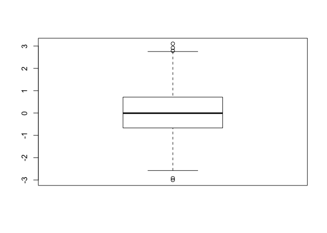
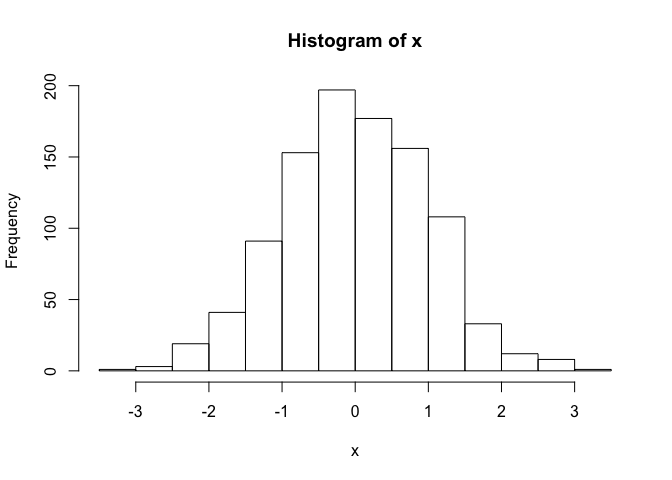
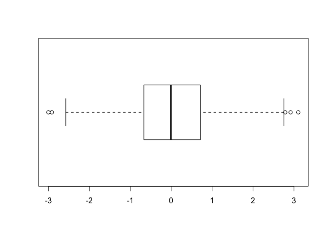
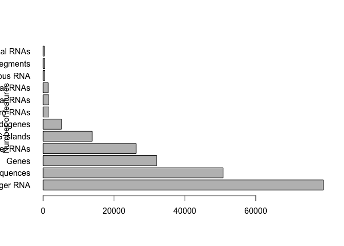
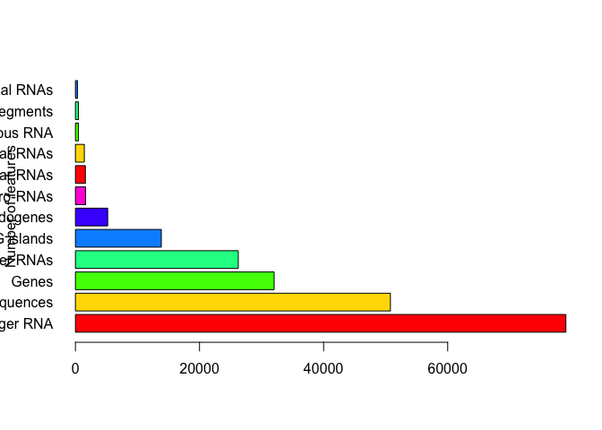

class 5
================
Susanti Sarkar
January 24th, 2019

R Markdown
----------

``` r
#' Class 5
#' This is some test and I can have *bold* and *italic* and `code`


#My first boxplot
x <- rnorm(1000,0)
x
```

    ##    [1]  0.378245085  0.661166934 -0.171004946  0.497082247 -0.650678233
    ##    [6]  1.071544874 -1.201205679  1.295504616 -0.093988257  0.012804816
    ##   [11]  0.349278600  0.721254310 -0.120831837  0.534686677  0.354321010
    ##   [16]  0.859256693  2.689260441  0.839266210 -1.501726616 -1.837595280
    ##   [21] -0.257453524  0.867450820 -0.336886652 -0.791298109 -1.213710759
    ##   [26]  0.189301864 -0.008205164  0.613456248 -0.375582657  0.277831126
    ##   [31]  1.051542511  0.258918756  1.167072515 -0.631335851  1.003844656
    ##   [36]  0.294667250 -1.897799665  1.179993268  0.789938806 -0.216336241
    ##   [41]  2.664971586  0.368541390 -0.568990733 -0.627830586  0.463325259
    ##   [46] -0.154985280  0.029476530  0.585103796 -0.960106670 -0.256015688
    ##   [51]  1.123440379  1.524616263 -0.759180649 -0.153725736  0.276629967
    ##   [56]  1.211938590 -0.742331692 -1.309442447  0.735886383  0.418236617
    ##   [61]  1.171948450  0.849595736 -0.430819151 -0.450868178 -1.802797302
    ##   [66] -0.258458770 -1.568313474 -2.315994411  0.547238593 -0.817499663
    ##   [71]  2.754005279  0.975744370 -0.886697968  0.424360346 -1.188782071
    ##   [76] -0.433382366  1.752865303 -0.013675150 -0.099596193 -0.908049974
    ##   [81]  0.105790019 -1.076973117  0.638762010 -0.742969779  1.072774937
    ##   [86] -0.330781293  0.333319369  1.140786986 -0.035382861  0.646007918
    ##   [91]  1.495161243 -2.333404998 -0.154544656  0.321002736 -1.296200481
    ##   [96]  0.181811974 -1.400967474  0.386286802 -0.104700937 -1.322190729
    ##  [101] -0.451382267  0.788229495  0.071653014  0.107098890 -0.614765185
    ##  [106]  1.182757091 -1.293513924 -1.021828278  0.263488073 -0.500704548
    ##  [111] -0.516372957 -0.660452948  1.153556866 -0.137760911  0.951735325
    ##  [116]  0.115891783 -0.069790311 -0.332950831 -0.617951740 -0.884983364
    ##  [121]  0.688307712  0.815562544  0.587206401 -0.855809784  0.374150425
    ##  [126] -1.136419892 -0.328484164  0.721245895 -1.048639889 -1.932289435
    ##  [131] -0.684302030  0.600469178  0.876477100 -0.629955624  1.297324404
    ##  [136]  0.467293188 -0.378264831 -1.494630920 -0.086646360  1.630062918
    ##  [141] -0.303099875 -0.721379150 -1.260674084  0.716034516 -0.778779701
    ##  [146] -0.313299144  1.777400790  1.782275314 -0.393303884 -1.901312244
    ##  [151] -0.843841984  0.709631974 -1.291925884  0.206387897 -0.339380787
    ##  [156]  0.174197776  2.917622496 -0.226885912 -1.001089128  1.749152100
    ##  [161]  0.773935125  0.438313715  1.628752907  1.604314926 -1.286900867
    ##  [166] -0.848862256 -1.367192254  0.193471934 -0.750510713  0.999969044
    ##  [171] -1.006590063  0.508221923  2.352025552 -1.383433674  1.079706589
    ##  [176]  1.486169147  0.069799860  0.350737183  0.721832225  1.425771264
    ##  [181]  0.015897462 -1.012477467 -0.341988701 -0.464557450 -0.216229793
    ##  [186] -0.800786054  1.470190558  0.849460021 -1.802729915  0.169074415
    ##  [191] -0.439061290  0.882430083  0.984947773  0.585380527 -1.580467159
    ##  [196]  0.462798812  0.430240316 -1.128041833 -0.725122465 -2.415793648
    ##  [201] -0.043325355  1.734950040  0.928723172 -0.352658540 -1.491942283
    ##  [206] -0.670868638 -1.143845604 -1.420507726 -0.955656664  0.235938929
    ##  [211]  0.532729328  1.092655779 -0.305544053  0.134160939 -2.576195646
    ##  [216]  1.393892793  0.429757768 -0.004120930 -0.840333776  0.596939626
    ##  [221]  0.148199031  0.847585180  0.580736047  0.279182702 -0.223786732
    ##  [226] -0.737725369 -0.367409918  0.944567754 -0.505867553  0.216104517
    ##  [231] -0.582843721  1.085853394  1.793288258  0.630652921 -0.675243598
    ##  [236]  0.847670352 -1.909928783 -0.462671943 -0.135116083 -0.492534287
    ##  [241] -0.074448029 -0.072553875  0.424609535  0.803309166  0.007482169
    ##  [246] -0.401274539  0.144197257  0.033653096 -0.892092193 -0.061613412
    ##  [251]  0.482352075 -0.238470322  1.164049967 -0.244096598  0.393155263
    ##  [256]  0.288026653 -0.115067434 -1.217206736 -1.144506625  0.328965320
    ##  [261] -1.922372084 -1.320386644 -0.557170502  0.941772626  0.171754230
    ##  [266] -1.490934565 -0.107684765 -0.420942851 -0.932179623  0.825825492
    ##  [271]  0.551805255 -0.096910521 -0.814063930  0.988204590  0.509965980
    ##  [276] -0.353850816 -0.296225754 -1.473759924 -1.092271880  0.249754960
    ##  [281]  0.275787145 -0.683379985  0.442663295  1.516793633 -0.139230860
    ##  [286]  0.533609162 -2.409368097 -0.751007677 -0.657463680 -0.386095937
    ##  [291]  0.217674537 -0.583781196 -0.869645282 -0.276805182  0.375750774
    ##  [296]  0.404891142  2.195449667  2.576509799 -0.625856316  0.303858441
    ##  [301] -0.707148955 -1.443347880 -0.305324186  0.895800375  1.138815577
    ##  [306] -0.545241009  0.106803110  0.411738808 -0.395766051  0.800755059
    ##  [311] -0.110074215  0.544298196  0.125701857 -0.974190610  0.903914891
    ##  [316]  1.415382050 -0.491836902 -1.070601162  1.447272434  1.095226091
    ##  [321] -0.625562314  1.296489969 -0.346150864 -0.113271297 -1.512600673
    ##  [326]  1.325561399  0.569646017  1.440407232  0.872948677  2.011632128
    ##  [331] -0.982221642 -0.938287767  0.219151528 -0.960354068 -0.745564849
    ##  [336] -0.636409477 -1.359216404 -0.590396633 -1.139977163  0.432727436
    ##  [341] -0.573062281 -2.548473453 -1.370811484  0.324304121 -0.060293208
    ##  [346] -0.857886667  0.671790179  1.184971624 -1.882111866  0.867265477
    ##  [351] -0.231066821  1.465213762 -0.077990076 -0.014365039  0.101123649
    ##  [356] -1.160812078  0.205865790 -0.160633902  0.405748942  0.585780194
    ##  [361] -0.310485537 -0.215759072 -0.596518918  0.892526201 -1.200731780
    ##  [366]  2.437085592 -1.613780177 -0.239739681  1.029189264  0.255310002
    ##  [371] -0.378830901 -0.332173398 -0.032854617 -1.510409514  0.231984322
    ##  [376] -2.130658997 -0.153807467  1.100657436  0.224518887  2.045348183
    ##  [381]  0.857544893 -1.735344232 -0.384295395  0.366677696 -0.835563557
    ##  [386] -0.156944888 -0.867876259  0.417095194 -1.065589660 -1.135591970
    ##  [391] -0.162849043  0.817741185  1.516807184  0.954935288 -1.540948714
    ##  [396]  0.288996506  0.456262633 -0.113956588  1.044267400 -0.286624242
    ##  [401] -0.468109850 -0.508665150 -0.901063481 -0.652639871  0.842905784
    ##  [406] -1.431167030 -0.191003217 -2.493573589 -0.393427264  1.175863697
    ##  [411]  0.274123751 -0.961609205 -0.667191638  0.769571259  0.554627229
    ##  [416]  1.424270329 -0.024089835 -3.000513460 -1.177399816 -0.477084746
    ##  [421] -0.483717162  0.878653870  1.835588014  0.359389947 -0.635204929
    ##  [426] -1.478086151  0.565193307 -1.190177810 -0.008916810 -0.996583153
    ##  [431]  1.059952127  0.543972906  0.358943258 -0.247163011 -0.034659191
    ##  [436] -0.723378178 -0.209613416  0.989116134  0.031925524  0.062699027
    ##  [441] -1.253285310  1.410338448  1.050226385  1.572027728  0.240550631
    ##  [446]  1.288142404 -0.750407860 -0.700935323 -0.011998947  0.795557282
    ##  [451]  0.902886119 -1.167433349  1.018680212 -0.164083307 -0.885229866
    ##  [456]  1.594004230  1.927272532 -0.314423267 -1.282112162 -0.762310157
    ##  [461] -0.406243670  0.174677713 -0.835782863  1.677621915 -0.645833744
    ##  [466] -0.100544452  0.973229777 -0.023297629 -1.271080242 -0.810365702
    ##  [471] -2.329656760  0.013056448 -0.732711611  0.073654183 -0.228686429
    ##  [476] -0.539687955 -0.619092728 -0.194337279 -0.882365134  0.847745730
    ##  [481] -1.079433326 -0.488499893  0.367123441 -0.580551366 -0.456819826
    ##  [486]  1.608649196  0.303045035  1.385014208 -1.017468464 -0.211469602
    ##  [491]  1.309995851 -0.064582767  0.459886218  0.527126667  0.109643598
    ##  [496]  0.376273477 -0.305511697  0.858931043 -1.135136891  0.059446522
    ##  [501] -1.961301951  0.667924259 -0.476406121  0.197007333 -1.221548984
    ##  [506]  1.162276545 -1.144482400  0.229442415  1.275741147  0.598776768
    ##  [511] -0.438580216 -0.161440620  0.155065665 -0.412524445  0.543087458
    ##  [516]  1.292235086  1.234307744 -0.378952178 -0.365370734 -2.227187230
    ##  [521] -0.171983630  0.442321580  0.157557293 -1.194442367 -2.049317813
    ##  [526]  0.269992409  2.288638940 -1.658779241  0.331343653 -0.218044603
    ##  [531] -1.597376565 -0.685330810 -0.546729106 -1.961669167  2.056206949
    ##  [536] -0.280067767  0.809778974  1.234384268  1.041647107  0.460111017
    ##  [541]  1.533391457  1.617515679  0.523807875  1.074089398  0.127071241
    ##  [546] -0.331637196 -0.870601290 -1.553066212 -1.168931937 -0.961422963
    ##  [551] -0.120448051  1.013779820  0.258031855  0.967385110  2.022637856
    ##  [556] -0.602076359 -0.403409993 -1.207535688 -0.357558294  0.797393098
    ##  [561] -0.832069074  0.723205087 -0.588344494 -0.902396969 -0.568614034
    ##  [566]  0.786438984 -0.756130993 -2.116338531 -1.579696888  1.267553931
    ##  [571] -0.061584711 -1.649130031 -0.450394340 -0.526912325  0.681571906
    ##  [576]  0.575199608  0.771614548  1.144127152  0.079051814 -0.806113248
    ##  [581] -0.073632032  1.187233709 -0.442361098  0.604306488 -1.320439911
    ##  [586] -0.859118906  0.788721587 -0.002397427  0.891173316  0.948666222
    ##  [591] -0.584521763  0.693608425 -0.767153922  0.286201469  0.903079269
    ##  [596]  0.648979688 -0.204692717 -0.787630671  1.287880972  0.365446805
    ##  [601] -1.240734231  2.226421868 -0.502611316  0.683537295 -1.281910981
    ##  [606]  2.506301105  0.964101438  0.687028773  0.098262682  0.669409576
    ##  [611]  2.038177858  1.457760031 -0.074017678  0.752591373 -0.729284021
    ##  [616] -2.303644913 -0.566652800 -1.362087789 -0.064506399  0.022064830
    ##  [621]  0.130972980  0.623307107  1.156418618 -2.316861101 -1.350825265
    ##  [626]  1.027302588  0.858355661  0.557719948 -0.529421727 -0.642696757
    ##  [631] -0.414249224  0.732673363  0.140655798 -0.572820248  0.690948124
    ##  [636]  0.268958394  2.786388734  1.272978458  0.475688192 -0.525451316
    ##  [641]  0.697186773  0.756175384  0.139532506 -0.407160979 -0.014462641
    ##  [646]  0.213717373 -0.914929146 -0.175417624  0.328364074  0.487294115
    ##  [651] -0.836524273  0.951897633  1.395152541 -0.559094447  0.599271108
    ##  [656]  0.800507129 -0.263632095 -1.151246822 -0.147155765  0.348530355
    ##  [661]  0.621772977 -1.494503475 -0.503994507 -0.766446403 -0.363077808
    ##  [666] -2.179439501  1.368033955  0.726293666 -1.665361918 -2.066173308
    ##  [671]  0.632592129 -0.422894491 -1.926178049  1.169788323 -1.871846353
    ##  [676] -1.312253080 -0.494382967 -1.139237806  1.022298849 -1.278654324
    ##  [681]  1.227515017  0.351089057  0.133119955 -0.381002257  0.122404014
    ##  [686] -1.298244899 -0.382606320  1.020841578  0.171106885 -0.388657623
    ##  [691]  0.652487112 -1.516905356  0.926077942 -0.084301945  0.257128196
    ##  [696] -1.012272849 -0.343332494  0.822846906 -0.400685693  0.384444426
    ##  [701]  0.383158466  0.971140184 -2.917937820 -0.961387882 -1.121962686
    ##  [706] -0.773309005 -1.198282954  0.102650544  0.199709566  1.478361620
    ##  [711]  0.410030992  0.582675508 -1.390441826  1.319171793  0.420623196
    ##  [716]  0.427875434 -1.003214259 -1.663182719 -0.317758430  1.362659509
    ##  [721]  1.108277945  0.383792568 -0.829847795  1.340896264 -0.667332850
    ##  [726] -1.920205508  0.395384183 -0.177672178  1.196206843 -0.005914557
    ##  [731]  2.295735361 -0.878204678  1.659579494 -0.232672346 -0.264157109
    ##  [736]  0.113113507 -0.009064707 -0.599657538 -0.187654439 -1.521212030
    ##  [741]  2.545696190  0.363540755 -0.084820024  0.658060022  0.007746438
    ##  [746]  1.635841299  1.180172413 -1.075247322 -2.058345547  1.406797499
    ##  [751] -0.508625043  1.704035132 -0.761866331  0.413652465  0.365917905
    ##  [756]  0.805643706  0.554115139  0.126728974 -1.636126216 -0.344856968
    ##  [761] -0.278993737 -0.846074793 -0.463396063  0.427935996  0.498960362
    ##  [766]  0.104825240  3.106402034 -0.701632342 -0.960963294  1.239208310
    ##  [771]  1.918817775  0.911129042  0.646954925 -1.504060076 -1.141388873
    ##  [776]  1.020752937 -1.166654402  1.316738898  1.486558621 -1.665693402
    ##  [781]  0.861452656 -0.669964730  0.320729802 -0.215052011 -1.063275331
    ##  [786]  1.319203736  0.073115978 -0.173880700 -1.247282504  0.321017371
    ##  [791]  1.059729757  1.027863461  1.722352011 -0.345017560 -0.152786631
    ##  [796]  0.515120839  0.654236808 -0.461004557 -0.534064438  1.950128132
    ##  [801]  1.827257466  1.428658939  0.850460083  0.167518433 -0.816312647
    ##  [806] -0.477122799  0.488358719  0.736949438 -0.069380326  0.306161961
    ##  [811] -0.971433177  1.032393382 -0.104492170  1.109543556  0.053603133
    ##  [816] -1.580353134  0.618328987  1.004543961 -1.361449754  0.213026988
    ##  [821] -0.900849797  0.633416210 -0.654998939 -1.884506895  1.382207474
    ##  [826] -1.343589335 -0.999891793  1.458521516 -0.260063439 -1.374834310
    ##  [831] -0.104773372 -0.582358917 -0.655812584  0.484258543 -1.372301454
    ##  [836]  0.033117732 -1.063784468  1.218933311  1.321474556  0.132660668
    ##  [841]  0.931136636  0.654129336 -0.028310188  0.742530945  0.141844705
    ##  [846]  0.064916733  0.693783298  0.730469113  0.401579256  0.559720398
    ##  [851] -1.751804934  1.003622904 -0.806988329  0.220188892 -0.427005441
    ##  [856] -0.577320832  0.946795920 -0.071246872  0.667993167 -0.257144519
    ##  [861] -0.753103889  0.279622696 -0.953988705 -0.265430493 -0.696086515
    ##  [866]  1.240644608  2.309614104 -0.312345741 -0.119579521  0.609335994
    ##  [871] -0.771969322  0.972434358  0.738354268 -0.090979357 -0.724727784
    ##  [876]  0.398504884  0.002398284 -0.272578080  0.378096359  1.781936188
    ##  [881]  0.784495245  1.411441303  0.984485768  0.112470833 -0.685597552
    ##  [886] -0.153303230 -2.458401335  1.271741226  0.163666465  0.085564729
    ##  [891] -1.613172123 -0.793547940  1.445043549 -0.117916081  0.238670481
    ##  [896]  0.513900211 -2.422152847 -1.027471515  0.279040043  1.283446632
    ##  [901]  0.440825325  0.377359512 -0.172680016 -2.316349232 -0.131104980
    ##  [906] -0.272092393  1.117759004  0.901558931  1.631179234  1.047535731
    ##  [911] -0.385310409 -0.072310523 -0.696379516  0.664618533 -0.816776632
    ##  [916]  0.354273309  0.823218711  1.477446249 -0.004659198 -0.669064077
    ##  [921]  0.620576629  0.559236451  1.067436068  0.322100452 -0.832023613
    ##  [926] -0.634682026  1.064869892  1.030953763  1.264440726  1.720970828
    ##  [931]  0.532262059 -0.572213427 -1.306693712  0.149516271  0.425379781
    ##  [936] -0.465183826  1.992488148 -0.355032021  0.858176079 -0.212558290
    ##  [941] -0.001581149  0.180462480  0.177134828 -1.814478762  1.616963240
    ##  [946]  0.292140926 -0.103035429  1.691398511  1.033034263 -0.120296176
    ##  [951] -0.358263344 -0.848362731 -0.644537235  0.347739040  0.788822251
    ##  [956]  1.379490553 -0.315844389  0.571382067  0.253991167 -0.297383990
    ##  [961] -0.867276052 -0.477271614 -2.021379666 -0.587515120 -1.449131395
    ##  [966]  0.479032898 -1.113318886 -0.039952179  0.033567629 -1.434379315
    ##  [971] -0.814645587  1.199710646 -1.342097886 -1.613351394 -0.106807987
    ##  [976]  1.048550911 -1.104226705 -1.926053871  0.721090768 -1.022264969
    ##  [981]  0.179299540 -0.824084855  1.136058836 -0.308268809 -0.571949985
    ##  [986]  0.869565288  0.642071059  0.152508914  0.144202796 -0.352268596
    ##  [991] -0.467912230 -0.696753147  0.271552528 -1.120777053  0.943911900
    ##  [996] -0.595292656 -0.811684111  0.755309331  1.133575014 -0.402260931

``` r
boxplot( x )
```



``` r
summary(x)
```

    ##      Min.   1st Qu.    Median      Mean   3rd Qu.      Max. 
    ## -3.000513 -0.667766 -0.007060  0.004688  0.711233  3.106402

``` r
hist(x)
```



``` r
boxplot(x, horizontal = TRUE)
```



``` r
# hands on session

b <- read.table("weight_chart.txt", header = TRUE)
b
```

    ##    Age Weight
    ## 1    0    3.6
    ## 2    1    4.4
    ## 3    2    5.2
    ## 4    3    6.0
    ## 5    4    6.6
    ## 6    5    7.2
    ## 7    6    7.8
    ## 8    7    8.4
    ## 9    8    8.8
    ## 10   9    9.2

``` r
plot(b, type="o", pch=15, cex=1.5, lwd=2, ylim=c(2, 10), xlab = "Age (months)", ylab = "Weight (kg)", main = "Baby Weight with Age")
```


``` r
mouse <- read.table("feature_counts.txt", header = TRUE, sep = "\t")
barplot (mouse$Count, ylab = "Number of features", horiz = TRUE, names.arg = mouse$Feature, las=1)
```



``` r
# Change margin so we can see the labels 

#add some color
barplot (mouse$Count, ylab = "Number of features", horiz = TRUE, names.arg = mouse$Feature, las=1, col = rainbow(7))
```



``` r
# Section 3A
gender <- read.table("male_female_counts.txt", header = TRUE, sep = "\t")
barplot(gender$Count, names.arg = gender$Sample, las=2, col=rainbow(nrow(gender)), ylab = "Counts")
```


``` r
barplot(gender$Count, names.arg = gender$Sample, las=2, col=c("blue", "red"), ylab = "Counts")
```


``` r
# Section 3B
gene <- read.table("bimm143_05_rstats/up_down_expression.txt", header = TRUE)
```

Note that the `echo = FALSE` parameter was added to the code chunk to prevent printing of the R code that generated the plot.
