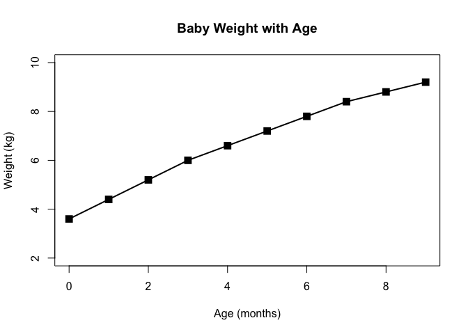

class 5
================
Susanti Sarkar
January 24th, 2019

R Markdown
----------

``` r
#' Class 5
#' This is some test and I can have *bold* and *italic* and `code`


#My first boxplot
x <- rnorm(1000,0)
x
```

    ##    [1]  0.1149033644  0.0812421818 -2.3489729230  0.0789475775
    ##    [5] -0.0404563627  1.4035973317 -1.2795607848 -0.0803183362
    ##    [9] -1.2752108486 -0.9103617721  0.7221496683 -0.6962774296
    ##   [13] -0.2402514626  0.0579714043 -1.6371253766 -0.1589475287
    ##   [17] -0.5594302635  0.7936275239  0.9625381395  1.1990738809
    ##   [21]  0.5946978190  0.7850225836 -1.1711723700 -0.2263706604
    ##   [25]  0.3372784594 -0.5321572923 -0.9849648532  0.2626865805
    ##   [29]  0.5993002766  1.9608260744  0.5448157215  0.1305230176
    ##   [33]  1.8021009110 -0.2662273802  0.1468591091 -2.0973194316
    ##   [37] -1.4448267214 -1.6848464020  0.3070871153 -0.3595159413
    ##   [41] -1.2776628311  0.1264536249  1.1896533777 -2.0478216378
    ##   [45] -0.8619841237  0.8658056232  0.3394883264 -0.4291446410
    ##   [49] -0.0308993808 -0.2808655407  0.3139878705  0.8947409715
    ##   [53] -0.4080786214 -0.5291270794 -0.7684741174  1.1927384842
    ##   [57] -0.6684622275  0.3113077041  1.2482401142  2.7272078949
    ##   [61]  1.2554970295 -0.2787237338  0.1544758811  1.9096152283
    ##   [65]  0.0939889126  1.6259277559  1.3688405457  0.4086602080
    ##   [69]  1.6410052857  1.7622947031 -1.7492172510 -1.4496899292
    ##   [73]  1.0870749803  0.6037869081 -0.3133469463 -1.3478417486
    ##   [77] -2.4811143609  1.6756879752  1.1374866992 -0.3089812158
    ##   [81] -0.0647818776 -1.5194542030  1.4849084310 -0.1477189430
    ##   [85]  0.1444942052  0.3315809804 -0.7224019391 -0.2307941874
    ##   [89]  0.4620216055 -1.6746389928 -0.9656562305 -0.6705854356
    ##   [93] -1.0439393759 -0.4161309897  0.5759403225  0.3845761040
    ##   [97] -0.8184235248  0.8005038067  0.0833696631 -0.0896437660
    ##  [101] -0.0573544920 -0.1720203048 -0.2474712468  0.1696670537
    ##  [105] -0.0660645426 -0.0390874795  0.2262017500 -1.1128458235
    ##  [109] -0.2538415828 -0.2504822679  0.2511432395 -0.3369460262
    ##  [113]  0.8284314226  0.2772601181  0.1137146588 -0.4029905648
    ##  [117]  0.6308975782 -0.7969270814  0.9052290471 -0.8990817975
    ##  [121]  0.4687669486  0.1519879795  0.4389853291 -0.3060544799
    ##  [125] -0.7135528829 -0.1262811915 -0.0372863721 -0.0623853727
    ##  [129]  0.1799412315 -1.3910626688  0.3964027650  0.1320055805
    ##  [133]  0.7665383760  0.2398197587 -1.1161798114  1.2201533397
    ##  [137] -0.8681499137  0.5194090457 -0.3306170464  0.6097391553
    ##  [141] -1.2052676311 -0.6321184463  0.7976666605 -1.7141729922
    ##  [145] -1.5264248645  0.6418994827 -0.5215813553  1.8809757116
    ##  [149]  0.3567779660  0.7131232373  1.8640194798 -1.0353683531
    ##  [153]  0.1121868259 -1.5277047087  0.2461717278 -0.7059591256
    ##  [157] -1.1297550583  0.2823941230 -1.7844223290  0.2895944175
    ##  [161]  0.4988615754 -1.2782487254 -0.2490695318  0.6520382958
    ##  [165] -0.0185322160  1.6451359055 -1.2537549111 -0.6478983434
    ##  [169] -0.5508110569  0.1733098696  0.1970967854 -0.4544593439
    ##  [173]  0.4148057981  0.3617088558  1.1861965466  1.3348653047
    ##  [177] -0.5653302617 -0.7191226158  1.7980736513 -2.0981136775
    ##  [181] -1.4723661265 -1.3973959690 -1.8415173317  0.4273510151
    ##  [185]  1.3179342603  0.2043976730 -0.8183518799 -0.4604644153
    ##  [189]  0.3349788244  0.0013167831 -0.3920509559 -0.0335578889
    ##  [193]  0.7752814188 -0.8348195884  0.4931265887 -0.6783098647
    ##  [197] -1.0218095002  1.2515648139  0.3234836372  0.9549138363
    ##  [201] -0.8984094056  0.7878323697 -1.0848436076  0.4107190270
    ##  [205] -0.4306885998  1.5394666823  0.9219051208  1.2296478953
    ##  [209] -0.9293030189  1.3967492950  0.0448804835  0.9917577184
    ##  [213]  0.5096001445 -1.1127403512 -0.8457567074  0.4837766378
    ##  [217] -0.1209956815  0.9286181665  0.4233893762 -0.1940540042
    ##  [221]  0.6970678986  0.8424488804  0.3995934653 -0.2422546839
    ##  [225]  0.4047700553  0.8943087660 -0.6505219907 -0.0141920532
    ##  [229]  0.5929689267 -1.5935177891 -0.0308243716  0.6040059707
    ##  [233] -2.6525845677 -0.4932849814  1.0431287423 -0.1681759556
    ##  [237]  1.1819136535  0.2867357607  0.0584117839  1.9325934394
    ##  [241] -0.7650505463 -0.1087232325 -0.4417192529  0.6408925735
    ##  [245] -0.3009277468  0.2686910427 -2.1942582680 -0.8484311840
    ##  [249] -0.1990374945  0.3346784998  0.1895505301 -1.5700142934
    ##  [253] -2.0080974274  1.7539081484 -1.4269778992  0.8603898245
    ##  [257]  0.0039180610 -0.5231291045  0.3121207287  0.2024118085
    ##  [261]  1.0393055337  0.7944409732 -1.2221603435 -0.6008267339
    ##  [265]  2.5884980779  0.1835950632  0.9258561433 -0.3147217524
    ##  [269]  0.0215956475  0.1258768003  0.0534443579  0.8128415571
    ##  [273]  0.8187318421 -0.8039315233  0.9659448083 -0.1159138626
    ##  [277] -0.0532854613  0.8676783325  0.2044074389  0.6071798655
    ##  [281] -0.6882844101 -0.5921290336  1.1231553974 -0.7318080601
    ##  [285] -1.6350167728  2.0271325502  0.8393669220 -0.4396874906
    ##  [289] -0.8440101258 -1.5239588523  1.5830597345 -0.6851822236
    ##  [293] -0.7863283545  0.1565736564 -1.4347682800 -1.7039009940
    ##  [297] -0.9477641966  0.9555547444 -0.0854954565 -1.7191315500
    ##  [301] -0.5170228568 -0.3211283923 -1.1558751420  1.2255073023
    ##  [305] -0.8014674763 -0.9366212885  0.2977942601 -0.6710171055
    ##  [309]  1.0124809831  1.6526402842 -0.2168673216  0.6960829805
    ##  [313] -1.8548150233 -0.5064289284 -0.7441645064  0.3178461717
    ##  [317] -0.0298106163  1.9364648615 -2.1378599710  0.2970717081
    ##  [321]  0.0182003953  1.3365310251 -1.5740118665  0.0714946449
    ##  [325]  1.4885220492  1.1906869130 -0.7415776468 -0.9682135108
    ##  [329] -0.3376601833 -1.0589097845 -0.3188796853 -0.0620816547
    ##  [333] -1.0535832229 -0.3766769154  0.9717732501 -0.2149174734
    ##  [337] -1.8051836813  0.5249855542  1.4884789169  0.5321748206
    ##  [341] -0.4087406403  1.6401732178 -0.9229997834 -1.3149316162
    ##  [345]  0.6552576917  1.1714478522  1.3615572630 -2.3209048976
    ##  [349]  1.2019779220 -1.4989263624  0.5774446416 -1.6746394063
    ##  [353] -1.3679691961  0.7018763095 -0.2943907344  0.4715665006
    ##  [357] -2.0503415592 -1.4702065403 -0.0837984100  0.2754533048
    ##  [361]  0.8692193843 -1.8351896588  0.2476238380 -0.4629352048
    ##  [365]  0.2389095179  0.8021074710  0.6349626827 -0.1892296267
    ##  [369]  0.8045427219  1.2167604988  0.2439770135 -0.1250656141
    ##  [373] -0.3334264629 -1.1032495137 -0.0963832140  0.6975897346
    ##  [377]  1.1246061028  0.9777100095 -1.1764991630  1.0176044854
    ##  [381]  2.1980398675 -1.0970124222 -0.1870824577  0.2659915451
    ##  [385] -2.5304546298 -0.0474942437 -0.3619225554  2.4583166415
    ##  [389] -1.8567433569  0.7183935979  1.7711367427  0.5742106545
    ##  [393]  0.6322884026  0.6797281253  0.6047164946 -0.8825155361
    ##  [397] -0.9229405456  0.5929366573  0.5207111324 -1.0903922157
    ##  [401]  0.0005972554 -0.3444750394 -0.3277921295  0.5307920883
    ##  [405]  1.5155801545  0.3604136417  0.3347106365 -0.1072529218
    ##  [409] -0.0254934159  2.1866412112 -1.2036972614  1.2967476535
    ##  [413]  1.8307331728  0.1510139383  0.1032099596 -1.8638239564
    ##  [417] -0.3532055539 -0.5777202960  0.1506987877  0.9192179518
    ##  [421]  0.5256863860 -1.0165898069 -0.1976701167 -0.3842723189
    ##  [425] -0.4794452802 -0.9682514536  0.1372673943  1.3428019449
    ##  [429] -0.4846210997  1.4033152619 -0.3133995639 -0.2119609393
    ##  [433]  0.5705755706 -0.3934927887 -0.4442872655 -0.9031273413
    ##  [437] -0.0378885692 -1.8065510478  1.1135844900  0.9937538468
    ##  [441]  1.8641976627 -0.4576379999  1.3279573241 -0.9619860739
    ##  [445] -0.8407722391  0.2446729977  1.0216037747 -0.4758553903
    ##  [449] -0.8031552095 -1.0116502351 -0.8252036779  0.1301407102
    ##  [453]  0.8085636816 -0.3348134716  0.7495880424 -0.4370762152
    ##  [457]  0.0696585121 -1.2119684455  1.1683534602  0.4023665106
    ##  [461]  0.2817164230  0.7605418363 -0.2063293643  0.9012517502
    ##  [465] -0.2772719029 -0.3944775911  0.7050843778 -1.4101351334
    ##  [469]  0.3571396417 -0.1652405099  1.7910335483  0.7375209457
    ##  [473] -0.1960570804  0.8314310280 -0.3687104227 -1.6289660542
    ##  [477] -0.7392707202  0.2847840954 -0.3423851898 -0.6341100160
    ##  [481] -1.9660903828  0.5847798817 -1.1751903751 -0.6206199144
    ##  [485]  1.0678585805  1.2080935578 -0.2940801634 -0.9175031392
    ##  [489] -0.5570886835 -0.1356902898  0.9959749394 -1.2385693768
    ##  [493]  1.5392947684  2.1105891085  0.1312492909 -1.5949882682
    ##  [497]  0.5437679696  0.0287951750 -0.0621023829 -1.5678373082
    ##  [501] -1.9727646099 -1.1303545282 -0.6189467438 -0.3438530559
    ##  [505]  0.3345522693 -0.7107557351 -0.2703113537  0.0359673591
    ##  [509]  1.1610538897 -1.0142318290  0.3489212069 -0.6785478220
    ##  [513] -0.6238515990 -2.5232633728 -0.8479877444 -1.7148661872
    ##  [517] -1.8190269218  1.6916991981 -1.4535521739 -1.0875396506
    ##  [521]  1.0743334537 -0.1163695213 -0.6783582711 -3.1651424994
    ##  [525] -2.8782414969  0.3155419261 -0.2853524924 -0.2025130673
    ##  [529] -0.8285206693  0.4387251936  1.3415402546 -0.7667643974
    ##  [533]  0.4538102616 -0.3488669242 -0.0797531308  0.2453016688
    ##  [537]  0.0793710350  0.7553949392  0.2433728885  1.4882399258
    ##  [541] -0.3366593390 -0.8834831440  0.6438448003  0.8064265452
    ##  [545] -0.3107838499  1.7693782947  0.2392248255  0.5905537015
    ##  [549]  2.0758275896 -0.8736007648  2.2531643670  0.4777562808
    ##  [553]  0.7578148788 -2.7462824882 -0.7972756702 -0.4247207275
    ##  [557]  2.4856775635  1.0369970490  0.2742379693 -0.0926078260
    ##  [561] -0.5124497381 -1.0164106716  0.9226730630  1.2193848992
    ##  [565]  0.7040019414  0.3840990832  0.5995010186  0.7292297466
    ##  [569] -0.3762972142 -1.3670229370  0.2249305375  0.0806957351
    ##  [573]  0.0391653642 -0.7906325205  0.3500601982 -0.9921112442
    ##  [577]  0.5861584551  0.7358693521  0.1436627277 -0.5252539034
    ##  [581]  0.7866038245  0.6650748135 -0.1678998816  1.2366033446
    ##  [585] -1.8133031959  1.9418176259  0.8436106373 -0.6004143223
    ##  [589]  0.4030466190  0.2772488184  0.6625605207  0.0611988550
    ##  [593]  1.4685733849 -1.7455546997 -0.5725182555  1.0092147708
    ##  [597] -0.1257080539 -0.0378169209 -0.9195628949  2.3587909885
    ##  [601]  1.8293386551 -0.4066585530 -0.9534070660 -1.7429822660
    ##  [605]  1.1842853051  0.7367617818  1.3099469364 -1.4332250999
    ##  [609] -0.6301813468 -0.6658585880 -0.6474616341 -0.5370798948
    ##  [613]  0.6519200165 -0.0572119165  1.2748415784  1.4408850424
    ##  [617] -0.0175678571  0.4828347185  0.1144969905  0.2396689605
    ##  [621]  2.4947510181 -0.5729038901 -0.2258053823 -0.4826963555
    ##  [625] -0.0133996158 -0.2692128516 -2.1608304198  0.0536452361
    ##  [629] -0.2251310485 -0.1964552859 -0.9216048590 -0.2257935987
    ##  [633]  1.7653911820 -0.6034713340 -0.7444832862 -0.2406283880
    ##  [637]  0.6406425082  0.9049558559  1.5641502739  0.8669686026
    ##  [641]  2.2304923704  0.2487410251  0.0373025933 -0.2695960678
    ##  [645] -1.0832495122  0.1938045193  0.1228756493  0.6526273060
    ##  [649] -1.3581576331  1.8537072251  1.8969282012  0.1698042598
    ##  [653]  0.9309205019 -1.1544566266  1.7147575416  1.2263411814
    ##  [657] -0.4201320154  1.2905501457  1.3803130742  0.1136926659
    ##  [661]  0.7539832163 -2.1300328525  0.8238437780  0.3830832571
    ##  [665] -0.0482100239 -0.6168988206 -0.2904512117 -0.8164265952
    ##  [669] -0.5329614303  0.6126572995  0.8820311946  0.8604475233
    ##  [673]  0.4415727726  1.4333417054 -1.4484954817  0.7994587036
    ##  [677]  2.1892493170  1.2157860135  1.1448646739  0.0024149458
    ##  [681] -0.5762075598  0.8473619278 -1.1472299516 -0.2774911706
    ##  [685] -0.3846075307  0.1894429268 -0.0748591032 -1.2086740161
    ##  [689]  0.3378124076  1.0244854888  0.2327632266  1.2837771815
    ##  [693]  0.5022087075 -1.0962706736 -0.1016520015 -0.0354497375
    ##  [697] -0.6971329335  0.8425550185 -0.5212049287 -2.8778662855
    ##  [701]  0.7526939227 -1.2968130540 -0.3137923024  0.3298863645
    ##  [705] -0.7845226812  0.2477423789  0.1087758441 -0.4988878042
    ##  [709]  0.7400934060 -1.1735980901  1.1124138748 -0.4266383400
    ##  [713]  0.1220565763  1.1320584164  0.6939477904 -1.1608146291
    ##  [717] -0.6090666738  0.1120687584  1.1207287960  0.1767606535
    ##  [721] -0.1168994120  0.4893236520 -0.1589000983 -1.7440496958
    ##  [725] -0.8300147146 -0.0201956307 -0.5978105830 -2.0729913799
    ##  [729]  1.1927381969 -1.7167522754 -0.2914566993 -0.5980669711
    ##  [733] -0.7148532483 -1.0038016417 -1.1192707114 -0.1444704071
    ##  [737]  1.1487711974  0.0532163178 -0.4173482918 -0.5278858400
    ##  [741] -0.0126880125  0.0203061055  0.5887540087 -0.2278469024
    ##  [745]  0.6500599250  0.0347385899  0.3362065707  0.3336357290
    ##  [749]  1.5498474272  1.2540282754  0.5268448614  0.3182024660
    ##  [753]  0.8611563814  0.5308829570  0.3185529529 -1.5981295385
    ##  [757]  1.9007104368 -0.6160614688  1.5535834660  1.8975197002
    ##  [761]  1.2634659014  1.1522232103  1.0137106879 -0.0905785182
    ##  [765]  0.0930263632 -1.1010584411 -0.4187593361  0.1009464653
    ##  [769] -0.9218788586  1.0284146385 -1.1543528234 -1.7531118044
    ##  [773]  0.6452825426 -0.6551230303  0.3110250907 -0.4156586293
    ##  [777] -0.8308285073  0.6960287518  0.6564275050  1.4903041188
    ##  [781]  1.2414501920 -0.5084301751 -1.0966938578  0.2805075320
    ##  [785] -1.4962813313  0.5766549237  1.1712353184  0.3848302697
    ##  [789]  0.1210307354  1.1609106772  0.2179035372  1.9054574404
    ##  [793] -1.0747216005  0.4098717596  0.0956243920 -1.3508109862
    ##  [797]  0.7268538338 -0.2960112476  0.6261784368 -0.5318644552
    ##  [801]  1.2445325809  0.5487241519  0.5694374415 -1.9663556283
    ##  [805] -0.7688503358 -0.8477809934  0.6478333734  1.2495082520
    ##  [809]  0.3614772011 -1.4071080235 -0.6460774409  1.0883182357
    ##  [813]  0.8027780906  1.3722616007  0.4442482547 -1.9496663239
    ##  [817]  1.6959300488 -0.7650023001  1.3934497613 -0.9758390751
    ##  [821]  1.2918484529  1.0232583605  0.3873365135 -1.2120953555
    ##  [825]  2.3355261824 -1.6239923712 -0.2012568505  0.2186157418
    ##  [829]  1.2233317860 -0.8387596893  1.5926029355  0.9680519346
    ##  [833] -1.2952956981  0.2172566947  1.2411821123 -0.9877672117
    ##  [837]  0.2146664164  0.4530938320 -0.1873615178 -1.6336798521
    ##  [841]  1.1936880814  0.3745449780 -0.6799293323  0.1568635659
    ##  [845] -0.9042907539 -0.2545926678 -1.0189678908 -0.3128928067
    ##  [849]  1.1411977916  0.3273733564 -0.4398166034 -1.1290711697
    ##  [853] -0.7693329618 -1.1690946659  0.0392821700  0.4857649539
    ##  [857] -0.5171342820  1.1788718064 -0.7683010852 -1.7818935530
    ##  [861]  1.0084483390 -0.1473930334  0.9871787111  0.5744609948
    ##  [865] -0.1159684446  2.0025695137  0.2904918615 -0.0353920227
    ##  [869] -0.1516188842  0.1307861231 -0.8243442233 -1.6855497284
    ##  [873]  0.7515211955  1.0736841897 -0.0564220418  1.1297060656
    ##  [877]  1.9269896824 -0.0234435267  0.1249766508  0.0056631817
    ##  [881] -0.1920291632  1.9093291354  1.8641808853  0.3441785000
    ##  [885]  0.2712107036 -1.1570499170  1.3470584971 -0.3783178639
    ##  [889]  1.7589733337 -1.0477590022  0.0421645462 -0.8968118970
    ##  [893]  0.5462370620  0.1366186129  0.6244820895 -0.2192680291
    ##  [897]  0.9139016433  0.0522614850  0.2635636585  0.6526848681
    ##  [901]  0.8831397322  0.1184426074 -0.5123201497  0.4036844276
    ##  [905] -0.8918011380 -0.5165878853 -0.5297678204 -0.2317761063
    ##  [909] -0.0427117004  0.2212028179  0.3551525116  2.1379412531
    ##  [913]  0.7305189830 -0.6924825678 -0.1384156993  2.1366649090
    ##  [917] -1.2661808926  0.3759663113  0.6268142261 -0.0765509331
    ##  [921] -0.5221136408 -0.2355064320  0.7712641355  0.1719226798
    ##  [925] -0.9019063422 -0.7525093685 -1.5663997972  0.1748713485
    ##  [929]  0.1846653695  2.1992903721 -0.3691930741 -0.3268758340
    ##  [933] -0.1850536176  1.6854196254 -1.0811345213 -0.5823675958
    ##  [937]  1.5525412824  1.8541200156 -0.7177899242  0.6033291915
    ##  [941]  1.7405330463 -0.7614223273 -0.1016583615  0.2724936299
    ##  [945]  1.1609421444 -0.3729984134 -0.5398825377 -0.1498207563
    ##  [949]  0.7905120916  0.0823530387  0.8097506976  0.5292356194
    ##  [953] -1.7501006366 -0.4015504895 -0.3468608477 -0.3850177455
    ##  [957]  1.3957137898  0.9042054366 -0.9019355431  0.9773479305
    ##  [961] -1.1291651955  0.2790214753 -1.9635167466  0.5007203707
    ##  [965] -1.2006793392 -0.5267976270 -1.1469401729  0.6396673656
    ##  [969]  0.6018336203 -0.7099691601  1.6407824852 -1.5689399158
    ##  [973]  0.7280903324 -0.3041921134  1.8934150557 -0.2983938124
    ##  [977]  0.1851371763  1.1069773089  0.1179505672 -0.5115955616
    ##  [981] -0.0506053319 -0.9735385177 -0.1208603336 -1.1092836232
    ##  [985] -1.3600157176  0.0352135611  2.0201278661  1.5864533206
    ##  [989] -0.6553917598  1.6305176725  1.6185590204  0.1295738435
    ##  [993]  0.5898852255  0.6282774308 -0.0831878817  1.8276699436
    ##  [997]  1.6512184326  1.9419911298  1.1409589677  0.8874812958

``` r
boxplot( x )
```


``` r
summary(x)
```

    ##     Min.  1st Qu.   Median     Mean  3rd Qu.     Max. 
    ## -3.16514 -0.63067  0.05355  0.04113  0.72716  2.72721

``` r
hist(x)
```


``` r
boxplot(x, horizontal = TRUE)
```


``` r
# hands on session

b <- read.table("weight_chart.txt", header = TRUE)
b
```

    ##    Age Weight
    ## 1    0    3.6
    ## 2    1    4.4
    ## 3    2    5.2
    ## 4    3    6.0
    ## 5    4    6.6
    ## 6    5    7.2
    ## 7    6    7.8
    ## 8    7    8.4
    ## 9    8    8.8
    ## 10   9    9.2

``` r
plot(b, type="o", pch=15, cex=1.5, lwd=2, ylim=c(2, 10), xlab = "Age (months)", ylab = "Weight (kg)", main = "Baby Weight with Age")
```



``` r
mouse <- read.table("feature_counts.txt", header = TRUE, sep = "\t")
barplot (mouse$Count, ylab = "Number of features", horiz = TRUE, names.arg = mouse$Feature, las=1)
```


``` r
# Change margin so we can see the labels 

#add some color
barplot (mouse$Count, ylab = "Number of features", horiz = TRUE, names.arg = mouse$Feature, las=1, col = rainbow(7))
```


``` r
# Section 3A
gender <- read.table("male_female_counts.txt", header = TRUE, sep = "\t")
barplot(gender$Count, names.arg = gender$Sample, las=2, col=rainbow(nrow(gender)), ylab = "Counts")
```


``` r
barplot(gender$Count, names.arg = gender$Sample, las=2, col=c("blue", "red"), ylab = "Counts")
```


``` r
# Section 3B
gene <- read.table("bimm143_05_rstats/up_down_expression.txt", header = TRUE)
```

Note that the `echo = FALSE` parameter was added to the code chunk to prevent printing of the R code that generated the plot.
